## Introduction

In this notebook, we will explore the [mobility signal](https://cmu-delphi.github.io/delphi-epidata/api/covidcast-signals/safegraph.html) from Safegraph via [Delphi Epidata API](https://cmu-delphi.github.io/delphi-epidata/api/covidcast_signals.html) in a state-level. We also look at intervention data from [State-level social distancing policies in response to the 2019 novel coronavirus in the US](https://github.com/COVID19StatePolicy/SocialDistancing). Also, we specifically look at the time frame starting from **Feb. 2020 to present**. We will cover the following discovery:

* Mobility signal across states over time

* Correlation between case count and future mobility signal

* Lag analysis
  
  * Other signals correlate with future mobility

  * Other signals correlate with future restaurant visit
    
* Variability of policy across states

  * Filtered by mandatory policy
  
  * Distinct Count of State-wide policy across states
  
* Correlation between number of policies and mobility

* Correlation in space between number of policies and future mobility

* Distribution of mobility signals by various intervention across states


```r
library(ggplot2)
library (readr)
library(tidyverse)
library(dplyr)
library(covidcast)
library(lubridate)
library(ggpubr)
library(zoo)
library(tidyr)
library(gridExtra)
library(cowplot)
library(gplots)
library(car)
library(reshape2)

source("code/painter.r")
source("code/loader.r")
source("code/parser.r")
```


```r
STARTDATE <- "2020-02-20"
ENDDATE <- trunc(Sys.time(), "days")
GEO_TYPE = "state" # state-level
GEO_VALUE = "*" # all states
EXCLUDED_AREAS = c("as","gu", "mp","vi") # excluded areas due to small sample size
DT_X = 7 # 	 Time shifts to consider for x
```


```r
data <- load_covidcast_data(STARTDATE, ENDDATE, GEO_TYPE, GEO_VALUE, EXCLUDED_AREAS)

# The fraction of mobile devices that spent more than 6 hours at a 
# location other than their home during the daytime 
# (SafeGraph’s full_time_work_behavior_devices / device_count)
ftime <- data[["full_time_work_prop"]]

#The fraction of devices that spent between 3 and 6 hours at a location other than their home during the daytime (SafeGraph’s part_time_work_behavior_devices / device_count)
ptime <-data[["part_time_work_prop"]]

############## New confirmed COVID19 cases ############

# A composite signal from JHU and USA facts
# New confirmed COVID19 cases on average per 7 days
case_avg <- data$Avg.Confirmed.Case.Count

# Cumulative confirmed COVID19 cases on average per 7 days
cum_case <- data$Cum.Avg.Case.Count
# Cumulative confirmed COVID19 cases on average per 7 days, per 100,000 population
cum_case_prop <- data$Cum.Avg.Case.Count.Prop


########### Death cases ######################

# Number of new confirmed deaths due to COVID-19, daily
death_case <- data$Avg.Death.Case.Count

# Cumulative number of confirmed deaths due to COVID-19
cum_death_case <- data$Cum.Avg.Death.Count

# state restaurant visit number 
new_res <- data$Restaurant.Visit.Count

# Get the doctor visit signal
smoothed_cli<- data$smoothed_cli
smoothed_adj_cli<- data$smoothed_adj_cli
```


## Mobility signal across states over time

We can see that full-time away home signal drops across all the states in April and gradually increase. Part-time away home signal also behave with the same trend. 


```r
p <- ggplot(ftime, aes(x=time_value, y=value)) +
  geom_line(aes(color = geo_value)) + 
  labs(title = "Full-time away home signal", y= "The fraction of mobile devices that spent more than 6 hours other than home")
p
```

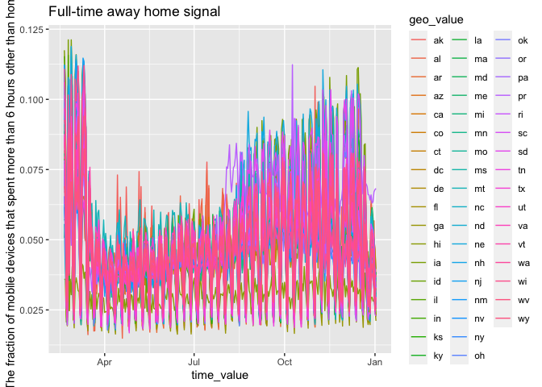
<!-- -->


```r
p <- ggplot(ptime, aes(x=time_value, y=value)) +
  geom_line(aes(color = geo_value)) + 
  labs(title = "Part-time away home signal", y= "The fraction of mobile devices that spent between 3 and 6 hours other than home")

p
```

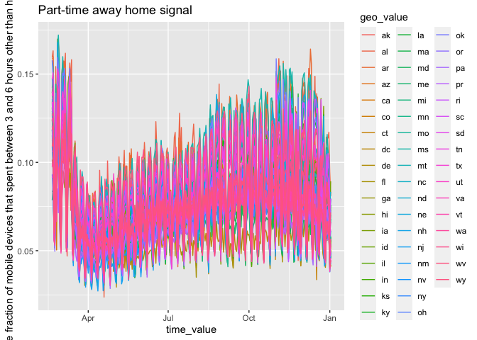<!-- -->

## Correlation between case count and future mobility signal

### Pearson correlation (line chart)

We might be intersted in knowing how case count in the present 7-day average case count signal correlate with mobility signal in the future. We will use [`full_time_work_prop`](https://cmu-delphi.github.io/delphi-epidata/api/covidcast-signals/safegraph.html) as the response variable from now on.

Using the `dt_x` argument in the function [`covidcast_cor()`](https://cmu-delphi.github.io/covidcast/covidcastR/reference/covidcast_cor.html), we can shift the mobility signal by 7 days forward in time, before calculating correlations. We would like to compare a week forward and 2 weeks forward in time with the present correlation. We will plot both the pearson correlation and rank correlation.

We can see that the overall pattern of the correlations are very similar. However, we can see that the correlation increases when the shift is increased. 


```r
cor1 <- covidcast_cor(case_avg, ftime, by = "time_value")
cor2 <- covidcast_cor(case_avg, ftime,  by = "time_value", dt_x = DT_X)
cor3 <- covidcast_cor(case_avg, ftime,  by = "time_value", dt_x = 14)


# Stack rowwise into one data frame, then plot time series
all_cor <- rbind(cor1, cor2, cor3)
# Add labels
all_cor$Shift <- as.factor(c(rep(0, nrow(cor1)), rep(DT_X, nrow(cor2)), rep(14, nrow(cor3))))

# Plot the graph
signal_name = "full-time away home"
p <- ggplot(all_cor, aes(x = time_value, y = value)) +
  geom_line(aes(color = Shift)) +
  labs(title = sprintf("Pearson Correlation between case and future %s", signal_name),
       subtitle = "Average per 7 days, over states",
       x = "Date", y = "Correlation") 
p
```

```
## Warning: Removed 26 row(s) containing missing values (geom_path).
```

<!-- -->


### Spearman correlation (line chart)

We can also look at Spearman (rank) correlation, which is a more robust measure of correlation: it's invariant to monotone transformations, and doesn't rely on any particular functional form for the dependence between two variables.


```r
scor1 <- covidcast_cor(case_avg, ftime, by = "time_value",  method = "spearman")
scor2 <- covidcast_cor(case_avg, ftime,  by = "time_value", dt_x = DT_X,  method = "spearman")
scor3 <- covidcast_cor(case_avg, ftime,  by = "time_value", dt_x = 14,  method = "spearman")

# Stack rowwise into one data frame, then plot time series
all_scor <- rbind(scor1, scor2, scor3)
# Add labels
all_scor$Shift <- as.factor(c(rep(0, nrow(scor1)), rep(DT_X, nrow(scor2)), rep(10, nrow(scor3))))

# Plot the graph
signal_name = "full-time away home"
p <- ggplot(all_scor, aes(x = time_value, y = value)) +
  geom_line(aes(color = Shift)) +
  labs(title = sprintf("Spearman Correlation between %s and cases", signal_name),
       subtitle = "Average per 7 days, over states",
       x = "Date", y = "Correlation") 
p
```

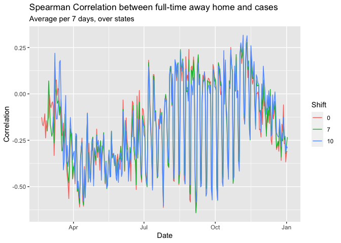<!-- -->

## Lag analysis on covidcast signals

* Next, we can move the signals with various lags to see at what lag one signal is most correlated with the other. 

* In the case of slicing by state, we take the correlation of two times series in each state, one time series is based on mobility signal, another one is based on other covidcast signals (e.g. 7days average case count signal). The mobility time-series will be shifted to n days forward when we compute the correlation. Then, we will take the median of all the correlations we calculated from all the states to plot the graph.

* In the case of slicing by time, let's say for a 30 days shift and we have the data starting from 1/1, then we take mobility signal on 1/31 from each state and the other signal on 1/1 from each state to compute the correlation. Then, we will take mobility signal on 2/1 from each state and the other signal on 1/2 from each state to compute another correlation. We repeat this process to compute the correlation for each day until we don't have data to shift. Then, we take the median of that to plot the graph.

### Other signals correlate with future mobility

#### Pearson Correlation (slicing by state)

In terms of slicing by state with pearson correlation, we see that

* Cumulative 7-day average case count, per 100,000 and Cumulative 7-day average case count have almost exact same pattern of correlation with the future mobility, these signals are most correlated with 37-day-forwarded mobility signal.

* The adjusted doctor visit signal is most correlated with 78-day-forwarded mobility signal, whereas the unadjusted doctor visit signal is most correlated with 50-day-forwarded mobility signal

* The 7-day average death case count signal is most correlated with 30-day-forwarded mobility signal and 100-day-forwarded mobility signal.


```r
SHIFTDAY <- 100
corr.method <- "pearson"
by_method <- "geo_value"
title <- "Median Pearson correlation between other signals and future mobility (slicing by state)"

covidcastlike.signals <- list(case_avg, cum_case, cum_case_prop, death_case, cum_death_case, smoothed_cli, smoothed_adj_cli)
names <- list("7-day avg. confirmed case", 
             "Cum 7day avg. confirmed case",
             "Cum 7day avg. confirmed case, per 100,000",
             "death case",
             "cumulative death case",
             "doctor visit",
             "doctor visit (day-of-week effects removed)")


# Compute pearson correlation between other covidcast-like signals and mobility
plot.all.Corr.Median.by.shift(covidcastlike.signals, 
                              ftime,
                              SHIFTDAY,
                              names, 
                              corr.method, 
                              title, 
                              by_method)
```

<!-- -->

####  Pearson Correlation (slicing by time)

When we change our perspective to slicing by time, the other signals have very weak negative Pearson correlation with the future mobility signals. 


```r
title <- "Median Pearson correlation between other signals and future mobility (slicing by time)"
by_method <- "time_value"


# Compute pearson correlation between other covidcast-like signals and mobility
plot.all.Corr.Median.by.shift(covidcastlike.signals, 
                              ftime,
                              SHIFTDAY,
                              names, 
                              corr.method, 
                              title, 
                              by_method)
```

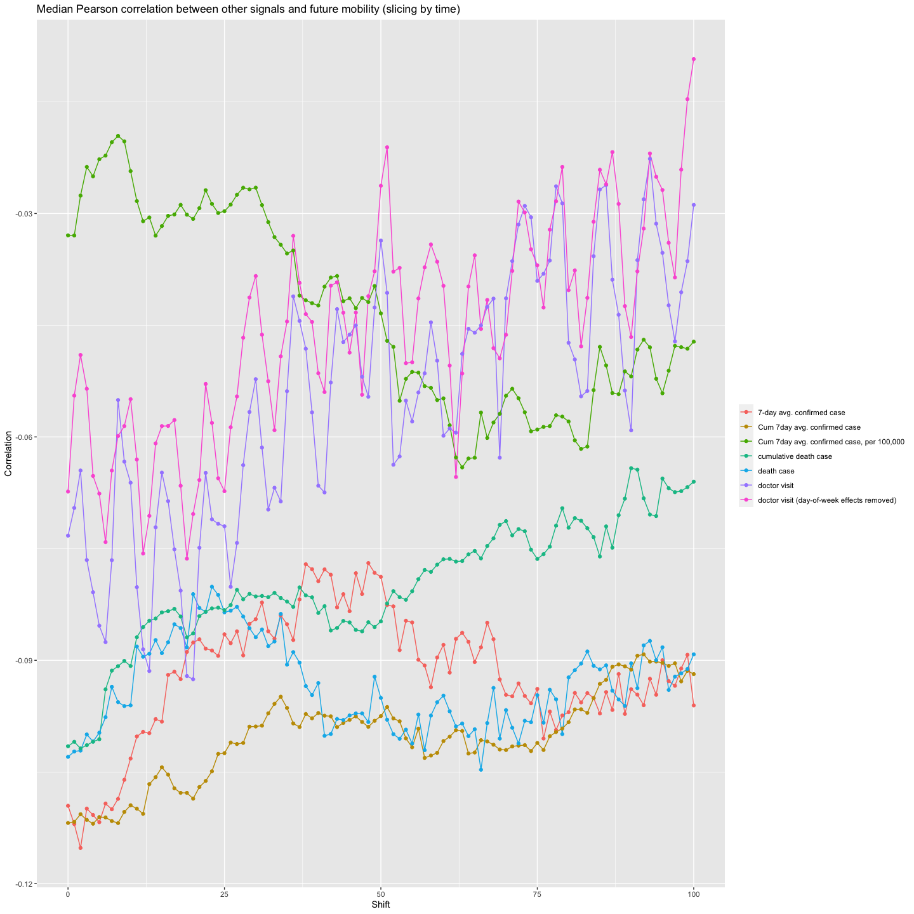<!-- -->

#### Rank correlation (slicing by state)

We can also compute the rank correlation to see there is any difference in terms of the number of shift as we compare it with pearson correlation. 

We note the following:

* Still, cumulative 7-day average case count, per 100,000 and Cumulative 7-day average case count are most correlated with 37-day-forwarded mobility signal.

* Now, the adjusted doctor visit signal is most correlated with 50-day-forwarded mobility signal instead of 78-day-forwarded mobility signal.

* Also, the 7-day average death case count is most correlated with 100-day-forwarded mobility signal. 


```r
title <- "Median Spearman correlation between other signals and future mobility (slicing by state)"
by_method <- "geo_value"
corr.method <- "spearman"

# Compute spearman correlation between other covidcast-like signals and mobility
plot.all.Corr.Median.by.shift(covidcastlike.signals, 
                              ftime,
                              SHIFTDAY,
                              names, 
                              corr.method, 
                              title, 
                              by_method)
```

<!-- -->

#### Rank correlation (slicing by time)

In terms of slicing by time with rank correlation, we see that

* The correlation is moving from negative to zero as we increase the number of shifts. 


```r
title <- "Median Spearman correlation between other signals and future mobility (slicing by time)"
by_method <- "time_value"
corr.method <- "spearman"

# Compute spearman correlation between other covidcast-like signals and mobility
plot.all.Corr.Median.by.shift(covidcastlike.signals, 
                              ftime,
                              SHIFTDAY,
                              names, 
                              corr.method, 
                              title, 
                              by_method)
```

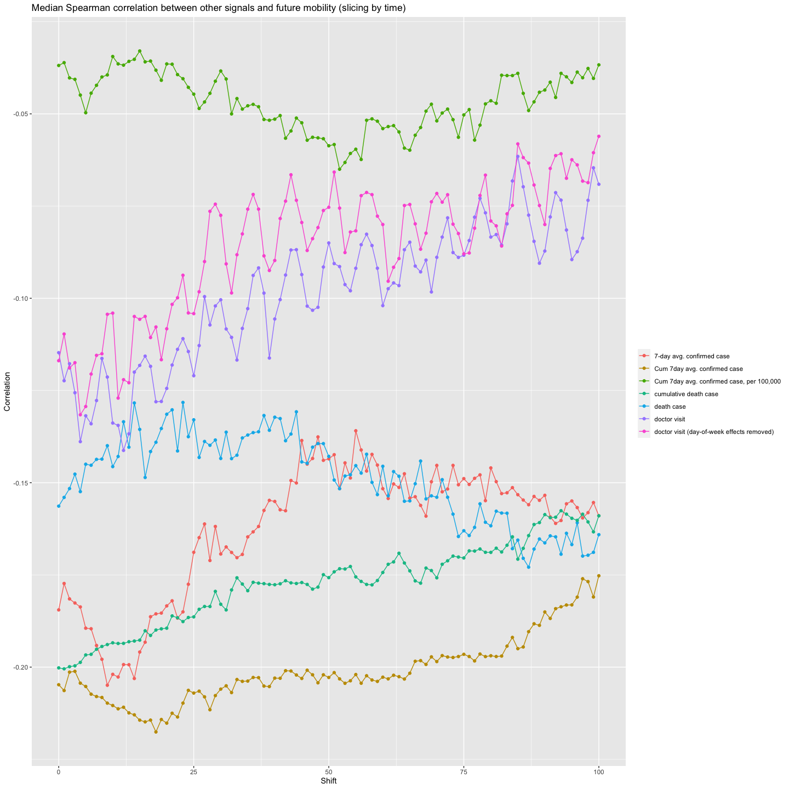<!-- -->


### Rank correlation on a map (37-day-forwarded mobility signal)

As we learn from the rank correlation slicing by state, we may be curious to know if there are any states that are less correlated with the future mobility even when we set the number of shifts to the number that produce the highest rank correlation.

From the plot below, we pick on cumulative 7-day averaged confirmed case count per 100,000, we can see that the signal is highly correlated with the 37-day-forwarded mobility signal across states consistently.


```r
# Set a bunch of fields so that the data frame knows how to plot itself
cor3_by_geo <- covidcast_cor(cum_case_prop, ftime,  by = "geo_value", dt_x = 37,method = "spearman")

cor3_by_geo$time_value = STARTDATE
cor3_by_geo$issue = STARTDATE
attributes(cor3_by_geo)$geo_type = "state"
class(cor3_by_geo) = c("covidcast_signal", "data.frame")

# Plot choropleth maps, using the covidcast plotting functionality
plot(cor3_by_geo, title = "Correlations between 37-day shifted cases and mobility signal",
     range = c(-1, 1), choro_col = c("orange","lightblue", "purple"))
```

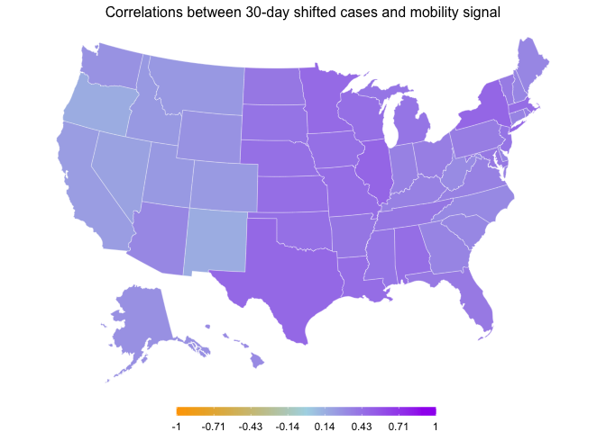<!-- -->


### Other signals correlate with future restaurant visit

What will happen if we constrain ourselves to look at the mobility signal from staying away from home to restaurant visit?

#### Pearson correlation (slicing by state)

Observations:

* Similar to the situation where the full-time away home signal is used as mobility signal, we see that the cumulative 7-day averaged confirmed case count per 100,000 and the cumulative 7-day averaged death case count are most correlated with 25-day forwarded restaurant visit signal. 

* There is one clear difference when we switch from away home signal to restuarant visit, we see that 7-day averaged death case is most correlated with 50-day forwarded restaurant visit. 


```r
SHIFTDAY <- 100
corr.method <- "pearson"
by_method <- "geo_value"
title <- "Median Pearson correlation between other signals and future restaurant visit signal (slicing by state)"

# Compute pearson correlation between other covidcast-like signals and restaurant visit
plot.all.Corr.Median.by.shift(covidcastlike.signals, 
                              new_res,
                              SHIFTDAY,
                              names, 
                              corr.method, 
                              title, 
                              by_method)
```

<!-- -->

#### Pearson correlation (slicing by time)

From the plot below, we see that the Pearson correlations between other signals and future resturant visits tend to go to zero as the number of shifts increases.


```r
by_method <- "time_value"
title <- "Median Pearson correlation between other signals and future restaurant visit signal (slicing by time)"

# Compute pearson correlation between other covidcast-like signals and restaurant visit
plot.all.Corr.Median.by.shift(covidcastlike.signals, 
                              new_res,
                              SHIFTDAY,
                              names, 
                              corr.method, 
                              title, 
                              by_method)
```

<!-- -->

#### Rank correlation (slicing by state)

In comparison with the Pearson correlation slicing by state, we see that the cumulative 7-day averaged confirmed case count per 100,000 becomes more correlated with 25-day-forwarded restaurant visit.

To continue the comparison, we see that the adjusted docotor visit, unadjusted doctor visit, and the 7-day averaged confirmed case are now more correlated with the future restaurant visit with fewer days forwarded in time. 


```r
# Do the same for Spearman 
corr.method <- "spearman"
by_method <- "geo_value"
title <- "Median Spearman correlation between other signals and future restaurant visit signal (slicing by state)"

plot.all.Corr.Median.by.shift(covidcastlike.signals, 
                              new_res,
                              SHIFTDAY,
                              names, 
                              corr.method, 
                              title, 
                              by_method)
```

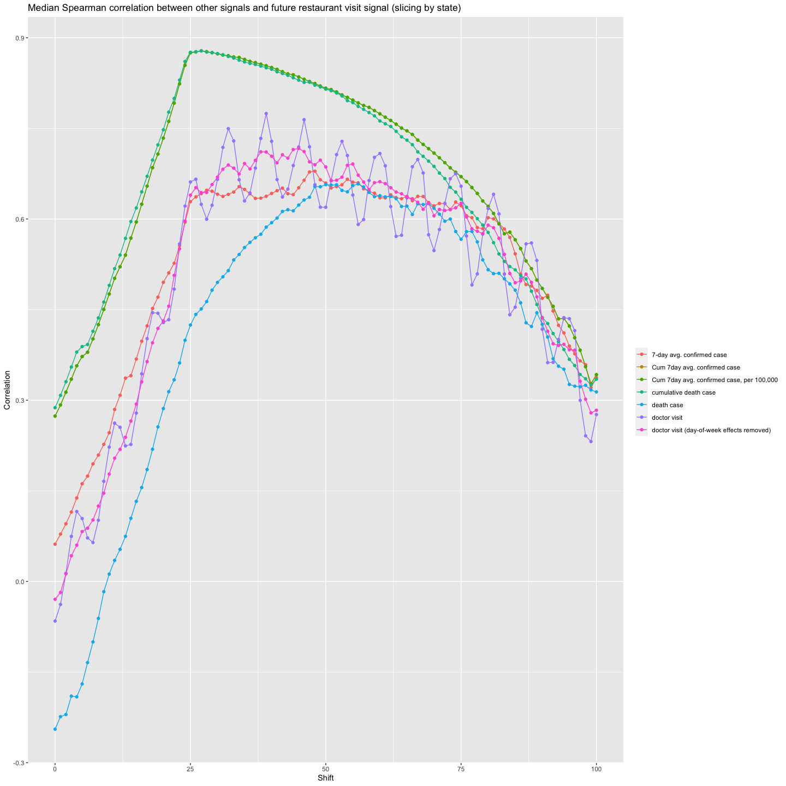<!-- -->

#### Rank correlation (slicing by time)

Interesting, when we look at the rank correlation slicing by time, we see that 

* The other signals (cumulative 7-day averaged confirmed case count, cumulative 7-day averaged death case count, 7-day averaged death case count, 7-day averaged confirmed case count) are correlated with future restaurant visit with rank correlation around 0.6 consistently even when we change the number of shifts.

* Meanwhile, the cumulative 7-day averaged confirmed case count per 100,000 remain close to 0 rank correlation with the future restaurant visit even when we change the number of shifts.


```r
by_method <- "time_value"
title <- "Median Spearman correlation between other signals and future restaurant visit signal (slicing by time)"

plot.all.Corr.Median.by.shift(covidcastlike.signals, 
                              new_res,
                              SHIFTDAY,
                              names, 
                              corr.method, 
                              title, 
                              by_method)
```

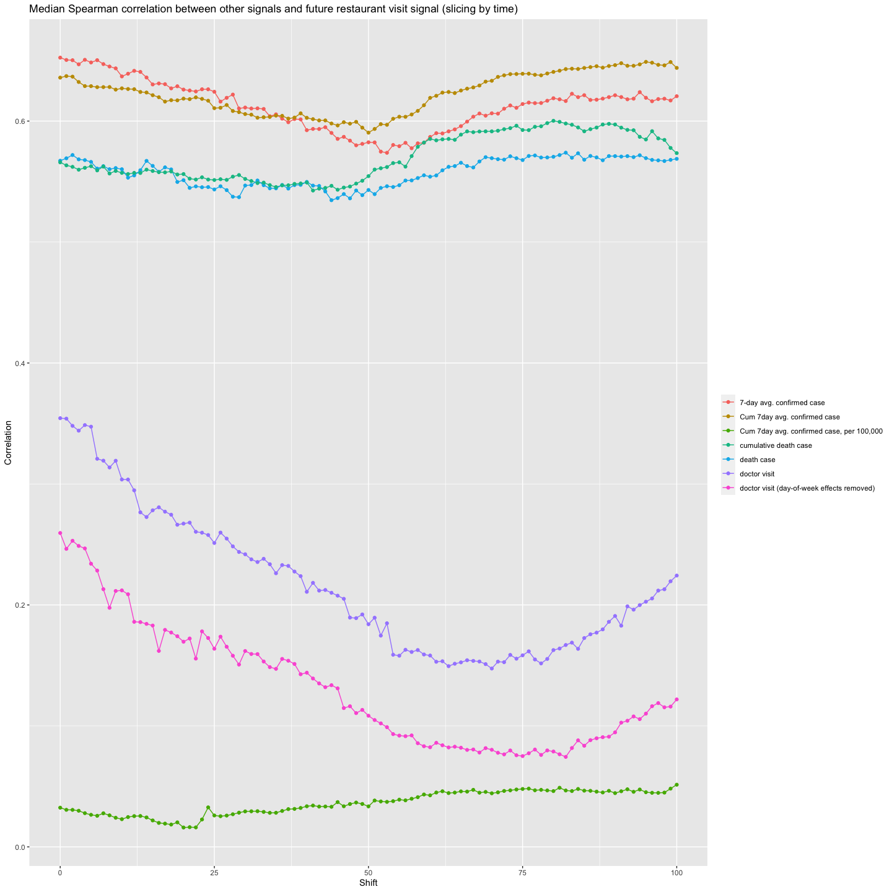<!-- -->


## Variability of policy across states

We also want to explore the policy data from University of Washington's [State-level social distancing policies](https://github.com/COVID19StatePolicy/SocialDistancing) as we will use it in model building. For the definition of the policy, please refer to the [codebooks](https://github.com/COVID19StatePolicy/SocialDistancing/tree/master/codebooks)

The plot below shows the number of policies falling into different categories. Most of the policies across states are related to gathering restriction.


```r
# Plot for non-distinct count and mandate distribution
policy.by.state <- state.policy[,c("StateName",
                                   "StatePolicy", 
                                   "Mandate")]
# Get the count
new_counts <- table(policy.by.state$StatePolicy,
                    policy.by.state$Mandate)

# Convert to data frame
new_counts.df <- as.data.frame(new_counts)
# Change the colname for the future legend readibility
colnames(new_counts.df)[2] <- "Mandate?"

# Plot the graph for the count
p <- ggplot(new_counts.df,aes(x= reorder(Var1,Freq),Freq)) +
  geom_bar(stat ="identity")+
  coord_flip()+
  labs(title = "Count of State-wide Policy Across States", y="Count", x="Policy")
p
```

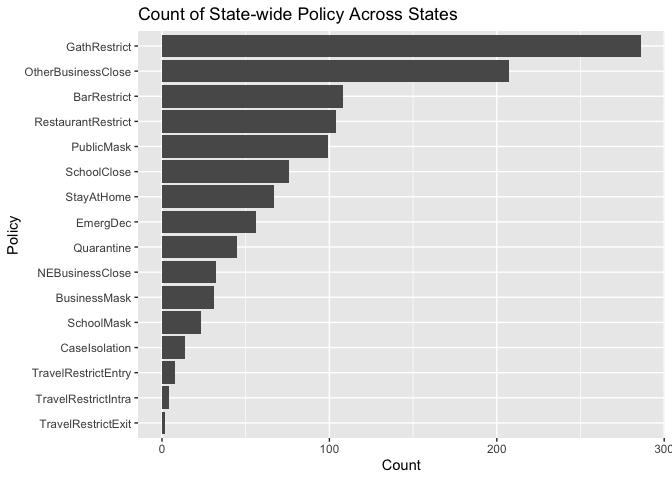<!-- -->

### Filtered by mandatory policy

We can further filter the data by looking at how many policies are mandatory. 


```r
# Show the difference by Mandate?
p <- ggplot(new_counts.df,aes(x= reorder(Var1,Freq),Freq, fill = `Mandate?`)) +
  geom_bar(stat ="identity")+
  coord_flip()+
  labs(title = "Count of State-wide Policy Across States", y="Distinct Count", x="Policy")+
   guides(fill=guide_legend(title="Mandate?"))

p
```

<!-- -->

### Distinct Count of State-wide policy across states

By filtering the data by distinct count, we can see what kind of policies that most states will enforce.


```r
# Filter the dataframe by distrinct rows
unique.policy.by.state <- distinct(state.policy[,c("StateName","StatePolicy")])
# Get the count
counts <- table(unique.policy.by.state$StatePolicy)

# Convert to data frame
counts.df <- as.data.frame(counts) 

# Plot the graph for ditinct count
p <- ggplot(counts.df,aes(x= reorder(Var1,Freq),Freq, fill=Freq))+
  geom_bar(stat ="identity")+
  coord_flip()+
  labs(title = "Distinct Count of State-wide Policy Across States", y="Distinct Count", x="Policy")

p
```

<!-- -->

## Lag analysis on number of policies and mobility

### Correlation between 7-day averaged number of policies and mobility by number of shifts across states

We may want to construct a simple signal to represent state-wide government intervention over time. To do so, we count the number of policies that has been enacted in a day and take the rolling average number within 7 days as an intervention signal.


```r
policy_signal <- getSumOfPolicy(policy, STARTDATE, ENDDATE)

covidcast.like.policy.signal <- transformToCovidcastLike(policy_signal)

# Pearson correlation between the number of policies and mobility across states
pearson_policy <- getCorrByShift(150, 
                                 covidcast.like.policy.signal,
                                 data[["full_time_work_prop"]], 
                                 "pearson", 
                                 "geo_value")

pearson_policy_med <-  getMedian(pearson_policy)

# plot the graph
p <- ggplot(pearson_policy_med , 
            aes(x = dt, 
                y = median)) + 
  geom_line() + 
  geom_point() + 
  labs(title = "Median Pearson correlation between the 7-day rolling average of policies and future mobility", 
       x = "Shift", 
       y = "Correlation") +
  theme(legend.title = element_blank())

p
```

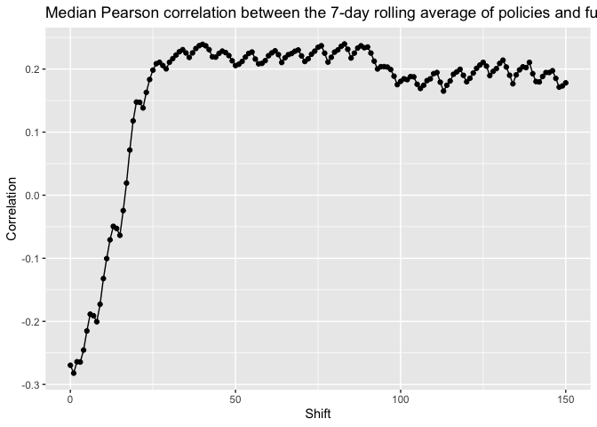<!-- -->

```r
# Spearman correlation between the number of policies and mobility across states
spearman_policy <- getCorrByShift(150, 
                                  covidcast.like.policy.signal,
                                  data[["full_time_work_prop"]], 
                                  "spearman", 
                                  "geo_value")

spearman_policy_med <-  getMedian(spearman_policy)

s<- ggplot(spearman_policy_med, 
           aes(x = dt, y = median)) + 
  geom_line() + 
  geom_point() + 
  labs(title = "Median rank correlation between the 7-day rolling average of policies and mobility", 
       x = "Shift", 
       y = "Correlation") +
  theme(legend.title = element_blank())
s
```

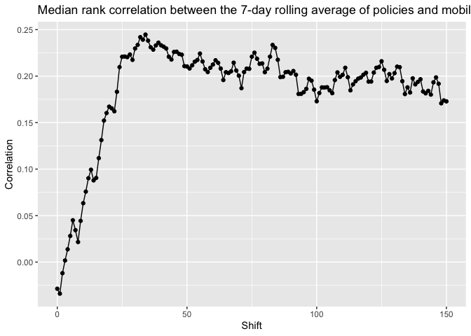<!-- -->

### Rank correlation in Space between number of policies and future mobility

We can also see the correlation in a map. The number of policies become more correlated with n-day forwarded mobility as n increases. 


```r
# Set a bunch of fields so that the data frame knows how to plot itself
ls = list()
idx <- seq(50,125,25)
count <- 1

for (i in idx){
  policy.mobility.cor <- covidcast_cor(covidcast.like.policy.signal,
                                       data[["full_time_work_prop"]], 
                                       by = "geo_value", 
                                       dt_x= i, 
                                       method = "spearman")

  policy.mobility.cor$time_value = STARTDATE
  policy.mobility.cor$issue = STARTDATE
  attributes(policy.mobility.cor)$geo_type = "state"
  class(policy.mobility.cor) = c("covidcast_signal", "data.frame")

  # Plot choropleth maps, using the covidcast plotting functionality
  ls[[count]]  <-plot(policy.mobility.cor, 
                      title = sprintf("%s-day shifted num of policies and mobility", i), 
                      range = c(-1, 1), 
                      choro_col = cm.colors(10), 
                      alpha = 0.4)
  count <- count + 1
}

# Plot all graphs
do.call(grid.arrange,ls)
```

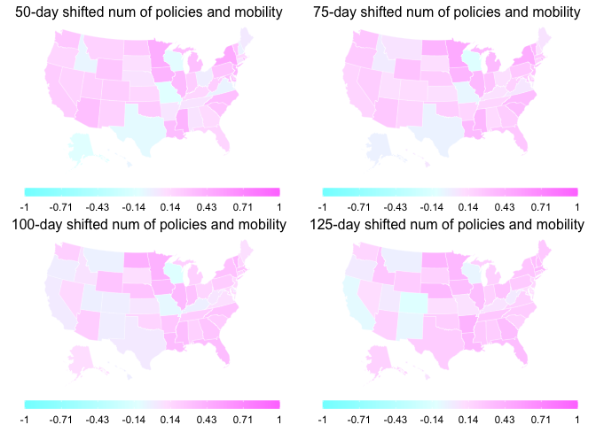<!-- -->

