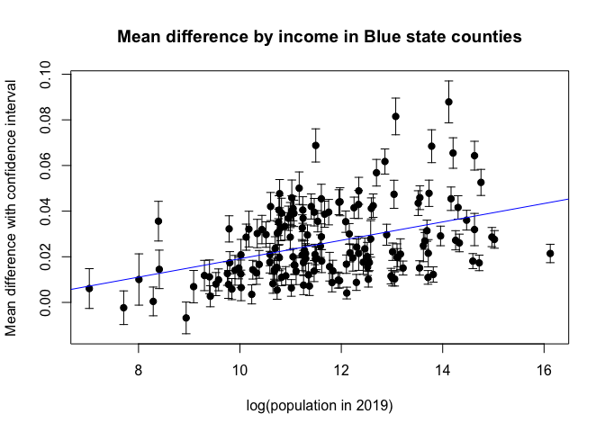
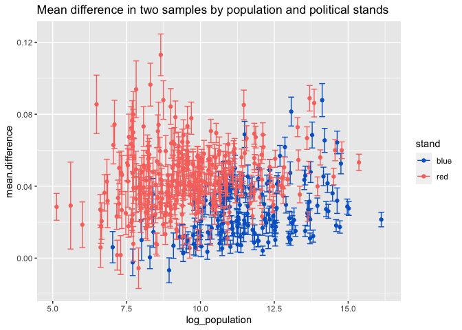
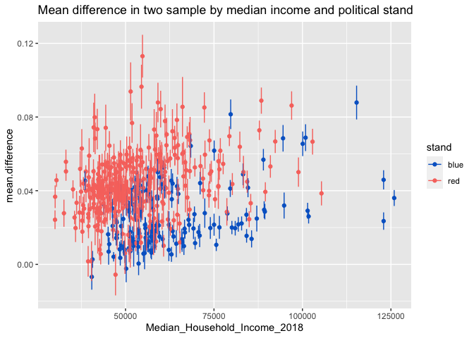
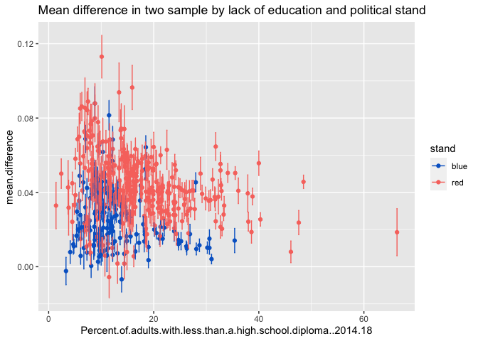
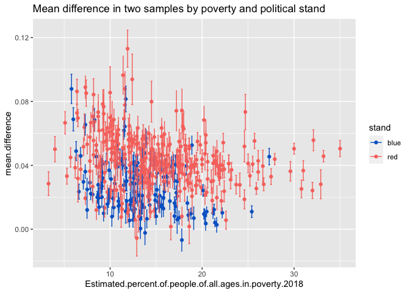

# Abstract 

Mobility is one of the potential factors in contributing to the spread of COVID-19. In this work, our goal is to estimate the effect of state-wide policies on mobility signals at a county-level. We do so by using regression discontinuty design to compare the difference in mobility signals before and after interventions. Also, we examine the correlation between the magnitude of the effect and the county-level demographic data. Based on assumptions, we have found that a mandatory COVID19 policy tends to be more effective on the areas with large population, small percent of people in poverty, high percent of people with education backgrounds, and low unemployment rate. 


```r
library(ggplot2)
library(dplyr)
library(reshape2)
library(covidcast)
library(lubridate)
library(gridExtra)
library(zoo)

source("code/loader.r")
source("code/parser.r")
```

# Introduction

Various governments have released different policies with an aim to control the spread of COVID-19, for which controlling mobility is one of the major tasks. This report offers insights to those are interested in the following questions:

* How can we measure the effect of a policy on each county?

* Are there any differences in the effects of a state-wide policy on various counties within each state?

  * Particularly, will the effect of the policy vary based on the following factors?
  
    * Political stand of the state in 2020
    
    * Whether the policy is mandatory or advisory
    
    * Education levels
    
    * Income levels
    
    * Unemployment rates
    
    * Poverty level

* Can we rank different counties based on the effect of the interventions?

* Given the measured impact in each county, can we find common characteristics to describe those counties that have a high or low rank?


```r
# Use the following code to output data as a static file
# for faster retrival 
# library(tidycensus)
# data(fips_codes)
# 
# STARTDATE <- "2020-02-20"
# ENDDATE <- lubridate::today()
# 
# fips_codes$fips <- paste(fips_codes$state_code, 
#                          fips_codes$county_code, 
#                          sep="")
# 
# # "NY","WA", "TX", "UT", "ND"
# GEO_VALUE <- fips_codes[fips_codes$state %in% c("CA"),]$fips
# 
# confirmed_7dav_cumulative_prop <- covidcast_signal(data_source =
#                                                   "indicator-combination",                                            
#                                           signal="confirmed_7dav_cumulative_prop",
#                                                   start_day = STARTDATE,
#                                                   end_day = ENDDATE,
#                                                   geo_type = GEO_TYPE,
#                                                   geo_values = GEO_VALUE)
# 
# 
# 
# confirmed_7dav_incidence_prop <- covidcast_signal(data_source =
#                                                   "indicator-combination",                                             signal="confirmed_7dav_incidence_prop",
#                                                   start_day = STARTDATE,
#                                                   end_day = ENDDATE,
#                                                   geo_type = GEO_TYPE,
#                                                   geo_values = GEO_VALUE)
# 
# 
# deaths_7dav_cumulative_prop <- covidcast_signal(data_source =
#                                                   "indicator-combination",                                             signal="deaths_7dav_cumulative_prop",
#                                                   start_day = STARTDATE,
#                                                   end_day = ENDDATE,
#                                                   geo_type = GEO_TYPE,
#                                                   geo_values = GEO_VALUE)
# 
# 
# 
# deaths_7dav_incidence_prop <- covidcast_signal(data_source =
#                                                   "indicator-combination",                                             signal="deaths_7dav_incidence_prop",
#                                                   start_day = STARTDATE,
#                                                   end_day = ENDDATE,
#                                                   geo_type = GEO_TYPE,
#                                                   geo_values = GEO_VALUE)
# 
# smoothed_adj_cli <- covidcast_signal(data_source = "doctor-visits",
#                                     signal ="smoothed_adj_cli",
#                                     start_day = STARTDATE, 
#                                     end_day = ENDDATE,
#                                     geo_type = GEO_TYPE, 
#                                     geo_values = GEO_VALUE)
# 
# write.csv(confirmed_7dav_cumulative_prop, "data/case_signals/ca-county-confirmed_7dav_cumulative_prop.csv")
# 
# write.csv(confirmed_7dav_incidence_prop, "data/case_signals/ca-county-confirmed_7dav_incidence_prop.csv")
# 
# write.csv(deaths_7dav_cumulative_prop , "data/case_signals/ca-county-deaths_7dav_cumulative_prop.csv")
# 
# write.csv(deaths_7dav_incidence_prop, "data/case_signals/ca-county-deaths_7dav_incidence_prop.csv")
# 
# write.csv(smoothed_adj_cli, "data/case_signals/ca-county-smoothed_adj_cli.csv")
#  
```


```r
# Read in covidcast data
# Instead of downloading the data from covidcast()
# we saved it as a csv for faster retrieval 

# Covidcast signals
# Option 1: load data from covidcast signals()

# Specify global variables
STARTDATE <- "2019-01-01"
ENDDATE <- lubridate::today()
# GEO_TYPE = "county"
# STATE = "CA"

# Get all fips code and call covidcast()
# library(tidycensus)
# data(fips_codes)
# county.codes <- fips_codes[fips_codes$state==STATE,]$county_code
# Look up the fips code for the state e.g. 06 for CA
# GEO_VALUE <- paste("06",ca.county.codes,sep="")
# Full time away home mobility
# ftime <- covidcast_signal(data_source = "safegraph", 
#                            signal ="full_time_work_prop",
#                            start_day = STARTDATE, 
#                            end_day = ENDDATE,
#                            geo_type = GEO_TYPE, 
#                            geo_values = GEO_VALUE)


# Option 2: Read from csv files
# Blue states
ca.ftime <- read.csv("data/ca.ftime.csv")
ca.ftime$county <- as.character(ca.ftime$county)
ca.ftime$geo_value <- as.character(ca.ftime$geo_value)
ca.ftime$signal <- as.character(ca.ftime$signal)

ny.ftime <- read.csv("data/ny.ftime.csv")
wa.ftime <- read.csv("data/wa.ftime.csv")


# Red states
nd.ftime <- read.csv("data/nd.ftime.csv")
ut.ftime <- read.csv("data/ut.ftime.csv")
tx.ftime <- read.csv("data/tx.ftime.csv")

# Create a new column
ny.ftime$county <- fips_to_name(ny.ftime$geo_value)
wa.ftime$county <- fips_to_name(wa.ftime$geo_value)
nd.ftime$county <- fips_to_name(nd.ftime$geo_value)
ut.ftime$county <- fips_to_name(ut.ftime$geo_value)

# Change the geo_value
wa.ftime$geo_value <- "wa"
ny.ftime$geo_value <- "ny"
nd.ftime$geo_value <- "nd"
ut.ftime$geo_value <- "ut"

# Change to date type
ca.ftime$time_value <- as.Date(ca.ftime$time_value)
wa.ftime$time_value <- as.Date(wa.ftime$time_value)
ny.ftime$time_value <- as.Date(ny.ftime$time_value)
ut.ftime$time_value <- as.Date(ut.ftime$time_value)
nd.ftime$time_value <- as.Date(nd.ftime$time_value)
tx.ftime$time_value <- as.Date(tx.ftime$time_value)


# Policy data
policy <- load_policy()

# Filter to get state-wide mandatory policy
mand.policy <- policy %>% 
  filter(StateWide ==  1 & Mandate == 1)

# Filter to get state-wide advisory policy
recommend.policy <- policy %>% 
  filter(StateWide ==  1 & Mandate == 0)
recommend.policy$StatePolicy <- as.character(recommend.policy$StatePolicy)

# Demograhpics data
education <- read.csv("data/demographics/Education.csv")
population <- read.csv("data/demographics/PopulationEstimates.csv")

poverty <- read.csv("data/demographics/PovertyEstimates.csv")
unemployment <- read.csv("data/demographics/Unemployment.csv")

# Get county-level intervention data from Stanford
county.policy <- read.csv("data/Crowdsourced-COVID-19-Intervention-Data.csv")

# Read the interpretation of the rural urban code
ruralurban.code <- read.csv("data/demographics/ruralurbancodes2013.csv")
ruralurban.code$RUCC_2013 <- as.factor(ruralurban.code$RUCC_2013)


all.dates <- seq(as.Date(STARTDATE), as.Date(ENDDATE), by="days")
time_value <- sort(rep(all.dates, 1)) 
```


```r
computeTwoSampleAvgDiff <- function(policy.firstday, 
                                    filtered.df){
  
  # Compute the difference in means of the matched samples.
  
  # Get the sequence of dates from Jan to first day
  first_sample_period <- seq(as.Date("2020-01-05"), 
                             as.Date(policy.firstday), by="days")
  
  # Get the first sample
  first_sample <- filtered.df %>%
    filter(time_value %in% first_sample_period)
  
  # Get the number of data points in first sample
  num_data_points <- nrow(first_sample)
  
  # get all indicies that is after the first day of intervention
  idx <- which(filtered.df$time_value > as.Date(policy.firstday))
  
  # get the same number of data points as first sample
  # after the first day of intervention
  selected_idx <- idx[1:num_data_points]
  
  # Get the second sample
  second_sample <- filtered.df[selected_idx,]
  
  # Run a two sample t-test.
  # We assume the two samples are independent
  out <- t.test(first_sample$value, second_sample$value, paired=F)
  
  return(out)
}
  

plotRD <- function(filtered.df,
                   policyName,
                   mobilityName,
                   stateName,
                   countyName,
                   STARTDATE,
                   ENDDATE,
                   plotMultiple=F,
                   showMultiplePolicies=F,
                   count=NULL){
  
  if(plotMultiple){
    if(showMultiplePolicies){
      # Plot the RD 
      p <- filtered.df %>% 
        mutate(intervention= as.factor(total.num.policy)) %>%
        ggplot(aes(x = time_value, 
                   y = value, 
                   color = intervention)) +
        geom_point() + 
        geom_smooth(method = "lm")+
        labs(title = as.character(count))+ 
        theme(axis.title.x=element_blank(),
              axis.text.x=element_blank(),
              axis.ticks.x=element_blank(),
              axis.title.y=element_blank(),
              axis.text.y=element_blank(),
              axis.ticks.y=element_blank(),
              legend.position = "none")
    }else{
      # Plot the RD 
      p <- filtered.df %>% 
        mutate(intervention= as.factor(eval(parse(text=policyName)))) %>%
        ggplot(aes(x = time_value, 
                   y = value, 
                   color = intervention)) +
        geom_point() + 
        geom_smooth(method = "lm")+
        labs(title = as.character(count))+ 
        theme(axis.title.x=element_blank(),
              axis.text.x=element_blank(),
              axis.ticks.x=element_blank(),
              axis.title.y=element_blank(),
              axis.text.y=element_blank(),
              axis.ticks.y=element_blank(),
              legend.position = "none")
    }
    
  }else{
    if(showMultiplePolicies){
      # Plot the RD 
      p <- filtered.df %>% 
        mutate(intervention= as.factor(total.num.policy)) %>%
        ggplot(aes(x = time_value, y = value, color = intervention)) +
        geom_point() + 
        geom_smooth(method = "lm")+
        labs(title = paste(" Mobility ~ time (", 
                           stateName,
                           "-",
                           countyName,
                           ")",
                           ",", 
                           policyName,
                           ";",
                           as.numeric(ENDDATE-STARTDATE)," day(s)"), 
             x = "Time", 
             y =  mobilityName)
    }else{
      # Plot the RD 
      p <- filtered.df %>% 
        mutate(intervention= as.factor(eval(parse(text=policyName)))) %>%
        ggplot(aes(x = time_value, y = value, color = intervention)) +
        geom_point() + 
        geom_smooth(method = "lm")+
        labs(title = paste(" Mobility ~ time (", 
                           stateName,
                           "-",
                           countyName,
                           ")",
                           ",", 
                           policyName,
                           ";",
                           as.numeric(ENDDATE-STARTDATE)," day(s)"), 
             x = "Time", 
             y =  mobilityName)
    }

  }
  return(p)
}


pipeline <- function(mobility.signal,
                     policy.df,
                     stateName, 
                     countyName,
                     policyName,
                     dayRange,
                     dropWeekend=T,
                     dropDaysAfterIntervention=F,
                     plotMultiple=F,
                     showMultiplePolicies=F,
                     count=NULL){
  
  # Get the first day of the policy
  policy.firstday <- policy.df %>% 
    filter(StatePostal == stateName)%>%
    getSumOfPolicy(STARTDATE, 
                   ENDDATE) %>%
    getFirstDayOfIntervention(stateName, 
                              policyName)

  # Get the time interval
  beginning <- policy.firstday - dayRange
  end <- policy.firstday + dayRange
    
  # get the time period we want to plot the RD
  period <- seq(as.Date(beginning), 
                as.Date(end), by="days")
  
  # Filter the mobility signal 
  filtered.mobility.df <- mobility.signal %>% 
      filter(geo_value == stateName & 
               time_value %in% period &
             county == countyName)
  
  # filter the policy data
  policy.df <- policy.df %>% filter(StatePostal == stateName)
  
  # compute the number of policies and rolling mean of the number
  # for each day between start and end dates
  policy_signal <- getSumOfPolicy(policy.df, 
                                  beginning,
                                  end)
  
  # left join mobility with policy signal by time 
  df <- left_join(filtered.mobility.df, 
                  policy_signal, 
                  by = "time_value")
    
  # drop all the weekends in the data
  if(dropWeekend){
    filtered.df <- df %>% 
      mutate(weekday= weekdays(as.Date(time_value)))%>% 
      filter(!(weekday %in% c("Saturday", "Sunday"))) 
  }else{
    filtered.df <- df
  }
  
  # Drop 2-weeks of data to account for the lag 
  if(dropDaysAfterIntervention){
    
    # Define the 2 weeks time interval 
    drop_period <- seq(as.Date(policy.firstday), 
        as.Date(policy.firstday)+14, by="days")
    
    # Filter the dataframe
    filtered.df<- filtered.df %>% 
      filter(!(time_value %in% drop_period))
    
  }
  
  # Get the two-sample t-test result
  test.result <- computeTwoSampleAvgDiff(policy.firstday,
                                         filtered.df)
  
  # Get the mean difference
  mean.diff <- as.numeric(test.result$estimate[1]-test.result$estimate[2])
  
  LCI <- test.result$conf.int[1]
  UCI <- test.result$conf.int[2]
  
  # Get the mobility signal name
  mobilityName <- unique(filtered.df$signal)
  
  p <- plotRD(filtered.df,
              policyName,
              mobilityName,
              stateName,
              countyName,
              beginning,
              end,
              plotMultiple=plotMultiple,
              showMultiplePolicies=showMultiplePolicies,
              count=count
              )

  return(list(p=p, mean.difference=mean.diff, LCI=LCI, UCI=UCI))

}

plotDemographics <- function(x, 
                             y,
                             lower.bound,
                             upper.bound,
                             xlab, 
                             ylab,
                             title,
                             zeroLine=F){
  # Plot a scatter plot - RESCALE BY LOG
  plot(x, 
       y,
       ylim=range(c(lower.bound, upper.bound)),
       pch=19, 
       xlab=xlab, 
       ylab=ylab,
       main=title)
  # hack: we draw arrows but with very special "arrowheads
  arrows(x, lower.bound, x, upper.bound,length=0.05, angle=90,code=3)
  # Add a horizontal line
  if(zeroLine){
    abline(h=0, col="red") 
  }
}

ggplot_demographics <- function(df,
                                x,
                                y,
                                lower.bound,
                                upper.bound,
                                gp){
  p<- ggplot(df, aes_string(x=x, y=y, group=gp, color=gp)) + 
  #geom_line() +
  geom_point()+
  geom_errorbar(aes_string(ymin=lower.bound, ymax=upper.bound), width=.2,
                 position=position_dodge(0.05))
      
  return(p)
}

ggplot_demographics_red_blue <- function(df,
                                x,
                                y,
                                lower.bound,
                                upper.bound,
                                gp){
  p<- ggplot(df, aes_string(x=x, y=y, group=gp, color=gp)) + 
  #geom_line() +
  geom_point()+
  geom_errorbar(aes_string(ymin=lower.bound, ymax=upper.bound), width=.2,
                 position=position_dodge(0.05))+
    scale_color_manual(values=c("#0066CC", "#F8766D"))
      
  return(p)
}
```

# Analysis

## California

### Differences in county-level mobility signals

* We first examine the mobility signal at a county-level in California. We look at 150 days before and after an intervention named emergency declaration. We regress the mobility signal called ["full_time_away_prop"](https://cmu-delphi.github.io/delphi-epidata/api/covidcast-signals/safegraph.html) on time, which is simply converted by R as a monontically increasing integer. The plot below shows from October 2019 to Aug 2020. 

* We decided to drop the dates that are weekends and only look at the full-time-away-from-home signal on weekdays. It is because the weekend effect is a significant factor to reduce mobility signal int terms of being away from home for work. 

* For San Mateo county, we can see that there is a decrease in mobility after the start date of emergency declaration. On the other hand, Alpine county doesn't seem to have much difference in mobility even after the state-wide emergency declaration. 


```r
policyName <- "EmergDec"
stateName <- "ca"
time.interval <- 150
countyName <- "San Mateo County"
dropDaysAfterIntervention <- F
showMultiplePolicies <- F
plotMultiple <- F


pipeline(ca.ftime,
         mand.policy,
         stateName, 
         countyName,
         policyName,
         dayRange=time.interval,
         dropWeekend=T,
         dropDaysAfterIntervention=F,
         plotMultiple=F,
         showMultiplePolicies=F)
```

```
## $p
```

<!-- -->

```
## 
## $mean.difference
## [1] 0.0379841
## 
## $LCI
## [1] 0.03083681
## 
## $UCI
## [1] 0.0451314
```

```r
countyName <- "Alpine County"

pipeline(ca.ftime,
         mand.policy,
         stateName, 
         countyName,
         policyName,
         dropWeekend=T,
         dayRange=time.interval,
         dropDaysAfterIntervention=F,
         plotMultiple=F,
         showMultiplePolicies=F)
```

```
## $p
```

<!-- -->

```
## 
## $mean.difference
## [1] 0.009465371
## 
## $LCI
## [1] 0.001133203
## 
## $UCI
## [1] 0.01779754
```


* We can also look at all counties in California at a glance. We see that there are some counties that have a more clear decrease in mobility after the intervention of emergency declaration. We can imagine there may be some underlying characteristics that help interpret these patterns. Later, we will use demographic data for this purpose. 


```r
policyName <- "EmergDec"
stateName <- "ca"
dayRange <- 150

# Get all the counties
counties <- population %>%
  filter(State == "CA" & Area_Name!="California")%>%
  select(Area_Name)
counties <- as.vector(counties$Area_Name)

# Counter 
count <- 1
plist <- list()

for(countyName in counties){
  out <- pipeline(ca.ftime,
         mand.policy,
         stateName, 
         countyName,
         policyName,
         dayRange=time.interval,
         dropWeekend=T,
         dropDaysAfterIntervention=F,
         plotMultiple=T,
         showMultiplePolicies=F,
         count=count)
  
  plist[[count]] <- out$p
  count <- count + 1

}

# Plot all counties mobility signal
n <- length(plist)
nCol <- floor(sqrt(n))
do.call("grid.arrange", c(plist, ncol=nCol))
```

<!-- -->

### Multiple State-wide Policies 

* Since there are multiple state-wide policies, we may also be interested to know the start time of each policy. Here, we focus on the mandatory state-wide policies. The color palette shows the total number of policies during the period of time. 

* We can see that there seems to be a lag for the public to react in San Mateo County. To estimate the effect of the intervention, we drop all the data within 14 days after the start time of the intervention. We use a t-test to compute the mean difference between before and after the intervention. 

* Since there is an obvious confounding signal in late December and we suspect that is due to holiday season. We use the data between Jan 5th and Mar 5th (the start date of the intervention) as one sample, and select the same amount of data points after intervention as a second sample. 

* We can list out policies involved in the plot below in order with the number being the total number of policies: 

  * 1: Emergency declaration (started on 2020-03-05)

  * 6: Emergency declaration (started on 2020-03-05), bar restriction (started on 2020-03-20), gathering restriction (started on 2020-03-20), restaurant restriction (started on 2020-03-20), stay at home order (started on 2020-03-20), non-essential business closure (started on 2020-03-20)

  * 7: Emergency declaration (started on 2020-03-05), bar restriction (started on 2020-03-20), gathering restriction (started on 2020-03-20), restaurant restriction (started on 2020-03-20), stay at home order (started on 2020-03-20), non-essential business closure (started on 2020-03-20), other business closure (started on 2020-05-09)

  * 8: Emergency declaration (started on 2020-03-05), bar restriction (started on 2020-03-20), gathering restriction (started on 2020-03-20), restaurant restriction (started on 2020-03-20), stay at home order (started on 2020-03-20), non-essential business closure (started on 2020-03-20), other business closure (started on 2020-05-09), business mask  (started on 2020-05-27)

  * 9: Emergency declaration (started on 2020-03-05), bar restriction (started on 2020-03-20), gathering restriction (started on 2020-03-20), restaurant restriction (started on 2020-03-20), stay at home order (started on 2020-03-20), non-essential business closure (started on 2020-03-20), other business closure (started on 2020-05-09), business mask  (started on 2020-05-27), public mask (started on 2020-06-19)

* 10: Emergency declaration (started on 2020-03-05), bar restriction (started on 2020-03-20), gathering restriction (started on 2020-03-20), restaurant restriction (started on 2020-03-20), stay at home order (started on 2020-03-20), non-essential business closure (started on 2020-03-20), other business closure (started on 2020-05-09), business mask  (started on 2020-05-27), public mask (started on 2020-06-19), school mask (started on 2020-07-28)


```r
# Uncomment below for viewing the start date of each policy involved.

# ca.policy <- mand.policy %>% filter(StatePostal == "ca")
# policy_with_sum_of_policy <- getSumOfPolicy(ca.policy, STARTDATE, ENDDATE)
# 
# # Check which intervention has ended 
# for (p in unique(mand.policy$StatePolicy)){
#   print(p)
#   out<- tryCatch({
#     getFirstDayOfIntervention(policy_with_sum_of_policy, "ca", p)
#      
#    },error=function(cond) {
#              message(paste("Policy does not seem to exist"))
#              # Choose a return value in case of error
#              return(NA)
#        }
#    )
#    print(out)
#    out<- tryCatch({
#      getLastDayOfIntervention(policy_with_sum_of_policy, "ca", p)
#      
#    },error=function(cond) {
#              message(paste("Policy does not seem to exist"))
#              # Choose a return value in case of error
#              return(NA)
#        }
#    )
#    print(out)
# }
```


```r
policyName <- "EmergDec"
stateName <- "ca"
time.interval <- 150
countyName <- "San Mateo County"


pipeline(ca.ftime,
         mand.policy,
         stateName, 
         countyName,
         policyName,
         dayRange=time.interval,
         dropWeekend=T,
         dropDaysAfterIntervention=F,
         plotMultiple=F,
         showMultiplePolicies=T)
```

```
## $p
```

<!-- -->

```
## 
## $mean.difference
## [1] 0.0379841
## 
## $LCI
## [1] 0.03083681
## 
## $UCI
## [1] 0.0451314
```

```r
pipeline(ca.ftime,
         mand.policy,
         stateName, 
         countyName,
         policyName,
         dayRange=time.interval,
         dropWeekend=T,
         dropDaysAfterIntervention=T,
         plotMultiple=F,
         showMultiplePolicies=T)
```

```
## $p
```

<!-- -->

```
## 
## $mean.difference
## [1] 0.04589824
## 
## $LCI
## [1] 0.04068287
## 
## $UCI
## [1] 0.05111362
```

* If we are considering only the advisory policies, how would our interpretation be different? It actually depends on the start date and the time span of the policy. It also depends on the granularity of the data for examining how many recommended policies have actually been implemented in the county. 

* If we assume the county has enacted the state-wide recommended policies accordingly, we can see from the plot below that the first advisory policy happened nearly at the same time as the first mandatory policy. We will leave it as a future work to effectively disentangle the effects of these two types of policies. Also, we can see that the policies, both mandatory and advisory, do not have an noticable effect on Alpine county.


```r
policyName <- "GathRestrict"
stateName <- "ca"
time.interval <- 150
countyName <- "San Mateo County"

pipeline(ca.ftime,
         recommend.policy,
         stateName, 
         countyName,
         policyName,
         dayRange=time.interval,
         dropWeekend=T,
         dropDaysAfterIntervention=F,
         plotMultiple=F,
         showMultiplePolicies=F)
```

```
## $p
```

<!-- -->

```
## 
## $mean.difference
## [1] 0.0448382
## 
## $LCI
## [1] 0.03989927
## 
## $UCI
## [1] 0.04977714
```

```r
countyName <- "Alpine County"

pipeline(ca.ftime,
         recommend.policy,
         stateName, 
         countyName,
         policyName,
         dropWeekend=T,
         dayRange=time.interval,
         dropDaysAfterIntervention=F,
         plotMultiple=F,
         showMultiplePolicies=F)
```

```
## $p
```

<!-- -->

```
## 
## $mean.difference
## [1] 0.0067061
## 
## $LCI
## [1] -0.001493706
## 
## $UCI
## [1] 0.01490591
```

### Correlation between effect of intervention and population

* Intuitively, we may think that a higher population, the stronger the effect of the intervention should be. We can plot the mean difference between two samples and see if there is any correlation with the log of population in 2019. There is a positive spearman correlation around 0.5. 


```r
policyName <- "EmergDec"
count <- 1
plist <- list()
mlist <- list()
UCI.list <- list()
LCI.list <- list()

for(countyName in counties){
  out <- pipeline(ca.ftime,
         mand.policy,
         stateName, 
         countyName,
         policyName,
         dayRange=time.interval,
         dropWeekend=T,
         dropDaysAfterIntervention=T,
         plotMultiple=T,
         showMultiplePolicies=F,
         count=count)
  
    plist[[count]] <- out$p
    mlist[[count]] <- out$mean.difference
    LCI.list[[count]] <- out$LCI
    UCI.list[[count]] <- out$UCI
    count <- count + 1
}


# Filter demographic data 
# Population
ca.population <- population %>%
  select(State,
         Area_Name,
         Rural.urban_Continuum.Code_2013,
         Urban_Influence_Code_2013,
         POP_ESTIMATE_2019,
         GQ_ESTIMATES_2019,
         R_INTERNATIONAL_MIG_2019)%>%
  filter(State == "CA" & Area_Name !="California")

# Change to factor
ca.population$Rural.urban_Continuum.Code_2013 <- as.factor(ca.population$Rural.urban_Continuum.Code_2013)


ca.population$mean.difference <- unlist(mlist)
ca.population$lower.bound <- unlist(LCI.list)
ca.population$upper.bound <- unlist(UCI.list)
ca.population$log_population <- log(as.numeric(ca.population$POP_ESTIMATE_2019))

plotDemographics(ca.population$log_population, 
                 ca.population$mean.difference, 
                 ca.population$lower.bound,
                 ca.population$upper.bound,
                 "log(population in 2019)", 
                 "Mean difference with confidence interval",
                 "Mean difference between 2 samples by population in CA counties",
                 zeroLine = F)

# Draw a regression line to show correlation
abline(lm(ca.population$mean.difference~ ca.population$log_population),col="blue")
```

<!-- -->

```r
# Compute spearman correlation
cor(ca.population$log_population, ca.population$mean.difference, method = c("spearman"))
```

```
## [1] 0.5858378
```

### Counties that have weak effects of intervention

* By looking at the confidence intervels, we may identify some counties that may not have an effect of the intervention. Interestingly, the counties shown below are all rural areas. We can also see that from the rural urban continuum code. The bigger the number is, the less populous the county is. 


```r
plotDemographics(ca.population$log_population, 
                 ca.population$mean.difference, 
                 ca.population$lower.bound,
                 ca.population$upper.bound,
                 "log(population in 2019)", 
                 "Mean difference with confidence interval",
                 "Mean difference between 2 samples by population in CA counties",
                 zeroLine = T)
```

<!-- -->

```r
# Show all counties that has a lower bound 
# smaller than 0 
selected.counties <- ca.population %>% 
        filter(lower.bound < 0) %>% 
  select(Area_Name, Rural.urban_Continuum.Code_2013)


print(selected.counties)
```

```
##          Area_Name Rural.urban_Continuum.Code_2013
## 1    Alpine County                               8
## 2 Del Norte County                               7
## 3     Modoc County                               6
## 4    Sierra County                               8
## 5   Trinity County                               8
```


* Also, we can filter the graph further by its rural urban code recorded in 2013, denoted as RUCC_2013 in the plot below. The graph below shows that the effect of the intervention tends to be larger in metro areas and smaller in the non-metro areas. 

* We list the defintions of the codes below according to USDA:

  * 1: Metro - Counties in metro areas of 1 million population or more                                                              
  
  * 2: Metro - Counties in metro areas of 250,000 to 1 million population                                                                                                                   
  * 3: Metro - Counties in metro areas of fewer than 250,000 population   
  
  * 4: Nonmetro - Urban population of 20,000 or more, adjacent to a metro area                                                    
  
  * 5: Nonmetro - Urban population of 20,000 or more, not adjacent to a metro area
  
  * 6: Nonmetro - Urban population of 2,500 to 19,999, adjacent to a metro area                                                     
  
  * 7: Nonmetro - Urban population of 2,500 to 19,999, not adjacent to a metro area   
  
  * 8: Nonmetro - Completely rural or less than 2,500 urban population, adjacent to a metro area     
  
  * 9: Nonmetro - Completely rural or less than 2,500 urban population, not adjacent to a metro area                                                                                            

```r
# Change the column name
percent_commuting <- ruralurban.code %>%
  filter(ruralurban.code$State ==  "CA", 
         County_Name %in% counties) %>%
  select(County_Name,
         RUCC_2013)

colnames(percent_commuting)[1] <- "Area_Name"

# Left join the get the description
ca.population.with.code <- left_join(ca.population, percent_commuting, by ="Area_Name")

ggplot_demographics(ca.population.with.code,
                    x="log_population",
                    y="mean.difference",
                    "lower.bound",
                    "upper.bound", 
                    "RUCC_2013")
```

<!-- -->

#### Education and effects of intervention

* We may also want to see if there is a correlation between education level in the county and the effect of the intervention.

* Intuitively, we may think that a county that has a larger population tend to have more people to be less educated or more educated. The plot below shows that the populous metro areas, denoted by 1 in color palette, tend to have fewer people to be less educated and the effect on those areas tend to be larger. The Spearman correlation between percent of people who holds bachelor's or higher and the mean difference is 0.6045038. 

* However, there is a weak negative correlation between percentage of adults with less than a high school diploma and the effect of the intervention. The Spearman correlation between percent of people with less than a highs school diploma and the mean difference is -0.158085. 


```r
# Education
ca.education <- education %>%
  select(State,
         Area.name,
         X2013.Rural.urban.Continuum.Code, 
         Percent.of.adults.with.less.than.a.high.school.diploma..2014.18,
         Percent.of.adults.with.a.bachelor.s.degree.or.higher..2014.18)%>%
  filter(State == "CA" & Area.name !="California")


colnames(ca.education)[2] <- "Area_Name"

# Left join the get the description
ca.pop.education <- left_join(ca.population.with.code, ca.education, by ="Area_Name")

# Percentage of adult with bachelor's or higher in 2014-2018
ggplot_demographics(ca.pop.education,
                x="Percent.of.adults.with.a.bachelor.s.degree.or.higher..2014.18",
                    y="mean.difference",
                    "lower.bound",
                    "upper.bound", "RUCC_2013")
```

<!-- -->

```r
# Compute the spearman correlation
cor(ca.pop.education$mean.difference, ca.pop.education$Percent.of.adults.with.a.bachelor.s.degree.or.higher..2014.18, method = c("spearman"))
```

```
## [1] 0.6010583
```

```r
# Percentage of adult with less.than.a.high.school.diploma in 2014-2018

ggplot_demographics(ca.pop.education,
                x="Percent.of.adults.with.less.than.a.high.school.diploma..2014.18",
                y="mean.difference",
                "lower.bound",
                "upper.bound", 
                "RUCC_2013")
```

<!-- -->

```r
# Compute the spearman correlation
cor(ca.pop.education$mean.difference, ca.pop.education$Percent.of.adults.with.less.than.a.high.school.diploma..2014.18, method = c("spearman"))
```

```
## [1] -0.158085
```

#### Median income level and effects of intervention

We continue to look at the mean differences from different demograhpic perspectives. The Spearman correlation between median income level and the mean difference is 0.6811641, which is higher than any correlation we have seen in this analysis so far. 


```r
# We select the estimate of people of all ages in poverty 2018
ca.unemployment <- unemployment %>%
  select(Stabr,
         area_name,
         Rural_urban_continuum_code_2013, 
         Median_Household_Income_2018,
         Unemployment_rate_2019)%>%
  filter(Stabr == "CA" & area_name !="California")

# Change the name for join
colnames(ca.unemployment)[2] <- "Area_Name"

# Preprocess the area names
ca.unemployment$Area_Name <- as.character(ca.unemployment$Area_Name)

# Split the county names by odd indicies 
ca.unemployment$Area_Name <-unlist(strsplit(ca.unemployment$Area_Name,","))[seq(1,115,2)]

# Left join the get the description
ca.pop.unemployment <- left_join(ca.population.with.code, ca.unemployment, by ="Area_Name")

# Estimate of people of all ages in poverty 2018
ggplot_demographics(ca.pop.unemployment,
                x="Median_Household_Income_2018",
                    y="mean.difference",
                    "lower.bound",
                    "upper.bound", "RUCC_2013")
```

<!-- -->

```r
# Compute the spearman correlation
ca.pop.unemployment.na <- na.omit(ca.pop.unemployment)

cor(x=ca.pop.unemployment.na$mean.difference, 
    y= ca.pop.unemployment.na$Median_Household_Income_2018,
    method = c("spearman"))
```

```
## [1] 0.6896552
```

#### Poverty and effects of intervention

In contrast, if we change the x-axis to be poverty level, we should expect to get an negetive correlation, which is -0.6589759.


```r
# Poverty

# We select the estimate of people of all ages in poverty 2018
ca.poverty <- poverty %>%
  select(Stabr,
         Area_name,
         Rural.urban_Continuum_Code_2013, 
         POVALL_2018,
         PCTPOVALL_2018)%>%
  filter(Stabr == "CA" & Area_name !="California")


colnames(ca.poverty)[2] <- "Area_Name"
colnames(ca.poverty)[5] <- "Estimated.percent.of.people.of.all.ages.in.poverty.2018"


# Left join the get the description
ca.pop.poverty <- left_join(ca.population.with.code, ca.poverty, by ="Area_Name")

# Estimate of people of all ages in poverty 2018
ggplot_demographics(ca.pop.poverty,
                x="Estimated.percent.of.people.of.all.ages.in.poverty.2018",
                    y="mean.difference",
                    "lower.bound",
                    "upper.bound", "RUCC_2013")
```

<!-- -->

```r
# Compute the spearman correlation
cor(ca.pop.poverty$mean.difference, ca.pop.poverty$Estimated.percent.of.people.of.all.ages.in.poverty.2018, method = c("spearman"))
```

```
## [1] -0.6589759
```

#### Unemployment and effects of intervention

We can also look at the mean differences from the perspective of the unemployment rate. We see that the higher unemployment rate, the weaker effect of the policy becomes. 

Based on the observation so far, we can reasonbably conjecture that the intervention has a larger effect on people who live in high populous area, hold college degrees, has high-level income. It may be that the more educated people are, the more flexibility they can enjoy from their remote work, whereas people with low education profile tends to have more demanding physical work and suffers more greatly from being laid off due to the economical impact of COVID-19 pandamic. 


```r
# Correlation between unemployment rate in 2019 and 
ggplot_demographics(ca.pop.unemployment,
                x="Unemployment_rate_2019",
                    y="mean.difference",
                    "lower.bound",
                    "upper.bound", "RUCC_2013")
```

<!-- -->

```r
# Compute the correlation and remove any missing values
cor(ca.pop.unemployment$mean.difference[!is.na(ca.pop.unemployment$Unemployment_rate_2019)], ca.pop.unemployment$Unemployment_rate_2019[!is.na(ca.pop.unemployment$Unemployment_rate_2019)],method = c("spearman"))
```

```
## [1] -0.6113219
```

## New York

We can look at a different state to see whether its counties also show different levels of effect of the intervention. We decide to look at New York because of its huge spike in covid cases in the past. From the plot below, we see that 


```r
# Filter demographic data 
# Population
ny.population <- population %>%
  select(State,
         Area_Name,
         Rural.urban_Continuum.Code_2013,
         Urban_Influence_Code_2013,
         POP_ESTIMATE_2019,
         GQ_ESTIMATES_2019,
         R_INTERNATIONAL_MIG_2019)%>%
  filter(State == "NY" & Area_Name != "New York")

# Change to factor
ny.population$Rural.urban_Continuum.Code_2013 <- as.factor(ny.population$Rural.urban_Continuum.Code_2013)
```

In New York, we can also see that the effect varies based on different counties.


```r
# Get all the counties
ny.counties <- population %>%
  filter(State == "NY" & Area_Name!="New York")%>%
  select(Area_Name)
ny.counties <- as.vector(ny.counties$Area_Name)

# Counter 
count <- 1
plist <- list()

# Loop through all counties in new york
for(countyName in ny.counties){
  out <- pipeline(ny.ftime,
         mand.policy,
         stateName="ny", 
         countyName,
         policyName,
         dayRange=time.interval,
         dropWeekend=T,
         dropDaysAfterIntervention=F,
         plotMultiple=T,
         showMultiplePolicies=F,
         count=count)
  
  plist[[count]] <- out$p
  count <- count + 1
}

# Plot all counties mobility signal
n <- length(plist)
nCol <- floor(sqrt(n))
do.call("grid.arrange", c(plist, ncol=nCol))
```

```
## `geom_smooth()` using formula 'y ~ x'
## `geom_smooth()` using formula 'y ~ x'
## `geom_smooth()` using formula 'y ~ x'
## `geom_smooth()` using formula 'y ~ x'
## `geom_smooth()` using formula 'y ~ x'
## `geom_smooth()` using formula 'y ~ x'
## `geom_smooth()` using formula 'y ~ x'
## `geom_smooth()` using formula 'y ~ x'
## `geom_smooth()` using formula 'y ~ x'
## `geom_smooth()` using formula 'y ~ x'
## `geom_smooth()` using formula 'y ~ x'
## `geom_smooth()` using formula 'y ~ x'
## `geom_smooth()` using formula 'y ~ x'
## `geom_smooth()` using formula 'y ~ x'
## `geom_smooth()` using formula 'y ~ x'
## `geom_smooth()` using formula 'y ~ x'
## `geom_smooth()` using formula 'y ~ x'
## `geom_smooth()` using formula 'y ~ x'
## `geom_smooth()` using formula 'y ~ x'
## `geom_smooth()` using formula 'y ~ x'
## `geom_smooth()` using formula 'y ~ x'
## `geom_smooth()` using formula 'y ~ x'
## `geom_smooth()` using formula 'y ~ x'
## `geom_smooth()` using formula 'y ~ x'
## `geom_smooth()` using formula 'y ~ x'
## `geom_smooth()` using formula 'y ~ x'
## `geom_smooth()` using formula 'y ~ x'
## `geom_smooth()` using formula 'y ~ x'
## `geom_smooth()` using formula 'y ~ x'
## `geom_smooth()` using formula 'y ~ x'
## `geom_smooth()` using formula 'y ~ x'
## `geom_smooth()` using formula 'y ~ x'
## `geom_smooth()` using formula 'y ~ x'
## `geom_smooth()` using formula 'y ~ x'
## `geom_smooth()` using formula 'y ~ x'
## `geom_smooth()` using formula 'y ~ x'
## `geom_smooth()` using formula 'y ~ x'
## `geom_smooth()` using formula 'y ~ x'
## `geom_smooth()` using formula 'y ~ x'
## `geom_smooth()` using formula 'y ~ x'
## `geom_smooth()` using formula 'y ~ x'
## `geom_smooth()` using formula 'y ~ x'
## `geom_smooth()` using formula 'y ~ x'
## `geom_smooth()` using formula 'y ~ x'
## `geom_smooth()` using formula 'y ~ x'
## `geom_smooth()` using formula 'y ~ x'
## `geom_smooth()` using formula 'y ~ x'
## `geom_smooth()` using formula 'y ~ x'
## `geom_smooth()` using formula 'y ~ x'
## `geom_smooth()` using formula 'y ~ x'
## `geom_smooth()` using formula 'y ~ x'
## `geom_smooth()` using formula 'y ~ x'
## `geom_smooth()` using formula 'y ~ x'
## `geom_smooth()` using formula 'y ~ x'
## `geom_smooth()` using formula 'y ~ x'
## `geom_smooth()` using formula 'y ~ x'
## `geom_smooth()` using formula 'y ~ x'
## `geom_smooth()` using formula 'y ~ x'
## `geom_smooth()` using formula 'y ~ x'
## `geom_smooth()` using formula 'y ~ x'
## `geom_smooth()` using formula 'y ~ x'
## `geom_smooth()` using formula 'y ~ x'
```

<!-- -->

* Let's see if it is also true that the population in NY has a positive correlation with the mean differences between two samples before and after an intervention of emergency declaration. We see that the Spearman correlation is even higher in NY with 0.6673969. 


```r
count <- 1
plist <- list()
mlist <- list()
UCI.list <- list()
LCI.list <- list()

for(countyName in ny.counties){
  out <- pipeline(ny.ftime,
         mand.policy,
         stateName="ny", 
         countyName,
         policyName,
         dayRange=time.interval,
         dropWeekend=T,
         dropDaysAfterIntervention=T,
         plotMultiple=F,
         showMultiplePolicies=F,
         count=count)
  
    plist[[count]] <- out$p
    mlist[[count]] <- out$mean.difference
    LCI.list[[count]] <- out$LCI
    UCI.list[[count]] <- out$UCI
    count <- count + 1
}


ny.population$mean.difference <- unlist(mlist)
ny.population$lower.bound <- unlist(LCI.list)
ny.population$upper.bound <- unlist(UCI.list)
ny.population$log_population <- log(as.numeric(ny.population$POP_ESTIMATE_2019))

plotDemographics(ny.population$log_population, 
                 ny.population$mean.difference, 
                 ny.population$lower.bound,
                 ny.population$upper.bound,
                 "log(population in 2019)", 
                 "Mean difference with confidence interval",
                 "Mean difference between 2 samples by population in NY counties",
                 zeroLine = F)

# Draw a regression line to show correlation
abline(lm(ny.population$mean.difference~ ny.population$log_population),col="blue")
```

<!-- -->

```r
# Compute spearman correlation
cor(ny.population$log_population, ny.population$mean.difference, method = c("spearman"))
```

```
## [1] 0.6673969
```

## Washington

We can also look at the state of Washington to see that the effect of emergency declaration varies across counties in Washington. 


```r
# Get all the counties
wa.counties <- population %>%
  filter(State == "WA" & Area_Name!="Washington")%>%
  select(Area_Name)
wa.counties <- as.vector(wa.counties$Area_Name)

# Counter 
count <- 1
plist <- list()

# Exclude the Kalawao County because of the lack of samples
for(countyName in wa.counties){
  out <- pipeline(wa.ftime,
         mand.policy,
         stateName="wa", 
         countyName,
         policyName,
         dayRange=time.interval,
         dropWeekend=T,
         dropDaysAfterIntervention=F,
         plotMultiple=T,
         showMultiplePolicies=F,
         count=count)
  
  plist[[count]] <- out$p
  count <- count + 1
}

# Plot all counties mobility signal
n <- length(plist)
nCol <- floor(sqrt(n))
do.call("grid.arrange", c(plist, ncol=nCol))
```

<!-- -->


```r
time.interval <- 150
count <- 1
plist <- list()
mlist <- list()
UCI.list <- list()
LCI.list <- list()

for(countyName in wa.counties){
  out <- pipeline(wa.ftime,
         mand.policy,
         stateName="wa", 
         countyName,
         policyName,
         dayRange=time.interval,
         dropWeekend=T,
         dropDaysAfterIntervention=F,
         plotMultiple=T,
         showMultiplePolicies=F,
         count=count)
  
    plist[[count]] <- out$p
    mlist[[count]] <- out$mean.difference
    LCI.list[[count]] <- out$LCI
    UCI.list[[count]] <- out$UCI
    count <- count + 1
}

# Filter demographic data 
# Population
wa.population <- population %>%
  select(State,
         Area_Name,
         Rural.urban_Continuum.Code_2013,
         Urban_Influence_Code_2013,
         POP_ESTIMATE_2019,
         GQ_ESTIMATES_2019,
         R_INTERNATIONAL_MIG_2019)%>%
  filter(State == "WA" & Area_Name !="Washington")


# Change to factor
wa.population$Rural.urban_Continuum.Code_2013 <- as.factor(wa.population$Rural.urban_Continuum.Code_2013)


# Add the other computed numbers
wa.population$mean.difference <- unlist(mlist)
wa.population$lower.bound <- unlist(LCI.list)
wa.population$upper.bound <- unlist(UCI.list)
wa.population$log_population <- log(as.numeric(wa.population$POP_ESTIMATE_2019))

plotDemographics(wa.population$log_population, 
                 wa.population$mean.difference, 
                 wa.population$lower.bound,
                 wa.population$upper.bound,
                 "log(population in 2019)", 
                 "Mean difference with confidence interval",
                 "Mean difference between 2 samples by income in WA counties",
                 zeroLine = F)

# Draw a regression line to show correlation
abline(lm(wa.population$mean.difference~ wa.population$log_population),col="blue")
```

<!-- -->

```r
# Compute spearman correlation
cor(wa.population$mean.difference, wa.population$log_population, method = c("spearman"))
```

```
## [1] 0.757085
```

## A representative of blue states

* According to Wikipedia, red states and blue states have referred to states of the United States whose voters predominantly choose either the Republican Party (red) or Democratic Party (blue) presidential and senatorial candidates.

* If we pick California, Washington, and New York to be the representative of the blue states, will we see any thing different? We can see that the higher the population, the higher the effect of the intervention tends to be.


```r
blue.population <- rbind(ca.population, ny.population, wa.population)

plotDemographics(blue.population$log_population, 
                 blue.population$mean.difference, 
                 blue.population$lower.bound,
                 blue.population$upper.bound,
                 "log(population in 2019)", 
                 "Mean difference with confidence interval",
                 "Mean difference by income in Blue state counties",
                 zeroLine = F)

# Draw a regression line to show correlation
abline(lm(blue.population$mean.difference~ blue.population$log_population),col="blue")
```

<!-- -->


```r
# Filter demographic data 
# Population
tx.population <- population %>%
  select(State,
         Area_Name,
         Rural.urban_Continuum.Code_2013,
         Urban_Influence_Code_2013,
         POP_ESTIMATE_2019,
         GQ_ESTIMATES_2019,
         R_INTERNATIONAL_MIG_2019) %>%
  filter(State =="TX" & Area_Name !="Texas")

# Change to factor
tx.population$Rural.urban_Continuum.Code_2013 <- as.factor(tx.population$Rural.urban_Continuum.Code_2013)

# Get all the counties
tx.counties <- as.vector(tx.population$Area_Name)
```


```r
time.interval <- 150
count <- 1
plist <- list()
mlist <- list()
UCI.list <- list()
LCI.list <- list()

for(countyName in tx.counties){
  out <- pipeline(tx.ftime,
         mand.policy,
         stateName="tx", 
         countyName,
         policyName,
         dayRange=time.interval,
         dropWeekend=T,
         dropDaysAfterIntervention=T,
         plotMultiple=T,
         showMultiplePolicies=F,
         count=count)
  
    plist[[count]] <- out$p
    mlist[[count]] <- out$mean.difference
    LCI.list[[count]] <- out$LCI
    UCI.list[[count]] <- out$UCI
    count <- count + 1
}

# Add the other computed numbers
tx.population$mean.difference <- unlist(mlist)
tx.population$lower.bound <- unlist(LCI.list)
tx.population$upper.bound <- unlist(UCI.list)
tx.population$log_population <- log(as.numeric(tx.population$POP_ESTIMATE_2019))
```


```r
# Filter demographic data 
# Population
nd.population <- population %>%
  select(State,
         Area_Name,
         Rural.urban_Continuum.Code_2013,
         Urban_Influence_Code_2013,
         POP_ESTIMATE_2019,
         GQ_ESTIMATES_2019,
         R_INTERNATIONAL_MIG_2019)%>%
  filter(State %in% c("ND") & !(Area_Name %in% c("North Dakota")))

# Change to factor
nd.population$Rural.urban_Continuum.Code_2013 <- as.factor(nd.population$Rural.urban_Continuum.Code_2013)

# Get all the counties
nd.counties <- as.vector(nd.population$Area_Name)
```


```r
time.interval <- 150
count <- 1
plist <- list()
mlist <- list()
UCI.list <- list()
LCI.list <- list()

for(countyName in nd.counties){
  out <- pipeline(nd.ftime,
         mand.policy,
         stateName="nd", 
         countyName,
         policyName,
         dayRange=time.interval,
         dropWeekend=T,
         dropDaysAfterIntervention=T,
         plotMultiple=T,
         showMultiplePolicies=F,
         count=count)
  
    plist[[count]] <- out$p
    mlist[[count]] <- out$mean.difference
    LCI.list[[count]] <- out$LCI
    UCI.list[[count]] <- out$UCI
    count <- count + 1
}

# Add the other computed numbers
nd.population$mean.difference <- unlist(mlist)
nd.population$lower.bound <- unlist(LCI.list)
nd.population$upper.bound <- unlist(UCI.list)
nd.population$log_population <- log(as.numeric(nd.population$POP_ESTIMATE_2019))
```


```r
# Filter demographic data 
# Population
ut.population <- population %>%
  select(State,
         Area_Name,
         Rural.urban_Continuum.Code_2013,
         Urban_Influence_Code_2013,
         POP_ESTIMATE_2019,
         GQ_ESTIMATES_2019,
         R_INTERNATIONAL_MIG_2019)%>%
  filter(State =="UT" & Area_Name !="Utah")

# Change to factor
ut.population$Rural.urban_Continuum.Code_2013 <- as.factor(ut.population$Rural.urban_Continuum.Code_2013)

# Get all the counties
ut.counties <- as.vector(ut.population$Area_Name)
```


```r
time.interval <- 150
count <- 1
plist <- list()
mlist <- list()
UCI.list <- list()
LCI.list <- list()

for(countyName in ut.counties){
  out <- pipeline(ut.ftime,
         mand.policy,
         stateName="ut", 
         countyName,
         policyName,
         dayRange=time.interval,
         dropWeekend=T,
         dropDaysAfterIntervention=T,
         plotMultiple=T,
         showMultiplePolicies=F,
         count=count)
  
    plist[[count]] <- out$p
    mlist[[count]] <- out$mean.difference
    LCI.list[[count]] <- out$LCI
    UCI.list[[count]] <- out$UCI
    count <- count + 1
}

# Add the other computed numbers
ut.population$mean.difference <- unlist(mlist)
ut.population$lower.bound <- unlist(LCI.list)
ut.population$upper.bound <- unlist(UCI.list)
ut.population$log_population <- log(as.numeric(ut.population$POP_ESTIMATE_2019))
```

## Blue and Red states

We can also look at the signal from political stand point in terms of Democratic and Republican parties (blue vs. red states). Due to the limit of computation, we use only a few states as a representative of each party.

### Mean difference by population

We selected California, Washington, and New York as a representative of blue states, Texas, North Dakota, and Utah as a representative of red states. We see that both of the mean differences positively correlate with population.  


```r
red.population <- rbind(ut.population,
                        tx.population, 
                        nd.population)


red.population$stand <- "red"
blue.population$stand <- "blue"

all_population <- rbind(blue.population, red.population)
all_population$stand <- as.factor(all_population$stand)


# all blue and red states
p <- ggplot_demographics_red_blue(all_population,
                    x="log_population",
                    y="mean.difference",
                    "lower.bound",
                    "upper.bound", 
                    "stand")
# Add a title
p + ggtitle("Mean difference in two samples by population and political stands")
```

```
## Warning: position_dodge requires non-overlapping x intervals
```

<!-- -->

```r
sprintf("Spearman correlation for the red state: %s",
cor(red.population$mean.difference, red.population$log_population, method = "spearman"))
```

```
## [1] "Spearman correlation for the red state: 0.186946165759759"
```

```r
sprintf("Spearman correlation for the blue state: %s",
cor(blue.population$mean.difference, blue.population$log_population, method = "spearman"))
```

```
## [1] "Spearman correlation for the blue state: 0.381759016001911"
```

### Mean difference by median household income


```r
# We select the estimate of people of all ages in poverty 2018
wa.unemployment <- unemployment %>%
  select(Stabr,
         area_name,
         Rural_urban_continuum_code_2013, 
         Median_Household_Income_2018,
         Unemployment_rate_2019)%>%
  filter(Stabr == "WA" & area_name !="Washington")

ny.unemployment <- unemployment %>%
  select(Stabr,
         area_name,
         Rural_urban_continuum_code_2013, 
         Median_Household_Income_2018,
         Unemployment_rate_2019)%>%
  filter(Stabr == "NY" & area_name !="New York")


tx.unemployment <- unemployment %>%
  select(Stabr,
         area_name,
         Rural_urban_continuum_code_2013, 
         Median_Household_Income_2018,
         Unemployment_rate_2019)%>%
  filter(Stabr == "TX" & area_name !="Texas")

nd.unemployment <- unemployment %>%
  select(Stabr,
         area_name,
         Rural_urban_continuum_code_2013, 
         Median_Household_Income_2018,
         Unemployment_rate_2019)%>%
  filter(Stabr == "ND" & area_name !="North Dakota")

ut.unemployment <- unemployment %>%
  select(Stabr,
         area_name,
         Rural_urban_continuum_code_2013, 
         Median_Household_Income_2018,
         Unemployment_rate_2019)%>%
  filter(Stabr == "UT" & area_name !="Utah")


# Change the name for join
colnames(wa.unemployment)[2] <- "Area_Name"
colnames(ny.unemployment)[2] <- "Area_Name"
colnames(ut.unemployment)[2] <- "Area_Name"
colnames(nd.unemployment)[2] <- "Area_Name"
colnames(tx.unemployment)[2] <- "Area_Name"


# Preprocess the area names
wa.unemployment$Area_Name <- as.character(wa.unemployment$Area_Name)
ny.unemployment$Area_Name <- as.character(ny.unemployment$Area_Name)
ut.unemployment$Area_Name <- as.character(ut.unemployment$Area_Name)
nd.unemployment$Area_Name <- as.character(nd.unemployment$Area_Name)
tx.unemployment$Area_Name <- as.character(tx.unemployment$Area_Name)


# Split the county names by odd indicies 
wa.unemployment$Area_Name<-unlist(strsplit(wa.unemployment$Area_Name,","))[seq(1,77,2)]

ny.unemployment$Area_Name <-unlist(strsplit(ny.unemployment$Area_Name,","))[seq(1,123,2)]

ut.unemployment$Area_Name <- unlist(strsplit(ut.unemployment$Area_Name,","))[seq(1,57,2)]

nd.unemployment$Area_Name <-unlist(strsplit(nd.unemployment$Area_Name,","))[seq(1,105,2)]

tx.unemployment$Area_Name <-unlist(strsplit(tx.unemployment$Area_Name,","))[seq(1,507,2)]

# Left join the get the description
ca.pop.unemployment <- left_join(ca.population, ca.unemployment, by ="Area_Name")

ny.pop.unemployment <- left_join(ny.population, ny.unemployment, by ="Area_Name")

tx.pop.unemployment <- left_join(tx.population, tx.unemployment, by ="Area_Name")

wa.pop.unemployment <- left_join(wa.population, wa.unemployment, by ="Area_Name")

nd.pop.unemployment <- left_join(nd.population, nd.unemployment, by ="Area_Name")

ut.pop.unemployment <- left_join(ut.population, ut.unemployment, by ="Area_Name")

tx.pop.unemployment <- left_join(tx.population, tx.unemployment, by ="Area_Name")

blue.pop.unemployment <- rbind(ca.pop.unemployment,
                               ny.pop.unemployment,
                               wa.pop.unemployment)

red.pop.unemployment <- rbind(ut.pop.unemployment,
                              tx.pop.unemployment,
                              nd.pop.unemployment)

blue.pop.unemployment$stand <- "blue"
red.pop.unemployment$stand <- "red"

all.pop.unemployment <- rbind(blue.pop.unemployment, red.pop.unemployment)

all.pop.unemployment$stand <- as.factor(all.pop.unemployment$stand)

# Estimate of people of all ages in poverty 2018
p <- ggplot_demographics_red_blue(all.pop.unemployment,
                x="Median_Household_Income_2018",
                    y="mean.difference",
                    "lower.bound",
                    "upper.bound", "stand")

p + ggtitle("Mean difference in two sample by median income and political stand")
```

<!-- -->

### Mean difference by unemployment rate


```r
# Correlation between unemployment rate in 2019 and 
p <- ggplot_demographics_red_blue(all.pop.unemployment,
                x="Unemployment_rate_2019",
                    y="mean.difference",
                    "lower.bound",
                    "upper.bound", "stand")

p + ggtitle("Mean difference in two sample by unemployment rate and political stand")
```

<!-- -->

### Mean difference by education level


```r
# Education
wa.education <- education %>%
  select(State,
         Area.name,
         X2013.Rural.urban.Continuum.Code, 
         Percent.of.adults.with.less.than.a.high.school.diploma..2014.18,
         Percent.of.adults.with.a.bachelor.s.degree.or.higher..2014.18)%>%
  filter(State == "WA" & Area.name !="Washington")

ny.education <- education %>%
  select(State,
         Area.name,
         X2013.Rural.urban.Continuum.Code, 
         Percent.of.adults.with.less.than.a.high.school.diploma..2014.18,
         Percent.of.adults.with.a.bachelor.s.degree.or.higher..2014.18)%>%
  filter(State == "NY" & Area.name !="New York")


tx.education <- education %>%
  select(State,
         Area.name,
         X2013.Rural.urban.Continuum.Code, 
         Percent.of.adults.with.less.than.a.high.school.diploma..2014.18,
         Percent.of.adults.with.a.bachelor.s.degree.or.higher..2014.18)%>%
  filter(State == "TX" & Area.name !="Texas")

ut.education <- education %>%
  select(State,
         Area.name,
         X2013.Rural.urban.Continuum.Code, 
         Percent.of.adults.with.less.than.a.high.school.diploma..2014.18,
         Percent.of.adults.with.a.bachelor.s.degree.or.higher..2014.18)%>%
  filter(State == "UT" & Area.name !="Utah")

nd.education <- education %>%
  select(State,
         Area.name,
         X2013.Rural.urban.Continuum.Code, 
         Percent.of.adults.with.less.than.a.high.school.diploma..2014.18,
         Percent.of.adults.with.a.bachelor.s.degree.or.higher..2014.18)%>%
  filter(State == "ND" & Area.name !="North Dakota")


colnames(ca.education)[2] <- "Area_Name"
colnames(wa.education)[2] <- "Area_Name"
colnames(ny.education)[2] <- "Area_Name"
colnames(ut.education)[2] <- "Area_Name"
colnames(tx.education)[2] <- "Area_Name"
colnames(nd.education)[2] <- "Area_Name"


# Left join the get the description

ca.pop.education <- left_join(ca.population, ca.education, by ="Area_Name")

wa.pop.education <- left_join(wa.population, wa.education, by ="Area_Name")

ny.pop.education <- left_join(ny.population, ny.education, by ="Area_Name")

ut.pop.education <- left_join(ut.population, ut.education, by ="Area_Name")

nd.pop.education <- left_join(nd.population, nd.education, by ="Area_Name")

tx.pop.education <- left_join(tx.population, tx.education, by ="Area_Name")


blue.pop.education <- rbind(ca.pop.education, ny.pop.education, wa.pop.education)

red.pop.education  <- rbind(ut.pop.education,
                            tx.pop.education,
                            nd.pop.education)

blue.pop.education$stand <- "blue"
red.pop.education$stand <- "red" 

all.pop.education <- rbind(blue.pop.education, red.pop.education)

all.pop.education$stand <- as.factor(all.pop.education$stand)

# Percentage of adult with bachelor's or higher in 2014-2018
p <- ggplot_demographics_red_blue(all.pop.education,
                x="Percent.of.adults.with.a.bachelor.s.degree.or.higher..2014.18",
                    y="mean.difference",
                    "lower.bound",
                    "upper.bound", "stand")
p +ggtitle("Mean difference in two sample by higher education and political stand")
```

```
## Warning: position_dodge requires non-overlapping x intervals
```

<!-- -->

```r
# Percentage of adult with less.than.a.high.school.diploma in 2014-2018


p <- ggplot_demographics_red_blue(all.pop.education,
                x="Percent.of.adults.with.less.than.a.high.school.diploma..2014.18",
                    y="mean.difference",
                    "lower.bound",
                    "upper.bound", "stand")
p +ggtitle("Mean difference in two sample by lack of education and political stand")
```

```
## Warning: position_dodge requires non-overlapping x intervals
```

<!-- -->

### Mean difference by poverty in 2018


```r
# Poverty

# We select the estimate of people of all ages in poverty 2018
ny.poverty <- poverty %>%
  select(Stabr,
         Area_name,
         Rural.urban_Continuum_Code_2013, 
         POVALL_2018,
         PCTPOVALL_2018)%>%
  filter(Stabr == "NY" & Area_name !="New York")

wa.poverty <- poverty %>%
  select(Stabr,
         Area_name,
         Rural.urban_Continuum_Code_2013, 
         POVALL_2018,
         PCTPOVALL_2018)%>%
  filter(Stabr == "WA" & Area_name !="Washington")

ut.poverty <- poverty %>%
  select(Stabr,
         Area_name,
         Rural.urban_Continuum_Code_2013, 
         POVALL_2018,
         PCTPOVALL_2018)%>%
  filter(Stabr == "UT" & Area_name !="Utah")

tx.poverty <- poverty %>%
  select(Stabr,
         Area_name,
         Rural.urban_Continuum_Code_2013, 
         POVALL_2018,
         PCTPOVALL_2018)%>%
  filter(Stabr == "TX" & Area_name !="Texas")

nd.poverty <- poverty %>%
  select(Stabr,
         Area_name,
         Rural.urban_Continuum_Code_2013, 
         POVALL_2018,
         PCTPOVALL_2018)%>%
  filter(Stabr == "ND" & Area_name !="North Dakota")


colnames(ny.poverty)[2] <- "Area_Name"
colnames(wa.poverty)[2] <- "Area_Name"
colnames(ut.poverty)[2] <- "Area_Name"
colnames(nd.poverty)[2] <- "Area_Name"
colnames(tx.poverty)[2] <- "Area_Name"


colnames(ny.poverty)[5] <- "Estimated.percent.of.people.of.all.ages.in.poverty.2018"
colnames(wa.poverty)[5] <- "Estimated.percent.of.people.of.all.ages.in.poverty.2018"
colnames(ut.poverty)[5] <- "Estimated.percent.of.people.of.all.ages.in.poverty.2018"
colnames(nd.poverty)[5] <- "Estimated.percent.of.people.of.all.ages.in.poverty.2018"
colnames(tx.poverty)[5] <- "Estimated.percent.of.people.of.all.ages.in.poverty.2018"


# Left join the get the description
ca.pop.poverty <- left_join(ca.population, ca.poverty, by ="Area_Name")
ny.pop.poverty <- left_join(ny.population, ny.poverty, by ="Area_Name")
wa.pop.poverty <- left_join(wa.population, wa.poverty, by ="Area_Name")

ut.pop.poverty <- left_join(ut.population, ut.poverty, by ="Area_Name")
nd.pop.poverty <- left_join(nd.population, nd.poverty, by ="Area_Name")
tx.pop.poverty <- left_join(tx.population, tx.poverty, by ="Area_Name")

blue.pop.poverty <- rbind(ca.pop.poverty,
                          ny.pop.poverty,
                          wa.pop.poverty)

red.pop.poverty <- rbind(ut.pop.poverty,
                         tx.pop.poverty,
                         nd.pop.poverty)

blue.pop.poverty$stand <- "blue"
red.pop.poverty$stand <- "red"

all.pop.poverty <- rbind(blue.pop.poverty,
                         red.pop.poverty)

all.pop.poverty$stand <- as.factor(all.pop.poverty$stand)

# Estimate of people of all ages in poverty 2018
p <- ggplot_demographics_red_blue(all.pop.poverty,
                x="Estimated.percent.of.people.of.all.ages.in.poverty.2018",
                    y="mean.difference",
                    "lower.bound",
                    "upper.bound", "stand")

p + ggtitle("Mean difference in two samples by poverty and political stand")
```

<!-- -->

* For the ease of visual appearance, we can put the scatterplots all in one scatterplot matrix.


```r
all_of_demographics <- cbind(all_population,
all.pop.education$Percent.of.adults.with.less.than.a.high.school.diploma..2014.18,
all.pop.education$Percent.of.adults.with.a.bachelor.s.degree.or.higher..2014.18,
all.pop.poverty$Estimated.percent.of.people.of.all.ages.in.poverty.2018,
all.pop.unemployment$Unemployment_rate_2019,
all.pop.unemployment$Median_Household_Income_2018)

# Control color
group <- NA
group[all_of_demographics$stand=="red"] <- 1
group[all_of_demographics$stand=="blue"] <- 2

# Plot the scatterplot matrix
pairs(all_of_demographics[,c(8,11,13,14,15,16,17)],
      col=c("red","blue")[group],
      labels = c("mean.difference", 
                 "log(population)", 
                 "Per.Less.High.School",
                 "Per.Bachelor.or.more",
                 "Per.poverty",
                 "Unemployment.rate",
                 "Median.income")
      )
```

<!-- -->

# Conclusion and future work

This work has shown a way to estimate the effect of the first intervention during the pandemic. We see that there are some patterns emerged from the varing effects of the intervention in different counties. The mandatory COVID19 policies tend to be more effective on the areas that have large population, small percent of people in poverty, high percent of people with education backgrounds, low unemployment rate. 

There are multiple challenges that we will leave as future work:

* *Handling confounding signals* : Further study on the relationship between the confounding variables such as cases signals (e.g. number of death cases) and the effect of intervention is needed. Also, we need to disentangle the effect of multiple concurrent policies. For example, we need to account for the confounding effect of the mandatory policies for evaluating the effect of the advisory policies.

* *Increasing the granularity of the data* : we need to collect more data about county-level intervention to measure the start dates and end dates of the policies more accurately. 

* *Investigating other mobility signals* : we can examine other mobility signals available in the Dephi API.

# Appendix

## Data Source

* The mobility signals are from Safegraph and preprocessed by [Delphi Epidata API](https://cmu-delphi.github.io/delphi-epidata/api/covidcast-signals/safegraph.html). 

* The state level policy data is from University of Washington's [State-level social distancing policies](https://github.com/COVID19StatePolicy/SocialDistancing) as we will use it in model building. For the definition of the policy, please refer to the [codebooks](https://github.com/COVID19StatePolicy/SocialDistancing/blob/master/codebooks/State%20COVID-19%20policy%20documentation%2C%20Fall%202020.pdf).

* [County-level Demographics](https://www.ers.usda.gov/data-products/county-level-data-sets/download-data/) 

* [Crowdsourced County-level intervention data](https://socialdistancing.stanford.edu/)
