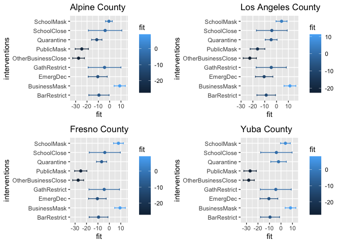
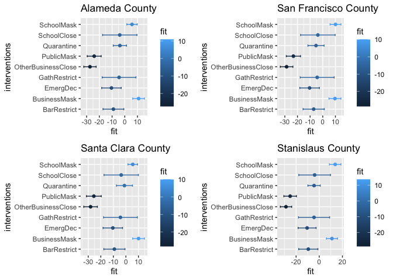

# Abstract

This notebook has two objectives. Firstly, it aims to measure the effect of interventions on mobility with other potential confounding signals such as confirmed case counts. The motivation is to observe whether the effect of intervention is greater than the effect of case signals on mobility. Secondly, we will rank the effects of various government interventions.

Due to the limitation of computation, we focus on analyzing the state of California and its counties. We will regress mobility signals on the covariates of interests and measure the effect of the covariates based on its regression coefficients.


```r
library(dplyr)
library(lubridate)
library(covidcast)
library(RcppRoll)
library(tidycensus)
library(reshape2)
library(zoo)
library(readxl)
library(ggplot2)
library(gridExtra)


source("code/loader.r")
source("code/parser.r")

# Load files 
confirmed_7dav_cumulative_prop <- read_excel("data/case_signals/ca-county-confirmed_7dav_cumulative_prop.xlsx")
 
confirmed_7dav_incidence_prop <- read_excel("data/case_signals/ca-county-confirmed_7dav_incidence_prop.xlsx")
 
deaths_7dav_cumulative_prop <- read_excel("data/case_signals/ca-county-deaths_7dav_cumulative_prop.xlsx")
# 
deaths_7dav_incidence_prop <- read_excel("data/case_signals/ca-county-deaths_7dav_incidence_prop.xlsx")

STARTDATE <- "2020-02-20"
ENDDATE <- "2021-01-03"

# Get fips codes
ca.fips_codes <- fips_codes %>% filter(state=="CA") %>%
  mutate(fips = paste(state_code, county_code , sep=""))


temp.ca.ftime <- read.csv("data/20200220-ca-ftime.csv",
                                       stringsAsFactors = F)

#temp.ca.ftime <- covidcast_signal(data_source = "safegraph", 
#                            signal ="full_time_work_prop",
#                            start_day = STARTDATE, 
#                            end_day = ENDDATE,
#                            geo_type = "county", 
#                            geo_values = ca.fips_codes$fips)


# preprocess data types
 confirmed_7dav_cumulative_prop$time_value <- as.Date(confirmed_7dav_cumulative_prop$time_value)
 
 confirmed_7dav_incidence_prop$time_value <- as.Date(confirmed_7dav_incidence_prop$time_value)
 
 deaths_7dav_cumulative_prop$time_value <- as.Date(deaths_7dav_cumulative_prop$time_value)
 
 deaths_7dav_incidence_prop$time_value <- as.Date(deaths_7dav_incidence_prop$time_value)
 
 temp.ca.ftime$time_value <- as.Date(temp.ca.ftime$time_value)
 
 confirmed_7dav_cumulative_prop$geo_value <- paste("0", confirmed_7dav_cumulative_prop$geo_value, sep="" )
 
 confirmed_7dav_incidence_prop$geo_value <- paste("0", confirmed_7dav_incidence_prop$geo_value, sep="" )
 
 deaths_7dav_cumulative_prop$geo_value <- paste("0", deaths_7dav_cumulative_prop$geo_value, sep="" )
 
 deaths_7dav_incidence_prop$geo_value <- paste("0", deaths_7dav_incidence_prop$geo_value, sep="" )
 
temp.ca.ftime$geo_value <- paste("0",temp.ca.ftime$geo_value, sep="")


# Policy data
policy <- load_policy()
ca.policy <- policy %>% filter(StatePostal == "ca", StateWide == 1)

# filter all counties
# California mobility signal
ca.ftime <- read.csv("data/ca.ftime.csv")
ca.counties <- as.character(unique(ca.ftime$county))


ca.policy_signal<- getSumOfPolicy(ca.policy , STARTDATE, ENDDATE)

# Turn the polical signal to be factors
factored.ca.policy.signal <- cbind(ca.policy_signal[1], 
                                lapply(ca.policy_signal[3:14],
                                       as.factor),
                                ca.policy_signal[15:16])
```


```r
################ getForwardDays () ###################
# compute the number of days within a given day range that
# gives the highest spearman correlation between df1 and df2

# argument
# df1: a dataframe 
# df2: a dataframe that the data needs to be forwarded
# dt_vec: a vector contains a range of integers

getForwardDays <- function(df1, df2, dt_vec){
  # Empty list
  df_list <- vector("list", length(dt_vec))
  
  for (i in 1:length(dt_vec)) {
    df_list[[i]] <- covidcast_cor(df1, df2, dt_y = dt_vec[i],
                                  by = "geo_value", 
                                  method="spearman")

    df_list[[i]]$dt <- dt_vec[i]
  }
  
  # Stack into one big data frame
  df <- do.call(rbind, df_list)
  

  return(df)
}
```

# Lag analysis

We would like to forward mobility in time that is most correlated with the respective case count signals and use those case count signals in regression.


```r
# We want to select the day in which the case count is most correlated with the mobility in terms of spearman correlation in time

dt_vec = 0:100

# Confirmed cases
cum.confirmed.case.cor.df <- getForwardDays(temp.ca.ftime,confirmed_7dav_cumulative_prop, dt_vec)


daily.new.case.cor.df <- getForwardDays(temp.ca.ftime,confirmed_7dav_incidence_prop, dt_vec)

# Death case
cum.death.cor.df <- getForwardDays(temp.ca.ftime,deaths_7dav_cumulative_prop, dt_vec)

daily.death.case.cor.df <- getForwardDays(temp.ca.ftime,deaths_7dav_incidence_prop, dt_vec)
```


```r
# Combine case and mobility
cum.confirmed.case <- confirmed_7dav_cumulative_prop[c("time_value","geo_value","value")]
new.confirmed.case <- confirmed_7dav_incidence_prop[c("time_value","geo_value","value")]
cum.death.case <- deaths_7dav_cumulative_prop[c("time_value","geo_value","value")]
new.death.case <- deaths_7dav_incidence_prop[c("time_value","geo_value","value")]
mobility <- temp.ca.ftime

# change name
colnames(mobility)[7] <- "full_time_work_prop"
colnames(cum.confirmed.case)[3] <- "confirmed_7dav_cumulative_prop"
colnames(new.confirmed.case)[3] <- "confirmed_7dav_incidence_prop"
colnames(cum.death.case)[3] <- "deaths_7dav_cumulative_prop"
colnames(new.death.case)[3] <- "deaths_7dav_incidence_prop"

# A list of confounders
confounders <- list(cum.confirmed.case, 
                    new.confirmed.case, 
                    cum.death.case,
                    new.death.case)

# Left join again with all other potential confounders
for (confounder in confounders){
  mobility <- left_join(mobility, confounder, by=c("time_value", "geo_value"))
}

# combine with policy signal
mobility <- left_join(mobility, factored.ca.policy.signal, by=c("time_value"))
```

## Model 1:

$$Y_t = \beta_{0}+ \sum_{i}\beta_{i}S_{i_{t}} + \sum_{k}\beta_{k}P_{k_{t-r}}$$, where $r$ varies depending on the county and the correlation between case signal and response


```r
cof_ls <- list()
count <- 1

for(county in ca.fips_codes$fips){
  
  selected.df <- mobility %>% filter(geo_value==county)
  county.mobility <- mobility %>% filter(geo_value==county)
  
  # Get the days for most correlated
  
  # filter the data
  filtered.confirmed.case.df <- cum.confirmed.case.cor.df %>%
    filter(geo_value == county)
  
  filtered.daily.new.case.df <- daily.new.case.cor.df %>%
    filter(geo_value == county)
  
  filtered.cum.death.df <- cum.death.cor.df %>%
    filter(geo_value == county)
  
  filtered.daily.death.case.df <- daily.death.case.cor.df %>%
    filter(geo_value == county)
  
  # if there is no missing value, we go ahead to compute the switch time
  if(!any(is.na(filtered.confirmed.case.df$value))){
    
    days <- min(filtered.confirmed.case.df[abs(filtered.confirmed.case.df$value) == max(abs(filtered.confirmed.case.df$value)),]$dt)
    
    # switch the column 
    state<-county
    
    selected.df <- shiftDays(county.mobility, selected.df, days, c("confirmed_7dav_cumulative_prop"))
    
  }
  
  if(!any(is.na(filtered.daily.new.case.df$value))){
    
    days <- min(filtered.daily.new.case.df[abs(filtered.daily.new.case.df$value) == max(abs(filtered.daily.new.case.df$value)),]$dt)
      
    # switch the column 
    state<-county
    
    selected.df <- shiftDays(county.mobility, selected.df, days, c("confirmed_7dav_incidence_prop"))
    
  }
  
  if(!any(is.na(filtered.cum.death.df$value))){
    
    days <- min(filtered.cum.death.df[abs(filtered.cum.death.df$value) == max(abs(filtered.cum.death.df$value)),]$dt)
      
    # switch the column 
    state<-county
    
    selected.df <- shiftDays(county.mobility, selected.df, days, c("deaths_7dav_cumulative_prop"))
    
  }
  
  if(!any(is.na(filtered.daily.death.case.df$value))){
    
    days <- min(filtered.daily.death.case.df[abs(filtered.daily.death.case.df$value) == max(abs(filtered.daily.death.case.df$value)),]$dt)
      
    # switch the column 
    state<-county
    
    selected.df <- shiftDays(county.mobility, selected.df, days, c("deaths_7dav_incidence_prop"))
    
  }


  # fit the regression
   p <- selected.df  %>%
     mutate(sumEmergDec = roll_sum(EmergDec, 2, align = "right", fill = NA),
            sumGathRestrict=roll_sum(GathRestrict, 2, align = "right", fill = NA),
            sumSchoolClose=roll_sum(SchoolClose, 2, align = "right", fill = NA),
            sumBarRestrict=roll_sum(BarRestrict, 2, align = "right", fill = NA),
            sumPublicMask=roll_sum(PublicMask, 2, align = "right", fill = NA),
            sumOtherBusinessClose=roll_sum(OtherBusinessClose, 2, align = "right", fill = NA),
            sumSchoolMask=roll_sum(SchoolMask, 2, align = "right", fill = NA),
            sumQuarantine=roll_sum(Quarantine, 2, align = "right", fill = NA),
            sumBusinessMask=roll_sum(BusinessMask, 2, align = "right", fill = NA)
            ) %>%
     lm(full_time_work_prop ~ confirmed_7dav_cumulative_prop+confirmed_7dav_incidence_prop+deaths_7dav_cumulative_prop+deaths_7dav_incidence_prop+sumEmergDec + sumGathRestrict+sumSchoolClose+sumBarRestrict+sumPublicMask+sumOtherBusinessClose+sumBusinessMask+sumSchoolMask+sumQuarantine, data=.)
   
   
   # record the result
   cof_ls[[count]] <- p
   count <- count + 1
}

# Print all summaries
for(fit in cof_ls){
  print(summary(fit))
}
```

```
## 
## Call:
## lm(formula = full_time_work_prop ~ confirmed_7dav_cumulative_prop + 
##     confirmed_7dav_incidence_prop + deaths_7dav_cumulative_prop + 
##     deaths_7dav_incidence_prop + sumEmergDec + sumGathRestrict + 
##     sumSchoolClose + sumBarRestrict + sumPublicMask + sumOtherBusinessClose + 
##     sumBusinessMask + sumSchoolMask + sumQuarantine, data = .)
## 
## Residuals:
##     Min      1Q  Median      3Q     Max 
## -27.132  -6.626   1.438   6.433  17.150 
## 
## Coefficients: (5 not defined because of singularities)
##                                Estimate Std. Error t value Pr(>|t|)    
## (Intercept)                    50.26843   13.01672   3.862 0.000146 ***
## confirmed_7dav_cumulative_prop -0.02397    0.01170  -2.048 0.041676 *  
## confirmed_7dav_incidence_prop   1.65608    0.29178   5.676 4.08e-08 ***
## deaths_7dav_cumulative_prop     0.23752    0.68793   0.345 0.730205    
## deaths_7dav_incidence_prop      9.82935    8.93758   1.100 0.272564    
## sumEmergDec                          NA         NA      NA       NA    
## sumGathRestrict                      NA         NA      NA       NA    
## sumSchoolClose                       NA         NA      NA       NA    
## sumBarRestrict                       NA         NA      NA       NA    
## sumPublicMask                        NA         NA      NA       NA    
## sumOtherBusinessClose          -5.79982    3.26676  -1.775 0.077136 .  
## sumBusinessMask                 4.54355    1.31032   3.468 0.000625 ***
## sumSchoolMask                   0.46378    1.07132   0.433 0.665481    
## sumQuarantine                  -1.05085    1.93447  -0.543 0.587495    
## ---
## Signif. codes:  0 '***' 0.001 '**' 0.01 '*' 0.05 '.' 0.1 ' ' 1
## 
## Residual standard error: 9.033 on 233 degrees of freedom
##   (77 observations deleted due to missingness)
## Multiple R-squared:  0.4796,	Adjusted R-squared:  0.4617 
## F-statistic: 26.84 on 8 and 233 DF,  p-value: < 2.2e-16
## 
## 
## Call:
## lm(formula = full_time_work_prop ~ confirmed_7dav_cumulative_prop + 
##     confirmed_7dav_incidence_prop + deaths_7dav_cumulative_prop + 
##     deaths_7dav_incidence_prop + sumEmergDec + sumGathRestrict + 
##     sumSchoolClose + sumBarRestrict + sumPublicMask + sumOtherBusinessClose + 
##     sumBusinessMask + sumSchoolMask + sumQuarantine, data = .)
## 
## Residuals:
##      Min       1Q   Median       3Q      Max 
## -23.1035  -6.6255   0.3963   6.6419  15.4400 
## 
## Coefficients: (7 not defined because of singularities)
##                                  Estimate Std. Error t value Pr(>|t|)    
## (Intercept)                     85.455149   3.678718  23.230  < 2e-16 ***
## confirmed_7dav_cumulative_prop  -0.021477   0.004067  -5.281 2.69e-07 ***
## confirmed_7dav_incidence_prop   -0.059034   0.012371  -4.772 3.03e-06 ***
## deaths_7dav_cumulative_prop            NA         NA      NA       NA    
## deaths_7dav_incidence_prop             NA         NA      NA       NA    
## sumEmergDec                            NA         NA      NA       NA    
## sumGathRestrict                        NA         NA      NA       NA    
## sumSchoolClose                         NA         NA      NA       NA    
## sumBarRestrict                         NA         NA      NA       NA    
## sumPublicMask                          NA         NA      NA       NA    
## sumOtherBusinessClose          -11.866307   1.324628  -8.958  < 2e-16 ***
## sumBusinessMask                  6.328407   1.252473   5.053 8.16e-07 ***
## sumSchoolMask                   -0.456363   0.732008  -0.623    0.534    
## sumQuarantine                   -6.513096   0.828263  -7.864 9.67e-14 ***
## ---
## Signif. codes:  0 '***' 0.001 '**' 0.01 '*' 0.05 '.' 0.1 ' ' 1
## 
## Residual standard error: 8.758 on 263 degrees of freedom
##   (49 observations deleted due to missingness)
## Multiple R-squared:  0.5932,	Adjusted R-squared:  0.5839 
## F-statistic: 63.92 on 6 and 263 DF,  p-value: < 2.2e-16
## 
## 
## Call:
## lm(formula = full_time_work_prop ~ confirmed_7dav_cumulative_prop + 
##     confirmed_7dav_incidence_prop + deaths_7dav_cumulative_prop + 
##     deaths_7dav_incidence_prop + sumEmergDec + sumGathRestrict + 
##     sumSchoolClose + sumBarRestrict + sumPublicMask + sumOtherBusinessClose + 
##     sumBusinessMask + sumSchoolMask + sumQuarantine, data = .)
## 
## Residuals:
##      Min       1Q   Median       3Q      Max 
## -24.4506  -5.8729   0.9089   6.3373  16.6305 
## 
## Coefficients: (6 not defined because of singularities)
##                                 Estimate Std. Error t value Pr(>|t|)    
## (Intercept)                    14.973356  12.064512   1.241 0.215912    
## confirmed_7dav_cumulative_prop  0.005705   0.004756   1.199 0.231705    
## confirmed_7dav_incidence_prop  -0.055815   0.015238  -3.663 0.000314 ***
## deaths_7dav_cumulative_prop    -0.478738   0.082414  -5.809 2.23e-08 ***
## deaths_7dav_incidence_prop      1.886842   0.668274   2.823 0.005195 ** 
## sumEmergDec                           NA         NA      NA       NA    
## sumGathRestrict                       NA         NA      NA       NA    
## sumSchoolClose                        NA         NA      NA       NA    
## sumBarRestrict                        NA         NA      NA       NA    
## sumPublicMask                         NA         NA      NA       NA    
## sumOtherBusinessClose                 NA         NA      NA       NA    
## sumBusinessMask                 9.698039   2.949153   3.288 0.001176 ** 
## sumSchoolMask                  -1.041437   0.790816  -1.317 0.189263    
## sumQuarantine                  -3.003055   1.651957  -1.818 0.070468 .  
## ---
## Signif. codes:  0 '***' 0.001 '**' 0.01 '*' 0.05 '.' 0.1 ' ' 1
## 
## Residual standard error: 8.618 on 216 degrees of freedom
##   (95 observations deleted due to missingness)
## Multiple R-squared:  0.5541,	Adjusted R-squared:  0.5397 
## F-statistic: 38.35 on 7 and 216 DF,  p-value: < 2.2e-16
## 
## 
## Call:
## lm(formula = full_time_work_prop ~ confirmed_7dav_cumulative_prop + 
##     confirmed_7dav_incidence_prop + deaths_7dav_cumulative_prop + 
##     deaths_7dav_incidence_prop + sumEmergDec + sumGathRestrict + 
##     sumSchoolClose + sumBarRestrict + sumPublicMask + sumOtherBusinessClose + 
##     sumBusinessMask + sumSchoolMask + sumQuarantine, data = .)
## 
## Residuals:
##      Min       1Q   Median       3Q      Max 
## -22.5839  -6.1574   0.3083   6.3416  16.0256 
## 
## Coefficients: (6 not defined because of singularities)
##                                Estimate Std. Error t value Pr(>|t|)   
## (Intercept)                     6.50052   15.81918   0.411  0.68154   
## confirmed_7dav_cumulative_prop  0.01477    0.01022   1.444  0.15012   
## confirmed_7dav_incidence_prop   0.31622    0.17811   1.775  0.07724 . 
## deaths_7dav_cumulative_prop    -2.24891    0.74110  -3.035  0.00271 **
## deaths_7dav_incidence_prop     -6.62166    7.39726  -0.895  0.37171   
## sumEmergDec                          NA         NA      NA       NA   
## sumGathRestrict                      NA         NA      NA       NA   
## sumSchoolClose                       NA         NA      NA       NA   
## sumBarRestrict                       NA         NA      NA       NA   
## sumPublicMask                        NA         NA      NA       NA   
## sumOtherBusinessClose                NA         NA      NA       NA   
## sumBusinessMask                10.75033    3.88032   2.770  0.00609 **
## sumSchoolMask                  -0.89821    0.79735  -1.126  0.26122   
## sumQuarantine                  -1.06077    1.84629  -0.575  0.56620   
## ---
## Signif. codes:  0 '***' 0.001 '**' 0.01 '*' 0.05 '.' 0.1 ' ' 1
## 
## Residual standard error: 8.529 on 215 degrees of freedom
##   (96 observations deleted due to missingness)
## Multiple R-squared:  0.5637,	Adjusted R-squared:  0.5495 
## F-statistic: 39.69 on 7 and 215 DF,  p-value: < 2.2e-16
## 
## 
## Call:
## lm(formula = full_time_work_prop ~ confirmed_7dav_cumulative_prop + 
##     confirmed_7dav_incidence_prop + deaths_7dav_cumulative_prop + 
##     deaths_7dav_incidence_prop + sumEmergDec + sumGathRestrict + 
##     sumSchoolClose + sumBarRestrict + sumPublicMask + sumOtherBusinessClose + 
##     sumBusinessMask + sumSchoolMask + sumQuarantine, data = .)
## 
## Residuals:
##      Min       1Q   Median       3Q      Max 
## -23.7283  -6.6328   0.5458   6.9500  15.3735 
## 
## Coefficients: (7 not defined because of singularities)
##                                 Estimate Std. Error t value Pr(>|t|)    
## (Intercept)                    57.210423   4.191026  13.651  < 2e-16 ***
## confirmed_7dav_cumulative_prop -0.002259   0.003645  -0.620  0.53605    
## confirmed_7dav_incidence_prop  -0.082536   0.073854  -1.118  0.26502    
## deaths_7dav_cumulative_prop    -0.692111   0.259655  -2.665  0.00828 ** 
## deaths_7dav_incidence_prop      1.162415   1.239650   0.938  0.34947    
## sumEmergDec                           NA         NA      NA       NA    
## sumGathRestrict                       NA         NA      NA       NA    
## sumSchoolClose                        NA         NA      NA       NA    
## sumBarRestrict                        NA         NA      NA       NA    
## sumPublicMask                         NA         NA      NA       NA    
## sumOtherBusinessClose                 NA         NA      NA       NA    
## sumBusinessMask                       NA         NA      NA       NA    
## sumSchoolMask                  -0.252059   1.110205  -0.227  0.82061    
## sumQuarantine                  -4.931335   1.223695  -4.030 7.78e-05 ***
## ---
## Signif. codes:  0 '***' 0.001 '**' 0.01 '*' 0.05 '.' 0.1 ' ' 1
## 
## Residual standard error: 8.633 on 212 degrees of freedom
##   (100 observations deleted due to missingness)
## Multiple R-squared:  0.549,	Adjusted R-squared:  0.5363 
## F-statistic: 43.02 on 6 and 212 DF,  p-value: < 2.2e-16
## 
## 
## Call:
## lm(formula = full_time_work_prop ~ confirmed_7dav_cumulative_prop + 
##     confirmed_7dav_incidence_prop + deaths_7dav_cumulative_prop + 
##     deaths_7dav_incidence_prop + sumEmergDec + sumGathRestrict + 
##     sumSchoolClose + sumBarRestrict + sumPublicMask + sumOtherBusinessClose + 
##     sumBusinessMask + sumSchoolMask + sumQuarantine, data = .)
## 
## Residuals:
##     Min      1Q  Median      3Q     Max 
## -23.152  -7.154   1.097   7.340  15.839 
## 
## Coefficients: (7 not defined because of singularities)
##                                 Estimate Std. Error t value Pr(>|t|)    
## (Intercept)                    50.832536   5.897756   8.619 1.54e-15 ***
## confirmed_7dav_cumulative_prop -0.009741   0.002865  -3.400 0.000805 ***
## confirmed_7dav_incidence_prop   0.046588   0.094320   0.494 0.621859    
## deaths_7dav_cumulative_prop     0.089630   0.130970   0.684 0.494493    
## deaths_7dav_incidence_prop      8.264474   2.793250   2.959 0.003438 ** 
## sumEmergDec                           NA         NA      NA       NA    
## sumGathRestrict                       NA         NA      NA       NA    
## sumSchoolClose                        NA         NA      NA       NA    
## sumBarRestrict                        NA         NA      NA       NA    
## sumPublicMask                         NA         NA      NA       NA    
## sumOtherBusinessClose                 NA         NA      NA       NA    
## sumBusinessMask                       NA         NA      NA       NA    
## sumSchoolMask                  -0.927743   0.925686  -1.002 0.317374    
## sumQuarantine                  -1.412627   2.521669  -0.560 0.575935    
## ---
## Signif. codes:  0 '***' 0.001 '**' 0.01 '*' 0.05 '.' 0.1 ' ' 1
## 
## Residual standard error: 9.542 on 213 degrees of freedom
##   (99 observations deleted due to missingness)
## Multiple R-squared:  0.4504,	Adjusted R-squared:  0.4349 
## F-statistic: 29.09 on 6 and 213 DF,  p-value: < 2.2e-16
## 
## 
## Call:
## lm(formula = full_time_work_prop ~ confirmed_7dav_cumulative_prop + 
##     confirmed_7dav_incidence_prop + deaths_7dav_cumulative_prop + 
##     deaths_7dav_incidence_prop + sumEmergDec + sumGathRestrict + 
##     sumSchoolClose + sumBarRestrict + sumPublicMask + sumOtherBusinessClose + 
##     sumBusinessMask + sumSchoolMask + sumQuarantine, data = .)
## 
## Residuals:
##      Min       1Q   Median       3Q      Max 
## -19.5298  -4.6700  -0.9225   5.4128  17.3432 
## 
## Coefficients: (5 not defined because of singularities)
##                                  Estimate Std. Error t value Pr(>|t|)    
## (Intercept)                    108.117958   7.183235  15.051  < 2e-16 ***
## confirmed_7dav_cumulative_prop  -0.079722   0.007766 -10.266  < 2e-16 ***
## confirmed_7dav_incidence_prop   -0.076977   0.193233  -0.398    0.691    
## deaths_7dav_cumulative_prop      8.159163   0.841194   9.699  < 2e-16 ***
## deaths_7dav_incidence_prop      12.620396  11.042646   1.143    0.254    
## sumEmergDec                            NA         NA      NA       NA    
## sumGathRestrict                        NA         NA      NA       NA    
## sumSchoolClose                         NA         NA      NA       NA    
## sumBarRestrict                         NA         NA      NA       NA    
## sumPublicMask                          NA         NA      NA       NA    
## sumOtherBusinessClose          -11.819438   1.505756  -7.850 1.32e-13 ***
## sumBusinessMask                  1.219120   1.193712   1.021    0.308    
## sumSchoolMask                   -8.570613   1.370251  -6.255 1.77e-09 ***
## sumQuarantine                   -9.639868   1.661017  -5.804 2.01e-08 ***
## ---
## Signif. codes:  0 '***' 0.001 '**' 0.01 '*' 0.05 '.' 0.1 ' ' 1
## 
## Residual standard error: 7.913 on 244 degrees of freedom
##   (66 observations deleted due to missingness)
## Multiple R-squared:  0.6014,	Adjusted R-squared:  0.5883 
## F-statistic: 46.01 on 8 and 244 DF,  p-value: < 2.2e-16
## 
## 
## Call:
## lm(formula = full_time_work_prop ~ confirmed_7dav_cumulative_prop + 
##     confirmed_7dav_incidence_prop + deaths_7dav_cumulative_prop + 
##     deaths_7dav_incidence_prop + sumEmergDec + sumGathRestrict + 
##     sumSchoolClose + sumBarRestrict + sumPublicMask + sumOtherBusinessClose + 
##     sumBusinessMask + sumSchoolMask + sumQuarantine, data = .)
## 
## Residuals:
##     Min      1Q  Median      3Q     Max 
## -24.907  -7.046   1.673   7.323  15.602 
## 
## Coefficients: (7 not defined because of singularities)
##                                Estimate Std. Error t value Pr(>|t|)    
## (Intercept)                    58.26634    5.10431  11.415  < 2e-16 ***
## confirmed_7dav_cumulative_prop -0.04285    0.01434  -2.988  0.00314 ** 
## confirmed_7dav_incidence_prop   0.74448    0.25132   2.962  0.00340 ** 
## deaths_7dav_cumulative_prop     1.92930    0.84617   2.280  0.02360 *  
## deaths_7dav_incidence_prop     11.01418    8.62681   1.277  0.20309    
## sumEmergDec                          NA         NA      NA       NA    
## sumGathRestrict                      NA         NA      NA       NA    
## sumSchoolClose                       NA         NA      NA       NA    
## sumBarRestrict                       NA         NA      NA       NA    
## sumPublicMask                        NA         NA      NA       NA    
## sumOtherBusinessClose                NA         NA      NA       NA    
## sumBusinessMask                      NA         NA      NA       NA    
## sumSchoolMask                  -0.89679    0.99774  -0.899  0.36977    
## sumQuarantine                  -4.98630    1.77154  -2.815  0.00534 ** 
## ---
## Signif. codes:  0 '***' 0.001 '**' 0.01 '*' 0.05 '.' 0.1 ' ' 1
## 
## Residual standard error: 9.433 on 212 degrees of freedom
##   (100 observations deleted due to missingness)
## Multiple R-squared:  0.4616,	Adjusted R-squared:  0.4463 
## F-statistic: 30.29 on 6 and 212 DF,  p-value: < 2.2e-16
## 
## 
## Call:
## lm(formula = full_time_work_prop ~ confirmed_7dav_cumulative_prop + 
##     confirmed_7dav_incidence_prop + deaths_7dav_cumulative_prop + 
##     deaths_7dav_incidence_prop + sumEmergDec + sumGathRestrict + 
##     sumSchoolClose + sumBarRestrict + sumPublicMask + sumOtherBusinessClose + 
##     sumBusinessMask + sumSchoolMask + sumQuarantine, data = .)
## 
## Residuals:
##      Min       1Q   Median       3Q      Max 
## -23.1161  -6.1501  -0.2372   6.3718  20.1206 
## 
## Coefficients: (5 not defined because of singularities)
##                                  Estimate Std. Error t value Pr(>|t|)    
## (Intercept)                     56.361019   6.321961   8.915  < 2e-16 ***
## confirmed_7dav_cumulative_prop  -0.049558   0.007933  -6.247 1.87e-09 ***
## confirmed_7dav_incidence_prop    0.958581   0.339189   2.826  0.00511 ** 
## deaths_7dav_cumulative_prop      8.404414   2.124867   3.955  0.00010 ***
## deaths_7dav_incidence_prop     -32.149895  21.071457  -1.526  0.12838    
## sumEmergDec                            NA         NA      NA       NA    
## sumGathRestrict                        NA         NA      NA       NA    
## sumSchoolClose                         NA         NA      NA       NA    
## sumBarRestrict                         NA         NA      NA       NA    
## sumPublicMask                          NA         NA      NA       NA    
## sumOtherBusinessClose           -7.503773   1.687753  -4.446 1.33e-05 ***
## sumBusinessMask                  5.248096   1.220453   4.300 2.48e-05 ***
## sumSchoolMask                    2.332908   0.963416   2.421  0.01619 *  
## sumQuarantine                   -2.470459   1.434698  -1.722  0.08636 .  
## ---
## Signif. codes:  0 '***' 0.001 '**' 0.01 '*' 0.05 '.' 0.1 ' ' 1
## 
## Residual standard error: 8.754 on 242 degrees of freedom
##   (68 observations deleted due to missingness)
## Multiple R-squared:  0.509,	Adjusted R-squared:  0.4927 
## F-statistic: 31.35 on 8 and 242 DF,  p-value: < 2.2e-16
## 
## 
## Call:
## lm(formula = full_time_work_prop ~ confirmed_7dav_cumulative_prop + 
##     confirmed_7dav_incidence_prop + deaths_7dav_cumulative_prop + 
##     deaths_7dav_incidence_prop + sumEmergDec + sumGathRestrict + 
##     sumSchoolClose + sumBarRestrict + sumPublicMask + sumOtherBusinessClose + 
##     sumBusinessMask + sumSchoolMask + sumQuarantine, data = .)
## 
## Residuals:
##      Min       1Q   Median       3Q      Max 
## -20.1053  -6.0094  -0.2767   6.9337  20.6794 
## 
## Coefficients: (5 not defined because of singularities)
##                                 Estimate Std. Error t value Pr(>|t|)    
## (Intercept)                     93.16020    4.84961  19.210  < 2e-16 ***
## confirmed_7dav_cumulative_prop  -0.03177    0.00615  -5.167 4.72e-07 ***
## confirmed_7dav_incidence_prop    0.40554    0.16738   2.423 0.016076 *  
## deaths_7dav_cumulative_prop      2.13584    0.44836   4.764 3.15e-06 ***
## deaths_7dav_incidence_prop      13.22869    7.09125   1.865 0.063230 .  
## sumEmergDec                           NA         NA      NA       NA    
## sumGathRestrict                       NA         NA      NA       NA    
## sumSchoolClose                        NA         NA      NA       NA    
## sumBarRestrict                        NA         NA      NA       NA    
## sumPublicMask                         NA         NA      NA       NA    
## sumOtherBusinessClose          -13.27959    1.33803  -9.925  < 2e-16 ***
## sumBusinessMask                  4.16818    1.24836   3.339 0.000963 ***
## sumSchoolMask                    0.69993    1.12995   0.619 0.536169    
## sumQuarantine                   -7.65831    1.38304  -5.537 7.46e-08 ***
## ---
## Signif. codes:  0 '***' 0.001 '**' 0.01 '*' 0.05 '.' 0.1 ' ' 1
## 
## Residual standard error: 8.892 on 262 degrees of freedom
##   (48 observations deleted due to missingness)
## Multiple R-squared:  0.5914,	Adjusted R-squared:  0.579 
## F-statistic: 47.41 on 8 and 262 DF,  p-value: < 2.2e-16
## 
## 
## Call:
## lm(formula = full_time_work_prop ~ confirmed_7dav_cumulative_prop + 
##     confirmed_7dav_incidence_prop + deaths_7dav_cumulative_prop + 
##     deaths_7dav_incidence_prop + sumEmergDec + sumGathRestrict + 
##     sumSchoolClose + sumBarRestrict + sumPublicMask + sumOtherBusinessClose + 
##     sumBusinessMask + sumSchoolMask + sumQuarantine, data = .)
## 
## Residuals:
##      Min       1Q   Median       3Q      Max 
## -22.6304  -7.1005   0.9938   6.9078  16.2217 
## 
## Coefficients: (6 not defined because of singularities)
##                                 Estimate Std. Error t value Pr(>|t|)    
## (Intercept)                    25.621818   6.759329   3.791 0.000193 ***
## confirmed_7dav_cumulative_prop -0.001692   0.001672  -1.012 0.312788    
## confirmed_7dav_incidence_prop  -0.023946   0.012124  -1.975 0.049499 *  
## deaths_7dav_cumulative_prop    -0.363267   0.055671  -6.525 4.50e-10 ***
## deaths_7dav_incidence_prop      0.047935   0.102744   0.467 0.641281    
## sumEmergDec                           NA         NA      NA       NA    
## sumGathRestrict                       NA         NA      NA       NA    
## sumSchoolClose                        NA         NA      NA       NA    
## sumBarRestrict                        NA         NA      NA       NA    
## sumPublicMask                         NA         NA      NA       NA    
## sumOtherBusinessClose                 NA         NA      NA       NA    
## sumBusinessMask                 7.134519   1.599695   4.460 1.30e-05 ***
## sumSchoolMask                   2.013275   0.871560   2.310 0.021804 *  
## sumQuarantine                  -6.278032   1.371178  -4.579 7.78e-06 ***
## ---
## Signif. codes:  0 '***' 0.001 '**' 0.01 '*' 0.05 '.' 0.1 ' ' 1
## 
## Residual standard error: 8.922 on 223 degrees of freedom
##   (88 observations deleted due to missingness)
## Multiple R-squared:  0.5122,	Adjusted R-squared:  0.4968 
## F-statistic: 33.45 on 7 and 223 DF,  p-value: < 2.2e-16
## 
## 
## Call:
## lm(formula = full_time_work_prop ~ confirmed_7dav_cumulative_prop + 
##     confirmed_7dav_incidence_prop + deaths_7dav_cumulative_prop + 
##     deaths_7dav_incidence_prop + sumEmergDec + sumGathRestrict + 
##     sumSchoolClose + sumBarRestrict + sumPublicMask + sumOtherBusinessClose + 
##     sumBusinessMask + sumSchoolMask + sumQuarantine, data = .)
## 
## Residuals:
##      Min       1Q   Median       3Q      Max 
## -25.3885  -6.6706   0.7561   6.2616  19.6687 
## 
## Coefficients: (6 not defined because of singularities)
##                                 Estimate Std. Error t value Pr(>|t|)    
## (Intercept)                    -23.23137   36.45807  -0.637 0.524671    
## confirmed_7dav_cumulative_prop   0.00763    0.01512   0.505 0.614377    
## confirmed_7dav_incidence_prop    2.28988    0.55389   4.134 5.11e-05 ***
## deaths_7dav_cumulative_prop     -3.52867    1.03216  -3.419 0.000753 ***
## deaths_7dav_incidence_prop     -20.41297   13.43885  -1.519 0.130251    
## sumEmergDec                           NA         NA      NA       NA    
## sumGathRestrict                       NA         NA      NA       NA    
## sumSchoolClose                        NA         NA      NA       NA    
## sumBarRestrict                        NA         NA      NA       NA    
## sumPublicMask                         NA         NA      NA       NA    
## sumOtherBusinessClose                 NA         NA      NA       NA    
## sumBusinessMask                 19.21102    9.12527   2.105 0.036435 *  
## sumSchoolMask                    1.29330    0.99819   1.296 0.196491    
## sumQuarantine                   -6.46212    1.44821  -4.462 1.31e-05 ***
## ---
## Signif. codes:  0 '***' 0.001 '**' 0.01 '*' 0.05 '.' 0.1 ' ' 1
## 
## Residual standard error: 9.034 on 214 degrees of freedom
##   (97 observations deleted due to missingness)
## Multiple R-squared:  0.5106,	Adjusted R-squared:  0.4946 
## F-statistic:  31.9 on 7 and 214 DF,  p-value: < 2.2e-16
## 
## 
## Call:
## lm(formula = full_time_work_prop ~ confirmed_7dav_cumulative_prop + 
##     confirmed_7dav_incidence_prop + deaths_7dav_cumulative_prop + 
##     deaths_7dav_incidence_prop + sumEmergDec + sumGathRestrict + 
##     sumSchoolClose + sumBarRestrict + sumPublicMask + sumOtherBusinessClose + 
##     sumBusinessMask + sumSchoolMask + sumQuarantine, data = .)
## 
## Residuals:
##     Min      1Q  Median      3Q     Max 
## -24.947  -7.232  -0.187   7.269  16.835 
## 
## Coefficients: (5 not defined because of singularities)
##                                  Estimate Std. Error t value Pr(>|t|)    
## (Intercept)                    53.1110728  9.2125821   5.765 2.52e-08 ***
## confirmed_7dav_cumulative_prop -0.0043110  0.0014256  -3.024  0.00277 ** 
## confirmed_7dav_incidence_prop  -0.0002785  0.0425621  -0.007  0.99478    
## deaths_7dav_cumulative_prop     0.0688686  0.0390197   1.765  0.07885 .  
## deaths_7dav_incidence_prop      3.3481241  1.2804498   2.615  0.00950 ** 
## sumEmergDec                            NA         NA      NA       NA    
## sumGathRestrict                        NA         NA      NA       NA    
## sumSchoolClose                         NA         NA      NA       NA    
## sumBarRestrict                         NA         NA      NA       NA    
## sumPublicMask                          NA         NA      NA       NA    
## sumOtherBusinessClose          -6.6569381  2.0836195  -3.195  0.00159 ** 
## sumBusinessMask                 6.3655598  1.3799186   4.613 6.49e-06 ***
## sumSchoolMask                   4.7350034  2.0287464   2.334  0.02043 *  
## sumQuarantine                  -6.3409501  1.5119077  -4.194 3.87e-05 ***
## ---
## Signif. codes:  0 '***' 0.001 '**' 0.01 '*' 0.05 '.' 0.1 ' ' 1
## 
## Residual standard error: 9.338 on 238 degrees of freedom
##   (72 observations deleted due to missingness)
## Multiple R-squared:  0.4391,	Adjusted R-squared:  0.4202 
## F-statistic: 23.29 on 8 and 238 DF,  p-value: < 2.2e-16
## 
## 
## Call:
## lm(formula = full_time_work_prop ~ confirmed_7dav_cumulative_prop + 
##     confirmed_7dav_incidence_prop + deaths_7dav_cumulative_prop + 
##     deaths_7dav_incidence_prop + sumEmergDec + sumGathRestrict + 
##     sumSchoolClose + sumBarRestrict + sumPublicMask + sumOtherBusinessClose + 
##     sumBusinessMask + sumSchoolMask + sumQuarantine, data = .)
## 
## Residuals:
##     Min      1Q  Median      3Q     Max 
## -23.464  -6.420   0.251   7.307  15.574 
## 
## Coefficients: (7 not defined because of singularities)
##                                Estimate Std. Error t value Pr(>|t|)    
## (Intercept)                    55.62982    6.37091   8.732 7.56e-16 ***
## confirmed_7dav_cumulative_prop  0.01347    0.01516   0.889  0.37527    
## confirmed_7dav_incidence_prop  -0.03629    0.05614  -0.646  0.51875    
## deaths_7dav_cumulative_prop    -0.43227    0.14579  -2.965  0.00337 ** 
## deaths_7dav_incidence_prop      1.07627    0.70573   1.525  0.12874    
## sumEmergDec                          NA         NA      NA       NA    
## sumGathRestrict                      NA         NA      NA       NA    
## sumSchoolClose                       NA         NA      NA       NA    
## sumBarRestrict                       NA         NA      NA       NA    
## sumPublicMask                        NA         NA      NA       NA    
## sumOtherBusinessClose                NA         NA      NA       NA    
## sumBusinessMask                      NA         NA      NA       NA    
## sumSchoolMask                  -0.70640    1.04021  -0.679  0.49782    
## sumQuarantine                  -3.87630    2.40469  -1.612  0.10846    
## ---
## Signif. codes:  0 '***' 0.001 '**' 0.01 '*' 0.05 '.' 0.1 ' ' 1
## 
## Residual standard error: 8.647 on 212 degrees of freedom
##   (100 observations deleted due to missingness)
## Multiple R-squared:  0.5476,	Adjusted R-squared:  0.5348 
## F-statistic: 42.77 on 6 and 212 DF,  p-value: < 2.2e-16
## 
## 
## Call:
## lm(formula = full_time_work_prop ~ confirmed_7dav_cumulative_prop + 
##     confirmed_7dav_incidence_prop + deaths_7dav_cumulative_prop + 
##     deaths_7dav_incidence_prop + sumEmergDec + sumGathRestrict + 
##     sumSchoolClose + sumBarRestrict + sumPublicMask + sumOtherBusinessClose + 
##     sumBusinessMask + sumSchoolMask + sumQuarantine, data = .)
## 
## Residuals:
##      Min       1Q   Median       3Q      Max 
## -20.3069  -7.6112   0.1795   7.3642  18.3425 
## 
## Coefficients: (5 not defined because of singularities)
##                                 Estimate Std. Error t value Pr(>|t|)    
## (Intercept)                    82.916444   5.778045  14.350  < 2e-16 ***
## confirmed_7dav_cumulative_prop -0.009762   0.002220  -4.397 1.63e-05 ***
## confirmed_7dav_incidence_prop  -0.034184   0.040994  -0.834  0.40516    
## deaths_7dav_cumulative_prop     0.830064   0.195550   4.245 3.10e-05 ***
## deaths_7dav_incidence_prop     19.707552   6.255088   3.151  0.00183 ** 
## sumEmergDec                           NA         NA      NA       NA    
## sumGathRestrict                       NA         NA      NA       NA    
## sumSchoolClose                        NA         NA      NA       NA    
## sumBarRestrict                        NA         NA      NA       NA    
## sumPublicMask                         NA         NA      NA       NA    
## sumOtherBusinessClose          -8.798713   1.587998  -5.541 7.70e-08 ***
## sumBusinessMask                 3.664882   1.311476   2.794  0.00561 ** 
## sumSchoolMask                  -0.405184   1.070996  -0.378  0.70551    
## sumQuarantine                  -9.250406   1.355321  -6.825 6.75e-11 ***
## ---
## Signif. codes:  0 '***' 0.001 '**' 0.01 '*' 0.05 '.' 0.1 ' ' 1
## 
## Residual standard error: 9.148 on 247 degrees of freedom
##   (63 observations deleted due to missingness)
## Multiple R-squared:  0.4755,	Adjusted R-squared:  0.4585 
## F-statistic: 27.99 on 8 and 247 DF,  p-value: < 2.2e-16
## 
## 
## Call:
## lm(formula = full_time_work_prop ~ confirmed_7dav_cumulative_prop + 
##     confirmed_7dav_incidence_prop + deaths_7dav_cumulative_prop + 
##     deaths_7dav_incidence_prop + sumEmergDec + sumGathRestrict + 
##     sumSchoolClose + sumBarRestrict + sumPublicMask + sumOtherBusinessClose + 
##     sumBusinessMask + sumSchoolMask + sumQuarantine, data = .)
## 
## Residuals:
##      Min       1Q   Median       3Q      Max 
## -25.3942  -3.9111   0.0569   5.4976  17.3835 
## 
## Coefficients: (5 not defined because of singularities)
##                                 Estimate Std. Error t value Pr(>|t|)    
## (Intercept)                    65.303543   6.294768  10.374  < 2e-16 ***
## confirmed_7dav_cumulative_prop -0.009650   0.001129  -8.547 1.49e-15 ***
## confirmed_7dav_incidence_prop   0.078292   0.037110   2.110  0.03592 *  
## deaths_7dav_cumulative_prop     0.803068   0.101021   7.950 7.31e-14 ***
## deaths_7dav_incidence_prop      0.960342   1.069485   0.898  0.37011    
## sumEmergDec                           NA         NA      NA       NA    
## sumGathRestrict                       NA         NA      NA       NA    
## sumSchoolClose                        NA         NA      NA       NA    
## sumBarRestrict                        NA         NA      NA       NA    
## sumPublicMask                         NA         NA      NA       NA    
## sumOtherBusinessClose          -7.394034   1.659635  -4.455 1.29e-05 ***
## sumBusinessMask                 6.604909   1.144466   5.771 2.42e-08 ***
## sumSchoolMask                  -3.232023   1.110456  -2.911  0.00395 ** 
## sumQuarantine                  -3.552727   1.080112  -3.289  0.00116 ** 
## ---
## Signif. codes:  0 '***' 0.001 '**' 0.01 '*' 0.05 '.' 0.1 ' ' 1
## 
## Residual standard error: 8.088 on 240 degrees of freedom
##   (70 observations deleted due to missingness)
## Multiple R-squared:  0.5795,	Adjusted R-squared:  0.5654 
## F-statistic: 41.34 on 8 and 240 DF,  p-value: < 2.2e-16
## 
## 
## Call:
## lm(formula = full_time_work_prop ~ confirmed_7dav_cumulative_prop + 
##     confirmed_7dav_incidence_prop + deaths_7dav_cumulative_prop + 
##     deaths_7dav_incidence_prop + sumEmergDec + sumGathRestrict + 
##     sumSchoolClose + sumBarRestrict + sumPublicMask + sumOtherBusinessClose + 
##     sumBusinessMask + sumSchoolMask + sumQuarantine, data = .)
## 
## Residuals:
##      Min       1Q   Median       3Q      Max 
## -22.5593  -6.9654   0.9737   6.2741  20.3201 
## 
## Coefficients: (6 not defined because of singularities)
##                                  Estimate Std. Error t value Pr(>|t|)    
## (Intercept)                     12.964268  16.497872   0.786  0.43284    
## confirmed_7dav_cumulative_prop  -0.010080   0.009621  -1.048  0.29595    
## confirmed_7dav_incidence_prop    2.185573   0.309507   7.061 2.25e-11 ***
## deaths_7dav_cumulative_prop     -0.434500   0.398064  -1.092  0.27626    
## deaths_7dav_incidence_prop     -10.337409   4.472891  -2.311  0.02177 *  
## sumEmergDec                            NA         NA      NA       NA    
## sumGathRestrict                        NA         NA      NA       NA    
## sumSchoolClose                         NA         NA      NA       NA    
## sumBarRestrict                         NA         NA      NA       NA    
## sumPublicMask                          NA         NA      NA       NA    
## sumOtherBusinessClose                  NA         NA      NA       NA    
## sumBusinessMask                 10.737832   4.066970   2.640  0.00889 ** 
## sumSchoolMask                    0.448784   1.085134   0.414  0.67960    
## sumQuarantine                   -5.579951   1.677550  -3.326  0.00104 ** 
## ---
## Signif. codes:  0 '***' 0.001 '**' 0.01 '*' 0.05 '.' 0.1 ' ' 1
## 
## Residual standard error: 8.938 on 215 degrees of freedom
##   (96 observations deleted due to missingness)
## Multiple R-squared:  0.5208,	Adjusted R-squared:  0.5052 
## F-statistic: 33.39 on 7 and 215 DF,  p-value: < 2.2e-16
## 
## 
## Call:
## lm(formula = full_time_work_prop ~ confirmed_7dav_cumulative_prop + 
##     confirmed_7dav_incidence_prop + deaths_7dav_cumulative_prop + 
##     deaths_7dav_incidence_prop + sumEmergDec + sumGathRestrict + 
##     sumSchoolClose + sumBarRestrict + sumPublicMask + sumOtherBusinessClose + 
##     sumBusinessMask + sumSchoolMask + sumQuarantine, data = .)
## 
## Residuals:
##      Min       1Q   Median       3Q      Max 
## -22.6552  -6.4835   0.4432   6.4125  19.4416 
## 
## Coefficients: (6 not defined because of singularities)
##                                  Estimate Std. Error t value Pr(>|t|)    
## (Intercept)                     2.377e+01  6.375e+00   3.728 0.000245 ***
## confirmed_7dav_cumulative_prop -3.343e-03  5.976e-04  -5.594 6.46e-08 ***
## confirmed_7dav_incidence_prop  -8.077e-03  1.453e-02  -0.556 0.578745    
## deaths_7dav_cumulative_prop     2.890e+01  7.611e+00   3.796 0.000189 ***
## deaths_7dav_incidence_prop     -1.103e+01  6.828e+00  -1.616 0.107561    
## sumEmergDec                            NA         NA      NA       NA    
## sumGathRestrict                        NA         NA      NA       NA    
## sumSchoolClose                         NA         NA      NA       NA    
## sumBarRestrict                         NA         NA      NA       NA    
## sumPublicMask                          NA         NA      NA       NA    
## sumOtherBusinessClose                  NA         NA      NA       NA    
## sumBusinessMask                 7.147e+00  1.601e+00   4.465 1.27e-05 ***
## sumSchoolMask                   1.385e+00  8.367e-01   1.656 0.099199 .  
## sumQuarantine                  -4.735e+00  1.071e+00  -4.421 1.54e-05 ***
## ---
## Signif. codes:  0 '***' 0.001 '**' 0.01 '*' 0.05 '.' 0.1 ' ' 1
## 
## Residual standard error: 8.927 on 223 degrees of freedom
##   (88 observations deleted due to missingness)
## Multiple R-squared:  0.5116,	Adjusted R-squared:  0.4962 
## F-statistic: 33.37 on 7 and 223 DF,  p-value: < 2.2e-16
## 
## 
## Call:
## lm(formula = full_time_work_prop ~ confirmed_7dav_cumulative_prop + 
##     confirmed_7dav_incidence_prop + deaths_7dav_cumulative_prop + 
##     deaths_7dav_incidence_prop + sumEmergDec + sumGathRestrict + 
##     sumSchoolClose + sumBarRestrict + sumPublicMask + sumOtherBusinessClose + 
##     sumBusinessMask + sumSchoolMask + sumQuarantine, data = .)
## 
## Residuals:
##      Min       1Q   Median       3Q      Max 
## -19.8121  -5.3243   0.0022   5.9895  18.6914 
## 
## Coefficients: (5 not defined because of singularities)
##                                  Estimate Std. Error t value Pr(>|t|)    
## (Intercept)                     81.058433   9.566542   8.473 2.64e-15 ***
## confirmed_7dav_cumulative_prop  -0.041675   0.004598  -9.064  < 2e-16 ***
## confirmed_7dav_incidence_prop    0.154835   0.140480   1.102 0.271511    
## deaths_7dav_cumulative_prop      2.158391   0.251162   8.594 1.19e-15 ***
## deaths_7dav_incidence_prop     -31.059526   7.498527  -4.142 4.80e-05 ***
## sumEmergDec                            NA         NA      NA       NA    
## sumGathRestrict                        NA         NA      NA       NA    
## sumSchoolClose                         NA         NA      NA       NA    
## sumBarRestrict                         NA         NA      NA       NA    
## sumPublicMask                          NA         NA      NA       NA    
## sumOtherBusinessClose           -8.885693   2.303293  -3.858 0.000148 ***
## sumBusinessMask                 -0.344329   1.508291  -0.228 0.819619    
## sumSchoolMask                   -0.812520   1.167820  -0.696 0.487268    
## sumQuarantine                   -6.698797   1.558588  -4.298 2.53e-05 ***
## ---
## Signif. codes:  0 '***' 0.001 '**' 0.01 '*' 0.05 '.' 0.1 ' ' 1
## 
## Residual standard error: 8.324 on 235 degrees of freedom
##   (75 observations deleted due to missingness)
## Multiple R-squared:  0.5559,	Adjusted R-squared:  0.5408 
## F-statistic: 36.77 on 8 and 235 DF,  p-value: < 2.2e-16
## 
## 
## Call:
## lm(formula = full_time_work_prop ~ confirmed_7dav_cumulative_prop + 
##     confirmed_7dav_incidence_prop + deaths_7dav_cumulative_prop + 
##     deaths_7dav_incidence_prop + sumEmergDec + sumGathRestrict + 
##     sumSchoolClose + sumBarRestrict + sumPublicMask + sumOtherBusinessClose + 
##     sumBusinessMask + sumSchoolMask + sumQuarantine, data = .)
## 
## Residuals:
##      Min       1Q   Median       3Q      Max 
## -23.4402  -6.3773   0.9428   6.3704  16.8016 
## 
## Coefficients: (5 not defined because of singularities)
##                                 Estimate Std. Error t value Pr(>|t|)    
## (Intercept)                    59.558171   7.325745   8.130 2.26e-14 ***
## confirmed_7dav_cumulative_prop -0.040863   0.006653  -6.142 3.34e-09 ***
## confirmed_7dav_incidence_prop   0.200169   0.095325   2.100 0.036781 *  
## deaths_7dav_cumulative_prop     2.562766   0.421995   6.073 4.85e-09 ***
## deaths_7dav_incidence_prop     -4.503524   2.651320  -1.699 0.090686 .  
## sumEmergDec                           NA         NA      NA       NA    
## sumGathRestrict                       NA         NA      NA       NA    
## sumSchoolClose                        NA         NA      NA       NA    
## sumBarRestrict                        NA         NA      NA       NA    
## sumPublicMask                         NA         NA      NA       NA    
## sumOtherBusinessClose          -7.518895   1.756869  -4.280 2.70e-05 ***
## sumBusinessMask                 5.367566   1.231128   4.360 1.93e-05 ***
## sumSchoolMask                   2.609525   1.156636   2.256 0.024959 *  
## sumQuarantine                  -5.920755   1.734302  -3.414 0.000751 ***
## ---
## Signif. codes:  0 '***' 0.001 '**' 0.01 '*' 0.05 '.' 0.1 ' ' 1
## 
## Residual standard error: 8.842 on 241 degrees of freedom
##   (69 observations deleted due to missingness)
## Multiple R-squared:  0.498,	Adjusted R-squared:  0.4813 
## F-statistic: 29.88 on 8 and 241 DF,  p-value: < 2.2e-16
## 
## 
## Call:
## lm(formula = full_time_work_prop ~ confirmed_7dav_cumulative_prop + 
##     confirmed_7dav_incidence_prop + deaths_7dav_cumulative_prop + 
##     deaths_7dav_incidence_prop + sumEmergDec + sumGathRestrict + 
##     sumSchoolClose + sumBarRestrict + sumPublicMask + sumOtherBusinessClose + 
##     sumBusinessMask + sumSchoolMask + sumQuarantine, data = .)
## 
## Residuals:
##      Min       1Q   Median       3Q      Max 
## -22.2753  -7.8238   0.6156   7.5573  19.9185 
## 
## Coefficients: (6 not defined because of singularities)
##                                  Estimate Std. Error t value Pr(>|t|)    
## (Intercept)                    37.7449144  7.8764611   4.792 3.01e-06 ***
## confirmed_7dav_cumulative_prop -0.0003786  0.0053152  -0.071 0.943283    
## confirmed_7dav_incidence_prop  -0.0605699  0.0409171  -1.480 0.140203    
## deaths_7dav_cumulative_prop     0.0083247  0.3612886   0.023 0.981638    
## deaths_7dav_incidence_prop      9.0055543  3.8070442   2.365 0.018863 *  
## sumEmergDec                            NA         NA      NA       NA    
## sumGathRestrict                        NA         NA      NA       NA    
## sumSchoolClose                         NA         NA      NA       NA    
## sumBarRestrict                         NA         NA      NA       NA    
## sumPublicMask                          NA         NA      NA       NA    
## sumOtherBusinessClose                  NA         NA      NA       NA    
## sumBusinessMask                 6.6984618  1.8199981   3.680 0.000292 ***
## sumSchoolMask                  -0.6122447  0.9594665  -0.638 0.524057    
## sumQuarantine                  -9.2664944  1.6896706  -5.484 1.12e-07 ***
## ---
## Signif. codes:  0 '***' 0.001 '**' 0.01 '*' 0.05 '.' 0.1 ' ' 1
## 
## Residual standard error: 9.678 on 223 degrees of freedom
##   (88 observations deleted due to missingness)
## Multiple R-squared:  0.4259,	Adjusted R-squared:  0.4079 
## F-statistic: 23.64 on 7 and 223 DF,  p-value: < 2.2e-16
## 
## 
## Call:
## lm(formula = full_time_work_prop ~ confirmed_7dav_cumulative_prop + 
##     confirmed_7dav_incidence_prop + deaths_7dav_cumulative_prop + 
##     deaths_7dav_incidence_prop + sumEmergDec + sumGathRestrict + 
##     sumSchoolClose + sumBarRestrict + sumPublicMask + sumOtherBusinessClose + 
##     sumBusinessMask + sumSchoolMask + sumQuarantine, data = .)
## 
## Residuals:
##      Min       1Q   Median       3Q      Max 
## -16.0244  -6.3713  -0.1524   5.6894  23.9582 
## 
## Coefficients: (5 not defined because of singularities)
##                                 Estimate Std. Error t value Pr(>|t|)    
## (Intercept)                     79.22497    4.46716  17.735  < 2e-16 ***
## confirmed_7dav_cumulative_prop  -0.04433    0.01107  -4.006 8.05e-05 ***
## confirmed_7dav_incidence_prop   -1.06419    0.09934 -10.713  < 2e-16 ***
## deaths_7dav_cumulative_prop      1.39454    0.43130   3.233  0.00138 ** 
## deaths_7dav_incidence_prop      -5.31295    2.16664  -2.452  0.01486 *  
## sumEmergDec                           NA         NA      NA       NA    
## sumGathRestrict                       NA         NA      NA       NA    
## sumSchoolClose                        NA         NA      NA       NA    
## sumBarRestrict                        NA         NA      NA       NA    
## sumPublicMask                         NA         NA      NA       NA    
## sumOtherBusinessClose          -10.62966    1.24456  -8.541 1.12e-15 ***
## sumBusinessMask                  3.62740    1.16623   3.110  0.00208 ** 
## sumSchoolMask                    0.29218    1.05558   0.277  0.78216    
## sumQuarantine                   -2.69232    1.08725  -2.476  0.01391 *  
## ---
## Signif. codes:  0 '***' 0.001 '**' 0.01 '*' 0.05 '.' 0.1 ' ' 1
## 
## Residual standard error: 7.825 on 261 degrees of freedom
##   (49 observations deleted due to missingness)
## Multiple R-squared:  0.6777,	Adjusted R-squared:  0.6678 
## F-statistic: 68.61 on 8 and 261 DF,  p-value: < 2.2e-16
## 
## 
## Call:
## lm(formula = full_time_work_prop ~ confirmed_7dav_cumulative_prop + 
##     confirmed_7dav_incidence_prop + deaths_7dav_cumulative_prop + 
##     deaths_7dav_incidence_prop + sumEmergDec + sumGathRestrict + 
##     sumSchoolClose + sumBarRestrict + sumPublicMask + sumOtherBusinessClose + 
##     sumBusinessMask + sumSchoolMask + sumQuarantine, data = .)
## 
## Residuals:
##      Min       1Q   Median       3Q      Max 
## -23.8743  -4.7752   0.0156   5.5376  18.0555 
## 
## Coefficients: (1 not defined because of singularities)
##                                  Estimate Std. Error t value Pr(>|t|)    
## (Intercept)                    171.248928   9.900149  17.298  < 2e-16 ***
## confirmed_7dav_cumulative_prop  -0.018235   0.005036  -3.621 0.000347 ***
## confirmed_7dav_incidence_prop   -0.526519   0.127658  -4.124 4.87e-05 ***
## deaths_7dav_cumulative_prop      1.113799   0.242339   4.596 6.45e-06 ***
## deaths_7dav_incidence_prop      12.370424   3.425816   3.611 0.000360 ***
## sumEmergDec                            NA         NA      NA       NA    
## sumGathRestrict                 -1.384512   4.337773  -0.319 0.749825    
## sumSchoolClose                  -1.956711   3.985143  -0.491 0.623799    
## sumBarRestrict                  -4.712247   2.155282  -2.186 0.029593 *  
## sumPublicMask                  -12.570674   1.364778  -9.211  < 2e-16 ***
## sumOtherBusinessClose          -13.845075   1.210030 -11.442  < 2e-16 ***
## sumBusinessMask                  5.637812   1.152098   4.894 1.65e-06 ***
## sumSchoolMask                   -1.653217   1.169341  -1.414 0.158500    
## sumQuarantine                   -2.683804   1.342103  -2.000 0.046472 *  
## ---
## Signif. codes:  0 '***' 0.001 '**' 0.01 '*' 0.05 '.' 0.1 ' ' 1
## 
## Residual standard error: 8.283 on 288 degrees of freedom
##   (18 observations deleted due to missingness)
## Multiple R-squared:  0.8317,	Adjusted R-squared:  0.8246 
## F-statistic: 118.6 on 12 and 288 DF,  p-value: < 2.2e-16
## 
## 
## Call:
## lm(formula = full_time_work_prop ~ confirmed_7dav_cumulative_prop + 
##     confirmed_7dav_incidence_prop + deaths_7dav_cumulative_prop + 
##     deaths_7dav_incidence_prop + sumEmergDec + sumGathRestrict + 
##     sumSchoolClose + sumBarRestrict + sumPublicMask + sumOtherBusinessClose + 
##     sumBusinessMask + sumSchoolMask + sumQuarantine, data = .)
## 
## Residuals:
##     Min      1Q  Median      3Q     Max 
## -22.576  -7.436   1.200   7.452  17.070 
## 
## Coefficients: (5 not defined because of singularities)
##                                 Estimate Std. Error t value Pr(>|t|)    
## (Intercept)                    68.558542   7.523664   9.112  < 2e-16 ***
## confirmed_7dav_cumulative_prop -0.012593   0.005627  -2.238 0.026142 *  
## confirmed_7dav_incidence_prop   0.025493   0.061366   0.415 0.678196    
## deaths_7dav_cumulative_prop     0.693626   0.329195   2.107 0.036153 *  
## deaths_7dav_incidence_prop     -1.691730   2.885610  -0.586 0.558249    
## sumEmergDec                           NA         NA      NA       NA    
## sumGathRestrict                       NA         NA      NA       NA    
## sumSchoolClose                        NA         NA      NA       NA    
## sumBarRestrict                        NA         NA      NA       NA    
## sumPublicMask                         NA         NA      NA       NA    
## sumOtherBusinessClose          -7.415063   1.929547  -3.843 0.000156 ***
## sumBusinessMask                 5.031164   1.305460   3.854 0.000149 ***
## sumSchoolMask                   2.612325   1.340175   1.949 0.052432 .  
## sumQuarantine                  -9.424663   1.714471  -5.497 9.85e-08 ***
## ---
## Signif. codes:  0 '***' 0.001 '**' 0.01 '*' 0.05 '.' 0.1 ' ' 1
## 
## Residual standard error: 9.398 on 240 degrees of freedom
##   (70 observations deleted due to missingness)
## Multiple R-squared:  0.4322,	Adjusted R-squared:  0.4133 
## F-statistic: 22.83 on 8 and 240 DF,  p-value: < 2.2e-16
## 
## 
## Call:
## lm(formula = full_time_work_prop ~ confirmed_7dav_cumulative_prop + 
##     confirmed_7dav_incidence_prop + deaths_7dav_cumulative_prop + 
##     deaths_7dav_incidence_prop + sumEmergDec + sumGathRestrict + 
##     sumSchoolClose + sumBarRestrict + sumPublicMask + sumOtherBusinessClose + 
##     sumBusinessMask + sumSchoolMask + sumQuarantine, data = .)
## 
## Residuals:
##      Min       1Q   Median       3Q      Max 
## -22.7448  -5.3216  -0.3127   5.7577  18.0391 
## 
## Coefficients: (7 not defined because of singularities)
##                                 Estimate Std. Error t value Pr(>|t|)    
## (Intercept)                    45.312065   3.893380  11.638  < 2e-16 ***
## confirmed_7dav_cumulative_prop -0.017524   0.002523  -6.945 4.47e-11 ***
## confirmed_7dav_incidence_prop   0.366122   0.264805   1.383    0.168    
## deaths_7dav_cumulative_prop    -0.594336   1.669997  -0.356    0.722    
## deaths_7dav_incidence_prop     -0.902945   5.801421  -0.156    0.876    
## sumEmergDec                           NA         NA      NA       NA    
## sumGathRestrict                       NA         NA      NA       NA    
## sumSchoolClose                        NA         NA      NA       NA    
## sumBarRestrict                        NA         NA      NA       NA    
## sumPublicMask                         NA         NA      NA       NA    
## sumOtherBusinessClose                 NA         NA      NA       NA    
## sumBusinessMask                       NA         NA      NA       NA    
## sumSchoolMask                   0.283946   0.726731   0.391    0.696    
## sumQuarantine                  -0.067570   1.471862  -0.046    0.963    
## ---
## Signif. codes:  0 '***' 0.001 '**' 0.01 '*' 0.05 '.' 0.1 ' ' 1
## 
## Residual standard error: 8.533 on 214 degrees of freedom
##   (98 observations deleted due to missingness)
## Multiple R-squared:  0.5611,	Adjusted R-squared:  0.5488 
## F-statistic: 45.59 on 6 and 214 DF,  p-value: < 2.2e-16
## 
## 
## Call:
## lm(formula = full_time_work_prop ~ confirmed_7dav_cumulative_prop + 
##     confirmed_7dav_incidence_prop + deaths_7dav_cumulative_prop + 
##     deaths_7dav_incidence_prop + sumEmergDec + sumGathRestrict + 
##     sumSchoolClose + sumBarRestrict + sumPublicMask + sumOtherBusinessClose + 
##     sumBusinessMask + sumSchoolMask + sumQuarantine, data = .)
## 
## Residuals:
##      Min       1Q   Median       3Q      Max 
## -22.8587  -6.3627   0.0879   6.9009  18.3876 
## 
## Coefficients: (5 not defined because of singularities)
##                                  Estimate Std. Error t value Pr(>|t|)    
## (Intercept)                     81.095321   4.419856  18.348  < 2e-16 ***
## confirmed_7dav_cumulative_prop  -0.006841   0.001475  -4.638 5.52e-06 ***
## confirmed_7dav_incidence_prop    0.061132   0.014607   4.185 3.87e-05 ***
## deaths_7dav_cumulative_prop     -0.403181   0.255321  -1.579  0.11549    
## deaths_7dav_incidence_prop       8.170998   2.519705   3.243  0.00133 ** 
## sumEmergDec                            NA         NA      NA       NA    
## sumGathRestrict                        NA         NA      NA       NA    
## sumSchoolClose                         NA         NA      NA       NA    
## sumBarRestrict                         NA         NA      NA       NA    
## sumPublicMask                          NA         NA      NA       NA    
## sumOtherBusinessClose          -14.122885   1.479465  -9.546  < 2e-16 ***
## sumBusinessMask                  6.911770   1.315507   5.254 3.05e-07 ***
## sumSchoolMask                    2.061339   0.847532   2.432  0.01567 *  
## sumQuarantine                   -3.225753   1.212278  -2.661  0.00827 ** 
## ---
## Signif. codes:  0 '***' 0.001 '**' 0.01 '*' 0.05 '.' 0.1 ' ' 1
## 
## Residual standard error: 8.753 on 267 degrees of freedom
##   (43 observations deleted due to missingness)
## Multiple R-squared:  0.6424,	Adjusted R-squared:  0.6317 
## F-statistic: 59.95 on 8 and 267 DF,  p-value: < 2.2e-16
## 
## 
## Call:
## lm(formula = full_time_work_prop ~ confirmed_7dav_cumulative_prop + 
##     confirmed_7dav_incidence_prop + deaths_7dav_cumulative_prop + 
##     deaths_7dav_incidence_prop + sumEmergDec + sumGathRestrict + 
##     sumSchoolClose + sumBarRestrict + sumPublicMask + sumOtherBusinessClose + 
##     sumBusinessMask + sumSchoolMask + sumQuarantine, data = .)
## 
## Residuals:
##     Min      1Q  Median      3Q     Max 
## -23.265  -6.798   1.541   7.078  17.483 
## 
## Coefficients: (5 not defined because of singularities)
##                                 Estimate Std. Error t value Pr(>|t|)    
## (Intercept)                    75.163551   5.496359  13.675  < 2e-16 ***
## confirmed_7dav_cumulative_prop  0.034780   0.009469   3.673 0.000292 ***
## confirmed_7dav_incidence_prop  -0.021483   0.123947  -0.173 0.862536    
## deaths_7dav_cumulative_prop    -4.804388   1.204298  -3.989 8.67e-05 ***
## deaths_7dav_incidence_prop     -8.991826   9.967232  -0.902 0.367838    
## sumEmergDec                           NA         NA      NA       NA    
## sumGathRestrict                       NA         NA      NA       NA    
## sumSchoolClose                        NA         NA      NA       NA    
## sumBarRestrict                        NA         NA      NA       NA    
## sumPublicMask                         NA         NA      NA       NA    
## sumOtherBusinessClose          -9.622859   1.482041  -6.493 4.40e-10 ***
## sumBusinessMask                 6.003004   1.298540   4.623 6.03e-06 ***
## sumSchoolMask                  -2.553592   1.288435  -1.982 0.048565 *  
## sumQuarantine                  -2.421216   1.820651  -1.330 0.184756    
## ---
## Signif. codes:  0 '***' 0.001 '**' 0.01 '*' 0.05 '.' 0.1 ' ' 1
## 
## Residual standard error: 9.161 on 254 degrees of freedom
##   (56 observations deleted due to missingness)
## Multiple R-squared:  0.508,	Adjusted R-squared:  0.4925 
## F-statistic: 32.78 on 8 and 254 DF,  p-value: < 2.2e-16
## 
## 
## Call:
## lm(formula = full_time_work_prop ~ confirmed_7dav_cumulative_prop + 
##     confirmed_7dav_incidence_prop + deaths_7dav_cumulative_prop + 
##     deaths_7dav_incidence_prop + sumEmergDec + sumGathRestrict + 
##     sumSchoolClose + sumBarRestrict + sumPublicMask + sumOtherBusinessClose + 
##     sumBusinessMask + sumSchoolMask + sumQuarantine, data = .)
## 
## Residuals:
##     Min      1Q  Median      3Q     Max 
## -20.782  -6.542   1.120   6.123  18.441 
## 
## Coefficients: (7 not defined because of singularities)
##                                Estimate Std. Error t value Pr(>|t|)    
## (Intercept)                    65.18374    6.07132  10.736  < 2e-16 ***
## confirmed_7dav_cumulative_prop -0.09625    0.01220  -7.891 1.58e-13 ***
## confirmed_7dav_incidence_prop   0.27151    0.17224   1.576    0.116    
## deaths_7dav_cumulative_prop    10.83780    1.64589   6.585 3.53e-10 ***
## deaths_7dav_incidence_prop     47.69113    8.38006   5.691 4.17e-08 ***
## sumEmergDec                          NA         NA      NA       NA    
## sumGathRestrict                      NA         NA      NA       NA    
## sumSchoolClose                       NA         NA      NA       NA    
## sumBarRestrict                       NA         NA      NA       NA    
## sumPublicMask                        NA         NA      NA       NA    
## sumOtherBusinessClose                NA         NA      NA       NA    
## sumBusinessMask                      NA         NA      NA       NA    
## sumSchoolMask                  -7.28344    1.36089  -5.352 2.25e-07 ***
## sumQuarantine                  -3.41725    2.24844  -1.520    0.130    
## ---
## Signif. codes:  0 '***' 0.001 '**' 0.01 '*' 0.05 '.' 0.1 ' ' 1
## 
## Residual standard error: 8.406 on 212 degrees of freedom
##   (100 observations deleted due to missingness)
## Multiple R-squared:  0.5725,	Adjusted R-squared:  0.5604 
## F-statistic: 47.32 on 6 and 212 DF,  p-value: < 2.2e-16
## 
## 
## Call:
## lm(formula = full_time_work_prop ~ confirmed_7dav_cumulative_prop + 
##     confirmed_7dav_incidence_prop + deaths_7dav_cumulative_prop + 
##     deaths_7dav_incidence_prop + sumEmergDec + sumGathRestrict + 
##     sumSchoolClose + sumBarRestrict + sumPublicMask + sumOtherBusinessClose + 
##     sumBusinessMask + sumSchoolMask + sumQuarantine, data = .)
## 
## Residuals:
##     Min      1Q  Median      3Q     Max 
## -22.968  -5.056   0.581   5.634  15.625 
## 
## Coefficients: (7 not defined because of singularities)
##                                 Estimate Std. Error t value Pr(>|t|)    
## (Intercept)                    43.274199   3.879509  11.155  < 2e-16 ***
## confirmed_7dav_cumulative_prop -0.016829   0.005215  -3.227 0.001449 ** 
## confirmed_7dav_incidence_prop   1.061817   0.361625   2.936 0.003689 ** 
## deaths_7dav_cumulative_prop    -3.606482   0.928759  -3.883 0.000138 ***
## deaths_7dav_incidence_prop      3.274319   9.043498   0.362 0.717665    
## sumEmergDec                           NA         NA      NA       NA    
## sumGathRestrict                       NA         NA      NA       NA    
## sumSchoolClose                        NA         NA      NA       NA    
## sumBarRestrict                        NA         NA      NA       NA    
## sumPublicMask                         NA         NA      NA       NA    
## sumOtherBusinessClose                 NA         NA      NA       NA    
## sumBusinessMask                       NA         NA      NA       NA    
## sumSchoolMask                   2.053574   0.879307   2.335 0.020455 *  
## sumQuarantine                  -0.363410   1.326442  -0.274 0.784372    
## ---
## Signif. codes:  0 '***' 0.001 '**' 0.01 '*' 0.05 '.' 0.1 ' ' 1
## 
## Residual standard error: 8.298 on 212 degrees of freedom
##   (100 observations deleted due to missingness)
## Multiple R-squared:  0.5833,	Adjusted R-squared:  0.5715 
## F-statistic: 49.47 on 6 and 212 DF,  p-value: < 2.2e-16
## 
## 
## Call:
## lm(formula = full_time_work_prop ~ confirmed_7dav_cumulative_prop + 
##     confirmed_7dav_incidence_prop + deaths_7dav_cumulative_prop + 
##     deaths_7dav_incidence_prop + sumEmergDec + sumGathRestrict + 
##     sumSchoolClose + sumBarRestrict + sumPublicMask + sumOtherBusinessClose + 
##     sumBusinessMask + sumSchoolMask + sumQuarantine, data = .)
## 
## Residuals:
##      Min       1Q   Median       3Q      Max 
## -19.7940  -4.7253  -0.1765   5.6390  16.3516 
## 
## Coefficients: (5 not defined because of singularities)
##                                 Estimate Std. Error t value Pr(>|t|)    
## (Intercept)                    78.690538   6.507125  12.093  < 2e-16 ***
## confirmed_7dav_cumulative_prop -0.025447   0.004956  -5.134 5.85e-07 ***
## confirmed_7dav_incidence_prop  -0.295543   0.126077  -2.344 0.019887 *  
## deaths_7dav_cumulative_prop     0.974910   0.208617   4.673 4.95e-06 ***
## deaths_7dav_incidence_prop     54.708302   7.482970   7.311 3.93e-12 ***
## sumEmergDec                           NA         NA      NA       NA    
## sumGathRestrict                       NA         NA      NA       NA    
## sumSchoolClose                        NA         NA      NA       NA    
## sumBarRestrict                        NA         NA      NA       NA    
## sumPublicMask                         NA         NA      NA       NA    
## sumOtherBusinessClose          -7.879493   1.662613  -4.739 3.68e-06 ***
## sumBusinessMask                 3.902677   1.134933   3.439 0.000689 ***
## sumSchoolMask                  -1.410078   1.153894  -1.222 0.222900    
## sumQuarantine                  -8.771669   1.299028  -6.752 1.09e-10 ***
## ---
## Signif. codes:  0 '***' 0.001 '**' 0.01 '*' 0.05 '.' 0.1 ' ' 1
## 
## Residual standard error: 8.087 on 240 degrees of freedom
##   (70 observations deleted due to missingness)
## Multiple R-squared:  0.5795,	Adjusted R-squared:  0.5655 
## F-statistic: 41.34 on 8 and 240 DF,  p-value: < 2.2e-16
## 
## 
## Call:
## lm(formula = full_time_work_prop ~ confirmed_7dav_cumulative_prop + 
##     confirmed_7dav_incidence_prop + deaths_7dav_cumulative_prop + 
##     deaths_7dav_incidence_prop + sumEmergDec + sumGathRestrict + 
##     sumSchoolClose + sumBarRestrict + sumPublicMask + sumOtherBusinessClose + 
##     sumBusinessMask + sumSchoolMask + sumQuarantine, data = .)
## 
## Residuals:
##      Min       1Q   Median       3Q      Max 
## -23.4504  -5.9746   0.7245   6.3853  17.5025 
## 
## Coefficients: (7 not defined because of singularities)
##                                 Estimate Std. Error t value Pr(>|t|)    
## (Intercept)                    48.107485   5.313104   9.054  < 2e-16 ***
## confirmed_7dav_cumulative_prop -0.050714   0.008689  -5.837 1.98e-08 ***
## confirmed_7dav_incidence_prop   0.556305   0.281481   1.976 0.049412 *  
## deaths_7dav_cumulative_prop     3.267331   0.753288   4.337 2.23e-05 ***
## deaths_7dav_incidence_prop     11.144043  15.753196   0.707 0.480086    
## sumEmergDec                           NA         NA      NA       NA    
## sumGathRestrict                       NA         NA      NA       NA    
## sumSchoolClose                        NA         NA      NA       NA    
## sumBarRestrict                        NA         NA      NA       NA    
## sumPublicMask                         NA         NA      NA       NA    
## sumOtherBusinessClose                 NA         NA      NA       NA    
## sumBusinessMask                       NA         NA      NA       NA    
## sumSchoolMask                   3.370144   1.181361   2.853 0.004763 ** 
## sumQuarantine                  -6.546596   1.825023  -3.587 0.000415 ***
## ---
## Signif. codes:  0 '***' 0.001 '**' 0.01 '*' 0.05 '.' 0.1 ' ' 1
## 
## Residual standard error: 8.818 on 212 degrees of freedom
##   (100 observations deleted due to missingness)
## Multiple R-squared:  0.5295,	Adjusted R-squared:  0.5162 
## F-statistic: 39.76 on 6 and 212 DF,  p-value: < 2.2e-16
## 
## 
## Call:
## lm(formula = full_time_work_prop ~ confirmed_7dav_cumulative_prop + 
##     confirmed_7dav_incidence_prop + deaths_7dav_cumulative_prop + 
##     deaths_7dav_incidence_prop + sumEmergDec + sumGathRestrict + 
##     sumSchoolClose + sumBarRestrict + sumPublicMask + sumOtherBusinessClose + 
##     sumBusinessMask + sumSchoolMask + sumQuarantine, data = .)
## 
## Residuals:
##      Min       1Q   Median       3Q      Max 
## -22.4664  -6.6920   0.5336   6.8059  16.1831 
## 
## Coefficients: (5 not defined because of singularities)
##                                  Estimate Std. Error t value Pr(>|t|)    
## (Intercept)                    79.6966815  6.1427257  12.974  < 2e-16 ***
## confirmed_7dav_cumulative_prop -0.0001054  0.0102527  -0.010    0.992    
## confirmed_7dav_incidence_prop  -0.4328520  0.2387497  -1.813    0.071 .  
## deaths_7dav_cumulative_prop    -0.4484008  1.6957293  -0.264    0.792    
## deaths_7dav_incidence_prop     -8.8802866  7.7695692  -1.143    0.254    
## sumEmergDec                            NA         NA      NA       NA    
## sumGathRestrict                        NA         NA      NA       NA    
## sumSchoolClose                         NA         NA      NA       NA    
## sumBarRestrict                         NA         NA      NA       NA    
## sumPublicMask                          NA         NA      NA       NA    
## sumOtherBusinessClose          -9.7015514  1.4615991  -6.638 1.97e-10 ***
## sumBusinessMask                 5.1032364  1.2213386   4.178 4.06e-05 ***
## sumSchoolMask                  -0.1554839  1.1461388  -0.136    0.892    
## sumQuarantine                  -7.5974911  1.6179800  -4.696 4.39e-06 ***
## ---
## Signif. codes:  0 '***' 0.001 '**' 0.01 '*' 0.05 '.' 0.1 ' ' 1
## 
## Residual standard error: 8.789 on 250 degrees of freedom
##   (60 observations deleted due to missingness)
## Multiple R-squared:  0.5271,	Adjusted R-squared:  0.5119 
## F-statistic: 34.83 on 8 and 250 DF,  p-value: < 2.2e-16
## 
## 
## Call:
## lm(formula = full_time_work_prop ~ confirmed_7dav_cumulative_prop + 
##     confirmed_7dav_incidence_prop + deaths_7dav_cumulative_prop + 
##     deaths_7dav_incidence_prop + sumEmergDec + sumGathRestrict + 
##     sumSchoolClose + sumBarRestrict + sumPublicMask + sumOtherBusinessClose + 
##     sumBusinessMask + sumSchoolMask + sumQuarantine, data = .)
## 
## Residuals:
##     Min      1Q  Median      3Q     Max 
## -22.718  -8.242   1.527   7.781  17.615 
## 
## Coefficients: (7 not defined because of singularities)
##                                Estimate Std. Error t value Pr(>|t|)    
## (Intercept)                    51.75190    6.92732   7.471 2.06e-12 ***
## confirmed_7dav_cumulative_prop  0.02252    0.01058   2.129   0.0344 *  
## confirmed_7dav_incidence_prop   0.07128    0.19552   0.365   0.7158    
## deaths_7dav_cumulative_prop    -1.47396    0.62093  -2.374   0.0185 *  
## deaths_7dav_incidence_prop      9.02907    9.04670   0.998   0.3194    
## sumEmergDec                          NA         NA      NA       NA    
## sumGathRestrict                      NA         NA      NA       NA    
## sumSchoolClose                       NA         NA      NA       NA    
## sumBarRestrict                       NA         NA      NA       NA    
## sumPublicMask                        NA         NA      NA       NA    
## sumOtherBusinessClose                NA         NA      NA       NA    
## sumBusinessMask                      NA         NA      NA       NA    
## sumSchoolMask                   2.56511    1.30696   1.963   0.0510 .  
## sumQuarantine                  -6.28475    1.96615  -3.196   0.0016 ** 
## ---
## Signif. codes:  0 '***' 0.001 '**' 0.01 '*' 0.05 '.' 0.1 ' ' 1
## 
## Residual standard error: 9.611 on 212 degrees of freedom
##   (100 observations deleted due to missingness)
## Multiple R-squared:  0.4411,	Adjusted R-squared:  0.4252 
## F-statistic: 27.88 on 6 and 212 DF,  p-value: < 2.2e-16
## 
## 
## Call:
## lm(formula = full_time_work_prop ~ confirmed_7dav_cumulative_prop + 
##     confirmed_7dav_incidence_prop + deaths_7dav_cumulative_prop + 
##     deaths_7dav_incidence_prop + sumEmergDec + sumGathRestrict + 
##     sumSchoolClose + sumBarRestrict + sumPublicMask + sumOtherBusinessClose + 
##     sumBusinessMask + sumSchoolMask + sumQuarantine, data = .)
## 
## Residuals:
##      Min       1Q   Median       3Q      Max 
## -24.6086  -5.7649   0.7115   5.3169  16.5010 
## 
## Coefficients: (7 not defined because of singularities)
##                                 Estimate Std. Error t value Pr(>|t|)    
## (Intercept)                    41.341686   4.616794   8.955  < 2e-16 ***
## confirmed_7dav_cumulative_prop  0.041742   0.008502   4.909 1.82e-06 ***
## confirmed_7dav_incidence_prop  -0.332854   0.215248  -1.546 0.123505    
## deaths_7dav_cumulative_prop    -4.036773   0.514881  -7.840 2.16e-13 ***
## deaths_7dav_incidence_prop     15.540352  10.463128   1.485 0.138963    
## sumEmergDec                           NA         NA      NA       NA    
## sumGathRestrict                       NA         NA      NA       NA    
## sumSchoolClose                        NA         NA      NA       NA    
## sumBarRestrict                        NA         NA      NA       NA    
## sumPublicMask                         NA         NA      NA       NA    
## sumOtherBusinessClose                 NA         NA      NA       NA    
## sumBusinessMask                       NA         NA      NA       NA    
## sumSchoolMask                   3.313981   0.953247   3.477 0.000616 ***
## sumQuarantine                  -0.511322   1.787596  -0.286 0.775128    
## ---
## Signif. codes:  0 '***' 0.001 '**' 0.01 '*' 0.05 '.' 0.1 ' ' 1
## 
## Residual standard error: 8.29 on 212 degrees of freedom
##   (100 observations deleted due to missingness)
## Multiple R-squared:  0.5842,	Adjusted R-squared:  0.5724 
## F-statistic: 49.64 on 6 and 212 DF,  p-value: < 2.2e-16
## 
## 
## Call:
## lm(formula = full_time_work_prop ~ confirmed_7dav_cumulative_prop + 
##     confirmed_7dav_incidence_prop + deaths_7dav_cumulative_prop + 
##     deaths_7dav_incidence_prop + sumEmergDec + sumGathRestrict + 
##     sumSchoolClose + sumBarRestrict + sumPublicMask + sumOtherBusinessClose + 
##     sumBusinessMask + sumSchoolMask + sumQuarantine, data = .)
## 
## Residuals:
##      Min       1Q   Median       3Q      Max 
## -23.1954  -6.2341   0.1811   6.0175  22.1655 
## 
## Coefficients: (5 not defined because of singularities)
##                                 Estimate Std. Error t value Pr(>|t|)    
## (Intercept)                     75.76697    5.36774  14.115  < 2e-16 ***
## confirmed_7dav_cumulative_prop  -0.01544    0.00448  -3.446 0.000667 ***
## confirmed_7dav_incidence_prop   -0.16291    0.14458  -1.127 0.260897    
## deaths_7dav_cumulative_prop      1.48656    0.43655   3.405 0.000769 ***
## deaths_7dav_incidence_prop      25.02135    4.03589   6.200 2.30e-09 ***
## sumEmergDec                           NA         NA      NA       NA    
## sumGathRestrict                       NA         NA      NA       NA    
## sumSchoolClose                        NA         NA      NA       NA    
## sumBarRestrict                        NA         NA      NA       NA    
## sumPublicMask                         NA         NA      NA       NA    
## sumOtherBusinessClose          -10.86998    1.40705  -7.725 2.64e-13 ***
## sumBusinessMask                  6.65730    1.21200   5.493 9.66e-08 ***
## sumSchoolMask                    3.32839    1.24409   2.675 0.007954 ** 
## sumQuarantine                  -11.27095    1.68367  -6.694 1.40e-10 ***
## ---
## Signif. codes:  0 '***' 0.001 '**' 0.01 '*' 0.05 '.' 0.1 ' ' 1
## 
## Residual standard error: 8.588 on 252 degrees of freedom
##   (58 observations deleted due to missingness)
## Multiple R-squared:  0.5573,	Adjusted R-squared:  0.5432 
## F-statistic: 39.65 on 8 and 252 DF,  p-value: < 2.2e-16
## 
## 
## Call:
## lm(formula = full_time_work_prop ~ confirmed_7dav_cumulative_prop + 
##     confirmed_7dav_incidence_prop + deaths_7dav_cumulative_prop + 
##     deaths_7dav_incidence_prop + sumEmergDec + sumGathRestrict + 
##     sumSchoolClose + sumBarRestrict + sumPublicMask + sumOtherBusinessClose + 
##     sumBusinessMask + sumSchoolMask + sumQuarantine, data = .)
## 
## Residuals:
##      Min       1Q   Median       3Q      Max 
## -20.5993  -4.5252   0.4074   5.9824  19.1623 
## 
## Coefficients: (5 not defined because of singularities)
##                                 Estimate Std. Error t value Pr(>|t|)    
## (Intercept)                    65.748642   7.381806   8.907  < 2e-16 ***
## confirmed_7dav_cumulative_prop -0.019229   0.002507  -7.670 4.34e-13 ***
## confirmed_7dav_incidence_prop   0.075876   0.128487   0.591 0.555391    
## deaths_7dav_cumulative_prop     1.113018   0.172548   6.450 6.13e-10 ***
## deaths_7dav_incidence_prop      2.268281   4.702478   0.482 0.629993    
## sumEmergDec                           NA         NA      NA       NA    
## sumGathRestrict                       NA         NA      NA       NA    
## sumSchoolClose                        NA         NA      NA       NA    
## sumBarRestrict                        NA         NA      NA       NA    
## sumPublicMask                         NA         NA      NA       NA    
## sumOtherBusinessClose          -7.603978   1.827624  -4.161 4.43e-05 ***
## sumBusinessMask                 3.161234   1.227204   2.576 0.010598 *  
## sumSchoolMask                   2.275664   1.027415   2.215 0.027708 *  
## sumQuarantine                  -5.988296   1.711262  -3.499 0.000556 ***
## ---
## Signif. codes:  0 '***' 0.001 '**' 0.01 '*' 0.05 '.' 0.1 ' ' 1
## 
## Residual standard error: 8.551 on 239 degrees of freedom
##   (71 observations deleted due to missingness)
## Multiple R-squared:  0.5296,	Adjusted R-squared:  0.5139 
## F-statistic: 33.64 on 8 and 239 DF,  p-value: < 2.2e-16
## 
## 
## Call:
## lm(formula = full_time_work_prop ~ confirmed_7dav_cumulative_prop + 
##     confirmed_7dav_incidence_prop + deaths_7dav_cumulative_prop + 
##     deaths_7dav_incidence_prop + sumEmergDec + sumGathRestrict + 
##     sumSchoolClose + sumBarRestrict + sumPublicMask + sumOtherBusinessClose + 
##     sumBusinessMask + sumSchoolMask + sumQuarantine, data = .)
## 
## Residuals:
##      Min       1Q   Median       3Q      Max 
## -18.5394  -5.6055  -0.3527   6.5129  20.5628 
## 
## Coefficients: (5 not defined because of singularities)
##                                 Estimate Std. Error t value Pr(>|t|)    
## (Intercept)                    81.200364   9.868218   8.228 1.30e-14 ***
## confirmed_7dav_cumulative_prop -0.051497   0.006588  -7.816 1.82e-13 ***
## confirmed_7dav_incidence_prop  -0.086155   0.259270  -0.332 0.739960    
## deaths_7dav_cumulative_prop     4.028199   0.593329   6.789 9.13e-11 ***
## deaths_7dav_incidence_prop     -4.026165  17.811586  -0.226 0.821365    
## sumEmergDec                           NA         NA      NA       NA    
## sumGathRestrict                       NA         NA      NA       NA    
## sumSchoolClose                        NA         NA      NA       NA    
## sumBarRestrict                        NA         NA      NA       NA    
## sumPublicMask                         NA         NA      NA       NA    
## sumOtherBusinessClose          -8.110198   2.372940  -3.418 0.000744 ***
## sumBusinessMask                -1.222311   1.728118  -0.707 0.480076    
## sumSchoolMask                  -2.722974   1.243611  -2.190 0.029539 *  
## sumQuarantine                  -5.033471   1.311463  -3.838 0.000159 ***
## ---
## Signif. codes:  0 '***' 0.001 '**' 0.01 '*' 0.05 '.' 0.1 ' ' 1
## 
## Residual standard error: 8.593 on 235 degrees of freedom
##   (75 observations deleted due to missingness)
## Multiple R-squared:  0.5267,	Adjusted R-squared:  0.5105 
## F-statistic: 32.68 on 8 and 235 DF,  p-value: < 2.2e-16
## 
## 
## Call:
## lm(formula = full_time_work_prop ~ confirmed_7dav_cumulative_prop + 
##     confirmed_7dav_incidence_prop + deaths_7dav_cumulative_prop + 
##     deaths_7dav_incidence_prop + sumEmergDec + sumGathRestrict + 
##     sumSchoolClose + sumBarRestrict + sumPublicMask + sumOtherBusinessClose + 
##     sumBusinessMask + sumSchoolMask + sumQuarantine, data = .)
## 
## Residuals:
##      Min       1Q   Median       3Q      Max 
## -21.3588  -6.8299   0.3383   7.0823  16.2406 
## 
## Coefficients: (5 not defined because of singularities)
##                                  Estimate Std. Error t value Pr(>|t|)    
## (Intercept)                     42.786820  17.654653   2.424 0.016136 *  
## confirmed_7dav_cumulative_prop  -0.001628   0.008147  -0.200 0.841766    
## confirmed_7dav_incidence_prop    1.545438   0.316324   4.886 1.92e-06 ***
## deaths_7dav_cumulative_prop     -1.923953   0.985439  -1.952 0.052096 .  
## deaths_7dav_incidence_prop     -31.978792  17.171718  -1.862 0.063826 .  
## sumEmergDec                            NA         NA      NA       NA    
## sumGathRestrict                        NA         NA      NA       NA    
## sumSchoolClose                         NA         NA      NA       NA    
## sumBarRestrict                         NA         NA      NA       NA    
## sumPublicMask                          NA         NA      NA       NA    
## sumOtherBusinessClose           -4.774012   4.291886  -1.112 0.267146    
## sumBusinessMask                  5.908919   1.523968   3.877 0.000138 ***
## sumSchoolMask                    0.378223   1.128638   0.335 0.737841    
## sumQuarantine                    1.294949   2.332898   0.555 0.579373    
## ---
## Signif. codes:  0 '***' 0.001 '**' 0.01 '*' 0.05 '.' 0.1 ' ' 1
## 
## Residual standard error: 9.117 on 232 degrees of freedom
##   (78 observations deleted due to missingness)
## Multiple R-squared:  0.4714,	Adjusted R-squared:  0.4532 
## F-statistic: 25.86 on 8 and 232 DF,  p-value: < 2.2e-16
## 
## 
## Call:
## lm(formula = full_time_work_prop ~ confirmed_7dav_cumulative_prop + 
##     confirmed_7dav_incidence_prop + deaths_7dav_cumulative_prop + 
##     deaths_7dav_incidence_prop + sumEmergDec + sumGathRestrict + 
##     sumSchoolClose + sumBarRestrict + sumPublicMask + sumOtherBusinessClose + 
##     sumBusinessMask + sumSchoolMask + sumQuarantine, data = .)
## 
## Residuals:
##     Min      1Q  Median      3Q     Max 
## -21.931  -5.114   1.197   6.782  15.476 
## 
## Coefficients: (5 not defined because of singularities)
##                                 Estimate Std. Error t value Pr(>|t|)    
## (Intercept)                    62.373201   5.904519  10.564  < 2e-16 ***
## confirmed_7dav_cumulative_prop -0.034238   0.004633  -7.389 2.27e-12 ***
## confirmed_7dav_incidence_prop   0.056187   0.083402   0.674 0.501140    
## deaths_7dav_cumulative_prop     1.336355   0.180671   7.397 2.17e-12 ***
## deaths_7dav_incidence_prop     13.831426   3.192718   4.332 2.15e-05 ***
## sumEmergDec                           NA         NA      NA       NA    
## sumGathRestrict                       NA         NA      NA       NA    
## sumSchoolClose                        NA         NA      NA       NA    
## sumBarRestrict                        NA         NA      NA       NA    
## sumPublicMask                         NA         NA      NA       NA    
## sumOtherBusinessClose          -9.375687   1.496559  -6.265 1.65e-09 ***
## sumBusinessMask                 4.912573   1.198835   4.098 5.66e-05 ***
## sumSchoolMask                   4.971632   1.292067   3.848 0.000152 ***
## sumQuarantine                  -5.787967   1.397815  -4.141 4.76e-05 ***
## ---
## Signif. codes:  0 '***' 0.001 '**' 0.01 '*' 0.05 '.' 0.1 ' ' 1
## 
## Residual standard error: 8.616 on 247 degrees of freedom
##   (63 observations deleted due to missingness)
## Multiple R-squared:  0.5347,	Adjusted R-squared:  0.5196 
## F-statistic: 35.48 on 8 and 247 DF,  p-value: < 2.2e-16
## 
## 
## Call:
## lm(formula = full_time_work_prop ~ confirmed_7dav_cumulative_prop + 
##     confirmed_7dav_incidence_prop + deaths_7dav_cumulative_prop + 
##     deaths_7dav_incidence_prop + sumEmergDec + sumGathRestrict + 
##     sumSchoolClose + sumBarRestrict + sumPublicMask + sumOtherBusinessClose + 
##     sumBusinessMask + sumSchoolMask + sumQuarantine, data = .)
## 
## Residuals:
##      Min       1Q   Median       3Q      Max 
## -23.5051  -8.1167   0.4323   8.4580  15.5776 
## 
## Coefficients: (7 not defined because of singularities)
##                                Estimate Std. Error t value Pr(>|t|)    
## (Intercept)                    49.92360    5.47229   9.123   <2e-16 ***
## confirmed_7dav_cumulative_prop  0.02275    0.01492   1.524   0.1289    
## confirmed_7dav_incidence_prop  -0.41371    0.20346  -2.033   0.0433 *  
## deaths_7dav_cumulative_prop    -5.08062    1.98206  -2.563   0.0111 *  
## deaths_7dav_incidence_prop     21.90761   11.12506   1.969   0.0502 .  
## sumEmergDec                          NA         NA      NA       NA    
## sumGathRestrict                      NA         NA      NA       NA    
## sumSchoolClose                       NA         NA      NA       NA    
## sumBarRestrict                       NA         NA      NA       NA    
## sumPublicMask                        NA         NA      NA       NA    
## sumOtherBusinessClose                NA         NA      NA       NA    
## sumBusinessMask                      NA         NA      NA       NA    
## sumSchoolMask                   0.09572    1.06812   0.090   0.9287    
## sumQuarantine                  -1.55446    2.16317  -0.719   0.4732    
## ---
## Signif. codes:  0 '***' 0.001 '**' 0.01 '*' 0.05 '.' 0.1 ' ' 1
## 
## Residual standard error: 9.485 on 212 degrees of freedom
##   (100 observations deleted due to missingness)
## Multiple R-squared:  0.4557,	Adjusted R-squared:  0.4402 
## F-statistic: 29.58 on 6 and 212 DF,  p-value: < 2.2e-16
## 
## 
## Call:
## lm(formula = full_time_work_prop ~ confirmed_7dav_cumulative_prop + 
##     confirmed_7dav_incidence_prop + deaths_7dav_cumulative_prop + 
##     deaths_7dav_incidence_prop + sumEmergDec + sumGathRestrict + 
##     sumSchoolClose + sumBarRestrict + sumPublicMask + sumOtherBusinessClose + 
##     sumBusinessMask + sumSchoolMask + sumQuarantine, data = .)
## 
## Residuals:
##      Min       1Q   Median       3Q      Max 
## -17.9663  -6.7488   0.7098   6.4477  19.8086 
## 
## Coefficients: (5 not defined because of singularities)
##                                  Estimate Std. Error t value Pr(>|t|)    
## (Intercept)                     84.746889   9.822042   8.628 9.14e-16 ***
## confirmed_7dav_cumulative_prop  -0.011033   0.005596  -1.972  0.04981 *  
## confirmed_7dav_incidence_prop    0.699921   0.361876   1.934  0.05429 .  
## deaths_7dav_cumulative_prop      0.768714   0.573177   1.341  0.18116    
## deaths_7dav_incidence_prop     -60.673455   9.555091  -6.350 1.09e-09 ***
## sumEmergDec                            NA         NA      NA       NA    
## sumGathRestrict                        NA         NA      NA       NA    
## sumSchoolClose                         NA         NA      NA       NA    
## sumBarRestrict                         NA         NA      NA       NA    
## sumPublicMask                          NA         NA      NA       NA    
## sumOtherBusinessClose           -6.310898   2.022025  -3.121  0.00203 ** 
## sumBusinessMask                  0.034870   1.873370   0.019  0.98516    
## sumSchoolMask                   -2.783029   1.482388  -1.877  0.06169 .  
## sumQuarantine                   -4.566270   1.494731  -3.055  0.00251 ** 
## ---
## Signif. codes:  0 '***' 0.001 '**' 0.01 '*' 0.05 '.' 0.1 ' ' 1
## 
## Residual standard error: 8.413 on 237 degrees of freedom
##   (73 observations deleted due to missingness)
## Multiple R-squared:  0.545,	Adjusted R-squared:  0.5296 
## F-statistic: 35.49 on 8 and 237 DF,  p-value: < 2.2e-16
## 
## 
## Call:
## lm(formula = full_time_work_prop ~ confirmed_7dav_cumulative_prop + 
##     confirmed_7dav_incidence_prop + deaths_7dav_cumulative_prop + 
##     deaths_7dav_incidence_prop + sumEmergDec + sumGathRestrict + 
##     sumSchoolClose + sumBarRestrict + sumPublicMask + sumOtherBusinessClose + 
##     sumBusinessMask + sumSchoolMask + sumQuarantine, data = .)
## 
## Residuals:
##      Min       1Q   Median       3Q      Max 
## -22.5384  -6.4629   0.7524   7.2685  15.6958 
## 
## Coefficients: (7 not defined because of singularities)
##                                 Estimate Std. Error t value Pr(>|t|)    
## (Intercept)                    34.898272   6.038013   5.780 2.65e-08 ***
## confirmed_7dav_cumulative_prop  0.017268   0.003022   5.715 3.69e-08 ***
## confirmed_7dav_incidence_prop  -0.351472   0.115119  -3.053  0.00255 ** 
## deaths_7dav_cumulative_prop    -3.185295   0.440907  -7.224 8.92e-12 ***
## deaths_7dav_incidence_prop     -2.029205   3.583128  -0.566  0.57177    
## sumEmergDec                           NA         NA      NA       NA    
## sumGathRestrict                       NA         NA      NA       NA    
## sumSchoolClose                        NA         NA      NA       NA    
## sumBarRestrict                        NA         NA      NA       NA    
## sumPublicMask                         NA         NA      NA       NA    
## sumOtherBusinessClose                 NA         NA      NA       NA    
## sumBusinessMask                       NA         NA      NA       NA    
## sumSchoolMask                  -2.562663   1.186739  -2.159  0.03194 *  
## sumQuarantine                   7.345356   2.578984   2.848  0.00483 ** 
## ---
## Signif. codes:  0 '***' 0.001 '**' 0.01 '*' 0.05 '.' 0.1 ' ' 1
## 
## Residual standard error: 8.833 on 212 degrees of freedom
##   (100 observations deleted due to missingness)
## Multiple R-squared:  0.5279,	Adjusted R-squared:  0.5146 
## F-statistic: 39.51 on 6 and 212 DF,  p-value: < 2.2e-16
## 
## 
## Call:
## lm(formula = full_time_work_prop ~ confirmed_7dav_cumulative_prop + 
##     confirmed_7dav_incidence_prop + deaths_7dav_cumulative_prop + 
##     deaths_7dav_incidence_prop + sumEmergDec + sumGathRestrict + 
##     sumSchoolClose + sumBarRestrict + sumPublicMask + sumOtherBusinessClose + 
##     sumBusinessMask + sumSchoolMask + sumQuarantine, data = .)
## 
## Residuals:
##      Min       1Q   Median       3Q      Max 
## -24.9492  -6.5857   0.6532   6.4478  16.4326 
## 
## Coefficients: (6 not defined because of singularities)
##                                  Estimate Std. Error t value Pr(>|t|)    
## (Intercept)                      0.932700  16.764359   0.056  0.95568    
## confirmed_7dav_cumulative_prop  -0.042034   0.009315  -4.512 1.05e-05 ***
## confirmed_7dav_incidence_prop    1.416426   0.267348   5.298 2.89e-07 ***
## deaths_7dav_cumulative_prop      2.004529   0.931090   2.153  0.03244 *  
## deaths_7dav_incidence_prop     -31.137302  17.047749  -1.826  0.06917 .  
## sumEmergDec                            NA         NA      NA       NA    
## sumGathRestrict                        NA         NA      NA       NA    
## sumSchoolClose                         NA         NA      NA       NA    
## sumBarRestrict                         NA         NA      NA       NA    
## sumPublicMask                          NA         NA      NA       NA    
## sumOtherBusinessClose                  NA         NA      NA       NA    
## sumBusinessMask                  8.777354   4.181277   2.099  0.03697 *  
## sumSchoolMask                    3.671507   1.116940   3.287  0.00118 ** 
## sumQuarantine                   -3.659301   2.109171  -1.735  0.08418 .  
## ---
## Signif. codes:  0 '***' 0.001 '**' 0.01 '*' 0.05 '.' 0.1 ' ' 1
## 
## Residual standard error: 9.05 on 215 degrees of freedom
##   (96 observations deleted due to missingness)
## Multiple R-squared:  0.5088,	Adjusted R-squared:  0.4928 
## F-statistic: 31.81 on 7 and 215 DF,  p-value: < 2.2e-16
## 
## 
## Call:
## lm(formula = full_time_work_prop ~ confirmed_7dav_cumulative_prop + 
##     confirmed_7dav_incidence_prop + deaths_7dav_cumulative_prop + 
##     deaths_7dav_incidence_prop + sumEmergDec + sumGathRestrict + 
##     sumSchoolClose + sumBarRestrict + sumPublicMask + sumOtherBusinessClose + 
##     sumBusinessMask + sumSchoolMask + sumQuarantine, data = .)
## 
## Residuals:
##      Min       1Q   Median       3Q      Max 
## -22.3873  -6.8066   0.8753   7.1279  16.0392 
## 
## Coefficients: (7 not defined because of singularities)
##                                 Estimate Std. Error t value Pr(>|t|)    
## (Intercept)                    43.658748   6.608968   6.606 3.08e-10 ***
## confirmed_7dav_cumulative_prop -0.010947   0.007183  -1.524   0.1290    
## confirmed_7dav_incidence_prop   1.421891   0.292502   4.861 2.26e-06 ***
## deaths_7dav_cumulative_prop    -2.600307   1.432462  -1.815   0.0709 .  
## deaths_7dav_incidence_prop     17.859412  30.413892   0.587   0.5577    
## sumEmergDec                           NA         NA      NA       NA    
## sumGathRestrict                       NA         NA      NA       NA    
## sumSchoolClose                        NA         NA      NA       NA    
## sumBarRestrict                        NA         NA      NA       NA    
## sumPublicMask                         NA         NA      NA       NA    
## sumOtherBusinessClose                 NA         NA      NA       NA    
## sumBusinessMask                       NA         NA      NA       NA    
## sumSchoolMask                   0.173828   0.980183   0.177   0.8594    
## sumQuarantine                   1.413346   3.470306   0.407   0.6842    
## ---
## Signif. codes:  0 '***' 0.001 '**' 0.01 '*' 0.05 '.' 0.1 ' ' 1
## 
## Residual standard error: 9.093 on 214 degrees of freedom
##   (98 observations deleted due to missingness)
## Multiple R-squared:  0.5016,	Adjusted R-squared:  0.4876 
## F-statistic:  35.9 on 6 and 214 DF,  p-value: < 2.2e-16
## 
## 
## Call:
## lm(formula = full_time_work_prop ~ confirmed_7dav_cumulative_prop + 
##     confirmed_7dav_incidence_prop + deaths_7dav_cumulative_prop + 
##     deaths_7dav_incidence_prop + sumEmergDec + sumGathRestrict + 
##     sumSchoolClose + sumBarRestrict + sumPublicMask + sumOtherBusinessClose + 
##     sumBusinessMask + sumSchoolMask + sumQuarantine, data = .)
## 
## Residuals:
##      Min       1Q   Median       3Q      Max 
## -19.4457  -4.4856   0.0897   5.2074  16.5570 
## 
## Coefficients: (6 not defined because of singularities)
##                                 Estimate Std. Error t value Pr(>|t|)    
## (Intercept)                    30.176618   6.283580   4.802 2.86e-06 ***
## confirmed_7dav_cumulative_prop -0.034678   0.004632  -7.487 1.58e-12 ***
## confirmed_7dav_incidence_prop   0.034384   0.086721   0.396 0.692120    
## deaths_7dav_cumulative_prop     2.284550   0.403206   5.666 4.45e-08 ***
## deaths_7dav_incidence_prop     10.150314   8.964814   1.132 0.258739    
## sumEmergDec                           NA         NA      NA       NA    
## sumGathRestrict                       NA         NA      NA       NA    
## sumSchoolClose                        NA         NA      NA       NA    
## sumBarRestrict                        NA         NA      NA       NA    
## sumPublicMask                         NA         NA      NA       NA    
## sumOtherBusinessClose                 NA         NA      NA       NA    
## sumBusinessMask                 5.003442   1.377451   3.632 0.000348 ***
## sumSchoolMask                  -0.956516   0.825566  -1.159 0.247840    
## sumQuarantine                  -3.255752   1.563167  -2.083 0.038400 *  
## ---
## Signif. codes:  0 '***' 0.001 '**' 0.01 '*' 0.05 '.' 0.1 ' ' 1
## 
## Residual standard error: 8.148 on 225 degrees of freedom
##   (86 observations deleted due to missingness)
## Multiple R-squared:  0.5896,	Adjusted R-squared:  0.5769 
## F-statistic: 46.18 on 7 and 225 DF,  p-value: < 2.2e-16
## 
## 
## Call:
## lm(formula = full_time_work_prop ~ confirmed_7dav_cumulative_prop + 
##     confirmed_7dav_incidence_prop + deaths_7dav_cumulative_prop + 
##     deaths_7dav_incidence_prop + sumEmergDec + sumGathRestrict + 
##     sumSchoolClose + sumBarRestrict + sumPublicMask + sumOtherBusinessClose + 
##     sumBusinessMask + sumSchoolMask + sumQuarantine, data = .)
## 
## Residuals:
##      Min       1Q   Median       3Q      Max 
## -23.1714  -5.7961   0.2775   6.0878  16.7766 
## 
## Coefficients: (8 not defined because of singularities)
##                                Estimate Std. Error t value Pr(>|t|)    
## (Intercept)                    38.24267    6.49987   5.884 1.43e-08 ***
## confirmed_7dav_cumulative_prop  0.02641    0.01866   1.415    0.158    
## confirmed_7dav_incidence_prop  -0.83047    0.10113  -8.212 1.64e-14 ***
## deaths_7dav_cumulative_prop          NA         NA      NA       NA    
## deaths_7dav_incidence_prop           NA         NA      NA       NA    
## sumEmergDec                          NA         NA      NA       NA    
## sumGathRestrict                      NA         NA      NA       NA    
## sumSchoolClose                       NA         NA      NA       NA    
## sumBarRestrict                       NA         NA      NA       NA    
## sumPublicMask                        NA         NA      NA       NA    
## sumOtherBusinessClose                NA         NA      NA       NA    
## sumBusinessMask                 6.86539    1.41615   4.848 2.31e-06 ***
## sumSchoolMask                  -0.68990    0.80391  -0.858    0.392    
## sumQuarantine                  -9.07651    1.70645  -5.319 2.50e-07 ***
## ---
## Signif. codes:  0 '***' 0.001 '**' 0.01 '*' 0.05 '.' 0.1 ' ' 1
## 
## Residual standard error: 8.569 on 227 degrees of freedom
##   (86 observations deleted due to missingness)
## Multiple R-squared:  0.5421,	Adjusted R-squared:  0.532 
## F-statistic: 53.74 on 5 and 227 DF,  p-value: < 2.2e-16
## 
## 
## Call:
## lm(formula = full_time_work_prop ~ confirmed_7dav_cumulative_prop + 
##     confirmed_7dav_incidence_prop + deaths_7dav_cumulative_prop + 
##     deaths_7dav_incidence_prop + sumEmergDec + sumGathRestrict + 
##     sumSchoolClose + sumBarRestrict + sumPublicMask + sumOtherBusinessClose + 
##     sumBusinessMask + sumSchoolMask + sumQuarantine, data = .)
## 
## Residuals:
##      Min       1Q   Median       3Q      Max 
## -22.5680  -5.6970   0.6552   5.4733  16.2048 
## 
## Coefficients: (5 not defined because of singularities)
##                                 Estimate Std. Error t value Pr(>|t|)    
## (Intercept)                    55.421001  15.312912   3.619 0.000363 ***
## confirmed_7dav_cumulative_prop  0.009889   0.011397   0.868 0.386464    
## confirmed_7dav_incidence_prop   0.026998   0.444668   0.061 0.951639    
## deaths_7dav_cumulative_prop    -1.615075   0.179153  -9.015  < 2e-16 ***
## deaths_7dav_incidence_prop      2.834175   3.143866   0.901 0.368261    
## sumEmergDec                           NA         NA      NA       NA    
## sumGathRestrict                       NA         NA      NA       NA    
## sumSchoolClose                        NA         NA      NA       NA    
## sumBarRestrict                        NA         NA      NA       NA    
## sumPublicMask                         NA         NA      NA       NA    
## sumOtherBusinessClose          -5.981807   3.900631  -1.534 0.126503    
## sumBusinessMask                 4.926635   1.154940   4.266  2.9e-05 ***
## sumSchoolMask                  -0.938744   0.820770  -1.144 0.253912    
## sumQuarantine                  -1.886283   1.651282  -1.142 0.254501    
## ---
## Signif. codes:  0 '***' 0.001 '**' 0.01 '*' 0.05 '.' 0.1 ' ' 1
## 
## Residual standard error: 8.304 on 232 degrees of freedom
##   (78 observations deleted due to missingness)
## Multiple R-squared:  0.5615,	Adjusted R-squared:  0.5464 
## F-statistic: 37.13 on 8 and 232 DF,  p-value: < 2.2e-16
## 
## 
## Call:
## lm(formula = full_time_work_prop ~ confirmed_7dav_cumulative_prop + 
##     confirmed_7dav_incidence_prop + deaths_7dav_cumulative_prop + 
##     deaths_7dav_incidence_prop + sumEmergDec + sumGathRestrict + 
##     sumSchoolClose + sumBarRestrict + sumPublicMask + sumOtherBusinessClose + 
##     sumBusinessMask + sumSchoolMask + sumQuarantine, data = .)
## 
## Residuals:
##     Min      1Q  Median      3Q     Max 
## -24.938  -7.318   1.746   7.016  16.741 
## 
## Coefficients: (7 not defined because of singularities)
##                                 Estimate Std. Error t value Pr(>|t|)    
## (Intercept)                     70.45307    7.26932   9.692  < 2e-16 ***
## confirmed_7dav_cumulative_prop  -0.03549    0.01018  -3.487 0.000594 ***
## confirmed_7dav_incidence_prop   -1.08909    0.31431  -3.465 0.000642 ***
## deaths_7dav_cumulative_prop      4.59873    1.38478   3.321 0.001056 ** 
## deaths_7dav_incidence_prop     -15.20221   11.21575  -1.355 0.176722    
## sumEmergDec                           NA         NA      NA       NA    
## sumGathRestrict                       NA         NA      NA       NA    
## sumSchoolClose                        NA         NA      NA       NA    
## sumBarRestrict                        NA         NA      NA       NA    
## sumPublicMask                         NA         NA      NA       NA    
## sumOtherBusinessClose                 NA         NA      NA       NA    
## sumBusinessMask                       NA         NA      NA       NA    
## sumSchoolMask                   -1.86875    1.24701  -1.499 0.135468    
## sumQuarantine                   -8.48644    2.45353  -3.459 0.000656 ***
## ---
## Signif. codes:  0 '***' 0.001 '**' 0.01 '*' 0.05 '.' 0.1 ' ' 1
## 
## Residual standard error: 9.511 on 212 degrees of freedom
##   (100 observations deleted due to missingness)
## Multiple R-squared:  0.4526,	Adjusted R-squared:  0.4371 
## F-statistic: 29.22 on 6 and 212 DF,  p-value: < 2.2e-16
## 
## 
## Call:
## lm(formula = full_time_work_prop ~ confirmed_7dav_cumulative_prop + 
##     confirmed_7dav_incidence_prop + deaths_7dav_cumulative_prop + 
##     deaths_7dav_incidence_prop + sumEmergDec + sumGathRestrict + 
##     sumSchoolClose + sumBarRestrict + sumPublicMask + sumOtherBusinessClose + 
##     sumBusinessMask + sumSchoolMask + sumQuarantine, data = .)
## 
## Residuals:
##      Min       1Q   Median       3Q      Max 
## -23.5991  -5.6104   0.0028   6.2719  16.2528 
## 
## Coefficients: (7 not defined because of singularities)
##                                Estimate Std. Error t value Pr(>|t|)    
## (Intercept)                    47.36943    4.47346  10.589   <2e-16 ***
## confirmed_7dav_cumulative_prop  0.01996    0.01738   1.149   0.2519    
## confirmed_7dav_incidence_prop  -0.03763    0.13285  -0.283   0.7773    
## deaths_7dav_cumulative_prop    -2.94998    1.21535  -2.427   0.0160 *  
## deaths_7dav_incidence_prop     20.71889    8.55893   2.421   0.0163 *  
## sumEmergDec                          NA         NA      NA       NA    
## sumGathRestrict                      NA         NA      NA       NA    
## sumSchoolClose                       NA         NA      NA       NA    
## sumBarRestrict                       NA         NA      NA       NA    
## sumPublicMask                        NA         NA      NA       NA    
## sumOtherBusinessClose                NA         NA      NA       NA    
## sumBusinessMask                      NA         NA      NA       NA    
## sumSchoolMask                  -1.02197    1.20701  -0.847   0.3981    
## sumQuarantine                   0.69822    1.91249   0.365   0.7154    
## ---
## Signif. codes:  0 '***' 0.001 '**' 0.01 '*' 0.05 '.' 0.1 ' ' 1
## 
## Residual standard error: 8.199 on 212 degrees of freedom
##   (100 observations deleted due to missingness)
## Multiple R-squared:  0.5932,	Adjusted R-squared:  0.5817 
## F-statistic: 51.53 on 6 and 212 DF,  p-value: < 2.2e-16
## 
## 
## Call:
## lm(formula = full_time_work_prop ~ confirmed_7dav_cumulative_prop + 
##     confirmed_7dav_incidence_prop + deaths_7dav_cumulative_prop + 
##     deaths_7dav_incidence_prop + sumEmergDec + sumGathRestrict + 
##     sumSchoolClose + sumBarRestrict + sumPublicMask + sumOtherBusinessClose + 
##     sumBusinessMask + sumSchoolMask + sumQuarantine, data = .)
## 
## Residuals:
##      Min       1Q   Median       3Q      Max 
## -21.1222  -7.9536   0.6823   7.7644  17.9342 
## 
## Coefficients: (5 not defined because of singularities)
##                                 Estimate Std. Error t value Pr(>|t|)    
## (Intercept)                    79.633458   5.724837  13.910  < 2e-16 ***
## confirmed_7dav_cumulative_prop -0.014989   0.004047  -3.704 0.000262 ***
## confirmed_7dav_incidence_prop  -0.059001   0.071725  -0.823 0.411522    
## deaths_7dav_cumulative_prop     0.621023   0.171287   3.626 0.000350 ***
## deaths_7dav_incidence_prop     12.386598   4.079534   3.036 0.002651 ** 
## sumEmergDec                           NA         NA      NA       NA    
## sumGathRestrict                       NA         NA      NA       NA    
## sumSchoolClose                        NA         NA      NA       NA    
## sumBarRestrict                        NA         NA      NA       NA    
## sumPublicMask                         NA         NA      NA       NA    
## sumOtherBusinessClose          -9.240853   1.574819  -5.868 1.41e-08 ***
## sumBusinessMask                 4.057905   1.301038   3.119 0.002029 ** 
## sumSchoolMask                   1.442085   1.121567   1.286 0.199720    
## sumQuarantine                  -9.057053   1.577178  -5.743 2.72e-08 ***
## ---
## Signif. codes:  0 '***' 0.001 '**' 0.01 '*' 0.05 '.' 0.1 ' ' 1
## 
## Residual standard error: 9.214 on 248 degrees of freedom
##   (62 observations deleted due to missingness)
## Multiple R-squared:  0.4715,	Adjusted R-squared:  0.4545 
## F-statistic: 27.66 on 8 and 248 DF,  p-value: < 2.2e-16
## 
## 
## Call:
## lm(formula = full_time_work_prop ~ confirmed_7dav_cumulative_prop + 
##     confirmed_7dav_incidence_prop + deaths_7dav_cumulative_prop + 
##     deaths_7dav_incidence_prop + sumEmergDec + sumGathRestrict + 
##     sumSchoolClose + sumBarRestrict + sumPublicMask + sumOtherBusinessClose + 
##     sumBusinessMask + sumSchoolMask + sumQuarantine, data = .)
## 
## Residuals:
##      Min       1Q   Median       3Q      Max 
## -21.2902  -3.8668   0.3975   5.0752  16.7237 
## 
## Coefficients: (5 not defined because of singularities)
##                                  Estimate Std. Error t value Pr(>|t|)    
## (Intercept)                     82.889432   4.836552  17.138  < 2e-16 ***
## confirmed_7dav_cumulative_prop  -0.036761   0.003565 -10.311  < 2e-16 ***
## confirmed_7dav_incidence_prop    0.410528   0.130927   3.136  0.00192 ** 
## deaths_7dav_cumulative_prop      6.245347   0.747333   8.357 4.25e-15 ***
## deaths_7dav_incidence_prop     -12.334236   5.913943  -2.086  0.03801 *  
## sumEmergDec                            NA         NA      NA       NA    
## sumGathRestrict                        NA         NA      NA       NA    
## sumSchoolClose                         NA         NA      NA       NA    
## sumBarRestrict                         NA         NA      NA       NA    
## sumPublicMask                          NA         NA      NA       NA    
## sumOtherBusinessClose          -15.674457   1.401008 -11.188  < 2e-16 ***
## sumBusinessMask                  5.449011   1.106959   4.923 1.54e-06 ***
## sumSchoolMask                   -1.083256   0.908142  -1.193  0.23405    
## sumQuarantine                   -2.720669   1.466607  -1.855  0.06474 .  
## ---
## Signif. codes:  0 '***' 0.001 '**' 0.01 '*' 0.05 '.' 0.1 ' ' 1
## 
## Residual standard error: 7.953 on 254 degrees of freedom
##   (56 observations deleted due to missingness)
## Multiple R-squared:  0.6292,	Adjusted R-squared:  0.6175 
## F-statistic: 53.88 on 8 and 254 DF,  p-value: < 2.2e-16
## 
## 
## Call:
## lm(formula = full_time_work_prop ~ confirmed_7dav_cumulative_prop + 
##     confirmed_7dav_incidence_prop + deaths_7dav_cumulative_prop + 
##     deaths_7dav_incidence_prop + sumEmergDec + sumGathRestrict + 
##     sumSchoolClose + sumBarRestrict + sumPublicMask + sumOtherBusinessClose + 
##     sumBusinessMask + sumSchoolMask + sumQuarantine, data = .)
## 
## Residuals:
##      Min       1Q   Median       3Q      Max 
## -22.6154  -5.7158   0.6585   5.8813  15.3858 
## 
## Coefficients: (5 not defined because of singularities)
##                                  Estimate Std. Error t value Pr(>|t|)    
## (Intercept)                    53.8302245 10.1163139   5.321 2.41e-07 ***
## confirmed_7dav_cumulative_prop -0.0002288  0.0038755  -0.059   0.9530    
## confirmed_7dav_incidence_prop   0.2416707  0.2365253   1.022   0.3080    
## deaths_7dav_cumulative_prop    -2.8884169  0.4549094  -6.349 1.11e-09 ***
## deaths_7dav_incidence_prop     -0.4848694  2.4233802  -0.200   0.8416    
## sumEmergDec                            NA         NA      NA       NA    
## sumGathRestrict                        NA         NA      NA       NA    
## sumSchoolClose                         NA         NA      NA       NA    
## sumBarRestrict                         NA         NA      NA       NA    
## sumPublicMask                          NA         NA      NA       NA    
## sumOtherBusinessClose          -5.9321241  2.5700580  -2.308   0.0219 *  
## sumBusinessMask                 4.9589774  1.1680059   4.246 3.14e-05 ***
## sumSchoolMask                   0.8562480  0.8899987   0.962   0.3370    
## sumQuarantine                  -3.0171790  1.5794897  -1.910   0.0573 .  
## ---
## Signif. codes:  0 '***' 0.001 '**' 0.01 '*' 0.05 '.' 0.1 ' ' 1
## 
## Residual standard error: 8.405 on 234 degrees of freedom
##   (76 observations deleted due to missingness)
## Multiple R-squared:  0.5482,	Adjusted R-squared:  0.5328 
## F-statistic:  35.5 on 8 and 234 DF,  p-value: < 2.2e-16
## 
## 
## Call:
## lm(formula = full_time_work_prop ~ confirmed_7dav_cumulative_prop + 
##     confirmed_7dav_incidence_prop + deaths_7dav_cumulative_prop + 
##     deaths_7dav_incidence_prop + sumEmergDec + sumGathRestrict + 
##     sumSchoolClose + sumBarRestrict + sumPublicMask + sumOtherBusinessClose + 
##     sumBusinessMask + sumSchoolMask + sumQuarantine, data = .)
## 
## Residuals:
##      Min       1Q   Median       3Q      Max 
## -22.6286  -5.1738  -0.1784   6.2139  16.0983 
## 
## Coefficients: (5 not defined because of singularities)
##                                Estimate Std. Error t value Pr(>|t|)    
## (Intercept)                    63.44497   11.86058   5.349 2.11e-07 ***
## confirmed_7dav_cumulative_prop  0.04327    0.03885   1.114   0.2666    
## confirmed_7dav_incidence_prop  -0.14299    0.50365  -0.284   0.7767    
## deaths_7dav_cumulative_prop    -1.37948    0.21403  -6.445 6.56e-10 ***
## deaths_7dav_incidence_prop      0.32308    2.00325   0.161   0.8720    
## sumEmergDec                          NA         NA      NA       NA    
## sumGathRestrict                      NA         NA      NA       NA    
## sumSchoolClose                       NA         NA      NA       NA    
## sumBarRestrict                       NA         NA      NA       NA    
## sumPublicMask                        NA         NA      NA       NA    
## sumOtherBusinessClose          -5.83330    2.95793  -1.972   0.0498 *  
## sumBusinessMask                 4.96428    1.14523   4.335 2.17e-05 ***
## sumSchoolMask                  -0.91375    0.80334  -1.137   0.2565    
## sumQuarantine                  -6.25639    1.92169  -3.256   0.0013 ** 
## ---
## Signif. codes:  0 '***' 0.001 '**' 0.01 '*' 0.05 '.' 0.1 ' ' 1
## 
## Residual standard error: 8.243 on 233 degrees of freedom
##   (77 observations deleted due to missingness)
## Multiple R-squared:  0.5666,	Adjusted R-squared:  0.5517 
## F-statistic: 38.08 on 8 and 233 DF,  p-value: < 2.2e-16
## 
## 
## Call:
## lm(formula = full_time_work_prop ~ confirmed_7dav_cumulative_prop + 
##     confirmed_7dav_incidence_prop + deaths_7dav_cumulative_prop + 
##     deaths_7dav_incidence_prop + sumEmergDec + sumGathRestrict + 
##     sumSchoolClose + sumBarRestrict + sumPublicMask + sumOtherBusinessClose + 
##     sumBusinessMask + sumSchoolMask + sumQuarantine, data = .)
## 
## Residuals:
##     Min      1Q  Median      3Q     Max 
## -19.636  -7.080   0.422   7.527  20.603 
## 
## Coefficients: (6 not defined because of singularities)
##                                 Estimate Std. Error t value Pr(>|t|)    
## (Intercept)                    48.098685   7.991582   6.019  7.0e-09 ***
## confirmed_7dav_cumulative_prop -0.003486   0.003864  -0.902  0.36800    
## confirmed_7dav_incidence_prop   0.022030   0.090892   0.242  0.80871    
## deaths_7dav_cumulative_prop     0.278622   0.317942   0.876  0.38178    
## deaths_7dav_incidence_prop     14.948684   4.541236   3.292  0.00115 ** 
## sumEmergDec                           NA         NA      NA       NA    
## sumGathRestrict                       NA         NA      NA       NA    
## sumSchoolClose                        NA         NA      NA       NA    
## sumBarRestrict                        NA         NA      NA       NA    
## sumPublicMask                         NA         NA      NA       NA    
## sumOtherBusinessClose                 NA         NA      NA       NA    
## sumBusinessMask                 4.253083   1.923273   2.211  0.02801 *  
## sumSchoolMask                  -3.182791   1.646730  -1.933  0.05451 .  
## sumQuarantine                  -8.550706   1.630682  -5.244  3.6e-07 ***
## ---
## Signif. codes:  0 '***' 0.001 '**' 0.01 '*' 0.05 '.' 0.1 ' ' 1
## 
## Residual standard error: 9.546 on 227 degrees of freedom
##   (84 observations deleted due to missingness)
## Multiple R-squared:  0.4318,	Adjusted R-squared:  0.4143 
## F-statistic: 24.65 on 7 and 227 DF,  p-value: < 2.2e-16
## 
## 
## Call:
## lm(formula = full_time_work_prop ~ confirmed_7dav_cumulative_prop + 
##     confirmed_7dav_incidence_prop + deaths_7dav_cumulative_prop + 
##     deaths_7dav_incidence_prop + sumEmergDec + sumGathRestrict + 
##     sumSchoolClose + sumBarRestrict + sumPublicMask + sumOtherBusinessClose + 
##     sumBusinessMask + sumSchoolMask + sumQuarantine, data = .)
## 
## Residuals:
##      Min       1Q   Median       3Q      Max 
## -23.5444  -6.7649  -0.2426   7.5794  19.9606 
## 
## Coefficients: (7 not defined because of singularities)
##                                  Estimate Std. Error t value Pr(>|t|)    
## (Intercept)                     61.996417   5.110356  12.132  < 2e-16 ***
## confirmed_7dav_cumulative_prop   0.005312   0.012988   0.409  0.68294    
## confirmed_7dav_incidence_prop    0.391537   0.306246   1.279  0.20247    
## deaths_7dav_cumulative_prop     -1.189913   1.232931  -0.965  0.33559    
## deaths_7dav_incidence_prop     -17.541794   5.464070  -3.210  0.00153 ** 
## sumEmergDec                            NA         NA      NA       NA    
## sumGathRestrict                        NA         NA      NA       NA    
## sumSchoolClose                         NA         NA      NA       NA    
## sumBarRestrict                         NA         NA      NA       NA    
## sumPublicMask                          NA         NA      NA       NA    
## sumOtherBusinessClose                  NA         NA      NA       NA    
## sumBusinessMask                        NA         NA      NA       NA    
## sumSchoolMask                   -0.991645   0.894837  -1.108  0.26904    
## sumQuarantine                   -6.734379   2.097259  -3.211  0.00153 ** 
## ---
## Signif. codes:  0 '***' 0.001 '**' 0.01 '*' 0.05 '.' 0.1 ' ' 1
## 
## Residual standard error: 9.296 on 212 degrees of freedom
##   (100 observations deleted due to missingness)
## Multiple R-squared:  0.4771,	Adjusted R-squared:  0.4623 
## F-statistic: 32.24 on 6 and 212 DF,  p-value: < 2.2e-16
## 
## 
## Call:
## lm(formula = full_time_work_prop ~ confirmed_7dav_cumulative_prop + 
##     confirmed_7dav_incidence_prop + deaths_7dav_cumulative_prop + 
##     deaths_7dav_incidence_prop + sumEmergDec + sumGathRestrict + 
##     sumSchoolClose + sumBarRestrict + sumPublicMask + sumOtherBusinessClose + 
##     sumBusinessMask + sumSchoolMask + sumQuarantine, data = .)
## 
## Residuals:
##     Min      1Q  Median      3Q     Max 
## -24.326  -6.388   1.357   6.383  20.754 
## 
## Coefficients: (7 not defined because of singularities)
##                                 Estimate Std. Error t value Pr(>|t|)    
## (Intercept)                     48.78464    5.21011   9.363  < 2e-16 ***
## confirmed_7dav_cumulative_prop   0.05569    0.01032   5.396 1.82e-07 ***
## confirmed_7dav_incidence_prop    0.60857    0.21810   2.790  0.00575 ** 
## deaths_7dav_cumulative_prop     -6.81103    1.08519  -6.276 1.93e-09 ***
## deaths_7dav_incidence_prop     -10.60870   13.55466  -0.783  0.43470    
## sumEmergDec                           NA         NA      NA       NA    
## sumGathRestrict                       NA         NA      NA       NA    
## sumSchoolClose                        NA         NA      NA       NA    
## sumBarRestrict                        NA         NA      NA       NA    
## sumPublicMask                         NA         NA      NA       NA    
## sumOtherBusinessClose                 NA         NA      NA       NA    
## sumBusinessMask                       NA         NA      NA       NA    
## sumSchoolMask                    3.52244    1.16347   3.028  0.00277 ** 
## sumQuarantine                   -4.55834    1.78481  -2.554  0.01135 *  
## ---
## Signif. codes:  0 '***' 0.001 '**' 0.01 '*' 0.05 '.' 0.1 ' ' 1
## 
## Residual standard error: 8.971 on 212 degrees of freedom
##   (100 observations deleted due to missingness)
## Multiple R-squared:  0.513,	Adjusted R-squared:  0.4992 
## F-statistic: 37.22 on 6 and 212 DF,  p-value: < 2.2e-16
## 
## 
## Call:
## lm(formula = full_time_work_prop ~ confirmed_7dav_cumulative_prop + 
##     confirmed_7dav_incidence_prop + deaths_7dav_cumulative_prop + 
##     deaths_7dav_incidence_prop + sumEmergDec + sumGathRestrict + 
##     sumSchoolClose + sumBarRestrict + sumPublicMask + sumOtherBusinessClose + 
##     sumBusinessMask + sumSchoolMask + sumQuarantine, data = .)
## 
## Residuals:
##     Min      1Q  Median      3Q     Max 
## -20.511  -7.459   1.275   7.192  20.113 
## 
## Coefficients: (5 not defined because of singularities)
##                                Estimate Std. Error t value Pr(>|t|)    
## (Intercept)                    54.71800   10.75940   5.086 7.43e-07 ***
## confirmed_7dav_cumulative_prop -0.00382    0.01010  -0.378  0.70578    
## confirmed_7dav_incidence_prop   0.24225    0.22811   1.062  0.28933    
## deaths_7dav_cumulative_prop    -0.48346    0.82886  -0.583  0.56026    
## deaths_7dav_incidence_prop     21.44814    6.72457   3.190  0.00162 ** 
## sumEmergDec                          NA         NA      NA       NA    
## sumGathRestrict                      NA         NA      NA       NA    
## sumSchoolClose                       NA         NA      NA       NA    
## sumBarRestrict                       NA         NA      NA       NA    
## sumPublicMask                        NA         NA      NA       NA    
## sumOtherBusinessClose          -6.06701    2.26438  -2.679  0.00789 ** 
## sumBusinessMask                 4.79310    2.66497   1.799  0.07336 .  
## sumSchoolMask                   2.55559    1.12687   2.268  0.02423 *  
## sumQuarantine                  -3.91101    1.83343  -2.133  0.03393 *  
## ---
## Signif. codes:  0 '***' 0.001 '**' 0.01 '*' 0.05 '.' 0.1 ' ' 1
## 
## Residual standard error: 9.302 on 238 degrees of freedom
##   (72 observations deleted due to missingness)
## Multiple R-squared:  0.4434,	Adjusted R-squared:  0.4247 
## F-statistic:  23.7 on 8 and 238 DF,  p-value: < 2.2e-16
## 
## 
## Call:
## lm(formula = full_time_work_prop ~ confirmed_7dav_cumulative_prop + 
##     confirmed_7dav_incidence_prop + deaths_7dav_cumulative_prop + 
##     deaths_7dav_incidence_prop + sumEmergDec + sumGathRestrict + 
##     sumSchoolClose + sumBarRestrict + sumPublicMask + sumOtherBusinessClose + 
##     sumBusinessMask + sumSchoolMask + sumQuarantine, data = .)
## 
## Residuals:
##      Min       1Q   Median       3Q      Max 
## -22.6472  -6.4411   0.4703   6.8627  18.5483 
## 
## Coefficients: (7 not defined because of singularities)
##                                 Estimate Std. Error t value Pr(>|t|)    
## (Intercept)                    45.219495   4.440416  10.184  < 2e-16 ***
## confirmed_7dav_cumulative_prop  0.016512   0.003216   5.135 6.37e-07 ***
## confirmed_7dav_incidence_prop  -0.876006   0.149838  -5.846 1.87e-08 ***
## deaths_7dav_cumulative_prop    -6.358509   0.884645  -7.188 1.10e-11 ***
## deaths_7dav_incidence_prop     12.639386   6.442337   1.962   0.0511 .  
## sumEmergDec                           NA         NA      NA       NA    
## sumGathRestrict                       NA         NA      NA       NA    
## sumSchoolClose                        NA         NA      NA       NA    
## sumBarRestrict                        NA         NA      NA       NA    
## sumPublicMask                         NA         NA      NA       NA    
## sumOtherBusinessClose                 NA         NA      NA       NA    
## sumBusinessMask                       NA         NA      NA       NA    
## sumSchoolMask                   3.146396   1.010292   3.114   0.0021 ** 
## sumQuarantine                  -2.797284   1.563737  -1.789   0.0751 .  
## ---
## Signif. codes:  0 '***' 0.001 '**' 0.01 '*' 0.05 '.' 0.1 ' ' 1
## 
## Residual standard error: 8.608 on 213 degrees of freedom
##   (99 observations deleted due to missingness)
## Multiple R-squared:  0.5527,	Adjusted R-squared:  0.5401 
## F-statistic: 43.87 on 6 and 213 DF,  p-value: < 2.2e-16
```

## Model 2:

$$Y_t = \beta_{0}+ \sum_{i}\beta_{i}S_{i_{t}} + \sum_{k}\beta_{k}P_{k_{t}}$$


```r
mod2_cof_ls <- list()
mod2_log_cof_ls <- list()
count <- 1
for(county in ca.fips_codes$fips){
  p <- mobility%>%filter(geo_value==county)%>%
     lm(full_time_work_prop ~ confirmed_7dav_cumulative_prop+confirmed_7dav_incidence_prop+deaths_7dav_cumulative_prop+deaths_7dav_incidence_prop+EmergDec + GathRestrict+SchoolClose+BarRestrict+PublicMask+OtherBusinessClose+BusinessMask+SchoolMask+Quarantine, data=.)
  mod2_cof_ls[[count]] <- p
  
   j <- mobility%>%filter(geo_value==county)%>%
    lm(log(full_time_work_prop) ~ confirmed_7dav_cumulative_prop+confirmed_7dav_incidence_prop+deaths_7dav_cumulative_prop+deaths_7dav_incidence_prop+EmergDec + GathRestrict+SchoolClose+BarRestrict+PublicMask+OtherBusinessClose+BusinessMask+SchoolMask+Quarantine, data=.)
   
  mod2_log_cof_ls[[count]] <- j
  count <- count + 1
}

# Show all results for county level mobility
counter <- 1
for (i in mod2_cof_ls){
  print(ca.fips_codes$county[counter])
  print(summary(i))
  counter <- counter + 1
}
```

```
## [1] "Alameda County"
## 
## Call:
## lm(formula = full_time_work_prop ~ confirmed_7dav_cumulative_prop + 
##     confirmed_7dav_incidence_prop + deaths_7dav_cumulative_prop + 
##     deaths_7dav_incidence_prop + EmergDec + GathRestrict + SchoolClose + 
##     BarRestrict + PublicMask + OtherBusinessClose + BusinessMask + 
##     SchoolMask + Quarantine, data = .)
## 
## Residuals:
##      Min       1Q   Median       3Q      Max 
## -24.0726  -5.4276   0.5097   5.5958  17.4568 
## 
## Coefficients:
##                                  Estimate Std. Error t value Pr(>|t|)    
## (Intercept)                    117.500396   2.248900  52.248  < 2e-16 ***
## confirmed_7dav_cumulative_prop  -0.011267   0.005829  -1.933  0.05416 .  
## confirmed_7dav_incidence_prop   -0.307795   0.122529  -2.512  0.01252 *  
## deaths_7dav_cumulative_prop      0.314829   0.323593   0.973  0.33137    
## deaths_7dav_incidence_prop      -7.555536   6.161405  -1.226  0.22104    
## EmergDec1                      -10.494295   3.895209  -2.694  0.00745 ** 
## GathRestrict1                   -4.492143   6.746699  -0.666  0.50602    
## SchoolClose1                    -3.956117   6.870514  -0.576  0.56517    
## BarRestrict1                    -8.949811   4.158147  -2.152  0.03215 *  
## PublicMask1                    -24.056146   2.794592  -8.608 4.02e-16 ***
## OtherBusinessClose1            -27.387437   2.472050 -11.079  < 2e-16 ***
## BusinessMask1                   10.864248   2.336003   4.651 4.93e-06 ***
## SchoolMask1                      5.678300   2.069214   2.744  0.00643 ** 
## Quarantine1                     -3.851397   2.653230  -1.452  0.14764    
## ---
## Signif. codes:  0 '***' 0.001 '**' 0.01 '*' 0.05 '.' 0.1 ' ' 1
## 
## Residual standard error: 8.415 on 305 degrees of freedom
## Multiple R-squared:   0.89,	Adjusted R-squared:  0.8853 
## F-statistic: 189.8 on 13 and 305 DF,  p-value: < 2.2e-16
## 
## [1] "Alpine County"
## 
## Call:
## lm(formula = full_time_work_prop ~ confirmed_7dav_cumulative_prop + 
##     confirmed_7dav_incidence_prop + deaths_7dav_cumulative_prop + 
##     deaths_7dav_incidence_prop + EmergDec + GathRestrict + SchoolClose + 
##     BarRestrict + PublicMask + OtherBusinessClose + BusinessMask + 
##     SchoolMask + Quarantine, data = .)
## 
## Residuals:
##      Min       1Q   Median       3Q      Max 
## -22.4038  -6.7491   0.0451   7.2509  17.7682 
## 
## Coefficients: (2 not defined because of singularities)
##                                  Estimate Std. Error t value Pr(>|t|)    
## (Intercept)                     1.175e+02  2.452e+00  47.915  < 2e-16 ***
## confirmed_7dav_cumulative_prop -2.653e-03  7.326e-04  -3.621 0.000343 ***
## confirmed_7dav_incidence_prop  -4.645e-03  3.697e-03  -1.256 0.209926    
## deaths_7dav_cumulative_prop            NA         NA      NA       NA    
## deaths_7dav_incidence_prop             NA         NA      NA       NA    
## EmergDec1                      -1.050e+01  4.247e+00  -2.472 0.013975 *  
## GathRestrict1                  -4.500e+00  7.357e+00  -0.612 0.541203    
## SchoolClose1                   -4.000e+00  7.492e+00  -0.534 0.593785    
## BarRestrict1                   -9.471e+00  4.529e+00  -2.091 0.037317 *  
## PublicMask1                    -2.460e+01  2.960e+00  -8.312 3.09e-15 ***
## OtherBusinessClose1            -2.745e+01  2.637e+00 -10.412  < 2e-16 ***
## BusinessMask1                   8.904e+00  2.509e+00   3.548 0.000448 ***
## SchoolMask1                    -6.547e-01  1.526e+00  -0.429 0.668136    
## Quarantine1                    -1.138e+01  2.329e+00  -4.884 1.68e-06 ***
## ---
## Signif. codes:  0 '***' 0.001 '**' 0.01 '*' 0.05 '.' 0.1 ' ' 1
## 
## Residual standard error: 9.176 on 307 degrees of freedom
## Multiple R-squared:  0.8684,	Adjusted R-squared:  0.8636 
## F-statistic: 184.1 on 11 and 307 DF,  p-value: < 2.2e-16
## 
## [1] "Amador County"
## 
## Call:
## lm(formula = full_time_work_prop ~ confirmed_7dav_cumulative_prop + 
##     confirmed_7dav_incidence_prop + deaths_7dav_cumulative_prop + 
##     deaths_7dav_incidence_prop + EmergDec + GathRestrict + SchoolClose + 
##     BarRestrict + PublicMask + OtherBusinessClose + BusinessMask + 
##     SchoolMask + Quarantine, data = .)
## 
## Residuals:
##      Min       1Q   Median       3Q      Max 
## -22.5358  -4.9867   0.4301   5.5193  17.9379 
## 
## Coefficients:
##                                  Estimate Std. Error t value Pr(>|t|)    
## (Intercept)                     1.175e+02  2.218e+00  52.979  < 2e-16 ***
## confirmed_7dav_cumulative_prop -6.199e-03  9.474e-04  -6.543 2.54e-10 ***
## confirmed_7dav_incidence_prop   2.233e-04  1.146e-02   0.019  0.98447    
## deaths_7dav_cumulative_prop     7.885e-02  4.651e-02   1.695  0.09106 .  
## deaths_7dav_incidence_prop     -1.931e+00  6.390e-01  -3.022  0.00273 ** 
## EmergDec1                      -1.050e+01  3.841e+00  -2.733  0.00664 ** 
## GathRestrict1                  -4.500e+00  6.654e+00  -0.676  0.49935    
## SchoolClose1                   -3.996e+00  6.776e+00  -0.590  0.55576    
## BarRestrict1                   -9.476e+00  4.096e+00  -2.314  0.02135 *  
## PublicMask1                    -2.493e+01  2.676e+00  -9.317  < 2e-16 ***
## OtherBusinessClose1            -2.746e+01  2.385e+00 -11.514  < 2e-16 ***
## BusinessMask1                   9.051e+00  2.269e+00   3.988 8.34e-05 ***
## SchoolMask1                     1.077e+00  1.767e+00   0.610  0.54264    
## Quarantine1                    -9.432e+00  1.871e+00  -5.040 7.97e-07 ***
## ---
## Signif. codes:  0 '***' 0.001 '**' 0.01 '*' 0.05 '.' 0.1 ' ' 1
## 
## Residual standard error: 8.299 on 305 degrees of freedom
## Multiple R-squared:  0.893,	Adjusted R-squared:  0.8885 
## F-statistic: 195.8 on 13 and 305 DF,  p-value: < 2.2e-16
## 
## [1] "Butte County"
## 
## Call:
## lm(formula = full_time_work_prop ~ confirmed_7dav_cumulative_prop + 
##     confirmed_7dav_incidence_prop + deaths_7dav_cumulative_prop + 
##     deaths_7dav_incidence_prop + EmergDec + GathRestrict + SchoolClose + 
##     BarRestrict + PublicMask + OtherBusinessClose + BusinessMask + 
##     SchoolMask + Quarantine, data = .)
## 
## Residuals:
##     Min      1Q  Median      3Q     Max 
## -23.214  -4.987   1.055   5.490  17.959 
## 
## Coefficients:
##                                  Estimate Std. Error t value Pr(>|t|)    
## (Intercept)                    117.500000   2.219954  52.929  < 2e-16 ***
## confirmed_7dav_cumulative_prop  -0.014011   0.006001  -2.335 0.020199 *  
## confirmed_7dav_incidence_prop   -0.024947   0.084826  -0.294 0.768886    
## deaths_7dav_cumulative_prop      0.655457   0.343127   1.910 0.057039 .  
## deaths_7dav_incidence_prop     -17.081613   4.017842  -4.251 2.83e-05 ***
## EmergDec1                      -10.500000   3.845073  -2.731 0.006686 ** 
## GathRestrict1                   -4.500000   6.659862  -0.676 0.499750    
## SchoolClose1                    -4.000000   6.782071  -0.590 0.555768    
## BarRestrict1                    -9.476319   4.099589  -2.312 0.021470 *  
## PublicMask1                    -24.928974   2.678320  -9.308  < 2e-16 ***
## OtherBusinessClose1            -27.435888   2.387073 -11.494  < 2e-16 ***
## BusinessMask1                    9.832865   2.284308   4.305 2.26e-05 ***
## SchoolMask1                      6.638051   1.889138   3.514 0.000509 ***
## Quarantine1                     -9.391836   2.518834  -3.729 0.000229 ***
## ---
## Signif. codes:  0 '***' 0.001 '**' 0.01 '*' 0.05 '.' 0.1 ' ' 1
## 
## Residual standard error: 8.306 on 305 degrees of freedom
## Multiple R-squared:  0.8928,	Adjusted R-squared:  0.8882 
## F-statistic: 195.4 on 13 and 305 DF,  p-value: < 2.2e-16
## 
## [1] "Calaveras County"
## 
## Call:
## lm(formula = full_time_work_prop ~ confirmed_7dav_cumulative_prop + 
##     confirmed_7dav_incidence_prop + deaths_7dav_cumulative_prop + 
##     deaths_7dav_incidence_prop + EmergDec + GathRestrict + SchoolClose + 
##     BarRestrict + PublicMask + OtherBusinessClose + BusinessMask + 
##     SchoolMask + Quarantine, data = .)
## 
## Residuals:
##      Min       1Q   Median       3Q      Max 
## -23.0943  -5.1590   0.2329   5.7993  17.7181 
## 
## Coefficients:
##                                  Estimate Std. Error t value Pr(>|t|)    
## (Intercept)                    117.500000   2.249493  52.234  < 2e-16 ***
## confirmed_7dav_cumulative_prop  -0.018596   0.002966  -6.270 1.23e-09 ***
## confirmed_7dav_incidence_prop   -0.030711   0.054380  -0.565 0.572652    
## deaths_7dav_cumulative_prop      0.216170   0.059685   3.622 0.000342 ***
## deaths_7dav_incidence_prop      -0.425189   1.086833  -0.391 0.695909    
## EmergDec1                      -10.500000   3.896236  -2.695 0.007431 ** 
## GathRestrict1                   -4.484655   6.748498  -0.665 0.506846    
## SchoolClose1                    -3.944145   6.872327  -0.574 0.566447    
## BarRestrict1                    -9.472568   4.154217  -2.280 0.023284 *  
## PublicMask1                    -24.695156   2.713928  -9.099  < 2e-16 ***
## OtherBusinessClose1            -27.375139   2.419243 -11.316  < 2e-16 ***
## BusinessMask1                    9.681140   2.304034   4.202 3.48e-05 ***
## SchoolMask1                      4.260250   1.789013   2.381 0.017863 *  
## Quarantine1                     -8.320258   2.372722  -3.507 0.000522 ***
## ---
## Signif. codes:  0 '***' 0.001 '**' 0.01 '*' 0.05 '.' 0.1 ' ' 1
## 
## Residual standard error: 8.417 on 305 degrees of freedom
## Multiple R-squared:  0.8899,	Adjusted R-squared:  0.8853 
## F-statistic: 189.7 on 13 and 305 DF,  p-value: < 2.2e-16
## 
## [1] "Colusa County"
## 
## Call:
## lm(formula = full_time_work_prop ~ confirmed_7dav_cumulative_prop + 
##     confirmed_7dav_incidence_prop + deaths_7dav_cumulative_prop + 
##     deaths_7dav_incidence_prop + EmergDec + GathRestrict + SchoolClose + 
##     BarRestrict + PublicMask + OtherBusinessClose + BusinessMask + 
##     SchoolMask + Quarantine, data = .)
## 
## Residuals:
##      Min       1Q   Median       3Q      Max 
## -23.1356  -5.1166   0.0042   5.4230  18.0986 
## 
## Coefficients:
##                                  Estimate Std. Error t value Pr(>|t|)    
## (Intercept)                    117.500000   2.237428  52.516  < 2e-16 ***
## confirmed_7dav_cumulative_prop  -0.015059   0.001985  -7.588 3.98e-13 ***
## confirmed_7dav_incidence_prop    0.102795   0.047465   2.166  0.03111 *  
## deaths_7dav_cumulative_prop      1.033475   0.213686   4.836 2.10e-06 ***
## deaths_7dav_incidence_prop      -5.469233   2.103573  -2.600  0.00978 ** 
## EmergDec1                      -10.500000   3.875338  -2.709  0.00712 ** 
## GathRestrict1                   -4.500000   6.712283  -0.670  0.50310    
## SchoolClose1                    -4.000000   6.835454  -0.585  0.55886    
## BarRestrict1                    -9.515328   4.131851  -2.303  0.02196 *  
## PublicMask1                    -24.823418   2.699247  -9.196  < 2e-16 ***
## OtherBusinessClose1            -27.473178   2.405795 -11.420  < 2e-16 ***
## BusinessMask1                    9.796952   2.324053   4.215 3.29e-05 ***
## SchoolMask1                      5.056535   3.212527   1.574  0.11652    
## Quarantine1                     -3.013921   2.485940  -1.212  0.22630    
## ---
## Signif. codes:  0 '***' 0.001 '**' 0.01 '*' 0.05 '.' 0.1 ' ' 1
## 
## Residual standard error: 8.372 on 305 degrees of freedom
## Multiple R-squared:  0.8911,	Adjusted R-squared:  0.8865 
## F-statistic:   192 on 13 and 305 DF,  p-value: < 2.2e-16
## 
## [1] "Contra Costa County"
## 
## Call:
## lm(formula = full_time_work_prop ~ confirmed_7dav_cumulative_prop + 
##     confirmed_7dav_incidence_prop + deaths_7dav_cumulative_prop + 
##     deaths_7dav_incidence_prop + EmergDec + GathRestrict + SchoolClose + 
##     BarRestrict + PublicMask + OtherBusinessClose + BusinessMask + 
##     SchoolMask + Quarantine, data = .)
## 
## Residuals:
##      Min       1Q   Median       3Q      Max 
## -21.5135  -5.1280   0.5518   5.2666  19.5535 
## 
## Coefficients:
##                                 Estimate Std. Error t value Pr(>|t|)    
## (Intercept)                    117.50017    2.24901  52.245  < 2e-16 ***
## confirmed_7dav_cumulative_prop  -0.02392    0.00466  -5.134 5.07e-07 ***
## confirmed_7dav_incidence_prop   -0.16809    0.10670  -1.575  0.11620    
## deaths_7dav_cumulative_prop      2.05830    0.51488   3.998 8.03e-05 ***
## deaths_7dav_incidence_prop       1.50410    9.80858   0.153  0.87823    
## EmergDec1                      -10.48120    3.89541  -2.691  0.00752 ** 
## GathRestrict1                   -4.46744    6.74704  -0.662  0.50839    
## SchoolClose1                    -3.94594    6.87086  -0.574  0.56619    
## BarRestrict1                    -9.48088    4.15655  -2.281  0.02324 *  
## PublicMask1                    -26.50008    2.80567  -9.445  < 2e-16 ***
## OtherBusinessClose1            -29.40509    2.47491 -11.881  < 2e-16 ***
## BusinessMask1                    7.82390    2.54960   3.069  0.00234 ** 
## SchoolMask1                      1.36272    2.56845   0.531  0.59611    
## Quarantine1                     -1.32039    2.86239  -0.461  0.64492    
## ---
## Signif. codes:  0 '***' 0.001 '**' 0.01 '*' 0.05 '.' 0.1 ' ' 1
## 
## Residual standard error: 8.415 on 305 degrees of freedom
## Multiple R-squared:   0.89,	Adjusted R-squared:  0.8853 
## F-statistic: 189.8 on 13 and 305 DF,  p-value: < 2.2e-16
## 
## [1] "Del Norte County"
## 
## Call:
## lm(formula = full_time_work_prop ~ confirmed_7dav_cumulative_prop + 
##     confirmed_7dav_incidence_prop + deaths_7dav_cumulative_prop + 
##     deaths_7dav_incidence_prop + EmergDec + GathRestrict + SchoolClose + 
##     BarRestrict + PublicMask + OtherBusinessClose + BusinessMask + 
##     SchoolMask + Quarantine, data = .)
## 
## Residuals:
##      Min       1Q   Median       3Q      Max 
## -22.6978  -5.1373   0.2823   5.5519  17.8887 
## 
## Coefficients:
##                                  Estimate Std. Error t value Pr(>|t|)    
## (Intercept)                    117.500000   2.248205  52.264  < 2e-16 ***
## confirmed_7dav_cumulative_prop  -0.016558   0.002613  -6.337 8.38e-10 ***
## confirmed_7dav_incidence_prop   -0.011395   0.054742  -0.208   0.8352    
## deaths_7dav_cumulative_prop      0.331118   0.617425   0.536   0.5921    
## deaths_7dav_incidence_prop       2.524514   4.705633   0.536   0.5920    
## EmergDec1                      -10.500000   3.894005  -2.696   0.0074 ** 
## GathRestrict1                   -4.500000   6.744615  -0.667   0.5051    
## SchoolClose1                    -4.000000   6.868380  -0.582   0.5607    
## BarRestrict1                    -9.500000   4.151733  -2.288   0.0228 *  
## PublicMask1                    -24.874386   2.712216  -9.171  < 2e-16 ***
## OtherBusinessClose1            -27.048149   2.427251 -11.144  < 2e-16 ***
## BusinessMask1                   11.283649   2.341417   4.819 2.28e-06 ***
## SchoolMask1                      3.233048   1.909727   1.693   0.0915 .  
## Quarantine1                      0.107307   2.727913   0.039   0.9686    
## ---
## Signif. codes:  0 '***' 0.001 '**' 0.01 '*' 0.05 '.' 0.1 ' ' 1
## 
## Residual standard error: 8.412 on 305 degrees of freedom
## Multiple R-squared:  0.8901,	Adjusted R-squared:  0.8854 
## F-statistic:   190 on 13 and 305 DF,  p-value: < 2.2e-16
## 
## [1] "El Dorado County"
## 
## Call:
## lm(formula = full_time_work_prop ~ confirmed_7dav_cumulative_prop + 
##     confirmed_7dav_incidence_prop + deaths_7dav_cumulative_prop + 
##     deaths_7dav_incidence_prop + EmergDec + GathRestrict + SchoolClose + 
##     BarRestrict + PublicMask + OtherBusinessClose + BusinessMask + 
##     SchoolMask + Quarantine, data = .)
## 
## Residuals:
##      Min       1Q   Median       3Q      Max 
## -22.9527  -4.8777   0.1801   5.6890  17.8900 
## 
## Coefficients:
##                                  Estimate Std. Error t value Pr(>|t|)    
## (Intercept)                    117.500000   2.238548  52.489  < 2e-16 ***
## confirmed_7dav_cumulative_prop  -0.011864   0.004434  -2.675  0.00787 ** 
## confirmed_7dav_incidence_prop   -0.056641   0.080092  -0.707  0.47998    
## deaths_7dav_cumulative_prop      0.650259   1.351366   0.481  0.63073    
## deaths_7dav_incidence_prop     -16.677477   7.000106  -2.382  0.01781 *  
## EmergDec1                      -10.500000   3.877280  -2.708  0.00715 ** 
## GathRestrict1                   -4.500000   6.715645  -0.670  0.50332    
## SchoolClose1                    -4.000000   6.838879  -0.585  0.55905    
## BarRestrict1                    -9.440214   4.134090  -2.284  0.02309 *  
## PublicMask1                    -24.814652   2.701404  -9.186  < 2e-16 ***
## OtherBusinessClose1            -27.327830   2.407716 -11.350  < 2e-16 ***
## BusinessMask1                    9.618387   2.299386   4.183 3.76e-05 ***
## SchoolMask1                      3.944191   1.712117   2.304  0.02191 *  
## Quarantine1                     -1.332672   2.904626  -0.459  0.64670    
## ---
## Signif. codes:  0 '***' 0.001 '**' 0.01 '*' 0.05 '.' 0.1 ' ' 1
## 
## Residual standard error: 8.376 on 305 degrees of freedom
## Multiple R-squared:  0.891,	Adjusted R-squared:  0.8864 
## F-statistic: 191.8 on 13 and 305 DF,  p-value: < 2.2e-16
## 
## [1] "Fresno County"
## 
## Call:
## lm(formula = full_time_work_prop ~ confirmed_7dav_cumulative_prop + 
##     confirmed_7dav_incidence_prop + deaths_7dav_cumulative_prop + 
##     deaths_7dav_incidence_prop + EmergDec + GathRestrict + SchoolClose + 
##     BarRestrict + PublicMask + OtherBusinessClose + BusinessMask + 
##     SchoolMask + Quarantine, data = .)
## 
## Residuals:
##      Min       1Q   Median       3Q      Max 
## -23.9112  -5.5715   0.4163   5.9229  18.1197 
## 
## Coefficients:
##                                  Estimate Std. Error t value Pr(>|t|)    
## (Intercept)                    117.500000   2.260711  51.975  < 2e-16 ***
## confirmed_7dav_cumulative_prop  -0.014059   0.002619  -5.368 1.58e-07 ***
## confirmed_7dav_incidence_prop   -0.036648   0.028974  -1.265 0.206893    
## deaths_7dav_cumulative_prop      0.796403   0.188118   4.234 3.05e-05 ***
## deaths_7dav_incidence_prop       4.779230   3.020247   1.582 0.114595    
## EmergDec1                      -10.499413   3.915666  -2.681 0.007731 ** 
## GathRestrict1                   -4.498957   6.782132  -0.663 0.507605    
## SchoolClose1                    -3.998632   6.906585  -0.579 0.563044    
## BarRestrict1                    -9.463822   4.174835  -2.267 0.024098 *  
## PublicMask1                    -25.040507   2.728920  -9.176  < 2e-16 ***
## OtherBusinessClose1            -27.307230   2.435699 -11.211  < 2e-16 ***
## BusinessMask1                    9.330671   2.363282   3.948 9.78e-05 ***
## SchoolMask1                      7.944317   2.190292   3.627 0.000336 ***
## Quarantine1                     -6.766974   2.257302  -2.998 0.002943 ** 
## ---
## Signif. codes:  0 '***' 0.001 '**' 0.01 '*' 0.05 '.' 0.1 ' ' 1
## 
## Residual standard error: 8.459 on 305 degrees of freedom
## Multiple R-squared:  0.8888,	Adjusted R-squared:  0.8841 
## F-statistic: 187.6 on 13 and 305 DF,  p-value: < 2.2e-16
## 
## [1] "Glenn County"
## 
## Call:
## lm(formula = full_time_work_prop ~ confirmed_7dav_cumulative_prop + 
##     confirmed_7dav_incidence_prop + deaths_7dav_cumulative_prop + 
##     deaths_7dav_incidence_prop + EmergDec + GathRestrict + SchoolClose + 
##     BarRestrict + PublicMask + OtherBusinessClose + BusinessMask + 
##     SchoolMask + Quarantine, data = .)
## 
## Residuals:
##      Min       1Q   Median       3Q      Max 
## -24.5985  -6.1979   0.5276   6.1879  20.0108 
## 
## Coefficients:
##                                  Estimate Std. Error t value Pr(>|t|)    
## (Intercept)                    117.500000   2.342050  50.170  < 2e-16 ***
## confirmed_7dav_cumulative_prop  -0.006592   0.001298  -5.077 6.67e-07 ***
## confirmed_7dav_incidence_prop   -0.274479   0.060981  -4.501 9.63e-06 ***
## deaths_7dav_cumulative_prop      0.250120   0.067538   3.703 0.000252 ***
## deaths_7dav_incidence_prop       2.297673   0.519269   4.425 1.35e-05 ***
## EmergDec1                      -10.500000   4.056550  -2.588 0.010104 *  
## GathRestrict1                   -4.500000   7.026151  -0.640 0.522352    
## SchoolClose1                    -4.000000   7.155082  -0.559 0.576542    
## BarRestrict1                    -9.397502   4.325088  -2.173 0.030566 *  
## PublicMask1                    -24.912918   2.825395  -8.818  < 2e-16 ***
## OtherBusinessClose1            -27.120460   2.519024 -10.766  < 2e-16 ***
## BusinessMask1                   11.406794   2.477847   4.604 6.10e-06 ***
## SchoolMask1                      9.647573   2.356809   4.093 5.45e-05 ***
## Quarantine1                     -3.343003   2.831772  -1.181 0.238708    
## ---
## Signif. codes:  0 '***' 0.001 '**' 0.01 '*' 0.05 '.' 0.1 ' ' 1
## 
## Residual standard error: 8.763 on 305 degrees of freedom
## Multiple R-squared:  0.8807,	Adjusted R-squared:  0.8756 
## F-statistic: 173.2 on 13 and 305 DF,  p-value: < 2.2e-16
## 
## [1] "Humboldt County"
## 
## Call:
## lm(formula = full_time_work_prop ~ confirmed_7dav_cumulative_prop + 
##     confirmed_7dav_incidence_prop + deaths_7dav_cumulative_prop + 
##     deaths_7dav_incidence_prop + EmergDec + GathRestrict + SchoolClose + 
##     BarRestrict + PublicMask + OtherBusinessClose + BusinessMask + 
##     SchoolMask + Quarantine, data = .)
## 
## Residuals:
##      Min       1Q   Median       3Q      Max 
## -19.9525  -5.8729   0.3846   5.7316  18.3756 
## 
## Coefficients:
##                                 Estimate Std. Error t value Pr(>|t|)    
## (Intercept)                    117.50818    2.25057  52.213  < 2e-16 ***
## confirmed_7dav_cumulative_prop  -0.02775    0.01211  -2.291  0.02266 *  
## confirmed_7dav_incidence_prop    0.12225    0.24323   0.503  0.61559    
## deaths_7dav_cumulative_prop      0.83983    0.79638   1.055  0.29247    
## deaths_7dav_incidence_prop     -28.06979    6.91125  -4.061 6.21e-05 ***
## EmergDec1                      -10.48771    3.89808  -2.690  0.00753 ** 
## GathRestrict1                   -4.50000    6.75163  -0.667  0.50559    
## SchoolClose1                    -4.00000    6.87552  -0.582  0.56115    
## BarRestrict1                    -9.51668    4.16267  -2.286  0.02293 *  
## PublicMask1                    -24.09426    2.74910  -8.764  < 2e-16 ***
## OtherBusinessClose1            -25.20894    2.49365 -10.109  < 2e-16 ***
## BusinessMask1                    6.51401    2.73699   2.380  0.01793 *  
## SchoolMask1                      3.79559    2.03650   1.864  0.06331 .  
## Quarantine1                     -5.74013    3.17470  -1.808  0.07158 .  
## ---
## Signif. codes:  0 '***' 0.001 '**' 0.01 '*' 0.05 '.' 0.1 ' ' 1
## 
## Residual standard error: 8.421 on 305 degrees of freedom
## Multiple R-squared:  0.8898,	Adjusted R-squared:  0.8851 
## F-statistic: 189.5 on 13 and 305 DF,  p-value: < 2.2e-16
## 
## [1] "Imperial County"
## 
## Call:
## lm(formula = full_time_work_prop ~ confirmed_7dav_cumulative_prop + 
##     confirmed_7dav_incidence_prop + deaths_7dav_cumulative_prop + 
##     deaths_7dav_incidence_prop + EmergDec + GathRestrict + SchoolClose + 
##     BarRestrict + PublicMask + OtherBusinessClose + BusinessMask + 
##     SchoolMask + Quarantine, data = .)
## 
## Residuals:
##      Min       1Q   Median       3Q      Max 
## -25.1364  -4.7099   0.7922   5.3617  18.5469 
## 
## Coefficients:
##                                  Estimate Std. Error t value Pr(>|t|)    
## (Intercept)                    117.500000   2.207348  53.231  < 2e-16 ***
## confirmed_7dav_cumulative_prop  -0.009666   0.001110  -8.712  < 2e-16 ***
## confirmed_7dav_incidence_prop   -0.014421   0.029039  -0.497 0.619813    
## deaths_7dav_cumulative_prop      0.387874   0.051472   7.536 5.57e-13 ***
## deaths_7dav_incidence_prop       5.687571   0.999422   5.691 2.97e-08 ***
## EmergDec1                      -10.500000   3.823239  -2.746 0.006384 ** 
## GathRestrict1                   -4.500000   6.622044  -0.680 0.497306    
## SchoolClose1                    -3.996706   6.743561  -0.593 0.553841    
## BarRestrict1                    -9.428148   4.076381  -2.313 0.021395 *  
## PublicMask1                    -25.888205   2.672903  -9.685  < 2e-16 ***
## OtherBusinessClose1            -27.754805   2.432508 -11.410  < 2e-16 ***
## BusinessMask1                   13.939002   2.803653   4.972 1.11e-06 ***
## SchoolMask1                    -11.266195   3.382244  -3.331 0.000972 ***
## Quarantine1                     -0.397869   2.767569  -0.144 0.885784    
## ---
## Signif. codes:  0 '***' 0.001 '**' 0.01 '*' 0.05 '.' 0.1 ' ' 1
## 
## Residual standard error: 8.259 on 305 degrees of freedom
## Multiple R-squared:  0.894,	Adjusted R-squared:  0.8895 
## F-statistic: 197.9 on 13 and 305 DF,  p-value: < 2.2e-16
## 
## [1] "Inyo County"
## 
## Call:
## lm(formula = full_time_work_prop ~ confirmed_7dav_cumulative_prop + 
##     confirmed_7dav_incidence_prop + deaths_7dav_cumulative_prop + 
##     deaths_7dav_incidence_prop + EmergDec + GathRestrict + SchoolClose + 
##     BarRestrict + PublicMask + OtherBusinessClose + BusinessMask + 
##     SchoolMask + Quarantine, data = .)
## 
## Residuals:
##     Min      1Q  Median      3Q     Max 
## -23.097  -4.722   0.000   5.718  16.456 
## 
## Coefficients:
##                                  Estimate Std. Error t value Pr(>|t|)    
## (Intercept)                    117.500000   2.219899  52.930  < 2e-16 ***
## confirmed_7dav_cumulative_prop  -0.024735   0.003391  -7.294 2.61e-12 ***
## confirmed_7dav_incidence_prop    0.179689   0.072869   2.466 0.014216 *  
## deaths_7dav_cumulative_prop      0.266938   0.050921   5.242 2.97e-07 ***
## deaths_7dav_incidence_prop      -2.601518   0.704346  -3.694 0.000262 ***
## EmergDec1                      -10.500000   3.844978  -2.731 0.006685 ** 
## GathRestrict1                   -4.500000   6.659698  -0.676 0.499739    
## SchoolClose1                    -4.000000   6.781904  -0.590 0.555758    
## BarRestrict1                    -9.756018   4.103303  -2.378 0.018042 *  
## PublicMask1                    -23.062582   2.694432  -8.559 5.66e-16 ***
## OtherBusinessClose1            -28.055933   2.390247 -11.738  < 2e-16 ***
## BusinessMask1                    9.494225   2.273494   4.176 3.88e-05 ***
## SchoolMask1                      3.869412   1.929721   2.005 0.045829 *  
## Quarantine1                     -3.940483   2.314644  -1.702 0.089697 .  
## ---
## Signif. codes:  0 '***' 0.001 '**' 0.01 '*' 0.05 '.' 0.1 ' ' 1
## 
## Residual standard error: 8.306 on 305 degrees of freedom
## Multiple R-squared:  0.8928,	Adjusted R-squared:  0.8883 
## F-statistic: 195.4 on 13 and 305 DF,  p-value: < 2.2e-16
## 
## [1] "Kern County"
## 
## Call:
## lm(formula = full_time_work_prop ~ confirmed_7dav_cumulative_prop + 
##     confirmed_7dav_incidence_prop + deaths_7dav_cumulative_prop + 
##     deaths_7dav_incidence_prop + EmergDec + GathRestrict + SchoolClose + 
##     BarRestrict + PublicMask + OtherBusinessClose + BusinessMask + 
##     SchoolMask + Quarantine, data = .)
## 
## Residuals:
##     Min      1Q  Median      3Q     Max 
## -22.825  -5.769   0.500   6.022  17.673 
## 
## Coefficients:
##                                  Estimate Std. Error t value Pr(>|t|)    
## (Intercept)                    117.500000   2.296915  51.156  < 2e-16 ***
## confirmed_7dav_cumulative_prop  -0.009075   0.001465  -6.197 1.87e-09 ***
## confirmed_7dav_incidence_prop   -0.036723   0.028654  -1.282 0.200949    
## deaths_7dav_cumulative_prop      0.539860   0.155992   3.461 0.000615 ***
## deaths_7dav_incidence_prop       1.267884   4.797819   0.264 0.791756    
## EmergDec1                      -10.500000   3.978374  -2.639 0.008735 ** 
## GathRestrict1                   -4.500000   6.890746  -0.653 0.514216    
## SchoolClose1                    -3.999515   7.017192  -0.570 0.569125    
## BarRestrict1                    -9.481740   4.241898  -2.235 0.026124 *  
## PublicMask1                    -24.615085   2.774286  -8.873  < 2e-16 ***
## OtherBusinessClose1            -27.676252   2.522342 -10.972  < 2e-16 ***
## BusinessMask1                    9.114786   2.445682   3.727 0.000231 ***
## SchoolMask1                      9.714229   3.026052   3.210 0.001468 ** 
## Quarantine1                     -6.578766   2.680302  -2.454 0.014667 *  
## ---
## Signif. codes:  0 '***' 0.001 '**' 0.01 '*' 0.05 '.' 0.1 ' ' 1
## 
## Residual standard error: 8.594 on 305 degrees of freedom
## Multiple R-squared:  0.8853,	Adjusted R-squared:  0.8804 
## F-statistic:   181 on 13 and 305 DF,  p-value: < 2.2e-16
## 
## [1] "Kings County"
## 
## Call:
## lm(formula = full_time_work_prop ~ confirmed_7dav_cumulative_prop + 
##     confirmed_7dav_incidence_prop + deaths_7dav_cumulative_prop + 
##     deaths_7dav_incidence_prop + EmergDec + GathRestrict + SchoolClose + 
##     BarRestrict + PublicMask + OtherBusinessClose + BusinessMask + 
##     SchoolMask + Quarantine, data = .)
## 
## Residuals:
##     Min      1Q  Median      3Q     Max 
## -21.769  -5.281  -0.099   5.298  21.121 
## 
## Coefficients:
##                                  Estimate Std. Error t value Pr(>|t|)    
## (Intercept)                    117.500000   2.225212  52.804  < 2e-16 ***
## confirmed_7dav_cumulative_prop  -0.008822   0.000994  -8.876  < 2e-16 ***
## confirmed_7dav_incidence_prop   -0.008001   0.031191  -0.257  0.79772    
## deaths_7dav_cumulative_prop      0.764879   0.111296   6.872 3.56e-11 ***
## deaths_7dav_incidence_prop       1.354060   0.916550   1.477  0.14061    
## EmergDec1                      -10.500000   3.854181  -2.724  0.00682 ** 
## GathRestrict1                   -4.500000   6.675636  -0.674  0.50076    
## SchoolClose1                    -4.000000   6.798135  -0.588  0.55670    
## BarRestrict1                    -9.497167   4.109274  -2.311  0.02149 *  
## PublicMask1                    -25.044790   2.687111  -9.320  < 2e-16 ***
## OtherBusinessClose1            -26.046664   2.410570 -10.805  < 2e-16 ***
## BusinessMask1                    9.705314   2.476730   3.919  0.00011 ***
## SchoolMask1                     -3.416373   2.748588  -1.243  0.21484    
## Quarantine1                      5.788100   3.283638   1.763  0.07895 .  
## ---
## Signif. codes:  0 '***' 0.001 '**' 0.01 '*' 0.05 '.' 0.1 ' ' 1
## 
## Residual standard error: 8.326 on 305 degrees of freedom
## Multiple R-squared:  0.8923,	Adjusted R-squared:  0.8877 
## F-statistic: 194.4 on 13 and 305 DF,  p-value: < 2.2e-16
## 
## [1] "Lake County"
## 
## Call:
## lm(formula = full_time_work_prop ~ confirmed_7dav_cumulative_prop + 
##     confirmed_7dav_incidence_prop + deaths_7dav_cumulative_prop + 
##     deaths_7dav_incidence_prop + EmergDec + GathRestrict + SchoolClose + 
##     BarRestrict + PublicMask + OtherBusinessClose + BusinessMask + 
##     SchoolMask + Quarantine, data = .)
## 
## Residuals:
##      Min       1Q   Median       3Q      Max 
## -23.1621  -5.0750   0.0582   5.8352  17.8505 
## 
## Coefficients:
##                                  Estimate Std. Error t value Pr(>|t|)    
## (Intercept)                    117.500000   2.199295  53.426  < 2e-16 ***
## confirmed_7dav_cumulative_prop  -0.033119   0.003921  -8.447 1.24e-15 ***
## confirmed_7dav_incidence_prop    0.244537   0.084013   2.911  0.00387 ** 
## deaths_7dav_cumulative_prop      1.103519   0.160625   6.870 3.61e-11 ***
## deaths_7dav_incidence_prop       5.451341   3.257082   1.674  0.09522 .  
## EmergDec1                      -10.500000   3.809291  -2.756  0.00620 ** 
## GathRestrict1                   -4.500000   6.597885  -0.682  0.49573    
## SchoolClose1                    -4.000000   6.718957  -0.595  0.55206    
## BarRestrict1                    -9.500000   4.061411  -2.339  0.01998 *  
## PublicMask1                    -24.850518   2.653212  -9.366  < 2e-16 ***
## OtherBusinessClose1            -27.277845   2.364907 -11.534  < 2e-16 ***
## BusinessMask1                    9.750132   2.257791   4.318 2.13e-05 ***
## SchoolMask1                      3.252894   1.768777   1.839  0.06688 .  
## Quarantine1                     -7.956131   2.417521  -3.291  0.00112 ** 
## ---
## Signif. codes:  0 '***' 0.001 '**' 0.01 '*' 0.05 '.' 0.1 ' ' 1
## 
## Residual standard error: 8.229 on 305 degrees of freedom
## Multiple R-squared:  0.8948,	Adjusted R-squared:  0.8903 
## F-statistic: 199.6 on 13 and 305 DF,  p-value: < 2.2e-16
## 
## [1] "Lassen County"
## 
## Call:
## lm(formula = full_time_work_prop ~ confirmed_7dav_cumulative_prop + 
##     confirmed_7dav_incidence_prop + deaths_7dav_cumulative_prop + 
##     deaths_7dav_incidence_prop + EmergDec + GathRestrict + SchoolClose + 
##     BarRestrict + PublicMask + OtherBusinessClose + BusinessMask + 
##     SchoolMask + Quarantine, data = .)
## 
## Residuals:
##      Min       1Q   Median       3Q      Max 
## -22.4783  -4.7620   0.1662   5.1107  18.0000 
## 
## Coefficients:
##                                  Estimate Std. Error t value Pr(>|t|)    
## (Intercept)                     1.175e+02  2.206e+00  53.260  < 2e-16 ***
## confirmed_7dav_cumulative_prop -8.293e-04  8.255e-04  -1.005  0.31590    
## confirmed_7dav_incidence_prop   4.240e-03  9.270e-03   0.457  0.64773    
## deaths_7dav_cumulative_prop    -9.451e-01  3.581e-01  -2.639  0.00875 ** 
## deaths_7dav_incidence_prop      4.312e-02  2.659e+00   0.016  0.98707    
## EmergDec1                      -1.050e+01  3.821e+00  -2.748  0.00636 ** 
## GathRestrict1                  -4.500e+00  6.618e+00  -0.680  0.49707    
## SchoolClose1                   -4.000e+00  6.740e+00  -0.593  0.55330    
## BarRestrict1                   -9.500e+00  4.074e+00  -2.332  0.02036 *  
## PublicMask1                    -2.500e+01  2.661e+00  -9.393  < 2e-16 ***
## OtherBusinessClose1            -2.750e+01  2.372e+00 -11.593  < 2e-16 ***
## BusinessMask1                   8.990e+00  2.258e+00   3.982 8.54e-05 ***
## SchoolMask1                     1.372e+00  1.875e+00   0.732  0.46474    
## Quarantine1                    -8.545e-01  2.915e+00  -0.293  0.76964    
## ---
## Signif. codes:  0 '***' 0.001 '**' 0.01 '*' 0.05 '.' 0.1 ' ' 1
## 
## Residual standard error: 8.255 on 305 degrees of freedom
## Multiple R-squared:  0.8941,	Adjusted R-squared:  0.8896 
## F-statistic: 198.2 on 13 and 305 DF,  p-value: < 2.2e-16
## 
## [1] "Los Angeles County"
## 
## Call:
## lm(formula = full_time_work_prop ~ confirmed_7dav_cumulative_prop + 
##     confirmed_7dav_incidence_prop + deaths_7dav_cumulative_prop + 
##     deaths_7dav_incidence_prop + EmergDec + GathRestrict + SchoolClose + 
##     BarRestrict + PublicMask + OtherBusinessClose + BusinessMask + 
##     SchoolMask + Quarantine, data = .)
## 
## Residuals:
##      Min       1Q   Median       3Q      Max 
## -24.1279  -5.1677   0.5214   5.3928  16.4080 
## 
## Coefficients:
##                                  Estimate Std. Error t value Pr(>|t|)    
## (Intercept)                    117.500021   2.157795  54.454  < 2e-16 ***
## confirmed_7dav_cumulative_prop   0.001425   0.002573   0.554  0.58022    
## confirmed_7dav_incidence_prop   -0.059322   0.046768  -1.268  0.20561    
## deaths_7dav_cumulative_prop     -0.311325   0.170760  -1.823  0.06926 .  
## deaths_7dav_incidence_prop     -22.332266   4.283525  -5.214 3.42e-07 ***
## EmergDec1                      -10.494251   3.737411  -2.808  0.00531 ** 
## GathRestrict1                   -4.471294   6.473387  -0.691  0.49027    
## SchoolClose1                    -3.996958   6.592175  -0.606  0.54475    
## BarRestrict1                    -8.748709   3.986736  -2.194  0.02896 *  
## PublicMask1                    -16.087518   3.151320  -5.105 5.83e-07 ***
## OtherBusinessClose1            -22.591130   2.842560  -7.947 3.72e-14 ***
## BusinessMask1                   11.295671   2.534924   4.456 1.17e-05 ***
## SchoolMask1                      4.216919   2.355860   1.790  0.07445 .  
## Quarantine1                     -4.556735   2.543774  -1.791  0.07423 .  
## ---
## Signif. codes:  0 '***' 0.001 '**' 0.01 '*' 0.05 '.' 0.1 ' ' 1
## 
## Residual standard error: 8.074 on 305 degrees of freedom
## Multiple R-squared:  0.8987,	Adjusted R-squared:  0.8944 
## F-statistic: 208.2 on 13 and 305 DF,  p-value: < 2.2e-16
## 
## [1] "Madera County"
## 
## Call:
## lm(formula = full_time_work_prop ~ confirmed_7dav_cumulative_prop + 
##     confirmed_7dav_incidence_prop + deaths_7dav_cumulative_prop + 
##     deaths_7dav_incidence_prop + EmergDec + GathRestrict + SchoolClose + 
##     BarRestrict + PublicMask + OtherBusinessClose + BusinessMask + 
##     SchoolMask + Quarantine, data = .)
## 
## Residuals:
##      Min       1Q   Median       3Q      Max 
## -24.5578  -4.5463   0.4118   4.9230  20.0870 
## 
## Coefficients:
##                                  Estimate Std. Error t value Pr(>|t|)    
## (Intercept)                    117.500000   2.179438  53.913  < 2e-16 ***
## confirmed_7dav_cumulative_prop  -0.012573   0.003098  -4.058 6.29e-05 ***
## confirmed_7dav_incidence_prop   -0.189222   0.041431  -4.567 7.18e-06 ***
## deaths_7dav_cumulative_prop      0.823629   0.222778   3.697 0.000259 ***
## deaths_7dav_incidence_prop       6.574901   2.064410   3.185 0.001598 ** 
## EmergDec1                      -10.485281   3.774899  -2.778 0.005815 ** 
## GathRestrict1                   -4.490116   6.538315  -0.687 0.492769    
## SchoolClose1                    -4.013557   6.658295  -0.603 0.547096    
## BarRestrict1                    -9.787859   4.025718  -2.431 0.015619 *  
## PublicMask1                    -25.412129   2.636251  -9.639  < 2e-16 ***
## OtherBusinessClose1            -27.099081   2.343952 -11.561  < 2e-16 ***
## BusinessMask1                   11.454263   2.253961   5.082 6.53e-07 ***
## SchoolMask1                      0.686924   2.459792   0.279 0.780234    
## Quarantine1                     -5.312910   2.352060  -2.259 0.024600 *  
## ---
## Signif. codes:  0 '***' 0.001 '**' 0.01 '*' 0.05 '.' 0.1 ' ' 1
## 
## Residual standard error: 8.155 on 305 degrees of freedom
## Multiple R-squared:  0.8967,	Adjusted R-squared:  0.8923 
## F-statistic: 203.6 on 13 and 305 DF,  p-value: < 2.2e-16
## 
## [1] "Marin County"
## 
## Call:
## lm(formula = full_time_work_prop ~ confirmed_7dav_cumulative_prop + 
##     confirmed_7dav_incidence_prop + deaths_7dav_cumulative_prop + 
##     deaths_7dav_incidence_prop + EmergDec + GathRestrict + SchoolClose + 
##     BarRestrict + PublicMask + OtherBusinessClose + BusinessMask + 
##     SchoolMask + Quarantine, data = .)
## 
## Residuals:
##      Min       1Q   Median       3Q      Max 
## -23.0302  -6.1571   0.5075   6.6612  19.1990 
## 
## Coefficients:
##                                  Estimate Std. Error t value Pr(>|t|)    
## (Intercept)                    117.500000   2.469074  47.589  < 2e-16 ***
## confirmed_7dav_cumulative_prop  -0.009788   0.003501  -2.796 0.005498 ** 
## confirmed_7dav_incidence_prop    0.112632   0.033387   3.374 0.000838 ***
## deaths_7dav_cumulative_prop      0.517302   0.211179   2.450 0.014864 *  
## deaths_7dav_incidence_prop      -1.553499   2.924306  -0.531 0.595641    
## EmergDec1                      -10.500000   4.276562  -2.455 0.014637 *  
## GathRestrict1                   -4.500000   7.407222  -0.608 0.543961    
## SchoolClose1                    -4.056408   7.543172  -0.538 0.591136    
## BarRestrict1                    -9.499021   4.564564  -2.081 0.038265 *  
## PublicMask1                    -26.255486   3.056033  -8.591 4.52e-16 ***
## OtherBusinessClose1            -28.166126   2.671288 -10.544  < 2e-16 ***
## BusinessMask1                    9.880146   2.704697   3.653 0.000305 ***
## SchoolMask1                      2.120605   3.480245   0.609 0.542762    
## Quarantine1                    -17.513584   2.037737  -8.595 4.42e-16 ***
## ---
## Signif. codes:  0 '***' 0.001 '**' 0.01 '*' 0.05 '.' 0.1 ' ' 1
## 
## Residual standard error: 9.238 on 305 degrees of freedom
## Multiple R-squared:  0.8674,	Adjusted R-squared:  0.8618 
## F-statistic: 153.5 on 13 and 305 DF,  p-value: < 2.2e-16
## 
## [1] "Mariposa County"
## 
## Call:
## lm(formula = full_time_work_prop ~ confirmed_7dav_cumulative_prop + 
##     confirmed_7dav_incidence_prop + deaths_7dav_cumulative_prop + 
##     deaths_7dav_incidence_prop + EmergDec + GathRestrict + SchoolClose + 
##     BarRestrict + PublicMask + OtherBusinessClose + BusinessMask + 
##     SchoolMask + Quarantine, data = .)
## 
## Residuals:
##      Min       1Q   Median       3Q      Max 
## -23.1793  -5.7897   0.4628   5.4846  17.2781 
## 
## Coefficients:
##                                 Estimate Std. Error t value Pr(>|t|)    
## (Intercept)                    117.50000    2.30189  51.045  < 2e-16 ***
## confirmed_7dav_cumulative_prop  -0.01580    0.01018  -1.552  0.12180    
## confirmed_7dav_incidence_prop   -0.24336    0.12409  -1.961  0.05078 .  
## deaths_7dav_cumulative_prop     -0.89281    0.44842  -1.991  0.04737 *  
## deaths_7dav_incidence_prop       0.05418    2.34180   0.023  0.98156    
## EmergDec1                      -10.50000    3.98700  -2.634  0.00888 ** 
## GathRestrict1                   -4.50000    6.90568  -0.652  0.51513    
## SchoolClose1                    -4.00000    7.03240  -0.569  0.56991    
## BarRestrict1                    -9.50000    4.25088  -2.235  0.02615 *  
## PublicMask1                    -24.27810    2.78811  -8.708  < 2e-16 ***
## OtherBusinessClose1            -24.19287    2.68280  -9.018  < 2e-16 ***
## BusinessMask1                   12.49828    2.74554   4.552 7.68e-06 ***
## SchoolMask1                      8.38518    1.91351   4.382 1.62e-05 ***
## Quarantine1                     -1.69745    2.91927  -0.581  0.56136    
## ---
## Signif. codes:  0 '***' 0.001 '**' 0.01 '*' 0.05 '.' 0.1 ' ' 1
## 
## Residual standard error: 8.613 on 305 degrees of freedom
## Multiple R-squared:  0.8848,	Adjusted R-squared:  0.8798 
## F-statistic: 180.1 on 13 and 305 DF,  p-value: < 2.2e-16
## 
## [1] "Mendocino County"
## 
## Call:
## lm(formula = full_time_work_prop ~ confirmed_7dav_cumulative_prop + 
##     confirmed_7dav_incidence_prop + deaths_7dav_cumulative_prop + 
##     deaths_7dav_incidence_prop + EmergDec + GathRestrict + SchoolClose + 
##     BarRestrict + PublicMask + OtherBusinessClose + BusinessMask + 
##     SchoolMask + Quarantine, data = .)
## 
## Residuals:
##     Min      1Q  Median      3Q     Max 
## -23.609  -5.485   0.459   5.187  17.902 
## 
## Coefficients:
##                                  Estimate Std. Error t value Pr(>|t|)    
## (Intercept)                    117.500000   2.272374  51.708  < 2e-16 ***
## confirmed_7dav_cumulative_prop  -0.029169   0.003652  -7.987 2.86e-14 ***
## confirmed_7dav_incidence_prop   -0.020081   0.106425  -0.189  0.85046    
## deaths_7dav_cumulative_prop      1.498259   0.258684   5.792 1.73e-08 ***
## deaths_7dav_incidence_prop      -4.981281   3.512412  -1.418  0.15716    
## EmergDec1                      -10.500000   3.935868  -2.668  0.00804 ** 
## GathRestrict1                   -4.500000   6.817123  -0.660  0.50969    
## SchoolClose1                    -3.996496   6.942220  -0.576  0.56526    
## BarRestrict1                    -9.443475   4.196423  -2.250  0.02514 *  
## PublicMask1                    -24.835171   2.741375  -9.059  < 2e-16 ***
## OtherBusinessClose1            -27.245973   2.443603 -11.150  < 2e-16 ***
## BusinessMask1                   10.567728   2.342644   4.511 9.22e-06 ***
## SchoolMask1                     -2.851982   3.580094  -0.797  0.42629    
## Quarantine1                      0.860191   3.027944   0.284  0.77654    
## ---
## Signif. codes:  0 '***' 0.001 '**' 0.01 '*' 0.05 '.' 0.1 ' ' 1
## 
## Residual standard error: 8.502 on 305 degrees of freedom
## Multiple R-squared:  0.8877,	Adjusted R-squared:  0.8829 
## F-statistic: 185.5 on 13 and 305 DF,  p-value: < 2.2e-16
## 
## [1] "Merced County"
## 
## Call:
## lm(formula = full_time_work_prop ~ confirmed_7dav_cumulative_prop + 
##     confirmed_7dav_incidence_prop + deaths_7dav_cumulative_prop + 
##     deaths_7dav_incidence_prop + EmergDec + GathRestrict + SchoolClose + 
##     BarRestrict + PublicMask + OtherBusinessClose + BusinessMask + 
##     SchoolMask + Quarantine, data = .)
## 
## Residuals:
##      Min       1Q   Median       3Q      Max 
## -24.6477  -4.9813  -0.2871   5.9225  18.5339 
## 
## Coefficients:
##                                  Estimate Std. Error t value Pr(>|t|)    
## (Intercept)                    117.500000   2.258585  52.024  < 2e-16 ***
## confirmed_7dav_cumulative_prop  -0.022995   0.003336  -6.893 3.13e-11 ***
## confirmed_7dav_incidence_prop    0.094005   0.045013   2.088 0.037590 *  
## deaths_7dav_cumulative_prop      1.225572   0.211278   5.801 1.65e-08 ***
## deaths_7dav_incidence_prop      -0.465448   2.907072  -0.160 0.872901    
## EmergDec1                      -10.500000   3.911985  -2.684 0.007671 ** 
## GathRestrict1                   -4.500000   6.775756  -0.664 0.507107    
## SchoolClose1                    -4.000000   6.900092  -0.580 0.562543    
## BarRestrict1                    -9.499630   4.170912  -2.278 0.023443 *  
## PublicMask1                    -25.511848   2.729181  -9.348  < 2e-16 ***
## OtherBusinessClose1            -27.591627   2.431513 -11.348  < 2e-16 ***
## BusinessMask1                   10.877930   2.367379   4.595 6.34e-06 ***
## SchoolMask1                      8.835223   2.583872   3.419 0.000713 ***
## Quarantine1                     -9.015410   2.499534  -3.607 0.000362 ***
## ---
## Signif. codes:  0 '***' 0.001 '**' 0.01 '*' 0.05 '.' 0.1 ' ' 1
## 
## Residual standard error: 8.451 on 305 degrees of freedom
## Multiple R-squared:  0.8891,	Adjusted R-squared:  0.8843 
## F-statistic:   188 on 13 and 305 DF,  p-value: < 2.2e-16
## 
## [1] "Modoc County"
## 
## Call:
## lm(formula = full_time_work_prop ~ confirmed_7dav_cumulative_prop + 
##     confirmed_7dav_incidence_prop + deaths_7dav_cumulative_prop + 
##     deaths_7dav_incidence_prop + EmergDec + GathRestrict + SchoolClose + 
##     BarRestrict + PublicMask + OtherBusinessClose + BusinessMask + 
##     SchoolMask + Quarantine, data = .)
## 
## Residuals:
##      Min       1Q   Median       3Q      Max 
## -22.4038  -5.3536   0.5962   6.4135  18.0000 
## 
## Coefficients:
##                                  Estimate Std. Error t value Pr(>|t|)    
## (Intercept)                    117.500000   2.283592  51.454  < 2e-16 ***
## confirmed_7dav_cumulative_prop  -0.012648   0.002376  -5.324 1.97e-07 ***
## confirmed_7dav_incidence_prop    0.186184   0.041286   4.510 9.27e-06 ***
## deaths_7dav_cumulative_prop      0.872474   1.696369   0.514 0.607402    
## deaths_7dav_incidence_prop     -11.845515   5.766490  -2.054 0.040808 *  
## EmergDec1                      -10.500000   3.955297  -2.655 0.008355 ** 
## GathRestrict1                   -4.500000   6.850776  -0.657 0.511766    
## SchoolClose1                    -4.000000   6.976488  -0.573 0.566827    
## BarRestrict1                    -9.500000   4.217082  -2.253 0.024986 *  
## PublicMask1                    -25.000000   2.754831  -9.075  < 2e-16 ***
## OtherBusinessClose1            -27.500000   2.455425 -11.200  < 2e-16 ***
## BusinessMask1                    8.903846   2.336650   3.811 0.000168 ***
## SchoolMask1                      0.303663   1.504797   0.202 0.840210    
## Quarantine1                     -1.444968   3.735301  -0.387 0.699144    
## ---
## Signif. codes:  0 '***' 0.001 '**' 0.01 '*' 0.05 '.' 0.1 ' ' 1
## 
## Residual standard error: 8.544 on 305 degrees of freedom
## Multiple R-squared:  0.8866,	Adjusted R-squared:  0.8818 
## F-statistic: 183.4 on 13 and 305 DF,  p-value: < 2.2e-16
## 
## [1] "Mono County"
## 
## Call:
## lm(formula = full_time_work_prop ~ confirmed_7dav_cumulative_prop + 
##     confirmed_7dav_incidence_prop + deaths_7dav_cumulative_prop + 
##     deaths_7dav_incidence_prop + EmergDec + GathRestrict + SchoolClose + 
##     BarRestrict + PublicMask + OtherBusinessClose + BusinessMask + 
##     SchoolMask + Quarantine, data = .)
## 
## Residuals:
##     Min      1Q  Median      3Q     Max 
## -22.495  -6.789   0.000   6.539  17.092 
## 
## Coefficients:
##                                  Estimate Std. Error t value Pr(>|t|)    
## (Intercept)                    117.500000   2.371730  49.542  < 2e-16 ***
## confirmed_7dav_cumulative_prop  -0.002730   0.001544  -1.768 0.078082 .  
## confirmed_7dav_incidence_prop   -0.009909   0.009590  -1.033 0.302325    
## deaths_7dav_cumulative_prop     -0.885290   0.276440  -3.202 0.001506 ** 
## deaths_7dav_incidence_prop       1.465799   1.953487   0.750 0.453622    
## EmergDec1                      -10.500000   4.107957  -2.556 0.011072 *  
## GathRestrict1                   -4.500000   7.115190  -0.632 0.527567    
## SchoolClose1                    -4.000000   7.245755  -0.552 0.581320    
## BarRestrict1                    -9.386464   4.390375  -2.138 0.033314 *  
## PublicMask1                    -18.967750   3.297393  -5.752 2.14e-08 ***
## OtherBusinessClose1            -26.885421   2.565532 -10.479  < 2e-16 ***
## BusinessMask1                    9.057451   2.428399   3.730 0.000228 ***
## SchoolMask1                      6.006014   1.830770   3.281 0.001156 ** 
## Quarantine1                     -2.938623   3.206094  -0.917 0.360090    
## ---
## Signif. codes:  0 '***' 0.001 '**' 0.01 '*' 0.05 '.' 0.1 ' ' 1
## 
## Residual standard error: 8.874 on 305 degrees of freedom
## Multiple R-squared:  0.8777,	Adjusted R-squared:  0.8724 
## F-statistic: 168.3 on 13 and 305 DF,  p-value: < 2.2e-16
## 
## [1] "Monterey County"
## 
## Call:
## lm(formula = full_time_work_prop ~ confirmed_7dav_cumulative_prop + 
##     confirmed_7dav_incidence_prop + deaths_7dav_cumulative_prop + 
##     deaths_7dav_incidence_prop + EmergDec + GathRestrict + SchoolClose + 
##     BarRestrict + PublicMask + OtherBusinessClose + BusinessMask + 
##     SchoolMask + Quarantine, data = .)
## 
## Residuals:
##     Min      1Q  Median      3Q     Max 
## -24.170  -5.660   0.500   5.756  18.376 
## 
## Coefficients:
##                                  Estimate Std. Error t value Pr(>|t|)    
## (Intercept)                    117.500000   2.282898  51.470  < 2e-16 ***
## confirmed_7dav_cumulative_prop  -0.014640   0.003941  -3.715 0.000242 ***
## confirmed_7dav_incidence_prop   -0.096358   0.028354  -3.398 0.000768 ***
## deaths_7dav_cumulative_prop      1.501397   0.513819   2.922 0.003737 ** 
## deaths_7dav_incidence_prop      -6.494180   5.823322  -1.115 0.265642    
## EmergDec1                      -10.500000   3.954095  -2.655 0.008336 ** 
## GathRestrict1                   -4.500000   6.848694  -0.657 0.511638    
## SchoolClose1                    -3.997404   6.974369  -0.573 0.566961    
## BarRestrict1                    -9.398260   4.217061  -2.229 0.026567 *  
## PublicMask1                    -25.493376   2.765169  -9.219  < 2e-16 ***
## OtherBusinessClose1            -27.835715   2.464442 -11.295  < 2e-16 ***
## BusinessMask1                   11.010087   2.351157   4.683 4.26e-06 ***
## SchoolMask1                      7.742003   2.179496   3.552 0.000442 ***
## Quarantine1                     -8.097983   2.722629  -2.974 0.003171 ** 
## ---
## Signif. codes:  0 '***' 0.001 '**' 0.01 '*' 0.05 '.' 0.1 ' ' 1
## 
## Residual standard error: 8.542 on 305 degrees of freedom
## Multiple R-squared:  0.8867,	Adjusted R-squared:  0.8818 
## F-statistic: 183.5 on 13 and 305 DF,  p-value: < 2.2e-16
## 
## [1] "Napa County"
## 
## Call:
## lm(formula = full_time_work_prop ~ confirmed_7dav_cumulative_prop + 
##     confirmed_7dav_incidence_prop + deaths_7dav_cumulative_prop + 
##     deaths_7dav_incidence_prop + EmergDec + GathRestrict + SchoolClose + 
##     BarRestrict + PublicMask + OtherBusinessClose + BusinessMask + 
##     SchoolMask + Quarantine, data = .)
## 
## Residuals:
##      Min       1Q   Median       3Q      Max 
## -23.7709  -5.3654   0.2946   5.6609  19.6703 
## 
## Coefficients:
##                                 Estimate Std. Error t value Pr(>|t|)    
## (Intercept)                    117.50000    2.30574  50.960  < 2e-16 ***
## confirmed_7dav_cumulative_prop  -0.01516    0.00448  -3.383  0.00081 ***
## confirmed_7dav_incidence_prop   -0.06258    0.09174  -0.682  0.49569    
## deaths_7dav_cumulative_prop      1.44710    0.89207   1.622  0.10580    
## deaths_7dav_incidence_prop      -5.83872    6.54286  -0.892  0.37289    
## EmergDec1                      -10.50000    3.99365  -2.629  0.00899 ** 
## GathRestrict1                   -4.50000    6.91721  -0.651  0.51583    
## SchoolClose1                    -4.00000    7.04414  -0.568  0.57056    
## BarRestrict1                    -9.40818    4.25825  -2.209  0.02789 *  
## PublicMask1                    -26.24308    2.99722  -8.756  < 2e-16 ***
## OtherBusinessClose1            -27.96347    2.52060 -11.094  < 2e-16 ***
## BusinessMask1                   10.00798    2.40619   4.159 4.16e-05 ***
## SchoolMask1                      4.24538    2.90648   1.461  0.14514    
## Quarantine1                      0.27767    2.95082   0.094  0.92509    
## ---
## Signif. codes:  0 '***' 0.001 '**' 0.01 '*' 0.05 '.' 0.1 ' ' 1
## 
## Residual standard error: 8.627 on 305 degrees of freedom
## Multiple R-squared:  0.8844,	Adjusted R-squared:  0.8794 
## F-statistic: 179.4 on 13 and 305 DF,  p-value: < 2.2e-16
## 
## [1] "Nevada County"
## 
## Call:
## lm(formula = full_time_work_prop ~ confirmed_7dav_cumulative_prop + 
##     confirmed_7dav_incidence_prop + deaths_7dav_cumulative_prop + 
##     deaths_7dav_incidence_prop + EmergDec + GathRestrict + SchoolClose + 
##     BarRestrict + PublicMask + OtherBusinessClose + BusinessMask + 
##     SchoolMask + Quarantine, data = .)
## 
## Residuals:
##      Min       1Q   Median       3Q      Max 
## -22.3446  -5.1704   0.0871   5.9128  17.4939 
## 
## Coefficients:
##                                  Estimate Std. Error t value Pr(>|t|)    
## (Intercept)                    117.500000   2.231002  52.667  < 2e-16 ***
## confirmed_7dav_cumulative_prop   0.008841   0.009644   0.917 0.359980    
## confirmed_7dav_incidence_prop   -0.126335   0.142833  -0.884 0.377128    
## deaths_7dav_cumulative_prop     -0.985670   0.385713  -2.555 0.011090 *  
## deaths_7dav_incidence_prop      -3.225170   2.016145  -1.600 0.110707    
## EmergDec1                      -10.500000   3.864209  -2.717 0.006959 ** 
## GathRestrict1                   -4.500000   6.693006  -0.672 0.501874    
## SchoolClose1                    -3.990049   6.815835  -0.585 0.558706    
## BarRestrict1                    -9.421513   4.121284  -2.286 0.022936 *  
## PublicMask1                    -24.331201   2.692575  -9.036  < 2e-16 ***
## OtherBusinessClose1            -27.632524   2.402869 -11.500  < 2e-16 ***
## BusinessMask1                    8.844579   2.304545   3.838 0.000151 ***
## SchoolMask1                      0.250980   2.415380   0.104 0.917310    
## Quarantine1                     -5.287747   3.911671  -1.352 0.177445    
## ---
## Signif. codes:  0 '***' 0.001 '**' 0.01 '*' 0.05 '.' 0.1 ' ' 1
## 
## Residual standard error: 8.348 on 305 degrees of freedom
## Multiple R-squared:  0.8917,	Adjusted R-squared:  0.8871 
## F-statistic: 193.3 on 13 and 305 DF,  p-value: < 2.2e-16
## 
## [1] "Orange County"
## 
## Call:
## lm(formula = full_time_work_prop ~ confirmed_7dav_cumulative_prop + 
##     confirmed_7dav_incidence_prop + deaths_7dav_cumulative_prop + 
##     deaths_7dav_incidence_prop + EmergDec + GathRestrict + SchoolClose + 
##     BarRestrict + PublicMask + OtherBusinessClose + BusinessMask + 
##     SchoolMask + Quarantine, data = .)
## 
## Residuals:
##      Min       1Q   Median       3Q      Max 
## -25.4194  -4.7554   0.0287   5.2037  17.9589 
## 
## Coefficients:
##                                 Estimate Std. Error t value Pr(>|t|)    
## (Intercept)                    117.50038    2.18624  53.745  < 2e-16 ***
## confirmed_7dav_cumulative_prop  -0.01223    0.00291  -4.204 3.45e-05 ***
## confirmed_7dav_incidence_prop    0.02764    0.06798   0.407 0.684622    
## deaths_7dav_cumulative_prop      0.34333    0.13596   2.525 0.012070 *  
## deaths_7dav_incidence_prop     -19.16279    7.28157  -2.632 0.008928 ** 
## EmergDec1                      -10.49969    3.78668  -2.773 0.005900 ** 
## GathRestrict1                   -4.49951    6.55872  -0.686 0.493212    
## SchoolClose1                    -3.99838    6.67908  -0.599 0.549856    
## BarRestrict1                    -9.25557    4.03821  -2.292 0.022587 *  
## PublicMask1                    -24.10472    2.65217  -9.089  < 2e-16 ***
## OtherBusinessClose1            -26.08778    2.39996 -10.870  < 2e-16 ***
## BusinessMask1                   11.35964    2.41576   4.702 3.90e-06 ***
## SchoolMask1                      6.72814    2.76250   2.436 0.015443 *  
## Quarantine1                     -8.79836    2.64665  -3.324 0.000994 ***
## ---
## Signif. codes:  0 '***' 0.001 '**' 0.01 '*' 0.05 '.' 0.1 ' ' 1
## 
## Residual standard error: 8.18 on 305 degrees of freedom
## Multiple R-squared:  0.896,	Adjusted R-squared:  0.8916 
## F-statistic: 202.2 on 13 and 305 DF,  p-value: < 2.2e-16
## 
## [1] "Placer County"
## 
## Call:
## lm(formula = full_time_work_prop ~ confirmed_7dav_cumulative_prop + 
##     confirmed_7dav_incidence_prop + deaths_7dav_cumulative_prop + 
##     deaths_7dav_incidence_prop + EmergDec + GathRestrict + SchoolClose + 
##     BarRestrict + PublicMask + OtherBusinessClose + BusinessMask + 
##     SchoolMask + Quarantine, data = .)
## 
## Residuals:
##      Min       1Q   Median       3Q      Max 
## -24.1019  -4.9682  -0.0112   5.7920  18.8792 
## 
## Coefficients:
##                                  Estimate Std. Error t value Pr(>|t|)    
## (Intercept)                    117.503448   2.268862  51.790  < 2e-16 ***
## confirmed_7dav_cumulative_prop  -0.022841   0.005167  -4.420 1.37e-05 ***
## confirmed_7dav_incidence_prop   -0.007108   0.091589  -0.078  0.93819    
## deaths_7dav_cumulative_prop      1.199626   0.448425   2.675  0.00787 ** 
## deaths_7dav_incidence_prop      -2.357123   7.709286  -0.306  0.76000    
## EmergDec1                      -10.620934   3.936367  -2.698  0.00736 ** 
## GathRestrict1                   -4.646743   6.810340  -0.682  0.49556    
## SchoolClose1                    -3.993283   6.931236  -0.576  0.56495    
## BarRestrict1                    -9.405151   4.190281  -2.245  0.02552 *  
## PublicMask1                    -25.780696   2.783354  -9.262  < 2e-16 ***
## OtherBusinessClose1            -27.986896   2.456219 -11.394  < 2e-16 ***
## BusinessMask1                   10.469087   2.348269   4.458 1.16e-05 ***
## SchoolMask1                      5.997665   1.855825   3.232  0.00136 ** 
## Quarantine1                     -1.718769   2.655692  -0.647  0.51799    
## ---
## Signif. codes:  0 '***' 0.001 '**' 0.01 '*' 0.05 '.' 0.1 ' ' 1
## 
## Residual standard error: 8.489 on 305 degrees of freedom
## Multiple R-squared:  0.8881,	Adjusted R-squared:  0.8833 
## F-statistic: 186.1 on 13 and 305 DF,  p-value: < 2.2e-16
## 
## [1] "Plumas County"
## 
## Call:
## lm(formula = full_time_work_prop ~ confirmed_7dav_cumulative_prop + 
##     confirmed_7dav_incidence_prop + deaths_7dav_cumulative_prop + 
##     deaths_7dav_incidence_prop + EmergDec + GathRestrict + SchoolClose + 
##     BarRestrict + PublicMask + OtherBusinessClose + BusinessMask + 
##     SchoolMask + Quarantine, data = .)
## 
## Residuals:
##      Min       1Q   Median       3Q      Max 
## -22.5468  -5.5701   0.0728   6.0477  17.9322 
## 
## Coefficients:
##                                 Estimate Std. Error t value Pr(>|t|)    
## (Intercept)                    117.50000    2.28266  51.475  < 2e-16 ***
## confirmed_7dav_cumulative_prop  -0.00775    0.00357  -2.171 0.030688 *  
## confirmed_7dav_incidence_prop   -0.05144    0.02307  -2.230 0.026499 *  
## deaths_7dav_cumulative_prop     -0.48751    1.64831  -0.296 0.767611    
## deaths_7dav_incidence_prop      -5.63869    8.04842  -0.701 0.484089    
## EmergDec1                      -10.50000    3.95369  -2.656 0.008329 ** 
## GathRestrict1                   -4.50000    6.84799  -0.657 0.511594    
## SchoolClose1                    -4.00000    6.97365  -0.574 0.566669    
## BarRestrict1                    -9.49263    4.21536  -2.252 0.025039 *  
## PublicMask1                    -24.83783    2.75435  -9.018  < 2e-16 ***
## OtherBusinessClose1            -27.50471    2.45451 -11.206  < 2e-16 ***
## BusinessMask1                    9.04683    2.33593   3.873 0.000132 ***
## SchoolMask1                      1.04703    1.60659   0.652 0.515078    
## Quarantine1                     -9.95792    1.99353  -4.995 9.92e-07 ***
## ---
## Signif. codes:  0 '***' 0.001 '**' 0.01 '*' 0.05 '.' 0.1 ' ' 1
## 
## Residual standard error: 8.541 on 305 degrees of freedom
## Multiple R-squared:  0.8867,	Adjusted R-squared:  0.8818 
## F-statistic: 183.6 on 13 and 305 DF,  p-value: < 2.2e-16
## 
## [1] "Riverside County"
## 
## Call:
## lm(formula = full_time_work_prop ~ confirmed_7dav_cumulative_prop + 
##     confirmed_7dav_incidence_prop + deaths_7dav_cumulative_prop + 
##     deaths_7dav_incidence_prop + EmergDec + GathRestrict + SchoolClose + 
##     BarRestrict + PublicMask + OtherBusinessClose + BusinessMask + 
##     SchoolMask + Quarantine, data = .)
## 
## Residuals:
##      Min       1Q   Median       3Q      Max 
## -23.5037  -5.3644   0.2707   5.8008  16.8315 
## 
## Coefficients:
##                                  Estimate Std. Error t value Pr(>|t|)    
## (Intercept)                    117.500000   2.227767  52.743  < 2e-16 ***
## confirmed_7dav_cumulative_prop  -0.006777   0.001985  -3.415 0.000724 ***
## confirmed_7dav_incidence_prop   -0.020168   0.035642  -0.566 0.571908    
## deaths_7dav_cumulative_prop      0.255964   0.157425   1.626 0.104994    
## deaths_7dav_incidence_prop      -8.257408   5.140905  -1.606 0.109261    
## EmergDec1                      -10.499359   3.858606  -2.721 0.006882 ** 
## GathRestrict1                   -4.498336   6.683301  -0.673 0.501412    
## SchoolClose1                    -3.917160   6.806171  -0.576 0.565357    
## BarRestrict1                    -9.400097   4.114848  -2.284 0.023033 *  
## PublicMask1                    -23.706968   2.858165  -8.294 3.54e-15 ***
## OtherBusinessClose1            -27.836502   2.577080 -10.802  < 2e-16 ***
## BusinessMask1                    9.383912   2.384549   3.935 0.000103 ***
## SchoolMask1                      3.858100   2.523092   1.529 0.127272    
## Quarantine1                     -5.090078   2.273461  -2.239 0.025883 *  
## ---
## Signif. codes:  0 '***' 0.001 '**' 0.01 '*' 0.05 '.' 0.1 ' ' 1
## 
## Residual standard error: 8.336 on 305 degrees of freedom
## Multiple R-squared:  0.8921,	Adjusted R-squared:  0.8875 
## F-statistic: 193.9 on 13 and 305 DF,  p-value: < 2.2e-16
## 
## [1] "Sacramento County"
## 
## Call:
## lm(formula = full_time_work_prop ~ confirmed_7dav_cumulative_prop + 
##     confirmed_7dav_incidence_prop + deaths_7dav_cumulative_prop + 
##     deaths_7dav_incidence_prop + EmergDec + GathRestrict + SchoolClose + 
##     BarRestrict + PublicMask + OtherBusinessClose + BusinessMask + 
##     SchoolMask + Quarantine, data = .)
## 
## Residuals:
##      Min       1Q   Median       3Q      Max 
## -23.4470  -4.6226   0.0329   5.5130  19.3106 
## 
## Coefficients:
##                                  Estimate Std. Error t value Pr(>|t|)    
## (Intercept)                    117.501972   2.232310  52.637  < 2e-16 ***
## confirmed_7dav_cumulative_prop  -0.028850   0.005147  -5.605 4.66e-08 ***
## confirmed_7dav_incidence_prop   -0.012323   0.121213  -0.102  0.91909    
## deaths_7dav_cumulative_prop      1.364816   0.295086   4.625 5.54e-06 ***
## deaths_7dav_incidence_prop      11.293563   6.935928   1.628  0.10450    
## EmergDec1                      -10.531129   3.866514  -2.724  0.00683 ** 
## GathRestrict1                   -4.603250   6.697090  -0.687  0.49238    
## SchoolClose1                    -4.065304   6.819884  -0.596  0.55155    
## BarRestrict1                    -9.743350   4.123783  -2.363  0.01877 *  
## PublicMask1                    -26.464030   2.735485  -9.674  < 2e-16 ***
## OtherBusinessClose1            -28.366123   2.413236 -11.754  < 2e-16 ***
## BusinessMask1                   10.316176   2.338455   4.412 1.43e-05 ***
## SchoolMask1                      4.080176   2.138578   1.908  0.05734 .  
## Quarantine1                     -0.071621   3.152941  -0.023  0.98189    
## ---
## Signif. codes:  0 '***' 0.001 '**' 0.01 '*' 0.05 '.' 0.1 ' ' 1
## 
## Residual standard error: 8.353 on 305 degrees of freedom
## Multiple R-squared:  0.8916,	Adjusted R-squared:  0.887 
## F-statistic:   193 on 13 and 305 DF,  p-value: < 2.2e-16
## 
## [1] "San Benito County"
## 
## Call:
## lm(formula = full_time_work_prop ~ confirmed_7dav_cumulative_prop + 
##     confirmed_7dav_incidence_prop + deaths_7dav_cumulative_prop + 
##     deaths_7dav_incidence_prop + EmergDec + GathRestrict + SchoolClose + 
##     BarRestrict + PublicMask + OtherBusinessClose + BusinessMask + 
##     SchoolMask + Quarantine, data = .)
## 
## Residuals:
##      Min       1Q   Median       3Q      Max 
## -24.1970  -5.1754  -0.0426   5.5263  18.2352 
## 
## Coefficients:
##                                  Estimate Std. Error t value Pr(>|t|)    
## (Intercept)                    117.510444   2.271208  51.739  < 2e-16 ***
## confirmed_7dav_cumulative_prop  -0.003280   0.004916  -0.667  0.50519    
## confirmed_7dav_incidence_prop   -0.211831   0.075281  -2.814  0.00521 ** 
## deaths_7dav_cumulative_prop      0.012971   0.440908   0.029  0.97655    
## deaths_7dav_incidence_prop      -0.274559   3.439148  -0.080  0.93642    
## EmergDec1                      -10.500000   3.933754  -2.669  0.00801 ** 
## GathRestrict1                   -4.475536   6.813467  -0.657  0.51176    
## SchoolClose1                    -3.894978   6.949482  -0.560  0.57557    
## BarRestrict1                    -9.282050   4.238896  -2.190  0.02930 *  
## PublicMask1                    -24.845176   2.778444  -8.942  < 2e-16 ***
## OtherBusinessClose1            -27.427916   2.448043 -11.204  < 2e-16 ***
## BusinessMask1                   11.318943   2.389377   4.737 3.33e-06 ***
## SchoolMask1                      5.040732   2.745333   1.836  0.06731 .  
## Quarantine1                     -1.892352   2.648741  -0.714  0.47550    
## ---
## Signif. codes:  0 '***' 0.001 '**' 0.01 '*' 0.05 '.' 0.1 ' ' 1
## 
## Residual standard error: 8.498 on 305 degrees of freedom
## Multiple R-squared:  0.8878,	Adjusted R-squared:  0.883 
## F-statistic: 185.7 on 13 and 305 DF,  p-value: < 2.2e-16
## 
## [1] "San Bernardino County"
## 
## Call:
## lm(formula = full_time_work_prop ~ confirmed_7dav_cumulative_prop + 
##     confirmed_7dav_incidence_prop + deaths_7dav_cumulative_prop + 
##     deaths_7dav_incidence_prop + EmergDec + GathRestrict + SchoolClose + 
##     BarRestrict + PublicMask + OtherBusinessClose + BusinessMask + 
##     SchoolMask + Quarantine, data = .)
## 
## Residuals:
##      Min       1Q   Median       3Q      Max 
## -23.0003  -4.8725   0.4075   5.3641  17.7251 
## 
## Coefficients:
##                                  Estimate Std. Error t value Pr(>|t|)    
## (Intercept)                    117.500000   2.221079  52.902  < 2e-16 ***
## confirmed_7dav_cumulative_prop  -0.005726   0.001286  -4.453 1.19e-05 ***
## confirmed_7dav_incidence_prop   -0.022469   0.034048  -0.660  0.50981    
## deaths_7dav_cumulative_prop      0.250389   0.108978   2.298  0.02226 *  
## deaths_7dav_incidence_prop      -5.714285   3.639288  -1.570  0.11741    
## EmergDec1                      -10.500000   3.847022  -2.729  0.00671 ** 
## GathRestrict1                   -4.500000   6.663238  -0.675  0.49997    
## SchoolClose1                    -3.999419   6.785509  -0.589  0.55603    
## BarRestrict1                    -9.417213   4.101914  -2.296  0.02236 *  
## PublicMask1                    -24.595708   2.720131  -9.042  < 2e-16 ***
## OtherBusinessClose1            -27.599382   2.429735 -11.359  < 2e-16 ***
## BusinessMask1                    9.384421   2.320743   4.044 6.67e-05 ***
## SchoolMask1                      4.370765   2.345934   1.863  0.06341 .  
## Quarantine1                     -2.920599   2.646597  -1.104  0.27067    
## ---
## Signif. codes:  0 '***' 0.001 '**' 0.01 '*' 0.05 '.' 0.1 ' ' 1
## 
## Residual standard error: 8.311 on 305 degrees of freedom
## Multiple R-squared:  0.8927,	Adjusted R-squared:  0.8881 
## F-statistic: 195.2 on 13 and 305 DF,  p-value: < 2.2e-16
## 
## [1] "San Diego County"
## 
## Call:
## lm(formula = full_time_work_prop ~ confirmed_7dav_cumulative_prop + 
##     confirmed_7dav_incidence_prop + deaths_7dav_cumulative_prop + 
##     deaths_7dav_incidence_prop + EmergDec + GathRestrict + SchoolClose + 
##     BarRestrict + PublicMask + OtherBusinessClose + BusinessMask + 
##     SchoolMask + Quarantine, data = .)
## 
## Residuals:
##      Min       1Q   Median       3Q      Max 
## -25.1998  -5.0577   0.5298   5.6342  15.4800 
## 
## Coefficients:
##                                  Estimate Std. Error t value Pr(>|t|)    
## (Intercept)                    117.499734   2.185745  53.757  < 2e-16 ***
## confirmed_7dav_cumulative_prop   0.004447   0.006671   0.667  0.50545    
## confirmed_7dav_incidence_prop    0.061460   0.149274   0.412  0.68083    
## deaths_7dav_cumulative_prop     -0.924910   0.620683  -1.490  0.13722    
## deaths_7dav_incidence_prop     -58.287214  12.468482  -4.675 4.42e-06 ***
## EmergDec1                      -10.500339   3.785821  -2.774  0.00589 ** 
## GathRestrict1                   -4.500499   6.557234  -0.686  0.49302    
## SchoolClose1                    -4.015269   6.677623  -0.601  0.54809    
## BarRestrict1                    -8.514762   4.040082  -2.108  0.03588 *  
## PublicMask1                    -17.653486   3.148889  -5.606 4.63e-08 ***
## OtherBusinessClose1            -22.273866   3.098947  -7.188 5.10e-12 ***
## BusinessMask1                    9.163159   2.795033   3.278  0.00116 ** 
## SchoolMask1                      6.020757   2.564930   2.347  0.01955 *  
## Quarantine1                     -4.543573   3.141525  -1.446  0.14912    
## ---
## Signif. codes:  0 '***' 0.001 '**' 0.01 '*' 0.05 '.' 0.1 ' ' 1
## 
## Residual standard error: 8.178 on 305 degrees of freedom
## Multiple R-squared:  0.8961,	Adjusted R-squared:  0.8917 
## F-statistic: 202.3 on 13 and 305 DF,  p-value: < 2.2e-16
## 
## [1] "San Francisco County"
## 
## Call:
## lm(formula = full_time_work_prop ~ confirmed_7dav_cumulative_prop + 
##     confirmed_7dav_incidence_prop + deaths_7dav_cumulative_prop + 
##     deaths_7dav_incidence_prop + EmergDec + GathRestrict + SchoolClose + 
##     BarRestrict + PublicMask + OtherBusinessClose + BusinessMask + 
##     SchoolMask + Quarantine, data = .)
## 
## Residuals:
##     Min      1Q  Median      3Q     Max 
## -23.928  -5.218   0.038   5.819  17.869 
## 
## Coefficients:
##                                  Estimate Std. Error t value Pr(>|t|)    
## (Intercept)                    117.500000   2.274500  51.660  < 2e-16 ***
## confirmed_7dav_cumulative_prop  -0.018044   0.005259  -3.431 0.000684 ***
## confirmed_7dav_incidence_prop   -0.431646   0.161975  -2.665 0.008111 ** 
## deaths_7dav_cumulative_prop      1.064820   0.489413   2.176 0.030345 *  
## deaths_7dav_incidence_prop     -31.496288  13.593373  -2.317 0.021164 *  
## EmergDec1                      -10.421696   3.939628  -2.645 0.008584 ** 
## GathRestrict1                   -4.420681   6.823527  -0.648 0.517564    
## SchoolClose1                    -3.883563   6.948767  -0.559 0.576650    
## BarRestrict1                    -7.191418   4.255388  -1.690 0.092058 .  
## PublicMask1                    -23.212715   2.863939  -8.105 1.29e-14 ***
## OtherBusinessClose1            -28.602864   2.537934 -11.270  < 2e-16 ***
## BusinessMask1                    9.644609   2.405606   4.009 7.67e-05 ***
## SchoolMask1                     10.078076   2.181905   4.619 5.70e-06 ***
## Quarantine1                     -5.348893   3.251769  -1.645 0.101017    
## ---
## Signif. codes:  0 '***' 0.001 '**' 0.01 '*' 0.05 '.' 0.1 ' ' 1
## 
## Residual standard error: 8.51 on 305 degrees of freedom
## Multiple R-squared:  0.8875,	Adjusted R-squared:  0.8827 
## F-statistic: 185.1 on 13 and 305 DF,  p-value: < 2.2e-16
## 
## [1] "San Joaquin County"
## 
## Call:
## lm(formula = full_time_work_prop ~ confirmed_7dav_cumulative_prop + 
##     confirmed_7dav_incidence_prop + deaths_7dav_cumulative_prop + 
##     deaths_7dav_incidence_prop + EmergDec + GathRestrict + SchoolClose + 
##     BarRestrict + PublicMask + OtherBusinessClose + BusinessMask + 
##     SchoolMask + Quarantine, data = .)
## 
## Residuals:
##      Min       1Q   Median       3Q      Max 
## -25.2232  -4.8294   0.0914   5.4966  17.8951 
## 
## Coefficients:
##                                  Estimate Std. Error t value Pr(>|t|)    
## (Intercept)                    117.500000   2.208410  53.206  < 2e-16 ***
## confirmed_7dav_cumulative_prop  -0.016022   0.003267  -4.905 1.52e-06 ***
## confirmed_7dav_incidence_prop   -0.055717   0.056630  -0.984  0.32596    
## deaths_7dav_cumulative_prop      0.637168   0.150790   4.226 3.15e-05 ***
## deaths_7dav_incidence_prop      10.006336   2.722030   3.676  0.00028 ***
## EmergDec1                      -10.500000   3.825078  -2.745  0.00641 ** 
## GathRestrict1                   -4.497983   6.625230  -0.679  0.49771    
## SchoolClose1                    -4.116974   6.746897  -0.610  0.54218    
## BarRestrict1                    -9.911818   4.080381  -2.429  0.01571 *  
## PublicMask1                    -25.834777   2.674359  -9.660  < 2e-16 ***
## OtherBusinessClose1            -27.717989   2.377010 -11.661  < 2e-16 ***
## BusinessMask1                   12.141045   2.310470   5.255 2.79e-07 ***
## SchoolMask1                      1.177855   2.726553   0.432  0.66605    
## Quarantine1                     -2.526019   2.325248  -1.086  0.27818    
## ---
## Signif. codes:  0 '***' 0.001 '**' 0.01 '*' 0.05 '.' 0.1 ' ' 1
## 
## Residual standard error: 8.263 on 305 degrees of freedom
## Multiple R-squared:  0.8939,	Adjusted R-squared:  0.8894 
## F-statistic: 197.7 on 13 and 305 DF,  p-value: < 2.2e-16
## 
## [1] "San Luis Obispo County"
## 
## Call:
## lm(formula = full_time_work_prop ~ confirmed_7dav_cumulative_prop + 
##     confirmed_7dav_incidence_prop + deaths_7dav_cumulative_prop + 
##     deaths_7dav_incidence_prop + EmergDec + GathRestrict + SchoolClose + 
##     BarRestrict + PublicMask + OtherBusinessClose + BusinessMask + 
##     SchoolMask + Quarantine, data = .)
## 
## Residuals:
##      Min       1Q   Median       3Q      Max 
## -24.4983  -5.2910   0.2595   5.7635  17.9821 
## 
## Coefficients:
##                                  Estimate Std. Error t value Pr(>|t|)    
## (Intercept)                    117.500000   2.293667  51.228  < 2e-16 ***
## confirmed_7dav_cumulative_prop  -0.008260   0.008943  -0.924  0.35639    
## confirmed_7dav_incidence_prop   -0.256071   0.102684  -2.494  0.01317 *  
## deaths_7dav_cumulative_prop      0.434124   1.049109   0.414  0.67931    
## deaths_7dav_incidence_prop     -10.626604   6.098747  -1.742  0.08244 .  
## EmergDec1                      -10.500000   3.972747  -2.643  0.00864 ** 
## GathRestrict1                   -4.500000   6.881000  -0.654  0.51362    
## SchoolClose1                    -3.933587   7.007309  -0.561  0.57497    
## BarRestrict1                    -9.002496   4.238744  -2.124  0.03449 *  
## PublicMask1                    -24.874485   2.769852  -8.980  < 2e-16 ***
## OtherBusinessClose1            -27.403363   2.481866 -11.041  < 2e-16 ***
## BusinessMask1                   10.977545   2.412165   4.551 7.72e-06 ***
## SchoolMask1                      5.513911   2.064147   2.671  0.00796 ** 
## Quarantine1                     -0.028533   4.329210  -0.007  0.99475    
## ---
## Signif. codes:  0 '***' 0.001 '**' 0.01 '*' 0.05 '.' 0.1 ' ' 1
## 
## Residual standard error: 8.582 on 305 degrees of freedom
## Multiple R-squared:  0.8856,	Adjusted R-squared:  0.8807 
## F-statistic: 181.6 on 13 and 305 DF,  p-value: < 2.2e-16
## 
## [1] "San Mateo County"
## 
## Call:
## lm(formula = full_time_work_prop ~ confirmed_7dav_cumulative_prop + 
##     confirmed_7dav_incidence_prop + deaths_7dav_cumulative_prop + 
##     deaths_7dav_incidence_prop + EmergDec + GathRestrict + SchoolClose + 
##     BarRestrict + PublicMask + OtherBusinessClose + BusinessMask + 
##     SchoolMask + Quarantine, data = .)
## 
## Residuals:
##      Min       1Q   Median       3Q      Max 
## -24.3239  -5.4427   0.2077   5.4001  18.6486 
## 
## Coefficients:
##                                  Estimate Std. Error t value Pr(>|t|)    
## (Intercept)                    117.503249   2.106204  55.789  < 2e-16 ***
## confirmed_7dav_cumulative_prop   0.016326   0.004486   3.639 0.000321 ***
## confirmed_7dav_incidence_prop   -0.517546   0.104323  -4.961 1.17e-06 ***
## deaths_7dav_cumulative_prop     -2.948971   0.595209  -4.955 1.20e-06 ***
## deaths_7dav_incidence_prop     -50.827292   8.805369  -5.772 1.92e-08 ***
## EmergDec1                      -10.451552   3.648066  -2.865 0.004460 ** 
## GathRestrict1                   -4.423195   6.318634  -0.700 0.484446    
## SchoolClose1                    -2.803976   6.435999  -0.436 0.663384    
## BarRestrict1                    -5.635889   3.914459  -1.440 0.150960    
## PublicMask1                    -10.338745   3.251582  -3.180 0.001626 ** 
## OtherBusinessClose1            -15.421277   3.284843  -4.695 4.04e-06 ***
## BusinessMask1                   16.473060   3.036457   5.425 1.18e-07 ***
## SchoolMask1                      2.165395   2.042686   1.060 0.289951    
## Quarantine1                     -3.115529   2.487809  -1.252 0.211413    
## ---
## Signif. codes:  0 '***' 0.001 '**' 0.01 '*' 0.05 '.' 0.1 ' ' 1
## 
## Residual standard error: 7.881 on 305 degrees of freedom
## Multiple R-squared:  0.9035,	Adjusted R-squared:  0.8994 
## F-statistic: 219.7 on 13 and 305 DF,  p-value: < 2.2e-16
## 
## [1] "Santa Barbara County"
## 
## Call:
## lm(formula = full_time_work_prop ~ confirmed_7dav_cumulative_prop + 
##     confirmed_7dav_incidence_prop + deaths_7dav_cumulative_prop + 
##     deaths_7dav_incidence_prop + EmergDec + GathRestrict + SchoolClose + 
##     BarRestrict + PublicMask + OtherBusinessClose + BusinessMask + 
##     SchoolMask + Quarantine, data = .)
## 
## Residuals:
##      Min       1Q   Median       3Q      Max 
## -22.5464  -3.9647  -0.0285   5.6365  18.5039 
## 
## Coefficients:
##                                  Estimate Std. Error t value Pr(>|t|)    
## (Intercept)                    117.500000   2.222308  52.873  < 2e-16 ***
## confirmed_7dav_cumulative_prop  -0.035982   0.005486  -6.559 2.32e-10 ***
## confirmed_7dav_incidence_prop    0.169676   0.104561   1.623 0.105678    
## deaths_7dav_cumulative_prop      2.174025   0.387523   5.610 4.54e-08 ***
## deaths_7dav_incidence_prop       8.242499   3.491908   2.360 0.018882 *  
## EmergDec1                      -10.500000   3.849151  -2.728 0.006744 ** 
## GathRestrict1                   -4.500000   6.666924  -0.675 0.500204    
## SchoolClose1                    -4.007678   6.789267  -0.590 0.555429    
## BarRestrict1                    -9.475704   4.105029  -2.308 0.021650 *  
## PublicMask1                    -25.218195   2.698354  -9.346  < 2e-16 ***
## OtherBusinessClose1            -24.179722   2.451598  -9.863  < 2e-16 ***
## BusinessMask1                   12.582588   2.352840   5.348 1.75e-07 ***
## SchoolMask1                      9.361159   2.629850   3.560 0.000431 ***
## Quarantine1                     -6.656257   2.318792  -2.871 0.004384 ** 
## ---
## Signif. codes:  0 '***' 0.001 '**' 0.01 '*' 0.05 '.' 0.1 ' ' 1
## 
## Residual standard error: 8.315 on 305 degrees of freedom
## Multiple R-squared:  0.8926,	Adjusted R-squared:  0.888 
## F-statistic:   195 on 13 and 305 DF,  p-value: < 2.2e-16
## 
## [1] "Santa Clara County"
## 
## Call:
## lm(formula = full_time_work_prop ~ confirmed_7dav_cumulative_prop + 
##     confirmed_7dav_incidence_prop + deaths_7dav_cumulative_prop + 
##     deaths_7dav_incidence_prop + EmergDec + GathRestrict + SchoolClose + 
##     BarRestrict + PublicMask + OtherBusinessClose + BusinessMask + 
##     SchoolMask + Quarantine, data = .)
## 
## Residuals:
##      Min       1Q   Median       3Q      Max 
## -23.4878  -5.4908   0.4949   5.5915  18.5028 
## 
## Coefficients:
##                                  Estimate Std. Error t value Pr(>|t|)    
## (Intercept)                    117.486517   2.279477  51.541  < 2e-16 ***
## confirmed_7dav_cumulative_prop  -0.009606   0.006163  -1.559  0.12015    
## confirmed_7dav_incidence_prop   -0.234079   0.106660  -2.195  0.02894 *  
## deaths_7dav_cumulative_prop      0.268399   0.457170   0.587  0.55758    
## deaths_7dav_incidence_prop       0.245911  11.757304   0.021  0.98333    
## EmergDec1                      -10.423112   3.947971  -2.640  0.00871 ** 
## GathRestrict1                   -4.362543   6.836415  -0.638  0.52387    
## SchoolClose1                    -3.759435   6.963827  -0.540  0.58969    
## BarRestrict1                    -9.183303   4.282089  -2.145  0.03278 *  
## PublicMask1                    -25.541509   3.003456  -8.504 8.32e-16 ***
## OtherBusinessClose1            -28.156202   2.751416 -10.233  < 2e-16 ***
## BusinessMask1                   10.097862   2.379980   4.243 2.93e-05 ***
## SchoolMask1                      5.498427   1.945187   2.827  0.00501 ** 
## Quarantine1                     -1.157218   3.247986  -0.356  0.72187    
## ---
## Signif. codes:  0 '***' 0.001 '**' 0.01 '*' 0.05 '.' 0.1 ' ' 1
## 
## Residual standard error: 8.526 on 305 degrees of freedom
## Multiple R-squared:  0.8871,	Adjusted R-squared:  0.8823 
## F-statistic: 184.3 on 13 and 305 DF,  p-value: < 2.2e-16
## 
## [1] "Santa Cruz County"
## 
## Call:
## lm(formula = full_time_work_prop ~ confirmed_7dav_cumulative_prop + 
##     confirmed_7dav_incidence_prop + deaths_7dav_cumulative_prop + 
##     deaths_7dav_incidence_prop + EmergDec + GathRestrict + SchoolClose + 
##     BarRestrict + PublicMask + OtherBusinessClose + BusinessMask + 
##     SchoolMask + Quarantine, data = .)
## 
## Residuals:
##      Min       1Q   Median       3Q      Max 
## -23.2541  -5.2778   0.4557   5.3694  17.8806 
## 
## Coefficients:
##                                  Estimate Std. Error t value Pr(>|t|)    
## (Intercept)                     1.175e+02  2.262e+00  51.935  < 2e-16 ***
## confirmed_7dav_cumulative_prop -9.447e-04  5.516e-03  -0.171 0.864142    
## confirmed_7dav_incidence_prop  -3.875e-01  1.034e-01  -3.748 0.000213 ***
## deaths_7dav_cumulative_prop    -4.847e-01  4.865e-01  -0.996 0.319964    
## deaths_7dav_incidence_prop      2.469e+00  3.864e+00   0.639 0.523307    
## EmergDec1                      -1.048e+01  3.919e+00  -2.675 0.007875 ** 
## GathRestrict1                  -4.426e+00  6.787e+00  -0.652 0.514859    
## SchoolClose1                   -3.904e+00  6.912e+00  -0.565 0.572625    
## BarRestrict1                   -9.346e+00  4.179e+00  -2.237 0.026030 *  
## PublicMask1                    -2.470e+01  2.733e+00  -9.039  < 2e-16 ***
## OtherBusinessClose1            -2.734e+01  2.434e+00 -11.231  < 2e-16 ***
## BusinessMask1                   9.804e+00  2.340e+00   4.190 3.66e-05 ***
## SchoolMask1                     3.189e+00  2.384e+00   1.338 0.181936    
## Quarantine1                     6.029e-01  2.905e+00   0.208 0.835739    
## ---
## Signif. codes:  0 '***' 0.001 '**' 0.01 '*' 0.05 '.' 0.1 ' ' 1
## 
## Residual standard error: 8.465 on 305 degrees of freedom
## Multiple R-squared:  0.8887,	Adjusted R-squared:  0.8839 
## F-statistic: 187.3 on 13 and 305 DF,  p-value: < 2.2e-16
## 
## [1] "Shasta County"
## 
## Call:
## lm(formula = full_time_work_prop ~ confirmed_7dav_cumulative_prop + 
##     confirmed_7dav_incidence_prop + deaths_7dav_cumulative_prop + 
##     deaths_7dav_incidence_prop + EmergDec + GathRestrict + SchoolClose + 
##     BarRestrict + PublicMask + OtherBusinessClose + BusinessMask + 
##     SchoolMask + Quarantine, data = .)
## 
## Residuals:
##      Min       1Q   Median       3Q      Max 
## -22.5801  -5.2664  -0.1693   5.2446  17.5191 
## 
## Coefficients:
##                                  Estimate Std. Error t value Pr(>|t|)    
## (Intercept)                    117.500000   2.181816  53.854  < 2e-16 ***
## confirmed_7dav_cumulative_prop  -0.016015   0.003769  -4.249 2.85e-05 ***
## confirmed_7dav_incidence_prop    0.243196   0.049029   4.960 1.17e-06 ***
## deaths_7dav_cumulative_prop      0.945982   0.401236   2.358 0.019021 *  
## deaths_7dav_incidence_prop     -10.951512   4.863397  -2.252 0.025045 *  
## EmergDec1                      -10.507179   3.779017  -2.780 0.005767 ** 
## GathRestrict1                   -4.506396   6.545450  -0.688 0.491675    
## SchoolClose1                    -3.984174   6.665559  -0.598 0.550467    
## BarRestrict1                    -9.253182   4.034704  -2.293 0.022505 *  
## PublicMask1                    -25.395703   2.636170  -9.634  < 2e-16 ***
## OtherBusinessClose1            -28.892610   2.425331 -11.913  < 2e-16 ***
## BusinessMask1                    8.790578   2.236245   3.931 0.000105 ***
## SchoolMask1                     -1.034739   1.769506  -0.585 0.559140    
## Quarantine1                     -3.811817   4.247694  -0.897 0.370221    
## ---
## Signif. codes:  0 '***' 0.001 '**' 0.01 '*' 0.05 '.' 0.1 ' ' 1
## 
## Residual standard error: 8.164 on 305 degrees of freedom
## Multiple R-squared:  0.8965,	Adjusted R-squared:  0.8921 
## F-statistic: 203.2 on 13 and 305 DF,  p-value: < 2.2e-16
## 
## [1] "Sierra County"
## 
## Call:
## lm(formula = full_time_work_prop ~ confirmed_7dav_cumulative_prop + 
##     confirmed_7dav_incidence_prop + deaths_7dav_cumulative_prop + 
##     deaths_7dav_incidence_prop + EmergDec + GathRestrict + SchoolClose + 
##     BarRestrict + PublicMask + OtherBusinessClose + BusinessMask + 
##     SchoolMask + Quarantine, data = .)
## 
## Residuals:
##     Min      1Q  Median      3Q     Max 
## -22.322  -6.028   0.981   6.046  18.000 
## 
## Coefficients: (2 not defined because of singularities)
##                                  Estimate Std. Error t value Pr(>|t|)    
## (Intercept)                    117.500000   2.356959  49.852  < 2e-16 ***
## confirmed_7dav_cumulative_prop  -0.041012   0.008437  -4.861 1.87e-06 ***
## confirmed_7dav_incidence_prop    0.259282   0.109658   2.364   0.0187 *  
## deaths_7dav_cumulative_prop            NA         NA      NA       NA    
## deaths_7dav_incidence_prop             NA         NA      NA       NA    
## EmergDec1                      -10.500000   4.082373  -2.572   0.0106 *  
## GathRestrict1                   -4.500000   7.070878  -0.636   0.5250    
## SchoolClose1                    -4.000000   7.200629  -0.556   0.5790    
## BarRestrict1                    -9.500000   4.352568  -2.183   0.0298 *  
## PublicMask1                    -25.000000   2.843338  -8.792  < 2e-16 ***
## OtherBusinessClose1            -27.665599   2.537449 -10.903  < 2e-16 ***
## BusinessMask1                   10.351883   2.423325   4.272 2.59e-05 ***
## SchoolMask1                      4.303340   1.938891   2.219   0.0272 *  
## Quarantine1                      0.054969   4.812999   0.011   0.9909    
## ---
## Signif. codes:  0 '***' 0.001 '**' 0.01 '*' 0.05 '.' 0.1 ' ' 1
## 
## Residual standard error: 8.819 on 307 degrees of freedom
## Multiple R-squared:  0.8784,	Adjusted R-squared:  0.874 
## F-statistic: 201.6 on 11 and 307 DF,  p-value: < 2.2e-16
## 
## [1] "Siskiyou County"
## 
## Call:
## lm(formula = full_time_work_prop ~ confirmed_7dav_cumulative_prop + 
##     confirmed_7dav_incidence_prop + deaths_7dav_cumulative_prop + 
##     deaths_7dav_incidence_prop + EmergDec + GathRestrict + SchoolClose + 
##     BarRestrict + PublicMask + OtherBusinessClose + BusinessMask + 
##     SchoolMask + Quarantine, data = .)
## 
## Residuals:
##      Min       1Q   Median       3Q      Max 
## -22.1490  -5.3152   0.2216   5.3436  18.0261 
## 
## Coefficients:
##                                  Estimate Std. Error t value Pr(>|t|)    
## (Intercept)                    117.500000   2.208519  53.203  < 2e-16 ***
## confirmed_7dav_cumulative_prop   0.006460   0.005632   1.147 0.252272    
## confirmed_7dav_incidence_prop    0.029048   0.116880   0.249 0.803891    
## deaths_7dav_cumulative_prop     -1.889231   0.540759  -3.494 0.000547 ***
## deaths_7dav_incidence_prop       1.243411   3.698644   0.336 0.736966    
## EmergDec1                      -10.500000   3.825267  -2.745 0.006412 ** 
## GathRestrict1                   -4.500000   6.625556  -0.679 0.497534    
## SchoolClose1                    -4.000000   6.747136  -0.593 0.553725    
## BarRestrict1                    -9.543929   4.078789  -2.340 0.019934 *  
## PublicMask1                    -25.026645   2.665219  -9.390  < 2e-16 ***
## OtherBusinessClose1            -27.512264   2.374726 -11.585  < 2e-16 ***
## BusinessMask1                    8.626919   2.267310   3.805 0.000171 ***
## SchoolMask1                     -2.759089   1.998233  -1.381 0.168362    
## Quarantine1                     -6.293992   4.609974  -1.365 0.173165    
## ---
## Signif. codes:  0 '***' 0.001 '**' 0.01 '*' 0.05 '.' 0.1 ' ' 1
## 
## Residual standard error: 8.264 on 305 degrees of freedom
## Multiple R-squared:  0.8939,	Adjusted R-squared:  0.8894 
## F-statistic: 197.7 on 13 and 305 DF,  p-value: < 2.2e-16
## 
## [1] "Solano County"
## 
## Call:
## lm(formula = full_time_work_prop ~ confirmed_7dav_cumulative_prop + 
##     confirmed_7dav_incidence_prop + deaths_7dav_cumulative_prop + 
##     deaths_7dav_incidence_prop + EmergDec + GathRestrict + SchoolClose + 
##     BarRestrict + PublicMask + OtherBusinessClose + BusinessMask + 
##     SchoolMask + Quarantine, data = .)
## 
## Residuals:
##     Min      1Q  Median      3Q     Max 
## -23.717  -4.961  -0.009   5.643  18.252 
## 
## Coefficients:
##                                  Estimate Std. Error t value Pr(>|t|)    
## (Intercept)                    117.500000   2.249813  52.227  < 2e-16 ***
## confirmed_7dav_cumulative_prop  -0.013797   0.003193  -4.321  2.1e-05 ***
## confirmed_7dav_incidence_prop   -0.107472   0.080770  -1.331 0.184319    
## deaths_7dav_cumulative_prop      1.329926   0.397401   3.347 0.000921 ***
## deaths_7dav_incidence_prop     -11.906694   7.552681  -1.576 0.115951    
## EmergDec1                      -10.490952   3.896793  -2.692 0.007490 ** 
## GathRestrict1                   -4.477902   6.749443  -0.663 0.507545    
## SchoolClose1                    -3.996690   6.873293  -0.581 0.561346    
## BarRestrict1                    -9.406197   4.154787  -2.264 0.024280 *  
## PublicMask1                    -24.814013   2.737302  -9.065  < 2e-16 ***
## OtherBusinessClose1            -28.343753   2.736520 -10.358  < 2e-16 ***
## BusinessMask1                    6.943507   2.640793   2.629 0.008989 ** 
## SchoolMask1                      5.002391   2.149741   2.327 0.020621 *  
## Quarantine1                     -3.335666   2.584593  -1.291 0.197821    
## ---
## Signif. codes:  0 '***' 0.001 '**' 0.01 '*' 0.05 '.' 0.1 ' ' 1
## 
## Residual standard error: 8.418 on 305 degrees of freedom
## Multiple R-squared:  0.8899,	Adjusted R-squared:  0.8852 
## F-statistic: 189.7 on 13 and 305 DF,  p-value: < 2.2e-16
## 
## [1] "Sonoma County"
## 
## Call:
## lm(formula = full_time_work_prop ~ confirmed_7dav_cumulative_prop + 
##     confirmed_7dav_incidence_prop + deaths_7dav_cumulative_prop + 
##     deaths_7dav_incidence_prop + EmergDec + GathRestrict + SchoolClose + 
##     BarRestrict + PublicMask + OtherBusinessClose + BusinessMask + 
##     SchoolMask + Quarantine, data = .)
## 
## Residuals:
##      Min       1Q   Median       3Q      Max 
## -23.3992  -4.7355  -0.0006   5.4908  18.1328 
## 
## Coefficients:
##                                  Estimate Std. Error t value Pr(>|t|)    
## (Intercept)                    117.500320   2.237092  52.524  < 2e-16 ***
## confirmed_7dav_cumulative_prop  -0.027541   0.004444  -6.197 1.86e-09 ***
## confirmed_7dav_incidence_prop    0.003352   0.113608   0.030  0.97648    
## deaths_7dav_cumulative_prop      1.757901   0.297100   5.917 8.81e-09 ***
## deaths_7dav_incidence_prop       8.817889   5.553186   1.588  0.11335    
## EmergDec1                      -10.494205   3.874758  -2.708  0.00714 ** 
## GathRestrict1                   -4.493574   6.711275  -0.670  0.50365    
## SchoolClose1                    -3.990229   6.834430  -0.584  0.55976    
## BarRestrict1                    -9.761152   4.132887  -2.362  0.01881 *  
## PublicMask1                    -24.520193   2.699528  -9.083  < 2e-16 ***
## OtherBusinessClose1            -27.201977   2.407029 -11.301  < 2e-16 ***
## BusinessMask1                   10.884517   2.303630   4.725 3.52e-06 ***
## SchoolMask1                     -2.803712   2.542636  -1.103  0.27104    
## Quarantine1                     -0.852516   2.631065  -0.324  0.74615    
## ---
## Signif. codes:  0 '***' 0.001 '**' 0.01 '*' 0.05 '.' 0.1 ' ' 1
## 
## Residual standard error: 8.37 on 305 degrees of freedom
## Multiple R-squared:  0.8912,	Adjusted R-squared:  0.8865 
## F-statistic: 192.1 on 13 and 305 DF,  p-value: < 2.2e-16
## 
## [1] "Stanislaus County"
## 
## Call:
## lm(formula = full_time_work_prop ~ confirmed_7dav_cumulative_prop + 
##     confirmed_7dav_incidence_prop + deaths_7dav_cumulative_prop + 
##     deaths_7dav_incidence_prop + EmergDec + GathRestrict + SchoolClose + 
##     BarRestrict + PublicMask + OtherBusinessClose + BusinessMask + 
##     SchoolMask + Quarantine, data = .)
## 
## Residuals:
##      Min       1Q   Median       3Q      Max 
## -24.4930  -5.5136   0.0983   5.5573  18.2050 
## 
## Coefficients:
##                                  Estimate Std. Error t value Pr(>|t|)    
## (Intercept)                    117.500000   2.279837  51.539  < 2e-16 ***
## confirmed_7dav_cumulative_prop  -0.021674   0.005143  -4.215 3.30e-05 ***
## confirmed_7dav_incidence_prop    0.070054   0.055316   1.266 0.206327    
## deaths_7dav_cumulative_prop      0.758167   0.218732   3.466 0.000604 ***
## deaths_7dav_incidence_prop       1.702392   3.120079   0.546 0.585723    
## EmergDec1                      -10.500000   3.948793  -2.659 0.008250 ** 
## GathRestrict1                   -4.501948   6.839511  -0.658 0.510889    
## SchoolClose1                    -3.996029   6.965017  -0.574 0.566574    
## BarRestrict1                    -9.477534   4.210165  -2.251 0.025091 *  
## PublicMask1                    -25.149457   2.765934  -9.093  < 2e-16 ***
## OtherBusinessClose1            -28.747226   2.503478 -11.483  < 2e-16 ***
## BusinessMask1                   10.995213   2.423970   4.536 8.25e-06 ***
## SchoolMask1                     13.766877   2.525424   5.451 1.03e-07 ***
## Quarantine1                     -4.491043   2.709994  -1.657 0.098504 .  
## ---
## Signif. codes:  0 '***' 0.001 '**' 0.01 '*' 0.05 '.' 0.1 ' ' 1
## 
## Residual standard error: 8.53 on 305 degrees of freedom
## Multiple R-squared:  0.887,	Adjusted R-squared:  0.8821 
## F-statistic: 184.1 on 13 and 305 DF,  p-value: < 2.2e-16
## 
## [1] "Sutter County"
## 
## Call:
## lm(formula = full_time_work_prop ~ confirmed_7dav_cumulative_prop + 
##     confirmed_7dav_incidence_prop + deaths_7dav_cumulative_prop + 
##     deaths_7dav_incidence_prop + EmergDec + GathRestrict + SchoolClose + 
##     BarRestrict + PublicMask + OtherBusinessClose + BusinessMask + 
##     SchoolMask + Quarantine, data = .)
## 
## Residuals:
##     Min      1Q  Median      3Q     Max 
## -23.068  -5.273   0.329   5.888  15.998 
## 
## Coefficients:
##                                  Estimate Std. Error t value Pr(>|t|)    
## (Intercept)                    117.500000   2.233547  52.607  < 2e-16 ***
## confirmed_7dav_cumulative_prop   0.006140   0.002955   2.078  0.03858 *  
## confirmed_7dav_incidence_prop   -0.044348   0.060401  -0.734  0.46338    
## deaths_7dav_cumulative_prop     -1.372739   0.320542  -4.283 2.48e-05 ***
## deaths_7dav_incidence_prop       0.691874   2.761400   0.251  0.80233    
## EmergDec1                      -10.500000   3.868618  -2.714  0.00702 ** 
## GathRestrict1                   -4.500000   6.700642  -0.672  0.50236    
## SchoolClose1                    -4.000000   6.823600  -0.586  0.55817    
## BarRestrict1                    -9.480879   4.124749  -2.299  0.02221 *  
## PublicMask1                    -22.654623   2.745114  -8.253 4.72e-15 ***
## OtherBusinessClose1            -27.239960   2.406177 -11.321  < 2e-16 ***
## BusinessMask1                    9.543625   2.317181   4.119 4.91e-05 ***
## SchoolMask1                      0.665377   2.340345   0.284  0.77637    
## Quarantine1                     -7.307664   4.529753  -1.613  0.10772    
## ---
## Signif. codes:  0 '***' 0.001 '**' 0.01 '*' 0.05 '.' 0.1 ' ' 1
## 
## Residual standard error: 8.357 on 305 degrees of freedom
## Multiple R-squared:  0.8915,	Adjusted R-squared:  0.8869 
## F-statistic: 192.8 on 13 and 305 DF,  p-value: < 2.2e-16
## 
## [1] "Tehama County"
## 
## Call:
## lm(formula = full_time_work_prop ~ confirmed_7dav_cumulative_prop + 
##     confirmed_7dav_incidence_prop + deaths_7dav_cumulative_prop + 
##     deaths_7dav_incidence_prop + EmergDec + GathRestrict + SchoolClose + 
##     BarRestrict + PublicMask + OtherBusinessClose + BusinessMask + 
##     SchoolMask + Quarantine, data = .)
## 
## Residuals:
##      Min       1Q   Median       3Q      Max 
## -23.4743  -5.3640   0.4095   5.4510  19.8204 
## 
## Coefficients:
##                                  Estimate Std. Error t value Pr(>|t|)    
## (Intercept)                    117.500000   2.216303  53.016  < 2e-16 ***
## confirmed_7dav_cumulative_prop  -0.014971   0.002406  -6.223 1.61e-09 ***
## confirmed_7dav_incidence_prop   -0.036834   0.063887  -0.577 0.564667    
## deaths_7dav_cumulative_prop      0.575216   0.226655   2.538 0.011651 *  
## deaths_7dav_incidence_prop       6.111020   1.987969   3.074 0.002303 ** 
## EmergDec1                      -10.500000   3.838750  -2.735 0.006598 ** 
## GathRestrict1                   -4.500000   6.648910  -0.677 0.499044    
## SchoolClose1                    -4.000000   6.770919  -0.591 0.555118    
## BarRestrict1                    -9.500000   4.092821  -2.321 0.020938 *  
## PublicMask1                    -24.977333   2.673661  -9.342  < 2e-16 ***
## OtherBusinessClose1            -28.442941   2.388652 -11.908  < 2e-16 ***
## BusinessMask1                   10.107554   2.286358   4.421 1.37e-05 ***
## SchoolMask1                      5.727425   1.721476   3.327 0.000985 ***
## Quarantine1                     -3.846803   4.217935  -0.912 0.362483    
## ---
## Signif. codes:  0 '***' 0.001 '**' 0.01 '*' 0.05 '.' 0.1 ' ' 1
## 
## Residual standard error: 8.293 on 305 degrees of freedom
## Multiple R-squared:  0.8932,	Adjusted R-squared:  0.8886 
## F-statistic: 196.2 on 13 and 305 DF,  p-value: < 2.2e-16
## 
## [1] "Trinity County"
## 
## Call:
## lm(formula = full_time_work_prop ~ confirmed_7dav_cumulative_prop + 
##     confirmed_7dav_incidence_prop + deaths_7dav_cumulative_prop + 
##     deaths_7dav_incidence_prop + EmergDec + GathRestrict + SchoolClose + 
##     BarRestrict + PublicMask + OtherBusinessClose + BusinessMask + 
##     SchoolMask + Quarantine, data = .)
## 
## Residuals:
##      Min       1Q   Median       3Q      Max 
## -22.4324  -5.0000   0.1602   5.5035  18.0000 
## 
## Coefficients:
##                                  Estimate Std. Error t value Pr(>|t|)    
## (Intercept)                    117.500000   2.199997  53.409  < 2e-16 ***
## confirmed_7dav_cumulative_prop  -0.006387   0.003846  -1.661  0.09781 .  
## confirmed_7dav_incidence_prop    0.073049   0.081232   0.899  0.36922    
## deaths_7dav_cumulative_prop     -0.937385   0.302432  -3.099  0.00212 ** 
## deaths_7dav_incidence_prop       0.502285   2.034787   0.247  0.80519    
## EmergDec1                      -10.500000   3.810507  -2.756  0.00621 ** 
## GathRestrict1                   -4.500000   6.599991  -0.682  0.49587    
## SchoolClose1                    -4.000000   6.721102  -0.595  0.55219    
## BarRestrict1                    -9.500000   4.062708  -2.338  0.02002 *  
## PublicMask1                    -25.000000   2.653986  -9.420  < 2e-16 ***
## OtherBusinessClose1            -27.507038   2.365824 -11.627  < 2e-16 ***
## BusinessMask1                    8.991437   2.251685   3.993 8.17e-05 ***
## SchoolMask1                     -0.335892   1.446679  -0.232  0.81655    
## Quarantine1                     -5.050737   4.607926  -1.096  0.27390    
## ---
## Signif. codes:  0 '***' 0.001 '**' 0.01 '*' 0.05 '.' 0.1 ' ' 1
## 
## Residual standard error: 8.232 on 305 degrees of freedom
## Multiple R-squared:  0.8947,	Adjusted R-squared:  0.8903 
## F-statistic: 199.4 on 13 and 305 DF,  p-value: < 2.2e-16
## 
## [1] "Tulare County"
## 
## Call:
## lm(formula = full_time_work_prop ~ confirmed_7dav_cumulative_prop + 
##     confirmed_7dav_incidence_prop + deaths_7dav_cumulative_prop + 
##     deaths_7dav_incidence_prop + EmergDec + GathRestrict + SchoolClose + 
##     BarRestrict + PublicMask + OtherBusinessClose + BusinessMask + 
##     SchoolMask + Quarantine, data = .)
## 
## Residuals:
##      Min       1Q   Median       3Q      Max 
## -24.3158  -5.4675   0.4983   5.4026  16.6492 
## 
## Coefficients:
##                                  Estimate Std. Error t value Pr(>|t|)    
## (Intercept)                    117.500000   2.273870  51.674  < 2e-16 ***
## confirmed_7dav_cumulative_prop  -0.005768   0.002730  -2.113  0.03542 *  
## confirmed_7dav_incidence_prop   -0.102625   0.044556  -2.303  0.02194 *  
## deaths_7dav_cumulative_prop      0.273499   0.250756   1.091  0.27627    
## deaths_7dav_incidence_prop      -9.855785   3.599958  -2.738  0.00655 ** 
## EmergDec1                      -10.500000   3.938459  -2.666  0.00808 ** 
## GathRestrict1                   -4.494929   6.821611  -0.659  0.51044    
## SchoolClose1                    -3.991796   6.946789  -0.575  0.56597    
## BarRestrict1                    -9.307342   4.199389  -2.216  0.02740 *  
## PublicMask1                    -23.093716   3.026503  -7.630 3.01e-13 ***
## OtherBusinessClose1            -26.501879   3.098604  -8.553 5.92e-16 ***
## BusinessMask1                    8.549217   3.028241   2.823  0.00507 ** 
## SchoolMask1                      4.761041   2.605875   1.827  0.06867 .  
## Quarantine1                     -5.736643   2.585635  -2.219  0.02725 *  
## ---
## Signif. codes:  0 '***' 0.001 '**' 0.01 '*' 0.05 '.' 0.1 ' ' 1
## 
## Residual standard error: 8.508 on 305 degrees of freedom
## Multiple R-squared:  0.8875,	Adjusted R-squared:  0.8828 
## F-statistic: 185.2 on 13 and 305 DF,  p-value: < 2.2e-16
## 
## [1] "Tuolumne County"
## 
## Call:
## lm(formula = full_time_work_prop ~ confirmed_7dav_cumulative_prop + 
##     confirmed_7dav_incidence_prop + deaths_7dav_cumulative_prop + 
##     deaths_7dav_incidence_prop + EmergDec + GathRestrict + SchoolClose + 
##     BarRestrict + PublicMask + OtherBusinessClose + BusinessMask + 
##     SchoolMask + Quarantine, data = .)
## 
## Residuals:
##      Min       1Q   Median       3Q      Max 
## -22.9665  -4.5015  -0.0042   5.4590  17.9826 
## 
## Coefficients:
##                                 Estimate Std. Error t value Pr(>|t|)    
## (Intercept)                    117.50000    2.16592  54.249  < 2e-16 ***
## confirmed_7dav_cumulative_prop  -0.01373    0.00196  -7.007 1.56e-11 ***
## confirmed_7dav_incidence_prop   -0.04253    0.03922  -1.084 0.279092    
## deaths_7dav_cumulative_prop      0.89808    0.26824   3.348 0.000916 ***
## deaths_7dav_incidence_prop      -0.95437    2.07600  -0.460 0.646045    
## EmergDec1                      -10.50000    3.75149  -2.799 0.005455 ** 
## GathRestrict1                   -4.50000    6.49777  -0.693 0.489122    
## SchoolClose1                    -4.00000    6.61700  -0.605 0.545959    
## BarRestrict1                    -9.49577    3.99979  -2.374 0.018212 *  
## PublicMask1                    -24.96131    2.61289  -9.553  < 2e-16 ***
## OtherBusinessClose1            -27.48945    2.32890 -11.804  < 2e-16 ***
## BusinessMask1                    9.51778    2.21971   4.288 2.42e-05 ***
## SchoolMask1                     -1.10682    1.64953  -0.671 0.502737    
## Quarantine1                     -0.11966    2.91360  -0.041 0.967266    
## ---
## Signif. codes:  0 '***' 0.001 '**' 0.01 '*' 0.05 '.' 0.1 ' ' 1
## 
## Residual standard error: 8.104 on 305 degrees of freedom
## Multiple R-squared:  0.898,	Adjusted R-squared:  0.8936 
## F-statistic: 206.5 on 13 and 305 DF,  p-value: < 2.2e-16
## 
## [1] "Ventura County"
## 
## Call:
## lm(formula = full_time_work_prop ~ confirmed_7dav_cumulative_prop + 
##     confirmed_7dav_incidence_prop + deaths_7dav_cumulative_prop + 
##     deaths_7dav_incidence_prop + EmergDec + GathRestrict + SchoolClose + 
##     BarRestrict + PublicMask + OtherBusinessClose + BusinessMask + 
##     SchoolMask + Quarantine, data = .)
## 
## Residuals:
##      Min       1Q   Median       3Q      Max 
## -23.5737  -5.2251   0.1398   5.9020  18.7936 
## 
## Coefficients:
##                                  Estimate Std. Error t value Pr(>|t|)    
## (Intercept)                    117.500000   2.233895  52.599  < 2e-16 ***
## confirmed_7dav_cumulative_prop  -0.005741   0.005707  -1.006  0.31525    
## confirmed_7dav_incidence_prop   -0.101568   0.100243  -1.013  0.31176    
## deaths_7dav_cumulative_prop      0.220577   0.573084   0.385  0.70058    
## deaths_7dav_incidence_prop     -20.792937   9.001731  -2.310  0.02156 *  
## EmergDec1                      -10.498923   3.869220  -2.713  0.00704 ** 
## GathRestrict1                   -4.496062   6.701685  -0.671  0.50280    
## SchoolClose1                    -3.989054   6.824665  -0.585  0.55931    
## BarRestrict1                    -8.798427   4.136078  -2.127  0.03420 *  
## PublicMask1                    -24.575608   2.775311  -8.855  < 2e-16 ***
## OtherBusinessClose1            -27.043332   2.497233 -10.829  < 2e-16 ***
## BusinessMask1                    9.679399   2.428729   3.985 8.43e-05 ***
## SchoolMask1                      4.576585   2.224326   2.058  0.04049 *  
## Quarantine1                     -4.986744   2.589065  -1.926  0.05502 .  
## ---
## Signif. codes:  0 '***' 0.001 '**' 0.01 '*' 0.05 '.' 0.1 ' ' 1
## 
## Residual standard error: 8.358 on 305 degrees of freedom
## Multiple R-squared:  0.8915,	Adjusted R-squared:  0.8868 
## F-statistic: 192.7 on 13 and 305 DF,  p-value: < 2.2e-16
## 
## [1] "Yolo County"
## 
## Call:
## lm(formula = full_time_work_prop ~ confirmed_7dav_cumulative_prop + 
##     confirmed_7dav_incidence_prop + deaths_7dav_cumulative_prop + 
##     deaths_7dav_incidence_prop + EmergDec + GathRestrict + SchoolClose + 
##     BarRestrict + PublicMask + OtherBusinessClose + BusinessMask + 
##     SchoolMask + Quarantine, data = .)
## 
## Residuals:
##      Min       1Q   Median       3Q      Max 
## -23.8465  -5.4240   0.8754   5.0874  16.8769 
## 
## Coefficients:
##                                  Estimate Std. Error t value Pr(>|t|)    
## (Intercept)                    117.500000   2.229939  52.692  < 2e-16 ***
## confirmed_7dav_cumulative_prop   0.016388   0.005699   2.876  0.00432 ** 
## confirmed_7dav_incidence_prop   -0.285936   0.096596  -2.960  0.00332 ** 
## deaths_7dav_cumulative_prop     -2.265218   0.475786  -4.761 2.98e-06 ***
## deaths_7dav_incidence_prop      -4.270719   4.014512  -1.064  0.28825    
## EmergDec1                      -10.487307   3.862372  -2.715  0.00700 ** 
## GathRestrict1                   -4.502131   6.689818  -0.673  0.50147    
## SchoolClose1                    -3.982201   6.812582  -0.585  0.55929    
## BarRestrict1                    -8.656522   4.121157  -2.101  0.03650 *  
## PublicMask1                    -16.711194   3.068974  -5.445 1.07e-07 ***
## OtherBusinessClose1            -15.652626   3.638870  -4.302 2.29e-05 ***
## BusinessMask1                   12.304961   2.374123   5.183 3.98e-07 ***
## SchoolMask1                     11.951051   2.142345   5.578 5.35e-08 ***
## Quarantine1                      5.538276   3.105674   1.783  0.07554 .  
## ---
## Signif. codes:  0 '***' 0.001 '**' 0.01 '*' 0.05 '.' 0.1 ' ' 1
## 
## Residual standard error: 8.344 on 305 degrees of freedom
## Multiple R-squared:  0.8919,	Adjusted R-squared:  0.8872 
## F-statistic: 193.5 on 13 and 305 DF,  p-value: < 2.2e-16
## 
## [1] "Yuba County"
## 
## Call:
## lm(formula = full_time_work_prop ~ confirmed_7dav_cumulative_prop + 
##     confirmed_7dav_incidence_prop + deaths_7dav_cumulative_prop + 
##     deaths_7dav_incidence_prop + EmergDec + GathRestrict + SchoolClose + 
##     BarRestrict + PublicMask + OtherBusinessClose + BusinessMask + 
##     SchoolMask + Quarantine, data = .)
## 
## Residuals:
##      Min       1Q   Median       3Q      Max 
## -21.6370  -5.4534   0.3504   5.5149  19.8509 
## 
## Coefficients:
##                                  Estimate Std. Error t value Pr(>|t|)    
## (Intercept)                    117.500000   2.269616  51.771  < 2e-16 ***
## confirmed_7dav_cumulative_prop  -0.019160   0.002807  -6.826 4.72e-11 ***
## confirmed_7dav_incidence_prop    0.155331   0.073526   2.113 0.035449 *  
## deaths_7dav_cumulative_prop      2.264587   0.489753   4.624 5.57e-06 ***
## deaths_7dav_incidence_prop       3.174110   4.028271   0.788 0.431333    
## EmergDec1                      -10.500000   3.931090  -2.671 0.007968 ** 
## GathRestrict1                   -4.500000   6.808848  -0.661 0.509172    
## SchoolClose1                    -4.000000   6.933791  -0.577 0.564443    
## BarRestrict1                    -9.519976   4.191387  -2.271 0.023824 *  
## PublicMask1                    -26.836275   2.772737  -9.679  < 2e-16 ***
## OtherBusinessClose1            -28.028634   2.448731 -11.446  < 2e-16 ***
## BusinessMask1                    8.289600   2.349952   3.528 0.000484 ***
## SchoolMask1                      3.860554   2.152970   1.793 0.073943 .  
## Quarantine1                     -2.120618   3.437073  -0.617 0.537706    
## ---
## Signif. codes:  0 '***' 0.001 '**' 0.01 '*' 0.05 '.' 0.1 ' ' 1
## 
## Residual standard error: 8.492 on 305 degrees of freedom
## Multiple R-squared:  0.888,	Adjusted R-squared:  0.8832 
## F-statistic:   186 on 13 and 305 DF,  p-value: < 2.2e-16
```

## Rank of the effectiveness of the intervention


```r
plot_bar <- function(df,
                     x,
                     y,
                     lower.bound,
                     upper.bound,
                     gp,
                     name){
  p<- ggplot(df, aes_string(x=x, y=y, group=gp, color=gp)) + 
  #geom_line() +
  geom_point()+
  geom_errorbar(aes_string(xmin=lower.bound, xmax=upper.bound), width=.2,
                 position=position_dodge(0.05))+
    ggtitle(name)
      
  return(p)
}

select_col <- c("EmergDec1","GathRestrict1","SchoolClose1","BarRestrict1","PublicMask1","OtherBusinessClose1","BusinessMask1", "SchoolMask1" ,"Quarantine1")

plist <- list()
count <- 1
for(i in 1:length(mod2_cof_ls)){
  # Same the summary
  lm.fit <- summary(mod2_cof_ls[[i]])
  name <- c("EmergDec","GathRestrict","SchoolClose","BarRestrict","PublicMask"        ,"OtherBusinessClose","BusinessMask", "SchoolMask" ,"Quarantine")
  df <- data.frame(fit= lm.fit$coefficients[select_col,1], interventions=name)
revised_df <- cbind(df,confint(mod2_cof_ls[[i]])[select_col,])
  colnames(revised_df)[3] <- "LCI"
  colnames(revised_df)[4] <- "UCI"
  
  p <- plot_bar(revised_df,
                "fit",
                "interventions",
                "LCI",
                "UCI",
                "fit",
                ca.counties[i]) 
  plist[[count]] <- p
  count <- count + 1
}

  
# Plot all counties mobility signal
n <- length(plist[c(2,19,10,58)])
nCol <- floor(sqrt(n))
do.call("grid.arrange", c(plist[c(2,19,10,58)], ncol=nCol))
```

<!-- -->

```r
do.call("grid.arrange", c(plist[c(1,38,43,50)], ncol=nCol))
```

<!-- -->

