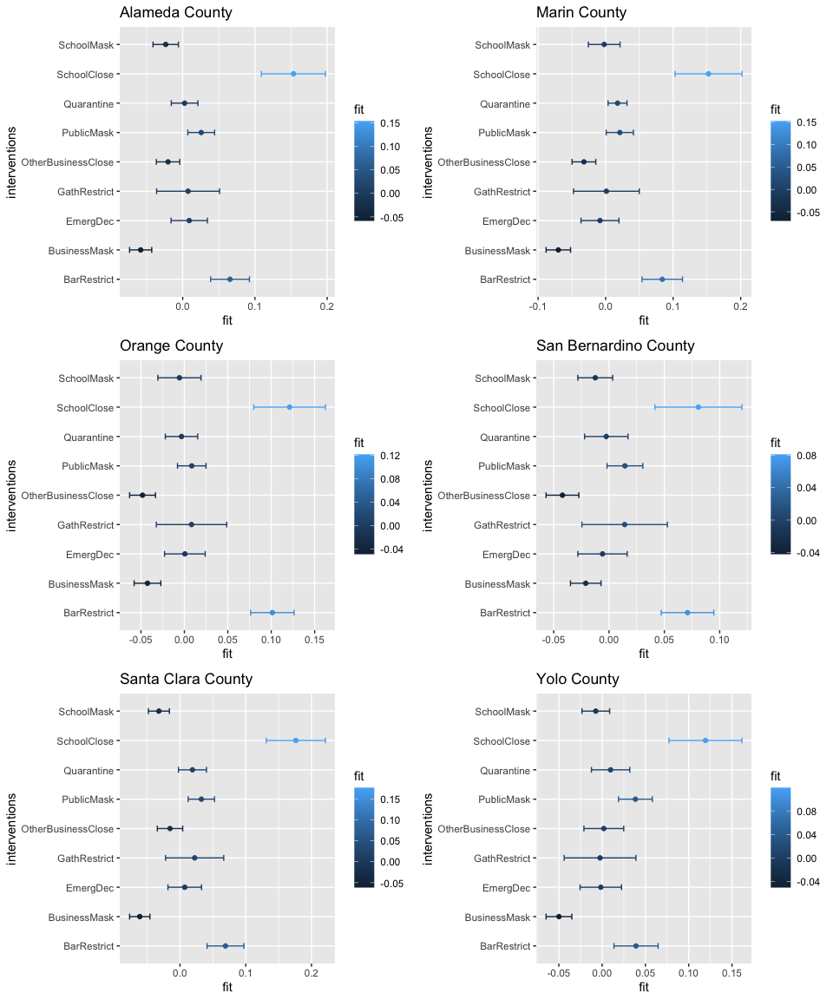
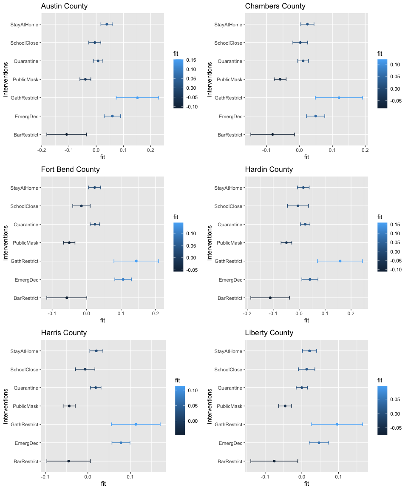

# Abstract

This notebook has two objectives. Firstly, it aims to measure the effect of interventions on mobility with other potential confounding signals such as confirmed case counts. The motivation is to observe whether the effect of intervention is greater than the effect of case signals on mobility. Secondly, we will rank the effects of various government interventions.

Due to the limitation of computation, we focus on analyzing the state of California and its counties. We will regress mobility signals on the covariates of interests and measure the effect of the covariates based on its regression coefficients.


```r
library(dplyr)
library(lubridate)
library(covidcast)
library(RcppRoll)
library(tidycensus)
library(reshape2)
library(zoo)
library(readxl)
library(ggplot2)
library(gridExtra)


source("code/loader.r")
source("code/parser.r")

# Load files 
confirmed_7dav_cumulative_prop <- read_excel("data/case_signals/ca-county-confirmed_7dav_cumulative_prop.xlsx")
 
confirmed_7dav_incidence_prop <- read_excel("data/case_signals/ca-county-confirmed_7dav_incidence_prop.xlsx")
 
deaths_7dav_cumulative_prop <- read_excel("data/case_signals/ca-county-deaths_7dav_cumulative_prop.xlsx")

deaths_7dav_incidence_prop <- read_excel("data/case_signals/ca-county-deaths_7dav_incidence_prop.xlsx")

tx.confirmed_7dav_cumulative_prop <- read_excel("data/case_signals/tx.confirmed_7dav_cumulative_prop.xlsx")

tx.confirmed_7dav_incidence_prop <- read_excel("data/case_signals/tx.confirmed_7dav_incidence_prop.xlsx")

tx.deaths_7dav_cumulative_prop <- read_excel("data/case_signals/tx.deaths_7dav_cumulative_prop.xlsx")


tx.deaths_7dav_incidence_prop <- read_excel("data/case_signals/tx.deaths_7dav_incidence_prop.xlsx")

STARTDATE <- "2020-02-20"
ENDDATE <- "2020-12-15"


fipscodes <- fips_codes%>%
  mutate(fips =paste(state_code, county_code, sep=""))

# Get counties names
ca.counties <- fipscodes%>%
  filter(state=="CA")%>% select(county)
ca.counties <- ca.counties$county

tx.counties <- fipscodes%>%
  filter(state=="TX")%>% select(county)
tx.counties <- tx.counties$county

ca.rest <- read.csv("data/ca.rest.csv",stringsAsFactors = F)

ca.chome <- read.csv("data/ca.chome.csv",stringsAsFactors = F)


tx.rest <- read.csv("data/tx.rest.csv",stringsAsFactors = F)

tx.chome <- read.csv("data/tx.chome.csv",stringsAsFactors = F)

tx.chome$time_value <- as.Date(tx.chome$time_value)
tx.rest$time_value <- as.Date(tx.rest$time_value)
ca.chome$time_value <- as.Date(ca.chome$time_value)
ca.rest$time_value <- as.Date(ca.rest$time_value)

ca.rest$geo_value <- paste("0",ca.rest$geo_value, sep="")
ca.chome$geo_value <- paste("0",ca.chome$geo_value, sep="")
tx.chome$geo_value <- as.character(tx.chome$geo_value)
tx.rest$geo_value <- as.character(tx.rest$geo_value)

# Convert the time_value to DATE
 confirmed_7dav_cumulative_prop$time_value <- as.Date(confirmed_7dav_cumulative_prop$time_value)
 
confirmed_7dav_incidence_prop$time_value <- as.Date(confirmed_7dav_incidence_prop$time_value)
 
deaths_7dav_cumulative_prop$time_value <- as.Date(deaths_7dav_cumulative_prop$time_value)
 
deaths_7dav_incidence_prop$time_value <- as.Date(deaths_7dav_incidence_prop$time_value)
# time value
tx.confirmed_7dav_cumulative_prop$time_value <- as.Date(tx.confirmed_7dav_cumulative_prop$time_value)

tx.confirmed_7dav_incidence_prop$time_value <- as.Date(tx.confirmed_7dav_incidence_prop$time_value)
 
tx.deaths_7dav_cumulative_prop$time_value <- as.Date(tx.deaths_7dav_cumulative_prop$time_value)
 
tx.deaths_7dav_incidence_prop$time_value <- as.Date(tx.deaths_7dav_incidence_prop$time_value)


# Convert the county fips codes to character

tx.confirmed_7dav_cumulative_prop$geo_value <- as.character(tx.confirmed_7dav_cumulative_prop$geo_value)
 
tx.confirmed_7dav_incidence_prop$geo_value <- as.character(tx.confirmed_7dav_incidence_prop$geo_value)
 
tx.deaths_7dav_cumulative_prop$geo_value <- as.character(tx.deaths_7dav_cumulative_prop$geo_value)
 
tx.deaths_7dav_incidence_prop$geo_value <- as.character(tx.deaths_7dav_incidence_prop$geo_value)
 


# Pad 0 to all CA data
confirmed_7dav_cumulative_prop$geo_value <- paste("0", confirmed_7dav_cumulative_prop$geo_value, sep="" )
 
confirmed_7dav_incidence_prop$geo_value <- paste("0", confirmed_7dav_incidence_prop$geo_value, sep="" )
 
deaths_7dav_cumulative_prop$geo_value <- paste("0", deaths_7dav_cumulative_prop$geo_value, sep="" )
 
deaths_7dav_incidence_prop$geo_value <- paste("0", deaths_7dav_incidence_prop$geo_value, sep="" )
 


# Policy data
policy <- load_policy()
ca.policy <- policy %>% filter(StatePostal == "ca", StateWide == 1)
tx.policy <- policy %>% filter(StatePostal == "tx", StateWide == 1)

ca.rest$county <- fips_to_name(ca.rest$geo_value)
ca.chome$county <- fips_to_name(ca.chome$geo_value)
tx.rest$county <- fips_to_name(tx.rest$geo_value)
tx.chome$county <- fips_to_name(tx.chome$geo_value)


ca.policy_signal<- getSumOfPolicy(ca.policy , STARTDATE, ENDDATE)
tx.policy_signal<- getSumOfPolicy(tx.policy , STARTDATE, ENDDATE)

# Turn the polical signal to be factors
factored.ca.policy.signal <- cbind(ca.policy_signal[1], 
                                lapply(ca.policy_signal[3:14],
                                       as.factor),
                                ca.policy_signal[15:16])


ca.holidays <- c("2019-01-01",
                 "2019-01-21",
                 "2019-02-18",
                 "2019-04-01",
                 "2019-05-27",
                 "2019-07-04",
                 "2019-09-02",
                 "2019-09-09",
                 "2019-09-27",
                 "2019-11-11",
                 "2019-11-28",
                 "2019-12-25",
                 "2020-01-01", 
                 "2020-01-20",
                 "2020-02-17",
                 "2020-03-31",
                 "2020-05-25",
                 "2020-07-03",
                 "2020-09-07",
                 "2020-09-09",
                 "2020-09-25",
                 "2020-11-11",
                 "2020-11-26",
                 "2020-12-25",
                 "2021-01-01",
                 "2021-01-18")
tx.holidays <- c("2019-01-01",
                 "2019-01-19",
                 "2019-01-21",
                 "2019-02-18",
                 "2019-03-02",
                 "2019-03-31",
                 "2019-04-19",
                 "2019-04-21",
                 "2019-05-27",
                 "2019-06-19",
                 "2019-07-04",
                 "2019-09-02",
                 "2019-11-11",
                 "2019-11-28",
                 "2019-12-24",
                 "2019-12-25",
                 "2019-12-26",
                 "2020-01-01",
                 "2020-01-19",
                 "2020-01-20",
                 "2020-02-17",
                 "2020-03-02",
                 "2020-03-21",
                 "2020-04-10",
                 "2020-04-21",
                 "2020-05-25",
                 "2020-06-19",
                 "2020-07-03",
                 "2020-09-07",
                 "2020-11-11",
                 "2020-11-26",
                 "2020-12-24",
                 "2020-12-25",
                 "2020-12-26")

# May through October is wildfire season
ca.wildfire_seasons <- seq(as.Date("2020-05-01"), as.Date("2020-10-31"), 1)

tx.wildfire_seasons <- seq(as.Date("2020-03-01"), as.Date("2020-05-31"), 1)

# airquality

ca.air.2019 <- read.csv("data/air.quality/ad_viz_plotval_data_pm2.5_2019.csv")

ca.air.2020 <- read.csv("data/air.quality/ad_viz_plotval_data_pm2.5_2020.csv")

ca.air.2021 <- read.csv("data/air.quality/ad_viz_plotval_data_pm2.5_2021.csv")


tx.air.2019 <- read.csv("data/air.quality/ad_viz_plotval_data_tx_2019.csv")

tx.air.2020 <- read.csv("data/air.quality/ad_viz_plotval_data_tx_2020.csv")

tx.air.2021 <- read.csv("data/air.quality/ad_viz_plotval_data_tx_2021.csv")

ca.air <- rbind(ca.air.2019, ca.air.2020, ca.air.2021)
tx.air <- rbind(tx.air.2019, tx.air.2020, tx.air.2021)
sel_col <- c("Date", "DAILY_AQI_VALUE","COUNTY")
ca.air <- ca.air[sel_col]
tx.air <- tx.air[sel_col]
# Change the date format
ca.air$Date <- as.Date(format(strptime(as.character(ca.air$Date), "%m/%d/%Y"), "%Y-%m-%d"))

tx.air$Date <- as.Date(format(strptime(as.character(tx.air$Date), "%m/%d/%Y"), "%Y-%m-%d"))

ca.air$COUNTY <- paste(ca.air$COUNTY, "County", sep=" ")
tx.air$COUNTY <- paste(tx.air$COUNTY, "County", sep=" ")
ca.air$DAILY_AQI_VALUE <- as.numeric(ca.air$DAILY_AQI_VALUE)
tx.air$DAILY_AQI_VALUE <- as.numeric(tx.air$DAILY_AQI_VALUE)


colnames(ca.air)[1] <- "time_value"
colnames(ca.air)[3] <- "county"

colnames(tx.air)[1] <- "time_value"
colnames(tx.air)[3] <- "county"

# Take the median AQI
ca.median_aqi <- ca.air %>%
  group_by(county, time_value)%>%
  summarize(median_AQI = median(DAILY_AQI_VALUE))

tx.median_aqi<- tx.air %>%
  group_by(county, time_value)%>%
  summarize(median_AQI = median(DAILY_AQI_VALUE))
```


```r
################ getForwardDays () ###################
# compute the number of days within a given day range that
# gives the highest spearman correlation between df1 and df2

# argument
# df1: a dataframe 
# df2: a dataframe that the data needs to be forwarded
# dt_vec: a vector contains a range of integers

getForwardDays <- function(df1, df2, dt_vec){
  # Empty list
  df_list <- vector("list", length(dt_vec))
  
  for (i in 1:length(dt_vec)) {
    df_list[[i]] <- covidcast_cor(df1, df2, dt_y = dt_vec[i],
                                  by = "geo_value", 
                                  method="spearman")

    df_list[[i]]$dt <- dt_vec[i]
  }
  
  # Stack into one big data frame
  df <- do.call(rbind, df_list)
  

  return(df)
}

################ joinConfounder() ###################

joinConfounder <- function(mobility.df, policy.df, state="ca"){
  if(state=="ca"){
    # Combine case and mobility
  cum.confirmed.case <- confirmed_7dav_cumulative_prop[c("time_value","geo_value","value")]
  new.confirmed.case <- confirmed_7dav_incidence_prop[c("time_value","geo_value","value")]
  cum.death.case <- deaths_7dav_cumulative_prop[c("time_value","geo_value","value")]
  new.death.case <- deaths_7dav_incidence_prop[c("time_value","geo_value","value")]
  }else{
    # Combine case and mobility
    cum.confirmed.case <- tx.confirmed_7dav_cumulative_prop[c("time_value","geo_value","value")]
  new.confirmed.case <- tx.confirmed_7dav_incidence_prop[c("time_value","geo_value","value")]
  cum.death.case <- tx.deaths_7dav_cumulative_prop[c("time_value","geo_value","value")]
  new.death.case <- tx.deaths_7dav_incidence_prop[c("time_value","geo_value","value")]
  }

  colnames(cum.confirmed.case)[3] <- "confirmed_7dav_cumulative_prop"
  colnames(new.confirmed.case)[3] <- "confirmed_7dav_incidence_prop"
  colnames(cum.death.case)[3] <- "deaths_7dav_cumulative_prop"
  colnames(new.death.case)[3] <- "deaths_7dav_incidence_prop"
  
  # A list of confounders
  confounders <- list(cum.confirmed.case, 
                      new.confirmed.case, 
                      cum.death.case,
                      new.death.case)
  
  # Left join again with all other potential confounders
  for (confounder in confounders){
    mobility.df <- left_join(mobility.df, confounder, by=c("time_value", "geo_value"))
  }

  # combine with policy signal
  mobility.df <- left_join(mobility.df, policy.df, by=c("time_value"))
  
  if(state=="ca"){
    mobility.df <- left_join(mobility.df, ca.median_aqi, by=c("time_value", "county"))
  }else{
    mobility.df <- left_join(mobility.df, tx.median_aqi, by=c("time_value", "county"))
  }
  return(mobility.df)

}

################ prepDF() ###################

prepDF <- function(mobility.df, 
                     policy, 
                     states,
                     interventions,
                     fips_codes,
                     forward=F){
  
  # Convert to lower case
  lowerStates <- tolower(states)
  
  # filter policy
  policy.df <- policy %>% filter(StatePostal%in%lowerStates, StateWide == 1)
  
  policy.df <- getSumOfPolicy(policy.df, STARTDATE, ENDDATE)
  
  # convert to factor
  policy.df[interventions] <- lapply(policy.df[interventions], as.factor)

  # join the mobility and policy 
  df<- joinConfounder(mobility.df, policy.df, state = lowerStates)
  
  # Change the value name for fitting regression model
  colnames(df)[colnames(df)=="value"] <- unique(mobility.df$signal)
  return(df)
}

############ plot_bar() ###################

plot_bar <- function(df,
                     x,
                     y,
                     lower.bound,
                     upper.bound,
                     gp,
                     name){
  p<- ggplot(df, aes_string(x=x, y=y, group=gp, color=gp)) + 
  #geom_line() +
  geom_point()+
  geom_errorbar(aes_string(xmin=lower.bound, xmax=upper.bound), width=.2,
                 position=position_dodge(0.05))+
    ggtitle(name)
      
  return(p)
}
```

## Model:

$$Y_t = \beta_{0}+ \sum_{i}\beta_{i}S_{i_{t}} + \sum_{k}\beta_{k}P_{k_{t}}$$


### Completely stay at home: CA


```r
interventions <- c("EmergDec",
                   "GathRestrict",
                   "SchoolClose",
                   "BarRestrict",
                   "PublicMask",
                   "OtherBusinessClose",
                   "BusinessMask",
                   "SchoolMask",
                   "Quarantine")

confounders.names <- c("confirmed_7dav_cumulative_prop",
                  "confirmed_7dav_incidence_prop",
                  "deaths_7dav_cumulative_prop",
                  "deaths_7dav_incidence_prop")

mobility.name <- "completely_home_prop"

formula1 <- as.formula(paste(mobility.name, paste(c(confounders.names, interventions ), collapse=" + "), sep=" ~ "))

ca.stayhome <- prepDF(ca.chome, 
          policy, 
          states="CA",
          interventions,
          fips_codes)

# weekends filter
ca.stayhome <- ca.stayhome%>% 
      mutate(weekday= weekdays(as.Date(time_value)))%>% 
      mutate(weekend= as.factor(ifelse(weekday %in% c("Saturday", "Sunday"), 1, 0)),
             holiday = as.factor(ifelse(as.Date(time_value) %in% as.Date(ca.holidays), 1, 0)),
             wildfire= as.factor(ifelse(as.Date(time_value) %in% as.Date(ca.wildfire_seasons), 1, 0)))


interventions <- c("EmergDec","GathRestrict","SchoolClose","BarRestrict","PublicMask","OtherBusinessClose","BusinessMask", "SchoolMask" ,"Quarantine","weekend","holiday")

formula1 <- as.formula(paste(mobility.name, paste(c(confounders.names, interventions ), collapse=" + "), sep=" ~ "))


# Filter the fips codes
filtered_fips <- fipscodes %>%filter(state %in% "CA")
ls <- list()
count <- 1
for(code in filtered_fips$fips){
  p <- ca.stayhome %>% filter(geo_value.x==code) %>%
    lm(formula1,data=.)
    ls[[count]] <- p 
  count <- count + 1 
  print(fips_to_name(code))
  print(summary(p))
}
```

```
##            06001 
## "Alameda County" 
## 
## Call:
## lm(formula = formula1, data = .)
## 
## Residuals:
##      Min       1Q   Median       3Q      Max 
## -0.07741 -0.01914 -0.00005  0.01783  0.12161 
## 
## Coefficients:
##                                  Estimate Std. Error t value Pr(>|t|)    
## (Intercept)                     2.335e-01  7.457e-03  31.305  < 2e-16 ***
## confirmed_7dav_cumulative_prop  6.292e-05  3.404e-05   1.848  0.06557 .  
## confirmed_7dav_incidence_prop   3.464e-04  5.545e-04   0.625  0.53269    
## deaths_7dav_cumulative_prop    -4.629e-03  1.675e-03  -2.764  0.00608 ** 
## deaths_7dav_incidence_prop      1.796e-03  2.274e-02   0.079  0.93712    
## EmergDec1                       9.042e-03  1.280e-02   0.707  0.48036    
## GathRestrict1                   8.518e-03  2.219e-02   0.384  0.70131    
## SchoolClose1                    1.521e-01  2.260e-02   6.728 9.46e-11 ***
## BarRestrict1                    6.568e-02  1.369e-02   4.796 2.61e-06 ***
## PublicMask1                     2.556e-02  9.466e-03   2.700  0.00735 ** 
## OtherBusinessClose1            -2.053e-02  8.281e-03  -2.479  0.01375 *  
## BusinessMask1                  -5.812e-02  7.808e-03  -7.443 1.18e-12 ***
## SchoolMask1                    -2.392e-02  8.968e-03  -2.667  0.00809 ** 
## Quarantine1                     2.149e-03  9.398e-03   0.229  0.81926    
## weekend1                        3.757e-03  3.563e-03   1.054  0.29261    
## holiday1                       -1.444e-03  1.012e-02  -0.143  0.88664    
## ---
## Signif. codes:  0 '***' 0.001 '**' 0.01 '*' 0.05 '.' 0.1 ' ' 1
## 
## Residual standard error: 0.02764 on 284 degrees of freedom
## Multiple R-squared:  0.8422,	Adjusted R-squared:  0.8338 
## F-statistic:   101 on 15 and 284 DF,  p-value: < 2.2e-16
## 
##           06003 
## "Alpine County" 
## 
## Call:
## lm(formula = formula1, data = .)
## 
## Residuals:
##       Min        1Q    Median        3Q       Max 
## -0.221995 -0.053465 -0.004943  0.052239  0.207566 
## 
## Coefficients: (2 not defined because of singularities)
##                                  Estimate Std. Error t value Pr(>|t|)    
## (Intercept)                     1.916e-01  2.122e-02   9.027  < 2e-16 ***
## confirmed_7dav_cumulative_prop -2.193e-05  1.180e-05  -1.859  0.06406 .  
## confirmed_7dav_incidence_prop   7.493e-05  4.694e-05   1.596  0.11152    
## deaths_7dav_cumulative_prop            NA         NA      NA       NA    
## deaths_7dav_incidence_prop             NA         NA      NA       NA    
## EmergDec1                       2.895e-02  3.641e-02   0.795  0.42717    
## GathRestrict1                  -6.785e-02  6.313e-02  -1.075  0.28341    
## SchoolClose1                    1.465e-01  6.431e-02   2.278  0.02346 *  
## BarRestrict1                    8.351e-02  3.888e-02   2.148  0.03258 *  
## PublicMask1                    -9.503e-03  2.552e-02  -0.372  0.70994    
## OtherBusinessClose1            -7.346e-02  2.268e-02  -3.239  0.00134 ** 
## BusinessMask1                  -4.613e-02  2.155e-02  -2.141  0.03314 *  
## SchoolMask1                    -2.267e-02  1.309e-02  -1.731  0.08447 .  
## Quarantine1                     6.668e-02  2.827e-02   2.359  0.01900 *  
## weekend1                        1.926e-02  1.013e-02   1.901  0.05828 .  
## holiday1                        2.185e-02  2.875e-02   0.760  0.44804    
## ---
## Signif. codes:  0 '***' 0.001 '**' 0.01 '*' 0.05 '.' 0.1 ' ' 1
## 
## Residual standard error: 0.07866 on 286 degrees of freedom
## Multiple R-squared:  0.3557,	Adjusted R-squared:  0.3264 
## F-statistic: 12.14 on 13 and 286 DF,  p-value: < 2.2e-16
## 
##           06005 
## "Amador County" 
## 
## Call:
## lm(formula = formula1, data = .)
## 
## Residuals:
##       Min        1Q    Median        3Q       Max 
## -0.068005 -0.015912 -0.001628  0.015269  0.127605 
## 
## Coefficients:
##                                  Estimate Std. Error t value Pr(>|t|)    
## (Intercept)                     2.496e-01  7.444e-03  33.536  < 2e-16 ***
## confirmed_7dav_cumulative_prop  3.312e-05  2.522e-05   1.313 0.190149    
## confirmed_7dav_incidence_prop  -1.684e-05  4.344e-04  -0.039 0.969112    
## deaths_7dav_cumulative_prop    -1.152e-03  3.408e-04  -3.381 0.000824 ***
## deaths_7dav_incidence_prop      1.839e-03  2.206e-03   0.834 0.405048    
## EmergDec1                      -2.278e-02  1.277e-02  -1.784 0.075527 .  
## GathRestrict1                   1.598e-02  2.215e-02   0.722 0.471059    
## SchoolClose1                    6.452e-02  2.256e-02   2.860 0.004554 ** 
## BarRestrict1                    6.000e-02  1.364e-02   4.399 1.54e-05 ***
## PublicMask1                     1.473e-02  8.936e-03   1.648 0.100483    
## OtherBusinessClose1            -2.902e-02  7.956e-03  -3.648 0.000315 ***
## BusinessMask1                  -2.671e-02  7.568e-03  -3.529 0.000486 ***
## SchoolMask1                    -6.182e-03  7.438e-03  -0.831 0.406579    
## Quarantine1                    -8.738e-03  9.753e-03  -0.896 0.371035    
## weekend1                        4.296e-02  3.555e-03  12.084  < 2e-16 ***
## holiday1                        2.146e-02  1.008e-02   2.128 0.034210 *  
## ---
## Signif. codes:  0 '***' 0.001 '**' 0.01 '*' 0.05 '.' 0.1 ' ' 1
## 
## Residual standard error: 0.02759 on 284 degrees of freedom
## Multiple R-squared:  0.6998,	Adjusted R-squared:  0.684 
## F-statistic: 44.14 on 15 and 284 DF,  p-value: < 2.2e-16
## 
##          06007 
## "Butte County" 
## 
## Call:
## lm(formula = formula1, data = .)
## 
## Residuals:
##       Min        1Q    Median        3Q       Max 
## -0.059254 -0.017280  0.000361  0.014805  0.121548 
## 
## Coefficients:
##                                  Estimate Std. Error t value Pr(>|t|)    
## (Intercept)                     2.284e-01  6.784e-03  33.664  < 2e-16 ***
## confirmed_7dav_cumulative_prop  6.208e-05  2.656e-05   2.337 0.020112 *  
## confirmed_7dav_incidence_prop  -5.496e-04  3.906e-04  -1.407 0.160484    
## deaths_7dav_cumulative_prop    -4.172e-03  1.441e-03  -2.895 0.004085 ** 
## deaths_7dav_incidence_prop      7.414e-03  1.472e-02   0.504 0.614855    
## EmergDec1                      -4.468e-03  1.164e-02  -0.384 0.701416    
## GathRestrict1                  -1.071e-02  2.018e-02  -0.531 0.596155    
## SchoolClose1                    6.016e-02  2.056e-02   2.926 0.003708 ** 
## BarRestrict1                    7.019e-02  1.243e-02   5.646 3.97e-08 ***
## PublicMask1                    -1.263e-03  8.143e-03  -0.155 0.876875    
## OtherBusinessClose1            -2.757e-02  7.249e-03  -3.804 0.000175 ***
## BusinessMask1                  -3.689e-02  6.994e-03  -5.274 2.65e-07 ***
## SchoolMask1                    -5.245e-03  7.538e-03  -0.696 0.487065    
## Quarantine1                     1.124e-02  8.341e-03   1.347 0.179025    
## weekend1                        3.373e-02  3.242e-03  10.404  < 2e-16 ***
## holiday1                        1.179e-02  9.167e-03   1.286 0.199466    
## ---
## Signif. codes:  0 '***' 0.001 '**' 0.01 '*' 0.05 '.' 0.1 ' ' 1
## 
## Residual standard error: 0.02515 on 284 degrees of freedom
## Multiple R-squared:  0.6793,	Adjusted R-squared:  0.6624 
## F-statistic: 40.11 on 15 and 284 DF,  p-value: < 2.2e-16
## 
##              06009 
## "Calaveras County" 
## 
## Call:
## lm(formula = formula1, data = .)
## 
## Residuals:
##       Min        1Q    Median        3Q       Max 
## -0.068366 -0.017313 -0.000163  0.016241  0.149028 
## 
## Coefficients:
##                                  Estimate Std. Error t value Pr(>|t|)    
## (Intercept)                     2.622e-01  7.999e-03  32.774  < 2e-16 ***
## confirmed_7dav_cumulative_prop -4.938e-06  2.984e-05  -0.166   0.8687    
## confirmed_7dav_incidence_prop   3.488e-04  6.204e-04   0.562   0.5744    
## deaths_7dav_cumulative_prop    -4.909e-04  4.165e-04  -1.179   0.2395    
## deaths_7dav_incidence_prop      4.945e-03  3.966e-03   1.247   0.2136    
## EmergDec1                      -2.820e-02  1.373e-02  -2.055   0.0408 *  
## GathRestrict1                   2.339e-02  2.380e-02   0.983   0.3266    
## SchoolClose1                    6.659e-02  2.424e-02   2.747   0.0064 ** 
## BarRestrict1                    3.655e-02  1.466e-02   2.493   0.0132 *  
## PublicMask1                     3.129e-04  9.608e-03   0.033   0.9740    
## OtherBusinessClose1            -1.268e-02  8.560e-03  -1.481   0.1398    
## BusinessMask1                  -4.487e-02  8.204e-03  -5.469 9.92e-08 ***
## SchoolMask1                     7.146e-03  8.444e-03   0.846   0.3981    
## Quarantine1                     2.035e-02  1.059e-02   1.921   0.0558 .  
## weekend1                        3.903e-02  3.818e-03  10.222  < 2e-16 ***
## holiday1                        1.896e-03  1.085e-02   0.175   0.8614    
## ---
## Signif. codes:  0 '***' 0.001 '**' 0.01 '*' 0.05 '.' 0.1 ' ' 1
## 
## Residual standard error: 0.02965 on 284 degrees of freedom
## Multiple R-squared:  0.5862,	Adjusted R-squared:  0.5643 
## F-statistic: 26.82 on 15 and 284 DF,  p-value: < 2.2e-16
## 
##           06011 
## "Colusa County" 
## 
## Call:
## lm(formula = formula1, data = .)
## 
## Residuals:
##      Min       1Q   Median       3Q      Max 
## -0.09063 -0.01875  0.00060  0.01841  0.12993 
## 
## Coefficients:
##                                  Estimate Std. Error t value Pr(>|t|)    
## (Intercept)                     2.384e-01  8.638e-03  27.600  < 2e-16 ***
## confirmed_7dav_cumulative_prop -1.857e-05  1.341e-05  -1.385 0.167053    
## confirmed_7dav_incidence_prop   5.566e-04  2.247e-04   2.477 0.013847 *  
## deaths_7dav_cumulative_prop     1.389e-03  1.170e-03   1.188 0.235950    
## deaths_7dav_incidence_prop     -3.835e-03  8.482e-03  -0.452 0.651528    
## EmergDec1                      -1.713e-02  1.482e-02  -1.156 0.248598    
## GathRestrict1                   4.349e-03  2.570e-02   0.169 0.865733    
## SchoolClose1                    3.787e-02  2.618e-02   1.447 0.149080    
## BarRestrict1                    6.242e-02  1.583e-02   3.944 0.000101 ***
## PublicMask1                    -1.533e-03  1.036e-02  -0.148 0.882496    
## OtherBusinessClose1            -3.190e-02  9.229e-03  -3.457 0.000631 ***
## BusinessMask1                  -2.840e-02  9.000e-03  -3.156 0.001773 ** 
## SchoolMask1                     2.618e-03  1.315e-02   0.199 0.842314    
## Quarantine1                     4.362e-04  1.112e-02   0.039 0.968740    
## weekend1                        3.633e-02  4.127e-03   8.801  < 2e-16 ***
## holiday1                        2.700e-02  1.176e-02   2.296 0.022376 *  
## ---
## Signif. codes:  0 '***' 0.001 '**' 0.01 '*' 0.05 '.' 0.1 ' ' 1
## 
## Residual standard error: 0.03202 on 284 degrees of freedom
## Multiple R-squared:  0.4857,	Adjusted R-squared:  0.4586 
## F-statistic: 17.88 on 15 and 284 DF,  p-value: < 2.2e-16
## 
##                 06013 
## "Contra Costa County" 
## 
## Call:
## lm(formula = formula1, data = .)
## 
## Residuals:
##      Min       1Q   Median       3Q      Max 
## -0.05338 -0.01693 -0.00111  0.01659  0.13123 
## 
## Coefficients:
##                                  Estimate Std. Error t value Pr(>|t|)    
## (Intercept)                     2.329e-01  7.107e-03  32.770  < 2e-16 ***
## confirmed_7dav_cumulative_prop  1.041e-04  2.259e-05   4.606 6.20e-06 ***
## confirmed_7dav_incidence_prop   6.771e-04  3.884e-04   1.743 0.082365 .  
## deaths_7dav_cumulative_prop    -1.182e-02  2.169e-03  -5.449 1.10e-07 ***
## deaths_7dav_incidence_prop     -4.343e-02  3.380e-02  -1.285 0.199902    
## EmergDec1                       1.218e-03  1.219e-02   0.100 0.920508    
## GathRestrict1                   5.875e-03  2.114e-02   0.278 0.781318    
## SchoolClose1                    1.528e-01  2.154e-02   7.095 1.03e-11 ***
## BarRestrict1                    6.853e-02  1.303e-02   5.258 2.87e-07 ***
## PublicMask1                     1.875e-02  8.852e-03   2.118 0.035021 *  
## OtherBusinessClose1            -3.047e-02  7.926e-03  -3.844 0.000149 ***
## BusinessMask1                  -4.520e-02  8.105e-03  -5.576 5.73e-08 ***
## SchoolMask1                     3.693e-03  8.419e-03   0.439 0.661302    
## Quarantine1                    -2.345e-02  9.915e-03  -2.365 0.018709 *  
## weekend1                        1.123e-02  3.395e-03   3.308 0.001059 ** 
## holiday1                        1.094e-02  9.591e-03   1.140 0.255119    
## ---
## Signif. codes:  0 '***' 0.001 '**' 0.01 '*' 0.05 '.' 0.1 ' ' 1
## 
## Residual standard error: 0.02634 on 284 degrees of freedom
## Multiple R-squared:  0.8442,	Adjusted R-squared:  0.836 
## F-statistic: 102.6 on 15 and 284 DF,  p-value: < 2.2e-16
## 
##              06015 
## "Del Norte County" 
## 
## Call:
## lm(formula = formula1, data = .)
## 
## Residuals:
##       Min        1Q    Median        3Q       Max 
## -0.078091 -0.020632 -0.000986  0.017783  0.135916 
## 
## Coefficients:
##                                  Estimate Std. Error t value Pr(>|t|)    
## (Intercept)                     2.721e-01  8.076e-03  33.686  < 2e-16 ***
## confirmed_7dav_cumulative_prop  3.594e-06  1.802e-05   0.199 0.842060    
## confirmed_7dav_incidence_prop   2.705e-04  2.468e-04   1.096 0.274044    
## deaths_7dav_cumulative_prop     8.824e-04  2.323e-03   0.380 0.704341    
## deaths_7dav_incidence_prop     -8.091e-04  2.036e-02  -0.040 0.968326    
## EmergDec1                      -1.352e-02  1.386e-02  -0.976 0.330073    
## GathRestrict1                   2.091e-03  2.403e-02   0.087 0.930714    
## SchoolClose1                    3.755e-02  2.448e-02   1.534 0.126142    
## BarRestrict1                    5.620e-02  1.480e-02   3.798 0.000179 ***
## PublicMask1                     1.160e-03  9.691e-03   0.120 0.904784    
## OtherBusinessClose1            -9.790e-03  8.671e-03  -1.129 0.259856    
## BusinessMask1                  -3.873e-02  8.729e-03  -4.437 1.31e-05 ***
## SchoolMask1                    -1.062e-02  7.390e-03  -1.437 0.151807    
## Quarantine1                     8.911e-03  1.061e-02   0.840 0.401559    
## weekend1                        3.846e-02  3.858e-03   9.970  < 2e-16 ***
## holiday1                        1.682e-02  1.090e-02   1.543 0.123975    
## ---
## Signif. codes:  0 '***' 0.001 '**' 0.01 '*' 0.05 '.' 0.1 ' ' 1
## 
## Residual standard error: 0.02994 on 284 degrees of freedom
## Multiple R-squared:  0.5213,	Adjusted R-squared:  0.496 
## F-statistic: 20.62 on 15 and 284 DF,  p-value: < 2.2e-16
## 
##              06017 
## "El Dorado County" 
## 
## Call:
## lm(formula = formula1, data = .)
## 
## Residuals:
##       Min        1Q    Median        3Q       Max 
## -0.070535 -0.016625 -0.003249  0.015074  0.119331 
## 
## Coefficients:
##                                  Estimate Std. Error t value Pr(>|t|)    
## (Intercept)                     2.270e-01  7.345e-03  30.909  < 2e-16 ***
## confirmed_7dav_cumulative_prop -1.535e-05  3.063e-05  -0.501   0.6166    
## confirmed_7dav_incidence_prop   6.671e-04  3.268e-04   2.041   0.0421 *  
## deaths_7dav_cumulative_prop    -1.080e-03  7.500e-03  -0.144   0.8856    
## deaths_7dav_incidence_prop      2.429e-02  3.496e-02   0.695   0.4876    
## EmergDec1                       2.111e-03  1.260e-02   0.167   0.8671    
## GathRestrict1                  -4.862e-03  2.185e-02  -0.222   0.8241    
## SchoolClose1                    1.153e-01  2.226e-02   5.180 4.22e-07 ***
## BarRestrict1                    6.099e-02  1.346e-02   4.531 8.67e-06 ***
## PublicMask1                    -6.572e-03  8.832e-03  -0.744   0.4574    
## OtherBusinessClose1            -4.459e-02  7.857e-03  -5.676 3.40e-08 ***
## BusinessMask1                  -5.635e-02  7.559e-03  -7.456 1.09e-12 ***
## SchoolMask1                    -1.236e-02  7.282e-03  -1.697   0.0908 .  
## Quarantine1                     2.400e-02  1.116e-02   2.150   0.0324 *  
## weekend1                        3.527e-02  3.509e-03  10.052  < 2e-16 ***
## holiday1                        1.737e-02  9.978e-03   1.741   0.0828 .  
## ---
## Signif. codes:  0 '***' 0.001 '**' 0.01 '*' 0.05 '.' 0.1 ' ' 1
## 
## Residual standard error: 0.02723 on 284 degrees of freedom
## Multiple R-squared:  0.7903,	Adjusted R-squared:  0.7792 
## F-statistic: 71.36 on 15 and 284 DF,  p-value: < 2.2e-16
## 
##           06019 
## "Fresno County" 
## 
## Call:
## lm(formula = formula1, data = .)
## 
## Residuals:
##       Min        1Q    Median        3Q       Max 
## -0.051446 -0.015462 -0.001225  0.013921  0.114732 
## 
## Coefficients:
##                                  Estimate Std. Error t value Pr(>|t|)    
## (Intercept)                     2.489e-01  6.477e-03  38.423  < 2e-16 ***
## confirmed_7dav_cumulative_prop  3.331e-05  1.786e-05   1.865 0.063165 .  
## confirmed_7dav_incidence_prop   9.171e-05  2.600e-04   0.353 0.724584    
## deaths_7dav_cumulative_prop    -2.617e-03  1.189e-03  -2.201 0.028566 *  
## deaths_7dav_incidence_prop     -2.083e-02  1.496e-02  -1.392 0.165078    
## EmergDec1                      -1.017e-02  1.111e-02  -0.915 0.360921    
## GathRestrict1                  -6.835e-04  1.927e-02  -0.035 0.971730    
## SchoolClose1                    8.382e-02  1.963e-02   4.270 2.66e-05 ***
## BarRestrict1                    6.568e-02  1.187e-02   5.534 7.10e-08 ***
## PublicMask1                     4.309e-03  7.804e-03   0.552 0.581265    
## OtherBusinessClose1            -4.066e-02  6.984e-03  -5.823 1.56e-08 ***
## BusinessMask1                  -2.654e-02  7.603e-03  -3.491 0.000558 ***
## SchoolMask1                    -1.641e-02  1.005e-02  -1.633 0.103514    
## Quarantine1                     4.522e-03  8.110e-03   0.558 0.577591    
## weekend1                        2.325e-02  3.096e-03   7.511 7.68e-13 ***
## holiday1                        1.008e-02  8.763e-03   1.150 0.251029    
## ---
## Signif. codes:  0 '***' 0.001 '**' 0.01 '*' 0.05 '.' 0.1 ' ' 1
## 
## Residual standard error: 0.02401 on 284 degrees of freedom
## Multiple R-squared:  0.742,	Adjusted R-squared:  0.7284 
## F-statistic: 54.46 on 15 and 284 DF,  p-value: < 2.2e-16
## 
##          06021 
## "Glenn County" 
## 
## Call:
## lm(formula = formula1, data = .)
## 
## Residuals:
##       Min        1Q    Median        3Q       Max 
## -0.063141 -0.018549  0.000389  0.017037  0.134792 
## 
## Coefficients:
##                                  Estimate Std. Error t value Pr(>|t|)    
## (Intercept)                     2.202e-01  7.702e-03  28.592  < 2e-16 ***
## confirmed_7dav_cumulative_prop -1.516e-05  5.064e-06  -2.994  0.00299 ** 
## confirmed_7dav_incidence_prop   4.383e-04  2.237e-04   1.960  0.05103 .  
## deaths_7dav_cumulative_prop     1.940e-04  2.242e-04   0.865  0.38769    
## deaths_7dav_incidence_prop     -3.578e-03  1.901e-03  -1.882  0.06085 .  
## EmergDec1                      -1.270e-02  1.322e-02  -0.961  0.33755    
## GathRestrict1                   2.171e-02  2.291e-02   0.947  0.34424    
## SchoolClose1                    4.120e-02  2.334e-02   1.765  0.07863 .  
## BarRestrict1                    6.016e-02  1.411e-02   4.262 2.75e-05 ***
## PublicMask1                    -7.128e-03  9.242e-03  -0.771  0.44119    
## OtherBusinessClose1            -2.663e-02  8.236e-03  -3.233  0.00137 ** 
## BusinessMask1                  -2.050e-02  8.206e-03  -2.498  0.01305 *  
## SchoolMask1                     1.700e-02  8.820e-03   1.927  0.05497 .  
## Quarantine1                    -3.198e-03  9.816e-03  -0.326  0.74485    
## weekend1                        4.039e-02  3.683e-03  10.968  < 2e-16 ***
## holiday1                        1.707e-02  1.050e-02   1.627  0.10495    
## ---
## Signif. codes:  0 '***' 0.001 '**' 0.01 '*' 0.05 '.' 0.1 ' ' 1
## 
## Residual standard error: 0.02855 on 284 degrees of freedom
## Multiple R-squared:  0.5851,	Adjusted R-squared:  0.5631 
## F-statistic:  26.7 on 15 and 284 DF,  p-value: < 2.2e-16
## 
##             06023 
## "Humboldt County" 
## 
## Call:
## lm(formula = formula1, data = .)
## 
## Residuals:
##       Min        1Q    Median        3Q       Max 
## -0.070086 -0.016639  0.001427  0.016234  0.094484 
## 
## Coefficients:
##                                  Estimate Std. Error t value Pr(>|t|)    
## (Intercept)                     2.489e-01  6.409e-03  38.829  < 2e-16 ***
## confirmed_7dav_cumulative_prop -1.296e-04  4.346e-05  -2.983 0.003101 ** 
## confirmed_7dav_incidence_prop   3.408e-03  9.735e-04   3.501 0.000538 ***
## deaths_7dav_cumulative_prop     3.238e-03  2.988e-03   1.084 0.279464    
## deaths_7dav_incidence_prop      2.178e-02  2.555e-02   0.852 0.394735    
## EmergDec1                      -2.524e-02  1.100e-02  -2.295 0.022456 *  
## GathRestrict1                   5.462e-03  1.907e-02   0.286 0.774754    
## SchoolClose1                    4.645e-02  1.942e-02   2.391 0.017436 *  
## BarRestrict1                    7.398e-02  1.178e-02   6.279 1.27e-09 ***
## PublicMask1                     2.233e-02  7.873e-03   2.836 0.004900 ** 
## OtherBusinessClose1            -1.195e-02  7.319e-03  -1.632 0.103701    
## BusinessMask1                  -3.551e-02  8.390e-03  -4.233 3.12e-05 ***
## SchoolMask1                    -7.165e-03  6.225e-03  -1.151 0.250657    
## Quarantine1                    -1.186e-03  9.787e-03  -0.121 0.903618    
## weekend1                        3.870e-02  3.064e-03  12.630  < 2e-16 ***
## holiday1                        1.763e-02  8.656e-03   2.037 0.042599 *  
## ---
## Signif. codes:  0 '***' 0.001 '**' 0.01 '*' 0.05 '.' 0.1 ' ' 1
## 
## Residual standard error: 0.02376 on 284 degrees of freedom
## Multiple R-squared:  0.7379,	Adjusted R-squared:  0.724 
## F-statistic: 53.29 on 15 and 284 DF,  p-value: < 2.2e-16
## 
##             06025 
## "Imperial County" 
## 
## Call:
## lm(formula = formula1, data = .)
## 
## Residuals:
##       Min        1Q    Median        3Q       Max 
## -0.073553 -0.015695  0.000162  0.017158  0.100127 
## 
## Coefficients:
##                                  Estimate Std. Error t value Pr(>|t|)    
## (Intercept)                     2.701e-01  6.676e-03  40.455  < 2e-16 ***
## confirmed_7dav_cumulative_prop  1.425e-05  5.314e-06   2.681 0.007767 ** 
## confirmed_7dav_incidence_prop   7.576e-06  1.065e-04   0.071 0.943358    
## deaths_7dav_cumulative_prop    -6.867e-04  2.076e-04  -3.308 0.001061 ** 
## deaths_7dav_incidence_prop     -9.933e-05  3.225e-03  -0.031 0.975447    
## EmergDec1                       2.819e-03  1.145e-02   0.246 0.805807    
## GathRestrict1                   1.279e-02  1.986e-02   0.644 0.520275    
## SchoolClose1                    4.052e-02  2.023e-02   2.003 0.046174 *  
## BarRestrict1                    5.364e-02  1.223e-02   4.385 1.63e-05 ***
## PublicMask1                     2.230e-02  8.056e-03   2.769 0.006002 ** 
## OtherBusinessClose1            -2.719e-02  7.374e-03  -3.687 0.000272 ***
## BusinessMask1                  -1.739e-02  9.065e-03  -1.919 0.056022 .  
## SchoolMask1                     1.953e-03  1.020e-02   0.191 0.848277    
## Quarantine1                    -1.691e-02  8.623e-03  -1.961 0.050843 .  
## weekend1                        3.017e-02  3.189e-03   9.461  < 2e-16 ***
## holiday1                        1.175e-02  9.019e-03   1.303 0.193631    
## ---
## Signif. codes:  0 '***' 0.001 '**' 0.01 '*' 0.05 '.' 0.1 ' ' 1
## 
## Residual standard error: 0.02475 on 284 degrees of freedom
## Multiple R-squared:  0.6871,	Adjusted R-squared:  0.6706 
## F-statistic: 41.59 on 15 and 284 DF,  p-value: < 2.2e-16
## 
##         06027 
## "Inyo County" 
## 
## Call:
## lm(formula = formula1, data = .)
## 
## Residuals:
##      Min       1Q   Median       3Q      Max 
## -0.07309 -0.02155 -0.00087  0.01930  0.11346 
## 
## Coefficients:
##                                  Estimate Std. Error t value Pr(>|t|)    
## (Intercept)                     2.388e-01  8.300e-03  28.774  < 2e-16 ***
## confirmed_7dav_cumulative_prop  1.825e-05  3.138e-05   0.582  0.56124    
## confirmed_7dav_incidence_prop   3.621e-04  3.853e-04   0.940  0.34812    
## deaths_7dav_cumulative_prop    -4.434e-04  3.886e-04  -1.141  0.25485    
## deaths_7dav_incidence_prop     -2.031e-03  2.849e-03  -0.713  0.47650    
## EmergDec1                      -5.422e-03  1.424e-02  -0.381  0.70368    
## GathRestrict1                   1.773e-02  2.469e-02   0.718  0.47334    
## SchoolClose1                    3.429e-02  2.515e-02   1.363  0.17387    
## BarRestrict1                    4.901e-02  1.523e-02   3.217  0.00144 ** 
## PublicMask1                     1.728e-02  1.021e-02   1.693  0.09164 .  
## OtherBusinessClose1            -4.001e-02  8.888e-03  -4.502 9.85e-06 ***
## BusinessMask1                  -1.855e-02  8.463e-03  -2.192  0.02917 *  
## SchoolMask1                    -6.692e-03  7.638e-03  -0.876  0.38168    
## Quarantine1                    -5.807e-03  1.130e-02  -0.514  0.60759    
## weekend1                        4.029e-02  3.963e-03  10.167  < 2e-16 ***
## holiday1                        2.619e-02  1.122e-02   2.335  0.02026 *  
## ---
## Signif. codes:  0 '***' 0.001 '**' 0.01 '*' 0.05 '.' 0.1 ' ' 1
## 
## Residual standard error: 0.03076 on 284 degrees of freedom
## Multiple R-squared:  0.5808,	Adjusted R-squared:  0.5586 
## F-statistic: 26.23 on 15 and 284 DF,  p-value: < 2.2e-16
## 
##         06029 
## "Kern County" 
## 
## Call:
## lm(formula = formula1, data = .)
## 
## Residuals:
##       Min        1Q    Median        3Q       Max 
## -0.047985 -0.014314 -0.001625  0.012986  0.111175 
## 
## Coefficients:
##                                  Estimate Std. Error t value Pr(>|t|)    
## (Intercept)                     2.649e-01  6.353e-03  41.689  < 2e-16 ***
## confirmed_7dav_cumulative_prop  9.841e-08  7.520e-06   0.013  0.98957    
## confirmed_7dav_incidence_prop   2.065e-04  1.067e-04   1.935  0.05394 .  
## deaths_7dav_cumulative_prop    -3.927e-04  6.473e-04  -0.607  0.54454    
## deaths_7dav_incidence_prop      1.198e-02  1.533e-02   0.781  0.43533    
## EmergDec1                      -7.120e-03  1.090e-02  -0.653  0.51421    
## GathRestrict1                   7.113e-04  1.890e-02   0.038  0.97001    
## SchoolClose1                    5.255e-02  1.925e-02   2.729  0.00674 ** 
## BarRestrict1                    7.607e-02  1.164e-02   6.533 2.97e-10 ***
## PublicMask1                     5.861e-03  7.634e-03   0.768  0.44326    
## OtherBusinessClose1            -4.192e-02  7.017e-03  -5.975 6.89e-09 ***
## BusinessMask1                  -1.888e-02  6.844e-03  -2.759  0.00617 ** 
## SchoolMask1                    -1.537e-02  1.030e-02  -1.492  0.13693    
## Quarantine1                     1.389e-03  8.106e-03   0.171  0.86405    
## weekend1                        2.343e-02  3.038e-03   7.712 2.10e-13 ***
## holiday1                        1.474e-02  8.631e-03   1.708  0.08869 .  
## ---
## Signif. codes:  0 '***' 0.001 '**' 0.01 '*' 0.05 '.' 0.1 ' ' 1
## 
## Residual standard error: 0.02355 on 284 degrees of freedom
## Multiple R-squared:  0.7193,	Adjusted R-squared:  0.7045 
## F-statistic: 48.52 on 15 and 284 DF,  p-value: < 2.2e-16
## 
##          06031 
## "Kings County" 
## 
## Call:
## lm(formula = formula1, data = .)
## 
## Residuals:
##      Min       1Q   Median       3Q      Max 
## -0.06733 -0.01495 -0.00235  0.01615  0.10018 
## 
## Coefficients:
##                                  Estimate Std. Error t value Pr(>|t|)    
## (Intercept)                     2.581e-01  6.425e-03  40.168  < 2e-16 ***
## confirmed_7dav_cumulative_prop -3.282e-06  3.865e-06  -0.849  0.39648    
## confirmed_7dav_incidence_prop   1.219e-04  9.205e-05   1.325  0.18638    
## deaths_7dav_cumulative_prop    -2.082e-04  3.674e-04  -0.567  0.57140    
## deaths_7dav_incidence_prop     -3.499e-04  2.658e-03  -0.132  0.89538    
## EmergDec1                      -2.552e-03  1.102e-02  -0.231  0.81711    
## GathRestrict1                   1.733e-03  1.911e-02   0.091  0.92783    
## SchoolClose1                    6.237e-02  1.947e-02   3.203  0.00152 ** 
## BarRestrict1                    5.307e-02  1.177e-02   4.508 9.58e-06 ***
## PublicMask1                     6.644e-03  7.720e-03   0.861  0.39013    
## OtherBusinessClose1            -4.210e-02  6.923e-03  -6.080 3.86e-09 ***
## BusinessMask1                  -1.454e-02  7.169e-03  -2.029  0.04342 *  
## SchoolMask1                     2.556e-03  7.930e-03   0.322  0.74742    
## Quarantine1                    -2.484e-03  1.013e-02  -0.245  0.80656    
## weekend1                        2.498e-02  3.068e-03   8.144 1.22e-14 ***
## holiday1                        1.172e-02  8.694e-03   1.348  0.17883    
## ---
## Signif. codes:  0 '***' 0.001 '**' 0.01 '*' 0.05 '.' 0.1 ' ' 1
## 
## Residual standard error: 0.02382 on 284 degrees of freedom
## Multiple R-squared:  0.6866,	Adjusted R-squared:   0.67 
## F-statistic: 41.48 on 15 and 284 DF,  p-value: < 2.2e-16
## 
##         06033 
## "Lake County" 
## 
## Call:
## lm(formula = formula1, data = .)
## 
## Residuals:
##       Min        1Q    Median        3Q       Max 
## -0.067146 -0.018568 -0.000901  0.015970  0.097826 
## 
## Coefficients:
##                                  Estimate Std. Error t value Pr(>|t|)    
## (Intercept)                     2.758e-01  7.215e-03  38.220  < 2e-16 ***
## confirmed_7dav_cumulative_prop -4.047e-05  3.410e-05  -1.187  0.23636    
## confirmed_7dav_incidence_prop   5.908e-04  3.186e-04   1.855  0.06469 .  
## deaths_7dav_cumulative_prop     9.943e-04  1.185e-03   0.839  0.40218    
## deaths_7dav_incidence_prop     -2.528e-02  1.100e-02  -2.299  0.02225 *  
## EmergDec1                      -2.587e-02  1.238e-02  -2.090  0.03754 *  
## GathRestrict1                   9.550e-03  2.147e-02   0.445  0.65672    
## SchoolClose1                    4.709e-02  2.187e-02   2.153  0.03213 *  
## BarRestrict1                    6.666e-02  1.322e-02   5.042 8.21e-07 ***
## PublicMask1                     6.940e-03  8.659e-03   0.801  0.42353    
## OtherBusinessClose1            -9.951e-03  7.712e-03  -1.290  0.19803    
## BusinessMask1                  -2.296e-02  7.464e-03  -3.076  0.00231 ** 
## SchoolMask1                    -9.857e-03  7.862e-03  -1.254  0.21099    
## Quarantine1                     2.229e-02  8.502e-03   2.622  0.00922 ** 
## weekend1                        3.872e-02  3.446e-03  11.237  < 2e-16 ***
## holiday1                        1.082e-02  9.741e-03   1.111  0.26756    
## ---
## Signif. codes:  0 '***' 0.001 '**' 0.01 '*' 0.05 '.' 0.1 ' ' 1
## 
## Residual standard error: 0.02674 on 284 degrees of freedom
## Multiple R-squared:  0.6393,	Adjusted R-squared:  0.6203 
## F-statistic: 33.56 on 15 and 284 DF,  p-value: < 2.2e-16
## 
##           06035 
## "Lassen County" 
## 
## Call:
## lm(formula = formula1, data = .)
## 
## Residuals:
##       Min        1Q    Median        3Q       Max 
## -0.065915 -0.019531 -0.001033  0.015437  0.110089 
## 
## Coefficients:
##                                  Estimate Std. Error t value Pr(>|t|)    
## (Intercept)                     2.381e-01  8.130e-03  29.290  < 2e-16 ***
## confirmed_7dav_cumulative_prop -3.835e-06  3.033e-06  -1.265   0.2071    
## confirmed_7dav_incidence_prop   8.956e-05  3.802e-05   2.356   0.0192 *  
## deaths_7dav_cumulative_prop     3.201e-03  1.812e-03   1.767   0.0783 .  
## deaths_7dav_incidence_prop     -3.438e-03  1.166e-02  -0.295   0.7683    
## EmergDec1                      -3.174e-04  1.395e-02  -0.023   0.9819    
## GathRestrict1                  -6.266e-04  2.419e-02  -0.026   0.9794    
## SchoolClose1                    5.830e-02  2.464e-02   2.366   0.0186 *  
## BarRestrict1                    3.059e-02  1.490e-02   2.054   0.0409 *  
## PublicMask1                    -1.356e-02  9.755e-03  -1.390   0.1657    
## OtherBusinessClose1             1.726e-03  8.687e-03   0.199   0.8426    
## BusinessMask1                  -3.765e-02  8.256e-03  -4.561 7.59e-06 ***
## SchoolMask1                    -1.781e-03  6.890e-03  -0.258   0.7962    
## Quarantine1                     3.726e-03  1.147e-02   0.325   0.7455    
## weekend1                        5.044e-02  3.882e-03  12.992  < 2e-16 ***
## holiday1                        2.796e-02  1.098e-02   2.548   0.0114 *  
## ---
## Signif. codes:  0 '***' 0.001 '**' 0.01 '*' 0.05 '.' 0.1 ' ' 1
## 
## Residual standard error: 0.03014 on 284 degrees of freedom
## Multiple R-squared:  0.5555,	Adjusted R-squared:  0.532 
## F-statistic: 23.66 on 15 and 284 DF,  p-value: < 2.2e-16
## 
##                06037 
## "Los Angeles County" 
## 
## Call:
## lm(formula = formula1, data = .)
## 
## Residuals:
##       Min        1Q    Median        3Q       Max 
## -0.053280 -0.017123 -0.001263  0.014953  0.098412 
## 
## Coefficients:
##                                  Estimate Std. Error t value Pr(>|t|)    
## (Intercept)                     2.287e-01  6.370e-03  35.908  < 2e-16 ***
## confirmed_7dav_cumulative_prop  7.763e-05  1.865e-05   4.163 4.17e-05 ***
## confirmed_7dav_incidence_prop  -3.899e-04  2.958e-04  -1.318  0.18843    
## deaths_7dav_cumulative_prop    -5.244e-03  9.261e-04  -5.663 3.65e-08 ***
## deaths_7dav_incidence_prop     -2.032e-02  2.017e-02  -1.007  0.31465    
## EmergDec1                       1.008e-02  1.093e-02   0.923  0.35697    
## GathRestrict1                   1.358e-02  1.895e-02   0.717  0.47417    
## SchoolClose1                    1.035e-01  1.931e-02   5.362 1.71e-07 ***
## BarRestrict1                    8.646e-02  1.168e-02   7.402 1.53e-12 ***
## PublicMask1                     4.689e-02  1.019e-02   4.601 6.35e-06 ***
## OtherBusinessClose1             2.207e-03  9.870e-03   0.224  0.82321    
## BusinessMask1                  -1.472e-02  8.726e-03  -1.687  0.09268 .  
## SchoolMask1                    -8.058e-03  8.811e-03  -0.915  0.36119    
## Quarantine1                    -1.240e-02  8.763e-03  -1.415  0.15816    
## weekend1                        9.690e-03  3.043e-03   3.185  0.00161 ** 
## holiday1                        1.123e-02  8.605e-03   1.306  0.19277    
## ---
## Signif. codes:  0 '***' 0.001 '**' 0.01 '*' 0.05 '.' 0.1 ' ' 1
## 
## Residual standard error: 0.02361 on 284 degrees of freedom
## Multiple R-squared:  0.8644,	Adjusted R-squared:  0.8573 
## F-statistic: 120.7 on 15 and 284 DF,  p-value: < 2.2e-16
## 
##           06039 
## "Madera County" 
## 
## Call:
## lm(formula = formula1, data = .)
## 
## Residuals:
##       Min        1Q    Median        3Q       Max 
## -0.052271 -0.016733 -0.001305  0.014767  0.119364 
## 
## Coefficients:
##                                  Estimate Std. Error t value Pr(>|t|)    
## (Intercept)                     2.578e-01  6.438e-03  40.050  < 2e-16 ***
## confirmed_7dav_cumulative_prop -9.797e-06  1.457e-05  -0.673 0.501768    
## confirmed_7dav_incidence_prop   3.777e-04  1.488e-04   2.537 0.011704 *  
## deaths_7dav_cumulative_prop     1.905e-04  9.704e-04   0.196 0.844491    
## deaths_7dav_incidence_prop     -1.370e-03  6.609e-03  -0.207 0.835912    
## EmergDec1                       5.000e-03  1.105e-02   0.453 0.651177    
## GathRestrict1                  -2.125e-02  1.915e-02  -1.110 0.268070    
## SchoolClose1                    7.564e-02  1.951e-02   3.877 0.000131 ***
## BarRestrict1                    6.718e-02  1.180e-02   5.693 3.12e-08 ***
## PublicMask1                    -3.917e-03  7.758e-03  -0.505 0.614001    
## OtherBusinessClose1            -3.881e-02  6.883e-03  -5.638 4.14e-08 ***
## BusinessMask1                  -2.924e-02  6.791e-03  -4.306 2.29e-05 ***
## SchoolMask1                    -3.137e-03  7.637e-03  -0.411 0.681552    
## Quarantine1                     7.192e-03  7.620e-03   0.944 0.346017    
## weekend1                        2.678e-02  3.075e-03   8.707 2.61e-16 ***
## holiday1                        1.703e-02  8.697e-03   1.959 0.051137 .  
## ---
## Signif. codes:  0 '***' 0.001 '**' 0.01 '*' 0.05 '.' 0.1 ' ' 1
## 
## Residual standard error: 0.02386 on 284 degrees of freedom
## Multiple R-squared:  0.7106,	Adjusted R-squared:  0.6953 
## F-statistic: 46.48 on 15 and 284 DF,  p-value: < 2.2e-16
## 
##          06041 
## "Marin County" 
## 
## Call:
## lm(formula = formula1, data = .)
## 
## Residuals:
##       Min        1Q    Median        3Q       Max 
## -0.076405 -0.020843 -0.002941  0.018469  0.124359 
## 
## Coefficients:
##                                  Estimate Std. Error t value Pr(>|t|)    
## (Intercept)                     2.155e-01  8.350e-03  25.803  < 2e-16 ***
## confirmed_7dav_cumulative_prop  1.908e-05  1.378e-05   1.384 0.167418    
## confirmed_7dav_incidence_prop  -1.358e-04  1.122e-04  -1.210 0.227282    
## deaths_7dav_cumulative_prop    -2.106e-03  7.861e-04  -2.680 0.007800 ** 
## deaths_7dav_incidence_prop     -3.232e-03  9.967e-03  -0.324 0.745952    
## EmergDec1                      -8.333e-03  1.433e-02  -0.582 0.561266    
## GathRestrict1                   1.014e-03  2.484e-02   0.041 0.967479    
## SchoolClose1                    1.525e-01  2.531e-02   6.025 5.24e-09 ***
## BarRestrict1                    8.369e-02  1.532e-02   5.463 1.02e-07 ***
## PublicMask1                     2.114e-02  1.031e-02   2.050 0.041283 *  
## OtherBusinessClose1            -3.216e-02  8.972e-03  -3.584 0.000398 ***
## BusinessMask1                  -6.991e-02  9.256e-03  -7.553 5.85e-13 ***
## SchoolMask1                    -2.000e-03  1.198e-02  -0.167 0.867476    
## Quarantine1                     1.774e-02  7.152e-03   2.481 0.013679 *  
## weekend1                       -4.567e-04  3.987e-03  -0.115 0.908879    
## holiday1                        1.942e-03  1.129e-02   0.172 0.863548    
## ---
## Signif. codes:  0 '***' 0.001 '**' 0.01 '*' 0.05 '.' 0.1 ' ' 1
## 
## Residual standard error: 0.03095 on 284 degrees of freedom
## Multiple R-squared:  0.8156,	Adjusted R-squared:  0.8059 
## F-statistic: 83.76 on 15 and 284 DF,  p-value: < 2.2e-16
## 
##             06043 
## "Mariposa County" 
## 
## Call:
## lm(formula = formula1, data = .)
## 
## Residuals:
##       Min        1Q    Median        3Q       Max 
## -0.084746 -0.020955  0.001389  0.020586  0.091948 
## 
## Coefficients:
##                                  Estimate Std. Error t value Pr(>|t|)    
## (Intercept)                     2.631e-01  9.244e-03  28.464  < 2e-16 ***
## confirmed_7dav_cumulative_prop -1.626e-04  4.405e-05  -3.691 0.000268 ***
## confirmed_7dav_incidence_prop   1.380e-03  5.428e-04   2.543 0.011525 *  
## deaths_7dav_cumulative_prop     4.305e-03  1.874e-03   2.297 0.022356 *  
## deaths_7dav_incidence_prop      1.732e-02  1.025e-02   1.690 0.092154 .  
## EmergDec1                      -5.472e-03  1.586e-02  -0.345 0.730364    
## GathRestrict1                   8.709e-03  2.750e-02   0.317 0.751720    
## SchoolClose1                    6.223e-02  2.801e-02   2.221 0.027111 *  
## BarRestrict1                    3.029e-02  1.694e-02   1.788 0.074798 .  
## PublicMask1                     1.721e-02  1.116e-02   1.542 0.124274    
## OtherBusinessClose1            -3.533e-02  1.079e-02  -3.273 0.001195 ** 
## BusinessMask1                  -2.732e-02  1.139e-02  -2.399 0.017102 *  
## SchoolMask1                    -8.515e-04  9.305e-03  -0.092 0.927154    
## Quarantine1                     1.350e-02  1.255e-02   1.076 0.282861    
## weekend1                        4.266e-02  4.415e-03   9.661  < 2e-16 ***
## holiday1                        2.608e-02  1.261e-02   2.068 0.039501 *  
## ---
## Signif. codes:  0 '***' 0.001 '**' 0.01 '*' 0.05 '.' 0.1 ' ' 1
## 
## Residual standard error: 0.03426 on 284 degrees of freedom
## Multiple R-squared:  0.5606,	Adjusted R-squared:  0.5374 
## F-statistic: 24.15 on 15 and 284 DF,  p-value: < 2.2e-16
## 
##              06045 
## "Mendocino County" 
## 
## Call:
## lm(formula = formula1, data = .)
## 
## Residuals:
##       Min        1Q    Median        3Q       Max 
## -0.058144 -0.018193  0.000733  0.014558  0.080900 
## 
## Coefficients:
##                                  Estimate Std. Error t value Pr(>|t|)    
## (Intercept)                     2.516e-01  6.537e-03  38.493  < 2e-16 ***
## confirmed_7dav_cumulative_prop -8.314e-06  1.678e-05  -0.496   0.6206    
## confirmed_7dav_incidence_prop   7.031e-04  3.854e-04   1.824   0.0691 .  
## deaths_7dav_cumulative_prop    -6.733e-04  1.014e-03  -0.664   0.5072    
## deaths_7dav_incidence_prop      1.872e-02  1.019e-02   1.837   0.0673 .  
## EmergDec1                      -3.844e-03  1.122e-02  -0.343   0.7321    
## GathRestrict1                  -1.317e-02  1.945e-02  -0.677   0.4987    
## SchoolClose1                    4.462e-02  1.981e-02   2.253   0.0251 *  
## BarRestrict1                    6.664e-02  1.198e-02   5.563 6.11e-08 ***
## PublicMask1                     1.015e-02  7.843e-03   1.294   0.1966    
## OtherBusinessClose1            -1.644e-02  6.986e-03  -2.354   0.0193 *  
## BusinessMask1                  -1.685e-02  6.705e-03  -2.514   0.0125 *  
## SchoolMask1                    -1.913e-02  1.081e-02  -1.770   0.0778 .  
## Quarantine1                     6.729e-03  9.282e-03   0.725   0.4691    
## weekend1                        3.670e-02  3.125e-03  11.744  < 2e-16 ***
## holiday1                        1.817e-02  8.838e-03   2.056   0.0407 *  
## ---
## Signif. codes:  0 '***' 0.001 '**' 0.01 '*' 0.05 '.' 0.1 ' ' 1
## 
## Residual standard error: 0.02423 on 284 degrees of freedom
## Multiple R-squared:  0.6755,	Adjusted R-squared:  0.6583 
## F-statistic: 39.41 on 15 and 284 DF,  p-value: < 2.2e-16
## 
##           06047 
## "Merced County" 
## 
## Call:
## lm(formula = formula1, data = .)
## 
## Residuals:
##       Min        1Q    Median        3Q       Max 
## -0.053924 -0.014115 -0.001497  0.012803  0.121780 
## 
## Coefficients:
##                                  Estimate Std. Error t value Pr(>|t|)    
## (Intercept)                     2.525e-01  6.332e-03  39.877  < 2e-16 ***
## confirmed_7dav_cumulative_prop  4.194e-05  1.477e-05   2.839 0.004845 ** 
## confirmed_7dav_incidence_prop   4.300e-05  1.724e-04   0.249 0.803243    
## deaths_7dav_cumulative_prop    -2.894e-03  8.397e-04  -3.446 0.000654 ***
## deaths_7dav_incidence_prop     -2.369e-03  9.672e-03  -0.245 0.806716    
## EmergDec1                      -5.503e-03  1.086e-02  -0.506 0.612912    
## GathRestrict1                  -5.046e-03  1.884e-02  -0.268 0.789011    
## SchoolClose1                    4.888e-02  1.919e-02   2.547 0.011381 *  
## BarRestrict1                    8.539e-02  1.160e-02   7.360 1.99e-12 ***
## PublicMask1                     4.903e-03  7.611e-03   0.644 0.520011    
## OtherBusinessClose1            -3.491e-02  6.778e-03  -5.151 4.84e-07 ***
## BusinessMask1                  -2.319e-02  6.725e-03  -3.448 0.000651 ***
## SchoolMask1                    -1.011e-02  9.655e-03  -1.047 0.295818    
## Quarantine1                     4.714e-03  7.443e-03   0.633 0.527011    
## weekend1                        2.861e-02  3.025e-03   9.459  < 2e-16 ***
## holiday1                        1.406e-02  8.576e-03   1.639 0.102306    
## ---
## Signif. codes:  0 '***' 0.001 '**' 0.01 '*' 0.05 '.' 0.1 ' ' 1
## 
## Residual standard error: 0.02347 on 284 degrees of freedom
## Multiple R-squared:  0.7191,	Adjusted R-squared:  0.7042 
## F-statistic: 48.46 on 15 and 284 DF,  p-value: < 2.2e-16
## 
##          06049 
## "Modoc County" 
## 
## Call:
## lm(formula = formula1, data = .)
## 
## Residuals:
##       Min        1Q    Median        3Q       Max 
## -0.099249 -0.029734 -0.002554  0.030073  0.111116 
## 
## Coefficients: (2 not defined because of singularities)
##                                  Estimate Std. Error t value Pr(>|t|)    
## (Intercept)                     2.911e-01  1.081e-02  26.919  < 2e-16 ***
## confirmed_7dav_cumulative_prop  1.920e-05  1.379e-05   1.392  0.16495    
## confirmed_7dav_incidence_prop  -5.144e-04  2.452e-04  -2.098  0.03677 *  
## deaths_7dav_cumulative_prop            NA         NA      NA       NA    
## deaths_7dav_incidence_prop             NA         NA      NA       NA    
## EmergDec1                      -1.308e-02  1.855e-02  -0.705  0.48152    
## GathRestrict1                  -1.860e-02  3.217e-02  -0.578  0.56360    
## SchoolClose1                    8.065e-02  3.277e-02   2.461  0.01445 *  
## BarRestrict1                   -2.478e-02  1.981e-02  -1.251  0.21211    
## PublicMask1                     1.685e-02  1.297e-02   1.298  0.19520    
## OtherBusinessClose1            -3.370e-02  1.155e-02  -2.917  0.00382 ** 
## BusinessMask1                   7.909e-05  1.098e-02   0.007  0.99426    
## SchoolMask1                    -3.181e-02  7.164e-03  -4.441 1.28e-05 ***
## Quarantine1                     2.333e-02  1.836e-02   1.271  0.20470    
## weekend1                        5.107e-02  5.163e-03   9.891  < 2e-16 ***
## holiday1                        2.849e-02  1.455e-02   1.957  0.05127 .  
## ---
## Signif. codes:  0 '***' 0.001 '**' 0.01 '*' 0.05 '.' 0.1 ' ' 1
## 
## Residual standard error: 0.04008 on 286 degrees of freedom
## Multiple R-squared:  0.4205,	Adjusted R-squared:  0.3941 
## F-statistic: 15.96 on 13 and 286 DF,  p-value: < 2.2e-16
## 
##         06051 
## "Mono County" 
## 
## Call:
## lm(formula = formula1, data = .)
## 
## Residuals:
##       Min        1Q    Median        3Q       Max 
## -0.095774 -0.024247 -0.001192  0.022186  0.102725 
## 
## Coefficients:
##                                  Estimate Std. Error t value Pr(>|t|)    
## (Intercept)                     2.034e-01  1.001e-02  20.313  < 2e-16 ***
## confirmed_7dav_cumulative_prop -1.146e-05  1.039e-05  -1.103 0.271159    
## confirmed_7dav_incidence_prop   1.265e-05  5.489e-05   0.230 0.817946    
## deaths_7dav_cumulative_prop    -4.000e-03  1.206e-03  -3.315 0.001035 ** 
## deaths_7dav_incidence_prop      2.565e-03  9.030e-03   0.284 0.776552    
## EmergDec1                      -9.207e-03  1.718e-02  -0.536 0.592519    
## GathRestrict1                  -2.697e-02  2.979e-02  -0.905 0.366055    
## SchoolClose1                    7.725e-02  3.035e-02   2.545 0.011446 *  
## BarRestrict1                    8.632e-02  1.840e-02   4.690 4.24e-06 ***
## PublicMask1                     4.709e-02  1.398e-02   3.368 0.000861 ***
## OtherBusinessClose1            -2.219e-02  1.079e-02  -2.056 0.040663 *  
## BusinessMask1                  -4.518e-02  1.019e-02  -4.435 1.32e-05 ***
## SchoolMask1                     7.321e-03  9.929e-03   0.737 0.461543    
## Quarantine1                     3.582e-02  1.968e-02   1.820 0.069798 .  
## weekend1                        2.187e-02  4.785e-03   4.571 7.25e-06 ***
## holiday1                       -5.678e-03  1.360e-02  -0.418 0.676584    
## ---
## Signif. codes:  0 '***' 0.001 '**' 0.01 '*' 0.05 '.' 0.1 ' ' 1
## 
## Residual standard error: 0.03712 on 284 degrees of freedom
## Multiple R-squared:  0.5962,	Adjusted R-squared:  0.5748 
## F-statistic: 27.95 on 15 and 284 DF,  p-value: < 2.2e-16
## 
##             06053 
## "Monterey County" 
## 
## Call:
## lm(formula = formula1, data = .)
## 
## Residuals:
##       Min        1Q    Median        3Q       Max 
## -0.061525 -0.014544 -0.001096  0.013766  0.092168 
## 
## Coefficients:
##                                  Estimate Std. Error t value Pr(>|t|)    
## (Intercept)                     2.453e-01  6.453e-03  38.016  < 2e-16 ***
## confirmed_7dav_cumulative_prop  9.152e-06  2.488e-05   0.368  0.71328    
## confirmed_7dav_incidence_prop  -7.575e-05  2.930e-04  -0.259  0.79617    
## deaths_7dav_cumulative_prop    -2.558e-03  2.938e-03  -0.870  0.38479    
## deaths_7dav_incidence_prop      5.259e-02  1.966e-02   2.675  0.00792 ** 
## EmergDec1                      -2.447e-03  1.107e-02  -0.221  0.82528    
## GathRestrict1                   1.741e-03  1.920e-02   0.091  0.92783    
## SchoolClose1                    9.342e-02  1.956e-02   4.777 2.86e-06 ***
## BarRestrict1                    6.886e-02  1.183e-02   5.820 1.59e-08 ***
## PublicMask1                     8.097e-03  7.883e-03   1.027  0.30521    
## OtherBusinessClose1            -3.531e-02  6.985e-03  -5.055 7.71e-07 ***
## BusinessMask1                  -3.926e-02  7.009e-03  -5.602 5.01e-08 ***
## SchoolMask1                    -1.380e-02  1.020e-02  -1.353  0.17723    
## Quarantine1                     9.051e-03  1.030e-02   0.878  0.38048    
## weekend1                        2.668e-02  3.083e-03   8.652 3.83e-16 ***
## holiday1                        1.240e-02  8.759e-03   1.415  0.15812    
## ---
## Signif. codes:  0 '***' 0.001 '**' 0.01 '*' 0.05 '.' 0.1 ' ' 1
## 
## Residual standard error: 0.02392 on 284 degrees of freedom
## Multiple R-squared:  0.7987,	Adjusted R-squared:  0.7881 
## F-statistic: 75.13 on 15 and 284 DF,  p-value: < 2.2e-16
## 
##         06055 
## "Napa County" 
## 
## Call:
## lm(formula = formula1, data = .)
## 
## Residuals:
##       Min        1Q    Median        3Q       Max 
## -0.065385 -0.018494 -0.001651  0.015200  0.105068 
## 
## Coefficients:
##                                  Estimate Std. Error t value Pr(>|t|)    
## (Intercept)                     2.158e-01  7.051e-03  30.602  < 2e-16 ***
## confirmed_7dav_cumulative_prop -1.637e-05  2.086e-05  -0.784 0.433415    
## confirmed_7dav_incidence_prop  -2.192e-04  3.294e-04  -0.665 0.506322    
## deaths_7dav_cumulative_prop    -9.784e-04  3.478e-03  -0.281 0.778662    
## deaths_7dav_incidence_prop      8.003e-02  2.320e-02   3.450 0.000646 ***
## EmergDec1                      -9.109e-03  1.210e-02  -0.753 0.452112    
## GathRestrict1                   7.159e-03  2.098e-02   0.341 0.733138    
## SchoolClose1                    9.080e-02  2.137e-02   4.249 2.91e-05 ***
## BarRestrict1                    8.785e-02  1.292e-02   6.799 6.20e-11 ***
## PublicMask1                    -2.943e-03  9.458e-03  -0.311 0.755862    
## OtherBusinessClose1            -3.555e-02  7.716e-03  -4.608 6.16e-06 ***
## BusinessMask1                  -3.584e-02  7.406e-03  -4.840 2.14e-06 ***
## SchoolMask1                    -1.573e-02  8.898e-03  -1.768 0.078128 .  
## Quarantine1                     1.762e-02  1.117e-02   1.577 0.115801    
## weekend1                        2.746e-02  3.369e-03   8.151 1.16e-14 ***
## holiday1                        2.456e-02  9.557e-03   2.570 0.010672 *  
## ---
## Signif. codes:  0 '***' 0.001 '**' 0.01 '*' 0.05 '.' 0.1 ' ' 1
## 
## Residual standard error: 0.02614 on 284 degrees of freedom
## Multiple R-squared:  0.8024,	Adjusted R-squared:  0.7919 
## F-statistic: 76.86 on 15 and 284 DF,  p-value: < 2.2e-16
## 
##           06057 
## "Nevada County" 
## 
## Call:
## lm(formula = formula1, data = .)
## 
## Residuals:
##       Min        1Q    Median        3Q       Max 
## -0.074404 -0.018044 -0.002108  0.014197  0.122608 
## 
## Coefficients:
##                                  Estimate Std. Error t value Pr(>|t|)    
## (Intercept)                     2.239e-01  7.548e-03  29.657  < 2e-16 ***
## confirmed_7dav_cumulative_prop  4.350e-05  3.759e-05   1.157   0.2481    
## confirmed_7dav_incidence_prop   4.286e-05  5.472e-04   0.078   0.9376    
## deaths_7dav_cumulative_prop    -4.151e-03  1.972e-03  -2.105   0.0362 *  
## deaths_7dav_incidence_prop      1.486e-02  1.193e-02   1.246   0.2137    
## EmergDec1                      -1.536e-03  1.295e-02  -0.119   0.9057    
## GathRestrict1                  -1.095e-02  2.246e-02  -0.488   0.6261    
## SchoolClose1                    1.168e-01  2.288e-02   5.107 6.00e-07 ***
## BarRestrict1                    5.790e-02  1.384e-02   4.184 3.82e-05 ***
## PublicMask1                    -1.241e-02  9.095e-03  -1.364   0.1736    
## OtherBusinessClose1            -3.507e-02  8.077e-03  -4.342 1.97e-05 ***
## BusinessMask1                  -4.841e-02  7.795e-03  -6.210 1.88e-09 ***
## SchoolMask1                    -1.951e-02  8.361e-03  -2.334   0.0203 *  
## Quarantine1                     1.069e-02  1.474e-02   0.725   0.4691    
## weekend1                        3.771e-02  3.608e-03  10.452  < 2e-16 ***
## holiday1                        1.546e-02  1.021e-02   1.514   0.1312    
## ---
## Signif. codes:  0 '***' 0.001 '**' 0.01 '*' 0.05 '.' 0.1 ' ' 1
## 
## Residual standard error: 0.02798 on 284 degrees of freedom
## Multiple R-squared:  0.7462,	Adjusted R-squared:  0.7328 
## F-statistic: 55.67 on 15 and 284 DF,  p-value: < 2.2e-16
## 
##           06059 
## "Orange County" 
## 
## Call:
## lm(formula = formula1, data = .)
## 
## Residuals:
##       Min        1Q    Median        3Q       Max 
## -0.060117 -0.017185 -0.000814  0.013587  0.115516 
## 
## Coefficients:
##                                  Estimate Std. Error t value Pr(>|t|)    
## (Intercept)                     2.097e-01  6.794e-03  30.868  < 2e-16 ***
## confirmed_7dav_cumulative_prop  5.938e-05  2.666e-05   2.227 0.026705 *  
## confirmed_7dav_incidence_prop   6.066e-05  3.501e-04   0.173 0.862565    
## deaths_7dav_cumulative_prop    -3.485e-03  9.316e-04  -3.741 0.000222 ***
## deaths_7dav_incidence_prop     -7.594e-02  2.512e-02  -3.023 0.002729 ** 
## EmergDec1                       5.987e-04  1.166e-02   0.051 0.959077    
## GathRestrict1                   1.164e-02  2.021e-02   0.576 0.565114    
## SchoolClose1                    1.172e-01  2.059e-02   5.692 3.12e-08 ***
## BarRestrict1                    1.008e-01  1.245e-02   8.094 1.70e-14 ***
## PublicMask1                     9.782e-03  8.207e-03   1.192 0.234278    
## OtherBusinessClose1            -4.943e-02  7.437e-03  -6.646 1.54e-10 ***
## BusinessMask1                  -4.127e-02  7.671e-03  -5.380 1.56e-07 ***
## SchoolMask1                    -7.218e-03  1.238e-02  -0.583 0.560450    
## Quarantine1                    -4.790e-03  9.282e-03  -0.516 0.606189    
## weekend1                        1.182e-02  3.246e-03   3.642 0.000321 ***
## holiday1                        1.063e-02  9.164e-03   1.160 0.246861    
## ---
## Signif. codes:  0 '***' 0.001 '**' 0.01 '*' 0.05 '.' 0.1 ' ' 1
## 
## Residual standard error: 0.02518 on 284 degrees of freedom
## Multiple R-squared:  0.8669,	Adjusted R-squared:  0.8598 
## F-statistic: 123.3 on 15 and 284 DF,  p-value: < 2.2e-16
## 
##           06061 
## "Placer County" 
## 
## Call:
## lm(formula = formula1, data = .)
## 
## Residuals:
##       Min        1Q    Median        3Q       Max 
## -0.064182 -0.018816 -0.000822  0.012947  0.132049 
## 
## Coefficients:
##                                  Estimate Std. Error t value Pr(>|t|)    
## (Intercept)                     2.123e-01  7.128e-03  29.793  < 2e-16 ***
## confirmed_7dav_cumulative_prop  9.033e-05  3.569e-05   2.531 0.011913 *  
## confirmed_7dav_incidence_prop  -5.199e-04  3.828e-04  -1.358 0.175434    
## deaths_7dav_cumulative_prop    -8.165e-03  2.332e-03  -3.501 0.000538 ***
## deaths_7dav_incidence_prop      6.464e-02  3.086e-02   2.095 0.037089 *  
## EmergDec1                      -3.948e-03  1.227e-02  -0.322 0.747828    
## GathRestrict1                   1.750e-03  2.122e-02   0.082 0.934354    
## SchoolClose1                    1.203e-01  2.160e-02   5.571 5.87e-08 ***
## BarRestrict1                    7.965e-02  1.306e-02   6.097 3.52e-09 ***
## PublicMask1                    -7.601e-03  8.838e-03  -0.860 0.390478    
## OtherBusinessClose1            -4.575e-02  7.700e-03  -5.942 8.24e-09 ***
## BusinessMask1                  -4.945e-02  7.506e-03  -6.589 2.15e-10 ***
## SchoolMask1                    -2.048e-02  9.103e-03  -2.250 0.025228 *  
## Quarantine1                     7.815e-03  1.062e-02   0.736 0.462561    
## weekend1                        2.725e-02  3.405e-03   8.003 3.11e-14 ***
## holiday1                        1.426e-02  9.657e-03   1.477 0.140864    
## ---
## Signif. codes:  0 '***' 0.001 '**' 0.01 '*' 0.05 '.' 0.1 ' ' 1
## 
## Residual standard error: 0.02642 on 284 degrees of freedom
## Multiple R-squared:  0.8043,	Adjusted R-squared:  0.794 
## F-statistic: 77.81 on 15 and 284 DF,  p-value: < 2.2e-16
## 
##           06063 
## "Plumas County" 
## 
## Call:
## lm(formula = formula1, data = .)
## 
## Residuals:
##       Min        1Q    Median        3Q       Max 
## -0.089760 -0.021618  0.000067  0.017280  0.133412 
## 
## Coefficients: (2 not defined because of singularities)
##                                  Estimate Std. Error t value Pr(>|t|)    
## (Intercept)                     2.629e-01  8.936e-03  29.416  < 2e-16 ***
## confirmed_7dav_cumulative_prop -6.971e-05  3.593e-05  -1.940  0.05333 .  
## confirmed_7dav_incidence_prop   8.512e-04  7.262e-04   1.172  0.24213    
## deaths_7dav_cumulative_prop            NA         NA      NA       NA    
## deaths_7dav_incidence_prop             NA         NA      NA       NA    
## EmergDec1                      -8.567e-03  1.533e-02  -0.559  0.57679    
## GathRestrict1                  -8.597e-03  2.659e-02  -0.323  0.74667    
## SchoolClose1                    8.277e-02  2.708e-02   3.056  0.00245 ** 
## BarRestrict1                    2.040e-02  1.638e-02   1.246  0.21378    
## PublicMask1                     6.562e-03  1.074e-02   0.611  0.54182    
## OtherBusinessClose1            -2.546e-02  9.556e-03  -2.664  0.00815 ** 
## BusinessMask1                  -1.776e-02  9.102e-03  -1.951  0.05202 .  
## SchoolMask1                    -2.967e-02  9.310e-03  -3.187  0.00160 ** 
## Quarantine1                     5.628e-02  1.191e-02   4.723 3.64e-06 ***
## weekend1                        3.899e-02  4.267e-03   9.137  < 2e-16 ***
## holiday1                        1.958e-02  1.209e-02   1.619  0.10659    
## ---
## Signif. codes:  0 '***' 0.001 '**' 0.01 '*' 0.05 '.' 0.1 ' ' 1
## 
## Residual standard error: 0.03312 on 286 degrees of freedom
## Multiple R-squared:  0.5777,	Adjusted R-squared:  0.5585 
## F-statistic: 30.09 on 13 and 286 DF,  p-value: < 2.2e-16
## 
##              06065 
## "Riverside County" 
## 
## Call:
## lm(formula = formula1, data = .)
## 
## Residuals:
##       Min        1Q    Median        3Q       Max 
## -0.054130 -0.015802 -0.000288  0.015238  0.105866 
## 
## Coefficients:
##                                  Estimate Std. Error t value Pr(>|t|)    
## (Intercept)                     2.454e-01  6.231e-03  39.375  < 2e-16 ***
## confirmed_7dav_cumulative_prop  6.653e-05  2.071e-05   3.211 0.001472 ** 
## confirmed_7dav_incidence_prop   4.485e-07  1.639e-04   0.003 0.997819    
## deaths_7dav_cumulative_prop    -4.785e-03  1.132e-03  -4.228 3.18e-05 ***
## deaths_7dav_incidence_prop     -4.643e-02  1.705e-02  -2.723 0.006861 ** 
## EmergDec1                      -6.221e-03  1.069e-02  -0.582 0.561123    
## GathRestrict1                   2.025e-02  1.854e-02   1.092 0.275642    
## SchoolClose1                    8.254e-02  1.889e-02   4.370 1.74e-05 ***
## BarRestrict1                    7.326e-02  1.142e-02   6.413 5.93e-10 ***
## PublicMask1                     2.868e-02  8.303e-03   3.454 0.000637 ***
## OtherBusinessClose1            -2.941e-02  8.348e-03  -3.523 0.000497 ***
## BusinessMask1                  -2.085e-02  6.894e-03  -3.025 0.002717 ** 
## SchoolMask1                     3.877e-04  8.917e-03   0.043 0.965352    
## Quarantine1                    -1.083e-02  8.083e-03  -1.340 0.181289    
## weekend1                        1.960e-02  2.976e-03   6.586 2.18e-10 ***
## holiday1                        1.285e-02  8.422e-03   1.526 0.128178    
## ---
## Signif. codes:  0 '***' 0.001 '**' 0.01 '*' 0.05 '.' 0.1 ' ' 1
## 
## Residual standard error: 0.0231 on 284 degrees of freedom
## Multiple R-squared:  0.8162,	Adjusted R-squared:  0.8065 
## F-statistic: 84.06 on 15 and 284 DF,  p-value: < 2.2e-16
## 
##               06067 
## "Sacramento County" 
## 
## Call:
## lm(formula = formula1, data = .)
## 
## Residuals:
##       Min        1Q    Median        3Q       Max 
## -0.058436 -0.014624 -0.000494  0.013458  0.105039 
## 
## Coefficients:
##                                  Estimate Std. Error t value Pr(>|t|)    
## (Intercept)                     2.420e-01  6.548e-03  36.966  < 2e-16 ***
## confirmed_7dav_cumulative_prop  6.908e-05  4.280e-05   1.614   0.1076    
## confirmed_7dav_incidence_prop  -2.404e-04  5.502e-04  -0.437   0.6625    
## deaths_7dav_cumulative_prop    -4.364e-03  2.147e-03  -2.032   0.0431 *  
## deaths_7dav_incidence_prop      9.847e-03  2.474e-02   0.398   0.6910    
## EmergDec1                       1.994e-03  1.123e-02   0.178   0.8592    
## GathRestrict1                   4.723e-03  1.948e-02   0.242   0.8086    
## SchoolClose1                    9.976e-02  1.984e-02   5.027 8.82e-07 ***
## BarRestrict1                    7.974e-02  1.201e-02   6.637 1.61e-10 ***
## PublicMask1                     2.036e-03  8.315e-03   0.245   0.8067    
## OtherBusinessClose1            -2.960e-02  7.108e-03  -4.165 4.14e-05 ***
## BusinessMask1                  -4.356e-02  6.849e-03  -6.359 8.06e-10 ***
## SchoolMask1                    -1.555e-02  7.627e-03  -2.038   0.0424 *  
## Quarantine1                     9.344e-05  1.033e-02   0.009   0.9928    
## weekend1                        1.483e-02  3.132e-03   4.736 3.44e-06 ***
## holiday1                        5.514e-03  8.825e-03   0.625   0.5326    
## ---
## Signif. codes:  0 '***' 0.001 '**' 0.01 '*' 0.05 '.' 0.1 ' ' 1
## 
## Residual standard error: 0.02427 on 284 degrees of freedom
## Multiple R-squared:  0.798,	Adjusted R-squared:  0.7873 
## F-statistic: 74.79 on 15 and 284 DF,  p-value: < 2.2e-16
## 
##               06069 
## "San Benito County" 
## 
## Call:
## lm(formula = formula1, data = .)
## 
## Residuals:
##       Min        1Q    Median        3Q       Max 
## -0.076063 -0.016236  0.000452  0.017905  0.111504 
## 
## Coefficients:
##                                  Estimate Std. Error t value Pr(>|t|)    
## (Intercept)                     2.241e-01  7.872e-03  28.464  < 2e-16 ***
## confirmed_7dav_cumulative_prop  1.868e-05  1.970e-05   0.949   0.3436    
## confirmed_7dav_incidence_prop   2.441e-04  3.089e-04   0.790   0.4301    
## deaths_7dav_cumulative_prop    -2.722e-03  1.692e-03  -1.609   0.1088    
## deaths_7dav_incidence_prop      2.678e-02  1.287e-02   2.081   0.0383 *  
## EmergDec1                      -4.673e-03  1.351e-02  -0.346   0.7296    
## GathRestrict1                   1.868e-03  2.342e-02   0.080   0.9365    
## SchoolClose1                    1.157e-01  2.390e-02   4.839 2.14e-06 ***
## BarRestrict1                    7.339e-02  1.461e-02   5.022 9.03e-07 ***
## PublicMask1                    -1.297e-02  9.593e-03  -1.352   0.1773    
## OtherBusinessClose1            -6.144e-02  8.436e-03  -7.283 3.22e-12 ***
## BusinessMask1                  -3.549e-02  8.512e-03  -4.169 4.06e-05 ***
## SchoolMask1                    -1.956e-02  1.158e-02  -1.689   0.0924 .  
## Quarantine1                     1.994e-02  1.079e-02   1.847   0.0657 .  
## weekend1                        3.613e-02  3.760e-03   9.609  < 2e-16 ***
## holiday1                        2.041e-02  1.063e-02   1.920   0.0559 .  
## ---
## Signif. codes:  0 '***' 0.001 '**' 0.01 '*' 0.05 '.' 0.1 ' ' 1
## 
## Residual standard error: 0.02918 on 284 degrees of freedom
## Multiple R-squared:  0.7596,	Adjusted R-squared:  0.7469 
## F-statistic: 59.83 on 15 and 284 DF,  p-value: < 2.2e-16
## 
##                   06071 
## "San Bernardino County" 
## 
## Call:
## lm(formula = formula1, data = .)
## 
## Residuals:
##       Min        1Q    Median        3Q       Max 
## -0.054857 -0.014988 -0.000661  0.013800  0.097011 
## 
## Coefficients:
##                                  Estimate Std. Error t value Pr(>|t|)    
## (Intercept)                     2.471e-01  6.139e-03  40.252  < 2e-16 ***
## confirmed_7dav_cumulative_prop  4.705e-05  1.245e-05   3.778 0.000192 ***
## confirmed_7dav_incidence_prop  -4.862e-04  2.176e-04  -2.235 0.026223 *  
## deaths_7dav_cumulative_prop    -3.449e-03  7.475e-04  -4.613 6.00e-06 ***
## deaths_7dav_incidence_prop      2.752e-03  1.072e-02   0.257 0.797668    
## EmergDec1                      -5.878e-03  1.053e-02  -0.558 0.577242    
## GathRestrict1                   1.986e-02  1.826e-02   1.088 0.277663    
## SchoolClose1                    7.411e-02  1.860e-02   3.984 8.62e-05 ***
## BarRestrict1                    7.067e-02  1.125e-02   6.282 1.25e-09 ***
## PublicMask1                     1.593e-02  7.654e-03   2.081 0.038354 *  
## OtherBusinessClose1            -4.373e-02  7.007e-03  -6.241 1.58e-09 ***
## BusinessMask1                  -1.935e-02  6.530e-03  -2.963 0.003301 ** 
## SchoolMask1                    -1.478e-02  7.465e-03  -1.979 0.048735 *  
## Quarantine1                    -4.600e-03  9.267e-03  -0.496 0.619994    
## weekend1                        2.006e-02  2.932e-03   6.841 4.82e-11 ***
## holiday1                        9.937e-03  8.295e-03   1.198 0.231918    
## ---
## Signif. codes:  0 '***' 0.001 '**' 0.01 '*' 0.05 '.' 0.1 ' ' 1
## 
## Residual standard error: 0.02275 on 284 degrees of freedom
## Multiple R-squared:  0.7991,	Adjusted R-squared:  0.7885 
## F-statistic: 75.32 on 15 and 284 DF,  p-value: < 2.2e-16
## 
##              06073 
## "San Diego County" 
## 
## Call:
## lm(formula = formula1, data = .)
## 
## Residuals:
##       Min        1Q    Median        3Q       Max 
## -0.052224 -0.014401  0.000012  0.014311  0.099301 
## 
## Coefficients:
##                                  Estimate Std. Error t value Pr(>|t|)    
## (Intercept)                     2.295e-01  6.017e-03  38.140  < 2e-16 ***
## confirmed_7dav_cumulative_prop  1.382e-04  2.759e-05   5.010 9.60e-07 ***
## confirmed_7dav_incidence_prop  -5.436e-04  5.810e-04  -0.936   0.3503    
## deaths_7dav_cumulative_prop    -1.439e-02  2.250e-03  -6.397 6.51e-10 ***
## deaths_7dav_incidence_prop     -3.841e-02  4.537e-02  -0.847   0.3979    
## EmergDec1                      -5.764e-03  1.032e-02  -0.558   0.5771    
## GathRestrict1                   1.625e-02  1.790e-02   0.908   0.3647    
## SchoolClose1                    1.070e-01  1.824e-02   5.867 1.23e-08 ***
## BarRestrict1                    8.537e-02  1.104e-02   7.732 1.84e-13 ***
## PublicMask1                     3.724e-02  8.988e-03   4.143 4.53e-05 ***
## OtherBusinessClose1            -7.565e-03  9.205e-03  -0.822   0.4119    
## BusinessMask1                  -1.633e-02  8.841e-03  -1.847   0.0658 .  
## SchoolMask1                     9.965e-03  7.352e-03   1.355   0.1764    
## Quarantine1                    -5.478e-03  9.778e-03  -0.560   0.5758    
## weekend1                        1.475e-02  2.875e-03   5.129 5.41e-07 ***
## holiday1                        9.457e-03  8.153e-03   1.160   0.2471    
## ---
## Signif. codes:  0 '***' 0.001 '**' 0.01 '*' 0.05 '.' 0.1 ' ' 1
## 
## Residual standard error: 0.0223 on 284 degrees of freedom
## Multiple R-squared:  0.8763,	Adjusted R-squared:  0.8698 
## F-statistic: 134.1 on 15 and 284 DF,  p-value: < 2.2e-16
## 
##                  06075 
## "San Francisco County" 
## 
## Call:
## lm(formula = formula1, data = .)
## 
## Residuals:
##       Min        1Q    Median        3Q       Max 
## -0.069115 -0.018511  0.000805  0.017136  0.092094 
## 
## Coefficients:
##                                  Estimate Std. Error t value Pr(>|t|)    
## (Intercept)                     2.464e-01  7.639e-03  32.257  < 2e-16 ***
## confirmed_7dav_cumulative_prop  5.770e-05  2.283e-05   2.527 0.012057 *  
## confirmed_7dav_incidence_prop   7.127e-04  6.534e-04   1.091 0.276288    
## deaths_7dav_cumulative_prop    -9.412e-03  1.878e-03  -5.011 9.53e-07 ***
## deaths_7dav_incidence_prop      4.009e-02  4.895e-02   0.819 0.413522    
## EmergDec1                       1.567e-02  1.311e-02   1.196 0.232806    
## GathRestrict1                   2.747e-02  2.273e-02   1.209 0.227857    
## SchoolClose1                    1.213e-01  2.315e-02   5.240 3.14e-07 ***
## BarRestrict1                    5.900e-02  1.427e-02   4.134 4.70e-05 ***
## PublicMask1                     4.031e-02  9.660e-03   4.173 4.00e-05 ***
## OtherBusinessClose1            -5.884e-03  8.479e-03  -0.694 0.488289    
## BusinessMask1                  -4.525e-02  8.079e-03  -5.601 5.04e-08 ***
## SchoolMask1                    -4.419e-02  1.001e-02  -4.413 1.45e-05 ***
## Quarantine1                     1.769e-02  1.143e-02   1.548 0.122728    
## weekend1                       -1.326e-02  3.650e-03  -3.632 0.000334 ***
## holiday1                       -1.576e-02  1.033e-02  -1.526 0.128087    
## ---
## Signif. codes:  0 '***' 0.001 '**' 0.01 '*' 0.05 '.' 0.1 ' ' 1
## 
## Residual standard error: 0.02832 on 284 degrees of freedom
## Multiple R-squared:  0.8452,	Adjusted R-squared:  0.837 
## F-statistic: 103.4 on 15 and 284 DF,  p-value: < 2.2e-16
## 
##                06077 
## "San Joaquin County" 
## 
## Call:
## lm(formula = formula1, data = .)
## 
## Residuals:
##       Min        1Q    Median        3Q       Max 
## -0.062926 -0.015571 -0.000438  0.013568  0.109739 
## 
## Coefficients:
##                                  Estimate Std. Error t value Pr(>|t|)    
## (Intercept)                     2.513e-01  6.547e-03  38.385  < 2e-16 ***
## confirmed_7dav_cumulative_prop  1.420e-05  2.048e-05   0.694 0.488494    
## confirmed_7dav_incidence_prop   2.587e-04  2.452e-04   1.055 0.292449    
## deaths_7dav_cumulative_prop    -1.018e-03  8.097e-04  -1.257 0.209784    
## deaths_7dav_incidence_prop      3.572e-04  8.543e-03   0.042 0.966678    
## EmergDec1                      -7.538e-03  1.123e-02  -0.671 0.502735    
## GathRestrict1                   8.554e-03  1.948e-02   0.439 0.660893    
## SchoolClose1                    8.379e-02  1.984e-02   4.223 3.25e-05 ***
## BarRestrict1                    5.984e-02  1.201e-02   4.984 1.09e-06 ***
## PublicMask1                     5.016e-03  7.918e-03   0.634 0.526913    
## OtherBusinessClose1            -4.460e-02  7.013e-03  -6.359 8.08e-10 ***
## BusinessMask1                  -2.778e-02  7.048e-03  -3.941 0.000102 ***
## SchoolMask1                    -5.891e-03  1.150e-02  -0.512 0.608897    
## Quarantine1                     5.124e-04  7.851e-03   0.065 0.948006    
## weekend1                        2.510e-02  3.127e-03   8.027 2.66e-14 ***
## holiday1                        9.726e-03  8.859e-03   1.098 0.273198    
## ---
## Signif. codes:  0 '***' 0.001 '**' 0.01 '*' 0.05 '.' 0.1 ' ' 1
## 
## Residual standard error: 0.02427 on 284 degrees of freedom
## Multiple R-squared:  0.7507,	Adjusted R-squared:  0.7375 
## F-statistic:    57 on 15 and 284 DF,  p-value: < 2.2e-16
## 
##                    06079 
## "San Luis Obispo County" 
## 
## Call:
## lm(formula = formula1, data = .)
## 
## Residuals:
##       Min        1Q    Median        3Q       Max 
## -0.056285 -0.015544 -0.000521  0.013260  0.120099 
## 
## Coefficients:
##                                  Estimate Std. Error t value Pr(>|t|)    
## (Intercept)                     2.234e-01  6.305e-03  35.432  < 2e-16 ***
## confirmed_7dav_cumulative_prop -1.305e-05  2.677e-05  -0.487    0.626    
## confirmed_7dav_incidence_prop  -9.346e-05  3.856e-04  -0.242    0.809    
## deaths_7dav_cumulative_prop     7.736e-04  3.309e-03   0.234    0.815    
## deaths_7dav_incidence_prop      1.790e-02  2.096e-02   0.854    0.394    
## EmergDec1                      -1.585e-02  1.082e-02  -1.465    0.144    
## GathRestrict1                   5.830e-03  1.876e-02   0.311    0.756    
## SchoolClose1                    9.252e-02  1.911e-02   4.842 2.11e-06 ***
## BarRestrict1                    5.943e-02  1.156e-02   5.139 5.14e-07 ***
## PublicMask1                     8.615e-03  7.575e-03   1.137    0.256    
## OtherBusinessClose1            -3.375e-02  6.785e-03  -4.974 1.14e-06 ***
## BusinessMask1                  -3.666e-02  6.633e-03  -5.527 7.39e-08 ***
## SchoolMask1                    -9.322e-03  7.419e-03  -1.256    0.210    
## Quarantine1                     9.049e-03  1.209e-02   0.748    0.455    
## weekend1                        2.808e-02  3.014e-03   9.318  < 2e-16 ***
## holiday1                        5.367e-03  8.579e-03   0.626    0.532    
## ---
## Signif. codes:  0 '***' 0.001 '**' 0.01 '*' 0.05 '.' 0.1 ' ' 1
## 
## Residual standard error: 0.02337 on 284 degrees of freedom
## Multiple R-squared:  0.7703,	Adjusted R-squared:  0.7581 
## F-statistic: 63.48 on 15 and 284 DF,  p-value: < 2.2e-16
## 
##              06081 
## "San Mateo County" 
## 
## Call:
## lm(formula = formula1, data = .)
## 
## Residuals:
##       Min        1Q    Median        3Q       Max 
## -0.066811 -0.018401  0.000713  0.018116  0.134412 
## 
## Coefficients:
##                                  Estimate Std. Error t value Pr(>|t|)    
## (Intercept)                     2.155e-01  7.559e-03  28.506  < 2e-16 ***
## confirmed_7dav_cumulative_prop  5.075e-05  1.728e-05   2.938  0.00358 ** 
## confirmed_7dav_incidence_prop   1.143e-03  4.336e-04   2.636  0.00885 ** 
## deaths_7dav_cumulative_prop    -1.200e-02  2.157e-03  -5.560 6.23e-08 ***
## deaths_7dav_incidence_prop      1.102e-02  3.839e-02   0.287  0.77423    
## EmergDec1                       3.384e-03  1.297e-02   0.261  0.79438    
## GathRestrict1                   2.052e-02  2.249e-02   0.912  0.36239    
## SchoolClose1                    1.717e-01  2.292e-02   7.492 8.65e-13 ***
## BarRestrict1                    7.026e-02  1.398e-02   5.025 8.91e-07 ***
## PublicMask1                     4.969e-02  1.178e-02   4.217 3.34e-05 ***
## OtherBusinessClose1             1.245e-02  1.177e-02   1.058  0.29114    
## BusinessMask1                  -2.782e-02  1.100e-02  -2.529  0.01199 *  
## SchoolMask1                    -1.116e-02  7.821e-03  -1.427  0.15456    
## Quarantine1                    -4.306e-04  9.793e-03  -0.044  0.96496    
## weekend1                       -1.906e-03  3.612e-03  -0.528  0.59818    
## holiday1                       -5.244e-03  1.024e-02  -0.512  0.60888    
## ---
## Signif. codes:  0 '***' 0.001 '**' 0.01 '*' 0.05 '.' 0.1 ' ' 1
## 
## Residual standard error: 0.02802 on 284 degrees of freedom
## Multiple R-squared:  0.8707,	Adjusted R-squared:  0.8639 
## F-statistic: 127.5 on 15 and 284 DF,  p-value: < 2.2e-16
## 
##                  06083 
## "Santa Barbara County" 
## 
## Call:
## lm(formula = formula1, data = .)
## 
## Residuals:
##       Min        1Q    Median        3Q       Max 
## -0.062453 -0.015765  0.000977  0.013801  0.103402 
## 
## Coefficients:
##                                  Estimate Std. Error t value Pr(>|t|)    
## (Intercept)                     2.317e-01  6.506e-03  35.613  < 2e-16 ***
## confirmed_7dav_cumulative_prop -5.103e-06  2.412e-05  -0.212 0.832607    
## confirmed_7dav_incidence_prop   4.817e-04  3.166e-04   1.522 0.129217    
## deaths_7dav_cumulative_prop    -1.049e-03  1.477e-03  -0.710 0.478460    
## deaths_7dav_incidence_prop     -9.143e-04  1.021e-02  -0.090 0.928721    
## EmergDec1                      -1.262e-02  1.116e-02  -1.131 0.259188    
## GathRestrict1                   1.888e-02  1.936e-02   0.975 0.330224    
## SchoolClose1                    8.022e-02  1.972e-02   4.069 6.13e-05 ***
## BarRestrict1                    5.368e-02  1.193e-02   4.501 9.87e-06 ***
## PublicMask1                     1.318e-02  7.866e-03   1.676 0.094860 .  
## OtherBusinessClose1            -3.141e-02  7.482e-03  -4.198 3.61e-05 ***
## BusinessMask1                  -2.796e-02  7.264e-03  -3.849 0.000146 ***
## SchoolMask1                    -6.926e-03  1.100e-02  -0.630 0.529277    
## Quarantine1                     5.769e-03  7.290e-03   0.791 0.429435    
## weekend1                        2.012e-02  3.110e-03   6.467 4.34e-10 ***
## holiday1                        5.739e-03  8.797e-03   0.652 0.514662    
## ---
## Signif. codes:  0 '***' 0.001 '**' 0.01 '*' 0.05 '.' 0.1 ' ' 1
## 
## Residual standard error: 0.02412 on 284 degrees of freedom
## Multiple R-squared:  0.7702,	Adjusted R-squared:  0.7581 
## F-statistic: 63.47 on 15 and 284 DF,  p-value: < 2.2e-16
## 
##                06085 
## "Santa Clara County" 
## 
## Call:
## lm(formula = formula1, data = .)
## 
## Residuals:
##       Min        1Q    Median        3Q       Max 
## -0.071124 -0.016802 -0.001486  0.018358  0.129191 
## 
## Coefficients:
##                                  Estimate Std. Error t value Pr(>|t|)    
## (Intercept)                     2.298e-01  7.569e-03  30.357  < 2e-16 ***
## confirmed_7dav_cumulative_prop  5.003e-05  2.644e-05   1.892 0.059510 .  
## confirmed_7dav_incidence_prop   6.751e-04  3.802e-04   1.776 0.076864 .  
## deaths_7dav_cumulative_prop    -7.105e-03  1.824e-03  -3.897 0.000122 ***
## deaths_7dav_incidence_prop      1.429e-02  5.155e-02   0.277 0.781867    
## EmergDec1                       7.234e-03  1.299e-02   0.557 0.577968    
## GathRestrict1                   2.154e-02  2.251e-02   0.957 0.339480    
## SchoolClose1                    1.772e-01  2.294e-02   7.723 1.96e-13 ***
## BarRestrict1                    7.026e-02  1.429e-02   4.918 1.48e-06 ***
## PublicMask1                     3.184e-02  1.015e-02   3.136 0.001893 ** 
## OtherBusinessClose1            -1.451e-02  9.844e-03  -1.474 0.141612    
## BusinessMask1                  -6.187e-02  7.875e-03  -7.856 8.23e-14 ***
## SchoolMask1                    -3.237e-02  8.116e-03  -3.989 8.46e-05 ***
## Quarantine1                     1.911e-02  1.083e-02   1.764 0.078802 .  
## weekend1                       -2.685e-03  3.614e-03  -0.743 0.458137    
## holiday1                       -1.154e-02  1.024e-02  -1.127 0.260561    
## ---
## Signif. codes:  0 '***' 0.001 '**' 0.01 '*' 0.05 '.' 0.1 ' ' 1
## 
## Residual standard error: 0.02804 on 284 degrees of freedom
## Multiple R-squared:  0.8736,	Adjusted R-squared:  0.8669 
## F-statistic: 130.9 on 15 and 284 DF,  p-value: < 2.2e-16
## 
##               06087 
## "Santa Cruz County" 
## 
## Call:
## lm(formula = formula1, data = .)
## 
## Residuals:
##       Min        1Q    Median        3Q       Max 
## -0.068117 -0.018762  0.000596  0.015898  0.107870 
## 
## Coefficients:
##                                  Estimate Std. Error t value Pr(>|t|)    
## (Intercept)                     2.306e-01  7.464e-03  30.897  < 2e-16 ***
## confirmed_7dav_cumulative_prop -2.899e-05  1.951e-05  -1.486 0.138520    
## confirmed_7dav_incidence_prop   1.626e-04  4.787e-04   0.340 0.734314    
## deaths_7dav_cumulative_prop     1.460e-03  1.662e-03   0.878 0.380501    
## deaths_7dav_incidence_prop      2.492e-02  1.572e-02   1.585 0.114020    
## EmergDec1                      -6.009e-04  1.281e-02  -0.047 0.962608    
## GathRestrict1                   1.614e-02  2.221e-02   0.727 0.468049    
## SchoolClose1                    1.119e-01  2.262e-02   4.945 1.31e-06 ***
## BarRestrict1                    4.664e-02  1.368e-02   3.409 0.000746 ***
## PublicMask1                     1.206e-02  8.970e-03   1.345 0.179716    
## OtherBusinessClose1            -3.141e-02  7.981e-03  -3.936 0.000104 ***
## BusinessMask1                  -4.796e-02  7.707e-03  -6.222 1.75e-09 ***
## SchoolMask1                    -2.569e-02  8.787e-03  -2.924 0.003733 ** 
## Quarantine1                     1.909e-02  1.231e-02   1.550 0.122275    
## weekend1                        1.999e-02  3.570e-03   5.599 5.07e-08 ***
## holiday1                        4.001e-04  1.017e-02   0.039 0.968639    
## ---
## Signif. codes:  0 '***' 0.001 '**' 0.01 '*' 0.05 '.' 0.1 ' ' 1
## 
## Residual standard error: 0.02767 on 284 degrees of freedom
## Multiple R-squared:  0.7822,	Adjusted R-squared:  0.7707 
## F-statistic: 67.98 on 15 and 284 DF,  p-value: < 2.2e-16
## 
##           06089 
## "Shasta County" 
## 
## Call:
## lm(formula = formula1, data = .)
## 
## Residuals:
##       Min        1Q    Median        3Q       Max 
## -0.060485 -0.013768 -0.002076  0.012572  0.133329 
## 
## Coefficients:
##                                  Estimate Std. Error t value Pr(>|t|)    
## (Intercept)                     2.428e-01  6.547e-03  37.083  < 2e-16 ***
## confirmed_7dav_cumulative_prop -6.431e-06  1.278e-05  -0.503  0.61508    
## confirmed_7dav_incidence_prop   4.041e-04  2.545e-04   1.588  0.11344    
## deaths_7dav_cumulative_prop    -1.303e-04  1.225e-03  -0.106  0.91532    
## deaths_7dav_incidence_prop     -3.401e-02  1.642e-02  -2.071  0.03929 *  
## EmergDec1                      -1.485e-02  1.123e-02  -1.322  0.18729    
## GathRestrict1                   3.036e-03  1.948e-02   0.156  0.87622    
## SchoolClose1                    6.440e-02  1.984e-02   3.246  0.00131 ** 
## BarRestrict1                    5.378e-02  1.202e-02   4.475 1.11e-05 ***
## PublicMask1                    -7.601e-03  7.871e-03  -0.966  0.33497    
## OtherBusinessClose1            -3.412e-02  7.243e-03  -4.711 3.86e-06 ***
## BusinessMask1                  -3.201e-02  6.663e-03  -4.804 2.52e-06 ***
## SchoolMask1                    -7.135e-03  5.352e-03  -1.333  0.18359    
## Quarantine1                     1.800e-02  1.282e-02   1.403  0.16161    
## weekend1                        4.816e-02  3.127e-03  15.400  < 2e-16 ***
## holiday1                        1.880e-02  8.828e-03   2.129  0.03408 *  
## ---
## Signif. codes:  0 '***' 0.001 '**' 0.01 '*' 0.05 '.' 0.1 ' ' 1
## 
## Residual standard error: 0.02427 on 284 degrees of freedom
## Multiple R-squared:  0.7217,	Adjusted R-squared:  0.707 
## F-statistic: 49.11 on 15 and 284 DF,  p-value: < 2.2e-16
## 
##           06091 
## "Sierra County" 
## 
## Call:
## lm(formula = formula1, data = .)
## 
## Residuals:
##       Min        1Q    Median        3Q       Max 
## -0.165904 -0.044134  0.004386  0.040802  0.153903 
## 
## Coefficients: (2 not defined because of singularities)
##                                  Estimate Std. Error t value Pr(>|t|)    
## (Intercept)                     2.802e-01  1.691e-02  16.569  < 2e-16 ***
## confirmed_7dav_cumulative_prop -1.751e-04  6.785e-05  -2.581 0.010352 *  
## confirmed_7dav_incidence_prop  -3.646e-04  8.359e-04  -0.436 0.663013    
## deaths_7dav_cumulative_prop            NA         NA      NA       NA    
## deaths_7dav_incidence_prop             NA         NA      NA       NA    
## EmergDec1                      -1.149e-01  2.902e-02  -3.958 9.53e-05 ***
## GathRestrict1                  -4.471e-02  5.032e-02  -0.888 0.375023    
## SchoolClose1                    1.935e-01  5.126e-02   3.774 0.000195 ***
## BarRestrict1                    2.727e-02  3.099e-02   0.880 0.379646    
## PublicMask1                     1.002e-02  2.029e-02   0.494 0.621822    
## OtherBusinessClose1            -1.311e-02  1.809e-02  -0.724 0.469378    
## BusinessMask1                  -2.671e-02  1.729e-02  -1.545 0.123450    
## SchoolMask1                    -9.659e-03  1.449e-02  -0.666 0.505673    
## Quarantine1                     9.548e-02  3.608e-02   2.646 0.008595 ** 
## weekend1                        5.369e-02  8.081e-03   6.644 1.54e-10 ***
## holiday1                       -2.247e-02  2.290e-02  -0.981 0.327264    
## ---
## Signif. codes:  0 '***' 0.001 '**' 0.01 '*' 0.05 '.' 0.1 ' ' 1
## 
## Residual standard error: 0.06269 on 286 degrees of freedom
## Multiple R-squared:  0.374,	Adjusted R-squared:  0.3455 
## F-statistic: 13.14 on 13 and 286 DF,  p-value: < 2.2e-16
## 
##             06093 
## "Siskiyou County" 
## 
## Call:
## lm(formula = formula1, data = .)
## 
## Residuals:
##       Min        1Q    Median        3Q       Max 
## -0.062541 -0.015199 -0.000691  0.014331  0.106117 
## 
## Coefficients:
##                                  Estimate Std. Error t value Pr(>|t|)    
## (Intercept)                     2.847e-01  6.840e-03  41.624  < 2e-16 ***
## confirmed_7dav_cumulative_prop -5.680e-05  1.902e-05  -2.986  0.00307 ** 
## confirmed_7dav_incidence_prop   1.034e-03  3.998e-04   2.587  0.01017 *  
## deaths_7dav_cumulative_prop     5.225e-03  2.107e-03   2.480  0.01372 *  
## deaths_7dav_incidence_prop     -3.791e-03  1.646e-02  -0.230  0.81801    
## EmergDec1                      -4.880e-02  1.174e-02  -4.158 4.25e-05 ***
## GathRestrict1                   1.215e-02  2.035e-02   0.597  0.55083    
## SchoolClose1                    4.139e-02  2.073e-02   1.997  0.04679 *  
## BarRestrict1                    3.658e-02  1.253e-02   2.919  0.00380 ** 
## PublicMask1                     2.075e-02  8.212e-03   2.526  0.01207 *  
## OtherBusinessClose1            -2.207e-02  7.308e-03  -3.021  0.00275 ** 
## BusinessMask1                  -1.726e-02  6.973e-03  -2.475  0.01389 *  
## SchoolMask1                    -8.457e-03  6.401e-03  -1.321  0.18755    
## Quarantine1                     2.219e-02  1.482e-02   1.497  0.13552    
## weekend1                        3.676e-02  3.268e-03  11.248  < 2e-16 ***
## holiday1                        1.216e-02  9.253e-03   1.314  0.18989    
## ---
## Signif. codes:  0 '***' 0.001 '**' 0.01 '*' 0.05 '.' 0.1 ' ' 1
## 
## Residual standard error: 0.02535 on 284 degrees of freedom
## Multiple R-squared:  0.5895,	Adjusted R-squared:  0.5678 
## F-statistic: 27.19 on 15 and 284 DF,  p-value: < 2.2e-16
## 
##           06095 
## "Solano County" 
## 
## Call:
## lm(formula = formula1, data = .)
## 
## Residuals:
##      Min       1Q   Median       3Q      Max 
## -0.06974 -0.01459 -0.00038  0.01353  0.11870 
## 
## Coefficients:
##                                  Estimate Std. Error t value Pr(>|t|)    
## (Intercept)                     2.419e-01  6.544e-03  36.958  < 2e-16 ***
## confirmed_7dav_cumulative_prop  3.589e-05  1.499e-05   2.394  0.01730 *  
## confirmed_7dav_incidence_prop  -3.084e-04  3.091e-04  -0.998  0.31920    
## deaths_7dav_cumulative_prop    -6.487e-03  1.580e-03  -4.105 5.30e-05 ***
## deaths_7dav_incidence_prop      7.069e-03  2.277e-02   0.310  0.75642    
## EmergDec1                      -1.106e-02  1.123e-02  -0.985  0.32539    
## GathRestrict1                   9.532e-03  1.947e-02   0.490  0.62479    
## SchoolClose1                    1.104e-01  1.983e-02   5.566 6.04e-08 ***
## BarRestrict1                    5.424e-02  1.199e-02   4.523 8.97e-06 ***
## PublicMask1                     1.172e-02  7.928e-03   1.478  0.14051    
## OtherBusinessClose1            -2.638e-02  8.335e-03  -3.165  0.00172 ** 
## BusinessMask1                  -2.065e-02  7.873e-03  -2.623  0.00918 ** 
## SchoolMask1                    -1.384e-02  7.591e-03  -1.824  0.06928 .  
## Quarantine1                     6.485e-03  9.451e-03   0.686  0.49313    
## weekend1                        2.497e-02  3.127e-03   7.986 3.49e-14 ***
## holiday1                        6.233e-03  8.872e-03   0.703  0.48291    
## ---
## Signif. codes:  0 '***' 0.001 '**' 0.01 '*' 0.05 '.' 0.1 ' ' 1
## 
## Residual standard error: 0.02426 on 284 degrees of freedom
## Multiple R-squared:  0.7942,	Adjusted R-squared:  0.7834 
## F-statistic: 73.09 on 15 and 284 DF,  p-value: < 2.2e-16
## 
##           06097 
## "Sonoma County" 
## 
## Call:
## lm(formula = formula1, data = .)
## 
## Residuals:
##       Min        1Q    Median        3Q       Max 
## -0.074084 -0.016882 -0.001521  0.016496  0.105766 
## 
## Coefficients:
##                                  Estimate Std. Error t value Pr(>|t|)    
## (Intercept)                     2.265e-01  7.001e-03  32.349  < 2e-16 ***
## confirmed_7dav_cumulative_prop -1.492e-05  2.694e-05  -0.554    0.580    
## confirmed_7dav_incidence_prop   6.421e-04  4.999e-04   1.284    0.200    
## deaths_7dav_cumulative_prop     1.552e-05  1.649e-03   0.009    0.992    
## deaths_7dav_incidence_prop      1.831e-02  1.861e-02   0.984    0.326    
## EmergDec1                      -1.493e-02  1.201e-02  -1.243    0.215    
## GathRestrict1                   1.035e-02  2.083e-02   0.497    0.620    
## SchoolClose1                    9.467e-02  2.122e-02   4.462 1.17e-05 ***
## BarRestrict1                    7.795e-02  1.284e-02   6.073 4.01e-09 ***
## PublicMask1                     3.657e-03  8.408e-03   0.435    0.664    
## OtherBusinessClose1            -3.547e-02  7.492e-03  -4.734 3.48e-06 ***
## BusinessMask1                  -4.386e-02  7.341e-03  -5.975 6.87e-09 ***
## SchoolMask1                    -1.315e-02  8.406e-03  -1.564    0.119    
## Quarantine1                     1.379e-02  1.024e-02   1.347    0.179    
## weekend1                        2.351e-02  3.343e-03   7.032 1.52e-11 ***
## holiday1                        6.515e-04  9.536e-03   0.068    0.946    
## ---
## Signif. codes:  0 '***' 0.001 '**' 0.01 '*' 0.05 '.' 0.1 ' ' 1
## 
## Residual standard error: 0.02595 on 284 degrees of freedom
## Multiple R-squared:  0.7766,	Adjusted R-squared:  0.7648 
## F-statistic:  65.8 on 15 and 284 DF,  p-value: < 2.2e-16
## 
##               06099 
## "Stanislaus County" 
## 
## Call:
## lm(formula = formula1, data = .)
## 
## Residuals:
##       Min        1Q    Median        3Q       Max 
## -0.065497 -0.015054 -0.001301  0.013407  0.124304 
## 
## Coefficients:
##                                  Estimate Std. Error t value Pr(>|t|)    
## (Intercept)                     2.473e-01  6.520e-03  37.923  < 2e-16 ***
## confirmed_7dav_cumulative_prop  2.614e-05  1.664e-05   1.571 0.117311    
## confirmed_7dav_incidence_prop   9.694e-05  1.639e-04   0.591 0.554765    
## deaths_7dav_cumulative_prop    -1.450e-03  6.796e-04  -2.133 0.033756 *  
## deaths_7dav_incidence_prop      2.019e-03  1.050e-02   0.192 0.847615    
## EmergDec1                      -1.143e-02  1.119e-02  -1.022 0.307867    
## GathRestrict1                   7.359e-03  1.940e-02   0.379 0.704697    
## SchoolClose1                    7.345e-02  1.976e-02   3.717 0.000243 ***
## BarRestrict1                    7.168e-02  1.195e-02   5.999 6.02e-09 ***
## PublicMask1                    -1.157e-04  7.886e-03  -0.015 0.988307    
## OtherBusinessClose1            -4.496e-02  7.137e-03  -6.300 1.13e-09 ***
## BusinessMask1                  -2.499e-02  6.913e-03  -3.615 0.000355 ***
## SchoolMask1                    -1.226e-02  1.058e-02  -1.158 0.247730    
## Quarantine1                     2.923e-03  7.913e-03   0.369 0.712152    
## weekend1                        3.031e-02  3.114e-03   9.733  < 2e-16 ***
## holiday1                        7.556e-03  8.807e-03   0.858 0.391620    
## ---
## Signif. codes:  0 '***' 0.001 '**' 0.01 '*' 0.05 '.' 0.1 ' ' 1
## 
## Residual standard error: 0.02417 on 284 degrees of freedom
## Multiple R-squared:  0.7521,	Adjusted R-squared:  0.739 
## F-statistic: 57.44 on 15 and 284 DF,  p-value: < 2.2e-16
## 
##           06101 
## "Sutter County" 
## 
## Call:
## lm(formula = formula1, data = .)
## 
## Residuals:
##       Min        1Q    Median        3Q       Max 
## -0.074691 -0.013831 -0.001907  0.012696  0.135138 
## 
## Coefficients:
##                                  Estimate Std. Error t value Pr(>|t|)    
## (Intercept)                     2.372e-01  6.747e-03  35.152  < 2e-16 ***
## confirmed_7dav_cumulative_prop  9.227e-06  1.333e-05   0.692 0.489254    
## confirmed_7dav_incidence_prop   2.608e-04  2.109e-04   1.236 0.217296    
## deaths_7dav_cumulative_prop    -3.795e-03  2.190e-03  -1.732 0.084280 .  
## deaths_7dav_incidence_prop      2.952e-02  1.200e-02   2.459 0.014538 *  
## EmergDec1                      -1.617e-02  1.158e-02  -1.397 0.163448    
## GathRestrict1                   2.671e-03  2.007e-02   0.133 0.894225    
## SchoolClose1                    7.712e-02  2.045e-02   3.772 0.000197 ***
## BarRestrict1                    6.754e-02  1.236e-02   5.463 1.02e-07 ***
## PublicMask1                     1.039e-03  8.798e-03   0.118 0.906118    
## OtherBusinessClose1            -4.513e-02  7.257e-03  -6.219 1.79e-09 ***
## BusinessMask1                  -2.867e-02  6.986e-03  -4.103 5.33e-05 ***
## SchoolMask1                    -1.403e-03  7.139e-03  -0.197 0.844316    
## Quarantine1                    -6.466e-03  1.424e-02  -0.454 0.650065    
## weekend1                        3.267e-02  3.230e-03  10.114  < 2e-16 ***
## holiday1                        1.369e-02  9.116e-03   1.502 0.134241    
## ---
## Signif. codes:  0 '***' 0.001 '**' 0.01 '*' 0.05 '.' 0.1 ' ' 1
## 
## Residual standard error: 0.02501 on 284 degrees of freedom
## Multiple R-squared:  0.7272,	Adjusted R-squared:  0.7128 
## F-statistic: 50.48 on 15 and 284 DF,  p-value: < 2.2e-16
## 
##           06103 
## "Tehama County" 
## 
## Call:
## lm(formula = formula1, data = .)
## 
## Residuals:
##      Min       1Q   Median       3Q      Max 
## -0.05998 -0.01598 -0.00116  0.01321  0.13449 
## 
## Coefficients:
##                                  Estimate Std. Error t value Pr(>|t|)    
## (Intercept)                     2.390e-01  6.746e-03  35.424  < 2e-16 ***
## confirmed_7dav_cumulative_prop -5.972e-06  1.270e-05  -0.470 0.638504    
## confirmed_7dav_incidence_prop   3.498e-05  2.945e-04   0.119 0.905529    
## deaths_7dav_cumulative_prop     3.879e-04  7.642e-04   0.508 0.612136    
## deaths_7dav_incidence_prop     -6.400e-03  6.110e-03  -1.047 0.295790    
## EmergDec1                      -2.243e-02  1.158e-02  -1.937 0.053683 .  
## GathRestrict1                  -3.666e-03  2.007e-02  -0.183 0.855195    
## SchoolClose1                    6.007e-02  2.045e-02   2.938 0.003573 ** 
## BarRestrict1                    4.690e-02  1.236e-02   3.794 0.000181 ***
## PublicMask1                    -9.172e-03  8.095e-03  -1.133 0.258139    
## OtherBusinessClose1            -2.613e-02  7.232e-03  -3.613 0.000358 ***
## BusinessMask1                  -1.898e-02  6.916e-03  -2.744 0.006459 ** 
## SchoolMask1                    -8.461e-03  6.472e-03  -1.307 0.192165    
## Quarantine1                     1.451e-02  1.350e-02   1.075 0.283340    
## weekend1                        4.625e-02  3.221e-03  14.357  < 2e-16 ***
## holiday1                        2.095e-02  9.109e-03   2.300 0.022186 *  
## ---
## Signif. codes:  0 '***' 0.001 '**' 0.01 '*' 0.05 '.' 0.1 ' ' 1
## 
## Residual standard error: 0.02501 on 284 degrees of freedom
## Multiple R-squared:  0.6305,	Adjusted R-squared:  0.6109 
## F-statistic:  32.3 on 15 and 284 DF,  p-value: < 2.2e-16
## 
##            06105 
## "Trinity County" 
## 
## Call:
## lm(formula = formula1, data = .)
## 
## Residuals:
##       Min        1Q    Median        3Q       Max 
## -0.079402 -0.018672 -0.001335  0.019231  0.085019 
## 
## Coefficients:
##                                  Estimate Std. Error t value Pr(>|t|)    
## (Intercept)                     2.820e-01  8.350e-03  33.776  < 2e-16 ***
## confirmed_7dav_cumulative_prop -1.471e-05  1.890e-05  -0.778 0.437125    
## confirmed_7dav_incidence_prop  -1.208e-03  4.070e-04  -2.968 0.003255 ** 
## deaths_7dav_cumulative_prop     5.642e-04  3.742e-03   0.151 0.880243    
## deaths_7dav_incidence_prop      3.128e-02  1.755e-02   1.782 0.075748 .  
## EmergDec1                      -1.247e-02  1.433e-02  -0.870 0.384903    
## GathRestrict1                  -2.306e-02  2.484e-02  -0.928 0.354102    
## SchoolClose1                    6.263e-02  2.531e-02   2.475 0.013911 *  
## BarRestrict1                   -1.362e-02  1.530e-02  -0.891 0.373944    
## PublicMask1                     3.842e-02  1.002e-02   3.834 0.000155 ***
## OtherBusinessClose1            -1.825e-02  8.923e-03  -2.045 0.041750 *  
## BusinessMask1                  -1.483e-02  8.484e-03  -1.748 0.081465 .  
## SchoolMask1                    -1.476e-02  5.541e-03  -2.663 0.008188 ** 
## Quarantine1                     4.932e-02  1.880e-02   2.624 0.009162 ** 
## weekend1                        4.052e-02  3.990e-03  10.155  < 2e-16 ***
## holiday1                        5.973e-03  1.126e-02   0.531 0.596170    
## ---
## Signif. codes:  0 '***' 0.001 '**' 0.01 '*' 0.05 '.' 0.1 ' ' 1
## 
## Residual standard error: 0.03095 on 284 degrees of freedom
## Multiple R-squared:  0.4644,	Adjusted R-squared:  0.4361 
## F-statistic: 16.42 on 15 and 284 DF,  p-value: < 2.2e-16
## 
##           06107 
## "Tulare County" 
## 
## Call:
## lm(formula = formula1, data = .)
## 
## Residuals:
##       Min        1Q    Median        3Q       Max 
## -0.058476 -0.013469  0.000035  0.013896  0.102609 
## 
## Coefficients:
##                                  Estimate Std. Error t value Pr(>|t|)    
## (Intercept)                     2.643e-01  5.863e-03  45.078  < 2e-16 ***
## confirmed_7dav_cumulative_prop  2.455e-05  9.040e-06   2.716 0.007018 ** 
## confirmed_7dav_incidence_prop   2.551e-04  1.226e-04   2.081 0.038344 *  
## deaths_7dav_cumulative_prop    -2.766e-03  7.452e-04  -3.712 0.000248 ***
## deaths_7dav_incidence_prop     -9.363e-03  1.049e-02  -0.892 0.372916    
## EmergDec1                      -1.070e-02  1.006e-02  -1.064 0.288396    
## GathRestrict1                   8.604e-03  1.744e-02   0.493 0.622198    
## SchoolClose1                    6.447e-02  1.777e-02   3.628 0.000338 ***
## BarRestrict1                    4.465e-02  1.074e-02   4.156 4.30e-05 ***
## PublicMask1                     1.725e-02  7.780e-03   2.218 0.027370 *  
## OtherBusinessClose1            -2.573e-02  8.045e-03  -3.199 0.001538 ** 
## BusinessMask1                   3.776e-03  8.022e-03   0.471 0.638186    
## SchoolMask1                    -2.396e-04  7.250e-03  -0.033 0.973662    
## Quarantine1                    -3.613e-04  6.903e-03  -0.052 0.958290    
## weekend1                        2.171e-02  2.802e-03   7.747 1.68e-13 ***
## holiday1                        3.494e-03  7.938e-03   0.440 0.660101    
## ---
## Signif. codes:  0 '***' 0.001 '**' 0.01 '*' 0.05 '.' 0.1 ' ' 1
## 
## Residual standard error: 0.02173 on 284 degrees of freedom
## Multiple R-squared:  0.7145,	Adjusted R-squared:  0.6994 
## F-statistic: 47.38 on 15 and 284 DF,  p-value: < 2.2e-16
## 
##             06109 
## "Tuolumne County" 
## 
## Call:
## lm(formula = formula1, data = .)
## 
## Residuals:
##       Min        1Q    Median        3Q       Max 
## -0.060557 -0.018067 -0.001586  0.015125  0.130043 
## 
## Coefficients:
##                                  Estimate Std. Error t value Pr(>|t|)    
## (Intercept)                     2.447e-01  7.351e-03  33.292  < 2e-16 ***
## confirmed_7dav_cumulative_prop -5.341e-06  1.557e-05  -0.343 0.731837    
## confirmed_7dav_incidence_prop   5.903e-04  2.247e-04   2.628 0.009067 ** 
## deaths_7dav_cumulative_prop    -1.692e-03  9.290e-04  -1.821 0.069669 .  
## deaths_7dav_incidence_prop      2.811e-03  1.059e-02   0.266 0.790785    
## EmergDec1                      -2.391e-02  1.261e-02  -1.896 0.058984 .  
## GathRestrict1                   4.128e-03  2.187e-02   0.189 0.850427    
## SchoolClose1                    8.494e-02  2.228e-02   3.813 0.000169 ***
## BarRestrict1                    3.702e-02  1.347e-02   2.748 0.006373 ** 
## PublicMask1                     8.296e-04  8.820e-03   0.094 0.925130    
## OtherBusinessClose1            -3.331e-02  7.854e-03  -4.240 3.02e-05 ***
## BusinessMask1                  -3.161e-02  7.489e-03  -4.221 3.28e-05 ***
## SchoolMask1                    -6.602e-03  6.236e-03  -1.059 0.290669    
## Quarantine1                     1.024e-02  1.431e-02   0.715 0.474994    
## weekend1                        4.507e-02  3.513e-03  12.828  < 2e-16 ***
## holiday1                        5.932e-03  9.917e-03   0.598 0.550253    
## ---
## Signif. codes:  0 '***' 0.001 '**' 0.01 '*' 0.05 '.' 0.1 ' ' 1
## 
## Residual standard error: 0.02725 on 284 degrees of freedom
## Multiple R-squared:  0.6771,	Adjusted R-squared:   0.66 
## F-statistic:  39.7 on 15 and 284 DF,  p-value: < 2.2e-16
## 
##            06111 
## "Ventura County" 
## 
## Call:
## lm(formula = formula1, data = .)
## 
## Residuals:
##       Min        1Q    Median        3Q       Max 
## -0.061697 -0.016717 -0.001272  0.015469  0.118792 
## 
## Coefficients:
##                                  Estimate Std. Error t value Pr(>|t|)    
## (Intercept)                     2.343e-01  6.436e-03  36.397  < 2e-16 ***
## confirmed_7dav_cumulative_prop  7.749e-05  2.244e-05   3.454 0.000637 ***
## confirmed_7dav_incidence_prop  -6.212e-04  3.399e-04  -1.828 0.068636 .  
## deaths_7dav_cumulative_prop    -8.922e-03  2.049e-03  -4.354 1.87e-05 ***
## deaths_7dav_incidence_prop      9.838e-03  3.038e-02   0.324 0.746328    
## EmergDec1                      -8.611e-03  1.104e-02  -0.780 0.436182    
## GathRestrict1                   1.754e-02  1.915e-02   0.916 0.360469    
## SchoolClose1                    1.091e-01  1.951e-02   5.594 5.21e-08 ***
## BarRestrict1                    7.756e-02  1.183e-02   6.554 2.63e-10 ***
## PublicMask1                     1.984e-02  8.017e-03   2.475 0.013924 *  
## OtherBusinessClose1            -4.857e-02  7.237e-03  -6.711 1.05e-10 ***
## BusinessMask1                  -3.492e-02  7.069e-03  -4.940 1.34e-06 ***
## SchoolMask1                    -1.593e-02  7.848e-03  -2.030 0.043314 *  
## Quarantine1                    -5.659e-03  9.370e-03  -0.604 0.546358    
## weekend1                        1.876e-02  3.080e-03   6.089 3.68e-09 ***
## holiday1                        4.497e-03  8.688e-03   0.518 0.605156    
## ---
## Signif. codes:  0 '***' 0.001 '**' 0.01 '*' 0.05 '.' 0.1 ' ' 1
## 
## Residual standard error: 0.02386 on 284 degrees of freedom
## Multiple R-squared:  0.8501,	Adjusted R-squared:  0.8422 
## F-statistic: 107.4 on 15 and 284 DF,  p-value: < 2.2e-16
## 
##         06113 
## "Yolo County" 
## 
## Call:
## lm(formula = formula1, data = .)
## 
## Residuals:
##       Min        1Q    Median        3Q       Max 
## -0.064173 -0.018101 -0.000286  0.015919  0.135591 
## 
## Coefficients:
##                                  Estimate Std. Error t value Pr(>|t|)    
## (Intercept)                     2.219e-01  6.908e-03  32.123  < 2e-16 ***
## confirmed_7dav_cumulative_prop  2.417e-06  1.895e-05   0.128 0.898591    
## confirmed_7dav_incidence_prop   9.671e-04  3.205e-04   3.017 0.002782 ** 
## deaths_7dav_cumulative_prop    -2.041e-03  1.522e-03  -1.341 0.181115    
## deaths_7dav_incidence_prop     -1.615e-02  1.512e-02  -1.068 0.286570    
## EmergDec1                      -1.577e-03  1.185e-02  -0.133 0.894231    
## GathRestrict1                   1.261e-03  2.055e-02   0.061 0.951126    
## SchoolClose1                    1.150e-01  2.093e-02   5.493 8.77e-08 ***
## BarRestrict1                    3.987e-02  1.267e-02   3.146 0.001832 ** 
## PublicMask1                     3.721e-02  9.700e-03   3.836 0.000154 ***
## OtherBusinessClose1            -4.484e-04  1.141e-02  -0.039 0.968675    
## BusinessMask1                  -4.979e-02  7.396e-03  -6.732 9.27e-11 ***
## SchoolMask1                    -9.188e-03  7.927e-03  -1.159 0.247386    
## Quarantine1                     6.938e-03  1.099e-02   0.631 0.528224    
## weekend1                        1.290e-02  3.304e-03   3.905 0.000118 ***
## holiday1                       -6.764e-03  9.387e-03  -0.721 0.471753    
## ---
## Signif. codes:  0 '***' 0.001 '**' 0.01 '*' 0.05 '.' 0.1 ' ' 1
## 
## Residual standard error: 0.0256 on 284 degrees of freedom
## Multiple R-squared:  0.7724,	Adjusted R-squared:  0.7604 
## F-statistic: 64.26 on 15 and 284 DF,  p-value: < 2.2e-16
## 
##         06115 
## "Yuba County" 
## 
## Call:
## lm(formula = formula1, data = .)
## 
## Residuals:
##       Min        1Q    Median        3Q       Max 
## -0.060226 -0.015526 -0.000382  0.015694  0.134283 
## 
## Coefficients:
##                                  Estimate Std. Error t value Pr(>|t|)    
## (Intercept)                     2.513e-01  6.641e-03  37.831  < 2e-16 ***
## confirmed_7dav_cumulative_prop  1.604e-05  9.712e-06   1.652  0.09971 .  
## confirmed_7dav_incidence_prop   2.810e-04  2.420e-04   1.161  0.24654    
## deaths_7dav_cumulative_prop    -5.155e-03  1.529e-03  -3.372  0.00085 ***
## deaths_7dav_incidence_prop      1.596e-02  1.419e-02   1.125  0.26159    
## EmergDec1                      -2.014e-02  1.140e-02  -1.768  0.07817 .  
## GathRestrict1                   8.800e-03  1.976e-02   0.445  0.65640    
## SchoolClose1                    6.524e-02  2.013e-02   3.241  0.00133 ** 
## BarRestrict1                    7.442e-02  1.217e-02   6.116 3.18e-09 ***
## PublicMask1                    -6.734e-03  8.079e-03  -0.834  0.40526    
## OtherBusinessClose1            -3.849e-02  7.127e-03  -5.400 1.41e-07 ***
## BusinessMask1                  -1.869e-02  6.853e-03  -2.727  0.00678 ** 
## SchoolMask1                    -1.914e-03  6.858e-03  -0.279  0.78042    
## Quarantine1                    -4.466e-03  1.033e-02  -0.432  0.66595    
## weekend1                        3.475e-02  3.177e-03  10.940  < 2e-16 ***
## holiday1                        1.431e-02  8.960e-03   1.597  0.11132    
## ---
## Signif. codes:  0 '***' 0.001 '**' 0.01 '*' 0.05 '.' 0.1 ' ' 1
## 
## Residual standard error: 0.02462 on 284 degrees of freedom
## Multiple R-squared:  0.716,	Adjusted R-squared:  0.701 
## F-statistic: 47.74 on 15 and 284 DF,  p-value: < 2.2e-16
```

### Completely stay at home: TX


```r
interventions <- c("EmergDec",
                   "GathRestrict",
                   "SchoolClose",
                   "BarRestrict",
                   "PublicMask",
                   "OtherBusinessClose",
                   "Quarantine")

mobility.name <- "completely_home_prop"

confounders.names <- c("confirmed_7dav_cumulative_prop",
                  "confirmed_7dav_incidence_prop",
                  "deaths_7dav_cumulative_prop",
                  "deaths_7dav_incidence_prop")

txformula <- as.formula(paste(mobility.name, paste(c(confounders.names, interventions), collapse=" + "), sep=" ~ "))

tx.stayhome <- prepDF(tx.chome, 
          policy, 
          states="TX",
          interventions,
          fips_codes)

# weekends filter
tx.stayhome <- tx.stayhome%>% 
      mutate(weekday= weekdays(as.Date(time_value)))%>% 
      mutate(weekend= as.factor(ifelse(weekday %in% c("Saturday", "Sunday"), 1, 0)),
             holiday = as.factor(ifelse(as.Date(time_value) %in% as.Date(tx.holidays), 1, 0)),
             wildfire = as.factor(ifelse(as.Date(time_value) %in% as.Date(tx.wildfire_seasons), 1, 0)))


interventions <- c("EmergDec",
                   "GathRestrict",
                   "SchoolClose",
                   "BarRestrict",
                   "PublicMask",
                   "OtherBusinessClose",
                   "Quarantine",
                   "weekend",
                   "holiday")

txformula <- as.formula(paste(mobility.name, paste(c(confounders.names, interventions), collapse=" + "), sep=" ~ "))


txls <- list()
count <- 1
# Filter the fips codes
tx_fips <- fipscodes %>%filter(state %in% "TX")
for(code in tx_fips$fips){
  p <- tx.stayhome %>% filter(geo_value.x==code) %>%
    lm(txformula,data=.)
  
  txls[[count]] <- p
  count <- count + 1
  print(fips_to_name(code))
  print(summary(p))
}
```

```
##             48001 
## "Anderson County" 
## 
## Call:
## lm(formula = txformula, data = .)
## 
## Residuals:
##       Min        1Q    Median        3Q       Max 
## -0.057386 -0.017217 -0.001484  0.012169  0.151877 
## 
## Coefficients: (1 not defined because of singularities)
##                                  Estimate Std. Error t value Pr(>|t|)    
## (Intercept)                     1.994e-01  5.514e-03  36.167  < 2e-16 ***
## confirmed_7dav_cumulative_prop  4.384e-06  3.230e-06   1.357 0.175833    
## confirmed_7dav_incidence_prop  -3.960e-06  4.261e-05  -0.093 0.926028    
## deaths_7dav_cumulative_prop    -2.209e-04  1.195e-04  -1.848 0.065560 .  
## deaths_7dav_incidence_prop      1.327e-03  4.191e-03   0.317 0.751747    
## EmergDec1                       3.075e-02  1.123e-02   2.737 0.006581 ** 
## GathRestrict1                   3.083e-02  3.110e-02   0.991 0.322417    
## SchoolClose1                    2.051e-02  1.014e-02   2.023 0.043983 *  
## BarRestrict1                   -2.133e-02  2.838e-02  -0.752 0.452967    
## PublicMask1                    -4.101e-02  6.483e-03  -6.325 9.69e-10 ***
## OtherBusinessClose1                    NA         NA      NA       NA    
## Quarantine1                     2.304e-02  6.624e-03   3.478 0.000583 ***
## weekend1                        3.868e-02  3.356e-03  11.525  < 2e-16 ***
## holiday1                        2.380e-02  8.919e-03   2.668 0.008068 ** 
## ---
## Signif. codes:  0 '***' 0.001 '**' 0.01 '*' 0.05 '.' 0.1 ' ' 1
## 
## Residual standard error: 0.02601 on 287 degrees of freedom
## Multiple R-squared:  0.6131,	Adjusted R-squared:  0.5969 
## F-statistic:  37.9 on 12 and 287 DF,  p-value: < 2.2e-16
## 
##            48003 
## "Andrews County" 
## 
## Call:
## lm(formula = txformula, data = .)
## 
## Residuals:
##       Min        1Q    Median        3Q       Max 
## -0.079526 -0.018916 -0.002281  0.016177  0.158176 
## 
## Coefficients: (1 not defined because of singularities)
##                                  Estimate Std. Error t value Pr(>|t|)    
## (Intercept)                     1.922e-01  6.715e-03  28.631  < 2e-16 ***
## confirmed_7dav_cumulative_prop  4.084e-06  6.370e-06   0.641 0.521920    
## confirmed_7dav_incidence_prop   4.482e-04  1.364e-04   3.286 0.001144 ** 
## deaths_7dav_cumulative_prop    -6.851e-04  5.291e-04  -1.295 0.196407    
## deaths_7dav_incidence_prop      1.022e-03  3.576e-03   0.286 0.775304    
## EmergDec1                       6.920e-02  1.368e-02   5.058 7.55e-07 ***
## GathRestrict1                   4.582e-02  3.795e-02   1.207 0.228294    
## SchoolClose1                    3.359e-03  1.266e-02   0.265 0.790956    
## BarRestrict1                   -2.681e-02  3.447e-02  -0.778 0.437325    
## PublicMask1                    -6.049e-02  7.742e-03  -7.813 1.06e-13 ***
## OtherBusinessClose1                    NA         NA      NA       NA    
## Quarantine1                     2.555e-02  7.570e-03   3.375 0.000839 ***
## weekend1                        4.509e-02  4.087e-03  11.034  < 2e-16 ***
## holiday1                        3.687e-02  1.086e-02   3.394 0.000784 ***
## ---
## Signif. codes:  0 '***' 0.001 '**' 0.01 '*' 0.05 '.' 0.1 ' ' 1
## 
## Residual standard error: 0.03167 on 287 degrees of freedom
## Multiple R-squared:  0.6461,	Adjusted R-squared:  0.6313 
## F-statistic: 43.67 on 12 and 287 DF,  p-value: < 2.2e-16
## 
##             48005 
## "Angelina County" 
## 
## Call:
## lm(formula = txformula, data = .)
## 
## Residuals:
##       Min        1Q    Median        3Q       Max 
## -0.072540 -0.016822 -0.000189  0.011241  0.153373 
## 
## Coefficients: (1 not defined because of singularities)
##                                  Estimate Std. Error t value Pr(>|t|)    
## (Intercept)                     1.848e-01  5.410e-03  34.158  < 2e-16 ***
## confirmed_7dav_cumulative_prop  1.713e-05  1.651e-05   1.037 0.300565    
## confirmed_7dav_incidence_prop   3.716e-04  1.718e-04   2.164 0.031316 *  
## deaths_7dav_cumulative_prop    -4.071e-04  3.095e-04  -1.315 0.189423    
## deaths_7dav_incidence_prop     -3.852e-03  4.169e-03  -0.924 0.356254    
## EmergDec1                       4.920e-02  1.102e-02   4.464 1.16e-05 ***
## GathRestrict1                   5.821e-02  3.151e-02   1.847 0.065725 .  
## SchoolClose1                    1.348e-02  1.300e-02   1.037 0.300748    
## BarRestrict1                   -3.931e-02  2.783e-02  -1.413 0.158861    
## PublicMask1                    -5.699e-02  6.599e-03  -8.636 4.10e-16 ***
## OtherBusinessClose1                    NA         NA      NA       NA    
## Quarantine1                     2.206e-02  6.419e-03   3.437 0.000675 ***
## weekend1                        3.542e-02  3.293e-03  10.758  < 2e-16 ***
## holiday1                        1.729e-02  8.730e-03   1.981 0.048588 *  
## ---
## Signif. codes:  0 '***' 0.001 '**' 0.01 '*' 0.05 '.' 0.1 ' ' 1
## 
## Residual standard error: 0.02552 on 287 degrees of freedom
## Multiple R-squared:  0.6662,	Adjusted R-squared:  0.6522 
## F-statistic: 47.73 on 12 and 287 DF,  p-value: < 2.2e-16
## 
##            48007 
## "Aransas County" 
## 
## Call:
## lm(formula = txformula, data = .)
## 
## Residuals:
##       Min        1Q    Median        3Q       Max 
## -0.065417 -0.019403 -0.000139  0.015922  0.092052 
## 
## Coefficients: (1 not defined because of singularities)
##                                  Estimate Std. Error t value Pr(>|t|)    
## (Intercept)                     2.274e-01  6.156e-03  36.940  < 2e-16 ***
## confirmed_7dav_cumulative_prop  1.159e-05  8.837e-06   1.312 0.190566    
## confirmed_7dav_incidence_prop   3.519e-04  2.049e-04   1.718 0.086954 .  
## deaths_7dav_cumulative_prop    -7.773e-04  2.074e-04  -3.748 0.000216 ***
## deaths_7dav_incidence_prop     -1.020e-03  1.976e-03  -0.516 0.606054    
## EmergDec1                       2.862e-02  1.254e-02   2.282 0.023203 *  
## GathRestrict1                   8.499e-02  3.474e-02   2.446 0.015038 *  
## SchoolClose1                   -2.685e-02  1.202e-02  -2.233 0.026288 *  
## BarRestrict1                   -1.554e-02  3.163e-02  -0.491 0.623498    
## PublicMask1                    -4.081e-02  7.101e-03  -5.747 2.32e-08 ***
## OtherBusinessClose1                    NA         NA      NA       NA    
## Quarantine1                     1.832e-02  6.919e-03   2.648 0.008550 ** 
## weekend1                        3.737e-02  3.747e-03   9.974  < 2e-16 ***
## holiday1                        2.890e-02  9.993e-03   2.892 0.004119 ** 
## ---
## Signif. codes:  0 '***' 0.001 '**' 0.01 '*' 0.05 '.' 0.1 ' ' 1
## 
## Residual standard error: 0.02904 on 287 degrees of freedom
## Multiple R-squared:  0.5605,	Adjusted R-squared:  0.5421 
## F-statistic:  30.5 on 12 and 287 DF,  p-value: < 2.2e-16
## 
##           48009 
## "Archer County" 
## 
## Call:
## lm(formula = txformula, data = .)
## 
## Residuals:
##       Min        1Q    Median        3Q       Max 
## -0.098648 -0.021823 -0.002163  0.019089  0.147840 
## 
## Coefficients: (1 not defined because of singularities)
##                                  Estimate Std. Error t value Pr(>|t|)    
## (Intercept)                     1.816e-01  7.311e-03  24.844  < 2e-16 ***
## confirmed_7dav_cumulative_prop -1.790e-05  9.182e-06  -1.950 0.052165 .  
## confirmed_7dav_incidence_prop   3.633e-04  2.584e-04   1.406 0.160755    
## deaths_7dav_cumulative_prop     8.396e-04  8.739e-04   0.961 0.337504    
## deaths_7dav_incidence_prop     -2.291e-03  4.337e-03  -0.528 0.597666    
## EmergDec1                       6.668e-02  1.490e-02   4.477 1.09e-05 ***
## GathRestrict1                   1.940e-02  3.933e-02   0.493 0.622215    
## SchoolClose1                    2.356e-02  6.292e-03   3.744 0.000219 ***
## BarRestrict1                   -2.611e-02  3.750e-02  -0.696 0.486835    
## PublicMask1                    -5.102e-02  8.418e-03  -6.061 4.26e-09 ***
## OtherBusinessClose1                    NA         NA      NA       NA    
## Quarantine1                     4.551e-02  8.164e-03   5.574 5.73e-08 ***
## weekend1                        4.895e-02  4.455e-03  10.989  < 2e-16 ***
## holiday1                        3.917e-02  1.180e-02   3.320 0.001017 ** 
## ---
## Signif. codes:  0 '***' 0.001 '**' 0.01 '*' 0.05 '.' 0.1 ' ' 1
## 
## Residual standard error: 0.03449 on 287 degrees of freedom
## Multiple R-squared:  0.6898,	Adjusted R-squared:  0.6769 
## F-statistic: 53.19 on 12 and 287 DF,  p-value: < 2.2e-16
## 
##              48011 
## "Armstrong County" 
## 
## Call:
## lm(formula = txformula, data = .)
## 
## Residuals:
##       Min        1Q    Median        3Q       Max 
## -0.121012 -0.030175 -0.001519  0.031232  0.129271 
## 
## Coefficients: (1 not defined because of singularities)
##                                  Estimate Std. Error t value Pr(>|t|)    
## (Intercept)                     1.781e-01  9.743e-03  18.279  < 2e-16 ***
## confirmed_7dav_cumulative_prop -2.069e-06  1.167e-05  -0.177 0.859366    
## confirmed_7dav_incidence_prop   1.151e-03  3.178e-04   3.622 0.000345 ***
## deaths_7dav_cumulative_prop    -7.027e-05  1.778e-04  -0.395 0.692998    
## deaths_7dav_incidence_prop     -1.317e-03  1.213e-03  -1.085 0.278753    
## EmergDec1                       5.275e-02  1.985e-02   2.657 0.008314 ** 
## GathRestrict1                   3.475e-02  5.240e-02   0.663 0.507726    
## SchoolClose1                    1.800e-02  8.227e-03   2.187 0.029519 *  
## BarRestrict1                   -3.202e-02  5.000e-02  -0.640 0.522406    
## PublicMask1                    -5.936e-02  1.131e-02  -5.249 2.98e-07 ***
## OtherBusinessClose1                    NA         NA      NA       NA    
## Quarantine1                     2.788e-02  1.088e-02   2.563 0.010874 *  
## weekend1                        6.166e-02  5.931e-03  10.397  < 2e-16 ***
## holiday1                        3.510e-02  1.577e-02   2.226 0.026797 *  
## ---
## Signif. codes:  0 '***' 0.001 '**' 0.01 '*' 0.05 '.' 0.1 ' ' 1
## 
## Residual standard error: 0.04596 on 287 degrees of freedom
## Multiple R-squared:  0.5091,	Adjusted R-squared:  0.4885 
## F-statistic:  24.8 on 12 and 287 DF,  p-value: < 2.2e-16
## 
##             48013 
## "Atascosa County" 
## 
## Call:
## lm(formula = txformula, data = .)
## 
## Residuals:
##       Min        1Q    Median        3Q       Max 
## -0.063221 -0.015959 -0.001206  0.016238  0.123778 
## 
## Coefficients: (1 not defined because of singularities)
##                                  Estimate Std. Error t value Pr(>|t|)    
## (Intercept)                     1.937e-01  5.619e-03  34.463  < 2e-16 ***
## confirmed_7dav_cumulative_prop  1.426e-05  5.802e-06   2.457 0.014601 *  
## confirmed_7dav_incidence_prop   8.397e-05  7.143e-05   1.176 0.240691    
## deaths_7dav_cumulative_prop    -1.046e-03  2.487e-04  -4.206 3.47e-05 ***
## deaths_7dav_incidence_prop      4.413e-03  3.380e-03   1.306 0.192634    
## EmergDec1                       5.342e-02  1.145e-02   4.666 4.72e-06 ***
## GathRestrict1                   8.345e-02  3.089e-02   2.701 0.007315 ** 
## SchoolClose1                   -1.168e-03  8.302e-03  -0.141 0.888236    
## BarRestrict1                   -2.868e-02  2.883e-02  -0.995 0.320698    
## PublicMask1                    -4.312e-02  6.475e-03  -6.660 1.39e-10 ***
## OtherBusinessClose1                    NA         NA      NA       NA    
## Quarantine1                     1.190e-02  6.292e-03   1.891 0.059580 .  
## weekend1                        3.155e-02  3.420e-03   9.225  < 2e-16 ***
## holiday1                        3.214e-02  9.072e-03   3.543 0.000462 ***
## ---
## Signif. codes:  0 '***' 0.001 '**' 0.01 '*' 0.05 '.' 0.1 ' ' 1
## 
## Residual standard error: 0.02651 on 287 degrees of freedom
## Multiple R-squared:  0.6737,	Adjusted R-squared:   0.66 
## F-statistic: 49.37 on 12 and 287 DF,  p-value: < 2.2e-16
## 
##           48015 
## "Austin County" 
## 
## Call:
## lm(formula = txformula, data = .)
## 
## Residuals:
##      Min       1Q   Median       3Q      Max 
## -0.09934 -0.01846 -0.00229  0.01729  0.15384 
## 
## Coefficients: (1 not defined because of singularities)
##                                  Estimate Std. Error t value Pr(>|t|)    
## (Intercept)                     1.840e-01  6.319e-03  29.124  < 2e-16 ***
## confirmed_7dav_cumulative_prop -4.261e-05  2.022e-05  -2.107 0.035974 *  
## confirmed_7dav_incidence_prop   9.042e-04  2.516e-04   3.594 0.000384 ***
## deaths_7dav_cumulative_prop     3.756e-04  8.662e-04   0.434 0.664891    
## deaths_7dav_incidence_prop     -6.638e-03  6.289e-03  -1.056 0.292083    
## EmergDec1                       5.989e-02  1.287e-02   4.652 5.03e-06 ***
## GathRestrict1                   8.579e-02  3.489e-02   2.459 0.014529 *  
## SchoolClose1                   -6.518e-03  9.443e-03  -0.690 0.490608    
## BarRestrict1                   -2.817e-02  3.247e-02  -0.868 0.386353    
## PublicMask1                    -5.724e-02  7.418e-03  -7.716 1.99e-13 ***
## OtherBusinessClose1                    NA         NA      NA       NA    
## Quarantine1                     1.522e-02  7.266e-03   2.095 0.037071 *  
## weekend1                        4.458e-02  3.846e-03  11.590  < 2e-16 ***
## holiday1                        3.513e-02  1.020e-02   3.445 0.000657 ***
## ---
## Signif. codes:  0 '***' 0.001 '**' 0.01 '*' 0.05 '.' 0.1 ' ' 1
## 
## Residual standard error: 0.02981 on 287 degrees of freedom
## Multiple R-squared:  0.7264,	Adjusted R-squared:  0.7149 
## F-statistic: 63.48 on 12 and 287 DF,  p-value: < 2.2e-16
## 
##           48017 
## "Bailey County" 
## 
## Call:
## lm(formula = txformula, data = .)
## 
## Residuals:
##       Min        1Q    Median        3Q       Max 
## -0.081427 -0.022916 -0.001635  0.018374  0.127477 
## 
## Coefficients: (1 not defined because of singularities)
##                                  Estimate Std. Error t value Pr(>|t|)    
## (Intercept)                     2.171e-01  7.490e-03  28.992  < 2e-16 ***
## confirmed_7dav_cumulative_prop -1.860e-06  4.314e-06  -0.431 0.666710    
## confirmed_7dav_incidence_prop   4.036e-04  1.081e-04   3.732 0.000229 ***
## deaths_7dav_cumulative_prop    -2.402e-05  2.900e-04  -0.083 0.934048    
## deaths_7dav_incidence_prop     -1.141e-03  1.898e-03  -0.601 0.548250    
## EmergDec1                       4.082e-02  1.526e-02   2.675 0.007898 ** 
## GathRestrict1                  -2.922e-02  4.127e-02  -0.708 0.479547    
## SchoolClose1                    9.191e-03  1.076e-02   0.854 0.393753    
## BarRestrict1                    1.953e-02  3.850e-02   0.507 0.612411    
## PublicMask1                    -2.045e-02  8.693e-03  -2.353 0.019320 *  
## OtherBusinessClose1                    NA         NA      NA       NA    
## Quarantine1                     3.399e-02  8.459e-03   4.019 7.49e-05 ***
## weekend1                        2.908e-02  4.559e-03   6.378 7.17e-10 ***
## holiday1                        1.077e-02  1.218e-02   0.884 0.377557    
## ---
## Signif. codes:  0 '***' 0.001 '**' 0.01 '*' 0.05 '.' 0.1 ' ' 1
## 
## Residual standard error: 0.03533 on 287 degrees of freedom
## Multiple R-squared:  0.3743,	Adjusted R-squared:  0.3482 
## F-statistic: 14.31 on 12 and 287 DF,  p-value: < 2.2e-16
## 
##            48019 
## "Bandera County" 
## 
## Call:
## lm(formula = txformula, data = .)
## 
## Residuals:
##       Min        1Q    Median        3Q       Max 
## -0.078423 -0.019216  0.000525  0.018649  0.117796 
## 
## Coefficients: (1 not defined because of singularities)
##                                  Estimate Std. Error t value Pr(>|t|)    
## (Intercept)                     2.378e-01  6.579e-03  36.143  < 2e-16 ***
## confirmed_7dav_cumulative_prop  2.312e-05  2.587e-05   0.894 0.372298    
## confirmed_7dav_incidence_prop   1.625e-04  3.392e-04   0.479 0.632306    
## deaths_7dav_cumulative_prop    -9.989e-04  4.639e-04  -2.153 0.032147 *  
## deaths_7dav_incidence_prop     -2.347e-03  5.177e-03  -0.453 0.650711    
## EmergDec1                       5.779e-02  1.340e-02   4.312 2.23e-05 ***
## GathRestrict1                   6.100e-02  3.580e-02   1.704 0.089492 .  
## SchoolClose1                    1.171e-03  8.082e-03   0.145 0.884881    
## BarRestrict1                   -2.784e-02  3.375e-02  -0.825 0.410235    
## PublicMask1                    -5.163e-02  7.615e-03  -6.780 6.84e-11 ***
## OtherBusinessClose1                    NA         NA      NA       NA    
## Quarantine1                     1.896e-02  7.384e-03   2.568 0.010731 *  
## weekend1                        4.579e-02  4.004e-03  11.435  < 2e-16 ***
## holiday1                        3.846e-02  1.065e-02   3.613 0.000358 ***
## ---
## Signif. codes:  0 '***' 0.001 '**' 0.01 '*' 0.05 '.' 0.1 ' ' 1
## 
## Residual standard error: 0.03103 on 287 degrees of freedom
## Multiple R-squared:  0.6227,	Adjusted R-squared:  0.6069 
## F-statistic: 39.48 on 12 and 287 DF,  p-value: < 2.2e-16
## 
##            48021 
## "Bastrop County" 
## 
## Call:
## lm(formula = txformula, data = .)
## 
## Residuals:
##       Min        1Q    Median        3Q       Max 
## -0.054598 -0.015686 -0.001015  0.014556  0.111340 
## 
## Coefficients: (1 not defined because of singularities)
##                                  Estimate Std. Error t value Pr(>|t|)    
## (Intercept)                     2.128e-01  5.259e-03  40.459  < 2e-16 ***
## confirmed_7dav_cumulative_prop  5.841e-05  2.705e-05   2.159 0.031650 *  
## confirmed_7dav_incidence_prop   1.900e-04  2.465e-04   0.771 0.441531    
## deaths_7dav_cumulative_prop    -4.839e-03  1.583e-03  -3.057 0.002447 ** 
## deaths_7dav_incidence_prop      2.112e-04  9.175e-03   0.023 0.981651    
## EmergDec1                       6.370e-02  1.071e-02   5.946 7.98e-09 ***
## GathRestrict1                   6.626e-02  2.927e-02   2.264 0.024333 *  
## SchoolClose1                   -4.610e-03  8.840e-03  -0.522 0.602408    
## BarRestrict1                   -8.720e-03  2.701e-02  -0.323 0.747058    
## PublicMask1                    -4.200e-02  6.200e-03  -6.774 7.08e-11 ***
## OtherBusinessClose1                    NA         NA      NA       NA    
## Quarantine1                     2.473e-02  6.170e-03   4.008 7.80e-05 ***
## weekend1                        3.190e-02  3.201e-03   9.964  < 2e-16 ***
## holiday1                        2.940e-02  8.499e-03   3.459 0.000624 ***
## ---
## Signif. codes:  0 '***' 0.001 '**' 0.01 '*' 0.05 '.' 0.1 ' ' 1
## 
## Residual standard error: 0.02481 on 287 degrees of freedom
## Multiple R-squared:  0.7409,	Adjusted R-squared:  0.7301 
## F-statistic: 68.39 on 12 and 287 DF,  p-value: < 2.2e-16
## 
##           48023 
## "Baylor County" 
## 
## Call:
## lm(formula = txformula, data = .)
## 
## Residuals:
##       Min        1Q    Median        3Q       Max 
## -0.097040 -0.023341 -0.000523  0.022044  0.212674 
## 
## Coefficients: (1 not defined because of singularities)
##                                  Estimate Std. Error t value Pr(>|t|)    
## (Intercept)                     1.907e-01  8.673e-03  21.993  < 2e-16 ***
## confirmed_7dav_cumulative_prop  2.239e-06  2.612e-05   0.086 0.931748    
## confirmed_7dav_incidence_prop   2.040e-04  2.603e-04   0.784 0.433865    
## deaths_7dav_cumulative_prop     1.295e-04  2.795e-04   0.463 0.643413    
## deaths_7dav_incidence_prop     -8.479e-03  2.103e-03  -4.031 7.13e-05 ***
## EmergDec1                       4.481e-02  1.767e-02   2.536 0.011748 *  
## GathRestrict1                   4.356e-02  4.744e-02   0.918 0.359299    
## SchoolClose1                    5.438e-03  1.085e-02   0.501 0.616620    
## BarRestrict1                   -5.388e-02  4.450e-02  -1.211 0.226895    
## PublicMask1                    -2.411e-02  9.983e-03  -2.415 0.016359 *  
## OtherBusinessClose1                    NA         NA      NA       NA    
## Quarantine1                     3.447e-02  9.689e-03   3.557 0.000438 ***
## weekend1                        4.880e-02  5.279e-03   9.244  < 2e-16 ***
## holiday1                        4.565e-02  1.404e-02   3.252 0.001283 ** 
## ---
## Signif. codes:  0 '***' 0.001 '**' 0.01 '*' 0.05 '.' 0.1 ' ' 1
## 
## Residual standard error: 0.04091 on 287 degrees of freedom
## Multiple R-squared:  0.4279,	Adjusted R-squared:  0.404 
## F-statistic: 17.89 on 12 and 287 DF,  p-value: < 2.2e-16
## 
##        48025 
## "Bee County" 
## 
## Call:
## lm(formula = txformula, data = .)
## 
## Residuals:
##       Min        1Q    Median        3Q       Max 
## -0.071616 -0.019997  0.000406  0.017284  0.091714 
## 
## Coefficients: (1 not defined because of singularities)
##                                  Estimate Std. Error t value Pr(>|t|)    
## (Intercept)                     2.016e-01  5.680e-03  35.494  < 2e-16 ***
## confirmed_7dav_cumulative_prop  1.531e-06  4.219e-06   0.363 0.716952    
## confirmed_7dav_incidence_prop   2.498e-05  5.292e-05   0.472 0.637281    
## deaths_7dav_cumulative_prop    -5.017e-04  2.074e-04  -2.420 0.016157 *  
## deaths_7dav_incidence_prop     -4.119e-03  3.479e-03  -1.184 0.237423    
## EmergDec1                       2.477e-02  1.157e-02   2.140 0.033160 *  
## GathRestrict1                   7.198e-02  3.241e-02   2.221 0.027141 *  
## SchoolClose1                   -3.003e-02  1.194e-02  -2.515 0.012459 *  
## BarRestrict1                    1.650e-02  2.914e-02   0.566 0.571633    
## PublicMask1                    -2.351e-02  6.542e-03  -3.593 0.000384 ***
## OtherBusinessClose1                    NA         NA      NA       NA    
## Quarantine1                     8.689e-03  6.358e-03   1.367 0.172847    
## weekend1                        3.603e-02  3.457e-03  10.422  < 2e-16 ***
## holiday1                        1.704e-02  9.167e-03   1.859 0.064005 .  
## ---
## Signif. codes:  0 '***' 0.001 '**' 0.01 '*' 0.05 '.' 0.1 ' ' 1
## 
## Residual standard error: 0.02679 on 287 degrees of freedom
## Multiple R-squared:  0.5597,	Adjusted R-squared:  0.5413 
## F-statistic:  30.4 on 12 and 287 DF,  p-value: < 2.2e-16
## 
##         48027 
## "Bell County" 
## 
## Call:
## lm(formula = txformula, data = .)
## 
## Residuals:
##       Min        1Q    Median        3Q       Max 
## -0.060728 -0.013715 -0.000915  0.013363  0.088408 
## 
## Coefficients: (1 not defined because of singularities)
##                                  Estimate Std. Error t value Pr(>|t|)    
## (Intercept)                     2.513e-01  4.708e-03  53.372  < 2e-16 ***
## confirmed_7dav_cumulative_prop  6.657e-05  2.496e-05   2.667 0.008086 ** 
## confirmed_7dav_incidence_prop  -1.928e-04  4.329e-04  -0.445 0.656440    
## deaths_7dav_cumulative_prop    -4.692e-03  1.250e-03  -3.752 0.000212 ***
## deaths_7dav_incidence_prop     -1.757e-02  1.719e-02  -1.022 0.307624    
## EmergDec1                       5.338e-02  9.592e-03   5.565 6.02e-08 ***
## GathRestrict1                   2.746e-02  2.688e-02   1.022 0.307860    
## SchoolClose1                    2.275e-02  9.835e-03   2.313 0.021435 *  
## BarRestrict1                   -7.728e-03  2.419e-02  -0.319 0.749581    
## PublicMask1                    -4.990e-02  5.476e-03  -9.111  < 2e-16 ***
## OtherBusinessClose1                    NA         NA      NA       NA    
## Quarantine1                     2.480e-02  5.397e-03   4.596 6.47e-06 ***
## weekend1                        3.522e-02  2.866e-03  12.292  < 2e-16 ***
## holiday1                        2.243e-02  7.596e-03   2.953 0.003409 ** 
## ---
## Signif. codes:  0 '***' 0.001 '**' 0.01 '*' 0.05 '.' 0.1 ' ' 1
## 
## Residual standard error: 0.02221 on 287 degrees of freedom
## Multiple R-squared:  0.7788,	Adjusted R-squared:  0.7696 
## F-statistic: 84.21 on 12 and 287 DF,  p-value: < 2.2e-16
## 
##          48029 
## "Bexar County" 
## 
## Call:
## lm(formula = txformula, data = .)
## 
## Residuals:
##       Min        1Q    Median        3Q       Max 
## -0.065773 -0.016433  0.000874  0.014605  0.081815 
## 
## Coefficients: (1 not defined because of singularities)
##                                  Estimate Std. Error t value Pr(>|t|)    
## (Intercept)                     2.401e-01  4.994e-03  48.080  < 2e-16 ***
## confirmed_7dav_cumulative_prop  2.277e-06  7.298e-06   0.312 0.755282    
## confirmed_7dav_incidence_prop   1.966e-04  1.215e-04   1.618 0.106678    
## deaths_7dav_cumulative_prop    -8.181e-04  3.672e-04  -2.228 0.026649 *  
## deaths_7dav_incidence_prop      1.638e-03  7.553e-03   0.217 0.828422    
## EmergDec1                       7.498e-02  1.018e-02   7.369 1.84e-12 ***
## GathRestrict1                   8.956e-02  2.922e-02   3.065 0.002384 ** 
## SchoolClose1                   -2.815e-03  1.233e-02  -0.228 0.819567    
## BarRestrict1                   -1.968e-02  2.565e-02  -0.767 0.443640    
## PublicMask1                    -5.855e-02  5.809e-03 -10.079  < 2e-16 ***
## OtherBusinessClose1                    NA         NA      NA       NA    
## Quarantine1                     2.235e-02  5.690e-03   3.927 0.000108 ***
## weekend1                        1.727e-02  3.040e-03   5.683 3.25e-08 ***
## holiday1                        1.953e-02  8.054e-03   2.424 0.015951 *  
## ---
## Signif. codes:  0 '***' 0.001 '**' 0.01 '*' 0.05 '.' 0.1 ' ' 1
## 
## Residual standard error: 0.02356 on 287 degrees of freedom
## Multiple R-squared:  0.8014,	Adjusted R-squared:  0.7931 
## F-statistic: 96.52 on 12 and 287 DF,  p-value: < 2.2e-16
## 
##           48031 
## "Blanco County" 
## 
## Call:
## lm(formula = txformula, data = .)
## 
## Residuals:
##       Min        1Q    Median        3Q       Max 
## -0.076660 -0.021415 -0.001526  0.019816  0.164150 
## 
## Coefficients: (1 not defined because of singularities)
##                                  Estimate Std. Error t value Pr(>|t|)    
## (Intercept)                     1.902e-01  6.983e-03  27.233  < 2e-16 ***
## confirmed_7dav_cumulative_prop  1.269e-05  1.858e-05   0.683 0.495071    
## confirmed_7dav_incidence_prop   3.225e-04  3.556e-04   0.907 0.365217    
## deaths_7dav_cumulative_prop    -5.610e-04  4.862e-04  -1.154 0.249532    
## deaths_7dav_incidence_prop      1.199e-03  3.425e-03   0.350 0.726566    
## EmergDec1                       4.115e-02  1.423e-02   2.892 0.004116 ** 
## GathRestrict1                   2.669e-02  3.895e-02   0.685 0.493775    
## SchoolClose1                    1.373e-02  1.201e-02   1.143 0.253820    
## BarRestrict1                    8.164e-03  3.590e-02   0.227 0.820270    
## PublicMask1                    -4.093e-02  8.103e-03  -5.051 7.81e-07 ***
## OtherBusinessClose1                    NA         NA      NA       NA    
## Quarantine1                     3.565e-02  8.295e-03   4.298 2.37e-05 ***
## weekend1                        4.471e-02  4.250e-03  10.520  < 2e-16 ***
## holiday1                        3.855e-02  1.127e-02   3.421 0.000714 ***
## ---
## Signif. codes:  0 '***' 0.001 '**' 0.01 '*' 0.05 '.' 0.1 ' ' 1
## 
## Residual standard error: 0.03294 on 287 degrees of freedom
## Multiple R-squared:  0.628,	Adjusted R-squared:  0.6125 
## F-statistic: 40.38 on 12 and 287 DF,  p-value: < 2.2e-16
## 
##           48033 
## "Borden County" 
## 
## Call:
## lm(formula = txformula, data = .)
## 
## Residuals:
##       Min        1Q    Median        3Q       Max 
## -0.193748 -0.055293 -0.009693  0.048533  0.282218 
## 
## Coefficients: (3 not defined because of singularities)
##                                  Estimate Std. Error t value Pr(>|t|)    
## (Intercept)                     2.143e-01  1.781e-02  12.034  < 2e-16 ***
## confirmed_7dav_cumulative_prop  2.683e-05  2.912e-05   0.921 0.357596    
## confirmed_7dav_incidence_prop  -4.864e-07  4.058e-04  -0.001 0.999044    
## deaths_7dav_cumulative_prop            NA         NA      NA       NA    
## deaths_7dav_incidence_prop             NA         NA      NA       NA    
## EmergDec1                       4.542e-02  3.628e-02   1.252 0.211607    
## GathRestrict1                   4.557e-02  9.556e-02   0.477 0.633845    
## SchoolClose1                    3.742e-02  1.369e-02   2.733 0.006666 ** 
## BarRestrict1                   -3.533e-02  9.134e-02  -0.387 0.699218    
## PublicMask1                    -7.602e-02  2.049e-02  -3.710 0.000249 ***
## OtherBusinessClose1                    NA         NA      NA       NA    
## Quarantine1                     2.067e-02  1.987e-02   1.040 0.299089    
## weekend1                        4.139e-02  1.084e-02   3.819 0.000164 ***
## holiday1                       -6.286e-03  2.874e-02  -0.219 0.827009    
## ---
## Signif. codes:  0 '***' 0.001 '**' 0.01 '*' 0.05 '.' 0.1 ' ' 1
## 
## Residual standard error: 0.08399 on 289 degrees of freedom
## Multiple R-squared:  0.2535,	Adjusted R-squared:  0.2277 
## F-statistic: 9.813 on 10 and 289 DF,  p-value: 3.93e-14
## 
##           48035 
## "Bosque County" 
## 
## Call:
## lm(formula = txformula, data = .)
## 
## Residuals:
##       Min        1Q    Median        3Q       Max 
## -0.076617 -0.020552 -0.000281  0.018506  0.157029 
## 
## Coefficients: (1 not defined because of singularities)
##                                  Estimate Std. Error t value Pr(>|t|)    
## (Intercept)                     2.156e-01  6.732e-03  32.025  < 2e-16 ***
## confirmed_7dav_cumulative_prop -1.500e-05  1.654e-05  -0.907  0.36524    
## confirmed_7dav_incidence_prop   1.377e-04  3.318e-04   0.415  0.67841    
## deaths_7dav_cumulative_prop     3.702e-04  4.770e-04   0.776  0.43829    
## deaths_7dav_incidence_prop     -6.516e-03  4.306e-03  -1.513  0.13126    
## EmergDec1                       5.851e-02  1.371e-02   4.267 2.70e-05 ***
## GathRestrict1                   7.242e-03  3.776e-02   0.192  0.84806    
## SchoolClose1                    7.157e-03  1.199e-02   0.597  0.55092    
## BarRestrict1                   -4.865e-03  3.456e-02  -0.141  0.88815    
## PublicMask1                    -4.529e-02  7.794e-03  -5.811 1.65e-08 ***
## OtherBusinessClose1                    NA         NA      NA       NA    
## Quarantine1                     2.003e-02  7.591e-03   2.639  0.00877 ** 
## weekend1                        5.163e-02  4.097e-03  12.601  < 2e-16 ***
## holiday1                        3.026e-02  1.090e-02   2.777  0.00585 ** 
## ---
## Signif. codes:  0 '***' 0.001 '**' 0.01 '*' 0.05 '.' 0.1 ' ' 1
## 
## Residual standard error: 0.03175 on 287 degrees of freedom
## Multiple R-squared:  0.6051,	Adjusted R-squared:  0.5886 
## F-statistic: 36.65 on 12 and 287 DF,  p-value: < 2.2e-16
## 
##          48037 
## "Bowie County" 
## 
## Call:
## lm(formula = txformula, data = .)
## 
## Residuals:
##       Min        1Q    Median        3Q       Max 
## -0.086581 -0.016167 -0.002414  0.014393  0.128571 
## 
## Coefficients: (1 not defined because of singularities)
##                                  Estimate Std. Error t value Pr(>|t|)    
## (Intercept)                     2.001e-01  5.578e-03  35.866  < 2e-16 ***
## confirmed_7dav_cumulative_prop -8.248e-06  2.087e-05  -0.395  0.69300    
## confirmed_7dav_incidence_prop  -2.999e-04  2.812e-04  -1.067  0.28708    
## deaths_7dav_cumulative_prop     2.147e-04  5.195e-04   0.413  0.67965    
## deaths_7dav_incidence_prop     -5.186e-04  5.189e-03  -0.100  0.92046    
## EmergDec1                       5.096e-02  1.136e-02   4.485 1.06e-05 ***
## GathRestrict1                   2.461e-02  3.037e-02   0.810  0.41845    
## SchoolClose1                    8.117e-03  6.930e-03   1.171  0.24245    
## BarRestrict1                   -1.931e-03  2.867e-02  -0.067  0.94634    
## PublicMask1                    -5.852e-02  6.596e-03  -8.872  < 2e-16 ***
## OtherBusinessClose1                    NA         NA      NA       NA    
## Quarantine1                     1.655e-02  6.364e-03   2.601  0.00976 ** 
## weekend1                        4.422e-02  3.395e-03  13.026  < 2e-16 ***
## holiday1                        2.724e-02  9.000e-03   3.027  0.00269 ** 
## ---
## Signif. codes:  0 '***' 0.001 '**' 0.01 '*' 0.05 '.' 0.1 ' ' 1
## 
## Residual standard error: 0.02631 on 287 degrees of freedom
## Multiple R-squared:  0.676,	Adjusted R-squared:  0.6625 
## F-statistic: 49.91 on 12 and 287 DF,  p-value: < 2.2e-16
## 
##             48039 
## "Brazoria County" 
## 
## Call:
## lm(formula = txformula, data = .)
## 
## Residuals:
##       Min        1Q    Median        3Q       Max 
## -0.073657 -0.019588 -0.000143  0.014652  0.125096 
## 
## Coefficients: (1 not defined because of singularities)
##                                  Estimate Std. Error t value Pr(>|t|)    
## (Intercept)                     1.916e-01  5.491e-03  34.887  < 2e-16 ***
## confirmed_7dav_cumulative_prop  1.620e-05  1.834e-05   0.883 0.377745    
## confirmed_7dav_incidence_prop   4.576e-04  3.250e-04   1.408 0.160148    
## deaths_7dav_cumulative_prop    -2.168e-03  1.126e-03  -1.926 0.055121 .  
## deaths_7dav_incidence_prop     -2.584e-02  1.344e-02  -1.923 0.055421 .  
## EmergDec1                       6.279e-02  1.119e-02   5.613 4.70e-08 ***
## GathRestrict1                   9.279e-02  3.164e-02   2.933 0.003633 ** 
## SchoolClose1                   -2.141e-02  1.233e-02  -1.737 0.083483 .  
## BarRestrict1                   -1.548e-02  2.823e-02  -0.548 0.583826    
## PublicMask1                    -5.594e-02  6.438e-03  -8.688 2.86e-16 ***
## OtherBusinessClose1                    NA         NA      NA       NA    
## Quarantine1                     2.206e-02  6.317e-03   3.493 0.000554 ***
## weekend1                        3.067e-02  3.342e-03   9.176  < 2e-16 ***
## holiday1                        2.156e-02  8.868e-03   2.431 0.015682 *  
## ---
## Signif. codes:  0 '***' 0.001 '**' 0.01 '*' 0.05 '.' 0.1 ' ' 1
## 
## Residual standard error: 0.0259 on 287 degrees of freedom
## Multiple R-squared:  0.7272,	Adjusted R-squared:  0.7158 
## F-statistic: 63.77 on 12 and 287 DF,  p-value: < 2.2e-16
## 
##           48041 
## "Brazos County" 
## 
## Call:
## lm(formula = txformula, data = .)
## 
## Residuals:
##       Min        1Q    Median        3Q       Max 
## -0.061965 -0.015778  0.000084  0.012023  0.126052 
## 
## Coefficients: (1 not defined because of singularities)
##                                  Estimate Std. Error t value Pr(>|t|)    
## (Intercept)                     1.907e-01  4.551e-03  41.911  < 2e-16 ***
## confirmed_7dav_cumulative_prop  2.520e-06  5.773e-06   0.437 0.662768    
## confirmed_7dav_incidence_prop   5.933e-04  1.662e-04   3.570 0.000418 ***
## deaths_7dav_cumulative_prop    -1.801e-03  5.498e-04  -3.275 0.001185 ** 
## deaths_7dav_incidence_prop      1.370e-02  9.519e-03   1.439 0.151303    
## EmergDec1                       4.388e-02  9.272e-03   4.733 3.48e-06 ***
## GathRestrict1                   8.884e-02  2.506e-02   3.546 0.000457 ***
## SchoolClose1                    7.373e-03  6.241e-03   1.181 0.238394    
## BarRestrict1                   -2.747e-02  2.352e-02  -1.168 0.243768    
## PublicMask1                    -3.822e-02  5.787e-03  -6.605 1.92e-10 ***
## OtherBusinessClose1                    NA         NA      NA       NA    
## Quarantine1                     3.053e-02  5.507e-03   5.543 6.73e-08 ***
## weekend1                        2.528e-02  2.770e-03   9.124  < 2e-16 ***
## holiday1                        1.152e-02  7.381e-03   1.560 0.119800    
## ---
## Signif. codes:  0 '***' 0.001 '**' 0.01 '*' 0.05 '.' 0.1 ' ' 1
## 
## Residual standard error: 0.02147 on 287 degrees of freedom
## Multiple R-squared:  0.8014,	Adjusted R-squared:  0.7931 
## F-statistic: 96.53 on 12 and 287 DF,  p-value: < 2.2e-16
## 
##             48043 
## "Brewster County" 
## 
## Call:
## lm(formula = txformula, data = .)
## 
## Residuals:
##       Min        1Q    Median        3Q       Max 
## -0.082466 -0.020932  0.000599  0.021465  0.136704 
## 
## Coefficients: (1 not defined because of singularities)
##                                  Estimate Std. Error t value Pr(>|t|)    
## (Intercept)                     1.929e-01  6.899e-03  27.954  < 2e-16 ***
## confirmed_7dav_cumulative_prop  3.423e-06  2.348e-06   1.458 0.145958    
## confirmed_7dav_incidence_prop   3.612e-05  3.727e-05   0.969 0.333334    
## deaths_7dav_cumulative_prop    -8.497e-04  2.174e-04  -3.909 0.000116 ***
## deaths_7dav_incidence_prop      3.670e-03  3.415e-03   1.075 0.283424    
## EmergDec1                       1.166e-02  1.406e-02   0.830 0.407351    
## GathRestrict1                   7.648e-03  3.738e-02   0.205 0.838050    
## SchoolClose1                    6.255e-03  7.516e-03   0.832 0.406016    
## BarRestrict1                    2.595e-02  3.541e-02   0.733 0.464265    
## PublicMask1                     8.365e-03  7.952e-03   1.052 0.293709    
## OtherBusinessClose1                    NA         NA      NA       NA    
## Quarantine1                     2.901e-02  7.749e-03   3.743 0.000219 ***
## weekend1                        4.314e-02  4.199e-03  10.273  < 2e-16 ***
## holiday1                        3.195e-02  1.114e-02   2.870 0.004416 ** 
## ---
## Signif. codes:  0 '***' 0.001 '**' 0.01 '*' 0.05 '.' 0.1 ' ' 1
## 
## Residual standard error: 0.03254 on 287 degrees of freedom
## Multiple R-squared:  0.503,	Adjusted R-squared:  0.4822 
## F-statistic:  24.2 on 12 and 287 DF,  p-value: < 2.2e-16
## 
##            48045 
## "Briscoe County" 
## 
## Call:
## lm(formula = txformula, data = .)
## 
## Residuals:
##       Min        1Q    Median        3Q       Max 
## -0.139898 -0.037786 -0.007159  0.038270  0.237009 
## 
## Coefficients: (1 not defined because of singularities)
##                                  Estimate Std. Error t value Pr(>|t|)    
## (Intercept)                     2.338e-01  1.234e-02  18.952  < 2e-16 ***
## confirmed_7dav_cumulative_prop -2.383e-07  7.904e-06  -0.030   0.9760    
## confirmed_7dav_incidence_prop  -3.393e-05  2.102e-04  -0.161   0.8719    
## deaths_7dav_cumulative_prop    -6.127e-05  3.964e-04  -0.155   0.8773    
## deaths_7dav_incidence_prop      2.197e-03  2.345e-03   0.937   0.3495    
## EmergDec1                       2.860e-02  2.514e-02   1.138   0.2561    
## GathRestrict1                   5.910e-02  7.045e-02   0.839   0.4023    
## SchoolClose1                    3.808e-02  2.521e-02   1.510   0.1321    
## BarRestrict1                   -5.540e-02  6.329e-02  -0.875   0.3822    
## PublicMask1                    -3.218e-02  1.425e-02  -2.258   0.0247 *  
## OtherBusinessClose1                    NA         NA      NA       NA    
## Quarantine1                     2.406e-02  1.399e-02   1.720   0.0866 .  
## weekend1                        3.666e-02  7.510e-03   4.881 1.76e-06 ***
## holiday1                        2.373e-02  1.998e-02   1.188   0.2359    
## ---
## Signif. codes:  0 '***' 0.001 '**' 0.01 '*' 0.05 '.' 0.1 ' ' 1
## 
## Residual standard error: 0.0582 on 287 degrees of freedom
## Multiple R-squared:  0.3345,	Adjusted R-squared:  0.3066 
## F-statistic: 12.02 on 12 and 287 DF,  p-value: < 2.2e-16
## 
##           48047 
## "Brooks County" 
## 
## Call:
## lm(formula = txformula, data = .)
## 
## Residuals:
##       Min        1Q    Median        3Q       Max 
## -0.090557 -0.020934 -0.000212  0.018757  0.105458 
## 
## Coefficients: (1 not defined because of singularities)
##                                  Estimate Std. Error t value Pr(>|t|)    
## (Intercept)                     1.970e-01  6.987e-03  28.191  < 2e-16 ***
## confirmed_7dav_cumulative_prop  1.417e-05  7.683e-06   1.844 0.066250 .  
## confirmed_7dav_incidence_prop   2.419e-04  1.117e-04   2.166 0.031165 *  
## deaths_7dav_cumulative_prop    -2.807e-04  9.802e-05  -2.863 0.004501 ** 
## deaths_7dav_incidence_prop     -2.253e-03  8.985e-04  -2.507 0.012725 *  
## EmergDec1                       1.782e-02  1.424e-02   1.252 0.211717    
## GathRestrict1                   6.422e-02  3.851e-02   1.668 0.096451 .  
## SchoolClose1                   -2.291e-02  1.071e-02  -2.139 0.033281 *  
## BarRestrict1                    2.881e-02  3.586e-02   0.803 0.422404    
## PublicMask1                    -2.947e-02  8.060e-03  -3.656 0.000304 ***
## OtherBusinessClose1                    NA         NA      NA       NA    
## Quarantine1                     2.595e-02  7.874e-03   3.296 0.001105 ** 
## weekend1                        3.540e-02  4.253e-03   8.324  3.5e-15 ***
## holiday1                        3.822e-02  1.129e-02   3.385 0.000810 ***
## ---
## Signif. codes:  0 '***' 0.001 '**' 0.01 '*' 0.05 '.' 0.1 ' ' 1
## 
## Residual standard error: 0.03296 on 287 degrees of freedom
## Multiple R-squared:  0.5211,	Adjusted R-squared:  0.5011 
## F-statistic: 26.03 on 12 and 287 DF,  p-value: < 2.2e-16
## 
##          48049 
## "Brown County" 
## 
## Call:
## lm(formula = txformula, data = .)
## 
## Residuals:
##       Min        1Q    Median        3Q       Max 
## -0.056667 -0.015501 -0.001143  0.011179  0.129279 
## 
## Coefficients: (1 not defined because of singularities)
##                                  Estimate Std. Error t value Pr(>|t|)    
## (Intercept)                     1.966e-01  5.432e-03  36.181  < 2e-16 ***
## confirmed_7dav_cumulative_prop  7.988e-05  1.676e-05   4.767 2.98e-06 ***
## confirmed_7dav_incidence_prop  -5.560e-05  2.034e-04  -0.273 0.784721    
## deaths_7dav_cumulative_prop    -2.490e-03  4.916e-04  -5.065 7.31e-07 ***
## deaths_7dav_incidence_prop     -1.355e-03  3.838e-03  -0.353 0.724284    
## EmergDec1                       3.800e-02  1.107e-02   3.434 0.000683 ***
## GathRestrict1                   4.440e-02  2.982e-02   1.489 0.137630    
## SchoolClose1                    3.607e-02  8.072e-03   4.468 1.14e-05 ***
## BarRestrict1                   -4.118e-02  2.796e-02  -1.473 0.141916    
## PublicMask1                    -1.212e-02  9.451e-03  -1.282 0.200904    
## OtherBusinessClose1                    NA         NA      NA       NA    
## Quarantine1                     9.371e-03  6.631e-03   1.413 0.158677    
## weekend1                        4.055e-02  3.306e-03  12.263  < 2e-16 ***
## holiday1                        3.280e-02  8.796e-03   3.728 0.000232 ***
## ---
## Signif. codes:  0 '***' 0.001 '**' 0.01 '*' 0.05 '.' 0.1 ' ' 1
## 
## Residual standard error: 0.02562 on 287 degrees of freedom
## Multiple R-squared:  0.6838,	Adjusted R-squared:  0.6705 
## F-statistic: 51.71 on 12 and 287 DF,  p-value: < 2.2e-16
## 
##             48051 
## "Burleson County" 
## 
## Call:
## lm(formula = txformula, data = .)
## 
## Residuals:
##       Min        1Q    Median        3Q       Max 
## -0.075331 -0.019191 -0.001723  0.019538  0.112567 
## 
## Coefficients: (1 not defined because of singularities)
##                                  Estimate Std. Error t value Pr(>|t|)    
## (Intercept)                     1.948e-01  6.458e-03  30.167  < 2e-16 ***
## confirmed_7dav_cumulative_prop -1.132e-05  6.600e-06  -1.716 0.087279 .  
## confirmed_7dav_incidence_prop   3.401e-04  2.167e-04   1.570 0.117561    
## deaths_7dav_cumulative_prop     8.267e-05  4.076e-04   0.203 0.839427    
## deaths_7dav_incidence_prop      4.149e-03  2.779e-03   1.493 0.136512    
## EmergDec1                       4.496e-02  1.316e-02   3.417 0.000725 ***
## GathRestrict1                   6.846e-03  3.540e-02   0.193 0.846813    
## SchoolClose1                    9.743e-03  8.816e-03   1.105 0.270035    
## BarRestrict1                    1.251e-02  3.315e-02   0.377 0.706263    
## PublicMask1                    -3.528e-02  7.473e-03  -4.720 3.69e-06 ***
## OtherBusinessClose1                    NA         NA      NA       NA    
## Quarantine1                     1.231e-02  7.322e-03   1.682 0.093698 .  
## weekend1                        4.015e-02  3.930e-03  10.215  < 2e-16 ***
## holiday1                        3.005e-02  1.042e-02   2.884 0.004223 ** 
## ---
## Signif. codes:  0 '***' 0.001 '**' 0.01 '*' 0.05 '.' 0.1 ' ' 1
## 
## Residual standard error: 0.03046 on 287 degrees of freedom
## Multiple R-squared:  0.5433,	Adjusted R-squared:  0.5242 
## F-statistic: 28.45 on 12 and 287 DF,  p-value: < 2.2e-16
## 
##           48053 
## "Burnet County" 
## 
## Call:
## lm(formula = txformula, data = .)
## 
## Residuals:
##       Min        1Q    Median        3Q       Max 
## -0.085827 -0.018584 -0.001184  0.015918  0.117160 
## 
## Coefficients: (1 not defined because of singularities)
##                                  Estimate Std. Error t value Pr(>|t|)    
## (Intercept)                     2.092e-01  5.869e-03  35.649  < 2e-16 ***
## confirmed_7dav_cumulative_prop  5.539e-06  1.049e-05   0.528 0.597952    
## confirmed_7dav_incidence_prop   2.126e-04  1.640e-04   1.296 0.195854    
## deaths_7dav_cumulative_prop    -8.962e-04  9.325e-04  -0.961 0.337336    
## deaths_7dav_incidence_prop      1.591e-02  7.102e-03   2.240 0.025826 *  
## EmergDec1                       5.522e-02  1.196e-02   4.618 5.85e-06 ***
## GathRestrict1                   5.338e-02  3.239e-02   1.648 0.100436    
## SchoolClose1                    1.271e-02  9.060e-03   1.402 0.161855    
## BarRestrict1                   -1.233e-02  3.016e-02  -0.409 0.683025    
## PublicMask1                    -6.124e-02  6.785e-03  -9.026  < 2e-16 ***
## OtherBusinessClose1                    NA         NA      NA       NA    
## Quarantine1                     1.471e-02  6.822e-03   2.156 0.031911 *  
## weekend1                        4.571e-02  3.572e-03  12.796  < 2e-16 ***
## holiday1                        3.610e-02  9.509e-03   3.796 0.000179 ***
## ---
## Signif. codes:  0 '***' 0.001 '**' 0.01 '*' 0.05 '.' 0.1 ' ' 1
## 
## Residual standard error: 0.02768 on 287 degrees of freedom
## Multiple R-squared:  0.7057,	Adjusted R-squared:  0.6934 
## F-statistic: 57.35 on 12 and 287 DF,  p-value: < 2.2e-16
## 
##             48055 
## "Caldwell County" 
## 
## Call:
## lm(formula = txformula, data = .)
## 
## Residuals:
##       Min        1Q    Median        3Q       Max 
## -0.069698 -0.017468  0.000141  0.015489  0.091937 
## 
## Coefficients: (1 not defined because of singularities)
##                                  Estimate Std. Error t value Pr(>|t|)    
## (Intercept)                     2.132e-01  5.299e-03  40.240  < 2e-16 ***
## confirmed_7dav_cumulative_prop  3.765e-06  5.981e-06   0.629 0.529565    
## confirmed_7dav_incidence_prop   2.349e-04  1.304e-04   1.802 0.072659 .  
## deaths_7dav_cumulative_prop    -6.178e-04  2.835e-04  -2.179 0.030113 *  
## deaths_7dav_incidence_prop     -1.172e-03  2.554e-03  -0.459 0.646673    
## EmergDec1                       5.235e-02  1.080e-02   4.849 2.03e-06 ***
## GathRestrict1                   9.161e-02  3.031e-02   3.022 0.002736 ** 
## SchoolClose1                   -1.194e-02  1.156e-02  -1.033 0.302679    
## BarRestrict1                   -3.853e-02  2.725e-02  -1.414 0.158532    
## PublicMask1                    -3.518e-02  6.209e-03  -5.666 3.55e-08 ***
## OtherBusinessClose1                    NA         NA      NA       NA    
## Quarantine1                     2.255e-02  6.236e-03   3.616 0.000354 ***
## weekend1                        3.168e-02  3.225e-03   9.822  < 2e-16 ***
## holiday1                        3.020e-02  8.557e-03   3.529 0.000485 ***
## ---
## Signif. codes:  0 '***' 0.001 '**' 0.01 '*' 0.05 '.' 0.1 ' ' 1
## 
## Residual standard error: 0.02499 on 287 degrees of freedom
## Multiple R-squared:  0.677,	Adjusted R-squared:  0.6635 
## F-statistic: 50.13 on 12 and 287 DF,  p-value: < 2.2e-16
## 
##            48057 
## "Calhoun County" 
## 
## Call:
## lm(formula = txformula, data = .)
## 
## Residuals:
##       Min        1Q    Median        3Q       Max 
## -0.071741 -0.016146 -0.002027  0.014716  0.116046 
## 
## Coefficients: (1 not defined because of singularities)
##                                  Estimate Std. Error t value Pr(>|t|)    
## (Intercept)                     1.950e-01  5.431e-03  35.897  < 2e-16 ***
## confirmed_7dav_cumulative_prop  2.515e-05  5.350e-06   4.700 4.04e-06 ***
## confirmed_7dav_incidence_prop  -1.558e-06  7.320e-05  -0.021   0.9830    
## deaths_7dav_cumulative_prop    -3.250e-03  5.607e-04  -5.796 1.78e-08 ***
## deaths_7dav_incidence_prop     -7.269e-03  4.784e-03  -1.520   0.1297    
## EmergDec1                       1.485e-02  1.107e-02   1.342   0.1808    
## GathRestrict1                   4.088e-02  3.027e-02   1.351   0.1779    
## SchoolClose1                    1.789e-02  9.218e-03   1.941   0.0532 .  
## BarRestrict1                   -3.463e-04  2.789e-02  -0.012   0.9901    
## PublicMask1                    -1.343e-02  7.078e-03  -1.898   0.0587 .  
## OtherBusinessClose1                    NA         NA      NA       NA    
## Quarantine1                     2.518e-02  6.147e-03   4.096 5.46e-05 ***
## weekend1                        2.619e-02  3.306e-03   7.922 5.20e-14 ***
## holiday1                        2.172e-02  8.763e-03   2.478   0.0138 *  
## ---
## Signif. codes:  0 '***' 0.001 '**' 0.01 '*' 0.05 '.' 0.1 ' ' 1
## 
## Residual standard error: 0.02562 on 287 degrees of freedom
## Multiple R-squared:  0.6108,	Adjusted R-squared:  0.5945 
## F-statistic: 37.53 on 12 and 287 DF,  p-value: < 2.2e-16
## 
##             48059 
## "Callahan County" 
## 
## Call:
## lm(formula = txformula, data = .)
## 
## Residuals:
##       Min        1Q    Median        3Q       Max 
## -0.065398 -0.020830 -0.002337  0.016722  0.208142 
## 
## Coefficients: (1 not defined because of singularities)
##                                  Estimate Std. Error t value Pr(>|t|)    
## (Intercept)                     1.791e-01  6.576e-03  27.234  < 2e-16 ***
## confirmed_7dav_cumulative_prop -7.418e-05  2.301e-05  -3.223  0.00141 ** 
## confirmed_7dav_incidence_prop   9.108e-04  4.745e-04   1.920  0.05589 .  
## deaths_7dav_cumulative_prop     1.958e-03  6.629e-04   2.954  0.00340 ** 
## deaths_7dav_incidence_prop     -5.594e-03  3.956e-03  -1.414  0.15850    
## EmergDec1                       6.823e-02  1.340e-02   5.093 6.39e-07 ***
## GathRestrict1                   3.460e-02  3.549e-02   0.975  0.33035    
## SchoolClose1                    1.712e-02  6.227e-03   2.750  0.00634 ** 
## BarRestrict1                   -5.176e-02  3.382e-02  -1.530  0.12701    
## PublicMask1                    -5.080e-02  8.425e-03  -6.029 5.06e-09 ***
## OtherBusinessClose1                    NA         NA      NA       NA    
## Quarantine1                     2.526e-02  7.666e-03   3.295  0.00111 ** 
## weekend1                        4.904e-02  4.003e-03  12.252  < 2e-16 ***
## holiday1                        3.329e-02  1.063e-02   3.132  0.00192 ** 
## ---
## Signif. codes:  0 '***' 0.001 '**' 0.01 '*' 0.05 '.' 0.1 ' ' 1
## 
## Residual standard error: 0.03102 on 287 degrees of freedom
## Multiple R-squared:  0.616,	Adjusted R-squared:    0.6 
## F-statistic: 38.37 on 12 and 287 DF,  p-value: < 2.2e-16
## 
##            48061 
## "Cameron County" 
## 
## Call:
## lm(formula = txformula, data = .)
## 
## Residuals:
##       Min        1Q    Median        3Q       Max 
## -0.084943 -0.016989  0.000563  0.015532  0.117447 
## 
## Coefficients: (1 not defined because of singularities)
##                                  Estimate Std. Error t value Pr(>|t|)    
## (Intercept)                     2.083e-01  6.109e-03  34.089  < 2e-16 ***
## confirmed_7dav_cumulative_prop  2.904e-05  1.000e-05   2.903  0.00398 ** 
## confirmed_7dav_incidence_prop   7.381e-05  7.990e-05   0.924  0.35640    
## deaths_7dav_cumulative_prop    -9.477e-04  2.477e-04  -3.826  0.00016 ***
## deaths_7dav_incidence_prop     -5.202e-03  3.074e-03  -1.692  0.09172 .  
## EmergDec1                       5.390e-02  1.245e-02   4.330 2.06e-05 ***
## GathRestrict1                   1.079e-01  3.707e-02   2.911  0.00389 ** 
## SchoolClose1                   -1.774e-02  1.803e-02  -0.984  0.32613    
## BarRestrict1                    3.472e-02  3.136e-02   1.107  0.26922    
## PublicMask1                    -8.366e-02  7.104e-03 -11.775  < 2e-16 ***
## OtherBusinessClose1                    NA         NA      NA       NA    
## Quarantine1                     2.042e-02  6.930e-03   2.946  0.00348 ** 
## weekend1                        2.124e-02  3.719e-03   5.710 2.81e-08 ***
## holiday1                        2.063e-02  9.851e-03   2.094  0.03714 *  
## ---
## Signif. codes:  0 '***' 0.001 '**' 0.01 '*' 0.05 '.' 0.1 ' ' 1
## 
## Residual standard error: 0.02882 on 287 degrees of freedom
## Multiple R-squared:  0.7814,	Adjusted R-squared:  0.7722 
## F-statistic: 85.48 on 12 and 287 DF,  p-value: < 2.2e-16
## 
##         48063 
## "Camp County" 
## 
## Call:
## lm(formula = txformula, data = .)
## 
## Residuals:
##       Min        1Q    Median        3Q       Max 
## -0.069949 -0.019034 -0.001786  0.018308  0.158597 
## 
## Coefficients: (1 not defined because of singularities)
##                                  Estimate Std. Error t value Pr(>|t|)    
## (Intercept)                     2.006e-01  6.717e-03  29.858  < 2e-16 ***
## confirmed_7dav_cumulative_prop -1.667e-05  1.691e-05  -0.986 0.325040    
## confirmed_7dav_incidence_prop   1.926e-04  2.356e-04   0.817 0.414447    
## deaths_7dav_cumulative_prop     3.038e-04  3.945e-04   0.770 0.441901    
## deaths_7dav_incidence_prop     -3.615e-03  3.070e-03  -1.178 0.239865    
## EmergDec1                       4.515e-02  1.369e-02   3.299 0.001091 ** 
## GathRestrict1                   1.794e-02  3.693e-02   0.486 0.627413    
## SchoolClose1                    1.666e-02  9.588e-03   1.737 0.083436 .  
## BarRestrict1                   -1.087e-02  3.503e-02  -0.310 0.756523    
## PublicMask1                    -3.063e-02  8.965e-03  -3.416 0.000726 ***
## OtherBusinessClose1                    NA         NA      NA       NA    
## Quarantine1                    -2.115e-03  9.816e-03  -0.215 0.829587    
## weekend1                        4.880e-02  4.089e-03  11.934  < 2e-16 ***
## holiday1                        3.491e-02  1.088e-02   3.208 0.001488 ** 
## ---
## Signif. codes:  0 '***' 0.001 '**' 0.01 '*' 0.05 '.' 0.1 ' ' 1
## 
## Residual standard error: 0.03168 on 287 degrees of freedom
## Multiple R-squared:  0.5435,	Adjusted R-squared:  0.5244 
## F-statistic: 28.48 on 12 and 287 DF,  p-value: < 2.2e-16
## 
##           48065 
## "Carson County" 
## 
## Call:
## lm(formula = txformula, data = .)
## 
## Residuals:
##      Min       1Q   Median       3Q      Max 
## -0.09177 -0.02500 -0.00111  0.01950  0.15477 
## 
## Coefficients: (1 not defined because of singularities)
##                                  Estimate Std. Error t value Pr(>|t|)    
## (Intercept)                     1.781e-01  7.752e-03  22.968  < 2e-16 ***
## confirmed_7dav_cumulative_prop  7.189e-05  1.752e-05   4.103 5.31e-05 ***
## confirmed_7dav_incidence_prop  -1.005e-03  2.903e-04  -3.463 0.000616 ***
## deaths_7dav_cumulative_prop    -1.238e-04  5.663e-04  -0.219 0.827145    
## deaths_7dav_incidence_prop     -1.171e-02  4.301e-03  -2.723 0.006866 ** 
## EmergDec1                       1.643e-02  1.579e-02   1.040 0.299236    
## GathRestrict1                  -6.925e-03  4.184e-02  -0.166 0.868657    
## SchoolClose1                    3.585e-02  7.392e-03   4.849 2.03e-06 ***
## BarRestrict1                    2.571e-02  3.978e-02   0.646 0.518700    
## PublicMask1                    -4.275e-02  8.988e-03  -4.757 3.12e-06 ***
## OtherBusinessClose1                    NA         NA      NA       NA    
## Quarantine1                     2.673e-02  8.690e-03   3.076 0.002300 ** 
## weekend1                        5.351e-02  4.718e-03  11.340  < 2e-16 ***
## holiday1                        4.040e-02  1.254e-02   3.221 0.001423 ** 
## ---
## Signif. codes:  0 '***' 0.001 '**' 0.01 '*' 0.05 '.' 0.1 ' ' 1
## 
## Residual standard error: 0.03657 on 287 degrees of freedom
## Multiple R-squared:  0.5604,	Adjusted R-squared:  0.5421 
## F-statistic: 30.49 on 12 and 287 DF,  p-value: < 2.2e-16
## 
##         48067 
## "Cass County" 
## 
## Call:
## lm(formula = txformula, data = .)
## 
## Residuals:
##       Min        1Q    Median        3Q       Max 
## -0.087523 -0.017908 -0.001563  0.012598  0.203134 
## 
## Coefficients: (1 not defined because of singularities)
##                                  Estimate Std. Error t value Pr(>|t|)    
## (Intercept)                     1.749e-01  6.608e-03  26.468  < 2e-16 ***
## confirmed_7dav_cumulative_prop -6.376e-05  4.087e-05  -1.560  0.11980    
## confirmed_7dav_incidence_prop  -3.069e-04  3.513e-04  -0.874  0.38302    
## deaths_7dav_cumulative_prop     1.288e-03  8.374e-04   1.538  0.12511    
## deaths_7dav_incidence_prop     -8.558e-03  3.952e-03  -2.166  0.03116 *  
## EmergDec1                       6.780e-02  1.346e-02   5.036 8.42e-07 ***
## GathRestrict1                   5.169e-02  3.600e-02   1.436  0.15210    
## SchoolClose1                   -3.459e-04  7.752e-03  -0.045  0.96444    
## BarRestrict1                   -2.390e-02  3.392e-02  -0.705  0.48164    
## PublicMask1                    -5.460e-02  7.738e-03  -7.056 1.29e-11 ***
## OtherBusinessClose1                    NA         NA      NA       NA    
## Quarantine1                     1.746e-02  7.455e-03   2.342  0.01989 *  
## weekend1                        4.628e-02  4.022e-03  11.507  < 2e-16 ***
## holiday1                        2.864e-02  1.070e-02   2.677  0.00786 ** 
## ---
## Signif. codes:  0 '***' 0.001 '**' 0.01 '*' 0.05 '.' 0.1 ' ' 1
## 
## Residual standard error: 0.03117 on 287 degrees of freedom
## Multiple R-squared:  0.6321,	Adjusted R-squared:  0.6167 
## F-statistic: 41.09 on 12 and 287 DF,  p-value: < 2.2e-16
## 
##           48069 
## "Castro County" 
## 
## Call:
## lm(formula = txformula, data = .)
## 
## Residuals:
##       Min        1Q    Median        3Q       Max 
## -0.090384 -0.028917 -0.005535  0.023656  0.166594 
## 
## Coefficients: (1 not defined because of singularities)
##                                  Estimate Std. Error t value Pr(>|t|)    
## (Intercept)                     1.980e-01  8.306e-03  23.835  < 2e-16 ***
## confirmed_7dav_cumulative_prop  3.190e-06  6.961e-06   0.458 0.647132    
## confirmed_7dav_incidence_prop   5.039e-04  1.639e-04   3.075 0.002306 ** 
## deaths_7dav_cumulative_prop    -3.844e-04  3.211e-04  -1.197 0.232278    
## deaths_7dav_incidence_prop      6.614e-03  2.192e-03   3.018 0.002777 ** 
## EmergDec1                       4.319e-02  1.692e-02   2.553 0.011210 *  
## GathRestrict1                   6.675e-02  4.531e-02   1.473 0.141792    
## SchoolClose1                    2.977e-02  1.003e-02   2.970 0.003234 ** 
## BarRestrict1                   -6.911e-02  4.271e-02  -1.618 0.106723    
## PublicMask1                    -3.674e-02  9.663e-03  -3.802 0.000176 ***
## OtherBusinessClose1                    NA         NA      NA       NA    
## Quarantine1                     3.657e-02  9.745e-03   3.753 0.000212 ***
## weekend1                        3.928e-02  5.055e-03   7.770  1.4e-13 ***
## holiday1                        3.494e-02  1.351e-02   2.586 0.010215 *  
## ---
## Signif. codes:  0 '***' 0.001 '**' 0.01 '*' 0.05 '.' 0.1 ' ' 1
## 
## Residual standard error: 0.03917 on 287 degrees of freedom
## Multiple R-squared:  0.5436,	Adjusted R-squared:  0.5245 
## F-statistic: 28.49 on 12 and 287 DF,  p-value: < 2.2e-16
## 
##             48071 
## "Chambers County" 
## 
## Call:
## lm(formula = txformula, data = .)
## 
## Residuals:
##      Min       1Q   Median       3Q      Max 
## -0.09302 -0.01781 -0.00229  0.01582  0.15287 
## 
## Coefficients: (1 not defined because of singularities)
##                                  Estimate Std. Error t value Pr(>|t|)    
## (Intercept)                     1.870e-01  6.196e-03  30.178  < 2e-16 ***
## confirmed_7dav_cumulative_prop -6.650e-06  7.766e-06  -0.856 0.392523    
## confirmed_7dav_incidence_prop   4.608e-04  1.687e-04   2.731 0.006711 ** 
## deaths_7dav_cumulative_prop     8.090e-05  9.674e-04   0.084 0.933410    
## deaths_7dav_incidence_prop      6.654e-03  8.082e-03   0.823 0.410989    
## EmergDec1                       4.979e-02  1.262e-02   3.944 0.000101 ***
## GathRestrict1                   7.103e-02  3.449e-02   2.060 0.040325 *  
## SchoolClose1                   -5.721e-04  1.026e-02  -0.056 0.955579    
## BarRestrict1                   -2.161e-02  3.184e-02  -0.679 0.497980    
## PublicMask1                    -6.921e-02  7.189e-03  -9.627  < 2e-16 ***
## OtherBusinessClose1                    NA         NA      NA       NA    
## Quarantine1                     1.651e-02  7.198e-03   2.293 0.022542 *  
## weekend1                        3.154e-02  3.771e-03   8.365 2.66e-15 ***
## holiday1                        2.964e-02  1.000e-02   2.964 0.003292 ** 
## ---
## Signif. codes:  0 '***' 0.001 '**' 0.01 '*' 0.05 '.' 0.1 ' ' 1
## 
## Residual standard error: 0.02923 on 287 degrees of freedom
## Multiple R-squared:  0.6324,	Adjusted R-squared:  0.6171 
## F-statistic: 41.15 on 12 and 287 DF,  p-value: < 2.2e-16
## 
##             48073 
## "Cherokee County" 
## 
## Call:
## lm(formula = txformula, data = .)
## 
## Residuals:
##       Min        1Q    Median        3Q       Max 
## -0.059492 -0.016585 -0.000882  0.011823  0.142335 
## 
## Coefficients: (1 not defined because of singularities)
##                                  Estimate Std. Error t value Pr(>|t|)    
## (Intercept)                     1.969e-01  5.476e-03  35.956  < 2e-16 ***
## confirmed_7dav_cumulative_prop -1.174e-05  6.038e-06  -1.945 0.052764 .  
## confirmed_7dav_incidence_prop   3.065e-04  1.244e-04   2.463 0.014357 *  
## deaths_7dav_cumulative_prop     2.471e-04  1.337e-04   1.848 0.065601 .  
## deaths_7dav_incidence_prop      1.142e-03  4.695e-03   0.243 0.808060    
## EmergDec1                       4.202e-02  1.116e-02   3.766 0.000201 ***
## GathRestrict1                   5.034e-02  3.143e-02   1.602 0.110361    
## SchoolClose1                    4.690e-03  1.198e-02   0.391 0.695767    
## BarRestrict1                   -2.529e-02  2.812e-02  -0.900 0.369100    
## PublicMask1                    -4.381e-02  6.373e-03  -6.874 3.89e-11 ***
## OtherBusinessClose1                    NA         NA      NA       NA    
## Quarantine1                     1.750e-02  6.277e-03   2.788 0.005657 ** 
## weekend1                        3.982e-02  3.333e-03  11.946  < 2e-16 ***
## holiday1                        2.645e-02  8.838e-03   2.993 0.003001 ** 
## ---
## Signif. codes:  0 '***' 0.001 '**' 0.01 '*' 0.05 '.' 0.1 ' ' 1
## 
## Residual standard error: 0.02583 on 287 degrees of freedom
## Multiple R-squared:  0.6482,	Adjusted R-squared:  0.6334 
## F-statistic: 44.06 on 12 and 287 DF,  p-value: < 2.2e-16
## 
##              48075 
## "Childress County" 
## 
## Call:
## lm(formula = txformula, data = .)
## 
## Residuals:
##       Min        1Q    Median        3Q       Max 
## -0.094697 -0.023039 -0.003221  0.022625  0.151531 
## 
## Coefficients: (1 not defined because of singularities)
##                                  Estimate Std. Error t value Pr(>|t|)    
## (Intercept)                     2.150e-01  7.667e-03  28.037  < 2e-16 ***
## confirmed_7dav_cumulative_prop  3.665e-06  1.008e-06   3.635 0.000329 ***
## confirmed_7dav_incidence_prop  -1.334e-05  1.232e-05  -1.083 0.279811    
## deaths_7dav_cumulative_prop    -4.572e-04  5.806e-04  -0.788 0.431629    
## deaths_7dav_incidence_prop      8.134e-03  6.323e-03   1.287 0.199283    
## EmergDec1                       4.322e-02  1.562e-02   2.767 0.006021 ** 
## GathRestrict1                   4.023e-02  4.115e-02   0.978 0.329057    
## SchoolClose1                    2.276e-02  5.921e-03   3.843 0.000150 ***
## BarRestrict1                   -4.467e-02  3.936e-02  -1.135 0.257327    
## PublicMask1                    -5.248e-02  8.824e-03  -5.948 7.89e-09 ***
## OtherBusinessClose1                    NA         NA      NA       NA    
## Quarantine1                     4.554e-02  8.557e-03   5.322 2.07e-07 ***
## weekend1                        4.032e-02  4.666e-03   8.642 3.95e-16 ***
## holiday1                        2.353e-02  1.249e-02   1.884 0.060535 .  
## ---
## Signif. codes:  0 '***' 0.001 '**' 0.01 '*' 0.05 '.' 0.1 ' ' 1
## 
## Residual standard error: 0.03616 on 287 degrees of freedom
## Multiple R-squared:  0.6085,	Adjusted R-squared:  0.5922 
## F-statistic: 37.18 on 12 and 287 DF,  p-value: < 2.2e-16
## 
##         48077 
## "Clay County" 
## 
## Call:
## lm(formula = txformula, data = .)
## 
## Residuals:
##       Min        1Q    Median        3Q       Max 
## -0.085964 -0.020629 -0.002014  0.018971  0.157645 
## 
## Coefficients: (1 not defined because of singularities)
##                                  Estimate Std. Error t value Pr(>|t|)    
## (Intercept)                     1.809e-01  7.169e-03  25.229  < 2e-16 ***
## confirmed_7dav_cumulative_prop -2.162e-05  1.312e-05  -1.648  0.10040    
## confirmed_7dav_incidence_prop   4.204e-04  1.842e-04   2.282  0.02323 *  
## deaths_7dav_cumulative_prop     5.398e-04  7.429e-04   0.727  0.46804    
## deaths_7dav_incidence_prop     -5.373e-03  3.651e-03  -1.471  0.14227    
## EmergDec1                       6.102e-02  1.461e-02   4.178 3.91e-05 ***
## GathRestrict1                   2.260e-02  3.866e-02   0.585  0.55921    
## SchoolClose1                    1.103e-02  6.457e-03   1.708  0.08874 .  
## BarRestrict1                   -1.340e-02  3.679e-02  -0.364  0.71602    
## PublicMask1                    -5.439e-02  8.259e-03  -6.585 2.17e-10 ***
## OtherBusinessClose1                    NA         NA      NA       NA    
## Quarantine1                     3.998e-02  8.012e-03   4.990 1.05e-06 ***
## weekend1                        5.032e-02  4.363e-03  11.532  < 2e-16 ***
## holiday1                        3.818e-02  1.162e-02   3.284  0.00115 ** 
## ---
## Signif. codes:  0 '***' 0.001 '**' 0.01 '*' 0.05 '.' 0.1 ' ' 1
## 
## Residual standard error: 0.03381 on 287 degrees of freedom
## Multiple R-squared:  0.6555,	Adjusted R-squared:  0.6411 
## F-statistic: 45.51 on 12 and 287 DF,  p-value: < 2.2e-16
## 
##            48079 
## "Cochran County" 
## 
## Call:
## lm(formula = txformula, data = .)
## 
## Residuals:
##       Min        1Q    Median        3Q       Max 
## -0.106468 -0.029071 -0.002972  0.024864  0.231815 
## 
## Coefficients: (1 not defined because of singularities)
##                                  Estimate Std. Error t value Pr(>|t|)    
## (Intercept)                     1.883e-01  1.007e-02  18.696  < 2e-16 ***
## confirmed_7dav_cumulative_prop  1.896e-05  9.779e-06   1.938 0.053548 .  
## confirmed_7dav_incidence_prop   1.613e-04  2.139e-04   0.754 0.451465    
## deaths_7dav_cumulative_prop    -4.197e-04  2.696e-04  -1.557 0.120596    
## deaths_7dav_incidence_prop      2.879e-03  1.816e-03   1.586 0.113951    
## EmergDec1                       5.339e-02  2.051e-02   2.603 0.009729 ** 
## GathRestrict1                  -2.217e-02  5.449e-02  -0.407 0.684339    
## SchoolClose1                    3.359e-02  1.024e-02   3.281 0.001164 ** 
## BarRestrict1                   -3.285e-02  5.166e-02  -0.636 0.525323    
## PublicMask1                    -3.900e-02  1.159e-02  -3.364 0.000873 ***
## OtherBusinessClose1                    NA         NA      NA       NA    
## Quarantine1                     3.441e-02  1.125e-02   3.060 0.002427 ** 
## weekend1                        5.414e-02  6.128e-03   8.834  < 2e-16 ***
## holiday1                        3.416e-02  1.630e-02   2.095 0.037020 *  
## ---
## Signif. codes:  0 '***' 0.001 '**' 0.01 '*' 0.05 '.' 0.1 ' ' 1
## 
## Residual standard error: 0.04749 on 287 degrees of freedom
## Multiple R-squared:  0.413,	Adjusted R-squared:  0.3885 
## F-statistic: 16.83 on 12 and 287 DF,  p-value: < 2.2e-16
## 
##         48081 
## "Coke County" 
## 
## Call:
## lm(formula = txformula, data = .)
## 
## Residuals:
##       Min        1Q    Median        3Q       Max 
## -0.090864 -0.025060  0.000442  0.022940  0.154230 
## 
## Coefficients: (1 not defined because of singularities)
##                                  Estimate Std. Error t value Pr(>|t|)    
## (Intercept)                     2.479e-01  8.100e-03  30.605  < 2e-16 ***
## confirmed_7dav_cumulative_prop  1.372e-06  9.021e-06   0.152 0.879227    
## confirmed_7dav_incidence_prop   3.155e-04  8.153e-05   3.870 0.000135 ***
## deaths_7dav_cumulative_prop     9.190e-05  1.768e-04   0.520 0.603615    
## deaths_7dav_incidence_prop     -1.998e-03  1.336e-03  -1.495 0.136052    
## EmergDec1                       3.042e-02  1.650e-02   1.844 0.066253 .  
## GathRestrict1                  -5.434e-02  4.369e-02  -1.244 0.214608    
## SchoolClose1                    5.058e-02  7.525e-03   6.722 9.67e-11 ***
## BarRestrict1                    3.721e-02  4.160e-02   0.894 0.371860    
## PublicMask1                    -6.675e-02  9.329e-03  -7.155 7.02e-12 ***
## OtherBusinessClose1                    NA         NA      NA       NA    
## Quarantine1                     9.232e-03  9.113e-03   1.013 0.311839    
## weekend1                        5.827e-02  4.930e-03  11.819  < 2e-16 ***
## holiday1                        6.596e-02  1.313e-02   5.024 8.92e-07 ***
## ---
## Signif. codes:  0 '***' 0.001 '**' 0.01 '*' 0.05 '.' 0.1 ' ' 1
## 
## Residual standard error: 0.0382 on 287 degrees of freedom
## Multiple R-squared:  0.6141,	Adjusted R-squared:  0.5979 
## F-statistic: 38.05 on 12 and 287 DF,  p-value: < 2.2e-16
## 
##            48083 
## "Coleman County" 
## 
## Call:
## lm(formula = txformula, data = .)
## 
## Residuals:
##       Min        1Q    Median        3Q       Max 
## -0.072461 -0.017694 -0.002207  0.014326  0.160279 
## 
## Coefficients: (1 not defined because of singularities)
##                                  Estimate Std. Error t value Pr(>|t|)    
## (Intercept)                     2.087e-01  6.472e-03  32.242  < 2e-16 ***
## confirmed_7dav_cumulative_prop  3.645e-05  1.103e-05   3.305 0.001072 ** 
## confirmed_7dav_incidence_prop   6.327e-04  1.663e-04   3.804 0.000174 ***
## deaths_7dav_cumulative_prop    -1.082e-03  2.702e-04  -4.006 7.87e-05 ***
## deaths_7dav_incidence_prop     -1.463e-03  1.928e-03  -0.759 0.448634    
## EmergDec1                       4.120e-02  1.319e-02   3.125 0.001960 ** 
## GathRestrict1                   5.975e-02  3.487e-02   1.714 0.087680 .  
## SchoolClose1                    1.834e-03  6.021e-03   0.305 0.760961    
## BarRestrict1                   -5.707e-02  3.320e-02  -1.719 0.086723 .  
## PublicMask1                    -4.140e-02  7.454e-03  -5.554 6.37e-08 ***
## OtherBusinessClose1                    NA         NA      NA       NA    
## Quarantine1                     3.255e-02  7.225e-03   4.505 9.69e-06 ***
## weekend1                        4.030e-02  3.940e-03  10.230  < 2e-16 ***
## holiday1                        3.665e-02  1.046e-02   3.503 0.000533 ***
## ---
## Signif. codes:  0 '***' 0.001 '**' 0.01 '*' 0.05 '.' 0.1 ' ' 1
## 
## Residual standard error: 0.03053 on 287 degrees of freedom
## Multiple R-squared:  0.5782,	Adjusted R-squared:  0.5606 
## F-statistic: 32.79 on 12 and 287 DF,  p-value: < 2.2e-16
## 
##           48085 
## "Collin County" 
## 
## Call:
## lm(formula = txformula, data = .)
## 
## Residuals:
##      Min       1Q   Median       3Q      Max 
## -0.07130 -0.01861  0.00118  0.01616  0.14407 
## 
## Coefficients: (1 not defined because of singularities)
##                                  Estimate Std. Error t value Pr(>|t|)    
## (Intercept)                     2.075e-01  5.920e-03  35.048  < 2e-16 ***
## confirmed_7dav_cumulative_prop  1.709e-04  4.534e-05   3.770 0.000198 ***
## confirmed_7dav_incidence_prop   4.247e-04  3.021e-04   1.406 0.160888    
## deaths_7dav_cumulative_prop    -1.966e-02  4.696e-03  -4.186 3.77e-05 ***
## deaths_7dav_incidence_prop     -4.383e-02  4.093e-02  -1.071 0.285093    
## EmergDec1                       1.562e-01  1.206e-02  12.953  < 2e-16 ***
## GathRestrict1                   4.771e-02  3.226e-02   1.479 0.140279    
## SchoolClose1                    4.103e-02  7.157e-03   5.732 2.51e-08 ***
## BarRestrict1                   -3.190e-02  3.046e-02  -1.047 0.295860    
## PublicMask1                    -5.649e-02  9.693e-03  -5.828 1.50e-08 ***
## OtherBusinessClose1                    NA         NA      NA       NA    
## Quarantine1                     4.777e-02  6.764e-03   7.062 1.24e-11 ***
## weekend1                        1.009e-02  3.603e-03   2.800 0.005456 ** 
## holiday1                        1.516e-02  9.559e-03   1.586 0.113829    
## ---
## Signif. codes:  0 '***' 0.001 '**' 0.01 '*' 0.05 '.' 0.1 ' ' 1
## 
## Residual standard error: 0.02792 on 287 degrees of freedom
## Multiple R-squared:  0.8627,	Adjusted R-squared:  0.857 
## F-statistic: 150.3 on 12 and 287 DF,  p-value: < 2.2e-16
## 
##                  48087 
## "Collingsworth County" 
## 
## Call:
## lm(formula = txformula, data = .)
## 
## Residuals:
##       Min        1Q    Median        3Q       Max 
## -0.084304 -0.029262 -0.003606  0.027675  0.130102 
## 
## Coefficients: (1 not defined because of singularities)
##                                  Estimate Std. Error t value Pr(>|t|)    
## (Intercept)                     1.928e-01  8.799e-03  21.907  < 2e-16 ***
## confirmed_7dav_cumulative_prop  1.222e-05  1.645e-05   0.743   0.4580    
## confirmed_7dav_incidence_prop  -4.510e-05  9.559e-05  -0.472   0.6374    
## deaths_7dav_cumulative_prop    -4.808e-04  6.378e-04  -0.754   0.4515    
## deaths_7dav_incidence_prop      5.191e-03  3.229e-03   1.608   0.1090    
## EmergDec1                       2.747e-02  1.793e-02   1.532   0.1265    
## GathRestrict1                   1.344e-02  4.750e-02   0.283   0.7774    
## SchoolClose1                    1.924e-02  8.897e-03   2.162   0.0314 *  
## BarRestrict1                   -2.112e-02  4.520e-02  -0.467   0.6406    
## PublicMask1                    -2.842e-02  1.029e-02  -2.763   0.0061 ** 
## OtherBusinessClose1                    NA         NA      NA       NA    
## Quarantine1                     5.124e-02  9.908e-03   5.172 4.35e-07 ***
## weekend1                        4.350e-02  5.358e-03   8.118 1.41e-14 ***
## holiday1                        6.190e-02  1.427e-02   4.337 2.00e-05 ***
## ---
## Signif. codes:  0 '***' 0.001 '**' 0.01 '*' 0.05 '.' 0.1 ' ' 1
## 
## Residual standard error: 0.0415 on 287 degrees of freedom
## Multiple R-squared:  0.4863,	Adjusted R-squared:  0.4648 
## F-statistic: 22.64 on 12 and 287 DF,  p-value: < 2.2e-16
## 
##             48089 
## "Colorado County" 
## 
## Call:
## lm(formula = txformula, data = .)
## 
## Residuals:
##       Min        1Q    Median        3Q       Max 
## -0.086250 -0.017858  0.000039  0.015819  0.137011 
## 
## Coefficients: (1 not defined because of singularities)
##                                  Estimate Std. Error t value Pr(>|t|)    
## (Intercept)                     1.966e-01  5.880e-03  33.442  < 2e-16 ***
## confirmed_7dav_cumulative_prop -9.459e-06  9.617e-06  -0.984 0.326108    
## confirmed_7dav_incidence_prop   5.162e-04  1.648e-04   3.131 0.001919 ** 
## deaths_7dav_cumulative_prop    -3.973e-04  8.709e-04  -0.456 0.648592    
## deaths_7dav_incidence_prop      5.581e-04  4.721e-03   0.118 0.905987    
## EmergDec1                       3.441e-02  1.198e-02   2.873 0.004375 ** 
## GathRestrict1                   5.517e-02  3.228e-02   1.709 0.088463 .  
## SchoolClose1                   -5.340e-03  8.366e-03  -0.638 0.523752    
## BarRestrict1                   -2.040e-02  3.020e-02  -0.676 0.499828    
## PublicMask1                    -4.313e-02  6.850e-03  -6.295 1.15e-09 ***
## OtherBusinessClose1                    NA         NA      NA       NA    
## Quarantine1                     1.901e-02  6.702e-03   2.836 0.004897 ** 
## weekend1                        4.617e-02  3.579e-03  12.903  < 2e-16 ***
## holiday1                        3.509e-02  9.477e-03   3.702 0.000256 ***
## ---
## Signif. codes:  0 '***' 0.001 '**' 0.01 '*' 0.05 '.' 0.1 ' ' 1
## 
## Residual standard error: 0.02773 on 287 degrees of freedom
## Multiple R-squared:  0.6289,	Adjusted R-squared:  0.6134 
## F-statistic: 40.53 on 12 and 287 DF,  p-value: < 2.2e-16
## 
##          48091 
## "Comal County" 
## 
## Call:
## lm(formula = txformula, data = .)
## 
## Residuals:
##       Min        1Q    Median        3Q       Max 
## -0.080138 -0.016119 -0.001846  0.014572  0.129452 
## 
## Coefficients: (1 not defined because of singularities)
##                                  Estimate Std. Error t value Pr(>|t|)    
## (Intercept)                     2.160e-01  6.026e-03  35.841  < 2e-16 ***
## confirmed_7dav_cumulative_prop  1.593e-05  2.442e-05   0.652  0.51472    
## confirmed_7dav_incidence_prop   3.572e-04  4.008e-04   0.891  0.37352    
## deaths_7dav_cumulative_prop    -1.240e-03  7.212e-04  -1.720  0.08651 .  
## deaths_7dav_incidence_prop      4.589e-03  6.565e-03   0.699  0.48509    
## EmergDec1                       8.894e-02  1.228e-02   7.245 4.02e-12 ***
## GathRestrict1                   9.809e-02  3.443e-02   2.849  0.00471 ** 
## SchoolClose1                   -1.181e-02  1.265e-02  -0.933  0.35144    
## BarRestrict1                   -3.770e-02  3.098e-02  -1.217  0.22468    
## PublicMask1                    -7.774e-02  7.065e-03 -11.003  < 2e-16 ***
## OtherBusinessClose1                    NA         NA      NA       NA    
## Quarantine1                     3.449e-02  7.083e-03   4.870 1.84e-06 ***
## weekend1                        3.362e-02  3.668e-03   9.168  < 2e-16 ***
## holiday1                        3.080e-02  9.731e-03   3.165  0.00172 ** 
## ---
## Signif. codes:  0 '***' 0.001 '**' 0.01 '*' 0.05 '.' 0.1 ' ' 1
## 
## Residual standard error: 0.02842 on 287 degrees of freedom
## Multiple R-squared:  0.7961,	Adjusted R-squared:  0.7875 
## F-statistic: 93.36 on 12 and 287 DF,  p-value: < 2.2e-16
## 
##             48093 
## "Comanche County" 
## 
## Call:
## lm(formula = txformula, data = .)
## 
## Residuals:
##       Min        1Q    Median        3Q       Max 
## -0.076353 -0.019728 -0.001256  0.015889  0.175898 
## 
## Coefficients: (1 not defined because of singularities)
##                                  Estimate Std. Error t value Pr(>|t|)    
## (Intercept)                     1.841e-01  6.360e-03  28.952  < 2e-16 ***
## confirmed_7dav_cumulative_prop -8.310e-06  6.858e-06  -1.212  0.22666    
## confirmed_7dav_incidence_prop   5.337e-04  1.345e-04   3.969 9.12e-05 ***
## deaths_7dav_cumulative_prop     4.570e-04  5.695e-04   0.803  0.42289    
## deaths_7dav_incidence_prop     -4.060e-03  3.091e-03  -1.313  0.19012    
## EmergDec1                       6.356e-02  1.296e-02   4.905 1.56e-06 ***
## GathRestrict1                   2.160e-02  3.445e-02   0.627  0.53111    
## SchoolClose1                    1.706e-02  7.122e-03   2.396  0.01722 *  
## BarRestrict1                   -3.278e-02  3.264e-02  -1.005  0.31597    
## PublicMask1                    -5.808e-02  8.263e-03  -7.029 1.52e-11 ***
## OtherBusinessClose1                    NA         NA      NA       NA    
## Quarantine1                     8.240e-03  7.124e-03   1.157  0.24833    
## weekend1                        3.878e-02  3.871e-03  10.020  < 2e-16 ***
## holiday1                        2.904e-02  1.029e-02   2.823  0.00509 ** 
## ---
## Signif. codes:  0 '***' 0.001 '**' 0.01 '*' 0.05 '.' 0.1 ' ' 1
## 
## Residual standard error: 0.03 on 287 degrees of freedom
## Multiple R-squared:  0.5659,	Adjusted R-squared:  0.5477 
## F-statistic: 31.18 on 12 and 287 DF,  p-value: < 2.2e-16
## 
##           48095 
## "Concho County" 
## 
## Call:
## lm(formula = txformula, data = .)
## 
## Residuals:
##      Min       1Q   Median       3Q      Max 
## -0.13260 -0.02965  0.00003  0.02774  0.33217 
## 
## Coefficients: (1 not defined because of singularities)
##                                  Estimate Std. Error t value Pr(>|t|)    
## (Intercept)                     2.222e-01  1.086e-02  20.464  < 2e-16 ***
## confirmed_7dav_cumulative_prop  3.523e-06  7.887e-06   0.447   0.6554    
## confirmed_7dav_incidence_prop  -4.612e-05  7.180e-05  -0.642   0.5212    
## deaths_7dav_cumulative_prop    -1.640e-04  3.686e-04  -0.445   0.6568    
## deaths_7dav_incidence_prop      2.590e-03  2.553e-03   1.014   0.3112    
## EmergDec1                       4.307e-02  2.212e-02   1.947   0.0525 .  
## GathRestrict1                   9.209e-02  5.911e-02   1.558   0.1203    
## SchoolClose1                    1.714e-03  1.274e-02   0.135   0.8930    
## BarRestrict1                   -7.377e-02  5.569e-02  -1.325   0.1863    
## PublicMask1                    -6.683e-02  1.251e-02  -5.342 1.88e-07 ***
## OtherBusinessClose1                    NA         NA      NA       NA    
## Quarantine1                     1.724e-02  1.216e-02   1.417   0.1575    
## weekend1                        4.798e-02  6.608e-03   7.261 3.62e-12 ***
## holiday1                        4.007e-02  1.751e-02   2.288   0.0229 *  
## ---
## Signif. codes:  0 '***' 0.001 '**' 0.01 '*' 0.05 '.' 0.1 ' ' 1
## 
## Residual standard error: 0.05121 on 287 degrees of freedom
## Multiple R-squared:  0.3703,	Adjusted R-squared:  0.344 
## F-statistic: 14.07 on 12 and 287 DF,  p-value: < 2.2e-16
## 
##          48097 
## "Cooke County" 
## 
## Call:
## lm(formula = txformula, data = .)
## 
## Residuals:
##       Min        1Q    Median        3Q       Max 
## -0.086067 -0.017950 -0.002122  0.016627  0.144026 
## 
## Coefficients: (1 not defined because of singularities)
##                                  Estimate Std. Error t value Pr(>|t|)    
## (Intercept)                     1.964e-01  5.931e-03  33.112  < 2e-16 ***
## confirmed_7dav_cumulative_prop -2.578e-05  1.762e-05  -1.463 0.144467    
## confirmed_7dav_incidence_prop   5.826e-04  1.671e-04   3.487 0.000565 ***
## deaths_7dav_cumulative_prop     1.382e-04  9.926e-04   0.139 0.889327    
## deaths_7dav_incidence_prop      9.563e-03  6.473e-03   1.477 0.140683    
## EmergDec1                       6.726e-02  1.208e-02   5.566 5.97e-08 ***
## GathRestrict1                   1.332e-03  3.214e-02   0.041 0.966960    
## SchoolClose1                    1.031e-02  6.144e-03   1.677 0.094586 .  
## BarRestrict1                    4.163e-03  3.043e-02   0.137 0.891285    
## PublicMask1                    -4.143e-02  6.859e-03  -6.039 4.79e-09 ***
## OtherBusinessClose1                    NA         NA      NA       NA    
## Quarantine1                     2.164e-02  6.653e-03   3.252 0.001282 ** 
## weekend1                        3.837e-02  3.610e-03  10.629  < 2e-16 ***
## holiday1                        2.913e-02  9.614e-03   3.030 0.002672 ** 
## ---
## Signif. codes:  0 '***' 0.001 '**' 0.01 '*' 0.05 '.' 0.1 ' ' 1
## 
## Residual standard error: 0.02797 on 287 degrees of freedom
## Multiple R-squared:  0.6486,	Adjusted R-squared:  0.6339 
## F-statistic: 44.14 on 12 and 287 DF,  p-value: < 2.2e-16
## 
##            48099 
## "Coryell County" 
## 
## Call:
## lm(formula = txformula, data = .)
## 
## Residuals:
##       Min        1Q    Median        3Q       Max 
## -0.064336 -0.016140 -0.001336  0.013523  0.109901 
## 
## Coefficients: (1 not defined because of singularities)
##                                  Estimate Std. Error t value Pr(>|t|)    
## (Intercept)                     2.258e-01  5.303e-03  42.567  < 2e-16 ***
## confirmed_7dav_cumulative_prop  1.750e-05  1.340e-05   1.306   0.1927    
## confirmed_7dav_incidence_prop   7.669e-05  8.098e-05   0.947   0.3444    
## deaths_7dav_cumulative_prop    -3.830e-03  2.222e-03  -1.724   0.0858 .  
## deaths_7dav_incidence_prop      8.323e-03  1.188e-02   0.700   0.4842    
## EmergDec1                       4.518e-02  1.080e-02   4.181 3.85e-05 ***
## GathRestrict1                   1.939e-02  2.878e-02   0.674   0.5010    
## SchoolClose1                    9.522e-03  6.188e-03   1.539   0.1250    
## BarRestrict1                    1.352e-02  2.723e-02   0.497   0.6198    
## PublicMask1                    -4.149e-02  6.344e-03  -6.541 2.80e-10 ***
## OtherBusinessClose1                    NA         NA      NA       NA    
## Quarantine1                     3.141e-02  6.054e-03   5.188 4.02e-07 ***
## weekend1                        4.274e-02  3.228e-03  13.240  < 2e-16 ***
## holiday1                        4.015e-02  8.581e-03   4.679 4.44e-06 ***
## ---
## Signif. codes:  0 '***' 0.001 '**' 0.01 '*' 0.05 '.' 0.1 ' ' 1
## 
## Residual standard error: 0.02502 on 287 degrees of freedom
## Multiple R-squared:  0.7371,	Adjusted R-squared:  0.7261 
## F-statistic: 67.04 on 12 and 287 DF,  p-value: < 2.2e-16
## 
##           48101 
## "Cottle County" 
## 
## Call:
## lm(formula = txformula, data = .)
## 
## Residuals:
##       Min        1Q    Median        3Q       Max 
## -0.135369 -0.033916 -0.003003  0.030924  0.211021 
## 
## Coefficients: (1 not defined because of singularities)
##                                  Estimate Std. Error t value Pr(>|t|)    
## (Intercept)                     2.416e-01  1.065e-02  22.677  < 2e-16 ***
## confirmed_7dav_cumulative_prop -1.688e-05  1.178e-05  -1.432  0.15317    
## confirmed_7dav_incidence_prop   4.538e-04  1.650e-04   2.751  0.00632 ** 
## deaths_7dav_cumulative_prop    -3.228e-05  2.069e-04  -0.156  0.87610    
## deaths_7dav_incidence_prop     -1.050e-04  9.541e-04  -0.110  0.91241    
## EmergDec1                       2.152e-02  2.170e-02   0.992  0.32221    
## GathRestrict1                   2.908e-03  5.768e-02   0.050  0.95983    
## SchoolClose1                    2.621e-02  1.140e-02   2.300  0.02219 *  
## BarRestrict1                   -6.486e-03  5.478e-02  -0.118  0.90582    
## PublicMask1                    -1.339e-02  1.515e-02  -0.883  0.37773    
## OtherBusinessClose1                    NA         NA      NA       NA    
## Quarantine1                     5.431e-02  1.279e-02   4.247 2.93e-05 ***
## weekend1                        2.954e-02  6.483e-03   4.556 7.71e-06 ***
## holiday1                        1.449e-02  1.718e-02   0.843  0.39987    
## ---
## Signif. codes:  0 '***' 0.001 '**' 0.01 '*' 0.05 '.' 0.1 ' ' 1
## 
## Residual standard error: 0.05025 on 287 degrees of freedom
## Multiple R-squared:  0.4937,	Adjusted R-squared:  0.4725 
## F-statistic: 23.32 on 12 and 287 DF,  p-value: < 2.2e-16
## 
##          48103 
## "Crane County" 
## 
## Call:
## lm(formula = txformula, data = .)
## 
## Residuals:
##      Min       1Q   Median       3Q      Max 
## -0.11653 -0.02610 -0.00010  0.02342  0.11622 
## 
## Coefficients: (1 not defined because of singularities)
##                                  Estimate Std. Error t value Pr(>|t|)    
## (Intercept)                     1.855e-01  7.786e-03  23.822  < 2e-16 ***
## confirmed_7dav_cumulative_prop  1.508e-05  6.521e-06   2.312  0.02149 *  
## confirmed_7dav_incidence_prop   6.486e-05  6.138e-05   1.057  0.29155    
## deaths_7dav_cumulative_prop    -2.762e-04  1.681e-04  -1.644  0.10135    
## deaths_7dav_incidence_prop     -5.067e-04  1.623e-03  -0.312  0.75509    
## EmergDec1                       3.782e-02  1.586e-02   2.384  0.01778 *  
## GathRestrict1                  -1.436e-02  4.194e-02  -0.342  0.73232    
## SchoolClose1                    4.527e-02  6.625e-03   6.833 4.98e-11 ***
## BarRestrict1                    1.440e-02  3.999e-02   0.360  0.71893    
## PublicMask1                    -4.356e-02  8.994e-03  -4.843 2.09e-06 ***
## OtherBusinessClose1                    NA         NA      NA       NA    
## Quarantine1                     7.865e-04  8.841e-03   0.089  0.92917    
## weekend1                        3.853e-02  4.739e-03   8.130 1.30e-14 ***
## holiday1                        3.523e-02  1.259e-02   2.798  0.00549 ** 
## ---
## Signif. codes:  0 '***' 0.001 '**' 0.01 '*' 0.05 '.' 0.1 ' ' 1
## 
## Residual standard error: 0.03673 on 287 degrees of freedom
## Multiple R-squared:  0.4918,	Adjusted R-squared:  0.4705 
## F-statistic: 23.14 on 12 and 287 DF,  p-value: < 2.2e-16
## 
##             48105 
## "Crockett County" 
## 
## Call:
## lm(formula = txformula, data = .)
## 
## Residuals:
##       Min        1Q    Median        3Q       Max 
## -0.082065 -0.023086 -0.002595  0.022073  0.128943 
## 
## Coefficients: (1 not defined because of singularities)
##                                  Estimate Std. Error t value Pr(>|t|)    
## (Intercept)                     1.877e-01  7.547e-03  24.874  < 2e-16 ***
## confirmed_7dav_cumulative_prop  1.174e-06  3.062e-06   0.383 0.701697    
## confirmed_7dav_incidence_prop   7.604e-05  3.257e-05   2.334 0.020263 *  
## deaths_7dav_cumulative_prop    -7.484e-05  7.735e-05  -0.968 0.334092    
## deaths_7dav_incidence_prop      1.633e-03  1.438e-03   1.135 0.257310    
## EmergDec1                       5.593e-02  1.537e-02   3.638 0.000326 ***
## GathRestrict1                   3.936e-03  4.216e-02   0.093 0.925699    
## SchoolClose1                    1.234e-02  1.307e-02   0.944 0.345890    
## BarRestrict1                   -4.264e-02  3.871e-02  -1.102 0.271562    
## PublicMask1                    -2.504e-02  8.697e-03  -2.879 0.004293 ** 
## OtherBusinessClose1                    NA         NA      NA       NA    
## Quarantine1                     1.908e-02  8.486e-03   2.249 0.025272 *  
## weekend1                        4.328e-02  4.593e-03   9.423  < 2e-16 ***
## holiday1                        1.627e-02  1.220e-02   1.334 0.183136    
## ---
## Signif. codes:  0 '***' 0.001 '**' 0.01 '*' 0.05 '.' 0.1 ' ' 1
## 
## Residual standard error: 0.0356 on 287 degrees of freedom
## Multiple R-squared:  0.4281,	Adjusted R-squared:  0.4042 
## F-statistic:  17.9 on 12 and 287 DF,  p-value: < 2.2e-16
## 
##           48107 
## "Crosby County" 
## 
## Call:
## lm(formula = txformula, data = .)
## 
## Residuals:
##       Min        1Q    Median        3Q       Max 
## -0.116650 -0.027774 -0.002976  0.027973  0.191403 
## 
## Coefficients: (1 not defined because of singularities)
##                                  Estimate Std. Error t value Pr(>|t|)    
## (Intercept)                     1.828e-01  8.768e-03  20.855  < 2e-16 ***
## confirmed_7dav_cumulative_prop -2.129e-05  1.528e-05  -1.394 0.164543    
## confirmed_7dav_incidence_prop  -1.884e-05  2.353e-04  -0.080 0.936250    
## deaths_7dav_cumulative_prop     2.703e-04  1.257e-04   2.150 0.032364 *  
## deaths_7dav_incidence_prop     -2.621e-03  1.460e-03  -1.795 0.073778 .  
## EmergDec1                       5.995e-02  1.786e-02   3.356 0.000897 ***
## GathRestrict1                  -6.207e-02  4.923e-02  -1.261 0.208388    
## SchoolClose1                    2.565e-04  1.611e-02   0.016 0.987304    
## BarRestrict1                    5.895e-02  4.504e-02   1.309 0.191596    
## PublicMask1                    -1.127e-02  1.014e-02  -1.111 0.267505    
## OtherBusinessClose1                    NA         NA      NA       NA    
## Quarantine1                     2.432e-02  1.018e-02   2.389 0.017552 *  
## weekend1                        5.548e-02  5.337e-03  10.396  < 2e-16 ***
## holiday1                        4.782e-02  1.419e-02   3.371 0.000853 ***
## ---
## Signif. codes:  0 '***' 0.001 '**' 0.01 '*' 0.05 '.' 0.1 ' ' 1
## 
## Residual standard error: 0.04136 on 287 degrees of freedom
## Multiple R-squared:  0.4286,	Adjusted R-squared:  0.4047 
## F-statistic: 17.94 on 12 and 287 DF,  p-value: < 2.2e-16
## 
##              48109 
## "Culberson County" 
## 
## Call:
## lm(formula = txformula, data = .)
## 
## Residuals:
##      Min       1Q   Median       3Q      Max 
## -0.10282 -0.03072 -0.00301  0.02755  0.11720 
## 
## Coefficients: (1 not defined because of singularities)
##                                  Estimate Std. Error t value Pr(>|t|)    
## (Intercept)                     1.770e-01  9.394e-03  18.841  < 2e-16 ***
## confirmed_7dav_cumulative_prop  2.190e-06  2.209e-06   0.992 0.322263    
## confirmed_7dav_incidence_prop   1.126e-05  6.113e-05   0.184 0.853945    
## deaths_7dav_cumulative_prop    -1.457e-04  2.487e-04  -0.586 0.558425    
## deaths_7dav_incidence_prop      7.673e-04  1.578e-03   0.486 0.627255    
## EmergDec1                       9.622e-04  1.914e-02   0.050 0.959941    
## GathRestrict1                   4.783e-02  5.347e-02   0.895 0.371787    
## SchoolClose1                   -2.250e-03  1.973e-02  -0.114 0.909279    
## BarRestrict1                   -9.975e-03  4.820e-02  -0.207 0.836200    
## PublicMask1                    -1.095e-02  1.083e-02  -1.012 0.312565    
## OtherBusinessClose1                    NA         NA      NA       NA    
## Quarantine1                    -2.224e-02  1.055e-02  -2.107 0.035964 *  
## weekend1                        1.950e-02  5.718e-03   3.410 0.000742 ***
## holiday1                        4.104e-03  1.517e-02   0.271 0.786945    
## ---
## Signif. codes:  0 '***' 0.001 '**' 0.01 '*' 0.05 '.' 0.1 ' ' 1
## 
## Residual standard error: 0.04431 on 287 degrees of freedom
## Multiple R-squared:  0.0824,	Adjusted R-squared:  0.04403 
## F-statistic: 2.148 on 12 and 287 DF,  p-value: 0.01433
## 
##           48111 
## "Dallam County" 
## 
## Call:
## lm(formula = txformula, data = .)
## 
## Residuals:
##       Min        1Q    Median        3Q       Max 
## -0.093599 -0.021355 -0.000616  0.020375  0.102166 
## 
## Coefficients: (1 not defined because of singularities)
##                                  Estimate Std. Error t value Pr(>|t|)    
## (Intercept)                     2.157e-01  6.878e-03  31.359  < 2e-16 ***
## confirmed_7dav_cumulative_prop  2.947e-05  4.805e-06   6.133 2.85e-09 ***
## confirmed_7dav_incidence_prop  -3.479e-04  1.171e-04  -2.971 0.003221 ** 
## deaths_7dav_cumulative_prop    -1.002e-03  1.435e-04  -6.983 2.01e-11 ***
## deaths_7dav_incidence_prop      1.435e-03  1.341e-03   1.070 0.285582    
## EmergDec1                       3.660e-02  1.401e-02   2.612 0.009477 ** 
## GathRestrict1                   7.026e-02  3.752e-02   1.873 0.062152 .  
## SchoolClose1                    1.515e-02  8.627e-03   1.757 0.080056 .  
## BarRestrict1                   -6.927e-02  3.531e-02  -1.961 0.050789 .  
## PublicMask1                    -8.435e-03  8.061e-03  -1.046 0.296293    
## OtherBusinessClose1                    NA         NA      NA       NA    
## Quarantine1                     2.857e-02  7.871e-03   3.629 0.000337 ***
## weekend1                        3.580e-02  4.187e-03   8.552 7.35e-16 ***
## holiday1                        7.539e-03  1.115e-02   0.676 0.499370    
## ---
## Signif. codes:  0 '***' 0.001 '**' 0.01 '*' 0.05 '.' 0.1 ' ' 1
## 
## Residual standard error: 0.03244 on 287 degrees of freedom
## Multiple R-squared:  0.5479,	Adjusted R-squared:  0.529 
## F-statistic: 28.98 on 12 and 287 DF,  p-value: < 2.2e-16
## 
##           48113 
## "Dallas County" 
## 
## Call:
## lm(formula = txformula, data = .)
## 
## Residuals:
##      Min       1Q   Median       3Q      Max 
## -0.06249 -0.01575  0.00003  0.01422  0.08881 
## 
## Coefficients: (1 not defined because of singularities)
##                                  Estimate Std. Error t value Pr(>|t|)    
## (Intercept)                     2.279e-01  4.799e-03  47.487  < 2e-16 ***
## confirmed_7dav_cumulative_prop  7.471e-05  1.894e-05   3.943 0.000101 ***
## confirmed_7dav_incidence_prop  -9.555e-05  1.871e-04  -0.511 0.610028    
## deaths_7dav_cumulative_prop    -6.918e-03  1.535e-03  -4.507 9.60e-06 ***
## deaths_7dav_incidence_prop     -2.627e-02  2.005e-02  -1.310 0.191118    
## EmergDec1                       9.593e-02  9.776e-03   9.813  < 2e-16 ***
## GathRestrict1                   3.755e-02  2.624e-02   1.431 0.153480    
## SchoolClose1                    1.383e-02  6.531e-03   2.117 0.035123 *  
## BarRestrict1                    1.442e-02  2.490e-02   0.579 0.562949    
## PublicMask1                    -2.761e-02  7.741e-03  -3.567 0.000423 ***
## OtherBusinessClose1                    NA         NA      NA       NA    
## Quarantine1                     2.114e-02  5.582e-03   3.788 0.000185 ***
## weekend1                        1.403e-02  2.921e-03   4.801 2.54e-06 ***
## holiday1                        1.584e-02  7.762e-03   2.041 0.042158 *  
## ---
## Signif. codes:  0 '***' 0.001 '**' 0.01 '*' 0.05 '.' 0.1 ' ' 1
## 
## Residual standard error: 0.02263 on 287 degrees of freedom
## Multiple R-squared:  0.8251,	Adjusted R-squared:  0.8178 
## F-statistic: 112.8 on 12 and 287 DF,  p-value: < 2.2e-16
## 
##           48115 
## "Dawson County" 
## 
## Call:
## lm(formula = txformula, data = .)
## 
## Residuals:
##       Min        1Q    Median        3Q       Max 
## -0.083792 -0.020732 -0.000934  0.018202  0.161015 
## 
## Coefficients: (1 not defined because of singularities)
##                                  Estimate Std. Error t value Pr(>|t|)    
## (Intercept)                     1.909e-01  7.066e-03  27.015  < 2e-16 ***
## confirmed_7dav_cumulative_prop  1.708e-05  5.550e-06   3.077 0.002296 ** 
## confirmed_7dav_incidence_prop  -4.132e-04  1.180e-04  -3.503 0.000533 ***
## deaths_7dav_cumulative_prop    -5.233e-04  1.732e-04  -3.022 0.002742 ** 
## deaths_7dav_incidence_prop     -1.293e-04  1.686e-03  -0.077 0.938954    
## EmergDec1                       4.649e-02  1.440e-02   3.230 0.001384 ** 
## GathRestrict1                   3.697e-02  3.818e-02   0.968 0.333641    
## SchoolClose1                    3.718e-03  7.069e-03   0.526 0.599379    
## BarRestrict1                   -3.804e-03  3.626e-02  -0.105 0.916535    
## PublicMask1                    -4.397e-02  8.153e-03  -5.393 1.45e-07 ***
## OtherBusinessClose1                    NA         NA      NA       NA    
## Quarantine1                     1.684e-02  7.934e-03   2.123 0.034617 *  
## weekend1                        3.983e-02  4.301e-03   9.260  < 2e-16 ***
## holiday1                        2.169e-02  1.145e-02   1.895 0.059097 .  
## ---
## Signif. codes:  0 '***' 0.001 '**' 0.01 '*' 0.05 '.' 0.1 ' ' 1
## 
## Residual standard error: 0.03333 on 287 degrees of freedom
## Multiple R-squared:  0.5117,	Adjusted R-squared:  0.4913 
## F-statistic: 25.07 on 12 and 287 DF,  p-value: < 2.2e-16
## 
##               48117 
## "Deaf Smith County" 
## 
## Call:
## lm(formula = txformula, data = .)
## 
## Residuals:
##       Min        1Q    Median        3Q       Max 
## -0.082323 -0.021566 -0.003794  0.019544  0.139302 
## 
## Coefficients: (1 not defined because of singularities)
##                                  Estimate Std. Error t value Pr(>|t|)    
## (Intercept)                     1.950e-01  6.763e-03  28.840  < 2e-16 ***
## confirmed_7dav_cumulative_prop -1.361e-05  5.602e-06  -2.430  0.01571 *  
## confirmed_7dav_incidence_prop   2.506e-06  5.796e-05   0.043  0.96554    
## deaths_7dav_cumulative_prop     5.224e-04  1.904e-04   2.744  0.00645 ** 
## deaths_7dav_incidence_prop      1.378e-04  1.796e-03   0.077  0.93890    
## EmergDec1                       5.271e-02  1.378e-02   3.826  0.00016 ***
## GathRestrict1                   1.127e-01  3.786e-02   2.976  0.00316 ** 
## SchoolClose1                   -3.909e-03  1.152e-02  -0.339  0.73463    
## BarRestrict1                   -8.905e-02  3.508e-02  -2.538  0.01167 *  
## PublicMask1                    -5.227e-02  8.481e-03  -6.163 2.42e-09 ***
## OtherBusinessClose1                    NA         NA      NA       NA    
## Quarantine1                     3.125e-02  9.517e-03   3.284  0.00115 ** 
## weekend1                        3.491e-02  4.116e-03   8.480 1.21e-15 ***
## holiday1                        2.363e-02  1.096e-02   2.157  0.03183 *  
## ---
## Signif. codes:  0 '***' 0.001 '**' 0.01 '*' 0.05 '.' 0.1 ' ' 1
## 
## Residual standard error: 0.0319 on 287 degrees of freedom
## Multiple R-squared:  0.5448,	Adjusted R-squared:  0.5257 
## F-statistic: 28.62 on 12 and 287 DF,  p-value: < 2.2e-16
## 
##          48119 
## "Delta County" 
## 
## Call:
## lm(formula = txformula, data = .)
## 
## Residuals:
##      Min       1Q   Median       3Q      Max 
## -0.09340 -0.02258 -0.00312  0.02236  0.18063 
## 
## Coefficients: (1 not defined because of singularities)
##                                  Estimate Std. Error t value Pr(>|t|)    
## (Intercept)                     1.925e-01  7.353e-03  26.182  < 2e-16 ***
## confirmed_7dav_cumulative_prop  4.188e-05  1.728e-05   2.424  0.01596 *  
## confirmed_7dav_incidence_prop  -3.686e-04  5.734e-04  -0.643  0.52082    
## deaths_7dav_cumulative_prop     4.535e-05  4.284e-04   0.106  0.91577    
## deaths_7dav_incidence_prop      4.296e-03  3.979e-03   1.080  0.28123    
## EmergDec1                       9.021e-02  1.498e-02   6.022 5.25e-09 ***
## GathRestrict1                   5.578e-02  3.999e-02   1.395  0.16412    
## SchoolClose1                    2.781e-02  8.468e-03   3.284  0.00115 ** 
## BarRestrict1                   -9.217e-02  3.780e-02  -2.438  0.01537 *  
## PublicMask1                    -5.302e-02  8.478e-03  -6.254 1.44e-09 ***
## OtherBusinessClose1                    NA         NA      NA       NA    
## Quarantine1                     1.836e-02  8.268e-03   2.220  0.02720 *  
## weekend1                        3.599e-02  4.475e-03   8.042 2.34e-14 ***
## holiday1                        3.300e-02  1.204e-02   2.742  0.00650 ** 
## ---
## Signif. codes:  0 '***' 0.001 '**' 0.01 '*' 0.05 '.' 0.1 ' ' 1
## 
## Residual standard error: 0.03468 on 287 degrees of freedom
## Multiple R-squared:  0.5379,	Adjusted R-squared:  0.5186 
## F-statistic: 27.84 on 12 and 287 DF,  p-value: < 2.2e-16
## 
##           48121 
## "Denton County" 
## 
## Call:
## lm(formula = txformula, data = .)
## 
## Residuals:
##       Min        1Q    Median        3Q       Max 
## -0.077663 -0.019349 -0.000878  0.015831  0.148558 
## 
## Coefficients: (1 not defined because of singularities)
##                                  Estimate Std. Error t value Pr(>|t|)    
## (Intercept)                     2.012e-01  5.936e-03  33.893  < 2e-16 ***
## confirmed_7dav_cumulative_prop  5.067e-05  3.366e-05   1.505   0.1334    
## confirmed_7dav_incidence_prop   2.407e-04  5.439e-04   0.443   0.6584    
## deaths_7dav_cumulative_prop    -6.369e-03  2.670e-03  -2.386   0.0177 *  
## deaths_7dav_incidence_prop      1.554e-02  2.876e-02   0.540   0.5893    
## EmergDec1                       1.259e-01  1.209e-02  10.407  < 2e-16 ***
## GathRestrict1                   5.997e-02  3.266e-02   1.836   0.0674 .  
## SchoolClose1                    2.133e-02  8.563e-03   2.491   0.0133 *  
## BarRestrict1                   -1.754e-02  3.051e-02  -0.575   0.5658    
## PublicMask1                    -7.657e-02  7.436e-03 -10.297  < 2e-16 ***
## OtherBusinessClose1                    NA         NA      NA       NA    
## Quarantine1                     4.299e-02  6.887e-03   6.242 1.55e-09 ***
## weekend1                        1.741e-02  3.614e-03   4.819 2.35e-06 ***
## holiday1                        2.036e-02  9.577e-03   2.126   0.0344 *  
## ---
## Signif. codes:  0 '***' 0.001 '**' 0.01 '*' 0.05 '.' 0.1 ' ' 1
## 
## Residual standard error: 0.028 on 287 degrees of freedom
## Multiple R-squared:  0.8452,	Adjusted R-squared:  0.8388 
## F-statistic: 130.6 on 12 and 287 DF,  p-value: < 2.2e-16
## 
##           48123 
## "DeWitt County" 
## 
## Call:
## lm(formula = txformula, data = .)
## 
## Residuals:
##       Min        1Q    Median        3Q       Max 
## -0.066391 -0.017867 -0.002118  0.015226  0.121671 
## 
## Coefficients: (1 not defined because of singularities)
##                                  Estimate Std. Error t value Pr(>|t|)    
## (Intercept)                     1.858e-01  5.748e-03  32.334  < 2e-16 ***
## confirmed_7dav_cumulative_prop  1.559e-06  6.953e-06   0.224  0.82272    
## confirmed_7dav_incidence_prop   2.247e-04  7.479e-05   3.005  0.00289 ** 
## deaths_7dav_cumulative_prop    -1.819e-04  1.473e-04  -1.235  0.21772    
## deaths_7dav_incidence_prop      1.259e-03  1.918e-03   0.656  0.51223    
## EmergDec1                       2.135e-02  1.171e-02   1.823  0.06927 .  
## GathRestrict1                   6.433e-02  3.321e-02   1.937  0.05372 .  
## SchoolClose1                    7.831e-03  1.299e-02   0.603  0.54707    
## BarRestrict1                   -3.015e-02  2.950e-02  -1.022  0.30773    
## PublicMask1                    -1.643e-02  6.637e-03  -2.476  0.01388 *  
## OtherBusinessClose1                    NA         NA      NA       NA    
## Quarantine1                     1.957e-02  6.531e-03   2.997  0.00296 ** 
## weekend1                        3.842e-02  3.499e-03  10.981  < 2e-16 ***
## holiday1                        4.006e-02  9.288e-03   4.313 2.22e-05 ***
## ---
## Signif. codes:  0 '***' 0.001 '**' 0.01 '*' 0.05 '.' 0.1 ' ' 1
## 
## Residual standard error: 0.02711 on 287 degrees of freedom
## Multiple R-squared:  0.5998,	Adjusted R-squared:  0.583 
## F-statistic: 35.84 on 12 and 287 DF,  p-value: < 2.2e-16
## 
##            48125 
## "Dickens County" 
## 
## Call:
## lm(formula = txformula, data = .)
## 
## Residuals:
##       Min        1Q    Median        3Q       Max 
## -0.139966 -0.032701 -0.002617  0.027345  0.235033 
## 
## Coefficients: (1 not defined because of singularities)
##                                  Estimate Std. Error t value Pr(>|t|)    
## (Intercept)                     2.523e-01  1.082e-02  23.323  < 2e-16 ***
## confirmed_7dav_cumulative_prop -3.862e-05  6.762e-06  -5.711 2.81e-08 ***
## confirmed_7dav_incidence_prop  -5.279e-06  1.261e-04  -0.042  0.96665    
## deaths_7dav_cumulative_prop     2.483e-04  1.383e-04   1.795  0.07375 .  
## deaths_7dav_incidence_prop     -2.572e-03  1.302e-03  -1.975  0.04918 *  
## EmergDec1                      -2.162e-02  2.204e-02  -0.981  0.32745    
## GathRestrict1                  -5.527e-02  5.842e-02  -0.946  0.34491    
## SchoolClose1                    4.991e-03  1.108e-02   0.451  0.65260    
## BarRestrict1                    1.012e-01  5.552e-02   1.823  0.06930 .  
## PublicMask1                     3.517e-02  1.245e-02   2.824  0.00508 ** 
## OtherBusinessClose1                    NA         NA      NA       NA    
## Quarantine1                     4.990e-02  1.207e-02   4.133 4.71e-05 ***
## weekend1                        4.281e-02  6.585e-03   6.501 3.53e-10 ***
## holiday1                        3.240e-02  1.753e-02   1.848  0.06566 .  
## ---
## Signif. codes:  0 '***' 0.001 '**' 0.01 '*' 0.05 '.' 0.1 ' ' 1
## 
## Residual standard error: 0.05103 on 287 degrees of freedom
## Multiple R-squared:  0.4723,	Adjusted R-squared:  0.4502 
## F-statistic:  21.4 on 12 and 287 DF,  p-value: < 2.2e-16
## 
##           48127 
## "Dimmit County" 
## 
## Call:
## lm(formula = txformula, data = .)
## 
## Residuals:
##       Min        1Q    Median        3Q       Max 
## -0.128932 -0.020959 -0.000554  0.019720  0.116212 
## 
## Coefficients: (1 not defined because of singularities)
##                                  Estimate Std. Error t value Pr(>|t|)    
## (Intercept)                     2.109e-01  6.533e-03  32.276  < 2e-16 ***
## confirmed_7dav_cumulative_prop  3.550e-06  6.338e-06   0.560 0.575869    
## confirmed_7dav_incidence_prop   1.757e-04  1.247e-04   1.409 0.159897    
## deaths_7dav_cumulative_prop    -6.330e-04  2.399e-04  -2.638 0.008792 ** 
## deaths_7dav_incidence_prop      7.148e-03  2.900e-03   2.464 0.014314 *  
## EmergDec1                       5.989e-02  1.331e-02   4.500 9.89e-06 ***
## GathRestrict1                   1.073e-02  3.592e-02   0.299 0.765261    
## SchoolClose1                   -1.080e-02  9.563e-03  -1.129 0.259841    
## BarRestrict1                    3.137e-02  3.352e-02   0.936 0.350108    
## PublicMask1                    -2.795e-02  7.525e-03  -3.714 0.000245 ***
## OtherBusinessClose1                    NA         NA      NA       NA    
## Quarantine1                     4.370e-03  7.321e-03   0.597 0.551074    
## weekend1                        2.951e-02  3.977e-03   7.422 1.32e-12 ***
## holiday1                        1.887e-02  1.054e-02   1.791 0.074425 .  
## ---
## Signif. codes:  0 '***' 0.001 '**' 0.01 '*' 0.05 '.' 0.1 ' ' 1
## 
## Residual standard error: 0.03082 on 287 degrees of freedom
## Multiple R-squared:  0.4775,	Adjusted R-squared:  0.4556 
## F-statistic: 21.85 on 12 and 287 DF,  p-value: < 2.2e-16
## 
##           48129 
## "Donley County" 
## 
## Call:
## lm(formula = txformula, data = .)
## 
## Residuals:
##       Min        1Q    Median        3Q       Max 
## -0.116270 -0.027001  0.000847  0.021301  0.180709 
## 
## Coefficients: (1 not defined because of singularities)
##                                  Estimate Std. Error t value Pr(>|t|)    
## (Intercept)                     1.860e-01  7.892e-03  23.572  < 2e-16 ***
## confirmed_7dav_cumulative_prop -3.963e-07  5.929e-06  -0.067 0.946756    
## confirmed_7dav_incidence_prop   9.945e-04  1.820e-04   5.464 1.01e-07 ***
## deaths_7dav_cumulative_prop    -1.027e-03  2.833e-04  -3.625 0.000342 ***
## deaths_7dav_incidence_prop      6.340e-03  1.798e-03   3.525 0.000492 ***
## EmergDec1                       3.589e-02  1.608e-02   2.232 0.026375 *  
## GathRestrict1                   3.597e-02  4.265e-02   0.843 0.399684    
## SchoolClose1                    1.743e-02  8.229e-03   2.119 0.034984 *  
## BarRestrict1                   -3.691e-02  4.060e-02  -0.909 0.364059    
## PublicMask1                    -2.635e-02  9.844e-03  -2.677 0.007854 ** 
## OtherBusinessClose1                    NA         NA      NA       NA    
## Quarantine1                     3.489e-02  8.839e-03   3.947 9.94e-05 ***
## weekend1                        5.264e-02  4.804e-03  10.959  < 2e-16 ***
## holiday1                        3.400e-02  1.275e-02   2.667 0.008095 ** 
## ---
## Signif. codes:  0 '***' 0.001 '**' 0.01 '*' 0.05 '.' 0.1 ' ' 1
## 
## Residual standard error: 0.03723 on 287 degrees of freedom
## Multiple R-squared:  0.6141,	Adjusted R-squared:  0.598 
## F-statistic: 38.06 on 12 and 287 DF,  p-value: < 2.2e-16
## 
##          48131 
## "Duval County" 
## 
## Call:
## lm(formula = txformula, data = .)
## 
## Residuals:
##       Min        1Q    Median        3Q       Max 
## -0.106585 -0.020111 -0.000846  0.020690  0.142444 
## 
## Coefficients: (1 not defined because of singularities)
##                                  Estimate Std. Error t value Pr(>|t|)    
## (Intercept)                     2.181e-01  6.999e-03  31.165  < 2e-16 ***
## confirmed_7dav_cumulative_prop  1.181e-05  7.831e-06   1.508   0.1326    
## confirmed_7dav_incidence_prop   4.344e-05  9.843e-05   0.441   0.6593    
## deaths_7dav_cumulative_prop    -4.375e-04  1.760e-04  -2.486   0.0135 *  
## deaths_7dav_incidence_prop      8.076e-04  1.887e-03   0.428   0.6690    
## EmergDec1                       2.375e-02  1.426e-02   1.665   0.0969 .  
## GathRestrict1                   1.588e-01  3.830e-02   4.148 4.43e-05 ***
## SchoolClose1                   -5.389e-03  9.691e-03  -0.556   0.5786    
## BarRestrict1                   -7.977e-02  3.598e-02  -2.217   0.0274 *  
## PublicMask1                    -4.977e-02  8.091e-03  -6.150 2.59e-09 ***
## OtherBusinessClose1                    NA         NA      NA       NA    
## Quarantine1                     1.112e-02  7.890e-03   1.409   0.1598    
## weekend1                        2.583e-02  4.260e-03   6.062 4.22e-09 ***
## holiday1                        1.279e-02  1.142e-02   1.119   0.2640    
## ---
## Signif. codes:  0 '***' 0.001 '**' 0.01 '*' 0.05 '.' 0.1 ' ' 1
## 
## Residual standard error: 0.03301 on 287 degrees of freedom
## Multiple R-squared:  0.5067,	Adjusted R-squared:  0.486 
## F-statistic: 24.56 on 12 and 287 DF,  p-value: < 2.2e-16
## 
##             48133 
## "Eastland County" 
## 
## Call:
## lm(formula = txformula, data = .)
## 
## Residuals:
##       Min        1Q    Median        3Q       Max 
## -0.065504 -0.014087 -0.001338  0.014975  0.116895 
## 
## Coefficients: (1 not defined because of singularities)
##                                  Estimate Std. Error t value Pr(>|t|)    
## (Intercept)                     2.035e-01  5.221e-03  38.972  < 2e-16 ***
## confirmed_7dav_cumulative_prop -2.269e-05  1.631e-05  -1.391 0.165367    
## confirmed_7dav_incidence_prop   6.203e-04  4.294e-04   1.445 0.149653    
## deaths_7dav_cumulative_prop     3.765e-04  5.243e-04   0.718 0.473351    
## deaths_7dav_incidence_prop     -6.887e-03  3.604e-03  -1.911 0.056998 .  
## EmergDec1                       3.766e-02  1.064e-02   3.540 0.000467 ***
## GathRestrict1                   4.103e-02  2.833e-02   1.448 0.148662    
## SchoolClose1                    1.398e-02  5.705e-03   2.450 0.014869 *  
## BarRestrict1                   -3.965e-02  2.679e-02  -1.480 0.140021    
## PublicMask1                    -3.886e-02  6.016e-03  -6.459 4.51e-10 ***
## OtherBusinessClose1                    NA         NA      NA       NA    
## Quarantine1                     2.501e-02  5.847e-03   4.277 2.58e-05 ***
## weekend1                        3.811e-02  3.178e-03  11.990  < 2e-16 ***
## holiday1                        2.428e-02  8.454e-03   2.873 0.004376 ** 
## ---
## Signif. codes:  0 '***' 0.001 '**' 0.01 '*' 0.05 '.' 0.1 ' ' 1
## 
## Residual standard error: 0.02463 on 287 degrees of freedom
## Multiple R-squared:  0.6833,	Adjusted R-squared:   0.67 
## F-statistic: 51.59 on 12 and 287 DF,  p-value: < 2.2e-16
## 
##          48135 
## "Ector County" 
## 
## Call:
## lm(formula = txformula, data = .)
## 
## Residuals:
##       Min        1Q    Median        3Q       Max 
## -0.054593 -0.015498  0.000146  0.011518  0.142026 
## 
## Coefficients: (1 not defined because of singularities)
##                                  Estimate Std. Error t value Pr(>|t|)    
## (Intercept)                     2.036e-01  5.228e-03  38.943  < 2e-16 ***
## confirmed_7dav_cumulative_prop  4.359e-05  1.858e-05   2.346  0.01967 *  
## confirmed_7dav_incidence_prop   6.330e-05  1.932e-04   0.328  0.74339    
## deaths_7dav_cumulative_prop    -1.479e-03  5.620e-04  -2.631  0.00898 ** 
## deaths_7dav_incidence_prop     -3.139e-04  6.404e-03  -0.049  0.96094    
## EmergDec1                       5.067e-02  1.065e-02   4.757 3.12e-06 ***
## GathRestrict1                   3.745e-02  2.907e-02   1.288  0.19863    
## SchoolClose1                    2.681e-02  8.972e-03   2.989  0.00304 ** 
## BarRestrict1                   -3.712e-02  2.684e-02  -1.383  0.16782    
## PublicMask1                    -4.348e-02  6.056e-03  -7.180 6.01e-12 ***
## OtherBusinessClose1                    NA         NA      NA       NA    
## Quarantine1                     2.871e-02  5.991e-03   4.792 2.66e-06 ***
## weekend1                        3.290e-02  3.182e-03  10.340  < 2e-16 ***
## holiday1                        2.472e-02  8.443e-03   2.928  0.00368 ** 
## ---
## Signif. codes:  0 '***' 0.001 '**' 0.01 '*' 0.05 '.' 0.1 ' ' 1
## 
## Residual standard error: 0.02466 on 287 degrees of freedom
## Multiple R-squared:  0.6688,	Adjusted R-squared:  0.655 
## F-statistic:  48.3 on 12 and 287 DF,  p-value: < 2.2e-16
## 
##            48137 
## "Edwards County" 
## 
## Call:
## lm(formula = txformula, data = .)
## 
## Residuals:
##       Min        1Q    Median        3Q       Max 
## -0.145740 -0.032018 -0.002465  0.028025  0.172274 
## 
## Coefficients: (1 not defined because of singularities)
##                                  Estimate Std. Error t value Pr(>|t|)    
## (Intercept)                     2.319e-01  1.017e-02  22.807  < 2e-16 ***
## confirmed_7dav_cumulative_prop -5.263e-07  6.045e-06  -0.087   0.9307    
## confirmed_7dav_incidence_prop   5.973e-05  7.797e-05   0.766   0.4443    
## deaths_7dav_cumulative_prop    -2.154e-04  1.943e-04  -1.109   0.2685    
## deaths_7dav_incidence_prop     -1.138e-03  1.866e-03  -0.610   0.5426    
## EmergDec1                       1.266e-02  2.072e-02   0.611   0.5415    
## GathRestrict1                   1.211e-02  5.511e-02   0.220   0.8263    
## SchoolClose1                    1.840e-02  1.077e-02   1.708   0.0887 .  
## BarRestrict1                    7.804e-03  5.216e-02   0.150   0.8812    
## PublicMask1                    -1.970e-02  1.171e-02  -1.683   0.0935 .  
## OtherBusinessClose1                    NA         NA      NA       NA    
## Quarantine1                     5.233e-02  1.136e-02   4.606 6.18e-06 ***
## weekend1                        5.476e-02  6.190e-03   8.848  < 2e-16 ***
## holiday1                        3.680e-02  1.641e-02   2.242   0.0257 *  
## ---
## Signif. codes:  0 '***' 0.001 '**' 0.01 '*' 0.05 '.' 0.1 ' ' 1
## 
## Residual standard error: 0.04797 on 287 degrees of freedom
## Multiple R-squared:  0.4884,	Adjusted R-squared:  0.467 
## F-statistic: 22.83 on 12 and 287 DF,  p-value: < 2.2e-16
## 
##          48139 
## "Ellis County" 
## 
## Call:
## lm(formula = txformula, data = .)
## 
## Residuals:
##       Min        1Q    Median        3Q       Max 
## -0.083394 -0.018233 -0.001208  0.016536  0.156281 
## 
## Coefficients: (1 not defined because of singularities)
##                                  Estimate Std. Error t value Pr(>|t|)    
## (Intercept)                     1.902e-01  6.014e-03  31.628  < 2e-16 ***
## confirmed_7dav_cumulative_prop  6.248e-06  1.612e-05   0.388 0.698641    
## confirmed_7dav_incidence_prop   4.480e-04  1.736e-04   2.580 0.010372 *  
## deaths_7dav_cumulative_prop    -1.015e-03  8.580e-04  -1.183 0.237623    
## deaths_7dav_incidence_prop     -3.240e-04  9.393e-03  -0.034 0.972506    
## EmergDec1                       9.299e-02  1.225e-02   7.590  4.5e-13 ***
## GathRestrict1                   4.769e-02  3.404e-02   1.401 0.162315    
## SchoolClose1                    1.618e-02  1.118e-02   1.447 0.149091    
## BarRestrict1                   -2.014e-02  3.090e-02  -0.652 0.515034    
## PublicMask1                    -7.097e-02  7.349e-03  -9.656  < 2e-16 ***
## OtherBusinessClose1                    NA         NA      NA       NA    
## Quarantine1                     2.576e-02  6.938e-03   3.712 0.000247 ***
## weekend1                        3.273e-02  3.660e-03   8.941  < 2e-16 ***
## holiday1                        2.689e-02  9.742e-03   2.760 0.006150 ** 
## ---
## Signif. codes:  0 '***' 0.001 '**' 0.01 '*' 0.05 '.' 0.1 ' ' 1
## 
## Residual standard error: 0.02837 on 287 degrees of freedom
## Multiple R-squared:  0.7605,	Adjusted R-squared:  0.7505 
## F-statistic: 75.93 on 12 and 287 DF,  p-value: < 2.2e-16
## 
##            48141 
## "El Paso County" 
## 
## Call:
## lm(formula = txformula, data = .)
## 
## Residuals:
##       Min        1Q    Median        3Q       Max 
## -0.054306 -0.014898  0.001602  0.013698  0.087227 
## 
## Coefficients: (1 not defined because of singularities)
##                                  Estimate Std. Error t value Pr(>|t|)    
## (Intercept)                     2.373e-01  4.841e-03  49.009  < 2e-16 ***
## confirmed_7dav_cumulative_prop  1.008e-05  4.718e-06   2.137  0.03342 *  
## confirmed_7dav_incidence_prop   7.661e-05  5.901e-05   1.298  0.19523    
## deaths_7dav_cumulative_prop    -7.252e-04  2.939e-04  -2.468  0.01419 *  
## deaths_7dav_incidence_prop     -4.749e-03  6.707e-03  -0.708  0.47946    
## EmergDec1                       6.022e-02  9.864e-03   6.106 3.32e-09 ***
## GathRestrict1                   2.783e-02  2.635e-02   1.056  0.29190    
## SchoolClose1                    1.660e-02  5.762e-03   2.880  0.00427 ** 
## BarRestrict1                    3.132e-02  2.486e-02   1.260  0.20876    
## PublicMask1                    -3.533e-02  5.920e-03  -5.968 7.05e-09 ***
## OtherBusinessClose1                    NA         NA      NA       NA    
## Quarantine1                     3.054e-02  5.484e-03   5.569 5.89e-08 ***
## weekend1                        2.154e-02  2.947e-03   7.310 2.67e-12 ***
## holiday1                        1.826e-02  7.818e-03   2.335  0.02021 *  
## ---
## Signif. codes:  0 '***' 0.001 '**' 0.01 '*' 0.05 '.' 0.1 ' ' 1
## 
## Residual standard error: 0.02284 on 287 degrees of freedom
## Multiple R-squared:  0.7805,	Adjusted R-squared:  0.7713 
## F-statistic: 85.03 on 12 and 287 DF,  p-value: < 2.2e-16
## 
##          48143 
## "Erath County" 
## 
## Call:
## lm(formula = txformula, data = .)
## 
## Residuals:
##       Min        1Q    Median        3Q       Max 
## -0.073778 -0.016158 -0.002379  0.014286  0.142669 
## 
## Coefficients: (1 not defined because of singularities)
##                                  Estimate Std. Error t value Pr(>|t|)    
## (Intercept)                     1.723e-01  5.439e-03  31.672  < 2e-16 ***
## confirmed_7dav_cumulative_prop  2.216e-05  1.703e-05   1.301 0.194240    
## confirmed_7dav_incidence_prop   1.997e-04  2.226e-04   0.897 0.370527    
## deaths_7dav_cumulative_prop    -1.738e-03  9.193e-04  -1.890 0.059735 .  
## deaths_7dav_incidence_prop      6.028e-03  5.859e-03   1.029 0.304398    
## EmergDec1                       5.476e-02  1.108e-02   4.942 1.32e-06 ***
## GathRestrict1                   7.239e-03  3.051e-02   0.237 0.812626    
## SchoolClose1                    3.186e-02  9.122e-03   3.493 0.000553 ***
## BarRestrict1                   -5.403e-03  2.794e-02  -0.193 0.846780    
## PublicMask1                    -5.419e-02  6.297e-03  -8.606 5.07e-16 ***
## OtherBusinessClose1                    NA         NA      NA       NA    
## Quarantine1                     2.817e-02  6.307e-03   4.466 1.15e-05 ***
## weekend1                        3.069e-02  3.311e-03   9.269  < 2e-16 ***
## holiday1                        2.620e-02  8.845e-03   2.962 0.003317 ** 
## ---
## Signif. codes:  0 '***' 0.001 '**' 0.01 '*' 0.05 '.' 0.1 ' ' 1
## 
## Residual standard error: 0.02565 on 287 degrees of freedom
## Multiple R-squared:  0.7323,	Adjusted R-squared:  0.7211 
## F-statistic: 65.42 on 12 and 287 DF,  p-value: < 2.2e-16
## 
##          48145 
## "Falls County" 
## 
## Call:
## lm(formula = txformula, data = .)
## 
## Residuals:
##       Min        1Q    Median        3Q       Max 
## -0.064933 -0.019436 -0.001519  0.018778  0.099848 
## 
## Coefficients: (1 not defined because of singularities)
##                                  Estimate Std. Error t value Pr(>|t|)    
## (Intercept)                     2.156e-01  6.090e-03  35.413  < 2e-16 ***
## confirmed_7dav_cumulative_prop -6.696e-06  2.842e-06  -2.356  0.01914 *  
## confirmed_7dav_incidence_prop  -1.486e-05  5.519e-05  -0.269  0.78791    
## deaths_7dav_cumulative_prop     4.185e-04  1.771e-04   2.363  0.01879 *  
## deaths_7dav_incidence_prop     -2.656e-03  2.645e-03  -1.004  0.31612    
## EmergDec1                       1.733e-02  1.241e-02   1.396  0.16365    
## GathRestrict1                   6.191e-02  3.281e-02   1.887  0.06021 .  
## SchoolClose1                    3.623e-03  5.663e-03   0.640  0.52278    
## BarRestrict1                   -3.040e-02  3.124e-02  -0.973  0.33136    
## PublicMask1                    -3.280e-02  7.011e-03  -4.678 4.46e-06 ***
## OtherBusinessClose1                    NA         NA      NA       NA    
## Quarantine1                     9.047e-04  6.802e-03   0.133  0.89428    
## weekend1                        3.919e-02  3.706e-03  10.575  < 2e-16 ***
## holiday1                        2.648e-02  9.838e-03   2.691  0.00754 ** 
## ---
## Signif. codes:  0 '***' 0.001 '**' 0.01 '*' 0.05 '.' 0.1 ' ' 1
## 
## Residual standard error: 0.02872 on 287 degrees of freedom
## Multiple R-squared:  0.438,	Adjusted R-squared:  0.4145 
## F-statistic: 18.64 on 12 and 287 DF,  p-value: < 2.2e-16
## 
##           48147 
## "Fannin County" 
## 
## Call:
## lm(formula = txformula, data = .)
## 
## Residuals:
##       Min        1Q    Median        3Q       Max 
## -0.063548 -0.018590 -0.002302  0.014603  0.171198 
## 
## Coefficients: (1 not defined because of singularities)
##                                  Estimate Std. Error t value Pr(>|t|)    
## (Intercept)                     1.963e-01  5.788e-03  33.905  < 2e-16 ***
## confirmed_7dav_cumulative_prop -3.181e-05  6.644e-06  -4.789 2.69e-06 ***
## confirmed_7dav_incidence_prop  -2.225e-04  1.373e-04  -1.620 0.106242    
## deaths_7dav_cumulative_prop     8.689e-04  2.129e-04   4.081 5.81e-05 ***
## deaths_7dav_incidence_prop      1.877e-03  3.417e-03   0.549 0.583283    
## EmergDec1                       6.084e-02  1.179e-02   5.159 4.63e-07 ***
## GathRestrict1                   5.785e-02  3.157e-02   1.832 0.067964 .  
## SchoolClose1                   -5.680e-03  7.314e-03  -0.777 0.438031    
## BarRestrict1                   -3.851e-02  2.970e-02  -1.297 0.195728    
## PublicMask1                    -3.646e-02  6.707e-03  -5.436 1.17e-07 ***
## OtherBusinessClose1                    NA         NA      NA       NA    
## Quarantine1                     2.062e-02  6.566e-03   3.141 0.001862 ** 
## weekend1                        4.070e-02  3.523e-03  11.554  < 2e-16 ***
## holiday1                        3.631e-02  9.371e-03   3.875 0.000132 ***
## ---
## Signif. codes:  0 '***' 0.001 '**' 0.01 '*' 0.05 '.' 0.1 ' ' 1
## 
## Residual standard error: 0.0273 on 287 degrees of freedom
## Multiple R-squared:  0.6212,	Adjusted R-squared:  0.6054 
## F-statistic: 39.23 on 12 and 287 DF,  p-value: < 2.2e-16
## 
##            48149 
## "Fayette County" 
## 
## Call:
## lm(formula = txformula, data = .)
## 
## Residuals:
##       Min        1Q    Median        3Q       Max 
## -0.067226 -0.018506 -0.001556  0.015701  0.159513 
## 
## Coefficients: (1 not defined because of singularities)
##                                  Estimate Std. Error t value Pr(>|t|)    
## (Intercept)                     1.841e-01  6.186e-03  29.764  < 2e-16 ***
## confirmed_7dav_cumulative_prop  1.638e-08  1.986e-05   0.001 0.999342    
## confirmed_7dav_incidence_prop   4.620e-04  2.534e-04   1.823 0.069340 .  
## deaths_7dav_cumulative_prop    -4.833e-04  4.309e-04  -1.122 0.262887    
## deaths_7dav_incidence_prop      1.776e-03  2.476e-03   0.717 0.473746    
## EmergDec1                       4.570e-02  1.260e-02   3.626 0.000340 ***
## GathRestrict1                   5.413e-02  3.409e-02   1.588 0.113381    
## SchoolClose1                    1.164e-02  9.297e-03   1.252 0.211409    
## BarRestrict1                   -2.876e-02  3.177e-02  -0.905 0.366083    
## PublicMask1                    -2.997e-02  7.270e-03  -4.122 4.92e-05 ***
## OtherBusinessClose1                    NA         NA      NA       NA    
## Quarantine1                     2.210e-02  7.054e-03   3.132 0.001913 ** 
## weekend1                        4.724e-02  3.765e-03  12.546  < 2e-16 ***
## holiday1                        3.450e-02  9.983e-03   3.456 0.000632 ***
## ---
## Signif. codes:  0 '***' 0.001 '**' 0.01 '*' 0.05 '.' 0.1 ' ' 1
## 
## Residual standard error: 0.02918 on 287 degrees of freedom
## Multiple R-squared:  0.6932,	Adjusted R-squared:  0.6803 
## F-statistic: 54.03 on 12 and 287 DF,  p-value: < 2.2e-16
## 
##           48151 
## "Fisher County" 
## 
## Call:
## lm(formula = txformula, data = .)
## 
## Residuals:
##       Min        1Q    Median        3Q       Max 
## -0.113946 -0.027645 -0.000747  0.025636  0.171829 
## 
## Coefficients: (1 not defined because of singularities)
##                                  Estimate Std. Error t value Pr(>|t|)    
## (Intercept)                     2.182e-01  8.701e-03  25.082  < 2e-16 ***
## confirmed_7dav_cumulative_prop -3.607e-06  6.933e-06  -0.520 0.603334    
## confirmed_7dav_incidence_prop   4.705e-04  1.852e-04   2.540 0.011597 *  
## deaths_7dav_cumulative_prop    -2.244e-04  2.289e-04  -0.980 0.327815    
## deaths_7dav_incidence_prop     -2.444e-03  1.783e-03  -1.371 0.171339    
## EmergDec1                       6.019e-02  1.773e-02   3.395 0.000782 ***
## GathRestrict1                   4.022e-02  4.696e-02   0.856 0.392473    
## SchoolClose1                    2.531e-02  8.729e-03   2.900 0.004022 ** 
## BarRestrict1                   -7.756e-02  4.472e-02  -1.734 0.083935 .  
## PublicMask1                    -1.306e-02  1.016e-02  -1.285 0.199914    
## OtherBusinessClose1                    NA         NA      NA       NA    
## Quarantine1                     2.481e-02  1.035e-02   2.396 0.017207 *  
## weekend1                        4.658e-02  5.296e-03   8.795  < 2e-16 ***
## holiday1                        3.647e-02  1.404e-02   2.598 0.009862 ** 
## ---
## Signif. codes:  0 '***' 0.001 '**' 0.01 '*' 0.05 '.' 0.1 ' ' 1
## 
## Residual standard error: 0.04104 on 287 degrees of freedom
## Multiple R-squared:  0.4644,	Adjusted R-squared:  0.442 
## F-statistic: 20.74 on 12 and 287 DF,  p-value: < 2.2e-16
## 
##          48153 
## "Floyd County" 
## 
## Call:
## lm(formula = txformula, data = .)
## 
## Residuals:
##       Min        1Q    Median        3Q       Max 
## -0.095916 -0.028002 -0.005711  0.027173  0.251954 
## 
## Coefficients: (1 not defined because of singularities)
##                                  Estimate Std. Error t value Pr(>|t|)    
## (Intercept)                     1.754e-01  9.236e-03  18.990  < 2e-16 ***
## confirmed_7dav_cumulative_prop  1.163e-05  1.951e-05   0.596  0.55154    
## confirmed_7dav_incidence_prop  -6.612e-05  2.771e-04  -0.239  0.81159    
## deaths_7dav_cumulative_prop    -6.032e-05  2.081e-04  -0.290  0.77211    
## deaths_7dav_incidence_prop      2.880e-03  1.202e-03   2.396  0.01719 *  
## EmergDec1                       8.117e-02  1.882e-02   4.314 2.21e-05 ***
## GathRestrict1                   1.431e-02  5.045e-02   0.284  0.77683    
## SchoolClose1                    3.663e-02  1.175e-02   3.118  0.00201 ** 
## BarRestrict1                   -5.107e-02  4.746e-02  -1.076  0.28281    
## PublicMask1                    -3.700e-02  1.082e-02  -3.419  0.00072 ***
## OtherBusinessClose1                    NA         NA      NA       NA    
## Quarantine1                     2.556e-02  1.064e-02   2.401  0.01697 *  
## weekend1                        4.488e-02  5.622e-03   7.983 3.46e-14 ***
## holiday1                        3.032e-02  1.502e-02   2.019  0.04441 *  
## ---
## Signif. codes:  0 '***' 0.001 '**' 0.01 '*' 0.05 '.' 0.1 ' ' 1
## 
## Residual standard error: 0.04356 on 287 degrees of freedom
## Multiple R-squared:  0.4534,	Adjusted R-squared:  0.4305 
## F-statistic: 19.84 on 12 and 287 DF,  p-value: < 2.2e-16
## 
##          48155 
## "Foard County" 
## 
## Call:
## lm(formula = txformula, data = .)
## 
## Residuals:
##       Min        1Q    Median        3Q       Max 
## -0.119483 -0.032723 -0.002281  0.029411  0.194305 
## 
## Coefficients: (1 not defined because of singularities)
##                                  Estimate Std. Error t value Pr(>|t|)    
## (Intercept)                     1.977e-01  1.057e-02  18.710  < 2e-16 ***
## confirmed_7dav_cumulative_prop  3.115e-07  7.788e-06   0.040   0.9681    
## confirmed_7dav_incidence_prop   3.090e-05  1.796e-04   0.172   0.8635    
## deaths_7dav_cumulative_prop    -9.394e-05  7.823e-05  -1.201   0.2308    
## deaths_7dav_incidence_prop      5.430e-04  8.641e-04   0.628   0.5302    
## EmergDec1                       8.567e-02  2.153e-02   3.980 8.74e-05 ***
## GathRestrict1                  -1.013e-01  5.696e-02  -1.779   0.0763 .  
## SchoolClose1                    1.638e-02  9.715e-03   1.686   0.0929 .  
## BarRestrict1                    5.232e-02  5.421e-02   0.965   0.3352    
## PublicMask1                    -9.891e-03  1.216e-02  -0.813   0.4167    
## OtherBusinessClose1                    NA         NA      NA       NA    
## Quarantine1                     5.202e-02  1.179e-02   4.410 1.46e-05 ***
## weekend1                        6.022e-02  6.431e-03   9.365  < 2e-16 ***
## holiday1                        7.203e-02  1.709e-02   4.215 3.35e-05 ***
## ---
## Signif. codes:  0 '***' 0.001 '**' 0.01 '*' 0.05 '.' 0.1 ' ' 1
## 
## Residual standard error: 0.04984 on 287 degrees of freedom
## Multiple R-squared:  0.4447,	Adjusted R-squared:  0.4214 
## F-statistic: 19.15 on 12 and 287 DF,  p-value: < 2.2e-16
## 
##              48157 
## "Fort Bend County" 
## 
## Call:
## lm(formula = txformula, data = .)
## 
## Residuals:
##       Min        1Q    Median        3Q       Max 
## -0.071786 -0.018154  0.000308  0.015597  0.124126 
## 
## Coefficients: (1 not defined because of singularities)
##                                  Estimate Std. Error t value Pr(>|t|)    
## (Intercept)                     2.239e-01  5.735e-03  39.038  < 2e-16 ***
## confirmed_7dav_cumulative_prop  5.257e-05  1.685e-05   3.119 0.002000 ** 
## confirmed_7dav_incidence_prop  -1.965e-04  1.580e-04  -1.244 0.214662    
## deaths_7dav_cumulative_prop    -5.065e-03  1.115e-03  -4.543 8.19e-06 ***
## deaths_7dav_incidence_prop     -5.691e-03  1.563e-02  -0.364 0.716037    
## EmergDec1                       1.060e-01  1.169e-02   9.075  < 2e-16 ***
## GathRestrict1                   1.141e-01  3.276e-02   3.483 0.000573 ***
## SchoolClose1                   -1.612e-02  1.227e-02  -1.313 0.190205    
## BarRestrict1                   -1.762e-02  2.944e-02  -0.598 0.550115    
## PublicMask1                    -6.033e-02  6.991e-03  -8.631 4.26e-16 ***
## OtherBusinessClose1                    NA         NA      NA       NA    
## Quarantine1                     2.888e-02  6.534e-03   4.419 1.41e-05 ***
## weekend1                        2.061e-02  3.491e-03   5.903 1.01e-08 ***
## holiday1                        1.642e-02  9.252e-03   1.774 0.077071 .  
## ---
## Signif. codes:  0 '***' 0.001 '**' 0.01 '*' 0.05 '.' 0.1 ' ' 1
## 
## Residual standard error: 0.02705 on 287 degrees of freedom
## Multiple R-squared:  0.8215,	Adjusted R-squared:  0.814 
## F-statistic: 110.1 on 12 and 287 DF,  p-value: < 2.2e-16
## 
##             48159 
## "Franklin County" 
## 
## Call:
## lm(formula = txformula, data = .)
## 
## Residuals:
##       Min        1Q    Median        3Q       Max 
## -0.107345 -0.021820 -0.001588  0.016998  0.228831 
## 
## Coefficients: (1 not defined because of singularities)
##                                  Estimate Std. Error t value Pr(>|t|)    
## (Intercept)                     1.817e-01  7.353e-03  24.706  < 2e-16 ***
## confirmed_7dav_cumulative_prop -5.201e-06  1.316e-05  -0.395 0.692890    
## confirmed_7dav_incidence_prop   3.741e-04  2.518e-04   1.486 0.138442    
## deaths_7dav_cumulative_prop     2.574e-04  2.837e-04   0.907 0.365017    
## deaths_7dav_incidence_prop     -1.430e-03  2.895e-03  -0.494 0.621766    
## EmergDec1                       5.806e-02  1.498e-02   3.876 0.000132 ***
## GathRestrict1                   8.434e-04  3.976e-02   0.021 0.983089    
## SchoolClose1                    1.899e-02  7.865e-03   2.414 0.016406 *  
## BarRestrict1                    1.457e-02  3.777e-02   0.386 0.699907    
## PublicMask1                    -6.090e-02  8.594e-03  -7.087 1.07e-11 ***
## OtherBusinessClose1                    NA         NA      NA       NA    
## Quarantine1                     2.137e-02  8.486e-03   2.519 0.012326 *  
## weekend1                        5.368e-02  4.475e-03  11.995  < 2e-16 ***
## holiday1                        4.091e-02  1.192e-02   3.433 0.000685 ***
## ---
## Signif. codes:  0 '***' 0.001 '**' 0.01 '*' 0.05 '.' 0.1 ' ' 1
## 
## Residual standard error: 0.03468 on 287 degrees of freedom
## Multiple R-squared:  0.602,	Adjusted R-squared:  0.5853 
## F-statistic: 36.17 on 12 and 287 DF,  p-value: < 2.2e-16
## 
##              48161 
## "Freestone County" 
## 
## Call:
## lm(formula = txformula, data = .)
## 
## Residuals:
##      Min       1Q   Median       3Q      Max 
## -0.09349 -0.01716  0.00016  0.01563  0.17286 
## 
## Coefficients: (1 not defined because of singularities)
##                                  Estimate Std. Error t value Pr(>|t|)    
## (Intercept)                     1.782e-01  6.054e-03  29.439  < 2e-16 ***
## confirmed_7dav_cumulative_prop -1.970e-05  5.061e-06  -3.894 0.000123 ***
## confirmed_7dav_incidence_prop   4.392e-05  8.797e-05   0.499 0.617981    
## deaths_7dav_cumulative_prop     3.920e-04  1.959e-04   2.001 0.046343 *  
## deaths_7dav_incidence_prop      1.473e-03  4.235e-03   0.348 0.728149    
## EmergDec1                       4.590e-02  1.233e-02   3.721 0.000238 ***
## GathRestrict1                   9.787e-02  3.318e-02   2.949 0.003449 ** 
## SchoolClose1                   -4.018e-03  8.394e-03  -0.479 0.632567    
## BarRestrict1                   -5.851e-02  3.106e-02  -1.884 0.060597 .  
## PublicMask1                    -4.308e-02  6.979e-03  -6.173 2.28e-09 ***
## OtherBusinessClose1                    NA         NA      NA       NA    
## Quarantine1                     2.515e-02  6.781e-03   3.709 0.000249 ***
## weekend1                        4.089e-02  3.685e-03  11.097  < 2e-16 ***
## holiday1                        3.404e-02  9.766e-03   3.485 0.000569 ***
## ---
## Signif. codes:  0 '***' 0.001 '**' 0.01 '*' 0.05 '.' 0.1 ' ' 1
## 
## Residual standard error: 0.02856 on 287 degrees of freedom
## Multiple R-squared:  0.6664,	Adjusted R-squared:  0.6525 
## F-statistic: 47.78 on 12 and 287 DF,  p-value: < 2.2e-16
## 
##         48163 
## "Frio County" 
## 
## Call:
## lm(formula = txformula, data = .)
## 
## Residuals:
##       Min        1Q    Median        3Q       Max 
## -0.072172 -0.018596 -0.000452  0.017076  0.114860 
## 
## Coefficients: (1 not defined because of singularities)
##                                  Estimate Std. Error t value Pr(>|t|)    
## (Intercept)                     1.987e-01  6.134e-03  32.388  < 2e-16 ***
## confirmed_7dav_cumulative_prop  9.296e-06  3.697e-06   2.514 0.012469 *  
## confirmed_7dav_incidence_prop  -2.759e-06  5.265e-05  -0.052 0.958250    
## deaths_7dav_cumulative_prop    -2.049e-03  5.071e-04  -4.040 6.86e-05 ***
## deaths_7dav_incidence_prop      8.014e-03  4.527e-03   1.770 0.077762 .  
## EmergDec1                       3.835e-02  1.250e-02   3.069 0.002354 ** 
## GathRestrict1                   9.872e-02  3.478e-02   2.838 0.004864 ** 
## SchoolClose1                   -2.749e-02  1.213e-02  -2.267 0.024121 *  
## BarRestrict1                   -4.015e-02  3.148e-02  -1.275 0.203182    
## PublicMask1                    -7.158e-03  7.164e-03  -0.999 0.318569    
## OtherBusinessClose1                    NA         NA      NA       NA    
## Quarantine1                     2.441e-02  6.997e-03   3.489 0.000561 ***
## weekend1                        2.823e-02  3.733e-03   7.562 5.38e-13 ***
## holiday1                        2.189e-02  9.893e-03   2.212 0.027731 *  
## ---
## Signif. codes:  0 '***' 0.001 '**' 0.01 '*' 0.05 '.' 0.1 ' ' 1
## 
## Residual standard error: 0.02893 on 287 degrees of freedom
## Multiple R-squared:  0.5084,	Adjusted R-squared:  0.4879 
## F-statistic: 24.74 on 12 and 287 DF,  p-value: < 2.2e-16
## 
##           48165 
## "Gaines County" 
## 
## Call:
## lm(formula = txformula, data = .)
## 
## Residuals:
##       Min        1Q    Median        3Q       Max 
## -0.068859 -0.023352 -0.001986  0.018684  0.151399 
## 
## Coefficients: (1 not defined because of singularities)
##                                  Estimate Std. Error t value Pr(>|t|)    
## (Intercept)                     1.949e-01  6.824e-03  28.569  < 2e-16 ***
## confirmed_7dav_cumulative_prop  4.390e-05  8.479e-06   5.177 4.25e-07 ***
## confirmed_7dav_incidence_prop  -3.111e-04  2.098e-04  -1.483  0.13913    
## deaths_7dav_cumulative_prop    -1.926e-03  3.924e-04  -4.909 1.54e-06 ***
## deaths_7dav_incidence_prop     -6.944e-03  4.051e-03  -1.714  0.08758 .  
## EmergDec1                       4.091e-02  1.390e-02   2.943  0.00352 ** 
## GathRestrict1                   2.769e-02  3.698e-02   0.749  0.45461    
## SchoolClose1                    2.345e-02  7.363e-03   3.185  0.00160 ** 
## BarRestrict1                   -2.303e-02  3.500e-02  -0.658  0.51105    
## PublicMask1                    -4.245e-02  7.858e-03  -5.402 1.39e-07 ***
## OtherBusinessClose1                    NA         NA      NA       NA    
## Quarantine1                     1.475e-02  7.624e-03   1.934  0.05406 .  
## weekend1                        4.510e-02  4.154e-03  10.858  < 2e-16 ***
## holiday1                        3.284e-02  1.101e-02   2.983  0.00310 ** 
## ---
## Signif. codes:  0 '***' 0.001 '**' 0.01 '*' 0.05 '.' 0.1 ' ' 1
## 
## Residual standard error: 0.03219 on 287 degrees of freedom
## Multiple R-squared:  0.5971,	Adjusted R-squared:  0.5803 
## F-statistic: 35.45 on 12 and 287 DF,  p-value: < 2.2e-16
## 
##              48167 
## "Galveston County" 
## 
## Call:
## lm(formula = txformula, data = .)
## 
## Residuals:
##       Min        1Q    Median        3Q       Max 
## -0.059611 -0.016706  0.000524  0.012900  0.109720 
## 
## Coefficients: (1 not defined because of singularities)
##                                  Estimate Std. Error t value Pr(>|t|)    
## (Intercept)                     2.213e-01  5.011e-03  44.166  < 2e-16 ***
## confirmed_7dav_cumulative_prop  4.816e-05  1.177e-05   4.094 5.52e-05 ***
## confirmed_7dav_incidence_prop  -1.700e-04  2.051e-04  -0.829 0.407873    
## deaths_7dav_cumulative_prop    -4.982e-03  8.560e-04  -5.820 1.57e-08 ***
## deaths_7dav_incidence_prop     -3.681e-02  9.966e-03  -3.693 0.000265 ***
## EmergDec1                       6.083e-02  1.021e-02   5.958 7.45e-09 ***
## GathRestrict1                   7.048e-02  2.936e-02   2.401 0.017009 *  
## SchoolClose1                   -3.607e-03  1.232e-02  -0.293 0.769913    
## BarRestrict1                    6.879e-03  2.599e-02   0.265 0.791423    
## PublicMask1                    -3.795e-02  7.216e-03  -5.259 2.84e-07 ***
## OtherBusinessClose1                    NA         NA      NA       NA    
## Quarantine1                     1.932e-02  5.991e-03   3.226 0.001402 ** 
## weekend1                        2.981e-02  3.050e-03   9.773  < 2e-16 ***
## holiday1                        2.204e-02  8.084e-03   2.726 0.006800 ** 
## ---
## Signif. codes:  0 '***' 0.001 '**' 0.01 '*' 0.05 '.' 0.1 ' ' 1
## 
## Residual standard error: 0.02364 on 287 degrees of freedom
## Multiple R-squared:  0.7732,	Adjusted R-squared:  0.7637 
## F-statistic: 81.53 on 12 and 287 DF,  p-value: < 2.2e-16
## 
##          48169 
## "Garza County" 
## 
## Call:
## lm(formula = txformula, data = .)
## 
## Residuals:
##       Min        1Q    Median        3Q       Max 
## -0.097772 -0.024864 -0.000408  0.021421  0.131724 
## 
## Coefficients: (1 not defined because of singularities)
##                                  Estimate Std. Error t value Pr(>|t|)    
## (Intercept)                     2.389e-01  7.690e-03  31.072   <2e-16 ***
## confirmed_7dav_cumulative_prop  1.641e-05  2.625e-05   0.625   0.5324    
## confirmed_7dav_incidence_prop  -3.057e-04  1.311e-04  -2.332   0.0204 *  
## deaths_7dav_cumulative_prop    -1.324e-04  1.577e-04  -0.839   0.4019    
## deaths_7dav_incidence_prop      4.647e-03  1.490e-03   3.118   0.0020 ** 
## EmergDec1                      -2.655e-03  1.567e-02  -0.169   0.8656    
## GathRestrict1                   1.354e-03  5.142e-02   0.026   0.9790    
## SchoolClose1                    2.632e-02  3.122e-02   0.843   0.4000    
## BarRestrict1                   -2.273e-02  3.948e-02  -0.576   0.5652    
## PublicMask1                    -2.316e-02  9.114e-03  -2.541   0.0116 *  
## OtherBusinessClose1                    NA         NA      NA       NA    
## Quarantine1                     2.183e-03  8.813e-03   0.248   0.8045    
## weekend1                        4.304e-02  4.681e-03   9.194   <2e-16 ***
## holiday1                        3.026e-02  1.242e-02   2.436   0.0155 *  
## ---
## Signif. codes:  0 '***' 0.001 '**' 0.01 '*' 0.05 '.' 0.1 ' ' 1
## 
## Residual standard error: 0.03627 on 287 degrees of freedom
## Multiple R-squared:  0.3318,	Adjusted R-squared:  0.3038 
## F-statistic: 11.87 on 12 and 287 DF,  p-value: < 2.2e-16
## 
##              48171 
## "Gillespie County" 
## 
## Call:
## lm(formula = txformula, data = .)
## 
## Residuals:
##       Min        1Q    Median        3Q       Max 
## -0.064636 -0.016781 -0.001817  0.015358  0.124085 
## 
## Coefficients: (1 not defined because of singularities)
##                                  Estimate Std. Error t value Pr(>|t|)    
## (Intercept)                     2.272e-01  5.904e-03  38.480  < 2e-16 ***
## confirmed_7dav_cumulative_prop  5.074e-06  6.574e-06   0.772 0.440855    
## confirmed_7dav_incidence_prop   1.383e-04  1.105e-04   1.252 0.211586    
## deaths_7dav_cumulative_prop    -8.101e-04  3.314e-04  -2.445 0.015105 *  
## deaths_7dav_incidence_prop      3.396e-03  4.837e-03   0.702 0.483262    
## EmergDec1                       5.158e-02  1.203e-02   4.288 2.46e-05 ***
## GathRestrict1                   7.634e-02  3.243e-02   2.354 0.019266 *  
## SchoolClose1                    4.537e-03  8.655e-03   0.524 0.600510    
## BarRestrict1                   -5.574e-02  3.029e-02  -1.840 0.066767 .  
## PublicMask1                    -4.821e-02  6.799e-03  -7.091 1.04e-11 ***
## OtherBusinessClose1                    NA         NA      NA       NA    
## Quarantine1                     3.338e-02  6.600e-03   5.058 7.58e-07 ***
## weekend1                        4.419e-02  3.594e-03  12.295  < 2e-16 ***
## holiday1                        3.308e-02  9.536e-03   3.469 0.000603 ***
## ---
## Signif. codes:  0 '***' 0.001 '**' 0.01 '*' 0.05 '.' 0.1 ' ' 1
## 
## Residual standard error: 0.02785 on 287 degrees of freedom
## Multiple R-squared:  0.7061,	Adjusted R-squared:  0.6938 
## F-statistic: 57.45 on 12 and 287 DF,  p-value: < 2.2e-16
## 
##              48173 
## "Glasscock County" 
## 
## Call:
## lm(formula = txformula, data = .)
## 
## Residuals:
##       Min        1Q    Median        3Q       Max 
## -0.093778 -0.028004 -0.005881  0.025118  0.274761 
## 
## Coefficients: (1 not defined because of singularities)
##                                  Estimate Std. Error t value Pr(>|t|)    
## (Intercept)                     1.615e-01  9.603e-03  16.823  < 2e-16 ***
## confirmed_7dav_cumulative_prop  5.411e-05  1.002e-05   5.402 1.39e-07 ***
## confirmed_7dav_incidence_prop   4.559e-04  2.002e-04   2.277   0.0235 *  
## deaths_7dav_cumulative_prop    -3.370e-04  2.962e-04  -1.138   0.2562    
## deaths_7dav_incidence_prop     -2.984e-03  2.057e-03  -1.451   0.1479    
## EmergDec1                       2.590e-02  1.956e-02   1.324   0.1866    
## GathRestrict1                   5.300e-02  5.163e-02   1.026   0.3055    
## SchoolClose1                    5.205e-02  8.377e-03   6.214 1.82e-09 ***
## BarRestrict1                   -9.194e-02  4.929e-02  -1.865   0.0632 .  
## PublicMask1                    -1.898e-02  1.111e-02  -1.708   0.0887 .  
## OtherBusinessClose1                    NA         NA      NA       NA    
## Quarantine1                     1.677e-02  1.077e-02   1.558   0.1204    
## weekend1                        2.488e-02  5.845e-03   4.257 2.81e-05 ***
## holiday1                        1.988e-02  1.551e-02   1.282   0.2010    
## ---
## Signif. codes:  0 '***' 0.001 '**' 0.01 '*' 0.05 '.' 0.1 ' ' 1
## 
## Residual standard error: 0.0453 on 287 degrees of freedom
## Multiple R-squared:  0.3147,	Adjusted R-squared:  0.2861 
## F-statistic: 10.98 on 12 and 287 DF,  p-value: < 2.2e-16
## 
##           48175 
## "Goliad County" 
## 
## Call:
## lm(formula = txformula, data = .)
## 
## Residuals:
##       Min        1Q    Median        3Q       Max 
## -0.081205 -0.026635 -0.002449  0.023966  0.169952 
## 
## Coefficients: (1 not defined because of singularities)
##                                  Estimate Std. Error t value Pr(>|t|)    
## (Intercept)                     2.039e-01  8.336e-03  24.457  < 2e-16 ***
## confirmed_7dav_cumulative_prop -2.689e-05  1.160e-05  -2.317  0.02121 *  
## confirmed_7dav_incidence_prop   1.477e-04  1.179e-04   1.252  0.21143    
## deaths_7dav_cumulative_prop    -3.246e-04  3.096e-04  -1.049  0.29527    
## deaths_7dav_incidence_prop      4.134e-03  3.819e-03   1.082  0.27997    
## EmergDec1                       1.867e-02  1.698e-02   1.099  0.27258    
## GathRestrict1                   1.225e-01  4.826e-02   2.538  0.01168 *  
## SchoolClose1                   -2.881e-02  1.928e-02  -1.494  0.13630    
## BarRestrict1                   -3.730e-02  4.277e-02  -0.872  0.38379    
## PublicMask1                    -2.785e-02  9.640e-03  -2.889  0.00416 ** 
## OtherBusinessClose1                    NA         NA      NA       NA    
## Quarantine1                     2.031e-02  9.320e-03   2.179  0.03012 *  
## weekend1                        4.846e-02  5.075e-03   9.549  < 2e-16 ***
## holiday1                        2.572e-02  1.344e-02   1.914  0.05660 .  
## ---
## Signif. codes:  0 '***' 0.001 '**' 0.01 '*' 0.05 '.' 0.1 ' ' 1
## 
## Residual standard error: 0.03932 on 287 degrees of freedom
## Multiple R-squared:  0.5531,	Adjusted R-squared:  0.5344 
## F-statistic:  29.6 on 12 and 287 DF,  p-value: < 2.2e-16
## 
##             48177 
## "Gonzales County" 
## 
## Call:
## lm(formula = txformula, data = .)
## 
## Residuals:
##       Min        1Q    Median        3Q       Max 
## -0.080685 -0.016988 -0.002456  0.017326  0.123816 
## 
## Coefficients: (1 not defined because of singularities)
##                                  Estimate Std. Error t value Pr(>|t|)    
## (Intercept)                     1.713e-01  5.956e-03  28.770  < 2e-16 ***
## confirmed_7dav_cumulative_prop -1.620e-06  8.955e-06  -0.181   0.8566    
## confirmed_7dav_incidence_prop   1.219e-04  6.939e-05   1.757   0.0800 .  
## deaths_7dav_cumulative_prop    -2.684e-04  3.909e-04  -0.687   0.4928    
## deaths_7dav_incidence_prop     -1.259e-03  3.883e-03  -0.324   0.7460    
## EmergDec1                       4.856e-02  1.213e-02   4.002 7.99e-05 ***
## GathRestrict1                   5.701e-02  3.410e-02   1.672   0.0956 .  
## SchoolClose1                    9.748e-03  1.241e-02   0.785   0.4328    
## BarRestrict1                   -2.040e-02  3.063e-02  -0.666   0.5060    
## PublicMask1                    -3.070e-02  7.071e-03  -4.342 1.96e-05 ***
## OtherBusinessClose1                    NA         NA      NA       NA    
## Quarantine1                     1.093e-02  7.362e-03   1.485   0.1385    
## weekend1                        3.383e-02  3.625e-03   9.332  < 2e-16 ***
## holiday1                        2.375e-02  9.621e-03   2.469   0.0141 *  
## ---
## Signif. codes:  0 '***' 0.001 '**' 0.01 '*' 0.05 '.' 0.1 ' ' 1
## 
## Residual standard error: 0.02809 on 287 degrees of freedom
## Multiple R-squared:  0.6224,	Adjusted R-squared:  0.6066 
## F-statistic: 39.41 on 12 and 287 DF,  p-value: < 2.2e-16
## 
##         48179 
## "Gray County" 
## 
## Call:
## lm(formula = txformula, data = .)
## 
## Residuals:
##       Min        1Q    Median        3Q       Max 
## -0.078243 -0.023163 -0.003488  0.018001  0.154824 
## 
## Coefficients: (1 not defined because of singularities)
##                                  Estimate Std. Error t value Pr(>|t|)    
## (Intercept)                     1.906e-01  7.233e-03  26.358  < 2e-16 ***
## confirmed_7dav_cumulative_prop  3.798e-06  7.643e-06   0.497 0.619578    
## confirmed_7dav_incidence_prop   9.284e-06  4.722e-05   0.197 0.844268    
## deaths_7dav_cumulative_prop     1.261e-04  4.252e-04   0.297 0.767047    
## deaths_7dav_incidence_prop      6.189e-03  3.771e-03   1.641 0.101821    
## EmergDec1                       5.070e-02  1.473e-02   3.441 0.000666 ***
## GathRestrict1                   3.460e-03  3.888e-02   0.089 0.929152    
## SchoolClose1                    2.104e-02  5.853e-03   3.594 0.000383 ***
## BarRestrict1                   -6.482e-03  3.719e-02  -0.174 0.861747    
## PublicMask1                    -5.062e-02  8.417e-03  -6.015 5.48e-09 ***
## OtherBusinessClose1                    NA         NA      NA       NA    
## Quarantine1                     3.562e-02  8.278e-03   4.303 2.31e-05 ***
## weekend1                        4.682e-02  4.403e-03  10.634  < 2e-16 ***
## holiday1                        3.633e-02  1.185e-02   3.067 0.002371 ** 
## ---
## Signif. codes:  0 '***' 0.001 '**' 0.01 '*' 0.05 '.' 0.1 ' ' 1
## 
## Residual standard error: 0.03411 on 287 degrees of freedom
## Multiple R-squared:  0.595,	Adjusted R-squared:  0.578 
## F-statistic: 35.13 on 12 and 287 DF,  p-value: < 2.2e-16
## 
##            48181 
## "Grayson County" 
## 
## Call:
## lm(formula = txformula, data = .)
## 
## Residuals:
##       Min        1Q    Median        3Q       Max 
## -0.064595 -0.016544 -0.000547  0.013612  0.120247 
## 
## Coefficients: (1 not defined because of singularities)
##                                  Estimate Std. Error t value Pr(>|t|)    
## (Intercept)                     2.044e-01  5.229e-03  39.090  < 2e-16 ***
## confirmed_7dav_cumulative_prop  7.336e-06  1.446e-05   0.507 0.612395    
## confirmed_7dav_incidence_prop   6.649e-04  2.639e-04   2.520 0.012290 *  
## deaths_7dav_cumulative_prop    -6.532e-04  4.767e-04  -1.370 0.171716    
## deaths_7dav_incidence_prop     -3.672e-03  8.746e-03  -0.420 0.674882    
## EmergDec1                       6.995e-02  1.065e-02   6.567 2.41e-10 ***
## GathRestrict1                   1.826e-02  2.835e-02   0.644 0.520029    
## SchoolClose1                    1.785e-02  5.512e-03   3.239 0.001341 ** 
## BarRestrict1                   -1.798e-02  2.688e-02  -0.669 0.504121    
## PublicMask1                    -5.135e-02  6.354e-03  -8.082 1.79e-14 ***
## OtherBusinessClose1                    NA         NA      NA       NA    
## Quarantine1                     2.363e-02  6.149e-03   3.843 0.000149 ***
## weekend1                        3.694e-02  3.182e-03  11.606  < 2e-16 ***
## holiday1                        2.504e-02  8.481e-03   2.952 0.003417 ** 
## ---
## Signif. codes:  0 '***' 0.001 '**' 0.01 '*' 0.05 '.' 0.1 ' ' 1
## 
## Residual standard error: 0.02466 on 287 degrees of freedom
## Multiple R-squared:  0.7204,	Adjusted R-squared:  0.7088 
## F-statistic: 61.64 on 12 and 287 DF,  p-value: < 2.2e-16
## 
##          48183 
## "Gregg County" 
## 
## Call:
## lm(formula = txformula, data = .)
## 
## Residuals:
##      Min       1Q   Median       3Q      Max 
## -0.06897 -0.01537 -0.00017  0.01348  0.14371 
## 
## Coefficients: (1 not defined because of singularities)
##                                  Estimate Std. Error t value Pr(>|t|)    
## (Intercept)                     1.996e-01  5.178e-03  38.540  < 2e-16 ***
## confirmed_7dav_cumulative_prop  1.185e-05  2.461e-05   0.482  0.63050    
## confirmed_7dav_incidence_prop   4.486e-04  2.591e-04   1.731  0.08446 .  
## deaths_7dav_cumulative_prop    -4.122e-04  5.195e-04  -0.794  0.42809    
## deaths_7dav_incidence_prop     -5.709e-03  5.936e-03  -0.962  0.33692    
## EmergDec1                       4.782e-02  1.055e-02   4.533 8.56e-06 ***
## GathRestrict1                   2.074e-02  3.077e-02   0.674  0.50091    
## SchoolClose1                    1.586e-02  1.381e-02   1.149  0.25172    
## BarRestrict1                    3.146e-03  2.658e-02   0.118  0.90586    
## PublicMask1                    -5.501e-02  6.169e-03  -8.917  < 2e-16 ***
## OtherBusinessClose1                    NA         NA      NA       NA    
## Quarantine1                     1.841e-02  5.886e-03   3.128  0.00194 ** 
## weekend1                        4.194e-02  3.152e-03  13.305  < 2e-16 ***
## holiday1                        2.701e-02  8.356e-03   3.232  0.00137 ** 
## ---
## Signif. codes:  0 '***' 0.001 '**' 0.01 '*' 0.05 '.' 0.1 ' ' 1
## 
## Residual standard error: 0.02443 on 287 degrees of freedom
## Multiple R-squared:  0.7115,	Adjusted R-squared:  0.6994 
## F-statistic: 58.97 on 12 and 287 DF,  p-value: < 2.2e-16
## 
##           48185 
## "Grimes County" 
## 
## Call:
## lm(formula = txformula, data = .)
## 
## Residuals:
##       Min        1Q    Median        3Q       Max 
## -0.090101 -0.018580 -0.001938  0.015545  0.135459 
## 
## Coefficients: (1 not defined because of singularities)
##                                  Estimate Std. Error t value Pr(>|t|)    
## (Intercept)                     1.954e-01  6.084e-03  32.114  < 2e-16 ***
## confirmed_7dav_cumulative_prop  5.629e-06  4.945e-06   1.138  0.25601    
## confirmed_7dav_incidence_prop   1.628e-05  1.228e-04   0.133  0.89460    
## deaths_7dav_cumulative_prop    -3.231e-04  1.372e-04  -2.355  0.01921 *  
## deaths_7dav_incidence_prop     -8.610e-04  1.544e-03  -0.558  0.57760    
## EmergDec1                       5.684e-02  1.239e-02   4.586 6.76e-06 ***
## GathRestrict1                   8.697e-02  3.422e-02   2.541  0.01157 *  
## SchoolClose1                    1.848e-03  1.148e-02   0.161  0.87220    
## BarRestrict1                   -6.395e-02  3.134e-02  -2.041  0.04219 *  
## PublicMask1                    -5.661e-02  7.348e-03  -7.704 2.15e-13 ***
## OtherBusinessClose1                    NA         NA      NA       NA    
## Quarantine1                     2.114e-02  7.494e-03   2.822  0.00511 ** 
## weekend1                        3.885e-02  3.703e-03  10.491  < 2e-16 ***
## holiday1                        2.576e-02  9.835e-03   2.619  0.00929 ** 
## ---
## Signif. codes:  0 '***' 0.001 '**' 0.01 '*' 0.05 '.' 0.1 ' ' 1
## 
## Residual standard error: 0.0287 on 287 degrees of freedom
## Multiple R-squared:  0.6519,	Adjusted R-squared:  0.6374 
## F-statistic:  44.8 on 12 and 287 DF,  p-value: < 2.2e-16
## 
##              48187 
## "Guadalupe County" 
## 
## Call:
## lm(formula = txformula, data = .)
## 
## Residuals:
##       Min        1Q    Median        3Q       Max 
## -0.080400 -0.017889  0.000359  0.016718  0.120173 
## 
## Coefficients: (1 not defined because of singularities)
##                                  Estimate Std. Error t value Pr(>|t|)    
## (Intercept)                     2.185e-01  5.622e-03  38.871  < 2e-16 ***
## confirmed_7dav_cumulative_prop -6.150e-06  4.668e-06  -1.318 0.188720    
## confirmed_7dav_incidence_prop   3.603e-05  7.572e-05   0.476 0.634547    
## deaths_7dav_cumulative_prop    -5.907e-04  3.172e-04  -1.862 0.063624 .  
## deaths_7dav_incidence_prop      3.016e-03  4.739e-03   0.636 0.525063    
## EmergDec1                       7.432e-02  1.145e-02   6.488 3.79e-10 ***
## GathRestrict1                   8.338e-02  3.205e-02   2.601 0.009767 ** 
## SchoolClose1                   -1.547e-03  1.183e-02  -0.131 0.896004    
## BarRestrict1                   -2.082e-02  2.884e-02  -0.722 0.470953    
## PublicMask1                    -6.754e-02  6.491e-03 -10.404  < 2e-16 ***
## OtherBusinessClose1                    NA         NA      NA       NA    
## Quarantine1                     2.289e-02  6.325e-03   3.619 0.000349 ***
## weekend1                        3.386e-02  3.422e-03   9.895  < 2e-16 ***
## holiday1                        2.819e-02  9.068e-03   3.109 0.002064 ** 
## ---
## Signif. codes:  0 '***' 0.001 '**' 0.01 '*' 0.05 '.' 0.1 ' ' 1
## 
## Residual standard error: 0.02652 on 287 degrees of freedom
## Multiple R-squared:  0.7816,	Adjusted R-squared:  0.7725 
## F-statistic: 85.61 on 12 and 287 DF,  p-value: < 2.2e-16
## 
##         48189 
## "Hale County" 
## 
## Call:
## lm(formula = txformula, data = .)
## 
## Residuals:
##       Min        1Q    Median        3Q       Max 
## -0.077911 -0.017961 -0.003214  0.015175  0.178635 
## 
## Coefficients: (1 not defined because of singularities)
##                                  Estimate Std. Error t value Pr(>|t|)    
## (Intercept)                     2.188e-01  6.381e-03  34.290  < 2e-16 ***
## confirmed_7dav_cumulative_prop  1.120e-05  4.761e-06   2.352 0.019364 *  
## confirmed_7dav_incidence_prop   2.125e-04  7.518e-05   2.827 0.005034 ** 
## deaths_7dav_cumulative_prop    -4.325e-04  1.789e-04  -2.417 0.016266 *  
## deaths_7dav_incidence_prop     -7.694e-03  2.032e-03  -3.786 0.000186 ***
## EmergDec1                       3.933e-02  1.300e-02   3.026 0.002705 ** 
## GathRestrict1                   3.367e-02  3.460e-02   0.973 0.331321    
## SchoolClose1                    2.985e-02  7.175e-03   4.161 4.19e-05 ***
## BarRestrict1                   -3.712e-02  3.276e-02  -1.133 0.258201    
## PublicMask1                    -3.552e-02  7.467e-03  -4.757 3.11e-06 ***
## OtherBusinessClose1                    NA         NA      NA       NA    
## Quarantine1                     2.594e-02  7.243e-03   3.581 0.000402 ***
## weekend1                        3.715e-02  3.884e-03   9.567  < 2e-16 ***
## holiday1                        2.754e-02  1.030e-02   2.674 0.007914 ** 
## ---
## Signif. codes:  0 '***' 0.001 '**' 0.01 '*' 0.05 '.' 0.1 ' ' 1
## 
## Residual standard error: 0.0301 on 287 degrees of freedom
## Multiple R-squared:  0.6001,	Adjusted R-squared:  0.5834 
## F-statistic:  35.9 on 12 and 287 DF,  p-value: < 2.2e-16
## 
##         48191 
## "Hall County" 
## 
## Call:
## lm(formula = txformula, data = .)
## 
## Residuals:
##       Min        1Q    Median        3Q       Max 
## -0.121970 -0.028807 -0.001852  0.026976  0.171931 
## 
## Coefficients: (1 not defined because of singularities)
##                                  Estimate Std. Error t value Pr(>|t|)    
## (Intercept)                     2.437e-01  9.421e-03  25.866  < 2e-16 ***
## confirmed_7dav_cumulative_prop -1.374e-05  6.104e-06  -2.251 0.025129 *  
## confirmed_7dav_incidence_prop   3.024e-05  9.534e-05   0.317 0.751345    
## deaths_7dav_cumulative_prop     6.922e-04  2.284e-04   3.031 0.002663 ** 
## deaths_7dav_incidence_prop      2.019e-03  2.177e-03   0.927 0.354479    
## EmergDec1                       2.945e-02  1.919e-02   1.534 0.126077    
## GathRestrict1                  -1.192e-03  5.066e-02  -0.024 0.981240    
## SchoolClose1                    1.390e-02  7.967e-03   1.745 0.082100 .  
## BarRestrict1                   -1.183e-02  4.847e-02  -0.244 0.807389    
## PublicMask1                    -2.285e-02  1.094e-02  -2.088 0.037636 *  
## OtherBusinessClose1                    NA         NA      NA       NA    
## Quarantine1                     3.935e-02  1.099e-02   3.580 0.000403 ***
## weekend1                        4.284e-02  5.734e-03   7.470 9.69e-13 ***
## holiday1                        1.414e-02  1.523e-02   0.929 0.353808    
## ---
## Signif. codes:  0 '***' 0.001 '**' 0.01 '*' 0.05 '.' 0.1 ' ' 1
## 
## Residual standard error: 0.04444 on 287 degrees of freedom
## Multiple R-squared:  0.325,	Adjusted R-squared:  0.2968 
## F-statistic: 11.52 on 12 and 287 DF,  p-value: < 2.2e-16
## 
##             48193 
## "Hamilton County" 
## 
## Call:
## lm(formula = txformula, data = .)
## 
## Residuals:
##       Min        1Q    Median        3Q       Max 
## -0.094099 -0.021641 -0.000254  0.016759  0.157909 
## 
## Coefficients: (1 not defined because of singularities)
##                                  Estimate Std. Error t value Pr(>|t|)    
## (Intercept)                     2.028e-01  6.584e-03  30.803  < 2e-16 ***
## confirmed_7dav_cumulative_prop  7.158e-06  8.829e-06   0.811 0.418185    
## confirmed_7dav_incidence_prop  -1.992e-04  2.007e-04  -0.993 0.321754    
## deaths_7dav_cumulative_prop    -5.085e-04  3.556e-04  -1.430 0.153807    
## deaths_7dav_incidence_prop      1.372e-03  2.001e-03   0.686 0.493453    
## EmergDec1                       3.345e-02  1.341e-02   2.494 0.013201 *  
## GathRestrict1                   3.106e-02  3.554e-02   0.874 0.382892    
## SchoolClose1                    7.550e-03  6.485e-03   1.164 0.245291    
## BarRestrict1                   -1.390e-02  3.385e-02  -0.411 0.681634    
## PublicMask1                    -3.250e-02  7.601e-03  -4.276  2.6e-05 ***
## OtherBusinessClose1                    NA         NA      NA       NA    
## Quarantine1                     1.440e-02  7.633e-03   1.887 0.060213 .  
## weekend1                        5.327e-02  4.008e-03  13.289  < 2e-16 ***
## holiday1                        4.041e-02  1.063e-02   3.800 0.000177 ***
## ---
## Signif. codes:  0 '***' 0.001 '**' 0.01 '*' 0.05 '.' 0.1 ' ' 1
## 
## Residual standard error: 0.03106 on 287 degrees of freedom
## Multiple R-squared:  0.5848,	Adjusted R-squared:  0.5675 
## F-statistic: 33.69 on 12 and 287 DF,  p-value: < 2.2e-16
## 
##             48195 
## "Hansford County" 
## 
## Call:
## lm(formula = txformula, data = .)
## 
## Residuals:
##       Min        1Q    Median        3Q       Max 
## -0.088847 -0.030452 -0.003182  0.023409  0.166036 
## 
## Coefficients: (1 not defined because of singularities)
##                                  Estimate Std. Error t value Pr(>|t|)    
## (Intercept)                     1.950e-01  8.619e-03  22.631  < 2e-16 ***
## confirmed_7dav_cumulative_prop -2.495e-05  1.229e-05  -2.030  0.04331 *  
## confirmed_7dav_incidence_prop   2.343e-04  1.355e-04   1.729  0.08492 .  
## deaths_7dav_cumulative_prop     6.815e-04  3.129e-04   2.178  0.03020 *  
## deaths_7dav_incidence_prop     -4.455e-03  1.778e-03  -2.505  0.01280 *  
## EmergDec1                       3.786e-02  1.756e-02   2.156  0.03188 *  
## GathRestrict1                  -9.386e-03  4.767e-02  -0.197  0.84405    
## SchoolClose1                    2.487e-02  1.289e-02   1.930  0.05460 .  
## BarRestrict1                    1.842e-03  4.428e-02   0.042  0.96685    
## PublicMask1                    -2.352e-02  1.237e-02  -1.902  0.05821 .  
## OtherBusinessClose1                    NA         NA      NA       NA    
## Quarantine1                     6.920e-02  9.971e-03   6.940 2.61e-11 ***
## weekend1                        4.781e-02  5.246e-03   9.114  < 2e-16 ***
## holiday1                        4.244e-02  1.393e-02   3.047  0.00253 ** 
## ---
## Signif. codes:  0 '***' 0.001 '**' 0.01 '*' 0.05 '.' 0.1 ' ' 1
## 
## Residual standard error: 0.04065 on 287 degrees of freedom
## Multiple R-squared:  0.6166,	Adjusted R-squared:  0.6006 
## F-statistic: 38.46 on 12 and 287 DF,  p-value: < 2.2e-16
## 
##             48197 
## "Hardeman County" 
## 
## Call:
## lm(formula = txformula, data = .)
## 
## Residuals:
##       Min        1Q    Median        3Q       Max 
## -0.103257 -0.022988 -0.000952  0.020641  0.195510 
## 
## Coefficients: (1 not defined because of singularities)
##                                  Estimate Std. Error t value Pr(>|t|)    
## (Intercept)                     1.802e-01  8.152e-03  22.102  < 2e-16 ***
## confirmed_7dav_cumulative_prop  3.941e-06  1.379e-05   0.286 0.775308    
## confirmed_7dav_incidence_prop   5.690e-04  1.652e-04   3.445 0.000656 ***
## deaths_7dav_cumulative_prop    -1.265e-04  2.300e-04  -0.550 0.582647    
## deaths_7dav_incidence_prop      2.736e-03  1.690e-03   1.619 0.106590    
## EmergDec1                       5.663e-02  1.661e-02   3.410 0.000744 ***
## GathRestrict1                   5.656e-04  4.422e-02   0.013 0.989803    
## SchoolClose1                    1.958e-02  8.612e-03   2.274 0.023719 *  
## BarRestrict1                   -1.292e-02  4.182e-02  -0.309 0.757656    
## PublicMask1                    -3.978e-02  9.389e-03  -4.237 3.06e-05 ***
## OtherBusinessClose1                    NA         NA      NA       NA    
## Quarantine1                     1.366e-02  9.133e-03   1.495 0.135930    
## weekend1                        5.438e-02  4.963e-03  10.957  < 2e-16 ***
## holiday1                        4.655e-02  1.318e-02   3.532 0.000480 ***
## ---
## Signif. codes:  0 '***' 0.001 '**' 0.01 '*' 0.05 '.' 0.1 ' ' 1
## 
## Residual standard error: 0.03845 on 287 degrees of freedom
## Multiple R-squared:  0.4738,	Adjusted R-squared:  0.4518 
## F-statistic: 21.53 on 12 and 287 DF,  p-value: < 2.2e-16
## 
##           48199 
## "Hardin County" 
## 
## Call:
## lm(formula = txformula, data = .)
## 
## Residuals:
##      Min       1Q   Median       3Q      Max 
## -0.09027 -0.01693 -0.00153  0.01634  0.13517 
## 
## Coefficients: (1 not defined because of singularities)
##                                  Estimate Std. Error t value Pr(>|t|)    
## (Intercept)                     1.864e-01  6.277e-03  29.686  < 2e-16 ***
## confirmed_7dav_cumulative_prop -3.446e-05  1.678e-05  -2.054 0.040893 *  
## confirmed_7dav_incidence_prop   8.152e-04  2.021e-04   4.033 7.05e-05 ***
## deaths_7dav_cumulative_prop     8.016e-04  4.564e-04   1.757 0.080041 .  
## deaths_7dav_incidence_prop      4.790e-03  6.801e-03   0.704 0.481801    
## EmergDec1                       4.174e-02  1.279e-02   3.264 0.001232 ** 
## GathRestrict1                   9.840e-02  3.720e-02   2.645 0.008613 ** 
## SchoolClose1                   -8.367e-03  1.658e-02  -0.505 0.614128    
## BarRestrict1                   -4.308e-02  3.226e-02  -1.335 0.182831    
## PublicMask1                    -5.567e-02  7.361e-03  -7.564 5.34e-13 ***
## OtherBusinessClose1                    NA         NA      NA       NA    
## Quarantine1                     2.732e-02  7.192e-03   3.798 0.000178 ***
## weekend1                        4.710e-02  3.821e-03  12.325  < 2e-16 ***
## holiday1                        2.986e-02  1.012e-02   2.950 0.003442 ** 
## ---
## Signif. codes:  0 '***' 0.001 '**' 0.01 '*' 0.05 '.' 0.1 ' ' 1
## 
## Residual standard error: 0.02961 on 287 degrees of freedom
## Multiple R-squared:  0.6944,	Adjusted R-squared:  0.6816 
## F-statistic: 54.34 on 12 and 287 DF,  p-value: < 2.2e-16
## 
##           48201 
## "Harris County" 
## 
## Call:
## lm(formula = txformula, data = .)
## 
## Residuals:
##       Min        1Q    Median        3Q       Max 
## -0.064829 -0.014874 -0.000477  0.013427  0.094768 
## 
## Coefficients: (1 not defined because of singularities)
##                                  Estimate Std. Error t value Pr(>|t|)    
## (Intercept)                     2.264e-01  5.085e-03  44.525  < 2e-16 ***
## confirmed_7dav_cumulative_prop -2.621e-06  6.468e-06  -0.405   0.6856    
## confirmed_7dav_incidence_prop   7.549e-04  1.751e-04   4.311 2.23e-05 ***
## deaths_7dav_cumulative_prop    -9.227e-04  4.458e-04  -2.070   0.0393 *  
## deaths_7dav_incidence_prop     -8.581e-03  7.222e-03  -1.188   0.2357    
## EmergDec1                       7.812e-02  1.036e-02   7.540 6.20e-13 ***
## GathRestrict1                   9.016e-02  2.918e-02   3.090   0.0022 ** 
## SchoolClose1                   -7.448e-03  1.122e-02  -0.664   0.5075    
## BarRestrict1                   -1.380e-02  2.614e-02  -0.528   0.5980    
## PublicMask1                    -5.284e-02  6.025e-03  -8.771  < 2e-16 ***
## OtherBusinessClose1                    NA         NA      NA       NA    
## Quarantine1                     2.306e-02  5.825e-03   3.960 9.47e-05 ***
## weekend1                        1.702e-02  3.095e-03   5.498 8.51e-08 ***
## holiday1                        1.205e-02  8.201e-03   1.470   0.1428    
## ---
## Signif. codes:  0 '***' 0.001 '**' 0.01 '*' 0.05 '.' 0.1 ' ' 1
## 
## Residual standard error: 0.02399 on 287 degrees of freedom
## Multiple R-squared:  0.7992,	Adjusted R-squared:  0.7908 
## F-statistic: 95.19 on 12 and 287 DF,  p-value: < 2.2e-16
## 
##             48203 
## "Harrison County" 
## 
## Call:
## lm(formula = txformula, data = .)
## 
## Residuals:
##      Min       1Q   Median       3Q      Max 
## -0.07105 -0.01655 -0.00184  0.01501  0.15053 
## 
## Coefficients: (1 not defined because of singularities)
##                                  Estimate Std. Error t value Pr(>|t|)    
## (Intercept)                     1.795e-01  5.618e-03  31.951  < 2e-16 ***
## confirmed_7dav_cumulative_prop -2.957e-05  2.012e-05  -1.470  0.14279    
## confirmed_7dav_incidence_prop   1.083e-04  3.956e-04   0.274  0.78445    
## deaths_7dav_cumulative_prop     8.371e-04  5.541e-04   1.511  0.13195    
## deaths_7dav_incidence_prop     -7.167e-03  4.145e-03  -1.729  0.08485 .  
## EmergDec1                       5.197e-02  1.145e-02   4.541 8.26e-06 ***
## GathRestrict1                   2.973e-02  3.198e-02   0.930  0.35322    
## SchoolClose1                    3.624e-03  1.124e-02   0.323  0.74729    
## BarRestrict1                   -8.817e-03  2.954e-02  -0.298  0.76556    
## PublicMask1                    -5.387e-02  9.218e-03  -5.844 1.38e-08 ***
## OtherBusinessClose1                    NA         NA      NA       NA    
## Quarantine1                     4.133e-02  9.319e-03   4.435 1.31e-05 ***
## weekend1                        3.788e-02  3.420e-03  11.077  < 2e-16 ***
## holiday1                        2.402e-02  9.095e-03   2.641  0.00872 ** 
## ---
## Signif. codes:  0 '***' 0.001 '**' 0.01 '*' 0.05 '.' 0.1 ' ' 1
## 
## Residual standard error: 0.0265 on 287 degrees of freedom
## Multiple R-squared:  0.6942,	Adjusted R-squared:  0.6814 
## F-statistic: 54.29 on 12 and 287 DF,  p-value: < 2.2e-16
## 
##            48205 
## "Hartley County" 
## 
## Call:
## lm(formula = txformula, data = .)
## 
## Residuals:
##       Min        1Q    Median        3Q       Max 
## -0.109862 -0.026346 -0.003861  0.026914  0.173077 
## 
## Coefficients: (3 not defined because of singularities)
##                                  Estimate Std. Error t value Pr(>|t|)    
## (Intercept)                     1.810e-01  8.182e-03  22.119  < 2e-16 ***
## confirmed_7dav_cumulative_prop  1.510e-05  3.604e-06   4.191 3.70e-05 ***
## confirmed_7dav_incidence_prop  -4.151e-05  1.156e-04  -0.359 0.719768    
## deaths_7dav_cumulative_prop            NA         NA      NA       NA    
## deaths_7dav_incidence_prop             NA         NA      NA       NA    
## EmergDec1                       4.909e-02  1.667e-02   2.945 0.003495 ** 
## GathRestrict1                  -2.804e-02  4.441e-02  -0.631 0.528270    
## SchoolClose1                    4.535e-02  9.470e-03   4.789 2.69e-06 ***
## BarRestrict1                    1.136e-02  4.197e-02   0.271 0.786832    
## PublicMask1                    -6.358e-02  9.460e-03  -6.721 9.61e-11 ***
## OtherBusinessClose1                    NA         NA      NA       NA    
## Quarantine1                     3.610e-02  9.170e-03   3.937 0.000104 ***
## weekend1                        6.242e-02  4.980e-03  12.533  < 2e-16 ***
## holiday1                        5.975e-02  1.320e-02   4.527 8.74e-06 ***
## ---
## Signif. codes:  0 '***' 0.001 '**' 0.01 '*' 0.05 '.' 0.1 ' ' 1
## 
## Residual standard error: 0.03859 on 289 degrees of freedom
## Multiple R-squared:  0.6248,	Adjusted R-squared:  0.6118 
## F-statistic: 48.13 on 10 and 289 DF,  p-value: < 2.2e-16
## 
##            48207 
## "Haskell County" 
## 
## Call:
## lm(formula = txformula, data = .)
## 
## Residuals:
##      Min       1Q   Median       3Q      Max 
## -0.09650 -0.02525 -0.00063  0.02159  0.18415 
## 
## Coefficients: (1 not defined because of singularities)
##                                  Estimate Std. Error t value Pr(>|t|)    
## (Intercept)                     2.013e-01  7.889e-03  25.521  < 2e-16 ***
## confirmed_7dav_cumulative_prop  2.178e-05  2.229e-05   0.977 0.329256    
## confirmed_7dav_incidence_prop   7.609e-05  3.110e-04   0.245 0.806877    
## deaths_7dav_cumulative_prop    -7.479e-04  3.373e-04  -2.217 0.027387 *  
## deaths_7dav_incidence_prop      2.312e-03  2.375e-03   0.974 0.331102    
## EmergDec1                       6.098e-02  1.607e-02   3.795 0.000180 ***
## GathRestrict1                   2.970e-02  4.406e-02   0.674 0.500785    
## SchoolClose1                    2.616e-02  1.420e-02   1.842 0.066436 .  
## BarRestrict1                   -5.800e-02  4.050e-02  -1.432 0.153198    
## PublicMask1                    -2.422e-02  9.138e-03  -2.650 0.008494 ** 
## OtherBusinessClose1                    NA         NA      NA       NA    
## Quarantine1                     3.105e-02  8.922e-03   3.481 0.000578 ***
## weekend1                        4.233e-02  4.802e-03   8.815  < 2e-16 ***
## holiday1                        2.888e-02  1.278e-02   2.259 0.024645 *  
## ---
## Signif. codes:  0 '***' 0.001 '**' 0.01 '*' 0.05 '.' 0.1 ' ' 1
## 
## Residual standard error: 0.03721 on 287 degrees of freedom
## Multiple R-squared:  0.5195,	Adjusted R-squared:  0.4994 
## F-statistic: 25.86 on 12 and 287 DF,  p-value: < 2.2e-16
## 
##         48209 
## "Hays County" 
## 
## Call:
## lm(formula = txformula, data = .)
## 
## Residuals:
##       Min        1Q    Median        3Q       Max 
## -0.056437 -0.016721 -0.001652  0.013711  0.119309 
## 
## Coefficients: (1 not defined because of singularities)
##                                  Estimate Std. Error t value Pr(>|t|)    
## (Intercept)                     2.005e-01  5.308e-03  37.777  < 2e-16 ***
## confirmed_7dav_cumulative_prop  9.793e-06  8.058e-06   1.215   0.2252    
## confirmed_7dav_incidence_prop   1.212e-04  1.460e-04   0.830   0.4070    
## deaths_7dav_cumulative_prop    -1.738e-03  6.099e-04  -2.849   0.0047 ** 
## deaths_7dav_incidence_prop      2.047e-03  1.534e-02   0.133   0.8939    
## EmergDec1                       7.033e-02  1.081e-02   6.504 3.48e-10 ***
## GathRestrict1                   7.259e-02  2.978e-02   2.437   0.0154 *  
## SchoolClose1                    1.385e-02  9.513e-03   1.456   0.1465    
## BarRestrict1                   -2.536e-02  2.735e-02  -0.927   0.3545    
## PublicMask1                    -4.261e-02  6.258e-03  -6.810 5.73e-11 ***
## OtherBusinessClose1                    NA         NA      NA       NA    
## Quarantine1                     3.529e-02  6.413e-03   5.502 8.31e-08 ***
## weekend1                        1.971e-02  3.231e-03   6.101 3.39e-09 ***
## holiday1                        2.080e-02  8.594e-03   2.420   0.0161 *  
## ---
## Signif. codes:  0 '***' 0.001 '**' 0.01 '*' 0.05 '.' 0.1 ' ' 1
## 
## Residual standard error: 0.02504 on 287 degrees of freedom
## Multiple R-squared:  0.7833,	Adjusted R-squared:  0.7743 
## F-statistic: 86.46 on 12 and 287 DF,  p-value: < 2.2e-16
## 
##             48211 
## "Hemphill County" 
## 
## Call:
## lm(formula = txformula, data = .)
## 
## Residuals:
##       Min        1Q    Median        3Q       Max 
## -0.093989 -0.028783 -0.005221  0.021738  0.303497 
## 
## Coefficients: (1 not defined because of singularities)
##                                  Estimate Std. Error t value Pr(>|t|)    
## (Intercept)                     1.549e-01  9.834e-03  15.752  < 2e-16 ***
## confirmed_7dav_cumulative_prop  2.605e-06  4.762e-06   0.547  0.58472    
## confirmed_7dav_incidence_prop  -1.017e-04  1.321e-04  -0.770  0.44181    
## deaths_7dav_cumulative_prop     2.410e-04  8.261e-04   0.292  0.77070    
## deaths_7dav_incidence_prop     -7.040e-03  5.207e-03  -1.352  0.17747    
## EmergDec1                       4.159e-02  2.004e-02   2.076  0.03879 *  
## GathRestrict1                   7.891e-02  5.341e-02   1.478  0.14062    
## SchoolClose1                    1.205e-02  1.067e-02   1.129  0.25964    
## BarRestrict1                   -5.669e-02  5.046e-02  -1.124  0.26211    
## PublicMask1                    -5.701e-02  1.133e-02  -5.034 8.51e-07 ***
## OtherBusinessClose1                    NA         NA      NA       NA    
## Quarantine1                     3.535e-02  1.101e-02   3.210  0.00148 ** 
## weekend1                        6.743e-02  5.986e-03  11.266  < 2e-16 ***
## holiday1                        3.401e-02  1.590e-02   2.138  0.03332 *  
## ---
## Signif. codes:  0 '***' 0.001 '**' 0.01 '*' 0.05 '.' 0.1 ' ' 1
## 
## Residual standard error: 0.04639 on 287 degrees of freedom
## Multiple R-squared:  0.5291,	Adjusted R-squared:  0.5094 
## F-statistic: 26.87 on 12 and 287 DF,  p-value: < 2.2e-16
## 
##              48213 
## "Henderson County" 
## 
## Call:
## lm(formula = txformula, data = .)
## 
## Residuals:
##       Min        1Q    Median        3Q       Max 
## -0.066488 -0.015336 -0.001605  0.012563  0.129662 
## 
## Coefficients: (1 not defined because of singularities)
##                                  Estimate Std. Error t value Pr(>|t|)    
## (Intercept)                     2.099e-01  5.382e-03  39.004  < 2e-16 ***
## confirmed_7dav_cumulative_prop -5.644e-05  3.619e-05  -1.559 0.120007    
## confirmed_7dav_incidence_prop   9.432e-04  3.494e-04   2.699 0.007359 ** 
## deaths_7dav_cumulative_prop     1.364e-03  9.986e-04   1.366 0.172938    
## deaths_7dav_incidence_prop      2.802e-03  6.915e-03   0.405 0.685638    
## EmergDec1                       4.720e-02  1.096e-02   4.305 2.30e-05 ***
## GathRestrict1                   5.963e-02  3.168e-02   1.882 0.060812 .  
## SchoolClose1                   -3.501e-03  1.324e-02  -0.265 0.791581    
## BarRestrict1                   -2.432e-02  2.764e-02  -0.880 0.379580    
## PublicMask1                    -4.700e-02  6.345e-03  -7.407 1.45e-12 ***
## OtherBusinessClose1                    NA         NA      NA       NA    
## Quarantine1                     1.946e-02  6.086e-03   3.197 0.001544 ** 
## weekend1                        3.779e-02  3.276e-03  11.537  < 2e-16 ***
## holiday1                        2.915e-02  8.726e-03   3.341 0.000946 ***
## ---
## Signif. codes:  0 '***' 0.001 '**' 0.01 '*' 0.05 '.' 0.1 ' ' 1
## 
## Residual standard error: 0.02539 on 287 degrees of freedom
## Multiple R-squared:  0.652,	Adjusted R-squared:  0.6374 
## F-statistic: 44.81 on 12 and 287 DF,  p-value: < 2.2e-16
## 
##            48215 
## "Hidalgo County" 
## 
## Call:
## lm(formula = txformula, data = .)
## 
## Residuals:
##       Min        1Q    Median        3Q       Max 
## -0.076157 -0.016964 -0.000028  0.016973  0.116800 
## 
## Coefficients: (1 not defined because of singularities)
##                                  Estimate Std. Error t value Pr(>|t|)    
## (Intercept)                     2.024e-01  5.967e-03  33.926  < 2e-16 ***
## confirmed_7dav_cumulative_prop -1.022e-06  1.056e-05  -0.097 0.922942    
## confirmed_7dav_incidence_prop   7.492e-04  1.633e-04   4.588 6.70e-06 ***
## deaths_7dav_cumulative_prop    -1.262e-04  2.013e-04  -0.627 0.531289    
## deaths_7dav_incidence_prop     -9.617e-04  2.717e-03  -0.354 0.723657    
## EmergDec1                       5.894e-02  1.216e-02   4.848 2.04e-06 ***
## GathRestrict1                   1.060e-01  3.359e-02   3.156 0.001769 ** 
## SchoolClose1                   -2.780e-03  1.112e-02  -0.250 0.802738    
## BarRestrict1                    4.458e-03  3.065e-02   0.145 0.884464    
## PublicMask1                    -7.930e-02  6.917e-03 -11.465  < 2e-16 ***
## OtherBusinessClose1                    NA         NA      NA       NA    
## Quarantine1                     2.443e-02  6.857e-03   3.562 0.000431 ***
## weekend1                        1.590e-02  3.632e-03   4.379 1.67e-05 ***
## holiday1                        1.726e-02  9.626e-03   1.794 0.073926 .  
## ---
## Signif. codes:  0 '***' 0.001 '**' 0.01 '*' 0.05 '.' 0.1 ' ' 1
## 
## Residual standard error: 0.02815 on 287 degrees of freedom
## Multiple R-squared:  0.7566,	Adjusted R-squared:  0.7465 
## F-statistic: 74.36 on 12 and 287 DF,  p-value: < 2.2e-16
## 
##         48217 
## "Hill County" 
## 
## Call:
## lm(formula = txformula, data = .)
## 
## Residuals:
##       Min        1Q    Median        3Q       Max 
## -0.062079 -0.016464 -0.001794  0.015966  0.152611 
## 
## Coefficients: (1 not defined because of singularities)
##                                  Estimate Std. Error t value Pr(>|t|)    
## (Intercept)                     2.045e-01  5.821e-03  35.124  < 2e-16 ***
## confirmed_7dav_cumulative_prop  2.896e-05  6.710e-06   4.316 2.19e-05 ***
## confirmed_7dav_incidence_prop   1.579e-04  1.106e-04   1.428  0.15444    
## deaths_7dav_cumulative_prop    -1.895e-03  3.845e-04  -4.929 1.40e-06 ***
## deaths_7dav_incidence_prop      1.109e-02  4.711e-03   2.354  0.01926 *  
## EmergDec1                       4.273e-02  1.186e-02   3.603  0.00037 ***
## GathRestrict1                   3.483e-02  3.155e-02   1.104  0.27044    
## SchoolClose1                    1.679e-02  6.483e-03   2.589  0.01011 *  
## BarRestrict1                   -1.903e-02  2.987e-02  -0.637  0.52463    
## PublicMask1                    -3.984e-02  6.714e-03  -5.934 8.51e-09 ***
## OtherBusinessClose1                    NA         NA      NA       NA    
## Quarantine1                     1.787e-02  6.536e-03   2.734  0.00665 ** 
## weekend1                        4.186e-02  3.544e-03  11.809  < 2e-16 ***
## holiday1                        2.932e-02  9.391e-03   3.122  0.00198 ** 
## ---
## Signif. codes:  0 '***' 0.001 '**' 0.01 '*' 0.05 '.' 0.1 ' ' 1
## 
## Residual standard error: 0.02746 on 287 degrees of freedom
## Multiple R-squared:  0.6352,	Adjusted R-squared:  0.6199 
## F-statistic: 41.64 on 12 and 287 DF,  p-value: < 2.2e-16
## 
##            48219 
## "Hockley County" 
## 
## Call:
## lm(formula = txformula, data = .)
## 
## Residuals:
##       Min        1Q    Median        3Q       Max 
## -0.086552 -0.020478 -0.003952  0.018093  0.150800 
## 
## Coefficients: (1 not defined because of singularities)
##                                  Estimate Std. Error t value Pr(>|t|)    
## (Intercept)                     1.866e-01  6.601e-03  28.267  < 2e-16 ***
## confirmed_7dav_cumulative_prop  1.555e-05  1.243e-05   1.251 0.211846    
## confirmed_7dav_incidence_prop   1.368e-04  1.476e-04   0.927 0.354766    
## deaths_7dav_cumulative_prop    -3.179e-04  2.501e-04  -1.271 0.204779    
## deaths_7dav_incidence_prop     -1.796e-03  2.942e-03  -0.610 0.542169    
## EmergDec1                       4.622e-02  1.345e-02   3.437 0.000675 ***
## GathRestrict1                   5.382e-02  3.590e-02   1.499 0.135011    
## SchoolClose1                    2.823e-02  8.237e-03   3.428 0.000698 ***
## BarRestrict1                   -5.132e-02  3.387e-02  -1.515 0.130833    
## PublicMask1                    -3.203e-02  7.617e-03  -4.206 3.48e-05 ***
## OtherBusinessClose1                    NA         NA      NA       NA    
## Quarantine1                     1.851e-02  7.398e-03   2.502 0.012899 *  
## weekend1                        4.242e-02  4.017e-03  10.558  < 2e-16 ***
## holiday1                        3.170e-02  1.068e-02   2.968 0.003253 ** 
## ---
## Signif. codes:  0 '***' 0.001 '**' 0.01 '*' 0.05 '.' 0.1 ' ' 1
## 
## Residual standard error: 0.03113 on 287 degrees of freedom
## Multiple R-squared:  0.5396,	Adjusted R-squared:  0.5203 
## F-statistic: 28.03 on 12 and 287 DF,  p-value: < 2.2e-16
## 
##         48221 
## "Hood County" 
## 
## Call:
## lm(formula = txformula, data = .)
## 
## Residuals:
##       Min        1Q    Median        3Q       Max 
## -0.080418 -0.015689 -0.003152  0.014674  0.134347 
## 
## Coefficients: (1 not defined because of singularities)
##                                  Estimate Std. Error t value Pr(>|t|)    
## (Intercept)                     2.151e-01  5.733e-03  37.520  < 2e-16 ***
## confirmed_7dav_cumulative_prop  3.798e-05  2.681e-05   1.417 0.157693    
## confirmed_7dav_incidence_prop   4.674e-04  2.885e-04   1.620 0.106381    
## deaths_7dav_cumulative_prop    -1.326e-03  7.414e-04  -1.789 0.074717 .  
## deaths_7dav_incidence_prop     -6.339e-04  5.634e-03  -0.113 0.910493    
## EmergDec1                       8.319e-02  1.168e-02   7.122 8.56e-12 ***
## GathRestrict1                  -8.434e-03  3.194e-02  -0.264 0.791943    
## SchoolClose1                    3.094e-02  9.391e-03   3.294 0.001111 ** 
## BarRestrict1                    4.081e-03  2.944e-02   0.139 0.889852    
## PublicMask1                    -6.325e-02  6.907e-03  -9.158  < 2e-16 ***
## OtherBusinessClose1                    NA         NA      NA       NA    
## Quarantine1                     1.935e-02  6.450e-03   3.000 0.002933 ** 
## weekend1                        4.114e-02  3.489e-03  11.790  < 2e-16 ***
## holiday1                        3.654e-02  9.265e-03   3.944 0.000101 ***
## ---
## Signif. codes:  0 '***' 0.001 '**' 0.01 '*' 0.05 '.' 0.1 ' ' 1
## 
## Residual standard error: 0.02704 on 287 degrees of freedom
## Multiple R-squared:  0.728,	Adjusted R-squared:  0.7167 
## F-statistic: 64.02 on 12 and 287 DF,  p-value: < 2.2e-16
## 
##            48223 
## "Hopkins County" 
## 
## Call:
## lm(formula = txformula, data = .)
## 
## Residuals:
##       Min        1Q    Median        3Q       Max 
## -0.094157 -0.017787 -0.002071  0.014867  0.154204 
## 
## Coefficients: (1 not defined because of singularities)
##                                  Estimate Std. Error t value Pr(>|t|)    
## (Intercept)                     1.976e-01  5.979e-03  33.043  < 2e-16 ***
## confirmed_7dav_cumulative_prop -4.529e-05  3.084e-05  -1.468   0.1431    
## confirmed_7dav_incidence_prop   4.817e-04  3.074e-04   1.567   0.1181    
## deaths_7dav_cumulative_prop     5.638e-04  3.728e-04   1.512   0.1315    
## deaths_7dav_incidence_prop     -4.877e-03  2.813e-03  -1.734   0.0841 .  
## EmergDec1                       6.391e-02  1.218e-02   5.247 3.01e-07 ***
## GathRestrict1                   5.903e-02  3.379e-02   1.747   0.0817 .  
## SchoolClose1                   -7.166e-03  1.116e-02  -0.642   0.5215    
## BarRestrict1                   -3.349e-02  3.071e-02  -1.091   0.2763    
## PublicMask1                    -5.908e-02  7.000e-03  -8.440 1.58e-15 ***
## OtherBusinessClose1                    NA         NA      NA       NA    
## Quarantine1                     1.633e-02  6.961e-03   2.346   0.0196 *  
## weekend1                        4.022e-02  3.639e-03  11.052  < 2e-16 ***
## holiday1                        2.205e-02  9.670e-03   2.281   0.0233 *  
## ---
## Signif. codes:  0 '***' 0.001 '**' 0.01 '*' 0.05 '.' 0.1 ' ' 1
## 
## Residual standard error: 0.0282 on 287 degrees of freedom
## Multiple R-squared:  0.6514,	Adjusted R-squared:  0.6369 
## F-statistic:  44.7 on 12 and 287 DF,  p-value: < 2.2e-16
## 
##            48225 
## "Houston County" 
## 
## Call:
## lm(formula = txformula, data = .)
## 
## Residuals:
##       Min        1Q    Median        3Q       Max 
## -0.086408 -0.015840 -0.001964  0.012638  0.140049 
## 
## Coefficients: (1 not defined because of singularities)
##                                  Estimate Std. Error t value Pr(>|t|)    
## (Intercept)                     2.111e-01  5.778e-03  36.524  < 2e-16 ***
## confirmed_7dav_cumulative_prop  2.850e-05  1.129e-05   2.525 0.012111 *  
## confirmed_7dav_incidence_prop  -5.565e-05  1.270e-04  -0.438 0.661702    
## deaths_7dav_cumulative_prop    -1.002e-03  2.793e-04  -3.589 0.000391 ***
## deaths_7dav_incidence_prop     -3.352e-03  3.485e-03  -0.962 0.336964    
## EmergDec1                       5.521e-02  1.177e-02   4.690 4.24e-06 ***
## GathRestrict1                   3.609e-02  3.170e-02   1.139 0.255831    
## SchoolClose1                    9.400e-03  7.936e-03   1.184 0.237204    
## BarRestrict1                   -3.343e-02  2.986e-02  -1.120 0.263784    
## PublicMask1                    -4.184e-02  7.292e-03  -5.739 2.42e-08 ***
## OtherBusinessClose1                    NA         NA      NA       NA    
## Quarantine1                     2.835e-02  7.594e-03   3.733 0.000228 ***
## weekend1                        3.921e-02  3.517e-03  11.150  < 2e-16 ***
## holiday1                        3.021e-02  9.334e-03   3.237 0.001351 ** 
## ---
## Signif. codes:  0 '***' 0.001 '**' 0.01 '*' 0.05 '.' 0.1 ' ' 1
## 
## Residual standard error: 0.02726 on 287 degrees of freedom
## Multiple R-squared:  0.6326,	Adjusted R-squared:  0.6172 
## F-statistic: 41.17 on 12 and 287 DF,  p-value: < 2.2e-16
## 
##           48227 
## "Howard County" 
## 
## Call:
## lm(formula = txformula, data = .)
## 
## Residuals:
##       Min        1Q    Median        3Q       Max 
## -0.054193 -0.019636 -0.002251  0.014110  0.160459 
## 
## Coefficients: (1 not defined because of singularities)
##                                  Estimate Std. Error t value Pr(>|t|)    
## (Intercept)                     1.930e-01  5.794e-03  33.312  < 2e-16 ***
## confirmed_7dav_cumulative_prop  4.142e-06  9.018e-06   0.459 0.646352    
## confirmed_7dav_incidence_prop   1.267e-04  7.000e-05   1.810 0.071387 .  
## deaths_7dav_cumulative_prop    -3.003e-04  4.987e-04  -0.602 0.547505    
## deaths_7dav_incidence_prop      6.673e-04  3.248e-03   0.205 0.837399    
## EmergDec1                       2.583e-02  1.180e-02   2.188 0.029468 *  
## GathRestrict1                   2.139e-02  3.122e-02   0.685 0.493894    
## SchoolClose1                    1.231e-02  5.282e-03   2.331 0.020469 *  
## BarRestrict1                   -2.068e-02  2.972e-02  -0.696 0.487151    
## PublicMask1                    -7.064e-03  6.697e-03  -1.055 0.292427    
## OtherBusinessClose1                    NA         NA      NA       NA    
## Quarantine1                     2.780e-02  6.496e-03   4.280 2.55e-05 ***
## weekend1                        4.215e-02  3.527e-03  11.951  < 2e-16 ***
## holiday1                        3.486e-02  9.364e-03   3.723 0.000237 ***
## ---
## Signif. codes:  0 '***' 0.001 '**' 0.01 '*' 0.05 '.' 0.1 ' ' 1
## 
## Residual standard error: 0.02733 on 287 degrees of freedom
## Multiple R-squared:  0.5114,	Adjusted R-squared:  0.491 
## F-statistic: 25.04 on 12 and 287 DF,  p-value: < 2.2e-16
## 
##             48229 
## "Hudspeth County" 
## 
## Call:
## lm(formula = txformula, data = .)
## 
## Residuals:
##      Min       1Q   Median       3Q      Max 
## -0.18311 -0.04721 -0.00883  0.04227  0.24260 
## 
## Coefficients: (1 not defined because of singularities)
##                                  Estimate Std. Error t value Pr(>|t|)    
## (Intercept)                     2.546e-01  1.619e-02  15.728  < 2e-16 ***
## confirmed_7dav_cumulative_prop  4.401e-05  7.561e-06   5.821 1.57e-08 ***
## confirmed_7dav_incidence_prop   3.645e-04  1.417e-04   2.573   0.0106 *  
## deaths_7dav_cumulative_prop    -4.180e-03  5.795e-04  -7.213 4.89e-12 ***
## deaths_7dav_incidence_prop      5.480e-03  4.331e-03   1.265   0.2068    
## EmergDec1                       4.136e-02  3.298e-02   1.254   0.2108    
## GathRestrict1                   1.766e-01  8.999e-02   1.963   0.0507 .  
## SchoolClose1                   -1.113e-01  2.678e-02  -4.155 4.30e-05 ***
## BarRestrict1                   -8.583e-02  8.302e-02  -1.034   0.3021    
## PublicMask1                     1.193e-02  1.863e-02   0.640   0.5226    
## OtherBusinessClose1                    NA         NA      NA       NA    
## Quarantine1                    -8.790e-03  1.809e-02  -0.486   0.6275    
## weekend1                        3.974e-02  9.852e-03   4.034 7.03e-05 ***
## holiday1                       -6.203e-03  2.608e-02  -0.238   0.8122    
## ---
## Signif. codes:  0 '***' 0.001 '**' 0.01 '*' 0.05 '.' 0.1 ' ' 1
## 
## Residual standard error: 0.07635 on 287 degrees of freedom
## Multiple R-squared:  0.2686,	Adjusted R-squared:  0.2381 
## F-statistic: 8.785 on 12 and 287 DF,  p-value: 2.76e-14
## 
##         48231 
## "Hunt County" 
## 
## Call:
## lm(formula = txformula, data = .)
## 
## Residuals:
##       Min        1Q    Median        3Q       Max 
## -0.065717 -0.015072 -0.001981  0.015298  0.150022 
## 
## Coefficients: (1 not defined because of singularities)
##                                  Estimate Std. Error t value Pr(>|t|)    
## (Intercept)                     2.046e-01  5.329e-03  38.383  < 2e-16 ***
## confirmed_7dav_cumulative_prop  4.784e-05  1.834e-05   2.608 0.009586 ** 
## confirmed_7dav_incidence_prop  -3.324e-04  3.481e-04  -0.955 0.340399    
## deaths_7dav_cumulative_prop    -2.231e-03  6.667e-04  -3.346 0.000929 ***
## deaths_7dav_incidence_prop      3.759e-03  5.992e-03   0.627 0.530926    
## EmergDec1                       7.033e-02  1.086e-02   6.478 4.04e-10 ***
## GathRestrict1                   1.230e-02  2.947e-02   0.417 0.676794    
## SchoolClose1                    2.368e-02  8.275e-03   2.862 0.004524 ** 
## BarRestrict1                   -9.053e-03  2.740e-02  -0.330 0.741324    
## PublicMask1                    -5.018e-02  6.238e-03  -8.044 2.30e-14 ***
## OtherBusinessClose1                    NA         NA      NA       NA    
## Quarantine1                     2.060e-02  6.226e-03   3.309 0.001054 ** 
## weekend1                        3.115e-02  3.244e-03   9.603  < 2e-16 ***
## holiday1                        2.390e-02  8.593e-03   2.781 0.005774 ** 
## ---
## Signif. codes:  0 '***' 0.001 '**' 0.01 '*' 0.05 '.' 0.1 ' ' 1
## 
## Residual standard error: 0.02514 on 287 degrees of freedom
## Multiple R-squared:  0.7089,	Adjusted R-squared:  0.6967 
## F-statistic: 58.23 on 12 and 287 DF,  p-value: < 2.2e-16
## 
##               48233 
## "Hutchinson County" 
## 
## Call:
## lm(formula = txformula, data = .)
## 
## Residuals:
##       Min        1Q    Median        3Q       Max 
## -0.089611 -0.020201 -0.004368  0.014582  0.197748 
## 
## Coefficients: (1 not defined because of singularities)
##                                  Estimate Std. Error t value Pr(>|t|)    
## (Intercept)                     1.864e-01  7.163e-03  26.023  < 2e-16 ***
## confirmed_7dav_cumulative_prop  4.252e-05  1.435e-05   2.962  0.00331 ** 
## confirmed_7dav_incidence_prop  -4.503e-04  2.128e-04  -2.115  0.03525 *  
## deaths_7dav_cumulative_prop    -7.385e-04  3.085e-04  -2.394  0.01732 *  
## deaths_7dav_incidence_prop      3.469e-03  3.110e-03   1.115  0.26560    
## EmergDec1                       4.453e-02  1.459e-02   3.051  0.00249 ** 
## GathRestrict1                   3.171e-02  3.864e-02   0.821  0.41245    
## SchoolClose1                    2.813e-02  6.588e-03   4.270 2.66e-05 ***
## BarRestrict1                   -2.782e-02  3.680e-02  -0.756  0.45034    
## PublicMask1                    -5.425e-02  8.394e-03  -6.462 4.41e-10 ***
## OtherBusinessClose1                    NA         NA      NA       NA    
## Quarantine1                     3.883e-02  8.093e-03   4.798 2.58e-06 ***
## weekend1                        4.608e-02  4.360e-03  10.569  < 2e-16 ***
## holiday1                        3.708e-02  1.166e-02   3.181  0.00163 ** 
## ---
## Signif. codes:  0 '***' 0.001 '**' 0.01 '*' 0.05 '.' 0.1 ' ' 1
## 
## Residual standard error: 0.03378 on 287 degrees of freedom
## Multiple R-squared:  0.6165,	Adjusted R-squared:  0.6005 
## F-statistic: 38.46 on 12 and 287 DF,  p-value: < 2.2e-16
## 
##          48235 
## "Irion County" 
## 
## Call:
## lm(formula = txformula, data = .)
## 
## Residuals:
##       Min        1Q    Median        3Q       Max 
## -0.113048 -0.035032  0.001296  0.031661  0.127237 
## 
## Coefficients: (3 not defined because of singularities)
##                                  Estimate Std. Error t value Pr(>|t|)    
## (Intercept)                     1.763e-01  1.030e-02  17.110  < 2e-16 ***
## confirmed_7dav_cumulative_prop -2.203e-05  1.042e-05  -2.114   0.0354 *  
## confirmed_7dav_incidence_prop   4.002e-05  1.764e-04   0.227   0.8207    
## deaths_7dav_cumulative_prop            NA         NA      NA       NA    
## deaths_7dav_incidence_prop             NA         NA      NA       NA    
## EmergDec1                       2.559e-02  2.099e-02   1.219   0.2238    
## GathRestrict1                   1.040e-01  5.573e-02   1.867   0.0630 .  
## SchoolClose1                   -2.110e-02  1.057e-02  -1.996   0.0469 *  
## BarRestrict1                   -4.788e-02  5.284e-02  -0.906   0.3656    
## PublicMask1                    -3.025e-02  1.186e-02  -2.550   0.0113 *  
## OtherBusinessClose1                    NA         NA      NA       NA    
## Quarantine1                     6.888e-05  1.152e-02   0.006   0.9952    
## weekend1                        4.678e-02  6.270e-03   7.462 1.01e-12 ***
## holiday1                        1.646e-02  1.660e-02   0.991   0.3223    
## ---
## Signif. codes:  0 '***' 0.001 '**' 0.01 '*' 0.05 '.' 0.1 ' ' 1
## 
## Residual standard error: 0.04859 on 289 degrees of freedom
## Multiple R-squared:  0.2445,	Adjusted R-squared:  0.2183 
## F-statistic: 9.352 on 10 and 289 DF,  p-value: 1.929e-13
## 
##         48237 
## "Jack County" 
## 
## Call:
## lm(formula = txformula, data = .)
## 
## Residuals:
##       Min        1Q    Median        3Q       Max 
## -0.115452 -0.020958 -0.002196  0.018231  0.176243 
## 
## Coefficients: (1 not defined because of singularities)
##                                  Estimate Std. Error t value Pr(>|t|)    
## (Intercept)                     1.919e-01  6.925e-03  27.708  < 2e-16 ***
## confirmed_7dav_cumulative_prop -4.875e-06  8.537e-06  -0.571 0.568434    
## confirmed_7dav_incidence_prop   4.077e-05  1.699e-04   0.240 0.810563    
## deaths_7dav_cumulative_prop     1.657e-04  3.593e-04   0.461 0.644917    
## deaths_7dav_incidence_prop     -2.470e-03  2.804e-03  -0.881 0.379061    
## EmergDec1                       5.948e-02  1.411e-02   4.216 3.34e-05 ***
## GathRestrict1                   2.121e-02  3.751e-02   0.565 0.572228    
## SchoolClose1                    9.907e-03  7.648e-03   1.295 0.196224    
## BarRestrict1                   -2.482e-02  3.553e-02  -0.698 0.485499    
## PublicMask1                    -4.526e-02  7.978e-03  -5.672 3.43e-08 ***
## OtherBusinessClose1                    NA         NA      NA       NA    
## Quarantine1                     2.253e-02  7.730e-03   2.914 0.003850 ** 
## weekend1                        3.887e-02  4.216e-03   9.220  < 2e-16 ***
## holiday1                        4.181e-02  1.119e-02   3.736 0.000225 ***
## ---
## Signif. codes:  0 '***' 0.001 '**' 0.01 '*' 0.05 '.' 0.1 ' ' 1
## 
## Residual standard error: 0.03266 on 287 degrees of freedom
## Multiple R-squared:  0.5475,	Adjusted R-squared:  0.5286 
## F-statistic: 28.94 on 12 and 287 DF,  p-value: < 2.2e-16
## 
##            48239 
## "Jackson County" 
## 
## Call:
## lm(formula = txformula, data = .)
## 
## Residuals:
##       Min        1Q    Median        3Q       Max 
## -0.057772 -0.017603 -0.002118  0.013641  0.147083 
## 
## Coefficients: (1 not defined because of singularities)
##                                  Estimate Std. Error t value Pr(>|t|)    
## (Intercept)                     1.797e-01  5.891e-03  30.513  < 2e-16 ***
## confirmed_7dav_cumulative_prop  1.331e-06  4.484e-06   0.297 0.766759    
## confirmed_7dav_incidence_prop   3.827e-05  9.799e-05   0.391 0.696408    
## deaths_7dav_cumulative_prop    -3.494e-04  2.029e-04  -1.722 0.086171 .  
## deaths_7dav_incidence_prop     -1.136e-03  2.404e-03  -0.473 0.636751    
## EmergDec1                       2.668e-02  1.200e-02   2.223 0.027004 *  
## GathRestrict1                   5.148e-02  3.335e-02   1.544 0.123763    
## SchoolClose1                   -6.207e-04  1.128e-02  -0.055 0.956171    
## BarRestrict1                   -1.769e-02  3.023e-02  -0.585 0.559028    
## PublicMask1                    -2.820e-02  6.866e-03  -4.107 5.24e-05 ***
## OtherBusinessClose1                    NA         NA      NA       NA    
## Quarantine1                     2.556e-02  6.672e-03   3.831 0.000157 ***
## weekend1                        4.235e-02  3.585e-03  11.813  < 2e-16 ***
## holiday1                        3.050e-02  9.514e-03   3.206 0.001497 ** 
## ---
## Signif. codes:  0 '***' 0.001 '**' 0.01 '*' 0.05 '.' 0.1 ' ' 1
## 
## Residual standard error: 0.02779 on 287 degrees of freedom
## Multiple R-squared:  0.6275,	Adjusted R-squared:  0.6119 
## F-statistic: 40.29 on 12 and 287 DF,  p-value: < 2.2e-16
## 
##           48241 
## "Jasper County" 
## 
## Call:
## lm(formula = txformula, data = .)
## 
## Residuals:
##       Min        1Q    Median        3Q       Max 
## -0.085641 -0.017601 -0.002803  0.014672  0.140230 
## 
## Coefficients: (1 not defined because of singularities)
##                                  Estimate Std. Error t value Pr(>|t|)    
## (Intercept)                     1.994e-01  6.309e-03  31.601  < 2e-16 ***
## confirmed_7dav_cumulative_prop -5.295e-05  3.140e-05  -1.687  0.09277 .  
## confirmed_7dav_incidence_prop   2.434e-04  2.044e-04   1.191  0.23475    
## deaths_7dav_cumulative_prop     3.681e-04  3.155e-04   1.167  0.24418    
## deaths_7dav_incidence_prop      2.770e-03  3.904e-03   0.709  0.47859    
## EmergDec1                       2.488e-02  1.285e-02   1.936  0.05387 .  
## GathRestrict1                   4.661e-02  3.780e-02   1.233  0.21863    
## SchoolClose1                   -1.217e-03  1.761e-02  -0.069  0.94497    
## BarRestrict1                    9.591e-05  3.241e-02   0.003  0.99764    
## PublicMask1                    -3.792e-02  7.401e-03  -5.123 5.53e-07 ***
## OtherBusinessClose1                    NA         NA      NA       NA    
## Quarantine1                     1.894e-02  7.196e-03   2.631  0.00896 ** 
## weekend1                        4.140e-02  3.840e-03  10.780  < 2e-16 ***
## holiday1                        2.881e-02  1.017e-02   2.832  0.00495 ** 
## ---
## Signif. codes:  0 '***' 0.001 '**' 0.01 '*' 0.05 '.' 0.1 ' ' 1
## 
## Residual standard error: 0.02976 on 287 degrees of freedom
## Multiple R-squared:  0.6315,	Adjusted R-squared:  0.6161 
## F-statistic: 40.99 on 12 and 287 DF,  p-value: < 2.2e-16
## 
##               48243 
## "Jeff Davis County" 
## 
## Call:
## lm(formula = txformula, data = .)
## 
## Residuals:
##       Min        1Q    Median        3Q       Max 
## -0.170082 -0.035552 -0.002586  0.037906  0.241651 
## 
## Coefficients: (1 not defined because of singularities)
##                                  Estimate Std. Error t value Pr(>|t|)    
## (Intercept)                     2.606e-01  1.254e-02  20.783  < 2e-16 ***
## confirmed_7dav_cumulative_prop -2.960e-05  1.577e-05  -1.877   0.0616 .  
## confirmed_7dav_incidence_prop   2.822e-04  2.294e-04   1.230   0.2197    
## deaths_7dav_cumulative_prop     5.065e-04  1.015e-03   0.499   0.6180    
## deaths_7dav_incidence_prop      1.362e-02  5.401e-03   2.521   0.0122 *  
## EmergDec1                      -4.025e-02  2.555e-02  -1.575   0.1163    
## GathRestrict1                  -3.894e-02  6.778e-02  -0.574   0.5661    
## SchoolClose1                    1.583e-02  1.231e-02   1.286   0.1994    
## BarRestrict1                    9.841e-02  6.434e-02   1.529   0.1272    
## PublicMask1                    -8.587e-03  1.443e-02  -0.595   0.5524    
## OtherBusinessClose1                    NA         NA      NA       NA    
## Quarantine1                     1.118e-02  1.400e-02   0.798   0.4254    
## weekend1                        5.862e-02  7.633e-03   7.680 2.51e-13 ***
## holiday1                        4.120e-02  2.026e-02   2.033   0.0429 *  
## ---
## Signif. codes:  0 '***' 0.001 '**' 0.01 '*' 0.05 '.' 0.1 ' ' 1
## 
## Residual standard error: 0.05915 on 287 degrees of freedom
## Multiple R-squared:  0.278,	Adjusted R-squared:  0.2478 
## F-statistic: 9.207 on 12 and 287 DF,  p-value: 5.166e-15
## 
##              48245 
## "Jefferson County" 
## 
## Call:
## lm(formula = txformula, data = .)
## 
## Residuals:
##       Min        1Q    Median        3Q       Max 
## -0.162158 -0.015067 -0.000392  0.017061  0.096681 
## 
## Coefficients: (1 not defined because of singularities)
##                                  Estimate Std. Error t value Pr(>|t|)    
## (Intercept)                     2.219e-01  5.904e-03  37.589  < 2e-16 ***
## confirmed_7dav_cumulative_prop  1.781e-05  1.240e-05   1.436  0.15205    
## confirmed_7dav_incidence_prop   4.280e-04  1.964e-04   2.180  0.03010 *  
## deaths_7dav_cumulative_prop    -1.290e-03  5.684e-04  -2.269  0.02401 *  
## deaths_7dav_incidence_prop     -1.119e-02  1.190e-02  -0.941  0.34765    
## EmergDec1                       3.066e-02  1.203e-02   2.549  0.01133 *  
## GathRestrict1                   3.312e-02  3.375e-02   0.981  0.32724    
## SchoolClose1                    2.384e-02  1.246e-02   1.914  0.05664 .  
## BarRestrict1                   -7.369e-03  3.035e-02  -0.243  0.80830    
## PublicMask1                    -3.245e-02  7.353e-03  -4.413 1.45e-05 ***
## OtherBusinessClose1                    NA         NA      NA       NA    
## Quarantine1                     3.342e-02  7.178e-03   4.656 4.94e-06 ***
## weekend1                        3.541e-02  3.593e-03   9.855  < 2e-16 ***
## holiday1                        2.487e-02  9.528e-03   2.611  0.00951 ** 
## ---
## Signif. codes:  0 '***' 0.001 '**' 0.01 '*' 0.05 '.' 0.1 ' ' 1
## 
## Residual standard error: 0.02785 on 287 degrees of freedom
## Multiple R-squared:  0.6732,	Adjusted R-squared:  0.6596 
## F-statistic: 49.27 on 12 and 287 DF,  p-value: < 2.2e-16
## 
##             48247 
## "Jim Hogg County" 
## 
## Call:
## lm(formula = txformula, data = .)
## 
## Residuals:
##       Min        1Q    Median        3Q       Max 
## -0.092977 -0.026861 -0.003691  0.024572  0.118482 
## 
## Coefficients: (1 not defined because of singularities)
##                                  Estimate Std. Error t value Pr(>|t|)    
## (Intercept)                     1.654e-01  8.504e-03  19.455  < 2e-16 ***
## confirmed_7dav_cumulative_prop  2.751e-05  1.369e-05   2.010  0.04542 *  
## confirmed_7dav_incidence_prop   3.851e-04  1.768e-04   2.178  0.03025 *  
## deaths_7dav_cumulative_prop    -8.808e-04  3.185e-04  -2.765  0.00606 ** 
## deaths_7dav_incidence_prop      1.275e-03  1.953e-03   0.653  0.51446    
## EmergDec1                       3.217e-02  1.733e-02   1.857  0.06432 .  
## GathRestrict1                   7.457e-02  4.631e-02   1.610  0.10846    
## SchoolClose1                    9.337e-04  9.992e-03   0.093  0.92561    
## BarRestrict1                   -3.235e-03  4.362e-02  -0.074  0.94093    
## PublicMask1                    -4.369e-02  9.873e-03  -4.425 1.37e-05 ***
## OtherBusinessClose1                    NA         NA      NA       NA    
## Quarantine1                     1.977e-02  9.608e-03   2.057  0.04055 *  
## weekend1                        4.013e-02  5.176e-03   7.753 1.57e-13 ***
## holiday1                        3.821e-02  1.374e-02   2.780  0.00579 ** 
## ---
## Signif. codes:  0 '***' 0.001 '**' 0.01 '*' 0.05 '.' 0.1 ' ' 1
## 
## Residual standard error: 0.04011 on 287 degrees of freedom
## Multiple R-squared:  0.4659,	Adjusted R-squared:  0.4435 
## F-statistic: 20.86 on 12 and 287 DF,  p-value: < 2.2e-16
## 
##              48249 
## "Jim Wells County" 
## 
## Call:
## lm(formula = txformula, data = .)
## 
## Residuals:
##       Min        1Q    Median        3Q       Max 
## -0.055330 -0.019548  0.000359  0.016755  0.115939 
## 
## Coefficients: (1 not defined because of singularities)
##                                  Estimate Std. Error t value Pr(>|t|)    
## (Intercept)                     1.995e-01  5.903e-03  33.790  < 2e-16 ***
## confirmed_7dav_cumulative_prop  1.829e-05  7.443e-06   2.458 0.014565 *  
## confirmed_7dav_incidence_prop   1.346e-04  1.037e-04   1.299 0.195079    
## deaths_7dav_cumulative_prop    -8.112e-04  2.121e-04  -3.824 0.000161 ***
## deaths_7dav_incidence_prop     -4.221e-04  3.006e-03  -0.140 0.888425    
## EmergDec1                       3.292e-02  1.203e-02   2.737 0.006580 ** 
## GathRestrict1                   6.986e-02  3.294e-02   2.121 0.034790 *  
## SchoolClose1                   -2.643e-04  1.028e-02  -0.026 0.979511    
## BarRestrict1                   -6.492e-03  3.034e-02  -0.214 0.830719    
## PublicMask1                    -4.156e-02  6.833e-03  -6.082 3.77e-09 ***
## OtherBusinessClose1                    NA         NA      NA       NA    
## Quarantine1                     1.656e-02  6.726e-03   2.461 0.014426 *  
## weekend1                        3.000e-02  3.593e-03   8.349 2.96e-15 ***
## holiday1                        2.742e-02  9.578e-03   2.863 0.004509 ** 
## ---
## Signif. codes:  0 '***' 0.001 '**' 0.01 '*' 0.05 '.' 0.1 ' ' 1
## 
## Residual standard error: 0.02784 on 287 degrees of freedom
## Multiple R-squared:  0.5948,	Adjusted R-squared:  0.5779 
## F-statistic: 35.11 on 12 and 287 DF,  p-value: < 2.2e-16
## 
##            48251 
## "Johnson County" 
## 
## Call:
## lm(formula = txformula, data = .)
## 
## Residuals:
##       Min        1Q    Median        3Q       Max 
## -0.083216 -0.017963 -0.000745  0.015744  0.141699 
## 
## Coefficients: (1 not defined because of singularities)
##                                  Estimate Std. Error t value Pr(>|t|)    
## (Intercept)                     1.965e-01  5.647e-03  34.795  < 2e-16 ***
## confirmed_7dav_cumulative_prop -2.856e-05  2.053e-05  -1.391  0.16536    
## confirmed_7dav_incidence_prop   4.472e-04  1.940e-04   2.305  0.02189 *  
## deaths_7dav_cumulative_prop     7.704e-04  9.933e-04   0.776  0.43864    
## deaths_7dav_incidence_prop      5.970e-03  7.491e-03   0.797  0.42613    
## EmergDec1                       7.401e-02  1.151e-02   6.432 5.25e-10 ***
## GathRestrict1                   3.897e-02  3.091e-02   1.261  0.20844    
## SchoolClose1                    1.027e-02  7.457e-03   1.378  0.16936    
## BarRestrict1                   -1.019e-02  2.899e-02  -0.351  0.72552    
## PublicMask1                    -6.243e-02  6.529e-03  -9.562  < 2e-16 ***
## OtherBusinessClose1                    NA         NA      NA       NA    
## Quarantine1                     2.157e-02  6.636e-03   3.250  0.00129 ** 
## weekend1                        3.507e-02  3.437e-03  10.203  < 2e-16 ***
## holiday1                        2.844e-02  9.120e-03   3.119  0.00200 ** 
## ---
## Signif. codes:  0 '***' 0.001 '**' 0.01 '*' 0.05 '.' 0.1 ' ' 1
## 
## Residual standard error: 0.02664 on 287 degrees of freedom
## Multiple R-squared:  0.7388,	Adjusted R-squared:  0.7278 
## F-statistic: 67.64 on 12 and 287 DF,  p-value: < 2.2e-16
## 
##          48253 
## "Jones County" 
## 
## Call:
## lm(formula = txformula, data = .)
## 
## Residuals:
##       Min        1Q    Median        3Q       Max 
## -0.067879 -0.019418 -0.003717  0.015965  0.193294 
## 
## Coefficients: (1 not defined because of singularities)
##                                  Estimate Std. Error t value Pr(>|t|)    
## (Intercept)                     1.852e-01  6.446e-03  28.723  < 2e-16 ***
## confirmed_7dav_cumulative_prop  1.734e-06  2.383e-06   0.728  0.46748    
## confirmed_7dav_incidence_prop  -5.279e-05  1.964e-05  -2.688  0.00760 ** 
## deaths_7dav_cumulative_prop     7.627e-04  3.383e-04   2.254  0.02494 *  
## deaths_7dav_incidence_prop     -1.464e-02  5.329e-03  -2.746  0.00641 ** 
## EmergDec1                       4.221e-02  1.313e-02   3.214  0.00146 ** 
## GathRestrict1                   9.075e-04  3.462e-02   0.026  0.97911    
## SchoolClose1                    1.995e-02  4.998e-03   3.992 8.31e-05 ***
## BarRestrict1                    8.544e-03  3.321e-02   0.257  0.79714    
## PublicMask1                    -4.687e-02  7.817e-03  -5.996 6.07e-09 ***
## OtherBusinessClose1                    NA         NA      NA       NA    
## Quarantine1                     2.587e-02  7.870e-03   3.287  0.00114 ** 
## weekend1                        4.131e-02  3.923e-03  10.529  < 2e-16 ***
## holiday1                        3.405e-02  1.043e-02   3.266  0.00122 ** 
## ---
## Signif. codes:  0 '***' 0.001 '**' 0.01 '*' 0.05 '.' 0.1 ' ' 1
## 
## Residual standard error: 0.03041 on 287 degrees of freedom
## Multiple R-squared:  0.6049,	Adjusted R-squared:  0.5884 
## F-statistic: 36.61 on 12 and 287 DF,  p-value: < 2.2e-16
## 
##           48255 
## "Karnes County" 
## 
## Call:
## lm(formula = txformula, data = .)
## 
## Residuals:
##      Min       1Q   Median       3Q      Max 
## -0.06511 -0.01764  0.00078  0.01835  0.09595 
## 
## Coefficients: (1 not defined because of singularities)
##                                  Estimate Std. Error t value Pr(>|t|)    
## (Intercept)                     1.703e-01  5.655e-03  30.108  < 2e-16 ***
## confirmed_7dav_cumulative_prop -2.043e-07  6.133e-06  -0.033  0.97345    
## confirmed_7dav_incidence_prop   5.779e-05  3.809e-05   1.517  0.13032    
## deaths_7dav_cumulative_prop    -4.437e-04  2.848e-04  -1.558  0.12027    
## deaths_7dav_incidence_prop     -1.921e-03  2.518e-03  -0.763  0.44617    
## EmergDec1                       2.988e-02  1.152e-02   2.594  0.00998 ** 
## GathRestrict1                   5.332e-02  3.235e-02   1.649  0.10034    
## SchoolClose1                   -1.499e-02  1.190e-02  -1.260  0.20866    
## BarRestrict1                   -5.210e-03  2.901e-02  -0.180  0.85759    
## PublicMask1                    -8.662e-03  6.519e-03  -1.329  0.18501    
## OtherBusinessClose1                    NA         NA      NA       NA    
## Quarantine1                    -2.072e-03  6.350e-03  -0.326  0.74439    
## weekend1                        3.345e-02  3.442e-03   9.718  < 2e-16 ***
## holiday1                        2.625e-02  9.120e-03   2.878  0.00430 ** 
## ---
## Signif. codes:  0 '***' 0.001 '**' 0.01 '*' 0.05 '.' 0.1 ' ' 1
## 
## Residual standard error: 0.02667 on 287 degrees of freedom
## Multiple R-squared:  0.5057,	Adjusted R-squared:  0.4851 
## F-statistic: 24.47 on 12 and 287 DF,  p-value: < 2.2e-16
## 
##            48257 
## "Kaufman County" 
## 
## Call:
## lm(formula = txformula, data = .)
## 
## Residuals:
##       Min        1Q    Median        3Q       Max 
## -0.090833 -0.018040 -0.000052  0.014340  0.158678 
## 
## Coefficients: (1 not defined because of singularities)
##                                  Estimate Std. Error t value Pr(>|t|)    
## (Intercept)                     1.830e-01  6.155e-03  29.741  < 2e-16 ***
## confirmed_7dav_cumulative_prop -1.446e-05  1.540e-05  -0.939   0.3484    
## confirmed_7dav_incidence_prop   5.149e-04  1.674e-04   3.076   0.0023 ** 
## deaths_7dav_cumulative_prop     3.029e-04  7.403e-04   0.409   0.6828    
## deaths_7dav_incidence_prop     -1.532e-04  7.779e-03  -0.020   0.9843    
## EmergDec1                       7.859e-02  1.254e-02   6.268 1.34e-09 ***
## GathRestrict1                   4.714e-02  3.423e-02   1.377   0.1696    
## SchoolClose1                    1.420e-02  9.824e-03   1.446   0.1493    
## BarRestrict1                   -1.579e-02  3.159e-02  -0.500   0.6176    
## PublicMask1                    -6.211e-02  7.190e-03  -8.639 4.03e-16 ***
## OtherBusinessClose1                    NA         NA      NA       NA    
## Quarantine1                     1.688e-02  7.063e-03   2.390   0.0175 *  
## weekend1                        3.255e-02  3.746e-03   8.690 2.82e-16 ***
## holiday1                        2.385e-02  1.000e-02   2.385   0.0177 *  
## ---
## Signif. codes:  0 '***' 0.001 '**' 0.01 '*' 0.05 '.' 0.1 ' ' 1
## 
## Residual standard error: 0.02903 on 287 degrees of freedom
## Multiple R-squared:  0.6964,	Adjusted R-squared:  0.6837 
## F-statistic: 54.87 on 12 and 287 DF,  p-value: < 2.2e-16
## 
##            48259 
## "Kendall County" 
## 
## Call:
## lm(formula = txformula, data = .)
## 
## Residuals:
##       Min        1Q    Median        3Q       Max 
## -0.111685 -0.017290 -0.004649  0.018274  0.152046 
## 
## Coefficients: (1 not defined because of singularities)
##                                  Estimate Std. Error t value Pr(>|t|)    
## (Intercept)                     1.866e-01  7.020e-03  26.584  < 2e-16 ***
## confirmed_7dav_cumulative_prop  1.727e-05  3.601e-05   0.479  0.63196    
## confirmed_7dav_incidence_prop  -1.522e-05  3.240e-04  -0.047  0.96257    
## deaths_7dav_cumulative_prop    -1.297e-03  1.166e-03  -1.113  0.26684    
## deaths_7dav_incidence_prop      1.691e-02  8.122e-03   2.082  0.03818 *  
## EmergDec1                       9.926e-02  1.430e-02   6.940 2.61e-11 ***
## GathRestrict1                   9.960e-02  3.795e-02   2.625  0.00914 ** 
## SchoolClose1                    1.856e-02  7.089e-03   2.619  0.00930 ** 
## BarRestrict1                   -6.728e-02  3.606e-02  -1.866  0.06311 .  
## PublicMask1                    -8.103e-02  8.255e-03  -9.815  < 2e-16 ***
## OtherBusinessClose1                    NA         NA      NA       NA    
## Quarantine1                     3.742e-02  8.006e-03   4.674 4.54e-06 ***
## weekend1                        3.397e-02  4.272e-03   7.952 4.25e-14 ***
## holiday1                        3.262e-02  1.134e-02   2.877  0.00432 ** 
## ---
## Signif. codes:  0 '***' 0.001 '**' 0.01 '*' 0.05 '.' 0.1 ' ' 1
## 
## Residual standard error: 0.03311 on 287 degrees of freedom
## Multiple R-squared:  0.7488,	Adjusted R-squared:  0.7383 
## F-statistic: 71.31 on 12 and 287 DF,  p-value: < 2.2e-16
## 
##           48261 
## "Kenedy County" 
## 
## Call:
## lm(formula = txformula, data = .)
## 
## Residuals:
##       Min        1Q    Median        3Q       Max 
## -0.167360 -0.052908 -0.007007  0.050655  0.271419 
## 
## Coefficients: (1 not defined because of singularities)
##                                  Estimate Std. Error t value Pr(>|t|)    
## (Intercept)                     1.678e-01  1.723e-02   9.744   <2e-16 ***
## confirmed_7dav_cumulative_prop -7.816e-06  1.573e-05  -0.497    0.620    
## confirmed_7dav_incidence_prop  -2.313e-04  1.772e-04  -1.305    0.193    
## deaths_7dav_cumulative_prop    -4.960e-05  6.732e-05  -0.737    0.462    
## deaths_7dav_incidence_prop      3.151e-04  6.831e-04   0.461    0.645    
## EmergDec1                      -1.795e-02  3.510e-02  -0.512    0.609    
## GathRestrict1                   8.821e-02  9.455e-02   0.933    0.352    
## SchoolClose1                   -5.855e-03  2.437e-02  -0.240    0.810    
## BarRestrict1                   -4.163e-02  8.837e-02  -0.471    0.638    
## PublicMask1                    -1.221e-03  1.984e-02  -0.062    0.951    
## OtherBusinessClose1                    NA         NA      NA       NA    
## Quarantine1                    -2.951e-03  1.932e-02  -0.153    0.879    
## weekend1                        4.992e-03  1.048e-02   0.476    0.634    
## holiday1                        1.276e-02  2.779e-02   0.459    0.646    
## ---
## Signif. codes:  0 '***' 0.001 '**' 0.01 '*' 0.05 '.' 0.1 ' ' 1
## 
## Residual standard error: 0.08125 on 287 degrees of freedom
## Multiple R-squared:  0.05112,	Adjusted R-squared:  0.01145 
## F-statistic: 1.289 on 12 and 287 DF,  p-value: 0.2244
## 
##         48263 
## "Kent County" 
## 
## Call:
## lm(formula = txformula, data = .)
## 
## Residuals:
##       Min        1Q    Median        3Q       Max 
## -0.158514 -0.042206 -0.000216  0.037326  0.210372 
## 
## Coefficients: (1 not defined because of singularities)
##                                  Estimate Std. Error t value Pr(>|t|)    
## (Intercept)                     2.336e-01  1.342e-02  17.407  < 2e-16 ***
## confirmed_7dav_cumulative_prop -6.806e-05  1.301e-05  -5.229 3.29e-07 ***
## confirmed_7dav_incidence_prop   2.042e-04  2.033e-04   1.004  0.31600    
## deaths_7dav_cumulative_prop     1.045e-03  2.474e-04   4.223 3.24e-05 ***
## deaths_7dav_incidence_prop     -4.841e-05  1.497e-03  -0.032  0.97423    
## EmergDec1                       2.058e-02  2.734e-02   0.753  0.45223    
## GathRestrict1                   1.975e-01  7.285e-02   2.711  0.00711 ** 
## SchoolClose1                   -7.668e-02  1.529e-02  -5.017 9.23e-07 ***
## BarRestrict1                   -1.051e-01  6.887e-02  -1.526  0.12810    
## PublicMask1                    -2.960e-02  1.545e-02  -1.916  0.05633 .  
## OtherBusinessClose1                    NA         NA      NA       NA    
## Quarantine1                    -2.063e-03  1.499e-02  -0.138  0.89060    
## weekend1                        3.527e-02  8.169e-03   4.318 2.17e-05 ***
## holiday1                        1.155e-02  2.172e-02   0.532  0.59535    
## ---
## Signif. codes:  0 '***' 0.001 '**' 0.01 '*' 0.05 '.' 0.1 ' ' 1
## 
## Residual standard error: 0.06331 on 287 degrees of freedom
## Multiple R-squared:  0.1777,	Adjusted R-squared:  0.1433 
## F-statistic: 5.168 on 12 and 287 DF,  p-value: 7.565e-08
## 
##         48265 
## "Kerr County" 
## 
## Call:
## lm(formula = txformula, data = .)
## 
## Residuals:
##       Min        1Q    Median        3Q       Max 
## -0.085659 -0.018325 -0.001345  0.016901  0.102276 
## 
## Coefficients: (1 not defined because of singularities)
##                                  Estimate Std. Error t value Pr(>|t|)    
## (Intercept)                     2.292e-01  5.896e-03  38.868  < 2e-16 ***
## confirmed_7dav_cumulative_prop -1.556e-05  2.299e-05  -0.677 0.498857    
## confirmed_7dav_incidence_prop   5.117e-04  2.159e-04   2.370 0.018456 *  
## deaths_7dav_cumulative_prop    -3.257e-04  8.325e-04  -0.391 0.695892    
## deaths_7dav_incidence_prop      3.702e-03  5.843e-03   0.634 0.526834    
## EmergDec1                       4.868e-02  1.201e-02   4.052 6.54e-05 ***
## GathRestrict1                   4.245e-02  3.259e-02   1.303 0.193788    
## SchoolClose1                    1.409e-02  8.763e-03   1.608 0.108851    
## BarRestrict1                   -2.105e-02  3.026e-02  -0.696 0.487199    
## PublicMask1                    -4.996e-02  6.818e-03  -7.327 2.40e-12 ***
## OtherBusinessClose1                    NA         NA      NA       NA    
## Quarantine1                     3.379e-02  6.653e-03   5.079 6.82e-07 ***
## weekend1                        5.229e-02  3.589e-03  14.572  < 2e-16 ***
## holiday1                        3.434e-02  9.560e-03   3.592 0.000386 ***
## ---
## Signif. codes:  0 '***' 0.001 '**' 0.01 '*' 0.05 '.' 0.1 ' ' 1
## 
## Residual standard error: 0.02781 on 287 degrees of freedom
## Multiple R-squared:  0.7563,	Adjusted R-squared:  0.7461 
## F-statistic:  74.2 on 12 and 287 DF,  p-value: < 2.2e-16
## 
##           48267 
## "Kimble County" 
## 
## Call:
## lm(formula = txformula, data = .)
## 
## Residuals:
##       Min        1Q    Median        3Q       Max 
## -0.083741 -0.020325 -0.000532  0.021587  0.128108 
## 
## Coefficients: (1 not defined because of singularities)
##                                  Estimate Std. Error t value Pr(>|t|)    
## (Intercept)                     2.262e-01  7.520e-03  30.085   <2e-16 ***
## confirmed_7dav_cumulative_prop  1.098e-05  1.082e-05   1.014   0.3113    
## confirmed_7dav_incidence_prop   1.129e-04  1.086e-04   1.040   0.2992    
## deaths_7dav_cumulative_prop    -7.744e-04  3.230e-04  -2.398   0.0171 *  
## deaths_7dav_incidence_prop      1.622e-03  2.625e-03   0.618   0.5372    
## EmergDec1                       2.290e-02  1.532e-02   1.494   0.1362    
## GathRestrict1                   3.813e-02  4.055e-02   0.940   0.3479    
## SchoolClose1                    6.265e-03  7.104e-03   0.882   0.3785    
## BarRestrict1                   -2.881e-02  3.857e-02  -0.747   0.4557    
## PublicMask1                    -1.702e-02  8.662e-03  -1.965   0.0504 .  
## OtherBusinessClose1                    NA         NA      NA       NA    
## Quarantine1                     2.474e-02  8.403e-03   2.944   0.0035 ** 
## weekend1                        4.272e-02  4.577e-03   9.334   <2e-16 ***
## holiday1                        3.131e-02  1.212e-02   2.584   0.0103 *  
## ---
## Signif. codes:  0 '***' 0.001 '**' 0.01 '*' 0.05 '.' 0.1 ' ' 1
## 
## Residual standard error: 0.03547 on 287 degrees of freedom
## Multiple R-squared:  0.4362,	Adjusted R-squared:  0.4126 
## F-statistic:  18.5 on 12 and 287 DF,  p-value: < 2.2e-16
## 
##         48269 
## "King County" 
## 
## Call:
## lm(formula = txformula, data = .)
## 
## Residuals:
##      Min       1Q   Median       3Q      Max 
## -0.15365 -0.07139 -0.01611  0.05329  0.28404 
## 
## Coefficients: (3 not defined because of singularities)
##                                  Estimate Std. Error t value Pr(>|t|)    
## (Intercept)                     1.227e-01  1.847e-02   6.645 1.51e-10 ***
## confirmed_7dav_cumulative_prop  9.315e-05  2.921e-05   3.189  0.00158 ** 
## confirmed_7dav_incidence_prop   7.056e-06  4.825e-04   0.015  0.98834    
## deaths_7dav_cumulative_prop            NA         NA      NA       NA    
## deaths_7dav_incidence_prop             NA         NA      NA       NA    
## EmergDec1                       6.940e-02  3.763e-02   1.844  0.06619 .  
## GathRestrict1                   1.759e-02  9.915e-02   0.177  0.85928    
## SchoolClose1                   -1.866e-03  1.420e-02  -0.131  0.89552    
## BarRestrict1                   -7.861e-02  9.476e-02  -0.830  0.40746    
## PublicMask1                    -1.792e-02  2.126e-02  -0.843  0.39987    
## OtherBusinessClose1                    NA         NA      NA       NA    
## Quarantine1                     9.339e-03  2.062e-02   0.453  0.65090    
## weekend1                        3.046e-02  1.124e-02   2.710  0.00714 ** 
## holiday1                        1.166e-02  2.983e-02   0.391  0.69619    
## ---
## Signif. codes:  0 '***' 0.001 '**' 0.01 '*' 0.05 '.' 0.1 ' ' 1
## 
## Residual standard error: 0.08713 on 289 degrees of freedom
## Multiple R-squared:  0.0856,	Adjusted R-squared:  0.05396 
## F-statistic: 2.705 on 10 and 289 DF,  p-value: 0.00346
## 
##           48271 
## "Kinney County" 
## 
## Call:
## lm(formula = txformula, data = .)
## 
## Residuals:
##       Min        1Q    Median        3Q       Max 
## -0.127459 -0.032716  0.000354  0.031075  0.159683 
## 
## Coefficients: (1 not defined because of singularities)
##                                  Estimate Std. Error t value Pr(>|t|)    
## (Intercept)                     2.538e-01  1.097e-02  23.137  < 2e-16 ***
## confirmed_7dav_cumulative_prop -6.837e-06  9.591e-06  -0.713 0.476506    
## confirmed_7dav_incidence_prop   1.439e-04  2.273e-04   0.633 0.527249    
## deaths_7dav_cumulative_prop    -1.412e-04  4.079e-04  -0.346 0.729560    
## deaths_7dav_incidence_prop     -4.268e-03  3.361e-03  -1.270 0.205165    
## EmergDec1                       7.468e-02  2.235e-02   3.342 0.000943 ***
## GathRestrict1                   6.269e-02  5.928e-02   1.057 0.291174    
## SchoolClose1                    1.931e-02  1.086e-02   1.777 0.076585 .  
## BarRestrict1                   -9.509e-02  5.627e-02  -1.690 0.092119 .  
## PublicMask1                    -2.792e-02  1.263e-02  -2.212 0.027777 *  
## OtherBusinessClose1                    NA         NA      NA       NA    
## Quarantine1                     8.473e-03  1.225e-02   0.692 0.489660    
## weekend1                        1.453e-02  6.676e-03   2.177 0.030322 *  
## holiday1                        2.258e-02  1.772e-02   1.274 0.203553    
## ---
## Signif. codes:  0 '***' 0.001 '**' 0.01 '*' 0.05 '.' 0.1 ' ' 1
## 
## Residual standard error: 0.05174 on 287 degrees of freedom
## Multiple R-squared:  0.2614,	Adjusted R-squared:  0.2305 
## F-statistic: 8.465 on 12 and 287 DF,  p-value: 9.885e-14
## 
##            48273 
## "Kleberg County" 
## 
## Call:
## lm(formula = txformula, data = .)
## 
## Residuals:
##       Min        1Q    Median        3Q       Max 
## -0.080882 -0.016277 -0.001117  0.016669  0.089594 
## 
## Coefficients: (1 not defined because of singularities)
##                                  Estimate Std. Error t value Pr(>|t|)    
## (Intercept)                     1.943e-01  5.495e-03  35.368  < 2e-16 ***
## confirmed_7dav_cumulative_prop  2.722e-05  9.723e-06   2.799 0.005466 ** 
## confirmed_7dav_incidence_prop   8.093e-05  8.444e-05   0.958 0.338625    
## deaths_7dav_cumulative_prop    -7.253e-04  1.662e-04  -4.365 1.78e-05 ***
## deaths_7dav_incidence_prop     -4.019e-03  2.074e-03  -1.938 0.053581 .  
## EmergDec1                       4.080e-02  1.120e-02   3.644 0.000318 ***
## GathRestrict1                   7.971e-02  3.080e-02   2.588 0.010135 *  
## SchoolClose1                   -1.037e-02  9.596e-03  -1.080 0.280899    
## BarRestrict1                   -5.007e-03  2.822e-02  -0.177 0.859316    
## PublicMask1                    -3.603e-02  6.342e-03  -5.680 3.29e-08 ***
## OtherBusinessClose1                    NA         NA      NA       NA    
## Quarantine1                     2.302e-02  6.224e-03   3.699 0.000259 ***
## weekend1                        3.340e-02  3.345e-03   9.986  < 2e-16 ***
## holiday1                        2.272e-02  8.927e-03   2.545 0.011458 *  
## ---
## Signif. codes:  0 '***' 0.001 '**' 0.01 '*' 0.05 '.' 0.1 ' ' 1
## 
## Residual standard error: 0.02592 on 287 degrees of freedom
## Multiple R-squared:  0.668,	Adjusted R-squared:  0.6542 
## F-statistic: 48.13 on 12 and 287 DF,  p-value: < 2.2e-16
## 
##         48275 
## "Knox County" 
## 
## Call:
## lm(formula = txformula, data = .)
## 
## Residuals:
##       Min        1Q    Median        3Q       Max 
## -0.085585 -0.027003 -0.003624  0.023905  0.209714 
## 
## Coefficients: (1 not defined because of singularities)
##                                  Estimate Std. Error t value Pr(>|t|)    
## (Intercept)                     1.860e-01  9.310e-03  19.984  < 2e-16 ***
## confirmed_7dav_cumulative_prop -9.246e-06  7.281e-06  -1.270   0.2051    
## confirmed_7dav_incidence_prop   5.609e-04  1.240e-04   4.524 8.90e-06 ***
## deaths_7dav_cumulative_prop     3.013e-05  7.388e-05   0.408   0.6837    
## deaths_7dav_incidence_prop      7.605e-04  9.993e-04   0.761   0.4472    
## EmergDec1                       2.876e-02  1.897e-02   1.516   0.1305    
## GathRestrict1                   1.419e-02  5.146e-02   0.276   0.7830    
## SchoolClose1                    5.913e-03  1.411e-02   0.419   0.6756    
## BarRestrict1                   -1.331e-02  4.775e-02  -0.279   0.7807    
## PublicMask1                    -7.705e-03  1.072e-02  -0.719   0.4728    
## OtherBusinessClose1                    NA         NA      NA       NA    
## Quarantine1                     2.420e-02  1.041e-02   2.326   0.0207 *  
## weekend1                        3.606e-02  5.666e-03   6.364 7.75e-10 ***
## holiday1                        3.284e-02  1.503e-02   2.185   0.0297 *  
## ---
## Signif. codes:  0 '***' 0.001 '**' 0.01 '*' 0.05 '.' 0.1 ' ' 1
## 
## Residual standard error: 0.04391 on 287 degrees of freedom
## Multiple R-squared:  0.2926,	Adjusted R-squared:  0.263 
## F-statistic: 9.893 on 12 and 287 DF,  p-value: 3.5e-16
## 
##          48277 
## "Lamar County" 
## 
## Call:
## lm(formula = txformula, data = .)
## 
## Residuals:
##       Min        1Q    Median        3Q       Max 
## -0.071681 -0.014475 -0.000145  0.013545  0.132298 
## 
## Coefficients: (1 not defined because of singularities)
##                                  Estimate Std. Error t value Pr(>|t|)    
## (Intercept)                     2.034e-01  5.298e-03  38.395  < 2e-16 ***
## confirmed_7dav_cumulative_prop -9.621e-06  6.298e-06  -1.528  0.12769    
## confirmed_7dav_incidence_prop  -8.408e-05  1.351e-04  -0.622  0.53415    
## deaths_7dav_cumulative_prop     1.107e-04  1.449e-04   0.764  0.44559    
## deaths_7dav_incidence_prop     -5.478e-03  3.004e-03  -1.824  0.06921 .  
## EmergDec1                       5.242e-02  1.079e-02   4.856 1.97e-06 ***
## GathRestrict1                   3.726e-02  2.899e-02   1.285  0.19984    
## SchoolClose1                   -1.426e-03  6.900e-03  -0.207  0.83639    
## BarRestrict1                   -2.869e-02  2.727e-02  -1.052  0.29371    
## PublicMask1                    -3.359e-02  6.520e-03  -5.153 4.78e-07 ***
## OtherBusinessClose1                    NA         NA      NA       NA    
## Quarantine1                     2.734e-02  6.259e-03   4.369 1.75e-05 ***
## weekend1                        3.775e-02  3.225e-03  11.707  < 2e-16 ***
## holiday1                        2.512e-02  8.553e-03   2.936  0.00359 ** 
## ---
## Signif. codes:  0 '***' 0.001 '**' 0.01 '*' 0.05 '.' 0.1 ' ' 1
## 
## Residual standard error: 0.02499 on 287 degrees of freedom
## Multiple R-squared:  0.6527,	Adjusted R-squared:  0.6382 
## F-statistic: 44.95 on 12 and 287 DF,  p-value: < 2.2e-16
## 
##         48279 
## "Lamb County" 
## 
## Call:
## lm(formula = txformula, data = .)
## 
## Residuals:
##       Min        1Q    Median        3Q       Max 
## -0.070052 -0.024087 -0.002883  0.020040  0.181308 
## 
## Coefficients: (1 not defined because of singularities)
##                                  Estimate Std. Error t value Pr(>|t|)    
## (Intercept)                     2.000e-01  6.911e-03  28.939  < 2e-16 ***
## confirmed_7dav_cumulative_prop  1.775e-05  7.155e-06   2.481 0.013687 *  
## confirmed_7dav_incidence_prop  -1.227e-04  1.240e-04  -0.989 0.323255    
## deaths_7dav_cumulative_prop    -4.003e-04  1.281e-04  -3.125 0.001957 ** 
## deaths_7dav_incidence_prop      3.022e-03  1.318e-03   2.292 0.022614 *  
## EmergDec1                       4.111e-02  1.408e-02   2.919 0.003785 ** 
## GathRestrict1                   1.841e-02  3.766e-02   0.489 0.625256    
## SchoolClose1                    1.131e-02  8.409e-03   1.345 0.179567    
## BarRestrict1                   -1.361e-02  3.546e-02  -0.384 0.701383    
## PublicMask1                    -2.357e-02  7.970e-03  -2.957 0.003363 ** 
## OtherBusinessClose1                    NA         NA      NA       NA    
## Quarantine1                     2.912e-02  7.737e-03   3.763 0.000203 ***
## weekend1                        4.596e-02  4.207e-03  10.926  < 2e-16 ***
## holiday1                        3.426e-02  1.115e-02   3.072 0.002330 ** 
## ---
## Signif. codes:  0 '***' 0.001 '**' 0.01 '*' 0.05 '.' 0.1 ' ' 1
## 
## Residual standard error: 0.0326 on 287 degrees of freedom
## Multiple R-squared:  0.5566,	Adjusted R-squared:  0.5381 
## F-statistic: 30.02 on 12 and 287 DF,  p-value: < 2.2e-16
## 
##             48281 
## "Lampasas County" 
## 
## Call:
## lm(formula = txformula, data = .)
## 
## Residuals:
##       Min        1Q    Median        3Q       Max 
## -0.091858 -0.017961 -0.002715  0.016924  0.120534 
## 
## Coefficients: (1 not defined because of singularities)
##                                  Estimate Std. Error t value Pr(>|t|)    
## (Intercept)                     2.195e-01  6.186e-03  35.486  < 2e-16 ***
## confirmed_7dav_cumulative_prop  2.465e-05  1.331e-05   1.853 0.064948 .  
## confirmed_7dav_incidence_prop   3.427e-04  2.851e-04   1.202 0.230273    
## deaths_7dav_cumulative_prop    -1.007e-03  4.535e-04  -2.221 0.027133 *  
## deaths_7dav_incidence_prop      1.465e-03  5.806e-03   0.252 0.800944    
## EmergDec1                       6.097e-02  1.260e-02   4.838 2.15e-06 ***
## GathRestrict1                   4.073e-03  3.381e-02   0.120 0.904197    
## SchoolClose1                    2.899e-02  8.007e-03   3.620 0.000348 ***
## BarRestrict1                   -3.031e-03  3.173e-02  -0.096 0.923979    
## PublicMask1                    -5.384e-02  7.143e-03  -7.537 6.35e-13 ***
## OtherBusinessClose1                    NA         NA      NA       NA    
## Quarantine1                     1.830e-02  6.919e-03   2.645 0.008621 ** 
## weekend1                        5.001e-02  3.766e-03  13.281  < 2e-16 ***
## holiday1                        3.604e-02  9.984e-03   3.610 0.000362 ***
## ---
## Signif. codes:  0 '***' 0.001 '**' 0.01 '*' 0.05 '.' 0.1 ' ' 1
## 
## Residual standard error: 0.02918 on 287 degrees of freedom
## Multiple R-squared:  0.6994,	Adjusted R-squared:  0.6868 
## F-statistic: 55.65 on 12 and 287 DF,  p-value: < 2.2e-16
## 
##             48283 
## "La Salle County" 
## 
## Call:
## lm(formula = txformula, data = .)
## 
## Residuals:
##       Min        1Q    Median        3Q       Max 
## -0.087923 -0.023378  0.001106  0.020350  0.145681 
## 
## Coefficients: (1 not defined because of singularities)
##                                  Estimate Std. Error t value Pr(>|t|)    
## (Intercept)                     1.826e-01  7.245e-03  25.211  < 2e-16 ***
## confirmed_7dav_cumulative_prop  1.094e-05  6.973e-06   1.569   0.1177    
## confirmed_7dav_incidence_prop   3.554e-05  3.288e-05   1.081   0.2807    
## deaths_7dav_cumulative_prop    -2.034e-04  4.840e-05  -4.203 3.52e-05 ***
## deaths_7dav_incidence_prop      1.943e-03  1.241e-03   1.566   0.1185    
## EmergDec1                       3.587e-02  1.476e-02   2.430   0.0157 *  
## GathRestrict1                   2.537e-02  4.857e-02   0.522   0.6018    
## SchoolClose1                    5.249e-02  2.972e-02   1.766   0.0785 .  
## BarRestrict1                   -2.877e-02  3.718e-02  -0.774   0.4397    
## PublicMask1                    -4.528e-03  8.373e-03  -0.541   0.5891    
## OtherBusinessClose1                    NA         NA      NA       NA    
## Quarantine1                     1.147e-02  8.195e-03   1.400   0.1626    
## weekend1                        2.523e-02  4.410e-03   5.721 2.65e-08 ***
## holiday1                        1.139e-02  1.171e-02   0.972   0.3318    
## ---
## Signif. codes:  0 '***' 0.001 '**' 0.01 '*' 0.05 '.' 0.1 ' ' 1
## 
## Residual standard error: 0.03417 on 287 degrees of freedom
## Multiple R-squared:  0.4443,	Adjusted R-squared:  0.421 
## F-statistic: 19.12 on 12 and 287 DF,  p-value: < 2.2e-16
## 
##           48285 
## "Lavaca County" 
## 
## Call:
## lm(formula = txformula, data = .)
## 
## Residuals:
##       Min        1Q    Median        3Q       Max 
## -0.073752 -0.018205 -0.002091  0.016481  0.168730 
## 
## Coefficients: (1 not defined because of singularities)
##                                  Estimate Std. Error t value Pr(>|t|)    
## (Intercept)                     1.717e-01  6.375e-03  26.927  < 2e-16 ***
## confirmed_7dav_cumulative_prop -1.544e-06  2.956e-06  -0.522  0.60198    
## confirmed_7dav_incidence_prop   6.587e-05  5.633e-05   1.169  0.24325    
## deaths_7dav_cumulative_prop    -1.775e-04  9.048e-05  -1.962  0.05072 .  
## deaths_7dav_incidence_prop      6.474e-04  1.505e-03   0.430  0.66733    
## EmergDec1                       5.878e-02  1.299e-02   4.526 8.83e-06 ***
## GathRestrict1                   1.119e-01  3.544e-02   3.156  0.00177 ** 
## SchoolClose1                   -3.450e-03  1.070e-02  -0.322  0.74743    
## BarRestrict1                   -7.796e-02  3.271e-02  -2.383  0.01782 *  
## PublicMask1                    -4.692e-02  7.364e-03  -6.371 7.43e-10 ***
## OtherBusinessClose1                    NA         NA      NA       NA    
## Quarantine1                     1.747e-02  7.251e-03   2.410  0.01660 *  
## weekend1                        4.670e-02  3.880e-03  12.035  < 2e-16 ***
## holiday1                        3.341e-02  1.028e-02   3.249  0.00130 ** 
## ---
## Signif. codes:  0 '***' 0.001 '**' 0.01 '*' 0.05 '.' 0.1 ' ' 1
## 
## Residual standard error: 0.03007 on 287 degrees of freedom
## Multiple R-squared:  0.6714,	Adjusted R-squared:  0.6577 
## F-statistic: 48.87 on 12 and 287 DF,  p-value: < 2.2e-16
## 
##        48287 
## "Lee County" 
## 
## Call:
## lm(formula = txformula, data = .)
## 
## Residuals:
##       Min        1Q    Median        3Q       Max 
## -0.090029 -0.020571 -0.001061  0.017236  0.156093 
## 
## Coefficients: (1 not defined because of singularities)
##                                  Estimate Std. Error t value Pr(>|t|)    
## (Intercept)                     1.760e-01  6.738e-03  26.121  < 2e-16 ***
## confirmed_7dav_cumulative_prop -3.833e-05  2.389e-05  -1.605 0.109652    
## confirmed_7dav_incidence_prop   1.275e-03  4.637e-04   2.749 0.006359 ** 
## deaths_7dav_cumulative_prop    -1.200e-04  3.495e-04  -0.343 0.731508    
## deaths_7dav_incidence_prop      6.451e-04  2.712e-03   0.238 0.812182    
## EmergDec1                       4.441e-02  1.373e-02   3.235 0.001359 ** 
## GathRestrict1                   6.093e-02  3.728e-02   1.635 0.103221    
## SchoolClose1                   -1.378e-02  1.074e-02  -1.282 0.200768    
## BarRestrict1                   -2.725e-03  3.463e-02  -0.079 0.937345    
## PublicMask1                    -3.420e-02  7.916e-03  -4.320 2.15e-05 ***
## OtherBusinessClose1                    NA         NA      NA       NA    
## Quarantine1                     2.685e-02  7.909e-03   3.395 0.000784 ***
## weekend1                        4.374e-02  4.101e-03  10.666  < 2e-16 ***
## holiday1                        3.730e-02  1.087e-02   3.432 0.000688 ***
## ---
## Signif. codes:  0 '***' 0.001 '**' 0.01 '*' 0.05 '.' 0.1 ' ' 1
## 
## Residual standard error: 0.03178 on 287 degrees of freedom
## Multiple R-squared:  0.6526,	Adjusted R-squared:  0.638 
## F-statistic: 44.92 on 12 and 287 DF,  p-value: < 2.2e-16
## 
##         48289 
## "Leon County" 
## 
## Call:
## lm(formula = txformula, data = .)
## 
## Residuals:
##       Min        1Q    Median        3Q       Max 
## -0.086661 -0.018127 -0.001987  0.014620  0.153622 
## 
## Coefficients: (1 not defined because of singularities)
##                                  Estimate Std. Error t value Pr(>|t|)    
## (Intercept)                     1.866e-01  6.467e-03  28.846  < 2e-16 ***
## confirmed_7dav_cumulative_prop  2.765e-06  2.144e-05   0.129 0.897505    
## confirmed_7dav_incidence_prop   1.229e-04  2.677e-04   0.459 0.646628    
## deaths_7dav_cumulative_prop    -3.052e-04  4.801e-04  -0.636 0.525530    
## deaths_7dav_incidence_prop      7.214e-03  4.943e-03   1.459 0.145561    
## EmergDec1                       4.518e-02  1.318e-02   3.429 0.000694 ***
## GathRestrict1                   5.163e-02  3.611e-02   1.430 0.153814    
## SchoolClose1                    1.962e-02  1.123e-02   1.747 0.081676 .  
## BarRestrict1                   -2.350e-02  3.320e-02  -0.708 0.479712    
## PublicMask1                    -5.495e-02  7.575e-03  -7.255 3.77e-12 ***
## OtherBusinessClose1                    NA         NA      NA       NA    
## Quarantine1                     1.190e-02  7.420e-03   1.604 0.109792    
## weekend1                        4.691e-02  3.937e-03  11.916  < 2e-16 ***
## holiday1                        3.081e-02  1.044e-02   2.951 0.003425 ** 
## ---
## Signif. codes:  0 '***' 0.001 '**' 0.01 '*' 0.05 '.' 0.1 ' ' 1
## 
## Residual standard error: 0.03051 on 287 degrees of freedom
## Multiple R-squared:  0.6361,	Adjusted R-squared:  0.6209 
## F-statistic: 41.81 on 12 and 287 DF,  p-value: < 2.2e-16
## 
##            48291 
## "Liberty County" 
## 
## Call:
## lm(formula = txformula, data = .)
## 
## Residuals:
##       Min        1Q    Median        3Q       Max 
## -0.073713 -0.018501 -0.000602  0.016036  0.134232 
## 
## Coefficients: (1 not defined because of singularities)
##                                  Estimate Std. Error t value Pr(>|t|)    
## (Intercept)                     1.930e-01  5.734e-03  33.653  < 2e-16 ***
## confirmed_7dav_cumulative_prop  6.992e-06  8.588e-06   0.814  0.41622    
## confirmed_7dav_incidence_prop   3.885e-04  1.290e-04   3.012  0.00283 ** 
## deaths_7dav_cumulative_prop    -4.894e-04  3.253e-04  -1.505  0.13350    
## deaths_7dav_incidence_prop      5.063e-03  3.871e-03   1.308  0.19192    
## EmergDec1                       4.684e-02  1.168e-02   4.009 7.77e-05 ***
## GathRestrict1                   4.888e-02  3.199e-02   1.528  0.12768    
## SchoolClose1                    1.093e-02  9.829e-03   1.112  0.26688    
## BarRestrict1                   -1.864e-02  2.943e-02  -0.633  0.52712    
## PublicMask1                    -5.462e-02  6.677e-03  -8.180 9.30e-15 ***
## OtherBusinessClose1                    NA         NA      NA       NA    
## Quarantine1                     4.313e-03  6.498e-03   0.664  0.50741    
## weekend1                        3.509e-02  3.490e-03  10.053  < 2e-16 ***
## holiday1                        2.430e-02  9.252e-03   2.626  0.00910 ** 
## ---
## Signif. codes:  0 '***' 0.001 '**' 0.01 '*' 0.05 '.' 0.1 ' ' 1
## 
## Residual standard error: 0.02705 on 287 degrees of freedom
## Multiple R-squared:  0.6037,	Adjusted R-squared:  0.5871 
## F-statistic: 36.43 on 12 and 287 DF,  p-value: < 2.2e-16
## 
##              48293 
## "Limestone County" 
## 
## Call:
## lm(formula = txformula, data = .)
## 
## Residuals:
##      Min       1Q   Median       3Q      Max 
## -0.06350 -0.01722 -0.00146  0.01417  0.12859 
## 
## Coefficients: (1 not defined because of singularities)
##                                  Estimate Std. Error t value Pr(>|t|)    
## (Intercept)                     2.060e-01  5.547e-03  37.130  < 2e-16 ***
## confirmed_7dav_cumulative_prop -6.957e-06  1.222e-05  -0.569 0.569606    
## confirmed_7dav_incidence_prop   4.307e-04  2.033e-04   2.119 0.034937 *  
## deaths_7dav_cumulative_prop     3.113e-04  4.471e-04   0.696 0.486847    
## deaths_7dav_incidence_prop     -1.224e-04  3.823e-03  -0.032 0.974489    
## EmergDec1                       3.741e-02  1.130e-02   3.310 0.001051 ** 
## GathRestrict1                   1.387e-02  3.063e-02   0.453 0.650954    
## SchoolClose1                    2.262e-02  8.415e-03   2.688 0.007602 ** 
## BarRestrict1                   -1.255e-03  2.846e-02  -0.044 0.964844    
## PublicMask1                    -3.834e-02  6.409e-03  -5.982 6.56e-09 ***
## OtherBusinessClose1                    NA         NA      NA       NA    
## Quarantine1                     1.264e-02  6.352e-03   1.989 0.047603 *  
## weekend1                        3.898e-02  3.376e-03  11.546  < 2e-16 ***
## holiday1                        3.226e-02  8.963e-03   3.599 0.000376 ***
## ---
## Signif. codes:  0 '***' 0.001 '**' 0.01 '*' 0.05 '.' 0.1 ' ' 1
## 
## Residual standard error: 0.02617 on 287 degrees of freedom
## Multiple R-squared:  0.5942,	Adjusted R-squared:  0.5772 
## F-statistic: 35.02 on 12 and 287 DF,  p-value: < 2.2e-16
## 
##             48295 
## "Lipscomb County" 
## 
## Call:
## lm(formula = txformula, data = .)
## 
## Residuals:
##       Min        1Q    Median        3Q       Max 
## -0.100884 -0.028603 -0.002833  0.025689  0.178006 
## 
## Coefficients: (1 not defined because of singularities)
##                                  Estimate Std. Error t value Pr(>|t|)    
## (Intercept)                     2.215e-01  9.510e-03  23.290  < 2e-16 ***
## confirmed_7dav_cumulative_prop  1.394e-06  5.895e-06   0.237   0.8132    
## confirmed_7dav_incidence_prop   3.186e-05  1.376e-04   0.232   0.8171    
## deaths_7dav_cumulative_prop     7.128e-04  2.903e-04   2.455   0.0147 *  
## deaths_7dav_incidence_prop     -3.083e-03  1.404e-03  -2.196   0.0289 *  
## EmergDec1                       2.272e-02  1.937e-02   1.173   0.2419    
## GathRestrict1                  -4.112e-02  5.112e-02  -0.804   0.4219    
## SchoolClose1                    4.815e-02  8.070e-03   5.967 7.09e-09 ***
## BarRestrict1                    1.976e-02  4.880e-02   0.405   0.6858    
## PublicMask1                    -2.190e-02  1.096e-02  -1.997   0.0467 *  
## OtherBusinessClose1                    NA         NA      NA       NA    
## Quarantine1                     6.454e-02  1.063e-02   6.073 3.97e-09 ***
## weekend1                        6.175e-02  5.788e-03  10.667  < 2e-16 ***
## holiday1                        6.104e-02  1.538e-02   3.969 9.14e-05 ***
## ---
## Signif. codes:  0 '***' 0.001 '**' 0.01 '*' 0.05 '.' 0.1 ' ' 1
## 
## Residual standard error: 0.04486 on 287 degrees of freedom
## Multiple R-squared:  0.5965,	Adjusted R-squared:  0.5796 
## F-statistic: 35.35 on 12 and 287 DF,  p-value: < 2.2e-16
## 
##             48297 
## "Live Oak County" 
## 
## Call:
## lm(formula = txformula, data = .)
## 
## Residuals:
##      Min       1Q   Median       3Q      Max 
## -0.08327 -0.02047 -0.00295  0.01947  0.11561 
## 
## Coefficients: (1 not defined because of singularities)
##                                  Estimate Std. Error t value Pr(>|t|)    
## (Intercept)                     1.846e-01  6.827e-03  27.041  < 2e-16 ***
## confirmed_7dav_cumulative_prop  4.042e-05  1.185e-05   3.410 0.000743 ***
## confirmed_7dav_incidence_prop  -1.684e-04  1.201e-04  -1.402 0.161994    
## deaths_7dav_cumulative_prop    -1.939e-03  4.164e-04  -4.658  4.9e-06 ***
## deaths_7dav_incidence_prop     -4.970e-03  3.498e-03  -1.421 0.156487    
## EmergDec1                       2.654e-02  1.391e-02   1.908 0.057382 .  
## GathRestrict1                   4.152e-02  3.791e-02   1.095 0.274376    
## SchoolClose1                   -5.368e-03  1.122e-02  -0.478 0.632763    
## BarRestrict1                    5.359e-04  3.503e-02   0.015 0.987803    
## PublicMask1                    -1.549e-02  7.889e-03  -1.964 0.050497 .  
## OtherBusinessClose1                    NA         NA      NA       NA    
## Quarantine1                     2.286e-02  7.681e-03   2.976 0.003167 ** 
## weekend1                        4.222e-02  4.155e-03  10.161  < 2e-16 ***
## holiday1                        4.722e-02  1.102e-02   4.285  2.5e-05 ***
## ---
## Signif. codes:  0 '***' 0.001 '**' 0.01 '*' 0.05 '.' 0.1 ' ' 1
## 
## Residual standard error: 0.0322 on 287 degrees of freedom
## Multiple R-squared:  0.5081,	Adjusted R-squared:  0.4875 
## F-statistic:  24.7 on 12 and 287 DF,  p-value: < 2.2e-16
## 
##          48299 
## "Llano County" 
## 
## Call:
## lm(formula = txformula, data = .)
## 
## Residuals:
##       Min        1Q    Median        3Q       Max 
## -0.080744 -0.018645 -0.001614  0.017589  0.113554 
## 
## Coefficients: (1 not defined because of singularities)
##                                  Estimate Std. Error t value Pr(>|t|)    
## (Intercept)                     2.369e-01  6.039e-03  39.232  < 2e-16 ***
## confirmed_7dav_cumulative_prop  3.976e-06  2.794e-05   0.142  0.88692    
## confirmed_7dav_incidence_prop   7.680e-04  4.398e-04   1.746  0.08183 .  
## deaths_7dav_cumulative_prop    -8.678e-04  1.472e-03  -0.590  0.55589    
## deaths_7dav_incidence_prop      1.501e-02  8.715e-03   1.722  0.08618 .  
## EmergDec1                       3.888e-02  1.230e-02   3.160  0.00175 ** 
## GathRestrict1                   5.013e-02  3.282e-02   1.528  0.12773    
## SchoolClose1                    8.224e-03  6.991e-03   1.176  0.24042    
## BarRestrict1                   -3.229e-02  3.100e-02  -1.042  0.29844    
## PublicMask1                    -5.485e-02  6.964e-03  -7.877 6.96e-14 ***
## OtherBusinessClose1                    NA         NA      NA       NA    
## Quarantine1                     2.597e-02  6.817e-03   3.810  0.00017 ***
## weekend1                        4.411e-02  3.676e-03  12.001  < 2e-16 ***
## holiday1                        3.241e-02  9.753e-03   3.323  0.00101 ** 
## ---
## Signif. codes:  0 '***' 0.001 '**' 0.01 '*' 0.05 '.' 0.1 ' ' 1
## 
## Residual standard error: 0.02849 on 287 degrees of freedom
## Multiple R-squared:  0.635,	Adjusted R-squared:  0.6197 
## F-statistic:  41.6 on 12 and 287 DF,  p-value: < 2.2e-16
## 
##           48301 
## "Loving County" 
## 
## Call:
## lm(formula = txformula, data = .)
## 
## Residuals:
##      Min       1Q   Median       3Q      Max 
## -0.07732 -0.02935 -0.00319  0.02382  0.20859 
## 
## Coefficients: (3 not defined because of singularities)
##                                  Estimate Std. Error t value Pr(>|t|)    
## (Intercept)                     6.895e-02  8.921e-03   7.728 1.81e-13 ***
## confirmed_7dav_cumulative_prop -2.281e-05  1.628e-05  -1.401   0.1622    
## confirmed_7dav_incidence_prop   1.154e-04  1.986e-04   0.581   0.5617    
## deaths_7dav_cumulative_prop            NA         NA      NA       NA    
## deaths_7dav_incidence_prop             NA         NA      NA       NA    
## EmergDec1                      -1.255e-02  1.818e-02  -0.690   0.4905    
## GathRestrict1                   1.548e-02  4.785e-02   0.323   0.7466    
## SchoolClose1                    4.747e-03  6.508e-03   0.729   0.4663    
## BarRestrict1                    5.102e-03  4.576e-02   0.112   0.9113    
## PublicMask1                     3.465e-03  1.027e-02   0.337   0.7360    
## OtherBusinessClose1                    NA         NA      NA       NA    
## Quarantine1                    -2.264e-02  9.958e-03  -2.274   0.0237 *  
## weekend1                        2.514e-03  5.430e-03   0.463   0.6437    
## holiday1                       -9.249e-04  1.439e-02  -0.064   0.9488    
## ---
## Signif. codes:  0 '***' 0.001 '**' 0.01 '*' 0.05 '.' 0.1 ' ' 1
## 
## Residual standard error: 0.04208 on 289 degrees of freedom
## Multiple R-squared:  0.05191,	Adjusted R-squared:  0.0191 
## F-statistic: 1.582 on 10 and 289 DF,  p-value: 0.1112
## 
##            48303 
## "Lubbock County" 
## 
## Call:
## lm(formula = txformula, data = .)
## 
## Residuals:
##       Min        1Q    Median        3Q       Max 
## -0.052073 -0.016609 -0.001937  0.013628  0.169491 
## 
## Coefficients: (1 not defined because of singularities)
##                                  Estimate Std. Error t value Pr(>|t|)    
## (Intercept)                     1.989e-01  5.300e-03  37.519  < 2e-16 ***
## confirmed_7dav_cumulative_prop  2.649e-05  6.838e-06   3.875 0.000132 ***
## confirmed_7dav_incidence_prop  -1.945e-04  1.291e-04  -1.506 0.133123    
## deaths_7dav_cumulative_prop    -2.296e-03  5.469e-04  -4.199 3.58e-05 ***
## deaths_7dav_incidence_prop      4.675e-03  7.742e-03   0.604 0.546424    
## EmergDec1                       4.467e-02  1.080e-02   4.137 4.63e-05 ***
## GathRestrict1                   2.783e-02  2.934e-02   0.949 0.343563    
## SchoolClose1                    4.622e-02  7.520e-03   6.147 2.64e-09 ***
## BarRestrict1                   -3.626e-02  2.738e-02  -1.324 0.186431    
## PublicMask1                    -1.166e-02  8.431e-03  -1.383 0.167891    
## OtherBusinessClose1                    NA         NA      NA       NA    
## Quarantine1                     3.081e-02  6.174e-03   4.989 1.05e-06 ***
## weekend1                        3.348e-02  3.227e-03  10.376  < 2e-16 ***
## holiday1                        2.443e-02  8.661e-03   2.821 0.005125 ** 
## ---
## Signif. codes:  0 '***' 0.001 '**' 0.01 '*' 0.05 '.' 0.1 ' ' 1
## 
## Residual standard error: 0.025 on 287 degrees of freedom
## Multiple R-squared:  0.673,	Adjusted R-squared:  0.6593 
## F-statistic: 49.22 on 12 and 287 DF,  p-value: < 2.2e-16
## 
##         48305 
## "Lynn County" 
## 
## Call:
## lm(formula = txformula, data = .)
## 
## Residuals:
##       Min        1Q    Median        3Q       Max 
## -0.088750 -0.025410 -0.001311  0.022968  0.208993 
## 
## Coefficients: (1 not defined because of singularities)
##                                  Estimate Std. Error t value Pr(>|t|)    
## (Intercept)                     1.732e-01  7.697e-03  22.502  < 2e-16 ***
## confirmed_7dav_cumulative_prop  8.593e-06  7.140e-06   1.203  0.22980    
## confirmed_7dav_incidence_prop   8.177e-05  1.291e-04   0.634  0.52689    
## deaths_7dav_cumulative_prop    -3.135e-04  3.057e-04  -1.025  0.30601    
## deaths_7dav_incidence_prop     -2.034e-03  1.667e-03  -1.220  0.22330    
## EmergDec1                       6.328e-02  1.568e-02   4.035 7.00e-05 ***
## GathRestrict1                  -1.128e-02  4.256e-02  -0.265  0.79128    
## SchoolClose1                    1.218e-02  1.167e-02   1.044  0.29735    
## BarRestrict1                    2.240e-02  3.952e-02   0.567  0.57133    
## PublicMask1                    -3.920e-02  9.578e-03  -4.092 5.55e-05 ***
## OtherBusinessClose1                    NA         NA      NA       NA    
## Quarantine1                     2.243e-02  8.683e-03   2.583  0.01030 *  
## weekend1                        4.506e-02  4.685e-03   9.619  < 2e-16 ***
## holiday1                        3.233e-02  1.244e-02   2.599  0.00984 ** 
## ---
## Signif. codes:  0 '***' 0.001 '**' 0.01 '*' 0.05 '.' 0.1 ' ' 1
## 
## Residual standard error: 0.03631 on 287 degrees of freedom
## Multiple R-squared:  0.5147,	Adjusted R-squared:  0.4944 
## F-statistic: 25.36 on 12 and 287 DF,  p-value: < 2.2e-16
## 
##              48307 
## "McCulloch County" 
## 
## Call:
## lm(formula = txformula, data = .)
## 
## Residuals:
##       Min        1Q    Median        3Q       Max 
## -0.067916 -0.019804 -0.002439  0.018089  0.150418 
## 
## Coefficients: (1 not defined because of singularities)
##                                  Estimate Std. Error t value Pr(>|t|)    
## (Intercept)                     2.084e-01  6.198e-03  33.622  < 2e-16 ***
## confirmed_7dav_cumulative_prop -8.329e-06  9.572e-06  -0.870  0.38493    
## confirmed_7dav_incidence_prop   1.230e-04  1.392e-04   0.883  0.37774    
## deaths_7dav_cumulative_prop    -5.872e-05  3.638e-04  -0.161  0.87190    
## deaths_7dav_incidence_prop     -2.789e-04  2.150e-03  -0.130  0.89689    
## EmergDec1                       1.017e-02  1.263e-02   0.805  0.42124    
## GathRestrict1                   4.854e-02  3.356e-02   1.446  0.14924    
## SchoolClose1                    8.936e-03  6.829e-03   1.308  0.19177    
## BarRestrict1                   -1.788e-02  3.182e-02  -0.562  0.57462    
## PublicMask1                    -3.130e-02  7.151e-03  -4.378 1.68e-05 ***
## OtherBusinessClose1                    NA         NA      NA       NA    
## Quarantine1                     2.144e-02  6.950e-03   3.085  0.00223 ** 
## weekend1                        3.722e-02  3.773e-03   9.864  < 2e-16 ***
## holiday1                        2.951e-02  1.004e-02   2.940  0.00355 ** 
## ---
## Signif. codes:  0 '***' 0.001 '**' 0.01 '*' 0.05 '.' 0.1 ' ' 1
## 
## Residual standard error: 0.02923 on 287 degrees of freedom
## Multiple R-squared:  0.5739,	Adjusted R-squared:  0.5561 
## F-statistic: 32.21 on 12 and 287 DF,  p-value: < 2.2e-16
## 
##             48309 
## "McLennan County" 
## 
## Call:
## lm(formula = txformula, data = .)
## 
## Residuals:
##       Min        1Q    Median        3Q       Max 
## -0.057621 -0.015248 -0.001065  0.014057  0.109071 
## 
## Coefficients: (1 not defined because of singularities)
##                                  Estimate Std. Error t value Pr(>|t|)    
## (Intercept)                     2.169e-01  4.758e-03  45.590  < 2e-16 ***
## confirmed_7dav_cumulative_prop  3.603e-05  1.371e-05   2.629  0.00903 ** 
## confirmed_7dav_incidence_prop   1.024e-04  1.576e-04   0.649  0.51666    
## deaths_7dav_cumulative_prop    -2.685e-03  8.386e-04  -3.202  0.00152 ** 
## deaths_7dav_incidence_prop      8.935e-03  9.231e-03   0.968  0.33391    
## EmergDec1                       5.490e-02  9.693e-03   5.664 3.58e-08 ***
## GathRestrict1                   3.223e-02  2.656e-02   1.213  0.22594    
## SchoolClose1                    3.310e-02  7.727e-03   4.283 2.51e-05 ***
## BarRestrict1                   -3.002e-02  2.447e-02  -1.227  0.22082    
## PublicMask1                    -4.643e-02  5.516e-03  -8.418 1.84e-15 ***
## OtherBusinessClose1                    NA         NA      NA       NA    
## Quarantine1                     2.780e-02  5.524e-03   5.032 8.56e-07 ***
## weekend1                        3.061e-02  2.896e-03  10.571  < 2e-16 ***
## holiday1                        2.275e-02  7.713e-03   2.949  0.00345 ** 
## ---
## Signif. codes:  0 '***' 0.001 '**' 0.01 '*' 0.05 '.' 0.1 ' ' 1
## 
## Residual standard error: 0.02244 on 287 degrees of freedom
## Multiple R-squared:  0.7509,	Adjusted R-squared:  0.7405 
## F-statistic: 72.11 on 12 and 287 DF,  p-value: < 2.2e-16
## 
##             48311 
## "McMullen County" 
## 
## Call:
## lm(formula = txformula, data = .)
## 
## Residuals:
##       Min        1Q    Median        3Q       Max 
## -0.132148 -0.030998 -0.003691  0.028460  0.193100 
## 
## Coefficients: (1 not defined because of singularities)
##                                  Estimate Std. Error t value Pr(>|t|)    
## (Intercept)                     1.518e-01  1.021e-02  14.870  < 2e-16 ***
## confirmed_7dav_cumulative_prop -9.216e-06  7.636e-06  -1.207 0.228411    
## confirmed_7dav_incidence_prop  -3.212e-05  1.509e-04  -0.213 0.831610    
## deaths_7dav_cumulative_prop     1.145e-04  1.298e-04   0.881 0.378797    
## deaths_7dav_incidence_prop     -4.119e-04  9.905e-04  -0.416 0.677847    
## EmergDec1                       5.059e-02  2.079e-02   2.433 0.015600 *  
## GathRestrict1                   9.363e-02  5.610e-02   1.669 0.096232 .  
## SchoolClose1                   -1.459e-02  1.488e-02  -0.980 0.327668    
## BarRestrict1                   -7.190e-02  5.235e-02  -1.373 0.170677    
## PublicMask1                    -1.442e-02  1.175e-02  -1.227 0.220699    
## OtherBusinessClose1                    NA         NA      NA       NA    
## Quarantine1                    -7.372e-03  1.140e-02  -0.646 0.518488    
## weekend1                        2.141e-02  6.212e-03   3.446 0.000654 ***
## holiday1                        1.216e-02  1.646e-02   0.739 0.460776    
## ---
## Signif. codes:  0 '***' 0.001 '**' 0.01 '*' 0.05 '.' 0.1 ' ' 1
## 
## Residual standard error: 0.04814 on 287 degrees of freedom
## Multiple R-squared:  0.1211,	Adjusted R-squared:  0.08433 
## F-statistic: 3.295 on 12 and 287 DF,  p-value: 0.0001735
## 
##            48313 
## "Madison County" 
## 
## Call:
## lm(formula = txformula, data = .)
## 
## Residuals:
##      Min       1Q   Median       3Q      Max 
## -0.08707 -0.02192 -0.00025  0.02054  0.10567 
## 
## Coefficients: (1 not defined because of singularities)
##                                  Estimate Std. Error t value Pr(>|t|)    
## (Intercept)                     1.837e-01  6.515e-03  28.197  < 2e-16 ***
## confirmed_7dav_cumulative_prop -5.877e-06  4.392e-06  -1.338  0.18193    
## confirmed_7dav_incidence_prop   2.433e-05  3.193e-05   0.762  0.44675    
## deaths_7dav_cumulative_prop     2.293e-05  1.520e-04   0.151  0.88018    
## deaths_7dav_incidence_prop      1.610e-03  2.722e-03   0.592  0.55449    
## EmergDec1                       6.271e-02  1.327e-02   4.724 3.62e-06 ***
## GathRestrict1                   3.171e-02  3.868e-02   0.820  0.41313    
## SchoolClose1                   -9.530e-03  1.729e-02  -0.551  0.58203    
## BarRestrict1                   -1.072e-02  3.343e-02  -0.321  0.74861    
## PublicMask1                    -3.670e-02  7.521e-03  -4.880 1.76e-06 ***
## OtherBusinessClose1                    NA         NA      NA       NA    
## Quarantine1                     1.347e-02  7.335e-03   1.837  0.06729 .  
## weekend1                        3.802e-02  3.966e-03   9.588  < 2e-16 ***
## holiday1                        2.831e-02  1.051e-02   2.694  0.00747 ** 
## ---
## Signif. codes:  0 '***' 0.001 '**' 0.01 '*' 0.05 '.' 0.1 ' ' 1
## 
## Residual standard error: 0.03073 on 287 degrees of freedom
## Multiple R-squared:  0.5211,	Adjusted R-squared:  0.5011 
## F-statistic: 26.02 on 12 and 287 DF,  p-value: < 2.2e-16
## 
##           48315 
## "Marion County" 
## 
## Call:
## lm(formula = txformula, data = .)
## 
## Residuals:
##      Min       1Q   Median       3Q      Max 
## -0.07521 -0.01934 -0.00174  0.01509  0.12602 
## 
## Coefficients: (1 not defined because of singularities)
##                                  Estimate Std. Error t value Pr(>|t|)    
## (Intercept)                     2.019e-01  6.391e-03  31.588  < 2e-16 ***
## confirmed_7dav_cumulative_prop  4.079e-06  2.720e-05   0.150  0.88089    
## confirmed_7dav_incidence_prop   4.902e-04  2.154e-04   2.275  0.02362 *  
## deaths_7dav_cumulative_prop     1.853e-04  2.224e-04   0.833  0.40546    
## deaths_7dav_incidence_prop      1.559e-03  2.317e-03   0.673  0.50158    
## EmergDec1                       5.215e-02  1.302e-02   4.006 7.89e-05 ***
## GathRestrict1                   7.455e-03  3.787e-02   0.197  0.84408    
## SchoolClose1                    1.945e-02  1.727e-02   1.126  0.26100    
## BarRestrict1                   -2.502e-03  3.282e-02  -0.076  0.93928    
## PublicMask1                    -5.501e-02  8.243e-03  -6.674 1.28e-10 ***
## OtherBusinessClose1                    NA         NA      NA       NA    
## Quarantine1                     2.082e-02  7.277e-03   2.861  0.00453 ** 
## weekend1                        3.624e-02  3.890e-03   9.317  < 2e-16 ***
## holiday1                        2.000e-02  1.031e-02   1.940  0.05341 .  
## ---
## Signif. codes:  0 '***' 0.001 '**' 0.01 '*' 0.05 '.' 0.1 ' ' 1
## 
## Residual standard error: 0.03014 on 287 degrees of freedom
## Multiple R-squared:  0.526,	Adjusted R-squared:  0.5062 
## F-statistic: 26.54 on 12 and 287 DF,  p-value: < 2.2e-16
## 
##           48317 
## "Martin County" 
## 
## Call:
## lm(formula = txformula, data = .)
## 
## Residuals:
##       Min        1Q    Median        3Q       Max 
## -0.087513 -0.020359 -0.001059  0.020416  0.214380 
## 
## Coefficients: (1 not defined because of singularities)
##                                  Estimate Std. Error t value Pr(>|t|)    
## (Intercept)                     1.937e-01  7.246e-03  26.736  < 2e-16 ***
## confirmed_7dav_cumulative_prop -2.168e-06  5.568e-06  -0.389   0.6972    
## confirmed_7dav_incidence_prop   2.430e-04  1.070e-04   2.271   0.0239 *  
## deaths_7dav_cumulative_prop    -1.499e-04  1.476e-04  -1.016   0.3106    
## deaths_7dav_incidence_prop      7.056e-04  1.690e-03   0.417   0.6766    
## EmergDec1                       3.631e-02  1.476e-02   2.460   0.0145 *  
## GathRestrict1                   1.691e-02  3.970e-02   0.426   0.6705    
## SchoolClose1                    9.910e-03  9.649e-03   1.027   0.3053    
## BarRestrict1                   -1.679e-02  3.721e-02  -0.451   0.6521    
## PublicMask1                    -1.759e-02  8.736e-03  -2.013   0.0450 *  
## OtherBusinessClose1                    NA         NA      NA       NA    
## Quarantine1                    -1.380e-03  8.176e-03  -0.169   0.8661    
## weekend1                        3.515e-02  4.411e-03   7.969 3.79e-14 ***
## holiday1                        3.019e-02  1.171e-02   2.579   0.0104 *  
## ---
## Signif. codes:  0 '***' 0.001 '**' 0.01 '*' 0.05 '.' 0.1 ' ' 1
## 
## Residual standard error: 0.03418 on 287 degrees of freedom
## Multiple R-squared:  0.3331,	Adjusted R-squared:  0.3052 
## F-statistic: 11.95 on 12 and 287 DF,  p-value: < 2.2e-16
## 
##          48319 
## "Mason County" 
## 
## Call:
## lm(formula = txformula, data = .)
## 
## Residuals:
##      Min       1Q   Median       3Q      Max 
## -0.09171 -0.02107 -0.00273  0.01775  0.19833 
## 
## Coefficients: (1 not defined because of singularities)
##                                  Estimate Std. Error t value Pr(>|t|)    
## (Intercept)                     1.854e-01  7.391e-03  25.088  < 2e-16 ***
## confirmed_7dav_cumulative_prop  8.412e-06  6.538e-06   1.287 0.199301    
## confirmed_7dav_incidence_prop   9.474e-05  9.987e-05   0.949 0.343600    
## deaths_7dav_cumulative_prop    -8.266e-04  2.040e-04  -4.051 6.57e-05 ***
## deaths_7dav_incidence_prop     -4.551e-03  2.952e-03  -1.542 0.124255    
## EmergDec1                       3.752e-02  1.506e-02   2.492 0.013281 *  
## GathRestrict1                   9.855e-02  3.995e-02   2.467 0.014224 *  
## SchoolClose1                   -4.168e-03  7.488e-03  -0.557 0.578156    
## BarRestrict1                   -7.799e-02  3.794e-02  -2.056 0.040691 *  
## PublicMask1                    -3.710e-02  9.478e-03  -3.914 0.000113 ***
## OtherBusinessClose1                    NA         NA      NA       NA    
## Quarantine1                     3.749e-02  8.359e-03   4.485 1.06e-05 ***
## weekend1                        4.208e-02  4.499e-03   9.355  < 2e-16 ***
## holiday1                        2.520e-02  1.195e-02   2.108 0.035888 *  
## ---
## Signif. codes:  0 '***' 0.001 '**' 0.01 '*' 0.05 '.' 0.1 ' ' 1
## 
## Residual standard error: 0.03486 on 287 degrees of freedom
## Multiple R-squared:  0.5452,	Adjusted R-squared:  0.5262 
## F-statistic: 28.67 on 12 and 287 DF,  p-value: < 2.2e-16
## 
##              48321 
## "Matagorda County" 
## 
## Call:
## lm(formula = txformula, data = .)
## 
## Residuals:
##       Min        1Q    Median        3Q       Max 
## -0.060499 -0.015261 -0.002168  0.012562  0.099711 
## 
## Coefficients: (1 not defined because of singularities)
##                                  Estimate Std. Error t value Pr(>|t|)    
## (Intercept)                     2.033e-01  5.346e-03  38.023  < 2e-16 ***
## confirmed_7dav_cumulative_prop  6.907e-07  1.411e-05   0.049 0.960985    
## confirmed_7dav_incidence_prop   6.523e-04  2.215e-04   2.944 0.003501 ** 
## deaths_7dav_cumulative_prop    -2.093e-04  2.368e-04  -0.884 0.377437    
## deaths_7dav_incidence_prop     -1.640e-03  1.907e-03  -0.860 0.390520    
## EmergDec1                       4.111e-02  1.091e-02   3.769 0.000199 ***
## GathRestrict1                   5.340e-02  3.110e-02   1.717 0.087044 .  
## SchoolClose1                   -5.616e-03  1.218e-02  -0.461 0.645151    
## BarRestrict1                   -1.738e-02  2.756e-02  -0.631 0.528638    
## PublicMask1                    -3.616e-02  6.231e-03  -5.803 1.72e-08 ***
## OtherBusinessClose1                    NA         NA      NA       NA    
## Quarantine1                     2.170e-02  6.206e-03   3.498 0.000544 ***
## weekend1                        3.016e-02  3.253e-03   9.271  < 2e-16 ***
## holiday1                        1.857e-02  8.692e-03   2.136 0.033512 *  
## ---
## Signif. codes:  0 '***' 0.001 '**' 0.01 '*' 0.05 '.' 0.1 ' ' 1
## 
## Residual standard error: 0.02521 on 287 degrees of freedom
## Multiple R-squared:  0.6066,	Adjusted R-squared:  0.5902 
## F-statistic: 36.88 on 12 and 287 DF,  p-value: < 2.2e-16
## 
##             48323 
## "Maverick County" 
## 
## Call:
## lm(formula = txformula, data = .)
## 
## Residuals:
##       Min        1Q    Median        3Q       Max 
## -0.085247 -0.017487  0.001321  0.014494  0.145364 
## 
## Coefficients: (1 not defined because of singularities)
##                                  Estimate Std. Error t value Pr(>|t|)    
## (Intercept)                     2.028e-01  5.892e-03  34.421  < 2e-16 ***
## confirmed_7dav_cumulative_prop  3.040e-07  6.394e-06   0.048 0.962118    
## confirmed_7dav_incidence_prop   1.261e-04  6.545e-05   1.927 0.054948 .  
## deaths_7dav_cumulative_prop    -7.810e-05  1.457e-04  -0.536 0.592481    
## deaths_7dav_incidence_prop     -1.660e-03  2.486e-03  -0.668 0.504828    
## EmergDec1                       7.954e-02  1.200e-02   6.626  1.7e-10 ***
## GathRestrict1                   1.248e-01  3.329e-02   3.748 0.000216 ***
## SchoolClose1                   -3.846e-03  1.152e-02  -0.334 0.738835    
## BarRestrict1                   -4.482e-02  3.025e-02  -1.482 0.139479    
## PublicMask1                    -7.230e-02  6.857e-03 -10.544  < 2e-16 ***
## OtherBusinessClose1                    NA         NA      NA       NA    
## Quarantine1                     2.381e-02  6.728e-03   3.538 0.000469 ***
## weekend1                        1.812e-02  3.586e-03   5.052  7.8e-07 ***
## holiday1                        1.735e-02  9.512e-03   1.824 0.069187 .  
## ---
## Signif. codes:  0 '***' 0.001 '**' 0.01 '*' 0.05 '.' 0.1 ' ' 1
## 
## Residual standard error: 0.02779 on 287 degrees of freedom
## Multiple R-squared:  0.7341,	Adjusted R-squared:  0.723 
## F-statistic: 66.02 on 12 and 287 DF,  p-value: < 2.2e-16
## 
##           48325 
## "Medina County" 
## 
## Call:
## lm(formula = txformula, data = .)
## 
## Residuals:
##       Min        1Q    Median        3Q       Max 
## -0.067174 -0.017320 -0.001481  0.015943  0.137886 
## 
## Coefficients: (1 not defined because of singularities)
##                                  Estimate Std. Error t value Pr(>|t|)    
## (Intercept)                     2.019e-01  5.624e-03  35.899  < 2e-16 ***
## confirmed_7dav_cumulative_prop  4.972e-06  9.929e-06   0.501 0.616908    
## confirmed_7dav_incidence_prop   2.541e-04  1.237e-04   2.054 0.040909 *  
## deaths_7dav_cumulative_prop    -5.903e-04  2.814e-04  -2.098 0.036817 *  
## deaths_7dav_incidence_prop      5.421e-03  3.583e-03   1.513 0.131451    
## EmergDec1                       6.587e-02  1.146e-02   5.749 2.30e-08 ***
## GathRestrict1                   7.426e-02  3.235e-02   2.295 0.022444 *  
## SchoolClose1                   -2.517e-03  1.253e-02  -0.201 0.840876    
## BarRestrict1                   -3.075e-02  2.891e-02  -1.063 0.288486    
## PublicMask1                    -5.042e-02  6.571e-03  -7.674 2.63e-13 ***
## OtherBusinessClose1                    NA         NA      NA       NA    
## Quarantine1                     2.299e-02  6.707e-03   3.428 0.000696 ***
## weekend1                        3.400e-02  3.423e-03   9.933  < 2e-16 ***
## holiday1                        3.042e-02  9.069e-03   3.355 0.000901 ***
## ---
## Signif. codes:  0 '***' 0.001 '**' 0.01 '*' 0.05 '.' 0.1 ' ' 1
## 
## Residual standard error: 0.02653 on 287 degrees of freedom
## Multiple R-squared:  0.7226,	Adjusted R-squared:  0.711 
## F-statistic: 62.29 on 12 and 287 DF,  p-value: < 2.2e-16
## 
##           48327 
## "Menard County" 
## 
## Call:
## lm(formula = txformula, data = .)
## 
## Residuals:
##      Min       1Q   Median       3Q      Max 
## -0.15350 -0.03628 -0.00401  0.03400  0.14487 
## 
## Coefficients: (1 not defined because of singularities)
##                                  Estimate Std. Error t value Pr(>|t|)    
## (Intercept)                     2.223e-01  1.087e-02  20.442  < 2e-16 ***
## confirmed_7dav_cumulative_prop -1.350e-05  6.656e-06  -2.028  0.04348 *  
## confirmed_7dav_incidence_prop   2.912e-04  1.322e-04   2.203  0.02840 *  
## deaths_7dav_cumulative_prop     9.865e-05  1.814e-04   0.544  0.58697    
## deaths_7dav_incidence_prop      1.137e-04  1.346e-03   0.084  0.93277    
## EmergDec1                       5.319e-02  2.215e-02   2.401  0.01698 *  
## GathRestrict1                  -2.901e-02  5.871e-02  -0.494  0.62161    
## SchoolClose1                    1.598e-02  1.080e-02   1.480  0.13985    
## BarRestrict1                    1.432e-02  5.578e-02   0.257  0.79753    
## PublicMask1                    -2.733e-02  1.252e-02  -2.183  0.02988 *  
## OtherBusinessClose1                    NA         NA      NA       NA    
## Quarantine1                     9.570e-03  1.217e-02   0.786  0.43231    
## weekend1                        4.631e-02  6.618e-03   6.998 1.84e-11 ***
## holiday1                        5.450e-02  1.754e-02   3.107  0.00208 ** 
## ---
## Signif. codes:  0 '***' 0.001 '**' 0.01 '*' 0.05 '.' 0.1 ' ' 1
## 
## Residual standard error: 0.05129 on 287 degrees of freedom
## Multiple R-squared:  0.3469,	Adjusted R-squared:  0.3196 
## F-statistic: 12.71 on 12 and 287 DF,  p-value: < 2.2e-16
## 
##            48329 
## "Midland County" 
## 
## Call:
## lm(formula = txformula, data = .)
## 
## Residuals:
##       Min        1Q    Median        3Q       Max 
## -0.064171 -0.017289 -0.001429  0.012929  0.159764 
## 
## Coefficients: (1 not defined because of singularities)
##                                  Estimate Std. Error t value Pr(>|t|)    
## (Intercept)                     1.950e-01  5.504e-03  35.425  < 2e-16 ***
## confirmed_7dav_cumulative_prop  1.196e-05  1.365e-05   0.876  0.38165    
## confirmed_7dav_incidence_prop   2.611e-04  1.176e-04   2.221  0.02714 *  
## deaths_7dav_cumulative_prop    -1.158e-03  8.595e-04  -1.347  0.17909    
## deaths_7dav_incidence_prop      1.208e-02  9.703e-03   1.245  0.21408    
## EmergDec1                       6.190e-02  1.121e-02   5.520 7.59e-08 ***
## GathRestrict1                   6.664e-02  2.987e-02   2.231  0.02647 *  
## SchoolClose1                    2.104e-02  6.354e-03   3.311  0.00105 ** 
## BarRestrict1                   -5.572e-02  2.825e-02  -1.973  0.04950 *  
## PublicMask1                    -4.919e-02  7.446e-03  -6.606 1.91e-10 ***
## OtherBusinessClose1                    NA         NA      NA       NA    
## Quarantine1                     2.784e-02  6.293e-03   4.425 1.37e-05 ***
## weekend1                        3.667e-02  3.351e-03  10.945  < 2e-16 ***
## holiday1                        2.290e-02  8.875e-03   2.581  0.01036 *  
## ---
## Signif. codes:  0 '***' 0.001 '**' 0.01 '*' 0.05 '.' 0.1 ' ' 1
## 
## Residual standard error: 0.02596 on 287 degrees of freedom
## Multiple R-squared:  0.7208,	Adjusted R-squared:  0.7091 
## F-statistic: 61.75 on 12 and 287 DF,  p-value: < 2.2e-16
## 
##          48331 
## "Milam County" 
## 
## Call:
## lm(formula = txformula, data = .)
## 
## Residuals:
##       Min        1Q    Median        3Q       Max 
## -0.064022 -0.018167 -0.002083  0.015292  0.123784 
## 
## Coefficients: (1 not defined because of singularities)
##                                  Estimate Std. Error t value Pr(>|t|)    
## (Intercept)                     2.007e-01  5.636e-03  35.615  < 2e-16 ***
## confirmed_7dav_cumulative_prop -3.572e-06  1.427e-05  -0.250 0.802528    
## confirmed_7dav_incidence_prop   7.642e-04  2.140e-04   3.571 0.000417 ***
## deaths_7dav_cumulative_prop    -3.732e-04  7.565e-04  -0.493 0.622139    
## deaths_7dav_incidence_prop     -2.403e-02  6.963e-03  -3.452 0.000641 ***
## EmergDec1                       4.300e-02  1.148e-02   3.744 0.000218 ***
## GathRestrict1                   3.863e-02  3.207e-02   1.205 0.229343    
## SchoolClose1                    7.742e-03  1.126e-02   0.688 0.492138    
## BarRestrict1                   -1.071e-03  2.895e-02  -0.037 0.970526    
## PublicMask1                    -5.356e-02  6.704e-03  -7.989 3.32e-14 ***
## OtherBusinessClose1                    NA         NA      NA       NA    
## Quarantine1                     1.935e-02  6.579e-03   2.940 0.003545 ** 
## weekend1                        4.096e-02  3.431e-03  11.940  < 2e-16 ***
## holiday1                        3.371e-02  9.107e-03   3.701 0.000257 ***
## ---
## Signif. codes:  0 '***' 0.001 '**' 0.01 '*' 0.05 '.' 0.1 ' ' 1
## 
## Residual standard error: 0.02659 on 287 degrees of freedom
## Multiple R-squared:  0.6873,	Adjusted R-squared:  0.6742 
## F-statistic: 52.56 on 12 and 287 DF,  p-value: < 2.2e-16
## 
##          48333 
## "Mills County" 
## 
## Call:
## lm(formula = txformula, data = .)
## 
## Residuals:
##       Min        1Q    Median        3Q       Max 
## -0.082564 -0.024832 -0.001733  0.021560  0.181148 
## 
## Coefficients: (1 not defined because of singularities)
##                                  Estimate Std. Error t value Pr(>|t|)    
## (Intercept)                     1.917e-01  7.665e-03  25.004  < 2e-16 ***
## confirmed_7dav_cumulative_prop -3.189e-05  8.630e-06  -3.695 0.000263 ***
## confirmed_7dav_incidence_prop   1.237e-04  2.253e-04   0.549 0.583298    
## deaths_7dav_cumulative_prop     6.667e-04  1.892e-04   3.523 0.000496 ***
## deaths_7dav_incidence_prop     -3.106e-03  1.772e-03  -1.752 0.080792 .  
## EmergDec1                       5.608e-02  1.562e-02   3.591 0.000387 ***
## GathRestrict1                   3.100e-02  4.168e-02   0.744 0.457607    
## SchoolClose1                    2.624e-03  9.005e-03   0.291 0.770950    
## BarRestrict1                   -3.765e-02  3.934e-02  -0.957 0.339426    
## PublicMask1                    -2.686e-02  8.826e-03  -3.043 0.002560 ** 
## OtherBusinessClose1                    NA         NA      NA       NA    
## Quarantine1                     2.669e-02  8.560e-03   3.118 0.002007 ** 
## weekend1                        4.901e-02  4.665e-03  10.505  < 2e-16 ***
## holiday1                        3.025e-02  1.243e-02   2.433 0.015580 *  
## ---
## Signif. codes:  0 '***' 0.001 '**' 0.01 '*' 0.05 '.' 0.1 ' ' 1
## 
## Residual standard error: 0.03615 on 287 degrees of freedom
## Multiple R-squared:  0.5509,	Adjusted R-squared:  0.5321 
## F-statistic: 29.33 on 12 and 287 DF,  p-value: < 2.2e-16
## 
##             48335 
## "Mitchell County" 
## 
## Call:
## lm(formula = txformula, data = .)
## 
## Residuals:
##       Min        1Q    Median        3Q       Max 
## -0.077208 -0.020142 -0.002696  0.015869  0.152524 
## 
## Coefficients: (1 not defined because of singularities)
##                                  Estimate Std. Error t value Pr(>|t|)    
## (Intercept)                     1.886e-01  6.649e-03  28.362  < 2e-16 ***
## confirmed_7dav_cumulative_prop -7.406e-06  9.129e-06  -0.811  0.41786    
## confirmed_7dav_incidence_prop   7.960e-04  1.583e-04   5.028 8.72e-07 ***
## deaths_7dav_cumulative_prop    -1.320e-04  4.259e-04  -0.310  0.75675    
## deaths_7dav_incidence_prop      2.933e-04  2.816e-03   0.104  0.91713    
## EmergDec1                       4.433e-02  1.355e-02   3.273  0.00120 ** 
## GathRestrict1                  -8.445e-03  3.590e-02  -0.235  0.81419    
## SchoolClose1                    1.443e-02  6.465e-03   2.231  0.02643 *  
## BarRestrict1                    3.623e-03  3.412e-02   0.106  0.91549    
## PublicMask1                    -2.218e-02  7.657e-03  -2.896  0.00407 ** 
## OtherBusinessClose1                    NA         NA      NA       NA    
## Quarantine1                     3.402e-02  7.442e-03   4.572 7.21e-06 ***
## weekend1                        4.521e-02  4.047e-03  11.171  < 2e-16 ***
## holiday1                        2.734e-02  1.075e-02   2.542  0.01155 *  
## ---
## Signif. codes:  0 '***' 0.001 '**' 0.01 '*' 0.05 '.' 0.1 ' ' 1
## 
## Residual standard error: 0.03136 on 287 degrees of freedom
## Multiple R-squared:  0.546,	Adjusted R-squared:  0.527 
## F-statistic: 28.76 on 12 and 287 DF,  p-value: < 2.2e-16
## 
##             48337 
## "Montague County" 
## 
## Call:
## lm(formula = txformula, data = .)
## 
## Residuals:
##       Min        1Q    Median        3Q       Max 
## -0.091633 -0.018099 -0.003611  0.016866  0.136691 
## 
## Coefficients: (1 not defined because of singularities)
##                                  Estimate Std. Error t value Pr(>|t|)    
## (Intercept)                     1.838e-01  6.307e-03  29.137  < 2e-16 ***
## confirmed_7dav_cumulative_prop  2.120e-05  1.273e-05   1.666 0.096814 .  
## confirmed_7dav_incidence_prop   2.831e-04  1.675e-04   1.690 0.092157 .  
## deaths_7dav_cumulative_prop    -5.006e-04  3.982e-04  -1.257 0.209705    
## deaths_7dav_incidence_prop     -7.641e-03  2.302e-03  -3.319 0.001019 ** 
## EmergDec1                       5.246e-02  1.285e-02   4.082 5.79e-05 ***
## GathRestrict1                   1.944e-02  3.416e-02   0.569 0.569871    
## SchoolClose1                    2.571e-02  6.247e-03   4.115 5.07e-05 ***
## BarRestrict1                   -2.243e-02  3.237e-02  -0.693 0.488801    
## PublicMask1                    -5.461e-02  7.356e-03  -7.423 1.30e-12 ***
## OtherBusinessClose1                    NA         NA      NA       NA    
## Quarantine1                     3.072e-02  7.051e-03   4.357 1.84e-05 ***
## weekend1                        4.024e-02  3.839e-03  10.482  < 2e-16 ***
## holiday1                        3.703e-02  1.022e-02   3.624 0.000343 ***
## ---
## Signif. codes:  0 '***' 0.001 '**' 0.01 '*' 0.05 '.' 0.1 ' ' 1
## 
## Residual standard error: 0.02975 on 287 degrees of freedom
## Multiple R-squared:  0.6576,	Adjusted R-squared:  0.6432 
## F-statistic: 45.92 on 12 and 287 DF,  p-value: < 2.2e-16
## 
##               48339 
## "Montgomery County" 
## 
## Call:
## lm(formula = txformula, data = .)
## 
## Residuals:
##       Min        1Q    Median        3Q       Max 
## -0.094599 -0.017742 -0.001097  0.016319  0.140948 
## 
## Coefficients: (1 not defined because of singularities)
##                                  Estimate Std. Error t value Pr(>|t|)    
## (Intercept)                     2.008e-01  5.918e-03  33.939  < 2e-16 ***
## confirmed_7dav_cumulative_prop  2.964e-05  1.962e-05   1.511 0.131897    
## confirmed_7dav_incidence_prop   1.544e-04  1.964e-04   0.786 0.432525    
## deaths_7dav_cumulative_prop    -3.363e-03  1.398e-03  -2.406 0.016740 *  
## deaths_7dav_incidence_prop      2.275e-02  2.129e-02   1.068 0.286368    
## EmergDec1                       9.122e-02  1.206e-02   7.566 5.24e-13 ***
## GathRestrict1                   8.282e-02  3.262e-02   2.539 0.011638 *  
## SchoolClose1                    1.165e-02  8.898e-03   1.310 0.191398    
## BarRestrict1                   -3.792e-02  3.041e-02  -1.247 0.213437    
## PublicMask1                    -7.525e-02  7.088e-03 -10.617  < 2e-16 ***
## OtherBusinessClose1                    NA         NA      NA       NA    
## Quarantine1                     2.258e-02  6.691e-03   3.375 0.000841 ***
## weekend1                        3.179e-02  3.602e-03   8.826  < 2e-16 ***
## holiday1                        2.089e-02  9.559e-03   2.185 0.029694 *  
## ---
## Signif. codes:  0 '***' 0.001 '**' 0.01 '*' 0.05 '.' 0.1 ' ' 1
## 
## Residual standard error: 0.02791 on 287 degrees of freedom
## Multiple R-squared:  0.7836,	Adjusted R-squared:  0.7745 
## F-statistic: 86.59 on 12 and 287 DF,  p-value: < 2.2e-16
## 
##          48341 
## "Moore County" 
## 
## Call:
## lm(formula = txformula, data = .)
## 
## Residuals:
##      Min       1Q   Median       3Q      Max 
## -0.07257 -0.02027 -0.00274  0.01664  0.16026 
## 
## Coefficients: (1 not defined because of singularities)
##                                  Estimate Std. Error t value Pr(>|t|)    
## (Intercept)                     2.009e-01  6.301e-03  31.888  < 2e-16 ***
## confirmed_7dav_cumulative_prop  6.096e-06  4.167e-06   1.463  0.14459    
## confirmed_7dav_incidence_prop   4.011e-05  5.360e-05   0.748  0.45485    
## deaths_7dav_cumulative_prop    -2.464e-04  1.673e-04  -1.472  0.14201    
## deaths_7dav_incidence_prop      8.338e-04  2.567e-03   0.325  0.74557    
## EmergDec1                       5.868e-02  1.284e-02   4.571 7.22e-06 ***
## GathRestrict1                  -9.929e-03  3.408e-02  -0.291  0.77099    
## SchoolClose1                    3.685e-02  6.605e-03   5.580 5.57e-08 ***
## BarRestrict1                   -2.387e-02  3.263e-02  -0.732  0.46500    
## PublicMask1                    -2.921e-02  9.141e-03  -3.196  0.00155 ** 
## OtherBusinessClose1                    NA         NA      NA       NA    
## Quarantine1                     3.937e-02  8.795e-03   4.476 1.10e-05 ***
## weekend1                        4.440e-02  3.835e-03  11.576  < 2e-16 ***
## holiday1                        3.325e-02  1.017e-02   3.271  0.00120 ** 
## ---
## Signif. codes:  0 '***' 0.001 '**' 0.01 '*' 0.05 '.' 0.1 ' ' 1
## 
## Residual standard error: 0.02972 on 287 degrees of freedom
## Multiple R-squared:  0.6658,	Adjusted R-squared:  0.6518 
## F-statistic: 47.64 on 12 and 287 DF,  p-value: < 2.2e-16
## 
##           48343 
## "Morris County" 
## 
## Call:
## lm(formula = txformula, data = .)
## 
## Residuals:
##       Min        1Q    Median        3Q       Max 
## -0.087279 -0.018391 -0.002804  0.015271  0.178383 
## 
## Coefficients: (1 not defined because of singularities)
##                                  Estimate Std. Error t value Pr(>|t|)    
## (Intercept)                     1.878e-01  6.643e-03  28.267  < 2e-16 ***
## confirmed_7dav_cumulative_prop -4.132e-06  1.691e-05  -0.244  0.80709    
## confirmed_7dav_incidence_prop   7.937e-04  4.051e-04   1.959  0.05106 .  
## deaths_7dav_cumulative_prop    -4.426e-05  4.795e-04  -0.092  0.92652    
## deaths_7dav_incidence_prop     -2.883e-03  3.329e-03  -0.866  0.38712    
## EmergDec1                       3.624e-02  1.354e-02   2.677  0.00785 ** 
## GathRestrict1                   3.275e-02  3.686e-02   0.888  0.37504    
## SchoolClose1                    3.623e-03  1.046e-02   0.346  0.72929    
## BarRestrict1                    3.986e-03  3.419e-02   0.117  0.90727    
## PublicMask1                    -5.441e-02  8.098e-03  -6.719 9.84e-11 ***
## OtherBusinessClose1                    NA         NA      NA       NA    
## Quarantine1                     1.797e-02  7.921e-03   2.269  0.02403 *  
## weekend1                        4.897e-02  4.044e-03  12.110  < 2e-16 ***
## holiday1                        2.745e-02  1.074e-02   2.557  0.01106 *  
## ---
## Signif. codes:  0 '***' 0.001 '**' 0.01 '*' 0.05 '.' 0.1 ' ' 1
## 
## Residual standard error: 0.03134 on 287 degrees of freedom
## Multiple R-squared:  0.5774,	Adjusted R-squared:  0.5597 
## F-statistic: 32.67 on 12 and 287 DF,  p-value: < 2.2e-16
## 
##           48345 
## "Motley County" 
## 
## Call:
## lm(formula = txformula, data = .)
## 
## Residuals:
##       Min        1Q    Median        3Q       Max 
## -0.146209 -0.033465 -0.001597  0.028909  0.212440 
## 
## Coefficients: (1 not defined because of singularities)
##                                  Estimate Std. Error t value Pr(>|t|)    
## (Intercept)                     1.743e-01  1.075e-02  16.216  < 2e-16 ***
## confirmed_7dav_cumulative_prop  5.225e-06  1.012e-05   0.516   0.6060    
## confirmed_7dav_incidence_prop   2.222e-04  2.557e-04   0.869   0.3856    
## deaths_7dav_cumulative_prop     2.109e-04  1.492e-04   1.413   0.1587    
## deaths_7dav_incidence_prop      1.552e-03  1.524e-03   1.018   0.3094    
## EmergDec1                       2.396e-02  2.190e-02   1.094   0.2748    
## GathRestrict1                  -3.231e-02  5.805e-02  -0.557   0.5783    
## SchoolClose1                    5.023e-02  1.081e-02   4.648 5.12e-06 ***
## BarRestrict1                   -2.246e-02  5.517e-02  -0.407   0.6842    
## PublicMask1                     2.103e-02  1.239e-02   1.697   0.0907 .  
## OtherBusinessClose1                    NA         NA      NA       NA    
## Quarantine1                     3.128e-02  1.200e-02   2.607   0.0096 ** 
## weekend1                        5.769e-02  6.542e-03   8.818  < 2e-16 ***
## holiday1                        3.443e-02  1.744e-02   1.975   0.0492 *  
## ---
## Signif. codes:  0 '***' 0.001 '**' 0.01 '*' 0.05 '.' 0.1 ' ' 1
## 
## Residual standard error: 0.0507 on 287 degrees of freedom
## Multiple R-squared:  0.3638,	Adjusted R-squared:  0.3371 
## F-statistic: 13.67 on 12 and 287 DF,  p-value: < 2.2e-16
## 
##                48347 
## "Nacogdoches County" 
## 
## Call:
## lm(formula = txformula, data = .)
## 
## Residuals:
##       Min        1Q    Median        3Q       Max 
## -0.057422 -0.014431 -0.001418  0.012478  0.142687 
## 
## Coefficients: (1 not defined because of singularities)
##                                  Estimate Std. Error t value Pr(>|t|)    
## (Intercept)                     1.807e-01  5.177e-03  34.904  < 2e-16 ***
## confirmed_7dav_cumulative_prop -2.125e-05  1.839e-05  -1.156 0.248653    
## confirmed_7dav_incidence_prop   3.972e-04  2.139e-04   1.857 0.064397 .  
## deaths_7dav_cumulative_prop     1.251e-04  3.835e-04   0.326 0.744539    
## deaths_7dav_incidence_prop      3.831e-03  3.422e-03   1.119 0.263923    
## EmergDec1                       3.693e-02  1.055e-02   3.502 0.000536 ***
## GathRestrict1                   7.584e-02  3.109e-02   2.439 0.015316 *  
## SchoolClose1                   -8.330e-03  1.391e-02  -0.599 0.549870    
## BarRestrict1                   -2.790e-02  2.674e-02  -1.043 0.297750    
## PublicMask1                    -3.350e-02  6.590e-03  -5.083 6.71e-07 ***
## OtherBusinessClose1                    NA         NA      NA       NA    
## Quarantine1                     2.428e-02  6.577e-03   3.692 0.000266 ***
## weekend1                        3.841e-02  3.151e-03  12.191  < 2e-16 ***
## holiday1                        1.793e-02  8.391e-03   2.137 0.033470 *  
## ---
## Signif. codes:  0 '***' 0.001 '**' 0.01 '*' 0.05 '.' 0.1 ' ' 1
## 
## Residual standard error: 0.02442 on 287 degrees of freedom
## Multiple R-squared:  0.6954,	Adjusted R-squared:  0.6826 
## F-statistic: 54.59 on 12 and 287 DF,  p-value: < 2.2e-16
## 
##            48349 
## "Navarro County" 
## 
## Call:
## lm(formula = txformula, data = .)
## 
## Residuals:
##       Min        1Q    Median        3Q       Max 
## -0.077503 -0.018436 -0.003242  0.015694  0.140688 
## 
## Coefficients: (1 not defined because of singularities)
##                                  Estimate Std. Error t value Pr(>|t|)    
## (Intercept)                     2.158e-01  5.601e-03  38.527  < 2e-16 ***
## confirmed_7dav_cumulative_prop  5.859e-06  1.313e-05   0.446  0.65584    
## confirmed_7dav_incidence_prop   3.567e-04  2.044e-04   1.745  0.08197 .  
## deaths_7dav_cumulative_prop    -4.149e-04  4.373e-04  -0.949  0.34352    
## deaths_7dav_incidence_prop      4.014e-04  5.826e-03   0.069  0.94512    
## EmergDec1                       5.900e-02  1.141e-02   5.171 4.38e-07 ***
## GathRestrict1                   2.760e-02  3.218e-02   0.858  0.39180    
## SchoolClose1                    2.541e-02  1.190e-02   2.135  0.03364 *  
## BarRestrict1                   -2.235e-02  2.886e-02  -0.774  0.43933    
## PublicMask1                    -5.571e-02  6.505e-03  -8.564 6.78e-16 ***
## OtherBusinessClose1                    NA         NA      NA       NA    
## Quarantine1                     1.654e-02  6.501e-03   2.544  0.01149 *  
## weekend1                        3.473e-02  3.409e-03  10.187  < 2e-16 ***
## holiday1                        2.817e-02  9.049e-03   3.113  0.00204 ** 
## ---
## Signif. codes:  0 '***' 0.001 '**' 0.01 '*' 0.05 '.' 0.1 ' ' 1
## 
## Residual standard error: 0.02642 on 287 degrees of freedom
## Multiple R-squared:  0.6877,	Adjusted R-squared:  0.6746 
## F-statistic: 52.66 on 12 and 287 DF,  p-value: < 2.2e-16
## 
##           48351 
## "Newton County" 
## 
## Call:
## lm(formula = txformula, data = .)
## 
## Residuals:
##       Min        1Q    Median        3Q       Max 
## -0.098130 -0.020307 -0.001186  0.019205  0.168746 
## 
## Coefficients: (1 not defined because of singularities)
##                                  Estimate Std. Error t value Pr(>|t|)    
## (Intercept)                     2.132e-01  7.532e-03  28.305  < 2e-16 ***
## confirmed_7dav_cumulative_prop -9.853e-05  2.163e-05  -4.555 7.75e-06 ***
## confirmed_7dav_incidence_prop   5.617e-04  2.789e-04   2.014   0.0449 *  
## deaths_7dav_cumulative_prop     1.043e-03  1.971e-04   5.293 2.40e-07 ***
## deaths_7dav_incidence_prop     -5.601e-04  3.030e-03  -0.185   0.8535    
## EmergDec1                       1.574e-02  1.535e-02   1.026   0.3059    
## GathRestrict1                   1.087e-01  4.302e-02   2.528   0.0120 *  
## SchoolClose1                   -1.351e-02  1.581e-02  -0.854   0.3936    
## BarRestrict1                   -4.751e-02  3.864e-02  -1.229   0.2199    
## PublicMask1                    -4.878e-02  8.712e-03  -5.599 5.03e-08 ***
## OtherBusinessClose1                    NA         NA      NA       NA    
## Quarantine1                     1.576e-03  8.440e-03   0.187   0.8520    
## weekend1                        5.503e-02  4.584e-03  12.003  < 2e-16 ***
## holiday1                        2.650e-02  1.216e-02   2.178   0.0302 *  
## ---
## Signif. codes:  0 '***' 0.001 '**' 0.01 '*' 0.05 '.' 0.1 ' ' 1
## 
## Residual standard error: 0.03553 on 287 degrees of freedom
## Multiple R-squared:  0.5443,	Adjusted R-squared:  0.5253 
## F-statistic: 28.57 on 12 and 287 DF,  p-value: < 2.2e-16
## 
##          48353 
## "Nolan County" 
## 
## Call:
## lm(formula = txformula, data = .)
## 
## Residuals:
##       Min        1Q    Median        3Q       Max 
## -0.068452 -0.019272 -0.002574  0.016265  0.190794 
## 
## Coefficients: (1 not defined because of singularities)
##                                  Estimate Std. Error t value Pr(>|t|)    
## (Intercept)                     2.047e-01  6.587e-03  31.084  < 2e-16 ***
## confirmed_7dav_cumulative_prop  5.555e-05  9.038e-06   6.146 2.65e-09 ***
## confirmed_7dav_incidence_prop  -1.242e-04  1.729e-04  -0.718 0.473172    
## deaths_7dav_cumulative_prop    -4.500e-03  6.631e-04  -6.786 6.58e-11 ***
## deaths_7dav_incidence_prop     -4.799e-03  3.879e-03  -1.237 0.217024    
## EmergDec1                       4.780e-02  1.342e-02   3.562 0.000431 ***
## GathRestrict1                   7.310e-02  3.643e-02   2.007 0.045734 *  
## SchoolClose1                   -3.768e-02  1.018e-02  -3.701 0.000257 ***
## BarRestrict1                   -1.832e-02  3.381e-02  -0.542 0.588360    
## PublicMask1                    -3.517e-02  7.591e-03  -4.632 5.49e-06 ***
## OtherBusinessClose1                    NA         NA      NA       NA    
## Quarantine1                     3.605e-02  7.391e-03   4.878 1.78e-06 ***
## weekend1                        4.777e-02  4.009e-03  11.916  < 2e-16 ***
## holiday1                        3.440e-02  1.065e-02   3.229 0.001384 ** 
## ---
## Signif. codes:  0 '***' 0.001 '**' 0.01 '*' 0.05 '.' 0.1 ' ' 1
## 
## Residual standard error: 0.03107 on 287 degrees of freedom
## Multiple R-squared:  0.6184,	Adjusted R-squared:  0.6024 
## F-statistic: 38.76 on 12 and 287 DF,  p-value: < 2.2e-16
## 
##           48355 
## "Nueces County" 
## 
## Call:
## lm(formula = txformula, data = .)
## 
## Residuals:
##       Min        1Q    Median        3Q       Max 
## -0.057176 -0.016645 -0.000043  0.012729  0.114132 
## 
## Coefficients: (1 not defined because of singularities)
##                                  Estimate Std. Error t value Pr(>|t|)    
## (Intercept)                     2.143e-01  5.160e-03  41.538  < 2e-16 ***
## confirmed_7dav_cumulative_prop  3.481e-05  8.454e-06   4.118 5.00e-05 ***
## confirmed_7dav_incidence_prop   9.151e-05  8.361e-05   1.094 0.274695    
## deaths_7dav_cumulative_prop    -1.441e-03  2.424e-04  -5.945 8.01e-09 ***
## deaths_7dav_incidence_prop     -1.717e-02  4.719e-03  -3.638 0.000326 ***
## EmergDec1                       3.983e-02  1.051e-02   3.788 0.000185 ***
## GathRestrict1                   5.371e-02  3.055e-02   1.758 0.079775 .  
## SchoolClose1                    2.197e-02  1.338e-02   1.642 0.101629    
## BarRestrict1                   -9.545e-03  2.650e-02  -0.360 0.718940    
## PublicMask1                    -4.037e-02  5.998e-03  -6.731 9.15e-11 ***
## OtherBusinessClose1                    NA         NA      NA       NA    
## Quarantine1                     1.794e-02  5.967e-03   3.007 0.002873 ** 
## weekend1                        3.073e-02  3.141e-03   9.783  < 2e-16 ***
## holiday1                        2.329e-02  8.323e-03   2.798 0.005487 ** 
## ---
## Signif. codes:  0 '***' 0.001 '**' 0.01 '*' 0.05 '.' 0.1 ' ' 1
## 
## Residual standard error: 0.02434 on 287 degrees of freedom
## Multiple R-squared:  0.7151,	Adjusted R-squared:  0.7032 
## F-statistic: 60.03 on 12 and 287 DF,  p-value: < 2.2e-16
## 
##              48357 
## "Ochiltree County" 
## 
## Call:
## lm(formula = txformula, data = .)
## 
## Residuals:
##       Min        1Q    Median        3Q       Max 
## -0.072782 -0.022931 -0.003582  0.017619  0.197652 
## 
## Coefficients: (1 not defined because of singularities)
##                                  Estimate Std. Error t value Pr(>|t|)    
## (Intercept)                     1.901e-01  7.267e-03  26.157  < 2e-16 ***
## confirmed_7dav_cumulative_prop  6.534e-06  3.367e-06   1.941  0.05329 .  
## confirmed_7dav_incidence_prop   7.733e-05  8.959e-05   0.863  0.38876    
## deaths_7dav_cumulative_prop    -5.264e-04  3.294e-04  -1.598  0.11112    
## deaths_7dav_incidence_prop     -1.692e-02  3.184e-03  -5.314 2.16e-07 ***
## EmergDec1                       5.597e-02  1.480e-02   3.781  0.00019 ***
## GathRestrict1                   3.145e-02  3.916e-02   0.803  0.42257    
## SchoolClose1                    3.284e-02  6.609e-03   4.969 1.16e-06 ***
## BarRestrict1                   -3.096e-02  3.735e-02  -0.829  0.40787    
## PublicMask1                    -4.840e-02  9.176e-03  -5.275 2.62e-07 ***
## OtherBusinessClose1                    NA         NA      NA       NA    
## Quarantine1                     5.720e-02  8.445e-03   6.774 7.10e-11 ***
## weekend1                        5.464e-02  4.423e-03  12.354  < 2e-16 ***
## holiday1                        3.633e-02  1.176e-02   3.088  0.00221 ** 
## ---
## Signif. codes:  0 '***' 0.001 '**' 0.01 '*' 0.05 '.' 0.1 ' ' 1
## 
## Residual standard error: 0.03428 on 287 degrees of freedom
## Multiple R-squared:  0.7483,	Adjusted R-squared:  0.7378 
## F-statistic:  71.1 on 12 and 287 DF,  p-value: < 2.2e-16
## 
##           48359 
## "Oldham County" 
## 
## Call:
## lm(formula = txformula, data = .)
## 
## Residuals:
##       Min        1Q    Median        3Q       Max 
## -0.105317 -0.032132 -0.005316  0.026244  0.175093 
## 
## Coefficients: (1 not defined because of singularities)
##                                  Estimate Std. Error t value Pr(>|t|)    
## (Intercept)                     1.844e-01  9.316e-03  19.799  < 2e-16 ***
## confirmed_7dav_cumulative_prop -2.344e-05  1.160e-05  -2.022 0.044156 *  
## confirmed_7dav_incidence_prop   4.299e-04  1.963e-04   2.190 0.029293 *  
## deaths_7dav_cumulative_prop     8.470e-04  2.465e-04   3.437 0.000676 ***
## deaths_7dav_incidence_prop     -9.129e-04  1.840e-03  -0.496 0.620096    
## EmergDec1                      -2.428e-03  1.898e-02  -0.128 0.898297    
## GathRestrict1                   2.072e-02  5.037e-02   0.411 0.681097    
## SchoolClose1                    2.626e-02  9.266e-03   2.834 0.004925 ** 
## BarRestrict1                    2.274e-02  4.830e-02   0.471 0.638147    
## PublicMask1                    -4.559e-02  1.148e-02  -3.971 9.06e-05 ***
## OtherBusinessClose1                    NA         NA      NA       NA    
## Quarantine1                     1.467e-02  1.089e-02   1.347 0.178955    
## weekend1                        3.572e-02  5.670e-03   6.300 1.12e-09 ***
## holiday1                        3.404e-02  1.508e-02   2.257 0.024748 *  
## ---
## Signif. codes:  0 '***' 0.001 '**' 0.01 '*' 0.05 '.' 0.1 ' ' 1
## 
## Residual standard error: 0.04394 on 287 degrees of freedom
## Multiple R-squared:  0.4435,	Adjusted R-squared:  0.4202 
## F-statistic: 19.06 on 12 and 287 DF,  p-value: < 2.2e-16
## 
##           48361 
## "Orange County" 
## 
## Call:
## lm(formula = txformula, data = .)
## 
## Residuals:
##       Min        1Q    Median        3Q       Max 
## -0.151288 -0.015405  0.000974  0.017103  0.140818 
## 
## Coefficients: (1 not defined because of singularities)
##                                  Estimate Std. Error t value Pr(>|t|)    
## (Intercept)                     1.954e-01  7.036e-03  27.775   <2e-16 ***
## confirmed_7dav_cumulative_prop  9.414e-06  2.349e-05   0.401   0.6889    
## confirmed_7dav_incidence_prop   4.842e-04  1.912e-04   2.533   0.0118 *  
## deaths_7dav_cumulative_prop    -7.124e-04  9.826e-04  -0.725   0.4690    
## deaths_7dav_incidence_prop     -1.244e-02  8.049e-03  -1.545   0.1235    
## EmergDec1                       2.972e-02  1.433e-02   2.074   0.0390 *  
## GathRestrict1                   4.239e-02  3.932e-02   1.078   0.2819    
## SchoolClose1                    2.043e-02  1.245e-02   1.640   0.1020    
## BarRestrict1                   -4.884e-03  3.613e-02  -0.135   0.8926    
## PublicMask1                    -5.373e-02  8.142e-03  -6.599    2e-10 ***
## OtherBusinessClose1                    NA         NA      NA       NA    
## Quarantine1                     2.407e-02  7.952e-03   3.027   0.0027 ** 
## weekend1                        4.206e-02  4.282e-03   9.821   <2e-16 ***
## holiday1                        2.901e-02  1.136e-02   2.555   0.0111 *  
## ---
## Signif. codes:  0 '***' 0.001 '**' 0.01 '*' 0.05 '.' 0.1 ' ' 1
## 
## Residual standard error: 0.03319 on 287 degrees of freedom
## Multiple R-squared:  0.6378,	Adjusted R-squared:  0.6227 
## F-statistic: 42.12 on 12 and 287 DF,  p-value: < 2.2e-16
## 
##               48363 
## "Palo Pinto County" 
## 
## Call:
## lm(formula = txformula, data = .)
## 
## Residuals:
##       Min        1Q    Median        3Q       Max 
## -0.079393 -0.016520 -0.000895  0.013874  0.153494 
## 
## Coefficients: (1 not defined because of singularities)
##                                  Estimate Std. Error t value Pr(>|t|)    
## (Intercept)                     2.001e-01  5.823e-03  34.356  < 2e-16 ***
## confirmed_7dav_cumulative_prop -1.074e-05  1.540e-05  -0.698 0.486026    
## confirmed_7dav_incidence_prop   6.611e-04  1.535e-04   4.306 2.28e-05 ***
## deaths_7dav_cumulative_prop     7.245e-05  4.925e-04   0.147 0.883156    
## deaths_7dav_incidence_prop      4.350e-03  3.300e-03   1.318 0.188529    
## EmergDec1                       6.734e-02  1.186e-02   5.676 3.36e-08 ***
## GathRestrict1                   1.348e-02  3.215e-02   0.419 0.675347    
## SchoolClose1                    2.025e-02  8.463e-03   2.393 0.017344 *  
## BarRestrict1                   -2.188e-02  2.987e-02  -0.732 0.464594    
## PublicMask1                    -4.472e-02  6.944e-03  -6.440 5.01e-10 ***
## OtherBusinessClose1                    NA         NA      NA       NA    
## Quarantine1                     2.581e-02  6.571e-03   3.928 0.000107 ***
## weekend1                        3.736e-02  3.544e-03  10.543  < 2e-16 ***
## holiday1                        3.067e-02  9.410e-03   3.259 0.001251 ** 
## ---
## Signif. codes:  0 '***' 0.001 '**' 0.01 '*' 0.05 '.' 0.1 ' ' 1
## 
## Residual standard error: 0.02747 on 287 degrees of freedom
## Multiple R-squared:  0.6588,	Adjusted R-squared:  0.6445 
## F-statistic: 46.17 on 12 and 287 DF,  p-value: < 2.2e-16
## 
##           48365 
## "Panola County" 
## 
## Call:
## lm(formula = txformula, data = .)
## 
## Residuals:
##       Min        1Q    Median        3Q       Max 
## -0.061939 -0.016724 -0.002625  0.014035  0.172389 
## 
## Coefficients: (1 not defined because of singularities)
##                                  Estimate Std. Error t value Pr(>|t|)    
## (Intercept)                     1.560e-01  5.829e-03  26.770  < 2e-16 ***
## confirmed_7dav_cumulative_prop -3.443e-05  1.687e-05  -2.041 0.042152 *  
## confirmed_7dav_incidence_prop  -5.908e-04  3.072e-04  -1.923 0.055447 .  
## deaths_7dav_cumulative_prop     4.786e-04  2.560e-04   1.870 0.062562 .  
## deaths_7dav_incidence_prop     -2.097e-03  2.122e-03  -0.988 0.324057    
## EmergDec1                       4.481e-02  1.187e-02   3.774 0.000195 ***
## GathRestrict1                   5.447e-02  3.185e-02   1.710 0.088284 .  
## SchoolClose1                    1.229e-03  7.147e-03   0.172 0.863545    
## BarRestrict1                   -1.470e-02  3.063e-02  -0.480 0.631621    
## PublicMask1                    -5.031e-02  8.665e-03  -5.805 1.70e-08 ***
## OtherBusinessClose1                    NA         NA      NA       NA    
## Quarantine1                     4.133e-02  1.021e-02   4.046 6.71e-05 ***
## weekend1                        4.450e-02  3.548e-03  12.544  < 2e-16 ***
## holiday1                        2.571e-02  9.445e-03   2.723 0.006873 ** 
## ---
## Signif. codes:  0 '***' 0.001 '**' 0.01 '*' 0.05 '.' 0.1 ' ' 1
## 
## Residual standard error: 0.02749 on 287 degrees of freedom
## Multiple R-squared:  0.6907,	Adjusted R-squared:  0.6777 
## F-statistic:  53.4 on 12 and 287 DF,  p-value: < 2.2e-16
## 
##           48367 
## "Parker County" 
## 
## Call:
## lm(formula = txformula, data = .)
## 
## Residuals:
##       Min        1Q    Median        3Q       Max 
## -0.096922 -0.017569 -0.001946  0.015403  0.173443 
## 
## Coefficients: (1 not defined because of singularities)
##                                  Estimate Std. Error t value Pr(>|t|)    
## (Intercept)                     1.794e-01  6.136e-03  29.243  < 2e-16 ***
## confirmed_7dav_cumulative_prop  5.392e-06  1.700e-05   0.317  0.75137    
## confirmed_7dav_incidence_prop   4.938e-04  2.534e-04   1.949  0.05231 .  
## deaths_7dav_cumulative_prop    -7.924e-04  7.219e-04  -1.098  0.27322    
## deaths_7dav_incidence_prop      2.367e-02  1.123e-02   2.107  0.03597 *  
## EmergDec1                       8.425e-02  1.250e-02   6.740 8.69e-11 ***
## GathRestrict1                   2.124e-02  3.380e-02   0.628  0.53021    
## SchoolClose1                    2.470e-02  8.696e-03   2.841  0.00482 ** 
## BarRestrict1                   -1.915e-02  3.148e-02  -0.608  0.54339    
## PublicMask1                    -6.691e-02  7.092e-03  -9.434  < 2e-16 ***
## OtherBusinessClose1                    NA         NA      NA       NA    
## Quarantine1                     2.749e-02  6.890e-03   3.990 8.38e-05 ***
## weekend1                        3.789e-02  3.735e-03  10.145  < 2e-16 ***
## holiday1                        3.180e-02  9.919e-03   3.206  0.00150 ** 
## ---
## Signif. codes:  0 '***' 0.001 '**' 0.01 '*' 0.05 '.' 0.1 ' ' 1
## 
## Residual standard error: 0.02894 on 287 degrees of freedom
## Multiple R-squared:  0.7214,	Adjusted R-squared:  0.7098 
## F-statistic: 61.93 on 12 and 287 DF,  p-value: < 2.2e-16
## 
##           48369 
## "Parmer County" 
## 
## Call:
## lm(formula = txformula, data = .)
## 
## Residuals:
##       Min        1Q    Median        3Q       Max 
## -0.079745 -0.021682 -0.000886  0.018401  0.136223 
## 
## Coefficients: (1 not defined because of singularities)
##                                  Estimate Std. Error t value Pr(>|t|)    
## (Intercept)                     2.033e-01  6.909e-03  29.417  < 2e-16 ***
## confirmed_7dav_cumulative_prop -2.185e-05  6.162e-06  -3.547 0.000456 ***
## confirmed_7dav_incidence_prop   1.383e-04  1.107e-04   1.249 0.212617    
## deaths_7dav_cumulative_prop     6.050e-04  1.279e-04   4.731 3.51e-06 ***
## deaths_7dav_incidence_prop     -2.796e-03  1.128e-03  -2.478 0.013774 *  
## EmergDec1                       5.516e-02  1.408e-02   3.919 0.000111 ***
## GathRestrict1                   1.631e-02  3.825e-02   0.426 0.670141    
## SchoolClose1                    1.014e-02  1.124e-02   0.903 0.367390    
## BarRestrict1                   -1.674e-02  3.565e-02  -0.470 0.638922    
## PublicMask1                    -2.439e-02  8.724e-03  -2.796 0.005523 ** 
## OtherBusinessClose1                    NA         NA      NA       NA    
## Quarantine1                     2.567e-02  8.472e-03   3.030 0.002670 ** 
## weekend1                        4.007e-02  4.206e-03   9.528  < 2e-16 ***
## holiday1                        2.783e-02  1.117e-02   2.492 0.013277 *  
## ---
## Signif. codes:  0 '***' 0.001 '**' 0.01 '*' 0.05 '.' 0.1 ' ' 1
## 
## Residual standard error: 0.03259 on 287 degrees of freedom
## Multiple R-squared:  0.5986,	Adjusted R-squared:  0.5819 
## F-statistic: 35.67 on 12 and 287 DF,  p-value: < 2.2e-16
## 
##          48371 
## "Pecos County" 
## 
## Call:
## lm(formula = txformula, data = .)
## 
## Residuals:
##      Min       1Q   Median       3Q      Max 
## -0.06071 -0.01840 -0.00177  0.01564  0.08505 
## 
## Coefficients: (1 not defined because of singularities)
##                                  Estimate Std. Error t value Pr(>|t|)    
## (Intercept)                     2.011e-01  5.591e-03  35.968  < 2e-16 ***
## confirmed_7dav_cumulative_prop -3.236e-06  8.739e-06  -0.370 0.711394    
## confirmed_7dav_incidence_prop   2.435e-04  1.242e-04   1.961 0.050827 .  
## deaths_7dav_cumulative_prop     8.492e-05  3.308e-04   0.257 0.797614    
## deaths_7dav_incidence_prop      1.309e-03  2.404e-03   0.544 0.586548    
## EmergDec1                       1.394e-02  1.139e-02   1.224 0.222074    
## GathRestrict1                   1.501e-02  3.067e-02   0.490 0.624830    
## SchoolClose1                    1.204e-02  7.444e-03   1.618 0.106822    
## BarRestrict1                   -7.994e-03  2.882e-02  -0.277 0.781689    
## PublicMask1                    -2.264e-02  6.921e-03  -3.272 0.001199 ** 
## OtherBusinessClose1                    NA         NA      NA       NA    
## Quarantine1                     2.751e-02  7.111e-03   3.868 0.000136 ***
## weekend1                        3.826e-02  3.403e-03  11.244  < 2e-16 ***
## holiday1                        2.352e-02  9.059e-03   2.596 0.009904 ** 
## ---
## Signif. codes:  0 '***' 0.001 '**' 0.01 '*' 0.05 '.' 0.1 ' ' 1
## 
## Residual standard error: 0.02637 on 287 degrees of freedom
## Multiple R-squared:  0.5327,	Adjusted R-squared:  0.5132 
## F-statistic: 27.27 on 12 and 287 DF,  p-value: < 2.2e-16
## 
##         48373 
## "Polk County" 
## 
## Call:
## lm(formula = txformula, data = .)
## 
## Residuals:
##       Min        1Q    Median        3Q       Max 
## -0.088797 -0.016462 -0.002436  0.016531  0.123681 
## 
## Coefficients: (1 not defined because of singularities)
##                                  Estimate Std. Error t value Pr(>|t|)    
## (Intercept)                     2.106e-01  5.766e-03  36.517  < 2e-16 ***
## confirmed_7dav_cumulative_prop  6.769e-07  1.545e-05   0.044  0.96508    
## confirmed_7dav_incidence_prop   4.707e-04  1.760e-04   2.675  0.00791 ** 
## deaths_7dav_cumulative_prop    -6.509e-05  1.935e-04  -0.336  0.73681    
## deaths_7dav_incidence_prop     -2.837e-03  4.678e-03  -0.606  0.54471    
## EmergDec1                       3.287e-02  1.175e-02   2.798  0.00550 ** 
## GathRestrict1                   4.189e-02  3.442e-02   1.217  0.22452    
## SchoolClose1                    1.382e-02  1.528e-02   0.904  0.36659    
## BarRestrict1                   -1.017e-02  2.961e-02  -0.343  0.73162    
## PublicMask1                    -5.061e-02  6.856e-03  -7.382 1.69e-12 ***
## OtherBusinessClose1                    NA         NA      NA       NA    
## Quarantine1                     1.794e-02  6.686e-03   2.684  0.00771 ** 
## weekend1                        3.885e-02  3.510e-03  11.070  < 2e-16 ***
## holiday1                        2.991e-02  9.335e-03   3.205  0.00151 ** 
## ---
## Signif. codes:  0 '***' 0.001 '**' 0.01 '*' 0.05 '.' 0.1 ' ' 1
## 
## Residual standard error: 0.0272 on 287 degrees of freedom
## Multiple R-squared:  0.635,	Adjusted R-squared:  0.6197 
## F-statistic:  41.6 on 12 and 287 DF,  p-value: < 2.2e-16
## 
##           48375 
## "Potter County" 
## 
## Call:
## lm(formula = txformula, data = .)
## 
## Residuals:
##       Min        1Q    Median        3Q       Max 
## -0.054233 -0.016945 -0.002115  0.013007  0.148024 
## 
## Coefficients: (1 not defined because of singularities)
##                                  Estimate Std. Error t value Pr(>|t|)    
## (Intercept)                     2.208e-01  5.616e-03  39.319  < 2e-16 ***
## confirmed_7dav_cumulative_prop  1.883e-05  6.094e-06   3.090  0.00220 ** 
## confirmed_7dav_incidence_prop  -2.556e-04  6.733e-05  -3.796  0.00018 ***
## deaths_7dav_cumulative_prop    -1.360e-03  4.174e-04  -3.259  0.00125 ** 
## deaths_7dav_incidence_prop      1.364e-02  4.745e-03   2.875  0.00434 ** 
## EmergDec1                       3.714e-02  1.144e-02   3.246  0.00131 ** 
## GathRestrict1                   2.728e-02  3.033e-02   0.900  0.36913    
## SchoolClose1                    2.594e-02  5.663e-03   4.581 6.89e-06 ***
## BarRestrict1                   -2.603e-02  2.900e-02  -0.898  0.37018    
## PublicMask1                    -3.082e-02  6.736e-03  -4.575 7.09e-06 ***
## OtherBusinessClose1                    NA         NA      NA       NA    
## Quarantine1                     3.622e-02  7.926e-03   4.570 7.26e-06 ***
## weekend1                        2.854e-02  3.418e-03   8.349 2.96e-15 ***
## holiday1                        2.367e-02  9.064e-03   2.611  0.00949 ** 
## ---
## Signif. codes:  0 '***' 0.001 '**' 0.01 '*' 0.05 '.' 0.1 ' ' 1
## 
## Residual standard error: 0.02649 on 287 degrees of freedom
## Multiple R-squared:  0.6145,	Adjusted R-squared:  0.5984 
## F-statistic: 38.13 on 12 and 287 DF,  p-value: < 2.2e-16
## 
##             48377 
## "Presidio County" 
## 
## Call:
## lm(formula = txformula, data = .)
## 
## Residuals:
##       Min        1Q    Median        3Q       Max 
## -0.111132 -0.029895  0.000874  0.025522  0.181146 
## 
## Coefficients: (1 not defined because of singularities)
##                                  Estimate Std. Error t value Pr(>|t|)    
## (Intercept)                     2.469e-01  9.590e-03  25.747  < 2e-16 ***
## confirmed_7dav_cumulative_prop  1.524e-05  4.108e-06   3.709  0.00025 ***
## confirmed_7dav_incidence_prop  -7.308e-05  6.528e-05  -1.119  0.26391    
## deaths_7dav_cumulative_prop    -7.278e-04  1.465e-04  -4.967 1.17e-06 ***
## deaths_7dav_incidence_prop      6.356e-04  2.290e-03   0.278  0.78151    
## EmergDec1                      -8.649e-03  1.954e-02  -0.443  0.65834    
## GathRestrict1                   1.004e-01  5.206e-02   1.928  0.05479 .  
## SchoolClose1                    1.436e-02  1.075e-02   1.335  0.18280    
## BarRestrict1                   -6.175e-02  4.920e-02  -1.255  0.21050    
## PublicMask1                    -4.196e-03  1.104e-02  -0.380  0.70414    
## OtherBusinessClose1                    NA         NA      NA       NA    
## Quarantine1                     3.219e-02  1.071e-02   3.006  0.00288 ** 
## weekend1                        4.698e-02  5.837e-03   8.049 2.23e-14 ***
## holiday1                        1.373e-02  1.550e-02   0.886  0.37654    
## ---
## Signif. codes:  0 '***' 0.001 '**' 0.01 '*' 0.05 '.' 0.1 ' ' 1
## 
## Residual standard error: 0.04524 on 287 degrees of freedom
## Multiple R-squared:  0.4626,	Adjusted R-squared:  0.4401 
## F-statistic: 20.58 on 12 and 287 DF,  p-value: < 2.2e-16
## 
##          48379 
## "Rains County" 
## 
## Call:
## lm(formula = txformula, data = .)
## 
## Residuals:
##       Min        1Q    Median        3Q       Max 
## -0.073490 -0.019563 -0.001951  0.016979  0.170887 
## 
## Coefficients: (1 not defined because of singularities)
##                                  Estimate Std. Error t value Pr(>|t|)    
## (Intercept)                     2.103e-01  6.301e-03  33.372  < 2e-16 ***
## confirmed_7dav_cumulative_prop -3.556e-05  2.708e-05  -1.313   0.1901    
## confirmed_7dav_incidence_prop   7.034e-04  4.355e-04   1.615   0.1074    
## deaths_7dav_cumulative_prop     5.755e-04  4.149e-04   1.387   0.1665    
## deaths_7dav_incidence_prop      1.660e-03  3.101e-03   0.535   0.5928    
## EmergDec1                       4.044e-02  1.284e-02   3.151   0.0018 ** 
## GathRestrict1                   5.310e-02  3.414e-02   1.556   0.1209    
## SchoolClose1                    1.667e-02  6.556e-03   2.543   0.0115 *  
## BarRestrict1                   -4.026e-02  3.234e-02  -1.245   0.2142    
## PublicMask1                    -4.258e-02  7.271e-03  -5.856 1.29e-08 ***
## OtherBusinessClose1                    NA         NA      NA       NA    
## Quarantine1                     1.042e-02  7.066e-03   1.475   0.1414    
## weekend1                        4.727e-02  3.835e-03  12.327  < 2e-16 ***
## holiday1                        2.065e-02  1.019e-02   2.026   0.0437 *  
## ---
## Signif. codes:  0 '***' 0.001 '**' 0.01 '*' 0.05 '.' 0.1 ' ' 1
## 
## Residual standard error: 0.02972 on 287 degrees of freedom
## Multiple R-squared:  0.5707,	Adjusted R-squared:  0.5528 
## F-statistic:  31.8 on 12 and 287 DF,  p-value: < 2.2e-16
## 
##            48381 
## "Randall County" 
## 
## Call:
## lm(formula = txformula, data = .)
## 
## Residuals:
##       Min        1Q    Median        3Q       Max 
## -0.064933 -0.017078 -0.002661  0.013063  0.166806 
## 
## Coefficients: (1 not defined because of singularities)
##                                  Estimate Std. Error t value Pr(>|t|)    
## (Intercept)                     1.870e-01  6.291e-03  29.733  < 2e-16 ***
## confirmed_7dav_cumulative_prop  1.313e-05  8.825e-06   1.487  0.13799    
## confirmed_7dav_incidence_prop  -9.955e-05  1.237e-04  -0.805  0.42173    
## deaths_7dav_cumulative_prop    -1.380e-03  7.465e-04  -1.849  0.06550 .  
## deaths_7dav_incidence_prop      1.877e-02  5.941e-03   3.160  0.00174 ** 
## EmergDec1                       5.503e-02  1.282e-02   4.294 2.41e-05 ***
## GathRestrict1                   5.999e-02  3.410e-02   1.759  0.07960 .  
## SchoolClose1                    2.272e-02  7.019e-03   3.237  0.00135 ** 
## BarRestrict1                   -4.376e-02  3.228e-02  -1.355  0.17636    
## PublicMask1                    -5.573e-02  7.284e-03  -7.651 3.04e-13 ***
## OtherBusinessClose1                    NA         NA      NA       NA    
## Quarantine1                     3.990e-02  7.246e-03   5.506 8.14e-08 ***
## weekend1                        3.947e-02  3.829e-03  10.308  < 2e-16 ***
## holiday1                        2.988e-02  1.024e-02   2.917  0.00381 ** 
## ---
## Signif. codes:  0 '***' 0.001 '**' 0.01 '*' 0.05 '.' 0.1 ' ' 1
## 
## Residual standard error: 0.02967 on 287 degrees of freedom
## Multiple R-squared:  0.7229,	Adjusted R-squared:  0.7114 
## F-statistic: 62.41 on 12 and 287 DF,  p-value: < 2.2e-16
## 
##           48383 
## "Reagan County" 
## 
## Call:
## lm(formula = txformula, data = .)
## 
## Residuals:
##       Min        1Q    Median        3Q       Max 
## -0.103552 -0.024953 -0.001101  0.026366  0.126557 
## 
## Coefficients: (1 not defined because of singularities)
##                                  Estimate Std. Error t value Pr(>|t|)    
## (Intercept)                     2.254e-01  8.451e-03  26.666  < 2e-16 ***
## confirmed_7dav_cumulative_prop  1.239e-06  3.390e-06   0.366 0.714941    
## confirmed_7dav_incidence_prop   2.358e-04  6.883e-05   3.427 0.000700 ***
## deaths_7dav_cumulative_prop    -4.593e-04  1.328e-04  -3.458 0.000627 ***
## deaths_7dav_incidence_prop      3.911e-03  1.666e-03   2.347 0.019604 *  
## EmergDec1                       2.814e-02  1.722e-02   1.634 0.103287    
## GathRestrict1                   3.247e-02  4.833e-02   0.672 0.502250    
## SchoolClose1                   -2.311e-03  1.820e-02  -0.127 0.899047    
## BarRestrict1                   -1.617e-02  4.335e-02  -0.373 0.709355    
## PublicMask1                    -2.890e-02  9.735e-03  -2.969 0.003241 ** 
## OtherBusinessClose1                    NA         NA      NA       NA    
## Quarantine1                     7.122e-03  9.476e-03   0.752 0.452898    
## weekend1                        2.991e-02  5.144e-03   5.814 1.62e-08 ***
## holiday1                        3.414e-02  1.363e-02   2.505 0.012809 *  
## ---
## Signif. codes:  0 '***' 0.001 '**' 0.01 '*' 0.05 '.' 0.1 ' ' 1
## 
## Residual standard error: 0.03986 on 287 degrees of freedom
## Multiple R-squared:  0.5027,	Adjusted R-squared:  0.4819 
## F-statistic: 24.18 on 12 and 287 DF,  p-value: < 2.2e-16
## 
##         48385 
## "Real County" 
## 
## Call:
## lm(formula = txformula, data = .)
## 
## Residuals:
##      Min       1Q   Median       3Q      Max 
## -0.11503 -0.03376  0.00016  0.03028  0.16875 
## 
## Coefficients: (1 not defined because of singularities)
##                                  Estimate Std. Error t value Pr(>|t|)    
## (Intercept)                     2.600e-01  1.071e-02  24.272  < 2e-16 ***
## confirmed_7dav_cumulative_prop  2.222e-05  1.361e-05   1.633  0.10363    
## confirmed_7dav_incidence_prop   1.062e-04  9.535e-05   1.114  0.26640    
## deaths_7dav_cumulative_prop    -1.944e-04  1.027e-04  -1.893  0.05939 .  
## deaths_7dav_incidence_prop      1.938e-03  1.339e-03   1.447  0.14894    
## EmergDec1                      -6.025e-04  2.182e-02  -0.028  0.97799    
## GathRestrict1                  -9.528e-02  6.439e-02  -1.480  0.14005    
## SchoolClose1                    6.712e-02  3.059e-02   2.194  0.02903 *  
## BarRestrict1                    6.551e-02  5.495e-02   1.192  0.23419    
## PublicMask1                    -1.686e-02  1.233e-02  -1.367  0.17259    
## OtherBusinessClose1                    NA         NA      NA       NA    
## Quarantine1                     2.592e-02  1.197e-02   2.165  0.03122 *  
## weekend1                        5.325e-02  6.520e-03   8.167 1.01e-14 ***
## holiday1                        5.024e-02  1.728e-02   2.908  0.00392 ** 
## ---
## Signif. codes:  0 '***' 0.001 '**' 0.01 '*' 0.05 '.' 0.1 ' ' 1
## 
## Residual standard error: 0.05053 on 287 degrees of freedom
## Multiple R-squared:  0.3446,	Adjusted R-squared:  0.3171 
## F-statistic: 12.57 on 12 and 287 DF,  p-value: < 2.2e-16
## 
##              48387 
## "Red River County" 
## 
## Call:
## lm(formula = txformula, data = .)
## 
## Residuals:
##       Min        1Q    Median        3Q       Max 
## -0.073048 -0.018353 -0.001321  0.016866  0.154892 
## 
## Coefficients: (1 not defined because of singularities)
##                                  Estimate Std. Error t value Pr(>|t|)    
## (Intercept)                     2.045e-01  6.456e-03  31.676  < 2e-16 ***
## confirmed_7dav_cumulative_prop  3.394e-05  2.297e-05   1.478 0.140549    
## confirmed_7dav_incidence_prop  -1.465e-04  3.238e-04  -0.453 0.651233    
## deaths_7dav_cumulative_prop    -2.215e-04  2.887e-04  -0.767 0.443477    
## deaths_7dav_incidence_prop      3.340e-04  1.754e-03   0.190 0.849107    
## EmergDec1                       4.593e-02  1.315e-02   3.492 0.000555 ***
## GathRestrict1                  -2.343e-02  3.509e-02  -0.668 0.504852    
## SchoolClose1                    2.115e-02  7.681e-03   2.753 0.006273 ** 
## BarRestrict1                   -5.413e-03  3.363e-02  -0.161 0.872260    
## PublicMask1                    -2.743e-02  9.026e-03  -3.039 0.002593 ** 
## OtherBusinessClose1                    NA         NA      NA       NA    
## Quarantine1                     2.947e-02  9.445e-03   3.120 0.001993 ** 
## weekend1                        4.996e-02  3.930e-03  12.714  < 2e-16 ***
## holiday1                        3.782e-02  1.043e-02   3.628 0.000338 ***
## ---
## Signif. codes:  0 '***' 0.001 '**' 0.01 '*' 0.05 '.' 0.1 ' ' 1
## 
## Residual standard error: 0.03045 on 287 degrees of freedom
## Multiple R-squared:  0.5277,	Adjusted R-squared:  0.5079 
## F-statistic: 26.72 on 12 and 287 DF,  p-value: < 2.2e-16
## 
##           48389 
## "Reeves County" 
## 
## Call:
## lm(formula = txformula, data = .)
## 
## Residuals:
##      Min       1Q   Median       3Q      Max 
## -0.07027 -0.01874 -0.00092  0.01574  0.12262 
## 
## Coefficients: (1 not defined because of singularities)
##                                  Estimate Std. Error t value Pr(>|t|)    
## (Intercept)                     1.942e-01  5.834e-03  33.286  < 2e-16 ***
## confirmed_7dav_cumulative_prop  2.222e-05  8.557e-06   2.597  0.00988 ** 
## confirmed_7dav_incidence_prop  -2.935e-05  7.119e-05  -0.412  0.68047    
## deaths_7dav_cumulative_prop    -1.163e-03  3.611e-04  -3.221  0.00142 ** 
## deaths_7dav_incidence_prop      2.315e-03  2.438e-03   0.949  0.34328    
## EmergDec1                       2.172e-02  1.189e-02   1.828  0.06864 .  
## GathRestrict1                   5.964e-02  3.163e-02   1.885  0.06040 .  
## SchoolClose1                    1.750e-03  6.340e-03   0.276  0.78278    
## BarRestrict1                   -3.973e-02  2.993e-02  -1.327  0.18540    
## PublicMask1                    -7.189e-03  6.722e-03  -1.069  0.28580    
## OtherBusinessClose1                    NA         NA      NA       NA    
## Quarantine1                     1.140e-02  6.534e-03   1.745  0.08210 .  
## weekend1                        2.301e-02  3.551e-03   6.479 4.01e-10 ***
## holiday1                        7.303e-03  9.408e-03   0.776  0.43821    
## ---
## Signif. codes:  0 '***' 0.001 '**' 0.01 '*' 0.05 '.' 0.1 ' ' 1
## 
## Residual standard error: 0.02752 on 287 degrees of freedom
## Multiple R-squared:  0.3361,	Adjusted R-squared:  0.3084 
## F-statistic: 12.11 on 12 and 287 DF,  p-value: < 2.2e-16
## 
##            48391 
## "Refugio County" 
## 
## Call:
## lm(formula = txformula, data = .)
## 
## Residuals:
##       Min        1Q    Median        3Q       Max 
## -0.083000 -0.021044 -0.001537  0.022459  0.121972 
## 
## Coefficients: (1 not defined because of singularities)
##                                  Estimate Std. Error t value Pr(>|t|)    
## (Intercept)                     1.869e-01  7.472e-03  25.017  < 2e-16 ***
## confirmed_7dav_cumulative_prop  1.208e-05  8.535e-06   1.415  0.15812    
## confirmed_7dav_incidence_prop   3.215e-04  1.254e-04   2.565  0.01084 *  
## deaths_7dav_cumulative_prop    -2.050e-04  1.263e-04  -1.623  0.10564    
## deaths_7dav_incidence_prop      2.114e-03  1.377e-03   1.535  0.12601    
## EmergDec1                       4.890e-02  1.522e-02   3.212  0.00147 ** 
## GathRestrict1                  -3.131e-02  4.439e-02  -0.705  0.48124    
## SchoolClose1                    3.708e-02  1.988e-02   1.865  0.06325 .  
## BarRestrict1                    3.035e-02  3.835e-02   0.791  0.42941    
## PublicMask1                    -2.832e-02  8.658e-03  -3.271  0.00120 ** 
## OtherBusinessClose1                    NA         NA      NA       NA    
## Quarantine1                     1.105e-02  8.479e-03   1.304  0.19337    
## weekend1                        4.344e-02  4.548e-03   9.551  < 2e-16 ***
## holiday1                        3.807e-02  1.205e-02   3.158  0.00176 ** 
## ---
## Signif. codes:  0 '***' 0.001 '**' 0.01 '*' 0.05 '.' 0.1 ' ' 1
## 
## Residual standard error: 0.03525 on 287 degrees of freedom
## Multiple R-squared:  0.4888,	Adjusted R-squared:  0.4674 
## F-statistic: 22.87 on 12 and 287 DF,  p-value: < 2.2e-16
## 
##            48393 
## "Roberts County" 
## 
## Call:
## lm(formula = txformula, data = .)
## 
## Residuals:
##       Min        1Q    Median        3Q       Max 
## -0.117018 -0.033642 -0.002816  0.032072  0.238882 
## 
## Coefficients: (1 not defined because of singularities)
##                                  Estimate Std. Error t value Pr(>|t|)    
## (Intercept)                     1.908e-01  1.130e-02  16.879  < 2e-16 ***
## confirmed_7dav_cumulative_prop  3.037e-05  9.660e-06   3.144 0.001842 ** 
## confirmed_7dav_incidence_prop  -1.270e-04  2.171e-04  -0.585 0.559024    
## deaths_7dav_cumulative_prop    -5.662e-04  2.095e-04  -2.703 0.007280 ** 
## deaths_7dav_incidence_prop      1.864e-03  1.416e-03   1.317 0.189003    
## EmergDec1                       4.869e-02  2.303e-02   2.114 0.035341 *  
## GathRestrict1                  -5.855e-02  6.110e-02  -0.958 0.338773    
## SchoolClose1                    4.487e-02  1.141e-02   3.933 0.000105 ***
## BarRestrict1                    8.086e-03  5.806e-02   0.139 0.889326    
## PublicMask1                    -5.750e-02  1.320e-02  -4.356 1.85e-05 ***
## OtherBusinessClose1                    NA         NA      NA       NA    
## Quarantine1                     3.516e-02  1.263e-02   2.783 0.005738 ** 
## weekend1                        7.859e-02  6.879e-03  11.424  < 2e-16 ***
## holiday1                        6.148e-02  1.838e-02   3.346 0.000931 ***
## ---
## Signif. codes:  0 '***' 0.001 '**' 0.01 '*' 0.05 '.' 0.1 ' ' 1
## 
## Residual standard error: 0.05331 on 287 degrees of freedom
## Multiple R-squared:  0.5026,	Adjusted R-squared:  0.4818 
## F-statistic: 24.16 on 12 and 287 DF,  p-value: < 2.2e-16
## 
##              48395 
## "Robertson County" 
## 
## Call:
## lm(formula = txformula, data = .)
## 
## Residuals:
##       Min        1Q    Median        3Q       Max 
## -0.070153 -0.018825  0.000073  0.015384  0.111188 
## 
## Coefficients: (1 not defined because of singularities)
##                                  Estimate Std. Error t value Pr(>|t|)    
## (Intercept)                     2.051e-01  6.207e-03  33.041  < 2e-16 ***
## confirmed_7dav_cumulative_prop -3.040e-05  9.386e-06  -3.239  0.00134 ** 
## confirmed_7dav_incidence_prop   5.790e-04  1.851e-04   3.128  0.00194 ** 
## deaths_7dav_cumulative_prop     1.153e-03  4.894e-04   2.356  0.01913 *  
## deaths_7dav_incidence_prop      9.623e-03  4.838e-03   1.989  0.04765 *  
## EmergDec1                       3.736e-02  1.265e-02   2.954  0.00339 ** 
## GathRestrict1                   8.407e-02  3.409e-02   2.466  0.01424 *  
## SchoolClose1                   -9.531e-03  8.950e-03  -1.065  0.28778    
## BarRestrict1                   -3.708e-02  3.187e-02  -1.163  0.24562    
## PublicMask1                    -4.403e-02  7.199e-03  -6.117 3.12e-09 ***
## OtherBusinessClose1                    NA         NA      NA       NA    
## Quarantine1                     1.114e-02  7.111e-03   1.566  0.11836    
## weekend1                        4.213e-02  3.778e-03  11.152  < 2e-16 ***
## holiday1                        3.071e-02  1.004e-02   3.058  0.00244 ** 
## ---
## Signif. codes:  0 '***' 0.001 '**' 0.01 '*' 0.05 '.' 0.1 ' ' 1
## 
## Residual standard error: 0.02928 on 287 degrees of freedom
## Multiple R-squared:  0.5697,	Adjusted R-squared:  0.5517 
## F-statistic: 31.66 on 12 and 287 DF,  p-value: < 2.2e-16
## 
##             48397 
## "Rockwall County" 
## 
## Call:
## lm(formula = txformula, data = .)
## 
## Residuals:
##       Min        1Q    Median        3Q       Max 
## -0.099833 -0.020672 -0.001231  0.019095  0.153702 
## 
## Coefficients: (1 not defined because of singularities)
##                                  Estimate Std. Error t value Pr(>|t|)    
## (Intercept)                     1.822e-01  6.838e-03  26.647  < 2e-16 ***
## confirmed_7dav_cumulative_prop  2.408e-05  1.512e-05   1.592  0.11238    
## confirmed_7dav_incidence_prop   2.026e-04  2.608e-04   0.777  0.43783    
## deaths_7dav_cumulative_prop    -2.356e-03  1.068e-03  -2.206  0.02815 *  
## deaths_7dav_incidence_prop     -9.457e-03  1.185e-02  -0.798  0.42562    
## EmergDec1                       1.358e-01  1.393e-02   9.749  < 2e-16 ***
## GathRestrict1                   5.644e-02  3.710e-02   1.521  0.12929    
## SchoolClose1                    2.969e-02  7.370e-03   4.029 7.19e-05 ***
## BarRestrict1                   -3.913e-02  3.532e-02  -1.108  0.26885    
## PublicMask1                    -8.549e-02  9.420e-03  -9.075  < 2e-16 ***
## OtherBusinessClose1                    NA         NA      NA       NA    
## Quarantine1                     2.756e-02  8.433e-03   3.268  0.00121 ** 
## weekend1                        2.645e-02  4.162e-03   6.355 8.16e-10 ***
## holiday1                        2.589e-02  1.107e-02   2.339  0.02001 *  
## ---
## Signif. codes:  0 '***' 0.001 '**' 0.01 '*' 0.05 '.' 0.1 ' ' 1
## 
## Residual standard error: 0.03225 on 287 degrees of freedom
## Multiple R-squared:  0.7915,	Adjusted R-squared:  0.7827 
## F-statistic: 90.77 on 12 and 287 DF,  p-value: < 2.2e-16
## 
##            48399 
## "Runnels County" 
## 
## Call:
## lm(formula = txformula, data = .)
## 
## Residuals:
##       Min        1Q    Median        3Q       Max 
## -0.089080 -0.022475 -0.000667  0.019662  0.148075 
## 
## Coefficients: (1 not defined because of singularities)
##                                  Estimate Std. Error t value Pr(>|t|)    
## (Intercept)                     2.137e-01  7.256e-03  29.446  < 2e-16 ***
## confirmed_7dav_cumulative_prop -2.996e-05  1.240e-05  -2.416 0.016324 *  
## confirmed_7dav_incidence_prop   6.268e-04  1.532e-04   4.091 5.59e-05 ***
## deaths_7dav_cumulative_prop     4.200e-04  3.119e-04   1.347 0.179167    
## deaths_7dav_incidence_prop      1.977e-04  2.765e-03   0.071 0.943058    
## EmergDec1                       5.238e-02  1.478e-02   3.543 0.000461 ***
## GathRestrict1                   5.731e-02  4.031e-02   1.422 0.156118    
## SchoolClose1                   -3.430e-03  1.195e-02  -0.287 0.774284    
## BarRestrict1                   -2.502e-02  3.723e-02  -0.672 0.502103    
## PublicMask1                    -3.445e-02  8.363e-03  -4.119 4.97e-05 ***
## OtherBusinessClose1                    NA         NA      NA       NA    
## Quarantine1                     9.485e-03  8.120e-03   1.168 0.243744    
## weekend1                        4.272e-02  4.417e-03   9.673  < 2e-16 ***
## holiday1                        2.650e-02  1.173e-02   2.260 0.024597 *  
## ---
## Signif. codes:  0 '***' 0.001 '**' 0.01 '*' 0.05 '.' 0.1 ' ' 1
## 
## Residual standard error: 0.03423 on 287 degrees of freedom
## Multiple R-squared:  0.5337,	Adjusted R-squared:  0.5142 
## F-statistic: 27.38 on 12 and 287 DF,  p-value: < 2.2e-16
## 
##         48401 
## "Rusk County" 
## 
## Call:
## lm(formula = txformula, data = .)
## 
## Residuals:
##       Min        1Q    Median        3Q       Max 
## -0.060246 -0.015379 -0.002485  0.012432  0.155349 
## 
## Coefficients: (1 not defined because of singularities)
##                                  Estimate Std. Error t value Pr(>|t|)    
## (Intercept)                     1.765e-01  5.845e-03  30.200  < 2e-16 ***
## confirmed_7dav_cumulative_prop  4.922e-06  8.749e-06   0.563 0.574188    
## confirmed_7dav_incidence_prop   1.149e-04  1.411e-04   0.815 0.416006    
## deaths_7dav_cumulative_prop    -9.260e-05  2.248e-04  -0.412 0.680690    
## deaths_7dav_incidence_prop     -3.910e-03  5.054e-03  -0.774 0.439782    
## EmergDec1                       4.267e-02  1.191e-02   3.583 0.000399 ***
## GathRestrict1                   6.385e-02  3.188e-02   2.003 0.046127 *  
## SchoolClose1                    1.236e-02  7.441e-03   1.661 0.097849 .  
## BarRestrict1                   -4.387e-02  3.002e-02  -1.461 0.145067    
## PublicMask1                    -5.632e-02  6.766e-03  -8.324 3.51e-15 ***
## OtherBusinessClose1                    NA         NA      NA       NA    
## Quarantine1                     1.622e-02  6.643e-03   2.442 0.015222 *  
## weekend1                        4.566e-02  3.558e-03  12.835  < 2e-16 ***
## holiday1                        2.765e-02  9.433e-03   2.932 0.003644 ** 
## ---
## Signif. codes:  0 '***' 0.001 '**' 0.01 '*' 0.05 '.' 0.1 ' ' 1
## 
## Residual standard error: 0.02757 on 287 degrees of freedom
## Multiple R-squared:  0.6418,	Adjusted R-squared:  0.6268 
## F-statistic: 42.85 on 12 and 287 DF,  p-value: < 2.2e-16
## 
##           48403 
## "Sabine County" 
## 
## Call:
## lm(formula = txformula, data = .)
## 
## Residuals:
##       Min        1Q    Median        3Q       Max 
## -0.085105 -0.020614 -0.002716  0.019386  0.186782 
## 
## Coefficients: (1 not defined because of singularities)
##                                  Estimate Std. Error t value Pr(>|t|)    
## (Intercept)                     2.053e-01  7.159e-03  28.674  < 2e-16 ***
## confirmed_7dav_cumulative_prop  3.543e-05  2.527e-05   1.402  0.16210    
## confirmed_7dav_incidence_prop   8.770e-07  4.809e-04   0.002  0.99855    
## deaths_7dav_cumulative_prop    -2.051e-04  3.147e-04  -0.652  0.51497    
## deaths_7dav_incidence_prop     -1.052e-03  1.977e-03  -0.532  0.59513    
## EmergDec1                       1.573e-02  1.458e-02   1.079  0.28171    
## GathRestrict1                   5.513e-02  3.959e-02   1.392  0.16489    
## SchoolClose1                    7.254e-03  1.142e-02   0.635  0.52572    
## BarRestrict1                   -2.669e-02  3.677e-02  -0.726  0.46845    
## PublicMask1                    -5.585e-02  8.397e-03  -6.651 1.46e-10 ***
## OtherBusinessClose1                    NA         NA      NA       NA    
## Quarantine1                     2.577e-02  8.216e-03   3.136  0.00189 ** 
## weekend1                        4.039e-02  4.357e-03   9.270  < 2e-16 ***
## holiday1                        2.384e-02  1.156e-02   2.063  0.04006 *  
## ---
## Signif. codes:  0 '***' 0.001 '**' 0.01 '*' 0.05 '.' 0.1 ' ' 1
## 
## Residual standard error: 0.03377 on 287 degrees of freedom
## Multiple R-squared:  0.5022,	Adjusted R-squared:  0.4813 
## F-statistic: 24.12 on 12 and 287 DF,  p-value: < 2.2e-16
## 
##                  48405 
## "San Augustine County" 
## 
## Call:
## lm(formula = txformula, data = .)
## 
## Residuals:
##       Min        1Q    Median        3Q       Max 
## -0.072917 -0.022603 -0.001178  0.020375  0.147677 
## 
## Coefficients: (1 not defined because of singularities)
##                                  Estimate Std. Error t value Pr(>|t|)    
## (Intercept)                     1.909e-01  7.256e-03  26.308  < 2e-16 ***
## confirmed_7dav_cumulative_prop  1.602e-05  2.315e-05   0.692   0.4896    
## confirmed_7dav_incidence_prop   6.320e-05  2.358e-04   0.268   0.7889    
## deaths_7dav_cumulative_prop    -1.677e-04  3.173e-04  -0.528   0.5976    
## deaths_7dav_incidence_prop     -2.660e-03  1.898e-03  -1.402   0.1621    
## EmergDec1                       3.049e-02  1.478e-02   2.062   0.0401 *  
## GathRestrict1                   6.649e-02  4.005e-02   1.660   0.0980 .  
## SchoolClose1                    6.148e-03  1.077e-02   0.571   0.5684    
## BarRestrict1                   -1.322e-02  3.755e-02  -0.352   0.7251    
## PublicMask1                    -6.286e-02  8.912e-03  -7.054 1.31e-11 ***
## OtherBusinessClose1                    NA         NA      NA       NA    
## Quarantine1                     1.361e-02  8.758e-03   1.554   0.1213    
## weekend1                        4.487e-02  4.417e-03  10.160  < 2e-16 ***
## holiday1                        2.295e-02  1.175e-02   1.953   0.0518 .  
## ---
## Signif. codes:  0 '***' 0.001 '**' 0.01 '*' 0.05 '.' 0.1 ' ' 1
## 
## Residual standard error: 0.03423 on 287 degrees of freedom
## Multiple R-squared:  0.5252,	Adjusted R-squared:  0.5053 
## F-statistic: 26.45 on 12 and 287 DF,  p-value: < 2.2e-16
## 
##                48407 
## "San Jacinto County" 
## 
## Call:
## lm(formula = txformula, data = .)
## 
## Residuals:
##       Min        1Q    Median        3Q       Max 
## -0.073708 -0.017868 -0.003158  0.017333  0.158484 
## 
## Coefficients: (1 not defined because of singularities)
##                                  Estimate Std. Error t value Pr(>|t|)    
## (Intercept)                     2.155e-01  6.291e-03  34.253  < 2e-16 ***
## confirmed_7dav_cumulative_prop -1.051e-04  3.465e-05  -3.032 0.002653 ** 
## confirmed_7dav_incidence_prop   1.483e-03  4.415e-04   3.359 0.000887 ***
## deaths_7dav_cumulative_prop     7.290e-04  4.276e-04   1.705 0.089286 .  
## deaths_7dav_incidence_prop     -2.761e-03  4.288e-03  -0.644 0.520134    
## EmergDec1                       4.702e-02  1.282e-02   3.669 0.000290 ***
## GathRestrict1                   9.390e-02  3.587e-02   2.618 0.009314 ** 
## SchoolClose1                   -1.394e-02  1.289e-02  -1.081 0.280544    
## BarRestrict1                   -2.406e-02  3.232e-02  -0.744 0.457241    
## PublicMask1                    -5.250e-02  7.430e-03  -7.065 1.22e-11 ***
## OtherBusinessClose1                    NA         NA      NA       NA    
## Quarantine1                     1.136e-02  7.280e-03   1.560 0.119788    
## weekend1                        3.929e-02  3.829e-03  10.263  < 2e-16 ***
## holiday1                        2.967e-02  1.016e-02   2.922 0.003759 ** 
## ---
## Signif. codes:  0 '***' 0.001 '**' 0.01 '*' 0.05 '.' 0.1 ' ' 1
## 
## Residual standard error: 0.02967 on 287 degrees of freedom
## Multiple R-squared:  0.6678,	Adjusted R-squared:  0.6539 
## F-statistic: 48.08 on 12 and 287 DF,  p-value: < 2.2e-16
## 
##                 48409 
## "San Patricio County" 
## 
## Call:
## lm(formula = txformula, data = .)
## 
## Residuals:
##       Min        1Q    Median        3Q       Max 
## -0.059468 -0.016828 -0.001495  0.013804  0.093266 
## 
## Coefficients: (1 not defined because of singularities)
##                                  Estimate Std. Error t value Pr(>|t|)    
## (Intercept)                     2.039e-01  5.327e-03  38.279  < 2e-16 ***
## confirmed_7dav_cumulative_prop  1.382e-05  1.559e-05   0.887  0.37580    
## confirmed_7dav_incidence_prop   5.289e-04  2.632e-04   2.009  0.04542 *  
## deaths_7dav_cumulative_prop    -6.082e-04  2.874e-04  -2.116  0.03520 *  
## deaths_7dav_incidence_prop     -3.902e-03  2.665e-03  -1.464  0.14421    
## EmergDec1                       3.320e-02  1.085e-02   3.059  0.00243 ** 
## GathRestrict1                   7.228e-02  3.041e-02   2.377  0.01813 *  
## SchoolClose1                   -6.355e-03  1.130e-02  -0.562  0.57424    
## BarRestrict1                   -5.924e-03  2.736e-02  -0.217  0.82875    
## PublicMask1                    -3.834e-02  6.182e-03  -6.201 1.94e-09 ***
## OtherBusinessClose1                    NA         NA      NA       NA    
## Quarantine1                     1.615e-02  6.056e-03   2.668  0.00807 ** 
## weekend1                        3.805e-02  3.243e-03  11.732  < 2e-16 ***
## holiday1                        2.793e-02  8.620e-03   3.240  0.00133 ** 
## ---
## Signif. codes:  0 '***' 0.001 '**' 0.01 '*' 0.05 '.' 0.1 ' ' 1
## 
## Residual standard error: 0.02513 on 287 degrees of freedom
## Multiple R-squared:  0.6955,	Adjusted R-squared:  0.6828 
## F-statistic: 54.63 on 12 and 287 DF,  p-value: < 2.2e-16
## 
##             48411 
## "San Saba County" 
## 
## Call:
## lm(formula = txformula, data = .)
## 
## Residuals:
##       Min        1Q    Median        3Q       Max 
## -0.073665 -0.020080 -0.000645  0.017181  0.174371 
## 
## Coefficients: (1 not defined because of singularities)
##                                  Estimate Std. Error t value Pr(>|t|)    
## (Intercept)                     1.781e-01  6.684e-03  26.653  < 2e-16 ***
## confirmed_7dav_cumulative_prop -5.015e-07  4.878e-06  -0.103  0.91818    
## confirmed_7dav_incidence_prop  -4.618e-05  4.861e-05  -0.950  0.34284    
## deaths_7dav_cumulative_prop    -1.200e-04  1.679e-04  -0.715  0.47516    
## deaths_7dav_incidence_prop      5.233e-03  2.231e-03   2.346  0.01965 *  
## EmergDec1                       2.608e-02  1.362e-02   1.915  0.05646 .  
## GathRestrict1                   5.955e-02  3.601e-02   1.654  0.09930 .  
## SchoolClose1                    2.675e-02  6.302e-03   4.244 2.96e-05 ***
## BarRestrict1                   -5.738e-02  3.430e-02  -1.673  0.09542 .  
## PublicMask1                    -3.086e-02  7.693e-03  -4.011 7.71e-05 ***
## OtherBusinessClose1                    NA         NA      NA       NA    
## Quarantine1                     2.325e-02  7.462e-03   3.116  0.00202 ** 
## weekend1                        4.521e-02  4.068e-03  11.114  < 2e-16 ***
## holiday1                        3.403e-02  1.085e-02   3.138  0.00188 ** 
## ---
## Signif. codes:  0 '***' 0.001 '**' 0.01 '*' 0.05 '.' 0.1 ' ' 1
## 
## Residual standard error: 0.03153 on 287 degrees of freedom
## Multiple R-squared:  0.5847,	Adjusted R-squared:  0.5673 
## F-statistic: 33.67 on 12 and 287 DF,  p-value: < 2.2e-16
## 
##               48413 
## "Schleicher County" 
## 
## Call:
## lm(formula = txformula, data = .)
## 
## Residuals:
##       Min        1Q    Median        3Q       Max 
## -0.130458 -0.037560 -0.001654  0.034186  0.159823 
## 
## Coefficients: (1 not defined because of singularities)
##                                  Estimate Std. Error t value Pr(>|t|)    
## (Intercept)                     1.881e-01  1.076e-02  17.476  < 2e-16 ***
## confirmed_7dav_cumulative_prop  4.431e-05  1.183e-05   3.744 0.000219 ***
## confirmed_7dav_incidence_prop  -3.413e-05  1.160e-04  -0.294 0.768865    
## deaths_7dav_cumulative_prop    -1.451e-03  3.467e-04  -4.186 3.78e-05 ***
## deaths_7dav_incidence_prop      2.202e-03  1.862e-03   1.182 0.238041    
## EmergDec1                       2.217e-02  2.193e-02   1.011 0.312949    
## GathRestrict1                   1.136e-01  5.847e-02   1.942 0.053100 .  
## SchoolClose1                    7.020e-03  1.157e-02   0.607 0.544438    
## BarRestrict1                   -1.132e-01  5.528e-02  -2.047 0.041536 *  
## PublicMask1                    -7.397e-03  1.240e-02  -0.596 0.551405    
## OtherBusinessClose1                    NA         NA      NA       NA    
## Quarantine1                     3.666e-02  1.208e-02   3.036 0.002621 ** 
## weekend1                        6.115e-02  6.552e-03   9.333  < 2e-16 ***
## holiday1                        3.404e-02  1.745e-02   1.951 0.052031 .  
## ---
## Signif. codes:  0 '***' 0.001 '**' 0.01 '*' 0.05 '.' 0.1 ' ' 1
## 
## Residual standard error: 0.05077 on 287 degrees of freedom
## Multiple R-squared:  0.3958,	Adjusted R-squared:  0.3705 
## F-statistic: 15.67 on 12 and 287 DF,  p-value: < 2.2e-16
## 
##           48415 
## "Scurry County" 
## 
## Call:
## lm(formula = txformula, data = .)
## 
## Residuals:
##       Min        1Q    Median        3Q       Max 
## -0.066679 -0.019120 -0.004104  0.018531  0.178300 
## 
## Coefficients: (1 not defined because of singularities)
##                                  Estimate Std. Error t value Pr(>|t|)    
## (Intercept)                     2.185e-01  6.646e-03  32.885  < 2e-16 ***
## confirmed_7dav_cumulative_prop -1.834e-05  6.283e-06  -2.919 0.003789 ** 
## confirmed_7dav_incidence_prop   2.367e-04  5.448e-05   4.345 1.93e-05 ***
## deaths_7dav_cumulative_prop     8.262e-04  3.205e-04   2.578 0.010438 *  
## deaths_7dav_incidence_prop     -1.834e-03  3.093e-03  -0.593 0.553653    
## EmergDec1                       4.520e-02  1.354e-02   3.338 0.000955 ***
## GathRestrict1                   5.385e-02  3.834e-02   1.405 0.161175    
## SchoolClose1                   -2.916e-02  1.488e-02  -1.960 0.051012 .  
## BarRestrict1                   -2.456e-03  3.411e-02  -0.072 0.942647    
## PublicMask1                    -3.596e-02  7.687e-03  -4.678 4.46e-06 ***
## OtherBusinessClose1                    NA         NA      NA       NA    
## Quarantine1                     1.952e-02  7.589e-03   2.572 0.010619 *  
## weekend1                        3.914e-02  4.045e-03   9.675  < 2e-16 ***
## holiday1                        3.191e-02  1.074e-02   2.971 0.003217 ** 
## ---
## Signif. codes:  0 '***' 0.001 '**' 0.01 '*' 0.05 '.' 0.1 ' ' 1
## 
## Residual standard error: 0.03135 on 287 degrees of freedom
## Multiple R-squared:  0.5202,	Adjusted R-squared:  0.5001 
## F-statistic: 25.93 on 12 and 287 DF,  p-value: < 2.2e-16
## 
##                48417 
## "Shackelford County" 
## 
## Call:
## lm(formula = txformula, data = .)
## 
## Residuals:
##       Min        1Q    Median        3Q       Max 
## -0.091335 -0.021956 -0.002638  0.020003  0.163716 
## 
## Coefficients: (3 not defined because of singularities)
##                                  Estimate Std. Error t value Pr(>|t|)    
## (Intercept)                     1.692e-01  7.297e-03  23.185  < 2e-16 ***
## confirmed_7dav_cumulative_prop -3.601e-06  8.511e-06  -0.423 0.672493    
## confirmed_7dav_incidence_prop   9.590e-04  3.373e-04   2.843 0.004788 ** 
## deaths_7dav_cumulative_prop            NA         NA      NA       NA    
## deaths_7dav_incidence_prop             NA         NA      NA       NA    
## EmergDec1                       3.911e-02  1.487e-02   2.631 0.008970 ** 
## GathRestrict1                   6.991e-02  3.961e-02   1.765 0.078658 .  
## SchoolClose1                    2.181e-02  8.360e-03   2.608 0.009570 ** 
## BarRestrict1                   -6.999e-02  3.743e-02  -1.870 0.062532 .  
## PublicMask1                    -3.929e-02  8.444e-03  -4.653 4.98e-06 ***
## OtherBusinessClose1                    NA         NA      NA       NA    
## Quarantine1                     2.797e-02  8.175e-03   3.421 0.000713 ***
## weekend1                        5.137e-02  4.441e-03  11.567  < 2e-16 ***
## holiday1                        2.318e-02  1.176e-02   1.971 0.049653 *  
## ---
## Signif. codes:  0 '***' 0.001 '**' 0.01 '*' 0.05 '.' 0.1 ' ' 1
## 
## Residual standard error: 0.03442 on 289 degrees of freedom
## Multiple R-squared:  0.5659,	Adjusted R-squared:  0.5508 
## F-statistic: 37.67 on 10 and 289 DF,  p-value: < 2.2e-16
## 
##           48419 
## "Shelby County" 
## 
## Call:
## lm(formula = txformula, data = .)
## 
## Residuals:
##       Min        1Q    Median        3Q       Max 
## -0.062965 -0.017048 -0.003421  0.014154  0.167666 
## 
## Coefficients: (1 not defined because of singularities)
##                                  Estimate Std. Error t value Pr(>|t|)    
## (Intercept)                     1.761e-01  5.776e-03  30.498  < 2e-16 ***
## confirmed_7dav_cumulative_prop -7.103e-05  2.078e-05  -3.418 0.000721 ***
## confirmed_7dav_incidence_prop  -8.785e-05  3.457e-04  -0.254 0.799604    
## deaths_7dav_cumulative_prop     8.302e-04  2.565e-04   3.236 0.001352 ** 
## deaths_7dav_incidence_prop     -1.780e-03  2.337e-03  -0.761 0.447019    
## EmergDec1                       4.553e-02  1.177e-02   3.869 0.000135 ***
## GathRestrict1                   8.283e-02  3.161e-02   2.620 0.009253 ** 
## SchoolClose1                    1.131e-03  8.007e-03   0.141 0.887768    
## BarRestrict1                   -3.130e-02  2.997e-02  -1.044 0.297200    
## PublicMask1                    -3.020e-02  9.609e-03  -3.143 0.001846 ** 
## OtherBusinessClose1                    NA         NA      NA       NA    
## Quarantine1                     2.316e-02  7.183e-03   3.224 0.001409 ** 
## weekend1                        3.808e-02  3.516e-03  10.831  < 2e-16 ***
## holiday1                        2.371e-02  9.343e-03   2.537 0.011694 *  
## ---
## Signif. codes:  0 '***' 0.001 '**' 0.01 '*' 0.05 '.' 0.1 ' ' 1
## 
## Residual standard error: 0.02724 on 287 degrees of freedom
## Multiple R-squared:  0.6919,	Adjusted R-squared:  0.6791 
## F-statistic: 53.72 on 12 and 287 DF,  p-value: < 2.2e-16
## 
##            48421 
## "Sherman County" 
## 
## Call:
## lm(formula = txformula, data = .)
## 
## Residuals:
##       Min        1Q    Median        3Q       Max 
## -0.142943 -0.028702 -0.003352  0.020817  0.165144 
## 
## Coefficients: (1 not defined because of singularities)
##                                  Estimate Std. Error t value Pr(>|t|)    
## (Intercept)                     2.126e-01  9.415e-03  22.583  < 2e-16 ***
## confirmed_7dav_cumulative_prop -1.722e-05  1.124e-05  -1.532  0.12653    
## confirmed_7dav_incidence_prop   2.391e-04  3.277e-04   0.730  0.46624    
## deaths_7dav_cumulative_prop     4.510e-04  2.931e-04   1.539  0.12498    
## deaths_7dav_incidence_prop     -2.911e-03  2.575e-03  -1.131  0.25906    
## EmergDec1                      -1.617e-02  1.918e-02  -0.843  0.40005    
## GathRestrict1                  -3.029e-02  5.112e-02  -0.593  0.55396    
## SchoolClose1                    5.470e-03  1.124e-02   0.487  0.62689    
## BarRestrict1                    7.539e-02  4.845e-02   1.556  0.12082    
## PublicMask1                    -1.433e-03  1.311e-02  -0.109  0.91299    
## OtherBusinessClose1                    NA         NA      NA       NA    
## Quarantine1                     1.958e-02  1.086e-02   1.803  0.07247 .  
## weekend1                        5.035e-02  5.730e-03   8.786  < 2e-16 ***
## holiday1                        4.344e-02  1.523e-02   2.853  0.00464 ** 
## ---
## Signif. codes:  0 '***' 0.001 '**' 0.01 '*' 0.05 '.' 0.1 ' ' 1
## 
## Residual standard error: 0.04441 on 287 degrees of freedom
## Multiple R-squared:  0.3355,	Adjusted R-squared:  0.3077 
## F-statistic: 12.07 on 12 and 287 DF,  p-value: < 2.2e-16
## 
##          48423 
## "Smith County" 
## 
## Call:
## lm(formula = txformula, data = .)
## 
## Residuals:
##       Min        1Q    Median        3Q       Max 
## -0.067368 -0.014005 -0.000824  0.012543  0.128352 
## 
## Coefficients: (1 not defined because of singularities)
##                                  Estimate Std. Error t value Pr(>|t|)    
## (Intercept)                     1.968e-01  5.082e-03  38.728  < 2e-16 ***
## confirmed_7dav_cumulative_prop  1.565e-05  2.182e-05   0.717  0.47382    
## confirmed_7dav_incidence_prop   2.728e-04  2.934e-04   0.930  0.35333    
## deaths_7dav_cumulative_prop    -5.169e-04  4.194e-04  -1.232  0.21884    
## deaths_7dav_incidence_prop     -1.740e-02  8.240e-03  -2.112  0.03557 *  
## EmergDec1                       6.461e-02  1.035e-02   6.241 1.56e-09 ***
## GathRestrict1                   3.229e-02  3.059e-02   1.056  0.29200    
## SchoolClose1                    8.300e-03  1.436e-02   0.578  0.56378    
## BarRestrict1                   -1.405e-02  2.612e-02  -0.538  0.59090    
## PublicMask1                    -5.908e-02  5.976e-03  -9.886  < 2e-16 ***
## OtherBusinessClose1                    NA         NA      NA       NA    
## Quarantine1                     2.782e-02  5.857e-03   4.749 3.23e-06 ***
## weekend1                        4.042e-02  3.093e-03  13.067  < 2e-16 ***
## holiday1                        2.460e-02  8.243e-03   2.984  0.00309 ** 
## ---
## Signif. codes:  0 '***' 0.001 '**' 0.01 '*' 0.05 '.' 0.1 ' ' 1
## 
## Residual standard error: 0.02397 on 287 degrees of freedom
## Multiple R-squared:  0.7491,	Adjusted R-squared:  0.7387 
## F-statistic: 71.42 on 12 and 287 DF,  p-value: < 2.2e-16
## 
##              48425 
## "Somervell County" 
## 
## Call:
## lm(formula = txformula, data = .)
## 
## Residuals:
##      Min       1Q   Median       3Q      Max 
## -0.11250 -0.02254 -0.00046  0.02007  0.19069 
## 
## Coefficients: (1 not defined because of singularities)
##                                  Estimate Std. Error t value Pr(>|t|)    
## (Intercept)                     1.640e-01  7.595e-03  21.591  < 2e-16 ***
## confirmed_7dav_cumulative_prop  4.374e-06  9.874e-06   0.443 0.658120    
## confirmed_7dav_incidence_prop   2.423e-04  2.791e-04   0.868 0.386087    
## deaths_7dav_cumulative_prop    -6.805e-04  2.777e-04  -2.450 0.014875 *  
## deaths_7dav_incidence_prop     -2.873e-03  3.177e-03  -0.904 0.366645    
## EmergDec1                       8.888e-02  1.547e-02   5.744 2.36e-08 ***
## GathRestrict1                   4.689e-02  4.120e-02   1.138 0.256026    
## SchoolClose1                    1.689e-02  8.427e-03   2.004 0.046040 *  
## BarRestrict1                   -3.413e-02  3.899e-02  -0.875 0.382141    
## PublicMask1                    -7.207e-02  8.750e-03  -8.236 6.37e-15 ***
## OtherBusinessClose1                    NA         NA      NA       NA    
## Quarantine1                     2.644e-02  8.516e-03   3.104 0.002096 ** 
## weekend1                        4.162e-02  4.623e-03   9.004  < 2e-16 ***
## holiday1                        4.100e-02  1.229e-02   3.335 0.000965 ***
## ---
## Signif. codes:  0 '***' 0.001 '**' 0.01 '*' 0.05 '.' 0.1 ' ' 1
## 
## Residual standard error: 0.03583 on 287 degrees of freedom
## Multiple R-squared:  0.6903,	Adjusted R-squared:  0.6774 
## F-statistic: 53.31 on 12 and 287 DF,  p-value: < 2.2e-16
## 
##          48427 
## "Starr County" 
## 
## Call:
## lm(formula = txformula, data = .)
## 
## Residuals:
##      Min       1Q   Median       3Q      Max 
## -0.07098 -0.02055 -0.00062  0.01707  0.20370 
## 
## Coefficients: (1 not defined because of singularities)
##                                  Estimate Std. Error t value Pr(>|t|)    
## (Intercept)                     1.842e-01  6.960e-03  26.471  < 2e-16 ***
## confirmed_7dav_cumulative_prop  1.766e-05  8.736e-06   2.021 0.044173 *  
## confirmed_7dav_incidence_prop   1.852e-04  1.477e-04   1.253 0.211092    
## deaths_7dav_cumulative_prop    -3.918e-04  1.537e-04  -2.550 0.011297 *  
## deaths_7dav_incidence_prop     -1.241e-03  2.217e-03  -0.560 0.576199    
## EmergDec1                       7.463e-02  1.418e-02   5.263 2.77e-07 ***
## GathRestrict1                   1.348e-01  4.042e-02   3.335 0.000964 ***
## SchoolClose1                    4.801e-04  1.584e-02   0.030 0.975840    
## BarRestrict1                   -2.426e-02  3.582e-02  -0.677 0.498839    
## PublicMask1                    -7.822e-02  8.107e-03  -9.649  < 2e-16 ***
## OtherBusinessClose1                    NA         NA      NA       NA    
## Quarantine1                     1.937e-02  8.164e-03   2.373 0.018293 *  
## weekend1                        1.324e-02  4.236e-03   3.126 0.001952 ** 
## holiday1                        1.228e-02  1.135e-02   1.082 0.280284    
## ---
## Signif. codes:  0 '***' 0.001 '**' 0.01 '*' 0.05 '.' 0.1 ' ' 1
## 
## Residual standard error: 0.03283 on 287 degrees of freedom
## Multiple R-squared:  0.7056,	Adjusted R-squared:  0.6932 
## F-statistic: 57.31 on 12 and 287 DF,  p-value: < 2.2e-16
## 
##             48429 
## "Stephens County" 
## 
## Call:
## lm(formula = txformula, data = .)
## 
## Residuals:
##       Min        1Q    Median        3Q       Max 
## -0.088170 -0.020194 -0.001089  0.017882  0.114103 
## 
## Coefficients: (1 not defined because of singularities)
##                                  Estimate Std. Error t value Pr(>|t|)    
## (Intercept)                     2.079e-01  6.609e-03  31.456  < 2e-16 ***
## confirmed_7dav_cumulative_prop  4.925e-06  8.778e-06   0.561 0.575232    
## confirmed_7dav_incidence_prop   1.630e-04  7.780e-05   2.095 0.037034 *  
## deaths_7dav_cumulative_prop    -3.839e-04  4.030e-04  -0.953 0.341590    
## deaths_7dav_incidence_prop     -4.613e-04  2.501e-03  -0.184 0.853807    
## EmergDec1                       5.631e-02  1.346e-02   4.182 3.85e-05 ***
## GathRestrict1                  -1.405e-02  3.596e-02  -0.391 0.696262    
## SchoolClose1                    2.993e-02  8.171e-03   3.663 0.000297 ***
## BarRestrict1                   -1.505e-02  3.392e-02  -0.444 0.657599    
## PublicMask1                    -2.843e-02  7.611e-03  -3.736 0.000226 ***
## OtherBusinessClose1                    NA         NA      NA       NA    
## Quarantine1                     2.602e-02  7.385e-03   3.523 0.000496 ***
## weekend1                        5.020e-02  4.023e-03  12.477  < 2e-16 ***
## holiday1                        3.912e-02  1.073e-02   3.647 0.000315 ***
## ---
## Signif. codes:  0 '***' 0.001 '**' 0.01 '*' 0.05 '.' 0.1 ' ' 1
## 
## Residual standard error: 0.03117 on 287 degrees of freedom
## Multiple R-squared:  0.6423,	Adjusted R-squared:  0.6273 
## F-statistic: 42.94 on 12 and 287 DF,  p-value: < 2.2e-16
## 
##             48431 
## "Sterling County" 
## 
## Call:
## lm(formula = txformula, data = .)
## 
## Residuals:
##       Min        1Q    Median        3Q       Max 
## -0.122297 -0.030508 -0.001175  0.026307  0.146354 
## 
## Coefficients: (1 not defined because of singularities)
##                                  Estimate Std. Error t value Pr(>|t|)    
## (Intercept)                     1.679e-01  9.477e-03  17.721  < 2e-16 ***
## confirmed_7dav_cumulative_prop -3.831e-05  8.262e-06  -4.637 5.38e-06 ***
## confirmed_7dav_incidence_prop  -8.914e-05  1.910e-04  -0.467  0.64099    
## deaths_7dav_cumulative_prop     1.959e-03  2.606e-04   7.519 7.08e-13 ***
## deaths_7dav_incidence_prop     -5.033e-03  1.608e-03  -3.130  0.00193 ** 
## EmergDec1                       4.245e-02  1.931e-02   2.199  0.02871 *  
## GathRestrict1                   9.346e-02  5.093e-02   1.835  0.06755 .  
## SchoolClose1                    4.320e-02  7.902e-03   5.466 9.99e-08 ***
## BarRestrict1                   -8.999e-02  4.861e-02  -1.851  0.06516 .  
## PublicMask1                    -3.499e-02  1.091e-02  -3.208  0.00149 ** 
## OtherBusinessClose1                    NA         NA      NA       NA    
## Quarantine1                     9.843e-04  1.058e-02   0.093  0.92592    
## weekend1                        4.582e-02  5.768e-03   7.943 4.51e-14 ***
## holiday1                        2.595e-02  1.530e-02   1.696  0.09101 .  
## ---
## Signif. codes:  0 '***' 0.001 '**' 0.01 '*' 0.05 '.' 0.1 ' ' 1
## 
## Residual standard error: 0.0447 on 287 degrees of freedom
## Multiple R-squared:  0.5402,	Adjusted R-squared:  0.521 
## F-statistic:  28.1 on 12 and 287 DF,  p-value: < 2.2e-16
## 
##              48433 
## "Stonewall County" 
## 
## Call:
## lm(formula = txformula, data = .)
## 
## Residuals:
##       Min        1Q    Median        3Q       Max 
## -0.125154 -0.030477 -0.004206  0.030432  0.174833 
## 
## Coefficients: (1 not defined because of singularities)
##                                  Estimate Std. Error t value Pr(>|t|)    
## (Intercept)                     1.547e-01  1.058e-02  14.612  < 2e-16 ***
## confirmed_7dav_cumulative_prop  3.604e-05  1.326e-05   2.719  0.00695 ** 
## confirmed_7dav_incidence_prop   1.923e-04  2.825e-04   0.680  0.49676    
## deaths_7dav_cumulative_prop    -5.840e-04  1.822e-04  -3.206  0.00150 ** 
## deaths_7dav_incidence_prop      3.965e-03  1.258e-03   3.151  0.00180 ** 
## EmergDec1                       4.822e-02  2.157e-02   2.236  0.02612 *  
## GathRestrict1                  -8.888e-03  5.720e-02  -0.155  0.87663    
## SchoolClose1                    1.692e-02  1.063e-02   1.593  0.11230    
## BarRestrict1                    1.790e-02  5.430e-02   0.330  0.74183    
## PublicMask1                    -1.050e-02  1.218e-02  -0.862  0.38965    
## OtherBusinessClose1                    NA         NA      NA       NA    
## Quarantine1                     6.598e-02  1.183e-02   5.578 5.61e-08 ***
## weekend1                        3.867e-02  6.443e-03   6.002 5.86e-09 ***
## holiday1                        4.606e-02  1.711e-02   2.692  0.00752 ** 
## ---
## Signif. codes:  0 '***' 0.001 '**' 0.01 '*' 0.05 '.' 0.1 ' ' 1
## 
## Residual standard error: 0.04993 on 287 degrees of freedom
## Multiple R-squared:  0.4361,	Adjusted R-squared:  0.4125 
## F-statistic:  18.5 on 12 and 287 DF,  p-value: < 2.2e-16
## 
##           48435 
## "Sutton County" 
## 
## Call:
## lm(formula = txformula, data = .)
## 
## Residuals:
##       Min        1Q    Median        3Q       Max 
## -0.099257 -0.025397  0.000281  0.021684  0.127785 
## 
## Coefficients: (1 not defined because of singularities)
##                                  Estimate Std. Error t value Pr(>|t|)    
## (Intercept)                     1.888e-01  7.821e-03  24.137  < 2e-16 ***
## confirmed_7dav_cumulative_prop  1.251e-05  4.609e-06   2.714 0.007046 ** 
## confirmed_7dav_incidence_prop   1.197e-04  9.264e-05   1.292 0.197472    
## deaths_7dav_cumulative_prop    -7.319e-04  1.922e-04  -3.807 0.000172 ***
## deaths_7dav_incidence_prop      2.706e-03  2.010e-03   1.346 0.179271    
## EmergDec1                       2.690e-02  1.593e-02   1.688 0.092426 .  
## GathRestrict1                   2.653e-02  4.246e-02   0.625 0.532612    
## SchoolClose1                    1.574e-02  8.932e-03   1.762 0.079125 .  
## BarRestrict1                   -1.139e-02  4.014e-02  -0.284 0.776780    
## PublicMask1                    -2.765e-02  9.010e-03  -3.069 0.002353 ** 
## OtherBusinessClose1                    NA         NA      NA       NA    
## Quarantine1                     1.581e-02  8.765e-03   1.804 0.072293 .  
## weekend1                        4.640e-02  4.760e-03   9.748  < 2e-16 ***
## holiday1                        2.473e-02  1.262e-02   1.959 0.051075 .  
## ---
## Signif. codes:  0 '***' 0.001 '**' 0.01 '*' 0.05 '.' 0.1 ' ' 1
## 
## Residual standard error: 0.03689 on 287 degrees of freedom
## Multiple R-squared:  0.4809,	Adjusted R-squared:  0.4592 
## F-statistic: 22.16 on 12 and 287 DF,  p-value: < 2.2e-16
## 
##            48437 
## "Swisher County" 
## 
## Call:
## lm(formula = txformula, data = .)
## 
## Residuals:
##      Min       1Q   Median       3Q      Max 
## -0.07397 -0.02301 -0.00319  0.02253  0.17273 
## 
## Coefficients: (1 not defined because of singularities)
##                                  Estimate Std. Error t value Pr(>|t|)    
## (Intercept)                     1.968e-01  7.872e-03  24.998  < 2e-16 ***
## confirmed_7dav_cumulative_prop  2.705e-05  1.584e-05   1.708 0.088770 .  
## confirmed_7dav_incidence_prop   7.487e-04  2.305e-04   3.248 0.001301 ** 
## deaths_7dav_cumulative_prop    -9.564e-04  4.113e-04  -2.325 0.020748 *  
## deaths_7dav_incidence_prop      1.092e-04  2.310e-03   0.047 0.962307    
## EmergDec1                       5.358e-02  1.604e-02   3.341 0.000945 ***
## GathRestrict1                  -1.229e-02  4.285e-02  -0.287 0.774403    
## SchoolClose1                    1.836e-02  8.477e-03   2.165 0.031196 *  
## BarRestrict1                   -1.048e-02  4.046e-02  -0.259 0.795777    
## PublicMask1                    -2.858e-02  9.189e-03  -3.110 0.002060 ** 
## OtherBusinessClose1                    NA         NA      NA       NA    
## Quarantine1                     3.359e-02  8.838e-03   3.801 0.000176 ***
## weekend1                        4.909e-02  4.791e-03  10.245  < 2e-16 ***
## holiday1                        3.852e-02  1.285e-02   2.998 0.002955 ** 
## ---
## Signif. codes:  0 '***' 0.001 '**' 0.01 '*' 0.05 '.' 0.1 ' ' 1
## 
## Residual standard error: 0.03713 on 287 degrees of freedom
## Multiple R-squared:  0.5016,	Adjusted R-squared:  0.4808 
## F-statistic: 24.07 on 12 and 287 DF,  p-value: < 2.2e-16
## 
##            48439 
## "Tarrant County" 
## 
## Call:
## lm(formula = txformula, data = .)
## 
## Residuals:
##       Min        1Q    Median        3Q       Max 
## -0.061676 -0.016398 -0.000408  0.015869  0.113471 
## 
## Coefficients: (1 not defined because of singularities)
##                                  Estimate Std. Error t value Pr(>|t|)    
## (Intercept)                     2.187e-01  5.055e-03  43.258  < 2e-16 ***
## confirmed_7dav_cumulative_prop  6.220e-05  1.466e-05   4.242 3.00e-05 ***
## confirmed_7dav_incidence_prop  -3.591e-04  2.613e-04  -1.374   0.1705    
## deaths_7dav_cumulative_prop    -5.782e-03  1.157e-03  -4.996 1.02e-06 ***
## deaths_7dav_incidence_prop     -5.403e-02  2.535e-02  -2.131   0.0339 *  
## EmergDec1                       1.025e-01  1.030e-02   9.951  < 2e-16 ***
## GathRestrict1                   5.204e-02  2.797e-02   1.861   0.0638 .  
## SchoolClose1                    1.609e-03  7.833e-03   0.205   0.8374    
## BarRestrict1                    1.044e-03  2.608e-02   0.040   0.9681    
## PublicMask1                    -3.748e-02  7.925e-03  -4.730 3.53e-06 ***
## OtherBusinessClose1                    NA         NA      NA       NA    
## Quarantine1                     2.338e-02  5.843e-03   4.002 8.01e-05 ***
## weekend1                        2.111e-02  3.077e-03   6.860 4.23e-11 ***
## holiday1                        2.060e-02  8.159e-03   2.525   0.0121 *  
## ---
## Signif. codes:  0 '***' 0.001 '**' 0.01 '*' 0.05 '.' 0.1 ' ' 1
## 
## Residual standard error: 0.02385 on 287 degrees of freedom
## Multiple R-squared:  0.8139,	Adjusted R-squared:  0.8061 
## F-statistic: 104.6 on 12 and 287 DF,  p-value: < 2.2e-16
## 
##           48441 
## "Taylor County" 
## 
## Call:
## lm(formula = txformula, data = .)
## 
## Residuals:
##       Min        1Q    Median        3Q       Max 
## -0.057853 -0.016422 -0.002241  0.013622  0.172186 
## 
## Coefficients: (1 not defined because of singularities)
##                                  Estimate Std. Error t value Pr(>|t|)    
## (Intercept)                     2.066e-01  5.574e-03  37.073  < 2e-16 ***
## confirmed_7dav_cumulative_prop  1.401e-05  2.606e-05   0.538  0.59118    
## confirmed_7dav_incidence_prop   4.672e-04  3.528e-04   1.324  0.18656    
## deaths_7dav_cumulative_prop    -6.881e-04  4.954e-04  -1.389  0.16592    
## deaths_7dav_incidence_prop      4.116e-03  8.276e-03   0.497  0.61935    
## EmergDec1                       5.108e-02  1.136e-02   4.498 9.97e-06 ***
## GathRestrict1                   2.421e-02  3.056e-02   0.792  0.42894    
## SchoolClose1                    2.155e-02  7.708e-03   2.796  0.00553 ** 
## BarRestrict1                   -2.376e-02  2.864e-02  -0.830  0.40745    
## PublicMask1                    -4.284e-02  6.889e-03  -6.219 1.77e-09 ***
## OtherBusinessClose1                    NA         NA      NA       NA    
## Quarantine1                     3.357e-02  6.312e-03   5.318 2.11e-07 ***
## weekend1                        4.158e-02  3.392e-03  12.257  < 2e-16 ***
## holiday1                        2.906e-02  8.986e-03   3.234  0.00137 ** 
## ---
## Signif. codes:  0 '***' 0.001 '**' 0.01 '*' 0.05 '.' 0.1 ' ' 1
## 
## Residual standard error: 0.02629 on 287 degrees of freedom
## Multiple R-squared:  0.715,	Adjusted R-squared:  0.7031 
## F-statistic: 60.01 on 12 and 287 DF,  p-value: < 2.2e-16
## 
##            48443 
## "Terrell County" 
## 
## Call:
## lm(formula = txformula, data = .)
## 
## Residuals:
##       Min        1Q    Median        3Q       Max 
## -0.215984 -0.044588  0.002328  0.035885  0.280878 
## 
## Coefficients: (1 not defined because of singularities)
##                                  Estimate Std. Error t value Pr(>|t|)    
## (Intercept)                     2.370e-01  1.445e-02  16.397  < 2e-16 ***
## confirmed_7dav_cumulative_prop -3.229e-05  1.780e-05  -1.815   0.0706 .  
## confirmed_7dav_incidence_prop   1.505e-04  1.885e-04   0.798   0.4253    
## deaths_7dav_cumulative_prop     4.853e-04  4.155e-04   1.168   0.2437    
## deaths_7dav_incidence_prop     -3.650e-04  1.710e-03  -0.213   0.8312    
## EmergDec1                       5.121e-02  2.944e-02   1.739   0.0831 .  
## GathRestrict1                   4.572e-02  7.773e-02   0.588   0.5568    
## SchoolClose1                    7.059e-04  1.237e-02   0.057   0.9545    
## BarRestrict1                   -7.144e-02  7.420e-02  -0.963   0.3364    
## PublicMask1                     2.429e-02  1.664e-02   1.460   0.1454    
## OtherBusinessClose1                    NA         NA      NA       NA    
## Quarantine1                     7.252e-02  1.617e-02   4.486 1.05e-05 ***
## weekend1                        4.100e-02  8.797e-03   4.661 4.83e-06 ***
## holiday1                        5.031e-02  2.347e-02   2.143   0.0329 *  
## ---
## Signif. codes:  0 '***' 0.001 '**' 0.01 '*' 0.05 '.' 0.1 ' ' 1
## 
## Residual standard error: 0.06817 on 287 degrees of freedom
## Multiple R-squared:  0.2438,	Adjusted R-squared:  0.2122 
## F-statistic: 7.712 on 12 and 287 DF,  p-value: 2.07e-12
## 
##          48445 
## "Terry County" 
## 
## Call:
## lm(formula = txformula, data = .)
## 
## Residuals:
##       Min        1Q    Median        3Q       Max 
## -0.092986 -0.022890 -0.001715  0.021275  0.181709 
## 
## Coefficients: (1 not defined because of singularities)
##                                  Estimate Std. Error t value Pr(>|t|)    
## (Intercept)                     1.908e-01  7.417e-03  25.725  < 2e-16 ***
## confirmed_7dav_cumulative_prop  6.953e-06  5.097e-06   1.364  0.17364    
## confirmed_7dav_incidence_prop  -1.323e-05  9.993e-05  -0.132  0.89478    
## deaths_7dav_cumulative_prop    -1.071e-04  1.546e-04  -0.693  0.48897    
## deaths_7dav_incidence_prop      5.799e-03  1.871e-03   3.099  0.00213 ** 
## EmergDec1                       4.341e-02  1.511e-02   2.873  0.00437 ** 
## GathRestrict1                   3.431e-02  3.997e-02   0.858  0.39142    
## SchoolClose1                    2.275e-02  7.015e-03   3.243  0.00132 ** 
## BarRestrict1                   -2.156e-02  3.806e-02  -0.567  0.57144    
## PublicMask1                    -4.932e-02  8.546e-03  -5.771 2.04e-08 ***
## OtherBusinessClose1                    NA         NA      NA       NA    
## Quarantine1                     1.115e-02  8.285e-03   1.346  0.17949    
## weekend1                        4.370e-02  4.515e-03   9.679  < 2e-16 ***
## holiday1                        2.430e-02  1.201e-02   2.023  0.04395 *  
## ---
## Signif. codes:  0 '***' 0.001 '**' 0.01 '*' 0.05 '.' 0.1 ' ' 1
## 
## Residual standard error: 0.03499 on 287 degrees of freedom
## Multiple R-squared:  0.5115,	Adjusted R-squared:  0.4911 
## F-statistic: 25.05 on 12 and 287 DF,  p-value: < 2.2e-16
## 
##                 48447 
## "Throckmorton County" 
## 
## Call:
## lm(formula = txformula, data = .)
## 
## Residuals:
##       Min        1Q    Median        3Q       Max 
## -0.120420 -0.029450 -0.000018  0.026732  0.222440 
## 
## Coefficients: (1 not defined because of singularities)
##                                  Estimate Std. Error t value Pr(>|t|)    
## (Intercept)                     1.798e-01  9.769e-03  18.407  < 2e-16 ***
## confirmed_7dav_cumulative_prop -4.851e-06  8.233e-06  -0.589  0.55615    
## confirmed_7dav_incidence_prop   4.405e-04  3.119e-04   1.412  0.15896    
## deaths_7dav_cumulative_prop    -2.748e-04  1.017e-04  -2.703  0.00727 ** 
## deaths_7dav_incidence_prop     -1.364e-03  9.718e-04  -1.404  0.16146    
## EmergDec1                       2.370e-02  1.990e-02   1.191  0.23469    
## GathRestrict1                   9.615e-02  5.346e-02   1.798  0.07316 .  
## SchoolClose1                   -2.101e-02  1.317e-02  -1.595  0.11177    
## BarRestrict1                   -4.846e-02  5.011e-02  -0.967  0.33430    
## PublicMask1                    -6.093e-02  1.125e-02  -5.419 1.27e-07 ***
## OtherBusinessClose1                    NA         NA      NA       NA    
## Quarantine1                     2.669e-02  1.091e-02   2.445  0.01508 *  
## weekend1                        6.194e-02  5.946e-03  10.418  < 2e-16 ***
## holiday1                        2.538e-02  1.575e-02   1.611  0.10825    
## ---
## Signif. codes:  0 '***' 0.001 '**' 0.01 '*' 0.05 '.' 0.1 ' ' 1
## 
## Residual standard error: 0.04608 on 287 degrees of freedom
## Multiple R-squared:  0.5044,	Adjusted R-squared:  0.4837 
## F-statistic: 24.34 on 12 and 287 DF,  p-value: < 2.2e-16
## 
##          48449 
## "Titus County" 
## 
## Call:
## lm(formula = txformula, data = .)
## 
## Residuals:
##       Min        1Q    Median        3Q       Max 
## -0.055141 -0.015952 -0.004274  0.014179  0.150505 
## 
## Coefficients: (1 not defined because of singularities)
##                                  Estimate Std. Error t value Pr(>|t|)    
## (Intercept)                     1.931e-01  5.510e-03  35.046  < 2e-16 ***
## confirmed_7dav_cumulative_prop  2.588e-06  4.873e-06   0.531 0.595702    
## confirmed_7dav_incidence_prop   3.900e-04  1.141e-04   3.418 0.000722 ***
## deaths_7dav_cumulative_prop    -2.446e-04  1.347e-04  -1.816 0.070456 .  
## deaths_7dav_incidence_prop     -1.695e-03  2.877e-03  -0.589 0.556331    
## EmergDec1                       4.175e-02  1.123e-02   3.719 0.000240 ***
## GathRestrict1                   4.238e-02  3.052e-02   1.389 0.165991    
## SchoolClose1                    1.376e-02  8.726e-03   1.577 0.116008    
## BarRestrict1                   -1.968e-02  2.869e-02  -0.686 0.493227    
## PublicMask1                    -4.795e-02  7.725e-03  -6.207 1.89e-09 ***
## OtherBusinessClose1                    NA         NA      NA       NA    
## Quarantine1                     2.777e-02  8.344e-03   3.328 0.000990 ***
## weekend1                        3.942e-02  3.354e-03  11.754  < 2e-16 ***
## holiday1                        2.210e-02  8.889e-03   2.487 0.013465 *  
## ---
## Signif. codes:  0 '***' 0.001 '**' 0.01 '*' 0.05 '.' 0.1 ' ' 1
## 
## Residual standard error: 0.02599 on 287 degrees of freedom
## Multiple R-squared:  0.7028,	Adjusted R-squared:  0.6903 
## F-statistic: 56.55 on 12 and 287 DF,  p-value: < 2.2e-16
## 
##              48451 
## "Tom Green County" 
## 
## Call:
## lm(formula = txformula, data = .)
## 
## Residuals:
##       Min        1Q    Median        3Q       Max 
## -0.069855 -0.017090 -0.000759  0.015157  0.116853 
## 
## Coefficients: (1 not defined because of singularities)
##                                  Estimate Std. Error t value Pr(>|t|)    
## (Intercept)                     2.152e-01  5.292e-03  40.673  < 2e-16 ***
## confirmed_7dav_cumulative_prop  6.149e-06  2.282e-05   0.269 0.787799    
## confirmed_7dav_incidence_prop   4.425e-04  2.801e-04   1.580 0.115322    
## deaths_7dav_cumulative_prop    -2.046e-04  4.196e-04  -0.488 0.626174    
## deaths_7dav_incidence_prop     -3.328e-03  3.662e-03  -0.909 0.364173    
## EmergDec1                       4.011e-02  1.078e-02   3.720 0.000239 ***
## GathRestrict1                   3.128e-02  3.359e-02   0.931 0.352576    
## SchoolClose1                    2.327e-02  1.815e-02   1.282 0.200709    
## BarRestrict1                   -2.066e-02  2.718e-02  -0.760 0.447925    
## PublicMask1                    -4.066e-02  6.178e-03  -6.581 2.21e-10 ***
## OtherBusinessClose1                    NA         NA      NA       NA    
## Quarantine1                     3.040e-02  6.096e-03   4.987 1.06e-06 ***
## weekend1                        3.396e-02  3.221e-03  10.544  < 2e-16 ***
## holiday1                        2.835e-02  8.538e-03   3.321 0.001013 ** 
## ---
## Signif. codes:  0 '***' 0.001 '**' 0.01 '*' 0.05 '.' 0.1 ' ' 1
## 
## Residual standard error: 0.02496 on 287 degrees of freedom
## Multiple R-squared:  0.6934,	Adjusted R-squared:  0.6806 
## F-statistic:  54.1 on 12 and 287 DF,  p-value: < 2.2e-16
## 
##           48453 
## "Travis County" 
## 
## Call:
## lm(formula = txformula, data = .)
## 
## Residuals:
##       Min        1Q    Median        3Q       Max 
## -0.053210 -0.015699  0.000477  0.013265  0.081155 
## 
## Coefficients: (1 not defined because of singularities)
##                                  Estimate Std. Error t value Pr(>|t|)    
## (Intercept)                     2.344e-01  4.873e-03  48.105  < 2e-16 ***
## confirmed_7dav_cumulative_prop  2.362e-05  1.742e-05   1.355 0.176357    
## confirmed_7dav_incidence_prop  -6.076e-05  3.319e-04  -0.183 0.854857    
## deaths_7dav_cumulative_prop    -3.393e-03  1.209e-03  -2.807 0.005338 ** 
## deaths_7dav_incidence_prop     -1.761e-02  1.622e-02  -1.086 0.278578    
## EmergDec1                       9.358e-02  9.928e-03   9.426  < 2e-16 ***
## GathRestrict1                   1.009e-01  2.796e-02   3.608 0.000365 ***
## SchoolClose1                    9.701e-03  1.041e-02   0.932 0.352176    
## BarRestrict1                   -4.101e-02  2.521e-02  -1.627 0.104921    
## PublicMask1                    -2.653e-02  7.205e-03  -3.682 0.000277 ***
## OtherBusinessClose1                    NA         NA      NA       NA    
## Quarantine1                     3.761e-02  5.904e-03   6.370 7.48e-10 ***
## weekend1                        3.916e-04  2.966e-03   0.132 0.895041    
## holiday1                        4.997e-03  7.869e-03   0.635 0.525929    
## ---
## Signif. codes:  0 '***' 0.001 '**' 0.01 '*' 0.05 '.' 0.1 ' ' 1
## 
## Residual standard error: 0.02299 on 287 degrees of freedom
## Multiple R-squared:  0.8422,	Adjusted R-squared:  0.8356 
## F-statistic: 127.7 on 12 and 287 DF,  p-value: < 2.2e-16
## 
##            48455 
## "Trinity County" 
## 
## Call:
## lm(formula = txformula, data = .)
## 
## Residuals:
##       Min        1Q    Median        3Q       Max 
## -0.088065 -0.017546 -0.002088  0.015415  0.163768 
## 
## Coefficients: (1 not defined because of singularities)
##                                  Estimate Std. Error t value Pr(>|t|)    
## (Intercept)                     2.050e-01  6.488e-03  31.596  < 2e-16 ***
## confirmed_7dav_cumulative_prop  3.721e-05  3.570e-05   1.042  0.29813    
## confirmed_7dav_incidence_prop   2.563e-04  4.778e-04   0.536  0.59206    
## deaths_7dav_cumulative_prop    -9.497e-04  6.273e-04  -1.514  0.13118    
## deaths_7dav_incidence_prop      2.595e-03  4.151e-03   0.625  0.53243    
## EmergDec1                       3.851e-02  1.322e-02   2.913  0.00386 ** 
## GathRestrict1                   3.262e-02  3.878e-02   0.841  0.40088    
## SchoolClose1                    2.195e-02  1.759e-02   1.247  0.21329    
## BarRestrict1                   -2.625e-02  3.334e-02  -0.787  0.43180    
## PublicMask1                    -3.436e-02  7.901e-03  -4.349  1.9e-05 ***
## OtherBusinessClose1                    NA         NA      NA       NA    
## Quarantine1                     1.893e-02  7.546e-03   2.508  0.01269 *  
## weekend1                        4.443e-02  3.949e-03  11.252  < 2e-16 ***
## holiday1                        2.577e-02  1.047e-02   2.460  0.01448 *  
## ---
## Signif. codes:  0 '***' 0.001 '**' 0.01 '*' 0.05 '.' 0.1 ' ' 1
## 
## Residual standard error: 0.0306 on 287 degrees of freedom
## Multiple R-squared:  0.5498,	Adjusted R-squared:  0.531 
## F-statistic: 29.21 on 12 and 287 DF,  p-value: < 2.2e-16
## 
##          48457 
## "Tyler County" 
## 
## Call:
## lm(formula = txformula, data = .)
## 
## Residuals:
##      Min       1Q   Median       3Q      Max 
## -0.08389 -0.01822 -0.00282  0.01703  0.14649 
## 
## Coefficients: (1 not defined because of singularities)
##                                  Estimate Std. Error t value Pr(>|t|)    
## (Intercept)                     1.973e-01  6.375e-03  30.952  < 2e-16 ***
## confirmed_7dav_cumulative_prop -4.696e-06  1.788e-05  -0.263 0.792984    
## confirmed_7dav_incidence_prop   2.463e-04  3.306e-04   0.745 0.456901    
## deaths_7dav_cumulative_prop    -1.268e-03  9.600e-04  -1.321 0.187442    
## deaths_7dav_incidence_prop      1.514e-02  7.174e-03   2.111 0.035647 *  
## EmergDec1                       3.683e-02  1.299e-02   2.835 0.004902 ** 
## GathRestrict1                   5.228e-02  3.498e-02   1.495 0.136107    
## SchoolClose1                   -1.279e-03  8.951e-03  -0.143 0.886446    
## BarRestrict1                   -2.892e-03  3.272e-02  -0.088 0.929638    
## PublicMask1                    -5.363e-02  7.384e-03  -7.262 3.59e-12 ***
## OtherBusinessClose1                    NA         NA      NA       NA    
## Quarantine1                     1.824e-02  7.157e-03   2.549 0.011339 *  
## weekend1                        4.975e-02  3.881e-03  12.820  < 2e-16 ***
## holiday1                        3.559e-02  1.030e-02   3.455 0.000634 ***
## ---
## Signif. codes:  0 '***' 0.001 '**' 0.01 '*' 0.05 '.' 0.1 ' ' 1
## 
## Residual standard error: 0.03007 on 287 degrees of freedom
## Multiple R-squared:  0.6554,	Adjusted R-squared:  0.641 
## F-statistic:  45.5 on 12 and 287 DF,  p-value: < 2.2e-16
## 
##           48459 
## "Upshur County" 
## 
## Call:
## lm(formula = txformula, data = .)
## 
## Residuals:
##       Min        1Q    Median        3Q       Max 
## -0.063801 -0.016308 -0.001348  0.015493  0.169545 
## 
## Coefficients: (1 not defined because of singularities)
##                                  Estimate Std. Error t value Pr(>|t|)    
## (Intercept)                     1.798e-01  5.771e-03  31.165  < 2e-16 ***
## confirmed_7dav_cumulative_prop -9.790e-05  3.186e-05  -3.073 0.002325 ** 
## confirmed_7dav_incidence_prop   1.776e-03  5.947e-04   2.986 0.003068 ** 
## deaths_7dav_cumulative_prop     2.047e-03  7.089e-04   2.887 0.004180 ** 
## deaths_7dav_incidence_prop      1.208e-02  6.054e-03   1.995 0.047031 *  
## EmergDec1                       7.193e-02  1.176e-02   6.118 3.09e-09 ***
## GathRestrict1                   5.195e-02  3.250e-02   1.598 0.111061    
## SchoolClose1                   -6.805e-03  1.096e-02  -0.621 0.535050    
## BarRestrict1                   -3.385e-02  2.966e-02  -1.141 0.254751    
## PublicMask1                    -4.911e-02  6.821e-03  -7.200 5.31e-12 ***
## OtherBusinessClose1                    NA         NA      NA       NA    
## Quarantine1                     1.801e-02  6.647e-03   2.709 0.007146 ** 
## weekend1                        5.039e-02  3.513e-03  14.346  < 2e-16 ***
## holiday1                        3.481e-02  9.367e-03   3.716 0.000243 ***
## ---
## Signif. codes:  0 '***' 0.001 '**' 0.01 '*' 0.05 '.' 0.1 ' ' 1
## 
## Residual standard error: 0.02722 on 287 degrees of freedom
## Multiple R-squared:  0.6874,	Adjusted R-squared:  0.6743 
## F-statistic: 52.58 on 12 and 287 DF,  p-value: < 2.2e-16
## 
##          48461 
## "Upton County" 
## 
## Call:
## lm(formula = txformula, data = .)
## 
## Residuals:
##       Min        1Q    Median        3Q       Max 
## -0.114407 -0.022917  0.000297  0.019488  0.112596 
## 
## Coefficients: (1 not defined because of singularities)
##                                  Estimate Std. Error t value Pr(>|t|)    
## (Intercept)                     1.566e-01  7.965e-03  19.666  < 2e-16 ***
## confirmed_7dav_cumulative_prop  6.901e-05  2.152e-05   3.207 0.001493 ** 
## confirmed_7dav_incidence_prop   3.919e-05  2.083e-04   0.188 0.850899    
## deaths_7dav_cumulative_prop    -4.679e-04  1.832e-04  -2.555 0.011137 *  
## deaths_7dav_incidence_prop      1.507e-03  1.986e-03   0.759 0.448452    
## EmergDec1                       5.615e-02  1.623e-02   3.460 0.000621 ***
## GathRestrict1                  -8.132e-03  4.312e-02  -0.189 0.850540    
## SchoolClose1                    2.750e-02  8.312e-03   3.309 0.001057 ** 
## BarRestrict1                   -1.800e-02  4.086e-02  -0.441 0.659899    
## PublicMask1                    -8.738e-03  9.184e-03  -0.951 0.342182    
## OtherBusinessClose1                    NA         NA      NA       NA    
## Quarantine1                     1.437e-02  8.985e-03   1.599 0.110897    
## weekend1                        4.639e-02  4.848e-03   9.571  < 2e-16 ***
## holiday1                        2.953e-02  1.292e-02   2.285 0.023037 *  
## ---
## Signif. codes:  0 '***' 0.001 '**' 0.01 '*' 0.05 '.' 0.1 ' ' 1
## 
## Residual standard error: 0.03757 on 287 degrees of freedom
## Multiple R-squared:  0.3796,	Adjusted R-squared:  0.3536 
## F-statistic: 14.63 on 12 and 287 DF,  p-value: < 2.2e-16
## 
##           48463 
## "Uvalde County" 
## 
## Call:
## lm(formula = txformula, data = .)
## 
## Residuals:
##       Min        1Q    Median        3Q       Max 
## -0.077144 -0.016373 -0.001415  0.016667  0.085217 
## 
## Coefficients: (1 not defined because of singularities)
##                                  Estimate Std. Error t value Pr(>|t|)    
## (Intercept)                     2.136e-01  5.783e-03  36.926  < 2e-16 ***
## confirmed_7dav_cumulative_prop  4.595e-06  8.273e-06   0.555  0.57907    
## confirmed_7dav_incidence_prop   5.590e-04  1.761e-04   3.175  0.00166 ** 
## deaths_7dav_cumulative_prop    -3.306e-04  1.566e-04  -2.111  0.03564 *  
## deaths_7dav_incidence_prop     -2.446e-03  2.261e-03  -1.082  0.28014    
## EmergDec1                       4.683e-02  1.178e-02   3.975 8.92e-05 ***
## GathRestrict1                   2.066e-02  3.214e-02   0.643  0.52090    
## SchoolClose1                    1.064e-02  9.658e-03   1.102  0.27160    
## BarRestrict1                    1.341e-03  2.971e-02   0.045  0.96403    
## PublicMask1                    -4.306e-02  6.688e-03  -6.439 5.05e-10 ***
## OtherBusinessClose1                    NA         NA      NA       NA    
## Quarantine1                     2.774e-02  6.645e-03   4.174 3.97e-05 ***
## weekend1                        3.471e-02  3.520e-03   9.861  < 2e-16 ***
## holiday1                        3.117e-02  9.342e-03   3.337  0.00096 ***
## ---
## Signif. codes:  0 '***' 0.001 '**' 0.01 '*' 0.05 '.' 0.1 ' ' 1
## 
## Residual standard error: 0.02728 on 287 degrees of freedom
## Multiple R-squared:  0.6783,	Adjusted R-squared:  0.6649 
## F-statistic: 50.43 on 12 and 287 DF,  p-value: < 2.2e-16
## 
##              48465 
## "Val Verde County" 
## 
## Call:
## lm(formula = txformula, data = .)
## 
## Residuals:
##       Min        1Q    Median        3Q       Max 
## -0.075236 -0.015988 -0.000485  0.017396  0.068789 
## 
## Coefficients: (1 not defined because of singularities)
##                                  Estimate Std. Error t value Pr(>|t|)    
## (Intercept)                     2.122e-01  5.510e-03  38.509  < 2e-16 ***
## confirmed_7dav_cumulative_prop  6.696e-06  5.170e-06   1.295 0.196333    
## confirmed_7dav_incidence_prop   7.916e-06  5.095e-05   0.155 0.876630    
## deaths_7dav_cumulative_prop    -2.631e-04  8.869e-05  -2.967 0.003265 ** 
## deaths_7dav_incidence_prop     -2.174e-04  1.658e-03  -0.131 0.895765    
## EmergDec1                       5.584e-02  1.122e-02   4.974 1.13e-06 ***
## GathRestrict1                   8.601e-02  3.077e-02   2.795 0.005542 ** 
## SchoolClose1                   -8.456e-03  9.353e-03  -0.904 0.366674    
## BarRestrict1                   -2.905e-02  2.827e-02  -1.028 0.304959    
## PublicMask1                    -3.948e-02  6.357e-03  -6.211 1.84e-09 ***
## OtherBusinessClose1                    NA         NA      NA       NA    
## Quarantine1                     2.424e-02  6.214e-03   3.901 0.000119 ***
## weekend1                        3.011e-02  3.354e-03   8.979  < 2e-16 ***
## holiday1                        2.118e-02  8.928e-03   2.373 0.018321 *  
## ---
## Signif. codes:  0 '***' 0.001 '**' 0.01 '*' 0.05 '.' 0.1 ' ' 1
## 
## Residual standard error: 0.02599 on 287 degrees of freedom
## Multiple R-squared:  0.6728,	Adjusted R-squared:  0.6591 
## F-statistic: 49.18 on 12 and 287 DF,  p-value: < 2.2e-16
## 
##              48467 
## "Van Zandt County" 
## 
## Call:
## lm(formula = txformula, data = .)
## 
## Residuals:
##       Min        1Q    Median        3Q       Max 
## -0.068031 -0.016990 -0.002198  0.013475  0.170414 
## 
## Coefficients: (1 not defined because of singularities)
##                                  Estimate Std. Error t value Pr(>|t|)    
## (Intercept)                     1.850e-01  5.935e-03  31.174  < 2e-16 ***
## confirmed_7dav_cumulative_prop  4.041e-05  1.796e-05   2.250 0.025232 *  
## confirmed_7dav_incidence_prop   3.493e-04  3.192e-04   1.094 0.274760    
## deaths_7dav_cumulative_prop    -1.038e-03  3.517e-04  -2.950 0.003439 ** 
## deaths_7dav_incidence_prop     -3.761e-03  3.805e-03  -0.988 0.323880    
## EmergDec1                       5.822e-02  1.209e-02   4.815 2.39e-06 ***
## GathRestrict1                   2.788e-02  3.250e-02   0.858 0.391692    
## SchoolClose1                    1.207e-02  7.835e-03   1.540 0.124625    
## BarRestrict1                   -1.911e-02  3.047e-02  -0.627 0.530891    
## PublicMask1                    -5.904e-02  6.863e-03  -8.603 5.18e-16 ***
## OtherBusinessClose1                    NA         NA      NA       NA    
## Quarantine1                     2.633e-02  6.722e-03   3.917 0.000112 ***
## weekend1                        4.101e-02  3.613e-03  11.351  < 2e-16 ***
## holiday1                        3.525e-02  9.599e-03   3.672 0.000287 ***
## ---
## Signif. codes:  0 '***' 0.001 '**' 0.01 '*' 0.05 '.' 0.1 ' ' 1
## 
## Residual standard error: 0.028 on 287 degrees of freedom
## Multiple R-squared:  0.6472,	Adjusted R-squared:  0.6325 
## F-statistic: 43.88 on 12 and 287 DF,  p-value: < 2.2e-16
## 
##             48469 
## "Victoria County" 
## 
## Call:
## lm(formula = txformula, data = .)
## 
## Residuals:
##       Min        1Q    Median        3Q       Max 
## -0.070272 -0.016581 -0.003115  0.013685  0.117114 
## 
## Coefficients: (1 not defined because of singularities)
##                                  Estimate Std. Error t value Pr(>|t|)    
## (Intercept)                     1.865e-01  5.750e-03  32.443  < 2e-16 ***
## confirmed_7dav_cumulative_prop  1.792e-06  7.792e-06   0.230 0.818297    
## confirmed_7dav_incidence_prop   2.923e-04  1.103e-04   2.649 0.008519 ** 
## deaths_7dav_cumulative_prop    -3.632e-04  2.659e-04  -1.366 0.172935    
## deaths_7dav_incidence_prop      3.292e-03  4.127e-03   0.798 0.425732    
## EmergDec1                       4.315e-02  1.171e-02   3.683 0.000275 ***
## GathRestrict1                   7.318e-02  3.363e-02   2.176 0.030354 *  
## SchoolClose1                   -3.488e-05  1.392e-02  -0.003 0.998003    
## BarRestrict1                   -2.384e-02  2.955e-02  -0.807 0.420479    
## PublicMask1                    -5.019e-02  6.752e-03  -7.434 1.22e-12 ***
## OtherBusinessClose1                    NA         NA      NA       NA    
## Quarantine1                     3.451e-02  6.637e-03   5.199 3.81e-07 ***
## weekend1                        3.737e-02  3.500e-03  10.677  < 2e-16 ***
## holiday1                        2.803e-02  9.279e-03   3.021 0.002746 ** 
## ---
## Signif. codes:  0 '***' 0.001 '**' 0.01 '*' 0.05 '.' 0.1 ' ' 1
## 
## Residual standard error: 0.02712 on 287 degrees of freedom
## Multiple R-squared:  0.7217,	Adjusted R-squared:  0.7101 
## F-statistic: 62.03 on 12 and 287 DF,  p-value: < 2.2e-16
## 
##           48471 
## "Walker County" 
## 
## Call:
## lm(formula = txformula, data = .)
## 
## Residuals:
##       Min        1Q    Median        3Q       Max 
## -0.058555 -0.014718 -0.000681  0.012623  0.127711 
## 
## Coefficients: (1 not defined because of singularities)
##                                  Estimate Std. Error t value Pr(>|t|)    
## (Intercept)                     1.837e-01  5.030e-03  36.529  < 2e-16 ***
## confirmed_7dav_cumulative_prop  1.229e-06  3.759e-06   0.327  0.74402    
## confirmed_7dav_incidence_prop  -3.516e-05  4.888e-05  -0.719  0.47251    
## deaths_7dav_cumulative_prop    -4.397e-04  2.015e-04  -2.182  0.02994 *  
## deaths_7dav_incidence_prop     -1.542e-03  2.418e-03  -0.638  0.52409    
## EmergDec1                       3.512e-02  1.025e-02   3.427  0.00070 ***
## GathRestrict1                   7.996e-02  2.768e-02   2.889  0.00416 ** 
## SchoolClose1                    6.994e-03  7.079e-03   0.988  0.32400    
## BarRestrict1                   -3.642e-02  2.604e-02  -1.398  0.16307    
## PublicMask1                    -1.833e-02  7.237e-03  -2.533  0.01184 *  
## OtherBusinessClose1                    NA         NA      NA       NA    
## Quarantine1                     1.183e-02  6.760e-03   1.750  0.08125 .  
## weekend1                        3.250e-02  3.062e-03  10.614  < 2e-16 ***
## holiday1                        1.710e-02  8.165e-03   2.094  0.03716 *  
## ---
## Signif. codes:  0 '***' 0.001 '**' 0.01 '*' 0.05 '.' 0.1 ' ' 1
## 
## Residual standard error: 0.02373 on 287 degrees of freedom
## Multiple R-squared:  0.6403,	Adjusted R-squared:  0.6253 
## F-statistic: 42.58 on 12 and 287 DF,  p-value: < 2.2e-16
## 
##           48473 
## "Waller County" 
## 
## Call:
## lm(formula = txformula, data = .)
## 
## Residuals:
##       Min        1Q    Median        3Q       Max 
## -0.057210 -0.017089 -0.001764  0.015352  0.146654 
## 
## Coefficients: (1 not defined because of singularities)
##                                  Estimate Std. Error t value Pr(>|t|)    
## (Intercept)                     1.915e-01  5.657e-03  33.848  < 2e-16 ***
## confirmed_7dav_cumulative_prop  3.082e-05  2.602e-05   1.184   0.2372    
## confirmed_7dav_incidence_prop   1.721e-04  4.257e-04   0.404   0.6863    
## deaths_7dav_cumulative_prop    -2.644e-03  1.221e-03  -2.166   0.0311 *  
## deaths_7dav_incidence_prop      1.265e-03  8.604e-03   0.147   0.8832    
## EmergDec1                       5.739e-02  1.152e-02   4.979 1.10e-06 ***
## GathRestrict1                   7.885e-02  3.127e-02   2.521   0.0122 *  
## SchoolClose1                    5.804e-03  8.595e-03   0.675   0.5001    
## BarRestrict1                   -3.609e-02  2.908e-02  -1.241   0.2156    
## PublicMask1                    -5.105e-02  6.799e-03  -7.509 7.57e-13 ***
## OtherBusinessClose1                    NA         NA      NA       NA    
## Quarantine1                     1.186e-02  6.551e-03   1.810   0.0714 .  
## weekend1                        3.216e-02  3.443e-03   9.340  < 2e-16 ***
## holiday1                        1.816e-02  9.128e-03   1.990   0.0476 *  
## ---
## Signif. codes:  0 '***' 0.001 '**' 0.01 '*' 0.05 '.' 0.1 ' ' 1
## 
## Residual standard error: 0.02668 on 287 degrees of freedom
## Multiple R-squared:  0.6579,	Adjusted R-squared:  0.6436 
## F-statistic: 45.99 on 12 and 287 DF,  p-value: < 2.2e-16
## 
##         48475 
## "Ward County" 
## 
## Call:
## lm(formula = txformula, data = .)
## 
## Residuals:
##       Min        1Q    Median        3Q       Max 
## -0.082885 -0.014467 -0.000475  0.015948  0.142437 
## 
## Coefficients: (1 not defined because of singularities)
##                                  Estimate Std. Error t value Pr(>|t|)    
## (Intercept)                     1.915e-01  5.413e-03  35.380  < 2e-16 ***
## confirmed_7dav_cumulative_prop -7.219e-08  6.130e-06  -0.012 0.990612    
## confirmed_7dav_incidence_prop   2.708e-04  8.875e-05   3.051 0.002493 ** 
## deaths_7dav_cumulative_prop    -2.868e-04  4.704e-04  -0.610 0.542541    
## deaths_7dav_incidence_prop      5.307e-03  3.130e-03   1.695 0.091096 .  
## EmergDec1                       1.568e-02  1.103e-02   1.422 0.156161    
## GathRestrict1                  -3.896e-03  2.923e-02  -0.133 0.894046    
## SchoolClose1                    1.450e-02  5.081e-03   2.854 0.004631 ** 
## BarRestrict1                    1.876e-03  2.778e-02   0.068 0.946196    
## PublicMask1                    -1.731e-02  6.240e-03  -2.775 0.005891 ** 
## OtherBusinessClose1                    NA         NA      NA       NA    
## Quarantine1                     2.305e-02  6.090e-03   3.785 0.000188 ***
## weekend1                        4.351e-02  3.295e-03  13.206  < 2e-16 ***
## holiday1                        3.521e-02  8.745e-03   4.026 7.27e-05 ***
## ---
## Signif. codes:  0 '***' 0.001 '**' 0.01 '*' 0.05 '.' 0.1 ' ' 1
## 
## Residual standard error: 0.02553 on 287 degrees of freedom
## Multiple R-squared:  0.554,	Adjusted R-squared:  0.5354 
## F-statistic: 29.71 on 12 and 287 DF,  p-value: < 2.2e-16
## 
##               48477 
## "Washington County" 
## 
## Call:
## lm(formula = txformula, data = .)
## 
## Residuals:
##       Min        1Q    Median        3Q       Max 
## -0.063546 -0.016470 -0.000962  0.015739  0.141982 
## 
## Coefficients: (1 not defined because of singularities)
##                                  Estimate Std. Error t value Pr(>|t|)    
## (Intercept)                     1.980e-01  5.481e-03  36.124  < 2e-16 ***
## confirmed_7dav_cumulative_prop  1.804e-05  1.001e-05   1.802 0.072644 .  
## confirmed_7dav_incidence_prop   6.971e-04  2.382e-04   2.927 0.003700 ** 
## deaths_7dav_cumulative_prop    -1.016e-03  2.387e-04  -4.259 2.79e-05 ***
## deaths_7dav_incidence_prop     -3.451e-03  2.938e-03  -1.174 0.241204    
## EmergDec1                       3.969e-02  1.117e-02   3.554 0.000443 ***
## GathRestrict1                   8.434e-02  3.002e-02   2.809 0.005311 ** 
## SchoolClose1                   -9.963e-03  7.459e-03  -1.336 0.182695    
## BarRestrict1                   -2.115e-02  2.835e-02  -0.746 0.456257    
## PublicMask1                     4.080e-03  1.122e-02   0.364 0.716323    
## OtherBusinessClose1                    NA         NA      NA       NA    
## Quarantine1                     1.617e-02  6.840e-03   2.364 0.018734 *  
## weekend1                        3.827e-02  3.336e-03  11.472  < 2e-16 ***
## holiday1                        2.590e-02  8.869e-03   2.921 0.003772 ** 
## ---
## Signif. codes:  0 '***' 0.001 '**' 0.01 '*' 0.05 '.' 0.1 ' ' 1
## 
## Residual standard error: 0.02585 on 287 degrees of freedom
## Multiple R-squared:  0.6928,	Adjusted R-squared:   0.68 
## F-statistic: 53.94 on 12 and 287 DF,  p-value: < 2.2e-16
## 
##         48479 
## "Webb County" 
## 
## Call:
## lm(formula = txformula, data = .)
## 
## Residuals:
##       Min        1Q    Median        3Q       Max 
## -0.079831 -0.017671  0.000534  0.014507  0.168795 
## 
## Coefficients: (1 not defined because of singularities)
##                                  Estimate Std. Error t value Pr(>|t|)    
## (Intercept)                     1.928e-01  5.807e-03  33.206  < 2e-16 ***
## confirmed_7dav_cumulative_prop  6.383e-06  8.272e-06   0.772   0.4410    
## confirmed_7dav_incidence_prop   1.578e-04  1.088e-04   1.451   0.1480    
## deaths_7dav_cumulative_prop    -5.824e-04  3.607e-04  -1.615   0.1075    
## deaths_7dav_incidence_prop      6.067e-03  5.607e-03   1.082   0.2801    
## EmergDec1                       8.642e-02  1.183e-02   7.304 2.77e-12 ***
## GathRestrict1                   1.543e-01  3.203e-02   4.819 2.34e-06 ***
## SchoolClose1                    1.200e-02  8.575e-03   1.399   0.1628    
## BarRestrict1                   -7.559e-02  2.986e-02  -2.532   0.0119 *  
## PublicMask1                    -7.385e-02  6.734e-03 -10.967  < 2e-16 ***
## OtherBusinessClose1                    NA         NA      NA       NA    
## Quarantine1                     3.257e-02  6.551e-03   4.971 1.15e-06 ***
## weekend1                        1.404e-02  3.535e-03   3.972 9.01e-05 ***
## holiday1                        1.041e-02  9.388e-03   1.109   0.2683    
## ---
## Signif. codes:  0 '***' 0.001 '**' 0.01 '*' 0.05 '.' 0.1 ' ' 1
## 
## Residual standard error: 0.02739 on 287 degrees of freedom
## Multiple R-squared:  0.8052,	Adjusted R-squared:  0.797 
## F-statistic: 98.86 on 12 and 287 DF,  p-value: < 2.2e-16
## 
##            48481 
## "Wharton County" 
## 
## Call:
## lm(formula = txformula, data = .)
## 
## Residuals:
##       Min        1Q    Median        3Q       Max 
## -0.063167 -0.017406 -0.002612  0.016929  0.110155 
## 
## Coefficients: (1 not defined because of singularities)
##                                  Estimate Std. Error t value Pr(>|t|)    
## (Intercept)                     1.790e-01  5.735e-03  31.202  < 2e-16 ***
## confirmed_7dav_cumulative_prop  5.075e-06  1.169e-05   0.434 0.664463    
## confirmed_7dav_incidence_prop   1.930e-04  1.255e-04   1.538 0.125139    
## deaths_7dav_cumulative_prop    -3.309e-04  2.490e-04  -1.329 0.184945    
## deaths_7dav_incidence_prop      7.704e-05  2.119e-03   0.036 0.971027    
## EmergDec1                       3.995e-02  1.169e-02   3.419 0.000721 ***
## GathRestrict1                   7.407e-02  3.238e-02   2.288 0.022878 *  
## SchoolClose1                   -1.319e-03  1.080e-02  -0.122 0.902877    
## BarRestrict1                   -3.037e-02  2.948e-02  -1.030 0.303749    
## PublicMask1                    -4.364e-02  6.765e-03  -6.452 4.69e-10 ***
## OtherBusinessClose1                    NA         NA      NA       NA    
## Quarantine1                     9.850e-03  6.617e-03   1.489 0.137691    
## weekend1                        4.144e-02  3.491e-03  11.870  < 2e-16 ***
## holiday1                        2.675e-02  9.260e-03   2.889 0.004162 ** 
## ---
## Signif. codes:  0 '***' 0.001 '**' 0.01 '*' 0.05 '.' 0.1 ' ' 1
## 
## Residual standard error: 0.02705 on 287 degrees of freedom
## Multiple R-squared:  0.6255,	Adjusted R-squared:  0.6098 
## F-statistic: 39.95 on 12 and 287 DF,  p-value: < 2.2e-16
## 
##            48483 
## "Wheeler County" 
## 
## Call:
## lm(formula = txformula, data = .)
## 
## Residuals:
##       Min        1Q    Median        3Q       Max 
## -0.085738 -0.025156  0.000001  0.020309  0.188672 
## 
## Coefficients: (1 not defined because of singularities)
##                                  Estimate Std. Error t value Pr(>|t|)    
## (Intercept)                     1.599e-01  7.747e-03  20.641  < 2e-16 ***
## confirmed_7dav_cumulative_prop -1.333e-05  9.881e-06  -1.349 0.178341    
## confirmed_7dav_incidence_prop   2.994e-04  1.530e-04   1.957 0.051344 .  
## deaths_7dav_cumulative_prop     6.148e-04  2.872e-04   2.140 0.033161 *  
## deaths_7dav_incidence_prop      3.546e-04  1.528e-03   0.232 0.816677    
## EmergDec1                       3.466e-02  1.578e-02   2.196 0.028883 *  
## GathRestrict1                   6.190e-02  4.181e-02   1.481 0.139787    
## SchoolClose1                   -3.639e-03  7.664e-03  -0.475 0.635301    
## BarRestrict1                   -3.819e-02  3.975e-02  -0.961 0.337418    
## PublicMask1                    -3.480e-02  9.180e-03  -3.791 0.000183 ***
## OtherBusinessClose1                    NA         NA      NA       NA    
## Quarantine1                     3.490e-02  8.708e-03   4.007 7.83e-05 ***
## weekend1                        3.807e-02  4.715e-03   8.074 1.88e-14 ***
## holiday1                        4.883e-02  1.250e-02   3.907 0.000117 ***
## ---
## Signif. codes:  0 '***' 0.001 '**' 0.01 '*' 0.05 '.' 0.1 ' ' 1
## 
## Residual standard error: 0.03654 on 287 degrees of freedom
## Multiple R-squared:  0.4771,	Adjusted R-squared:  0.4552 
## F-statistic: 21.82 on 12 and 287 DF,  p-value: < 2.2e-16
## 
##            48485 
## "Wichita County" 
## 
## Call:
## lm(formula = txformula, data = .)
## 
## Residuals:
##       Min        1Q    Median        3Q       Max 
## -0.064279 -0.017452 -0.001403  0.015416  0.133263 
## 
## Coefficients: (1 not defined because of singularities)
##                                  Estimate Std. Error t value Pr(>|t|)    
## (Intercept)                     2.136e-01  5.624e-03  37.975  < 2e-16 ***
## confirmed_7dav_cumulative_prop -3.729e-05  1.567e-05  -2.379  0.01800 *  
## confirmed_7dav_incidence_prop   8.113e-04  2.823e-04   2.874  0.00435 ** 
## deaths_7dav_cumulative_prop     1.196e-03  5.492e-04   2.178  0.03023 *  
## deaths_7dav_incidence_prop      3.614e-03  7.104e-03   0.509  0.61135    
## EmergDec1                       4.979e-02  1.146e-02   4.345 1.93e-05 ***
## GathRestrict1                   1.751e-02  3.094e-02   0.566  0.57180    
## SchoolClose1                    1.421e-02  7.615e-03   1.866  0.06303 .  
## BarRestrict1                    4.006e-03  2.888e-02   0.139  0.88976    
## PublicMask1                    -3.971e-02  6.481e-03  -6.127 2.94e-09 ***
## OtherBusinessClose1                    NA         NA      NA       NA    
## Quarantine1                     2.681e-02  6.306e-03   4.253 2.86e-05 ***
## weekend1                        4.077e-02  3.423e-03  11.911  < 2e-16 ***
## holiday1                        2.687e-02  9.107e-03   2.950  0.00344 ** 
## ---
## Signif. codes:  0 '***' 0.001 '**' 0.01 '*' 0.05 '.' 0.1 ' ' 1
## 
## Residual standard error: 0.02653 on 287 degrees of freedom
## Multiple R-squared:  0.6881,	Adjusted R-squared:  0.6751 
## F-statistic: 52.77 on 12 and 287 DF,  p-value: < 2.2e-16
## 
##              48487 
## "Wilbarger County" 
## 
## Call:
## lm(formula = txformula, data = .)
## 
## Residuals:
##       Min        1Q    Median        3Q       Max 
## -0.062753 -0.018459 -0.002903  0.016246  0.113227 
## 
## Coefficients: (1 not defined because of singularities)
##                                  Estimate Std. Error t value Pr(>|t|)    
## (Intercept)                     2.135e-01  5.935e-03  35.967  < 2e-16 ***
## confirmed_7dav_cumulative_prop -1.342e-05  5.449e-06  -2.463 0.014355 *  
## confirmed_7dav_incidence_prop   3.077e-04  1.166e-04   2.639 0.008781 ** 
## deaths_7dav_cumulative_prop     4.367e-04  2.526e-04   1.729 0.084946 .  
## deaths_7dav_incidence_prop      3.239e-04  2.215e-03   0.146 0.883848    
## EmergDec1                       4.117e-02  1.209e-02   3.404 0.000758 ***
## GathRestrict1                  -2.821e-02  3.192e-02  -0.884 0.377600    
## SchoolClose1                    1.577e-02  5.157e-03   3.058 0.002435 ** 
## BarRestrict1                    1.322e-02  3.045e-02   0.434 0.664398    
## PublicMask1                    -1.421e-02  6.834e-03  -2.079 0.038464 *  
## OtherBusinessClose1                    NA         NA      NA       NA    
## Quarantine1                     3.132e-02  6.628e-03   4.725 3.61e-06 ***
## weekend1                        4.324e-02  3.613e-03  11.966  < 2e-16 ***
## holiday1                        3.624e-02  9.599e-03   3.776 0.000194 ***
## ---
## Signif. codes:  0 '***' 0.001 '**' 0.01 '*' 0.05 '.' 0.1 ' ' 1
## 
## Residual standard error: 0.028 on 287 degrees of freedom
## Multiple R-squared:  0.5637,	Adjusted R-squared:  0.5455 
## F-statistic:  30.9 on 12 and 287 DF,  p-value: < 2.2e-16
## 
##            48489 
## "Willacy County" 
## 
## Call:
## lm(formula = txformula, data = .)
## 
## Residuals:
##       Min        1Q    Median        3Q       Max 
## -0.079624 -0.018191  0.000372  0.018315  0.102767 
## 
## Coefficients: (1 not defined because of singularities)
##                                  Estimate Std. Error t value Pr(>|t|)    
## (Intercept)                     2.101e-01  6.494e-03  32.361  < 2e-16 ***
## confirmed_7dav_cumulative_prop  1.276e-05  5.271e-06   2.421 0.016109 *  
## confirmed_7dav_incidence_prop   6.911e-05  5.624e-05   1.229 0.220159    
## deaths_7dav_cumulative_prop    -2.394e-04  1.006e-04  -2.379 0.018006 *  
## deaths_7dav_incidence_prop     -6.498e-04  1.436e-03  -0.453 0.651128    
## EmergDec1                       3.994e-02  1.323e-02   3.019 0.002763 ** 
## GathRestrict1                   2.023e-02  3.704e-02   0.546 0.585360    
## SchoolClose1                    2.393e-02  1.356e-02   1.765 0.078664 .  
## BarRestrict1                    3.937e-02  3.338e-02   1.179 0.239257    
## PublicMask1                    -5.813e-02  7.520e-03  -7.729 1.83e-13 ***
## OtherBusinessClose1                    NA         NA      NA       NA    
## Quarantine1                     2.837e-02  7.466e-03   3.799 0.000177 ***
## weekend1                        2.904e-02  3.953e-03   7.348 2.10e-12 ***
## holiday1                        2.585e-02  1.053e-02   2.455 0.014671 *  
## ---
## Signif. codes:  0 '***' 0.001 '**' 0.01 '*' 0.05 '.' 0.1 ' ' 1
## 
## Residual standard error: 0.03063 on 287 degrees of freedom
## Multiple R-squared:  0.6531,	Adjusted R-squared:  0.6386 
## F-statistic: 45.04 on 12 and 287 DF,  p-value: < 2.2e-16
## 
##               48491 
## "Williamson County" 
## 
## Call:
## lm(formula = txformula, data = .)
## 
## Residuals:
##       Min        1Q    Median        3Q       Max 
## -0.077169 -0.017950 -0.000473  0.015534  0.122872 
## 
## Coefficients: (1 not defined because of singularities)
##                                  Estimate Std. Error t value Pr(>|t|)    
## (Intercept)                     2.201e-01  5.780e-03  38.072  < 2e-16 ***
## confirmed_7dav_cumulative_prop  6.372e-05  2.362e-05   2.698 0.007397 ** 
## confirmed_7dav_incidence_prop  -3.583e-04  3.489e-04  -1.027 0.305447    
## deaths_7dav_cumulative_prop    -6.111e-03  1.566e-03  -3.903 0.000118 ***
## deaths_7dav_incidence_prop      9.093e-04  1.744e-02   0.052 0.958444    
## EmergDec1                       1.019e-01  1.178e-02   8.650 3.72e-16 ***
## GathRestrict1                   1.056e-01  3.195e-02   3.304 0.001074 ** 
## SchoolClose1                    6.725e-03  9.056e-03   0.743 0.458349    
## BarRestrict1                   -3.273e-02  2.978e-02  -1.099 0.272678    
## PublicMask1                    -6.039e-02  7.711e-03  -7.831 9.43e-14 ***
## OtherBusinessClose1                    NA         NA      NA       NA    
## Quarantine1                     3.058e-02  6.827e-03   4.479 1.08e-05 ***
## weekend1                        1.787e-02  3.518e-03   5.080 6.81e-07 ***
## holiday1                        1.693e-02  9.323e-03   1.816 0.070490 .  
## ---
## Signif. codes:  0 '***' 0.001 '**' 0.01 '*' 0.05 '.' 0.1 ' ' 1
## 
## Residual standard error: 0.02727 on 287 degrees of freedom
## Multiple R-squared:  0.8206,	Adjusted R-squared:  0.8131 
## F-statistic: 109.4 on 12 and 287 DF,  p-value: < 2.2e-16
## 
##           48493 
## "Wilson County" 
## 
## Call:
## lm(formula = txformula, data = .)
## 
## Residuals:
##       Min        1Q    Median        3Q       Max 
## -0.099687 -0.018471 -0.000306  0.015655  0.141747 
## 
## Coefficients: (1 not defined because of singularities)
##                                  Estimate Std. Error t value Pr(>|t|)    
## (Intercept)                     1.877e-01  6.203e-03  30.261  < 2e-16 ***
## confirmed_7dav_cumulative_prop  1.595e-05  6.752e-06   2.362 0.018820 *  
## confirmed_7dav_incidence_prop   9.249e-08  1.226e-04   0.001 0.999398    
## deaths_7dav_cumulative_prop    -1.441e-03  3.726e-04  -3.869 0.000135 ***
## deaths_7dav_incidence_prop     -3.311e-03  5.188e-03  -0.638 0.523834    
## EmergDec1                       7.148e-02  1.264e-02   5.656 3.74e-08 ***
## GathRestrict1                   9.260e-02  3.515e-02   2.635 0.008880 ** 
## SchoolClose1                   -1.361e-02  1.246e-02  -1.093 0.275497    
## BarRestrict1                   -3.105e-02  3.183e-02  -0.976 0.330125    
## PublicMask1                    -4.796e-02  7.604e-03  -6.307 1.07e-09 ***
## OtherBusinessClose1                    NA         NA      NA       NA    
## Quarantine1                     2.530e-02  6.993e-03   3.618 0.000351 ***
## weekend1                        4.075e-02  3.775e-03  10.793  < 2e-16 ***
## holiday1                        4.069e-02  1.001e-02   4.066 6.17e-05 ***
## ---
## Signif. codes:  0 '***' 0.001 '**' 0.01 '*' 0.05 '.' 0.1 ' ' 1
## 
## Residual standard error: 0.02926 on 287 degrees of freedom
## Multiple R-squared:  0.7076,	Adjusted R-squared:  0.6954 
## F-statistic: 57.89 on 12 and 287 DF,  p-value: < 2.2e-16
## 
##            48495 
## "Winkler County" 
## 
## Call:
## lm(formula = txformula, data = .)
## 
## Residuals:
##       Min        1Q    Median        3Q       Max 
## -0.063318 -0.022428 -0.001395  0.017534  0.138898 
## 
## Coefficients: (1 not defined because of singularities)
##                                  Estimate Std. Error t value Pr(>|t|)    
## (Intercept)                     1.868e-01  6.315e-03  29.584  < 2e-16 ***
## confirmed_7dav_cumulative_prop  3.523e-06  5.295e-06   0.665  0.50640    
## confirmed_7dav_incidence_prop   2.778e-04  1.232e-04   2.254  0.02493 *  
## deaths_7dav_cumulative_prop    -2.233e-04  1.804e-04  -1.238  0.21666    
## deaths_7dav_incidence_prop      2.506e-05  2.413e-03   0.010  0.99172    
## EmergDec1                       4.183e-03  1.287e-02   0.325  0.74532    
## GathRestrict1                   9.534e-04  3.413e-02   0.028  0.97773    
## SchoolClose1                    1.258e-02  6.325e-03   1.989  0.04766 *  
## BarRestrict1                   -7.681e-03  3.241e-02  -0.237  0.81282    
## PublicMask1                    -5.262e-03  7.278e-03  -0.723  0.47024    
## OtherBusinessClose1                    NA         NA      NA       NA    
## Quarantine1                     2.263e-02  7.088e-03   3.193  0.00157 ** 
## weekend1                        4.490e-02  3.845e-03  11.679  < 2e-16 ***
## holiday1                        3.102e-02  1.019e-02   3.044  0.00255 ** 
## ---
## Signif. codes:  0 '***' 0.001 '**' 0.01 '*' 0.05 '.' 0.1 ' ' 1
## 
## Residual standard error: 0.02979 on 287 degrees of freedom
## Multiple R-squared:  0.4266,	Adjusted R-squared:  0.4026 
## F-statistic: 17.79 on 12 and 287 DF,  p-value: < 2.2e-16
## 
##         48497 
## "Wise County" 
## 
## Call:
## lm(formula = txformula, data = .)
## 
## Residuals:
##       Min        1Q    Median        3Q       Max 
## -0.085541 -0.017513 -0.002742  0.015596  0.171922 
## 
## Coefficients: (1 not defined because of singularities)
##                                  Estimate Std. Error t value Pr(>|t|)    
## (Intercept)                     1.779e-01  6.145e-03  28.954  < 2e-16 ***
## confirmed_7dav_cumulative_prop  2.140e-05  2.347e-05   0.912 0.362680    
## confirmed_7dav_incidence_prop   4.897e-04  2.205e-04   2.221 0.027133 *  
## deaths_7dav_cumulative_prop    -1.798e-03  1.120e-03  -1.605 0.109634    
## deaths_7dav_incidence_prop      1.180e-02  6.557e-03   1.799 0.073012 .  
## EmergDec1                       7.405e-02  1.252e-02   5.916 9.40e-09 ***
## GathRestrict1                   7.997e-03  3.374e-02   0.237 0.812802    
## SchoolClose1                    3.016e-02  8.962e-03   3.366 0.000867 ***
## BarRestrict1                   -8.753e-03  3.153e-02  -0.278 0.781540    
## PublicMask1                    -5.585e-02  7.268e-03  -7.684 2.46e-13 ***
## OtherBusinessClose1                    NA         NA      NA       NA    
## Quarantine1                     2.078e-02  6.864e-03   3.027 0.002694 ** 
## weekend1                        4.210e-02  3.740e-03  11.256  < 2e-16 ***
## holiday1                        3.170e-02  9.973e-03   3.179 0.001640 ** 
## ---
## Signif. codes:  0 '***' 0.001 '**' 0.01 '*' 0.05 '.' 0.1 ' ' 1
## 
## Residual standard error: 0.02898 on 287 degrees of freedom
## Multiple R-squared:  0.705,	Adjusted R-squared:  0.6927 
## F-statistic: 57.16 on 12 and 287 DF,  p-value: < 2.2e-16
## 
##         48499 
## "Wood County" 
## 
## Call:
## lm(formula = txformula, data = .)
## 
## Residuals:
##       Min        1Q    Median        3Q       Max 
## -0.066578 -0.018348 -0.001248  0.013882  0.148494 
## 
## Coefficients: (1 not defined because of singularities)
##                                  Estimate Std. Error t value Pr(>|t|)    
## (Intercept)                     2.204e-01  5.924e-03  37.209  < 2e-16 ***
## confirmed_7dav_cumulative_prop  3.603e-05  2.406e-05   1.497  0.13537    
## confirmed_7dav_incidence_prop   2.470e-04  3.756e-04   0.657  0.51141    
## deaths_7dav_cumulative_prop    -6.283e-04  3.155e-04  -1.992  0.04735 *  
## deaths_7dav_incidence_prop     -1.024e-02  5.433e-03  -1.884  0.06056 .  
## EmergDec1                       4.910e-02  1.207e-02   4.068 6.13e-05 ***
## GathRestrict1                   4.430e-02  3.327e-02   1.332  0.18406    
## SchoolClose1                    1.405e-02  1.062e-02   1.322  0.18707    
## BarRestrict1                   -3.262e-02  3.040e-02  -1.073  0.28407    
## PublicMask1                    -4.911e-02  6.891e-03  -7.126 8.35e-12 ***
## OtherBusinessClose1                    NA         NA      NA       NA    
## Quarantine1                     1.740e-02  6.688e-03   2.602  0.00975 ** 
## weekend1                        4.059e-02  3.605e-03  11.257  < 2e-16 ***
## holiday1                        3.121e-02  9.591e-03   3.254  0.00127 ** 
## ---
## Signif. codes:  0 '***' 0.001 '**' 0.01 '*' 0.05 '.' 0.1 ' ' 1
## 
## Residual standard error: 0.02794 on 287 degrees of freedom
## Multiple R-squared:  0.6233,	Adjusted R-squared:  0.6075 
## F-statistic: 39.57 on 12 and 287 DF,  p-value: < 2.2e-16
## 
##           48501 
## "Yoakum County" 
## 
## Call:
## lm(formula = txformula, data = .)
## 
## Residuals:
##       Min        1Q    Median        3Q       Max 
## -0.118470 -0.023383 -0.002058  0.020291  0.206132 
## 
## Coefficients: (1 not defined because of singularities)
##                                  Estimate Std. Error t value Pr(>|t|)    
## (Intercept)                     1.700e-01  7.810e-03  21.765  < 2e-16 ***
## confirmed_7dav_cumulative_prop  2.741e-05  6.847e-06   4.004 7.95e-05 ***
## confirmed_7dav_incidence_prop   7.066e-05  9.087e-05   0.778 0.437418    
## deaths_7dav_cumulative_prop    -1.254e-03  4.071e-04  -3.080 0.002272 ** 
## deaths_7dav_incidence_prop      8.704e-04  1.915e-03   0.455 0.649746    
## EmergDec1                       5.101e-02  1.591e-02   3.206 0.001499 ** 
## GathRestrict1                   8.107e-02  4.224e-02   1.919 0.055969 .  
## SchoolClose1                    1.258e-02  8.335e-03   1.510 0.132219    
## BarRestrict1                   -6.786e-02  4.007e-02  -1.693 0.091462 .  
## PublicMask1                    -4.843e-02  9.012e-03  -5.374 1.59e-07 ***
## OtherBusinessClose1                    NA         NA      NA       NA    
## Quarantine1                     2.921e-02  8.783e-03   3.326 0.000997 ***
## weekend1                        3.993e-02  4.753e-03   8.400 2.09e-15 ***
## holiday1                        3.339e-02  1.260e-02   2.649 0.008522 ** 
## ---
## Signif. codes:  0 '***' 0.001 '**' 0.01 '*' 0.05 '.' 0.1 ' ' 1
## 
## Residual standard error: 0.03684 on 287 degrees of freedom
## Multiple R-squared:  0.5181,	Adjusted R-squared:  0.498 
## F-statistic: 25.72 on 12 and 287 DF,  p-value: < 2.2e-16
## 
##          48503 
## "Young County" 
## 
## Call:
## lm(formula = txformula, data = .)
## 
## Residuals:
##       Min        1Q    Median        3Q       Max 
## -0.075673 -0.017764 -0.002147  0.016675  0.139959 
## 
## Coefficients: (1 not defined because of singularities)
##                                  Estimate Std. Error t value Pr(>|t|)    
## (Intercept)                     2.037e-01  6.437e-03  31.642  < 2e-16 ***
## confirmed_7dav_cumulative_prop -5.008e-06  7.554e-06  -0.663 0.507952    
## confirmed_7dav_incidence_prop   3.389e-04  2.060e-04   1.645 0.101032    
## deaths_7dav_cumulative_prop    -1.045e-04  2.947e-04  -0.355 0.723056    
## deaths_7dav_incidence_prop      3.238e-03  3.315e-03   0.977 0.329468    
## EmergDec1                       3.916e-02  1.311e-02   2.986 0.003068 ** 
## GathRestrict1                   3.402e-02  3.468e-02   0.981 0.327395    
## SchoolClose1                    1.383e-02  5.891e-03   2.347 0.019598 *  
## BarRestrict1                   -2.504e-02  3.302e-02  -0.758 0.448953    
## PublicMask1                    -4.084e-02  7.492e-03  -5.451 1.08e-07 ***
## OtherBusinessClose1                    NA         NA      NA       NA    
## Quarantine1                     2.428e-02  7.226e-03   3.360 0.000883 ***
## weekend1                        4.114e-02  3.918e-03  10.501  < 2e-16 ***
## holiday1                        3.767e-02  1.038e-02   3.628 0.000339 ***
## ---
## Signif. codes:  0 '***' 0.001 '**' 0.01 '*' 0.05 '.' 0.1 ' ' 1
## 
## Residual standard error: 0.03036 on 287 degrees of freedom
## Multiple R-squared:  0.5814,	Adjusted R-squared:  0.5639 
## F-statistic: 33.22 on 12 and 287 DF,  p-value: < 2.2e-16
## 
##           48505 
## "Zapata County" 
## 
## Call:
## lm(formula = txformula, data = .)
## 
## Residuals:
##       Min        1Q    Median        3Q       Max 
## -0.104051 -0.021575 -0.002245  0.019965  0.171925 
## 
## Coefficients: (1 not defined because of singularities)
##                                  Estimate Std. Error t value Pr(>|t|)    
## (Intercept)                     1.662e-01  7.189e-03  23.123  < 2e-16 ***
## confirmed_7dav_cumulative_prop -1.609e-05  8.975e-06  -1.793 0.074035 .  
## confirmed_7dav_incidence_prop   6.790e-04  1.623e-04   4.182 3.84e-05 ***
## deaths_7dav_cumulative_prop     1.856e-04  3.469e-04   0.535 0.592989    
## deaths_7dav_incidence_prop      3.206e-03  3.728e-03   0.860 0.390598    
## EmergDec1                       4.536e-02  1.465e-02   3.097 0.002146 ** 
## GathRestrict1                   1.448e-01  3.928e-02   3.685 0.000273 ***
## SchoolClose1                   -3.082e-02  8.974e-03  -3.434 0.000683 ***
## BarRestrict1                   -4.189e-02  3.690e-02  -1.135 0.257221    
## PublicMask1                    -1.700e-02  8.301e-03  -2.049 0.041418 *  
## OtherBusinessClose1                    NA         NA      NA       NA    
## Quarantine1                     3.665e-02  8.100e-03   4.524 8.88e-06 ***
## weekend1                        1.866e-02  4.376e-03   4.265 2.72e-05 ***
## holiday1                        2.731e-02  1.163e-02   2.349 0.019526 *  
## ---
## Signif. codes:  0 '***' 0.001 '**' 0.01 '*' 0.05 '.' 0.1 ' ' 1
## 
## Residual standard error: 0.03391 on 287 degrees of freedom
## Multiple R-squared:  0.5893,	Adjusted R-squared:  0.5721 
## F-statistic: 34.32 on 12 and 287 DF,  p-value: < 2.2e-16
## 
##           48507 
## "Zavala County" 
## 
## Call:
## lm(formula = txformula, data = .)
## 
## Residuals:
##       Min        1Q    Median        3Q       Max 
## -0.078897 -0.021034 -0.004251  0.020757  0.109438 
## 
## Coefficients: (1 not defined because of singularities)
##                                  Estimate Std. Error t value Pr(>|t|)    
## (Intercept)                     2.306e-01  6.761e-03  34.107  < 2e-16 ***
## confirmed_7dav_cumulative_prop  1.153e-05  6.069e-06   1.900 0.058463 .  
## confirmed_7dav_incidence_prop   3.197e-04  1.085e-04   2.948 0.003465 ** 
## deaths_7dav_cumulative_prop    -4.903e-04  1.412e-04  -3.471 0.000597 ***
## deaths_7dav_incidence_prop      2.067e-03  2.019e-03   1.024 0.306842    
## EmergDec1                       3.960e-02  1.377e-02   2.875 0.004345 ** 
## GathRestrict1                   3.668e-02  3.690e-02   0.994 0.321121    
## SchoolClose1                   -1.214e-02  8.953e-03  -1.356 0.176195    
## BarRestrict1                   -1.063e-02  3.468e-02  -0.307 0.759443    
## PublicMask1                    -1.995e-02  7.809e-03  -2.555 0.011141 *  
## OtherBusinessClose1                    NA         NA      NA       NA    
## Quarantine1                     1.810e-02  7.573e-03   2.391 0.017469 *  
## weekend1                        3.364e-02  4.115e-03   8.175  9.6e-15 ***
## holiday1                        2.910e-02  1.092e-02   2.664 0.008160 ** 
## ---
## Signif. codes:  0 '***' 0.001 '**' 0.01 '*' 0.05 '.' 0.1 ' ' 1
## 
## Residual standard error: 0.03189 on 287 degrees of freedom
## Multiple R-squared:  0.4105,	Adjusted R-squared:  0.3859 
## F-statistic: 16.66 on 12 and 287 DF,  p-value: < 2.2e-16
```


### Restaurant visit: CA


```r
interventions <- c("EmergDec",
                   "GathRestrict",
                   "SchoolClose",
                   "BarRestrict",
                   "PublicMask",
                   "OtherBusinessClose",
                   "BusinessMask",
                   "SchoolMask",
                   "Quarantine")

confounders.names <- c("confirmed_7dav_cumulative_prop",
                  "confirmed_7dav_incidence_prop",
                  "deaths_7dav_cumulative_prop",
                  "deaths_7dav_incidence_prop")

mobility.name <- "restaurants_visit_prop"


formula2 <- as.formula(paste(mobility.name, paste(c(confounders.names, interventions ), collapse=" + "), sep=" ~ "))

# CA restaurant visit
ca.restvisit <- prepDF(ca.rest, 
          policy, 
          states="CA",
          interventions,
          fips_codes)


# weekends filter
ca.restvisit <- ca.restvisit%>% 
      mutate(weekday= weekdays(as.Date(time_value)))%>% 
      mutate(weekend= as.factor(ifelse(weekday %in% c("Saturday", "Sunday"), 1, 0)),
             holiday = as.factor(ifelse(as.Date(time_value) %in% as.Date(ca.holidays), 1, 0)))


interventions <- c("EmergDec",
                   "GathRestrict",
                   "SchoolClose",
                   "BarRestrict",
                   "PublicMask",
                   "OtherBusinessClose",
                   "BusinessMask",
                   "SchoolMask",
                   "Quarantine",
                   "weekend",
                   "holiday")

formula2 <- as.formula(paste(mobility.name, paste(c(confounders.names, interventions ), collapse=" + "), sep=" ~ "))


# Filter the fips codes
filtered_fips <- fipscodes %>%filter(state %in% "CA")
ca.restls <- list()
ca.counties_filtered <- NULL
count <- 1
for(code in filtered_fips$fips){
  if(code %in% unique(ca.restvisit$geo_value.x)){
    p <- ca.restvisit %>% filter(geo_value.x==code) %>%
    lm(formula2,data=.)
    ca.restls[[count]] <- p
    countyname <- fips_to_name(code)
    ca.counties_filtered[count] <- countyname
    count <- count + 1 
    print(countyname)
    print(summary(p))
  }
}
```

```
##            06001 
## "Alameda County" 
## 
## Call:
## lm(formula = formula2, data = .)
## 
## Residuals:
##     Min      1Q  Median      3Q     Max 
## -65.105  -6.633  -0.303   6.296  60.830 
## 
## Coefficients:
##                                  Estimate Std. Error t value Pr(>|t|)    
## (Intercept)                    145.672731   3.667843  39.716  < 2e-16 ***
## confirmed_7dav_cumulative_prop  -0.005772   0.016800  -0.344  0.73141    
## confirmed_7dav_incidence_prop   -0.171114   0.300761  -0.569  0.56985    
## deaths_7dav_cumulative_prop      0.967357   0.831273   1.164  0.24553    
## deaths_7dav_incidence_prop      13.590110  11.290771   1.204  0.22974    
## EmergDec1                       -9.326663   6.293297  -1.482  0.13946    
## GathRestrict1                   -9.788630  10.911822  -0.897  0.37045    
## SchoolClose1                   -68.825179  11.115798  -6.192 2.10e-09 ***
## BarRestrict1                   -33.310949   6.737240  -4.944 1.31e-06 ***
## PublicMask1                      2.016233   4.675940   0.431  0.66666    
## OtherBusinessClose1              2.283519   4.080381   0.560  0.57617    
## BusinessMask1                    8.757381   3.865480   2.266  0.02424 *  
## SchoolMask1                     12.194903   4.479325   2.722  0.00688 ** 
## Quarantine1                    -14.364070   4.761703  -3.017  0.00279 ** 
## weekend1                        13.083196   1.754225   7.458 1.09e-12 ***
## holiday1                         2.973401   4.979425   0.597  0.55089    
## ---
## Signif. codes:  0 '***' 0.001 '**' 0.01 '*' 0.05 '.' 0.1 ' ' 1
## 
## Residual standard error: 13.6 on 282 degrees of freedom
## Multiple R-squared:  0.8243,	Adjusted R-squared:  0.815 
## F-statistic:  88.2 on 15 and 282 DF,  p-value: < 2.2e-16
## 
##           06003 
## "Alpine County" 
## 
## Call:
## lm(formula = formula2, data = .)
## 
## Residuals:
##     Min      1Q  Median      3Q     Max 
## -236.36  -43.94  -13.53   43.08  348.40 
## 
## Coefficients: (2 not defined because of singularities)
##                                  Estimate Std. Error t value Pr(>|t|)    
## (Intercept)                     3.226e+02  2.212e+01  14.583  < 2e-16 ***
## confirmed_7dav_cumulative_prop  8.976e-03  1.333e-02   0.673 0.501327    
## confirmed_7dav_incidence_prop  -2.087e-02  4.930e-02  -0.423 0.672378    
## deaths_7dav_cumulative_prop            NA         NA      NA       NA    
## deaths_7dav_incidence_prop             NA         NA      NA       NA    
## EmergDec1                      -4.773e+01  3.795e+01  -1.258 0.209572    
## GathRestrict1                   3.771e+01  6.581e+01   0.573 0.567069    
## SchoolClose1                   -1.356e+02  6.704e+01  -2.023 0.044024 *  
## BarRestrict1                   -7.133e+01  4.053e+01  -1.760 0.079494 .  
## PublicMask1                    -5.393e+00  2.662e+01  -0.203 0.839588    
## OtherBusinessClose1             8.494e+01  2.364e+01   3.593 0.000385 ***
## BusinessMask1                   1.113e+02  2.246e+01   4.954 1.25e-06 ***
## SchoolMask1                    -1.471e+02  1.365e+01 -10.780  < 2e-16 ***
## Quarantine1                    -5.869e+01  3.279e+01  -1.790 0.074517 .  
## weekend1                       -2.429e+01  1.059e+01  -2.293 0.022563 *  
## holiday1                       -2.555e+01  2.998e+01  -0.852 0.394787    
## ---
## Signif. codes:  0 '***' 0.001 '**' 0.01 '*' 0.05 '.' 0.1 ' ' 1
## 
## Residual standard error: 81.99 on 284 degrees of freedom
## Multiple R-squared:  0.4723,	Adjusted R-squared:  0.4482 
## F-statistic: 19.55 on 13 and 284 DF,  p-value: < 2.2e-16
## 
##           06005 
## "Amador County" 
## 
## Call:
## lm(formula = formula2, data = .)
## 
## Residuals:
##      Min       1Q   Median       3Q      Max 
## -141.141  -43.146   -1.202   36.522  247.021 
## 
## Coefficients:
##                                  Estimate Std. Error t value Pr(>|t|)    
## (Intercept)                     254.49999   16.50465  15.420  < 2e-16 ***
## confirmed_7dav_cumulative_prop   -0.03939    0.05654  -0.697 0.486631    
## confirmed_7dav_incidence_prop    -0.35080    0.98544  -0.356 0.722120    
## deaths_7dav_cumulative_prop       1.18033    0.75739   1.558 0.120257    
## deaths_7dav_incidence_prop       -0.46446    4.89146  -0.095 0.924419    
## EmergDec1                       -55.41542   28.31894  -1.957 0.051354 .  
## GathRestrict1                    55.06204   49.10162   1.121 0.263076    
## SchoolClose1                   -135.47080   50.01961  -2.708 0.007175 ** 
## BarRestrict1                    -87.97999   30.24190  -2.909 0.003912 ** 
## PublicMask1                      12.69655   19.81362   0.641 0.522174    
## OtherBusinessClose1              59.21565   17.64001   3.357 0.000897 ***
## BusinessMask1                    75.88007   16.78604   4.520 9.09e-06 ***
## SchoolMask1                     -43.31485   17.01279  -2.546 0.011428 *  
## Quarantine1                     -11.43234   22.31669  -0.512 0.608858    
## weekend1                         32.20348    7.89062   4.081 5.84e-05 ***
## holiday1                         10.82323   22.36012   0.484 0.628732    
## ---
## Signif. codes:  0 '***' 0.001 '**' 0.01 '*' 0.05 '.' 0.1 ' ' 1
## 
## Residual standard error: 61.18 on 282 degrees of freedom
## Multiple R-squared:  0.4668,	Adjusted R-squared:  0.4384 
## F-statistic: 16.46 on 15 and 282 DF,  p-value: < 2.2e-16
## 
##          06007 
## "Butte County" 
## 
## Call:
## lm(formula = formula2, data = .)
## 
## Residuals:
##     Min      1Q  Median      3Q     Max 
## -96.388 -12.488  -0.761  11.928  77.974 
## 
## Coefficients:
##                                 Estimate Std. Error t value Pr(>|t|)    
## (Intercept)                    226.32985    6.52755  34.673  < 2e-16 ***
## confirmed_7dav_cumulative_prop  -0.04592    0.02676  -1.716 0.087272 .  
## confirmed_7dav_incidence_prop   -0.53818    0.41310  -1.303 0.193710    
## deaths_7dav_cumulative_prop      2.61221    1.45670   1.793 0.074007 .  
## deaths_7dav_incidence_prop     -12.54709   14.26839  -0.879 0.379953    
## EmergDec1                       -1.49322   11.19985  -0.133 0.894032    
## GathRestrict1                    1.99998   19.41923   0.103 0.918045    
## SchoolClose1                   -95.25595   19.78210  -4.815 2.40e-06 ***
## BarRestrict1                   -68.92384   11.96046  -5.763 2.17e-08 ***
## PublicMask1                     15.65834    7.83515   1.998 0.046625 *  
## OtherBusinessClose1             43.30349    6.97478   6.209 1.91e-09 ***
## BusinessMask1                   33.22348    6.74992   4.922 1.46e-06 ***
## SchoolMask1                    -17.85364    7.45891  -2.394 0.017338 *  
## Quarantine1                    -11.43716    8.22819  -1.390 0.165626    
## weekend1                        11.72162    3.12393   3.752 0.000213 ***
## holiday1                        -6.00795    8.82958  -0.680 0.496788    
## ---
## Signif. codes:  0 '***' 0.001 '**' 0.01 '*' 0.05 '.' 0.1 ' ' 1
## 
## Residual standard error: 24.19 on 282 degrees of freedom
## Multiple R-squared:  0.7318,	Adjusted R-squared:  0.7175 
## F-statistic: 51.29 on 15 and 282 DF,  p-value: < 2.2e-16
## 
##              06009 
## "Calaveras County" 
## 
## Call:
## lm(formula = formula2, data = .)
## 
## Residuals:
##      Min       1Q   Median       3Q      Max 
## -115.819  -19.134   -2.209   16.886  107.067 
## 
## Coefficients:
##                                 Estimate Std. Error t value Pr(>|t|)    
## (Intercept)                    141.00709    8.13134  17.341  < 2e-16 ***
## confirmed_7dav_cumulative_prop  -0.06785    0.03168  -2.142 0.033070 *  
## confirmed_7dav_incidence_prop    0.03171    0.63090   0.050 0.959950    
## deaths_7dav_cumulative_prop      0.30233    0.43498   0.695 0.487591    
## deaths_7dav_incidence_prop      -3.94161    4.04944  -0.973 0.331203    
## EmergDec1                      -19.58941   13.95183  -1.404 0.161397    
## GathRestrict1                   11.55885   24.19144   0.478 0.633158    
## SchoolClose1                   -46.66242   24.64340  -1.894 0.059314 .  
## BarRestrict1                   -22.42075   14.90160  -1.505 0.133550    
## PublicMask1                     11.83140    9.76831   1.211 0.226832    
## OtherBusinessClose1             42.80004    8.70132   4.919 1.48e-06 ***
## BusinessMask1                   29.87575    8.34648   3.579 0.000405 ***
## SchoolMask1                    -11.00343    8.88050  -1.239 0.216355    
## Quarantine1                      4.58061   10.76950   0.425 0.670919    
## weekend1                         1.70664    3.88815   0.439 0.661046    
## holiday1                         6.42226   11.04898   0.581 0.561534    
## ---
## Signif. codes:  0 '***' 0.001 '**' 0.01 '*' 0.05 '.' 0.1 ' ' 1
## 
## Residual standard error: 30.14 on 282 degrees of freedom
## Multiple R-squared:  0.4213,	Adjusted R-squared:  0.3905 
## F-statistic: 13.68 on 15 and 282 DF,  p-value: < 2.2e-16
## 
##           06011 
## "Colusa County" 
## 
## Call:
## lm(formula = formula2, data = .)
## 
## Residuals:
##     Min      1Q  Median      3Q     Max 
## -26.953 -12.152  -2.484   9.901  70.204 
## 
## Coefficients:
##                                  Estimate Std. Error t value Pr(>|t|)    
## (Intercept)                     23.139798   4.382637   5.280 2.59e-07 ***
## confirmed_7dav_cumulative_prop  -0.006982   0.006829  -1.022   0.3074    
## confirmed_7dav_incidence_prop    0.012914   0.119791   0.108   0.9142    
## deaths_7dav_cumulative_prop      0.721468   0.600220   1.202   0.2304    
## deaths_7dav_incidence_prop       2.534277   4.315412   0.587   0.5575    
## EmergDec1                       -3.555429   7.519748  -0.473   0.6367    
## GathRestrict1                  -19.584369  13.038345  -1.502   0.1342    
## SchoolClose1                     6.256428  13.281977   0.471   0.6380    
## BarRestrict1                     9.476286   8.030281   1.180   0.2390    
## PublicMask1                     -2.952476   5.258802  -0.561   0.5749    
## OtherBusinessClose1              9.063770   4.682851   1.936   0.0539 .  
## BusinessMask1                   -2.546060   4.585030  -0.555   0.5791    
## SchoolMask1                      3.782381   6.972367   0.542   0.5879    
## Quarantine1                      2.651741   5.695591   0.466   0.6419    
## weekend1                        -2.177282   2.096028  -1.039   0.2998    
## holiday1                         3.333710   5.974803   0.558   0.5773    
## ---
## Signif. codes:  0 '***' 0.001 '**' 0.01 '*' 0.05 '.' 0.1 ' ' 1
## 
## Residual standard error: 16.24 on 282 degrees of freedom
## Multiple R-squared:  0.1199,	Adjusted R-squared:  0.0731 
## F-statistic: 2.562 on 15 and 282 DF,  p-value: 0.001336
## 
##                 06013 
## "Contra Costa County" 
## 
## Call:
## lm(formula = formula2, data = .)
## 
## Residuals:
##     Min      1Q  Median      3Q     Max 
## -77.573  -7.664  -1.293   6.130  66.526 
## 
## Coefficients:
##                                 Estimate Std. Error t value Pr(>|t|)    
## (Intercept)                    162.74349    4.37265  37.218  < 2e-16 ***
## confirmed_7dav_cumulative_prop  -0.05392    0.01470  -3.669 0.000291 ***
## confirmed_7dav_incidence_prop   -0.50388    0.24153  -2.086 0.037860 *  
## deaths_7dav_cumulative_prop      6.76101    1.38997   4.864 1.91e-06 ***
## deaths_7dav_incidence_prop      33.13324   20.87364   1.587 0.113560    
## EmergDec1                       -5.42856    7.50260  -0.724 0.469937    
## GathRestrict1                   -4.66235   13.00858  -0.358 0.720308    
## SchoolClose1                   -79.18943   13.25174  -5.976 6.89e-09 ***
## BarRestrict1                   -40.04812    8.01985  -4.994 1.04e-06 ***
## PublicMask1                     -0.74770    5.44866  -0.137 0.890950    
## OtherBusinessClose1              4.34281    4.89442   0.887 0.375675    
## BusinessMask1                    4.45932    4.98703   0.894 0.371986    
## SchoolMask1                      0.97307    5.23083   0.186 0.852559    
## Quarantine1                     -4.43527    6.21980  -0.713 0.476380    
## weekend1                        12.13683    2.09185   5.802 1.76e-08 ***
## holiday1                        -1.77274    5.90139  -0.300 0.764098    
## ---
## Signif. codes:  0 '***' 0.001 '**' 0.01 '*' 0.05 '.' 0.1 ' ' 1
## 
## Residual standard error: 16.21 on 282 degrees of freedom
## Multiple R-squared:  0.7926,	Adjusted R-squared:  0.7816 
## F-statistic: 71.86 on 15 and 282 DF,  p-value: < 2.2e-16
## 
##              06015 
## "Del Norte County" 
## 
## Call:
## lm(formula = formula2, data = .)
## 
## Residuals:
##     Min      1Q  Median      3Q     Max 
## -40.065  -5.879  -0.756   5.120  51.603 
## 
## Coefficients:
##                                  Estimate Std. Error t value Pr(>|t|)    
## (Intercept)                     70.007659   3.336366  20.983  < 2e-16 ***
## confirmed_7dav_cumulative_prop   0.002176   0.008628   0.252 0.801033    
## confirmed_7dav_incidence_prop   -0.019990   0.106777  -0.187 0.851627    
## deaths_7dav_cumulative_prop     -2.967644   0.985131  -3.012 0.002827 ** 
## deaths_7dav_incidence_prop      13.906989   9.536467   1.458 0.145872    
## EmergDec1                       -8.982843   5.724525  -1.569 0.117726    
## GathRestrict1                   18.623056   9.925648   1.876 0.061653 .  
## SchoolClose1                   -54.564180  10.111118  -5.396 1.44e-07 ***
## BarRestrict1                   -20.432568   6.113114  -3.342 0.000943 ***
## PublicMask1                     -1.091214   4.003356  -0.273 0.785380    
## OtherBusinessClose1              9.347121   3.582318   2.609 0.009559 ** 
## BusinessMask1                   23.592463   3.674630   6.420 5.75e-10 ***
## SchoolMask1                    -19.731849   3.148675  -6.267 1.38e-09 ***
## Quarantine1                      5.332476   4.509674   1.182 0.238022    
## weekend1                         0.204801   1.596029   0.128 0.897988    
## holiday1                         1.596073   4.503884   0.354 0.723321    
## ---
## Signif. codes:  0 '***' 0.001 '**' 0.01 '*' 0.05 '.' 0.1 ' ' 1
## 
## Residual standard error: 12.37 on 282 degrees of freedom
## Multiple R-squared:  0.6952,	Adjusted R-squared:  0.6789 
## F-statistic: 42.87 on 15 and 282 DF,  p-value: < 2.2e-16
## 
##              06017 
## "El Dorado County" 
## 
## Call:
## lm(formula = formula2, data = .)
## 
## Residuals:
##     Min      1Q  Median      3Q     Max 
## -52.389 -10.502  -1.173  10.089  42.578 
## 
## Coefficients:
##                                 Estimate Std. Error t value Pr(>|t|)    
## (Intercept)                    143.95276    4.26144  33.780  < 2e-16 ***
## confirmed_7dav_cumulative_prop  -0.01943    0.01851  -1.050 0.294725    
## confirmed_7dav_incidence_prop   -0.04731    0.20750  -0.228 0.819797    
## deaths_7dav_cumulative_prop      0.71937    4.45059   0.162 0.871710    
## deaths_7dav_incidence_prop       4.76923   20.96669   0.227 0.820225    
## EmergDec1                      -20.90305    7.31181  -2.859 0.004570 ** 
## GathRestrict1                   14.54126   12.67781   1.147 0.252360    
## SchoolClose1                   -56.42618   12.91470  -4.369 1.75e-05 ***
## BarRestrict1                   -44.56491    7.80930  -5.707 2.91e-08 ***
## PublicMask1                      2.14013    5.12468   0.418 0.676548    
## OtherBusinessClose1             18.72604    4.55820   4.108 5.23e-05 ***
## BusinessMask1                   50.22604    4.39559  11.426  < 2e-16 ***
## SchoolMask1                      4.91479    4.31744   1.138 0.255937    
## Quarantine1                    -15.82936    6.85832  -2.308 0.021720 *  
## weekend1                         7.24246    2.03781   3.554 0.000445 ***
## holiday1                        -3.04359    5.79374  -0.525 0.599771    
## ---
## Signif. codes:  0 '***' 0.001 '**' 0.01 '*' 0.05 '.' 0.1 ' ' 1
## 
## Residual standard error: 15.8 on 282 degrees of freedom
## Multiple R-squared:  0.7837,	Adjusted R-squared:  0.7722 
## F-statistic: 68.13 on 15 and 282 DF,  p-value: < 2.2e-16
## 
##           06019 
## "Fresno County" 
## 
## Call:
## lm(formula = formula2, data = .)
## 
## Residuals:
##    Min     1Q Median     3Q    Max 
## -92.82 -10.83   0.18   9.11  65.35 
## 
## Coefficients:
##                                 Estimate Std. Error t value Pr(>|t|)    
## (Intercept)                    190.83526    5.21630  36.584  < 2e-16 ***
## confirmed_7dav_cumulative_prop  -0.06225    0.01468  -4.240 3.03e-05 ***
## confirmed_7dav_incidence_prop   -0.08820    0.22100  -0.399    0.690    
## deaths_7dav_cumulative_prop      4.62076    0.98937   4.670 4.66e-06 ***
## deaths_7dav_incidence_prop      19.09287   12.70536   1.503    0.134    
## EmergDec1                      -11.94664    8.94998  -1.335    0.183    
## GathRestrict1                   -7.85678   15.51823  -0.506    0.613    
## SchoolClose1                   -82.76301   15.80822  -5.235 3.22e-07 ***
## BarRestrict1                   -55.62378    9.55783  -5.820 1.60e-08 ***
## PublicMask1                      6.04485    6.29097   0.961    0.337    
## OtherBusinessClose1              7.99168    5.63392   1.418    0.157    
## BusinessMask1                   36.23650    6.25260   5.795 1.82e-08 ***
## SchoolMask1                     11.43433    8.18882   1.396    0.164    
## Quarantine1                    -10.07032    6.54095  -1.540    0.125    
## weekend1                        15.55844    2.49725   6.230 1.69e-09 ***
## holiday1                         1.66925    7.06647   0.236    0.813    
## ---
## Signif. codes:  0 '***' 0.001 '**' 0.01 '*' 0.05 '.' 0.1 ' ' 1
## 
## Residual standard error: 19.33 on 282 degrees of freedom
## Multiple R-squared:  0.7999,	Adjusted R-squared:  0.7892 
## F-statistic: 75.13 on 15 and 282 DF,  p-value: < 2.2e-16
## 
##          06021 
## "Glenn County" 
## 
## Call:
## lm(formula = formula2, data = .)
## 
## Residuals:
##     Min      1Q  Median      3Q     Max 
## -59.496 -12.842  -1.151  10.033  65.011 
## 
## Coefficients:
##                                  Estimate Std. Error t value Pr(>|t|)    
## (Intercept)                    122.388864   5.385740  22.725  < 2e-16 ***
## confirmed_7dav_cumulative_prop   0.007243   0.003576   2.025 0.043784 *  
## confirmed_7dav_incidence_prop   -0.205445   0.156576  -1.312 0.190550    
## deaths_7dav_cumulative_prop     -0.222984   0.156811  -1.422 0.156135    
## deaths_7dav_incidence_prop       1.940618   1.331123   1.458 0.145986    
## EmergDec1                       13.698302   9.240675   1.482 0.139353    
## GathRestrict1                   -9.637713  16.022268  -0.602 0.547977    
## SchoolClose1                   -58.035755  16.321669  -3.556 0.000442 ***
## BarRestrict1                   -38.228554   9.868668  -3.874 0.000133 ***
## PublicMask1                      7.518775   6.462523   1.163 0.245633    
## OtherBusinessClose1              4.395967   5.758472   0.763 0.445868    
## BusinessMask1                   -0.600566   5.743341  -0.105 0.916794    
## SchoolMask1                     11.895099   6.213693   1.914 0.056589 .  
## Quarantine1                     -7.962021   6.864262  -1.160 0.247061    
## weekend1                         6.720662   2.578708   2.606 0.009641 ** 
## holiday1                         4.529563   7.342473   0.617 0.537799    
## ---
## Signif. codes:  0 '***' 0.001 '**' 0.01 '*' 0.05 '.' 0.1 ' ' 1
## 
## Residual standard error: 19.96 on 282 degrees of freedom
## Multiple R-squared:  0.5935,	Adjusted R-squared:  0.5719 
## F-statistic: 27.45 on 15 and 282 DF,  p-value: < 2.2e-16
## 
##             06023 
## "Humboldt County" 
## 
## Call:
## lm(formula = formula2, data = .)
## 
## Residuals:
##     Min      1Q  Median      3Q     Max 
## -37.846  -8.125  -1.024   7.766  49.559 
## 
## Coefficients:
##                                 Estimate Std. Error t value Pr(>|t|)    
## (Intercept)                     92.12224    3.79901  24.249  < 2e-16 ***
## confirmed_7dav_cumulative_prop   0.10913    0.02614   4.175 3.98e-05 ***
## confirmed_7dav_incidence_prop   -2.33508    0.57764  -4.042 6.83e-05 ***
## deaths_7dav_cumulative_prop     -8.14851    1.78706  -4.560 7.64e-06 ***
## deaths_7dav_incidence_prop       3.58018   16.45446   0.218  0.82791    
## EmergDec1                       -2.87869    6.51797  -0.442  0.65908    
## GathRestrict1                   -4.89468   11.30125  -0.433  0.66527    
## SchoolClose1                   -23.53201   11.51243  -2.044  0.04188 *  
## BarRestrict1                   -32.31028    6.98288  -4.627 5.66e-06 ***
## PublicMask1                     -2.60285    4.66931  -0.557  0.57767    
## OtherBusinessClose1              3.82640    4.36236   0.877  0.38116    
## BusinessMask1                   42.87351    5.02308   8.535 8.77e-16 ***
## SchoolMask1                      0.17706    3.73117   0.047  0.96218    
## Quarantine1                    -17.88250    5.80296  -3.082  0.00226 ** 
## weekend1                         2.65676    1.81840   1.461  0.14512    
## holiday1                         9.61337    5.13257   1.873  0.06210 .  
## ---
## Signif. codes:  0 '***' 0.001 '**' 0.01 '*' 0.05 '.' 0.1 ' ' 1
## 
## Residual standard error: 14.08 on 282 degrees of freedom
## Multiple R-squared:  0.6504,	Adjusted R-squared:  0.6319 
## F-statistic: 34.98 on 15 and 282 DF,  p-value: < 2.2e-16
## 
##             06025 
## "Imperial County" 
## 
## Call:
## lm(formula = formula2, data = .)
## 
## Residuals:
##      Min       1Q   Median       3Q      Max 
## -128.642  -11.647   -1.055   10.193   89.747 
## 
## Coefficients:
##                                  Estimate Std. Error t value Pr(>|t|)    
## (Intercept)                     2.381e+02  6.476e+00  36.768  < 2e-16 ***
## confirmed_7dav_cumulative_prop  3.489e-04  5.166e-03   0.068  0.94620    
## confirmed_7dav_incidence_prop  -1.096e-01  1.155e-01  -0.948  0.34387    
## deaths_7dav_cumulative_prop     2.827e-01  2.028e-01   1.394  0.16446    
## deaths_7dav_incidence_prop     -9.701e+00  3.146e+00  -3.083  0.00225 ** 
## EmergDec1                      -1.734e+00  1.111e+01  -0.156  0.87611    
## GathRestrict1                   4.652e+00  1.927e+01   0.241  0.80937    
## SchoolClose1                   -1.165e+02  1.963e+01  -5.937 8.49e-09 ***
## BarRestrict1                   -8.110e+01  1.187e+01  -6.835 5.07e-11 ***
## PublicMask1                     1.021e+01  7.823e+00   1.305  0.19292    
## OtherBusinessClose1             1.531e+00  7.215e+00   0.212  0.83207    
## BusinessMask1                   8.221e+00  9.281e+00   0.886  0.37650    
## SchoolMask1                    -2.176e+01  9.936e+00  -2.190  0.02931 *  
## Quarantine1                     9.085e-01  8.544e+00   0.106  0.91539    
## weekend1                        2.460e-01  3.097e+00   0.079  0.93674    
## holiday1                       -7.766e-01  8.763e+00  -0.089  0.92944    
## ---
## Signif. codes:  0 '***' 0.001 '**' 0.01 '*' 0.05 '.' 0.1 ' ' 1
## 
## Residual standard error: 24 on 282 degrees of freedom
## Multiple R-squared:  0.8156,	Adjusted R-squared:  0.8057 
## F-statistic: 83.13 on 15 and 282 DF,  p-value: < 2.2e-16
## 
##         06027 
## "Inyo County" 
## 
## Call:
## lm(formula = formula2, data = .)
## 
## Residuals:
##     Min      1Q  Median      3Q     Max 
## -75.256 -18.106  -0.601  14.686 118.109 
## 
## Coefficients:
##                                 Estimate Std. Error t value Pr(>|t|)    
## (Intercept)                     93.46053    7.44225  12.558  < 2e-16 ***
## confirmed_7dav_cumulative_prop  -0.08850    0.02836  -3.121 0.001992 ** 
## confirmed_7dav_incidence_prop    0.66740    0.38153   1.749 0.081337 .  
## deaths_7dav_cumulative_prop      0.68518    0.35199   1.947 0.052575 .  
## deaths_7dav_incidence_prop      -2.95280    2.66359  -1.109 0.268556    
## EmergDec1                       -3.68189   12.76953  -0.288 0.773303    
## GathRestrict1                    2.26848   22.14083   0.102 0.918467    
## SchoolClose1                   -32.71529   22.55454  -1.450 0.148031    
## BarRestrict1                   -51.39409   13.66591  -3.761 0.000206 ***
## PublicMask1                      2.24525    9.16388   0.245 0.806626    
## OtherBusinessClose1             10.51475    7.97035   1.319 0.188161    
## BusinessMask1                   50.96746    7.59201   6.713 1.04e-10 ***
## SchoolMask1                     16.33109    6.96320   2.345 0.019703 *  
## Quarantine1                     18.37304   10.16100   1.808 0.071642 .  
## weekend1                        20.82629    3.55793   5.853 1.34e-08 ***
## holiday1                        -0.45441   10.05937  -0.045 0.964002    
## ---
## Signif. codes:  0 '***' 0.001 '**' 0.01 '*' 0.05 '.' 0.1 ' ' 1
## 
## Residual standard error: 27.59 on 282 degrees of freedom
## Multiple R-squared:  0.5122,	Adjusted R-squared:  0.4863 
## F-statistic: 19.74 on 15 and 282 DF,  p-value: < 2.2e-16
## 
##         06029 
## "Kern County" 
## 
## Call:
## lm(formula = formula2, data = .)
## 
## Residuals:
##     Min      1Q  Median      3Q     Max 
## -74.178  -9.251  -0.822   9.523  58.221 
## 
## Coefficients:
##                                  Estimate Std. Error t value Pr(>|t|)    
## (Intercept)                     1.676e+02  4.713e+00  35.568  < 2e-16 ***
## confirmed_7dav_cumulative_prop  1.137e-04  5.721e-03   0.020  0.98415    
## confirmed_7dav_incidence_prop  -2.577e-01  8.416e-02  -3.062  0.00241 ** 
## deaths_7dav_cumulative_prop     9.090e-02  4.810e-01   0.189  0.85024    
## deaths_7dav_incidence_prop     -3.278e+01  1.138e+01  -2.879  0.00429 ** 
## EmergDec1                      -8.016e+00  8.086e+00  -0.991  0.32236    
## GathRestrict1                   1.012e+01  1.402e+01   0.722  0.47092    
## SchoolClose1                   -7.028e+01  1.428e+01  -4.921 1.47e-06 ***
## BarRestrict1                   -5.800e+01  8.637e+00  -6.715 1.03e-10 ***
## PublicMask1                     8.665e+00  5.664e+00   1.530  0.12718    
## OtherBusinessClose1             1.214e+01  5.205e+00   2.332  0.02038 *  
## BusinessMask1                   4.099e+01  5.091e+00   8.051 2.31e-14 ***
## SchoolMask1                     1.654e+00  8.219e+00   0.201  0.84065    
## Quarantine1                    -1.434e+01  6.148e+00  -2.332  0.02040 *  
## weekend1                        1.181e+01  2.255e+00   5.239 3.17e-07 ***
## holiday1                       -7.936e-01  6.404e+00  -0.124  0.90146    
## ---
## Signif. codes:  0 '***' 0.001 '**' 0.01 '*' 0.05 '.' 0.1 ' ' 1
## 
## Residual standard error: 17.47 on 282 degrees of freedom
## Multiple R-squared:  0.7596,	Adjusted R-squared:  0.7468 
## F-statistic:  59.4 on 15 and 282 DF,  p-value: < 2.2e-16
## 
##          06031 
## "Kings County" 
## 
## Call:
## lm(formula = formula2, data = .)
## 
## Residuals:
##      Min       1Q   Median       3Q      Max 
## -142.258  -25.634   -1.908   23.992  132.008 
## 
## Coefficients:
##                                  Estimate Std. Error t value Pr(>|t|)    
## (Intercept)                     3.175e+02  1.159e+01  27.400  < 2e-16 ***
## confirmed_7dav_cumulative_prop  2.531e-02  7.167e-03   3.531 0.000483 ***
## confirmed_7dav_incidence_prop  -1.763e-01  1.660e-01  -1.062 0.289154    
## deaths_7dav_cumulative_prop    -1.286e+00  6.722e-01  -1.912 0.056848 .  
## deaths_7dav_incidence_prop     -1.320e+01  4.800e+00  -2.751 0.006335 ** 
## EmergDec1                      -5.941e+00  1.988e+01  -0.299 0.765300    
## GathRestrict1                   1.733e+00  3.447e+01   0.050 0.959945    
## SchoolClose1                   -1.512e+02  3.511e+01  -4.305 2.31e-05 ***
## BarRestrict1                   -8.476e+01  2.123e+01  -3.993 8.34e-05 ***
## PublicMask1                     3.389e+01  1.392e+01   2.434 0.015551 *  
## OtherBusinessClose1             1.484e+01  1.249e+01   1.189 0.235537    
## BusinessMask1                   8.151e+01  1.295e+01   6.294 1.18e-09 ***
## SchoolMask1                    -3.366e+01  1.431e+01  -2.352 0.019379 *  
## Quarantine1                    -8.407e+01  1.836e+01  -4.580 6.97e-06 ***
## weekend1                        2.581e+01  5.541e+00   4.657 4.94e-06 ***
## holiday1                        3.394e+00  1.569e+01   0.216 0.828901    
## ---
## Signif. codes:  0 '***' 0.001 '**' 0.01 '*' 0.05 '.' 0.1 ' ' 1
## 
## Residual standard error: 42.95 on 282 degrees of freedom
## Multiple R-squared:  0.6593,	Adjusted R-squared:  0.6412 
## F-statistic: 36.38 on 15 and 282 DF,  p-value: < 2.2e-16
## 
##         06033 
## "Lake County" 
## 
## Call:
## lm(formula = formula2, data = .)
## 
## Residuals:
##     Min      1Q  Median      3Q     Max 
## -43.407 -13.755  -3.511  13.848  80.063 
## 
## Coefficients:
##                                  Estimate Std. Error t value Pr(>|t|)    
## (Intercept)                    104.871475   5.770816  18.173  < 2e-16 ***
## confirmed_7dav_cumulative_prop  -0.007219   0.030010  -0.241  0.81009    
## confirmed_7dav_incidence_prop    0.171230   0.254951   0.672  0.50238    
## deaths_7dav_cumulative_prop      0.717659   1.036063   0.693  0.48908    
## deaths_7dav_incidence_prop     -12.426789   8.863331  -1.402  0.16200    
## EmergDec1                       12.108698   9.901605   1.223  0.22239    
## GathRestrict1                  -18.835990  17.168199  -1.097  0.27351    
## SchoolClose1                   -22.635670  17.488999  -1.294  0.19663    
## BarRestrict1                   -30.660954  10.573746  -2.900  0.00403 ** 
## PublicMask1                      3.590213   6.926444   0.518  0.60463    
## OtherBusinessClose1              0.232468   6.168968   0.038  0.96997    
## BusinessMask1                   -7.858273   6.004645  -1.309  0.19170    
## SchoolMask1                     -2.244363   6.647160  -0.338  0.73588    
## Quarantine1                    -11.892930   6.918844  -1.719  0.08673 .  
## weekend1                       -16.853875   2.759722  -6.107 3.35e-09 ***
## holiday1                        -7.037455   7.792459  -0.903  0.36724    
## ---
## Signif. codes:  0 '***' 0.001 '**' 0.01 '*' 0.05 '.' 0.1 ' ' 1
## 
## Residual standard error: 21.39 on 282 degrees of freedom
## Multiple R-squared:  0.4833,	Adjusted R-squared:  0.4558 
## F-statistic: 17.59 on 15 and 282 DF,  p-value: < 2.2e-16
## 
##           06035 
## "Lassen County" 
## 
## Call:
## lm(formula = formula2, data = .)
## 
## Residuals:
##     Min      1Q  Median      3Q     Max 
## -36.027  -8.454  -0.673   8.179  44.139 
## 
## Coefficients:
##                                 Estimate Std. Error t value Pr(>|t|)    
## (Intercept)                     30.10293    3.45570   8.711 2.60e-16 ***
## confirmed_7dav_cumulative_prop   0.00571    0.00129   4.427 1.36e-05 ***
## confirmed_7dav_incidence_prop   -0.03650    0.01671  -2.185 0.029747 *  
## deaths_7dav_cumulative_prop     -2.03075    0.79247  -2.563 0.010910 *  
## deaths_7dav_incidence_prop       4.79824    5.05388   0.949 0.343222    
## EmergDec1                        8.45225    5.92929   1.426 0.155116    
## GathRestrict1                  -13.90278   10.28068  -1.352 0.177356    
## SchoolClose1                   -12.54122   10.47279  -1.198 0.232115    
## BarRestrict1                    -4.86962    6.33179  -0.769 0.442492    
## PublicMask1                     -3.15170    4.14633  -0.760 0.447819    
## OtherBusinessClose1              9.29447    3.69227   2.517 0.012381 *  
## BusinessMask1                   16.52286    3.50937   4.708 3.92e-06 ***
## SchoolMask1                     -8.31972    2.93328  -2.836 0.004894 ** 
## Quarantine1                     -2.27473    5.17282  -0.440 0.660457    
## weekend1                         5.57554    1.65293   3.373 0.000847 ***
## holiday1                        -3.04136    4.66750  -0.652 0.515188    
## ---
## Signif. codes:  0 '***' 0.001 '**' 0.01 '*' 0.05 '.' 0.1 ' ' 1
## 
## Residual standard error: 12.81 on 282 degrees of freedom
## Multiple R-squared:  0.4407,	Adjusted R-squared:  0.411 
## F-statistic: 14.81 on 15 and 282 DF,  p-value: < 2.2e-16
## 
##                06037 
## "Los Angeles County" 
## 
## Call:
## lm(formula = formula2, data = .)
## 
## Residuals:
##     Min      1Q  Median      3Q     Max 
## -85.537  -7.306  -0.685   7.726  59.534 
## 
## Coefficients:
##                                 Estimate Std. Error t value Pr(>|t|)    
## (Intercept)                    199.18234    4.25861  46.772  < 2e-16 ***
## confirmed_7dav_cumulative_prop  -0.03791    0.01299  -2.917 0.003814 ** 
## confirmed_7dav_incidence_prop    0.11714    0.19793   0.592 0.554432    
## deaths_7dav_cumulative_prop      2.22186    0.63884   3.478 0.000585 ***
## deaths_7dav_incidence_prop      -7.93076   13.58766  -0.584 0.559906    
## EmergDec1                       -7.27597    7.30692  -0.996 0.320218    
## GathRestrict1                  -29.54626   12.66933  -2.332 0.020399 *  
## SchoolClose1                   -76.60954   12.90608  -5.936 8.56e-09 ***
## BarRestrict1                   -47.00403    7.80923  -6.019 5.44e-09 ***
## PublicMask1                     -3.36367    6.81426  -0.494 0.621957    
## OtherBusinessClose1             -8.72486    6.66010  -1.310 0.191255    
## BusinessMask1                   15.80453    5.84827   2.702 0.007301 ** 
## SchoolMask1                      3.63620    6.02221   0.604 0.546463    
## Quarantine1                     -3.95121    6.10593  -0.647 0.518087    
## weekend1                        16.39610    2.03700   8.049 2.35e-14 ***
## holiday1                         1.76123    5.75325   0.306 0.759733    
## ---
## Signif. codes:  0 '***' 0.001 '**' 0.01 '*' 0.05 '.' 0.1 ' ' 1
## 
## Residual standard error: 15.78 on 282 degrees of freedom
## Multiple R-squared:  0.8578,	Adjusted R-squared:  0.8503 
## F-statistic: 113.4 on 15 and 282 DF,  p-value: < 2.2e-16
## 
##           06039 
## "Madera County" 
## 
## Call:
## lm(formula = formula2, data = .)
## 
## Residuals:
##     Min      1Q  Median      3Q     Max 
## -63.800 -13.900  -0.418  11.791  75.958 
## 
## Coefficients:
##                                 Estimate Std. Error t value Pr(>|t|)    
## (Intercept)                    182.55438    5.47285  33.356  < 2e-16 ***
## confirmed_7dav_cumulative_prop  -0.02946    0.01240  -2.376 0.018151 *  
## confirmed_7dav_incidence_prop   -0.35286    0.13234  -2.666 0.008113 ** 
## deaths_7dav_cumulative_prop      2.15183    0.82493   2.608 0.009579 ** 
## deaths_7dav_incidence_prop       1.35769    5.63323   0.241 0.809719    
## EmergDec1                      -20.27495    9.39038  -2.159 0.031684 *  
## GathRestrict1                   17.13021   16.28179   1.052 0.293650    
## SchoolClose1                   -75.14400   16.58602  -4.531 8.70e-06 ***
## BarRestrict1                   -67.11450   10.03193  -6.690 1.20e-10 ***
## PublicMask1                      5.21383    6.59549   0.791 0.429892    
## OtherBusinessClose1             19.74079    5.85170   3.374 0.000846 ***
## BusinessMask1                   45.49005    5.80049   7.842 9.16e-14 ***
## SchoolMask1                     -9.34519    6.79587  -1.375 0.170184    
## Quarantine1                     -1.34111    6.55644  -0.205 0.838073    
## weekend1                         7.94522    2.61698   3.036 0.002621 ** 
## holiday1                        12.36068    7.39416   1.672 0.095696 .  
## ---
## Signif. codes:  0 '***' 0.001 '**' 0.01 '*' 0.05 '.' 0.1 ' ' 1
## 
## Residual standard error: 20.29 on 282 degrees of freedom
## Multiple R-squared:  0.7363,	Adjusted R-squared:  0.7222 
## F-statistic: 52.48 on 15 and 282 DF,  p-value: < 2.2e-16
## 
##          06041 
## "Marin County" 
## 
## Call:
## lm(formula = formula2, data = .)
## 
## Residuals:
##      Min       1Q   Median       3Q      Max 
## -16.8440  -3.1710  -0.2598   3.1582  26.3714 
## 
## Coefficients:
##                                  Estimate Std. Error t value Pr(>|t|)    
## (Intercept)                     48.400556   1.550172  31.223  < 2e-16 ***
## confirmed_7dav_cumulative_prop   0.002763   0.002576   1.073 0.284362    
## confirmed_7dav_incidence_prop    0.022972   0.020832   1.103 0.271102    
## deaths_7dav_cumulative_prop      0.056319   0.146476   0.384 0.700905    
## deaths_7dav_incidence_prop       0.811625   1.850875   0.439 0.661353    
## EmergDec1                       -1.638413   2.659785  -0.616 0.538395    
## GathRestrict1                   -3.775619   4.611752  -0.819 0.413652    
## SchoolClose1                   -19.900347   4.697941  -4.236 3.08e-05 ***
## BarRestrict1                   -14.406184   2.843856  -5.066 7.37e-07 ***
## PublicMask1                      1.661412   1.914629   0.868 0.386271    
## OtherBusinessClose1              2.690802   1.665732   1.615 0.107345    
## BusinessMask1                    5.614332   1.721041   3.262 0.001242 ** 
## SchoolMask1                      0.805459   2.228176   0.361 0.718005    
## Quarantine1                     -5.247244   1.347322  -3.895 0.000123 ***
## weekend1                         4.364470   0.741484   5.886 1.12e-08 ***
## holiday1                         0.336226   2.097212   0.160 0.872743    
## ---
## Signif. codes:  0 '***' 0.001 '**' 0.01 '*' 0.05 '.' 0.1 ' ' 1
## 
## Residual standard error: 5.746 on 282 degrees of freedom
## Multiple R-squared:  0.7528,	Adjusted R-squared:  0.7396 
## F-statistic: 57.25 on 15 and 282 DF,  p-value: < 2.2e-16
## 
##              06045 
## "Mendocino County" 
## 
## Call:
## lm(formula = formula2, data = .)
## 
## Residuals:
##     Min      1Q  Median      3Q     Max 
## -34.457  -8.004  -1.361   6.797  37.920 
## 
## Coefficients:
##                                  Estimate Std. Error t value Pr(>|t|)    
## (Intercept)                     59.012744   3.380662  17.456  < 2e-16 ***
## confirmed_7dav_cumulative_prop  -0.028911   0.008977  -3.221  0.00143 ** 
## confirmed_7dav_incidence_prop    0.061724   0.200787   0.307  0.75876    
## deaths_7dav_cumulative_prop      1.646756   0.536422   3.070  0.00235 ** 
## deaths_7dav_incidence_prop      -2.181543   5.275680  -0.414  0.67955    
## EmergDec1                       -3.139930   5.800456  -0.541  0.58871    
## GathRestrict1                   -0.924044  10.057318  -0.092  0.92686    
## SchoolClose1                   -29.778805  10.245278  -2.907  0.00394 ** 
## BarRestrict1                   -17.283065   6.194371  -2.790  0.00563 ** 
## PublicMask1                      0.887585   4.056513   0.219  0.82696    
## OtherBusinessClose1              5.625787   3.612904   1.557  0.12056    
## BusinessMask1                   32.976043   3.472785   9.496  < 2e-16 ***
## SchoolMask1                     -8.865111   5.595136  -1.584  0.11422    
## Quarantine1                    -14.647588   4.877728  -3.003  0.00291 ** 
## weekend1                        11.559746   1.618273   7.143 7.79e-12 ***
## holiday1                         2.197582   4.571370   0.481  0.63108    
## ---
## Signif. codes:  0 '***' 0.001 '**' 0.01 '*' 0.05 '.' 0.1 ' ' 1
## 
## Residual standard error: 12.53 on 282 degrees of freedom
## Multiple R-squared:  0.6605,	Adjusted R-squared:  0.6425 
## F-statistic: 36.58 on 15 and 282 DF,  p-value: < 2.2e-16
## 
##           06047 
## "Merced County" 
## 
## Call:
## lm(formula = formula2, data = .)
## 
## Residuals:
##     Min      1Q  Median      3Q     Max 
## -56.106  -7.557  -0.987   6.994  43.686 
## 
## Coefficients:
##                                  Estimate Std. Error t value Pr(>|t|)    
## (Intercept)                    135.145517   3.646796  37.059  < 2e-16 ***
## confirmed_7dav_cumulative_prop  -0.053674   0.009562  -5.613 4.75e-08 ***
## confirmed_7dav_incidence_prop    0.010448   0.106543   0.098   0.9219    
## deaths_7dav_cumulative_prop      3.207666   0.538070   5.961 7.45e-09 ***
## deaths_7dav_incidence_prop       6.573848   5.643731   1.165   0.2451    
## EmergDec1                        6.200980   6.257110   0.991   0.3225    
## GathRestrict1                    6.985573  10.849099   0.644   0.5202    
## SchoolClose1                   -61.973965  11.051827  -5.608 4.89e-08 ***
## BarRestrict1                   -56.924890   6.681952  -8.519 9.80e-16 ***
## PublicMask1                      3.247505   4.384342   0.741   0.4595    
## OtherBusinessClose1              6.946899   3.903415   1.780   0.0762 .  
## BusinessMask1                   35.683992   3.875694   9.207  < 2e-16 ***
## SchoolMask1                     -0.434669   5.845547  -0.074   0.9408    
## Quarantine1                     -7.998596   4.347140  -1.840   0.0668 .  
## weekend1                        11.099730   1.745249   6.360 8.11e-10 ***
## holiday1                         4.163691   4.942819   0.842   0.4003    
## ---
## Signif. codes:  0 '***' 0.001 '**' 0.01 '*' 0.05 '.' 0.1 ' ' 1
## 
## Residual standard error: 13.52 on 282 degrees of freedom
## Multiple R-squared:  0.8066,	Adjusted R-squared:  0.7963 
## F-statistic: 78.41 on 15 and 282 DF,  p-value: < 2.2e-16
## 
##         06051 
## "Mono County" 
## 
## Call:
## lm(formula = formula2, data = .)
## 
## Residuals:
##     Min      1Q  Median      3Q     Max 
## -67.784 -17.390  -2.307  15.213 123.595 
## 
## Coefficients:
##                                  Estimate Std. Error t value Pr(>|t|)    
## (Intercept)                     93.423553   7.578025  12.328  < 2e-16 ***
## confirmed_7dav_cumulative_prop   0.003314   0.008021   0.413 0.679772    
## confirmed_7dav_incidence_prop   -0.033622   0.042820  -0.785 0.433000    
## deaths_7dav_cumulative_prop     -3.719781   0.928914  -4.004 7.96e-05 ***
## deaths_7dav_incidence_prop       0.602199   6.836697   0.088 0.929873    
## EmergDec1                       -3.681885  13.002027  -0.283 0.777248    
## GathRestrict1                    2.305460  22.544038   0.102 0.918619    
## SchoolClose1                   -32.758432  22.965315  -1.426 0.154850    
## BarRestrict1                   -49.544151  13.926037  -3.558 0.000439 ***
## PublicMask1                     19.203143  10.617181   1.809 0.071565 .  
## OtherBusinessClose1             11.287271   8.163822   1.383 0.167883    
## BusinessMask1                   48.727717   7.708846   6.321 1.01e-09 ***
## SchoolMask1                      5.639653   7.524036   0.750 0.454150    
## Quarantine1                      1.292742  15.274417   0.085 0.932612    
## weekend1                        20.955709   3.629827   5.773 2.05e-08 ***
## holiday1                        -0.254745  10.291609  -0.025 0.980270    
## ---
## Signif. codes:  0 '***' 0.001 '**' 0.01 '*' 0.05 '.' 0.1 ' ' 1
## 
## Residual standard error: 28.09 on 282 degrees of freedom
## Multiple R-squared:  0.4943,	Adjusted R-squared:  0.4674 
## F-statistic: 18.38 on 15 and 282 DF,  p-value: < 2.2e-16
## 
##             06053 
## "Monterey County" 
## 
## Call:
## lm(formula = formula2, data = .)
## 
## Residuals:
##     Min      1Q  Median      3Q     Max 
## -55.979 -10.434  -0.142   9.043  59.917 
## 
## Coefficients:
##                                 Estimate Std. Error t value Pr(>|t|)    
## (Intercept)                    132.45057    4.45634  29.722  < 2e-16 ***
## confirmed_7dav_cumulative_prop   0.03132    0.01749   1.791 0.074417 .  
## confirmed_7dav_incidence_prop   -0.10081    0.20252  -0.498 0.619033    
## deaths_7dav_cumulative_prop     -3.84254    2.06652  -1.859 0.064009 .  
## deaths_7dav_incidence_prop       4.48642   14.57283   0.308 0.758415    
## EmergDec1                       -8.74924    7.64613  -1.144 0.253482    
## GathRestrict1                   -5.93221   13.25749  -0.447 0.654886    
## SchoolClose1                   -52.19889   13.50523  -3.865 0.000138 ***
## BarRestrict1                   -44.71933    8.17133  -5.473 9.79e-08 ***
## PublicMask1                      8.27083    5.44839   1.518 0.130126    
## OtherBusinessClose1              8.09592    4.82422   1.678 0.094419 .  
## BusinessMask1                   36.90888    4.84286   7.621 3.84e-13 ***
## SchoolMask1                     -9.30412    7.05466  -1.319 0.188286    
## Quarantine1                     -8.53172    7.15867  -1.192 0.234341    
## weekend1                        21.97231    2.13255  10.303  < 2e-16 ***
## holiday1                        13.59152    6.05127   2.246 0.025474 *  
## ---
## Signif. codes:  0 '***' 0.001 '**' 0.01 '*' 0.05 '.' 0.1 ' ' 1
## 
## Residual standard error: 16.52 on 282 degrees of freedom
## Multiple R-squared:  0.7451,	Adjusted R-squared:  0.7316 
## F-statistic: 54.96 on 15 and 282 DF,  p-value: < 2.2e-16
## 
##         06055 
## "Napa County" 
## 
## Call:
## lm(formula = formula2, data = .)
## 
## Residuals:
##     Min      1Q  Median      3Q     Max 
## -34.666  -7.531  -0.273   7.470  39.089 
## 
## Coefficients:
##                                  Estimate Std. Error t value Pr(>|t|)    
## (Intercept)                     82.258368   3.240821  25.382  < 2e-16 ***
## confirmed_7dav_cumulative_prop  -0.001373   0.009590  -0.143 0.886253    
## confirmed_7dav_incidence_prop   -0.276931   0.155774  -1.778 0.076518 .  
## deaths_7dav_cumulative_prop      1.270698   1.600188   0.794 0.427809    
## deaths_7dav_incidence_prop      -3.473569  10.670377  -0.326 0.745018    
## EmergDec1                      -11.104552   5.560610  -1.997 0.046786 *  
## GathRestrict1                    5.005771   9.641435   0.519 0.604033    
## SchoolClose1                   -37.080625   9.821593  -3.775 0.000195 ***
## BarRestrict1                   -26.396867   5.938864  -4.445 1.27e-05 ***
## PublicMask1                      1.183025   4.349176   0.272 0.785812    
## OtherBusinessClose1              7.825966   3.546394   2.207 0.028138 *  
## BusinessMask1                   29.801407   3.413533   8.730 2.28e-16 ***
## SchoolMask1                      0.402887   4.146736   0.097 0.922670    
## Quarantine1                     -9.253934   5.204196  -1.778 0.076454 .  
## weekend1                        11.404425   1.550022   7.358 2.05e-12 ***
## holiday1                         2.186817   4.394934   0.498 0.619170    
## ---
## Signif. codes:  0 '***' 0.001 '**' 0.01 '*' 0.05 '.' 0.1 ' ' 1
## 
## Residual standard error: 12.01 on 282 degrees of freedom
## Multiple R-squared:  0.7342,	Adjusted R-squared:  0.7201 
## F-statistic: 51.94 on 15 and 282 DF,  p-value: < 2.2e-16
## 
##           06057 
## "Nevada County" 
## 
## Call:
## lm(formula = formula2, data = .)
## 
## Residuals:
##     Min      1Q  Median      3Q     Max 
## -19.427  -6.138  -0.092   5.678  32.116 
## 
## Coefficients:
##                                  Estimate Std. Error t value Pr(>|t|)    
## (Intercept)                     41.041800   2.442076  16.806  < 2e-16 ***
## confirmed_7dav_cumulative_prop  -0.005914   0.012310  -0.480 0.631336    
## confirmed_7dav_incidence_prop   -0.214432   0.206773  -1.037 0.300606    
## deaths_7dav_cumulative_prop      0.314103   0.640989   0.490 0.624495    
## deaths_7dav_incidence_prop      -3.357968   5.141094  -0.653 0.514184    
## EmergDec1                        0.544664   4.189955   0.130 0.896665    
## GathRestrict1                    5.956328   7.264915   0.820 0.412979    
## SchoolClose1                   -20.051151   7.400766  -2.709 0.007154 ** 
## BarRestrict1                   -13.849445   4.477229  -3.093 0.002178 ** 
## PublicMask1                      0.826217   2.945486   0.281 0.779298    
## OtherBusinessClose1              9.741958   2.613005   3.728 0.000233 ***
## BusinessMask1                   15.050763   2.530359   5.948 8.01e-09 ***
## SchoolMask1                      4.375215   2.757504   1.587 0.113711    
## Quarantine1                      2.406660   5.100747   0.472 0.637417    
## weekend1                         0.960105   1.170419   0.820 0.412733    
## holiday1                        -0.762692   3.304839  -0.231 0.817653    
## ---
## Signif. codes:  0 '***' 0.001 '**' 0.01 '*' 0.05 '.' 0.1 ' ' 1
## 
## Residual standard error: 9.051 on 282 degrees of freedom
## Multiple R-squared:  0.5779,	Adjusted R-squared:  0.5554 
## F-statistic: 25.74 on 15 and 282 DF,  p-value: < 2.2e-16
## 
##           06059 
## "Orange County" 
## 
## Call:
## lm(formula = formula2, data = .)
## 
## Residuals:
##      Min       1Q   Median       3Q      Max 
## -152.548  -17.551   -2.071   15.055  111.773 
## 
## Coefficients:
##                                  Estimate Std. Error t value Pr(>|t|)    
## (Intercept)                     334.21930    8.78024  38.065  < 2e-16 ***
## confirmed_7dav_cumulative_prop   -0.02559    0.03537  -0.724   0.4699    
## confirmed_7dav_incidence_prop    -1.06548    0.45368  -2.349   0.0195 *  
## deaths_7dav_cumulative_prop       1.88218    1.22753   1.533   0.1263    
## deaths_7dav_incidence_prop       66.42089   32.57542   2.039   0.0424 *  
## EmergDec1                       -15.21175   15.06512  -1.010   0.3135    
## GathRestrict1                   -27.05666   26.12114  -1.036   0.3012    
## SchoolClose1                   -143.35298   26.60922  -5.387 1.51e-07 ***
## BarRestrict1                    -90.08603   16.09389  -5.598 5.15e-08 ***
## PublicMask1                       8.67008   10.60721   0.817   0.4144    
## OtherBusinessClose1              16.71845    9.61200   1.739   0.0831 .  
## BusinessMask1                    67.22019    9.93588   6.765 7.67e-11 ***
## SchoolMask1                      -9.08326   16.29141  -0.558   0.5776    
## Quarantine1                      -4.68351   12.28507  -0.381   0.7033    
## weekend1                         41.92312    4.19980   9.982  < 2e-16 ***
## holiday1                          8.60267   11.84492   0.726   0.4683    
## ---
## Signif. codes:  0 '***' 0.001 '**' 0.01 '*' 0.05 '.' 0.1 ' ' 1
## 
## Residual standard error: 32.54 on 282 degrees of freedom
## Multiple R-squared:  0.8163,	Adjusted R-squared:  0.8065 
## F-statistic: 83.55 on 15 and 282 DF,  p-value: < 2.2e-16
## 
##           06061 
## "Placer County" 
## 
## Call:
## lm(formula = formula2, data = .)
## 
## Residuals:
##      Min       1Q   Median       3Q      Max 
## -222.124  -37.055   -2.886   25.471  182.562 
## 
## Coefficients:
##                                  Estimate Std. Error t value Pr(>|t|)    
## (Intercept)                     420.01716   15.17956  27.670  < 2e-16 ***
## confirmed_7dav_cumulative_prop   -0.21864    0.08055  -2.714 0.007049 ** 
## confirmed_7dav_incidence_prop    -0.41175    0.81646  -0.504 0.614437    
## deaths_7dav_cumulative_prop      22.37701    5.19329   4.309 2.27e-05 ***
## deaths_7dav_incidence_prop      -33.66207   65.74755  -0.512 0.609059    
## EmergDec1                       -25.93430   26.12883  -0.993 0.321778    
## GathRestrict1                     3.10077   45.19882   0.069 0.945354    
## SchoolClose1                   -203.29913   46.00155  -4.419 1.41e-05 ***
## BarRestrict1                   -139.78938   27.82083  -5.025 8.97e-07 ***
## PublicMask1                      -0.95219   18.85069  -0.051 0.959750    
## OtherBusinessClose1              62.00882   16.40936   3.779 0.000192 ***
## BusinessMask1                   128.08851   16.06948   7.971 3.94e-14 ***
## SchoolMask1                     -29.06402   20.51190  -1.417 0.157606    
## Quarantine1                     -18.48099   23.42347  -0.789 0.430778    
## weekend1                         58.17727    7.26075   8.013 2.99e-14 ***
## holiday1                         25.33416   20.59126   1.230 0.219597    
## ---
## Signif. codes:  0 '***' 0.001 '**' 0.01 '*' 0.05 '.' 0.1 ' ' 1
## 
## Residual standard error: 56.26 on 282 degrees of freedom
## Multiple R-squared:  0.7444,	Adjusted R-squared:  0.7308 
## F-statistic: 54.76 on 15 and 282 DF,  p-value: < 2.2e-16
## 
##           06063 
## "Plumas County" 
## 
## Call:
## lm(formula = formula2, data = .)
## 
## Residuals:
##    Min     1Q Median     3Q    Max 
## -41.12 -15.06  -3.18  10.60 109.02 
## 
## Coefficients: (2 not defined because of singularities)
##                                 Estimate Std. Error t value Pr(>|t|)   
## (Intercept)                      4.65866    6.40928   0.727  0.46806   
## confirmed_7dav_cumulative_prop   0.03897    0.02580   1.510  0.13230   
## confirmed_7dav_incidence_prop   -1.20185    0.52404  -2.293  0.02273 * 
## deaths_7dav_cumulative_prop           NA         NA      NA       NA   
## deaths_7dav_incidence_prop            NA         NA      NA       NA   
## EmergDec1                        6.36051   10.97232   0.580  0.56270   
## GathRestrict1                  -11.01918   19.02955  -0.579  0.56312   
## SchoolClose1                     6.91922   19.38667   0.357  0.72149   
## BarRestrict1                    -4.95373   16.79896  -0.295  0.76835   
## PublicMask1                      2.13783   15.14276   0.141  0.88785   
## OtherBusinessClose1             -0.14414   10.17894  -0.014  0.98871   
## BusinessMask1                   -0.83143    8.84174  -0.094  0.92516   
## SchoolMask1                     22.51659    6.90583   3.261  0.00128 **
## Quarantine1                    -23.65592    8.62334  -2.743  0.00657 **
## weekend1                        -2.94823    3.40824  -0.865  0.38793   
## holiday1                        -1.57700    9.28294  -0.170  0.86525   
## ---
## Signif. codes:  0 '***' 0.001 '**' 0.01 '*' 0.05 '.' 0.1 ' ' 1
## 
## Residual standard error: 23.7 on 228 degrees of freedom
## Multiple R-squared:  0.2454,	Adjusted R-squared:  0.2024 
## F-statistic: 5.703 on 13 and 228 DF,  p-value: 4.93e-09
## 
##              06065 
## "Riverside County" 
## 
## Call:
## lm(formula = formula2, data = .)
## 
## Residuals:
##      Min       1Q   Median       3Q      Max 
## -140.279  -15.421   -0.325   14.112   93.451 
## 
## Coefficients:
##                                  Estimate Std. Error t value Pr(>|t|)    
## (Intercept)                     285.46253    7.99842  35.690  < 2e-16 ***
## confirmed_7dav_cumulative_prop   -0.13937    0.03111  -4.481 1.08e-05 ***
## confirmed_7dav_incidence_prop     0.55413    0.22787   2.432   0.0156 *  
## deaths_7dav_cumulative_prop       8.34397    1.66278   5.018 9.25e-07 ***
## deaths_7dav_incidence_prop      -50.57862   22.17188  -2.281   0.0233 *  
## EmergDec1                       -14.14696   13.72358  -1.031   0.3035    
## GathRestrict1                   -21.76151   23.79508  -0.915   0.3612    
## SchoolClose1                   -102.25377   24.24122  -4.218 3.32e-05 ***
## BarRestrict1                    -79.49383   14.66392  -5.421 1.27e-07 ***
## PublicMask1                       4.21649   10.68332   0.395   0.6934    
## OtherBusinessClose1             -10.29319   11.13769  -0.924   0.3562    
## BusinessMask1                    41.20608    8.93043   4.614 6.00e-06 ***
## SchoolMask1                       4.08909   12.49765   0.327   0.7438    
## Quarantine1                      15.83530   11.16059   1.419   0.1570    
## weekend1                         29.34291    3.82735   7.667 2.87e-13 ***
## holiday1                          5.58530   10.81661   0.516   0.6060    
## ---
## Signif. codes:  0 '***' 0.001 '**' 0.01 '*' 0.05 '.' 0.1 ' ' 1
## 
## Residual standard error: 29.65 on 282 degrees of freedom
## Multiple R-squared:  0.7659,	Adjusted R-squared:  0.7534 
## F-statistic: 61.49 on 15 and 282 DF,  p-value: < 2.2e-16
## 
##               06067 
## "Sacramento County" 
## 
## Call:
## lm(formula = formula2, data = .)
## 
## Residuals:
##      Min       1Q   Median       3Q      Max 
## -102.655  -10.530   -0.202    9.686   71.982 
## 
## Coefficients:
##                                 Estimate Std. Error t value Pr(>|t|)    
## (Intercept)                    223.92315    5.27897  42.418  < 2e-16 ***
## confirmed_7dav_cumulative_prop  -0.05494    0.03554  -1.546   0.1233    
## confirmed_7dav_incidence_prop   -0.14286    0.44660  -0.320   0.7493    
## deaths_7dav_cumulative_prop      3.84473    1.77584   2.165   0.0312 *  
## deaths_7dav_incidence_prop      -7.05619   19.99063  -0.353   0.7244    
## EmergDec1                       -5.41078    9.05756  -0.597   0.5507    
## GathRestrict1                   -9.86573   15.70511  -0.628   0.5304    
## SchoolClose1                   -98.86298   15.99897  -6.179 2.25e-09 ***
## BarRestrict1                   -61.04294    9.68599  -6.302 1.13e-09 ***
## PublicMask1                      7.17120    6.71132   1.069   0.2862    
## OtherBusinessClose1             10.36229    5.73977   1.805   0.0721 .  
## BusinessMask1                   42.24966    5.52835   7.642 3.35e-13 ***
## SchoolMask1                    -10.13115    6.46137  -1.568   0.1180    
## Quarantine1                    -15.83535    8.50251  -1.862   0.0636 .  
## weekend1                        13.73102    2.52842   5.431 1.21e-07 ***
## holiday1                        -0.69365    7.11816  -0.097   0.9224    
## ---
## Signif. codes:  0 '***' 0.001 '**' 0.01 '*' 0.05 '.' 0.1 ' ' 1
## 
## Residual standard error: 19.57 on 282 degrees of freedom
## Multiple R-squared:  0.8198,	Adjusted R-squared:  0.8102 
## F-statistic: 85.51 on 15 and 282 DF,  p-value: < 2.2e-16
## 
##               06069 
## "San Benito County" 
## 
## Call:
## lm(formula = formula2, data = .)
## 
## Residuals:
##     Min      1Q  Median      3Q     Max 
## -26.351  -6.414  -1.066   4.879  51.879 
## 
## Coefficients:
##                                  Estimate Std. Error t value Pr(>|t|)    
## (Intercept)                     48.946584   2.891916  16.925  < 2e-16 ***
## confirmed_7dav_cumulative_prop   0.004877   0.007269   0.671 0.502819    
## confirmed_7dav_incidence_prop    0.059762   0.115116   0.519 0.604066    
## deaths_7dav_cumulative_prop     -0.580108   0.622451  -0.932 0.352148    
## deaths_7dav_incidence_prop       0.806231   4.739753   0.170 0.865054    
## EmergDec1                       -3.872059   4.961822  -0.780 0.435827    
## GathRestrict1                   23.336565   8.603211   2.713 0.007087 ** 
## SchoolClose1                   -29.930579   8.781716  -3.408 0.000749 ***
## BarRestrict1                   -12.495161   5.367951  -2.328 0.020634 *  
## PublicMask1                      5.643404   3.523979   1.601 0.110401    
## OtherBusinessClose1              2.081362   3.098949   0.672 0.502366    
## BusinessMask1                    7.659091   3.141459   2.438 0.015384 *  
## SchoolMask1                    -11.369210   4.334069  -2.623 0.009184 ** 
## Quarantine1                     -7.375961   4.000307  -1.844 0.066254 .  
## weekend1                        -1.067166   1.382823  -0.772 0.440920    
## holiday1                         0.919229   3.908081   0.235 0.814215    
## ---
## Signif. codes:  0 '***' 0.001 '**' 0.01 '*' 0.05 '.' 0.1 ' ' 1
## 
## Residual standard error: 10.72 on 282 degrees of freedom
## Multiple R-squared:  0.3203,	Adjusted R-squared:  0.2842 
## F-statistic: 8.861 on 15 and 282 DF,  p-value: < 2.2e-16
## 
##                   06071 
## "San Bernardino County" 
## 
## Call:
## lm(formula = formula2, data = .)
## 
## Residuals:
##      Min       1Q   Median       3Q      Max 
## -150.813  -18.055   -2.441   14.880  123.595 
## 
## Coefficients:
##                                  Estimate Std. Error t value Pr(>|t|)    
## (Intercept)                     333.64638    9.16797  36.393  < 2e-16 ***
## confirmed_7dav_cumulative_prop   -0.03525    0.01886  -1.870   0.0626 .  
## confirmed_7dav_incidence_prop    -0.01725    0.32794  -0.053   0.9581    
## deaths_7dav_cumulative_prop       2.68124    1.12540   2.382   0.0179 *  
## deaths_7dav_incidence_prop      -11.13566   16.01700  -0.695   0.4875    
## EmergDec1                       -18.57905   15.73036  -1.181   0.2386    
## GathRestrict1                   -26.97195   27.27458  -0.989   0.3236    
## SchoolClose1                   -120.78068   27.78422  -4.347 1.93e-05 ***
## BarRestrict1                    -98.38611   16.80148  -5.856 1.32e-08 ***
## PublicMask1                       9.55784   11.43195   0.836   0.4038    
## OtherBusinessClose1               8.99064   10.46787   0.859   0.3911    
## BusinessMask1                    71.79090    9.77889   7.341 2.27e-12 ***
## SchoolMask1                      -8.27010   11.37098  -0.727   0.4676    
## Quarantine1                      12.62054   14.50382   0.870   0.3850    
## weekend1                         34.06864    4.38578   7.768 1.49e-13 ***
## holiday1                          3.02934   12.38914   0.245   0.8070    
## ---
## Signif. codes:  0 '***' 0.001 '**' 0.01 '*' 0.05 '.' 0.1 ' ' 1
## 
## Residual standard error: 33.98 on 282 degrees of freedom
## Multiple R-squared:  0.7759,	Adjusted R-squared:  0.764 
## F-statistic:  65.1 on 15 and 282 DF,  p-value: < 2.2e-16
## 
##              06073 
## "San Diego County" 
## 
## Call:
## lm(formula = formula2, data = .)
## 
## Residuals:
##      Min       1Q   Median       3Q      Max 
## -108.993  -15.837   -1.131   12.253   94.362 
## 
## Coefficients:
##                                  Estimate Std. Error t value Pr(>|t|)    
## (Intercept)                     258.15063    6.99022  36.930  < 2e-16 ***
## confirmed_7dav_cumulative_prop   -0.08649    0.03246  -2.664 0.008159 ** 
## confirmed_7dav_incidence_prop     0.31134    0.67497   0.461 0.644967    
## deaths_7dav_cumulative_prop       8.96127    2.63386   3.402 0.000765 ***
## deaths_7dav_incidence_prop      -67.65802   53.59189  -1.262 0.207824    
## EmergDec1                       -12.19554   11.99376  -1.017 0.310109    
## GathRestrict1                   -15.70837   20.79576  -0.755 0.450661    
## SchoolClose1                   -110.54566   21.18486  -5.218 3.51e-07 ***
## BarRestrict1                    -75.79094   12.82694  -5.909 9.92e-09 ***
## PublicMask1                      -0.86484   10.45930  -0.083 0.934160    
## OtherBusinessClose1              -6.87583   10.70213  -0.642 0.521088    
## BusinessMask1                    39.15155   10.29638   3.802 0.000176 ***
## SchoolMask1                      -9.95726    8.59448  -1.159 0.247614    
## Quarantine1                     -23.91957   11.63667  -2.056 0.040748 *  
## weekend1                         35.77789    3.34461  10.697  < 2e-16 ***
## holiday1                         15.80605    9.47180   1.669 0.096277 .  
## ---
## Signif. codes:  0 '***' 0.001 '**' 0.01 '*' 0.05 '.' 0.1 ' ' 1
## 
## Residual standard error: 25.91 on 282 degrees of freedom
## Multiple R-squared:  0.8227,	Adjusted R-squared:  0.8132 
## F-statistic: 87.22 on 15 and 282 DF,  p-value: < 2.2e-16
## 
##                  06075 
## "San Francisco County" 
## 
## Call:
## lm(formula = formula2, data = .)
## 
## Residuals:
##     Min      1Q  Median      3Q     Max 
## -35.136  -5.768  -0.628   4.005  32.106 
## 
## Coefficients:
##                                  Estimate Std. Error t value Pr(>|t|)    
## (Intercept)                     91.218611   2.360779  38.639  < 2e-16 ***
## confirmed_7dav_cumulative_prop   0.006914   0.007237   0.955 0.340233    
## confirmed_7dav_incidence_prop   -0.192211   0.206236  -0.932 0.352137    
## deaths_7dav_cumulative_prop     -0.690116   0.586544  -1.177 0.240355    
## deaths_7dav_incidence_prop       6.648259  15.133223   0.439 0.660769    
## EmergDec1                      -16.881577   4.050750  -4.168 4.10e-05 ***
## GathRestrict1                   -8.380859   7.023312  -1.193 0.233758    
## SchoolClose1                   -38.220704   7.154694  -5.342 1.90e-07 ***
## BarRestrict1                   -16.951389   4.412047  -3.842 0.000151 ***
## PublicMask1                      1.862758   2.986905   0.624 0.533367    
## OtherBusinessClose1              2.111810   2.620479   0.806 0.420987    
## BusinessMask1                    5.851067   2.501876   2.339 0.020051 *  
## SchoolMask1                     10.669949   3.211901   3.322 0.001012 ** 
## Quarantine1                     -2.373687   3.550934  -0.668 0.504381    
## weekend1                         5.889546   1.129296   5.215 3.56e-07 ***
## holiday1                         3.220841   3.193625   1.009 0.314069    
## ---
## Signif. codes:  0 '***' 0.001 '**' 0.01 '*' 0.05 '.' 0.1 ' ' 1
## 
## Residual standard error: 8.75 on 282 degrees of freedom
## Multiple R-squared:  0.8204,	Adjusted R-squared:  0.8108 
## F-statistic: 85.86 on 15 and 282 DF,  p-value: < 2.2e-16
## 
##                06077 
## "San Joaquin County" 
## 
## Call:
## lm(formula = formula2, data = .)
## 
## Residuals:
##     Min      1Q  Median      3Q     Max 
## -93.998 -13.292  -1.211  11.348  63.290 
## 
## Coefficients:
##                                 Estimate Std. Error t value Pr(>|t|)    
## (Intercept)                    207.81835    5.66350  36.694  < 2e-16 ***
## confirmed_7dav_cumulative_prop  -0.07686    0.01821  -4.221 3.28e-05 ***
## confirmed_7dav_incidence_prop    0.16479    0.21226   0.776   0.4382    
## deaths_7dav_cumulative_prop      3.47658    0.71531   4.860 1.95e-06 ***
## deaths_7dav_incidence_prop      -8.57607    7.46341  -1.149   0.2515    
## EmergDec1                       -4.77010    9.71747  -0.491   0.6239    
## GathRestrict1                    2.18310   16.84893   0.130   0.8970    
## SchoolClose1                   -90.72683   17.16416  -5.286 2.51e-07 ***
## BarRestrict1                   -64.33317   10.38743  -6.193 2.08e-09 ***
## PublicMask1                      3.30364    6.85029   0.482   0.6300    
## OtherBusinessClose1             11.26580    6.06695   1.857   0.0644 .  
## BusinessMask1                   59.80550    6.16150   9.706  < 2e-16 ***
## SchoolMask1                      7.24301   10.14528   0.714   0.4759    
## Quarantine1                     -4.13098    6.88803  -0.600   0.5492    
## weekend1                        20.40537    2.70839   7.534 6.71e-13 ***
## holiday1                         3.45251    7.66613   0.450   0.6528    
## ---
## Signif. codes:  0 '***' 0.001 '**' 0.01 '*' 0.05 '.' 0.1 ' ' 1
## 
## Residual standard error: 20.99 on 282 degrees of freedom
## Multiple R-squared:  0.792,	Adjusted R-squared:  0.7809 
## F-statistic: 71.57 on 15 and 282 DF,  p-value: < 2.2e-16
## 
##                    06079 
## "San Luis Obispo County" 
## 
## Call:
## lm(formula = formula2, data = .)
## 
## Residuals:
##     Min      1Q  Median      3Q     Max 
## -61.003  -8.118   0.220   7.441  83.358 
## 
## Coefficients:
##                                  Estimate Std. Error t value Pr(>|t|)    
## (Intercept)                    130.487076   4.422470  29.505  < 2e-16 ***
## confirmed_7dav_cumulative_prop  -0.007229   0.018807  -0.384 0.701002    
## confirmed_7dav_incidence_prop    0.019167   0.277991   0.069 0.945080    
## deaths_7dav_cumulative_prop      1.493837   2.326508   0.642 0.521334    
## deaths_7dav_incidence_prop     -28.409688  15.306256  -1.856 0.064485 .  
## EmergDec1                      -10.064471   7.588056  -1.326 0.185795    
## GathRestrict1                   11.311925  13.156791   0.860 0.390642    
## SchoolClose1                   -63.521260  13.402879  -4.739 3.40e-06 ***
## BarRestrict1                   -52.540071   8.112332  -6.477 4.16e-10 ***
## PublicMask1                      4.111149   5.313644   0.774 0.439758    
## OtherBusinessClose1              8.972390   4.759455   1.885 0.060435 .  
## BusinessMask1                   41.301714   4.672803   8.839  < 2e-16 ***
## SchoolMask1                    -20.590999   5.405219  -3.809 0.000171 ***
## Quarantine1                    -15.994196   8.581205  -1.864 0.063380 .  
## weekend1                        17.245574   2.115635   8.151 1.19e-14 ***
## holiday1                         8.386638   6.018534   1.393 0.164575    
## ---
## Signif. codes:  0 '***' 0.001 '**' 0.01 '*' 0.05 '.' 0.1 ' ' 1
## 
## Residual standard error: 16.39 on 282 degrees of freedom
## Multiple R-squared:  0.7592,	Adjusted R-squared:  0.7464 
## F-statistic: 59.28 on 15 and 282 DF,  p-value: < 2.2e-16
## 
##              06081 
## "San Mateo County" 
## 
## Call:
## lm(formula = formula2, data = .)
## 
## Residuals:
##     Min      1Q  Median      3Q     Max 
## -39.232  -4.536   0.026   3.924  31.708 
## 
## Coefficients:
##                                  Estimate Std. Error t value Pr(>|t|)    
## (Intercept)                    101.201283   2.223667  45.511  < 2e-16 ***
## confirmed_7dav_cumulative_prop  -0.005470   0.005128  -1.067  0.28706    
## confirmed_7dav_incidence_prop   -0.061998   0.143177  -0.433  0.66533    
## deaths_7dav_cumulative_prop      1.849215   0.635919   2.908  0.00393 ** 
## deaths_7dav_incidence_prop      -5.274287  11.310036  -0.466  0.64133    
## EmergDec1                       -6.248939   3.815382  -1.638  0.10257    
## GathRestrict1                   -2.849196   6.615411  -0.431  0.66702    
## SchoolClose1                   -46.195899   6.741763  -6.852 4.57e-11 ***
## BarRestrict1                   -24.562624   4.114051  -5.970 7.10e-09 ***
## PublicMask1                     -5.262458   3.466318  -1.518  0.13009    
## OtherBusinessClose1             -4.355042   3.464142  -1.257  0.20973    
## BusinessMask1                    2.828789   3.238286   0.874  0.38311    
## SchoolMask1                      5.270143   2.349928   2.243  0.02569 *  
## Quarantine1                     -7.250166   2.996708  -2.419  0.01618 *  
## weekend1                         6.541959   1.063791   6.150 2.65e-09 ***
## holiday1                         3.133333   3.011556   1.040  0.29903    
## ---
## Signif. codes:  0 '***' 0.001 '**' 0.01 '*' 0.05 '.' 0.1 ' ' 1
## 
## Residual standard error: 8.242 on 282 degrees of freedom
## Multiple R-squared:  0.8489,	Adjusted R-squared:  0.8409 
## F-statistic: 105.6 on 15 and 282 DF,  p-value: < 2.2e-16
## 
##                  06083 
## "Santa Barbara County" 
## 
## Call:
## lm(formula = formula2, data = .)
## 
## Residuals:
##     Min      1Q  Median      3Q     Max 
## -52.579  -7.480  -0.986   6.657  52.647 
## 
## Coefficients:
##                                 Estimate Std. Error t value Pr(>|t|)    
## (Intercept)                    129.35507    3.44276  37.573  < 2e-16 ***
## confirmed_7dav_cumulative_prop  -0.01997    0.01312  -1.522  0.12907    
## confirmed_7dav_incidence_prop   -0.30402    0.16826  -1.807  0.07184 .  
## deaths_7dav_cumulative_prop      1.72921    0.79468   2.176  0.03039 *  
## deaths_7dav_incidence_prop       7.86609    5.40387   1.456  0.14660    
## EmergDec1                       -9.95149    5.90705  -1.685  0.09316 .  
## GathRestrict1                    4.48027   10.24213   0.437  0.66213    
## SchoolClose1                   -65.48674   10.43353  -6.277 1.30e-09 ***
## BarRestrict1                   -32.37447    6.31055  -5.130 5.39e-07 ***
## PublicMask1                      1.52911    4.16424   0.367  0.71375    
## OtherBusinessClose1             13.28936    3.99818   3.324  0.00101 ** 
## BusinessMask1                   26.52967    3.87186   6.852 4.58e-11 ***
## SchoolMask1                      2.18899    6.02668   0.363  0.71671    
## Quarantine1                     -7.28425    3.87378  -1.880  0.06108 .  
## weekend1                        12.31628    1.64732   7.477 9.68e-13 ***
## holiday1                         6.05916    4.65528   1.302  0.19413    
## ---
## Signif. codes:  0 '***' 0.001 '**' 0.01 '*' 0.05 '.' 0.1 ' ' 1
## 
## Residual standard error: 12.76 on 282 degrees of freedom
## Multiple R-squared:  0.8026,	Adjusted R-squared:  0.7921 
## F-statistic: 76.46 on 15 and 282 DF,  p-value: < 2.2e-16
## 
##                06085 
## "Santa Clara County" 
## 
## Call:
## lm(formula = formula2, data = .)
## 
## Residuals:
##     Min      1Q  Median      3Q     Max 
## -70.174  -6.394  -0.240   6.011  53.226 
## 
## Coefficients:
##                                 Estimate Std. Error t value Pr(>|t|)    
## (Intercept)                    150.84330    3.42382  44.057  < 2e-16 ***
## confirmed_7dav_cumulative_prop  -0.01928    0.01214  -1.588 0.113447    
## confirmed_7dav_incidence_prop   -0.19447    0.17644  -1.102 0.271329    
## deaths_7dav_cumulative_prop      2.22092    0.83300   2.666 0.008114 ** 
## deaths_7dav_incidence_prop      -6.11022   23.81086  -0.257 0.797663    
## EmergDec1                      -15.37096    5.87401  -2.617 0.009355 ** 
## GathRestrict1                  -13.22321   10.18000  -1.299 0.195026    
## SchoolClose1                   -66.31737   10.37621  -6.391 6.79e-10 ***
## BarRestrict1                   -32.80951    6.46763  -5.073 7.12e-07 ***
## PublicMask1                     -1.22415    4.60338  -0.266 0.790491    
## OtherBusinessClose1              0.51889    4.48256   0.116 0.907926    
## BusinessMask1                   13.62254    3.56881   3.817 0.000166 ***
## SchoolMask1                     12.12088    3.77712   3.209 0.001486 ** 
## Quarantine1                    -10.55678    4.97986  -2.120 0.034888 *  
## weekend1                        13.33453    1.63694   8.146 1.23e-14 ***
## holiday1                         4.18914    4.63176   0.904 0.366536    
## ---
## Signif. codes:  0 '***' 0.001 '**' 0.01 '*' 0.05 '.' 0.1 ' ' 1
## 
## Residual standard error: 12.68 on 282 degrees of freedom
## Multiple R-squared:  0.846,	Adjusted R-squared:  0.8378 
## F-statistic: 103.3 on 15 and 282 DF,  p-value: < 2.2e-16
## 
##               06087 
## "Santa Cruz County" 
## 
## Call:
## lm(formula = formula2, data = .)
## 
## Residuals:
##     Min      1Q  Median      3Q     Max 
## -65.984  -7.748   0.592   7.187  64.236 
## 
## Coefficients:
##                                  Estimate Std. Error t value Pr(>|t|)    
## (Intercept)                    115.746796   3.898228  29.692  < 2e-16 ***
## confirmed_7dav_cumulative_prop   0.001778   0.010214   0.174   0.8619    
## confirmed_7dav_incidence_prop    0.172165   0.271190   0.635   0.5260    
## deaths_7dav_cumulative_prop      0.363322   0.875912   0.415   0.6786    
## deaths_7dav_incidence_prop       4.797497   8.214188   0.584   0.5597    
## EmergDec1                      -12.397455   6.688521  -1.854   0.0648 .  
## GathRestrict1                    2.866180  11.597113   0.247   0.8050    
## SchoolClose1                   -54.227697  11.814158  -4.590 6.68e-06 ***
## BarRestrict1                   -31.904413   7.144754  -4.465 1.16e-05 ***
## PublicMask1                      3.165178   4.684651   0.676   0.4998    
## OtherBusinessClose1              5.130192   4.168188   1.231   0.2194    
## BusinessMask1                   28.544267   4.029812   7.083 1.13e-11 ***
## SchoolMask1                     -5.947780   4.617769  -1.288   0.1988    
## Quarantine1                    -16.225456   6.682592  -2.428   0.0158 *  
## weekend1                        15.296975   1.865617   8.199 8.60e-15 ***
## holiday1                         2.749879   5.310349   0.518   0.6050    
## ---
## Signif. codes:  0 '***' 0.001 '**' 0.01 '*' 0.05 '.' 0.1 ' ' 1
## 
## Residual standard error: 14.45 on 282 degrees of freedom
## Multiple R-squared:  0.7183,	Adjusted R-squared:  0.7033 
## F-statistic: 47.94 on 15 and 282 DF,  p-value: < 2.2e-16
## 
##           06089 
## "Shasta County" 
## 
## Call:
## lm(formula = formula2, data = .)
## 
## Residuals:
##      Min       1Q   Median       3Q      Max 
## -129.857  -22.021   -0.634   18.492  107.309 
## 
## Coefficients:
##                                  Estimate Std. Error t value Pr(>|t|)    
## (Intercept)                     244.03279    9.80627  24.885  < 2e-16 ***
## confirmed_7dav_cumulative_prop   -0.05771    0.02167  -2.664 0.008172 ** 
## confirmed_7dav_incidence_prop     0.05492    0.39661   0.138 0.889962    
## deaths_7dav_cumulative_prop       6.57923    1.94181   3.388 0.000804 ***
## deaths_7dav_incidence_prop       37.40006   25.54630   1.464 0.144305    
## EmergDec1                        -0.72982   16.82560  -0.043 0.965433    
## GathRestrict1                    45.81098   29.17359   1.570 0.117469    
## SchoolClose1                   -127.45915   29.71872  -4.289 2.47e-05 ***
## BarRestrict1                   -100.67394   18.00217  -5.592 5.29e-08 ***
## PublicMask1                      12.13282   11.79093   1.029 0.304363    
## OtherBusinessClose1              49.86168   10.89210   4.578 7.05e-06 ***
## BusinessMask1                    57.24502    9.98091   5.735 2.50e-08 ***
## SchoolMask1                      -4.35251    8.01879  -0.543 0.587704    
## Quarantine1                     -46.16870   19.65754  -2.349 0.019532 *  
## weekend1                         17.20376    4.69047   3.668 0.000292 ***
## holiday1                          8.58910   13.22461   0.649 0.516558    
## ---
## Signif. codes:  0 '***' 0.001 '**' 0.01 '*' 0.05 '.' 0.1 ' ' 1
## 
## Residual standard error: 36.35 on 282 degrees of freedom
## Multiple R-squared:  0.7061,	Adjusted R-squared:  0.6905 
## F-statistic: 45.17 on 15 and 282 DF,  p-value: < 2.2e-16
## 
##           06091 
## "Sierra County" 
## 
## Call:
## lm(formula = formula2, data = .)
## 
## Residuals:
##     Min      1Q  Median      3Q     Max 
## -657.09 -212.51  -27.73   98.69 1317.44 
## 
## Coefficients: (3 not defined because of singularities)
##                                 Estimate Std. Error t value Pr(>|t|)    
## (Intercept)                     261.4950    89.8584   2.910  0.00399 ** 
## confirmed_7dav_cumulative_prop   -0.4157     0.4179  -0.995  0.32102    
## confirmed_7dav_incidence_prop    -9.8431     4.7512  -2.072  0.03949 *  
## deaths_7dav_cumulative_prop           NA         NA      NA       NA    
## deaths_7dav_incidence_prop            NA         NA      NA       NA    
## EmergDec1                      -141.0373   153.7390  -0.917  0.35997    
## GathRestrict1                    70.6251   266.6515   0.265  0.79137    
## SchoolClose1                    -82.3959   271.6615  -0.303  0.76195    
## BarRestrict1                   -194.8231   171.5341  -1.136  0.25732    
## PublicMask1                      24.6103   137.6223   0.179  0.85824    
## OtherBusinessClose1              40.6855   105.9659   0.384  0.70140    
## BusinessMask1                         NA         NA      NA       NA    
## SchoolMask1                     704.8181    93.6419   7.527 1.41e-12 ***
## Quarantine1                      73.0083   214.1130   0.341  0.73345    
## weekend1                        247.1877    48.9959   5.045 9.63e-07 ***
## holiday1                        206.6480   139.5222   1.481  0.14004    
## ---
## Signif. codes:  0 '***' 0.001 '**' 0.01 '*' 0.05 '.' 0.1 ' ' 1
## 
## Residual standard error: 332.1 on 215 degrees of freedom
## Multiple R-squared:  0.4528,	Adjusted R-squared:  0.4222 
## F-statistic: 14.82 on 12 and 215 DF,  p-value: < 2.2e-16
## 
##             06093 
## "Siskiyou County" 
## 
## Call:
## lm(formula = formula2, data = .)
## 
## Residuals:
##      Min       1Q   Median       3Q      Max 
## -147.627  -28.159    2.148   24.017  165.617 
## 
## Coefficients:
##                                  Estimate Std. Error t value Pr(>|t|)    
## (Intercept)                     236.74652   13.06838  18.116  < 2e-16 ***
## confirmed_7dav_cumulative_prop    0.22744    0.03683   6.176 2.29e-09 ***
## confirmed_7dav_incidence_prop    -4.05656    0.78018  -5.200 3.84e-07 ***
## deaths_7dav_cumulative_prop     -22.89166    4.25090  -5.385 1.53e-07 ***
## deaths_7dav_incidence_prop      -13.39786   35.98358  -0.372 0.709925    
## EmergDec1                       -10.28181   22.42138  -0.459 0.646895    
## GathRestrict1                    43.43275   38.87627   1.117 0.264858    
## SchoolClose1                   -134.63963   39.60279  -3.400 0.000772 ***
## BarRestrict1                    -88.71779   23.94615  -3.705 0.000254 ***
## PublicMask1                       5.02541   15.68952   0.320 0.748975    
## OtherBusinessClose1              39.69770   13.96197   2.843 0.004792 ** 
## BusinessMask1                   127.63167   13.32136   9.581  < 2e-16 ***
## SchoolMask1                     -85.81913   12.27151  -6.993 1.95e-11 ***
## Quarantine1                     -54.80705   28.35789  -1.933 0.054275 .  
## weekend1                         29.06129    6.27065   4.634 5.48e-06 ***
## holiday1                         43.34116   17.68025   2.451 0.014838 *  
## ---
## Signif. codes:  0 '***' 0.001 '**' 0.01 '*' 0.05 '.' 0.1 ' ' 1
## 
## Residual standard error: 48.44 on 282 degrees of freedom
## Multiple R-squared:  0.6938,	Adjusted R-squared:  0.6776 
## F-statistic: 42.61 on 15 and 282 DF,  p-value: < 2.2e-16
## 
##           06095 
## "Solano County" 
## 
## Call:
## lm(formula = formula2, data = .)
## 
## Residuals:
##     Min      1Q  Median      3Q     Max 
## -89.897  -8.535  -1.100   9.134  67.575 
## 
## Coefficients:
##                                 Estimate Std. Error t value Pr(>|t|)    
## (Intercept)                    174.98797    5.08736  34.397  < 2e-16 ***
## confirmed_7dav_cumulative_prop  -0.03824    0.01185  -3.228 0.001394 ** 
## confirmed_7dav_incidence_prop   -0.49645    0.26174  -1.897 0.058882 .  
## deaths_7dav_cumulative_prop      6.75642    1.24332   5.434 1.19e-07 ***
## deaths_7dav_incidence_prop     -25.62077   17.72986  -1.445 0.149550    
## EmergDec1                       -4.46469    8.72889  -0.511 0.609412    
## GathRestrict1                   -2.78973   15.13483  -0.184 0.853891    
## SchoolClose1                   -83.86839   15.41763  -5.440 1.16e-07 ***
## BarRestrict1                   -48.93143    9.32246  -5.249 3.02e-07 ***
## PublicMask1                      6.16681    6.16462   1.000 0.317996    
## OtherBusinessClose1              0.51290    6.48349   0.079 0.937003    
## BusinessMask1                   22.64151    6.17562   3.666 0.000294 ***
## SchoolMask1                     -4.45182    6.01033  -0.741 0.459495    
## Quarantine1                    -15.37657    7.52518  -2.043 0.041947 *  
## weekend1                        23.22465    2.43362   9.543  < 2e-16 ***
## holiday1                         8.97953    6.90121   1.301 0.194268    
## ---
## Signif. codes:  0 '***' 0.001 '**' 0.01 '*' 0.05 '.' 0.1 ' ' 1
## 
## Residual standard error: 18.86 on 282 degrees of freedom
## Multiple R-squared:  0.7824,	Adjusted R-squared:  0.7708 
## F-statistic: 67.58 on 15 and 282 DF,  p-value: < 2.2e-16
## 
##           06097 
## "Sonoma County" 
## 
## Call:
## lm(formula = formula2, data = .)
## 
## Residuals:
##     Min      1Q  Median      3Q     Max 
## -47.520  -5.415   0.071   5.940  50.795 
## 
## Coefficients:
##                                 Estimate Std. Error t value Pr(>|t|)    
## (Intercept)                    125.69068    3.05978  41.078  < 2e-16 ***
## confirmed_7dav_cumulative_prop  -0.01028    0.01184  -0.869   0.3858    
## confirmed_7dav_incidence_prop    0.39304    0.23081   1.703   0.0897 .  
## deaths_7dav_cumulative_prop      0.75058    0.72442   1.036   0.3010    
## deaths_7dav_incidence_prop      -5.69120    8.19112  -0.695   0.4878    
## EmergDec1                       -8.48270    5.25001  -1.616   0.1073    
## GathRestrict1                    0.71036    9.10288   0.078   0.9379    
## SchoolClose1                   -52.86295    9.27297  -5.701 3.00e-08 ***
## BarRestrict1                   -36.05363    5.60980  -6.427 5.53e-10 ***
## PublicMask1                      2.69684    3.67495   0.734   0.4637    
## OtherBusinessClose1              6.42211    3.27571   1.961   0.0509 .  
## BusinessMask1                   17.98299    3.22374   5.578 5.69e-08 ***
## SchoolMask1                     -8.03008    3.71886  -2.159   0.0317 *  
## Quarantine1                     -8.43263    4.52931  -1.862   0.0637 .  
## weekend1                         7.83391    1.46321   5.354 1.79e-07 ***
## holiday1                         2.58930    4.16793   0.621   0.5349    
## ---
## Signif. codes:  0 '***' 0.001 '**' 0.01 '*' 0.05 '.' 0.1 ' ' 1
## 
## Residual standard error: 11.34 on 282 degrees of freedom
## Multiple R-squared:  0.799,	Adjusted R-squared:  0.7883 
## F-statistic: 74.71 on 15 and 282 DF,  p-value: < 2.2e-16
## 
##               06099 
## "Stanislaus County" 
## 
## Call:
## lm(formula = formula2, data = .)
## 
## Residuals:
##      Min       1Q   Median       3Q      Max 
## -115.491  -12.500   -1.674   11.969   82.373 
## 
## Coefficients:
##                                 Estimate Std. Error t value Pr(>|t|)    
## (Intercept)                    245.90046    6.57132  37.420  < 2e-16 ***
## confirmed_7dav_cumulative_prop  -0.04558    0.01744  -2.614  0.00944 ** 
## confirmed_7dav_incidence_prop   -0.08477    0.16530  -0.513  0.60847    
## deaths_7dav_cumulative_prop      2.12725    0.70548   3.015  0.00280 ** 
## deaths_7dav_incidence_prop     -12.85698   10.66448  -1.206  0.22899    
## EmergDec1                       -9.44106   11.27512  -0.837  0.40311    
## GathRestrict1                   -6.58395   19.54971  -0.337  0.73653    
## SchoolClose1                   -87.93581   19.91502  -4.416 1.44e-05 ***
## BarRestrict1                   -77.86842   12.04066  -6.467 4.39e-10 ***
## PublicMask1                     13.77048    7.94733   1.733  0.08424 .  
## OtherBusinessClose1             13.55643    7.20064   1.883  0.06077 .  
## BusinessMask1                   48.16535    6.99718   6.884 3.78e-11 ***
## SchoolMask1                     -0.77464   11.02687  -0.070  0.94404    
## Quarantine1                      1.58533    8.03153   0.197  0.84367    
## weekend1                        20.11148    3.14248   6.400 6.46e-10 ***
## holiday1                         5.71973    8.88002   0.644  0.52003    
## ---
## Signif. codes:  0 '***' 0.001 '**' 0.01 '*' 0.05 '.' 0.1 ' ' 1
## 
## Residual standard error: 24.36 on 282 degrees of freedom
## Multiple R-squared:  0.7666,	Adjusted R-squared:  0.7542 
## F-statistic: 61.74 on 15 and 282 DF,  p-value: < 2.2e-16
## 
##           06101 
## "Sutter County" 
## 
## Call:
## lm(formula = formula2, data = .)
## 
## Residuals:
##     Min      1Q  Median      3Q     Max 
## -141.02  -20.28    0.10   18.12  106.69 
## 
## Coefficients:
##                                 Estimate Std. Error t value Pr(>|t|)    
## (Intercept)                    277.31974    9.05704  30.619  < 2e-16 ***
## confirmed_7dav_cumulative_prop   0.02797    0.02213   1.264 0.207422    
## confirmed_7dav_incidence_prop   -1.23778    0.30425  -4.068 6.15e-05 ***
## deaths_7dav_cumulative_prop      0.38439    3.79903   0.101 0.919478    
## deaths_7dav_incidence_prop      -6.33827   16.66748  -0.380 0.704026    
## EmergDec1                      -25.28637   15.53905  -1.627 0.104795    
## GathRestrict1                    7.19058   26.94307   0.267 0.789756    
## SchoolClose1                   -94.70543   27.44659  -3.451 0.000645 ***
## BarRestrict1                   -97.77585   16.59482  -5.892 1.09e-08 ***
## PublicMask1                     33.30452   12.45556   2.674 0.007936 ** 
## OtherBusinessClose1             68.11306    9.75707   6.981 2.10e-11 ***
## BusinessMask1                   37.14135    9.43232   3.938 0.000104 ***
## SchoolMask1                    -75.45085    9.58841  -7.869 7.70e-14 ***
## Quarantine1                     34.73695   19.11627   1.817 0.070257 .  
## weekend1                        14.76644    4.34714   3.397 0.000780 ***
## holiday1                        -4.33437   12.23736  -0.354 0.723460    
## ---
## Signif. codes:  0 '***' 0.001 '**' 0.01 '*' 0.05 '.' 0.1 ' ' 1
## 
## Residual standard error: 33.57 on 282 degrees of freedom
## Multiple R-squared:  0.6834,	Adjusted R-squared:  0.6666 
## F-statistic: 40.58 on 15 and 282 DF,  p-value: < 2.2e-16
## 
##           06103 
## "Tehama County" 
## 
## Call:
## lm(formula = formula2, data = .)
## 
## Residuals:
##     Min      1Q  Median      3Q     Max 
## -76.552 -17.621  -0.669  16.684  79.509 
## 
## Coefficients:
##                                 Estimate Std. Error t value Pr(>|t|)    
## (Intercept)                    204.93022    6.99053  29.315  < 2e-16 ***
## confirmed_7dav_cumulative_prop   0.02362    0.01364   1.731  0.08455 .  
## confirmed_7dav_incidence_prop   -0.56560    0.30755  -1.839  0.06696 .  
## deaths_7dav_cumulative_prop     -1.03637    0.80459  -1.288  0.19878    
## deaths_7dav_incidence_prop      -9.46005    6.36746  -1.486  0.13848    
## EmergDec1                       -5.75714   11.99440  -0.480  0.63161    
## GathRestrict1                   -3.83973   20.79685  -0.185  0.85365    
## SchoolClose1                   -19.90781   21.18546  -0.940  0.34818    
## BarRestrict1                   -62.96945   12.80862  -4.916  1.5e-06 ***
## PublicMask1                      0.04357    8.38759   0.005  0.99586    
## OtherBusinessClose1             27.73338    7.49645   3.700  0.00026 ***
## BusinessMask1                    0.59553    7.17130   0.083  0.93388    
## SchoolMask1                      0.94340    6.93236   0.136  0.89185    
## Quarantine1                     -2.01951   14.04043  -0.144  0.88573    
## weekend1                         1.76172    3.34307   0.527  0.59862    
## holiday1                         4.46816    9.44105   0.473  0.63639    
## ---
## Signif. codes:  0 '***' 0.001 '**' 0.01 '*' 0.05 '.' 0.1 ' ' 1
## 
## Residual standard error: 25.91 on 282 degrees of freedom
## Multiple R-squared:  0.4517,	Adjusted R-squared:  0.4225 
## F-statistic: 15.49 on 15 and 282 DF,  p-value: < 2.2e-16
## 
##            06105 
## "Trinity County" 
## 
## Call:
## lm(formula = formula2, data = .)
## 
## Residuals:
##     Min      1Q  Median      3Q     Max 
## -84.631 -26.940  -8.586  18.657 185.909 
## 
## Coefficients:
##                                 Estimate Std. Error t value Pr(>|t|)    
## (Intercept)                     74.93616   11.76049   6.372 7.58e-10 ***
## confirmed_7dav_cumulative_prop  -0.01804    0.02716  -0.664   0.5073    
## confirmed_7dav_incidence_prop   -0.48753    0.60573  -0.805   0.4216    
## deaths_7dav_cumulative_prop      1.74761    7.44369   0.235   0.8146    
## deaths_7dav_incidence_prop      -6.29544   34.64352  -0.182   0.8559    
## EmergDec1                      -32.92532   20.17524  -1.632   0.1038    
## GathRestrict1                   12.21910   34.98214   0.349   0.7271    
## SchoolClose1                   -27.81310   35.63602  -0.780   0.4358    
## BarRestrict1                   -18.11666   21.54472  -0.841   0.4011    
## PublicMask1                     13.85172   14.10839   0.982   0.3270    
## OtherBusinessClose1             20.05713   12.56589   1.596   0.1116    
## BusinessMask1                   21.32942   11.94754   1.785   0.0753 .  
## SchoolMask1                      4.31539    7.83070   0.551   0.5820    
## Quarantine1                     -0.66042   27.07687  -0.024   0.9806    
## weekend1                         2.09438    5.67512   0.369   0.7124    
## holiday1                        19.29498   15.86315   1.216   0.2249    
## ---
## Signif. codes:  0 '***' 0.001 '**' 0.01 '*' 0.05 '.' 0.1 ' ' 1
## 
## Residual standard error: 43.58 on 282 degrees of freedom
## Multiple R-squared:  0.1844,	Adjusted R-squared:  0.1411 
## F-statistic: 4.252 on 15 and 282 DF,  p-value: 4.066e-07
## 
##           06107 
## "Tulare County" 
## 
## Call:
## lm(formula = formula2, data = .)
## 
## Residuals:
##     Min      1Q  Median      3Q     Max 
## -97.613 -10.539   0.005  10.062  66.696 
## 
## Coefficients:
##                                  Estimate Std. Error t value Pr(>|t|)    
## (Intercept)                    196.193913   5.397846  36.347  < 2e-16 ***
## confirmed_7dav_cumulative_prop  -0.004734   0.008697  -0.544 0.586660    
## confirmed_7dav_incidence_prop   -0.386692   0.117869  -3.281 0.001166 ** 
## deaths_7dav_cumulative_prop      0.500013   0.704189   0.710 0.478257    
## deaths_7dav_incidence_prop       0.711016   9.674628   0.073 0.941466    
## EmergDec1                       -8.255344   9.261574  -0.891 0.373499    
## GathRestrict1                    1.452296  16.058474   0.090 0.928003    
## SchoolClose1                   -85.571850  16.358558  -5.231 3.29e-07 ***
## BarRestrict1                   -65.135373   9.891693  -6.585 2.22e-10 ***
## PublicMask1                     10.680548   7.165048   1.491 0.137172    
## OtherBusinessClose1              7.608205   7.430351   1.024 0.306743    
## BusinessMask1                   44.195827   7.396491   5.975 6.91e-09 ***
## SchoolMask1                    -18.098206   6.865283  -2.636 0.008849 ** 
## Quarantine1                      0.593809   6.434381   0.092 0.926536    
## weekend1                         9.141610   2.582633   3.540 0.000468 ***
## holiday1                         0.152427   7.307703   0.021 0.983373    
## ---
## Signif. codes:  0 '***' 0.001 '**' 0.01 '*' 0.05 '.' 0.1 ' ' 1
## 
## Residual standard error: 20.01 on 282 degrees of freedom
## Multiple R-squared:  0.7721,	Adjusted R-squared:   0.76 
## F-statistic:  63.7 on 15 and 282 DF,  p-value: < 2.2e-16
## 
##             06109 
## "Tuolumne County" 
## 
## Call:
## lm(formula = formula2, data = .)
## 
## Residuals:
##     Min      1Q  Median      3Q     Max 
## -60.429 -14.278   0.292  10.916 110.040 
## 
## Coefficients:
##                                 Estimate Std. Error t value Pr(>|t|)    
## (Intercept)                    132.46140    6.05245  21.886  < 2e-16 ***
## confirmed_7dav_cumulative_prop   0.02738    0.01284   2.132  0.03385 *  
## confirmed_7dav_incidence_prop   -0.62462    0.22466  -2.780  0.00580 ** 
## deaths_7dav_cumulative_prop      1.31929    0.76537   1.724  0.08585 .  
## deaths_7dav_incidence_prop     -13.30212    8.72143  -1.525  0.12832    
## EmergDec1                        6.22838   10.38486   0.600  0.54915    
## GathRestrict1                  -11.68519   18.00610  -0.649  0.51689    
## SchoolClose1                   -22.69943   18.34255  -1.238  0.21692    
## BarRestrict1                   -53.08044   11.08979  -4.786 2.74e-06 ***
## PublicMask1                     -1.52114    7.26217  -0.209  0.83424    
## OtherBusinessClose1             20.06433    6.46681   3.103  0.00211 ** 
## BusinessMask1                   25.45447    6.17682   4.121 4.96e-05 ***
## SchoolMask1                    -32.16338    5.14815  -6.248 1.53e-09 ***
## Quarantine1                    -23.35576   13.95330  -1.674  0.09527 .  
## weekend1                        -2.03856    2.89408  -0.704  0.48177    
## holiday1                        -5.23554    8.17011  -0.641  0.52216    
## ---
## Signif. codes:  0 '***' 0.001 '**' 0.01 '*' 0.05 '.' 0.1 ' ' 1
## 
## Residual standard error: 22.43 on 282 degrees of freedom
## Multiple R-squared:  0.5149,	Adjusted R-squared:  0.4891 
## F-statistic: 19.95 on 15 and 282 DF,  p-value: < 2.2e-16
## 
##            06111 
## "Ventura County" 
## 
## Call:
## lm(formula = formula2, data = .)
## 
## Residuals:
##      Min       1Q   Median       3Q      Max 
## -126.502  -16.347   -1.465   14.014   95.288 
## 
## Coefficients:
##                                 Estimate Std. Error t value Pr(>|t|)    
## (Intercept)                    250.90104    7.43652  33.739  < 2e-16 ***
## confirmed_7dav_cumulative_prop  -0.11652    0.02649  -4.398 1.55e-05 ***
## confirmed_7dav_incidence_prop    0.27080    0.40179   0.674    0.501    
## deaths_7dav_cumulative_prop     10.82255    2.40195   4.506 9.70e-06 ***
## deaths_7dav_incidence_prop      -0.19816   35.66923  -0.006    0.996    
## EmergDec1                      -12.90929   12.75927  -1.012    0.313    
## GathRestrict1                  -22.29122   22.12309  -1.008    0.315    
## SchoolClose1                   -98.96332   22.53663  -4.391 1.60e-05 ***
## BarRestrict1                   -76.47016   13.67287  -5.593 5.28e-08 ***
## PublicMask1                     -3.00586    9.27031  -0.324    0.746    
## OtherBusinessClose1              8.46160    8.37300   1.011    0.313    
## BusinessMask1                   62.17967    8.20207   7.581 4.98e-13 ***
## SchoolMask1                      5.19676    9.21475   0.564    0.573    
## Quarantine1                     13.38550   11.35739   1.179    0.240    
## weekend1                        35.79603    3.56168  10.050  < 2e-16 ***
## holiday1                        14.36721   10.03921   1.431    0.154    
## ---
## Signif. codes:  0 '***' 0.001 '**' 0.01 '*' 0.05 '.' 0.1 ' ' 1
## 
## Residual standard error: 27.56 on 282 degrees of freedom
## Multiple R-squared:  0.7856,	Adjusted R-squared:  0.7742 
## F-statistic: 68.88 on 15 and 282 DF,  p-value: < 2.2e-16
## 
##         06113 
## "Yolo County" 
## 
## Call:
## lm(formula = formula2, data = .)
## 
## Residuals:
##     Min      1Q  Median      3Q     Max 
## -37.706  -6.395  -0.516   5.996  45.222 
## 
## Coefficients:
##                                  Estimate Std. Error t value Pr(>|t|)    
## (Intercept)                     1.053e+02  2.854e+00  36.894  < 2e-16 ***
## confirmed_7dav_cumulative_prop  5.432e-04  7.895e-03   0.069   0.9452    
## confirmed_7dav_incidence_prop  -2.458e-01  1.346e-01  -1.826   0.0690 .  
## deaths_7dav_cumulative_prop     8.214e-01  6.296e-01   1.305   0.1931    
## deaths_7dav_incidence_prop     -5.166e+00  6.541e+00  -0.790   0.4303    
## EmergDec1                       7.293e+00  4.897e+00   1.489   0.1375    
## GathRestrict1                  -9.717e+00  8.490e+00  -1.144   0.2534    
## SchoolClose1                   -4.149e+01  8.649e+00  -4.797 2.61e-06 ***
## BarRestrict1                   -2.662e+01  5.236e+00  -5.083 6.77e-07 ***
## PublicMask1                    -6.343e-01  4.021e+00  -0.158   0.8748    
## OtherBusinessClose1            -8.050e-01  4.730e+00  -0.170   0.8650    
## BusinessMask1                   1.943e+01  3.063e+00   6.344 8.88e-10 ***
## SchoolMask1                    -6.152e+00  3.368e+00  -1.827   0.0688 .  
## Quarantine1                    -1.149e+01  4.665e+00  -2.464   0.0144 *  
## weekend1                        2.096e+00  1.367e+00   1.534   0.1261    
## holiday1                        8.401e-01  3.880e+00   0.217   0.8287    
## ---
## Signif. codes:  0 '***' 0.001 '**' 0.01 '*' 0.05 '.' 0.1 ' ' 1
## 
## Residual standard error: 10.58 on 282 degrees of freedom
## Multiple R-squared:  0.7464,	Adjusted R-squared:  0.7329 
## F-statistic: 55.34 on 15 and 282 DF,  p-value: < 2.2e-16
## 
##         06115 
## "Yuba County" 
## 
## Call:
## lm(formula = formula2, data = .)
## 
## Residuals:
##     Min      1Q  Median      3Q     Max 
## -55.545  -8.930  -0.248   7.680  57.621 
## 
## Coefficients:
##                                  Estimate Std. Error t value Pr(>|t|)    
## (Intercept)                     98.767109   3.959513  24.944  < 2e-16 ***
## confirmed_7dav_cumulative_prop   0.004131   0.005897   0.700 0.484207    
## confirmed_7dav_incidence_prop   -0.268726   0.145905  -1.842 0.066556 .  
## deaths_7dav_cumulative_prop     -0.271958   0.919555  -0.296 0.767639    
## deaths_7dav_incidence_prop     -24.359315   9.500263  -2.564 0.010864 *  
## EmergDec1                      -16.624009   6.793610  -2.447 0.015015 *  
## GathRestrict1                   11.841126  11.779336   1.005 0.315640    
## SchoolClose1                   -32.516121  11.999451  -2.710 0.007145 ** 
## BarRestrict1                   -25.454224   7.255057  -3.508 0.000524 ***
## PublicMask1                      5.507475   4.817472   1.143 0.253913    
## OtherBusinessClose1             10.442623   4.252634   2.456 0.014670 *  
## BusinessMask1                    9.860537   4.097915   2.406 0.016761 *  
## SchoolMask1                    -15.606154   4.160674  -3.751 0.000214 ***
## Quarantine1                      4.213055   6.210871   0.678 0.498115    
## weekend1                         1.023727   1.895706   0.540 0.589606    
## holiday1                         6.514361   5.342506   1.219 0.223732    
## ---
## Signif. codes:  0 '***' 0.001 '**' 0.01 '*' 0.05 '.' 0.1 ' ' 1
## 
## Residual standard error: 14.68 on 282 degrees of freedom
## Multiple R-squared:  0.5149,	Adjusted R-squared:  0.4891 
## F-statistic: 19.96 on 15 and 282 DF,  p-value: < 2.2e-16
```

```r
# Show all results for county level mobility
#counter <- 1
#temp <- fips_to_name(unique(ca.restvisit$geo_value.x))
#for (i in ca.restls){
#  print(temp[counter])
#  print(summary(i))
#  counter <- counter + 1
#}
```

### Restaurant Visit: TX


```r
interventions <- c("EmergDec",
                   "GathRestrict",
                   "SchoolClose",
                   "BarRestrict",
                   "PublicMask",
                   "OtherBusinessClose",
                   "Quarantine")

confounders.names <- c("confirmed_7dav_cumulative_prop",
                  "confirmed_7dav_incidence_prop",
                  "deaths_7dav_cumulative_prop",
                  "deaths_7dav_incidence_prop")

mobility.name <- "restaurants_visit_prop"


formula2 <- as.formula(paste(mobility.name, paste(c(confounders.names, interventions ), collapse=" + "), sep=" ~ "))

# TX restaurant visit
tx.restvisit <- prepDF(tx.rest, 
          policy, 
          states="TX",
          interventions,
          fips_codes)


# weekends filter
tx.restvisit <- tx.restvisit%>% 
      mutate(weekday= weekdays(as.Date(time_value)))%>% 
      mutate(weekend= as.factor(ifelse(weekday %in% c("Saturday", "Sunday"), 1, 0)),
             holiday = as.factor(ifelse(as.Date(time_value) %in% as.Date(tx.holidays), 1, 0)))

interventions <- c("EmergDec",
                   "GathRestrict",
                   "SchoolClose",
                   "BarRestrict",
                   "PublicMask",
                   "OtherBusinessClose",
                   "Quarantine",
                   "weekend",
                   "holiday")
formula2 <- as.formula(paste(mobility.name, paste(c(confounders.names, interventions ), collapse=" + "), sep=" ~ "))

# Filter the fips codes
filtered_fips <- fipscodes %>%filter(state %in% "TX")
tx.restls <- list()
count <- 1
tx.counties.filtered <- NULL
exclude_ls <- c("48391") # exclude this county due to lack of data
for(code in filtered_fips$fips){
  if(code %in% unique(tx.restvisit$geo_value.x) & !(code %in% exclude_ls)){
    p <- tx.restvisit %>% filter(geo_value.x==code) %>%
      lm(formula2,data=.)
    tx.restls[[count]] <- p
    countyname <- fips_to_name(code)
    tx.counties.filtered[count] <- countyname
    count <- count + 1
    # print all the information
    print(countyname)
    print(summary(p))
  }
}
```

```
##             48001 
## "Anderson County" 
## 
## Call:
## lm(formula = formula2, data = .)
## 
## Residuals:
##     Min      1Q  Median      3Q     Max 
## -352.12  -64.70   -4.23   49.54  374.58 
## 
## Coefficients: (1 not defined because of singularities)
##                                  Estimate Std. Error t value Pr(>|t|)    
## (Intercept)                     743.96935   22.39322  33.223  < 2e-16 ***
## confirmed_7dav_cumulative_prop   -0.01839    0.01312  -1.401  0.16217    
## confirmed_7dav_incidence_prop     0.12323    0.17306   0.712  0.47701    
## deaths_7dav_cumulative_prop      -0.24548    0.49186  -0.499  0.61810    
## deaths_7dav_incidence_prop       -9.58063   17.08041  -0.561  0.57530    
## EmergDec1                      -307.43493   45.62035  -6.739 8.82e-11 ***
## GathRestrict1                  -195.05525  126.31484  -1.544  0.12365    
## SchoolClose1                   -117.05066   41.22907  -2.839  0.00485 ** 
## BarRestrict1                    183.53603  115.24802   1.593  0.11237    
## PublicMask1                     259.33680   26.32926   9.850  < 2e-16 ***
## OtherBusinessClose1                    NA         NA      NA       NA    
## Quarantine1                     -30.60435   26.90128  -1.138  0.25622    
## weekend1                         32.84608   13.65075   2.406  0.01676 *  
## holiday1                        -60.09834   36.22829  -1.659  0.09824 .  
## ---
## Signif. codes:  0 '***' 0.001 '**' 0.01 '*' 0.05 '.' 0.1 ' ' 1
## 
## Residual standard error: 105.6 on 285 degrees of freedom
## Multiple R-squared:  0.5947,	Adjusted R-squared:  0.5777 
## F-statistic: 34.85 on 12 and 285 DF,  p-value: < 2.2e-16
## 
##            48003 
## "Andrews County" 
## 
## Call:
## lm(formula = formula2, data = .)
## 
## Residuals:
##      Min       1Q   Median       3Q      Max 
## -107.233  -22.673   -0.037   21.340  122.652 
## 
## Coefficients: (1 not defined because of singularities)
##                                  Estimate Std. Error t value Pr(>|t|)    
## (Intercept)                    192.771369   7.348580  26.232  < 2e-16 ***
## confirmed_7dav_cumulative_prop  -0.006914   0.007071  -0.978 0.329052    
## confirmed_7dav_incidence_prop    0.059549   0.150733   0.395 0.693091    
## deaths_7dav_cumulative_prop     -0.142750   0.599984  -0.238 0.812112    
## deaths_7dav_incidence_prop       1.235463   4.148270   0.298 0.766053    
## EmergDec1                      -53.919798  14.970894  -3.602 0.000373 ***
## GathRestrict1                   28.979817  41.754318   0.694 0.488213    
## SchoolClose1                   -21.784430  14.567031  -1.495 0.135901    
## BarRestrict1                   -55.687518  37.725770  -1.476 0.141017    
## PublicMask1                     56.126644   8.472793   6.624 1.74e-10 ***
## OtherBusinessClose1                    NA         NA      NA       NA    
## Quarantine1                    -14.211227   8.287795  -1.715 0.087484 .  
## weekend1                       -55.614288   4.481872 -12.409  < 2e-16 ***
## holiday1                       -47.663358  11.887852  -4.009 7.78e-05 ***
## ---
## Signif. codes:  0 '***' 0.001 '**' 0.01 '*' 0.05 '.' 0.1 ' ' 1
## 
## Residual standard error: 34.66 on 285 degrees of freedom
## Multiple R-squared:  0.578,	Adjusted R-squared:  0.5603 
## F-statistic: 32.53 on 12 and 285 DF,  p-value: < 2.2e-16
## 
##             48005 
## "Angelina County" 
## 
## Call:
## lm(formula = formula2, data = .)
## 
## Residuals:
##     Min      1Q  Median      3Q     Max 
## -555.38 -115.42   -3.67   85.84  560.60 
## 
## Coefficients: (1 not defined because of singularities)
##                                 Estimate Std. Error t value Pr(>|t|)    
## (Intercept)                    1011.3590    35.8847  28.184  < 2e-16 ***
## confirmed_7dav_cumulative_prop   -0.1335     0.1096  -1.218   0.2243    
## confirmed_7dav_incidence_prop     1.0703     1.1760   0.910   0.3635    
## deaths_7dav_cumulative_prop       4.9916     2.0732   2.408   0.0167 *  
## deaths_7dav_incidence_prop       -9.3966    27.9578  -0.336   0.7370    
## EmergDec1                      -490.7534    73.1065  -6.713 1.03e-10 ***
## GathRestrict1                  -487.8111   209.4119  -2.329   0.0205 *  
## SchoolClose1                    -65.5342    87.4689  -0.749   0.4543    
## BarRestrict1                    308.4843   184.6289   1.671   0.0959 .  
## PublicMask1                     390.9396    43.8454   8.916  < 2e-16 ***
## OtherBusinessClose1                   NA         NA      NA       NA    
## Quarantine1                     -77.8260    42.6324  -1.826   0.0690 .  
## weekend1                        179.1304    21.8823   8.186 9.10e-15 ***
## holiday1                        -28.9055    57.9098  -0.499   0.6181    
## ---
## Signif. codes:  0 '***' 0.001 '**' 0.01 '*' 0.05 '.' 0.1 ' ' 1
## 
## Residual standard error: 169.3 on 285 degrees of freedom
## Multiple R-squared:  0.7106,	Adjusted R-squared:  0.6984 
## F-statistic:  58.3 on 12 and 285 DF,  p-value: < 2.2e-16
## 
##            48007 
## "Aransas County" 
## 
## Call:
## lm(formula = formula2, data = .)
## 
## Residuals:
##     Min      1Q  Median      3Q     Max 
## -81.501 -17.934  -2.851  14.171 161.162 
## 
## Coefficients: (1 not defined because of singularities)
##                                  Estimate Std. Error t value Pr(>|t|)    
## (Intercept)                     7.375e+01  6.231e+00  11.835  < 2e-16 ***
## confirmed_7dav_cumulative_prop -2.025e-02  9.105e-03  -2.224 0.026964 *  
## confirmed_7dav_incidence_prop   3.752e-01  2.074e-01   1.809 0.071538 .  
## deaths_7dav_cumulative_prop     3.438e-02  2.100e-01   0.164 0.870060    
## deaths_7dav_incidence_prop      4.233e+00  2.008e+00   2.108 0.035902 *  
## EmergDec1                      -1.112e+01  1.269e+01  -0.876 0.381940    
## GathRestrict1                  -1.054e+02  3.518e+01  -2.996 0.002976 ** 
## SchoolClose1                    4.520e+01  1.226e+01   3.686 0.000273 ***
## BarRestrict1                    6.673e+01  3.201e+01   2.084 0.038021 *  
## PublicMask1                     4.547e+01  7.187e+00   6.327 9.67e-10 ***
## OtherBusinessClose1                    NA         NA      NA       NA    
## Quarantine1                    -1.017e+01  7.004e+00  -1.452 0.147465    
## weekend1                        2.242e+01  3.799e+00   5.902 1.02e-08 ***
## holiday1                        5.911e-01  1.012e+01   0.058 0.953451    
## ---
## Signif. codes:  0 '***' 0.001 '**' 0.01 '*' 0.05 '.' 0.1 ' ' 1
## 
## Residual standard error: 29.39 on 285 degrees of freedom
## Multiple R-squared:  0.4997,	Adjusted R-squared:  0.4787 
## F-statistic: 23.73 on 12 and 285 DF,  p-value: < 2.2e-16
## 
##           48009 
## "Archer County" 
## 
## Call:
## lm(formula = formula2, data = .)
## 
## Residuals:
##      Min       1Q   Median       3Q      Max 
## -2037.25  -376.34   -87.17   365.63  2119.85 
## 
## Coefficients: (1 not defined because of singularities)
##                                  Estimate Std. Error t value Pr(>|t|)    
## (Intercept)                     3.780e+03  1.322e+02  28.598  < 2e-16 ***
## confirmed_7dav_cumulative_prop  3.677e-04  1.661e-01   0.002   0.9982    
## confirmed_7dav_incidence_prop   3.293e+00  4.670e+00   0.705   0.4814    
## deaths_7dav_cumulative_prop    -1.844e+01  1.592e+01  -1.158   0.2478    
## deaths_7dav_incidence_prop      3.695e+01  8.752e+01   0.422   0.6732    
## EmergDec1                      -1.197e+03  2.692e+02  -4.447 1.25e-05 ***
## GathRestrict1                  -2.093e+03  7.108e+02  -2.944   0.0035 ** 
## SchoolClose1                   -9.331e+01  1.148e+02  -0.813   0.4170    
## BarRestrict1                    9.110e+02  6.780e+02   1.344   0.1801    
## PublicMask1                     1.585e+03  1.521e+02  10.420  < 2e-16 ***
## OtherBusinessClose1                    NA         NA      NA       NA    
## Quarantine1                    -9.710e+01  1.476e+02  -0.658   0.5111    
## weekend1                        4.905e+02  8.085e+01   6.067 4.13e-09 ***
## holiday1                       -2.327e+02  2.135e+02  -1.090   0.2766    
## ---
## Signif. codes:  0 '***' 0.001 '**' 0.01 '*' 0.05 '.' 0.1 ' ' 1
## 
## Residual standard error: 623.3 on 285 degrees of freedom
## Multiple R-squared:  0.5826,	Adjusted R-squared:  0.565 
## F-statistic: 33.15 on 12 and 285 DF,  p-value: < 2.2e-16
## 
##             48013 
## "Atascosa County" 
## 
## Call:
## lm(formula = formula2, data = .)
## 
## Residuals:
##     Min      1Q  Median      3Q     Max 
## -366.78  -60.09   -4.74   59.39  361.14 
## 
## Coefficients: (1 not defined because of singularities)
##                                  Estimate Std. Error t value Pr(>|t|)    
## (Intercept)                     857.86984   20.84292  41.159  < 2e-16 ***
## confirmed_7dav_cumulative_prop    0.02330    0.02152   1.083 0.279889    
## confirmed_7dav_incidence_prop    -0.03105    0.26556  -0.117 0.907015    
## deaths_7dav_cumulative_prop      -0.28289    0.93277  -0.303 0.761898    
## deaths_7dav_incidence_prop       13.22771   13.11082   1.009 0.313871    
## EmergDec1                      -247.60659   42.46137  -5.831 1.49e-08 ***
## GathRestrict1                  -437.08780  114.78430  -3.808 0.000172 ***
## SchoolClose1                     39.76401   31.94742   1.245 0.214275    
## BarRestrict1                    191.37385  106.93329   1.790 0.074571 .  
## PublicMask1                     202.19532   24.01555   8.419 1.87e-15 ***
## OtherBusinessClose1                    NA         NA      NA       NA    
## Quarantine1                     -33.67555   23.33607  -1.443 0.150099    
## weekend1                         30.64156   12.71054   2.411 0.016554 *  
## holiday1                        -45.84016   33.65883  -1.362 0.174303    
## ---
## Signif. codes:  0 '***' 0.001 '**' 0.01 '*' 0.05 '.' 0.1 ' ' 1
## 
## Residual standard error: 98.31 on 285 degrees of freedom
## Multiple R-squared:  0.5948,	Adjusted R-squared:  0.5778 
## F-statistic: 34.87 on 12 and 285 DF,  p-value: < 2.2e-16
## 
##           48015 
## "Austin County" 
## 
## Call:
## lm(formula = formula2, data = .)
## 
## Residuals:
##      Min       1Q   Median       3Q      Max 
## -151.020  -34.445   -6.063   30.012  215.891 
## 
## Coefficients: (1 not defined because of singularities)
##                                  Estimate Std. Error t value Pr(>|t|)    
## (Intercept)                     142.62703   11.66430  12.228  < 2e-16 ***
## confirmed_7dav_cumulative_prop    0.02597    0.03757   0.691  0.48990    
## confirmed_7dav_incidence_prop    -0.84307    0.46474  -1.814  0.07072 .  
## deaths_7dav_cumulative_prop       3.80515    1.60181   2.376  0.01819 *  
## deaths_7dav_incidence_prop        9.11409   11.62418   0.784  0.43365    
## EmergDec1                       -23.62433   23.76302  -0.994  0.32099    
## GathRestrict1                  -145.96674   64.42612  -2.266  0.02422 *  
## SchoolClose1                     73.98724   17.61623   4.200 3.57e-05 ***
## BarRestrict1                     77.29938   59.94607   1.289  0.19828    
## PublicMask1                      36.96079   13.69620   2.699  0.00738 ** 
## OtherBusinessClose1                    NA         NA      NA       NA    
## Quarantine1                     -17.28370   13.41888  -1.288  0.19879    
## weekend1                         -3.55238    7.11100  -0.500  0.61777    
## holiday1                          7.61654   18.83071   0.404  0.68617    
## ---
## Signif. codes:  0 '***' 0.001 '**' 0.01 '*' 0.05 '.' 0.1 ' ' 1
## 
## Residual standard error: 55.02 on 285 degrees of freedom
## Multiple R-squared:  0.5256,	Adjusted R-squared:  0.5057 
## F-statistic: 26.32 on 12 and 285 DF,  p-value: < 2.2e-16
## 
##            48019 
## "Bandera County" 
## 
## Call:
## lm(formula = formula2, data = .)
## 
## Residuals:
##     Min      1Q  Median      3Q     Max 
## -331.35  -66.75   -6.74   56.42  347.64 
## 
## Coefficients: (1 not defined because of singularities)
##                                  Estimate Std. Error t value Pr(>|t|)    
## (Intercept)                     813.43796   21.30700  38.177  < 2e-16 ***
## confirmed_7dav_cumulative_prop    0.25253    0.08969   2.816  0.00521 ** 
## confirmed_7dav_incidence_prop    -2.41650    1.09946  -2.198  0.02876 *  
## deaths_7dav_cumulative_prop       0.19776    1.56970   0.126  0.89983    
## deaths_7dav_incidence_prop      -14.63292   16.77571  -0.872  0.38380    
## EmergDec1                      -320.37002   43.40738  -7.381 1.74e-12 ***
## GathRestrict1                  -377.75905  116.03689  -3.256  0.00127 ** 
## SchoolClose1                    130.22196   26.66189   4.884 1.73e-06 ***
## BarRestrict1                    126.07942  109.32233   1.153  0.24976    
## PublicMask1                     122.91797   24.68391   4.980 1.11e-06 ***
## OtherBusinessClose1                    NA         NA      NA       NA    
## Quarantine1                     -59.28179   23.92782  -2.478  0.01381 *  
## weekend1                         20.80261   12.99171   1.601  0.11044    
## holiday1                        -58.57966   34.48138  -1.699  0.09043 .  
## ---
## Signif. codes:  0 '***' 0.001 '**' 0.01 '*' 0.05 '.' 0.1 ' ' 1
## 
## Residual standard error: 100.5 on 285 degrees of freedom
## Multiple R-squared:  0.6151,	Adjusted R-squared:  0.5989 
## F-statistic: 37.96 on 12 and 285 DF,  p-value: < 2.2e-16
## 
##            48021 
## "Bastrop County" 
## 
## Call:
## lm(formula = formula2, data = .)
## 
## Residuals:
##      Min       1Q   Median       3Q      Max 
## -217.251  -30.478    1.246   28.075  129.536 
## 
## Coefficients: (1 not defined because of singularities)
##                                  Estimate Std. Error t value Pr(>|t|)    
## (Intercept)                     350.49465   10.46722  33.485  < 2e-16 ***
## confirmed_7dav_cumulative_prop   -0.09615    0.05609  -1.714 0.087589 .  
## confirmed_7dav_incidence_prop     1.08632    0.49762   2.183 0.029850 *  
## deaths_7dav_cumulative_prop       3.55130    3.25118   1.092 0.275618    
## deaths_7dav_incidence_prop       -2.81159   18.28764  -0.154 0.877922    
## EmergDec1                      -120.48385   21.32393  -5.650 3.88e-08 ***
## GathRestrict1                   -85.61558   58.34494  -1.467 0.143369    
## SchoolClose1                    -68.42954   18.03075  -3.795 0.000180 ***
## BarRestrict1                    124.72949   53.76774   2.320 0.021059 *  
## PublicMask1                      84.85825   12.35310   6.869 4.05e-11 ***
## OtherBusinessClose1                    NA         NA      NA       NA    
## Quarantine1                     -41.13919   12.31415  -3.341 0.000947 ***
## weekend1                         18.73862    6.38270   2.936 0.003597 ** 
## holiday1                        -26.77312   16.91943  -1.582 0.114670    
## ---
## Signif. codes:  0 '***' 0.001 '**' 0.01 '*' 0.05 '.' 0.1 ' ' 1
## 
## Residual standard error: 49.37 on 285 degrees of freedom
## Multiple R-squared:  0.535,	Adjusted R-squared:  0.5154 
## F-statistic: 27.33 on 12 and 285 DF,  p-value: < 2.2e-16
## 
##           48023 
## "Baylor County" 
## 
## Call:
## lm(formula = formula2, data = .)
## 
## Residuals:
##     Min      1Q  Median      3Q     Max 
## -345.06  -94.00  -12.40   75.39  746.55 
## 
## Coefficients: (1 not defined because of singularities)
##                                  Estimate Std. Error t value Pr(>|t|)    
## (Intercept)                     557.21316   30.84574  18.065  < 2e-16 ***
## confirmed_7dav_cumulative_prop   -0.10208    0.09363  -1.090  0.27654    
## confirmed_7dav_incidence_prop     0.54271    0.94763   0.573  0.56730    
## deaths_7dav_cumulative_prop       1.11429    0.99638   1.118  0.26436    
## deaths_7dav_incidence_prop       -0.84448    7.62744  -0.111  0.91192    
## EmergDec1                      -178.71612   62.84013  -2.844  0.00478 ** 
## GathRestrict1                    -3.04608  168.77604  -0.018  0.98561    
## SchoolClose1                    -42.72998   39.00090  -1.096  0.27417    
## BarRestrict1                     70.16977  158.24545   0.443  0.65780    
## PublicMask1                      40.13050   35.50441   1.130  0.25930    
## OtherBusinessClose1                    NA         NA      NA       NA    
## Quarantine1                     -43.54853   34.45732  -1.264  0.20732    
## weekend1                       -130.62689   18.80478  -6.946 2.54e-11 ***
## holiday1                        -63.24377   49.92431  -1.267  0.20626    
## ---
## Signif. codes:  0 '***' 0.001 '**' 0.01 '*' 0.05 '.' 0.1 ' ' 1
## 
## Residual standard error: 145.5 on 285 degrees of freedom
## Multiple R-squared:  0.2339,	Adjusted R-squared:  0.2017 
## F-statistic: 7.253 on 12 and 285 DF,  p-value: 1.377e-11
## 
##        48025 
## "Bee County" 
## 
## Call:
## lm(formula = formula2, data = .)
## 
## Residuals:
##     Min      1Q  Median      3Q     Max 
## -79.590 -19.314  -0.687  16.466  86.886 
## 
## Coefficients: (1 not defined because of singularities)
##                                  Estimate Std. Error t value Pr(>|t|)    
## (Intercept)                    143.678116   5.885759  24.411  < 2e-16 ***
## confirmed_7dav_cumulative_prop  -0.001013   0.004381  -0.231    0.817    
## confirmed_7dav_incidence_prop   -0.090343   0.054849  -1.647    0.101    
## deaths_7dav_cumulative_prop     -0.095381   0.214956  -0.444    0.658    
## deaths_7dav_incidence_prop      -2.736212   3.613913  -0.757    0.450    
## EmergDec1                      -57.357540  11.990748  -4.783 2.77e-06 ***
## GathRestrict1                  -15.130594  33.584015  -0.451    0.653    
## SchoolClose1                   -19.864006  12.379723  -1.605    0.110    
## BarRestrict1                    -0.252002  30.199186  -0.008    0.993    
## PublicMask1                     42.971974   6.779456   6.339 9.04e-10 ***
## OtherBusinessClose1                    NA         NA      NA       NA    
## Quarantine1                     -1.264269   6.588748  -0.192    0.848    
## weekend1                        -6.064720   3.587750  -1.690    0.092 .  
## holiday1                        -9.805292   9.501901  -1.032    0.303    
## ---
## Signif. codes:  0 '***' 0.001 '**' 0.01 '*' 0.05 '.' 0.1 ' ' 1
## 
## Residual standard error: 27.76 on 285 degrees of freedom
## Multiple R-squared:  0.4076,	Adjusted R-squared:  0.3827 
## F-statistic: 16.34 on 12 and 285 DF,  p-value: < 2.2e-16
## 
##         48027 
## "Bell County" 
## 
## Call:
## lm(formula = formula2, data = .)
## 
## Residuals:
##      Min       1Q   Median       3Q      Max 
## -219.823  -42.539   -7.187   35.292  187.420 
## 
## Coefficients: (1 not defined because of singularities)
##                                  Estimate Std. Error t value Pr(>|t|)    
## (Intercept)                     499.51520   13.94131  35.830  < 2e-16 ***
## confirmed_7dav_cumulative_prop   -0.09633    0.07433  -1.296   0.1960    
## confirmed_7dav_incidence_prop     1.37436    1.28577   1.069   0.2860    
## deaths_7dav_cumulative_prop       4.50022    3.71709   1.211   0.2270    
## deaths_7dav_incidence_prop       66.82866   51.90587   1.287   0.1990    
## EmergDec1                      -266.67461   28.40195  -9.389  < 2e-16 ***
## GathRestrict1                  -184.62267   79.73781  -2.315   0.0213 *  
## SchoolClose1                    -66.06428   29.65517  -2.228   0.0267 *  
## BarRestrict1                    164.04483   71.64883   2.290   0.0228 *  
## PublicMask1                     164.75591   16.22205  10.156  < 2e-16 ***
## OtherBusinessClose1                    NA         NA      NA       NA    
## Quarantine1                     -41.10427   16.00881  -2.568   0.0108 *  
## weekend1                         69.35303    8.50294   8.156 1.11e-14 ***
## holiday1                          4.35471   22.49517   0.194   0.8466    
## ---
## Signif. codes:  0 '***' 0.001 '**' 0.01 '*' 0.05 '.' 0.1 ' ' 1
## 
## Residual standard error: 65.76 on 285 degrees of freedom
## Multiple R-squared:  0.7296,	Adjusted R-squared:  0.7182 
## F-statistic: 64.09 on 12 and 285 DF,  p-value: < 2.2e-16
## 
##          48029 
## "Bexar County" 
## 
## Call:
## lm(formula = formula2, data = .)
## 
## Residuals:
##      Min       1Q   Median       3Q      Max 
## -261.343  -49.066   -6.942   42.108  201.120 
## 
## Coefficients: (1 not defined because of singularities)
##                                  Estimate Std. Error t value Pr(>|t|)    
## (Intercept)                     6.769e+02  1.622e+01  41.741  < 2e-16 ***
## confirmed_7dav_cumulative_prop -1.907e-03  2.484e-02  -0.077   0.9389    
## confirmed_7dav_incidence_prop  -3.388e-01  3.986e-01  -0.850   0.3960    
## deaths_7dav_cumulative_prop     3.841e-01  1.216e+00   0.316   0.7524    
## deaths_7dav_incidence_prop      6.784e+00  2.453e+01   0.277   0.7823    
## EmergDec1                      -3.233e+02  3.304e+01  -9.787  < 2e-16 ***
## GathRestrict1                  -2.862e+02  9.493e+01  -3.015   0.0028 ** 
## SchoolClose1                   -2.531e+01  4.027e+01  -0.629   0.5302    
## BarRestrict1                    2.011e+02  8.329e+01   2.415   0.0164 *  
## PublicMask1                     1.430e+02  1.886e+01   7.580 4.88e-13 ***
## OtherBusinessClose1                    NA         NA      NA       NA    
## Quarantine1                    -5.766e+01  1.848e+01  -3.120   0.0020 ** 
## weekend1                        8.293e+01  9.887e+00   8.387 2.33e-15 ***
## holiday1                       -1.154e+01  2.615e+01  -0.441   0.6592    
## ---
## Signif. codes:  0 '***' 0.001 '**' 0.01 '*' 0.05 '.' 0.1 ' ' 1
## 
## Residual standard error: 76.49 on 285 degrees of freedom
## Multiple R-squared:  0.7246,	Adjusted R-squared:  0.713 
## F-statistic: 62.49 on 12 and 285 DF,  p-value: < 2.2e-16
## 
##           48031 
## "Blanco County" 
## 
## Call:
## lm(formula = formula2, data = .)
## 
## Residuals:
##      Min       1Q   Median       3Q      Max 
## -128.010  -30.291   -3.021   25.138  243.514 
## 
## Coefficients: (1 not defined because of singularities)
##                                  Estimate Std. Error t value Pr(>|t|)    
## (Intercept)                     12.661196  11.439136   1.107  0.26930    
## confirmed_7dav_cumulative_prop  -0.004214   0.030551  -0.138  0.89040    
## confirmed_7dav_incidence_prop    0.207509   0.584838   0.355  0.72299    
## deaths_7dav_cumulative_prop      4.814383   0.798285   6.031 5.05e-09 ***
## deaths_7dav_incidence_prop      18.939601   5.717453   3.313  0.00104 ** 
## EmergDec1                       51.360578  23.304522   2.204  0.02833 *  
## GathRestrict1                  -55.711233  63.914581  -0.872  0.38413    
## SchoolClose1                    -2.062678  20.133025  -0.102  0.91847    
## BarRestrict1                   -12.706553  58.827575  -0.216  0.82914    
## PublicMask1                      0.752143  13.281916   0.057  0.95488    
## OtherBusinessClose1                    NA         NA      NA       NA    
## Quarantine1                     61.111974  13.619486   4.487 1.05e-05 ***
## weekend1                         8.032925   6.974315   1.152  0.25037    
## holiday1                         5.657081  18.460513   0.306  0.75949    
## ---
## Signif. codes:  0 '***' 0.001 '**' 0.01 '*' 0.05 '.' 0.1 ' ' 1
## 
## Residual standard error: 53.96 on 285 degrees of freedom
## Multiple R-squared:  0.7467,	Adjusted R-squared:  0.736 
## F-statistic:    70 on 12 and 285 DF,  p-value: < 2.2e-16
## 
##           48033 
## "Borden County" 
## 
## Call:
## lm(formula = formula2, data = .)
## 
## Residuals:
##     Min      1Q  Median      3Q     Max 
## -70.211 -18.181  -4.161  12.045 121.093 
## 
## Coefficients: (3 not defined because of singularities)
##                                  Estimate Std. Error t value Pr(>|t|)    
## (Intercept)                    102.128765   6.035061  16.923  < 2e-16 ***
## confirmed_7dav_cumulative_prop   0.047501   0.009976   4.762 3.05e-06 ***
## confirmed_7dav_incidence_prop   -0.134811   0.143537  -0.939   0.3484    
## deaths_7dav_cumulative_prop            NA         NA      NA       NA    
## deaths_7dav_incidence_prop             NA         NA      NA       NA    
## EmergDec1                      -57.650732  12.294712  -4.689 4.25e-06 ***
## GathRestrict1                    9.278048  32.385879   0.286   0.7747    
## SchoolClose1                   -34.933109   4.665188  -7.488 8.65e-13 ***
## BarRestrict1                    17.911986  30.956835   0.579   0.5633    
## PublicMask1                     18.059007   6.945451   2.600   0.0098 ** 
## OtherBusinessClose1                    NA         NA      NA       NA    
## Quarantine1                    -26.900569   6.735435  -3.994 8.26e-05 ***
## weekend1                         6.029013   3.680590   1.638   0.1025    
## holiday1                       -16.341346   9.741888  -1.677   0.0945 .  
## ---
## Signif. codes:  0 '***' 0.001 '**' 0.01 '*' 0.05 '.' 0.1 ' ' 1
## 
## Residual standard error: 28.47 on 287 degrees of freedom
## Multiple R-squared:  0.6217,	Adjusted R-squared:  0.6085 
## F-statistic: 47.17 on 10 and 287 DF,  p-value: < 2.2e-16
## 
##           48035 
## "Bosque County" 
## 
## Call:
## lm(formula = formula2, data = .)
## 
## Residuals:
##     Min      1Q  Median      3Q     Max 
## -129.80  -37.82   -4.36   33.93  231.61 
## 
## Coefficients: (1 not defined because of singularities)
##                                 Estimate Std. Error t value Pr(>|t|)    
## (Intercept)                    195.21706   10.88124  17.941  < 2e-16 ***
## confirmed_7dav_cumulative_prop  -0.02568    0.02686  -0.956   0.3399    
## confirmed_7dav_incidence_prop   -1.09918    0.53785  -2.044   0.0419 *  
## deaths_7dav_cumulative_prop      0.99109    0.77209   1.284   0.2003    
## deaths_7dav_incidence_prop     -16.59214    6.98637  -2.375   0.0182 *  
## EmergDec1                      -90.12546   22.16724  -4.066  6.2e-05 ***
## GathRestrict1                  -25.30887   61.05900  -0.414   0.6788    
## SchoolClose1                   -13.20518   19.49688  -0.677   0.4988    
## BarRestrict1                    74.40820   55.86572   1.332   0.1840    
## PublicMask1                     27.43609   12.59939   2.178   0.0303 *  
## OtherBusinessClose1                   NA         NA      NA       NA    
## Quarantine1                     -8.49041   12.27074  -0.692   0.4895    
## weekend1                         8.63161    6.63402   1.301   0.1943    
## holiday1                       -24.12175   17.61906  -1.369   0.1721    
## ---
## Signif. codes:  0 '***' 0.001 '**' 0.01 '*' 0.05 '.' 0.1 ' ' 1
## 
## Residual standard error: 51.32 on 285 degrees of freedom
## Multiple R-squared:  0.1474,	Adjusted R-squared:  0.1115 
## F-statistic: 4.105 on 12 and 285 DF,  p-value: 6.365e-06
## 
##          48037 
## "Bowie County" 
## 
## Call:
## lm(formula = formula2, data = .)
## 
## Residuals:
##     Min      1Q  Median      3Q     Max 
## -616.06 -127.12  -28.65   89.56  568.99 
## 
## Coefficients: (1 not defined because of singularities)
##                                 Estimate Std. Error t value Pr(>|t|)    
## (Intercept)                    1260.0814    42.6268  29.561  < 2e-16 ***
## confirmed_7dav_cumulative_prop    0.1592     0.1596   0.997  0.31953    
## confirmed_7dav_incidence_prop     0.2490     2.1652   0.115  0.90854    
## deaths_7dav_cumulative_prop      -4.4269     3.9836  -1.111  0.26738    
## deaths_7dav_incidence_prop       17.5652    39.8343   0.441  0.65958    
## EmergDec1                      -569.8801    86.8415  -6.562 2.49e-10 ***
## GathRestrict1                  -620.5716   232.0805  -2.674  0.00793 ** 
## SchoolClose1                    -66.9204    53.1595  -1.259  0.20911    
## BarRestrict1                    439.7761   219.0900   2.007  0.04566 *  
## PublicMask1                     522.1443    50.4171  10.356  < 2e-16 ***
## OtherBusinessClose1                   NA         NA      NA       NA    
## Quarantine1                    -108.3695    48.6306  -2.228  0.02663 *  
## weekend1                        264.0472    25.9859  10.161  < 2e-16 ***
## holiday1                        -69.8518    68.7905  -1.015  0.31076    
## ---
## Signif. codes:  0 '***' 0.001 '**' 0.01 '*' 0.05 '.' 0.1 ' ' 1
## 
## Residual standard error: 201.1 on 285 degrees of freedom
## Multiple R-squared:  0.678,	Adjusted R-squared:  0.6644 
## F-statistic:    50 on 12 and 285 DF,  p-value: < 2.2e-16
## 
##             48039 
## "Brazoria County" 
## 
## Call:
## lm(formula = formula2, data = .)
## 
## Residuals:
##     Min      1Q  Median      3Q     Max 
## -237.19  -41.53  -10.10   34.64  213.59 
## 
## Coefficients: (1 not defined because of singularities)
##                                  Estimate Std. Error t value Pr(>|t|)    
## (Intercept)                     569.56248   14.54975  39.146  < 2e-16 ***
## confirmed_7dav_cumulative_prop   -0.01086    0.05000  -0.217  0.82817    
## confirmed_7dav_incidence_prop    -0.87191    0.86437  -1.009  0.31396    
## deaths_7dav_cumulative_prop       1.12032    3.04997   0.367  0.71365    
## deaths_7dav_incidence_prop       40.23657   35.61925   1.130  0.25958    
## EmergDec1                      -288.01298   29.64170  -9.716  < 2e-16 ***
## GathRestrict1                  -246.13569   83.91585  -2.933  0.00363 ** 
## SchoolClose1                      2.30053   32.93631   0.070  0.94436    
## BarRestrict1                    150.72055   74.82038   2.014  0.04490 *  
## PublicMask1                     172.10017   17.07468  10.079  < 2e-16 ***
## OtherBusinessClose1                    NA         NA      NA       NA    
## Quarantine1                     -32.70183   16.76621  -1.950  0.05210 .  
## weekend1                         65.26806    8.87074   7.358 2.01e-12 ***
## holiday1                        -18.42518   23.49685  -0.784  0.43360    
## ---
## Signif. codes:  0 '***' 0.001 '**' 0.01 '*' 0.05 '.' 0.1 ' ' 1
## 
## Residual standard error: 68.63 on 285 degrees of freedom
## Multiple R-squared:  0.703,	Adjusted R-squared:  0.6905 
## F-statistic: 56.22 on 12 and 285 DF,  p-value: < 2.2e-16
## 
##           48041 
## "Brazos County" 
## 
## Call:
## lm(formula = formula2, data = .)
## 
## Residuals:
##     Min      1Q  Median      3Q     Max 
## -460.26  -96.51   -7.84   81.00  600.62 
## 
## Coefficients: (1 not defined because of singularities)
##                                  Estimate Std. Error t value Pr(>|t|)    
## (Intercept)                     713.19281   31.09391  22.937  < 2e-16 ***
## confirmed_7dav_cumulative_prop   -0.02623    0.03995  -0.657  0.51196    
## confirmed_7dav_incidence_prop    -1.82231    1.14174  -1.596  0.11158    
## deaths_7dav_cumulative_prop      -1.04636    3.89024  -0.269  0.78815    
## deaths_7dav_incidence_prop      111.98141   66.07702   1.695  0.09122 .  
## EmergDec1                      -406.76202   63.34247  -6.422 5.63e-10 ***
## GathRestrict1                  -120.17277  171.16797  -0.702  0.48321    
## SchoolClose1                   -272.50833   42.69404  -6.383 7.03e-10 ***
## BarRestrict1                    319.76364  160.73228   1.989  0.04761 *  
## PublicMask1                     263.42473   39.94727   6.594 2.07e-10 ***
## OtherBusinessClose1                    NA         NA      NA       NA    
## Quarantine1                    -111.79974   37.63088  -2.971  0.00322 ** 
## weekend1                        200.45227   18.96214  10.571  < 2e-16 ***
## holiday1                        -22.39890   50.45856  -0.444  0.65745    
## ---
## Signif. codes:  0 '***' 0.001 '**' 0.01 '*' 0.05 '.' 0.1 ' ' 1
## 
## Residual standard error: 146.7 on 285 degrees of freedom
## Multiple R-squared:  0.6919,	Adjusted R-squared:  0.679 
## F-statistic: 53.34 on 12 and 285 DF,  p-value: < 2.2e-16
## 
##             48043 
## "Brewster County" 
## 
## Call:
## lm(formula = formula2, data = .)
## 
## Residuals:
##      Min       1Q   Median       3Q      Max 
## -130.415  -31.177   -3.469   25.728  206.004 
## 
## Coefficients: (1 not defined because of singularities)
##                                  Estimate Std. Error t value Pr(>|t|)    
## (Intercept)                     2.746e+02  1.125e+01  24.406  < 2e-16 ***
## confirmed_7dav_cumulative_prop -1.125e-02  4.069e-03  -2.765  0.00606 ** 
## confirmed_7dav_incidence_prop   6.838e-04  6.192e-02   0.011  0.99120    
## deaths_7dav_cumulative_prop     3.579e-01  3.557e-01   1.006  0.31526    
## deaths_7dav_incidence_prop     -1.368e+01  5.569e+00  -2.457  0.01460 *  
## EmergDec1                      -1.173e+02  2.292e+01  -5.118 5.67e-07 ***
## GathRestrict1                  -6.947e+01  6.097e+01  -1.139  0.25552    
## SchoolClose1                   -5.045e+01  1.237e+01  -4.079 5.89e-05 ***
## BarRestrict1                    1.864e+01  5.774e+01   0.323  0.74706    
## PublicMask1                     8.387e+01  1.297e+01   6.467 4.33e-10 ***
## OtherBusinessClose1                    NA         NA      NA       NA    
## Quarantine1                    -1.576e+01  1.264e+01  -1.247  0.21340    
## weekend1                        4.753e+00  6.861e+00   0.693  0.48905    
## holiday1                       -5.344e+00  1.816e+01  -0.294  0.76879    
## ---
## Signif. codes:  0 '***' 0.001 '**' 0.01 '*' 0.05 '.' 0.1 ' ' 1
## 
## Residual standard error: 53.07 on 285 degrees of freedom
## Multiple R-squared:  0.5547,	Adjusted R-squared:  0.536 
## F-statistic: 29.59 on 12 and 285 DF,  p-value: < 2.2e-16
## 
##          48049 
## "Brown County" 
## 
## Call:
## lm(formula = formula2, data = .)
## 
## Residuals:
##     Min      1Q  Median      3Q     Max 
## -505.63  -65.55   -6.22   64.79  349.07 
## 
## Coefficients: (1 not defined because of singularities)
##                                  Estimate Std. Error t value Pr(>|t|)    
## (Intercept)                     754.61415   24.87937  30.331  < 2e-16 ***
## confirmed_7dav_cumulative_prop   -0.38198    0.07691  -4.966 1.18e-06 ***
## confirmed_7dav_incidence_prop     1.30811    0.93957   1.392   0.1649    
## deaths_7dav_cumulative_prop      10.12964    2.25209   4.498 1.00e-05 ***
## deaths_7dav_incidence_prop       32.22070   17.59776   1.831   0.0682 .  
## EmergDec1                      -251.24342   50.68466  -4.957 1.23e-06 ***
## GathRestrict1                  -221.87873  136.59933  -1.624   0.1054    
## SchoolClose1                   -176.74236   37.25852  -4.744 3.32e-06 ***
## BarRestrict1                    180.42217  128.08179   1.409   0.1600    
## PublicMask1                     175.20191   43.27970   4.048 6.66e-05 ***
## OtherBusinessClose1                    NA         NA      NA       NA    
## Quarantine1                      27.70949   30.36867   0.912   0.3623    
## weekend1                         34.89291   15.16845   2.300   0.0222 *  
## holiday1                        -38.02431   40.29235  -0.944   0.3461    
## ---
## Signif. codes:  0 '***' 0.001 '**' 0.01 '*' 0.05 '.' 0.1 ' ' 1
## 
## Residual standard error: 117.3 on 285 degrees of freedom
## Multiple R-squared:  0.605,	Adjusted R-squared:  0.5884 
## F-statistic: 36.38 on 12 and 285 DF,  p-value: < 2.2e-16
## 
##             48051 
## "Burleson County" 
## 
## Call:
## lm(formula = formula2, data = .)
## 
## Residuals:
##      Min       1Q   Median       3Q      Max 
## -102.297  -29.313   -4.578   26.860  132.068 
## 
## Coefficients: (1 not defined because of singularities)
##                                  Estimate Std. Error t value Pr(>|t|)    
## (Intercept)                    122.864037   9.462756  12.984   <2e-16 ***
## confirmed_7dav_cumulative_prop  -0.013223   0.009672  -1.367   0.1727    
## confirmed_7dav_incidence_prop    0.150120   0.318705   0.471   0.6380    
## deaths_7dav_cumulative_prop      0.229698   0.609331   0.377   0.7065    
## deaths_7dav_incidence_prop       5.913498   4.103442   1.441   0.1507    
## EmergDec1                       -9.482547  19.277731  -0.492   0.6232    
## GathRestrict1                  -64.401366  51.979517  -1.239   0.2164    
## SchoolClose1                   -21.958581  13.501866  -1.626   0.1050    
## BarRestrict1                    69.173519  48.573240   1.424   0.1555    
## PublicMask1                     21.960717  10.950439   2.005   0.0459 *  
## OtherBusinessClose1                    NA         NA      NA       NA    
## Quarantine1                     -1.631198  10.730149  -0.152   0.8793    
## weekend1                         7.731401   5.770688   1.340   0.1814    
## holiday1                        20.667141  15.273671   1.353   0.1771    
## ---
## Signif. codes:  0 '***' 0.001 '**' 0.01 '*' 0.05 '.' 0.1 ' ' 1
## 
## Residual standard error: 44.63 on 285 degrees of freedom
## Multiple R-squared:  0.08651,	Adjusted R-squared:  0.04804 
## F-statistic: 2.249 on 12 and 285 DF,  p-value: 0.009945
## 
##           48053 
## "Burnet County" 
## 
## Call:
## lm(formula = formula2, data = .)
## 
## Residuals:
##      Min       1Q   Median       3Q      Max 
## -123.677  -29.207   -1.534   25.682  125.448 
## 
## Coefficients: (1 not defined because of singularities)
##                                  Estimate Std. Error t value Pr(>|t|)    
## (Intercept)                     253.64683    8.84850  28.666  < 2e-16 ***
## confirmed_7dav_cumulative_prop    0.03892    0.01612   2.415   0.0164 *  
## confirmed_7dav_incidence_prop     1.02135    0.24776   4.122 4.92e-05 ***
## deaths_7dav_cumulative_prop      -6.93265    1.41441  -4.901 1.60e-06 ***
## deaths_7dav_incidence_prop       14.38807   10.71130   1.343   0.1803    
## EmergDec1                      -103.34528   18.02582  -5.733 2.51e-08 ***
## GathRestrict1                  -125.47547   48.82884  -2.570   0.0107 *  
## SchoolClose1                    -19.55597   13.68198  -1.429   0.1540    
## BarRestrict1                    115.64953   45.47855   2.543   0.0115 *  
## PublicMask1                      92.17515   10.22946   9.011  < 2e-16 ***
## OtherBusinessClose1                    NA         NA      NA       NA    
## Quarantine1                     -15.41156   10.28477  -1.498   0.1351    
## weekend1                         40.77646    5.39510   7.558 5.62e-13 ***
## holiday1                          5.06985   14.34258   0.353   0.7240    
## ---
## Signif. codes:  0 '***' 0.001 '**' 0.01 '*' 0.05 '.' 0.1 ' ' 1
## 
## Residual standard error: 41.73 on 285 degrees of freedom
## Multiple R-squared:  0.6085,	Adjusted R-squared:  0.592 
## F-statistic: 36.91 on 12 and 285 DF,  p-value: < 2.2e-16
## 
##             48055 
## "Caldwell County" 
## 
## Call:
## lm(formula = formula2, data = .)
## 
## Residuals:
##      Min       1Q   Median       3Q      Max 
## -102.922  -16.301   -0.056   16.082   62.008 
## 
## Coefficients: (1 not defined because of singularities)
##                                  Estimate Std. Error t value Pr(>|t|)    
## (Intercept)                    193.902935   5.171529  37.494  < 2e-16 ***
## confirmed_7dav_cumulative_prop  -0.021636   0.005893  -3.671 0.000288 ***
## confirmed_7dav_incidence_prop    0.162792   0.127240   1.279 0.201793    
## deaths_7dav_cumulative_prop      0.742242   0.277111   2.679 0.007825 ** 
## deaths_7dav_incidence_prop       0.233206   2.493342   0.094 0.925547    
## EmergDec1                      -73.434358  10.535649  -6.970 2.20e-11 ***
## GathRestrict1                  -49.244076  29.591524  -1.664 0.097186 .  
## SchoolClose1                   -19.096822  11.322963  -1.687 0.092783 .  
## BarRestrict1                    61.716625  26.603663   2.320 0.021055 *  
## PublicMask1                     20.543445   6.062648   3.389 0.000802 ***
## OtherBusinessClose1                    NA         NA      NA       NA    
## Quarantine1                    -24.208900   6.092434  -3.974 8.98e-05 ***
## weekend1                         7.061121   3.152747   2.240 0.025883 *  
## holiday1                        -5.712636   8.352590  -0.684 0.494571    
## ---
## Signif. codes:  0 '***' 0.001 '**' 0.01 '*' 0.05 '.' 0.1 ' ' 1
## 
## Residual standard error: 24.39 on 285 degrees of freedom
## Multiple R-squared:  0.5349,	Adjusted R-squared:  0.5154 
## F-statistic: 27.32 on 12 and 285 DF,  p-value: < 2.2e-16
## 
##             48059 
## "Callahan County" 
## 
## Call:
## lm(formula = formula2, data = .)
## 
## Residuals:
##      Min       1Q   Median       3Q      Max 
## -212.720  -53.458   -9.019   48.142  228.509 
## 
## Coefficients: (1 not defined because of singularities)
##                                  Estimate Std. Error t value Pr(>|t|)    
## (Intercept)                     418.80077   17.02452  24.600  < 2e-16 ***
## confirmed_7dav_cumulative_prop   -0.04671    0.06010  -0.777 0.437682    
## confirmed_7dav_incidence_prop    -1.83361    1.26168  -1.453 0.147237    
## deaths_7dav_cumulative_prop       1.40485    1.71812   0.818 0.414231    
## deaths_7dav_incidence_prop        3.35770   10.45077   0.321 0.748228    
## EmergDec1                      -117.35838   34.68175  -3.384 0.000815 ***
## GathRestrict1                  -108.51476   91.87960  -1.181 0.238566    
## SchoolClose1                    -31.89629   16.44542  -1.940 0.053424 .  
## BarRestrict1                    149.08460   87.59448   1.702 0.089848 .  
## PublicMask1                      59.58344   21.81372   2.731 0.006699 ** 
## OtherBusinessClose1                    NA         NA      NA       NA    
## Quarantine1                     -34.86492   19.88154  -1.754 0.080568 .  
## weekend1                          7.91002   10.38372   0.762 0.446826    
## holiday1                        -30.58033   27.53714  -1.111 0.267714    
## ---
## Signif. codes:  0 '***' 0.001 '**' 0.01 '*' 0.05 '.' 0.1 ' ' 1
## 
## Residual standard error: 80.3 on 285 degrees of freedom
## Multiple R-squared:  0.2613,	Adjusted R-squared:  0.2302 
## F-statistic: 8.401 on 12 and 285 DF,  p-value: 1.324e-13
## 
##            48061 
## "Cameron County" 
## 
## Call:
## lm(formula = formula2, data = .)
## 
## Residuals:
##      Min       1Q   Median       3Q      Max 
## -170.858  -38.198   -4.179   33.085  169.552 
## 
## Coefficients: (1 not defined because of singularities)
##                                  Estimate Std. Error t value Pr(>|t|)    
## (Intercept)                     475.95141   12.10941  39.304  < 2e-16 ***
## confirmed_7dav_cumulative_prop   -0.06142    0.01993  -3.082 0.002259 ** 
## confirmed_7dav_incidence_prop    -0.08817    0.15842  -0.557 0.578280    
## deaths_7dav_cumulative_prop       1.50307    0.49205   3.055 0.002466 ** 
## deaths_7dav_incidence_prop        6.52957    6.09532   1.071 0.284966    
## EmergDec1                      -182.83855   24.67008  -7.411 1.43e-12 ***
## GathRestrict1                  -285.06669   73.50906  -3.878 0.000131 ***
## SchoolClose1                    -18.11976   35.84547  -0.505 0.613601    
## BarRestrict1                    108.05058   62.16798   1.738 0.083283 .  
## PublicMask1                     151.89921   14.08167  10.787  < 2e-16 ***
## OtherBusinessClose1                    NA         NA      NA       NA    
## Quarantine1                     -33.57939   13.73932  -2.444 0.015130 *  
## weekend1                         68.47466    7.38213   9.276  < 2e-16 ***
## holiday1                         -0.96360   19.52818  -0.049 0.960680    
## ---
## Signif. codes:  0 '***' 0.001 '**' 0.01 '*' 0.05 '.' 0.1 ' ' 1
## 
## Residual standard error: 57.12 on 285 degrees of freedom
## Multiple R-squared:  0.7645,	Adjusted R-squared:  0.7546 
## F-statistic: 77.09 on 12 and 285 DF,  p-value: < 2.2e-16
## 
##         48063 
## "Camp County" 
## 
## Call:
## lm(formula = formula2, data = .)
## 
## Residuals:
##     Min      1Q  Median      3Q     Max 
## -88.021 -18.987  -1.546  17.470  82.634 
## 
## Coefficients: (1 not defined because of singularities)
##                                  Estimate Std. Error t value Pr(>|t|)    
## (Intercept)                     89.757155   5.625655  15.955  < 2e-16 ***
## confirmed_7dav_cumulative_prop  -0.007822   0.014171  -0.552 0.581406    
## confirmed_7dav_incidence_prop    0.203555   0.199034   1.023 0.307310    
## deaths_7dav_cumulative_prop      0.004466   0.331599   0.013 0.989265    
## deaths_7dav_incidence_prop      -1.178040   2.893599  -0.407 0.684226    
## EmergDec1                      -39.954867  11.460734  -3.486 0.000567 ***
## GathRestrict1                  -28.368631  31.002263  -0.915 0.360939    
## SchoolClose1                    -9.891877   8.308237  -1.191 0.234797    
## BarRestrict1                    47.627300  29.338952   1.623 0.105621    
## PublicMask1                     21.929443   7.520055   2.916 0.003826 ** 
## OtherBusinessClose1                    NA         NA      NA       NA    
## Quarantine1                      4.039287   8.234533   0.491 0.624136    
## weekend1                       -17.040801   3.430906  -4.967 1.17e-06 ***
## holiday1                        20.128528   9.115265   2.208 0.028025 *  
## ---
## Signif. codes:  0 '***' 0.001 '**' 0.01 '*' 0.05 '.' 0.1 ' ' 1
## 
## Residual standard error: 26.53 on 285 degrees of freedom
## Multiple R-squared:  0.2034,	Adjusted R-squared:  0.1699 
## F-statistic: 6.066 on 12 and 285 DF,  p-value: 1.83e-09
## 
##         48067 
## "Cass County" 
## 
## Call:
## lm(formula = formula2, data = .)
## 
## Residuals:
##     Min      1Q  Median      3Q     Max 
## -273.61  -42.44   -3.49   46.35  201.28 
## 
## Coefficients: (1 not defined because of singularities)
##                                 Estimate Std. Error t value Pr(>|t|)    
## (Intercept)                    249.25992   15.30847  16.282  < 2e-16 ***
## confirmed_7dav_cumulative_prop   0.06266    0.09742   0.643    0.521    
## confirmed_7dav_incidence_prop    0.96578    0.82680   1.168    0.244    
## deaths_7dav_cumulative_prop     -1.60106    2.00636  -0.798    0.426    
## deaths_7dav_incidence_prop      17.99152    9.26146   1.943    0.053 .  
## EmergDec1                      -48.77276   31.18476  -1.564    0.119    
## GathRestrict1                  -47.75329   83.43319  -0.572    0.568    
## SchoolClose1                    -4.04991   17.98455  -0.225    0.822    
## BarRestrict1                    70.47321   78.59356   0.897    0.371    
## PublicMask1                     92.64502   17.93860   5.165 4.53e-07 ***
## OtherBusinessClose1                   NA         NA      NA       NA    
## Quarantine1                     11.55970   17.28107   0.669    0.504    
## weekend1                       -10.40623    9.33706  -1.115    0.266    
## holiday1                       -37.94517   24.83075  -1.528    0.128    
## ---
## Signif. codes:  0 '***' 0.001 '**' 0.01 '*' 0.05 '.' 0.1 ' ' 1
## 
## Residual standard error: 72.2 on 285 degrees of freedom
## Multiple R-squared:  0.298,	Adjusted R-squared:  0.2684 
## F-statistic: 10.08 on 12 and 285 DF,  p-value: < 2.2e-16
## 
##             48071 
## "Chambers County" 
## 
## Call:
## lm(formula = formula2, data = .)
## 
## Residuals:
##      Min       1Q   Median       3Q      Max 
## -137.286  -27.488   -1.792   23.308  181.446 
## 
## Coefficients: (1 not defined because of singularities)
##                                  Estimate Std. Error t value Pr(>|t|)    
## (Intercept)                     314.08697    9.29624  33.786  < 2e-16 ***
## confirmed_7dav_cumulative_prop   -0.01194    0.01209  -0.988  0.32392    
## confirmed_7dav_incidence_prop    -0.43411    0.25367  -1.711  0.08811 .  
## deaths_7dav_cumulative_prop       1.27460    1.48324   0.859  0.39087    
## deaths_7dav_incidence_prop       12.44007   12.20043   1.020  0.30876    
## EmergDec1                      -141.77281   18.93878  -7.486 8.91e-13 ***
## GathRestrict1                   -89.52779   51.84303  -1.727  0.08527 .  
## SchoolClose1                    -34.64848   15.84459  -2.187  0.02957 *  
## BarRestrict1                     93.46721   47.78228   1.956  0.05143 .  
## PublicMask1                      92.87377   10.79338   8.605 5.23e-16 ***
## OtherBusinessClose1                    NA         NA      NA       NA    
## Quarantine1                     -33.75627   10.80415  -3.124  0.00197 ** 
## weekend1                         17.45719    5.66816   3.080  0.00227 ** 
## holiday1                        -13.74538   15.00646  -0.916  0.36046    
## ---
## Signif. codes:  0 '***' 0.001 '**' 0.01 '*' 0.05 '.' 0.1 ' ' 1
## 
## Residual standard error: 43.85 on 285 degrees of freedom
## Multiple R-squared:  0.6277,	Adjusted R-squared:  0.612 
## F-statistic: 40.03 on 12 and 285 DF,  p-value: < 2.2e-16
## 
##             48073 
## "Cherokee County" 
## 
## Call:
## lm(formula = formula2, data = .)
## 
## Residuals:
##      Min       1Q   Median       3Q      Max 
## -175.775  -37.423   -5.666   29.091  157.169 
## 
## Coefficients: (1 not defined because of singularities)
##                                  Estimate Std. Error t value Pr(>|t|)    
## (Intercept)                     278.30113   11.53029  24.137  < 2e-16 ***
## confirmed_7dav_cumulative_prop   -0.01625    0.01286  -1.263   0.2077    
## confirmed_7dav_incidence_prop    -0.37535    0.26458  -1.419   0.1571    
## deaths_7dav_cumulative_prop       0.01729    0.29457   0.059   0.9532    
## deaths_7dav_incidence_prop        9.73103    9.90318   0.983   0.3266    
## EmergDec1                      -102.68167   23.48990  -4.371 1.73e-05 ***
## GathRestrict1                  -116.51981   66.20493  -1.760   0.0795 .  
## SchoolClose1                    -29.05851   25.25532  -1.151   0.2509    
## BarRestrict1                     95.34434   59.20251   1.610   0.1084    
## PublicMask1                     118.12325   13.41889   8.803  < 2e-16 ***
## OtherBusinessClose1                    NA         NA      NA       NA    
## Quarantine1                     -29.42278   13.21572  -2.226   0.0268 *  
## weekend1                         11.35239    7.02996   1.615   0.1074    
## holiday1                        -19.36154   18.61304  -1.040   0.2991    
## ---
## Signif. codes:  0 '***' 0.001 '**' 0.01 '*' 0.05 '.' 0.1 ' ' 1
## 
## Residual standard error: 54.38 on 285 degrees of freedom
## Multiple R-squared:  0.4944,	Adjusted R-squared:  0.4731 
## F-statistic: 23.22 on 12 and 285 DF,  p-value: < 2.2e-16
## 
##              48075 
## "Childress County" 
## 
## Call:
## lm(formula = formula2, data = .)
## 
## Residuals:
##      Min       1Q   Median       3Q      Max 
## -279.217  -51.943   -1.322   48.818  231.609 
## 
## Coefficients: (1 not defined because of singularities)
##                                  Estimate Std. Error t value Pr(>|t|)    
## (Intercept)                     4.286e+02  1.742e+01  24.606  < 2e-16 ***
## confirmed_7dav_cumulative_prop -5.359e-03  2.310e-03  -2.319 0.021087 *  
## confirmed_7dav_incidence_prop   1.645e-03  2.809e-02   0.059 0.953352    
## deaths_7dav_cumulative_prop     2.248e+00  1.799e+00   1.249 0.212536    
## deaths_7dav_incidence_prop     -3.513e+00  1.784e+01  -0.197 0.844036    
## EmergDec1                      -5.968e+01  3.549e+01  -1.682 0.093703 .  
## GathRestrict1                  -1.329e+02  9.350e+01  -1.422 0.156250    
## SchoolClose1                    7.002e+01  1.345e+01   5.204 3.73e-07 ***
## BarRestrict1                   -2.748e+01  8.943e+01  -0.307 0.758807    
## PublicMask1                     1.205e+02  2.005e+01   6.010 5.67e-09 ***
## OtherBusinessClose1                    NA         NA      NA       NA    
## Quarantine1                    -7.460e+01  1.944e+01  -3.837 0.000153 ***
## weekend1                       -1.133e+02  1.063e+01 -10.649  < 2e-16 ***
## holiday1                       -5.581e+01  2.842e+01  -1.964 0.050529 .  
## ---
## Signif. codes:  0 '***' 0.001 '**' 0.01 '*' 0.05 '.' 0.1 ' ' 1
## 
## Residual standard error: 82.16 on 285 degrees of freedom
## Multiple R-squared:  0.5163,	Adjusted R-squared:  0.4959 
## F-statistic: 25.35 on 12 and 285 DF,  p-value: < 2.2e-16
## 
##         48077 
## "Clay County" 
## 
## Call:
## lm(formula = formula2, data = .)
## 
## Residuals:
##     Min      1Q  Median      3Q     Max 
## -231.71  -62.73   -4.16   60.65  316.29 
## 
## Coefficients: (1 not defined because of singularities)
##                                  Estimate Std. Error t value Pr(>|t|)    
## (Intercept)                     393.01575   20.78125  18.912  < 2e-16 ***
## confirmed_7dav_cumulative_prop    0.09002    0.03983   2.260  0.02456 *  
## confirmed_7dav_incidence_prop    -1.14131    0.55369  -2.061  0.04018 *  
## deaths_7dav_cumulative_prop      -4.21368    2.17320  -1.939  0.05350 .  
## deaths_7dav_incidence_prop        5.34084   10.62528   0.503  0.61560    
## EmergDec1                       -76.91965   42.33568  -1.817  0.07028 .  
## GathRestrict1                  -155.23343  112.08581  -1.385  0.16715    
## SchoolClose1                      3.22798   18.96798   0.170  0.86499    
## BarRestrict1                    192.96044  106.64795   1.809  0.07145 .  
## PublicMask1                      79.03674   23.94350   3.301  0.00109 ** 
## OtherBusinessClose1                    NA         NA      NA       NA    
## Quarantine1                      -7.59107   23.22371  -0.327  0.74401    
## weekend1                         21.86878   12.67393   1.725  0.08552 .  
## holiday1                        -42.36968   33.69625  -1.257  0.20964    
## ---
## Signif. codes:  0 '***' 0.001 '**' 0.01 '*' 0.05 '.' 0.1 ' ' 1
## 
## Residual standard error: 98.02 on 285 degrees of freedom
## Multiple R-squared:  0.1858,	Adjusted R-squared:  0.1515 
## F-statistic: 5.418 on 12 and 285 DF,  p-value: 2.7e-08
## 
##            48083 
## "Coleman County" 
## 
## Call:
## lm(formula = formula2, data = .)
## 
## Residuals:
##      Min       1Q   Median       3Q      Max 
## -225.165  -52.833   -9.832   44.739  218.665 
## 
## Coefficients: (1 not defined because of singularities)
##                                  Estimate Std. Error t value Pr(>|t|)    
## (Intercept)                     391.41384   16.30431  24.007  < 2e-16 ***
## confirmed_7dav_cumulative_prop   -0.01199    0.02879  -0.417 0.677306    
## confirmed_7dav_incidence_prop    -0.27420    0.42347  -0.647 0.517834    
## deaths_7dav_cumulative_prop      -0.29427    0.71705  -0.410 0.681831    
## deaths_7dav_incidence_prop        0.34737    4.98854   0.070 0.944535    
## EmergDec1                      -112.60614   33.21411  -3.390 0.000797 ***
## GathRestrict1                   -87.32134   87.84317  -0.994 0.321037    
## SchoolClose1                    -37.75498   15.41036  -2.450 0.014888 *  
## BarRestrict1                    135.37164   83.64901   1.618 0.106698    
## PublicMask1                      69.81315   18.77793   3.718 0.000242 ***
## OtherBusinessClose1                    NA         NA      NA       NA    
## Quarantine1                     -32.88852   18.20049  -1.807 0.071815 .  
## weekend1                          1.23714    9.94665   0.124 0.901104    
## holiday1                        -28.66946   26.37002  -1.087 0.277867    
## ---
## Signif. codes:  0 '***' 0.001 '**' 0.01 '*' 0.05 '.' 0.1 ' ' 1
## 
## Residual standard error: 76.9 on 285 degrees of freedom
## Multiple R-squared:  0.2651,	Adjusted R-squared:  0.2342 
## F-statistic: 8.568 on 12 and 285 DF,  p-value: 6.78e-14
## 
##           48085 
## "Collin County" 
## 
## Call:
## lm(formula = formula2, data = .)
## 
## Residuals:
##     Min      1Q  Median      3Q     Max 
## -315.90  -60.20  -16.55   45.66  312.09 
## 
## Coefficients: (1 not defined because of singularities)
##                                 Estimate Std. Error t value Pr(>|t|)    
## (Intercept)                     680.8310    20.7230  32.854  < 2e-16 ***
## confirmed_7dav_cumulative_prop   -0.3304     0.1628  -2.029  0.04335 *  
## confirmed_7dav_incidence_prop     0.5226     1.0671   0.490  0.62472    
## deaths_7dav_cumulative_prop      33.1462    16.7950   1.974  0.04940 *  
## deaths_7dav_incidence_prop       17.3519   145.4335   0.119  0.90511    
## EmergDec1                      -383.0319    42.2207  -9.072  < 2e-16 ***
## GathRestrict1                  -224.9292   112.9887  -1.991  0.04747 *  
## SchoolClose1                    -64.1997    25.6988  -2.498  0.01305 *  
## BarRestrict1                    200.6999   106.6225   1.882  0.06081 .  
## PublicMask1                     164.3065    34.2648   4.795 2.62e-06 ***
## OtherBusinessClose1                   NA         NA      NA       NA    
## Quarantine1                     -66.7917    23.7262  -2.815  0.00522 ** 
## weekend1                        119.1487    12.6355   9.430  < 2e-16 ***
## holiday1                        -24.3600    33.4693  -0.728  0.46731    
## ---
## Signif. codes:  0 '***' 0.001 '**' 0.01 '*' 0.05 '.' 0.1 ' ' 1
## 
## Residual standard error: 97.74 on 285 degrees of freedom
## Multiple R-squared:  0.6817,	Adjusted R-squared:  0.6683 
## F-statistic: 50.87 on 12 and 285 DF,  p-value: < 2.2e-16
## 
##             48089 
## "Colorado County" 
## 
## Call:
## lm(formula = formula2, data = .)
## 
## Residuals:
##     Min      1Q  Median      3Q     Max 
## -75.699 -20.418  -4.503  13.900 136.713 
## 
## Coefficients: (1 not defined because of singularities)
##                                  Estimate Std. Error t value Pr(>|t|)    
## (Intercept)                     55.144525   7.203169   7.656 3.00e-13 ***
## confirmed_7dav_cumulative_prop  -0.005187   0.012627  -0.411  0.68154    
## confirmed_7dav_incidence_prop   -0.586722   0.206067  -2.847  0.00473 ** 
## deaths_7dav_cumulative_prop      0.316533   1.193137   0.265  0.79097    
## deaths_7dav_incidence_prop     -13.464722   5.799281  -2.322  0.02095 *  
## EmergDec1                      -32.410455  14.674528  -2.209  0.02800 *  
## GathRestrict1                   93.030884  39.541505   2.353  0.01932 *  
## SchoolClose1                   -47.257292  10.258896  -4.606 6.18e-06 ***
## BarRestrict1                   -40.126543  36.990592  -1.085  0.27894    
## PublicMask1                      9.902713   8.400900   1.179  0.23947    
## OtherBusinessClose1                    NA         NA      NA       NA    
## Quarantine1                     -5.791137   8.223501  -0.704  0.48187    
## weekend1                       -35.366164   4.394562  -8.048 2.30e-14 ***
## holiday1                       -33.141498  11.610570  -2.854  0.00463 ** 
## ---
## Signif. codes:  0 '***' 0.001 '**' 0.01 '*' 0.05 '.' 0.1 ' ' 1
## 
## Residual standard error: 33.98 on 285 degrees of freedom
## Multiple R-squared:  0.4078,	Adjusted R-squared:  0.3828 
## F-statistic: 16.35 on 12 and 285 DF,  p-value: < 2.2e-16
## 
##          48091 
## "Comal County" 
## 
## Call:
## lm(formula = formula2, data = .)
## 
## Residuals:
##      Min       1Q   Median       3Q      Max 
## -220.806  -47.255   -8.142   42.319  217.814 
## 
## Coefficients: (1 not defined because of singularities)
##                                  Estimate Std. Error t value Pr(>|t|)    
## (Intercept)                     686.89121   16.37121  41.957  < 2e-16 ***
## confirmed_7dav_cumulative_prop   -0.13600    0.06821  -1.994   0.0471 *  
## confirmed_7dav_incidence_prop    -2.14044    1.09452  -1.956   0.0515 .  
## deaths_7dav_cumulative_prop       1.92000    1.99477   0.963   0.3366    
## deaths_7dav_incidence_prop       17.51148   17.86668   0.980   0.3279    
## EmergDec1                      -281.64167   33.35211  -8.444 1.58e-15 ***
## GathRestrict1                  -379.52350   93.54744  -4.057 6.42e-05 ***
## SchoolClose1                    -11.54199   34.39868  -0.336   0.7375    
## BarRestrict1                    215.06652   84.18205   2.555   0.0111 *  
## PublicMask1                     235.05630   19.19509  12.246  < 2e-16 ***
## OtherBusinessClose1                    NA         NA      NA       NA    
## Quarantine1                      -7.29653   19.27245  -0.379   0.7053    
## weekend1                         87.08689    9.98066   8.726 2.26e-16 ***
## holiday1                         -3.11356   26.44057  -0.118   0.9063    
## ---
## Signif. codes:  0 '***' 0.001 '**' 0.01 '*' 0.05 '.' 0.1 ' ' 1
## 
## Residual standard error: 77.22 on 285 degrees of freedom
## Multiple R-squared:  0.715,	Adjusted R-squared:  0.703 
## F-statistic: 59.57 on 12 and 285 DF,  p-value: < 2.2e-16
## 
##             48093 
## "Comanche County" 
## 
## Call:
## lm(formula = formula2, data = .)
## 
## Residuals:
##      Min       1Q   Median       3Q      Max 
## -162.998  -43.480    0.292   39.960  183.615 
## 
## Coefficients: (1 not defined because of singularities)
##                                 Estimate Std. Error t value Pr(>|t|)    
## (Intercept)                    221.56582   13.59726  16.295  < 2e-16 ***
## confirmed_7dav_cumulative_prop   0.02564    0.01633   1.570 0.117466    
## confirmed_7dav_incidence_prop   -0.84397    0.28876  -2.923 0.003748 ** 
## deaths_7dav_cumulative_prop     -1.81642    1.41105  -1.287 0.199040    
## deaths_7dav_incidence_prop       9.27086    6.62067   1.400 0.162514    
## EmergDec1                      -92.45001   27.70029  -3.338 0.000958 ***
## GathRestrict1                   17.30934   73.64955   0.235 0.814360    
## SchoolClose1                   -12.02710   15.26389  -0.788 0.431384    
## BarRestrict1                    24.49587   69.77149   0.351 0.725782    
## PublicMask1                     78.39224   18.26589   4.292 2.43e-05 ***
## OtherBusinessClose1                   NA         NA      NA       NA    
## Quarantine1                     28.93347   15.24042   1.898 0.058644 .  
## weekend1                         7.62053    8.29946   0.918 0.359293    
## holiday1                       -28.34451   21.99666  -1.289 0.198588    
## ---
## Signif. codes:  0 '***' 0.001 '**' 0.01 '*' 0.05 '.' 0.1 ' ' 1
## 
## Residual standard error: 64.13 on 285 degrees of freedom
## Multiple R-squared:  0.1584,	Adjusted R-squared:  0.123 
## F-statistic:  4.47 on 12 and 285 DF,  p-value: 1.402e-06
## 
##          48097 
## "Cooke County" 
## 
## Call:
## lm(formula = formula2, data = .)
## 
## Residuals:
##     Min      1Q  Median      3Q     Max 
## -359.31  -86.85   -8.56   73.56  389.08 
## 
## Coefficients: (1 not defined because of singularities)
##                                  Estimate Std. Error t value Pr(>|t|)    
## (Intercept)                     835.43437   26.89910  31.058  < 2e-16 ***
## confirmed_7dav_cumulative_prop    0.02566    0.08182   0.314  0.75405    
## confirmed_7dav_incidence_prop    -0.82580    0.77189  -1.070  0.28559    
## deaths_7dav_cumulative_prop      -3.60914    4.54496  -0.794  0.42780    
## deaths_7dav_incidence_prop       15.80756   29.73982   0.532  0.59547    
## EmergDec1                      -288.20367   54.79939  -5.259 2.84e-07 ***
## GathRestrict1                  -644.17998  145.88894  -4.416 1.43e-05 ***
## SchoolClose1                     -8.48069   28.72463  -0.295  0.76802    
## BarRestrict1                    442.15265  138.01360   3.204  0.00151 ** 
## PublicMask1                     340.10031   31.11646  10.930  < 2e-16 ***
## OtherBusinessClose1                    NA         NA      NA       NA    
## Quarantine1                     -74.92560   30.17899  -2.483  0.01361 *  
## weekend1                        189.65615   16.40176  11.563  < 2e-16 ***
## holiday1                         30.90153   43.60343   0.709  0.47909    
## ---
## Signif. codes:  0 '***' 0.001 '**' 0.01 '*' 0.05 '.' 0.1 ' ' 1
## 
## Residual standard error: 126.9 on 285 degrees of freedom
## Multiple R-squared:  0.6703,	Adjusted R-squared:  0.6564 
## F-statistic: 48.29 on 12 and 285 DF,  p-value: < 2.2e-16
## 
##            48099 
## "Coryell County" 
## 
## Call:
## lm(formula = formula2, data = .)
## 
## Residuals:
##     Min      1Q  Median      3Q     Max 
## -73.645 -15.094  -2.295  13.525  85.033 
## 
## Coefficients: (1 not defined because of singularities)
##                                  Estimate Std. Error t value Pr(>|t|)    
## (Intercept)                    115.673597   5.033082  22.983  < 2e-16 ***
## confirmed_7dav_cumulative_prop  -0.002694   0.012926  -0.208  0.83505    
## confirmed_7dav_incidence_prop    0.065763   0.077038   0.854  0.39402    
## deaths_7dav_cumulative_prop      0.088716   2.157162   0.041  0.96722    
## deaths_7dav_incidence_prop     -30.353596  11.603156  -2.616  0.00937 ** 
## EmergDec1                      -49.515019  10.253373  -4.829 2.24e-06 ***
## GathRestrict1                   -4.792490  27.338114  -0.175  0.86096    
## SchoolClose1                   -26.656041   6.056030  -4.402 1.52e-05 ***
## BarRestrict1                     6.212167  25.841814   0.240  0.81020    
## PublicMask1                     30.757118   6.027171   5.103 6.11e-07 ***
## OtherBusinessClose1                    NA         NA      NA       NA    
## Quarantine1                     -5.048761   5.750186  -0.878  0.38067    
## weekend1                         0.177171   3.070752   0.058  0.95403    
## holiday1                       -10.300777   8.143918  -1.265  0.20696    
## ---
## Signif. codes:  0 '***' 0.001 '**' 0.01 '*' 0.05 '.' 0.1 ' ' 1
## 
## Residual standard error: 23.74 on 285 degrees of freedom
## Multiple R-squared:  0.4934,	Adjusted R-squared:  0.4721 
## F-statistic: 23.13 on 12 and 285 DF,  p-value: < 2.2e-16
## 
##           48101 
## "Cottle County" 
## 
## Call:
## lm(formula = formula2, data = .)
## 
## Residuals:
##      Min       1Q   Median       3Q      Max 
## -271.161  -46.203   -1.357   48.045  233.226 
## 
## Coefficients: (1 not defined because of singularities)
##                                  Estimate Std. Error t value Pr(>|t|)    
## (Intercept)                     4.285e+02  1.716e+01  24.972  < 2e-16 ***
## confirmed_7dav_cumulative_prop -1.363e-03  1.902e-02  -0.072   0.9429    
## confirmed_7dav_incidence_prop   2.583e-01  2.682e-01   0.963   0.3363    
## deaths_7dav_cumulative_prop    -4.388e-01  3.334e-01  -1.316   0.1892    
## deaths_7dav_incidence_prop      1.776e+00  1.563e+00   1.136   0.2567    
## EmergDec1                      -5.984e+01  3.496e+01  -1.712   0.0880 .  
## GathRestrict1                  -9.763e+01  9.295e+01  -1.050   0.2944    
## SchoolClose1                    3.726e+01  1.860e+01   2.003   0.0461 *  
## BarRestrict1                   -1.740e+01  8.824e+01  -0.197   0.8438    
## PublicMask1                     1.378e+02  2.446e+01   5.633 4.25e-08 ***
## OtherBusinessClose1                    NA         NA      NA       NA    
## Quarantine1                    -9.002e+01  2.062e+01  -4.366 1.77e-05 ***
## weekend1                       -1.124e+02  1.046e+01 -10.739  < 2e-16 ***
## holiday1                       -5.898e+01  2.769e+01  -2.130   0.0340 *  
## ---
## Signif. codes:  0 '***' 0.001 '**' 0.01 '*' 0.05 '.' 0.1 ' ' 1
## 
## Residual standard error: 80.94 on 285 degrees of freedom
## Multiple R-squared:  0.5305,	Adjusted R-squared:  0.5108 
## F-statistic: 26.84 on 12 and 285 DF,  p-value: < 2.2e-16
## 
##          48103 
## "Crane County" 
## 
## Call:
## lm(formula = formula2, data = .)
## 
## Residuals:
##      Min       1Q   Median       3Q      Max 
## -307.082  -54.735    3.138   59.894  298.959 
## 
## Coefficients: (1 not defined because of singularities)
##                                  Estimate Std. Error t value Pr(>|t|)    
## (Intercept)                     450.62541   19.72086  22.850  < 2e-16 ***
## confirmed_7dav_cumulative_prop    0.01203    0.01654   0.727 0.467574    
## confirmed_7dav_incidence_prop     0.05093    0.15882   0.321 0.748675    
## deaths_7dav_cumulative_prop      -0.72328    0.43033  -1.681 0.093907 .  
## deaths_7dav_incidence_prop       16.65802    4.15114   4.013 7.67e-05 ***
## EmergDec1                      -123.96441   40.17509  -3.086 0.002231 ** 
## GathRestrict1                   -33.34475  106.22403  -0.314 0.753819    
## SchoolClose1                   -124.38842   16.90940  -7.356 2.02e-12 ***
## BarRestrict1                    -17.33031  101.30726  -0.171 0.864293    
## PublicMask1                      84.14535   22.78909   3.692 0.000266 ***
## OtherBusinessClose1                    NA         NA      NA       NA    
## Quarantine1                     -29.20593   22.42705  -1.302 0.193878    
## weekend1                        -45.90606   12.02588  -3.817 0.000166 ***
## holiday1                        -44.85218   31.90762  -1.406 0.160906    
## ---
## Signif. codes:  0 '***' 0.001 '**' 0.01 '*' 0.05 '.' 0.1 ' ' 1
## 
## Residual standard error: 93.01 on 285 degrees of freedom
## Multiple R-squared:  0.5487,	Adjusted R-squared:  0.5297 
## F-statistic: 28.88 on 12 and 285 DF,  p-value: < 2.2e-16
## 
##              48109 
## "Culberson County" 
## 
## Call:
## lm(formula = formula2, data = .)
## 
## Residuals:
##      Min       1Q   Median       3Q      Max 
## -141.476  -30.548    1.092   32.710  195.328 
## 
## Coefficients: (1 not defined because of singularities)
##                                  Estimate Std. Error t value Pr(>|t|)    
## (Intercept)                     3.389e+02  1.054e+01  32.145  < 2e-16 ***
## confirmed_7dav_cumulative_prop  3.899e-04  2.570e-03   0.152   0.8795    
## confirmed_7dav_incidence_prop  -3.731e-03  6.920e-02  -0.054   0.9570    
## deaths_7dav_cumulative_prop    -6.564e-01  2.805e-01  -2.340   0.0200 *  
## deaths_7dav_incidence_prop     -2.322e+00  1.771e+00  -1.311   0.1909    
## EmergDec1                      -1.073e+02  2.148e+01  -4.996 1.02e-06 ***
## GathRestrict1                  -1.492e+02  6.003e+01  -2.486   0.0135 *  
## SchoolClose1                   -4.483e+01  2.218e+01  -2.022   0.0441 *  
## BarRestrict1                    9.353e+01  5.409e+01   1.729   0.0848 .  
## PublicMask1                     2.533e+01  1.215e+01   2.085   0.0380 *  
## OtherBusinessClose1                    NA         NA      NA       NA    
## Quarantine1                    -6.114e+01  1.184e+01  -5.163 4.57e-07 ***
## weekend1                        7.224e+00  6.427e+00   1.124   0.2620    
## holiday1                       -1.197e+01  1.703e+01  -0.703   0.4827    
## ---
## Signif. codes:  0 '***' 0.001 '**' 0.01 '*' 0.05 '.' 0.1 ' ' 1
## 
## Residual standard error: 49.72 on 285 degrees of freedom
## Multiple R-squared:  0.6407,	Adjusted R-squared:  0.6256 
## F-statistic: 42.35 on 12 and 285 DF,  p-value: < 2.2e-16
## 
##           48111 
## "Dallam County" 
## 
## Call:
## lm(formula = formula2, data = .)
## 
## Residuals:
##      Min       1Q   Median       3Q      Max 
## -150.337  -23.420   -5.487   23.454  171.253 
## 
## Coefficients: (1 not defined because of singularities)
##                                  Estimate Std. Error t value Pr(>|t|)    
## (Intercept)                     39.966086   9.024982   4.428 1.35e-05 ***
## confirmed_7dav_cumulative_prop  -0.036845   0.006304  -5.844 1.39e-08 ***
## confirmed_7dav_incidence_prop    0.885490   0.154249   5.741 2.41e-08 ***
## deaths_7dav_cumulative_prop      1.754577   0.188664   9.300  < 2e-16 ***
## deaths_7dav_incidence_prop      -1.418824   1.762527  -0.805   0.4215    
## EmergDec1                        1.935247  18.385447   0.105   0.9162    
## GathRestrict1                  -28.779349  49.231142  -0.585   0.5593    
## SchoolClose1                    -6.568150  11.382529  -0.577   0.5644    
## BarRestrict1                    24.158476  46.335138   0.521   0.6025    
## PublicMask1                      9.140644  10.576575   0.864   0.3882    
## OtherBusinessClose1                    NA         NA      NA       NA    
## Quarantine1                      2.752249  10.327675   0.266   0.7901    
## weekend1                       -13.260002   5.502008  -2.410   0.0166 *  
## holiday1                        15.905800  14.632151   1.087   0.2779    
## ---
## Signif. codes:  0 '***' 0.001 '**' 0.01 '*' 0.05 '.' 0.1 ' ' 1
## 
## Residual standard error: 42.57 on 285 degrees of freedom
## Multiple R-squared:  0.6496,	Adjusted R-squared:  0.6349 
## F-statistic: 44.04 on 12 and 285 DF,  p-value: < 2.2e-16
## 
##           48113 
## "Dallas County" 
## 
## Call:
## lm(formula = formula2, data = .)
## 
## Residuals:
##      Min       1Q   Median       3Q      Max 
## -163.977  -31.818   -6.099   24.172  206.535 
## 
## Coefficients: (1 not defined because of singularities)
##                                  Estimate Std. Error t value Pr(>|t|)    
## (Intercept)                     490.27622   10.58441  46.321  < 2e-16 ***
## confirmed_7dav_cumulative_prop   -0.13578    0.04225  -3.213 0.001463 ** 
## confirmed_7dav_incidence_prop     0.27541    0.41312   0.667 0.505536    
## deaths_7dav_cumulative_prop      10.53169    3.41333   3.085 0.002232 ** 
## deaths_7dav_incidence_prop       35.06303   44.24705   0.792 0.428765    
## EmergDec1                      -287.06335   21.56250 -13.313  < 2e-16 ***
## GathRestrict1                   -98.86229   57.89114  -1.708 0.088776 .  
## SchoolClose1                    -52.35161   14.60134  -3.585 0.000396 ***
## BarRestrict1                     81.27328   54.92393   1.480 0.140046    
## PublicMask1                      73.30996   17.09223   4.289 2.46e-05 ***
## OtherBusinessClose1                    NA         NA      NA       NA    
## Quarantine1                     -29.16641   12.31081  -2.369 0.018495 *  
## weekend1                         49.53465    6.45415   7.675 2.65e-13 ***
## holiday1                        -20.23126   17.12477  -1.181 0.238427    
## ---
## Signif. codes:  0 '***' 0.001 '**' 0.01 '*' 0.05 '.' 0.1 ' ' 1
## 
## Residual standard error: 49.92 on 285 degrees of freedom
## Multiple R-squared:  0.7776,	Adjusted R-squared:  0.7683 
## F-statistic: 83.06 on 12 and 285 DF,  p-value: < 2.2e-16
## 
##           48115 
## "Dawson County" 
## 
## Call:
## lm(formula = formula2, data = .)
## 
## Residuals:
##     Min      1Q  Median      3Q     Max 
## -61.389 -16.467  -3.388  11.419 203.293 
## 
## Coefficients: (1 not defined because of singularities)
##                                  Estimate Std. Error t value Pr(>|t|)    
## (Intercept)                     91.336739   6.235035  14.649  < 2e-16 ***
## confirmed_7dav_cumulative_prop   0.012237   0.004992   2.451 0.014845 *  
## confirmed_7dav_incidence_prop    0.034183   0.107083   0.319 0.749801    
## deaths_7dav_cumulative_prop     -0.602924   0.159742  -3.774 0.000196 ***
## deaths_7dav_incidence_prop      -0.901224   1.541689  -0.585 0.559312    
## EmergDec1                      -50.286646  12.696551  -3.961 9.50e-05 ***
## GathRestrict1                  -28.487047  33.699011  -0.845 0.398649    
## SchoolClose1                   -31.567455   6.282607  -5.025 9.04e-07 ***
## BarRestrict1                    18.870726  31.994697   0.590 0.555798    
## PublicMask1                     23.851206   7.191400   3.317 0.001032 ** 
## OtherBusinessClose1                    NA         NA      NA       NA    
## Quarantine1                      3.904553   6.998950   0.558 0.577377    
## weekend1                        15.664436   3.850802   4.068 6.19e-05 ***
## holiday1                         3.339973  10.115746   0.330 0.741516    
## ---
## Signif. codes:  0 '***' 0.001 '**' 0.01 '*' 0.05 '.' 0.1 ' ' 1
## 
## Residual standard error: 29.4 on 278 degrees of freedom
## Multiple R-squared:  0.4496,	Adjusted R-squared:  0.4258 
## F-statistic: 18.92 on 12 and 278 DF,  p-value: < 2.2e-16
## 
##          48119 
## "Delta County" 
## 
## Call:
## lm(formula = formula2, data = .)
## 
## Residuals:
##     Min      1Q  Median      3Q     Max 
## -92.919 -24.057  -0.442  18.739 165.189 
## 
## Coefficients: (1 not defined because of singularities)
##                                  Estimate Std. Error t value Pr(>|t|)    
## (Intercept)                    102.527097   7.487493  13.693  < 2e-16 ***
## confirmed_7dav_cumulative_prop  -0.011558   0.017952  -0.644  0.52023    
## confirmed_7dav_incidence_prop    0.005071   0.609506   0.008  0.99337    
## deaths_7dav_cumulative_prop      0.075579   0.455043   0.166  0.86820    
## deaths_7dav_incidence_prop      -6.320575   4.217922  -1.499  0.13511    
## EmergDec1                      -43.065149  15.253024  -2.823  0.00509 ** 
## GathRestrict1                    4.189264  40.732574   0.103  0.91816    
## SchoolClose1                   -22.818695   8.667635  -2.633  0.00893 ** 
## BarRestrict1                    42.661880  38.497300   1.108  0.26872    
## PublicMask1                     11.162531   8.632773   1.293  0.19704    
## OtherBusinessClose1                    NA         NA      NA       NA    
## Quarantine1                      8.461221   8.421078   1.005  0.31586    
## weekend1                        -8.360002   4.564899  -1.831  0.06809 .  
## holiday1                        -6.417278  12.260178  -0.523  0.60109    
## ---
## Signif. codes:  0 '***' 0.001 '**' 0.01 '*' 0.05 '.' 0.1 ' ' 1
## 
## Residual standard error: 35.31 on 285 degrees of freedom
## Multiple R-squared:  0.1198,	Adjusted R-squared:  0.08275 
## F-statistic: 3.233 on 12 and 285 DF,  p-value: 0.0002234
## 
##           48121 
## "Denton County" 
## 
## Call:
## lm(formula = formula2, data = .)
## 
## Residuals:
##     Min      1Q  Median      3Q     Max 
## -323.01  -62.58  -14.68   45.53  275.89 
## 
## Coefficients: (1 not defined because of singularities)
##                                 Estimate Std. Error t value Pr(>|t|)    
## (Intercept)                     665.8514    21.0347  31.655  < 2e-16 ***
## confirmed_7dav_cumulative_prop   -0.2486     0.1214  -2.048   0.0415 *  
## confirmed_7dav_incidence_prop     2.7323     2.0627   1.325   0.1864    
## deaths_7dav_cumulative_prop      19.2971     9.6160   2.007   0.0457 *  
## deaths_7dav_incidence_prop       13.6214   102.2503   0.133   0.8941    
## EmergDec1                      -350.9710    42.8513  -8.190 8.84e-15 ***
## GathRestrict1                  -266.0366   115.7470  -2.298   0.0223 *  
## SchoolClose1                    -53.5326    30.3411  -1.764   0.0787 .  
## BarRestrict1                    196.8892   108.1831   1.820   0.0698 .  
## PublicMask1                     200.3866    26.4877   7.565 5.37e-13 ***
## OtherBusinessClose1                   NA         NA      NA       NA    
## Quarantine1                     -56.3281    24.4243  -2.306   0.0218 *  
## weekend1                        139.2613    12.8406  10.845  < 2e-16 ***
## holiday1                        -17.4243    33.9550  -0.513   0.6082    
## ---
## Signif. codes:  0 '***' 0.001 '**' 0.01 '*' 0.05 '.' 0.1 ' ' 1
## 
## Residual standard error: 99.21 on 285 degrees of freedom
## Multiple R-squared:  0.6852,	Adjusted R-squared:  0.6719 
## F-statistic: 51.69 on 12 and 285 DF,  p-value: < 2.2e-16
## 
##           48123 
## "DeWitt County" 
## 
## Call:
## lm(formula = formula2, data = .)
## 
## Residuals:
##      Min       1Q   Median       3Q      Max 
## -159.445  -31.722   -2.897   26.360  150.008 
## 
## Coefficients: (1 not defined because of singularities)
##                                  Estimate Std. Error t value Pr(>|t|)    
## (Intercept)                    183.438942   9.982140  18.377   <2e-16 ***
## confirmed_7dav_cumulative_prop  -0.021234   0.012410  -1.711   0.0882 .  
## confirmed_7dav_incidence_prop   -0.004258   0.129878  -0.033   0.9739    
## deaths_7dav_cumulative_prop      0.363066   0.260460   1.394   0.1644    
## deaths_7dav_incidence_prop      -1.058203   3.336896  -0.317   0.7514    
## EmergDec1                      -53.567327  20.335722  -2.634   0.0089 ** 
## GathRestrict1                   -6.065293  57.771992  -0.105   0.9165    
## SchoolClose1                   -56.836721  22.944877  -2.477   0.0138 *  
## BarRestrict1                    73.325322  51.246202   1.431   0.1536    
## PublicMask1                      4.439509  11.527122   0.385   0.7004    
## OtherBusinessClose1                    NA         NA      NA       NA    
## Quarantine1                      1.925361  11.346102   0.170   0.8654    
## weekend1                       -14.630636   6.086533  -2.404   0.0169 *  
## holiday1                       -36.294644  16.136760  -2.249   0.0253 *  
## ---
## Signif. codes:  0 '***' 0.001 '**' 0.01 '*' 0.05 '.' 0.1 ' ' 1
## 
## Residual standard error: 47.08 on 285 degrees of freedom
## Multiple R-squared:  0.1343,	Adjusted R-squared:  0.09788 
## F-statistic: 3.685 on 12 and 285 DF,  p-value: 3.569e-05
## 
##           48127 
## "Dimmit County" 
## 
## Call:
## lm(formula = formula2, data = .)
## 
## Residuals:
##     Min      1Q  Median      3Q     Max 
## -314.71  -48.85   -3.51   34.94  669.99 
## 
## Coefficients: (1 not defined because of singularities)
##                                  Estimate Std. Error t value Pr(>|t|)    
## (Intercept)                     580.70867   18.88720  30.746  < 2e-16 ***
## confirmed_7dav_cumulative_prop    0.04090    0.01853   2.207 0.028094 *  
## confirmed_7dav_incidence_prop    -0.47280    0.36558  -1.293 0.196960    
## deaths_7dav_cumulative_prop      -1.79857    0.69402  -2.592 0.010047 *  
## deaths_7dav_incidence_prop      -15.14345    8.45659  -1.791 0.074398 .  
## EmergDec1                        -3.50486   38.47771  -0.091 0.927487    
## GathRestrict1                  -355.32635  103.94029  -3.419 0.000721 ***
## SchoolClose1                     33.01498   28.28031   1.167 0.244017    
## BarRestrict1                      6.33251   96.90285   0.065 0.947942    
## PublicMask1                      38.37865   21.75479   1.764 0.078778 .  
## OtherBusinessClose1                    NA         NA      NA       NA    
## Quarantine1                     -35.16901   21.16920  -1.661 0.097747 .  
## weekend1                          7.01661   11.51617   0.609 0.542822    
## holiday1                        -31.11944   30.48049  -1.021 0.308138    
## ---
## Signif. codes:  0 '***' 0.001 '**' 0.01 '*' 0.05 '.' 0.1 ' ' 1
## 
## Residual standard error: 89.08 on 285 degrees of freedom
## Multiple R-squared:  0.5854,	Adjusted R-squared:  0.568 
## F-statistic: 33.54 on 12 and 285 DF,  p-value: < 2.2e-16
## 
##          48131 
## "Duval County" 
## 
## Call:
## lm(formula = formula2, data = .)
## 
## Residuals:
##      Min       1Q   Median       3Q      Max 
## -120.031  -21.997   -3.384   19.140  143.664 
## 
## Coefficients: (1 not defined because of singularities)
##                                  Estimate Std. Error t value Pr(>|t|)    
## (Intercept)                     2.474e+02  7.612e+00  32.508  < 2e-16 ***
## confirmed_7dav_cumulative_prop -1.751e-03  8.702e-03  -0.201   0.8407    
## confirmed_7dav_incidence_prop  -1.533e-01  1.071e-01  -1.431   0.1536    
## deaths_7dav_cumulative_prop     4.034e-02  1.938e-01   0.208   0.8353    
## deaths_7dav_incidence_prop     -3.756e+00  2.083e+00  -1.803   0.0724 .  
## EmergDec1                      -7.820e+01  1.551e+01  -5.043 8.15e-07 ***
## GathRestrict1                  -1.826e+02  4.168e+01  -4.381 1.66e-05 ***
## SchoolClose1                    2.405e+01  1.072e+01   2.244   0.0256 *  
## BarRestrict1                    4.529e+01  3.913e+01   1.158   0.2480    
## PublicMask1                     6.654e+01  8.801e+00   7.561 5.52e-13 ***
## OtherBusinessClose1                    NA         NA      NA       NA    
## Quarantine1                     1.115e+00  8.582e+00   0.130   0.8967    
## weekend1                        2.453e+01  4.641e+00   5.286 2.49e-07 ***
## holiday1                       -1.416e+01  1.243e+01  -1.139   0.2555    
## ---
## Signif. codes:  0 '***' 0.001 '**' 0.01 '*' 0.05 '.' 0.1 ' ' 1
## 
## Residual standard error: 35.9 on 285 degrees of freedom
## Multiple R-squared:  0.6618,	Adjusted R-squared:  0.6476 
## F-statistic: 46.48 on 12 and 285 DF,  p-value: < 2.2e-16
## 
##             48133 
## "Eastland County" 
## 
## Call:
## lm(formula = formula2, data = .)
## 
## Residuals:
##     Min      1Q  Median      3Q     Max 
## -522.18 -102.57  -12.87   80.04  849.17 
## 
## Coefficients: (1 not defined because of singularities)
##                                 Estimate Std. Error t value Pr(>|t|)    
## (Intercept)                     814.3566    36.8234  22.115  < 2e-16 ***
## confirmed_7dav_cumulative_prop    0.2652     0.1154   2.299 0.022250 *  
## confirmed_7dav_incidence_prop   -10.5796     3.0429  -3.477 0.000587 ***
## deaths_7dav_cumulative_prop      -7.4292     3.7029  -2.006 0.045767 *  
## deaths_7dav_incidence_prop       40.5990    26.4649   1.534 0.126121    
## EmergDec1                       -84.9897    75.0156  -1.133 0.258183    
## GathRestrict1                  -265.0491   199.8785  -1.326 0.185885    
## SchoolClose1                   -120.3903    40.9834  -2.938 0.003578 ** 
## BarRestrict1                    266.7950   188.9476   1.412 0.159039    
## PublicMask1                      97.2711    42.4278   2.293 0.022598 *  
## OtherBusinessClose1                   NA         NA      NA       NA    
## Quarantine1                       8.3205    41.2343   0.202 0.840228    
## weekend1                        -32.3987    22.4593  -1.443 0.150246    
## holiday1                        -62.2388    59.6376  -1.044 0.297547    
## ---
## Signif. codes:  0 '***' 0.001 '**' 0.01 '*' 0.05 '.' 0.1 ' ' 1
## 
## Residual standard error: 173.7 on 285 degrees of freedom
## Multiple R-squared:  0.1978,	Adjusted R-squared:  0.1641 
## F-statistic: 5.858 on 12 and 285 DF,  p-value: 4.338e-09
## 
##          48135 
## "Ector County" 
## 
## Call:
## lm(formula = formula2, data = .)
## 
## Residuals:
##      Min       1Q   Median       3Q      Max 
## -296.027  -49.839   -9.373   45.792  272.857 
## 
## Coefficients: (1 not defined because of singularities)
##                                  Estimate Std. Error t value Pr(>|t|)    
## (Intercept)                     708.38455   16.86296  42.008  < 2e-16 ***
## confirmed_7dav_cumulative_prop   -0.16634    0.06329  -2.628  0.00905 ** 
## confirmed_7dav_incidence_prop     0.92271    0.63733   1.448  0.14878    
## deaths_7dav_cumulative_prop       4.94723    1.92451   2.571  0.01066 *  
## deaths_7dav_incidence_prop       28.66753   22.51671   1.273  0.20400    
## EmergDec1                      -286.55787   34.35403  -8.341 3.19e-15 ***
## GathRestrict1                  -275.37896   93.86483  -2.934  0.00362 ** 
## SchoolClose1                    -44.29008   29.23638  -1.515  0.13091    
## BarRestrict1                    137.31520   86.59076   1.586  0.11389    
## PublicMask1                     234.20951   19.53189  11.991  < 2e-16 ***
## OtherBusinessClose1                    NA         NA      NA       NA    
## Quarantine1                     -42.81565   19.32285  -2.216  0.02750 *  
## weekend1                         68.41267   10.28724   6.650 1.49e-10 ***
## holiday1                        -59.80162   27.23311  -2.196  0.02890 *  
## ---
## Signif. codes:  0 '***' 0.001 '**' 0.01 '*' 0.05 '.' 0.1 ' ' 1
## 
## Residual standard error: 79.54 on 285 degrees of freedom
## Multiple R-squared:  0.7219,	Adjusted R-squared:  0.7102 
## F-statistic: 61.65 on 12 and 285 DF,  p-value: < 2.2e-16
## 
##          48139 
## "Ellis County" 
## 
## Call:
## lm(formula = formula2, data = .)
## 
## Residuals:
##     Min      1Q  Median      3Q     Max 
## -454.04  -63.57  -18.51   59.21  307.40 
## 
## Coefficients: (1 not defined because of singularities)
##                                  Estimate Std. Error t value Pr(>|t|)    
## (Intercept)                     780.23175   23.25750  33.548  < 2e-16 ***
## confirmed_7dav_cumulative_prop   -0.02735    0.06381  -0.429   0.6685    
## confirmed_7dav_incidence_prop    -1.49740    0.67559  -2.216   0.0275 *  
## deaths_7dav_cumulative_prop       3.36974    3.36387   1.002   0.3173    
## deaths_7dav_incidence_prop      -12.32556   36.62031  -0.337   0.7367    
## EmergDec1                      -343.97403   47.38052  -7.260 3.70e-12 ***
## GathRestrict1                  -208.90194  132.09550  -1.581   0.1149    
## SchoolClose1                    -88.74580   44.83047  -1.980   0.0487 *  
## BarRestrict1                    193.87280  119.50984   1.622   0.1059    
## PublicMask1                     235.77654   28.43104   8.293 4.43e-15 ***
## OtherBusinessClose1                    NA         NA      NA       NA    
## Quarantine1                     -69.12312   26.83259  -2.576   0.0105 *  
## weekend1                         73.04808   14.18255   5.151 4.85e-07 ***
## holiday1                        -66.19375   37.67694  -1.757   0.0800 .  
## ---
## Signif. codes:  0 '***' 0.001 '**' 0.01 '*' 0.05 '.' 0.1 ' ' 1
## 
## Residual standard error: 109.7 on 285 degrees of freedom
## Multiple R-squared:  0.6883,	Adjusted R-squared:  0.6752 
## F-statistic: 52.45 on 12 and 285 DF,  p-value: < 2.2e-16
## 
##            48141 
## "El Paso County" 
## 
## Call:
## lm(formula = formula2, data = .)
## 
## Residuals:
##     Min      1Q  Median      3Q     Max 
## -97.987 -21.840  -4.432  17.985 103.317 
## 
## Coefficients: (1 not defined because of singularities)
##                                  Estimate Std. Error t value Pr(>|t|)    
## (Intercept)                     3.084e+02  7.374e+00  41.821  < 2e-16 ***
## confirmed_7dav_cumulative_prop -7.357e-03  7.264e-03  -1.013  0.31202    
## confirmed_7dav_incidence_prop  -2.659e-01  8.988e-02  -2.958  0.00335 ** 
## deaths_7dav_cumulative_prop     4.265e-01  4.590e-01   0.929  0.35365    
## deaths_7dav_incidence_prop      3.751e+00  1.027e+01   0.365  0.71524    
## EmergDec1                      -1.326e+02  1.502e+01  -8.829  < 2e-16 ***
## GathRestrict1                  -1.632e+02  4.016e+01  -4.063 6.27e-05 ***
## SchoolClose1                   -7.110e+00  8.995e+00  -0.790  0.42993    
## BarRestrict1                    9.595e+01  3.787e+01   2.533  0.01183 *  
## PublicMask1                     6.722e+01  9.035e+00   7.440 1.19e-12 ***
## OtherBusinessClose1                    NA         NA      NA       NA    
## Quarantine1                    -2.694e+01  8.359e+00  -3.223  0.00142 ** 
## weekend1                        3.992e+01  4.497e+00   8.876  < 2e-16 ***
## holiday1                        9.293e+00  1.191e+01   0.780  0.43585    
## ---
## Signif. codes:  0 '***' 0.001 '**' 0.01 '*' 0.05 '.' 0.1 ' ' 1
## 
## Residual standard error: 34.78 on 285 degrees of freedom
## Multiple R-squared:  0.7445,	Adjusted R-squared:  0.7337 
## F-statistic: 69.19 on 12 and 285 DF,  p-value: < 2.2e-16
## 
##          48143 
## "Erath County" 
## 
## Call:
## lm(formula = formula2, data = .)
## 
## Residuals:
##     Min      1Q  Median      3Q     Max 
## -506.01  -59.36   -2.11   49.00  306.16 
## 
## Coefficients: (1 not defined because of singularities)
##                                  Estimate Std. Error t value Pr(>|t|)    
## (Intercept)                     581.28306   19.69676  29.512  < 2e-16 ***
## confirmed_7dav_cumulative_prop    0.02566    0.06235   0.412 0.680981    
## confirmed_7dav_incidence_prop    -2.27581    0.80639  -2.822 0.005105 ** 
## deaths_7dav_cumulative_prop       0.22911    3.35191   0.068 0.945554    
## deaths_7dav_incidence_prop       -9.07068   21.48450  -0.422 0.673200    
## EmergDec1                      -273.75384   40.12543  -6.822 5.37e-11 ***
## GathRestrict1                   -58.97371  110.68289  -0.533 0.594576    
## SchoolClose1                   -132.82993   33.90250  -3.918 0.000112 ***
## BarRestrict1                    146.74878  101.19029   1.450 0.148095    
## PublicMask1                     169.59841   22.80328   7.437 1.21e-12 ***
## OtherBusinessClose1                    NA         NA      NA       NA    
## Quarantine1                       7.10881   22.87187   0.311 0.756172    
## weekend1                         23.20890   12.01537   1.932 0.054400 .  
## holiday1                        -38.58410   32.03456  -1.204 0.229414    
## ---
## Signif. codes:  0 '***' 0.001 '**' 0.01 '*' 0.05 '.' 0.1 ' ' 1
## 
## Residual standard error: 92.9 on 285 degrees of freedom
## Multiple R-squared:  0.638,	Adjusted R-squared:  0.6228 
## F-statistic: 41.86 on 12 and 285 DF,  p-value: < 2.2e-16
## 
##          48145 
## "Falls County" 
## 
## Call:
## lm(formula = formula2, data = .)
## 
## Residuals:
##     Min      1Q  Median      3Q     Max 
## -576.25 -163.04  -17.08  143.40  818.24 
## 
## Coefficients: (1 not defined because of singularities)
##                                  Estimate Std. Error t value Pr(>|t|)    
## (Intercept)                    1179.92965   47.71331  24.730  < 2e-16 ***
## confirmed_7dav_cumulative_prop    0.01982    0.02227   0.890   0.3743    
## confirmed_7dav_incidence_prop     0.58205    0.43262   1.345   0.1796    
## deaths_7dav_cumulative_prop      -3.57491    1.40633  -2.542   0.0116 *  
## deaths_7dav_incidence_prop       -0.59548   20.89353  -0.029   0.9773    
## EmergDec1                      -703.88724   97.20356  -7.241 4.15e-12 ***
## GathRestrict1                  -474.16546  257.09490  -1.844   0.0662 .  
## SchoolClose1                   -258.28954   44.46848  -5.808 1.68e-08 ***
## BarRestrict1                    513.78462  244.76458   2.099   0.0367 *  
## PublicMask1                     366.00180   54.92966   6.663 1.38e-10 ***
## OtherBusinessClose1                    NA         NA      NA       NA    
## Quarantine1                     -85.73304   53.29093  -1.609   0.1088    
## weekend1                        396.59667   29.08612  13.635  < 2e-16 ***
## holiday1                         11.44991   77.09111   0.149   0.8820    
## ---
## Signif. codes:  0 '***' 0.001 '**' 0.01 '*' 0.05 '.' 0.1 ' ' 1
## 
## Residual standard error: 225 on 285 degrees of freedom
## Multiple R-squared:  0.6825,	Adjusted R-squared:  0.6692 
## F-statistic: 51.06 on 12 and 285 DF,  p-value: < 2.2e-16
## 
##           48147 
## "Fannin County" 
## 
## Call:
## lm(formula = formula2, data = .)
## 
## Residuals:
##     Min      1Q  Median      3Q     Max 
## -61.577 -24.139  -4.846  18.533  84.208 
## 
## Coefficients: (1 not defined because of singularities)
##                                  Estimate Std. Error t value Pr(>|t|)    
## (Intercept)                    101.907806   6.569778  15.512  < 2e-16 ***
## confirmed_7dav_cumulative_prop  -0.007474   0.007624  -0.980   0.3278    
## confirmed_7dav_incidence_prop    0.039042   0.156586   0.249   0.8033    
## deaths_7dav_cumulative_prop      0.357438   0.256854   1.392   0.1651    
## deaths_7dav_incidence_prop     -10.363223   4.075054  -2.543   0.0115 *  
## EmergDec1                      -22.225982  13.384232  -1.661   0.0979 .  
## GathRestrict1                   18.250685  35.836864   0.509   0.6110    
## SchoolClose1                   -43.158534   8.323392  -5.185 4.10e-07 ***
## BarRestrict1                   -15.089833  33.712495  -0.448   0.6548    
## PublicMask1                     -0.294372   7.613098  -0.039   0.9692    
## OtherBusinessClose1                    NA         NA      NA       NA    
## Quarantine1                     47.164112   7.479686   6.306 1.09e-09 ***
## weekend1                        -7.189616   4.006243  -1.795   0.0738 .  
## holiday1                       -21.086430  10.636240  -1.983   0.0484 *  
## ---
## Signif. codes:  0 '***' 0.001 '**' 0.01 '*' 0.05 '.' 0.1 ' ' 1
## 
## Residual standard error: 30.99 on 285 degrees of freedom
## Multiple R-squared:  0.3124,	Adjusted R-squared:  0.2835 
## F-statistic: 10.79 on 12 and 285 DF,  p-value: < 2.2e-16
## 
##            48149 
## "Fayette County" 
## 
## Call:
## lm(formula = formula2, data = .)
## 
## Residuals:
##    Min     1Q Median     3Q    Max 
## -97.01 -26.18  -2.38  23.05 106.69 
## 
## Coefficients: (1 not defined because of singularities)
##                                  Estimate Std. Error t value Pr(>|t|)    
## (Intercept)                    135.818395   8.039767  16.893  < 2e-16 ***
## confirmed_7dav_cumulative_prop  -0.002826   0.026263  -0.108 0.914397    
## confirmed_7dav_incidence_prop   -0.144203   0.343388  -0.420 0.674845    
## deaths_7dav_cumulative_prop     -0.258469   0.577700  -0.447 0.654918    
## deaths_7dav_incidence_prop       5.397801   3.218724   1.677 0.094639 .  
## EmergDec1                      -31.705649  16.379124  -1.936 0.053889 .  
## GathRestrict1                  -10.194451  44.325196  -0.230 0.818263    
## SchoolClose1                    -3.462233  12.226733  -0.283 0.777253    
## BarRestrict1                     8.803896  41.284546   0.213 0.831285    
## PublicMask1                     10.353562   9.472883   1.093 0.275331    
## OtherBusinessClose1                    NA         NA      NA       NA    
## Quarantine1                     25.324033   9.169184   2.762 0.006121 ** 
## weekend1                       -17.844670   4.901829  -3.640 0.000323 ***
## holiday1                         0.932821  12.974091   0.072 0.942733    
## ---
## Signif. codes:  0 '***' 0.001 '**' 0.01 '*' 0.05 '.' 0.1 ' ' 1
## 
## Residual standard error: 37.92 on 285 degrees of freedom
## Multiple R-squared:  0.2187,	Adjusted R-squared:  0.1858 
## F-statistic: 6.648 on 12 and 285 DF,  p-value: 1.65e-10
## 
##           48151 
## "Fisher County" 
## 
## Call:
## lm(formula = formula2, data = .)
## 
## Residuals:
##     Min      1Q  Median      3Q     Max 
## -82.188 -21.973  -3.746  18.935 150.990 
## 
## Coefficients: (1 not defined because of singularities)
##                                  Estimate Std. Error t value Pr(>|t|)    
## (Intercept)                    106.063967   7.075875  14.990   <2e-16 ***
## confirmed_7dav_cumulative_prop  -0.006743   0.005667  -1.190   0.2351    
## confirmed_7dav_incidence_prop   -0.090664   0.151276  -0.599   0.5494    
## deaths_7dav_cumulative_prop      0.147565   0.186199   0.793   0.4287    
## deaths_7dav_incidence_prop       1.900698   1.459624   1.302   0.1939    
## EmergDec1                       -1.677657  14.415207  -0.116   0.9074    
## GathRestrict1                  -80.353784  38.189023  -2.104   0.0362 *  
## SchoolClose1                    -8.217855   7.156092  -1.148   0.2518    
## BarRestrict1                    49.772876  36.370164   1.369   0.1722    
## PublicMask1                      9.976919   8.263576   1.207   0.2283    
## OtherBusinessClose1                    NA         NA      NA       NA    
## Quarantine1                     -5.081837   8.420326  -0.604   0.5466    
## weekend1                         8.702830   4.313839   2.017   0.0446 *  
## holiday1                         7.316960  11.420531   0.641   0.5222    
## ---
## Signif. codes:  0 '***' 0.001 '**' 0.01 '*' 0.05 '.' 0.1 ' ' 1
## 
## Residual standard error: 33.37 on 285 degrees of freedom
## Multiple R-squared:  0.1331,	Adjusted R-squared:  0.09662 
## F-statistic: 3.647 on 12 and 285 DF,  p-value: 4.174e-05
## 
##          48155 
## "Foard County" 
## 
## Call:
## lm(formula = formula2, data = .)
## 
## Residuals:
##      Min       1Q   Median       3Q      Max 
## -288.298  -46.278    2.141   43.412  241.047 
## 
## Coefficients: (1 not defined because of singularities)
##                                  Estimate Std. Error t value Pr(>|t|)    
## (Intercept)                     387.01862   16.20107  23.888  < 2e-16 ***
## confirmed_7dav_cumulative_prop    0.03904    0.01200   3.254  0.00128 ** 
## confirmed_7dav_incidence_prop    -0.08393    0.27620  -0.304  0.76143    
## deaths_7dav_cumulative_prop      -0.16131    0.12850  -1.255  0.21037    
## deaths_7dav_incidence_prop       -1.48602    1.37481  -1.081  0.28066    
## EmergDec1                       -94.22335   33.00578  -2.855  0.00462 ** 
## GathRestrict1                  -166.20207   87.33928  -1.903  0.05805 .  
## SchoolClose1                     19.45058   14.89605   1.306  0.19269    
## BarRestrict1                    151.25538   83.11508   1.820  0.06983 .  
## PublicMask1                      26.51572   18.64584   1.422  0.15610    
## OtherBusinessClose1                    NA         NA      NA       NA    
## Quarantine1                     -33.95181   18.08357  -1.877  0.06147 .  
## weekend1                         11.61284    9.87812   1.176  0.24073    
## holiday1                        -10.76580   26.19967  -0.411  0.68144    
## ---
## Signif. codes:  0 '***' 0.001 '**' 0.01 '*' 0.05 '.' 0.1 ' ' 1
## 
## Residual standard error: 76.42 on 285 degrees of freedom
## Multiple R-squared:  0.1998,	Adjusted R-squared:  0.1661 
## F-statistic: 5.932 on 12 and 285 DF,  p-value: 3.194e-09
## 
##              48157 
## "Fort Bend County" 
## 
## Call:
## lm(formula = formula2, data = .)
## 
## Residuals:
##     Min      1Q  Median      3Q     Max 
## -235.04  -46.29  -12.10   34.90  242.82 
## 
## Coefficients: (1 not defined because of singularities)
##                                 Estimate Std. Error t value Pr(>|t|)    
## (Intercept)                     535.0299    16.3600  32.703  < 2e-16 ***
## confirmed_7dav_cumulative_prop   -0.1307     0.0540  -2.421  0.01611 *  
## confirmed_7dav_incidence_prop     0.6465     0.4586   1.410  0.15973    
## deaths_7dav_cumulative_prop       9.0306     3.4728   2.600  0.00980 ** 
## deaths_7dav_incidence_prop      -14.7497    44.5911  -0.331  0.74106    
## EmergDec1                      -308.2485    33.3289  -9.249  < 2e-16 ***
## GathRestrict1                  -237.4718    93.4546  -2.541  0.01158 *  
## SchoolClose1                     -5.1548    35.0075  -0.147  0.88304    
## BarRestrict1                    166.2669    83.9952   1.979  0.04872 *  
## PublicMask1                     129.8385    19.9763   6.500 3.59e-10 ***
## OtherBusinessClose1                   NA         NA      NA       NA    
## Quarantine1                     -48.7282    18.7112  -2.604  0.00969 ** 
## weekend1                        100.6280     9.9787  10.084  < 2e-16 ***
## holiday1                         -9.8482    26.3951  -0.373  0.70935    
## ---
## Signif. codes:  0 '***' 0.001 '**' 0.01 '*' 0.05 '.' 0.1 ' ' 1
## 
## Residual standard error: 77.16 on 285 degrees of freedom
## Multiple R-squared:  0.692,	Adjusted R-squared:  0.679 
## F-statistic: 53.36 on 12 and 285 DF,  p-value: < 2.2e-16
## 
##             48159 
## "Franklin County" 
## 
## Call:
## lm(formula = formula2, data = .)
## 
## Residuals:
##      Min       1Q   Median       3Q      Max 
## -179.686  -38.469   -4.863   38.680  208.778 
## 
## Coefficients: (1 not defined because of singularities)
##                                  Estimate Std. Error t value Pr(>|t|)    
## (Intercept)                     188.70428   12.71014  14.847  < 2e-16 ***
## confirmed_7dav_cumulative_prop    0.07753    0.02275   3.408 0.000749 ***
## confirmed_7dav_incidence_prop    -0.92050    0.44310  -2.077 0.038659 *  
## deaths_7dav_cumulative_prop      -3.72378    0.49251  -7.561 5.52e-13 ***
## deaths_7dav_incidence_prop        4.92865    5.01551   0.983 0.326598    
## EmergDec1                       -73.60717   25.89272  -2.843 0.004796 ** 
## GathRestrict1                    11.31060   68.72112   0.165 0.869386    
## SchoolClose1                   -101.07161   13.70306  -7.376 1.79e-12 ***
## BarRestrict1                    120.52908   65.29213   1.846 0.065930 .  
## PublicMask1                      33.91895   14.85839   2.283 0.023178 *  
## OtherBusinessClose1                    NA         NA      NA       NA    
## Quarantine1                     -47.18432   14.67175  -3.216 0.001450 ** 
## weekend1                         -1.80860    7.74904  -0.233 0.815621    
## holiday1                         -7.85768   20.60910  -0.381 0.703285    
## ---
## Signif. codes:  0 '***' 0.001 '**' 0.01 '*' 0.05 '.' 0.1 ' ' 1
## 
## Residual standard error: 59.95 on 285 degrees of freedom
## Multiple R-squared:  0.4613,	Adjusted R-squared:  0.4387 
## F-statistic: 20.34 on 12 and 285 DF,  p-value: < 2.2e-16
## 
##              48161 
## "Freestone County" 
## 
## Call:
## lm(formula = formula2, data = .)
## 
## Residuals:
##      Min       1Q   Median       3Q      Max 
## -295.952  -46.861   -6.849   38.630  300.596 
## 
## Coefficients: (1 not defined because of singularities)
##                                  Estimate Std. Error t value Pr(>|t|)    
## (Intercept)                      98.62391   17.91917   5.504 8.29e-08 ***
## confirmed_7dav_cumulative_prop    0.22724    0.01519  14.961  < 2e-16 ***
## confirmed_7dav_incidence_prop    -1.56499    0.26038  -6.010 5.64e-09 ***
## deaths_7dav_cumulative_prop      -2.40374    0.58021  -4.143 4.53e-05 ***
## deaths_7dav_incidence_prop      -23.42986   13.61822  -1.720   0.0864 .  
## EmergDec1                       -19.66743   36.50558  -0.539   0.5905    
## GathRestrict1                  -195.88812   98.25528  -1.994   0.0471 *  
## SchoolClose1                    165.11372   24.90765   6.629 1.69e-10 ***
## BarRestrict1                     24.87662   91.92605   0.271   0.7869    
## PublicMask1                      13.44994   20.65627   0.651   0.5155    
## OtherBusinessClose1                    NA         NA      NA       NA    
## Quarantine1                     -14.77524   20.06981  -0.736   0.4622    
## weekend1                          9.66321   10.92841   0.884   0.3773    
## holiday1                         15.38130   28.90960   0.532   0.5951    
## ---
## Signif. codes:  0 '***' 0.001 '**' 0.01 '*' 0.05 '.' 0.1 ' ' 1
## 
## Residual standard error: 84.52 on 285 degrees of freedom
## Multiple R-squared:  0.7053,	Adjusted R-squared:  0.6929 
## F-statistic: 56.83 on 12 and 285 DF,  p-value: < 2.2e-16
## 
##         48163 
## "Frio County" 
## 
## Call:
## lm(formula = formula2, data = .)
## 
## Residuals:
##     Min      1Q  Median      3Q     Max 
## -79.595 -21.758  -0.622  17.662  83.901 
## 
## Coefficients: (1 not defined because of singularities)
##                                  Estimate Std. Error t value Pr(>|t|)    
## (Intercept)                    113.818079   6.440370  17.673  < 2e-16 ***
## confirmed_7dav_cumulative_prop   0.009255   0.003923   2.359 0.018993 *  
## confirmed_7dav_incidence_prop   -0.038235   0.055407  -0.690 0.490715    
## deaths_7dav_cumulative_prop     -0.092382   0.533382  -0.173 0.862616    
## deaths_7dav_incidence_prop       0.037662   4.754468   0.008 0.993685    
## EmergDec1                      -36.484014  13.120777  -2.781 0.005787 ** 
## GathRestrict1                  -27.566773  36.523231  -0.755 0.451008    
## SchoolClose1                    19.467953  12.739682   1.528 0.127588    
## BarRestrict1                     6.393193  33.060699   0.193 0.846801    
## PublicMask1                      7.768896   7.525325   1.032 0.302776    
## OtherBusinessClose1                    NA         NA      NA       NA    
## Quarantine1                     17.136125   7.350957   2.331 0.020443 *  
## weekend1                       -13.174993   3.925903  -3.356 0.000898 ***
## holiday1                        -9.941882  10.389049  -0.957 0.339400    
## ---
## Signif. codes:  0 '***' 0.001 '**' 0.01 '*' 0.05 '.' 0.1 ' ' 1
## 
## Residual standard error: 30.38 on 285 degrees of freedom
## Multiple R-squared:  0.1527,	Adjusted R-squared:  0.117 
## F-statistic:  4.28 on 12 and 285 DF,  p-value: 3.087e-06
## 
##           48165 
## "Gaines County" 
## 
## Call:
## lm(formula = formula2, data = .)
## 
## Residuals:
##     Min      1Q  Median      3Q     Max 
## -45.457 -14.037  -1.617  13.367  67.183 
## 
## Coefficients: (1 not defined because of singularities)
##                                  Estimate Std. Error t value Pr(>|t|)    
## (Intercept)                     69.356182   4.217128  16.446  < 2e-16 ***
## confirmed_7dav_cumulative_prop  -0.008429   0.005250  -1.605  0.10950    
## confirmed_7dav_incidence_prop   -0.054009   0.130272  -0.415  0.67876    
## deaths_7dav_cumulative_prop      0.415183   0.244644   1.697  0.09077 .  
## deaths_7dav_incidence_prop       1.728178   2.639916   0.655  0.51323    
## EmergDec1                      -25.232569   8.591194  -2.937  0.00358 ** 
## GathRestrict1                  -19.733173  22.854981  -0.863  0.38864    
## SchoolClose1                     3.657142   4.614543   0.793  0.42871    
## BarRestrict1                     8.596426  21.631502   0.397  0.69137    
## PublicMask1                      7.427338   4.856227   1.529  0.12726    
## OtherBusinessClose1                    NA         NA      NA       NA    
## Quarantine1                      4.048051   4.711562   0.859  0.39097    
## weekend1                         7.769023   2.572925   3.020  0.00276 ** 
## holiday1                       -11.862412   6.804608  -1.743  0.08236 .  
## ---
## Signif. codes:  0 '***' 0.001 '**' 0.01 '*' 0.05 '.' 0.1 ' ' 1
## 
## Residual standard error: 19.89 on 285 degrees of freedom
## Multiple R-squared:  0.1917,	Adjusted R-squared:  0.1577 
## F-statistic: 5.633 on 12 and 285 DF,  p-value: 1.104e-08
## 
##              48167 
## "Galveston County" 
## 
## Call:
## lm(formula = formula2, data = .)
## 
## Residuals:
##     Min      1Q  Median      3Q     Max 
## -327.78  -73.67  -12.58   71.96  321.57 
## 
## Coefficients: (1 not defined because of singularities)
##                                  Estimate Std. Error t value Pr(>|t|)    
## (Intercept)                     556.83162   23.77962  23.416  < 2e-16 ***
## confirmed_7dav_cumulative_prop   -0.22742    0.05595  -4.065 6.22e-05 ***
## confirmed_7dav_incidence_prop     1.68064    0.97314   1.727 0.085247 .  
## deaths_7dav_cumulative_prop      14.65828    4.06222   3.608 0.000364 ***
## deaths_7dav_incidence_prop      154.45078   47.33913   3.263 0.001238 ** 
## EmergDec1                      -214.50415   48.44503  -4.428 1.36e-05 ***
## GathRestrict1                  -403.20938  139.47850  -2.891 0.004138 ** 
## SchoolClose1                    -87.20040   58.96450  -1.479 0.140281    
## BarRestrict1                    291.19062  123.34514   2.361 0.018910 *  
## PublicMask1                     238.55519   34.25199   6.965 2.28e-11 ***
## OtherBusinessClose1                    NA         NA      NA       NA    
## Quarantine1                    -111.59635   28.45221  -3.922 0.000110 ***
## weekend1                        206.87251   14.49782  14.269  < 2e-16 ***
## holiday1                         16.68805   38.37104   0.435 0.663955    
## ---
## Signif. codes:  0 '***' 0.001 '**' 0.01 '*' 0.05 '.' 0.1 ' ' 1
## 
## Residual standard error: 112.2 on 285 degrees of freedom
## Multiple R-squared:  0.6892,	Adjusted R-squared:  0.6761 
## F-statistic: 52.66 on 12 and 285 DF,  p-value: < 2.2e-16
## 
##              48171 
## "Gillespie County" 
## 
## Call:
## lm(formula = formula2, data = .)
## 
## Residuals:
##      Min       1Q   Median       3Q      Max 
## -194.696  -41.307   -3.465   41.103  179.353 
## 
## Coefficients: (1 not defined because of singularities)
##                                  Estimate Std. Error t value Pr(>|t|)    
## (Intercept)                     486.04194   13.97508  34.779  < 2e-16 ***
## confirmed_7dav_cumulative_prop   -0.03555    0.01668  -2.131  0.03391 *  
## confirmed_7dav_incidence_prop    -0.64431    0.26862  -2.399  0.01710 *  
## deaths_7dav_cumulative_prop      -2.53353    0.78775  -3.216  0.00145 ** 
## deaths_7dav_incidence_prop      -12.34020   11.64745  -1.059  0.29028    
## EmergDec1                      -217.90937   28.46993  -7.654 3.03e-13 ***
## GathRestrict1                  -148.02837   76.81042  -1.927  0.05495 .  
## SchoolClose1                    -57.81199   20.80600  -2.779  0.00582 ** 
## BarRestrict1                    134.93426   71.69642   1.882  0.06085 .  
## PublicMask1                     143.31760   16.09177   8.906  < 2e-16 ***
## OtherBusinessClose1                    NA         NA      NA       NA    
## Quarantine1                    -101.56572   15.62048  -6.502 3.54e-10 ***
## weekend1                         22.48541    8.52441   2.638  0.00880 ** 
## holiday1                        -27.54487   22.57363  -1.220  0.22339    
## ---
## Signif. codes:  0 '***' 0.001 '**' 0.01 '*' 0.05 '.' 0.1 ' ' 1
## 
## Residual standard error: 65.91 on 285 degrees of freedom
## Multiple R-squared:  0.7112,	Adjusted R-squared:  0.699 
## F-statistic: 58.48 on 12 and 285 DF,  p-value: < 2.2e-16
## 
##              48173 
## "Glasscock County" 
## 
## Call:
## lm(formula = formula2, data = .)
## 
## Residuals:
##     Min      1Q  Median      3Q     Max 
## -71.937 -16.909  -3.467  11.969 118.427 
## 
## Coefficients: (1 not defined because of singularities)
##                                  Estimate Std. Error t value Pr(>|t|)    
## (Intercept)                    102.103914   5.746969  17.767  < 2e-16 ***
## confirmed_7dav_cumulative_prop   0.032065   0.005996   5.348 1.83e-07 ***
## confirmed_7dav_incidence_prop    0.266162   0.119857   2.221   0.0272 *  
## deaths_7dav_cumulative_prop     -0.149769   0.202165  -0.741   0.4594    
## deaths_7dav_incidence_prop      -0.208821   1.294507  -0.161   0.8720    
## EmergDec1                      -57.695079  11.707810  -4.928 1.41e-06 ***
## GathRestrict1                    0.620527  30.899126   0.020   0.9840    
## SchoolClose1                   -25.567005   5.013065  -5.100 6.20e-07 ***
## BarRestrict1                    12.792698  29.497548   0.434   0.6648    
## PublicMask1                     13.825770   6.648857   2.079   0.0385 *  
## OtherBusinessClose1                    NA         NA      NA       NA    
## Quarantine1                    -22.357196   6.442333  -3.470   0.0006 ***
## weekend1                         6.271203   3.505691   1.789   0.0747 .  
## holiday1                       -17.222922   9.284635  -1.855   0.0646 .  
## ---
## Signif. codes:  0 '***' 0.001 '**' 0.01 '*' 0.05 '.' 0.1 ' ' 1
## 
## Residual standard error: 27.11 on 285 degrees of freedom
## Multiple R-squared:  0.6594,	Adjusted R-squared:  0.645 
## F-statistic: 45.97 on 12 and 285 DF,  p-value: < 2.2e-16
## 
##             48177 
## "Gonzales County" 
## 
## Call:
## lm(formula = formula2, data = .)
## 
## Residuals:
##      Min       1Q   Median       3Q      Max 
## -157.227  -30.999   -2.243   26.149  132.714 
## 
## Coefficients: (1 not defined because of singularities)
##                                 Estimate Std. Error t value Pr(>|t|)    
## (Intercept)                    181.68945    9.69643  18.738  < 2e-16 ***
## confirmed_7dav_cumulative_prop   0.03195    0.01467   2.178  0.03020 *  
## confirmed_7dav_incidence_prop   -0.12025    0.11308  -1.063  0.28851    
## deaths_7dav_cumulative_prop     -1.52556    0.63806  -2.391  0.01745 *  
## deaths_7dav_incidence_prop       2.19758    6.33012   0.347  0.72873    
## EmergDec1                      -52.88880   19.75414  -2.677  0.00785 ** 
## GathRestrict1                  -68.78087   55.54530  -1.238  0.21663    
## SchoolClose1                     4.79602   20.34865   0.236  0.81384    
## BarRestrict1                    63.74478   49.88416   1.278  0.20234    
## PublicMask1                      6.82670   11.51964   0.593  0.55391    
## OtherBusinessClose1                   NA         NA      NA       NA    
## Quarantine1                     14.83515   12.00396   1.236  0.21753    
## weekend1                       -14.62551    5.91113  -2.474  0.01393 *  
## holiday1                       -34.42387   15.66522  -2.197  0.02879 *  
## ---
## Signif. codes:  0 '***' 0.001 '**' 0.01 '*' 0.05 '.' 0.1 ' ' 1
## 
## Residual standard error: 45.74 on 285 degrees of freedom
## Multiple R-squared:  0.1427,	Adjusted R-squared:  0.1066 
## F-statistic: 3.954 on 12 and 285 DF,  p-value: 1.185e-05
## 
##         48179 
## "Gray County" 
## 
## Call:
## lm(formula = formula2, data = .)
## 
## Residuals:
##      Min       1Q   Median       3Q      Max 
## -134.990  -26.506   -0.003   28.531  143.401 
## 
## Coefficients: (1 not defined because of singularities)
##                                  Estimate Std. Error t value Pr(>|t|)    
## (Intercept)                    214.998921   9.157835  23.477  < 2e-16 ***
## confirmed_7dav_cumulative_prop   0.009336   0.009703   0.962  0.33676    
## confirmed_7dav_incidence_prop   -0.006216   0.060161  -0.103  0.91778    
## deaths_7dav_cumulative_prop     -0.439119   0.543550  -0.808  0.41984    
## deaths_7dav_incidence_prop      -8.204452   4.789671  -1.713  0.08781 .  
## EmergDec1                      -82.086422  18.654495  -4.400 1.53e-05 ***
## GathRestrict1                  -46.364259  49.230418  -0.942  0.34710    
## SchoolClose1                    -5.474878   7.433008  -0.737  0.46199    
## BarRestrict1                    61.045153  47.089153   1.296  0.19590    
## PublicMask1                     24.671642  10.656280   2.315  0.02131 *  
## OtherBusinessClose1                    NA         NA      NA       NA    
## Quarantine1                    -12.139294  10.488808  -1.157  0.24810    
## weekend1                        -8.019825   5.584609  -1.436  0.15208    
## holiday1                       -43.399014  15.003642  -2.893  0.00412 ** 
## ---
## Signif. codes:  0 '***' 0.001 '**' 0.01 '*' 0.05 '.' 0.1 ' ' 1
## 
## Residual standard error: 43.19 on 285 degrees of freedom
## Multiple R-squared:  0.2378,	Adjusted R-squared:  0.2057 
## F-statistic: 7.409 on 12 and 285 DF,  p-value: 7.284e-12
## 
##            48181 
## "Grayson County" 
## 
## Call:
## lm(formula = formula2, data = .)
## 
## Residuals:
##     Min      1Q  Median      3Q     Max 
## -473.77  -96.20  -24.05   85.93  396.30 
## 
## Coefficients: (1 not defined because of singularities)
##                                  Estimate Std. Error t value Pr(>|t|)    
## (Intercept)                     974.02622   31.65025  30.775  < 2e-16 ***
## confirmed_7dav_cumulative_prop    0.06679    0.08903   0.750 0.453725    
## confirmed_7dav_incidence_prop     1.23308    1.60870   0.767 0.444011    
## deaths_7dav_cumulative_prop      -3.19786    2.90986  -1.099 0.272707    
## deaths_7dav_incidence_prop       17.57038   52.94304   0.332 0.740229    
## EmergDec1                      -394.41161   64.47711  -6.117 3.14e-09 ***
## GathRestrict1                  -649.97465  171.65857  -3.786 0.000186 ***
## SchoolClose1                      1.71485   33.86086   0.051 0.959645    
## BarRestrict1                    428.80832  162.78404   2.634 0.008894 ** 
## PublicMask1                     330.23750   38.51765   8.574 6.48e-16 ***
## OtherBusinessClose1                    NA         NA      NA       NA    
## Quarantine1                     -71.27399   37.29168  -1.911 0.056974 .  
## weekend1                        220.49532   19.29765  11.426  < 2e-16 ***
## holiday1                         17.27220   51.35393   0.336 0.736865    
## ---
## Signif. codes:  0 '***' 0.001 '**' 0.01 '*' 0.05 '.' 0.1 ' ' 1
## 
## Residual standard error: 149.3 on 285 degrees of freedom
## Multiple R-squared:  0.6539,	Adjusted R-squared:  0.6393 
## F-statistic: 44.87 on 12 and 285 DF,  p-value: < 2.2e-16
## 
##          48183 
## "Gregg County" 
## 
## Call:
## lm(formula = formula2, data = .)
## 
## Residuals:
##     Min      1Q  Median      3Q     Max 
## -531.73 -127.11  -36.68  103.72  586.42 
## 
## Coefficients: (1 not defined because of singularities)
##                                 Estimate Std. Error t value Pr(>|t|)    
## (Intercept)                    1109.3472    40.8910  27.129  < 2e-16 ***
## confirmed_7dav_cumulative_prop   -0.1940     0.1946  -0.997   0.3198    
## confirmed_7dav_incidence_prop     0.6116     2.0494   0.298   0.7656    
## deaths_7dav_cumulative_prop       3.6456     4.1031   0.889   0.3750    
## deaths_7dav_incidence_prop       71.1948    47.1176   1.511   0.1319    
## EmergDec1                      -491.8247    83.3042  -5.904 1.01e-08 ***
## GathRestrict1                  -504.2445   243.1549  -2.074   0.0390 *  
## SchoolClose1                   -115.1107   109.6718  -1.050   0.2948    
## BarRestrict1                    387.5638   209.8888   1.847   0.0659 .  
## PublicMask1                     504.4546    48.7219  10.354  < 2e-16 ***
## OtherBusinessClose1                   NA         NA      NA       NA    
## Quarantine1                     -83.6972    46.4833  -1.801   0.0728 .  
## weekend1                        233.7611    24.9319   9.376  < 2e-16 ***
## holiday1                        -60.4919    66.0039  -0.916   0.3602    
## ---
## Signif. codes:  0 '***' 0.001 '**' 0.01 '*' 0.05 '.' 0.1 ' ' 1
## 
## Residual standard error: 192.9 on 285 degrees of freedom
## Multiple R-squared:  0.6433,	Adjusted R-squared:  0.6282 
## F-statistic: 42.83 on 12 and 285 DF,  p-value: < 2.2e-16
## 
##           48185 
## "Grimes County" 
## 
## Call:
## lm(formula = formula2, data = .)
## 
## Residuals:
##     Min      1Q  Median      3Q     Max 
## -62.638 -23.964   0.213  20.533 104.834 
## 
## Coefficients: (1 not defined because of singularities)
##                                  Estimate Std. Error t value Pr(>|t|)    
## (Intercept)                    200.883569   6.677214  30.085  < 2e-16 ***
## confirmed_7dav_cumulative_prop  -0.018503   0.005478  -3.378 0.000832 ***
## confirmed_7dav_incidence_prop   -0.111830   0.134769  -0.830 0.407353    
## deaths_7dav_cumulative_prop      0.422439   0.150623   2.805 0.005384 ** 
## deaths_7dav_incidence_prop      -0.014514   1.694807  -0.009 0.993173    
## EmergDec1                       -8.836077  13.602969  -0.650 0.516493    
## GathRestrict1                  -96.709599  37.576087  -2.574 0.010567 *  
## SchoolClose1                    11.689565  12.678702   0.922 0.357317    
## BarRestrict1                    51.530860  34.404376   1.498 0.135292    
## PublicMask1                     44.088478   8.071493   5.462 1.03e-07 ***
## OtherBusinessClose1                    NA         NA      NA       NA    
## Quarantine1                    -13.410134   8.241747  -1.627 0.104821    
## weekend1                       -46.026460   4.070784 -11.307  < 2e-16 ***
## holiday1                       -27.544735  10.796036  -2.551 0.011252 *  
## ---
## Signif. codes:  0 '***' 0.001 '**' 0.01 '*' 0.05 '.' 0.1 ' ' 1
## 
## Residual standard error: 31.49 on 285 degrees of freedom
## Multiple R-squared:  0.4478,	Adjusted R-squared:  0.4245 
## F-statistic: 19.26 on 12 and 285 DF,  p-value: < 2.2e-16
## 
##              48187 
## "Guadalupe County" 
## 
## Call:
## lm(formula = formula2, data = .)
## 
## Residuals:
##     Min      1Q  Median      3Q     Max 
## -367.50  -58.61  -15.78   50.87  256.50 
## 
## Coefficients: (1 not defined because of singularities)
##                                  Estimate Std. Error t value Pr(>|t|)    
## (Intercept)                     7.045e+02  1.979e+01  35.598  < 2e-16 ***
## confirmed_7dav_cumulative_prop -2.304e-03  1.660e-02  -0.139  0.88967    
## confirmed_7dav_incidence_prop  -1.216e-01  2.667e-01  -0.456  0.64873    
## deaths_7dav_cumulative_prop    -7.708e-01  1.117e+00  -0.690  0.49091    
## deaths_7dav_incidence_prop      5.355e-01  1.679e+01   0.032  0.97458    
## EmergDec1                      -3.225e+02  4.032e+01  -7.998 3.19e-14 ***
## GathRestrict1                  -3.335e+02  1.129e+02  -2.954  0.00340 ** 
## SchoolClose1                   -5.184e+01  4.196e+01  -1.236  0.21765    
## BarRestrict1                    2.556e+02  1.015e+02   2.517  0.01239 *  
## PublicMask1                     2.155e+02  2.285e+01   9.429  < 2e-16 ***
## OtherBusinessClose1                    NA         NA      NA       NA    
## Quarantine1                    -6.198e+01  2.227e+01  -2.783  0.00574 ** 
## weekend1                        1.188e+02  1.207e+01   9.843  < 2e-16 ***
## holiday1                        2.116e+00  3.192e+01   0.066  0.94720    
## ---
## Signif. codes:  0 '***' 0.001 '**' 0.01 '*' 0.05 '.' 0.1 ' ' 1
## 
## Residual standard error: 93.35 on 285 degrees of freedom
## Multiple R-squared:  0.6904,	Adjusted R-squared:  0.6773 
## F-statistic: 52.95 on 12 and 285 DF,  p-value: < 2.2e-16
## 
##         48189 
## "Hale County" 
## 
## Call:
## lm(formula = formula2, data = .)
## 
## Residuals:
##     Min      1Q  Median      3Q     Max 
## -166.05  -42.37  -10.64   39.09  289.08 
## 
## Coefficients: (1 not defined because of singularities)
##                                  Estimate Std. Error t value Pr(>|t|)    
## (Intercept)                     425.73502   14.70730  28.947  < 2e-16 ***
## confirmed_7dav_cumulative_prop   -0.01654    0.01121  -1.476  0.14101    
## confirmed_7dav_incidence_prop     0.05732    0.17604   0.326  0.74496    
## deaths_7dav_cumulative_prop       0.40054    0.41571   0.964  0.33611    
## deaths_7dav_incidence_prop        1.76688    4.74914   0.372  0.71014    
## EmergDec1                      -186.21394   29.96190  -6.215 1.82e-09 ***
## GathRestrict1                  -218.02724   79.78542  -2.733  0.00667 ** 
## SchoolClose1                    -72.10487   16.88079  -4.271 2.65e-05 ***
## BarRestrict1                    185.87107   75.51764   2.461  0.01444 *  
## PublicMask1                     120.91739   17.21311   7.025 1.58e-11 ***
## OtherBusinessClose1                    NA         NA      NA       NA    
## Quarantine1                     -28.01558   16.69622  -1.678  0.09445 .  
## weekend1                         66.79835    8.96792   7.449 1.13e-12 ***
## holiday1                         36.50170   23.74457   1.537  0.12534    
## ---
## Signif. codes:  0 '***' 0.001 '**' 0.01 '*' 0.05 '.' 0.1 ' ' 1
## 
## Residual standard error: 69.37 on 285 degrees of freedom
## Multiple R-squared:  0.6063,	Adjusted R-squared:  0.5897 
## F-statistic: 36.57 on 12 and 285 DF,  p-value: < 2.2e-16
## 
##             48193 
## "Hamilton County" 
## 
## Call:
## lm(formula = formula2, data = .)
## 
## Residuals:
##      Min       1Q   Median       3Q      Max 
## -116.109  -27.918   -6.306   27.044  132.269 
## 
## Coefficients: (1 not defined because of singularities)
##                                 Estimate Std. Error t value Pr(>|t|)    
## (Intercept)                     41.22488    8.79519   4.687 4.30e-06 ***
## confirmed_7dav_cumulative_prop  -0.07036    0.01221  -5.761 2.17e-08 ***
## confirmed_7dav_incidence_prop   -0.95834    0.26953  -3.556 0.000441 ***
## deaths_7dav_cumulative_prop      2.32858    0.50191   4.639 5.33e-06 ***
## deaths_7dav_incidence_prop      -5.51826    2.79254  -1.976 0.049111 *  
## EmergDec1                        7.92868   17.91636   0.443 0.658435    
## GathRestrict1                   72.44936   47.46363   1.526 0.128015    
## SchoolClose1                   -70.03468    8.71934  -8.032 2.55e-14 ***
## BarRestrict1                   -20.91164   45.24051  -0.462 0.644267    
## PublicMask1                     11.62347   10.15661   1.144 0.253408    
## OtherBusinessClose1                   NA         NA      NA       NA    
## Quarantine1                     28.36311   10.24646   2.768 0.006008 ** 
## weekend1                        10.04557    5.36989   1.871 0.062409 .  
## holiday1                        11.21940   14.22329   0.789 0.430882    
## ---
## Signif. codes:  0 '***' 0.001 '**' 0.01 '*' 0.05 '.' 0.1 ' ' 1
## 
## Residual standard error: 41.48 on 285 degrees of freedom
## Multiple R-squared:  0.2926,	Adjusted R-squared:  0.2628 
## F-statistic: 9.823 on 12 and 285 DF,  p-value: 4.804e-16
## 
##           48199 
## "Hardin County" 
## 
## Call:
## lm(formula = formula2, data = .)
## 
## Residuals:
##     Min      1Q  Median      3Q     Max 
## -189.40  -34.40   -5.05   32.34  153.76 
## 
## Coefficients: (1 not defined because of singularities)
##                                  Estimate Std. Error t value Pr(>|t|)    
## (Intercept)                     337.31766   11.63507  28.991  < 2e-16 ***
## confirmed_7dav_cumulative_prop   -0.04461    0.03110  -1.435  0.15250    
## confirmed_7dav_incidence_prop    -0.58723    0.37771  -1.555  0.12112    
## deaths_7dav_cumulative_prop       1.13682    0.84814   1.340  0.18119    
## deaths_7dav_incidence_prop       20.44342   12.70015   1.610  0.10857    
## EmergDec1                       -93.70458   23.70346  -3.953 9.73e-05 ***
## GathRestrict1                  -202.02569   68.99393  -2.928  0.00368 ** 
## SchoolClose1                     -0.69444   30.91284  -0.022  0.98209    
## BarRestrict1                    137.64808   59.80366   2.302  0.02208 *  
## PublicMask1                     107.48768   13.64868   7.875 7.18e-14 ***
## OtherBusinessClose1                    NA         NA      NA       NA    
## Quarantine1                     -18.88708   13.33206  -1.417  0.15767    
## weekend1                         28.45680    7.09451   4.011 7.73e-05 ***
## holiday1                         -5.24974   18.76724  -0.280  0.77989    
## ---
## Signif. codes:  0 '***' 0.001 '**' 0.01 '*' 0.05 '.' 0.1 ' ' 1
## 
## Residual standard error: 54.88 on 285 degrees of freedom
## Multiple R-squared:  0.4398,	Adjusted R-squared:  0.4162 
## F-statistic: 18.65 on 12 and 285 DF,  p-value: < 2.2e-16
## 
##           48201 
## "Harris County" 
## 
## Call:
## lm(formula = formula2, data = .)
## 
## Residuals:
##     Min      1Q  Median      3Q     Max 
## -172.16  -36.91   -8.60   27.31  152.70 
## 
## Coefficients: (1 not defined because of singularities)
##                                  Estimate Std. Error t value Pr(>|t|)    
## (Intercept)                     5.008e+02  1.227e+01  40.809  < 2e-16 ***
## confirmed_7dav_cumulative_prop -6.005e-03  1.587e-02  -0.378  0.70546    
## confirmed_7dav_incidence_prop  -5.914e-01  4.226e-01  -1.400  0.16274    
## deaths_7dav_cumulative_prop     8.928e-01  1.080e+00   0.826  0.40927    
## deaths_7dav_incidence_prop      9.125e+00  1.746e+01   0.523  0.60162    
## EmergDec1                      -2.882e+02  2.500e+01 -11.526  < 2e-16 ***
## GathRestrict1                  -1.783e+02  7.042e+01  -2.533  0.01185 *  
## SchoolClose1                   -1.098e+01  2.717e+01  -0.404  0.68632    
## BarRestrict1                    1.284e+02  6.309e+01   2.035  0.04275 *  
## PublicMask1                     1.259e+02  1.454e+01   8.658 3.63e-16 ***
## OtherBusinessClose1                    NA         NA      NA       NA    
## Quarantine1                    -4.239e+01  1.406e+01  -3.014  0.00281 ** 
## weekend1                        6.670e+01  7.482e+00   8.915  < 2e-16 ***
## holiday1                       -1.456e+01  1.979e+01  -0.736  0.46243    
## ---
## Signif. codes:  0 '***' 0.001 '**' 0.01 '*' 0.05 '.' 0.1 ' ' 1
## 
## Residual standard error: 57.88 on 285 degrees of freedom
## Multiple R-squared:  0.7499,	Adjusted R-squared:  0.7394 
## F-statistic: 71.21 on 12 and 285 DF,  p-value: < 2.2e-16
## 
##             48203 
## "Harrison County" 
## 
## Call:
## lm(formula = formula2, data = .)
## 
## Residuals:
##     Min      1Q  Median      3Q     Max 
## -409.10  -88.25  -19.92   64.47  405.93 
## 
## Coefficients: (1 not defined because of singularities)
##                                  Estimate Std. Error t value Pr(>|t|)    
## (Intercept)                     847.65742   26.62545  31.836  < 2e-16 ***
## confirmed_7dav_cumulative_prop   -0.02281    0.09668  -0.236   0.8136    
## confirmed_7dav_incidence_prop     0.61096    1.89024   0.323   0.7468    
## deaths_7dav_cumulative_prop       1.52054    2.69024   0.565   0.5724    
## deaths_7dav_incidence_prop       13.65489   20.10730   0.679   0.4976    
## EmergDec1                      -366.65972   54.24092  -6.760 7.80e-11 ***
## GathRestrict1                  -329.24864  151.67349  -2.171   0.0308 *  
## SchoolClose1                    -82.89660   53.48988  -1.550   0.1223    
## BarRestrict1                    210.64303  140.04632   1.504   0.1337    
## PublicMask1                     271.26664   45.18306   6.004 5.86e-09 ***
## OtherBusinessClose1                    NA         NA      NA       NA    
## Quarantine1                     -78.43155   44.19355  -1.775   0.0770 .  
## weekend1                        119.65457   16.23670   7.369 1.86e-12 ***
## holiday1                        -32.66974   43.10939  -0.758   0.4492    
## ---
## Signif. codes:  0 '***' 0.001 '**' 0.01 '*' 0.05 '.' 0.1 ' ' 1
## 
## Residual standard error: 125.6 on 285 degrees of freedom
## Multiple R-squared:  0.6992,	Adjusted R-squared:  0.6865 
## F-statistic:  55.2 on 12 and 285 DF,  p-value: < 2.2e-16
## 
##            48205 
## "Hartley County" 
## 
## Call:
## lm(formula = formula2, data = .)
## 
## Residuals:
##      Min       1Q   Median       3Q      Max 
## -141.259  -24.966   -5.369   24.980  165.072 
## 
## Coefficients: (3 not defined because of singularities)
##                                  Estimate Std. Error t value Pr(>|t|)    
## (Intercept)                     40.326419  10.335589   3.902 0.000119 ***
## confirmed_7dav_cumulative_prop   0.029349   0.004804   6.109 3.26e-09 ***
## confirmed_7dav_incidence_prop   -0.070342   0.149123  -0.472 0.637495    
## deaths_7dav_cumulative_prop            NA         NA      NA       NA    
## deaths_7dav_incidence_prop             NA         NA      NA       NA    
## EmergDec1                        1.667005  21.055826   0.079 0.936952    
## GathRestrict1                    1.615983  56.125088   0.029 0.977050    
## SchoolClose1                   -30.379516  12.239001  -2.482 0.013630 *  
## BarRestrict1                    16.435799  53.024614   0.310 0.756812    
## PublicMask1                      2.122841  11.949698   0.178 0.859125    
## OtherBusinessClose1                    NA         NA      NA       NA    
## Quarantine1                      5.710327  11.582511   0.493 0.622380    
## weekend1                       -13.582320   6.302272  -2.155 0.031982 *  
## holiday1                         9.552061  16.679253   0.573 0.567302    
## ---
## Signif. codes:  0 '***' 0.001 '**' 0.01 '*' 0.05 '.' 0.1 ' ' 1
## 
## Residual standard error: 48.75 on 287 degrees of freedom
## Multiple R-squared:  0.5372,	Adjusted R-squared:  0.5211 
## F-statistic: 33.32 on 10 and 287 DF,  p-value: < 2.2e-16
## 
##         48209 
## "Hays County" 
## 
## Call:
## lm(formula = formula2, data = .)
## 
## Residuals:
##      Min       1Q   Median       3Q      Max 
## -268.647  -48.005   -4.488   36.020  258.989 
## 
## Coefficients: (1 not defined because of singularities)
##                                  Estimate Std. Error t value Pr(>|t|)    
## (Intercept)                     5.243e+02  1.506e+01  34.813  < 2e-16 ***
## confirmed_7dav_cumulative_prop  1.388e-03  2.298e-02   0.060 0.951886    
## confirmed_7dav_incidence_prop  -8.730e-01  4.178e-01  -2.090 0.037539 *  
## deaths_7dav_cumulative_prop    -5.357e-01  1.774e+00  -0.302 0.762853    
## deaths_7dav_incidence_prop     -2.890e+01  4.466e+01  -0.647 0.518075    
## EmergDec1                      -3.025e+02  3.068e+01  -9.860  < 2e-16 ***
## GathRestrict1                  -1.221e+02  8.459e+01  -1.443 0.150142    
## SchoolClose1                   -1.164e+02  2.746e+01  -4.238 3.05e-05 ***
## BarRestrict1                    1.878e+02  7.762e+01   2.420 0.016156 *  
## PublicMask1                     1.380e+02  1.778e+01   7.763 1.49e-13 ***
## OtherBusinessClose1                    NA         NA      NA       NA    
## Quarantine1                    -6.596e+01  1.820e+01  -3.623 0.000344 ***
## weekend1                        1.045e+02  9.186e+00  11.379  < 2e-16 ***
## holiday1                       -1.372e+01  2.440e+01  -0.562 0.574443    
## ---
## Signif. codes:  0 '***' 0.001 '**' 0.01 '*' 0.05 '.' 0.1 ' ' 1
## 
## Residual standard error: 71.03 on 285 degrees of freedom
## Multiple R-squared:  0.7693,	Adjusted R-squared:  0.7596 
## F-statistic:  79.2 on 12 and 285 DF,  p-value: < 2.2e-16
## 
##              48213 
## "Henderson County" 
## 
## Call:
## lm(formula = formula2, data = .)
## 
## Residuals:
##     Min      1Q  Median      3Q     Max 
## -364.46  -70.52   -9.08   57.29  391.05 
## 
## Coefficients: (1 not defined because of singularities)
##                                 Estimate Std. Error t value Pr(>|t|)    
## (Intercept)                     676.3150    22.0628  30.654  < 2e-16 ***
## confirmed_7dav_cumulative_prop    0.2114     0.1495   1.414  0.15844    
## confirmed_7dav_incidence_prop    -2.3322     1.4388  -1.621  0.10614    
## deaths_7dav_cumulative_prop      -5.6636     4.1119  -1.377  0.16947    
## deaths_7dav_incidence_prop      -22.4542    28.4294  -0.790  0.43029    
## EmergDec1                      -230.1718    44.9460  -5.121  5.6e-07 ***
## GathRestrict1                  -401.6379   130.0603  -3.088  0.00221 ** 
## SchoolClose1                     -4.5911    54.9685  -0.084  0.93350    
## BarRestrict1                    269.2956   113.3043   2.377  0.01813 *  
## PublicMask1                     277.8600    26.0175  10.680  < 2e-16 ***
## OtherBusinessClose1                   NA         NA      NA       NA    
## Quarantine1                     -29.3385    24.9465  -1.176  0.24055    
## weekend1                         88.5617    13.4513   6.584  2.2e-10 ***
## holiday1                         13.0900    35.7813   0.366  0.71476    
## ---
## Signif. codes:  0 '***' 0.001 '**' 0.01 '*' 0.05 '.' 0.1 ' ' 1
## 
## Residual standard error: 104.1 on 285 degrees of freedom
## Multiple R-squared:   0.64,	Adjusted R-squared:  0.6248 
## F-statistic: 42.22 on 12 and 285 DF,  p-value: < 2.2e-16
## 
##            48215 
## "Hidalgo County" 
## 
## Call:
## lm(formula = formula2, data = .)
## 
## Residuals:
##      Min       1Q   Median       3Q      Max 
## -236.823  -38.343   -5.108   39.331  217.039 
## 
## Coefficients: (1 not defined because of singularities)
##                                  Estimate Std. Error t value Pr(>|t|)    
## (Intercept)                     592.97084   13.68907  43.317  < 2e-16 ***
## confirmed_7dav_cumulative_prop    0.04006    0.02577   1.555   0.1212    
## confirmed_7dav_incidence_prop    -2.00031    0.37973  -5.268 2.73e-07 ***
## deaths_7dav_cumulative_prop      -0.54356    0.48490  -1.121   0.2632    
## deaths_7dav_incidence_prop       -5.51262    6.24686  -0.882   0.3783    
## EmergDec1                      -227.32077   27.88812  -8.151 1.15e-14 ***
## GathRestrict1                  -318.30649   77.15848  -4.125 4.86e-05 ***
## SchoolClose1                      0.07334   25.97062   0.003   0.9977    
## BarRestrict1                    121.66018   70.31690   1.730   0.0847 .  
## PublicMask1                     161.15192   15.87123  10.154  < 2e-16 ***
## OtherBusinessClose1                    NA         NA      NA       NA    
## Quarantine1                     -28.85182   15.73458  -1.834   0.0677 .  
## weekend1                         74.22516    8.34689   8.893  < 2e-16 ***
## holiday1                        -18.72187   22.08397  -0.848   0.3973    
## ---
## Signif. codes:  0 '***' 0.001 '**' 0.01 '*' 0.05 '.' 0.1 ' ' 1
## 
## Residual standard error: 64.57 on 285 degrees of freedom
## Multiple R-squared:  0.7614,	Adjusted R-squared:  0.7514 
## F-statistic: 75.79 on 12 and 285 DF,  p-value: < 2.2e-16
## 
##         48217 
## "Hill County" 
## 
## Call:
## lm(formula = formula2, data = .)
## 
## Residuals:
##     Min      1Q  Median      3Q     Max 
## -151.21  -41.13  -11.76   32.32  185.13 
## 
## Coefficients: (1 not defined because of singularities)
##                                  Estimate Std. Error t value Pr(>|t|)    
## (Intercept)                     321.46422   12.97157  24.782  < 2e-16 ***
## confirmed_7dav_cumulative_prop    0.01154    0.01497   0.771  0.44132    
## confirmed_7dav_incidence_prop    -0.39417    0.27971  -1.409  0.15986    
## deaths_7dav_cumulative_prop      -0.32095    0.85795  -0.374  0.70862    
## deaths_7dav_incidence_prop       11.29762   10.81454   1.045  0.29706    
## EmergDec1                       -74.01477   26.42344  -2.801  0.00544 ** 
## GathRestrict1                  -192.56121   70.29674  -2.739  0.00655 ** 
## SchoolClose1                     21.93383   14.72001   1.490  0.13731    
## BarRestrict1                    130.07918   66.58957   1.953  0.05174 .  
## PublicMask1                      84.13821   14.96220   5.623 4.47e-08 ***
## OtherBusinessClose1                    NA         NA      NA       NA    
## Quarantine1                     -29.92241   14.56867  -2.054  0.04090 *  
## weekend1                         22.76314    7.92576   2.872  0.00438 ** 
## holiday1                         22.87668   20.95215   1.092  0.27582    
## ---
## Signif. codes:  0 '***' 0.001 '**' 0.01 '*' 0.05 '.' 0.1 ' ' 1
## 
## Residual standard error: 61.18 on 285 degrees of freedom
## Multiple R-squared:  0.3249,	Adjusted R-squared:  0.2965 
## F-statistic: 11.43 on 12 and 285 DF,  p-value: < 2.2e-16
## 
##            48219 
## "Hockley County" 
## 
## Call:
## lm(formula = formula2, data = .)
## 
## Residuals:
##      Min       1Q   Median       3Q      Max 
## -132.611  -33.420   -3.431   26.812  169.948 
## 
## Coefficients: (1 not defined because of singularities)
##                                  Estimate Std. Error t value Pr(>|t|)    
## (Intercept)                     2.488e+02  1.010e+01  24.633  < 2e-16 ***
## confirmed_7dav_cumulative_prop  5.878e-03  1.917e-02   0.307 0.759378    
## confirmed_7dav_incidence_prop  -4.372e-01  2.304e-01  -1.898 0.058744 .  
## deaths_7dav_cumulative_prop    -1.452e-01  3.929e-01  -0.370 0.712011    
## deaths_7dav_incidence_prop      2.358e+00  4.746e+00   0.497 0.619623    
## EmergDec1                      -9.076e+01  2.058e+01  -4.411 1.46e-05 ***
## GathRestrict1                  -1.258e+02  5.495e+01  -2.290 0.022777 *  
## SchoolClose1                   -2.110e+01  1.262e+01  -1.672 0.095604 .  
## BarRestrict1                    7.948e+01  5.183e+01   1.533 0.126304    
## PublicMask1                     1.002e+02  1.166e+01   8.599 5.43e-16 ***
## OtherBusinessClose1                    NA         NA      NA       NA    
## Quarantine1                    -1.002e+01  1.132e+01  -0.885 0.376916    
## weekend1                        2.290e+01  6.160e+00   3.718 0.000242 ***
## holiday1                       -1.096e+01  1.634e+01  -0.671 0.502973    
## ---
## Signif. codes:  0 '***' 0.001 '**' 0.01 '*' 0.05 '.' 0.1 ' ' 1
## 
## Residual standard error: 47.64 on 285 degrees of freedom
## Multiple R-squared:  0.5212,	Adjusted R-squared:  0.501 
## F-statistic: 25.85 on 12 and 285 DF,  p-value: < 2.2e-16
## 
##         48221 
## "Hood County" 
## 
## Call:
## lm(formula = formula2, data = .)
## 
## Residuals:
##     Min      1Q  Median      3Q     Max 
## -365.09  -41.15   -6.34   43.14  174.99 
## 
## Coefficients: (1 not defined because of singularities)
##                                  Estimate Std. Error t value Pr(>|t|)    
## (Intercept)                     464.29773   13.95687  33.267  < 2e-16 ***
## confirmed_7dav_cumulative_prop   -0.06761    0.06868  -0.984 0.325757    
## confirmed_7dav_incidence_prop     0.73392    0.70638   1.039 0.299685    
## deaths_7dav_cumulative_prop       1.67430    1.88516   0.888 0.375209    
## deaths_7dav_incidence_prop      -13.71897   13.81985  -0.993 0.321698    
## EmergDec1                      -151.70436   28.43366  -5.335 1.95e-07 ***
## GathRestrict1                  -152.42592   78.08056  -1.952 0.051898 .  
## SchoolClose1                    -41.06665   24.07150  -1.706 0.089092 .  
## BarRestrict1                    105.16351   71.66510   1.467 0.143362    
## PublicMask1                     185.80913   16.85278  11.025  < 2e-16 ***
## OtherBusinessClose1                    NA         NA      NA       NA    
## Quarantine1                      -8.55553   15.71559  -0.544 0.586594    
## weekend1                         31.67487    8.51091   3.722 0.000238 ***
## holiday1                        -38.52936   22.55358  -1.708 0.088661 .  
## ---
## Signif. codes:  0 '***' 0.001 '**' 0.01 '*' 0.05 '.' 0.1 ' ' 1
## 
## Residual standard error: 65.83 on 285 degrees of freedom
## Multiple R-squared:  0.6094,	Adjusted R-squared:  0.593 
## F-statistic: 37.05 on 12 and 285 DF,  p-value: < 2.2e-16
## 
##            48223 
## "Hopkins County" 
## 
## Call:
## lm(formula = formula2, data = .)
## 
## Residuals:
##     Min      1Q  Median      3Q     Max 
## -290.75  -53.35  -11.35   44.69  290.11 
## 
## Coefficients: (1 not defined because of singularities)
##                                  Estimate Std. Error t value Pr(>|t|)    
## (Intercept)                     507.86493   18.56586  27.355  < 2e-16 ***
## confirmed_7dav_cumulative_prop    0.06258    0.09586   0.653 0.514419    
## confirmed_7dav_incidence_prop    -1.12985    0.95490  -1.183 0.237707    
## deaths_7dav_cumulative_prop      -0.98868    1.15776  -0.854 0.393844    
## deaths_7dav_incidence_prop       22.48885    8.75300   2.569 0.010700 *  
## EmergDec1                      -145.90048   37.82261  -3.857 0.000142 ***
## GathRestrict1                  -297.10578  104.92325  -2.832 0.004961 ** 
## SchoolClose1                     18.80602   34.72593   0.542 0.588548    
## BarRestrict1                    174.36993   95.35838   1.829 0.068508 .  
## PublicMask1                     166.65909   21.73400   7.668 2.77e-13 ***
## OtherBusinessClose1                    NA         NA      NA       NA    
## Quarantine1                      -8.24229   21.61488  -0.381 0.703246    
## weekend1                         -5.11337   11.31859  -0.452 0.651780    
## holiday1                        -12.44974   30.03712  -0.414 0.678835    
## ---
## Signif. codes:  0 '***' 0.001 '**' 0.01 '*' 0.05 '.' 0.1 ' ' 1
## 
## Residual standard error: 87.57 on 285 degrees of freedom
## Multiple R-squared:  0.4338,	Adjusted R-squared:  0.4099 
## F-statistic: 18.19 on 12 and 285 DF,  p-value: < 2.2e-16
## 
##            48225 
## "Houston County" 
## 
## Call:
## lm(formula = formula2, data = .)
## 
## Residuals:
##     Min      1Q  Median      3Q     Max 
## -76.624 -21.143  -4.035  19.173 106.107 
## 
## Coefficients: (1 not defined because of singularities)
##                                 Estimate Std. Error t value Pr(>|t|)    
## (Intercept)                     96.60376    6.75522  14.301   <2e-16 ***
## confirmed_7dav_cumulative_prop   0.02012    0.01320   1.524   0.1287    
## confirmed_7dav_incidence_prop    0.11749    0.14882   0.789   0.4305    
## deaths_7dav_cumulative_prop     -0.35790    0.32764  -1.092   0.2756    
## deaths_7dav_incidence_prop      -3.38058    4.11557  -0.821   0.4121    
## EmergDec1                        4.36036   13.76202   0.317   0.7516    
## GathRestrict1                   -6.64831   37.07788  -0.179   0.8578    
## SchoolClose1                     1.05829    9.43957   0.112   0.9108    
## BarRestrict1                   -30.84399   34.90464  -0.884   0.3776    
## PublicMask1                     -4.78901    8.52412  -0.562   0.5747    
## OtherBusinessClose1                   NA         NA      NA       NA    
## Quarantine1                     19.14167    8.87797   2.156   0.0319 *  
## weekend1                       -53.67410    4.11833 -13.033   <2e-16 ***
## holiday1                       -21.71997   10.91259  -1.990   0.0475 *  
## ---
## Signif. codes:  0 '***' 0.001 '**' 0.01 '*' 0.05 '.' 0.1 ' ' 1
## 
## Residual standard error: 31.86 on 285 degrees of freedom
## Multiple R-squared:  0.4026,	Adjusted R-squared:  0.3774 
## F-statistic:    16 on 12 and 285 DF,  p-value: < 2.2e-16
## 
##           48227 
## "Howard County" 
## 
## Call:
## lm(formula = formula2, data = .)
## 
## Residuals:
##     Min      1Q  Median      3Q     Max 
## -67.788 -18.901  -2.044  12.741 121.973 
## 
## Coefficients: (1 not defined because of singularities)
##                                  Estimate Std. Error t value Pr(>|t|)    
## (Intercept)                    101.836455   5.968990  17.061  < 2e-16 ***
## confirmed_7dav_cumulative_prop  -0.011426   0.009682  -1.180  0.23896    
## confirmed_7dav_incidence_prop    0.174144   0.074332   2.343  0.01983 *  
## deaths_7dav_cumulative_prop      0.700147   0.547826   1.278  0.20227    
## deaths_7dav_incidence_prop       9.785288   3.370969   2.903  0.00399 ** 
## EmergDec1                      -57.522984  12.159417  -4.731 3.53e-06 ***
## GathRestrict1                   -2.828783  32.160596  -0.088  0.92997    
## SchoolClose1                   -26.505018   5.506716  -4.813 2.41e-06 ***
## BarRestrict1                    20.233232  30.624879   0.661  0.50935    
## PublicMask1                     17.488978   6.902642   2.534  0.01182 *  
## OtherBusinessClose1                    NA         NA      NA       NA    
## Quarantine1                    -27.275047   6.695751  -4.073 6.01e-05 ***
## weekend1                         6.604979   3.641761   1.814  0.07078 .  
## holiday1                       -13.074010   9.660656  -1.353  0.17702    
## ---
## Signif. codes:  0 '***' 0.001 '**' 0.01 '*' 0.05 '.' 0.1 ' ' 1
## 
## Residual standard error: 28.15 on 285 degrees of freedom
## Multiple R-squared:  0.6326,	Adjusted R-squared:  0.6171 
## F-statistic: 40.89 on 12 and 285 DF,  p-value: < 2.2e-16
## 
##             48229 
## "Hudspeth County" 
## 
## Call:
## lm(formula = formula2, data = .)
## 
## Residuals:
##     Min      1Q  Median      3Q     Max 
## -81.911 -23.074  -3.908  19.676 115.582 
## 
## Coefficients: (1 not defined because of singularities)
##                                  Estimate Std. Error t value Pr(>|t|)    
## (Intercept)                     2.047e+02  7.313e+00  27.991  < 2e-16 ***
## confirmed_7dav_cumulative_prop -5.978e-03  3.503e-03  -1.707  0.08900 .  
## confirmed_7dav_incidence_prop  -7.677e-02  6.484e-02  -1.184  0.23737    
## deaths_7dav_cumulative_prop     1.492e-01  2.621e-01   0.569  0.56958    
## deaths_7dav_incidence_prop      1.731e+00  1.993e+00   0.869  0.38573    
## EmergDec1                      -9.057e+01  1.490e+01  -6.079 3.87e-09 ***
## GathRestrict1                  -1.210e+02  4.067e+01  -2.975  0.00318 ** 
## SchoolClose1                    1.713e+01  1.219e+01   1.405  0.16113    
## BarRestrict1                    7.239e+01  3.751e+01   1.930  0.05462 .  
## PublicMask1                     6.155e+01  8.419e+00   7.311 2.69e-12 ***
## OtherBusinessClose1                    NA         NA      NA       NA    
## Quarantine1                    -1.801e+01  8.176e+00  -2.203  0.02839 *  
## weekend1                        3.207e+01  4.461e+00   7.190 5.72e-12 ***
## holiday1                        1.284e+01  1.179e+01   1.089  0.27722    
## ---
## Signif. codes:  0 '***' 0.001 '**' 0.01 '*' 0.05 '.' 0.1 ' ' 1
## 
## Residual standard error: 34.49 on 285 degrees of freedom
## Multiple R-squared:  0.5402,	Adjusted R-squared:  0.5208 
## F-statistic:  27.9 on 12 and 285 DF,  p-value: < 2.2e-16
## 
##         48231 
## "Hunt County" 
## 
## Call:
## lm(formula = formula2, data = .)
## 
## Residuals:
##     Min      1Q  Median      3Q     Max 
## -475.75 -102.80  -22.67   80.45  486.35 
## 
## Coefficients: (1 not defined because of singularities)
##                                 Estimate Std. Error t value Pr(>|t|)    
## (Intercept)                     957.6797    32.7555  29.237  < 2e-16 ***
## confirmed_7dav_cumulative_prop   -0.3237     0.1148  -2.820  0.00514 ** 
## confirmed_7dav_incidence_prop     1.8303     2.2145   0.827  0.40920    
## deaths_7dav_cumulative_prop      11.3921     4.1484   2.746  0.00641 ** 
## deaths_7dav_incidence_prop      -24.4847    36.9716  -0.662  0.50834    
## EmergDec1                      -420.3276    66.7310  -6.299 1.13e-09 ***
## GathRestrict1                  -397.5871   181.3763  -2.192  0.02918 *  
## SchoolClose1                   -152.2410    52.0970  -2.922  0.00375 ** 
## BarRestrict1                    370.0936   168.4181   2.197  0.02879 *  
## PublicMask1                     412.9041    38.3784  10.759  < 2e-16 ***
## OtherBusinessClose1                   NA         NA      NA       NA    
## Quarantine1                     -90.1121    38.3068  -2.352  0.01933 *  
## weekend1                        186.6114    19.9721   9.344  < 2e-16 ***
## holiday1                         10.9148    52.8283   0.207  0.83646    
## ---
## Signif. codes:  0 '***' 0.001 '**' 0.01 '*' 0.05 '.' 0.1 ' ' 1
## 
## Residual standard error: 154.5 on 285 degrees of freedom
## Multiple R-squared:  0.6652,	Adjusted R-squared:  0.6511 
## F-statistic: 47.18 on 12 and 285 DF,  p-value: < 2.2e-16
## 
##               48233 
## "Hutchinson County" 
## 
## Call:
## lm(formula = formula2, data = .)
## 
## Residuals:
##      Min       1Q   Median       3Q      Max 
## -126.935  -34.583   -6.793   28.704  214.767 
## 
## Coefficients: (1 not defined because of singularities)
##                                  Estimate Std. Error t value Pr(>|t|)    
## (Intercept)                     185.59787   11.94516  15.537  < 2e-16 ***
## confirmed_7dav_cumulative_prop   -0.05364    0.02400  -2.235  0.02617 *  
## confirmed_7dav_incidence_prop    -0.19740    0.35638  -0.554  0.58009    
## deaths_7dav_cumulative_prop       0.59583    0.52498   1.135  0.25735    
## deaths_7dav_incidence_prop        6.61818    5.22219   1.267  0.20608    
## EmergDec1                        -5.40024   24.33395  -0.222  0.82453    
## GathRestrict1                  -161.55317   64.42966  -2.507  0.01272 *  
## SchoolClose1                    -30.95275   10.99938  -2.814  0.00523 ** 
## BarRestrict1                     40.51623   61.36470   0.660  0.50962    
## PublicMask1                     123.62683   14.00123   8.830  < 2e-16 ***
## OtherBusinessClose1                    NA         NA      NA       NA    
## Quarantine1                     -12.71799   13.49661  -0.942  0.34683    
## weekend1                         31.31906    7.28311   4.300 2.35e-05 ***
## holiday1                          2.81376   19.43803   0.145  0.88501    
## ---
## Signif. codes:  0 '***' 0.001 '**' 0.01 '*' 0.05 '.' 0.1 ' ' 1
## 
## Residual standard error: 56.34 on 285 degrees of freedom
## Multiple R-squared:  0.4786,	Adjusted R-squared:  0.4567 
## F-statistic:  21.8 on 12 and 285 DF,  p-value: < 2.2e-16
## 
##          48235 
## "Irion County" 
## 
## Call:
## lm(formula = formula2, data = .)
## 
## Residuals:
##     Min      1Q  Median      3Q     Max 
## -620.64  -91.70   -9.82   88.52  565.97 
## 
## Coefficients: (3 not defined because of singularities)
##                                  Estimate Std. Error t value Pr(>|t|)    
## (Intercept)                    1091.47206   30.65236  35.608  < 2e-16 ***
## confirmed_7dav_cumulative_prop   -0.04020    0.03293  -1.221 0.223105    
## confirmed_7dav_incidence_prop    -1.95586    0.53188  -3.677 0.000281 ***
## deaths_7dav_cumulative_prop            NA         NA      NA       NA    
## deaths_7dav_incidence_prop             NA         NA      NA       NA    
## EmergDec1                      -429.23086   62.44685  -6.874 3.90e-11 ***
## GathRestrict1                  -472.22506  165.88552  -2.847 0.004736 ** 
## SchoolClose1                   -114.71422   32.09494  -3.574 0.000412 ***
## BarRestrict1                    334.83599  157.22296   2.130 0.034048 *  
## PublicMask1                     373.70361   35.29040  10.589  < 2e-16 ***
## OtherBusinessClose1                    NA         NA      NA       NA    
## Quarantine1                     -75.47858   34.27568  -2.202 0.028453 *  
## weekend1                         97.57155   18.68885   5.221 3.42e-07 ***
## holiday1                        -72.01893   49.39880  -1.458 0.145959    
## ---
## Signif. codes:  0 '***' 0.001 '**' 0.01 '*' 0.05 '.' 0.1 ' ' 1
## 
## Residual standard error: 144.6 on 287 degrees of freedom
## Multiple R-squared:  0.6837,	Adjusted R-squared:  0.6727 
## F-statistic: 62.04 on 10 and 287 DF,  p-value: < 2.2e-16
## 
##         48237 
## "Jack County" 
## 
## Call:
## lm(formula = formula2, data = .)
## 
## Residuals:
##     Min      1Q  Median      3Q     Max 
## -150.15  -49.57   -7.29   37.13  386.81 
## 
## Coefficients: (1 not defined because of singularities)
##                                  Estimate Std. Error t value Pr(>|t|)    
## (Intercept)                     301.02687   15.94714  18.877  < 2e-16 ***
## confirmed_7dav_cumulative_prop   -0.06598    0.02039  -3.236  0.00135 ** 
## confirmed_7dav_incidence_prop     0.65236    0.39627   1.646  0.10081    
## deaths_7dav_cumulative_prop       1.43136    0.85852   1.667  0.09657 .  
## deaths_7dav_incidence_prop        9.70619    8.48811   1.144  0.25379    
## EmergDec1                       -75.04099   32.48499  -2.310  0.02160 *  
## GathRestrict1                  -118.52649   86.38923  -1.372  0.17114    
## SchoolClose1                      7.12533   17.62870   0.404  0.68638    
## BarRestrict1                     81.28354   81.82399   0.993  0.32136    
## PublicMask1                      76.94704   18.37163   4.188 3.75e-05 ***
## OtherBusinessClose1                    NA         NA      NA       NA    
## Quarantine1                      25.55349   17.79907   1.436  0.15219    
## weekend1                          5.11010    9.74937   0.524  0.60058    
## holiday1                        -20.91130   25.77584  -0.811  0.41788    
## ---
## Signif. codes:  0 '***' 0.001 '**' 0.01 '*' 0.05 '.' 0.1 ' ' 1
## 
## Residual standard error: 75.21 on 285 degrees of freedom
## Multiple R-squared:  0.2177,	Adjusted R-squared:  0.1848 
## F-statistic:  6.61 on 12 and 285 DF,  p-value: 1.924e-10
## 
##           48241 
## "Jasper County" 
## 
## Call:
## lm(formula = formula2, data = .)
## 
## Residuals:
##     Min      1Q  Median      3Q     Max 
## -44.154  -9.362  -0.888   9.623  48.244 
## 
## Coefficients: (1 not defined because of singularities)
##                                  Estimate Std. Error t value Pr(>|t|)    
## (Intercept)                     48.192510   3.188653  15.114  < 2e-16 ***
## confirmed_7dav_cumulative_prop   0.008925   0.015890   0.562 0.574785    
## confirmed_7dav_incidence_prop    0.107324   0.103376   1.038 0.300062    
## deaths_7dav_cumulative_prop     -0.095260   0.160306  -0.594 0.552824    
## deaths_7dav_incidence_prop      -0.016928   1.988547  -0.009 0.993214    
## EmergDec1                      -13.417719   6.496143  -2.065 0.039781 *  
## GathRestrict1                  -28.529631  19.105472  -1.493 0.136473    
## SchoolClose1                     3.338633   8.903332   0.375 0.707949    
## BarRestrict1                    17.297444  16.378678   1.056 0.291819    
## PublicMask1                     14.317230   3.740456   3.828 0.000159 ***
## OtherBusinessClose1                    NA         NA      NA       NA    
## Quarantine1                    -13.211058   3.636913  -3.632 0.000333 ***
## weekend1                         5.399182   1.943774   2.778 0.005838 ** 
## holiday1                        -0.456009   5.141102  -0.089 0.929384    
## ---
## Signif. codes:  0 '***' 0.001 '**' 0.01 '*' 0.05 '.' 0.1 ' ' 1
## 
## Residual standard error: 15.04 on 285 degrees of freedom
## Multiple R-squared:  0.3547,	Adjusted R-squared:  0.3275 
## F-statistic: 13.05 on 12 and 285 DF,  p-value: < 2.2e-16
## 
##              48245 
## "Jefferson County" 
## 
## Call:
## lm(formula = formula2, data = .)
## 
## Residuals:
##     Min      1Q  Median      3Q     Max 
## -449.02  -63.43   -4.96   59.77  280.63 
## 
## Coefficients: (1 not defined because of singularities)
##                                  Estimate Std. Error t value Pr(>|t|)    
## (Intercept)                     674.31705   23.19331  29.074  < 2e-16 ***
## confirmed_7dav_cumulative_prop   -0.10288    0.04891  -2.103  0.03630 *  
## confirmed_7dav_incidence_prop     0.01887    0.77163   0.024  0.98050    
## deaths_7dav_cumulative_prop       6.69498    2.23371   2.997  0.00296 ** 
## deaths_7dav_incidence_prop       51.37843   47.02707   1.093  0.27552    
## EmergDec1                      -354.11666   47.25069  -7.494 8.44e-13 ***
## GathRestrict1                  -244.58464  132.78369  -1.842  0.06652 .  
## SchoolClose1                    -60.31048   49.68183  -1.214  0.22578    
## BarRestrict1                    159.66222  119.23802   1.339  0.18163    
## PublicMask1                     198.27449   28.88805   6.864 4.19e-11 ***
## OtherBusinessClose1                    NA         NA      NA       NA    
## Quarantine1                     -69.89722   28.21906  -2.477  0.01383 *  
## weekend1                        100.40607   14.14003   7.101 9.91e-12 ***
## holiday1                        -41.00796   37.43194  -1.096  0.27421    
## ---
## Signif. codes:  0 '***' 0.001 '**' 0.01 '*' 0.05 '.' 0.1 ' ' 1
## 
## Residual standard error: 109.4 on 285 degrees of freedom
## Multiple R-squared:  0.6672,	Adjusted R-squared:  0.6532 
## F-statistic: 47.62 on 12 and 285 DF,  p-value: < 2.2e-16
## 
##              48249 
## "Jim Wells County" 
## 
## Call:
## lm(formula = formula2, data = .)
## 
## Residuals:
##      Min       1Q   Median       3Q      Max 
## -119.727  -21.489   -3.073   19.789  143.316 
## 
## Coefficients: (1 not defined because of singularities)
##                                  Estimate Std. Error t value Pr(>|t|)    
## (Intercept)                     2.470e+02  7.616e+00  32.431  < 2e-16 ***
## confirmed_7dav_cumulative_prop -7.795e-03  9.769e-03  -0.798   0.4256    
## confirmed_7dav_incidence_prop  -1.839e-01  1.338e-01  -1.374   0.1704    
## deaths_7dav_cumulative_prop     2.354e-01  2.762e-01   0.852   0.3948    
## deaths_7dav_incidence_prop     -2.122e+00  3.889e+00  -0.546   0.5858    
## EmergDec1                      -7.808e+01  1.551e+01  -5.033 8.58e-07 ***
## GathRestrict1                  -1.813e+02  4.253e+01  -4.263 2.74e-05 ***
## SchoolClose1                    2.436e+01  1.345e+01   1.810   0.0713 .  
## BarRestrict1                    4.543e+01  3.914e+01   1.161   0.2468    
## PublicMask1                     6.709e+01  8.815e+00   7.610 4.02e-13 ***
## OtherBusinessClose1                    NA         NA      NA       NA    
## Quarantine1                    -4.675e-01  8.680e+00  -0.054   0.9571    
## weekend1                        2.450e+01  4.643e+00   5.276 2.61e-07 ***
## holiday1                       -1.537e+01  1.236e+01  -1.244   0.2146    
## ---
## Signif. codes:  0 '***' 0.001 '**' 0.01 '*' 0.05 '.' 0.1 ' ' 1
## 
## Residual standard error: 35.92 on 285 degrees of freedom
## Multiple R-squared:  0.6598,	Adjusted R-squared:  0.6455 
## F-statistic: 46.07 on 12 and 285 DF,  p-value: < 2.2e-16
## 
##            48251 
## "Johnson County" 
## 
## Call:
## lm(formula = formula2, data = .)
## 
## Residuals:
##     Min      1Q  Median      3Q     Max 
## -379.36  -83.99  -21.40   71.21  352.27 
## 
## Coefficients: (1 not defined because of singularities)
##                                 Estimate Std. Error t value Pr(>|t|)    
## (Intercept)                     944.6376    27.5573  34.279  < 2e-16 ***
## confirmed_7dav_cumulative_prop    0.1077     0.1023   1.052 0.293578    
## confirmed_7dav_incidence_prop    -3.7922     0.9471  -4.004 7.95e-05 ***
## deaths_7dav_cumulative_prop      -7.8188     4.9177  -1.590 0.112960    
## deaths_7dav_incidence_prop       28.5195    36.6165   0.779 0.436702    
## EmergDec1                      -430.8756    56.1410  -7.675 2.65e-13 ***
## GathRestrict1                  -287.4190   150.9516  -1.904 0.057911 .  
## SchoolClose1                   -132.8887    37.1904  -3.573 0.000414 ***
## BarRestrict1                    329.2105   141.4643   2.327 0.020657 *  
## PublicMask1                     316.9974    31.8648   9.948  < 2e-16 ***
## OtherBusinessClose1                   NA         NA      NA       NA    
## Quarantine1                     -64.2805    32.4642  -1.980 0.048661 *  
## weekend1                        119.6374    16.8029   7.120 8.80e-12 ***
## holiday1                        -19.7704    44.5063  -0.444 0.657224    
## ---
## Signif. codes:  0 '***' 0.001 '**' 0.01 '*' 0.05 '.' 0.1 ' ' 1
## 
## Residual standard error: 130 on 285 degrees of freedom
## Multiple R-squared:  0.6628,	Adjusted R-squared:  0.6486 
## F-statistic: 46.69 on 12 and 285 DF,  p-value: < 2.2e-16
## 
##          48253 
## "Jones County" 
## 
## Call:
## lm(formula = formula2, data = .)
## 
## Residuals:
##     Min      1Q  Median      3Q     Max 
## -551.52 -158.22  -23.77  138.39  693.55 
## 
## Coefficients: (1 not defined because of singularities)
##                                  Estimate Std. Error t value Pr(>|t|)    
## (Intercept)                    1402.57938   46.57662  30.113  < 2e-16 ***
## confirmed_7dav_cumulative_prop    0.01533    0.01791   0.856  0.39288    
## confirmed_7dav_incidence_prop     0.14006    0.14259   0.982  0.32680    
## deaths_7dav_cumulative_prop      -5.98024    2.84613  -2.101  0.03650 *  
## deaths_7dav_incidence_prop       95.30173   40.83863   2.334  0.02031 *  
## EmergDec1                      -519.06506   94.88524  -5.470 9.83e-08 ***
## GathRestrict1                  -825.32017  250.17382  -3.299  0.00109 ** 
## SchoolClose1                   -112.84945   36.11164  -3.125  0.00196 ** 
## BarRestrict1                    487.12326  239.93202   2.030  0.04326 *  
## PublicMask1                     458.57002   56.73163   8.083 1.81e-14 ***
## OtherBusinessClose1                    NA         NA      NA       NA    
## Quarantine1                    -101.57600   57.28153  -1.773  0.07725 .  
## weekend1                        292.85536   28.40628  10.310  < 2e-16 ***
## holiday1                        -45.31370   75.35505  -0.601  0.54809    
## ---
## Signif. codes:  0 '***' 0.001 '**' 0.01 '*' 0.05 '.' 0.1 ' ' 1
## 
## Residual standard error: 219.7 on 285 degrees of freedom
## Multiple R-squared:  0.6797,	Adjusted R-squared:  0.6663 
## F-statistic: 50.41 on 12 and 285 DF,  p-value: < 2.2e-16
## 
##            48257 
## "Kaufman County" 
## 
## Call:
## lm(formula = formula2, data = .)
## 
## Residuals:
##     Min      1Q  Median      3Q     Max 
## -354.76  -53.12  -14.79   45.52  253.95 
## 
## Coefficients: (1 not defined because of singularities)
##                                  Estimate Std. Error t value Pr(>|t|)    
## (Intercept)                     5.972e+02  1.952e+01  30.593  < 2e-16 ***
## confirmed_7dav_cumulative_prop  1.351e-03  5.052e-02   0.027   0.9787    
## confirmed_7dav_incidence_prop  -1.133e+00  5.387e-01  -2.102   0.0364 *  
## deaths_7dav_cumulative_prop     1.739e+00  2.397e+00   0.725   0.4689    
## deaths_7dav_incidence_prop      2.342e+00  2.559e+01   0.092   0.9271    
## EmergDec1                      -2.314e+02  3.977e+01  -5.820 1.59e-08 ***
## GathRestrict1                  -2.676e+02  1.090e+02  -2.455   0.0147 *  
## SchoolClose1                   -2.758e+01  3.310e+01  -0.833   0.4055    
## BarRestrict1                    1.731e+02  1.002e+02   1.727   0.0853 .  
## PublicMask1                     2.055e+02  2.283e+01   9.000  < 2e-16 ***
## OtherBusinessClose1                    NA         NA      NA       NA    
## Quarantine1                    -2.944e+01  2.244e+01  -1.312   0.1904    
## weekend1                        8.421e+01  1.191e+01   7.073 1.18e-11 ***
## holiday1                       -2.908e+01  3.173e+01  -0.916   0.3603    
## ---
## Signif. codes:  0 '***' 0.001 '**' 0.01 '*' 0.05 '.' 0.1 ' ' 1
## 
## Residual standard error: 92.07 on 285 degrees of freedom
## Multiple R-squared:  0.6416,	Adjusted R-squared:  0.6265 
## F-statistic: 42.52 on 12 and 285 DF,  p-value: < 2.2e-16
## 
##            48259 
## "Kendall County" 
## 
## Call:
## lm(formula = formula2, data = .)
## 
## Residuals:
##      Min       1Q   Median       3Q      Max 
## -230.987  -31.598   -3.984   31.766  171.480 
## 
## Coefficients: (1 not defined because of singularities)
##                                  Estimate Std. Error t value Pr(>|t|)    
## (Intercept)                     429.37138   11.46684  37.445  < 2e-16 ***
## confirmed_7dav_cumulative_prop   -0.05037    0.06007  -0.839   0.4024    
## confirmed_7dav_incidence_prop    -0.32604    0.52958  -0.616   0.5386    
## deaths_7dav_cumulative_prop       1.74878    1.95322   0.895   0.3714    
## deaths_7dav_incidence_prop       24.51201   14.51364   1.689   0.0923 .  
## EmergDec1                      -120.43795   23.36074  -5.156 4.74e-07 ***
## GathRestrict1                  -108.75891   61.99481  -1.754   0.0804 .  
## SchoolClose1                    -15.78968   11.69526  -1.350   0.1781    
## BarRestrict1                     29.56611   58.90787   0.502   0.6161    
## PublicMask1                     115.51132   13.49683   8.558 7.21e-16 ***
## OtherBusinessClose1                    NA         NA      NA       NA    
## Quarantine1                     -13.81316   13.08753  -1.055   0.2921    
## weekend1                         -8.29378    6.99442  -1.186   0.2367    
## holiday1                        -53.74630   18.52232  -2.902   0.0040 ** 
## ---
## Signif. codes:  0 '***' 0.001 '**' 0.01 '*' 0.05 '.' 0.1 ' ' 1
## 
## Residual standard error: 54.09 on 285 degrees of freedom
## Multiple R-squared:  0.5681,	Adjusted R-squared:   0.55 
## F-statistic: 31.24 on 12 and 285 DF,  p-value: < 2.2e-16
## 
##         48263 
## "Kent County" 
## 
## Call:
## lm(formula = formula2, data = .)
## 
## Residuals:
##     Min      1Q  Median      3Q     Max 
## -44.445 -14.746  -0.038  11.149  66.030 
## 
## Coefficients: (1 not defined because of singularities)
##                                  Estimate Std. Error t value Pr(>|t|)    
## (Intercept)                     58.338748   3.984590  14.641  < 2e-16 ***
## confirmed_7dav_cumulative_prop  -0.001021   0.003880  -0.263 0.792734    
## confirmed_7dav_incidence_prop   -0.070942   0.060913  -1.165 0.245132    
## deaths_7dav_cumulative_prop     -0.131616   0.073510  -1.790 0.074445 .  
## deaths_7dav_incidence_prop       1.434399   0.444724   3.225 0.001405 ** 
## EmergDec1                      -13.385861   8.117467  -1.649 0.100245    
## GathRestrict1                  -11.856055  21.626798  -0.548 0.583976    
## SchoolClose1                    -8.828567   4.543025  -1.943 0.052961 .  
## BarRestrict1                    10.290111  20.446561   0.503 0.615164    
## PublicMask1                      8.048074   4.586232   1.755 0.080362 .  
## OtherBusinessClose1                    NA         NA      NA       NA    
## Quarantine1                      3.090148   4.448827   0.695 0.487873    
## weekend1                        -8.438881   2.429157  -3.474 0.000592 ***
## holiday1                        -2.881887   6.448284  -0.447 0.655270    
## ---
## Signif. codes:  0 '***' 0.001 '**' 0.01 '*' 0.05 '.' 0.1 ' ' 1
## 
## Residual standard error: 18.79 on 285 degrees of freedom
## Multiple R-squared:  0.1848,	Adjusted R-squared:  0.1505 
## F-statistic: 5.384 on 12 and 285 DF,  p-value: 3.12e-08
## 
##         48265 
## "Kerr County" 
## 
## Call:
## lm(formula = formula2, data = .)
## 
## Residuals:
##     Min      1Q  Median      3Q     Max 
## -308.37  -59.77  -10.79   47.84  375.01 
## 
## Coefficients: (1 not defined because of singularities)
##                                  Estimate Std. Error t value Pr(>|t|)    
## (Intercept)                     696.77075   20.32223  34.286  < 2e-16 ***
## confirmed_7dav_cumulative_prop    0.04980    0.07961   0.626  0.53210    
## confirmed_7dav_incidence_prop    -0.44267    0.75505  -0.586  0.55815    
## deaths_7dav_cumulative_prop      -2.56016    2.90398  -0.882  0.37873    
## deaths_7dav_incidence_prop       -1.75258   20.16752  -0.087  0.93081    
## EmergDec1                      -262.53262   41.40010  -6.341 8.90e-10 ***
## GathRestrict1                  -385.81012  112.31285  -3.435  0.00068 ***
## SchoolClose1                      5.33234   30.22916   0.176  0.86011    
## BarRestrict1                    262.90431  104.29978   2.521  0.01226 *  
## PublicMask1                     183.23498   23.50031   7.797 1.20e-13 ***
## OtherBusinessClose1                    NA         NA      NA       NA    
## Quarantine1                     -76.94209   22.93143  -3.355  0.00090 ***
## weekend1                         79.87049   12.39264   6.445 4.92e-10 ***
## holiday1                        -17.67811   32.96006  -0.536  0.59214    
## ---
## Signif. codes:  0 '***' 0.001 '**' 0.01 '*' 0.05 '.' 0.1 ' ' 1
## 
## Residual standard error: 95.85 on 285 degrees of freedom
## Multiple R-squared:  0.6078,	Adjusted R-squared:  0.5913 
## F-statistic:  36.8 on 12 and 285 DF,  p-value: < 2.2e-16
## 
##            48273 
## "Kleberg County" 
## 
## Call:
## lm(formula = formula2, data = .)
## 
## Residuals:
##      Min       1Q   Median       3Q      Max 
## -165.882  -30.541   -3.373   27.893  159.857 
## 
## Coefficients: (1 not defined because of singularities)
##                                  Estimate Std. Error t value Pr(>|t|)    
## (Intercept)                     298.75817   10.69984  27.922  < 2e-16 ***
## confirmed_7dav_cumulative_prop   -0.04016    0.01929  -2.083 0.038183 *  
## confirmed_7dav_incidence_prop     0.07449    0.16451   0.453 0.651025    
## deaths_7dav_cumulative_prop       1.07299    0.32767   3.275 0.001189 ** 
## deaths_7dav_incidence_prop        2.84640    4.03960   0.705 0.481619    
## EmergDec1                      -147.50148   21.79754  -6.767 7.47e-11 ***
## GathRestrict1                  -117.62865   60.01442  -1.960 0.050969 .  
## SchoolClose1                    -63.04154   18.92246  -3.332 0.000978 ***
## BarRestrict1                     89.10931   54.95662   1.621 0.106027    
## PublicMask1                      89.49865   12.35020   7.247 4.02e-12 ***
## OtherBusinessClose1                    NA         NA      NA       NA    
## Quarantine1                     -10.35268   12.12386  -0.854 0.393872    
## weekend1                         50.36143    6.52274   7.721 1.97e-13 ***
## holiday1                          9.92686   17.38322   0.571 0.568409    
## ---
## Signif. codes:  0 '***' 0.001 '**' 0.01 '*' 0.05 '.' 0.1 ' ' 1
## 
## Residual standard error: 50.47 on 285 degrees of freedom
## Multiple R-squared:  0.7159,	Adjusted R-squared:  0.7039 
## F-statistic: 59.84 on 12 and 285 DF,  p-value: < 2.2e-16
## 
##         48275 
## "Knox County" 
## 
## Call:
## lm(formula = formula2, data = .)
## 
## Residuals:
##     Min      1Q  Median      3Q     Max 
## -341.53  -92.72  -13.95   76.04  769.10 
## 
## Coefficients: (1 not defined because of singularities)
##                                  Estimate Std. Error t value Pr(>|t|)    
## (Intercept)                     5.570e+02  3.078e+01  18.097  < 2e-16 ***
## confirmed_7dav_cumulative_prop -3.352e-03  2.425e-02  -0.138  0.89016    
## confirmed_7dav_incidence_prop   4.969e-01  4.100e-01   1.212  0.22654    
## deaths_7dav_cumulative_prop     1.818e-01  2.443e-01   0.744  0.45742    
## deaths_7dav_incidence_prop      4.808e+00  3.304e+00   1.455  0.14674    
## EmergDec1                      -1.786e+02  6.271e+01  -2.847  0.00473 ** 
## GathRestrict1                  -7.326e+01  1.701e+02  -0.431  0.66710    
## SchoolClose1                    2.358e+01  4.685e+01   0.503  0.61511    
## BarRestrict1                    7.073e+01  1.579e+02   0.448  0.65451    
## PublicMask1                     3.894e+01  3.543e+01   1.099  0.27277    
## OtherBusinessClose1                    NA         NA      NA       NA    
## Quarantine1                    -4.017e+01  3.440e+01  -1.168  0.24388    
## weekend1                       -1.305e+02  1.876e+01  -6.957 2.38e-11 ***
## holiday1                       -5.941e+01  4.970e+01  -1.195  0.23297    
## ---
## Signif. codes:  0 '***' 0.001 '**' 0.01 '*' 0.05 '.' 0.1 ' ' 1
## 
## Residual standard error: 145.2 on 285 degrees of freedom
## Multiple R-squared:  0.2372,	Adjusted R-squared:  0.2051 
## F-statistic: 7.386 on 12 and 285 DF,  p-value: 7.986e-12
## 
##          48277 
## "Lamar County" 
## 
## Call:
## lm(formula = formula2, data = .)
## 
## Residuals:
##     Min      1Q  Median      3Q     Max 
## -383.27  -81.08  -14.66   69.13  327.19 
## 
## Coefficients: (1 not defined because of singularities)
##                                  Estimate Std. Error t value Pr(>|t|)    
## (Intercept)                     753.50731   26.74109  28.178  < 2e-16 ***
## confirmed_7dav_cumulative_prop    0.01460    0.03286   0.444  0.65717    
## confirmed_7dav_incidence_prop    -0.96375    0.69424  -1.388  0.16615    
## deaths_7dav_cumulative_prop      -0.13001    0.78064  -0.167  0.86785    
## deaths_7dav_incidence_prop        5.06782   15.28524   0.332  0.74047    
## EmergDec1                      -308.96576   54.47648  -5.672 3.47e-08 ***
## GathRestrict1                  -403.60212  146.40037  -2.757  0.00621 ** 
## SchoolClose1                     79.87545   34.90876   2.288  0.02286 *  
## BarRestrict1                    231.06772  137.73561   1.678  0.09452 .  
## PublicMask1                     277.95866   32.91488   8.445 1.57e-15 ***
## OtherBusinessClose1                    NA         NA      NA       NA    
## Quarantine1                     -28.07563   31.72972  -0.885  0.37699    
## weekend1                         57.51490   16.30718   3.527  0.00049 ***
## holiday1                        -58.28862   43.20114  -1.349  0.17833    
## ---
## Signif. codes:  0 '***' 0.001 '**' 0.01 '*' 0.05 '.' 0.1 ' ' 1
## 
## Residual standard error: 126.1 on 285 degrees of freedom
## Multiple R-squared:  0.481,	Adjusted R-squared:  0.4592 
## F-statistic: 22.01 on 12 and 285 DF,  p-value: < 2.2e-16
## 
##             48281 
## "Lampasas County" 
## 
## Call:
## lm(formula = formula2, data = .)
## 
## Residuals:
##     Min      1Q  Median      3Q     Max 
## -97.843 -17.340  -3.005  15.837  99.637 
## 
## Coefficients: (1 not defined because of singularities)
##                                 Estimate Std. Error t value Pr(>|t|)    
## (Intercept)                    150.68972    5.97837  25.206  < 2e-16 ***
## confirmed_7dav_cumulative_prop   0.01008    0.01326   0.761   0.4476    
## confirmed_7dav_incidence_prop   -0.02171    0.27655  -0.079   0.9375    
## deaths_7dav_cumulative_prop     -0.72958    0.44460  -1.641   0.1019    
## deaths_7dav_incidence_prop      -2.09107    5.67864  -0.368   0.7130    
## EmergDec1                      -62.20586   12.17947  -5.107 5.99e-07 ***
## GathRestrict1                  -32.75558   32.68528  -1.002   0.3171    
## SchoolClose1                   -15.78342    7.83484  -2.015   0.0449 *  
## BarRestrict1                    11.37230   30.66560   0.371   0.7110    
## PublicMask1                     42.93616    6.90508   6.218 1.79e-09 ***
## OtherBusinessClose1                   NA         NA      NA       NA    
## Quarantine1                     -3.32947    6.68758  -0.498   0.6190    
## weekend1                         4.60571    3.64602   1.263   0.2075    
## holiday1                        -8.39225    9.64812  -0.870   0.3851    
## ---
## Signif. codes:  0 '***' 0.001 '**' 0.01 '*' 0.05 '.' 0.1 ' ' 1
## 
## Residual standard error: 28.2 on 285 degrees of freedom
## Multiple R-squared:  0.4407,	Adjusted R-squared:  0.4171 
## F-statistic: 18.71 on 12 and 285 DF,  p-value: < 2.2e-16
## 
##             48283 
## "La Salle County" 
## 
## Call:
## lm(formula = formula2, data = .)
## 
## Residuals:
##     Min      1Q  Median      3Q     Max 
## -473.88  -73.30   -4.82   54.19 1047.07 
## 
## Coefficients: (1 not defined because of singularities)
##                                  Estimate Std. Error t value Pr(>|t|)    
## (Intercept)                     859.87979   29.39153  29.256   <2e-16 ***
## confirmed_7dav_cumulative_prop   -0.03957    0.02907  -1.361   0.1746    
## confirmed_7dav_incidence_prop     0.14917    0.13410   1.112   0.2669    
## deaths_7dav_cumulative_prop       0.18622    0.19642   0.948   0.3439    
## deaths_7dav_incidence_prop       -6.56145    5.03706  -1.303   0.1938    
## EmergDec1                       -18.95691   59.87695  -0.317   0.7518    
## GathRestrict1                  -425.56933  198.81218  -2.141   0.0332 *  
## SchoolClose1                    -61.55444  123.81306  -0.497   0.6195    
## BarRestrict1                     27.97979  150.84601   0.185   0.8530    
## PublicMask1                      57.88107   33.97218   1.704   0.0895 .  
## OtherBusinessClose1                    NA         NA      NA       NA    
## Quarantine1                     -68.96674   33.25732  -2.074   0.0390 *  
## weekend1                         20.61652   17.92360   1.150   0.2510    
## holiday1                        -44.07978   47.52545  -0.927   0.3545    
## ---
## Signif. codes:  0 '***' 0.001 '**' 0.01 '*' 0.05 '.' 0.1 ' ' 1
## 
## Residual standard error: 138.6 on 285 degrees of freedom
## Multiple R-squared:  0.5764,	Adjusted R-squared:  0.5586 
## F-statistic: 32.32 on 12 and 285 DF,  p-value: < 2.2e-16
## 
##           48285 
## "Lavaca County" 
## 
## Call:
## lm(formula = formula2, data = .)
## 
## Residuals:
##     Min      1Q  Median      3Q     Max 
## -68.348 -20.552  -1.942  12.579 126.469 
## 
## Coefficients: (1 not defined because of singularities)
##                                  Estimate Std. Error t value Pr(>|t|)    
## (Intercept)                     53.009101   6.609747   8.020 2.76e-14 ***
## confirmed_7dav_cumulative_prop  -0.001472   0.003091  -0.476  0.63418    
## confirmed_7dav_incidence_prop   -0.054775   0.058598  -0.935  0.35070    
## deaths_7dav_cumulative_prop      0.178885   0.093821   1.907  0.05757 .  
## deaths_7dav_incidence_prop      -1.432463   1.572095  -0.911  0.36297    
## EmergDec1                      -32.546736  13.465665  -2.417  0.01628 *  
## GathRestrict1                   71.950579  36.774300   1.957  0.05138 .  
## SchoolClose1                   -32.505382  11.257873  -2.887  0.00418 ** 
## BarRestrict1                   -37.414593  33.916611  -1.103  0.27090    
## PublicMask1                      6.167026   7.634969   0.808  0.41992    
## OtherBusinessClose1                    NA         NA      NA       NA    
## Quarantine1                     -2.502624   7.517562  -0.333  0.73945    
## weekend1                       -27.264695   4.029840  -6.766 7.53e-11 ***
## holiday1                       -32.635562  10.665589  -3.060  0.00243 ** 
## ---
## Signif. codes:  0 '***' 0.001 '**' 0.01 '*' 0.05 '.' 0.1 ' ' 1
## 
## Residual standard error: 31.18 on 285 degrees of freedom
## Multiple R-squared:  0.4917,	Adjusted R-squared:  0.4703 
## F-statistic: 22.97 on 12 and 285 DF,  p-value: < 2.2e-16
## 
##        48287 
## "Lee County" 
## 
## Call:
## lm(formula = formula2, data = .)
## 
## Residuals:
##      Min       1Q   Median       3Q      Max 
## -107.530  -30.636   -5.841   24.924  165.790 
## 
## Coefficients: (1 not defined because of singularities)
##                                  Estimate Std. Error t value Pr(>|t|)    
## (Intercept)                    161.034296   9.971590  16.149  < 2e-16 ***
## confirmed_7dav_cumulative_prop   0.003976   0.035439   0.112 0.910744    
## confirmed_7dav_incidence_prop   -0.544555   0.688582  -0.791 0.429697    
## deaths_7dav_cumulative_prop      0.295277   0.518467   0.570 0.569453    
## deaths_7dav_incidence_prop      -5.100875   4.076130  -1.251 0.211814    
## EmergDec1                      -49.559405  20.314297  -2.440 0.015312 *  
## GathRestrict1                  -15.752602  55.248805  -0.285 0.775758    
## SchoolClose1                    16.125104  16.335017   0.987 0.324407    
## BarRestrict1                     6.488453  51.269808   0.127 0.899382    
## PublicMask1                     28.118768  11.717976   2.400 0.017054 *  
## OtherBusinessClose1                    NA         NA      NA       NA    
## Quarantine1                      3.216022  11.719059   0.274 0.783956    
## weekend1                       -23.491172   6.080567  -3.863 0.000139 ***
## holiday1                       -37.744494  16.091622  -2.346 0.019682 *  
## ---
## Signif. codes:  0 '***' 0.001 '**' 0.01 '*' 0.05 '.' 0.1 ' ' 1
## 
## Residual standard error: 47.03 on 285 degrees of freedom
## Multiple R-squared:  0.1506,	Adjusted R-squared:  0.1148 
## F-statistic: 4.211 on 12 and 285 DF,  p-value: 4.107e-06
## 
##         48289 
## "Leon County" 
## 
## Call:
## lm(formula = formula2, data = .)
## 
## Residuals:
##      Min       1Q   Median       3Q      Max 
## -151.607  -47.179   -6.656   43.784  190.893 
## 
## Coefficients: (1 not defined because of singularities)
##                                  Estimate Std. Error t value Pr(>|t|)    
## (Intercept)                     332.01517   15.42707  21.522  < 2e-16 ***
## confirmed_7dav_cumulative_prop    0.13947    0.07044   1.980  0.04951 *  
## confirmed_7dav_incidence_prop    -1.41415    0.93629  -1.510  0.13302    
## deaths_7dav_cumulative_prop     -20.32329    9.52041  -2.135  0.03439 *  
## deaths_7dav_incidence_prop       67.74781   52.60701   1.288  0.19977    
## EmergDec1                       -81.08127   31.04653  -2.612  0.00992 ** 
## GathRestrict1                  -236.48271   98.46466  -2.402  0.01753 *  
## SchoolClose1                     91.46002   52.50397   1.742  0.08354 .  
## BarRestrict1                     91.91948   80.32103   1.144  0.25426    
## PublicMask1                     -27.07741   17.94051  -1.509  0.13330    
## OtherBusinessClose1                    NA         NA      NA       NA    
## Quarantine1                      -7.92776   17.56747  -0.451  0.65243    
## weekend1                        -30.35236   12.54523  -2.419  0.01673 *  
## holiday1                         14.64501   30.25856   0.484  0.62909    
## ---
## Signif. codes:  0 '***' 0.001 '**' 0.01 '*' 0.05 '.' 0.1 ' ' 1
## 
## Residual standard error: 71.86 on 152 degrees of freedom
## Multiple R-squared:  0.432,	Adjusted R-squared:  0.3871 
## F-statistic: 9.632 on 12 and 152 DF,  p-value: 9.054e-14
## 
##            48291 
## "Liberty County" 
## 
## Call:
## lm(formula = formula2, data = .)
## 
## Residuals:
##     Min      1Q  Median      3Q     Max 
## -30.055  -8.499  -0.580   7.326  33.156 
## 
## Coefficients: (1 not defined because of singularities)
##                                  Estimate Std. Error t value Pr(>|t|)    
## (Intercept)                     79.234756   2.617390  30.272  < 2e-16 ***
## confirmed_7dav_cumulative_prop   0.004683   0.003920   1.195 0.233167    
## confirmed_7dav_incidence_prop   -0.168253   0.059247  -2.840 0.004838 ** 
## deaths_7dav_cumulative_prop     -0.535033   0.149446  -3.580 0.000404 ***
## deaths_7dav_incidence_prop       0.013661   1.792531   0.008 0.993925    
## EmergDec1                      -29.540827   5.332283  -5.540 6.88e-08 ***
## GathRestrict1                  -28.960281  14.627026  -1.980 0.048675 *  
## SchoolClose1                    14.386239   4.594885   3.131 0.001924 ** 
## BarRestrict1                     6.352961  13.434075   0.473 0.636647    
## PublicMask1                     30.254784   3.049267   9.922  < 2e-16 ***
## OtherBusinessClose1                    NA         NA      NA       NA    
## Quarantine1                      2.169359   2.965958   0.731 0.465124    
## weekend1                        -2.597271   1.595722  -1.628 0.104705    
## holiday1                        -7.324682   4.223643  -1.734 0.083962 .  
## ---
## Signif. codes:  0 '***' 0.001 '**' 0.01 '*' 0.05 '.' 0.1 ' ' 1
## 
## Residual standard error: 12.35 on 285 degrees of freedom
## Multiple R-squared:  0.6743,	Adjusted R-squared:  0.6606 
## F-statistic: 49.18 on 12 and 285 DF,  p-value: < 2.2e-16
## 
##             48297 
## "Live Oak County" 
## 
## Call:
## lm(formula = formula2, data = .)
## 
## Residuals:
##     Min      1Q  Median      3Q     Max 
## -78.927 -18.824  -0.805  17.090  91.070 
## 
## Coefficients: (1 not defined because of singularities)
##                                 Estimate Std. Error t value Pr(>|t|)    
## (Intercept)                    143.64572    5.79986  24.767  < 2e-16 ***
## confirmed_7dav_cumulative_prop  -0.03310    0.01076  -3.078  0.00229 ** 
## confirmed_7dav_incidence_prop    0.06833    0.10265   0.666  0.50615    
## deaths_7dav_cumulative_prop      1.02648    0.37085   2.768  0.00601 ** 
## deaths_7dav_incidence_prop       1.91806    2.99612   0.640  0.52257    
## EmergDec1                      -57.41004   11.81578  -4.859 1.95e-06 ***
## GathRestrict1                  -10.12572   32.29434  -0.314  0.75410    
## SchoolClose1                   -24.04340    9.87430  -2.435  0.01551 *  
## BarRestrict1                     1.29632   29.76143   0.044  0.96529    
## PublicMask1                     44.85356    6.70721   6.687 1.20e-10 ***
## OtherBusinessClose1                   NA         NA      NA       NA    
## Quarantine1                     -3.27295    6.53293  -0.501  0.61676    
## weekend1                        -5.76758    3.53665  -1.631  0.10404    
## holiday1                       -10.84302    9.36360  -1.158  0.24784    
## ---
## Signif. codes:  0 '***' 0.001 '**' 0.01 '*' 0.05 '.' 0.1 ' ' 1
## 
## Residual standard error: 27.36 on 285 degrees of freedom
## Multiple R-squared:  0.4248,	Adjusted R-squared:  0.4005 
## F-statistic: 17.54 on 12 and 285 DF,  p-value: < 2.2e-16
## 
##          48299 
## "Llano County" 
## 
## Call:
## lm(formula = formula2, data = .)
## 
## Residuals:
##      Min       1Q   Median       3Q      Max 
## -103.359  -24.019   -1.659   19.247  195.345 
## 
## Coefficients: (1 not defined because of singularities)
##                                 Estimate Std. Error t value Pr(>|t|)    
## (Intercept)                    148.33717    7.72647  19.199  < 2e-16 ***
## confirmed_7dav_cumulative_prop   0.02163    0.03635   0.595 0.552224    
## confirmed_7dav_incidence_prop    0.07248    0.58191   0.125 0.900969    
## deaths_7dav_cumulative_prop     -1.87903    1.88597  -0.996 0.319940    
## deaths_7dav_incidence_prop     -23.23590   11.15329  -2.083 0.038113 *  
## EmergDec1                      -71.46157   15.74071  -4.540 8.31e-06 ***
## GathRestrict1                  -32.61809   42.02527  -0.776 0.438301    
## SchoolClose1                   -42.32793    9.25003  -4.576 7.08e-06 ***
## BarRestrict1                    52.37337   39.65517   1.321 0.187654    
## PublicMask1                     15.95356    8.90865   1.791 0.074388 .  
## OtherBusinessClose1                   NA         NA      NA       NA    
## Quarantine1                    -22.06898    8.72538  -2.529 0.011969 *  
## weekend1                        16.24198    4.71207   3.447 0.000653 ***
## holiday1                        -4.94569   12.47945  -0.396 0.692176    
## ---
## Signif. codes:  0 '***' 0.001 '**' 0.01 '*' 0.05 '.' 0.1 ' ' 1
## 
## Residual standard error: 36.44 on 285 degrees of freedom
## Multiple R-squared:  0.4728,	Adjusted R-squared:  0.4506 
## F-statistic:  21.3 on 12 and 285 DF,  p-value: < 2.2e-16
## 
##            48303 
## "Lubbock County" 
## 
## Call:
## lm(formula = formula2, data = .)
## 
## Residuals:
##     Min      1Q  Median      3Q     Max 
## -571.02 -104.75   -3.17   97.85  612.00 
## 
## Coefficients: (1 not defined because of singularities)
##                                  Estimate Std. Error t value Pr(>|t|)    
## (Intercept)                    1295.39680   40.69110  31.835  < 2e-16 ***
## confirmed_7dav_cumulative_prop   -0.05389    0.05289  -1.019   0.3091    
## confirmed_7dav_incidence_prop    -0.47760    0.99719  -0.479   0.6323    
## deaths_7dav_cumulative_prop       4.52114    4.28464   1.055   0.2922    
## deaths_7dav_incidence_prop      -15.38601   59.46455  -0.259   0.7960    
## EmergDec1                      -603.39529   82.89060  -7.279 3.28e-12 ***
## GathRestrict1                  -433.24150  225.26588  -1.923   0.0554 .  
## SchoolClose1                   -260.57894   57.86925  -4.503 9.78e-06 ***
## BarRestrict1                    391.27594  210.17194   1.862   0.0637 .  
## PublicMask1                     324.14154   65.24029   4.968 1.17e-06 ***
## OtherBusinessClose1                    NA         NA      NA       NA    
## Quarantine1                     -84.52005   47.49690  -1.779   0.0762 .  
## weekend1                        221.06815   24.81627   8.908  < 2e-16 ***
## holiday1                        -78.02865   66.49056  -1.174   0.2416    
## ---
## Signif. codes:  0 '***' 0.001 '**' 0.01 '*' 0.05 '.' 0.1 ' ' 1
## 
## Residual standard error: 191.9 on 285 degrees of freedom
## Multiple R-squared:  0.6743,	Adjusted R-squared:  0.6605 
## F-statistic: 49.16 on 12 and 285 DF,  p-value: < 2.2e-16
## 
##         48305 
## "Lynn County" 
## 
## Call:
## lm(formula = formula2, data = .)
## 
## Residuals:
##     Min      1Q  Median      3Q     Max 
## -735.46 -110.21   -7.65   96.25  599.54 
## 
## Coefficients: (1 not defined because of singularities)
##                                  Estimate Std. Error t value Pr(>|t|)    
## (Intercept)                    1151.07549   39.12274  29.422  < 2e-16 ***
## confirmed_7dav_cumulative_prop   -0.07515    0.03735  -2.012 0.045164 *  
## confirmed_7dav_incidence_prop     0.25515    0.68444   0.373 0.709586    
## deaths_7dav_cumulative_prop       2.53206    1.56292   1.620 0.106319    
## deaths_7dav_incidence_prop       -0.02459    8.48064  -0.003 0.997688    
## EmergDec1                      -509.44783   79.70238  -6.392 6.67e-10 ***
## GathRestrict1                  -310.66044  216.34106  -1.436 0.152106    
## SchoolClose1                   -218.27100   59.30479  -3.680 0.000278 ***
## BarRestrict1                    348.64361  200.89921   1.735 0.083748 .  
## PublicMask1                     257.38966   48.71488   5.284 2.52e-07 ***
## OtherBusinessClose1                    NA         NA      NA       NA    
## Quarantine1                     -74.11646   44.13461  -1.679 0.094184 .  
## weekend1                        102.66156   23.85584   4.303 2.31e-05 ***
## holiday1                        -84.58427   63.25617  -1.337 0.182233    
## ---
## Signif. codes:  0 '***' 0.001 '**' 0.01 '*' 0.05 '.' 0.1 ' ' 1
## 
## Residual standard error: 184.5 on 285 degrees of freedom
## Multiple R-squared:  0.6376,	Adjusted R-squared:  0.6223 
## F-statistic: 41.78 on 12 and 285 DF,  p-value: < 2.2e-16
## 
##              48307 
## "McCulloch County" 
## 
## Call:
## lm(formula = formula2, data = .)
## 
## Residuals:
##      Min       1Q   Median       3Q      Max 
## -261.220  -62.975   -6.748   70.021  239.121 
## 
## Coefficients: (1 not defined because of singularities)
##                                  Estimate Std. Error t value Pr(>|t|)    
## (Intercept)                     426.81247   19.69489  21.671  < 2e-16 ***
## confirmed_7dav_cumulative_prop   -0.02784    0.03158  -0.881  0.37881    
## confirmed_7dav_incidence_prop     0.45496    0.48495   0.938  0.34895    
## deaths_7dav_cumulative_prop      -0.02326    1.21275  -0.019  0.98471    
## deaths_7dav_incidence_prop       -8.55373    6.88228  -1.243  0.21494    
## EmergDec1                       -92.93004   40.12289  -2.316  0.02126 *  
## GathRestrict1                  -110.48599  106.68899  -1.036  0.30127    
## SchoolClose1                    -22.68517   21.85613  -1.038  0.30018    
## BarRestrict1                    129.05180  101.11129   1.276  0.20288    
## PublicMask1                      74.28051   22.72333   3.269  0.00121 ** 
## OtherBusinessClose1                    NA         NA      NA       NA    
## Quarantine1                     -20.92369   22.08722  -0.947  0.34428    
## weekend1                        -27.90409   12.02581  -2.320  0.02103 *  
## holiday1                          2.68273   31.90804   0.084  0.93305    
## ---
## Signif. codes:  0 '***' 0.001 '**' 0.01 '*' 0.05 '.' 0.1 ' ' 1
## 
## Residual standard error: 92.89 on 285 degrees of freedom
## Multiple R-squared:  0.1815,	Adjusted R-squared:  0.1471 
## F-statistic: 5.268 on 12 and 285 DF,  p-value: 5.059e-08
## 
##             48309 
## "McLennan County" 
## 
## Call:
## lm(formula = formula2, data = .)
## 
## Residuals:
##     Min      1Q  Median      3Q     Max 
## -474.40 -110.32  -26.83   96.20  634.35 
## 
## Coefficients: (1 not defined because of singularities)
##                                 Estimate Std. Error t value Pr(>|t|)    
## (Intercept)                    1109.3965    36.0719  30.755  < 2e-16 ***
## confirmed_7dav_cumulative_prop   -0.1204     0.1041  -1.157 0.248058    
## confirmed_7dav_incidence_prop    -0.5860     1.1962  -0.490 0.624591    
## deaths_7dav_cumulative_prop       7.4108     6.3617   1.165 0.245031    
## deaths_7dav_incidence_prop      -53.3274    70.3082  -0.758 0.448790    
## EmergDec1                      -621.2632    73.4849  -8.454 1.47e-15 ***
## GathRestrict1                  -308.6932   201.3974  -1.533 0.126445    
## SchoolClose1                   -226.0207    58.8660  -3.840 0.000152 ***
## BarRestrict1                    370.7210   185.5133   1.998 0.046628 *  
## PublicMask1                     364.6155    41.8204   8.719 2.37e-16 ***
## OtherBusinessClose1                   NA         NA      NA       NA    
## Quarantine1                    -100.3655    41.8886  -2.396 0.017220 *  
## weekend1                        215.4096    21.9923   9.795  < 2e-16 ***
## holiday1                        -32.4420    58.4954  -0.555 0.579598    
## ---
## Signif. codes:  0 '***' 0.001 '**' 0.01 '*' 0.05 '.' 0.1 ' ' 1
## 
## Residual standard error: 170.1 on 285 degrees of freedom
## Multiple R-squared:  0.6916,	Adjusted R-squared:  0.6786 
## F-statistic: 53.27 on 12 and 285 DF,  p-value: < 2.2e-16
## 
##           48315 
## "Marion County" 
## 
## Call:
## lm(formula = formula2, data = .)
## 
## Residuals:
##     Min      1Q  Median      3Q     Max 
## -348.97  -48.44   -4.02   48.83  320.83 
## 
## Coefficients: (1 not defined because of singularities)
##                                 Estimate Std. Error t value Pr(>|t|)    
## (Intercept)                      86.0024    21.1575   4.065 6.22e-05 ***
## confirmed_7dav_cumulative_prop    0.1523     0.0901   1.690  0.09205 .  
## confirmed_7dav_incidence_prop    -0.3681     0.7134  -0.516  0.60625    
## deaths_7dav_cumulative_prop      -0.9763     0.7364  -1.326  0.18596    
## deaths_7dav_incidence_prop      -53.1058     7.6720  -6.922 2.95e-11 ***
## EmergDec1                       -17.8682    43.1027  -0.415  0.67878    
## GathRestrict1                   387.1326   125.4384   3.086  0.00223 ** 
## SchoolClose1                   -411.9743    57.4402  -7.172 6.38e-12 ***
## BarRestrict1                     48.0985   108.6634   0.443  0.65836    
## PublicMask1                      12.7172    27.2964   0.466  0.64165    
## OtherBusinessClose1                   NA         NA      NA       NA    
## Quarantine1                     -36.9825    24.0940  -1.535  0.12591    
## weekend1                        -12.5172    12.8989  -0.970  0.33266    
## holiday1                         33.7826    34.1498   0.989  0.32338    
## ---
## Signif. codes:  0 '***' 0.001 '**' 0.01 '*' 0.05 '.' 0.1 ' ' 1
## 
## Residual standard error: 99.79 on 285 degrees of freedom
## Multiple R-squared:  0.866,	Adjusted R-squared:  0.8603 
## F-statistic: 153.4 on 12 and 285 DF,  p-value: < 2.2e-16
## 
##           48317 
## "Martin County" 
## 
## Call:
## lm(formula = formula2, data = .)
## 
## Residuals:
##     Min      1Q  Median      3Q     Max 
## -58.711 -17.380  -2.399   9.958 210.349 
## 
## Coefficients: (1 not defined because of singularities)
##                                  Estimate Std. Error t value Pr(>|t|)    
## (Intercept)                     91.396398   6.145028  14.873  < 2e-16 ***
## confirmed_7dav_cumulative_prop  -0.020681   0.005715  -3.619 0.000352 ***
## confirmed_7dav_incidence_prop   -0.192199   0.105369  -1.824 0.069218 .  
## deaths_7dav_cumulative_prop      0.352207   0.132110   2.666 0.008125 ** 
## deaths_7dav_incidence_prop      -1.179108   1.539739  -0.766 0.444454    
## EmergDec1                      -50.397808  12.513523  -4.027 7.28e-05 ***
## GathRestrict1                  -33.277666  33.701595  -0.987 0.324295    
## SchoolClose1                   -24.451870   8.437238  -2.898 0.004053 ** 
## BarRestrict1                    18.481426  31.549645   0.586 0.558493    
## PublicMask1                     21.634443   7.453256   2.903 0.003996 ** 
## OtherBusinessClose1                    NA         NA      NA       NA    
## Quarantine1                      0.392222   6.940687   0.057 0.954976    
## weekend1                        15.844694   3.803644   4.166 4.15e-05 ***
## holiday1                         0.886251   9.936562   0.089 0.928994    
## ---
## Signif. codes:  0 '***' 0.001 '**' 0.01 '*' 0.05 '.' 0.1 ' ' 1
## 
## Residual standard error: 28.97 on 278 degrees of freedom
## Multiple R-squared:  0.4654,	Adjusted R-squared:  0.4423 
## F-statistic: 20.16 on 12 and 278 DF,  p-value: < 2.2e-16
## 
##          48319 
## "Mason County" 
## 
## Call:
## lm(formula = formula2, data = .)
## 
## Residuals:
##      Min       1Q   Median       3Q      Max 
## -257.226  -61.826   -4.003   69.738  238.734 
## 
## Coefficients: (1 not defined because of singularities)
##                                  Estimate Std. Error t value Pr(>|t|)    
## (Intercept)                     426.61007   19.73454  21.617  < 2e-16 ***
## confirmed_7dav_cumulative_prop   -0.03687    0.01824  -2.021 0.044169 *  
## confirmed_7dav_incidence_prop    -0.01695    0.26773  -0.063 0.949566    
## deaths_7dav_cumulative_prop      -0.21731    0.55153  -0.394 0.693866    
## deaths_7dav_incidence_prop       13.32469    7.88473   1.690 0.092133 .  
## EmergDec1                       -92.85996   40.20255  -2.310 0.021614 *  
## GathRestrict1                  -118.35183  106.67660  -1.109 0.268173    
## SchoolClose1                    -17.02673   20.08648  -0.848 0.397332    
## BarRestrict1                    135.47909  101.31059   1.337 0.182203    
## PublicMask1                      97.22548   25.53187   3.808 0.000172 ***
## OtherBusinessClose1                    NA         NA      NA       NA    
## Quarantine1                     -23.41015   22.32649  -1.049 0.295280    
## weekend1                        -27.44099   12.03396  -2.280 0.023329 *  
## holiday1                          4.55934   31.93046   0.143 0.886557    
## ---
## Signif. codes:  0 '***' 0.001 '**' 0.01 '*' 0.05 '.' 0.1 ' ' 1
## 
## Residual standard error: 93.08 on 285 degrees of freedom
## Multiple R-squared:  0.1783,	Adjusted R-squared:  0.1437 
## F-statistic: 5.152 on 12 and 285 DF,  p-value: 8.171e-08
## 
##              48321 
## "Matagorda County" 
## 
## Call:
## lm(formula = formula2, data = .)
## 
## Residuals:
##      Min       1Q   Median       3Q      Max 
## -114.765  -26.279   -0.537   23.510  111.090 
## 
## Coefficients: (1 not defined because of singularities)
##                                 Estimate Std. Error t value Pr(>|t|)    
## (Intercept)                    159.02746    8.20209  19.389  < 2e-16 ***
## confirmed_7dav_cumulative_prop  -0.01100    0.02167  -0.507  0.61225    
## confirmed_7dav_incidence_prop   -0.67558    0.34146  -1.979  0.04883 *  
## deaths_7dav_cumulative_prop      0.18345    0.36343   0.505  0.61411    
## deaths_7dav_incidence_prop       3.73564    2.92683   1.276  0.20287    
## EmergDec1                      -47.26922   16.73136  -2.825  0.00506 ** 
## GathRestrict1                    7.31938   47.74966   0.153  0.87828    
## SchoolClose1                   -35.98794   18.82911  -1.911  0.05697 .  
## BarRestrict1                    -6.58096   42.29519  -0.156  0.87646    
## PublicMask1                     65.91680    9.56382   6.892 3.53e-11 ***
## OtherBusinessClose1                   NA         NA      NA       NA    
## Quarantine1                     -6.47064    9.53393  -0.679  0.49788    
## weekend1                       -20.18964    5.00018  -4.038 6.94e-05 ***
## holiday1                       -33.51678   13.34056  -2.512  0.01254 *  
## ---
## Signif. codes:  0 '***' 0.001 '**' 0.01 '*' 0.05 '.' 0.1 ' ' 1
## 
## Residual standard error: 38.69 on 285 degrees of freedom
## Multiple R-squared:  0.4764,	Adjusted R-squared:  0.4544 
## F-statistic: 21.61 on 12 and 285 DF,  p-value: < 2.2e-16
## 
##             48323 
## "Maverick County" 
## 
## Call:
## lm(formula = formula2, data = .)
## 
## Residuals:
##      Min       1Q   Median       3Q      Max 
## -109.256  -17.648   -5.211   14.712  124.443 
## 
## Coefficients: (1 not defined because of singularities)
##                                  Estimate Std. Error t value Pr(>|t|)    
## (Intercept)                     2.469e+02  6.561e+00  37.629  < 2e-16 ***
## confirmed_7dav_cumulative_prop -2.326e-03  7.287e-03  -0.319  0.74982    
## confirmed_7dav_incidence_prop   4.791e-02  7.294e-02   0.657  0.51181    
## deaths_7dav_cumulative_prop     1.159e-01  1.650e-01   0.703  0.48288    
## deaths_7dav_incidence_prop     -3.735e+00  2.803e+00  -1.333  0.18367    
## EmergDec1                      -1.114e+02  1.337e+01  -8.336 3.30e-15 ***
## GathRestrict1                  -6.821e+01  3.711e+01  -1.838  0.06713 .  
## SchoolClose1                   -1.373e+01  1.301e+01  -1.055  0.29217    
## BarRestrict1                    9.500e+00  3.369e+01   0.282  0.77814    
## PublicMask1                     4.119e+01  7.638e+00   5.392 1.46e-07 ***
## OtherBusinessClose1                    NA         NA      NA       NA    
## Quarantine1                    -2.207e+01  7.497e+00  -2.943  0.00352 ** 
## weekend1                       -7.230e+00  4.000e+00  -1.808  0.07173 .  
## holiday1                       -2.016e+01  1.059e+01  -1.903  0.05806 .  
## ---
## Signif. codes:  0 '***' 0.001 '**' 0.01 '*' 0.05 '.' 0.1 ' ' 1
## 
## Residual standard error: 30.95 on 285 degrees of freedom
## Multiple R-squared:  0.716,	Adjusted R-squared:  0.704 
## F-statistic: 59.88 on 12 and 285 DF,  p-value: < 2.2e-16
## 
##           48325 
## "Medina County" 
## 
## Call:
## lm(formula = formula2, data = .)
## 
## Residuals:
##      Min       1Q   Median       3Q      Max 
## -269.311  -40.459   -4.382   34.940  148.771 
## 
## Coefficients: (1 not defined because of singularities)
##                                  Estimate Std. Error t value Pr(>|t|)    
## (Intercept)                     386.83989   12.31154  31.421  < 2e-16 ***
## confirmed_7dav_cumulative_prop   -0.06161    0.02236  -2.756 0.006231 ** 
## confirmed_7dav_incidence_prop     0.07950    0.27120   0.293 0.769611    
## deaths_7dav_cumulative_prop       2.09760    0.61853   3.391 0.000794 ***
## deaths_7dav_incidence_prop      -15.39617    7.94184  -1.939 0.053535 .  
## EmergDec1                      -123.42111   25.08150  -4.921 1.46e-06 ***
## GathRestrict1                   -96.87108   70.99885  -1.364 0.173517    
## SchoolClose1                    -57.51145   28.01779  -2.053 0.041017 *  
## BarRestrict1                    127.68866   63.32366   2.016 0.044691 *  
## PublicMask1                      74.85536   14.40401   5.197 3.87e-07 ***
## OtherBusinessClose1                    NA         NA      NA       NA    
## Quarantine1                     -25.08862   14.74806  -1.701 0.090006 .  
## weekend1                         32.57272    7.50852   4.338 2.00e-05 ***
## holiday1                        -23.21054   19.85586  -1.169 0.243400    
## ---
## Signif. codes:  0 '***' 0.001 '**' 0.01 '*' 0.05 '.' 0.1 ' ' 1
## 
## Residual standard error: 58.07 on 285 degrees of freedom
## Multiple R-squared:  0.6054,	Adjusted R-squared:  0.5888 
## F-statistic: 36.43 on 12 and 285 DF,  p-value: < 2.2e-16
## 
##            48329 
## "Midland County" 
## 
## Call:
## lm(formula = formula2, data = .)
## 
## Residuals:
##      Min       1Q   Median       3Q      Max 
## -290.772  -43.026   -4.955   37.519  201.537 
## 
## Coefficients: (1 not defined because of singularities)
##                                  Estimate Std. Error t value Pr(>|t|)    
## (Intercept)                     608.30275   15.18368  40.063  < 2e-16 ***
## confirmed_7dav_cumulative_prop   -0.03459    0.03784  -0.914  0.36143    
## confirmed_7dav_incidence_prop     0.32413    0.32998   0.982  0.32681    
## deaths_7dav_cumulative_prop       1.68161    2.38762   0.704  0.48182    
## deaths_7dav_incidence_prop       -7.57949   28.62377  -0.265  0.79136    
## EmergDec1                      -228.92749   30.93223  -7.401 1.53e-12 ***
## GathRestrict1                  -219.55346   82.40304  -2.664  0.00815 ** 
## SchoolClose1                    -90.92733   17.59177  -5.169 4.44e-07 ***
## BarRestrict1                    156.19838   77.91716   2.005  0.04594 *  
## PublicMask1                     168.45096   20.62441   8.168 1.03e-14 ***
## OtherBusinessClose1                    NA         NA      NA       NA    
## Quarantine1                     -36.73892   17.41113  -2.110  0.03572 *  
## weekend1                         56.08558    9.26626   6.053 4.48e-09 ***
## holiday1                        -41.77471   24.48632  -1.706  0.08909 .  
## ---
## Signif. codes:  0 '***' 0.001 '**' 0.01 '*' 0.05 '.' 0.1 ' ' 1
## 
## Residual standard error: 71.62 on 285 degrees of freedom
## Multiple R-squared:  0.7268,	Adjusted R-squared:  0.7153 
## F-statistic: 63.18 on 12 and 285 DF,  p-value: < 2.2e-16
## 
##          48331 
## "Milam County" 
## 
## Call:
## lm(formula = formula2, data = .)
## 
## Residuals:
##      Min       1Q   Median       3Q      Max 
## -108.305  -24.693   -0.101   26.502  126.011 
## 
## Coefficients: (1 not defined because of singularities)
##                                 Estimate Std. Error t value Pr(>|t|)    
## (Intercept)                    192.81574    8.61578  22.379  < 2e-16 ***
## confirmed_7dav_cumulative_prop   0.04304    0.02184   1.970 0.049793 *  
## confirmed_7dav_incidence_prop   -1.01222    0.33009  -3.066 0.002374 ** 
## deaths_7dav_cumulative_prop     -3.89562    1.15648  -3.368 0.000860 ***
## deaths_7dav_incidence_prop      -2.33559   10.68386  -0.219 0.827111    
## EmergDec1                      -64.28073   17.55237  -3.662 0.000298 ***
## GathRestrict1                   11.94031   49.04879   0.243 0.807842    
## SchoolClose1                   -52.23805   17.35331  -3.010 0.002844 ** 
## BarRestrict1                    46.42476   44.26049   1.049 0.295113    
## PublicMask1                     27.00968   10.25311   2.634 0.008892 ** 
## OtherBusinessClose1                   NA         NA      NA       NA    
## Quarantine1                     -6.84067   10.06713  -0.680 0.497369    
## weekend1                       -28.64438    5.25292  -5.453 1.07e-07 ***
## holiday1                        -2.28738   13.92204  -0.164 0.869612    
## ---
## Signif. codes:  0 '***' 0.001 '**' 0.01 '*' 0.05 '.' 0.1 ' ' 1
## 
## Residual standard error: 40.64 on 285 degrees of freedom
## Multiple R-squared:  0.412,	Adjusted R-squared:  0.3872 
## F-statistic: 16.64 on 12 and 285 DF,  p-value: < 2.2e-16
## 
##          48333 
## "Mills County" 
## 
## Call:
## lm(formula = formula2, data = .)
## 
## Residuals:
##      Min       1Q   Median       3Q      Max 
## -247.533  -44.643    0.093   40.218  197.647 
## 
## Coefficients: (1 not defined because of singularities)
##                                  Estimate Std. Error t value Pr(>|t|)    
## (Intercept)                     386.84355   14.44302  26.784  < 2e-16 ***
## confirmed_7dav_cumulative_prop    0.01612    0.01631   0.988  0.32390    
## confirmed_7dav_incidence_prop    -0.04132    0.43861  -0.094  0.92502    
## deaths_7dav_cumulative_prop      -0.79001    0.38582  -2.048  0.04151 *  
## deaths_7dav_incidence_prop        4.16215    3.44188   1.209  0.22756    
## EmergDec1                      -153.59970   29.42230  -5.221 3.44e-07 ***
## GathRestrict1                  -113.77258   78.58067  -1.448  0.14876    
## SchoolClose1                    -17.68499   17.07894  -1.035  0.30132    
## BarRestrict1                     74.69171   74.13123   1.008  0.31452    
## PublicMask1                     163.41841   16.62971   9.827  < 2e-16 ***
## OtherBusinessClose1                    NA         NA      NA       NA    
## Quarantine1                      18.66474   16.13000   1.157  0.24818    
## weekend1                         27.73070    8.81044   3.147  0.00182 ** 
## holiday1                        -33.37505   23.43546  -1.424  0.15550    
## ---
## Signif. codes:  0 '***' 0.001 '**' 0.01 '*' 0.05 '.' 0.1 ' ' 1
## 
## Residual standard error: 68.12 on 285 degrees of freedom
## Multiple R-squared:  0.5021,	Adjusted R-squared:  0.4811 
## F-statistic: 23.95 on 12 and 285 DF,  p-value: < 2.2e-16
## 
##             48335 
## "Mitchell County" 
## 
## Call:
## lm(formula = formula2, data = .)
## 
## Residuals:
##      Min       1Q   Median       3Q      Max 
## -107.705  -38.813   -6.733   28.996  265.763 
## 
## Coefficients: (1 not defined because of singularities)
##                                  Estimate Std. Error t value Pr(>|t|)    
## (Intercept)                    125.806103  12.081480  10.413  < 2e-16 ***
## confirmed_7dav_cumulative_prop   0.005222   0.016819   0.311  0.75640    
## confirmed_7dav_incidence_prop    0.178253   0.296599   0.601  0.54832    
## deaths_7dav_cumulative_prop     -0.725565   0.774236  -0.937  0.34948    
## deaths_7dav_incidence_prop      -1.432133   5.129947  -0.279  0.78032    
## EmergDec1                       13.624009  24.612724   0.554  0.58033    
## GathRestrict1                  -86.744331  65.231103  -1.330  0.18465    
## SchoolClose1                    31.650566  11.832578   2.675  0.00791 ** 
## BarRestrict1                    42.984671  61.990826   0.693  0.48862    
## PublicMask1                     27.022120  13.913103   1.942  0.05310 .  
## OtherBusinessClose1                    NA         NA      NA       NA    
## Quarantine1                     -3.830839  13.522738  -0.283  0.77716    
## weekend1                       -11.431354   7.366719  -1.552  0.12183    
## holiday1                        -5.781889  19.541473  -0.296  0.76754    
## ---
## Signif. codes:  0 '***' 0.001 '**' 0.01 '*' 0.05 '.' 0.1 ' ' 1
## 
## Residual standard error: 56.98 on 285 degrees of freedom
## Multiple R-squared:  0.09405,	Adjusted R-squared:  0.0559 
## F-statistic: 2.465 on 12 and 285 DF,  p-value: 0.004461
## 
##             48337 
## "Montague County" 
## 
## Call:
## lm(formula = formula2, data = .)
## 
## Residuals:
##     Min      1Q  Median      3Q     Max 
## -224.06  -65.45   -3.47   63.05  317.14 
## 
## Coefficients: (1 not defined because of singularities)
##                                  Estimate Std. Error t value Pr(>|t|)    
## (Intercept)                     393.13186   20.84698  18.858  < 2e-16 ***
## confirmed_7dav_cumulative_prop   -0.03836    0.04210  -0.911  0.36300    
## confirmed_7dav_incidence_prop    -1.23145    0.59539  -2.068  0.03951 *  
## deaths_7dav_cumulative_prop       1.03154    1.37847   0.748  0.45488    
## deaths_7dav_incidence_prop       15.03549    7.79363   1.929  0.05470 .  
## EmergDec1                       -77.09041   42.46930  -1.815  0.07054 .  
## GathRestrict1                  -139.64709  112.90951  -1.237  0.21718    
## SchoolClose1                     -8.67665   20.66312  -0.420  0.67487    
## BarRestrict1                    191.00196  106.97936   1.785  0.07526 .  
## PublicMask1                      80.86501   24.36248   3.319  0.00102 ** 
## OtherBusinessClose1                    NA         NA      NA       NA    
## Quarantine1                     -10.52020   23.30639  -0.451  0.65205    
## weekend1                         22.06007   12.71622   1.735  0.08386 .  
## holiday1                        -46.18803   33.77618  -1.367  0.17255    
## ---
## Signif. codes:  0 '***' 0.001 '**' 0.01 '*' 0.05 '.' 0.1 ' ' 1
## 
## Residual standard error: 98.33 on 285 degrees of freedom
## Multiple R-squared:  0.1806,	Adjusted R-squared:  0.1461 
## F-statistic: 5.235 on 12 and 285 DF,  p-value: 5.795e-08
## 
##               48339 
## "Montgomery County" 
## 
## Call:
## lm(formula = formula2, data = .)
## 
## Residuals:
##     Min      1Q  Median      3Q     Max 
## -337.81  -76.81  -18.25   62.18  287.96 
## 
## Coefficients: (1 not defined because of singularities)
##                                  Estimate Std. Error t value Pr(>|t|)    
## (Intercept)                     779.46508   24.53561  31.769   <2e-16 ***
## confirmed_7dav_cumulative_prop   -0.02343    0.08364  -0.280   0.7796    
## confirmed_7dav_incidence_prop     0.68190    0.81784   0.834   0.4051    
## deaths_7dav_cumulative_prop       2.70758    5.87091   0.461   0.6450    
## deaths_7dav_incidence_prop       29.34102   92.48832   0.317   0.7513    
## EmergDec1                      -442.67297   49.98386  -8.856   <2e-16 ***
## GathRestrict1                  -334.27010  135.73624  -2.463   0.0144 *  
## SchoolClose1                    -34.52449   39.20768  -0.881   0.3793    
## BarRestrict1                    255.94647  126.12577   2.029   0.0434 *  
## PublicMask1                     277.29200   29.38897   9.435   <2e-16 ***
## OtherBusinessClose1                    NA         NA      NA       NA    
## Quarantine1                     -70.81730   27.74230  -2.553   0.0112 *  
## weekend1                        145.01982   14.96681   9.689   <2e-16 ***
## holiday1                        -15.79407   39.63905  -0.398   0.6906    
## ---
## Signif. codes:  0 '***' 0.001 '**' 0.01 '*' 0.05 '.' 0.1 ' ' 1
## 
## Residual standard error: 115.7 on 285 degrees of freedom
## Multiple R-squared:  0.7113,	Adjusted R-squared:  0.6991 
## F-statistic: 58.51 on 12 and 285 DF,  p-value: < 2.2e-16
## 
##          48341 
## "Moore County" 
## 
## Call:
## lm(formula = formula2, data = .)
## 
## Residuals:
##      Min       1Q   Median       3Q      Max 
## -132.297  -36.071   -4.763   32.592  227.221 
## 
## Coefficients: (1 not defined because of singularities)
##                                  Estimate Std. Error t value Pr(>|t|)    
## (Intercept)                    337.309494  11.517271  29.287  < 2e-16 ***
## confirmed_7dav_cumulative_prop  -0.075203   0.007657  -9.822  < 2e-16 ***
## confirmed_7dav_incidence_prop   -0.160589   0.098342  -1.633  0.10358    
## deaths_7dav_cumulative_prop      2.103925   0.313758   6.706 1.08e-10 ***
## deaths_7dav_incidence_prop       9.185499   4.709134   1.951  0.05209 .  
## EmergDec1                        3.645909  23.463192   0.155  0.87663    
## GathRestrict1                  -21.957098  62.287678  -0.353  0.72472    
## SchoolClose1                   -37.070042  12.120859  -3.058  0.00244 ** 
## BarRestrict1                    14.478544  59.634547   0.243  0.80834    
## PublicMask1                     44.023483  16.751188   2.628  0.00905 ** 
## OtherBusinessClose1                    NA         NA      NA       NA    
## Quarantine1                     31.304782  16.082275   1.947  0.05257 .  
## weekend1                       -20.029540   7.022955  -2.852  0.00466 ** 
## holiday1                       -22.710669  18.591387  -1.222  0.22288    
## ---
## Signif. codes:  0 '***' 0.001 '**' 0.01 '*' 0.05 '.' 0.1 ' ' 1
## 
## Residual standard error: 54.32 on 285 degrees of freedom
## Multiple R-squared:  0.7096,	Adjusted R-squared:  0.6974 
## F-statistic: 58.04 on 12 and 285 DF,  p-value: < 2.2e-16
## 
##           48343 
## "Morris County" 
## 
## Call:
## lm(formula = formula2, data = .)
## 
## Residuals:
##     Min      1Q  Median      3Q     Max 
## -86.384 -18.682  -0.523  18.488  83.314 
## 
## Coefficients: (1 not defined because of singularities)
##                                 Estimate Std. Error t value Pr(>|t|)    
## (Intercept)                     89.73183    5.63257  15.931  < 2e-16 ***
## confirmed_7dav_cumulative_prop  -0.01374    0.01433  -0.959 0.338427    
## confirmed_7dav_incidence_prop   -0.25783    0.34382  -0.750 0.453934    
## deaths_7dav_cumulative_prop      0.06820    0.40717   0.167 0.867100    
## deaths_7dav_incidence_prop       1.65174    2.82726   0.584 0.559535    
## EmergDec1                      -39.94056   11.47482  -3.481 0.000578 ***
## GathRestrict1                  -27.54520   31.25401  -0.881 0.378880    
## SchoolClose1                   -11.09387    8.88500  -1.249 0.212833    
## BarRestrict1                    48.37882   28.98688   1.669 0.096217 .  
## PublicMask1                     24.06692    6.86543   3.506 0.000529 ***
## OtherBusinessClose1                   NA         NA      NA       NA    
## Quarantine1                      4.36173    6.71513   0.650 0.516514    
## weekend1                       -17.00223    3.43374  -4.952 1.26e-06 ***
## holiday1                        20.47954    9.10557   2.249 0.025268 *  
## ---
## Signif. codes:  0 '***' 0.001 '**' 0.01 '*' 0.05 '.' 0.1 ' ' 1
## 
## Residual standard error: 26.57 on 285 degrees of freedom
## Multiple R-squared:  0.2015,	Adjusted R-squared:  0.1679 
## F-statistic: 5.992 on 12 and 285 DF,  p-value: 2.481e-09
## 
##           48345 
## "Motley County" 
## 
## Call:
## lm(formula = formula2, data = .)
## 
## Residuals:
##      Min       1Q   Median       3Q      Max 
## -236.561  -52.933    1.211   49.692  230.966 
## 
## Coefficients: (1 not defined because of singularities)
##                                  Estimate Std. Error t value Pr(>|t|)    
## (Intercept)                     428.44396   17.04440  25.137  < 2e-16 ***
## confirmed_7dav_cumulative_prop   -0.06953    0.01607  -4.327 2.10e-05 ***
## confirmed_7dav_incidence_prop     0.10627    0.40713   0.261 0.794262    
## deaths_7dav_cumulative_prop       0.67938    0.26868   2.529 0.011994 *  
## deaths_7dav_incidence_prop       -0.99216    2.60032  -0.382 0.703077    
## EmergDec1                       -59.58752   34.72368  -1.716 0.087240 .  
## GathRestrict1                   -98.12539   92.04171  -1.066 0.287282    
## SchoolClose1                     32.60195   17.13657   1.902 0.058117 .  
## BarRestrict1                    -22.94218   87.47388  -0.262 0.793299    
## PublicMask1                     124.57483   19.64686   6.341 8.93e-10 ***
## OtherBusinessClose1                    NA         NA      NA       NA    
## Quarantine1                     -74.22306   19.02338  -3.902 0.000119 ***
## weekend1                       -112.91536   10.39450 -10.863  < 2e-16 ***
## holiday1                        -53.43135   27.65682  -1.932 0.054358 .  
## ---
## Signif. codes:  0 '***' 0.001 '**' 0.01 '*' 0.05 '.' 0.1 ' ' 1
## 
## Residual standard error: 80.39 on 285 degrees of freedom
## Multiple R-squared:  0.5369,	Adjusted R-squared:  0.5174 
## F-statistic: 27.53 on 12 and 285 DF,  p-value: < 2.2e-16
## 
##                48347 
## "Nacogdoches County" 
## 
## Call:
## lm(formula = formula2, data = .)
## 
## Residuals:
##      Min       1Q   Median       3Q      Max 
## -252.362  -49.123   -2.259   46.625  274.937 
## 
## Coefficients: (1 not defined because of singularities)
##                                  Estimate Std. Error t value Pr(>|t|)    
## (Intercept)                     491.21185   15.50388  31.683  < 2e-16 ***
## confirmed_7dav_cumulative_prop    0.08666    0.05510   1.573   0.1169    
## confirmed_7dav_incidence_prop    -0.56828    0.65314  -0.870   0.3850    
## deaths_7dav_cumulative_prop      -2.13125    1.14846  -1.856   0.0645 .  
## deaths_7dav_incidence_prop      -17.92391   10.32421  -1.736   0.0836 .  
## EmergDec1                      -191.12612   31.58481  -6.051 4.51e-09 ***
## GathRestrict1                  -113.80110   93.19551  -1.221   0.2231    
## SchoolClose1                    -12.80287   41.96084  -0.305   0.7605    
## BarRestrict1                     74.98596   80.11901   0.936   0.3501    
## PublicMask1                     154.75847   19.75441   7.834 9.41e-14 ***
## OtherBusinessClose1                    NA         NA      NA       NA    
## Quarantine1                     -22.85593   19.74004  -1.158   0.2479    
## weekend1                         -8.92738    9.45180  -0.945   0.3457    
## holiday1                        -64.83848   25.12803  -2.580   0.0104 *  
## ---
## Signif. codes:  0 '***' 0.001 '**' 0.01 '*' 0.05 '.' 0.1 ' ' 1
## 
## Residual standard error: 73.13 on 285 degrees of freedom
## Multiple R-squared:  0.5366,	Adjusted R-squared:  0.5171 
## F-statistic:  27.5 on 12 and 285 DF,  p-value: < 2.2e-16
## 
##            48349 
## "Navarro County" 
## 
## Call:
## lm(formula = formula2, data = .)
## 
## Residuals:
##     Min      1Q  Median      3Q     Max 
## -198.70  -55.08  -10.74   42.41  262.91 
## 
## Coefficients: (1 not defined because of singularities)
##                                  Estimate Std. Error t value Pr(>|t|)    
## (Intercept)                     477.56762   17.36237  27.506  < 2e-16 ***
## confirmed_7dav_cumulative_prop   -0.01423    0.04131  -0.344  0.73084    
## confirmed_7dav_incidence_prop    -1.88411    0.63528  -2.966  0.00327 ** 
## deaths_7dav_cumulative_prop       0.41033    1.36628   0.300  0.76415    
## deaths_7dav_incidence_prop       21.26277   18.08417   1.176  0.24067    
## EmergDec1                      -217.05976   35.37135  -6.137 2.81e-09 ***
## GathRestrict1                  -240.83090   99.96630  -2.409  0.01663 *  
## SchoolClose1                    -50.16120   37.63536  -1.333  0.18366    
## BarRestrict1                    178.09712   89.46658   1.991  0.04747 *  
## PublicMask1                     204.55818   20.16915  10.142  < 2e-16 ***
## OtherBusinessClose1                    NA         NA      NA       NA    
## Quarantine1                     -57.99190   20.16491  -2.876  0.00433 ** 
## weekend1                         90.05511   10.58569   8.507 1.02e-15 ***
## holiday1                         -5.42199   28.05467  -0.193  0.84689    
## ---
## Signif. codes:  0 '***' 0.001 '**' 0.01 '*' 0.05 '.' 0.1 ' ' 1
## 
## Residual standard error: 81.89 on 285 degrees of freedom
## Multiple R-squared:  0.6615,	Adjusted R-squared:  0.6473 
## F-statistic: 46.42 on 12 and 285 DF,  p-value: < 2.2e-16
## 
##           48351 
## "Newton County" 
## 
## Call:
## lm(formula = formula2, data = .)
## 
## Residuals:
##     Min      1Q  Median      3Q     Max 
## -299.02  -45.19   -5.76   30.74  431.76 
## 
## Coefficients: (1 not defined because of singularities)
##                                 Estimate Std. Error t value Pr(>|t|)    
## (Intercept)                    143.11950   17.29492   8.275 4.99e-15 ***
## confirmed_7dav_cumulative_prop   0.10957    0.04971   2.204  0.02831 *  
## confirmed_7dav_incidence_prop   -0.41849    0.64089  -0.653  0.51430    
## deaths_7dav_cumulative_prop     -0.43089    0.45517  -0.947  0.34462    
## deaths_7dav_incidence_prop      -0.45531    6.96722  -0.065  0.94794    
## EmergDec1                      -55.58363   35.23417  -1.578  0.11578    
## GathRestrict1                  -41.27269   98.78177  -0.418  0.67640    
## SchoolClose1                   -47.52159   36.29470  -1.309  0.19148    
## BarRestrict1                    99.19922   88.72379   1.118  0.26448    
## PublicMask1                     64.59457   20.00239   3.229  0.00139 ** 
## OtherBusinessClose1                   NA         NA      NA       NA    
## Quarantine1                    -85.69278   19.37801  -4.422 1.39e-05 ***
## weekend1                        47.58756   10.54196   4.514 9.31e-06 ***
## holiday1                        -7.24120   27.93415  -0.259  0.79565    
## ---
## Signif. codes:  0 '***' 0.001 '**' 0.01 '*' 0.05 '.' 0.1 ' ' 1
## 
## Residual standard error: 81.58 on 285 degrees of freedom
## Multiple R-squared:  0.6631,	Adjusted R-squared:  0.6489 
## F-statistic: 46.74 on 12 and 285 DF,  p-value: < 2.2e-16
## 
##          48353 
## "Nolan County" 
## 
## Call:
## lm(formula = formula2, data = .)
## 
## Residuals:
##     Min      1Q  Median      3Q     Max 
## -82.159 -21.731  -3.388  19.525 150.491 
## 
## Coefficients: (1 not defined because of singularities)
##                                  Estimate Std. Error t value Pr(>|t|)    
## (Intercept)                    106.035180   7.046922  15.047   <2e-16 ***
## confirmed_7dav_cumulative_prop  -0.017717   0.009869  -1.795   0.0737 .  
## confirmed_7dav_incidence_prop    0.034744   0.191007   0.182   0.8558    
## deaths_7dav_cumulative_prop      1.199355   0.711005   1.687   0.0927 .  
## deaths_7dav_incidence_prop       6.987337   4.218783   1.656   0.0988 .  
## EmergDec1                       -1.667342  14.356084  -0.116   0.9076    
## GathRestrict1                  -99.496243  38.972877  -2.553   0.0112 *  
## SchoolClose1                    10.604247  10.910676   0.972   0.3319    
## BarRestrict1                    52.943816  36.171785   1.464   0.1444    
## PublicMask1                     11.441937   8.121060   1.409   0.1599    
## OtherBusinessClose1                    NA         NA      NA       NA    
## Quarantine1                     -8.362586   7.907501  -1.058   0.2912    
## weekend1                         8.767482   4.298176   2.040   0.0423 *  
## holiday1                         7.591137  11.399895   0.666   0.5060    
## ---
## Signif. codes:  0 '***' 0.001 '**' 0.01 '*' 0.05 '.' 0.1 ' ' 1
## 
## Residual standard error: 33.24 on 285 degrees of freedom
## Multiple R-squared:  0.1402,	Adjusted R-squared:  0.104 
## F-statistic: 3.873 on 12 and 285 DF,  p-value: 1.652e-05
## 
##           48355 
## "Nueces County" 
## 
## Call:
## lm(formula = formula2, data = .)
## 
## Residuals:
##     Min      1Q  Median      3Q     Max 
## -325.59  -46.66   -9.47   44.30  246.18 
## 
## Coefficients: (1 not defined because of singularities)
##                                  Estimate Std. Error t value Pr(>|t|)    
## (Intercept)                     639.46524   16.63173  38.449  < 2e-16 ***
## confirmed_7dav_cumulative_prop   -0.06079    0.02736  -2.222  0.02710 *  
## confirmed_7dav_incidence_prop    -0.54155    0.26965  -2.008  0.04555 *  
## deaths_7dav_cumulative_prop       1.67661    0.78222   2.143  0.03293 *  
## deaths_7dav_incidence_prop       35.30390   15.21781   2.320  0.02105 *  
## EmergDec1                      -220.89069   33.88340  -6.519 3.21e-10 ***
## GathRestrict1                  -418.71717   98.54119  -4.249 2.91e-05 ***
## SchoolClose1                     -6.00274   43.40750  -0.138  0.89011    
## BarRestrict1                    214.13887   85.41043   2.507  0.01273 *  
## PublicMask1                     224.54534   19.33304  11.615  < 2e-16 ***
## OtherBusinessClose1                    NA         NA      NA       NA    
## Quarantine1                     -57.10969   19.23702  -2.969  0.00324 ** 
## weekend1                         99.52172   10.13847   9.816  < 2e-16 ***
## holiday1                          4.33095   26.82927   0.161  0.87187    
## ---
## Signif. codes:  0 '***' 0.001 '**' 0.01 '*' 0.05 '.' 0.1 ' ' 1
## 
## Residual standard error: 78.45 on 285 degrees of freedom
## Multiple R-squared:  0.7218,	Adjusted R-squared:  0.7101 
## F-statistic: 61.62 on 12 and 285 DF,  p-value: < 2.2e-16
## 
##           48361 
## "Orange County" 
## 
## Call:
## lm(formula = formula2, data = .)
## 
## Residuals:
##     Min      1Q  Median      3Q     Max 
## -167.72  -20.35   -0.45   20.45  126.85 
## 
## Coefficients: (1 not defined because of singularities)
##                                 Estimate Std. Error t value Pr(>|t|)    
## (Intercept)                    164.27981    7.28140  22.562  < 2e-16 ***
## confirmed_7dav_cumulative_prop  -0.06112    0.02438  -2.507  0.01275 *  
## confirmed_7dav_incidence_prop    0.51584    0.20216   2.552  0.01125 *  
## deaths_7dav_cumulative_prop      3.11048    1.02474   3.035  0.00262 ** 
## deaths_7dav_incidence_prop     -15.44036    8.63174  -1.789  0.07471 .  
## EmergDec1                      -63.96536   14.83404  -4.312 2.23e-05 ***
## GathRestrict1                   -8.40048   40.81090  -0.206  0.83706    
## SchoolClose1                   -37.05651   13.35776  -2.774  0.00590 ** 
## BarRestrict1                    35.67551   37.39544   0.954  0.34089    
## PublicMask1                     54.56223    8.43437   6.469 4.28e-10 ***
## OtherBusinessClose1                   NA         NA      NA       NA    
## Quarantine1                    -25.50860    8.23270  -3.098  0.00214 ** 
## weekend1                         7.87508    4.44036   1.774  0.07721 .  
## holiday1                       -20.70610   11.75270  -1.762  0.07917 .  
## ---
## Signif. codes:  0 '***' 0.001 '**' 0.01 '*' 0.05 '.' 0.1 ' ' 1
## 
## Residual standard error: 34.34 on 285 degrees of freedom
## Multiple R-squared:  0.6471,	Adjusted R-squared:  0.6323 
## F-statistic: 43.55 on 12 and 285 DF,  p-value: < 2.2e-16
## 
##               48363 
## "Palo Pinto County" 
## 
## Call:
## lm(formula = formula2, data = .)
## 
## Residuals:
##     Min      1Q  Median      3Q     Max 
## -364.17  -57.70   -1.91   52.54  350.55 
## 
## Coefficients: (1 not defined because of singularities)
##                                  Estimate Std. Error t value Pr(>|t|)    
## (Intercept)                     537.49880   18.38092  29.242  < 2e-16 ***
## confirmed_7dav_cumulative_prop   -0.06488    0.04862  -1.334 0.183172    
## confirmed_7dav_incidence_prop    -0.87224    0.48561  -1.796 0.073527 .  
## deaths_7dav_cumulative_prop       0.96815    1.55520   0.623 0.534094    
## deaths_7dav_incidence_prop        5.39272   10.50355   0.513 0.608056    
## EmergDec1                      -160.98574   37.44593  -4.299 2.36e-05 ***
## GathRestrict1                  -193.03026  101.50725  -1.902 0.058227 .  
## SchoolClose1                     -9.74457   26.92485  -0.362 0.717682    
## BarRestrict1                    221.33592   94.30513   2.347 0.019609 *  
## PublicMask1                     179.00807   21.91946   8.167 1.04e-14 ***
## OtherBusinessClose1                    NA         NA      NA       NA    
## Quarantine1                     -50.97717   20.74210  -2.458 0.014580 *  
## weekend1                         38.75440   11.20653   3.458 0.000627 ***
## holiday1                        -36.15770   29.71535  -1.217 0.224686    
## ---
## Signif. codes:  0 '***' 0.001 '**' 0.01 '*' 0.05 '.' 0.1 ' ' 1
## 
## Residual standard error: 86.7 on 285 degrees of freedom
## Multiple R-squared:  0.4691,	Adjusted R-squared:  0.4467 
## F-statistic: 20.98 on 12 and 285 DF,  p-value: < 2.2e-16
## 
##           48365 
## "Panola County" 
## 
## Call:
## lm(formula = formula2, data = .)
## 
## Residuals:
##     Min      1Q  Median      3Q     Max 
## -229.96  -49.44   -5.57   40.50  337.26 
## 
## Coefficients: (1 not defined because of singularities)
##                                  Estimate Std. Error t value Pr(>|t|)    
## (Intercept)                     639.28208   16.93556  37.748  < 2e-16 ***
## confirmed_7dav_cumulative_prop    0.06420    0.04901   1.310  0.19125    
## confirmed_7dav_incidence_prop     1.85202    0.90366   2.049  0.04133 *  
## deaths_7dav_cumulative_prop      -0.89296    0.74419  -1.200  0.23117    
## deaths_7dav_incidence_prop       21.09454    6.17644   3.415  0.00073 ***
## EmergDec1                      -236.94795   34.50079  -6.868 4.08e-11 ***
## GathRestrict1                   -84.08488   92.52910  -0.909  0.36426    
## SchoolClose1                     44.23713   20.83426   2.123  0.03459 *  
## BarRestrict1                     12.65924   88.99787   0.142  0.88699    
## PublicMask1                      21.17275   25.28287   0.837  0.40305    
## OtherBusinessClose1                    NA         NA      NA       NA    
## Quarantine1                       5.76020   29.70050   0.194  0.84636    
## weekend1                        -31.82062   10.32528  -3.082  0.00226 ** 
## holiday1                        -44.38520   27.44574  -1.617  0.10694    
## ---
## Signif. codes:  0 '***' 0.001 '**' 0.01 '*' 0.05 '.' 0.1 ' ' 1
## 
## Residual standard error: 79.88 on 285 degrees of freedom
## Multiple R-squared:  0.4627,	Adjusted R-squared:  0.4401 
## F-statistic: 20.45 on 12 and 285 DF,  p-value: < 2.2e-16
## 
##           48367 
## "Parker County" 
## 
## Call:
## lm(formula = formula2, data = .)
## 
## Residuals:
##     Min      1Q  Median      3Q     Max 
## -606.25  -92.52  -19.68   81.27  385.18 
## 
## Coefficients: (1 not defined because of singularities)
##                                  Estimate Std. Error t value Pr(>|t|)    
## (Intercept)                    1013.90525   30.68768  33.039  < 2e-16 ***
## confirmed_7dav_cumulative_prop   -0.08063    0.09478  -0.851   0.3956    
## confirmed_7dav_incidence_prop    -0.16743    1.30877  -0.128   0.8983    
## deaths_7dav_cumulative_prop       6.77993    3.94433   1.719   0.0867 .  
## deaths_7dav_incidence_prop      -39.65251   56.85760  -0.697   0.4861    
## EmergDec1                      -439.31110   62.51842  -7.027 1.56e-11 ***
## GathRestrict1                  -398.35940  169.63329  -2.348   0.0195 *  
## SchoolClose1                    -60.56999   45.88597  -1.320   0.1879    
## BarRestrict1                    344.63280  157.45936   2.189   0.0294 *  
## PublicMask1                     338.52881   35.50383   9.535  < 2e-16 ***
## OtherBusinessClose1                    NA         NA      NA       NA    
## Quarantine1                     -33.56119   34.49087  -0.973   0.3314    
## weekend1                        129.80984   18.71520   6.936 2.71e-11 ***
## holiday1                        -60.74370   49.60498  -1.225   0.2218    
## ---
## Signif. codes:  0 '***' 0.001 '**' 0.01 '*' 0.05 '.' 0.1 ' ' 1
## 
## Residual standard error: 144.7 on 285 degrees of freedom
## Multiple R-squared:  0.6407,	Adjusted R-squared:  0.6256 
## F-statistic: 42.35 on 12 and 285 DF,  p-value: < 2.2e-16
## 
##          48371 
## "Pecos County" 
## 
## Call:
## lm(formula = formula2, data = .)
## 
## Residuals:
##      Min       1Q   Median       3Q      Max 
## -132.049  -32.007   -4.605   25.268  206.098 
## 
## Coefficients: (1 not defined because of singularities)
##                                  Estimate Std. Error t value Pr(>|t|)    
## (Intercept)                     274.72935   11.36524  24.173  < 2e-16 ***
## confirmed_7dav_cumulative_prop    0.01415    0.01780   0.795   0.4271    
## confirmed_7dav_incidence_prop     0.10744    0.25648   0.419   0.6756    
## deaths_7dav_cumulative_prop      -1.02773    0.67495  -1.523   0.1290    
## deaths_7dav_incidence_prop        7.80475    4.89139   1.596   0.1117    
## EmergDec1                      -117.38929   23.15302  -5.070 7.17e-07 ***
## GathRestrict1                   -80.00507   62.35073  -1.283   0.2005    
## SchoolClose1                    -38.26483   15.20641  -2.516   0.0124 *  
## BarRestrict1                      6.56232   58.59183   0.112   0.9109    
## PublicMask1                      76.68842   14.07736   5.448 1.10e-07 ***
## OtherBusinessClose1                    NA         NA      NA       NA    
## Quarantine1                      -4.13055   14.46770  -0.286   0.7755    
## weekend1                          4.53852    6.92956   0.655   0.5130    
## holiday1                         -6.83856   18.42220  -0.371   0.7108    
## ---
## Signif. codes:  0 '***' 0.001 '**' 0.01 '*' 0.05 '.' 0.1 ' ' 1
## 
## Residual standard error: 53.6 on 285 degrees of freedom
## Multiple R-squared:  0.5458,	Adjusted R-squared:  0.5266 
## F-statistic: 28.53 on 12 and 285 DF,  p-value: < 2.2e-16
## 
##         48373 
## "Polk County" 
## 
## Call:
## lm(formula = formula2, data = .)
## 
## Residuals:
##    Min     1Q Median     3Q    Max 
## -86.67 -18.73  -0.67  16.15  84.73 
## 
## Coefficients: (1 not defined because of singularities)
##                                 Estimate Std. Error t value Pr(>|t|)    
## (Intercept)                    141.61560    5.75104  24.624  < 2e-16 ***
## confirmed_7dav_cumulative_prop  -0.01564    0.01541  -1.015   0.3110    
## confirmed_7dav_incidence_prop   -0.28623    0.17626  -1.624   0.1055    
## deaths_7dav_cumulative_prop     -0.12773    0.19402  -0.658   0.5108    
## deaths_7dav_incidence_prop      -3.19839    4.68791  -0.682   0.4956    
## EmergDec1                      -20.11798   11.71627  -1.717   0.0870 .  
## GathRestrict1                   11.38411   34.33668   0.332   0.7405    
## SchoolClose1                   -24.50408   15.28654  -1.603   0.1100    
## BarRestrict1                     8.27601   29.53294   0.280   0.7795    
## PublicMask1                     15.45144    6.83874   2.259   0.0246 *  
## OtherBusinessClose1                   NA         NA      NA       NA    
## Quarantine1                     12.64939    6.66874   1.897   0.0589 .  
## weekend1                       -22.73962    3.50591  -6.486 3.88e-10 ***
## holiday1                       -23.08704    9.31100  -2.480   0.0137 *  
## ---
## Signif. codes:  0 '***' 0.001 '**' 0.01 '*' 0.05 '.' 0.1 ' ' 1
## 
## Residual standard error: 27.13 on 285 degrees of freedom
## Multiple R-squared:  0.2227,	Adjusted R-squared:   0.19 
## F-statistic: 6.805 on 12 and 285 DF,  p-value: 8.622e-11
## 
##           48375 
## "Potter County" 
## 
## Call:
## lm(formula = formula2, data = .)
## 
## Residuals:
##     Min      1Q  Median      3Q     Max 
## -275.75  -56.61   -5.71   53.90  346.99 
## 
## Coefficients: (1 not defined because of singularities)
##                                  Estimate Std. Error t value Pr(>|t|)    
## (Intercept)                     766.27231   20.87510  36.707  < 2e-16 ***
## confirmed_7dav_cumulative_prop   -0.02226    0.02349  -0.948  0.34398    
## confirmed_7dav_incidence_prop     0.19086    0.25030   0.763  0.44638    
## deaths_7dav_cumulative_prop       2.46210    1.64900   1.493  0.13652    
## deaths_7dav_incidence_prop      -53.35741   17.69853  -3.015  0.00280 ** 
## EmergDec1                      -280.89753   42.52748  -6.605 1.94e-10 ***
## GathRestrict1                  -402.47126  112.75536  -3.569  0.00042 ***
## SchoolClose1                    -44.42687   21.10064  -2.105  0.03612 *  
## BarRestrict1                    220.80835  107.80167   2.048  0.04145 *  
## PublicMask1                     249.07359   25.03743   9.948  < 2e-16 ***
## OtherBusinessClose1                    NA         NA      NA       NA    
## Quarantine1                     -96.11247   29.48672  -3.260  0.00125 ** 
## weekend1                         94.07429   12.72998   7.390 1.64e-12 ***
## holiday1                        -28.19724   33.69238  -0.837  0.40335    
## ---
## Signif. codes:  0 '***' 0.001 '**' 0.01 '*' 0.05 '.' 0.1 ' ' 1
## 
## Residual standard error: 98.46 on 285 degrees of freedom
## Multiple R-squared:  0.7419,	Adjusted R-squared:  0.731 
## F-statistic: 68.27 on 12 and 285 DF,  p-value: < 2.2e-16
## 
##            48381 
## "Randall County" 
## 
## Call:
## lm(formula = formula2, data = .)
## 
## Residuals:
##     Min      1Q  Median      3Q     Max 
## -334.69  -62.82   -2.39   63.46  340.16 
## 
## Coefficients: (1 not defined because of singularities)
##                                  Estimate Std. Error t value Pr(>|t|)    
## (Intercept)                     788.95499   24.67720  31.971  < 2e-16 ***
## confirmed_7dav_cumulative_prop    0.05687    0.03489   1.630 0.104241    
## confirmed_7dav_incidence_prop    -0.85237    0.51467  -1.656 0.098794 .  
## deaths_7dav_cumulative_prop      -5.12662    2.92828  -1.751 0.081069 .  
## deaths_7dav_incidence_prop      -19.52432   23.35544  -0.836 0.403875    
## EmergDec1                      -207.72062   50.27186  -4.132 4.73e-05 ***
## GathRestrict1                  -477.62952  133.77236  -3.570 0.000418 ***
## SchoolClose1                    -56.48303   27.59723  -2.047 0.041605 *  
## BarRestrict1                    294.00903  126.63825   2.322 0.020957 *  
## PublicMask1                     265.09445   28.57056   9.279  < 2e-16 ***
## OtherBusinessClose1                    NA         NA      NA       NA    
## Quarantine1                     -86.46284   28.49863  -3.034 0.002636 ** 
## weekend1                        138.91117   15.04735   9.232  < 2e-16 ***
## holiday1                        -31.54063   40.17270  -0.785 0.433032    
## ---
## Signif. codes:  0 '***' 0.001 '**' 0.01 '*' 0.05 '.' 0.1 ' ' 1
## 
## Residual standard error: 116.4 on 285 degrees of freedom
## Multiple R-squared:  0.6544,	Adjusted R-squared:  0.6399 
## F-statistic: 44.98 on 12 and 285 DF,  p-value: < 2.2e-16
## 
##           48389 
## "Reeves County" 
## 
## Call:
## lm(formula = formula2, data = .)
## 
## Residuals:
##     Min      1Q  Median      3Q     Max 
## -60.079 -15.727  -1.543  14.361  68.699 
## 
## Coefficients: (1 not defined because of singularities)
##                                  Estimate Std. Error t value Pr(>|t|)    
## (Intercept)                    100.683111   5.217690  19.296  < 2e-16 ***
## confirmed_7dav_cumulative_prop   0.023619   0.007725   3.057 0.002445 ** 
## confirmed_7dav_incidence_prop   -0.093145   0.064515  -1.444 0.149902    
## deaths_7dav_cumulative_prop     -1.322204   0.333153  -3.969 9.15e-05 ***
## deaths_7dav_incidence_prop       1.309551   2.203527   0.594 0.552785    
## EmergDec1                      -31.323499  10.629746  -2.947 0.003476 ** 
## GathRestrict1                  -22.336805  28.319177  -0.789 0.430913    
## SchoolClose1                    -7.566389   5.898998  -1.283 0.200655    
## BarRestrict1                    24.215883  26.766636   0.905 0.366386    
## PublicMask1                     10.633309   6.011657   1.769 0.078000 .  
## OtherBusinessClose1                    NA         NA      NA       NA    
## Quarantine1                    -21.887909   5.843662  -3.746 0.000218 ***
## weekend1                        -5.904071   3.182184  -1.855 0.064578 .  
## holiday1                       -13.250527   8.414169  -1.575 0.116415    
## ---
## Signif. codes:  0 '***' 0.001 '**' 0.01 '*' 0.05 '.' 0.1 ' ' 1
## 
## Residual standard error: 24.61 on 285 degrees of freedom
## Multiple R-squared:  0.3122,	Adjusted R-squared:  0.2833 
## F-statistic: 10.78 on 12 and 285 DF,  p-value: < 2.2e-16
## 
##            48393 
## "Roberts County" 
## 
## Call:
## lm(formula = formula2, data = .)
## 
## Residuals:
##      Min       1Q   Median       3Q      Max 
## -135.225  -26.858    0.328   27.078  143.319 
## 
## Coefficients: (1 not defined because of singularities)
##                                  Estimate Std. Error t value Pr(>|t|)    
## (Intercept)                    215.101089   9.112429  23.605  < 2e-16 ***
## confirmed_7dav_cumulative_prop  -0.006782   0.007796  -0.870   0.3851    
## confirmed_7dav_incidence_prop    0.169017   0.176280   0.959   0.3385    
## deaths_7dav_cumulative_prop      0.257405   0.173410   1.484   0.1388    
## deaths_7dav_incidence_prop      -2.595384   1.160480  -2.236   0.0261 *  
## EmergDec1                      -82.081229  18.563808  -4.422 1.39e-05 ***
## GathRestrict1                  -42.954833  49.260783  -0.872   0.3839    
## SchoolClose1                    -8.520609   9.198931  -0.926   0.3551    
## BarRestrict1                    59.293340  46.804578   1.267   0.2063    
## PublicMask1                     27.276703  10.643012   2.563   0.0109 *  
## OtherBusinessClose1                    NA         NA      NA       NA    
## Quarantine1                    -10.200468  10.183883  -1.002   0.3174    
## weekend1                        -8.395585   5.555139  -1.511   0.1318    
## holiday1                       -43.494308  14.815961  -2.936   0.0036 ** 
## ---
## Signif. codes:  0 '***' 0.001 '**' 0.01 '*' 0.05 '.' 0.1 ' ' 1
## 
## Residual standard error: 42.98 on 285 degrees of freedom
## Multiple R-squared:  0.2452,	Adjusted R-squared:  0.2134 
## F-statistic: 7.714 on 12 and 285 DF,  p-value: 2.111e-12
## 
##              48395 
## "Robertson County" 
## 
## Call:
## lm(formula = formula2, data = .)
## 
## Residuals:
##      Min       1Q   Median       3Q      Max 
## -136.052  -33.169   -1.481   29.716  215.057 
## 
## Coefficients: (1 not defined because of singularities)
##                                  Estimate Std. Error t value Pr(>|t|)    
## (Intercept)                     193.87969   11.30847  17.145  < 2e-16 ***
## confirmed_7dav_cumulative_prop    0.04567    0.01717   2.660  0.00826 ** 
## confirmed_7dav_incidence_prop     0.15582    0.33919   0.459  0.64630    
## deaths_7dav_cumulative_prop      -1.55007    0.91151  -1.701  0.09012 .  
## deaths_7dav_incidence_prop      -11.91822    8.92752  -1.335  0.18294    
## EmergDec1                       -29.48558   23.03805  -1.280  0.20163    
## GathRestrict1                  -151.68859   62.09664  -2.443  0.01518 *  
## SchoolClose1                     61.47525   16.31404   3.768  0.00020 ***
## BarRestrict1                     65.23153   58.06041   1.124  0.26217    
## PublicMask1                      35.35990   13.11417   2.696  0.00743 ** 
## OtherBusinessClose1                    NA         NA      NA       NA    
## Quarantine1                      -1.45098   12.95552  -0.112  0.91090    
## weekend1                        -16.54346    6.89408  -2.400  0.01705 *  
## holiday1                         -2.68400   18.29278  -0.147  0.88345    
## ---
## Signif. codes:  0 '***' 0.001 '**' 0.01 '*' 0.05 '.' 0.1 ' ' 1
## 
## Residual standard error: 53.34 on 285 degrees of freedom
## Multiple R-squared:  0.153,	Adjusted R-squared:  0.1173 
## F-statistic:  4.29 on 12 and 285 DF,  p-value: 2.96e-06
## 
##             48397 
## "Rockwall County" 
## 
## Call:
## lm(formula = formula2, data = .)
## 
## Residuals:
##     Min      1Q  Median      3Q     Max 
## -855.24 -142.57  -36.52  148.26  668.05 
## 
## Coefficients: (1 not defined because of singularities)
##                                 Estimate Std. Error t value Pr(>|t|)    
## (Intercept)                    1414.7398    50.2124  28.175  < 2e-16 ***
## confirmed_7dav_cumulative_prop   -0.1088     0.1231  -0.883   0.3778    
## confirmed_7dav_incidence_prop     0.8052     2.0144   0.400   0.6897    
## deaths_7dav_cumulative_prop      10.7134     8.4409   1.269   0.2054    
## deaths_7dav_incidence_prop       25.9881    87.1428   0.298   0.7657    
## EmergDec1                      -717.2115   102.2947  -7.011 1.72e-11 ***
## GathRestrict1                  -590.2080   272.8599  -2.163   0.0314 *  
## SchoolClose1                    -71.5154    56.4272  -1.267   0.2060    
## BarRestrict1                    447.1800   259.4826   1.723   0.0859 .  
## PublicMask1                     543.0643    70.3280   7.722 1.96e-13 ***
## OtherBusinessClose1                   NA         NA      NA       NA    
## Quarantine1                     -65.1460    62.6160  -1.040   0.2990    
## weekend1                        333.2094    30.6169  10.883  < 2e-16 ***
## holiday1                        -63.3709    81.2779  -0.780   0.4362    
## ---
## Signif. codes:  0 '***' 0.001 '**' 0.01 '*' 0.05 '.' 0.1 ' ' 1
## 
## Residual standard error: 236.8 on 285 degrees of freedom
## Multiple R-squared:  0.6717,	Adjusted R-squared:  0.6578 
## F-statistic: 48.59 on 12 and 285 DF,  p-value: < 2.2e-16
## 
##            48399 
## "Runnels County" 
## 
## Call:
## lm(formula = formula2, data = .)
## 
## Residuals:
##     Min      1Q  Median      3Q     Max 
## -206.19  -59.91   -5.47   46.18  482.29 
## 
## Coefficients: (1 not defined because of singularities)
##                                  Estimate Std. Error t value Pr(>|t|)    
## (Intercept)                     2.311e+02  1.917e+01  12.056  < 2e-16 ***
## confirmed_7dav_cumulative_prop -7.092e-03  3.283e-02  -0.216  0.82912    
## confirmed_7dav_incidence_prop  -2.941e-01  4.176e-01  -0.704  0.48180    
## deaths_7dav_cumulative_prop     1.530e-01  8.237e-01   0.186  0.85277    
## deaths_7dav_incidence_prop      1.580e+00  7.524e+00   0.210  0.83379    
## EmergDec1                      -1.076e+02  3.905e+01  -2.756  0.00622 ** 
## GathRestrict1                  -6.124e+00  1.067e+02  -0.057  0.95425    
## SchoolClose1                   -7.289e+01  3.246e+01  -2.246  0.02550 *  
## BarRestrict1                    8.524e+01  9.834e+01   0.867  0.38679    
## PublicMask1                     5.991e+01  2.209e+01   2.712  0.00709 ** 
## OtherBusinessClose1                    NA         NA      NA       NA    
## Quarantine1                     1.775e+01  2.145e+01   0.827  0.40869    
## weekend1                        9.212e+00  1.169e+01   0.788  0.43129    
## holiday1                       -1.162e+01  3.097e+01  -0.375  0.70791    
## ---
## Signif. codes:  0 '***' 0.001 '**' 0.01 '*' 0.05 '.' 0.1 ' ' 1
## 
## Residual standard error: 90.4 on 285 degrees of freedom
## Multiple R-squared:  0.1868,	Adjusted R-squared:  0.1525 
## F-statistic: 5.454 on 12 and 285 DF,  p-value: 2.329e-08
## 
##         48401 
## "Rusk County" 
## 
## Call:
## lm(formula = formula2, data = .)
## 
## Residuals:
##      Min       1Q   Median       3Q      Max 
## -203.270  -27.922   -2.769   26.360  136.957 
## 
## Coefficients: (1 not defined because of singularities)
##                                  Estimate Std. Error t value Pr(>|t|)    
## (Intercept)                     280.31637    8.92024  31.425  < 2e-16 ***
## confirmed_7dav_cumulative_prop   -0.01531    0.01336  -1.146  0.25258    
## confirmed_7dav_incidence_prop     0.27274    0.21606   1.262  0.20786    
## deaths_7dav_cumulative_prop       0.71839    0.34636   2.074  0.03897 *  
## deaths_7dav_incidence_prop        6.04033    7.71263   0.783  0.43417    
## EmergDec1                      -103.07724   18.17266  -5.672 3.46e-08 ***
## GathRestrict1                  -132.65183   48.64671  -2.727  0.00679 ** 
## SchoolClose1                     10.01500   11.36004   0.882  0.37874    
## BarRestrict1                    105.86805   45.81784   2.311  0.02157 *  
## PublicMask1                      82.96221   10.32588   8.034 2.51e-14 ***
## OtherBusinessClose1                    NA         NA      NA       NA    
## Quarantine1                      -2.37181   10.13697  -0.234  0.81517    
## weekend1                          7.94960    5.43800   1.462  0.14488    
## holiday1                         -3.62740   14.40063  -0.252  0.80131    
## ---
## Signif. codes:  0 '***' 0.001 '**' 0.01 '*' 0.05 '.' 0.1 ' ' 1
## 
## Residual standard error: 42.07 on 285 degrees of freedom
## Multiple R-squared:  0.4236,	Adjusted R-squared:  0.3993 
## F-statistic: 17.46 on 12 and 285 DF,  p-value: < 2.2e-16
## 
##                  48405 
## "San Augustine County" 
## 
## Call:
## lm(formula = formula2, data = .)
## 
## Residuals:
##     Min      1Q  Median      3Q     Max 
## -183.43  -34.77   -4.86   34.60  162.32 
## 
## Coefficients: (1 not defined because of singularities)
##                                 Estimate Std. Error t value Pr(>|t|)    
## (Intercept)                    205.84464   11.08033  18.577  < 2e-16 ***
## confirmed_7dav_cumulative_prop   0.06860    0.03537   1.939  0.05345 .  
## confirmed_7dav_incidence_prop    0.94335    0.36046   2.617  0.00934 ** 
## deaths_7dav_cumulative_prop     -0.82759    0.48455  -1.708  0.08873 .  
## deaths_7dav_incidence_prop      -2.45509    2.92715  -0.839  0.40232    
## EmergDec1                      -18.97703   22.57272  -0.841  0.40122    
## GathRestrict1                  -62.85104   61.16328  -1.028  0.30501    
## SchoolClose1                    25.79395   16.53784   1.560  0.11994    
## BarRestrict1                    23.92368   57.35630   0.417  0.67691    
## PublicMask1                      7.35981   13.62371   0.540  0.58947    
## OtherBusinessClose1                   NA         NA      NA       NA    
## Quarantine1                     23.59637   13.40727   1.760  0.07949 .  
## weekend1                       -68.61692    6.75519 -10.158  < 2e-16 ***
## holiday1                       -51.73853   17.95079  -2.882  0.00425 ** 
## ---
## Signif. codes:  0 '***' 0.001 '**' 0.01 '*' 0.05 '.' 0.1 ' ' 1
## 
## Residual standard error: 52.26 on 285 degrees of freedom
## Multiple R-squared:  0.3192,	Adjusted R-squared:  0.2906 
## F-statistic: 11.14 on 12 and 285 DF,  p-value: < 2.2e-16
## 
##                48407 
## "San Jacinto County" 
## 
## Call:
## lm(formula = formula2, data = .)
## 
## Residuals:
##      Min       1Q   Median       3Q      Max 
## -106.296  -23.845   -2.057   20.979  110.435 
## 
## Coefficients: (1 not defined because of singularities)
##                                  Estimate Std. Error t value Pr(>|t|)    
## (Intercept)                     184.59948    7.41811  24.885  < 2e-16 ***
## confirmed_7dav_cumulative_prop    0.05865    0.04091   1.433  0.15283    
## confirmed_7dav_incidence_prop     1.27729    0.52085   2.452  0.01479 *  
## deaths_7dav_cumulative_prop      -1.34602    0.50996  -2.639  0.00876 ** 
## deaths_7dav_incidence_prop       11.46893    5.08459   2.256  0.02485 *  
## EmergDec1                        -9.43740   15.11252  -0.624  0.53281    
## GathRestrict1                  -181.12439   42.29792  -4.282 2.53e-05 ***
## SchoolClose1                     18.04857   15.24051   1.184  0.23730    
## BarRestrict1                     79.89971   38.11246   2.096  0.03693 *  
## PublicMask1                      46.06515    8.76156   5.258 2.87e-07 ***
## OtherBusinessClose1                    NA         NA      NA       NA    
## Quarantine1                       7.28593    8.58468   0.849  0.39675    
## weekend1                         10.96460    4.52209   2.425  0.01594 *  
## holiday1                         13.11078   11.97845   1.095  0.27465    
## ---
## Signif. codes:  0 '***' 0.001 '**' 0.01 '*' 0.05 '.' 0.1 ' ' 1
## 
## Residual standard error: 34.99 on 285 degrees of freedom
## Multiple R-squared:  0.3875,	Adjusted R-squared:  0.3617 
## F-statistic: 15.03 on 12 and 285 DF,  p-value: < 2.2e-16
## 
##                 48409 
## "San Patricio County" 
## 
## Call:
## lm(formula = formula2, data = .)
## 
## Residuals:
##     Min      1Q  Median      3Q     Max 
## -446.69  -95.28   -5.97   78.33  446.67 
## 
## Coefficients: (1 not defined because of singularities)
##                                  Estimate Std. Error t value Pr(>|t|)    
## (Intercept)                     835.57727   30.92074  27.023  < 2e-16 ***
## confirmed_7dav_cumulative_prop    0.05168    0.09272   0.557 0.577661    
## confirmed_7dav_incidence_prop    -5.18389    1.53100  -3.386 0.000809 ***
## deaths_7dav_cumulative_prop      -1.20048    1.68721  -0.712 0.477347    
## deaths_7dav_incidence_prop       17.30436   15.49871   1.117 0.265147    
## EmergDec1                      -281.08256   62.99111  -4.462 1.17e-05 ***
## GathRestrict1                  -549.87113  176.96901  -3.107 0.002080 ** 
## SchoolClose1                   -102.57905   67.03883  -1.530 0.127090    
## BarRestrict1                    380.70327  158.83112   2.397 0.017178 *  
## PublicMask1                     305.11890   35.89657   8.500 1.08e-15 ***
## OtherBusinessClose1                    NA         NA      NA       NA    
## Quarantine1                    -142.89028   35.17929  -4.062 6.30e-05 ***
## weekend1                        127.87131   18.85739   6.781 6.87e-11 ***
## holiday1                         51.89331   50.03783   1.037 0.300577    
## ---
## Signif. codes:  0 '***' 0.001 '**' 0.01 '*' 0.05 '.' 0.1 ' ' 1
## 
## Residual standard error: 145.8 on 285 degrees of freedom
## Multiple R-squared:  0.6512,	Adjusted R-squared:  0.6365 
## F-statistic: 44.34 on 12 and 285 DF,  p-value: < 2.2e-16
## 
##           48415 
## "Scurry County" 
## 
## Call:
## lm(formula = formula2, data = .)
## 
## Residuals:
##     Min      1Q  Median      3Q     Max 
## -40.155 -14.901  -0.099  12.281  68.071 
## 
## Coefficients: (1 not defined because of singularities)
##                                  Estimate Std. Error t value Pr(>|t|)    
## (Intercept)                     58.409226   4.064216  14.372  < 2e-16 ***
## confirmed_7dav_cumulative_prop  -0.005796   0.003842  -1.508  0.13254    
## confirmed_7dav_incidence_prop    0.066515   0.033569   1.981  0.04851 *  
## deaths_7dav_cumulative_prop      0.154753   0.196126   0.789  0.43074    
## deaths_7dav_incidence_prop       0.301175   1.894692   0.159  0.87382    
## EmergDec1                      -13.408043   8.279696  -1.619  0.10647    
## GathRestrict1                    2.538209  23.443082   0.108  0.91386    
## SchoolClose1                   -22.428444   9.107563  -2.463  0.01438 *  
## BarRestrict1                     9.274499  20.857216   0.445  0.65690    
## PublicMask1                      7.962304   4.700478   1.694  0.09137 .  
## OtherBusinessClose1                    NA         NA      NA       NA    
## Quarantine1                      3.388441   4.641376   0.730  0.46596    
## weekend1                        -8.472380   2.477874  -3.419  0.00072 ***
## holiday1                        -3.668662   6.570214  -0.558  0.57702    
## ---
## Signif. codes:  0 '***' 0.001 '**' 0.01 '*' 0.05 '.' 0.1 ' ' 1
## 
## Residual standard error: 19.17 on 285 degrees of freedom
## Multiple R-squared:  0.1514,	Adjusted R-squared:  0.1157 
## F-statistic: 4.239 on 12 and 285 DF,  p-value: 3.657e-06
## 
##                48417 
## "Shackelford County" 
## 
## Call:
## lm(formula = formula2, data = .)
## 
## Residuals:
##     Min      1Q  Median      3Q     Max 
## -487.53 -149.18  -23.51  132.24  745.21 
## 
## Coefficients: (3 not defined because of singularities)
##                                  Estimate Std. Error t value Pr(>|t|)    
## (Intercept)                    1402.89748   45.94328  30.535  < 2e-16 ***
## confirmed_7dav_cumulative_prop    0.09425    0.05553   1.697 0.090716 .  
## confirmed_7dav_incidence_prop    -7.46241    2.12761  -3.507 0.000525 ***
## deaths_7dav_cumulative_prop            NA         NA      NA       NA    
## deaths_7dav_incidence_prop             NA         NA      NA       NA    
## EmergDec1                      -518.93084   93.59798  -5.544 6.69e-08 ***
## GathRestrict1                  -856.63303  249.49020  -3.434 0.000684 ***
## SchoolClose1                    -82.58827   53.58775  -1.541 0.124375    
## BarRestrict1                    522.28046  235.69372   2.216 0.027481 *  
## PublicMask1                     496.10161   53.16344   9.332  < 2e-16 ***
## OtherBusinessClose1                    NA         NA      NA       NA    
## Quarantine1                    -139.47117   51.46821  -2.710 0.007136 ** 
## weekend1                        291.27223   28.01197  10.398  < 2e-16 ***
## holiday1                        -43.13122   74.06627  -0.582 0.560800    
## ---
## Signif. codes:  0 '***' 0.001 '**' 0.01 '*' 0.05 '.' 0.1 ' ' 1
## 
## Residual standard error: 216.7 on 287 degrees of freedom
## Multiple R-squared:  0.6862,	Adjusted R-squared:  0.6752 
## F-statistic: 62.75 on 10 and 287 DF,  p-value: < 2.2e-16
## 
##           48419 
## "Shelby County" 
## 
## Call:
## lm(formula = formula2, data = .)
## 
## Residuals:
##      Min       1Q   Median       3Q      Max 
## -182.041  -34.873   -2.933   33.904  174.380 
## 
## Coefficients: (1 not defined because of singularities)
##                                 Estimate Std. Error t value Pr(>|t|)    
## (Intercept)                    205.45358   11.14208  18.439  < 2e-16 ***
## confirmed_7dav_cumulative_prop   0.03783    0.04023   0.940  0.34781    
## confirmed_7dav_incidence_prop    1.26030    0.66734   1.889  0.05997 .  
## deaths_7dav_cumulative_prop     -0.11437    0.49942  -0.229  0.81902    
## deaths_7dav_incidence_prop       4.81804    4.53836   1.062  0.28930    
## EmergDec1                      -18.64888   22.69894  -0.822  0.41201    
## GathRestrict1                  -89.96965   60.97747  -1.475  0.14119    
## SchoolClose1                    45.08211   15.46205   2.916  0.00383 ** 
## BarRestrict1                    27.82494   57.81808   0.481  0.63071    
## PublicMask1                     -5.03188   18.53842  -0.271  0.78626    
## OtherBusinessClose1                   NA         NA      NA       NA    
## Quarantine1                      9.05372   13.85674   0.653  0.51404    
## weekend1                       -68.39670    6.79266 -10.069  < 2e-16 ***
## holiday1                       -44.06537   18.02371  -2.445  0.01510 *  
## ---
## Signif. codes:  0 '***' 0.001 '**' 0.01 '*' 0.05 '.' 0.1 ' ' 1
## 
## Residual standard error: 52.55 on 285 degrees of freedom
## Multiple R-squared:  0.3116,	Adjusted R-squared:  0.2826 
## F-statistic: 10.75 on 12 and 285 DF,  p-value: < 2.2e-16
## 
##          48423 
## "Smith County" 
## 
## Call:
## lm(formula = formula2, data = .)
## 
## Residuals:
##     Min      1Q  Median      3Q     Max 
## -638.53 -130.62  -27.71  101.58  596.40 
## 
## Coefficients: (1 not defined because of singularities)
##                                 Estimate Std. Error t value Pr(>|t|)    
## (Intercept)                    1287.4666    41.1258  31.306  < 2e-16 ***
## confirmed_7dav_cumulative_prop   -0.1426     0.1784  -0.799  0.42478    
## confirmed_7dav_incidence_prop     0.1203     2.3799   0.051  0.95971    
## deaths_7dav_cumulative_prop       0.8364     3.4108   0.245  0.80645    
## deaths_7dav_incidence_prop      -11.3087    67.9713  -0.166  0.86798    
## EmergDec1                      -633.1848    83.7822  -7.558 5.64e-13 ***
## GathRestrict1                  -541.9406   247.9123  -2.186  0.02963 *  
## SchoolClose1                   -122.7558   117.0960  -1.048  0.29537    
## BarRestrict1                    467.9881   211.3726   2.214  0.02762 *  
## PublicMask1                     571.0010    48.4040  11.797  < 2e-16 ***
## OtherBusinessClose1                   NA         NA      NA       NA    
## Quarantine1                    -139.2843    47.4362  -2.936  0.00359 ** 
## weekend1                        206.0103    25.0730   8.216 7.42e-15 ***
## holiday1                        -25.3938    66.7065  -0.381  0.70372    
## ---
## Signif. codes:  0 '***' 0.001 '**' 0.01 '*' 0.05 '.' 0.1 ' ' 1
## 
## Residual standard error: 194 on 285 degrees of freedom
## Multiple R-squared:  0.6791,	Adjusted R-squared:  0.6656 
## F-statistic: 50.27 on 12 and 285 DF,  p-value: < 2.2e-16
## 
##              48425 
## "Somervell County" 
## 
## Call:
## lm(formula = formula2, data = .)
## 
## Residuals:
##     Min      1Q  Median      3Q     Max 
## -253.12  -71.28   -4.65   63.01  354.57 
## 
## Coefficients: (1 not defined because of singularities)
##                                  Estimate Std. Error t value Pr(>|t|)    
## (Intercept)                     355.15063   22.53075  15.763   <2e-16 ***
## confirmed_7dav_cumulative_prop   -0.01931    0.03290  -0.587   0.5578    
## confirmed_7dav_incidence_prop    -0.39608    0.88148  -0.449   0.6535    
## deaths_7dav_cumulative_prop       0.52449    0.88221   0.595   0.5526    
## deaths_7dav_incidence_prop       -5.64788    9.51009  -0.594   0.5531    
## EmergDec1                       -58.61130   45.90080  -1.277   0.2027    
## GathRestrict1                  -118.64647  122.34036  -0.970   0.3330    
## SchoolClose1                    -22.70530   25.59848  -0.887   0.3758    
## BarRestrict1                    121.55135  115.66685   1.051   0.2942    
## PublicMask1                      77.17397   25.95793   2.973   0.0032 ** 
## OtherBusinessClose1                    NA         NA      NA       NA    
## Quarantine1                      15.70886   25.26530   0.622   0.5346    
## weekend1                         10.69724   13.73939   0.779   0.4369    
## holiday1                        -72.59356   36.47362  -1.990   0.0475 *  
## ---
## Signif. codes:  0 '***' 0.001 '**' 0.01 '*' 0.05 '.' 0.1 ' ' 1
## 
## Residual standard error: 106.3 on 285 degrees of freedom
## Multiple R-squared:  0.09747,	Adjusted R-squared:  0.05947 
## F-statistic: 2.565 on 12 and 285 DF,  p-value: 0.003062
## 
##          48427 
## "Starr County" 
## 
## Call:
## lm(formula = formula2, data = .)
## 
## Residuals:
##     Min      1Q  Median      3Q     Max 
## -93.418 -19.193  -0.978  19.955 207.358 
## 
## Coefficients: (1 not defined because of singularities)
##                                  Estimate Std. Error t value Pr(>|t|)    
## (Intercept)                    149.376716   6.852443  21.799  < 2e-16 ***
## confirmed_7dav_cumulative_prop  -0.017452   0.008722  -2.001  0.04635 *  
## confirmed_7dav_incidence_prop   -0.232338   0.145490  -1.597  0.11139    
## deaths_7dav_cumulative_prop      0.305988   0.152328   2.009  0.04551 *  
## deaths_7dav_incidence_prop      -3.574227   2.183685  -1.637  0.10278    
## EmergDec1                      -44.613052  13.959210  -3.196  0.00155 ** 
## GathRestrict1                  -57.357587  39.829629  -1.440  0.15094    
## SchoolClose1                   -21.267439  15.717552  -1.353  0.17710    
## BarRestrict1                    17.402434  35.279147   0.493  0.62220    
## PublicMask1                     53.428383   7.985411   6.691 1.17e-10 ***
## OtherBusinessClose1                    NA         NA      NA       NA    
## Quarantine1                    -18.170264   8.052291  -2.257  0.02479 *  
## weekend1                        18.041206   4.177769   4.318 2.17e-05 ***
## holiday1                        -6.874241  11.180561  -0.615  0.53915    
## ---
## Signif. codes:  0 '***' 0.001 '**' 0.01 '*' 0.05 '.' 0.1 ' ' 1
## 
## Residual standard error: 32.32 on 285 degrees of freedom
## Multiple R-squared:  0.5195,	Adjusted R-squared:  0.4993 
## F-statistic: 25.68 on 12 and 285 DF,  p-value: < 2.2e-16
## 
##             48429 
## "Stephens County" 
## 
## Call:
## lm(formula = formula2, data = .)
## 
## Residuals:
##     Min      1Q  Median      3Q     Max 
## -191.98  -43.15   -9.27   36.16  518.01 
## 
## Coefficients: (1 not defined because of singularities)
##                                 Estimate Std. Error t value Pr(>|t|)    
## (Intercept)                     74.88136   15.73138   4.760 3.08e-06 ***
## confirmed_7dav_cumulative_prop  -0.01765    0.02091  -0.844 0.399215    
## confirmed_7dav_incidence_prop   -0.14162    0.18661  -0.759 0.448517    
## deaths_7dav_cumulative_prop      1.03480    0.96745   1.070 0.285699    
## deaths_7dav_incidence_prop       0.84585    6.08895   0.139 0.889615    
## EmergDec1                       -8.76372   32.04666  -0.273 0.784692    
## GathRestrict1                   -4.76094   85.64516  -0.056 0.955708    
## SchoolClose1                    37.86710   19.92327   1.901 0.058357 .  
## BarRestrict1                   -78.53255   80.73557  -0.973 0.331521    
## PublicMask1                    249.54736   18.11498  13.776  < 2e-16 ***
## OtherBusinessClose1                   NA         NA      NA       NA    
## Quarantine1                     59.12707   17.57704   3.364 0.000874 ***
## weekend1                        -3.36650    9.59636  -0.351 0.725990    
## holiday1                       -34.73083   25.54039  -1.360 0.174955    
## ---
## Signif. codes:  0 '***' 0.001 '**' 0.01 '*' 0.05 '.' 0.1 ' ' 1
## 
## Residual standard error: 74.2 on 285 degrees of freedom
## Multiple R-squared:  0.5765,	Adjusted R-squared:  0.5587 
## F-statistic: 32.33 on 12 and 285 DF,  p-value: < 2.2e-16
## 
##            48437 
## "Swisher County" 
## 
## Call:
## lm(formula = formula2, data = .)
## 
## Residuals:
##     Min      1Q  Median      3Q     Max 
## -165.89  -42.02  -10.21   39.43  296.66 
## 
## Coefficients: (1 not defined because of singularities)
##                                  Estimate Std. Error t value Pr(>|t|)    
## (Intercept)                     4.256e+02  1.468e+01  28.983  < 2e-16 ***
## confirmed_7dav_cumulative_prop  7.242e-03  2.982e-02   0.243 0.808269    
## confirmed_7dav_incidence_prop  -5.911e-01  4.678e-01  -1.264 0.207423    
## deaths_7dav_cumulative_prop    -5.073e-01  7.684e-01  -0.660 0.509618    
## deaths_7dav_incidence_prop     -4.324e-01  4.322e+00  -0.100 0.920374    
## EmergDec1                      -1.860e+02  2.991e+01  -6.219 1.78e-09 ***
## GathRestrict1                  -2.394e+02  8.007e+01  -2.989 0.003039 ** 
## SchoolClose1                   -5.512e+01  1.649e+01  -3.342 0.000944 ***
## BarRestrict1                    1.936e+02  7.547e+01   2.565 0.010828 *  
## PublicMask1                     1.239e+02  1.714e+01   7.229 4.48e-12 ***
## OtherBusinessClose1                    NA         NA      NA       NA    
## Quarantine1                    -2.843e+01  1.649e+01  -1.724 0.085735 .  
## weekend1                        6.668e+01  8.954e+00   7.447 1.14e-12 ***
## holiday1                        4.094e+01  2.397e+01   1.708 0.088741 .  
## ---
## Signif. codes:  0 '***' 0.001 '**' 0.01 '*' 0.05 '.' 0.1 ' ' 1
## 
## Residual standard error: 69.25 on 285 degrees of freedom
## Multiple R-squared:  0.6076,	Adjusted R-squared:  0.5911 
## F-statistic: 36.77 on 12 and 285 DF,  p-value: < 2.2e-16
## 
##            48439 
## "Tarrant County" 
## 
## Call:
## lm(formula = formula2, data = .)
## 
## Residuals:
##     Min      1Q  Median      3Q     Max 
## -316.71  -61.80  -14.28   52.50  313.08 
## 
## Coefficients: (1 not defined because of singularities)
##                                  Estimate Std. Error t value Pr(>|t|)    
## (Intercept)                     778.38090   22.06462  35.277  < 2e-16 ***
## confirmed_7dav_cumulative_prop   -0.16363    0.06582  -2.486  0.01349 *  
## confirmed_7dav_incidence_prop     0.57329    1.18822   0.482  0.62983    
## deaths_7dav_cumulative_prop      12.46366    5.12134   2.434  0.01556 *  
## deaths_7dav_incidence_prop      244.51039  112.11871   2.181  0.03001 *  
## EmergDec1                      -428.32214   44.95187  -9.528  < 2e-16 ***
## GathRestrict1                  -320.28181  122.21122  -2.621  0.00925 ** 
## SchoolClose1                    -14.46600   34.91178  -0.414  0.67892    
## BarRestrict1                    214.07732  113.82385   1.881  0.06102 .  
## PublicMask1                     183.99066   34.61889   5.315 2.16e-07 ***
## OtherBusinessClose1                    NA         NA      NA       NA    
## Quarantine1                     -72.82766   25.56012  -2.849  0.00470 ** 
## weekend1                        135.38627   13.45892  10.059  < 2e-16 ***
## holiday1                        -26.50313   35.61383  -0.744  0.45738    
## ---
## Signif. codes:  0 '***' 0.001 '**' 0.01 '*' 0.05 '.' 0.1 ' ' 1
## 
## Residual standard error: 104.1 on 285 degrees of freedom
## Multiple R-squared:  0.7146,	Adjusted R-squared:  0.7026 
## F-statistic: 59.46 on 12 and 285 DF,  p-value: < 2.2e-16
## 
##           48441 
## "Taylor County" 
## 
## Call:
## lm(formula = formula2, data = .)
## 
## Residuals:
##    Min     1Q Median     3Q    Max 
## -597.2 -112.3  -27.8  111.5  438.7 
## 
## Coefficients: (1 not defined because of singularities)
##                                  Estimate Std. Error t value Pr(>|t|)    
## (Intercept)                    1273.28807   38.21598  33.318  < 2e-16 ***
## confirmed_7dav_cumulative_prop    0.01409    0.18217   0.077 0.938415    
## confirmed_7dav_incidence_prop    -4.16226    2.43952  -1.706 0.089063 .  
## deaths_7dav_cumulative_prop       1.07254    3.41695   0.314 0.753835    
## deaths_7dav_incidence_prop        3.29121   58.41344   0.056 0.955108    
## EmergDec1                      -447.11710   77.85457  -5.743 2.38e-08 ***
## GathRestrict1                  -785.61241  209.72262  -3.746 0.000217 ***
## SchoolClose1                    -40.62975   54.26494  -0.749 0.454638    
## BarRestrict1                    494.96851  196.36149   2.521 0.012258 *  
## PublicMask1                     472.03374   47.43044   9.952  < 2e-16 ***
## OtherBusinessClose1                    NA         NA      NA       NA    
## Quarantine1                    -148.92650   43.28486  -3.441 0.000667 ***
## weekend1                        235.83494   23.30420  10.120  < 2e-16 ***
## holiday1                        -27.76145   61.63818  -0.450 0.652769    
## ---
## Signif. codes:  0 '***' 0.001 '**' 0.01 '*' 0.05 '.' 0.1 ' ' 1
## 
## Residual standard error: 180.3 on 285 degrees of freedom
## Multiple R-squared:  0.7111,	Adjusted R-squared:  0.6989 
## F-statistic: 58.45 on 12 and 285 DF,  p-value: < 2.2e-16
## 
##          48449 
## "Titus County" 
## 
## Call:
## lm(formula = formula2, data = .)
## 
## Residuals:
##      Min       1Q   Median       3Q      Max 
## -209.451  -44.405   -5.825   32.683  248.610 
## 
## Coefficients: (1 not defined because of singularities)
##                                  Estimate Std. Error t value Pr(>|t|)    
## (Intercept)                     4.172e+02  1.426e+01  29.258  < 2e-16 ***
## confirmed_7dav_cumulative_prop  3.573e-03  1.268e-02   0.282   0.7783    
## confirmed_7dav_incidence_prop  -3.059e-01  2.961e-01  -1.033   0.3024    
## deaths_7dav_cumulative_prop    -1.641e-01  3.486e-01  -0.471   0.6382    
## deaths_7dav_incidence_prop      2.862e+00  7.446e+00   0.384   0.7009    
## EmergDec1                      -1.377e+02  2.905e+01  -4.740 3.37e-06 ***
## GathRestrict1                  -1.875e+02  7.899e+01  -2.374   0.0183 *  
## SchoolClose1                   -1.432e+01  2.272e+01  -0.630   0.5289    
## BarRestrict1                    8.576e+01  7.429e+01   1.154   0.2493    
## PublicMask1                     1.496e+02  2.005e+01   7.463 1.03e-12 ***
## OtherBusinessClose1                    NA         NA      NA       NA    
## Quarantine1                    -1.352e+01  2.168e+01  -0.624   0.5332    
## weekend1                        2.712e+01  8.695e+00   3.119   0.0020 ** 
## holiday1                       -4.351e+01  2.301e+01  -1.891   0.0596 .  
## ---
## Signif. codes:  0 '***' 0.001 '**' 0.01 '*' 0.05 '.' 0.1 ' ' 1
## 
## Residual standard error: 67.27 on 285 degrees of freedom
## Multiple R-squared:  0.5455,	Adjusted R-squared:  0.5263 
## F-statistic:  28.5 on 12 and 285 DF,  p-value: < 2.2e-16
## 
##              48451 
## "Tom Green County" 
## 
## Call:
## lm(formula = formula2, data = .)
## 
## Residuals:
##     Min      1Q  Median      3Q     Max 
## -396.43  -66.13   -9.60   54.52  365.82 
## 
## Coefficients: (1 not defined because of singularities)
##                                  Estimate Std. Error t value Pr(>|t|)    
## (Intercept)                     8.055e+02  2.160e+01  37.284  < 2e-16 ***
## confirmed_7dav_cumulative_prop  5.956e-04  9.632e-02   0.006   0.9951    
## confirmed_7dav_incidence_prop  -1.980e+00  1.165e+00  -1.700   0.0902 .  
## deaths_7dav_cumulative_prop    -5.474e-01  1.790e+00  -0.306   0.7600    
## deaths_7dav_incidence_prop     -1.418e+00  1.510e+01  -0.094   0.9252    
## EmergDec1                      -2.991e+02  4.401e+01  -6.795 6.32e-11 ***
## GathRestrict1                  -3.915e+02  1.381e+02  -2.835   0.0049 ** 
## SchoolClose1                   -5.855e+01  7.546e+01  -0.776   0.4385    
## BarRestrict1                    2.749e+02  1.110e+02   2.477   0.0138 *  
## PublicMask1                     2.819e+02  2.523e+01  11.172  < 2e-16 ***
## OtherBusinessClose1                    NA         NA      NA       NA    
## Quarantine1                    -6.329e+01  2.489e+01  -2.542   0.0115 *  
## weekend1                        7.371e+01  1.317e+01   5.596 5.15e-08 ***
## holiday1                       -3.123e+01  3.488e+01  -0.895   0.3714    
## ---
## Signif. codes:  0 '***' 0.001 '**' 0.01 '*' 0.05 '.' 0.1 ' ' 1
## 
## Residual standard error: 101.9 on 285 degrees of freedom
## Multiple R-squared:  0.6793,	Adjusted R-squared:  0.6658 
## F-statistic: 50.31 on 12 and 285 DF,  p-value: < 2.2e-16
## 
##           48453 
## "Travis County" 
## 
## Call:
## lm(formula = formula2, data = .)
## 
## Residuals:
##      Min       1Q   Median       3Q      Max 
## -148.154  -31.638   -6.533   23.124  177.473 
## 
## Coefficients: (1 not defined because of singularities)
##                                  Estimate Std. Error t value Pr(>|t|)    
## (Intercept)                     453.75955   10.34252  43.873  < 2e-16 ***
## confirmed_7dav_cumulative_prop   -0.05974    0.03822  -1.563   0.1192    
## confirmed_7dav_incidence_prop    -0.04886    0.71367  -0.068   0.9455    
## deaths_7dav_cumulative_prop       4.68867    2.62304   1.787   0.0749 .  
## deaths_7dav_incidence_prop       83.38643   34.47077   2.419   0.0162 *  
## EmergDec1                      -264.51268   21.07093 -12.553  < 2e-16 ***
## GathRestrict1                  -128.52806   59.55738  -2.158   0.0318 *  
## SchoolClose1                    -33.74352   22.73231  -1.484   0.1388    
## BarRestrict1                    110.81903   53.51472   2.071   0.0393 *  
## PublicMask1                      73.79374   15.33975   4.811 2.44e-06 ***
## OtherBusinessClose1                    NA         NA      NA       NA    
## Quarantine1                     -50.58613   12.53060  -4.037 6.96e-05 ***
## weekend1                         54.21529    6.30539   8.598 5.47e-16 ***
## holiday1                        -18.15758   16.70042  -1.087   0.2778    
## ---
## Signif. codes:  0 '***' 0.001 '**' 0.01 '*' 0.05 '.' 0.1 ' ' 1
## 
## Residual standard error: 48.78 on 285 degrees of freedom
## Multiple R-squared:  0.7709,	Adjusted R-squared:  0.7612 
## F-statistic:  79.9 on 12 and 285 DF,  p-value: < 2.2e-16
## 
##            48455 
## "Trinity County" 
## 
## Call:
## lm(formula = formula2, data = .)
## 
## Residuals:
##    Min     1Q Median     3Q    Max 
## -86.39 -26.23   0.24  25.70  97.76 
## 
## Coefficients: (1 not defined because of singularities)
##                                  Estimate Std. Error t value Pr(>|t|)    
## (Intercept)                     155.90761    7.70273  20.241  < 2e-16 ***
## confirmed_7dav_cumulative_prop    0.01541    0.04243   0.363  0.71672    
## confirmed_7dav_incidence_prop    -0.41373    0.57189  -0.723  0.47000    
## deaths_7dav_cumulative_prop       0.07616    0.74862   0.102  0.91904    
## deaths_7dav_incidence_prop       -6.26290    4.92871  -1.271  0.20487    
## EmergDec1                       -79.72403   15.69243  -5.080 6.82e-07 ***
## GathRestrict1                  -120.19065   46.03735  -2.611  0.00951 ** 
## SchoolClose1                     -8.96301   20.89382  -0.429  0.66826    
## BarRestrict1                     98.23159   39.59206   2.481  0.01367 *  
## PublicMask1                      75.09628    9.37979   8.006 3.03e-14 ***
## OtherBusinessClose1                    NA         NA      NA       NA    
## Quarantine1                     -28.13452    8.96158  -3.139  0.00187 ** 
## weekend1                         61.47234    4.69559  13.091  < 2e-16 ***
## holiday1                         17.98234   12.43830   1.446  0.14935    
## ---
## Signif. codes:  0 '***' 0.001 '**' 0.01 '*' 0.05 '.' 0.1 ' ' 1
## 
## Residual standard error: 36.33 on 285 degrees of freedom
## Multiple R-squared:  0.6939,	Adjusted R-squared:  0.681 
## F-statistic: 53.83 on 12 and 285 DF,  p-value: < 2.2e-16
## 
##          48457 
## "Tyler County" 
## 
## Call:
## lm(formula = formula2, data = .)
## 
## Residuals:
##      Min       1Q   Median       3Q      Max 
## -182.943  -35.670   -3.929   30.705  233.814 
## 
## Coefficients: (1 not defined because of singularities)
##                                  Estimate Std. Error t value Pr(>|t|)    
## (Intercept)                     221.08489   13.03914  16.955  < 2e-16 ***
## confirmed_7dav_cumulative_prop   -0.03859    0.03682  -1.048  0.29556    
## confirmed_7dav_incidence_prop    -0.40682    0.69197  -0.588  0.55705    
## deaths_7dav_cumulative_prop       3.14124    2.02567   1.551  0.12208    
## deaths_7dav_incidence_prop      -14.79313   14.72411  -1.005  0.31590    
## EmergDec1                      -113.84671   26.56336  -4.286 2.49e-05 ***
## GathRestrict1                  -104.17174   71.63308  -1.454  0.14698    
## SchoolClose1                      7.05976   18.89765   0.374  0.70900    
## BarRestrict1                     59.24548   66.92911   0.885  0.37680    
## PublicMask1                     109.17922   15.10128   7.230 4.46e-12 ***
## OtherBusinessClose1                    NA         NA      NA       NA    
## Quarantine1                     -17.58081   14.63608  -1.201  0.23067    
## weekend1                         21.31567    7.95247   2.680  0.00778 ** 
## holiday1                          1.84339   21.07366   0.087  0.93036    
## ---
## Signif. codes:  0 '***' 0.001 '**' 0.01 '*' 0.05 '.' 0.1 ' ' 1
## 
## Residual standard error: 61.5 on 285 degrees of freedom
## Multiple R-squared:  0.4053,	Adjusted R-squared:  0.3803 
## F-statistic: 16.19 on 12 and 285 DF,  p-value: < 2.2e-16
## 
##           48459 
## "Upshur County" 
## 
## Call:
## lm(formula = formula2, data = .)
## 
## Residuals:
##      Min       1Q   Median       3Q      Max 
## -222.358  -38.903    1.305   37.158  194.452 
## 
## Coefficients: (1 not defined because of singularities)
##                                 Estimate Std. Error t value Pr(>|t|)    
## (Intercept)                    333.71423   12.42490  26.859  < 2e-16 ***
## confirmed_7dav_cumulative_prop   0.03241    0.07017   0.462 0.644534    
## confirmed_7dav_incidence_prop    0.69521    1.28789   0.540 0.589754    
## deaths_7dav_cumulative_prop     -1.32343    1.57250  -0.842 0.400714    
## deaths_7dav_incidence_prop     -24.28683   13.43832  -1.807 0.071773 .  
## EmergDec1                      -70.64318   25.31059  -2.791 0.005609 ** 
## GathRestrict1                  -98.89455   70.04045  -1.412 0.159052    
## SchoolClose1                    19.03701   23.65226   0.805 0.421565    
## BarRestrict1                    86.89966   63.86643   1.361 0.174700    
## PublicMask1                     66.10987   14.69786   4.498    1e-05 ***
## OtherBusinessClose1                   NA         NA      NA       NA    
## Quarantine1                     30.85035   14.31821   2.155 0.032029 *  
## weekend1                       -28.63996    7.57727  -3.780 0.000191 ***
## holiday1                       -49.74695   20.19275  -2.464 0.014346 *  
## ---
## Signif. codes:  0 '***' 0.001 '**' 0.01 '*' 0.05 '.' 0.1 ' ' 1
## 
## Residual standard error: 58.6 on 285 degrees of freedom
## Multiple R-squared:  0.2246,	Adjusted R-squared:  0.192 
## F-statistic:  6.88 on 12 and 285 DF,  p-value: 6.336e-11
## 
##           48463 
## "Uvalde County" 
## 
## Call:
## lm(formula = formula2, data = .)
## 
## Residuals:
##      Min       1Q   Median       3Q      Max 
## -126.412  -26.026   -1.241   28.061  116.597 
## 
## Coefficients: (1 not defined because of singularities)
##                                  Estimate Std. Error t value Pr(>|t|)    
## (Intercept)                     2.386e+02  8.642e+00  27.612  < 2e-16 ***
## confirmed_7dav_cumulative_prop -4.178e-04  1.284e-02  -0.033 0.974056    
## confirmed_7dav_incidence_prop  -4.259e-01  2.641e-01  -1.612 0.107961    
## deaths_7dav_cumulative_prop    -5.753e-02  2.394e-01  -0.240 0.810286    
## deaths_7dav_incidence_prop      5.500e+00  3.392e+00   1.621 0.106086    
## EmergDec1                      -6.064e+01  1.761e+01  -3.445 0.000658 ***
## GathRestrict1                  -1.170e+02  4.811e+01  -2.433 0.015595 *  
## SchoolClose1                    2.440e+00  1.481e+01   0.165 0.869211    
## BarRestrict1                    4.368e+01  4.440e+01   0.984 0.326072    
## PublicMask1                     7.763e+01  9.995e+00   7.767 1.45e-13 ***
## OtherBusinessClose1                    NA         NA      NA       NA    
## Quarantine1                    -1.699e+00  9.932e+00  -0.171 0.864329    
## weekend1                       -1.137e+01  5.269e+00  -2.157 0.031819 *  
## holiday1                       -1.123e+01  1.396e+01  -0.805 0.421770    
## ---
## Signif. codes:  0 '***' 0.001 '**' 0.01 '*' 0.05 '.' 0.1 ' ' 1
## 
## Residual standard error: 40.76 on 285 degrees of freedom
## Multiple R-squared:  0.4228,	Adjusted R-squared:  0.3985 
## F-statistic: 17.39 on 12 and 285 DF,  p-value: < 2.2e-16
## 
##              48465 
## "Val Verde County" 
## 
## Call:
## lm(formula = formula2, data = .)
## 
## Residuals:
##      Min       1Q   Median       3Q      Max 
## -117.604  -26.394   -2.894   25.826  115.323 
## 
## Coefficients: (1 not defined because of singularities)
##                                  Estimate Std. Error t value Pr(>|t|)    
## (Intercept)                     279.48851    8.16795  34.218  < 2e-16 ***
## confirmed_7dav_cumulative_prop   -0.00516    0.00825  -0.625  0.53215    
## confirmed_7dav_incidence_prop    -0.08250    0.07650  -1.079  0.28170    
## deaths_7dav_cumulative_prop       0.09104    0.13936   0.653  0.51412    
## deaths_7dav_incidence_prop       -0.73355    2.49599  -0.294  0.76905    
## EmergDec1                      -130.80892   16.63914  -7.862 7.86e-14 ***
## GathRestrict1                  -149.46481   45.65314  -3.274  0.00119 ** 
## SchoolClose1                     -3.25821   14.11147  -0.231  0.81757    
## BarRestrict1                     83.64348   41.91839   1.995  0.04695 *  
## PublicMask1                      83.43040    9.42448   8.853  < 2e-16 ***
## OtherBusinessClose1                    NA         NA      NA       NA    
## Quarantine1                     -24.34445    9.21466  -2.642  0.00870 ** 
## weekend1                         30.36888    4.98185   6.096 3.53e-09 ***
## holiday1                          2.66126   13.24608   0.201  0.84091    
## ---
## Signif. codes:  0 '***' 0.001 '**' 0.01 '*' 0.05 '.' 0.1 ' ' 1
## 
## Residual standard error: 38.52 on 285 degrees of freedom
## Multiple R-squared:  0.6682,	Adjusted R-squared:  0.6543 
## F-statistic: 47.84 on 12 and 285 DF,  p-value: < 2.2e-16
## 
##              48467 
## "Van Zandt County" 
## 
## Call:
## lm(formula = formula2, data = .)
## 
## Residuals:
##     Min      1Q  Median      3Q     Max 
## -258.22  -76.52  -10.97   59.35  391.56 
## 
## Coefficients: (1 not defined because of singularities)
##                                  Estimate Std. Error t value Pr(>|t|)    
## (Intercept)                     596.12041   23.68564  25.168  < 2e-16 ***
## confirmed_7dav_cumulative_prop    0.04052    0.07207   0.562   0.5744    
## confirmed_7dav_incidence_prop    -2.72552    1.28049  -2.129   0.0342 *  
## deaths_7dav_cumulative_prop      -0.83753    1.40634  -0.596   0.5520    
## deaths_7dav_incidence_prop        8.83360   15.58780   0.567   0.5714    
## EmergDec1                      -237.02852   48.25326  -4.912 1.52e-06 ***
## GathRestrict1                  -319.62672  129.75422  -2.463   0.0144 *  
## SchoolClose1                    -22.14776   31.73076  -0.698   0.4858    
## BarRestrict1                    243.80639  121.57562   2.005   0.0459 *  
## PublicMask1                     209.82033   27.38627   7.662 2.89e-13 ***
## OtherBusinessClose1                    NA         NA      NA       NA    
## Quarantine1                     -28.57282   26.82296  -1.065   0.2877    
## weekend1                        112.18241   14.44259   7.767 1.45e-13 ***
## holiday1                          9.90166   38.30843   0.258   0.7962    
## ---
## Signif. codes:  0 '***' 0.001 '**' 0.01 '*' 0.05 '.' 0.1 ' ' 1
## 
## Residual standard error: 111.7 on 285 degrees of freedom
## Multiple R-squared:  0.5091,	Adjusted R-squared:  0.4884 
## F-statistic: 24.63 on 12 and 285 DF,  p-value: < 2.2e-16
## 
##             48469 
## "Victoria County" 
## 
## Call:
## lm(formula = formula2, data = .)
## 
## Residuals:
##     Min      1Q  Median      3Q     Max 
## -326.94  -73.75  -10.43   63.58  344.65 
## 
## Coefficients: (1 not defined because of singularities)
##                                  Estimate Std. Error t value Pr(>|t|)    
## (Intercept)                     774.23149   23.34903  33.159  < 2e-16 ***
## confirmed_7dav_cumulative_prop    0.06579    0.03222   2.042  0.04204 *  
## confirmed_7dav_incidence_prop    -1.87413    0.45110  -4.155 4.31e-05 ***
## deaths_7dav_cumulative_prop      -3.03828    1.08755  -2.794  0.00556 ** 
## deaths_7dav_incidence_prop      -40.54778   16.77647  -2.417  0.01628 *  
## EmergDec1                      -132.87010   47.56816  -2.793  0.00557 ** 
## GathRestrict1                  -565.73659  136.96442  -4.131 4.76e-05 ***
## SchoolClose1                     38.87815   57.72801   0.673  0.50119    
## BarRestrict1                    213.58293  120.00604   1.780  0.07618 .  
## PublicMask1                     269.93963   27.41725   9.846  < 2e-16 ***
## OtherBusinessClose1                    NA         NA      NA       NA    
## Quarantine1                     -64.61074   26.95311  -2.397  0.01717 *  
## weekend1                         75.85943   14.23422   5.329 2.01e-07 ***
## holiday1                        -50.14767   37.68322  -1.331  0.18433    
## ---
## Signif. codes:  0 '***' 0.001 '**' 0.01 '*' 0.05 '.' 0.1 ' ' 1
## 
## Residual standard error: 110.1 on 285 degrees of freedom
## Multiple R-squared:  0.6061,	Adjusted R-squared:  0.5896 
## F-statistic: 36.55 on 12 and 285 DF,  p-value: < 2.2e-16
## 
##           48471 
## "Walker County" 
## 
## Call:
## lm(formula = formula2, data = .)
## 
## Residuals:
##     Min      1Q  Median      3Q     Max 
## -315.63  -38.42   -0.64   42.23  358.36 
## 
## Coefficients: (1 not defined because of singularities)
##                                  Estimate Std. Error t value Pr(>|t|)    
## (Intercept)                     583.32791   16.37739  35.618  < 2e-16 ***
## confirmed_7dav_cumulative_prop    0.05474    0.01227   4.463 1.17e-05 ***
## confirmed_7dav_incidence_prop    -0.05207    0.15921  -0.327   0.7439    
## deaths_7dav_cumulative_prop      -2.69101    0.65723  -4.094 5.52e-05 ***
## deaths_7dav_incidence_prop        6.15187    7.89393   0.779   0.4364    
## EmergDec1                      -301.83982   33.36362  -9.047  < 2e-16 ***
## GathRestrict1                  -183.49705   90.12519  -2.036   0.0427 *  
## SchoolClose1                     -5.30851   23.23236  -0.228   0.8194    
## BarRestrict1                    109.79467   84.81028   1.295   0.1965    
## PublicMask1                     121.26192   23.67866   5.121 5.60e-07 ***
## OtherBusinessClose1                    NA         NA      NA       NA    
## Quarantine1                     -36.38025   22.03637  -1.651   0.0999 .  
## weekend1                         -1.99555    9.98439  -0.200   0.8417    
## holiday1                        -27.47788   26.58684  -1.034   0.3022    
## ---
## Signif. codes:  0 '***' 0.001 '**' 0.01 '*' 0.05 '.' 0.1 ' ' 1
## 
## Residual standard error: 77.24 on 285 degrees of freedom
## Multiple R-squared:  0.6608,	Adjusted R-squared:  0.6465 
## F-statistic: 46.27 on 12 and 285 DF,  p-value: < 2.2e-16
## 
##           48473 
## "Waller County" 
## 
## Call:
## lm(formula = formula2, data = .)
## 
## Residuals:
##     Min      1Q  Median      3Q     Max 
## -83.018 -22.085   0.087  18.878 136.434 
## 
## Coefficients: (1 not defined because of singularities)
##                                 Estimate Std. Error t value Pr(>|t|)    
## (Intercept)                    181.15629    6.99505  25.898  < 2e-16 ***
## confirmed_7dav_cumulative_prop   0.02066    0.03220   0.642  0.52165    
## confirmed_7dav_incidence_prop    2.67815    0.54336   4.929 1.41e-06 ***
## deaths_7dav_cumulative_prop     -1.42281    1.51370  -0.940  0.34804    
## deaths_7dav_incidence_prop      -2.61829   10.75232  -0.244  0.80779    
## EmergDec1                      -22.73016   14.25069  -1.595  0.11182    
## GathRestrict1                  -89.12574   38.70174  -2.303  0.02201 *  
## SchoolClose1                    26.07917   10.79701   2.415  0.01635 *  
## BarRestrict1                    46.63317   35.96465   1.297  0.19580    
## PublicMask1                     39.62849    8.40852   4.713 3.82e-06 ***
## OtherBusinessClose1                   NA         NA      NA       NA    
## Quarantine1                    -25.54303    8.11063  -3.149  0.00181 ** 
## weekend1                       -28.20246    4.26526  -6.612 1.86e-10 ***
## holiday1                       -20.21728   11.28857  -1.791  0.07436 .  
## ---
## Signif. codes:  0 '***' 0.001 '**' 0.01 '*' 0.05 '.' 0.1 ' ' 1
## 
## Residual standard error: 32.99 on 285 degrees of freedom
## Multiple R-squared:  0.534,	Adjusted R-squared:  0.5144 
## F-statistic: 27.22 on 12 and 285 DF,  p-value: < 2.2e-16
## 
##         48475 
## "Ward County" 
## 
## Call:
## lm(formula = formula2, data = .)
## 
## Residuals:
##      Min       1Q   Median       3Q      Max 
## -306.428  -52.634    4.487   54.404  286.439 
## 
## Coefficients: (1 not defined because of singularities)
##                                  Estimate Std. Error t value Pr(>|t|)    
## (Intercept)                     449.68015   19.68231  22.847  < 2e-16 ***
## confirmed_7dav_cumulative_prop    0.02384    0.02247   1.061 0.289483    
## confirmed_7dav_incidence_prop    -1.31083    0.34920  -3.754 0.000211 ***
## deaths_7dav_cumulative_prop       1.14663    1.85058   0.620 0.536012    
## deaths_7dav_incidence_prop      -15.59779   11.77237  -1.325 0.186250    
## EmergDec1                      -123.50241   40.09650  -3.080 0.002271 ** 
## GathRestrict1                   -64.34666  106.27863  -0.605 0.545360    
## SchoolClose1                    -91.57269   18.80584  -4.869 1.86e-06 ***
## BarRestrict1                    -14.72117  100.99179  -0.146 0.884209    
## PublicMask1                      85.71895   22.69278   3.777 0.000193 ***
## OtherBusinessClose1                    NA         NA      NA       NA    
## Quarantine1                     -32.98912   22.17115  -1.488 0.137875    
## weekend1                        -47.62884   12.00694  -3.967 9.22e-05 ***
## holiday1                        -44.47338   31.80569  -1.398 0.163115    
## ---
## Signif. codes:  0 '***' 0.001 '**' 0.01 '*' 0.05 '.' 0.1 ' ' 1
## 
## Residual standard error: 92.83 on 285 degrees of freedom
## Multiple R-squared:  0.547,	Adjusted R-squared:  0.5279 
## F-statistic: 28.68 on 12 and 285 DF,  p-value: < 2.2e-16
## 
##               48477 
## "Washington County" 
## 
## Call:
## lm(formula = formula2, data = .)
## 
## Residuals:
##      Min       1Q   Median       3Q      Max 
## -125.873  -37.197   -2.213   27.503  279.411 
## 
## Coefficients: (1 not defined because of singularities)
##                                  Estimate Std. Error t value Pr(>|t|)    
## (Intercept)                     270.96031   12.42502  21.808  < 2e-16 ***
## confirmed_7dav_cumulative_prop   -0.04570    0.02383  -1.918  0.05611 .  
## confirmed_7dav_incidence_prop     0.06839    0.54367   0.126  0.89999    
## deaths_7dav_cumulative_prop       0.96200    0.55221   1.742  0.08257 .  
## deaths_7dav_incidence_prop       11.09252    6.76625   1.639  0.10224    
## EmergDec1                      -110.12839   25.31244  -4.351 1.89e-05 ***
## GathRestrict1                  -191.02606   68.06947  -2.806  0.00536 ** 
## SchoolClose1                    -20.29773   16.98745  -1.195  0.23313    
## BarRestrict1                    110.47967   64.26267   1.719  0.08667 .  
## PublicMask1                      88.98028   25.56890   3.480  0.00058 ***
## OtherBusinessClose1                    NA         NA      NA       NA    
## Quarantine1                     -38.09646   15.55000  -2.450  0.01489 *  
## weekend1                         64.37438    7.57505   8.498 1.09e-15 ***
## holiday1                         10.04666   20.10637   0.500  0.61769    
## ---
## Signif. codes:  0 '***' 0.001 '**' 0.01 '*' 0.05 '.' 0.1 ' ' 1
## 
## Residual standard error: 58.6 on 285 degrees of freedom
## Multiple R-squared:  0.6114,	Adjusted R-squared:  0.595 
## F-statistic: 37.36 on 12 and 285 DF,  p-value: < 2.2e-16
## 
##         48479 
## "Webb County" 
## 
## Call:
## lm(formula = formula2, data = .)
## 
## Residuals:
##      Min       1Q   Median       3Q      Max 
## -310.052  -44.046   -8.409   41.095  303.104 
## 
## Coefficients: (1 not defined because of singularities)
##                                  Estimate Std. Error t value Pr(>|t|)    
## (Intercept)                     716.12525   15.78611  45.364  < 2e-16 ***
## confirmed_7dav_cumulative_prop   -0.01246    0.02340  -0.533 0.594755    
## confirmed_7dav_incidence_prop    -0.34000    0.29712  -1.144 0.253458    
## deaths_7dav_cumulative_prop       0.99375    1.01007   0.984 0.326025    
## deaths_7dav_incidence_prop      -11.12997   15.25877  -0.729 0.466347    
## EmergDec1                      -345.68381   32.15992 -10.749  < 2e-16 ***
## GathRestrict1                  -290.45394   87.22166  -3.330 0.000983 ***
## SchoolClose1                    -26.89949   24.14484  -1.114 0.266180    
## BarRestrict1                    158.67158   81.15692   1.955 0.051546 .  
## PublicMask1                     123.07758   18.30371   6.724 9.63e-11 ***
## OtherBusinessClose1                    NA         NA      NA       NA    
## Quarantine1                     -62.79434   17.81372  -3.525 0.000493 ***
## weekend1                         70.07063    9.62547   7.280 3.27e-12 ***
## holiday1                        -19.23209   25.51977  -0.754 0.451702    
## ---
## Signif. codes:  0 '***' 0.001 '**' 0.01 '*' 0.05 '.' 0.1 ' ' 1
## 
## Residual standard error: 74.46 on 285 degrees of freedom
## Multiple R-squared:  0.7736,	Adjusted R-squared:  0.7641 
## F-statistic: 81.15 on 12 and 285 DF,  p-value: < 2.2e-16
## 
##            48481 
## "Wharton County" 
## 
## Call:
## lm(formula = formula2, data = .)
## 
## Residuals:
##      Min       1Q   Median       3Q      Max 
## -186.349  -34.786   -6.287   29.459  191.316 
## 
## Coefficients: (1 not defined because of singularities)
##                                  Estimate Std. Error t value Pr(>|t|)    
## (Intercept)                     279.62597   11.04171  25.325  < 2e-16 ***
## confirmed_7dav_cumulative_prop   -0.06261    0.02258  -2.772 0.005936 ** 
## confirmed_7dav_incidence_prop    -0.12199    0.24286  -0.502 0.615858    
## deaths_7dav_cumulative_prop       1.60619    0.47984   3.347 0.000926 ***
## deaths_7dav_incidence_prop        0.46202    4.08273   0.113 0.909980    
## EmergDec1                      -119.17330   22.49474  -5.298 2.35e-07 ***
## GathRestrict1                   -91.62907   62.36201  -1.469 0.142852    
## SchoolClose1                    -30.19365   20.95071  -1.441 0.150633    
## BarRestrict1                     48.92436   56.75561   0.862 0.389402    
## PublicMask1                     135.42949   13.02770  10.395  < 2e-16 ***
## OtherBusinessClose1                    NA         NA      NA       NA    
## Quarantine1                     -10.38123   12.74941  -0.814 0.416181    
## weekend1                         27.40004    6.73110   4.071 6.08e-05 ***
## holiday1                        -34.19300   17.82983  -1.918 0.056143 .  
## ---
## Signif. codes:  0 '***' 0.001 '**' 0.01 '*' 0.05 '.' 0.1 ' ' 1
## 
## Residual standard error: 52.08 on 285 degrees of freedom
## Multiple R-squared:  0.6249,	Adjusted R-squared:  0.6091 
## F-statistic: 39.57 on 12 and 285 DF,  p-value: < 2.2e-16
## 
##            48485 
## "Wichita County" 
## 
## Call:
## lm(formula = formula2, data = .)
## 
## Residuals:
##     Min      1Q  Median      3Q     Max 
## -513.15  -98.39  -20.66   95.13  478.21 
## 
## Coefficients: (1 not defined because of singularities)
##                                  Estimate Std. Error t value Pr(>|t|)    
## (Intercept)                    1155.99137   34.57969  33.430  < 2e-16 ***
## confirmed_7dav_cumulative_prop   -0.14345    0.09644  -1.488   0.1380    
## confirmed_7dav_incidence_prop     1.30119    1.74022   0.748   0.4552    
## deaths_7dav_cumulative_prop       3.85196    3.40408   1.132   0.2588    
## deaths_7dav_incidence_prop       74.77096   44.03231   1.698   0.0906 .  
## EmergDec1                      -364.82798   70.44572  -5.179 4.23e-07 ***
## GathRestrict1                  -535.72295  190.22457  -2.816   0.0052 ** 
## SchoolClose1                   -108.19698   46.88942  -2.307   0.0217 *  
## BarRestrict1                    236.20732  177.53822   1.330   0.1844    
## PublicMask1                     457.39192   39.84693  11.479  < 2e-16 ***
## OtherBusinessClose1                    NA         NA      NA       NA    
## Quarantine1                     -58.84913   38.77425  -1.518   0.1302    
## weekend1                        135.61036   21.08432   6.432 5.31e-10 ***
## holiday1                        -69.66629   55.99234  -1.244   0.2144    
## ---
## Signif. codes:  0 '***' 0.001 '**' 0.01 '*' 0.05 '.' 0.1 ' ' 1
## 
## Residual standard error: 163.1 on 285 degrees of freedom
## Multiple R-squared:  0.6662,	Adjusted R-squared:  0.6521 
## F-statistic: 47.39 on 12 and 285 DF,  p-value: < 2.2e-16
## 
##              48487 
## "Wilbarger County" 
## 
## Call:
## lm(formula = formula2, data = .)
## 
## Residuals:
##      Min       1Q   Median       3Q      Max 
## -303.786  -43.686    0.827   41.825  233.470 
## 
## Coefficients: (1 not defined because of singularities)
##                                  Estimate Std. Error t value Pr(>|t|)    
## (Intercept)                     386.97796   16.18046  23.916  < 2e-16 ***
## confirmed_7dav_cumulative_prop    0.04814    0.01533   3.140  0.00187 ** 
## confirmed_7dav_incidence_prop    -0.24520    0.31896  -0.769  0.44268    
## deaths_7dav_cumulative_prop      -1.86907    0.71984  -2.597  0.00991 ** 
## deaths_7dav_incidence_prop       -2.14402    6.23884  -0.344  0.73136    
## EmergDec1                       -94.39335   32.96277  -2.864  0.00450 ** 
## GathRestrict1                  -158.29115   87.02085  -1.819  0.06996 .  
## SchoolClose1                     14.50166   14.06781   1.031  0.30349    
## BarRestrict1                    147.02360   83.00617   1.771  0.07759 .  
## PublicMask1                      25.34100   18.62961   1.360  0.17482    
## OtherBusinessClose1                    NA         NA      NA       NA    
## Quarantine1                     -32.44493   18.06813  -1.796  0.07360 .  
## weekend1                         12.35014    9.87581   1.251  0.21213    
## holiday1                        -14.25445   26.16730  -0.545  0.58636    
## ---
## Signif. codes:  0 '***' 0.001 '**' 0.01 '*' 0.05 '.' 0.1 ' ' 1
## 
## Residual standard error: 76.32 on 285 degrees of freedom
## Multiple R-squared:  0.2019,	Adjusted R-squared:  0.1683 
## F-statistic: 6.009 on 12 and 285 DF,  p-value: 2.315e-09
## 
##               48491 
## "Williamson County" 
## 
## Call:
## lm(formula = formula2, data = .)
## 
## Residuals:
##     Min      1Q  Median      3Q     Max 
## -295.14  -52.96  -12.21   43.77  234.92 
## 
## Coefficients: (1 not defined because of singularities)
##                                  Estimate Std. Error t value Pr(>|t|)    
## (Intercept)                     585.62049   17.77402  32.948  < 2e-16 ***
## confirmed_7dav_cumulative_prop   -0.07791    0.07762  -1.004   0.3163    
## confirmed_7dav_incidence_prop     1.18208    1.09479   1.080   0.2812    
## deaths_7dav_cumulative_prop       3.30781    5.06309   0.653   0.5141    
## deaths_7dav_incidence_prop       36.06791   53.87288   0.670   0.5037    
## EmergDec1                      -294.38585   36.21006  -8.130 1.33e-14 ***
## GathRestrict1                  -233.02214   98.36354  -2.369   0.0185 *  
## SchoolClose1                    -57.62754   28.49324  -2.022   0.0441 *  
## BarRestrict1                    203.58914   91.58007   2.223   0.0270 *  
## PublicMask1                     159.85364   23.88161   6.694 1.15e-10 ***
## OtherBusinessClose1                    NA         NA      NA       NA    
## Quarantine1                     -52.89561   21.01108  -2.518   0.0124 *  
## weekend1                        106.47652   10.83829   9.824  < 2e-16 ***
## holiday1                         -9.97670   28.66840  -0.348   0.7281    
## ---
## Signif. codes:  0 '***' 0.001 '**' 0.01 '*' 0.05 '.' 0.1 ' ' 1
## 
## Residual standard error: 83.83 on 285 degrees of freedom
## Multiple R-squared:  0.6674,	Adjusted R-squared:  0.6534 
## F-statistic: 47.65 on 12 and 285 DF,  p-value: < 2.2e-16
## 
##           48493 
## "Wilson County" 
## 
## Call:
## lm(formula = formula2, data = .)
## 
## Residuals:
##      Min       1Q   Median       3Q      Max 
## -124.587  -22.655   -3.121   19.795  101.610 
## 
## Coefficients: (1 not defined because of singularities)
##                                  Estimate Std. Error t value Pr(>|t|)    
## (Intercept)                    303.188456   7.565611  40.075  < 2e-16 ***
## confirmed_7dav_cumulative_prop   0.003468   0.008452   0.410   0.6819    
## confirmed_7dav_incidence_prop   -0.011354   0.149511  -0.076   0.9395    
## deaths_7dav_cumulative_prop     -0.102207   0.456678  -0.224   0.8231    
## deaths_7dav_incidence_prop      -0.817078   6.327923  -0.129   0.8974    
## EmergDec1                      -80.833074  15.413157  -5.244 3.06e-07 ***
## GathRestrict1                  -75.998751  42.867245  -1.773   0.0773 .  
## SchoolClose1                    -6.797175  15.210044  -0.447   0.6553    
## BarRestrict1                    26.925291  38.822200   0.694   0.4885    
## PublicMask1                     46.570206   9.275704   5.021 9.09e-07 ***
## OtherBusinessClose1                    NA         NA      NA       NA    
## Quarantine1                      0.105603   8.529111   0.012   0.9901    
## weekend1                        -1.784955   4.611971  -0.387   0.6990    
## holiday1                       -38.899180  12.206486  -3.187   0.0016 ** 
## ---
## Signif. codes:  0 '***' 0.001 '**' 0.01 '*' 0.05 '.' 0.1 ' ' 1
## 
## Residual standard error: 35.69 on 285 degrees of freedom
## Multiple R-squared:  0.4661,	Adjusted R-squared:  0.4437 
## F-statistic: 20.74 on 12 and 285 DF,  p-value: < 2.2e-16
## 
##            48495 
## "Winkler County" 
## 
## Call:
## lm(formula = formula2, data = .)
## 
## Residuals:
##      Min       1Q   Median       3Q      Max 
## -131.381  -28.427   -3.464   31.859  167.873 
## 
## Coefficients: (1 not defined because of singularities)
##                                  Estimate Std. Error t value Pr(>|t|)    
## (Intercept)                     1.943e+02  1.070e+01  18.157  < 2e-16 ***
## confirmed_7dav_cumulative_prop -3.384e-04  9.251e-03  -0.037  0.97085    
## confirmed_7dav_incidence_prop   2.439e-01  2.129e-01   1.146  0.25295    
## deaths_7dav_cumulative_prop     5.515e-02  3.058e-01   0.180  0.85702    
## deaths_7dav_incidence_prop     -4.663e+00  4.188e+00  -1.113  0.26643    
## EmergDec1                      -3.983e+01  2.180e+01  -1.827  0.06867 .  
## GathRestrict1                  -6.050e+01  5.785e+01  -1.046  0.29658    
## SchoolClose1                   -3.591e+01  1.102e+01  -3.257  0.00126 ** 
## BarRestrict1                    3.587e+01  5.490e+01   0.653  0.51409    
## PublicMask1                     2.366e+01  1.233e+01   1.919  0.05595 .  
## OtherBusinessClose1                    NA         NA      NA       NA    
## Quarantine1                    -1.807e+01  1.201e+01  -1.505  0.13354    
## weekend1                        2.384e+01  6.528e+00   3.651  0.00031 ***
## holiday1                       -9.508e+00  1.727e+01  -0.551  0.58233    
## ---
## Signif. codes:  0 '***' 0.001 '**' 0.01 '*' 0.05 '.' 0.1 ' ' 1
## 
## Residual standard error: 50.46 on 285 degrees of freedom
## Multiple R-squared:  0.3501,	Adjusted R-squared:  0.3228 
## F-statistic: 12.79 on 12 and 285 DF,  p-value: < 2.2e-16
## 
##         48497 
## "Wise County" 
## 
## Call:
## lm(formula = formula2, data = .)
## 
## Residuals:
##      Min       1Q   Median       3Q      Max 
## -278.762  -36.978   -3.375   37.307  193.921 
## 
## Coefficients: (1 not defined because of singularities)
##                                  Estimate Std. Error t value Pr(>|t|)    
## (Intercept)                     324.90814   14.50921  22.393  < 2e-16 ***
## confirmed_7dav_cumulative_prop    0.03594    0.05551   0.648  0.51783    
## confirmed_7dav_incidence_prop    -0.51110    0.53989  -0.947  0.34460    
## deaths_7dav_cumulative_prop      -0.10264    2.67738  -0.038  0.96945    
## deaths_7dav_incidence_prop      -23.61744   15.51473  -1.522  0.12905    
## EmergDec1                       -91.28471   29.55730  -3.088  0.00221 ** 
## GathRestrict1                   -12.96407   79.66341  -0.163  0.87084    
## SchoolClose1                   -128.66092   21.21952  -6.063 4.22e-09 ***
## BarRestrict1                    121.03090   74.46557   1.625  0.10520    
## PublicMask1                      79.35606   17.17490   4.620 5.81e-06 ***
## OtherBusinessClose1                    NA         NA      NA       NA    
## Quarantine1                     -24.07433   16.20708  -1.485  0.13854    
## weekend1                         27.45193    8.84908   3.102  0.00211 ** 
## holiday1                        -21.45694   23.55058  -0.911  0.36301    
## ---
## Signif. codes:  0 '***' 0.001 '**' 0.01 '*' 0.05 '.' 0.1 ' ' 1
## 
## Residual standard error: 68.43 on 285 degrees of freedom
## Multiple R-squared:  0.6884,	Adjusted R-squared:  0.6753 
## F-statistic: 52.47 on 12 and 285 DF,  p-value: < 2.2e-16
## 
##         48499 
## "Wood County" 
## 
## Call:
## lm(formula = formula2, data = .)
## 
## Residuals:
##     Min      1Q  Median      3Q     Max 
## -67.579 -19.220  -2.647  14.794 179.235 
## 
## Coefficients: (1 not defined because of singularities)
##                                 Estimate Std. Error t value Pr(>|t|)    
## (Intercept)                     81.75394    6.48025  12.616  < 2e-16 ***
## confirmed_7dav_cumulative_prop  -0.06442    0.02695  -2.391  0.01747 *  
## confirmed_7dav_incidence_prop    0.80811    0.41374   1.953  0.05178 .  
## deaths_7dav_cumulative_prop      0.44408    0.35133   1.264  0.20726    
## deaths_7dav_incidence_prop       6.10794    5.95636   1.025  0.30602    
## EmergDec1                      -17.43324   13.20177  -1.321  0.18772    
## GathRestrict1                   -2.58136   36.49374  -0.071  0.94366    
## SchoolClose1                   -29.82453   12.00288  -2.485  0.01354 *  
## BarRestrict1                    42.95744   33.25416   1.292  0.19748    
## PublicMask1                     20.39125    7.54423   2.703  0.00729 ** 
## OtherBusinessClose1                   NA         NA      NA       NA    
## Quarantine1                     13.14728    7.32051   1.796  0.07356 .  
## weekend1                         1.43108    3.95129   0.362  0.71749    
## holiday1                         2.61500   10.49219   0.249  0.80336    
## ---
## Signif. codes:  0 '***' 0.001 '**' 0.01 '*' 0.05 '.' 0.1 ' ' 1
## 
## Residual standard error: 30.57 on 285 degrees of freedom
## Multiple R-squared:   0.13,	Adjusted R-squared:  0.09334 
## F-statistic: 3.548 on 12 and 285 DF,  p-value: 6.247e-05
## 
##          48503 
## "Young County" 
## 
## Call:
## lm(formula = formula2, data = .)
## 
## Residuals:
##     Min      1Q  Median      3Q     Max 
## -496.26  -82.32  -11.96   89.68  345.55 
## 
## Coefficients: (1 not defined because of singularities)
##                                  Estimate Std. Error t value Pr(>|t|)    
## (Intercept)                     840.73399   27.17650  30.936  < 2e-16 ***
## confirmed_7dav_cumulative_prop   -0.03300    0.03189  -1.035  0.30171    
## confirmed_7dav_incidence_prop    -0.28959    0.87044  -0.333  0.73961    
## deaths_7dav_cumulative_prop       2.04572    1.25235   1.634  0.10347    
## deaths_7dav_incidence_prop       -1.65159   14.03624  -0.118  0.90642    
## EmergDec1                      -221.72495   55.36447  -4.005 7.92e-05 ***
## GathRestrict1                  -447.14670  146.39266  -3.054  0.00247 ** 
## SchoolClose1                     67.17247   25.01245   2.686  0.00767 ** 
## BarRestrict1                    150.71195  139.42130   1.081  0.28062    
## PublicMask1                     208.98041   31.63478   6.606 1.93e-10 ***
## OtherBusinessClose1                    NA         NA      NA       NA    
## Quarantine1                      97.38804   30.50916   3.192  0.00157 ** 
## weekend1                        -18.72574   16.56962  -1.130  0.25937    
## holiday1                        -65.18798   43.87073  -1.486  0.13841    
## ---
## Signif. codes:  0 '***' 0.001 '**' 0.01 '*' 0.05 '.' 0.1 ' ' 1
## 
## Residual standard error: 128.2 on 285 degrees of freedom
## Multiple R-squared:  0.3831,	Adjusted R-squared:  0.3572 
## F-statistic: 14.75 on 12 and 285 DF,  p-value: < 2.2e-16
## 
##           48507 
## "Zavala County" 
## 
## Call:
## lm(formula = formula2, data = .)
## 
## Residuals:
##     Min      1Q  Median      3Q     Max 
## -56.097 -21.769  -3.983  18.766  97.289 
## 
## Coefficients: (1 not defined because of singularities)
##                                 Estimate Std. Error t value Pr(>|t|)    
## (Intercept)                     94.42963    6.86626  13.753  < 2e-16 ***
## confirmed_7dav_cumulative_prop  -0.01771    0.00650  -2.725 0.006833 ** 
## confirmed_7dav_incidence_prop    0.08765    0.11158   0.786 0.432788    
## deaths_7dav_cumulative_prop      0.38312    0.14825   2.584 0.010255 *  
## deaths_7dav_incidence_prop      -1.01837    2.05450  -0.496 0.620506    
## EmergDec1                       23.29179   13.98822   1.665 0.096992 .  
## GathRestrict1                  -21.16234   37.47915  -0.565 0.572761    
## SchoolClose1                   -13.54789    9.11864  -1.486 0.138455    
## BarRestrict1                   -24.81544   35.22404  -0.705 0.481695    
## PublicMask1                     10.38094    7.93046   1.309 0.191590    
## OtherBusinessClose1                   NA         NA      NA       NA    
## Quarantine1                     16.06709    7.69157   2.089 0.037602 *  
## weekend1                       -15.33643    4.18624  -3.664 0.000297 ***
## holiday1                       -10.18366   11.09309  -0.918 0.359385    
## ---
## Signif. codes:  0 '***' 0.001 '**' 0.01 '*' 0.05 '.' 0.1 ' ' 1
## 
## Residual standard error: 32.39 on 285 degrees of freedom
## Multiple R-squared:  0.1515,	Adjusted R-squared:  0.1158 
## F-statistic:  4.24 on 12 and 285 DF,  p-value: 3.636e-06
```


## Rank of the effectiveness of the intervention

We can see that the effects of public mask and other business closures on reducing mobility are statistically significant at 0.05 level after we have counted for the case count signals. It also depends on the county regarding which intervention is more effective. For example, we see that school mask has a large effect on Stanislaus county, but may not have any effects on Alpine county. In addition, the interventions of gathering restriction and school closure in California are advisory, which appear to be not significant, whereas other mandatory policies have a significant effect on mobility.


### The effect of California's intervention on stay home signal


```r
select_col <- c("EmergDec1","GathRestrict1","SchoolClose1","BarRestrict1","PublicMask1","OtherBusinessClose1","BusinessMask1", "SchoolMask1" ,"Quarantine1")
plist <- list()
count <- 1

for(i in 1:length(ls)){
  # Same the summary
  lm.fit <- summary(ls[[i]])
  name <- c("EmergDec","GathRestrict","SchoolClose","BarRestrict","PublicMask","OtherBusinessClose","BusinessMask", "SchoolMask" ,"Quarantine")
  df <- data.frame(fit= lm.fit$coefficients[select_col,1], interventions=name)
revised_df <- cbind(df,confint(ls[[i]])[select_col,])
  colnames(revised_df)[3] <- "LCI"
  colnames(revised_df)[4] <- "UCI"
  
  p <- plot_bar(revised_df,
                "fit",
                "interventions",
                "LCI",
                "UCI",
                "fit",
                ca.counties[i]) 
  plist[[count]] <- p
  count <- count + 1
}

  
# Plot all counties mobility signal
nCol <- 1
for(i in 1:length(plist)){
  do.call("grid.arrange", c(plist[i], ncol=nCol))
}
```

<!-- --><!-- --><!-- --><!-- --><!-- --><!-- --><!-- --><!-- --><!-- --><!-- --><!-- --><!-- --><!-- --><!-- --><!-- --><!-- --><!-- --><!-- --><!-- --><!-- --><!-- --><!-- --><!-- --><!-- --><!-- --><!-- --><!-- --><!-- --><!-- --><!-- --><!-- --><!-- --><!-- --><!-- --><!-- --><!-- --><!-- --><!-- --><!-- --><!-- --><!-- --><!-- --><!-- --><!-- --><!-- --><!-- --><!-- --><!-- --><!-- --><!-- --><!-- --><!-- --><!-- --><!-- --><!-- --><!-- --><!-- --><!-- -->

### The effect of Texas's intervention on stay home signal


```r
select_col <- c("EmergDec1","GathRestrict1","SchoolClose1","BarRestrict1","PublicMask1","Quarantine1")

plist <- list()
count <- 1
for(i in 1:length(txls)){
  # Same the summary
  lm.fit <- summary(txls[[i]])
  name <- c("EmergDec","GathRestrict","SchoolClose","BarRestrict","PublicMask","Quarantine")
  df <- data.frame(fit= lm.fit$coefficients[select_col,1], interventions=name)
revised_df <- cbind(df,confint(txls[[i]])[select_col,])
  colnames(revised_df)[3] <- "LCI"
  colnames(revised_df)[4] <- "UCI"
  
  p <- plot_bar(revised_df,
                "fit",
                "interventions",
                "LCI",
                "UCI",
                "fit",
                tx.counties[i]) 
  plist[[count]] <- p
  count <- count + 1
}

# Plot all counties mobility signal
nCol <- 1
for(i in 1:length(plist)){
  do.call("grid.arrange", c(plist[i], ncol=nCol))
}
```

<!-- --><!-- --><!-- --><!-- --><!-- --><!-- --><!-- --><!-- --><!-- --><!-- --><!-- --><!-- --><!-- --><!-- --><!-- --><!-- --><!-- --><!-- --><!-- --><!-- --><!-- --><!-- --><!-- --><!-- --><!-- --><!-- --><!-- --><!-- --><!-- --><!-- --><!-- --><!-- --><!-- --><!-- --><!-- --><!-- --><!-- --><!-- --><!-- --><!-- --><!-- --><!-- --><!-- --><!-- --><!-- --><!-- --><!-- --><!-- --><!-- --><!-- --><!-- --><!-- --><!-- --><!-- --><!-- --><!-- --><!-- --><!-- --><!-- --><!-- --><!-- --><!-- --><!-- --><!-- --><!-- --><!-- --><!-- --><!-- --><!-- --><!-- --><!-- --><!-- --><!-- --><!-- --><!-- --><!-- --><!-- --><!-- --><!-- --><!-- --><!-- --><!-- --><!-- --><!-- --><!-- --><!-- --><!-- --><!-- --><!-- --><!-- --><!-- --><!-- --><!-- --><!-- --><!-- --><!-- --><!-- --><!-- --><!-- --><!-- --><!-- --><!-- --><!-- --><!-- --><!-- --><!-- --><!-- --><!-- --><!-- --><!-- --><!-- --><!-- --><!-- --><!-- --><!-- --><!-- --><!-- --><!-- --><!-- --><!-- --><!-- --><!-- --><!-- --><!-- --><!-- --><!-- --><!-- --><!-- --><!-- --><!-- --><!-- --><!-- --><!-- --><!-- --><!-- --><!-- --><!-- --><!-- --><!-- --><!-- --><!-- --><!-- --><!-- --><!-- --><!-- --><!-- --><!-- --><!-- --><!-- --><!-- --><!-- --><!-- --><!-- --><!-- --><!-- --><!-- --><!-- --><!-- --><!-- --><!-- --><!-- --><!-- --><!-- --><!-- --><!-- --><!-- --><!-- --><!-- --><!-- --><!-- --><!-- --><!-- --><!-- --><!-- --><!-- --><!-- --><!-- --><!-- --><!-- --><!-- --><!-- --><!-- --><!-- --><!-- --><!-- --><!-- --><!-- --><!-- --><!-- --><!-- --><!-- --><!-- --><!-- --><!-- --><!-- --><!-- --><!-- --><!-- --><!-- --><!-- --><!-- --><!-- --><!-- --><!-- --><!-- --><!-- --><!-- --><!-- --><!-- --><!-- --><!-- --><!-- --><!-- --><!-- --><!-- --><!-- --><!-- --><!-- --><!-- --><!-- --><!-- --><!-- --><!-- --><!-- --><!-- --><!-- --><!-- --><!-- --><!-- --><!-- --><!-- --><!-- --><!-- --><!-- --><!-- --><!-- --><!-- --><!-- --><!-- --><!-- --><!-- --><!-- --><!-- --><!-- --><!-- --><!-- --><!-- --><!-- --><!-- --><!-- --><!-- --><!-- --><!-- --><!-- -->

### The effect of California's intervention on restaurant visit 


```r
select_col <- c("EmergDec1","GathRestrict1","SchoolClose1","BarRestrict1","PublicMask1","OtherBusinessClose1","BusinessMask1", "SchoolMask1" ,"Quarantine1")

plist <- list()
count <- 1
for(i in 1:length(ca.restls)){
  if(ca.counties_filtered[[i]]=="Sierra County"){
    next
  }
  # Same the summary
  lm.fit <- summary(ca.restls[[i]])
  name <- c("EmergDec","GathRestrict","SchoolClose","BarRestrict","PublicMask"        ,"OtherBusinessClose","BusinessMask", "SchoolMask" ,"Quarantine")
  df <- data.frame(fit= lm.fit$coefficients[select_col,1], interventions=name)
revised_df <- cbind(df,confint(ca.restls[[i]])[select_col,])
  colnames(revised_df)[3] <- "LCI"
  colnames(revised_df)[4] <- "UCI"
  
  p <- plot_bar(revised_df,
                "fit",
                "interventions",
                "LCI",
                "UCI",
                "fit",
                ca.counties_filtered[i]) 
  plist[[count]] <- p
  count <- count + 1
}

# Plot all counties mobility signal
nCol <- 1
for(i in 1:length(plist)){
  do.call("grid.arrange", c(plist[i], ncol=nCol))
}
```

<!-- --><!-- --><!-- --><!-- --><!-- --><!-- --><!-- --><!-- --><!-- --><!-- --><!-- --><!-- --><!-- --><!-- --><!-- --><!-- --><!-- --><!-- --><!-- --><!-- --><!-- --><!-- --><!-- --><!-- --><!-- --><!-- --><!-- --><!-- --><!-- --><!-- --><!-- --><!-- --><!-- --><!-- --><!-- --><!-- --><!-- --><!-- --><!-- --><!-- --><!-- --><!-- --><!-- --><!-- --><!-- --><!-- --><!-- --><!-- --><!-- --><!-- --><!-- --><!-- --><!-- --><!-- --><!-- -->

### The effect of Texas's intervention on restaurant visit


```r
select_col <- c("EmergDec1","GathRestrict1","SchoolClose1","BarRestrict1","PublicMask1","Quarantine1")

plist <- list()
count <- 1
for(i in 1:length(tx.restls)){
  # Same the summary
  lm.fit <- summary(tx.restls[[i]])
  name <- c("EmergDec","GathRestrict","SchoolClose","BarRestrict","PublicMask","Quarantine")
  df <- data.frame(fit= lm.fit$coefficients[select_col,1], interventions=name)
revised_df <- cbind(df,confint(tx.restls[[i]])[select_col,])
  colnames(revised_df)[3] <- "LCI"
  colnames(revised_df)[4] <- "UCI"
  
  p <- plot_bar(revised_df,
                "fit",
                "interventions",
                "LCI",
                "UCI",
                "fit",
                tx.counties.filtered[i]) 
  plist[[count]] <- p
  count <- count + 1
}

# Plot all counties mobility signal
nCol <- 1
for(i in 1:length(plist)){
  do.call("grid.arrange", c(plist[i], ncol=nCol))
}
```

<!-- --><!-- --><!-- --><!-- --><!-- --><!-- --><!-- --><!-- --><!-- --><!-- --><!-- --><!-- --><!-- --><!-- --><!-- --><!-- --><!-- --><!-- --><!-- --><!-- --><!-- --><!-- --><!-- --><!-- --><!-- --><!-- --><!-- --><!-- --><!-- --><!-- --><!-- --><!-- --><!-- --><!-- --><!-- --><!-- --><!-- --><!-- --><!-- --><!-- --><!-- --><!-- --><!-- --><!-- --><!-- --><!-- --><!-- --><!-- --><!-- --><!-- --><!-- --><!-- --><!-- --><!-- --><!-- --><!-- --><!-- --><!-- --><!-- --><!-- --><!-- --><!-- --><!-- --><!-- --><!-- --><!-- --><!-- --><!-- --><!-- --><!-- --><!-- --><!-- --><!-- --><!-- --><!-- --><!-- --><!-- --><!-- --><!-- --><!-- --><!-- --><!-- --><!-- --><!-- --><!-- --><!-- --><!-- --><!-- --><!-- --><!-- --><!-- --><!-- --><!-- --><!-- --><!-- --><!-- --><!-- --><!-- --><!-- --><!-- --><!-- --><!-- --><!-- --><!-- --><!-- --><!-- --><!-- --><!-- --><!-- --><!-- --><!-- --><!-- --><!-- --><!-- --><!-- --><!-- --><!-- --><!-- --><!-- --><!-- --><!-- --><!-- --><!-- --><!-- --><!-- --><!-- --><!-- --><!-- --><!-- --><!-- --><!-- --><!-- --><!-- --><!-- --><!-- --><!-- --><!-- --><!-- --><!-- --><!-- --><!-- --><!-- --><!-- --><!-- --><!-- --><!-- --><!-- --><!-- --><!-- --><!-- --><!-- --><!-- --><!-- --><!-- --><!-- --><!-- --><!-- --><!-- --><!-- --><!-- --><!-- --><!-- --><!-- --><!-- --><!-- --><!-- --><!-- --><!-- --><!-- --><!-- --><!-- --><!-- --><!-- --><!-- --><!-- --><!-- --><!-- --><!-- --><!-- --><!-- --><!-- --><!-- --><!-- --><!-- --><!-- --><!-- --><!-- --><!-- --><!-- --><!-- -->


## Conclusion

We assume that every county will follow the state-wide policy accordingly. Having accounted for weekends and holidays, bar restriction and school clousure seem to have a greater effect on increasing staying at home signal among all other interventions in California. Other interventions, in contrary, reduce stay at home signal in California. The effects of the interventions vary across counties. On the other hand, emergency declaration increases the stay home signal in some counties of Texas. Also, in general, public mask reduces stay at home signal in Texas. 

Also, we see that wearing masks may help increase restaurant visit. For example, business mask seems to stimulate the increase of the restaurant visit. Moreover, public masks increases the number of restaurant visit in most of the counties in California. 

We rank the effectiveness of the intervention on mobility in terms of the regression coefficient in a linear regression setting. We leave characterization for the ranks of the effect of intervention on county-level as a future work. Other regression methods such as non-parametric regression should also be used for further study. 

