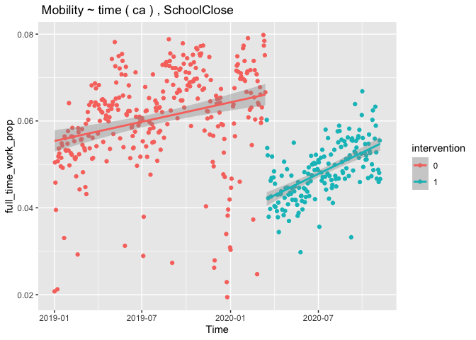
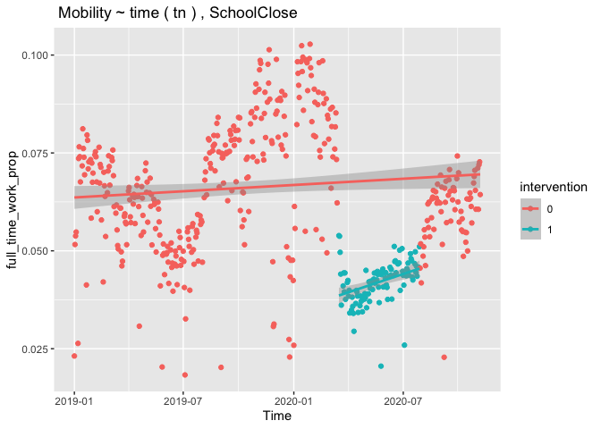
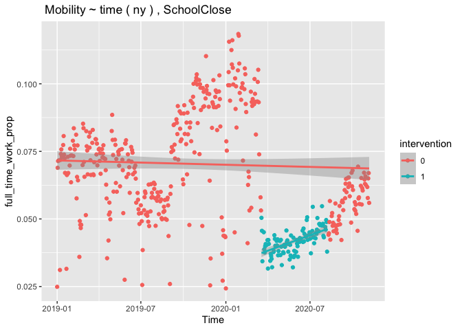
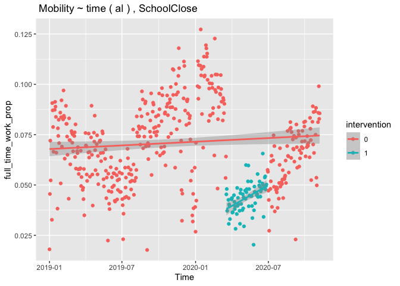
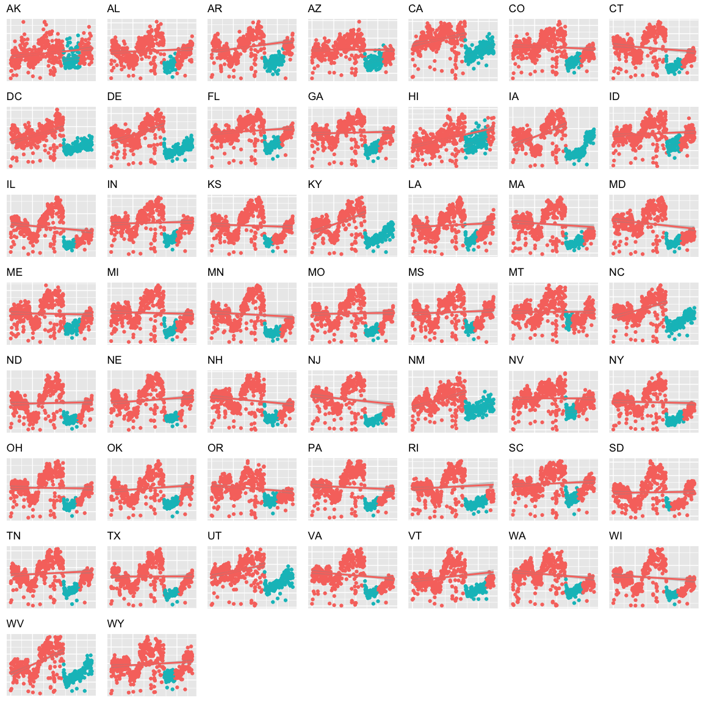
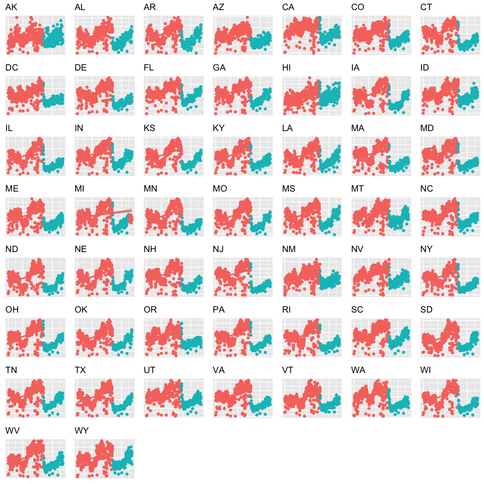
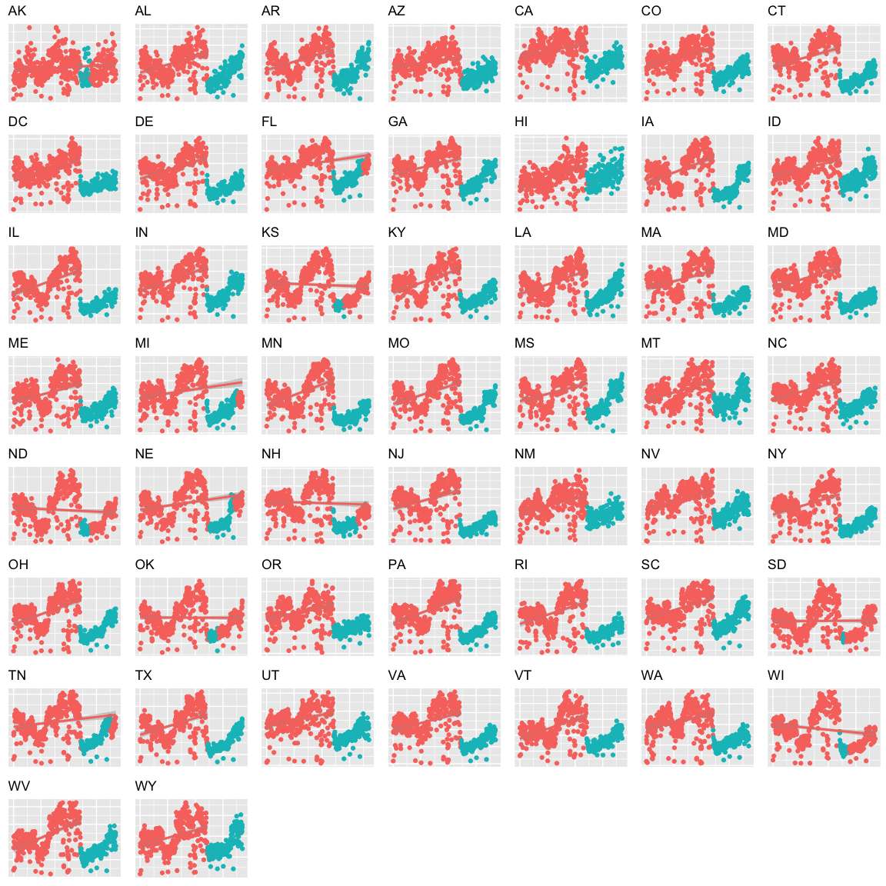
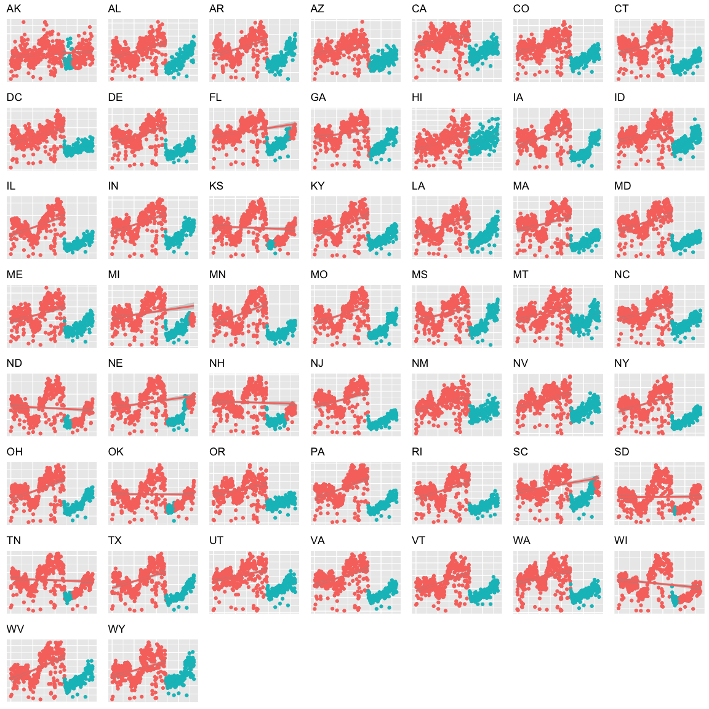

# Introduction

In this notebook, our goal is to estimate the causal effect of different state policies on mobility signal in a state-level. 

We will look at a number of states that have enforced the same type of policies, both mandatory and non-mandatory, and see if the effect of the same intervention may vary from state to state. The mobility signals are from [Delphi Epidata API](https://cmu-delphi.github.io/delphi-epidata/api/covidcast-signals/safegraph.html), which include ``full_time_work_prop``, ``part_time_work_prop``, ``completely_home_prop``, and ``median_home_dwell_time``.

The policy data is from University of Washington's [State-level social distancing policies](https://github.com/COVID19StatePolicy/SocialDistancing) as we will use it in model building. For the definition of the policy, please refer to the [codebooks](https://github.com/COVID19StatePolicy/SocialDistancing/blob/master/codebooks/State%20COVID-19%20policy%20documentation%2C%20Fall%202020.pdf).

Based on exploratory data analysis, there is a significant decrase in mobility signal during weekends, we will drop all the weekends in the data throughout this analysis. 


```r
library(ggplot2)
library (readr)
library(tidyverse)
library(dplyr)
library(covidcast)
library(lubridate)
library(ggpubr)
library(reshape2)
library(tidyr)
library(viridis)
library(gridExtra)
library(zoo)
library(cowplot)
library(gplots)
library(car)
library(nortest)
library(mgcv)
#library(MASS)

source("code/painter.r")
source("code/loader.r")
source("code/parser.r")
```


```r
STARTDATE <- "2019-01-01"
ENDDATE <- lubridate::today()
GEO_TYPE = "state" # state-level
GEO_VALUE = "*" # all states
EXCLUDED_AREAS = c("as","gu", "mp","vi", "pr") # excluded areas due to small sample size
```


```r
# Full time away home mobility
ftime <- covidcast_signal(data_source = "safegraph", 
                            signal ="full_time_work_prop",
                            start_day = STARTDATE, 
                            end_day = ENDDATE,
                            geo_type = GEO_TYPE, 
                            geo_values = GEO_VALUE)
# filter out a few states
ftime <- ftime %>%  
    filter(!(geo_value %in% EXCLUDED_AREAS))
  

# The fraction of mobile devices that did not leave the immediate area of their home (SafeGraph’s completely_home_device_count / device_count)
chome <- covidcast_signal(data_source = "safegraph", 
                            signal ="completely_home_prop",
                            start_day = STARTDATE, 
                            end_day = ENDDATE,
                            geo_type = GEO_TYPE, 
                            geo_values = GEO_VALUE)
# filter out a few states
chome <- chome %>%  
    filter(!(geo_value %in% EXCLUDED_AREAS))


# The median time spent at home for all devices at this location for this time period, in minutes
mhome<- covidcast_signal(data_source = "safegraph", 
                            signal ="median_home_dwell_time",
                            start_day = STARTDATE, 
                            end_day = ENDDATE,
                            geo_type = GEO_TYPE, 
                            geo_values = GEO_VALUE)

# filter out a few states
mhome <- mhome %>%  
    filter(!(geo_value %in% EXCLUDED_AREAS))

# Read government intervention data
policy <- load_policy()
```


# Analysis

We would like to look at policies that have been implemented by all the states: school closure, restaurant restriction, emergency declaration, and bar restriction. The full list of policies are listed below (please refer to the [codebooks](https://github.com/COVID19StatePolicy/SocialDistancing/blob/master/codebooks/State%20COVID-19%20policy%20documentation%2C%20Fall%202020.pdf) for detailed definitions):

* ``EmergDec``: Emergency declaration; currently includes State of Emergency, Public Health Emergency, Public Health Disaster declarations, Civil Emergency declarations, and other permutations of state‐level declarations of emergency in response to COVID‐19.

* ``SchoolClose``: Formal closing of (at minimum) public K‐12 schools. 

* ``BarRestrict``: Restriction or limitation of bars, breweries,wineries, tasting rooms, and/or other venues where alcoholic beverages are consumed on‐premises and sales of on‐site alcohol consumption is the primary function of the venue (i.e., bars/bar areas contained within restaurants are coded within RestaurantRestrict, as are venues that may be called bars, pubs, etc. but have food licenses)

* ``GathRestrict``: gathering restriction       

* ``OtherBusinessClose``: Mandate to close or substantially reduce operations of any category of business that are not classified under restaurants or bars.

* ``RestaurantRestrict`` : Restriction or limitation of restaurants and other venues where food is consumed on‐premises. Establishments where alcohol is served and may be called a bar or like venue but have a food license are coded within the RestaurantRestrict policy category as they are viewed as operating more like a restaurant than a bar.

* ``CaseIsolation``: Policy that requires individuals with confirmed coronavirus infection (via testing) or suspected infection to self‐isolate for a specified period of time, or when they no longer test positive for infection.  

* ``StayAtHome``: Policy instructing individuals to stay at home for all non‐essential activities. Coding a case as a stay‐at‐home order mandate requires the executive order to using phrasing indicative of a mandate (e.g., "must stay at home"); otherwise it is coded as 0 for the "Mandate" variable if it uses advisory phrasing.        

* ``PublicMask``: Policy that recommends or requires individuals to wear masks or other mouth and nose coverings when they are outside their places of residence in the public.

* ``Quarantine``: Quarantines mandated for people entering the state, requiring a period of self‐isolation. Quarantines may be imposed on all people entering the state, out‐of‐ state residents, or travelers from a particular state or city.

* ``NEBusinessClose``: Mandate to close all non‐essential businesses. Coding a case as a closure order requires the executive order to use phrasing indicative of a mandate (e.g., "non‐essential businesses are required to close", "non‐essential businesses must cease
operations by date"). 

* ``TravelRestrictIntra``: Restrictions on travel within the state.

* ``TravelRestrictEntry``: Travel restriction mandates that limit non‐residents from entering a given state.

* ``SchoolMask``: Policy that involves requiring students to wear masks or other mouth and nose coverings while at school.   

* ``TravelRestrictExit``: Policies which prohibit residents of a state from leaving the state.

* ``BusinessMask``: Policy that involves requiring employees to wear masks or other mouth and nose coverings as part of business operations. 

Then, we focus on a number of states, in which some of them enforce one of the policies as mandatory, and some of them implement the policy as a recommendation. 


```r
# We filter down to only state wide policy
policy <- policy %>% 
  filter(StateWide ==  1)
```

## Regression Discontinuity Design

First, we look at the simplest regression discontinuty (RD) design by regressing mobility on time in different states.


### School Closure


```r
# Look at where has enacted school close as a mandate
mandate.states <- policy %>%
  filter(StatePolicy=='SchoolClose' & Mandate==1) %>%
  dplyr::select(StateName) %>%
  arrange(StateName) %>%
  unique %>%
  as.list

print("States that enact school closure policy as a mandate:") 
```

```
## [1] "States that enact school closure policy as a mandate:"
```

```r
print(mandate.states$StateName)
```

```
##  [1] "Alabama"              "Alaska"               "Arizona"             
##  [4] "Arkansas"             "Colorado"             "Connecticut"         
##  [7] "Delaware"             "District of Columbia" "Florida"             
## [10] "Georgia"              "Hawaii"               "Idaho"               
## [13] "Illinois"             "Indiana"              "Iowa"                
## [16] "Kansas"               "Louisiana"            "Maine"               
## [19] "Maryland"             "Massachusetts"        "Michigan"            
## [22] "Minnesota"            "Mississippi"          "Missouri"            
## [25] "Montana"              "Nebraska"             "Nevada"              
## [28] "New Hampshire"        "New Jersey"           "New Mexico"          
## [31] "New York"             "North Carolina"       "North Dakota"        
## [34] "Ohio"                 "Oklahoma"             "Oregon"              
## [37] "Pennsylvania"         "Rhode Island"         "South Carolina"      
## [40] "Texas"                "Utah"                 "Vermont"             
## [43] "Virginia"             "Washington"           "West Virginia"       
## [46] "Wisconsin"            "Wyoming"
```

```r
# Look at where school close is enacted as a recommendation
nonmandate.states <- policy %>%
  filter(StatePolicy=='SchoolClose' & Mandate==0) %>%
  dplyr::select(StateName) %>%
  arrange(StateName) %>%
  unique() %>%
  as.list %>%
  as.vector 

print("States that enact school closure policy as a recommendation:") 
```

```
## [1] "States that enact school closure policy as a recommendation:"
```

```r
print(nonmandate.states$StateName)
```

```
## [1] "California"   "Iowa"         "Kentucky"     "South Dakota" "Tennessee"
```

```r
# Check if any state has changed their school close from mandate to recommendation, or the other way around
print("States that have changed the mandatory status of school closure")
```

```
## [1] "States that have changed the mandatory status of school closure"
```

```r
dplyr::intersect(nonmandate.states$StateName, 
                 mandate.states$StateName)
```

```
## [1] "Iowa"
```

#### California


```r
plotRD(ftime,
         policy,
         "SchoolClose", 
         "ca",
         STARTDATE,
         ENDDATE)
```

<!-- -->

#### Tennessee

```r
plotRD(ftime,
         policy,
         "SchoolClose", 
         "tn",
         STARTDATE,
         ENDDATE)
```

<!-- -->

#### New York


```r
plotRD(ftime,
         policy,
         "SchoolClose", 
         "ny",
         STARTDATE,
         ENDDATE)
```

<!-- -->

#### Alabama


```r
plotRD(ftime,
         policy,
         "SchoolClose", 
         "al",
         STARTDATE,
         ENDDATE)
```

<!-- -->

#### All-in-one


```r
states <- unique(ftime$geo_value)

plist <- list()
count <- 1
for(state in states){
  p <- plotRD(ftime,
         policy,
         "SchoolClose", 
         state,
         STARTDATE,
         ENDDATE,
         plotMultiple = T)

  plist[[count]] <- p
  count = count + 1
}

n <- length(plist)
nCol <- floor(sqrt(n))
do.call("grid.arrange", c(plist, ncol=nCol))
```

<!-- -->

### Emergency Declaration


```r
# Look at where has enacted school close as a mandate
mandate.states <- policy %>%
  filter(StatePolicy=='EmergDec' & Mandate==1) %>%
  dplyr::select(StateName) %>%
  arrange(StateName) %>%
  unique %>%
  as.list

print("States that enact emergency declaration policy as a mandate:") 
```

```
## [1] "States that enact emergency declaration policy as a mandate:"
```

```r
print(mandate.states$StateName)
```

```
##  [1] "Alabama"              "Alaska"               "Arizona"             
##  [4] "Arkansas"             "California"           "Colorado"            
##  [7] "Connecticut"          "Delaware"             "District of Columbia"
## [10] "Florida"              "Georgia"              "Hawaii"              
## [13] "Idaho"                "Illinois"             "Indiana"             
## [16] "Iowa"                 "Kansas"               "Kentucky"            
## [19] "Louisiana"            "Maine"                "Maryland"            
## [22] "Massachusetts"        "Michigan"             "Minnesota"           
## [25] "Mississippi"          "Missouri"             "Montana"             
## [28] "Nebraska"             "Nevada"               "New Hampshire"       
## [31] "New Jersey"           "New Mexico"           "New York"            
## [34] "North Carolina"       "North Dakota"         "Ohio"                
## [37] "Oklahoma"             "Oregon"               "Pennsylvania"        
## [40] "Rhode Island"         "South Carolina"       "South Dakota"        
## [43] "Tennessee"            "Texas"                "Utah"                
## [46] "Vermont"              "Virginia"             "Washington"          
## [49] "West Virginia"        "Wisconsin"            "Wyoming"
```

```r
# Look at where school close is enacted as a recommendation
nonmandate.states <- policy %>%
  filter(StatePolicy=='EmergDec' & Mandate==0) %>%
  dplyr::select(StateName) %>%
  arrange(StateName) %>%
  unique() %>%
  as.list %>%
  as.vector 

print("States that enact emergency declaration policy as a recommendation:") 
```

```
## [1] "States that enact emergency declaration policy as a recommendation:"
```

```r
print(nonmandate.states$StateName)
```

```
## character(0)
```

```r
# Check if any state has changed their school close from mandate to recommendation, or the other way around
print("States that have changed the mandatory status of emergency declaration")
```

```
## [1] "States that have changed the mandatory status of emergency declaration"
```

```r
dplyr::intersect(nonmandate.states$StateName, 
                 mandate.states$StateName)
```

```
## character(0)
```

#### All-in-one


```r
states <- unique(ftime$geo_value)

plist <- list()
count <- 1
for(state in states){
  p <- plotRD(ftime,
         policy,
         "EmergDec", 
         state,
         STARTDATE,
         ENDDATE,
         plotMultiple = T)

  plist[[count]] <- p
  count = count + 1
}

n <- length(plist)
nCol <- floor(sqrt(n))
do.call("grid.arrange", c(plist, ncol=nCol))
```

<!-- -->

### Bar Restriction


```r
# Look at where has enacted school close as a mandate
mandate.states <- policy %>%
  filter(StatePolicy=='BarRestrict' & Mandate==1) %>%
  dplyr::select(StateName) %>%
  arrange(StateName) %>%
  unique %>%
  as.list

print("States that enact bar restriction policy as a mandate:") 
```

```
## [1] "States that enact bar restriction policy as a mandate:"
```

```r
print(mandate.states$StateName)
```

```
##  [1] "Alabama"              "Alaska"               "Arizona"             
##  [4] "Arkansas"             "California"           "Colorado"            
##  [7] "Connecticut"          "Delaware"             "District of Columbia"
## [10] "Florida"              "Georgia"              "Hawaii"              
## [13] "Idaho"                "Illinois"             "Indiana"             
## [16] "Iowa"                 "Kansas"               "Kentucky"            
## [19] "Louisiana"            "Maine"                "Maryland"            
## [22] "Massachusetts"        "Michigan"             "Minnesota"           
## [25] "Mississippi"          "Missouri"             "Montana"             
## [28] "Nebraska"             "Nevada"               "New Hampshire"       
## [31] "New Jersey"           "New Mexico"           "New York"            
## [34] "North Carolina"       "North Dakota"         "Ohio"                
## [37] "Oklahoma"             "Oregon"               "Pennsylvania"        
## [40] "Rhode Island"         "South Carolina"       "South Dakota"        
## [43] "Tennessee"            "Texas"                "Utah"                
## [46] "Vermont"              "Virginia"             "Washington"          
## [49] "West Virginia"        "Wisconsin"            "Wyoming"
```

```r
# Look at where school close is enacted as a recommendation
nonmandate.states <- policy %>%
  filter(StatePolicy=='BarRestrict' & Mandate==0) %>%
  dplyr::select(StateName) %>%
  arrange(StateName) %>%
  unique() %>%
  as.list %>%
  as.vector 

print("States that enact bar restriction policy as a recommendation:") 
```

```
## [1] "States that enact bar restriction policy as a recommendation:"
```

```r
print(nonmandate.states$StateName)
```

```
## [1] "California"
```

```r
# Check if any state has changed their school close from mandate to recommendation, or the other way around
print("States that have changed the mandatory status of bar restriction")
```

```
## [1] "States that have changed the mandatory status of bar restriction"
```

```r
dplyr::intersect(nonmandate.states$StateName, 
                 mandate.states$StateName)
```

```
## [1] "California"
```


```r
states <- unique(ftime$geo_value)

plist <- list()
count <- 1
for(state in states){
  p <- plotRD(ftime,
         policy,
         "BarRestrict", 
         state,
         STARTDATE,
         ENDDATE,
         plotMultiple = T)

  plist[[count]] <- p
  count = count + 1
}

n <- length(plist)
nCol <- floor(sqrt(n))
do.call("grid.arrange", c(plist, ncol=nCol))
```

<!-- -->

### Restaurant Restriction


```r
# Look at where has enacted school close as a mandate
mandate.states <- policy %>%
  filter(StatePolicy=='RestaurantRestrict' & Mandate==1) %>%
  dplyr::select(StateName) %>%
  arrange(StateName) %>%
  unique %>%
  as.list

print("States that enact restaurant restriction policy as a mandate:") 
```

```
## [1] "States that enact restaurant restriction policy as a mandate:"
```

```r
print(mandate.states$StateName)
```

```
##  [1] "Alabama"              "Alaska"               "Arizona"             
##  [4] "Arkansas"             "California"           "Colorado"            
##  [7] "Connecticut"          "Delaware"             "District of Columbia"
## [10] "Florida"              "Georgia"              "Hawaii"              
## [13] "Idaho"                "Illinois"             "Indiana"             
## [16] "Iowa"                 "Kansas"               "Kentucky"            
## [19] "Louisiana"            "Maine"                "Maryland"            
## [22] "Massachusetts"        "Michigan"             "Minnesota"           
## [25] "Mississippi"          "Missouri"             "Montana"             
## [28] "Nebraska"             "Nevada"               "New Hampshire"       
## [31] "New Jersey"           "New Mexico"           "New York"            
## [34] "North Carolina"       "North Dakota"         "Ohio"                
## [37] "Oklahoma"             "Oregon"               "Pennsylvania"        
## [40] "Rhode Island"         "South Carolina"       "South Dakota"        
## [43] "Tennessee"            "Texas"                "Utah"                
## [46] "Vermont"              "Virginia"             "Washington"          
## [49] "West Virginia"        "Wisconsin"            "Wyoming"
```

```r
# Look at where school close is enacted as a recommendation
nonmandate.states <- policy %>%
  filter(StatePolicy=='RestaurantRestrict' & Mandate==0) %>%
  dplyr::select(StateName) %>%
  arrange(StateName) %>%
  unique() %>%
  as.list %>%
  as.vector 

print("States that enact restaurant restriction policy as a recommendation:") 
```

```
## [1] "States that enact restaurant restriction policy as a recommendation:"
```

```r
print(nonmandate.states$StateName)
```

```
## [1] "California"
```

```r
# Check if any state has changed their school close from mandate to recommendation, or the other way around
print("States that have changed the mandatory status of restaurant restriction")
```

```
## [1] "States that have changed the mandatory status of restaurant restriction"
```

```r
dplyr::intersect(nonmandate.states$StateName, 
                 mandate.states$StateName)
```

```
## [1] "California"
```


```r
states <- unique(ftime$geo_value)

plist <- list()
count <- 1
for(state in states){
  p <- plotRD(ftime,
         policy,
         "RestaurantRestrict", 
         state,
         STARTDATE,
         ENDDATE,
         plotMultiple = T)

  plist[[count]] <- p
  count = count + 1
}

n <- length(plist)
nCol <- floor(sqrt(n))
do.call("grid.arrange", c(plist, ncol=nCol))
```

<!-- -->

## Linear Regression 

$$y = \beta_{0} + \beta_{1}t + \beta_{2}I_t + \beta_{3}tI_t$$

### Full-time-work-prop


#### Emergency Declaration


```r
# compute the number of policies and rolling mean of the number
# for each day between start and end dates
for(state in states){
  print(state)
  print("---------------------")
  ftime.state <- ftime %>% filter(geo_value == state)
  policy.state <- policy %>% filter(StatePostal == state)
  policy_signal.state <- getSumOfPolicy(policy.state, STARTDATE, ENDDATE)
  # left join mobility with policy signal by time 
  ftime.policy.df <- left_join(ftime.state , policy_signal.state, by = "time_value")
  
  # Filter weekend effects
  ftime.policy.df<- ftime.policy.df %>% 
    mutate(weekday= weekdays(as.Date(time_value)))%>% 
    filter(!weekday %in% c("Saturday", "Sunday")) 
  
  lm.fit <- lm(value~time_value*EmergDec,data=ftime.policy.df)
  print(summary(lm.fit))
}
```

```
## [1] "ak"
## [1] "---------------------"
## 
## Call:
## lm(formula = value ~ time_value * EmergDec, data = ftime.policy.df)
## 
## Residuals:
##       Min        1Q    Median        3Q       Max 
## -0.030378 -0.006689 -0.001319  0.006600  0.042003 
## 
## Coefficients:
##                       Estimate Std. Error t value Pr(>|t|)    
## (Intercept)         -4.820e-01  8.846e-02  -5.449 8.10e-08 ***
## time_value           2.967e-05  4.883e-06   6.076 2.51e-09 ***
## EmergDec            -5.914e-01  2.373e-01  -2.493   0.0130 *  
## time_value:EmergDec  3.139e-05  1.289e-05   2.435   0.0153 *  
## ---
## Signif. codes:  0 '***' 0.001 '**' 0.01 '*' 0.05 '.' 0.1 ' ' 1
## 
## Residual standard error: 0.01088 on 480 degrees of freedom
## Multiple R-squared:  0.1229,	Adjusted R-squared:  0.1174 
## F-statistic: 22.41 on 3 and 480 DF,  p-value: 1.35e-13
## 
## [1] "al"
## [1] "---------------------"
## 
## Call:
## lm(formula = value ~ time_value * EmergDec, data = ftime.policy.df)
## 
## Residuals:
##       Min        1Q    Median        3Q       Max 
## -0.057077 -0.008910  0.001088  0.010290  0.042576 
## 
## Coefficients:
##                       Estimate Std. Error t value Pr(>|t|)    
## (Intercept)         -1.260e+00  1.317e-01  -9.568  < 2e-16 ***
## time_value           7.357e-05  7.268e-06  10.122  < 2e-16 ***
## EmergDec            -1.956e+00  3.616e-01  -5.411 9.93e-08 ***
## time_value:EmergDec  1.037e-04  1.964e-05   5.280 1.96e-07 ***
## ---
## Signif. codes:  0 '***' 0.001 '**' 0.01 '*' 0.05 '.' 0.1 ' ' 1
## 
## Residual standard error: 0.01634 on 480 degrees of freedom
## Multiple R-squared:  0.4014,	Adjusted R-squared:  0.3977 
## F-statistic: 107.3 on 3 and 480 DF,  p-value: < 2.2e-16
## 
## [1] "ar"
## [1] "---------------------"
## 
## Call:
## lm(formula = value ~ time_value * EmergDec, data = ftime.policy.df)
## 
## Residuals:
##       Min        1Q    Median        3Q       Max 
## -0.054876 -0.008615  0.002204  0.009172  0.037126 
## 
## Coefficients:
##                       Estimate Std. Error t value Pr(>|t|)    
## (Intercept)         -1.093e+00  1.209e-01  -9.042  < 2e-16 ***
## time_value           6.414e-05  6.672e-06   9.613  < 2e-16 ***
## EmergDec            -1.476e+00  3.242e-01  -4.553 6.72e-06 ***
## time_value:EmergDec  7.799e-05  1.761e-05   4.428 1.18e-05 ***
## ---
## Signif. codes:  0 '***' 0.001 '**' 0.01 '*' 0.05 '.' 0.1 ' ' 1
## 
## Residual standard error: 0.01486 on 480 degrees of freedom
## Multiple R-squared:  0.3704,	Adjusted R-squared:  0.3664 
## F-statistic: 94.12 on 3 and 480 DF,  p-value: < 2.2e-16
## 
## [1] "az"
## [1] "---------------------"
## 
## Call:
## lm(formula = value ~ time_value * EmergDec, data = ftime.policy.df)
## 
## Residuals:
##       Min        1Q    Median        3Q       Max 
## -0.043346 -0.005020  0.001015  0.005986  0.031184 
## 
## Coefficients:
##                       Estimate Std. Error t value Pr(>|t|)    
## (Intercept)         -6.790e-01  8.148e-02  -8.334 8.28e-16 ***
## time_value           4.080e-05  4.498e-06   9.071  < 2e-16 ***
## EmergDec            -4.257e-01  2.185e-01  -1.948   0.0520 .  
## time_value:EmergDec  2.149e-05  1.187e-05   1.810   0.0709 .  
## ---
## Signif. codes:  0 '***' 0.001 '**' 0.01 '*' 0.05 '.' 0.1 ' ' 1
## 
## Residual standard error: 0.01002 on 480 degrees of freedom
## Multiple R-squared:  0.4358,	Adjusted R-squared:  0.4323 
## F-statistic: 123.6 on 3 and 480 DF,  p-value: < 2.2e-16
## 
## [1] "ca"
## [1] "---------------------"
## 
## Call:
## lm(formula = value ~ time_value * EmergDec, data = ftime.policy.df)
## 
## Residuals:
##       Min        1Q    Median        3Q       Max 
## -0.044309 -0.004451  0.000541  0.005761  0.033678 
## 
## Coefficients:
##                       Estimate Std. Error t value Pr(>|t|)    
## (Intercept)         -3.479e-01  8.353e-02  -4.164 3.70e-05 ***
## time_value           2.255e-05  4.612e-06   4.889 1.39e-06 ***
## EmergDec            -9.467e-02  2.116e-01  -0.447    0.655    
## time_value:EmergDec  4.111e-06  1.150e-05   0.357    0.721    
## ---
## Signif. codes:  0 '***' 0.001 '**' 0.01 '*' 0.05 '.' 0.1 ' ' 1
## 
## Residual standard error: 0.01003 on 480 degrees of freedom
## Multiple R-squared:  0.2615,	Adjusted R-squared:  0.2569 
## F-statistic: 56.65 on 3 and 480 DF,  p-value: < 2.2e-16
## 
## [1] "co"
## [1] "---------------------"
## 
## Call:
## lm(formula = value ~ time_value * EmergDec, data = ftime.policy.df)
## 
## Residuals:
##       Min        1Q    Median        3Q       Max 
## -0.051150 -0.005522  0.001215  0.008097  0.044722 
## 
## Coefficients:
##                       Estimate Std. Error t value Pr(>|t|)    
## (Intercept)         -7.870e-01  1.009e-01  -7.799 3.93e-14 ***
## time_value           4.731e-05  5.571e-06   8.492 2.56e-16 ***
## EmergDec            -6.156e-01  2.707e-01  -2.274   0.0234 *  
## time_value:EmergDec  3.145e-05  1.471e-05   2.139   0.0330 *  
## ---
## Signif. codes:  0 '***' 0.001 '**' 0.01 '*' 0.05 '.' 0.1 ' ' 1
## 
## Residual standard error: 0.01241 on 480 degrees of freedom
## Multiple R-squared:  0.4364,	Adjusted R-squared:  0.4329 
## F-statistic: 123.9 on 3 and 480 DF,  p-value: < 2.2e-16
## 
## [1] "ct"
## [1] "---------------------"
## 
## Call:
## lm(formula = value ~ time_value * EmergDec, data = ftime.policy.df)
## 
## Residuals:
##       Min        1Q    Median        3Q       Max 
## -0.064344 -0.006756  0.001151  0.011844  0.069762 
## 
## Coefficients:
##                       Estimate Std. Error t value Pr(>|t|)    
## (Intercept)         -1.064e+00  1.429e-01  -7.450 4.38e-13 ***
## time_value           6.312e-05  7.888e-06   8.002 9.29e-15 ***
## EmergDec            -4.390e-01  3.788e-01  -1.159    0.247    
## time_value:EmergDec  2.095e-05  2.059e-05   1.018    0.309    
## ---
## Signif. codes:  0 '***' 0.001 '**' 0.01 '*' 0.05 '.' 0.1 ' ' 1
## 
## Residual standard error: 0.01749 on 480 degrees of freedom
## Multiple R-squared:  0.4738,	Adjusted R-squared:  0.4705 
## F-statistic: 144.1 on 3 and 480 DF,  p-value: < 2.2e-16
## 
## [1] "dc"
## [1] "---------------------"
## 
## Call:
## lm(formula = value ~ time_value * EmergDec, data = ftime.policy.df)
## 
## Residuals:
##       Min        1Q    Median        3Q       Max 
## -0.045601 -0.004948 -0.000484  0.006375  0.045223 
## 
## Coefficients:
##                       Estimate Std. Error t value Pr(>|t|)    
## (Intercept)         -9.020e-01  9.437e-02  -9.558   <2e-16 ***
## time_value           5.325e-05  5.210e-06  10.221   <2e-16 ***
## EmergDec             2.580e-01  2.531e-01   1.019    0.309    
## time_value:EmergDec -1.593e-05  1.375e-05  -1.158    0.247    
## ---
## Signif. codes:  0 '***' 0.001 '**' 0.01 '*' 0.05 '.' 0.1 ' ' 1
## 
## Residual standard error: 0.0116 on 480 degrees of freedom
## Multiple R-squared:  0.4397,	Adjusted R-squared:  0.4362 
## F-statistic: 125.6 on 3 and 480 DF,  p-value: < 2.2e-16
## 
## [1] "de"
## [1] "---------------------"
## 
## Call:
## lm(formula = value ~ time_value * EmergDec, data = ftime.policy.df)
## 
## Residuals:
##       Min        1Q    Median        3Q       Max 
## -0.054892 -0.005178  0.000583  0.008168  0.026662 
## 
## Coefficients:
##                       Estimate Std. Error t value Pr(>|t|)    
## (Intercept)         -1.021e+00  1.051e-01  -9.710   <2e-16 ***
## time_value           6.016e-05  5.803e-06  10.367   <2e-16 ***
## EmergDec            -1.820e-01  2.887e-01  -0.630    0.529    
## time_value:EmergDec  7.444e-06  1.568e-05   0.475    0.635    
## ---
## Signif. codes:  0 '***' 0.001 '**' 0.01 '*' 0.05 '.' 0.1 ' ' 1
## 
## Residual standard error: 0.01305 on 480 degrees of freedom
## Multiple R-squared:  0.5142,	Adjusted R-squared:  0.5112 
## F-statistic: 169.4 on 3 and 480 DF,  p-value: < 2.2e-16
## 
## [1] "fl"
## [1] "---------------------"
## 
## Call:
## lm(formula = value ~ time_value * EmergDec, data = ftime.policy.df)
## 
## Residuals:
##       Min        1Q    Median        3Q       Max 
## -0.050349 -0.004386  0.000390  0.005833  0.036668 
## 
## Coefficients:
##                       Estimate Std. Error t value Pr(>|t|)    
## (Intercept)         -8.679e-01  8.585e-02 -10.110  < 2e-16 ***
## time_value           5.128e-05  4.740e-06  10.820  < 2e-16 ***
## EmergDec            -7.653e-01  2.250e-01  -3.401 0.000727 ***
## time_value:EmergDec  3.985e-05  1.223e-05   3.259 0.001199 ** 
## ---
## Signif. codes:  0 '***' 0.001 '**' 0.01 '*' 0.05 '.' 0.1 ' ' 1
## 
## Residual standard error: 0.01046 on 480 degrees of freedom
## Multiple R-squared:  0.4187,	Adjusted R-squared:  0.4151 
## F-statistic: 115.3 on 3 and 480 DF,  p-value: < 2.2e-16
## 
## [1] "ga"
## [1] "---------------------"
## 
## Call:
## lm(formula = value ~ time_value * EmergDec, data = ftime.policy.df)
## 
## Residuals:
##       Min        1Q    Median        3Q       Max 
## -0.057208 -0.005302  0.001941  0.008149  0.024139 
## 
## Coefficients:
##                       Estimate Std. Error t value Pr(>|t|)    
## (Intercept)         -8.524e-01  1.034e-01  -8.245 1.59e-15 ***
## time_value           5.065e-05  5.707e-06   8.876  < 2e-16 ***
## EmergDec            -1.672e+00  2.839e-01  -5.890 7.28e-09 ***
## time_value:EmergDec  8.877e-05  1.542e-05   5.756 1.54e-08 ***
## ---
## Signif. codes:  0 '***' 0.001 '**' 0.01 '*' 0.05 '.' 0.1 ' ' 1
## 
## Residual standard error: 0.01283 on 480 degrees of freedom
## Multiple R-squared:  0.4312,	Adjusted R-squared:  0.4277 
## F-statistic: 121.3 on 3 and 480 DF,  p-value: < 2.2e-16
## 
## [1] "hi"
## [1] "---------------------"
## 
## Call:
## lm(formula = value ~ time_value * EmergDec, data = ftime.policy.df)
## 
## Residuals:
##        Min         1Q     Median         3Q        Max 
## -0.0153933 -0.0026392  0.0000795  0.0022947  0.0134726 
## 
## Coefficients:
##                       Estimate Std. Error t value Pr(>|t|)    
## (Intercept)         -3.301e-01  3.338e-02  -9.890   <2e-16 ***
## time_value           1.988e-05  1.843e-06  10.787   <2e-16 ***
## EmergDec            -2.374e-02  8.455e-02  -0.281    0.779    
## time_value:EmergDec  9.436e-07  4.596e-06   0.205    0.837    
## ---
## Signif. codes:  0 '***' 0.001 '**' 0.01 '*' 0.05 '.' 0.1 ' ' 1
## 
## Residual standard error: 0.004007 on 480 degrees of freedom
## Multiple R-squared:  0.2283,	Adjusted R-squared:  0.2235 
## F-statistic: 47.33 on 3 and 480 DF,  p-value: < 2.2e-16
## 
## [1] "ia"
## [1] "---------------------"
## 
## Call:
## lm(formula = value ~ time_value * EmergDec, data = ftime.policy.df)
## 
## Residuals:
##       Min        1Q    Median        3Q       Max 
## -0.076301 -0.011374  0.001685  0.014651  0.076862 
## 
## Coefficients:
##                       Estimate Std. Error t value Pr(>|t|)    
## (Intercept)         -1.836e+00  1.781e-01 -10.308  < 2e-16 ***
## time_value           1.061e-04  9.833e-06  10.789  < 2e-16 ***
## EmergDec            -1.448e+00  4.668e-01  -3.101  0.00204 ** 
## time_value:EmergDec  7.499e-05  2.537e-05   2.956  0.00327 ** 
## ---
## Signif. codes:  0 '***' 0.001 '**' 0.01 '*' 0.05 '.' 0.1 ' ' 1
## 
## Residual standard error: 0.02169 on 480 degrees of freedom
## Multiple R-squared:  0.4301,	Adjusted R-squared:  0.4265 
## F-statistic: 120.7 on 3 and 480 DF,  p-value: < 2.2e-16
## 
## [1] "id"
## [1] "---------------------"
## 
## Call:
## lm(formula = value ~ time_value * EmergDec, data = ftime.policy.df)
## 
## Residuals:
##       Min        1Q    Median        3Q       Max 
## -0.051391 -0.005566  0.000795  0.007388  0.027326 
## 
## Coefficients:
##                       Estimate Std. Error t value Pr(>|t|)    
## (Intercept)         -7.694e-01  8.951e-02  -8.597  < 2e-16 ***
## time_value           4.599e-05  4.941e-06   9.308  < 2e-16 ***
## EmergDec            -8.960e-01  2.458e-01  -3.645 0.000296 ***
## time_value:EmergDec  4.714e-05  1.335e-05   3.531 0.000454 ***
## ---
## Signif. codes:  0 '***' 0.001 '**' 0.01 '*' 0.05 '.' 0.1 ' ' 1
## 
## Residual standard error: 0.01111 on 480 degrees of freedom
## Multiple R-squared:  0.3329,	Adjusted R-squared:  0.3287 
## F-statistic: 79.85 on 3 and 480 DF,  p-value: < 2.2e-16
## 
## [1] "il"
## [1] "---------------------"
## 
## Call:
## lm(formula = value ~ time_value * EmergDec, data = ftime.policy.df)
## 
## Residuals:
##       Min        1Q    Median        3Q       Max 
## -0.069228 -0.007947  0.000149  0.010178  0.068106 
## 
## Coefficients:
##                       Estimate Std. Error t value Pr(>|t|)    
## (Intercept)         -1.558e+00  1.522e-01 -10.238   <2e-16 ***
## time_value           9.040e-05  8.404e-06  10.757   <2e-16 ***
## EmergDec             4.223e-01  3.990e-01   1.059    0.290    
## time_value:EmergDec -2.633e-05  2.168e-05  -1.214    0.225    
## ---
## Signif. codes:  0 '***' 0.001 '**' 0.01 '*' 0.05 '.' 0.1 ' ' 1
## 
## Residual standard error: 0.01854 on 480 degrees of freedom
## Multiple R-squared:  0.4976,	Adjusted R-squared:  0.4945 
## F-statistic: 158.5 on 3 and 480 DF,  p-value: < 2.2e-16
## 
## [1] "in"
## [1] "---------------------"
## 
## Call:
## lm(formula = value ~ time_value * EmergDec, data = ftime.policy.df)
## 
## Residuals:
##       Min        1Q    Median        3Q       Max 
## -0.053767 -0.006984  0.000354  0.009216  0.049958 
## 
## Coefficients:
##                       Estimate Std. Error t value Pr(>|t|)    
## (Intercept)         -1.063e+00  1.114e-01  -9.542  < 2e-16 ***
## time_value           6.233e-05  6.153e-06  10.130  < 2e-16 ***
## EmergDec            -7.761e-01  2.888e-01  -2.687  0.00745 ** 
## time_value:EmergDec  4.007e-05  1.570e-05   2.553  0.01098 *  
## ---
## Signif. codes:  0 '***' 0.001 '**' 0.01 '*' 0.05 '.' 0.1 ' ' 1
## 
## Residual standard error: 0.01351 on 480 degrees of freedom
## Multiple R-squared:  0.3862,	Adjusted R-squared:  0.3824 
## F-statistic: 100.7 on 3 and 480 DF,  p-value: < 2.2e-16
## 
## [1] "ks"
## [1] "---------------------"
## 
## Call:
## lm(formula = value ~ time_value * EmergDec, data = ftime.policy.df)
## 
## Residuals:
##       Min        1Q    Median        3Q       Max 
## -0.061325 -0.009620  0.001803  0.010907  0.034119 
## 
## Coefficients:
##                       Estimate Std. Error t value Pr(>|t|)    
## (Intercept)         -1.398e+00  1.386e-01 -10.084  < 2e-16 ***
## time_value           8.134e-05  7.654e-06  10.628  < 2e-16 ***
## EmergDec            -1.661e+00  3.763e-01  -4.414 1.25e-05 ***
## time_value:EmergDec  8.724e-05  2.044e-05   4.268 2.38e-05 ***
## ---
## Signif. codes:  0 '***' 0.001 '**' 0.01 '*' 0.05 '.' 0.1 ' ' 1
## 
## Residual standard error: 0.01713 on 480 degrees of freedom
## Multiple R-squared:  0.4553,	Adjusted R-squared:  0.4518 
## F-statistic: 133.7 on 3 and 480 DF,  p-value: < 2.2e-16
## 
## [1] "ky"
## [1] "---------------------"
## 
## Call:
## lm(formula = value ~ time_value * EmergDec, data = ftime.policy.df)
## 
## Residuals:
##       Min        1Q    Median        3Q       Max 
## -0.058530 -0.007339  0.000977  0.010667  0.055775 
## 
## Coefficients:
##                       Estimate Std. Error t value Pr(>|t|)    
## (Intercept)         -1.286e+00  1.324e-01  -9.716   <2e-16 ***
## time_value           7.493e-05  7.309e-06  10.252   <2e-16 ***
## EmergDec             4.400e-02  3.430e-01   0.128    0.898    
## time_value:EmergDec -4.921e-06  1.864e-05  -0.264    0.792    
## ---
## Signif. codes:  0 '***' 0.001 '**' 0.01 '*' 0.05 '.' 0.1 ' ' 1
## 
## Residual standard error: 0.01604 on 480 degrees of freedom
## Multiple R-squared:  0.4006,	Adjusted R-squared:  0.3969 
## F-statistic: 106.9 on 3 and 480 DF,  p-value: < 2.2e-16
## 
## [1] "la"
## [1] "---------------------"
## 
## Call:
## lm(formula = value ~ time_value * EmergDec, data = ftime.policy.df)
## 
## Residuals:
##       Min        1Q    Median        3Q       Max 
## -0.048332 -0.007680  0.000608  0.008524  0.041921 
## 
## Coefficients:
##                       Estimate Std. Error t value Pr(>|t|)    
## (Intercept)         -1.164e+00  1.102e-01 -10.557  < 2e-16 ***
## time_value           6.804e-05  6.086e-06  11.181  < 2e-16 ***
## EmergDec            -1.232e+00  2.957e-01  -4.168 3.65e-05 ***
## time_value:EmergDec  6.477e-05  1.607e-05   4.032 6.44e-05 ***
## ---
## Signif. codes:  0 '***' 0.001 '**' 0.01 '*' 0.05 '.' 0.1 ' ' 1
## 
## Residual standard error: 0.01355 on 480 degrees of freedom
## Multiple R-squared:  0.4045,	Adjusted R-squared:  0.4008 
## F-statistic: 108.7 on 3 and 480 DF,  p-value: < 2.2e-16
## 
## [1] "ma"
## [1] "---------------------"
## 
## Call:
## lm(formula = value ~ time_value * EmergDec, data = ftime.policy.df)
## 
## Residuals:
##       Min        1Q    Median        3Q       Max 
## -0.057219 -0.006416  0.000903  0.010845  0.058011 
## 
## Coefficients:
##                       Estimate Std. Error t value Pr(>|t|)    
## (Intercept)         -9.485e-01  1.331e-01  -7.127 3.79e-12 ***
## time_value           5.657e-05  7.347e-06   7.700 7.83e-14 ***
## EmergDec            -1.745e-01  3.529e-01  -0.495    0.621    
## time_value:EmergDec  6.844e-06  1.917e-05   0.357    0.721    
## ---
## Signif. codes:  0 '***' 0.001 '**' 0.01 '*' 0.05 '.' 0.1 ' ' 1
## 
## Residual standard error: 0.01629 on 480 degrees of freedom
## Multiple R-squared:  0.4705,	Adjusted R-squared:  0.4672 
## F-statistic: 142.2 on 3 and 480 DF,  p-value: < 2.2e-16
## 
## [1] "md"
## [1] "---------------------"
## 
## Call:
## lm(formula = value ~ time_value * EmergDec, data = ftime.policy.df)
## 
## Residuals:
##       Min        1Q    Median        3Q       Max 
## -0.059349 -0.007046  0.000148  0.009140  0.054341 
## 
## Coefficients:
##                       Estimate Std. Error t value Pr(>|t|)    
## (Intercept)         -1.065e+00  1.259e-01  -8.463 3.18e-16 ***
## time_value           6.286e-05  6.950e-06   9.045  < 2e-16 ***
## EmergDec             6.671e-01  3.225e-01   2.069   0.0391 *  
## time_value:EmergDec -3.887e-05  1.753e-05  -2.217   0.0271 *  
## ---
## Signif. codes:  0 '***' 0.001 '**' 0.01 '*' 0.05 '.' 0.1 ' ' 1
## 
## Residual standard error: 0.01518 on 480 degrees of freedom
## Multiple R-squared:  0.5019,	Adjusted R-squared:  0.4988 
## F-statistic: 161.2 on 3 and 480 DF,  p-value: < 2.2e-16
## 
## [1] "me"
## [1] "---------------------"
## 
## Call:
## lm(formula = value ~ time_value * EmergDec, data = ftime.policy.df)
## 
## Residuals:
##       Min        1Q    Median        3Q       Max 
## -0.046076 -0.006947  0.001447  0.009004  0.035059 
## 
## Coefficients:
##                       Estimate Std. Error t value Pr(>|t|)    
## (Intercept)         -8.556e-01  1.106e-01  -7.738 5.99e-14 ***
## time_value           5.103e-05  6.103e-06   8.361 6.77e-16 ***
## EmergDec            -5.564e-01  3.036e-01  -1.832   0.0675 .  
## time_value:EmergDec  2.825e-05  1.649e-05   1.712   0.0875 .  
## ---
## Signif. codes:  0 '***' 0.001 '**' 0.01 '*' 0.05 '.' 0.1 ' ' 1
## 
## Residual standard error: 0.01372 on 480 degrees of freedom
## Multiple R-squared:  0.3706,	Adjusted R-squared:  0.3667 
## F-statistic: 94.22 on 3 and 480 DF,  p-value: < 2.2e-16
## 
## [1] "mi"
## [1] "---------------------"
## 
## Call:
## lm(formula = value ~ time_value * EmergDec, data = ftime.policy.df)
## 
## Residuals:
##       Min        1Q    Median        3Q       Max 
## -0.046585 -0.009257 -0.000371  0.009408  0.056409 
## 
## Coefficients:
##                       Estimate Std. Error t value Pr(>|t|)    
## (Intercept)         -3.884e-01  8.955e-02  -4.338 1.76e-05 ***
## time_value           2.510e-05  4.935e-06   5.087 5.24e-07 ***
## EmergDec            -8.448e-01  3.901e-01  -2.166   0.0308 *  
## time_value:EmergDec  4.428e-05  2.118e-05   2.091   0.0371 *  
## ---
## Signif. codes:  0 '***' 0.001 '**' 0.01 '*' 0.05 '.' 0.1 ' ' 1
## 
## Residual standard error: 0.01514 on 480 degrees of freedom
## Multiple R-squared:  0.3341,	Adjusted R-squared:  0.3299 
## F-statistic: 80.28 on 3 and 480 DF,  p-value: < 2.2e-16
## 
## [1] "mn"
## [1] "---------------------"
## 
## Call:
## lm(formula = value ~ time_value * EmergDec, data = ftime.policy.df)
## 
## Residuals:
##       Min        1Q    Median        3Q       Max 
## -0.067352 -0.007986  0.000345  0.011043  0.037877 
## 
## Coefficients:
##                       Estimate Std. Error t value Pr(>|t|)    
## (Intercept)         -1.559e+00  1.495e-01 -10.425   <2e-16 ***
## time_value           9.047e-05  8.253e-06  10.962   <2e-16 ***
## EmergDec            -1.875e-03  4.106e-01  -0.005    0.996    
## time_value:EmergDec -3.432e-06  2.230e-05  -0.154    0.878    
## ---
## Signif. codes:  0 '***' 0.001 '**' 0.01 '*' 0.05 '.' 0.1 ' ' 1
## 
## Residual standard error: 0.01856 on 480 degrees of freedom
## Multiple R-squared:  0.5201,	Adjusted R-squared:  0.5171 
## F-statistic: 173.4 on 3 and 480 DF,  p-value: < 2.2e-16
## 
## [1] "mo"
## [1] "---------------------"
## 
## Call:
## lm(formula = value ~ time_value * EmergDec, data = ftime.policy.df)
## 
## Residuals:
##       Min        1Q    Median        3Q       Max 
## -0.066075 -0.008910  0.000945  0.010679  0.037603 
## 
## Coefficients:
##                       Estimate Std. Error t value Pr(>|t|)    
## (Intercept)         -1.421e+00  1.396e-01 -10.177  < 2e-16 ***
## time_value           8.280e-05  7.708e-06  10.743  < 2e-16 ***
## EmergDec            -1.601e+00  3.835e-01  -4.174 3.56e-05 ***
## time_value:EmergDec  8.386e-05  2.083e-05   4.026 6.59e-05 ***
## ---
## Signif. codes:  0 '***' 0.001 '**' 0.01 '*' 0.05 '.' 0.1 ' ' 1
## 
## Residual standard error: 0.01733 on 480 degrees of freedom
## Multiple R-squared:  0.4636,	Adjusted R-squared:  0.4602 
## F-statistic: 138.3 on 3 and 480 DF,  p-value: < 2.2e-16
## 
## [1] "ms"
## [1] "---------------------"
## 
## Call:
## lm(formula = value ~ time_value * EmergDec, data = ftime.policy.df)
## 
## Residuals:
##       Min        1Q    Median        3Q       Max 
## -0.051156 -0.007830  0.000957  0.009864  0.028997 
## 
## Coefficients:
##                       Estimate Std. Error t value Pr(>|t|)    
## (Intercept)         -9.675e-01  1.162e-01  -8.325 8.83e-16 ***
## time_value           5.718e-05  6.415e-06   8.914  < 2e-16 ***
## EmergDec            -2.055e+00  3.191e-01  -6.438 2.94e-10 ***
## time_value:EmergDec  1.096e-04  1.734e-05   6.322 5.91e-10 ***
## ---
## Signif. codes:  0 '***' 0.001 '**' 0.01 '*' 0.05 '.' 0.1 ' ' 1
## 
## Residual standard error: 0.01442 on 480 degrees of freedom
## Multiple R-squared:  0.362,	Adjusted R-squared:  0.358 
## F-statistic: 90.77 on 3 and 480 DF,  p-value: < 2.2e-16
## 
## [1] "mt"
## [1] "---------------------"
## 
## Call:
## lm(formula = value ~ time_value * EmergDec, data = ftime.policy.df)
## 
## Residuals:
##       Min        1Q    Median        3Q       Max 
## -0.047665 -0.006456  0.000699  0.007393  0.027435 
## 
## Coefficients:
##                       Estimate Std. Error t value Pr(>|t|)    
## (Intercept)         -7.994e-01  9.096e-02  -8.788   <2e-16 ***
## time_value           4.787e-05  5.021e-06   9.534   <2e-16 ***
## EmergDec            -5.746e-01  2.469e-01  -2.328   0.0203 *  
## time_value:EmergDec  2.974e-05  1.341e-05   2.218   0.0270 *  
## ---
## Signif. codes:  0 '***' 0.001 '**' 0.01 '*' 0.05 '.' 0.1 ' ' 1
## 
## Residual standard error: 0.01124 on 480 degrees of freedom
## Multiple R-squared:  0.304,	Adjusted R-squared:  0.2997 
## F-statistic: 69.89 on 3 and 480 DF,  p-value: < 2.2e-16
## 
## [1] "nc"
## [1] "---------------------"
## 
## Call:
## lm(formula = value ~ time_value * EmergDec, data = ftime.policy.df)
## 
## Residuals:
##       Min        1Q    Median        3Q       Max 
## -0.050952 -0.005170  0.001172  0.008029  0.048028 
## 
## Coefficients:
##                       Estimate Std. Error t value Pr(>|t|)    
## (Intercept)         -7.744e-01  9.848e-02  -7.864 2.48e-14 ***
## time_value           4.619e-05  5.437e-06   8.497 2.47e-16 ***
## EmergDec            -4.785e-01  2.611e-01  -1.833   0.0675 .  
## time_value:EmergDec  2.427e-05  1.419e-05   1.711   0.0878 .  
## ---
## Signif. codes:  0 '***' 0.001 '**' 0.01 '*' 0.05 '.' 0.1 ' ' 1
## 
## Residual standard error: 0.01205 on 480 degrees of freedom
## Multiple R-squared:  0.3631,	Adjusted R-squared:  0.3591 
## F-statistic: 91.22 on 3 and 480 DF,  p-value: < 2.2e-16
## 
## [1] "nd"
## [1] "---------------------"
## 
## Call:
## lm(formula = value ~ time_value * EmergDec, data = ftime.policy.df)
## 
## Residuals:
##       Min        1Q    Median        3Q       Max 
## -0.065574 -0.010525  0.001613  0.013264  0.044312 
## 
## Coefficients:
##                       Estimate Std. Error t value Pr(>|t|)    
## (Intercept)         -1.545e+00  1.623e-01  -9.521  < 2e-16 ***
## time_value           8.962e-05  8.958e-06  10.005  < 2e-16 ***
## EmergDec            -1.244e+00  4.456e-01  -2.792  0.00545 ** 
## time_value:EmergDec  6.438e-05  2.421e-05   2.659  0.00809 ** 
## ---
## Signif. codes:  0 '***' 0.001 '**' 0.01 '*' 0.05 '.' 0.1 ' ' 1
## 
## Residual standard error: 0.02014 on 480 degrees of freedom
## Multiple R-squared:  0.4046,	Adjusted R-squared:  0.4009 
## F-statistic: 108.7 on 3 and 480 DF,  p-value: < 2.2e-16
## 
## [1] "ne"
## [1] "---------------------"
## 
## Call:
## lm(formula = value ~ time_value * EmergDec, data = ftime.policy.df)
## 
## Residuals:
##       Min        1Q    Median        3Q       Max 
## -0.072061 -0.011632  0.001611  0.013299  0.042020 
## 
## Coefficients:
##                       Estimate Std. Error t value Pr(>|t|)    
## (Intercept)         -1.678e+00  1.597e-01 -10.504  < 2e-16 ***
## time_value           9.711e-05  8.815e-06  11.017  < 2e-16 ***
## EmergDec            -2.367e+00  4.386e-01  -5.396 1.07e-07 ***
## time_value:EmergDec  1.252e-04  2.382e-05   5.255 2.23e-07 ***
## ---
## Signif. codes:  0 '***' 0.001 '**' 0.01 '*' 0.05 '.' 0.1 ' ' 1
## 
## Residual standard error: 0.01982 on 480 degrees of freedom
## Multiple R-squared:  0.4383,	Adjusted R-squared:  0.4348 
## F-statistic: 124.8 on 3 and 480 DF,  p-value: < 2.2e-16
## 
## [1] "nh"
## [1] "---------------------"
## 
## Call:
## lm(formula = value ~ time_value * EmergDec, data = ftime.policy.df)
## 
## Residuals:
##       Min        1Q    Median        3Q       Max 
## -0.065828 -0.007026  0.001972  0.010853  0.034875 
## 
## Coefficients:
##                       Estimate Std. Error t value Pr(>|t|)    
## (Intercept)         -9.029e-01  1.349e-01  -6.695 6.05e-11 ***
## time_value           5.420e-05  7.445e-06   7.280 1.37e-12 ***
## EmergDec            -1.033e+00  3.704e-01  -2.789  0.00549 ** 
## time_value:EmergDec  5.337e-05  2.012e-05   2.653  0.00825 ** 
## ---
## Signif. codes:  0 '***' 0.001 '**' 0.01 '*' 0.05 '.' 0.1 ' ' 1
## 
## Residual standard error: 0.01674 on 480 degrees of freedom
## Multiple R-squared:  0.4756,	Adjusted R-squared:  0.4723 
## F-statistic: 145.1 on 3 and 480 DF,  p-value: < 2.2e-16
## 
## [1] "nj"
## [1] "---------------------"
## 
## Call:
## lm(formula = value ~ time_value * EmergDec, data = ftime.policy.df)
## 
## Residuals:
##       Min        1Q    Median        3Q       Max 
## -0.073027 -0.007740  0.001762  0.012351  0.076899 
## 
## Coefficients:
##                       Estimate Std. Error t value Pr(>|t|)    
## (Intercept)         -1.072e+00  1.567e-01  -6.841 2.40e-11 ***
## time_value           6.379e-05  8.652e-06   7.373 7.39e-13 ***
## EmergDec             2.691e-03  4.108e-01   0.007    0.995    
## time_value:EmergDec -3.384e-06  2.232e-05  -0.152    0.880    
## ---
## Signif. codes:  0 '***' 0.001 '**' 0.01 '*' 0.05 '.' 0.1 ' ' 1
## 
## Residual standard error: 0.01909 on 480 degrees of freedom
## Multiple R-squared:  0.5142,	Adjusted R-squared:  0.5112 
## F-statistic: 169.4 on 3 and 480 DF,  p-value: < 2.2e-16
## 
## [1] "nm"
## [1] "---------------------"
## 
## Call:
## lm(formula = value ~ time_value * EmergDec, data = ftime.policy.df)
## 
## Residuals:
##       Min        1Q    Median        3Q       Max 
## -0.034822 -0.004185  0.000517  0.004812  0.021433 
## 
## Coefficients:
##                       Estimate Std. Error t value Pr(>|t|)    
## (Intercept)         -6.030e-01  6.602e-02  -9.134   <2e-16 ***
## time_value           3.640e-05  3.645e-06   9.986   <2e-16 ***
## EmergDec             3.725e-02  1.771e-01   0.210    0.834    
## time_value:EmergDec -3.134e-06  9.622e-06  -0.326    0.745    
## ---
## Signif. codes:  0 '***' 0.001 '**' 0.01 '*' 0.05 '.' 0.1 ' ' 1
## 
## Residual standard error: 0.008118 on 480 degrees of freedom
## Multiple R-squared:  0.3225,	Adjusted R-squared:  0.3183 
## F-statistic: 76.16 on 3 and 480 DF,  p-value: < 2.2e-16
## 
## [1] "nv"
## [1] "---------------------"
## 
## Call:
## lm(formula = value ~ time_value * EmergDec, data = ftime.policy.df)
## 
## Residuals:
##       Min        1Q    Median        3Q       Max 
## -0.038947 -0.003292  0.000493  0.005168  0.027532 
## 
## Coefficients:
##                       Estimate Std. Error t value Pr(>|t|)    
## (Intercept)         -6.144e-01  6.684e-02  -9.192   <2e-16 ***
## time_value           3.687e-05  3.690e-06   9.992   <2e-16 ***
## EmergDec            -4.152e-01  1.814e-01  -2.289   0.0225 *  
## time_value:EmergDec  2.131e-05  9.855e-06   2.162   0.0311 *  
## ---
## Signif. codes:  0 '***' 0.001 '**' 0.01 '*' 0.05 '.' 0.1 ' ' 1
## 
## Residual standard error: 0.008258 on 480 degrees of freedom
## Multiple R-squared:  0.3749,	Adjusted R-squared:  0.371 
## F-statistic: 95.95 on 3 and 480 DF,  p-value: < 2.2e-16
## 
## [1] "ny"
## [1] "---------------------"
## 
## Call:
## lm(formula = value ~ time_value * EmergDec, data = ftime.policy.df)
## 
## Residuals:
##       Min        1Q    Median        3Q       Max 
## -0.057860 -0.007326  0.000520  0.010444  0.064212 
## 
## Coefficients:
##                       Estimate Std. Error t value Pr(>|t|)    
## (Intercept)         -1.026e+00  1.298e-01  -7.902 1.89e-14 ***
## time_value           6.066e-05  7.166e-06   8.465 3.13e-16 ***
## EmergDec            -1.446e-01  3.363e-01  -0.430    0.667    
## time_value:EmergDec  5.410e-06  1.828e-05   0.296    0.767    
## ---
## Signif. codes:  0 '***' 0.001 '**' 0.01 '*' 0.05 '.' 0.1 ' ' 1
## 
## Residual standard error: 0.01573 on 480 degrees of freedom
## Multiple R-squared:  0.4234,	Adjusted R-squared:  0.4198 
## F-statistic: 117.5 on 3 and 480 DF,  p-value: < 2.2e-16
## 
## [1] "oh"
## [1] "---------------------"
## 
## Call:
## lm(formula = value ~ time_value * EmergDec, data = ftime.policy.df)
## 
## Residuals:
##       Min        1Q    Median        3Q       Max 
## -0.061329 -0.006844  0.001102  0.009764  0.071087 
## 
## Coefficients:
##                       Estimate Std. Error t value Pr(>|t|)    
## (Intercept)         -1.211e+00  1.290e-01  -9.383   <2e-16 ***
## time_value           7.080e-05  7.123e-06   9.939   <2e-16 ***
## EmergDec            -6.712e-01  3.381e-01  -1.985   0.0477 *  
## time_value:EmergDec  3.392e-05  1.838e-05   1.846   0.0655 .  
## ---
## Signif. codes:  0 '***' 0.001 '**' 0.01 '*' 0.05 '.' 0.1 ' ' 1
## 
## Residual standard error: 0.01571 on 480 degrees of freedom
## Multiple R-squared:  0.4158,	Adjusted R-squared:  0.4122 
## F-statistic: 113.9 on 3 and 480 DF,  p-value: < 2.2e-16
## 
## [1] "ok"
## [1] "---------------------"
## 
## Call:
## lm(formula = value ~ time_value * EmergDec, data = ftime.policy.df)
## 
## Residuals:
##       Min        1Q    Median        3Q       Max 
## -0.053155 -0.007580  0.000318  0.008472  0.032373 
## 
## Coefficients:
##                       Estimate Std. Error t value Pr(>|t|)    
## (Intercept)         -1.208e+00  1.153e-01 -10.481  < 2e-16 ***
## time_value           7.043e-05  6.362e-06  11.070  < 2e-16 ***
## EmergDec            -1.351e+00  3.165e-01  -4.268 2.37e-05 ***
## time_value:EmergDec  7.099e-05  1.720e-05   4.129 4.30e-05 ***
## ---
## Signif. codes:  0 '***' 0.001 '**' 0.01 '*' 0.05 '.' 0.1 ' ' 1
## 
## Residual standard error: 0.01431 on 480 degrees of freedom
## Multiple R-squared:  0.4276,	Adjusted R-squared:  0.424 
## F-statistic: 119.5 on 3 and 480 DF,  p-value: < 2.2e-16
## 
## [1] "or"
## [1] "---------------------"
## 
## Call:
## lm(formula = value ~ time_value * EmergDec, data = ftime.policy.df)
## 
## Residuals:
##       Min        1Q    Median        3Q       Max 
## -0.043768 -0.004799 -0.000052  0.006393  0.039984 
## 
## Coefficients:
##                       Estimate Std. Error t value Pr(>|t|)    
## (Intercept)         -5.080e-01  8.904e-02  -5.705 2.04e-08 ***
## time_value           3.136e-05  4.916e-06   6.378 4.22e-10 ***
## EmergDec             2.896e-01  2.307e-01   1.255    0.210    
## time_value:EmergDec -1.706e-05  1.254e-05  -1.361    0.174    
## ---
## Signif. codes:  0 '***' 0.001 '**' 0.01 '*' 0.05 '.' 0.1 ' ' 1
## 
## Residual standard error: 0.01079 on 480 degrees of freedom
## Multiple R-squared:  0.3399,	Adjusted R-squared:  0.3357 
## F-statistic: 82.37 on 3 and 480 DF,  p-value: < 2.2e-16
## 
## [1] "pa"
## [1] "---------------------"
## 
## Call:
## lm(formula = value ~ time_value * EmergDec, data = ftime.policy.df)
## 
## Residuals:
##       Min        1Q    Median        3Q       Max 
## -0.058192 -0.006280  0.000813  0.008946  0.062638 
## 
## Coefficients:
##                       Estimate Std. Error t value Pr(>|t|)    
## (Intercept)         -1.211e+00  1.212e-01  -9.998   <2e-16 ***
## time_value           7.085e-05  6.690e-06  10.590   <2e-16 ***
## EmergDec            -1.474e-01  3.140e-01  -0.470    0.639    
## time_value:EmergDec  5.436e-06  1.707e-05   0.319    0.750    
## ---
## Signif. codes:  0 '***' 0.001 '**' 0.01 '*' 0.05 '.' 0.1 ' ' 1
## 
## Residual standard error: 0.01468 on 480 degrees of freedom
## Multiple R-squared:  0.4621,	Adjusted R-squared:  0.4588 
## F-statistic: 137.5 on 3 and 480 DF,  p-value: < 2.2e-16
## 
## [1] "ri"
## [1] "---------------------"
## 
## Call:
## lm(formula = value ~ time_value * EmergDec, data = ftime.policy.df)
## 
## Residuals:
##       Min        1Q    Median        3Q       Max 
## -0.055398 -0.006020  0.001285  0.009566  0.054827 
## 
## Coefficients:
##                       Estimate Std. Error t value Pr(>|t|)    
## (Intercept)         -1.074e+00  1.221e-01  -8.797   <2e-16 ***
## time_value           6.324e-05  6.739e-06   9.384   <2e-16 ***
## EmergDec             2.574e-01  3.199e-01   0.805    0.421    
## time_value:EmergDec -1.634e-05  1.739e-05  -0.940    0.348    
## ---
## Signif. codes:  0 '***' 0.001 '**' 0.01 '*' 0.05 '.' 0.1 ' ' 1
## 
## Residual standard error: 0.01487 on 480 degrees of freedom
## Multiple R-squared:  0.4248,	Adjusted R-squared:  0.4212 
## F-statistic: 118.2 on 3 and 480 DF,  p-value: < 2.2e-16
## 
## [1] "sc"
## [1] "---------------------"
## 
## Call:
## lm(formula = value ~ time_value * EmergDec, data = ftime.policy.df)
## 
## Residuals:
##       Min        1Q    Median        3Q       Max 
## -0.049716 -0.005089  0.001431  0.007442  0.020226 
## 
## Coefficients:
##                       Estimate Std. Error t value Pr(>|t|)    
## (Intercept)         -8.036e-01  8.784e-02  -9.149  < 2e-16 ***
## time_value           4.772e-05  4.848e-06   9.842  < 2e-16 ***
## EmergDec            -1.229e+00  2.412e-01  -5.097 4.98e-07 ***
## time_value:EmergDec  6.514e-05  1.310e-05   4.971 9.27e-07 ***
## ---
## Signif. codes:  0 '***' 0.001 '**' 0.01 '*' 0.05 '.' 0.1 ' ' 1
## 
## Residual standard error: 0.0109 on 480 degrees of freedom
## Multiple R-squared:  0.3815,	Adjusted R-squared:  0.3777 
## F-statistic:  98.7 on 3 and 480 DF,  p-value: < 2.2e-16
## 
## [1] "sd"
## [1] "---------------------"
## 
## Call:
## lm(formula = value ~ time_value * EmergDec, data = ftime.policy.df)
## 
## Residuals:
##      Min       1Q   Median       3Q      Max 
## -0.05695 -0.01155  0.00136  0.01159  0.04521 
## 
## Coefficients:
##                       Estimate Std. Error t value Pr(>|t|)    
## (Intercept)         -1.573e+00  1.374e-01 -11.446  < 2e-16 ***
## time_value           9.089e-05  7.586e-06  11.981  < 2e-16 ***
## EmergDec            -1.685e+00  3.774e-01  -4.464 1.01e-05 ***
## time_value:EmergDec  8.870e-05  2.050e-05   4.326 1.85e-05 ***
## ---
## Signif. codes:  0 '***' 0.001 '**' 0.01 '*' 0.05 '.' 0.1 ' ' 1
## 
## Residual standard error: 0.01706 on 480 degrees of freedom
## Multiple R-squared:  0.4158,	Adjusted R-squared:  0.4122 
## F-statistic: 113.9 on 3 and 480 DF,  p-value: < 2.2e-16
## 
## [1] "tn"
## [1] "---------------------"
## 
## Call:
## lm(formula = value ~ time_value * EmergDec, data = ftime.policy.df)
## 
## Residuals:
##       Min        1Q    Median        3Q       Max 
## -0.052959 -0.006125  0.000621  0.008436  0.027540 
## 
## Coefficients:
##                       Estimate Std. Error t value Pr(>|t|)    
## (Intercept)         -1.003e+00  1.075e-01  -9.331  < 2e-16 ***
## time_value           5.908e-05  5.931e-06   9.960  < 2e-16 ***
## EmergDec            -1.302e+00  2.916e-01  -4.466 9.93e-06 ***
## time_value:EmergDec  6.854e-05  1.584e-05   4.326 1.84e-05 ***
## ---
## Signif. codes:  0 '***' 0.001 '**' 0.01 '*' 0.05 '.' 0.1 ' ' 1
## 
## Residual standard error: 0.01327 on 480 degrees of freedom
## Multiple R-squared:  0.4342,	Adjusted R-squared:  0.4307 
## F-statistic: 122.8 on 3 and 480 DF,  p-value: < 2.2e-16
## 
## [1] "tx"
## [1] "---------------------"
## 
## Call:
## lm(formula = value ~ time_value * EmergDec, data = ftime.policy.df)
## 
## Residuals:
##       Min        1Q    Median        3Q       Max 
## -0.051130 -0.007129  0.000895  0.007875  0.029710 
## 
## Coefficients:
##                       Estimate Std. Error t value Pr(>|t|)    
## (Intercept)         -1.120e+00  1.117e-01 -10.025  < 2e-16 ***
## time_value           6.557e-05  6.167e-06  10.632  < 2e-16 ***
## EmergDec            -1.207e+00  3.068e-01  -3.933 9.63e-05 ***
## time_value:EmergDec  6.300e-05  1.667e-05   3.780 0.000177 ***
## ---
## Signif. codes:  0 '***' 0.001 '**' 0.01 '*' 0.05 '.' 0.1 ' ' 1
## 
## Residual standard error: 0.01387 on 480 degrees of freedom
## Multiple R-squared:  0.4869,	Adjusted R-squared:  0.4837 
## F-statistic: 151.9 on 3 and 480 DF,  p-value: < 2.2e-16
## 
## [1] "ut"
## [1] "---------------------"
## 
## Call:
## lm(formula = value ~ time_value * EmergDec, data = ftime.policy.df)
## 
## Residuals:
##       Min        1Q    Median        3Q       Max 
## -0.054030 -0.005664  0.000970  0.007785  0.045544 
## 
## Coefficients:
##                       Estimate Std. Error t value Pr(>|t|)    
## (Intercept)         -6.057e-01  1.048e-01  -5.778 1.36e-08 ***
## time_value           3.736e-05  5.788e-06   6.455 2.65e-10 ***
## EmergDec            -4.107e-01  2.717e-01  -1.512    0.131    
## time_value:EmergDec  2.072e-05  1.477e-05   1.403    0.161    
## ---
## Signif. codes:  0 '***' 0.001 '**' 0.01 '*' 0.05 '.' 0.1 ' ' 1
## 
## Residual standard error: 0.01271 on 480 degrees of freedom
## Multiple R-squared:  0.3272,	Adjusted R-squared:  0.323 
## F-statistic: 77.82 on 3 and 480 DF,  p-value: < 2.2e-16
## 
## [1] "va"
## [1] "---------------------"
## 
## Call:
## lm(formula = value ~ time_value * EmergDec, data = ftime.policy.df)
## 
## Residuals:
##       Min        1Q    Median        3Q       Max 
## -0.056788 -0.004715  0.000784  0.007779  0.029288 
## 
## Coefficients:
##                       Estimate Std. Error t value Pr(>|t|)    
## (Intercept)         -9.798e-01  1.041e-01  -9.410   <2e-16 ***
## time_value           5.797e-05  5.748e-06  10.086   <2e-16 ***
## EmergDec            -3.986e-01  2.826e-01  -1.410    0.159    
## time_value:EmergDec  1.920e-05  1.535e-05   1.251    0.212    
## ---
## Signif. codes:  0 '***' 0.001 '**' 0.01 '*' 0.05 '.' 0.1 ' ' 1
## 
## Residual standard error: 0.01286 on 480 degrees of freedom
## Multiple R-squared:  0.5269,	Adjusted R-squared:  0.5239 
## F-statistic: 178.2 on 3 and 480 DF,  p-value: < 2.2e-16
## 
## [1] "vt"
## [1] "---------------------"
## 
## Call:
## lm(formula = value ~ time_value * EmergDec, data = ftime.policy.df)
## 
## Residuals:
##       Min        1Q    Median        3Q       Max 
## -0.047778 -0.006037  0.000132  0.008145  0.036903 
## 
## Coefficients:
##                       Estimate Std. Error t value Pr(>|t|)    
## (Intercept)         -1.169e+00  1.057e-01 -11.059   <2e-16 ***
## time_value           6.841e-05  5.834e-06  11.726   <2e-16 ***
## EmergDec            -4.472e-01  2.902e-01  -1.541    0.124    
## time_value:EmergDec  2.202e-05  1.577e-05   1.396    0.163    
## ---
## Signif. codes:  0 '***' 0.001 '**' 0.01 '*' 0.05 '.' 0.1 ' ' 1
## 
## Residual standard error: 0.01312 on 480 degrees of freedom
## Multiple R-squared:  0.4394,	Adjusted R-squared:  0.4359 
## F-statistic: 125.4 on 3 and 480 DF,  p-value: < 2.2e-16
## 
## [1] "wa"
## [1] "---------------------"
## 
## Call:
## lm(formula = value ~ time_value * EmergDec, data = ftime.policy.df)
## 
## Residuals:
##       Min        1Q    Median        3Q       Max 
## -0.045685 -0.005203  0.000393  0.006650  0.031587 
## 
## Coefficients:
##                       Estimate Std. Error t value Pr(>|t|)    
## (Intercept)         -5.427e-01  1.006e-01  -5.397 1.07e-07 ***
## time_value           3.345e-05  5.553e-06   6.023 3.41e-09 ***
## EmergDec             2.419e-01  2.463e-01   0.982    0.327    
## time_value:EmergDec -1.473e-05  1.340e-05  -1.099    0.272    
## ---
## Signif. codes:  0 '***' 0.001 '**' 0.01 '*' 0.05 '.' 0.1 ' ' 1
## 
## Residual standard error: 0.0119 on 480 degrees of freedom
## Multiple R-squared:  0.392,	Adjusted R-squared:  0.3882 
## F-statistic: 103.2 on 3 and 480 DF,  p-value: < 2.2e-16
## 
## [1] "wi"
## [1] "---------------------"
## 
## Call:
## lm(formula = value ~ time_value * EmergDec, data = ftime.policy.df)
## 
## Residuals:
##       Min        1Q    Median        3Q       Max 
## -0.069205 -0.006522  0.000541  0.010993  0.051191 
## 
## Coefficients:
##                       Estimate Std. Error t value Pr(>|t|)    
## (Intercept)         -1.787e+00  1.480e-01 -12.071   <2e-16 ***
## time_value           1.032e-04  8.171e-06  12.629   <2e-16 ***
## EmergDec            -1.644e-01  4.017e-01  -0.409    0.683    
## time_value:EmergDec  5.279e-06  2.182e-05   0.242    0.809    
## ---
## Signif. codes:  0 '***' 0.001 '**' 0.01 '*' 0.05 '.' 0.1 ' ' 1
## 
## Residual standard error: 0.01829 on 480 degrees of freedom
## Multiple R-squared:  0.5233,	Adjusted R-squared:  0.5204 
## F-statistic: 175.7 on 3 and 480 DF,  p-value: < 2.2e-16
## 
## [1] "wv"
## [1] "---------------------"
## 
## Call:
## lm(formula = value ~ time_value * EmergDec, data = ftime.policy.df)
## 
## Residuals:
##       Min        1Q    Median        3Q       Max 
## -0.052329 -0.005619  0.000745  0.008657  0.028779 
## 
## Coefficients:
##                       Estimate Std. Error t value Pr(>|t|)    
## (Intercept)         -1.313e+00  1.067e-01 -12.304   <2e-16 ***
## time_value           7.620e-05  5.889e-06  12.939   <2e-16 ***
## EmergDec            -6.636e-01  2.965e-01  -2.238   0.0257 *  
## time_value:EmergDec  3.366e-05  1.610e-05   2.090   0.0371 *  
## ---
## Signif. codes:  0 '***' 0.001 '**' 0.01 '*' 0.05 '.' 0.1 ' ' 1
## 
## Residual standard error: 0.01331 on 480 degrees of freedom
## Multiple R-squared:  0.4479,	Adjusted R-squared:  0.4445 
## F-statistic: 129.8 on 3 and 480 DF,  p-value: < 2.2e-16
## 
## [1] "wy"
## [1] "---------------------"
## 
## Call:
## lm(formula = value ~ time_value * EmergDec, data = ftime.policy.df)
## 
## Residuals:
##       Min        1Q    Median        3Q       Max 
## -0.041434 -0.006488  0.000636  0.007863  0.028459 
## 
## Coefficients:
##                       Estimate Std. Error t value Pr(>|t|)    
## (Intercept)         -7.507e-01  9.155e-02  -8.200 2.22e-15 ***
## time_value           4.477e-05  5.054e-06   8.858  < 2e-16 ***
## EmergDec            -1.383e+00  2.514e-01  -5.500 6.18e-08 ***
## time_value:EmergDec  7.363e-05  1.366e-05   5.391 1.10e-07 ***
## ---
## Signif. codes:  0 '***' 0.001 '**' 0.01 '*' 0.05 '.' 0.1 ' ' 1
## 
## Residual standard error: 0.01136 on 480 degrees of freedom
## Multiple R-squared:  0.325,	Adjusted R-squared:  0.3208 
## F-statistic: 77.05 on 3 and 480 DF,  p-value: < 2.2e-16
```

#### School Closure


```r
# compute the number of policies and rolling mean of the number
# for each day between start and end dates
for(state in states){
  print(state)
  print("---------------------")
  ftime.state <- ftime %>% filter(geo_value == state)
  policy.state <- policy %>% filter(StatePostal == state)
  policy_signal.state <- getSumOfPolicy(policy.state, STARTDATE, ENDDATE)
  # left join mobility with policy signal by time 
  ftime.policy.df <- left_join(ftime.state , policy_signal.state, by = "time_value")
  
  # Filter weekend effects
  ftime.policy.df<- ftime.policy.df %>% 
    mutate(weekday= weekdays(as.Date(time_value)))%>% 
    filter(!weekday %in% c("Saturday", "Sunday")) 
  
  lm.fit <- lm(value~time_value*SchoolClose,data=ftime.policy.df)
  print(summary(lm.fit))
}
```

```
## [1] "ak"
## [1] "---------------------"
## 
## Call:
## lm(formula = value ~ time_value * SchoolClose, data = ftime.policy.df)
## 
## Residuals:
##       Min        1Q    Median        3Q       Max 
## -0.029387 -0.007192 -0.001397  0.006745  0.040948 
## 
## Coefficients:
##                          Estimate Std. Error t value Pr(>|t|)    
## (Intercept)            -2.159e-01  5.160e-02  -4.184 3.40e-05 ***
## time_value              1.495e-05  2.836e-06   5.269 2.07e-07 ***
## SchoolClose            -9.141e-02  5.343e-01  -0.171    0.864    
## time_value:SchoolClose  4.434e-06  2.904e-05   0.153    0.879    
## ---
## Signif. codes:  0 '***' 0.001 '**' 0.01 '*' 0.05 '.' 0.1 ' ' 1
## 
## Residual standard error: 0.01098 on 480 degrees of freedom
## Multiple R-squared:  0.1056,	Adjusted R-squared:  0.1001 
## F-statistic:  18.9 on 3 and 480 DF,  p-value: 1.333e-11
## 
## [1] "al"
## [1] "---------------------"
## 
## Call:
## lm(formula = value ~ time_value * SchoolClose, data = ftime.policy.df)
## 
## Residuals:
##       Min        1Q    Median        3Q       Max 
## -0.052541 -0.012439  0.000054  0.011874  0.055633 
## 
## Coefficients:
##                          Estimate Std. Error t value Pr(>|t|)  
## (Intercept)            -1.107e-01  8.361e-02  -1.324   0.1862  
## time_value              9.976e-06  4.592e-06   2.172   0.0303 *
## SchoolClose            -1.925e+00  1.359e+00  -1.416   0.1575  
## time_value:SchoolClose  1.031e-04  7.393e-05   1.394   0.1639  
## ---
## Signif. codes:  0 '***' 0.001 '**' 0.01 '*' 0.05 '.' 0.1 ' ' 1
## 
## Residual standard error: 0.01859 on 480 degrees of freedom
## Multiple R-squared:  0.2252,	Adjusted R-squared:  0.2204 
## F-statistic: 46.51 on 3 and 480 DF,  p-value: < 2.2e-16
## 
## [1] "ar"
## [1] "---------------------"
## 
## Call:
## lm(formula = value ~ time_value * SchoolClose, data = ftime.policy.df)
## 
## Residuals:
##       Min        1Q    Median        3Q       Max 
## -0.058025 -0.009053  0.000617  0.010559  0.037918 
## 
## Coefficients:
##                          Estimate Std. Error t value Pr(>|t|)    
## (Intercept)            -3.984e-01  7.625e-02  -5.225 2.60e-07 ***
## time_value              2.572e-05  4.195e-06   6.132 1.82e-09 ***
## SchoolClose            -7.179e-01  5.690e-01  -1.262    0.208    
## time_value:SchoolClose  3.739e-05  3.090e-05   1.210    0.227    
## ---
## Signif. codes:  0 '***' 0.001 '**' 0.01 '*' 0.05 '.' 0.1 ' ' 1
## 
## Residual standard error: 0.01526 on 480 degrees of freedom
## Multiple R-squared:  0.3361,	Adjusted R-squared:  0.332 
## F-statistic: 81.01 on 3 and 480 DF,  p-value: < 2.2e-16
## 
## [1] "az"
## [1] "---------------------"
## 
## Call:
## lm(formula = value ~ time_value * SchoolClose, data = ftime.policy.df)
## 
## Residuals:
##       Min        1Q    Median        3Q       Max 
## -0.040540 -0.007015  0.000105  0.006867  0.039910 
## 
## Coefficients:
##                          Estimate Std. Error t value Pr(>|t|)  
## (Intercept)             5.818e-02  5.543e-02   1.049   0.2945  
## time_value              1.357e-08  3.049e-06   0.004   0.9965  
## SchoolClose            -9.511e-01  4.433e-01  -2.145   0.0324 *
## time_value:SchoolClose  5.075e-05  2.408e-05   2.108   0.0356 *
## ---
## Signif. codes:  0 '***' 0.001 '**' 0.01 '*' 0.05 '.' 0.1 ' ' 1
## 
## Residual standard error: 0.01129 on 480 degrees of freedom
## Multiple R-squared:  0.2839,	Adjusted R-squared:  0.2795 
## F-statistic: 63.44 on 3 and 480 DF,  p-value: < 2.2e-16
## 
## [1] "ca"
## [1] "---------------------"
## 
## Call:
## lm(formula = value ~ time_value * SchoolClose, data = ftime.policy.df)
## 
## Residuals:
##       Min        1Q    Median        3Q       Max 
## -0.044702 -0.003603  0.000663  0.005449  0.019723 
## 
## Coefficients:
##                          Estimate Std. Error t value Pr(>|t|)    
## (Intercept)            -3.811e-01  7.641e-02  -4.987 8.57e-07 ***
## time_value              2.439e-05  4.218e-06   5.782 1.33e-08 ***
## SchoolClose            -5.693e-01  2.098e-01  -2.713  0.00691 ** 
## time_value:SchoolClose  2.973e-05  1.140e-05   2.608  0.00938 ** 
## ---
## Signif. codes:  0 '***' 0.001 '**' 0.01 '*' 0.05 '.' 0.1 ' ' 1
## 
## Residual standard error: 0.009484 on 480 degrees of freedom
## Multiple R-squared:  0.3393,	Adjusted R-squared:  0.3352 
## F-statistic: 82.16 on 3 and 480 DF,  p-value: < 2.2e-16
## 
## [1] "co"
## [1] "---------------------"
## 
## Call:
## lm(formula = value ~ time_value * SchoolClose, data = ftime.policy.df)
## 
## Residuals:
##       Min        1Q    Median        3Q       Max 
## -0.049561 -0.008113 -0.000521  0.007202  0.039113 
## 
## Coefficients:
##                          Estimate Std. Error t value Pr(>|t|)   
## (Intercept)             1.982e-01  6.491e-02   3.054  0.00238 **
## time_value             -7.207e-06  3.567e-06  -2.021  0.04386 * 
## SchoolClose            -1.989e+00  8.037e-01  -2.475  0.01367 * 
## time_value:SchoolClose  1.070e-04  4.367e-05   2.449  0.01468 * 
## ---
## Signif. codes:  0 '***' 0.001 '**' 0.01 '*' 0.05 '.' 0.1 ' ' 1
## 
## Residual standard error: 0.01402 on 480 degrees of freedom
## Multiple R-squared:   0.28,	Adjusted R-squared:  0.2755 
## F-statistic: 62.21 on 3 and 480 DF,  p-value: < 2.2e-16
## 
## [1] "ct"
## [1] "---------------------"
## 
## Call:
## lm(formula = value ~ time_value * SchoolClose, data = ftime.policy.df)
## 
## Residuals:
##       Min        1Q    Median        3Q       Max 
## -0.060188 -0.013381 -0.001157  0.011477  0.048898 
## 
## Coefficients:
##                          Estimate Std. Error t value Pr(>|t|)    
## (Intercept)             3.858e-01  9.327e-02   4.137 4.16e-05 ***
## time_value             -1.712e-05  5.126e-06  -3.340 0.000902 ***
## SchoolClose            -1.172e+00  9.813e-01  -1.194 0.232906    
## time_value:SchoolClose  6.207e-05  5.333e-05   1.164 0.245006    
## ---
## Signif. codes:  0 '***' 0.001 '**' 0.01 '*' 0.05 '.' 0.1 ' ' 1
## 
## Residual standard error: 0.01986 on 480 degrees of freedom
## Multiple R-squared:  0.3209,	Adjusted R-squared:  0.3167 
## F-statistic: 75.61 on 3 and 480 DF,  p-value: < 2.2e-16
## 
## [1] "dc"
## [1] "---------------------"
## 
## Call:
## lm(formula = value ~ time_value * SchoolClose, data = ftime.policy.df)
## 
## Residuals:
##       Min        1Q    Median        3Q       Max 
## -0.045323 -0.004851 -0.000196  0.006383  0.029647 
## 
## Coefficients:
##                          Estimate Std. Error t value Pr(>|t|)    
## (Intercept)            -8.782e-01  9.192e-02  -9.554   <2e-16 ***
## time_value              5.193e-05  5.074e-06  10.235   <2e-16 ***
## SchoolClose             2.967e-02  2.554e-01   0.116    0.908    
## time_value:SchoolClose -3.550e-06  1.387e-05  -0.256    0.798    
## ---
## Signif. codes:  0 '***' 0.001 '**' 0.01 '*' 0.05 '.' 0.1 ' ' 1
## 
## Residual standard error: 0.01146 on 480 degrees of freedom
## Multiple R-squared:  0.4531,	Adjusted R-squared:  0.4496 
## F-statistic: 132.5 on 3 and 480 DF,  p-value: < 2.2e-16
## 
## [1] "de"
## [1] "---------------------"
## 
## Call:
## lm(formula = value ~ time_value * SchoolClose, data = ftime.policy.df)
## 
## Residuals:
##       Min        1Q    Median        3Q       Max 
## -0.054892 -0.005178  0.000583  0.008168  0.026662 
## 
## Coefficients:
##                          Estimate Std. Error t value Pr(>|t|)    
## (Intercept)            -1.021e+00  1.051e-01  -9.710   <2e-16 ***
## time_value              6.016e-05  5.803e-06  10.367   <2e-16 ***
## SchoolClose            -1.820e-01  2.887e-01  -0.630    0.529    
## time_value:SchoolClose  7.444e-06  1.568e-05   0.475    0.635    
## ---
## Signif. codes:  0 '***' 0.001 '**' 0.01 '*' 0.05 '.' 0.1 ' ' 1
## 
## Residual standard error: 0.01305 on 480 degrees of freedom
## Multiple R-squared:  0.5142,	Adjusted R-squared:  0.5112 
## F-statistic: 169.4 on 3 and 480 DF,  p-value: < 2.2e-16
## 
## [1] "fl"
## [1] "---------------------"
## 
## Call:
## lm(formula = value ~ time_value * SchoolClose, data = ftime.policy.df)
## 
## Residuals:
##       Min        1Q    Median        3Q       Max 
## -0.042623 -0.005938 -0.000385  0.006865  0.027115 
## 
## Coefficients:
##                          Estimate Std. Error t value Pr(>|t|)    
## (Intercept)            -1.260e-01  5.382e-02  -2.342  0.01961 *  
## time_value              1.023e-05  2.958e-06   3.459  0.00059 ***
## SchoolClose            -1.003e+00  5.273e-01  -1.902  0.05772 .  
## time_value:SchoolClose  5.339e-05  2.865e-05   1.863  0.06303 .  
## ---
## Signif. codes:  0 '***' 0.001 '**' 0.01 '*' 0.05 '.' 0.1 ' ' 1
## 
## Residual standard error: 0.01134 on 480 degrees of freedom
## Multiple R-squared:  0.3159,	Adjusted R-squared:  0.3117 
## F-statistic: 73.89 on 3 and 480 DF,  p-value: < 2.2e-16
## 
## [1] "ga"
## [1] "---------------------"
## 
## Call:
## lm(formula = value ~ time_value * SchoolClose, data = ftime.policy.df)
## 
## Residuals:
##       Min        1Q    Median        3Q       Max 
## -0.048408 -0.008381  0.000482  0.008872  0.033866 
## 
## Coefficients:
##                          Estimate Std. Error t value Pr(>|t|)  
## (Intercept)            -1.507e-02  6.559e-02  -0.230   0.8184  
## time_value              4.316e-06  3.604e-06   1.198   0.2316  
## SchoolClose            -1.438e+00  8.149e-01  -1.764   0.0783 .
## time_value:SchoolClose  7.679e-05  4.429e-05   1.734   0.0836 .
## ---
## Signif. codes:  0 '***' 0.001 '**' 0.01 '*' 0.05 '.' 0.1 ' ' 1
## 
## Residual standard error: 0.01424 on 480 degrees of freedom
## Multiple R-squared:    0.3,	Adjusted R-squared:  0.2956 
## F-statistic: 68.56 on 3 and 480 DF,  p-value: < 2.2e-16
## 
## [1] "hi"
## [1] "---------------------"
## 
## Call:
## lm(formula = value ~ time_value * SchoolClose, data = ftime.policy.df)
## 
## Residuals:
##        Min         1Q     Median         3Q        Max 
## -0.0141718 -0.0023483 -0.0000245  0.0023857  0.0136462 
## 
## Coefficients:
##                          Estimate Std. Error t value Pr(>|t|)    
## (Intercept)            -2.083e-01  2.180e-02  -9.554   <2e-16 ***
## time_value              1.314e-05  1.200e-06  10.949   <2e-16 ***
## SchoolClose            -2.507e-01  1.196e-01  -2.096   0.0366 *  
## time_value:SchoolClose  1.336e-05  6.494e-06   2.056   0.0403 *  
## ---
## Signif. codes:  0 '***' 0.001 '**' 0.01 '*' 0.05 '.' 0.1 ' ' 1
## 
## Residual standard error: 0.004 on 480 degrees of freedom
## Multiple R-squared:  0.2309,	Adjusted R-squared:  0.2261 
## F-statistic: 48.04 on 3 and 480 DF,  p-value: < 2.2e-16
## 
## [1] "ia"
## [1] "---------------------"
## 
## Call:
## lm(formula = value ~ time_value * SchoolClose, data = ftime.policy.df)
## 
## Residuals:
##       Min        1Q    Median        3Q       Max 
## -0.075534 -0.010726  0.002431  0.014273  0.041630 
## 
## Coefficients:
##                          Estimate Std. Error t value Pr(>|t|)    
## (Intercept)            -1.773e+00  1.673e-01 -10.594  < 2e-16 ***
## time_value              1.026e-04  9.237e-06  11.107  < 2e-16 ***
## SchoolClose            -2.323e+00  4.650e-01  -4.995 8.23e-07 ***
## time_value:SchoolClose  1.224e-04  2.526e-05   4.846 1.70e-06 ***
## ---
## Signif. codes:  0 '***' 0.001 '**' 0.01 '*' 0.05 '.' 0.1 ' ' 1
## 
## Residual standard error: 0.02087 on 480 degrees of freedom
## Multiple R-squared:  0.4724,	Adjusted R-squared:  0.4691 
## F-statistic: 143.2 on 3 and 480 DF,  p-value: < 2.2e-16
## 
## [1] "id"
## [1] "---------------------"
## 
## Call:
## lm(formula = value ~ time_value * SchoolClose, data = ftime.policy.df)
## 
## Residuals:
##       Min        1Q    Median        3Q       Max 
## -0.043917 -0.007158 -0.000260  0.008057  0.032299 
## 
## Coefficients:
##                          Estimate Std. Error t value Pr(>|t|)  
## (Intercept)            -6.335e-02  5.593e-02  -1.133   0.2579  
## time_value              6.916e-06  3.073e-06   2.251   0.0248 *
## SchoolClose            -1.218e+00  7.973e-01  -1.528   0.1272  
## time_value:SchoolClose  6.530e-05  4.334e-05   1.507   0.1325  
## ---
## Signif. codes:  0 '***' 0.001 '**' 0.01 '*' 0.05 '.' 0.1 ' ' 1
## 
## Residual standard error: 0.01226 on 480 degrees of freedom
## Multiple R-squared:  0.1874,	Adjusted R-squared:  0.1823 
## F-statistic:  36.9 on 3 and 480 DF,  p-value: < 2.2e-16
## 
## [1] "il"
## [1] "---------------------"
## 
## Call:
## lm(formula = value ~ time_value * SchoolClose, data = ftime.policy.df)
## 
## Residuals:
##      Min       1Q   Median       3Q      Max 
## -0.05767 -0.01630 -0.00276  0.01088  0.06217 
## 
## Coefficients:
##                          Estimate Std. Error t value Pr(>|t|)    
## (Intercept)             4.651e-01  1.018e-01   4.569 6.25e-06 ***
## time_value             -2.157e-05  5.591e-06  -3.858  0.00013 ***
## SchoolClose            -1.130e+00  1.622e+00  -0.697  0.48639    
## time_value:SchoolClose  5.976e-05  8.819e-05   0.678  0.49829    
## ---
## Signif. codes:  0 '***' 0.001 '**' 0.01 '*' 0.05 '.' 0.1 ' ' 1
## 
## Residual standard error: 0.02263 on 480 degrees of freedom
## Multiple R-squared:  0.2514,	Adjusted R-squared:  0.2467 
## F-statistic: 53.72 on 3 and 480 DF,  p-value: < 2.2e-16
## 
## [1] "in"
## [1] "---------------------"
## 
## Call:
## lm(formula = value ~ time_value * SchoolClose, data = ftime.policy.df)
## 
## Residuals:
##       Min        1Q    Median        3Q       Max 
## -0.045495 -0.009193  0.000346  0.008432  0.037286 
## 
## Coefficients:
##                          Estimate Std. Error t value Pr(>|t|)
## (Intercept)            -2.031e-02  6.712e-02  -0.303    0.762
## time_value              4.608e-06  3.687e-06   1.250    0.212
## SchoolClose            -1.396e+00  1.043e+00  -1.339    0.181
## time_value:SchoolClose  7.457e-05  5.669e-05   1.315    0.189
## 
## Residual standard error: 0.01486 on 480 degrees of freedom
## Multiple R-squared:  0.257,	Adjusted R-squared:  0.2524 
## F-statistic: 55.35 on 3 and 480 DF,  p-value: < 2.2e-16
## 
## [1] "ks"
## [1] "---------------------"
## 
## Call:
## lm(formula = value ~ time_value * SchoolClose, data = ftime.policy.df)
## 
## Residuals:
##       Min        1Q    Median        3Q       Max 
## -0.055151 -0.018250 -0.000172  0.012774  0.053827 
## 
## Coefficients:
##                          Estimate Std. Error t value Pr(>|t|)  
## (Intercept)             1.978e-01  9.244e-02   2.140   0.0329 *
## time_value             -6.997e-06  5.074e-06  -1.379   0.1685  
## SchoolClose             6.297e-01  2.642e+00   0.238   0.8117  
## time_value:SchoolClose -3.588e-05  1.438e-04  -0.249   0.8031  
## ---
## Signif. codes:  0 '***' 0.001 '**' 0.01 '*' 0.05 '.' 0.1 ' ' 1
## 
## Residual standard error: 0.02117 on 480 degrees of freedom
## Multiple R-squared:  0.1678,	Adjusted R-squared:  0.1626 
## F-statistic: 32.26 on 3 and 480 DF,  p-value: < 2.2e-16
## 
## [1] "ky"
## [1] "---------------------"
## 
## Call:
## lm(formula = value ~ time_value * SchoolClose, data = ftime.policy.df)
## 
## Residuals:
##       Min        1Q    Median        3Q       Max 
## -0.058301 -0.007043  0.001668  0.009945  0.030559 
## 
## Coefficients:
##                          Estimate Std. Error t value Pr(>|t|)    
## (Intercept)            -1.267e+00  1.221e-01 -10.377   <2e-16 ***
## time_value              7.388e-05  6.740e-06  10.960   <2e-16 ***
## SchoolClose            -7.064e-01  3.393e-01  -2.082   0.0379 *  
## time_value:SchoolClose  3.568e-05  1.843e-05   1.936   0.0535 .  
## ---
## Signif. codes:  0 '***' 0.001 '**' 0.01 '*' 0.05 '.' 0.1 ' ' 1
## 
## Residual standard error: 0.01523 on 480 degrees of freedom
## Multiple R-squared:  0.4599,	Adjusted R-squared:  0.4565 
## F-statistic: 136.2 on 3 and 480 DF,  p-value: < 2.2e-16
## 
## [1] "la"
## [1] "---------------------"
## 
## Call:
## lm(formula = value ~ time_value * SchoolClose, data = ftime.policy.df)
## 
## Residuals:
##       Min        1Q    Median        3Q       Max 
## -0.044006 -0.010660 -0.000235  0.010802  0.042149 
## 
## Coefficients:
##                          Estimate Std. Error t value Pr(>|t|)  
## (Intercept)            -1.033e-01  7.033e-02  -1.469   0.1424  
## time_value              9.353e-06  3.863e-06   2.421   0.0158 *
## SchoolClose            -1.184e+00  1.098e+00  -1.078   0.2815  
## time_value:SchoolClose  6.312e-05  5.972e-05   1.057   0.2910  
## ---
## Signif. codes:  0 '***' 0.001 '**' 0.01 '*' 0.05 '.' 0.1 ' ' 1
## 
## Residual standard error: 0.01564 on 480 degrees of freedom
## Multiple R-squared:  0.2068,	Adjusted R-squared:  0.2019 
## F-statistic: 41.73 on 3 and 480 DF,  p-value: < 2.2e-16
## 
## [1] "ma"
## [1] "---------------------"
## 
## Call:
## lm(formula = value ~ time_value * SchoolClose, data = ftime.policy.df)
## 
## Residuals:
##       Min        1Q    Median        3Q       Max 
## -0.050097 -0.012553 -0.000258  0.009881  0.045226 
## 
## Coefficients:
##                          Estimate Std. Error t value Pr(>|t|)    
## (Intercept)             3.081e-01  8.935e-02   3.448 0.000614 ***
## time_value             -1.294e-05  4.914e-06  -2.634 0.008715 ** 
## SchoolClose            -1.317e+00  7.246e-01  -1.818 0.069751 .  
## time_value:SchoolClose  7.004e-05  3.936e-05   1.779 0.075792 .  
## ---
## Signif. codes:  0 '***' 0.001 '**' 0.01 '*' 0.05 '.' 0.1 ' ' 1
## 
## Residual standard error: 0.01821 on 480 degrees of freedom
## Multiple R-squared:  0.3382,	Adjusted R-squared:  0.3341 
## F-statistic: 81.76 on 3 and 480 DF,  p-value: < 2.2e-16
## 
## [1] "md"
## [1] "---------------------"
## 
## Call:
## lm(formula = value ~ time_value * SchoolClose, data = ftime.policy.df)
## 
## Residuals:
##       Min        1Q    Median        3Q       Max 
## -0.053570 -0.011297 -0.001322  0.008608  0.043765 
## 
## Coefficients:
##                          Estimate Std. Error t value Pr(>|t|)    
## (Intercept)             4.491e-01  8.256e-02   5.440 8.51e-08 ***
## time_value             -2.092e-05  4.537e-06  -4.611 5.15e-06 ***
## SchoolClose            -1.112e+00  9.025e-01  -1.232    0.219    
## time_value:SchoolClose  5.905e-05  4.905e-05   1.204    0.229    
## ---
## Signif. codes:  0 '***' 0.001 '**' 0.01 '*' 0.05 '.' 0.1 ' ' 1
## 
## Residual standard error: 0.0177 on 480 degrees of freedom
## Multiple R-squared:  0.323,	Adjusted R-squared:  0.3188 
## F-statistic: 76.34 on 3 and 480 DF,  p-value: < 2.2e-16
## 
## [1] "me"
## [1] "---------------------"
## 
## Call:
## lm(formula = value ~ time_value * SchoolClose, data = ftime.policy.df)
## 
## Residuals:
##       Min        1Q    Median        3Q       Max 
## -0.041539 -0.011128 -0.000579  0.008753  0.041545 
## 
## Coefficients:
##                          Estimate Std. Error t value Pr(>|t|)  
## (Intercept)             1.203e-01  7.247e-02   1.660   0.0975 .
## time_value             -2.977e-06  3.982e-06  -0.748   0.4551  
## SchoolClose            -1.108e+00  8.867e-01  -1.249   0.2121  
## time_value:SchoolClose  5.912e-05  4.816e-05   1.228   0.2202  
## ---
## Signif. codes:  0 '***' 0.001 '**' 0.01 '*' 0.05 '.' 0.1 ' ' 1
## 
## Residual standard error: 0.01548 on 480 degrees of freedom
## Multiple R-squared:  0.1993,	Adjusted R-squared:  0.1943 
## F-statistic: 39.83 on 3 and 480 DF,  p-value: < 2.2e-16
## 
## [1] "mi"
## [1] "---------------------"
## 
## Call:
## lm(formula = value ~ time_value * SchoolClose, data = ftime.policy.df)
## 
## Residuals:
##       Min        1Q    Median        3Q       Max 
## -0.042742 -0.011232 -0.000908  0.008865  0.040113 
## 
## Coefficients:
##                          Estimate Std. Error t value Pr(>|t|)  
## (Intercept)             1.397e-01  7.282e-02   1.918   0.0557 .
## time_value             -4.133e-06  4.000e-06  -1.033   0.3020  
## SchoolClose            -1.127e+00  1.089e+00  -1.035   0.3012  
## time_value:SchoolClose  5.996e-05  5.920e-05   1.013   0.3116  
## ---
## Signif. codes:  0 '***' 0.001 '**' 0.01 '*' 0.05 '.' 0.1 ' ' 1
## 
## Residual standard error: 0.01613 on 480 degrees of freedom
## Multiple R-squared:  0.2444,	Adjusted R-squared:  0.2396 
## F-statistic: 51.74 on 3 and 480 DF,  p-value: < 2.2e-16
## 
## [1] "mn"
## [1] "---------------------"
## 
## Call:
## lm(formula = value ~ time_value * SchoolClose, data = ftime.policy.df)
## 
## Residuals:
##       Min        1Q    Median        3Q       Max 
## -0.055146 -0.016771 -0.002207  0.012141  0.056822 
## 
## Coefficients:
##                          Estimate Std. Error t value Pr(>|t|)   
## (Intercept)             3.028e-01  1.074e-01   2.820   0.0050 **
## time_value             -1.251e-05  5.902e-06  -2.120   0.0345 * 
## SchoolClose            -5.462e-01  1.088e+00  -0.502   0.6158   
## time_value:SchoolClose  2.792e-05  5.909e-05   0.472   0.6368   
## ---
## Signif. codes:  0 '***' 0.001 '**' 0.01 '*' 0.05 '.' 0.1 ' ' 1
## 
## Residual standard error: 0.02271 on 480 degrees of freedom
## Multiple R-squared:  0.2815,	Adjusted R-squared:  0.277 
## F-statistic: 62.69 on 3 and 480 DF,  p-value: < 2.2e-16
## 
## [1] "mo"
## [1] "---------------------"
## 
## Call:
## lm(formula = value ~ time_value * SchoolClose, data = ftime.policy.df)
## 
## Residuals:
##       Min        1Q    Median        3Q       Max 
## -0.053284 -0.013614 -0.000462  0.012245  0.052748 
## 
## Coefficients:
##                          Estimate Std. Error t value Pr(>|t|)
## (Intercept)             7.895e-03  9.282e-02   0.085    0.932
## time_value              3.732e-06  5.099e-06   0.732    0.465
## SchoolClose            -1.470e+00  1.244e+00  -1.182    0.238
## time_value:SchoolClose  7.810e-05  6.761e-05   1.155    0.249
## 
## Residual standard error: 0.02023 on 480 degrees of freedom
## Multiple R-squared:  0.2694,	Adjusted R-squared:  0.2648 
## F-statistic:    59 on 3 and 480 DF,  p-value: < 2.2e-16
## 
## [1] "ms"
## [1] "---------------------"
## 
## Call:
## lm(formula = value ~ time_value * SchoolClose, data = ftime.policy.df)
## 
## Residuals:
##       Min        1Q    Median        3Q       Max 
## -0.046770 -0.013824  0.000808  0.011326  0.039927 
## 
## Coefficients:
##                          Estimate Std. Error t value Pr(>|t|)  
## (Intercept)            -6.552e-02  7.197e-02  -0.910   0.3631  
## time_value              7.245e-06  3.950e-06   1.834   0.0673 .
## SchoolClose             2.843e-01  1.936e+00   0.147   0.8833  
## time_value:SchoolClose -1.681e-05  1.053e-04  -0.160   0.8733  
## ---
## Signif. codes:  0 '***' 0.001 '**' 0.01 '*' 0.05 '.' 0.1 ' ' 1
## 
## Residual standard error: 0.01643 on 480 degrees of freedom
## Multiple R-squared:  0.1725,	Adjusted R-squared:  0.1674 
## F-statistic: 33.36 on 3 and 480 DF,  p-value: < 2.2e-16
## 
## [1] "mt"
## [1] "---------------------"
## 
## Call:
## lm(formula = value ~ time_value * SchoolClose, data = ftime.policy.df)
## 
## Residuals:
##       Min        1Q    Median        3Q       Max 
## -0.038259 -0.009446 -0.000878  0.008899  0.033757 
## 
## Coefficients:
##                          Estimate Std. Error t value Pr(>|t|)
## (Intercept)             5.767e-02  5.631e-02   1.024    0.306
## time_value              4.279e-07  3.090e-06   0.139    0.890
## SchoolClose             1.635e+00  2.438e+00   0.671    0.503
## time_value:SchoolClose -8.973e-05  1.328e-04  -0.676    0.499
## 
## Residual standard error: 0.01304 on 480 degrees of freedom
## Multiple R-squared:  0.06287,	Adjusted R-squared:  0.05701 
## F-statistic: 10.73 on 3 and 480 DF,  p-value: 7.723e-07
## 
## [1] "nc"
## [1] "---------------------"
## 
## Call:
## lm(formula = value ~ time_value * SchoolClose, data = ftime.policy.df)
## 
## Residuals:
##       Min        1Q    Median        3Q       Max 
## -0.050792 -0.004916  0.001308  0.007968  0.025523 
## 
## Coefficients:
##                          Estimate Std. Error t value Pr(>|t|)    
## (Intercept)            -7.612e-01  9.401e-02  -8.097 4.69e-15 ***
## time_value              4.546e-05  5.189e-06   8.760  < 2e-16 ***
## SchoolClose            -8.276e-01  2.612e-01  -3.168  0.00163 ** 
## time_value:SchoolClose  4.316e-05  1.419e-05   3.042  0.00248 ** 
## ---
## Signif. codes:  0 '***' 0.001 '**' 0.01 '*' 0.05 '.' 0.1 ' ' 1
## 
## Residual standard error: 0.01172 on 480 degrees of freedom
## Multiple R-squared:  0.3971,	Adjusted R-squared:  0.3933 
## F-statistic: 105.4 on 3 and 480 DF,  p-value: < 2.2e-16
## 
## [1] "nd"
## [1] "---------------------"
## 
## Call:
## lm(formula = value ~ time_value * SchoolClose, data = ftime.policy.df)
## 
## Residuals:
##       Min        1Q    Median        3Q       Max 
## -0.053161 -0.016214  0.000208  0.012407  0.059539 
## 
## Coefficients:
##                          Estimate Std. Error t value Pr(>|t|)
## (Intercept)            -1.427e-02  1.060e-01  -0.135    0.893
## time_value              4.920e-06  5.826e-06   0.845    0.399
## SchoolClose             8.064e-01  1.272e+00   0.634    0.526
## time_value:SchoolClose -4.562e-05  6.916e-05  -0.660    0.510
## 
## Residual standard error: 0.02299 on 480 degrees of freedom
## Multiple R-squared:  0.2245,	Adjusted R-squared:  0.2197 
## F-statistic: 46.33 on 3 and 480 DF,  p-value: < 2.2e-16
## 
## [1] "ne"
## [1] "---------------------"
## 
## Call:
## lm(formula = value ~ time_value * SchoolClose, data = ftime.policy.df)
## 
## Residuals:
##       Min        1Q    Median        3Q       Max 
## -0.060507 -0.014843  0.000122  0.012416  0.054988 
## 
## Coefficients:
##                          Estimate Std. Error t value Pr(>|t|)   
## (Intercept)            -2.553e-01  1.040e-01  -2.455  0.01444 * 
## time_value              1.839e-05  5.713e-06   3.220  0.00137 **
## SchoolClose            -5.376e-01  1.468e+00  -0.366  0.71429   
## time_value:SchoolClose  2.704e-05  7.973e-05   0.339  0.73462   
## ---
## Signif. codes:  0 '***' 0.001 '**' 0.01 '*' 0.05 '.' 0.1 ' ' 1
## 
## Residual standard error: 0.02258 on 480 degrees of freedom
## Multiple R-squared:  0.2714,	Adjusted R-squared:  0.2668 
## F-statistic:  59.6 on 3 and 480 DF,  p-value: < 2.2e-16
## 
## [1] "nh"
## [1] "---------------------"
## 
## Call:
## lm(formula = value ~ time_value * SchoolClose, data = ftime.policy.df)
## 
## Residuals:
##       Min        1Q    Median        3Q       Max 
## -0.054542 -0.013232 -0.000768  0.009978  0.049519 
## 
## Coefficients:
##                          Estimate Std. Error t value Pr(>|t|)    
## (Intercept)             4.476e-01  8.884e-02   5.038 6.66e-07 ***
## time_value             -2.053e-05  4.881e-06  -4.206 3.11e-05 ***
## SchoolClose            -4.552e-01  1.130e+00  -0.403    0.687    
## time_value:SchoolClose  2.325e-05  6.145e-05   0.378    0.705    
## ---
## Signif. codes:  0 '***' 0.001 '**' 0.01 '*' 0.05 '.' 0.1 ' ' 1
## 
## Residual standard error: 0.01938 on 480 degrees of freedom
## Multiple R-squared:  0.297,	Adjusted R-squared:  0.2926 
## F-statistic: 67.59 on 3 and 480 DF,  p-value: < 2.2e-16
## 
## [1] "nj"
## [1] "---------------------"
## 
## Call:
## lm(formula = value ~ time_value * SchoolClose, data = ftime.policy.df)
## 
## Residuals:
##       Min        1Q    Median        3Q       Max 
## -0.063620 -0.014116 -0.000337  0.009898  0.051845 
## 
## Coefficients:
##                          Estimate Std. Error t value Pr(>|t|)    
## (Intercept)             5.155e-01  1.042e-01   4.950 1.03e-06 ***
## time_value             -2.405e-05  5.727e-06  -4.198 3.21e-05 ***
## SchoolClose            -1.876e+00  8.863e-01  -2.117   0.0348 *  
## time_value:SchoolClose  1.000e-04  4.814e-05   2.078   0.0383 *  
## ---
## Signif. codes:  0 '***' 0.001 '**' 0.01 '*' 0.05 '.' 0.1 ' ' 1
## 
## Residual standard error: 0.02138 on 480 degrees of freedom
## Multiple R-squared:  0.3902,	Adjusted R-squared:  0.3864 
## F-statistic: 102.4 on 3 and 480 DF,  p-value: < 2.2e-16
## 
## [1] "nm"
## [1] "---------------------"
## 
## Call:
## lm(formula = value ~ time_value * SchoolClose, data = ftime.policy.df)
## 
## Residuals:
##       Min        1Q    Median        3Q       Max 
## -0.034683 -0.004201  0.000585  0.004763  0.021589 
## 
## Coefficients:
##                          Estimate Std. Error t value Pr(>|t|)    
## (Intercept)            -5.916e-01  6.438e-02  -9.189   <2e-16 ***
## time_value              3.576e-05  3.554e-06  10.064   <2e-16 ***
## SchoolClose            -1.043e-01  1.789e-01  -0.583    0.560    
## time_value:SchoolClose  4.534e-06  9.717e-06   0.467    0.641    
## ---
## Signif. codes:  0 '***' 0.001 '**' 0.01 '*' 0.05 '.' 0.1 ' ' 1
## 
## Residual standard error: 0.00803 on 480 degrees of freedom
## Multiple R-squared:  0.3371,	Adjusted R-squared:  0.333 
## F-statistic: 81.38 on 3 and 480 DF,  p-value: < 2.2e-16
## 
## [1] "nv"
## [1] "---------------------"
## 
## Call:
## lm(formula = value ~ time_value * SchoolClose, data = ftime.policy.df)
## 
## Residuals:
##       Min        1Q    Median        3Q       Max 
## -0.031865 -0.005712 -0.000806  0.006496  0.025437 
## 
## Coefficients:
##                          Estimate Std. Error t value Pr(>|t|)
## (Intercept)             5.683e-02  4.176e-02   1.361    0.174
## time_value             -2.737e-07  2.293e-06  -0.119    0.905
## SchoolClose            -1.024e-01  8.599e-01  -0.119    0.905
## time_value:SchoolClose  4.857e-06  4.679e-05   0.104    0.917
## 
## Residual standard error: 0.009441 on 480 degrees of freedom
## Multiple R-squared:  0.1829,	Adjusted R-squared:  0.1778 
## F-statistic: 35.82 on 3 and 480 DF,  p-value: < 2.2e-16
## 
## [1] "ny"
## [1] "---------------------"
## 
## Call:
## lm(formula = value ~ time_value * SchoolClose, data = ftime.policy.df)
## 
## Residuals:
##       Min        1Q    Median        3Q       Max 
## -0.046758 -0.010999 -0.000317  0.008118  0.048501 
## 
## Coefficients:
##                          Estimate Std. Error t value Pr(>|t|)  
## (Intercept)             1.500e-01  8.185e-02   1.832   0.0676 .
## time_value             -4.375e-06  4.500e-06  -0.972   0.3314  
## SchoolClose            -1.263e+00  7.462e-01  -1.692   0.0912 .
## time_value:SchoolClose  6.711e-05  4.054e-05   1.655   0.0985 .
## ---
## Signif. codes:  0 '***' 0.001 '**' 0.01 '*' 0.05 '.' 0.1 ' ' 1
## 
## Residual standard error: 0.01702 on 480 degrees of freedom
## Multiple R-squared:  0.325,	Adjusted R-squared:  0.3207 
## F-statistic: 77.02 on 3 and 480 DF,  p-value: < 2.2e-16
## 
## [1] "oh"
## [1] "---------------------"
## 
## Call:
## lm(formula = value ~ time_value * SchoolClose, data = ftime.policy.df)
## 
## Residuals:
##       Min        1Q    Median        3Q       Max 
## -0.048762 -0.011495 -0.000650  0.009363  0.043714 
## 
## Coefficients:
##                          Estimate Std. Error t value Pr(>|t|)
## (Intercept)             1.072e-01  8.069e-02   1.329    0.185
## time_value             -2.121e-06  4.432e-06  -0.479    0.633
## SchoolClose            -9.844e-01  1.179e+00  -0.835    0.404
## time_value:SchoolClose  5.204e-05  6.413e-05   0.811    0.418
## 
## Residual standard error: 0.01781 on 480 degrees of freedom
## Multiple R-squared:  0.2491,	Adjusted R-squared:  0.2444 
## F-statistic: 53.08 on 3 and 480 DF,  p-value: < 2.2e-16
## 
## [1] "ok"
## [1] "---------------------"
## 
## Call:
## lm(formula = value ~ time_value * SchoolClose, data = ftime.policy.df)
## 
## Residuals:
##       Min        1Q    Median        3Q       Max 
## -0.047512 -0.010236 -0.000800  0.009311  0.044390 
## 
## Coefficients:
##                          Estimate Std. Error t value Pr(>|t|)    
## (Intercept)            -1.967e-01  7.533e-02  -2.611 0.009305 ** 
## time_value              1.447e-05  4.140e-06   3.496 0.000517 ***
## SchoolClose            -7.945e-01  7.781e-01  -1.021 0.307751    
## time_value:SchoolClose  4.169e-05  4.229e-05   0.986 0.324694    
## ---
## Signif. codes:  0 '***' 0.001 '**' 0.01 '*' 0.05 '.' 0.1 ' ' 1
## 
## Residual standard error: 0.016 on 480 degrees of freedom
## Multiple R-squared:  0.284,	Adjusted R-squared:  0.2795 
## F-statistic: 63.47 on 3 and 480 DF,  p-value: < 2.2e-16
## 
## [1] "or"
## [1] "---------------------"
## 
## Call:
## lm(formula = value ~ time_value * SchoolClose, data = ftime.policy.df)
## 
## Residuals:
##       Min        1Q    Median        3Q       Max 
## -0.037923 -0.007174 -0.001280  0.007092  0.032979 
## 
## Coefficients:
##                          Estimate Std. Error t value Pr(>|t|)    
## (Intercept)             2.897e-01  5.342e-02   5.424 9.27e-08 ***
## time_value             -1.278e-05  2.934e-06  -4.355 1.63e-05 ***
## SchoolClose            -5.788e-01  7.819e-01  -0.740    0.459    
## time_value:SchoolClose  3.078e-05  4.252e-05   0.724    0.470    
## ---
## Signif. codes:  0 '***' 0.001 '**' 0.01 '*' 0.05 '.' 0.1 ' ' 1
## 
## Residual standard error: 0.01181 on 480 degrees of freedom
## Multiple R-squared:  0.2097,	Adjusted R-squared:  0.2047 
## F-statistic: 42.44 on 3 and 480 DF,  p-value: < 2.2e-16
## 
## [1] "pa"
## [1] "---------------------"
## 
## Call:
## lm(formula = value ~ time_value * SchoolClose, data = ftime.policy.df)
## 
## Residuals:
##       Min        1Q    Median        3Q       Max 
## -0.048053 -0.010644 -0.001183  0.007929  0.040683 
## 
## Coefficients:
##                          Estimate Std. Error t value Pr(>|t|)   
## (Intercept)             2.208e-01  7.760e-02   2.845  0.00463 **
## time_value             -8.400e-06  4.262e-06  -1.971  0.04933 * 
## SchoolClose            -1.154e+00  1.136e+00  -1.016  0.31013   
## time_value:SchoolClose  6.134e-05  6.177e-05   0.993  0.32118   
## ---
## Signif. codes:  0 '***' 0.001 '**' 0.01 '*' 0.05 '.' 0.1 ' ' 1
## 
## Residual standard error: 0.01715 on 480 degrees of freedom
## Multiple R-squared:  0.2662,	Adjusted R-squared:  0.2616 
## F-statistic: 58.03 on 3 and 480 DF,  p-value: < 2.2e-16
## 
## [1] "ri"
## [1] "---------------------"
## 
## Call:
## lm(formula = value ~ time_value * SchoolClose, data = ftime.policy.df)
## 
## Residuals:
##       Min        1Q    Median        3Q       Max 
## -0.045993 -0.009869  0.000260  0.008021  0.038962 
## 
## Coefficients:
##                          Estimate Std. Error t value Pr(>|t|)  
## (Intercept)            -1.053e-01  8.529e-02  -1.235   0.2174  
## time_value              9.676e-06  4.696e-06   2.061   0.0399 *
## SchoolClose            -7.904e-01  4.917e-01  -1.608   0.1086  
## time_value:SchoolClose  4.139e-05  2.669e-05   1.550   0.1217  
## ---
## Signif. codes:  0 '***' 0.001 '**' 0.01 '*' 0.05 '.' 0.1 ' ' 1
## 
## Residual standard error: 0.01592 on 480 degrees of freedom
## Multiple R-squared:  0.3403,	Adjusted R-squared:  0.3362 
## F-statistic: 82.53 on 3 and 480 DF,  p-value: < 2.2e-16
## 
## [1] "sc"
## [1] "---------------------"
## 
## Call:
## lm(formula = value ~ time_value * SchoolClose, data = ftime.policy.df)
## 
## Residuals:
##       Min        1Q    Median        3Q       Max 
## -0.042187 -0.007369  0.000117  0.007526  0.027090 
## 
## Coefficients:
##                          Estimate Std. Error t value Pr(>|t|)  
## (Intercept)            -6.713e-02  5.538e-02  -1.212   0.2261  
## time_value              6.961e-06  3.041e-06   2.289   0.0225 *
## SchoolClose            -5.708e-01  8.646e-01  -0.660   0.5095  
## time_value:SchoolClose  3.004e-05  4.702e-05   0.639   0.5233  
## ---
## Signif. codes:  0 '***' 0.001 '**' 0.01 '*' 0.05 '.' 0.1 ' ' 1
## 
## Residual standard error: 0.0123 on 480 degrees of freedom
## Multiple R-squared:  0.2124,	Adjusted R-squared:  0.2074 
## F-statistic: 43.14 on 3 and 480 DF,  p-value: < 2.2e-16
## 
## [1] "sd"
## [1] "---------------------"
## 
## Call:
## lm(formula = value ~ time_value * SchoolClose, data = ftime.policy.df)
## 
## Residuals:
##       Min        1Q    Median        3Q       Max 
## -0.046544 -0.018677 -0.000008  0.013254  0.057944 
## 
## Coefficients:
##                          Estimate Std. Error t value Pr(>|t|)
## (Intercept)             7.830e-03  9.263e-02   0.085    0.933
## time_value              3.358e-06  5.082e-06   0.661    0.509
## SchoolClose             4.593e+00  5.417e+00   0.848    0.397
## time_value:SchoolClose -2.515e-04  2.951e-04  -0.852    0.395
## 
## Residual standard error: 0.02156 on 480 degrees of freedom
## Multiple R-squared:  0.06707,	Adjusted R-squared:  0.06124 
## F-statistic:  11.5 on 3 and 480 DF,  p-value: 2.708e-07
## 
## [1] "tn"
## [1] "---------------------"
## 
## Call:
## lm(formula = value ~ time_value * SchoolClose, data = ftime.policy.df)
## 
## Residuals:
##       Min        1Q    Median        3Q       Max 
## -0.046935 -0.008750 -0.000499  0.008998  0.035730 
## 
## Coefficients:
##                          Estimate Std. Error t value Pr(>|t|)  
## (Intercept)            -9.285e-02  6.884e-02  -1.349   0.1781  
## time_value              8.743e-06  3.784e-06   2.311   0.0213 *
## SchoolClose            -8.105e-01  7.001e-01  -1.158   0.2475  
## time_value:SchoolClose  4.263e-05  3.804e-05   1.120   0.2631  
## ---
## Signif. codes:  0 '***' 0.001 '**' 0.01 '*' 0.05 '.' 0.1 ' ' 1
## 
## Residual standard error: 0.01461 on 480 degrees of freedom
## Multiple R-squared:  0.3143,	Adjusted R-squared:   0.31 
## F-statistic: 73.32 on 3 and 480 DF,  p-value: < 2.2e-16
## 
## [1] "tx"
## [1] "---------------------"
## 
## Call:
## lm(formula = value ~ time_value * SchoolClose, data = ftime.policy.df)
## 
## Residuals:
##       Min        1Q    Median        3Q       Max 
## -0.045702 -0.010239 -0.000925  0.008883  0.043204 
## 
## Coefficients:
##                          Estimate Std. Error t value Pr(>|t|)
## (Intercept)             5.617e-02  7.586e-02   0.740    0.459
## time_value              4.790e-07  4.168e-06   0.115    0.909
## SchoolClose            -8.445e-01  9.209e-01  -0.917    0.360
## time_value:SchoolClose  4.442e-05  5.005e-05   0.888    0.375
## 
## Residual standard error: 0.01635 on 480 degrees of freedom
## Multiple R-squared:  0.2865,	Adjusted R-squared:  0.2821 
## F-statistic: 64.25 on 3 and 480 DF,  p-value: < 2.2e-16
## 
## [1] "ut"
## [1] "---------------------"
## 
## Call:
## lm(formula = value ~ time_value * SchoolClose, data = ftime.policy.df)
## 
## Residuals:
##       Min        1Q    Median        3Q       Max 
## -0.054076 -0.004883  0.001416  0.007667  0.027202 
## 
## Coefficients:
##                          Estimate Std. Error t value Pr(>|t|)    
## (Intercept)            -6.095e-01  9.716e-02  -6.273 7.91e-10 ***
## time_value              3.757e-05  5.363e-06   7.006 8.35e-12 ***
## SchoolClose            -9.585e-01  2.700e-01  -3.550 0.000423 ***
## time_value:SchoolClose  5.033e-05  1.466e-05   3.432 0.000651 ***
## ---
## Signif. codes:  0 '***' 0.001 '**' 0.01 '*' 0.05 '.' 0.1 ' ' 1
## 
## Residual standard error: 0.01212 on 480 degrees of freedom
## Multiple R-squared:  0.3881,	Adjusted R-squared:  0.3842 
## F-statistic: 101.5 on 3 and 480 DF,  p-value: < 2.2e-16
## 
## [1] "va"
## [1] "---------------------"
## 
## Call:
## lm(formula = value ~ time_value * SchoolClose, data = ftime.policy.df)
## 
## Residuals:
##       Min        1Q    Median        3Q       Max 
## -0.047282 -0.009615 -0.001680  0.008019  0.039893 
## 
## Coefficients:
##                          Estimate Std. Error t value Pr(>|t|)    
## (Intercept)             3.366e-01  7.177e-02   4.690 3.57e-06 ***
## time_value             -1.487e-05  3.943e-06  -3.771 0.000183 ***
## SchoolClose            -2.853e-01  9.881e-01  -0.289 0.772899    
## time_value:SchoolClose  1.426e-05  5.373e-05   0.265 0.790743    
## ---
## Signif. codes:  0 '***' 0.001 '**' 0.01 '*' 0.05 '.' 0.1 ' ' 1
## 
## Residual standard error: 0.01578 on 480 degrees of freedom
## Multiple R-squared:  0.288,	Adjusted R-squared:  0.2836 
## F-statistic: 64.73 on 3 and 480 DF,  p-value: < 2.2e-16
## 
## [1] "vt"
## [1] "---------------------"
## 
## Call:
## lm(formula = value ~ time_value * SchoolClose, data = ftime.policy.df)
## 
## Residuals:
##       Min        1Q    Median        3Q       Max 
## -0.044473 -0.009360 -0.000802  0.006527  0.043797 
## 
## Coefficients:
##                          Estimate Std. Error t value Pr(>|t|)    
## (Intercept)            -2.974e-01  7.554e-02  -3.937 9.49e-05 ***
## time_value              2.021e-05  4.158e-06   4.860 1.59e-06 ***
## SchoolClose            -7.342e-01  4.766e-01  -1.540    0.124    
## time_value:SchoolClose  3.842e-05  2.588e-05   1.485    0.138    
## ---
## Signif. codes:  0 '***' 0.001 '**' 0.01 '*' 0.05 '.' 0.1 ' ' 1
## 
## Residual standard error: 0.01443 on 480 degrees of freedom
## Multiple R-squared:  0.3217,	Adjusted R-squared:  0.3175 
## F-statistic: 75.89 on 3 and 480 DF,  p-value: < 2.2e-16
## 
## [1] "wa"
## [1] "---------------------"
## 
## Call:
## lm(formula = value ~ time_value * SchoolClose, data = ftime.policy.df)
## 
## Residuals:
##       Min        1Q    Median        3Q       Max 
## -0.041134 -0.006416 -0.000508  0.007975  0.031384 
## 
## Coefficients:
##                          Estimate Std. Error t value Pr(>|t|)    
## (Intercept)             2.849e-01  5.970e-02   4.772 2.43e-06 ***
## time_value             -1.234e-05  3.282e-06  -3.760 0.000191 ***
## SchoolClose            -9.264e-01  5.645e-01  -1.641 0.101436    
## time_value:SchoolClose  4.935e-05  3.067e-05   1.609 0.108264    
## ---
## Signif. codes:  0 '***' 0.001 '**' 0.01 '*' 0.05 '.' 0.1 ' ' 1
## 
## Residual standard error: 0.01251 on 480 degrees of freedom
## Multiple R-squared:  0.3272,	Adjusted R-squared:  0.323 
## F-statistic: 77.83 on 3 and 480 DF,  p-value: < 2.2e-16
## 
## [1] "wi"
## [1] "---------------------"
## 
## Call:
## lm(formula = value ~ time_value * SchoolClose, data = ftime.policy.df)
## 
## Residuals:
##       Min        1Q    Median        3Q       Max 
## -0.057258 -0.017211 -0.002645  0.011417  0.057229 
## 
## Coefficients:
##                          Estimate Std. Error t value Pr(>|t|)   
## (Intercept)             3.366e-01  1.050e-01   3.207  0.00143 **
## time_value             -1.431e-05  5.764e-06  -2.482  0.01340 * 
## SchoolClose            -4.351e-01  1.867e+00  -0.233  0.81579   
## time_value:SchoolClose  2.195e-05  1.015e-04   0.216  0.82891   
## ---
## Signif. codes:  0 '***' 0.001 '**' 0.01 '*' 0.05 '.' 0.1 ' ' 1
## 
## Residual standard error: 0.02349 on 480 degrees of freedom
## Multiple R-squared:  0.2135,	Adjusted R-squared:  0.2086 
## F-statistic: 43.43 on 3 and 480 DF,  p-value: < 2.2e-16
## 
## [1] "wv"
## [1] "---------------------"
## 
## Call:
## lm(formula = value ~ time_value * SchoolClose, data = ftime.policy.df)
## 
## Residuals:
##       Min        1Q    Median        3Q       Max 
## -0.052611 -0.005720  0.000652  0.008592  0.028562 
## 
## Coefficients:
##                          Estimate Std. Error t value Pr(>|t|)    
## (Intercept)            -1.337e+00  1.068e-01 -12.521   <2e-16 ***
## time_value              7.754e-05  5.893e-06  13.157   <2e-16 ***
## SchoolClose            -5.968e-01  2.932e-01  -2.035   0.0424 *  
## time_value:SchoolClose  3.002e-05  1.593e-05   1.885   0.0600 .  
## ---
## Signif. codes:  0 '***' 0.001 '**' 0.01 '*' 0.05 '.' 0.1 ' ' 1
## 
## Residual standard error: 0.01325 on 480 degrees of freedom
## Multiple R-squared:  0.4525,	Adjusted R-squared:  0.449 
## F-statistic: 132.2 on 3 and 480 DF,  p-value: < 2.2e-16
## 
## [1] "wy"
## [1] "---------------------"
## 
## Call:
## lm(formula = value ~ time_value * SchoolClose, data = ftime.policy.df)
## 
## Residuals:
##       Min        1Q    Median        3Q       Max 
## -0.034359 -0.009196  0.000541  0.007456  0.033316 
## 
## Coefficients:
##                          Estimate Std. Error t value Pr(>|t|)   
## (Intercept)            -9.103e-02  5.632e-02  -1.616   0.1067   
## time_value              8.249e-06  3.092e-06   2.667   0.0079 **
## SchoolClose            -2.036e-01  1.156e+00  -0.176   0.8603   
## time_value:SchoolClose  1.015e-05  6.288e-05   0.161   0.8718   
## ---
## Signif. codes:  0 '***' 0.001 '**' 0.01 '*' 0.05 '.' 0.1 ' ' 1
## 
## Residual standard error: 0.0127 on 480 degrees of freedom
## Multiple R-squared:  0.1569,	Adjusted R-squared:  0.1516 
## F-statistic: 29.78 on 3 and 480 DF,  p-value: < 2.2e-16
```

#### Bar Restriction


```r
# compute the number of policies and rolling mean of the number
# for each day between start and end dates
for(state in states){
  print(state)
  print("---------------------")
  ftime.state <- ftime %>% filter(geo_value == state)
  policy.state <- policy %>% filter(StatePostal == state)
  policy_signal.state <- getSumOfPolicy(policy.state, STARTDATE, ENDDATE)
  # left join mobility with policy signal by time 
  ftime.policy.df <- left_join(ftime.state , policy_signal.state, by = "time_value")
  
  # Filter weekend effects
  ftime.policy.df<- ftime.policy.df %>% 
    mutate(weekday= weekdays(as.Date(time_value)))%>% 
    filter(!weekday %in% c("Saturday", "Sunday")) 
  
  lm.fit <- lm(value~time_value*BarRestrict,data=ftime.policy.df)
  print(summary(lm.fit))
}
```

```
## [1] "ak"
## [1] "---------------------"
## 
## Call:
## lm(formula = value ~ time_value * BarRestrict, data = ftime.policy.df)
## 
## Residuals:
##       Min        1Q    Median        3Q       Max 
## -0.028800 -0.007557 -0.001024  0.006786  0.040765 
## 
## Coefficients:
##                          Estimate Std. Error t value Pr(>|t|)    
## (Intercept)            -1.160e-01  4.910e-02  -2.362 0.018576 *  
## time_value              9.404e-06  2.695e-06   3.489 0.000529 ***
## BarRestrict            -7.758e-01  1.543e+00  -0.503 0.615256    
## time_value:BarRestrict  4.176e-05  8.396e-05   0.497 0.619123    
## ---
## Signif. codes:  0 '***' 0.001 '**' 0.01 '*' 0.05 '.' 0.1 ' ' 1
## 
## Residual standard error: 0.01127 on 480 degrees of freedom
## Multiple R-squared:  0.05774,	Adjusted R-squared:  0.05185 
## F-statistic: 9.805 on 3 and 480 DF,  p-value: 2.746e-06
## 
## [1] "al"
## [1] "---------------------"
## 
## Call:
## lm(formula = value ~ time_value * BarRestrict, data = ftime.policy.df)
## 
## Residuals:
##       Min        1Q    Median        3Q       Max 
## -0.056479 -0.009052  0.001572  0.010658  0.043996 
## 
## Coefficients:
##                          Estimate Std. Error t value Pr(>|t|)    
## (Intercept)            -1.149e+00  1.311e-01  -8.768  < 2e-16 ***
## time_value              6.743e-05  7.233e-06   9.323  < 2e-16 ***
## BarRestrict            -2.277e+00  3.775e-01  -6.031 3.26e-09 ***
## time_value:BarRestrict  1.212e-04  2.050e-05   5.912 6.44e-09 ***
## ---
## Signif. codes:  0 '***' 0.001 '**' 0.01 '*' 0.05 '.' 0.1 ' ' 1
## 
## Residual standard error: 0.01658 on 480 degrees of freedom
## Multiple R-squared:  0.3842,	Adjusted R-squared:  0.3803 
## F-statistic: 99.81 on 3 and 480 DF,  p-value: < 2.2e-16
## 
## [1] "ar"
## [1] "---------------------"
## 
## Call:
## lm(formula = value ~ time_value * BarRestrict, data = ftime.policy.df)
## 
## Residuals:
##       Min        1Q    Median        3Q       Max 
## -0.053542 -0.008548  0.002104  0.009654  0.032701 
## 
## Coefficients:
##                          Estimate Std. Error t value Pr(>|t|)    
## (Intercept)            -9.792e-01  1.178e-01  -8.315 9.54e-16 ***
## time_value              5.784e-05  6.500e-06   8.899  < 2e-16 ***
## BarRestrict            -1.964e+00  3.392e-01  -5.791 1.27e-08 ***
## time_value:BarRestrict  1.046e-04  1.842e-05   5.676 2.39e-08 ***
## ---
## Signif. codes:  0 '***' 0.001 '**' 0.01 '*' 0.05 '.' 0.1 ' ' 1
## 
## Residual standard error: 0.0149 on 480 degrees of freedom
## Multiple R-squared:  0.3674,	Adjusted R-squared:  0.3634 
## F-statistic: 92.91 on 3 and 480 DF,  p-value: < 2.2e-16
## 
## [1] "az"
## [1] "---------------------"
## 
## Call:
## lm(formula = value ~ time_value * BarRestrict, data = ftime.policy.df)
## 
## Residuals:
##       Min        1Q    Median        3Q       Max 
## -0.040272 -0.005533  0.000849  0.006581  0.034756 
## 
## Coefficients:
##                          Estimate Std. Error t value Pr(>|t|)    
## (Intercept)            -4.150e-01  8.251e-02  -5.030 6.95e-07 ***
## time_value              2.617e-05  4.552e-06   5.748 1.61e-08 ***
## BarRestrict            -9.158e-01  2.624e-01  -3.490 0.000528 ***
## time_value:BarRestrict  4.835e-05  1.424e-05   3.395 0.000742 ***
## ---
## Signif. codes:  0 '***' 0.001 '**' 0.01 '*' 0.05 '.' 0.1 ' ' 1
## 
## Residual standard error: 0.01083 on 480 degrees of freedom
## Multiple R-squared:  0.3407,	Adjusted R-squared:  0.3366 
## F-statistic: 82.69 on 3 and 480 DF,  p-value: < 2.2e-16
## 
## [1] "ca"
## [1] "---------------------"
## 
## Call:
## lm(formula = value ~ time_value * BarRestrict, data = ftime.policy.df)
## 
## Residuals:
##       Min        1Q    Median        3Q       Max 
## -0.044648 -0.003582  0.000649  0.005427  0.019717 
## 
## Coefficients:
##                          Estimate Std. Error t value Pr(>|t|)    
## (Intercept)            -3.765e-01  7.577e-02  -4.968 9.41e-07 ***
## time_value              2.413e-05  4.183e-06   5.770 1.42e-08 ***
## BarRestrict            -6.243e-01  2.106e-01  -2.965  0.00318 ** 
## time_value:BarRestrict  3.272e-05  1.144e-05   2.860  0.00441 ** 
## ---
## Signif. codes:  0 '***' 0.001 '**' 0.01 '*' 0.05 '.' 0.1 ' ' 1
## 
## Residual standard error: 0.00945 on 480 degrees of freedom
## Multiple R-squared:  0.3439,	Adjusted R-squared:  0.3398 
## F-statistic: 83.88 on 3 and 480 DF,  p-value: < 2.2e-16
## 
## [1] "co"
## [1] "---------------------"
## 
## Call:
## lm(formula = value ~ time_value * BarRestrict, data = ftime.policy.df)
## 
## Residuals:
##       Min        1Q    Median        3Q       Max 
## -0.050643 -0.005454  0.001400  0.007695  0.028215 
## 
## Coefficients:
##                          Estimate Std. Error t value Pr(>|t|)    
## (Intercept)            -7.435e-01  9.768e-02  -7.611 1.45e-13 ***
## time_value              4.490e-05  5.392e-06   8.327 8.70e-16 ***
## BarRestrict            -9.476e-01  2.747e-01  -3.450 0.000610 ***
## time_value:BarRestrict  4.946e-05  1.492e-05   3.315 0.000984 ***
## ---
## Signif. codes:  0 '***' 0.001 '**' 0.01 '*' 0.05 '.' 0.1 ' ' 1
## 
## Residual standard error: 0.01224 on 480 degrees of freedom
## Multiple R-squared:  0.4515,	Adjusted R-squared:  0.4481 
## F-statistic: 131.7 on 3 and 480 DF,  p-value: < 2.2e-16
## 
## [1] "ct"
## [1] "---------------------"
## 
## Call:
## lm(formula = value ~ time_value * BarRestrict, data = ftime.policy.df)
## 
## Residuals:
##       Min        1Q    Median        3Q       Max 
## -0.063929 -0.006251  0.001585  0.011672  0.033306 
## 
## Coefficients:
##                          Estimate Std. Error t value Pr(>|t|)    
## (Intercept)            -1.030e+00  1.363e-01  -7.559 2.08e-13 ***
## time_value              6.123e-05  7.524e-06   8.138 3.49e-15 ***
## BarRestrict            -9.760e-01  3.788e-01  -2.577   0.0103 *  
## time_value:BarRestrict  5.004e-05  2.057e-05   2.432   0.0154 *  
## ---
## Signif. codes:  0 '***' 0.001 '**' 0.01 '*' 0.05 '.' 0.1 ' ' 1
## 
## Residual standard error: 0.017 on 480 degrees of freedom
## Multiple R-squared:  0.5026,	Adjusted R-squared:  0.4995 
## F-statistic: 161.7 on 3 and 480 DF,  p-value: < 2.2e-16
## 
## [1] "dc"
## [1] "---------------------"
## 
## Call:
## lm(formula = value ~ time_value * BarRestrict, data = ftime.policy.df)
## 
## Residuals:
##       Min        1Q    Median        3Q       Max 
## -0.045323 -0.004851 -0.000196  0.006383  0.029647 
## 
## Coefficients:
##                          Estimate Std. Error t value Pr(>|t|)    
## (Intercept)            -8.782e-01  9.192e-02  -9.554   <2e-16 ***
## time_value              5.193e-05  5.074e-06  10.235   <2e-16 ***
## BarRestrict             2.967e-02  2.554e-01   0.116    0.908    
## time_value:BarRestrict -3.550e-06  1.387e-05  -0.256    0.798    
## ---
## Signif. codes:  0 '***' 0.001 '**' 0.01 '*' 0.05 '.' 0.1 ' ' 1
## 
## Residual standard error: 0.01146 on 480 degrees of freedom
## Multiple R-squared:  0.4531,	Adjusted R-squared:  0.4496 
## F-statistic: 132.5 on 3 and 480 DF,  p-value: < 2.2e-16
## 
## [1] "de"
## [1] "---------------------"
## 
## Call:
## lm(formula = value ~ time_value * BarRestrict, data = ftime.policy.df)
## 
## Residuals:
##       Min        1Q    Median        3Q       Max 
## -0.054606 -0.005302  0.000660  0.008227  0.026984 
## 
## Coefficients:
##                          Estimate Std. Error t value Pr(>|t|)    
## (Intercept)            -9.973e-01  1.051e-01  -9.492   <2e-16 ***
## time_value              5.886e-05  5.799e-06  10.150   <2e-16 ***
## BarRestrict            -2.477e-01  2.919e-01  -0.849    0.397    
## time_value:BarRestrict  1.103e-05  1.586e-05   0.696    0.487    
## ---
## Signif. codes:  0 '***' 0.001 '**' 0.01 '*' 0.05 '.' 0.1 ' ' 1
## 
## Residual standard error: 0.0131 on 480 degrees of freedom
## Multiple R-squared:  0.5103,	Adjusted R-squared:  0.5072 
## F-statistic: 166.7 on 3 and 480 DF,  p-value: < 2.2e-16
## 
## [1] "fl"
## [1] "---------------------"
## 
## Call:
## lm(formula = value ~ time_value * BarRestrict, data = ftime.policy.df)
## 
## Residuals:
##       Min        1Q    Median        3Q       Max 
## -0.045271 -0.004973 -0.000148  0.006617  0.024195 
## 
## Coefficients:
##                          Estimate Std. Error t value Pr(>|t|)    
## (Intercept)            -3.721e-01  6.064e-02  -6.136 1.77e-09 ***
## time_value              2.386e-05  3.340e-06   7.142 3.44e-12 ***
## BarRestrict            -1.399e+00  3.048e-01  -4.589 5.68e-06 ***
## time_value:BarRestrict  7.466e-05  1.654e-05   4.513 8.06e-06 ***
## ---
## Signif. codes:  0 '***' 0.001 '**' 0.01 '*' 0.05 '.' 0.1 ' ' 1
## 
## Residual standard error: 0.01073 on 480 degrees of freedom
## Multiple R-squared:  0.3877,	Adjusted R-squared:  0.3839 
## F-statistic: 101.3 on 3 and 480 DF,  p-value: < 2.2e-16
## 
## [1] "ga"
## [1] "---------------------"
## 
## Call:
## lm(formula = value ~ time_value * BarRestrict, data = ftime.policy.df)
## 
## Residuals:
##       Min        1Q    Median        3Q       Max 
## -0.055165 -0.005753  0.002078  0.008637  0.026370 
## 
## Coefficients:
##                          Estimate Std. Error t value Pr(>|t|)    
## (Intercept)            -6.832e-01  1.037e-01  -6.589 1.17e-10 ***
## time_value              4.127e-05  5.722e-06   7.213 2.15e-12 ***
## BarRestrict            -2.088e+00  3.098e-01  -6.742 4.51e-11 ***
## time_value:BarRestrict  1.115e-04  1.682e-05   6.630 9.03e-11 ***
## ---
## Signif. codes:  0 '***' 0.001 '**' 0.01 '*' 0.05 '.' 0.1 ' ' 1
## 
## Residual standard error: 0.0133 on 480 degrees of freedom
## Multiple R-squared:  0.3891,	Adjusted R-squared:  0.3853 
## F-statistic: 101.9 on 3 and 480 DF,  p-value: < 2.2e-16
## 
## [1] "hi"
## [1] "---------------------"
## 
## Call:
## lm(formula = value ~ time_value * BarRestrict, data = ftime.policy.df)
## 
## Residuals:
##        Min         1Q     Median         3Q        Max 
## -0.0154050 -0.0024407  0.0001185  0.0022496  0.0128068 
## 
## Coefficients:
##                          Estimate Std. Error t value Pr(>|t|)    
## (Intercept)            -3.310e-01  3.096e-02 -10.693   <2e-16 ***
## time_value              1.993e-05  1.709e-06  11.665   <2e-16 ***
## BarRestrict            -1.996e-01  8.705e-02  -2.293   0.0223 *  
## time_value:BarRestrict  1.045e-05  4.728e-06   2.211   0.0275 *  
## ---
## Signif. codes:  0 '***' 0.001 '**' 0.01 '*' 0.05 '.' 0.1 ' ' 1
## 
## Residual standard error: 0.003879 on 480 degrees of freedom
## Multiple R-squared:  0.2767,	Adjusted R-squared:  0.2722 
## F-statistic: 61.21 on 3 and 480 DF,  p-value: < 2.2e-16
## 
## [1] "ia"
## [1] "---------------------"
## 
## Call:
## lm(formula = value ~ time_value * BarRestrict, data = ftime.policy.df)
## 
## Residuals:
##       Min        1Q    Median        3Q       Max 
## -0.075037 -0.010824  0.002705  0.014261  0.042034 
## 
## Coefficients:
##                          Estimate Std. Error t value Pr(>|t|)    
## (Intercept)            -1.732e+00  1.674e-01 -10.347  < 2e-16 ***
## time_value              1.003e-04  9.239e-06  10.859  < 2e-16 ***
## BarRestrict            -2.435e+00  4.707e-01  -5.173 3.38e-07 ***
## time_value:BarRestrict  1.285e-04  2.556e-05   5.028 7.03e-07 ***
## ---
## Signif. codes:  0 '***' 0.001 '**' 0.01 '*' 0.05 '.' 0.1 ' ' 1
## 
## Residual standard error: 0.02098 on 480 degrees of freedom
## Multiple R-squared:  0.467,	Adjusted R-squared:  0.4637 
## F-statistic: 140.2 on 3 and 480 DF,  p-value: < 2.2e-16
## 
## [1] "id"
## [1] "---------------------"
## 
## Call:
## lm(formula = value ~ time_value * BarRestrict, data = ftime.policy.df)
## 
## Residuals:
##       Min        1Q    Median        3Q       Max 
## -0.049984 -0.005376  0.001215  0.007615  0.028319 
## 
## Coefficients:
##                          Estimate Std. Error t value Pr(>|t|)    
## (Intercept)            -6.526e-01  8.738e-02  -7.469 3.85e-13 ***
## time_value              3.952e-05  4.822e-06   8.195 2.29e-15 ***
## BarRestrict            -1.304e+00  2.643e-01  -4.935 1.11e-06 ***
## time_value:BarRestrict  6.939e-05  1.435e-05   4.836 1.79e-06 ***
## ---
## Signif. codes:  0 '***' 0.001 '**' 0.01 '*' 0.05 '.' 0.1 ' ' 1
## 
## Residual standard error: 0.01126 on 480 degrees of freedom
## Multiple R-squared:  0.3147,	Adjusted R-squared:  0.3104 
## F-statistic: 73.48 on 3 and 480 DF,  p-value: < 2.2e-16
## 
## [1] "il"
## [1] "---------------------"
## 
## Call:
## lm(formula = value ~ time_value * BarRestrict, data = ftime.policy.df)
## 
## Residuals:
##       Min        1Q    Median        3Q       Max 
## -0.068833 -0.006604  0.000402  0.009557  0.039560 
## 
## Coefficients:
##                          Estimate Std. Error t value Pr(>|t|)    
## (Intercept)            -1.526e+00  1.418e-01 -10.762   <2e-16 ***
## time_value              8.860e-05  7.826e-06  11.321   <2e-16 ***
## BarRestrict            -3.568e-01  3.940e-01  -0.906    0.366    
## time_value:BarRestrict  1.585e-05  2.140e-05   0.741    0.459    
## ---
## Signif. codes:  0 '***' 0.001 '**' 0.01 '*' 0.05 '.' 0.1 ' ' 1
## 
## Residual standard error: 0.01768 on 480 degrees of freedom
## Multiple R-squared:  0.5429,	Adjusted R-squared:   0.54 
## F-statistic:   190 on 3 and 480 DF,  p-value: < 2.2e-16
## 
## [1] "in"
## [1] "---------------------"
## 
## Call:
## lm(formula = value ~ time_value * BarRestrict, data = ftime.policy.df)
## 
## Residuals:
##       Min        1Q    Median        3Q       Max 
## -0.053580 -0.005948  0.000851  0.008870  0.024848 
## 
## Coefficients:
##                          Estimate Std. Error t value Pr(>|t|)    
## (Intercept)            -1.048e+00  1.019e-01 -10.283  < 2e-16 ***
## time_value              6.147e-05  5.625e-06  10.929  < 2e-16 ***
## BarRestrict            -1.453e+00  2.832e-01  -5.130 4.22e-07 ***
## time_value:BarRestrict  7.667e-05  1.538e-05   4.985 8.67e-07 ***
## ---
## Signif. codes:  0 '***' 0.001 '**' 0.01 '*' 0.05 '.' 0.1 ' ' 1
## 
## Residual standard error: 0.01271 on 480 degrees of freedom
## Multiple R-squared:  0.4565,	Adjusted R-squared:  0.4531 
## F-statistic: 134.4 on 3 and 480 DF,  p-value: < 2.2e-16
## 
## [1] "ks"
## [1] "---------------------"
## 
## Call:
## lm(formula = value ~ time_value * BarRestrict, data = ftime.policy.df)
## 
## Residuals:
##       Min        1Q    Median        3Q       Max 
## -0.054925 -0.018135  0.000292  0.013309  0.054432 
## 
## Coefficients:
##                          Estimate Std. Error t value Pr(>|t|)  
## (Intercept)             2.253e-01  9.314e-02   2.419   0.0159 *
## time_value             -8.534e-06  5.111e-06  -1.670   0.0957 .
## BarRestrict            -1.372e+00  3.581e+00  -0.383   0.7018  
## time_value:BarRestrict  7.302e-05  1.949e-04   0.375   0.7080  
## ---
## Signif. codes:  0 '***' 0.001 '**' 0.01 '*' 0.05 '.' 0.1 ' ' 1
## 
## Residual standard error: 0.02141 on 480 degrees of freedom
## Multiple R-squared:  0.1486,	Adjusted R-squared:  0.1433 
## F-statistic: 27.94 on 3 and 480 DF,  p-value: < 2.2e-16
## 
## [1] "ky"
## [1] "---------------------"
## 
## Call:
## lm(formula = value ~ time_value * BarRestrict, data = ftime.policy.df)
## 
## Residuals:
##       Min        1Q    Median        3Q       Max 
## -0.058301 -0.007043  0.001668  0.009945  0.030559 
## 
## Coefficients:
##                          Estimate Std. Error t value Pr(>|t|)    
## (Intercept)            -1.267e+00  1.221e-01 -10.377   <2e-16 ***
## time_value              7.388e-05  6.740e-06  10.960   <2e-16 ***
## BarRestrict            -7.064e-01  3.393e-01  -2.082   0.0379 *  
## time_value:BarRestrict  3.568e-05  1.843e-05   1.936   0.0535 .  
## ---
## Signif. codes:  0 '***' 0.001 '**' 0.01 '*' 0.05 '.' 0.1 ' ' 1
## 
## Residual standard error: 0.01523 on 480 degrees of freedom
## Multiple R-squared:  0.4599,	Adjusted R-squared:  0.4565 
## F-statistic: 136.2 on 3 and 480 DF,  p-value: < 2.2e-16
## 
## [1] "la"
## [1] "---------------------"
## 
## Call:
## lm(formula = value ~ time_value * BarRestrict, data = ftime.policy.df)
## 
## Residuals:
##       Min        1Q    Median        3Q       Max 
## -0.047842 -0.007477  0.001216  0.008532  0.030066 
## 
## Coefficients:
##                          Estimate Std. Error t value Pr(>|t|)    
## (Intercept)            -1.104e+00  1.073e-01 -10.280  < 2e-16 ***
## time_value              6.470e-05  5.925e-06  10.920  < 2e-16 ***
## BarRestrict            -1.585e+00  3.018e-01  -5.251 2.27e-07 ***
## time_value:BarRestrict  8.392e-05  1.639e-05   5.119 4.45e-07 ***
## ---
## Signif. codes:  0 '***' 0.001 '**' 0.01 '*' 0.05 '.' 0.1 ' ' 1
## 
## Residual standard error: 0.01345 on 480 degrees of freedom
## Multiple R-squared:  0.4136,	Adjusted R-squared:  0.4099 
## F-statistic: 112.9 on 3 and 480 DF,  p-value: < 2.2e-16
## 
## [1] "ma"
## [1] "---------------------"
## 
## Call:
## lm(formula = value ~ time_value * BarRestrict, data = ftime.policy.df)
## 
## Residuals:
##       Min        1Q    Median        3Q       Max 
## -0.056367 -0.005605  0.001596  0.010648  0.031913 
## 
## Coefficients:
##                          Estimate Std. Error t value Pr(>|t|)    
## (Intercept)            -8.783e-01  1.280e-01  -6.862 2.11e-11 ***
## time_value              5.269e-05  7.065e-06   7.457 4.17e-13 ***
## BarRestrict            -6.967e-01  3.599e-01  -1.936   0.0535 .  
## time_value:BarRestrict  3.517e-05  1.955e-05   1.799   0.0726 .  
## ---
## Signif. codes:  0 '***' 0.001 '**' 0.01 '*' 0.05 '.' 0.1 ' ' 1
## 
## Residual standard error: 0.01604 on 480 degrees of freedom
## Multiple R-squared:  0.4864,	Adjusted R-squared:  0.4832 
## F-statistic: 151.5 on 3 and 480 DF,  p-value: < 2.2e-16
## 
## [1] "md"
## [1] "---------------------"
## 
## Call:
## lm(formula = value ~ time_value * BarRestrict, data = ftime.policy.df)
## 
## Residuals:
##       Min        1Q    Median        3Q       Max 
## -0.059135 -0.005200  0.000973  0.008760  0.026098 
## 
## Coefficients:
##                          Estimate Std. Error t value Pr(>|t|)    
## (Intercept)            -1.048e+00  1.134e-01  -9.236   <2e-16 ***
## time_value              6.188e-05  6.261e-06   9.884   <2e-16 ***
## BarRestrict            -2.085e-01  3.152e-01  -0.661    0.509    
## time_value:BarRestrict  8.504e-06  1.712e-05   0.497    0.620    
## ---
## Signif. codes:  0 '***' 0.001 '**' 0.01 '*' 0.05 '.' 0.1 ' ' 1
## 
## Residual standard error: 0.01415 on 480 degrees of freedom
## Multiple R-squared:  0.5676,	Adjusted R-squared:  0.5649 
## F-statistic:   210 on 3 and 480 DF,  p-value: < 2.2e-16
## 
## [1] "me"
## [1] "---------------------"
## 
## Call:
## lm(formula = value ~ time_value * BarRestrict, data = ftime.policy.df)
## 
## Residuals:
##       Min        1Q    Median        3Q       Max 
## -0.045440 -0.007142  0.001429  0.008819  0.035485 
## 
## Coefficients:
##                          Estimate Std. Error t value Pr(>|t|)    
## (Intercept)            -8.032e-01  1.094e-01  -7.339 9.27e-13 ***
## time_value              4.812e-05  6.040e-06   7.967 1.19e-14 ***
## BarRestrict            -7.434e-01  3.114e-01  -2.387   0.0174 *  
## time_value:BarRestrict  3.843e-05  1.691e-05   2.272   0.0235 *  
## ---
## Signif. codes:  0 '***' 0.001 '**' 0.01 '*' 0.05 '.' 0.1 ' ' 1
## 
## Residual standard error: 0.01378 on 480 degrees of freedom
## Multiple R-squared:  0.3655,	Adjusted R-squared:  0.3616 
## F-statistic: 92.19 on 3 and 480 DF,  p-value: < 2.2e-16
## 
## [1] "mi"
## [1] "---------------------"
## 
## Call:
## lm(formula = value ~ time_value * BarRestrict, data = ftime.policy.df)
## 
## Residuals:
##       Min        1Q    Median        3Q       Max 
## -0.046868 -0.008809  0.000211  0.009219  0.033294 
## 
## Coefficients:
##                          Estimate Std. Error t value Pr(>|t|)    
## (Intercept)            -4.075e-01  8.518e-02  -4.784 2.29e-06 ***
## time_value              2.616e-05  4.693e-06   5.574 4.16e-08 ***
## BarRestrict            -1.553e+00  3.885e-01  -3.997 7.42e-05 ***
## time_value:BarRestrict  8.259e-05  2.109e-05   3.917 0.000103 ***
## ---
## Signif. codes:  0 '***' 0.001 '**' 0.01 '*' 0.05 '.' 0.1 ' ' 1
## 
## Residual standard error: 0.0145 on 480 degrees of freedom
## Multiple R-squared:  0.3888,	Adjusted R-squared:  0.385 
## F-statistic: 101.8 on 3 and 480 DF,  p-value: < 2.2e-16
## 
## [1] "mn"
## [1] "---------------------"
## 
## Call:
## lm(formula = value ~ time_value * BarRestrict, data = ftime.policy.df)
## 
## Residuals:
##       Min        1Q    Median        3Q       Max 
## -0.066738 -0.007913  0.000999  0.010781  0.036782 
## 
## Coefficients:
##                          Estimate Std. Error t value Pr(>|t|)    
## (Intercept)            -1.508e+00  1.481e-01 -10.184   <2e-16 ***
## time_value              8.766e-05  8.173e-06  10.726   <2e-16 ***
## BarRestrict            -2.336e-01  4.164e-01  -0.561    0.575    
## time_value:BarRestrict  9.168e-06  2.261e-05   0.405    0.685    
## ---
## Signif. codes:  0 '***' 0.001 '**' 0.01 '*' 0.05 '.' 0.1 ' ' 1
## 
## Residual standard error: 0.01856 on 480 degrees of freedom
## Multiple R-squared:  0.5202,	Adjusted R-squared:  0.5172 
## F-statistic: 173.5 on 3 and 480 DF,  p-value: < 2.2e-16
## 
## [1] "mo"
## [1] "---------------------"
## 
## Call:
## lm(formula = value ~ time_value * BarRestrict, data = ftime.policy.df)
## 
## Residuals:
##       Min        1Q    Median        3Q       Max 
## -0.063912 -0.009222  0.001518  0.010918  0.037950 
## 
## Coefficients:
##                          Estimate Std. Error t value Pr(>|t|)    
## (Intercept)            -1.242e+00  1.383e-01  -8.979  < 2e-16 ***
## time_value              7.288e-05  7.633e-06   9.547  < 2e-16 ***
## BarRestrict            -2.190e+00  4.082e-01  -5.365 1.26e-07 ***
## time_value:BarRestrict  1.160e-04  2.216e-05   5.233 2.49e-07 ***
## ---
## Signif. codes:  0 '***' 0.001 '**' 0.01 '*' 0.05 '.' 0.1 ' ' 1
## 
## Residual standard error: 0.01766 on 480 degrees of freedom
## Multiple R-squared:  0.4431,	Adjusted R-squared:  0.4396 
## F-statistic: 127.3 on 3 and 480 DF,  p-value: < 2.2e-16
## 
## [1] "ms"
## [1] "---------------------"
## 
## Call:
## lm(formula = value ~ time_value * BarRestrict, data = ftime.policy.df)
## 
## Residuals:
##       Min        1Q    Median        3Q       Max 
## -0.049184 -0.008018  0.001594  0.010576  0.031150 
## 
## Coefficients:
##                          Estimate Std. Error t value Pr(>|t|)    
## (Intercept)            -8.042e-01  1.153e-01  -6.976 1.01e-11 ***
## time_value              4.813e-05  6.362e-06   7.565 1.99e-13 ***
## BarRestrict            -2.499e+00  3.444e-01  -7.255 1.63e-12 ***
## time_value:BarRestrict  1.338e-04  1.870e-05   7.157 3.10e-12 ***
## ---
## Signif. codes:  0 '***' 0.001 '**' 0.01 '*' 0.05 '.' 0.1 ' ' 1
## 
## Residual standard error: 0.01479 on 480 degrees of freedom
## Multiple R-squared:  0.3295,	Adjusted R-squared:  0.3254 
## F-statistic: 78.64 on 3 and 480 DF,  p-value: < 2.2e-16
## 
## [1] "mt"
## [1] "---------------------"
## 
## Call:
## lm(formula = value ~ time_value * BarRestrict, data = ftime.policy.df)
## 
## Residuals:
##       Min        1Q    Median        3Q       Max 
## -0.046753 -0.006496  0.000979  0.007670  0.028076 
## 
## Coefficients:
##                          Estimate Std. Error t value Pr(>|t|)    
## (Intercept)            -7.240e-01  8.878e-02  -8.155 3.08e-15 ***
## time_value              4.370e-05  4.900e-06   8.918  < 2e-16 ***
## BarRestrict            -8.780e-01  2.589e-01  -3.392 0.000752 ***
## time_value:BarRestrict  4.625e-05  1.406e-05   3.290 0.001075 ** 
## ---
## Signif. codes:  0 '***' 0.001 '**' 0.01 '*' 0.05 '.' 0.1 ' ' 1
## 
## Residual standard error: 0.01128 on 480 degrees of freedom
## Multiple R-squared:  0.2984,	Adjusted R-squared:  0.2941 
## F-statistic: 68.06 on 3 and 480 DF,  p-value: < 2.2e-16
## 
## [1] "nc"
## [1] "---------------------"
## 
## Call:
## lm(formula = value ~ time_value * BarRestrict, data = ftime.policy.df)
## 
## Residuals:
##       Min        1Q    Median        3Q       Max 
## -0.050594 -0.005003  0.001314  0.007876  0.025745 
## 
## Coefficients:
##                          Estimate Std. Error t value Pr(>|t|)    
## (Intercept)            -7.449e-01  9.372e-02  -7.948 1.37e-14 ***
## time_value              4.455e-05  5.173e-06   8.613  < 2e-16 ***
## BarRestrict            -8.859e-01  2.635e-01  -3.362 0.000836 ***
## time_value:BarRestrict  4.634e-05  1.431e-05   3.238 0.001288 ** 
## ---
## Signif. codes:  0 '***' 0.001 '**' 0.01 '*' 0.05 '.' 0.1 ' ' 1
## 
## Residual standard error: 0.01174 on 480 degrees of freedom
## Multiple R-squared:  0.3952,	Adjusted R-squared:  0.3914 
## F-statistic: 104.5 on 3 and 480 DF,  p-value: < 2.2e-16
## 
## [1] "nd"
## [1] "---------------------"
## 
## Call:
## lm(formula = value ~ time_value * BarRestrict, data = ftime.policy.df)
## 
## Residuals:
##       Min        1Q    Median        3Q       Max 
## -0.051660 -0.022708  0.000724  0.013814  0.063589 
## 
## Coefficients:
##                          Estimate Std. Error t value Pr(>|t|)   
## (Intercept)             2.771e-01  1.070e-01   2.590  0.00988 **
## time_value             -1.125e-05  5.872e-06  -1.915  0.05604 . 
## BarRestrict             1.543e+00  3.588e+00   0.430  0.66746   
## time_value:BarRestrict -8.544e-05  1.953e-04  -0.437  0.66198   
## ---
## Signif. codes:  0 '***' 0.001 '**' 0.01 '*' 0.05 '.' 0.1 ' ' 1
## 
## Residual standard error: 0.02458 on 480 degrees of freedom
## Multiple R-squared:  0.1133,	Adjusted R-squared:  0.1077 
## F-statistic: 20.44 on 3 and 480 DF,  p-value: 1.76e-12
## 
## [1] "ne"
## [1] "---------------------"
## 
## Call:
## lm(formula = value ~ time_value * BarRestrict, data = ftime.policy.df)
## 
## Residuals:
##       Min        1Q    Median        3Q       Max 
## -0.060202 -0.014087 -0.000188  0.014316  0.051238 
## 
## Coefficients:
##                          Estimate Std. Error t value Pr(>|t|)    
## (Intercept)            -5.872e-01  1.146e-01  -5.126 4.31e-07 ***
## time_value              3.676e-05  6.305e-06   5.831 1.01e-08 ***
## BarRestrict            -3.638e+00  7.936e-01  -4.584 5.83e-06 ***
## time_value:BarRestrict  1.952e-04  4.306e-05   4.533 7.36e-06 ***
## ---
## Signif. codes:  0 '***' 0.001 '**' 0.01 '*' 0.05 '.' 0.1 ' ' 1
## 
## Residual standard error: 0.02179 on 480 degrees of freedom
## Multiple R-squared:  0.3214,	Adjusted R-squared:  0.3172 
## F-statistic: 75.78 on 3 and 480 DF,  p-value: < 2.2e-16
## 
## [1] "nh"
## [1] "---------------------"
## 
## Call:
## lm(formula = value ~ time_value * BarRestrict, data = ftime.policy.df)
## 
## Residuals:
##       Min        1Q    Median        3Q       Max 
## -0.054643 -0.012124 -0.000030  0.009988  0.046483 
## 
## Coefficients:
##                          Estimate Std. Error t value Pr(>|t|)  
## (Intercept)             1.893e-01  9.181e-02   2.062   0.0398 *
## time_value             -6.221e-06  5.050e-06  -1.232   0.2186  
## BarRestrict            -7.629e-01  6.873e-01  -1.110   0.2675  
## time_value:BarRestrict  3.974e-05  3.733e-05   1.065   0.2876  
## ---
## Signif. codes:  0 '***' 0.001 '**' 0.01 '*' 0.05 '.' 0.1 ' ' 1
## 
## Residual standard error: 0.01843 on 480 degrees of freedom
## Multiple R-squared:  0.3647,	Adjusted R-squared:  0.3607 
## F-statistic: 91.85 on 3 and 480 DF,  p-value: < 2.2e-16
## 
## [1] "nj"
## [1] "---------------------"
## 
## Call:
## lm(formula = value ~ time_value * BarRestrict, data = ftime.policy.df)
## 
## Residuals:
##       Min        1Q    Median        3Q       Max 
## -0.072864 -0.005338  0.002238  0.012172  0.035072 
## 
## Coefficients:
##                          Estimate Std. Error t value Pr(>|t|)    
## (Intercept)            -1.059e+00  1.451e-01  -7.294 1.25e-12 ***
## time_value              6.304e-05  8.011e-06   7.869 2.40e-14 ***
## BarRestrict            -8.161e-01  4.033e-01  -2.024   0.0436 *  
## time_value:BarRestrict  4.091e-05  2.191e-05   1.868   0.0624 .  
## ---
## Signif. codes:  0 '***' 0.001 '**' 0.01 '*' 0.05 '.' 0.1 ' ' 1
## 
## Residual standard error: 0.0181 on 480 degrees of freedom
## Multiple R-squared:  0.5631,	Adjusted R-squared:  0.5603 
## F-statistic: 206.2 on 3 and 480 DF,  p-value: < 2.2e-16
## 
## [1] "nm"
## [1] "---------------------"
## 
## Call:
## lm(formula = value ~ time_value * BarRestrict, data = ftime.policy.df)
## 
## Residuals:
##       Min        1Q    Median        3Q       Max 
## -0.034314 -0.004214  0.000618  0.004690  0.022004 
## 
## Coefficients:
##                          Estimate Std. Error t value Pr(>|t|)    
## (Intercept)            -5.611e-01  6.382e-02  -8.793   <2e-16 ***
## time_value              3.408e-05  3.522e-06   9.675   <2e-16 ***
## BarRestrict            -2.029e-01  1.838e-01  -1.104    0.270    
## time_value:BarRestrict  9.905e-06  9.982e-06   0.992    0.322    
## ---
## Signif. codes:  0 '***' 0.001 '**' 0.01 '*' 0.05 '.' 0.1 ' ' 1
## 
## Residual standard error: 0.008072 on 480 degrees of freedom
## Multiple R-squared:  0.3301,	Adjusted R-squared:  0.326 
## F-statistic: 78.86 on 3 and 480 DF,  p-value: < 2.2e-16
## 
## [1] "nv"
## [1] "---------------------"
## 
## Call:
## lm(formula = value ~ time_value * BarRestrict, data = ftime.policy.df)
## 
## Residuals:
##       Min        1Q    Median        3Q       Max 
## -0.038202 -0.003034  0.000651  0.005164  0.016740 
## 
## Coefficients:
##                          Estimate Std. Error t value Pr(>|t|)    
## (Intercept)            -5.527e-01  6.520e-02  -8.476 2.88e-16 ***
## time_value              3.345e-05  3.599e-06   9.295  < 2e-16 ***
## BarRestrict            -6.762e-01  1.901e-01  -3.557 0.000413 ***
## time_value:BarRestrict  3.550e-05  1.032e-05   3.439 0.000635 ***
## ---
## Signif. codes:  0 '***' 0.001 '**' 0.01 '*' 0.05 '.' 0.1 ' ' 1
## 
## Residual standard error: 0.008286 on 480 degrees of freedom
## Multiple R-squared:  0.3706,	Adjusted R-squared:  0.3667 
## F-statistic: 94.21 on 3 and 480 DF,  p-value: < 2.2e-16
## 
## [1] "ny"
## [1] "---------------------"
## 
## Call:
## lm(formula = value ~ time_value * BarRestrict, data = ftime.policy.df)
## 
## Residuals:
##       Min        1Q    Median        3Q       Max 
## -0.057908 -0.006060  0.001672  0.009946  0.034583 
## 
## Coefficients:
##                          Estimate Std. Error t value Pr(>|t|)    
## (Intercept)            -1.029e+00  1.180e-01  -8.724  < 2e-16 ***
## time_value              6.086e-05  6.512e-06   9.346  < 2e-16 ***
## BarRestrict            -9.444e-01  3.278e-01  -2.881  0.00414 ** 
## time_value:BarRestrict  4.865e-05  1.781e-05   2.733  0.00652 ** 
## ---
## Signif. codes:  0 '***' 0.001 '**' 0.01 '*' 0.05 '.' 0.1 ' ' 1
## 
## Residual standard error: 0.01471 on 480 degrees of freedom
## Multiple R-squared:  0.4955,	Adjusted R-squared:  0.4923 
## F-statistic: 157.1 on 3 and 480 DF,  p-value: < 2.2e-16
## 
## [1] "oh"
## [1] "---------------------"
## 
## Call:
## lm(formula = value ~ time_value * BarRestrict, data = ftime.policy.df)
## 
## Residuals:
##       Min        1Q    Median        3Q       Max 
## -0.061549 -0.005860  0.001785  0.009674  0.029881 
## 
## Coefficients:
##                          Estimate Std. Error t value Pr(>|t|)    
## (Intercept)            -1.228e+00  1.193e-01 -10.297  < 2e-16 ***
## time_value              7.179e-05  6.585e-06  10.901  < 2e-16 ***
## BarRestrict            -1.275e+00  3.276e-01  -3.892 0.000113 ***
## time_value:BarRestrict  6.656e-05  1.780e-05   3.740 0.000206 ***
## ---
## Signif. codes:  0 '***' 0.001 '**' 0.01 '*' 0.05 '.' 0.1 ' ' 1
## 
## Residual standard error: 0.01481 on 480 degrees of freedom
## Multiple R-squared:  0.4811,	Adjusted R-squared:  0.4779 
## F-statistic: 148.4 on 3 and 480 DF,  p-value: < 2.2e-16
## 
## [1] "ok"
## [1] "---------------------"
## 
## Call:
## lm(formula = value ~ time_value * BarRestrict, data = ftime.policy.df)
## 
## Residuals:
##      Min       1Q   Median       3Q      Max 
## -0.04623 -0.01411 -0.00051  0.01049  0.04842 
## 
## Coefficients:
##                          Estimate Std. Error t value Pr(>|t|)
## (Intercept)             7.584e-02  7.659e-02   0.990    0.323
## time_value             -6.489e-07  4.203e-06  -0.154    0.877
## BarRestrict            -8.180e-01  2.734e+00  -0.299    0.765
## time_value:BarRestrict  4.318e-05  1.487e-04   0.290    0.772
## 
## Residual standard error: 0.01755 on 480 degrees of freedom
## Multiple R-squared:  0.1383,	Adjusted R-squared:  0.1329 
## F-statistic: 25.69 on 3 and 480 DF,  p-value: 2.002e-15
## 
## [1] "or"
## [1] "---------------------"
## 
## Call:
## lm(formula = value ~ time_value * BarRestrict, data = ftime.policy.df)
## 
## Residuals:
##       Min        1Q    Median        3Q       Max 
## -0.043819 -0.004174  0.000192  0.006729  0.027502 
## 
## Coefficients:
##                          Estimate Std. Error t value Pr(>|t|)    
## (Intercept)            -5.118e-01  8.234e-02  -6.216 1.11e-09 ***
## time_value              3.157e-05  4.545e-06   6.946 1.23e-11 ***
## BarRestrict            -2.056e-01  2.315e-01  -0.888    0.375    
## time_value:BarRestrict  9.710e-06  1.258e-05   0.772    0.440    
## ---
## Signif. codes:  0 '***' 0.001 '**' 0.01 '*' 0.05 '.' 0.1 ' ' 1
## 
## Residual standard error: 0.01032 on 480 degrees of freedom
## Multiple R-squared:  0.3965,	Adjusted R-squared:  0.3927 
## F-statistic: 105.1 on 3 and 480 DF,  p-value: < 2.2e-16
## 
## [1] "pa"
## [1] "---------------------"
## 
## Call:
## lm(formula = value ~ time_value * BarRestrict, data = ftime.policy.df)
## 
## Residuals:
##       Min        1Q    Median        3Q       Max 
## -0.057589 -0.004572  0.001270  0.008861  0.030202 
## 
## Coefficients:
##                          Estimate Std. Error t value Pr(>|t|)    
## (Intercept)            -1.162e+00  1.103e-01 -10.529  < 2e-16 ***
## time_value              6.809e-05  6.089e-06  11.181  < 2e-16 ***
## BarRestrict            -9.951e-01  3.102e-01  -3.208  0.00143 ** 
## time_value:BarRestrict  5.134e-05  1.685e-05   3.047  0.00244 ** 
## ---
## Signif. codes:  0 '***' 0.001 '**' 0.01 '*' 0.05 '.' 0.1 ' ' 1
## 
## Residual standard error: 0.01382 on 480 degrees of freedom
## Multiple R-squared:  0.5233,	Adjusted R-squared:  0.5203 
## F-statistic: 175.7 on 3 and 480 DF,  p-value: < 2.2e-16
## 
## [1] "ri"
## [1] "---------------------"
## 
## Call:
## lm(formula = value ~ time_value * BarRestrict, data = ftime.policy.df)
## 
## Residuals:
##       Min        1Q    Median        3Q       Max 
## -0.055072 -0.004971  0.001656  0.009485  0.030150 
## 
## Coefficients:
##                          Estimate Std. Error t value Pr(>|t|)    
## (Intercept)            -1.046e+00  1.136e-01  -9.209   <2e-16 ***
## time_value              6.169e-05  6.268e-06   9.842   <2e-16 ***
## BarRestrict            -4.094e-01  3.193e-01  -1.282    0.200    
## time_value:BarRestrict  1.976e-05  1.734e-05   1.139    0.255    
## ---
## Signif. codes:  0 '***' 0.001 '**' 0.01 '*' 0.05 '.' 0.1 ' ' 1
## 
## Residual standard error: 0.01423 on 480 degrees of freedom
## Multiple R-squared:  0.4729,	Adjusted R-squared:  0.4696 
## F-statistic: 143.6 on 3 and 480 DF,  p-value: < 2.2e-16
## 
## [1] "sc"
## [1] "---------------------"
## 
## Call:
## lm(formula = value ~ time_value * BarRestrict, data = ftime.policy.df)
## 
## Residuals:
##       Min        1Q    Median        3Q       Max 
## -0.049210 -0.005174  0.001488  0.007520  0.020615 
## 
## Coefficients:
##                          Estimate Std. Error t value Pr(>|t|)    
## (Intercept)            -7.604e-01  8.675e-02  -8.765  < 2e-16 ***
## time_value              4.532e-05  4.788e-06   9.466  < 2e-16 ***
## BarRestrict            -1.411e+00  2.469e-01  -5.714 1.94e-08 ***
## time_value:BarRestrict  7.500e-05  1.341e-05   5.594 3.74e-08 ***
## ---
## Signif. codes:  0 '***' 0.001 '**' 0.01 '*' 0.05 '.' 0.1 ' ' 1
## 
## Residual standard error: 0.01092 on 480 degrees of freedom
## Multiple R-squared:  0.3793,	Adjusted R-squared:  0.3754 
## F-statistic: 97.76 on 3 and 480 DF,  p-value: < 2.2e-16
## 
## [1] "sd"
## [1] "---------------------"
## 
## Call:
## lm(formula = value ~ time_value * BarRestrict, data = ftime.policy.df)
## 
## Residuals:
##       Min        1Q    Median        3Q       Max 
## -0.046188 -0.018887 -0.000812  0.013862  0.058543 
## 
## Coefficients:
##                          Estimate Std. Error t value Pr(>|t|)
## (Intercept)             4.252e-02  9.332e-02   0.456    0.649
## time_value              1.420e-06  5.119e-06   0.277    0.782
## BarRestrict             7.111e-02  1.422e+01   0.005    0.996
## time_value:BarRestrict -5.237e-06  7.739e-04  -0.007    0.995
## 
## Residual standard error: 0.02184 on 480 degrees of freedom
## Multiple R-squared:  0.0426,	Adjusted R-squared:  0.03662 
## F-statistic:  7.12 on 3 and 480 DF,  p-value: 0.0001094
## 
## [1] "tn"
## [1] "---------------------"
## 
## Call:
## lm(formula = value ~ time_value * BarRestrict, data = ftime.policy.df)
## 
## Residuals:
##       Min        1Q    Median        3Q       Max 
## -0.046962 -0.008172  0.000588  0.009015  0.033104 
## 
## Coefficients:
##                          Estimate Std. Error t value Pr(>|t|)    
## (Intercept)            -3.218e-01  8.283e-02  -3.886 0.000116 ***
## time_value              2.141e-05  4.563e-06   4.692 3.53e-06 ***
## BarRestrict            -2.537e+00  4.078e-01  -6.221 1.08e-09 ***
## time_value:BarRestrict  1.362e-04  2.213e-05   6.156 1.58e-09 ***
## ---
## Signif. codes:  0 '***' 0.001 '**' 0.01 '*' 0.05 '.' 0.1 ' ' 1
## 
## Residual standard error: 0.01434 on 480 degrees of freedom
## Multiple R-squared:  0.3398,	Adjusted R-squared:  0.3356 
## F-statistic: 82.33 on 3 and 480 DF,  p-value: < 2.2e-16
## 
## [1] "tx"
## [1] "---------------------"
## 
## Call:
## lm(formula = value ~ time_value * BarRestrict, data = ftime.policy.df)
## 
## Residuals:
##       Min        1Q    Median        3Q       Max 
## -0.049424 -0.007172  0.001112  0.008001  0.030217 
## 
## Coefficients:
##                          Estimate Std. Error t value Pr(>|t|)    
## (Intercept)            -9.744e-01  1.128e-01  -8.642  < 2e-16 ***
## time_value              5.749e-05  6.223e-06   9.239  < 2e-16 ***
## BarRestrict            -1.539e+00  3.288e-01  -4.682 3.70e-06 ***
## time_value:BarRestrict  8.118e-05  1.785e-05   4.548 6.88e-06 ***
## ---
## Signif. codes:  0 '***' 0.001 '**' 0.01 '*' 0.05 '.' 0.1 ' ' 1
## 
## Residual standard error: 0.01433 on 480 degrees of freedom
## Multiple R-squared:  0.4523,	Adjusted R-squared:  0.4488 
## F-statistic: 132.1 on 3 and 480 DF,  p-value: < 2.2e-16
## 
## [1] "ut"
## [1] "---------------------"
## 
## Call:
## lm(formula = value ~ time_value * BarRestrict, data = ftime.policy.df)
## 
## Residuals:
##       Min        1Q    Median        3Q       Max 
## -0.053506 -0.004977  0.001596  0.007805  0.027619 
## 
## Coefficients:
##                          Estimate Std. Error t value Pr(>|t|)    
## (Intercept)            -5.608e-01  9.626e-02  -5.826 1.04e-08 ***
## time_value              3.487e-05  5.313e-06   6.564 1.36e-10 ***
## BarRestrict            -1.131e+00  2.773e-01  -4.080 5.28e-05 ***
## time_value:BarRestrict  5.974e-05  1.506e-05   3.967 8.37e-05 ***
## ---
## Signif. codes:  0 '***' 0.001 '**' 0.01 '*' 0.05 '.' 0.1 ' ' 1
## 
## Residual standard error: 0.01218 on 480 degrees of freedom
## Multiple R-squared:  0.3821,	Adjusted R-squared:  0.3783 
## F-statistic: 98.96 on 3 and 480 DF,  p-value: < 2.2e-16
## 
## [1] "va"
## [1] "---------------------"
## 
## Call:
## lm(formula = value ~ time_value * BarRestrict, data = ftime.policy.df)
## 
## Residuals:
##       Min        1Q    Median        3Q       Max 
## -0.054127 -0.004781  0.001359  0.007662  0.029925 
## 
## Coefficients:
##                          Estimate Std. Error t value Pr(>|t|)    
## (Intercept)            -7.520e-01  1.049e-01  -7.172 2.81e-12 ***
## time_value              4.535e-05  5.786e-06   7.837 2.99e-14 ***
## BarRestrict            -9.646e-01  3.172e-01  -3.041  0.00248 ** 
## time_value:BarRestrict  5.011e-05  1.722e-05   2.911  0.00377 ** 
## ---
## Signif. codes:  0 '***' 0.001 '**' 0.01 '*' 0.05 '.' 0.1 ' ' 1
## 
## Residual standard error: 0.01351 on 480 degrees of freedom
## Multiple R-squared:  0.478,	Adjusted R-squared:  0.4747 
## F-statistic: 146.5 on 3 and 480 DF,  p-value: < 2.2e-16
## 
## [1] "vt"
## [1] "---------------------"
## 
## Call:
## lm(formula = value ~ time_value * BarRestrict, data = ftime.policy.df)
## 
## Residuals:
##       Min        1Q    Median        3Q       Max 
## -0.047499 -0.006006  0.000174  0.008296  0.037097 
## 
## Coefficients:
##                          Estimate Std. Error t value Pr(>|t|)    
## (Intercept)            -1.149e+00  1.036e-01 -11.088   <2e-16 ***
## time_value              6.732e-05  5.720e-06  11.769   <2e-16 ***
## BarRestrict            -6.404e-01  2.914e-01  -2.198   0.0285 *  
## time_value:BarRestrict  3.249e-05  1.583e-05   2.053   0.0406 *  
## ---
## Signif. codes:  0 '***' 0.001 '**' 0.01 '*' 0.05 '.' 0.1 ' ' 1
## 
## Residual standard error: 0.01299 on 480 degrees of freedom
## Multiple R-squared:  0.4506,	Adjusted R-squared:  0.4472 
## F-statistic: 131.2 on 3 and 480 DF,  p-value: < 2.2e-16
## 
## [1] "wa"
## [1] "---------------------"
## 
## Call:
## lm(formula = value ~ time_value * BarRestrict, data = ftime.policy.df)
## 
## Residuals:
##       Min        1Q    Median        3Q       Max 
## -0.045334 -0.003472  0.000660  0.005934  0.026009 
## 
## Coefficients:
##                          Estimate Std. Error t value Pr(>|t|)    
## (Intercept)            -5.130e-01  8.931e-02  -5.744 1.64e-08 ***
## time_value              3.180e-05  4.929e-06   6.451 2.72e-10 ***
## BarRestrict            -5.873e-01  2.482e-01  -2.367   0.0183 *  
## time_value:BarRestrict  3.016e-05  1.348e-05   2.237   0.0257 *  
## ---
## Signif. codes:  0 '***' 0.001 '**' 0.01 '*' 0.05 '.' 0.1 ' ' 1
## 
## Residual standard error: 0.01114 on 480 degrees of freedom
## Multiple R-squared:  0.4669,	Adjusted R-squared:  0.4636 
## F-statistic: 140.2 on 3 and 480 DF,  p-value: < 2.2e-16
## 
## [1] "wi"
## [1] "---------------------"
## 
## Call:
## lm(formula = value ~ time_value * BarRestrict, data = ftime.policy.df)
## 
## Residuals:
##       Min        1Q    Median        3Q       Max 
## -0.056987 -0.018275 -0.002854  0.011642  0.059863 
## 
## Coefficients:
##                          Estimate Std. Error t value Pr(>|t|)    
## (Intercept)             5.032e-01  1.061e-01   4.742 2.79e-06 ***
## time_value             -2.356e-05  5.824e-06  -4.045 6.09e-05 ***
## BarRestrict             2.223e+00  4.088e+00   0.544    0.587    
## time_value:BarRestrict -1.226e-04  2.226e-04  -0.551    0.582    
## ---
## Signif. codes:  0 '***' 0.001 '**' 0.01 '*' 0.05 '.' 0.1 ' ' 1
## 
## Residual standard error: 0.02451 on 480 degrees of freedom
## Multiple R-squared:  0.1439,	Adjusted R-squared:  0.1386 
## F-statistic:  26.9 on 3 and 480 DF,  p-value: 4.259e-16
## 
## [1] "wv"
## [1] "---------------------"
## 
## Call:
## lm(formula = value ~ time_value * BarRestrict, data = ftime.policy.df)
## 
## Residuals:
##       Min        1Q    Median        3Q       Max 
## -0.051911 -0.005789  0.000825  0.008702  0.029125 
## 
## Coefficients:
##                          Estimate Std. Error t value Pr(>|t|)    
## (Intercept)            -1.277e+00  1.057e-01 -12.082  < 2e-16 ***
## time_value              7.421e-05  5.833e-06  12.723  < 2e-16 ***
## BarRestrict            -8.304e-01  3.008e-01  -2.761  0.00598 ** 
## time_value:BarRestrict  4.273e-05  1.633e-05   2.616  0.00917 ** 
## ---
## Signif. codes:  0 '***' 0.001 '**' 0.01 '*' 0.05 '.' 0.1 ' ' 1
## 
## Residual standard error: 0.01331 on 480 degrees of freedom
## Multiple R-squared:  0.448,	Adjusted R-squared:  0.4446 
## F-statistic: 129.9 on 3 and 480 DF,  p-value: < 2.2e-16
## 
## [1] "wy"
## [1] "---------------------"
## 
## Call:
## lm(formula = value ~ time_value * BarRestrict, data = ftime.policy.df)
## 
## Residuals:
##       Min        1Q    Median        3Q       Max 
## -0.040605 -0.006791  0.000953  0.007909  0.029045 
## 
## Coefficients:
##                          Estimate Std. Error t value Pr(>|t|)    
## (Intercept)            -6.822e-01  9.094e-02  -7.502 3.06e-13 ***
## time_value              4.097e-05  5.019e-06   8.163 2.89e-15 ***
## BarRestrict            -1.567e+00  2.619e-01  -5.983 4.28e-09 ***
## time_value:BarRestrict  8.370e-05  1.422e-05   5.884 7.50e-09 ***
## ---
## Signif. codes:  0 '***' 0.001 '**' 0.01 '*' 0.05 '.' 0.1 ' ' 1
## 
## Residual standard error: 0.0115 on 480 degrees of freedom
## Multiple R-squared:  0.3085,	Adjusted R-squared:  0.3041 
## F-statistic: 71.37 on 3 and 480 DF,  p-value: < 2.2e-16
```

#### Restaurant Restriction


```r
# compute the number of policies and rolling mean of the number
# for each day between start and end dates
for(state in states){
  print(state)
  print("---------------------")
  ftime.state <- ftime %>% filter(geo_value == state)
  policy.state <- policy %>% filter(StatePostal == state)
  policy_signal.state <- getSumOfPolicy(policy.state, STARTDATE, ENDDATE)
  # left join mobility with policy signal by time 
  ftime.policy.df <- left_join(ftime.state , policy_signal.state, by = "time_value")
  
  # Filter weekend effects
  ftime.policy.df<- ftime.policy.df %>% 
    mutate(weekday= weekdays(as.Date(time_value)))%>% 
    filter(!weekday %in% c("Saturday", "Sunday")) 
  
  lm.fit <- lm(value~time_value*RestaurantRestrict,data=ftime.policy.df)
  print(summary(lm.fit))
}
```

```
## [1] "ak"
## [1] "---------------------"
## 
## Call:
## lm(formula = value ~ time_value * RestaurantRestrict, data = ftime.policy.df)
## 
## Residuals:
##       Min        1Q    Median        3Q       Max 
## -0.028800 -0.007557 -0.001024  0.006786  0.040765 
## 
## Coefficients:
##                                 Estimate Std. Error t value Pr(>|t|)    
## (Intercept)                   -1.160e-01  4.910e-02  -2.362 0.018576 *  
## time_value                     9.404e-06  2.695e-06   3.489 0.000529 ***
## RestaurantRestrict            -7.758e-01  1.543e+00  -0.503 0.615256    
## time_value:RestaurantRestrict  4.176e-05  8.396e-05   0.497 0.619123    
## ---
## Signif. codes:  0 '***' 0.001 '**' 0.01 '*' 0.05 '.' 0.1 ' ' 1
## 
## Residual standard error: 0.01127 on 480 degrees of freedom
## Multiple R-squared:  0.05774,	Adjusted R-squared:  0.05185 
## F-statistic: 9.805 on 3 and 480 DF,  p-value: 2.746e-06
## 
## [1] "al"
## [1] "---------------------"
## 
## Call:
## lm(formula = value ~ time_value * RestaurantRestrict, data = ftime.policy.df)
## 
## Residuals:
##       Min        1Q    Median        3Q       Max 
## -0.056479 -0.009052  0.001572  0.010658  0.043996 
## 
## Coefficients:
##                                 Estimate Std. Error t value Pr(>|t|)    
## (Intercept)                   -1.149e+00  1.311e-01  -8.768  < 2e-16 ***
## time_value                     6.743e-05  7.233e-06   9.323  < 2e-16 ***
## RestaurantRestrict            -2.277e+00  3.775e-01  -6.031 3.26e-09 ***
## time_value:RestaurantRestrict  1.212e-04  2.050e-05   5.912 6.44e-09 ***
## ---
## Signif. codes:  0 '***' 0.001 '**' 0.01 '*' 0.05 '.' 0.1 ' ' 1
## 
## Residual standard error: 0.01658 on 480 degrees of freedom
## Multiple R-squared:  0.3842,	Adjusted R-squared:  0.3803 
## F-statistic: 99.81 on 3 and 480 DF,  p-value: < 2.2e-16
## 
## [1] "ar"
## [1] "---------------------"
## 
## Call:
## lm(formula = value ~ time_value * RestaurantRestrict, data = ftime.policy.df)
## 
## Residuals:
##       Min        1Q    Median        3Q       Max 
## -0.053542 -0.008548  0.002104  0.009654  0.032701 
## 
## Coefficients:
##                                 Estimate Std. Error t value Pr(>|t|)    
## (Intercept)                   -9.792e-01  1.178e-01  -8.315 9.54e-16 ***
## time_value                     5.784e-05  6.500e-06   8.899  < 2e-16 ***
## RestaurantRestrict            -1.964e+00  3.392e-01  -5.791 1.27e-08 ***
## time_value:RestaurantRestrict  1.046e-04  1.842e-05   5.676 2.39e-08 ***
## ---
## Signif. codes:  0 '***' 0.001 '**' 0.01 '*' 0.05 '.' 0.1 ' ' 1
## 
## Residual standard error: 0.0149 on 480 degrees of freedom
## Multiple R-squared:  0.3674,	Adjusted R-squared:  0.3634 
## F-statistic: 92.91 on 3 and 480 DF,  p-value: < 2.2e-16
## 
## [1] "az"
## [1] "---------------------"
## 
## Call:
## lm(formula = value ~ time_value * RestaurantRestrict, data = ftime.policy.df)
## 
## Residuals:
##       Min        1Q    Median        3Q       Max 
## -0.040272 -0.005533  0.000849  0.006581  0.034756 
## 
## Coefficients:
##                                 Estimate Std. Error t value Pr(>|t|)    
## (Intercept)                   -4.150e-01  8.251e-02  -5.030 6.95e-07 ***
## time_value                     2.617e-05  4.552e-06   5.748 1.61e-08 ***
## RestaurantRestrict            -9.158e-01  2.624e-01  -3.490 0.000528 ***
## time_value:RestaurantRestrict  4.835e-05  1.424e-05   3.395 0.000742 ***
## ---
## Signif. codes:  0 '***' 0.001 '**' 0.01 '*' 0.05 '.' 0.1 ' ' 1
## 
## Residual standard error: 0.01083 on 480 degrees of freedom
## Multiple R-squared:  0.3407,	Adjusted R-squared:  0.3366 
## F-statistic: 82.69 on 3 and 480 DF,  p-value: < 2.2e-16
## 
## [1] "ca"
## [1] "---------------------"
## 
## Call:
## lm(formula = value ~ time_value * RestaurantRestrict, data = ftime.policy.df)
## 
## Residuals:
##       Min        1Q    Median        3Q       Max 
## -0.044648 -0.003582  0.000649  0.005427  0.019717 
## 
## Coefficients:
##                                 Estimate Std. Error t value Pr(>|t|)    
## (Intercept)                   -3.765e-01  7.577e-02  -4.968 9.41e-07 ***
## time_value                     2.413e-05  4.183e-06   5.770 1.42e-08 ***
## RestaurantRestrict            -6.243e-01  2.106e-01  -2.965  0.00318 ** 
## time_value:RestaurantRestrict  3.272e-05  1.144e-05   2.860  0.00441 ** 
## ---
## Signif. codes:  0 '***' 0.001 '**' 0.01 '*' 0.05 '.' 0.1 ' ' 1
## 
## Residual standard error: 0.00945 on 480 degrees of freedom
## Multiple R-squared:  0.3439,	Adjusted R-squared:  0.3398 
## F-statistic: 83.88 on 3 and 480 DF,  p-value: < 2.2e-16
## 
## [1] "co"
## [1] "---------------------"
## 
## Call:
## lm(formula = value ~ time_value * RestaurantRestrict, data = ftime.policy.df)
## 
## Residuals:
##       Min        1Q    Median        3Q       Max 
## -0.050643 -0.005454  0.001400  0.007695  0.028215 
## 
## Coefficients:
##                                 Estimate Std. Error t value Pr(>|t|)    
## (Intercept)                   -7.435e-01  9.768e-02  -7.611 1.45e-13 ***
## time_value                     4.490e-05  5.392e-06   8.327 8.70e-16 ***
## RestaurantRestrict            -9.476e-01  2.747e-01  -3.450 0.000610 ***
## time_value:RestaurantRestrict  4.946e-05  1.492e-05   3.315 0.000984 ***
## ---
## Signif. codes:  0 '***' 0.001 '**' 0.01 '*' 0.05 '.' 0.1 ' ' 1
## 
## Residual standard error: 0.01224 on 480 degrees of freedom
## Multiple R-squared:  0.4515,	Adjusted R-squared:  0.4481 
## F-statistic: 131.7 on 3 and 480 DF,  p-value: < 2.2e-16
## 
## [1] "ct"
## [1] "---------------------"
## 
## Call:
## lm(formula = value ~ time_value * RestaurantRestrict, data = ftime.policy.df)
## 
## Residuals:
##       Min        1Q    Median        3Q       Max 
## -0.063929 -0.006251  0.001585  0.011672  0.033306 
## 
## Coefficients:
##                                 Estimate Std. Error t value Pr(>|t|)    
## (Intercept)                   -1.030e+00  1.363e-01  -7.559 2.08e-13 ***
## time_value                     6.123e-05  7.524e-06   8.138 3.49e-15 ***
## RestaurantRestrict            -9.760e-01  3.788e-01  -2.577   0.0103 *  
## time_value:RestaurantRestrict  5.004e-05  2.057e-05   2.432   0.0154 *  
## ---
## Signif. codes:  0 '***' 0.001 '**' 0.01 '*' 0.05 '.' 0.1 ' ' 1
## 
## Residual standard error: 0.017 on 480 degrees of freedom
## Multiple R-squared:  0.5026,	Adjusted R-squared:  0.4995 
## F-statistic: 161.7 on 3 and 480 DF,  p-value: < 2.2e-16
## 
## [1] "dc"
## [1] "---------------------"
## 
## Call:
## lm(formula = value ~ time_value * RestaurantRestrict, data = ftime.policy.df)
## 
## Residuals:
##       Min        1Q    Median        3Q       Max 
## -0.045323 -0.004851 -0.000196  0.006383  0.029647 
## 
## Coefficients:
##                                 Estimate Std. Error t value Pr(>|t|)    
## (Intercept)                   -8.782e-01  9.192e-02  -9.554   <2e-16 ***
## time_value                     5.193e-05  5.074e-06  10.235   <2e-16 ***
## RestaurantRestrict             2.967e-02  2.554e-01   0.116    0.908    
## time_value:RestaurantRestrict -3.550e-06  1.387e-05  -0.256    0.798    
## ---
## Signif. codes:  0 '***' 0.001 '**' 0.01 '*' 0.05 '.' 0.1 ' ' 1
## 
## Residual standard error: 0.01146 on 480 degrees of freedom
## Multiple R-squared:  0.4531,	Adjusted R-squared:  0.4496 
## F-statistic: 132.5 on 3 and 480 DF,  p-value: < 2.2e-16
## 
## [1] "de"
## [1] "---------------------"
## 
## Call:
## lm(formula = value ~ time_value * RestaurantRestrict, data = ftime.policy.df)
## 
## Residuals:
##       Min        1Q    Median        3Q       Max 
## -0.054606 -0.005302  0.000660  0.008227  0.026984 
## 
## Coefficients:
##                                 Estimate Std. Error t value Pr(>|t|)    
## (Intercept)                   -9.973e-01  1.051e-01  -9.492   <2e-16 ***
## time_value                     5.886e-05  5.799e-06  10.150   <2e-16 ***
## RestaurantRestrict            -2.477e-01  2.919e-01  -0.849    0.397    
## time_value:RestaurantRestrict  1.103e-05  1.586e-05   0.696    0.487    
## ---
## Signif. codes:  0 '***' 0.001 '**' 0.01 '*' 0.05 '.' 0.1 ' ' 1
## 
## Residual standard error: 0.0131 on 480 degrees of freedom
## Multiple R-squared:  0.5103,	Adjusted R-squared:  0.5072 
## F-statistic: 166.7 on 3 and 480 DF,  p-value: < 2.2e-16
## 
## [1] "fl"
## [1] "---------------------"
## 
## Call:
## lm(formula = value ~ time_value * RestaurantRestrict, data = ftime.policy.df)
## 
## Residuals:
##       Min        1Q    Median        3Q       Max 
## -0.045271 -0.004973 -0.000148  0.006617  0.024195 
## 
## Coefficients:
##                                 Estimate Std. Error t value Pr(>|t|)    
## (Intercept)                   -3.721e-01  6.064e-02  -6.136 1.77e-09 ***
## time_value                     2.386e-05  3.340e-06   7.142 3.44e-12 ***
## RestaurantRestrict            -1.399e+00  3.048e-01  -4.589 5.68e-06 ***
## time_value:RestaurantRestrict  7.466e-05  1.654e-05   4.513 8.06e-06 ***
## ---
## Signif. codes:  0 '***' 0.001 '**' 0.01 '*' 0.05 '.' 0.1 ' ' 1
## 
## Residual standard error: 0.01073 on 480 degrees of freedom
## Multiple R-squared:  0.3877,	Adjusted R-squared:  0.3839 
## F-statistic: 101.3 on 3 and 480 DF,  p-value: < 2.2e-16
## 
## [1] "ga"
## [1] "---------------------"
## 
## Call:
## lm(formula = value ~ time_value * RestaurantRestrict, data = ftime.policy.df)
## 
## Residuals:
##       Min        1Q    Median        3Q       Max 
## -0.052647 -0.006292  0.002000  0.009489  0.029123 
## 
## Coefficients:
##                                 Estimate Std. Error t value Pr(>|t|)    
## (Intercept)                   -4.713e-01  1.058e-01  -4.454 1.05e-05 ***
## time_value                     2.953e-05  5.838e-06   5.058 6.03e-07 ***
## RestaurantRestrict            -2.423e+00  3.498e-01  -6.926 1.40e-11 ***
## time_value:RestaurantRestrict  1.299e-04  1.898e-05   6.843 2.38e-11 ***
## ---
## Signif. codes:  0 '***' 0.001 '**' 0.01 '*' 0.05 '.' 0.1 ' ' 1
## 
## Residual standard error: 0.01408 on 480 degrees of freedom
## Multiple R-squared:  0.3153,	Adjusted R-squared:  0.311 
## F-statistic: 73.68 on 3 and 480 DF,  p-value: < 2.2e-16
## 
## [1] "hi"
## [1] "---------------------"
## 
## Call:
## lm(formula = value ~ time_value * RestaurantRestrict, data = ftime.policy.df)
## 
## Residuals:
##        Min         1Q     Median         3Q        Max 
## -0.0154050 -0.0024407  0.0001185  0.0022496  0.0128068 
## 
## Coefficients:
##                                 Estimate Std. Error t value Pr(>|t|)    
## (Intercept)                   -3.310e-01  3.096e-02 -10.693   <2e-16 ***
## time_value                     1.993e-05  1.709e-06  11.665   <2e-16 ***
## RestaurantRestrict            -1.996e-01  8.705e-02  -2.293   0.0223 *  
## time_value:RestaurantRestrict  1.045e-05  4.728e-06   2.211   0.0275 *  
## ---
## Signif. codes:  0 '***' 0.001 '**' 0.01 '*' 0.05 '.' 0.1 ' ' 1
## 
## Residual standard error: 0.003879 on 480 degrees of freedom
## Multiple R-squared:  0.2767,	Adjusted R-squared:  0.2722 
## F-statistic: 61.21 on 3 and 480 DF,  p-value: < 2.2e-16
## 
## [1] "ia"
## [1] "---------------------"
## 
## Call:
## lm(formula = value ~ time_value * RestaurantRestrict, data = ftime.policy.df)
## 
## Residuals:
##       Min        1Q    Median        3Q       Max 
## -0.075037 -0.010824  0.002705  0.014261  0.042034 
## 
## Coefficients:
##                                 Estimate Std. Error t value Pr(>|t|)    
## (Intercept)                   -1.732e+00  1.674e-01 -10.347  < 2e-16 ***
## time_value                     1.003e-04  9.239e-06  10.859  < 2e-16 ***
## RestaurantRestrict            -2.435e+00  4.707e-01  -5.173 3.38e-07 ***
## time_value:RestaurantRestrict  1.285e-04  2.556e-05   5.028 7.03e-07 ***
## ---
## Signif. codes:  0 '***' 0.001 '**' 0.01 '*' 0.05 '.' 0.1 ' ' 1
## 
## Residual standard error: 0.02098 on 480 degrees of freedom
## Multiple R-squared:  0.467,	Adjusted R-squared:  0.4637 
## F-statistic: 140.2 on 3 and 480 DF,  p-value: < 2.2e-16
## 
## [1] "id"
## [1] "---------------------"
## 
## Call:
## lm(formula = value ~ time_value * RestaurantRestrict, data = ftime.policy.df)
## 
## Residuals:
##       Min        1Q    Median        3Q       Max 
## -0.049984 -0.005376  0.001215  0.007615  0.028319 
## 
## Coefficients:
##                                 Estimate Std. Error t value Pr(>|t|)    
## (Intercept)                   -6.526e-01  8.738e-02  -7.469 3.85e-13 ***
## time_value                     3.952e-05  4.822e-06   8.195 2.29e-15 ***
## RestaurantRestrict            -1.304e+00  2.643e-01  -4.935 1.11e-06 ***
## time_value:RestaurantRestrict  6.939e-05  1.435e-05   4.836 1.79e-06 ***
## ---
## Signif. codes:  0 '***' 0.001 '**' 0.01 '*' 0.05 '.' 0.1 ' ' 1
## 
## Residual standard error: 0.01126 on 480 degrees of freedom
## Multiple R-squared:  0.3147,	Adjusted R-squared:  0.3104 
## F-statistic: 73.48 on 3 and 480 DF,  p-value: < 2.2e-16
## 
## [1] "il"
## [1] "---------------------"
## 
## Call:
## lm(formula = value ~ time_value * RestaurantRestrict, data = ftime.policy.df)
## 
## Residuals:
##       Min        1Q    Median        3Q       Max 
## -0.068833 -0.006604  0.000402  0.009557  0.039560 
## 
## Coefficients:
##                                 Estimate Std. Error t value Pr(>|t|)    
## (Intercept)                   -1.526e+00  1.418e-01 -10.762   <2e-16 ***
## time_value                     8.860e-05  7.826e-06  11.321   <2e-16 ***
## RestaurantRestrict            -3.568e-01  3.940e-01  -0.906    0.366    
## time_value:RestaurantRestrict  1.585e-05  2.140e-05   0.741    0.459    
## ---
## Signif. codes:  0 '***' 0.001 '**' 0.01 '*' 0.05 '.' 0.1 ' ' 1
## 
## Residual standard error: 0.01768 on 480 degrees of freedom
## Multiple R-squared:  0.5429,	Adjusted R-squared:   0.54 
## F-statistic:   190 on 3 and 480 DF,  p-value: < 2.2e-16
## 
## [1] "in"
## [1] "---------------------"
## 
## Call:
## lm(formula = value ~ time_value * RestaurantRestrict, data = ftime.policy.df)
## 
## Residuals:
##       Min        1Q    Median        3Q       Max 
## -0.053580 -0.005948  0.000851  0.008870  0.024848 
## 
## Coefficients:
##                                 Estimate Std. Error t value Pr(>|t|)    
## (Intercept)                   -1.048e+00  1.019e-01 -10.283  < 2e-16 ***
## time_value                     6.147e-05  5.625e-06  10.929  < 2e-16 ***
## RestaurantRestrict            -1.453e+00  2.832e-01  -5.130 4.22e-07 ***
## time_value:RestaurantRestrict  7.667e-05  1.538e-05   4.985 8.67e-07 ***
## ---
## Signif. codes:  0 '***' 0.001 '**' 0.01 '*' 0.05 '.' 0.1 ' ' 1
## 
## Residual standard error: 0.01271 on 480 degrees of freedom
## Multiple R-squared:  0.4565,	Adjusted R-squared:  0.4531 
## F-statistic: 134.4 on 3 and 480 DF,  p-value: < 2.2e-16
## 
## [1] "ks"
## [1] "---------------------"
## 
## Call:
## lm(formula = value ~ time_value * RestaurantRestrict, data = ftime.policy.df)
## 
## Residuals:
##       Min        1Q    Median        3Q       Max 
## -0.054925 -0.018135  0.000292  0.013309  0.054432 
## 
## Coefficients:
##                                 Estimate Std. Error t value Pr(>|t|)  
## (Intercept)                    2.253e-01  9.314e-02   2.419   0.0159 *
## time_value                    -8.534e-06  5.111e-06  -1.670   0.0957 .
## RestaurantRestrict            -1.372e+00  3.581e+00  -0.383   0.7018  
## time_value:RestaurantRestrict  7.302e-05  1.949e-04   0.375   0.7080  
## ---
## Signif. codes:  0 '***' 0.001 '**' 0.01 '*' 0.05 '.' 0.1 ' ' 1
## 
## Residual standard error: 0.02141 on 480 degrees of freedom
## Multiple R-squared:  0.1486,	Adjusted R-squared:  0.1433 
## F-statistic: 27.94 on 3 and 480 DF,  p-value: < 2.2e-16
## 
## [1] "ky"
## [1] "---------------------"
## 
## Call:
## lm(formula = value ~ time_value * RestaurantRestrict, data = ftime.policy.df)
## 
## Residuals:
##       Min        1Q    Median        3Q       Max 
## -0.058301 -0.007043  0.001668  0.009945  0.030559 
## 
## Coefficients:
##                                 Estimate Std. Error t value Pr(>|t|)    
## (Intercept)                   -1.267e+00  1.221e-01 -10.377   <2e-16 ***
## time_value                     7.388e-05  6.740e-06  10.960   <2e-16 ***
## RestaurantRestrict            -7.064e-01  3.393e-01  -2.082   0.0379 *  
## time_value:RestaurantRestrict  3.568e-05  1.843e-05   1.936   0.0535 .  
## ---
## Signif. codes:  0 '***' 0.001 '**' 0.01 '*' 0.05 '.' 0.1 ' ' 1
## 
## Residual standard error: 0.01523 on 480 degrees of freedom
## Multiple R-squared:  0.4599,	Adjusted R-squared:  0.4565 
## F-statistic: 136.2 on 3 and 480 DF,  p-value: < 2.2e-16
## 
## [1] "la"
## [1] "---------------------"
## 
## Call:
## lm(formula = value ~ time_value * RestaurantRestrict, data = ftime.policy.df)
## 
## Residuals:
##       Min        1Q    Median        3Q       Max 
## -0.047842 -0.007477  0.001216  0.008532  0.030066 
## 
## Coefficients:
##                                 Estimate Std. Error t value Pr(>|t|)    
## (Intercept)                   -1.104e+00  1.073e-01 -10.280  < 2e-16 ***
## time_value                     6.470e-05  5.925e-06  10.920  < 2e-16 ***
## RestaurantRestrict            -1.585e+00  3.018e-01  -5.251 2.27e-07 ***
## time_value:RestaurantRestrict  8.392e-05  1.639e-05   5.119 4.45e-07 ***
## ---
## Signif. codes:  0 '***' 0.001 '**' 0.01 '*' 0.05 '.' 0.1 ' ' 1
## 
## Residual standard error: 0.01345 on 480 degrees of freedom
## Multiple R-squared:  0.4136,	Adjusted R-squared:  0.4099 
## F-statistic: 112.9 on 3 and 480 DF,  p-value: < 2.2e-16
## 
## [1] "ma"
## [1] "---------------------"
## 
## Call:
## lm(formula = value ~ time_value * RestaurantRestrict, data = ftime.policy.df)
## 
## Residuals:
##       Min        1Q    Median        3Q       Max 
## -0.056367 -0.005605  0.001596  0.010648  0.031913 
## 
## Coefficients:
##                                 Estimate Std. Error t value Pr(>|t|)    
## (Intercept)                   -8.783e-01  1.280e-01  -6.862 2.11e-11 ***
## time_value                     5.269e-05  7.065e-06   7.457 4.17e-13 ***
## RestaurantRestrict            -6.967e-01  3.599e-01  -1.936   0.0535 .  
## time_value:RestaurantRestrict  3.517e-05  1.955e-05   1.799   0.0726 .  
## ---
## Signif. codes:  0 '***' 0.001 '**' 0.01 '*' 0.05 '.' 0.1 ' ' 1
## 
## Residual standard error: 0.01604 on 480 degrees of freedom
## Multiple R-squared:  0.4864,	Adjusted R-squared:  0.4832 
## F-statistic: 151.5 on 3 and 480 DF,  p-value: < 2.2e-16
## 
## [1] "md"
## [1] "---------------------"
## 
## Call:
## lm(formula = value ~ time_value * RestaurantRestrict, data = ftime.policy.df)
## 
## Residuals:
##       Min        1Q    Median        3Q       Max 
## -0.059135 -0.005200  0.000973  0.008760  0.026098 
## 
## Coefficients:
##                                 Estimate Std. Error t value Pr(>|t|)    
## (Intercept)                   -1.048e+00  1.134e-01  -9.236   <2e-16 ***
## time_value                     6.188e-05  6.261e-06   9.884   <2e-16 ***
## RestaurantRestrict            -2.085e-01  3.152e-01  -0.661    0.509    
## time_value:RestaurantRestrict  8.504e-06  1.712e-05   0.497    0.620    
## ---
## Signif. codes:  0 '***' 0.001 '**' 0.01 '*' 0.05 '.' 0.1 ' ' 1
## 
## Residual standard error: 0.01415 on 480 degrees of freedom
## Multiple R-squared:  0.5676,	Adjusted R-squared:  0.5649 
## F-statistic:   210 on 3 and 480 DF,  p-value: < 2.2e-16
## 
## [1] "me"
## [1] "---------------------"
## 
## Call:
## lm(formula = value ~ time_value * RestaurantRestrict, data = ftime.policy.df)
## 
## Residuals:
##       Min        1Q    Median        3Q       Max 
## -0.045440 -0.007142  0.001429  0.008819  0.035485 
## 
## Coefficients:
##                                 Estimate Std. Error t value Pr(>|t|)    
## (Intercept)                   -8.032e-01  1.094e-01  -7.339 9.27e-13 ***
## time_value                     4.812e-05  6.040e-06   7.967 1.19e-14 ***
## RestaurantRestrict            -7.434e-01  3.114e-01  -2.387   0.0174 *  
## time_value:RestaurantRestrict  3.843e-05  1.691e-05   2.272   0.0235 *  
## ---
## Signif. codes:  0 '***' 0.001 '**' 0.01 '*' 0.05 '.' 0.1 ' ' 1
## 
## Residual standard error: 0.01378 on 480 degrees of freedom
## Multiple R-squared:  0.3655,	Adjusted R-squared:  0.3616 
## F-statistic: 92.19 on 3 and 480 DF,  p-value: < 2.2e-16
## 
## [1] "mi"
## [1] "---------------------"
## 
## Call:
## lm(formula = value ~ time_value * RestaurantRestrict, data = ftime.policy.df)
## 
## Residuals:
##       Min        1Q    Median        3Q       Max 
## -0.046868 -0.008809  0.000211  0.009219  0.033294 
## 
## Coefficients:
##                                 Estimate Std. Error t value Pr(>|t|)    
## (Intercept)                   -4.075e-01  8.518e-02  -4.784 2.29e-06 ***
## time_value                     2.616e-05  4.693e-06   5.574 4.16e-08 ***
## RestaurantRestrict            -1.553e+00  3.885e-01  -3.997 7.42e-05 ***
## time_value:RestaurantRestrict  8.259e-05  2.109e-05   3.917 0.000103 ***
## ---
## Signif. codes:  0 '***' 0.001 '**' 0.01 '*' 0.05 '.' 0.1 ' ' 1
## 
## Residual standard error: 0.0145 on 480 degrees of freedom
## Multiple R-squared:  0.3888,	Adjusted R-squared:  0.385 
## F-statistic: 101.8 on 3 and 480 DF,  p-value: < 2.2e-16
## 
## [1] "mn"
## [1] "---------------------"
## 
## Call:
## lm(formula = value ~ time_value * RestaurantRestrict, data = ftime.policy.df)
## 
## Residuals:
##       Min        1Q    Median        3Q       Max 
## -0.066738 -0.007913  0.000999  0.010781  0.036782 
## 
## Coefficients:
##                                 Estimate Std. Error t value Pr(>|t|)    
## (Intercept)                   -1.508e+00  1.481e-01 -10.184   <2e-16 ***
## time_value                     8.766e-05  8.173e-06  10.726   <2e-16 ***
## RestaurantRestrict            -2.336e-01  4.164e-01  -0.561    0.575    
## time_value:RestaurantRestrict  9.168e-06  2.261e-05   0.405    0.685    
## ---
## Signif. codes:  0 '***' 0.001 '**' 0.01 '*' 0.05 '.' 0.1 ' ' 1
## 
## Residual standard error: 0.01856 on 480 degrees of freedom
## Multiple R-squared:  0.5202,	Adjusted R-squared:  0.5172 
## F-statistic: 173.5 on 3 and 480 DF,  p-value: < 2.2e-16
## 
## [1] "mo"
## [1] "---------------------"
## 
## Call:
## lm(formula = value ~ time_value * RestaurantRestrict, data = ftime.policy.df)
## 
## Residuals:
##       Min        1Q    Median        3Q       Max 
## -0.063912 -0.009222  0.001518  0.010918  0.037950 
## 
## Coefficients:
##                                 Estimate Std. Error t value Pr(>|t|)    
## (Intercept)                   -1.242e+00  1.383e-01  -8.979  < 2e-16 ***
## time_value                     7.288e-05  7.633e-06   9.547  < 2e-16 ***
## RestaurantRestrict            -2.190e+00  4.082e-01  -5.365 1.26e-07 ***
## time_value:RestaurantRestrict  1.160e-04  2.216e-05   5.233 2.49e-07 ***
## ---
## Signif. codes:  0 '***' 0.001 '**' 0.01 '*' 0.05 '.' 0.1 ' ' 1
## 
## Residual standard error: 0.01766 on 480 degrees of freedom
## Multiple R-squared:  0.4431,	Adjusted R-squared:  0.4396 
## F-statistic: 127.3 on 3 and 480 DF,  p-value: < 2.2e-16
## 
## [1] "ms"
## [1] "---------------------"
## 
## Call:
## lm(formula = value ~ time_value * RestaurantRestrict, data = ftime.policy.df)
## 
## Residuals:
##       Min        1Q    Median        3Q       Max 
## -0.049184 -0.008018  0.001594  0.010576  0.031150 
## 
## Coefficients:
##                                 Estimate Std. Error t value Pr(>|t|)    
## (Intercept)                   -8.042e-01  1.153e-01  -6.976 1.01e-11 ***
## time_value                     4.813e-05  6.362e-06   7.565 1.99e-13 ***
## RestaurantRestrict            -2.499e+00  3.444e-01  -7.255 1.63e-12 ***
## time_value:RestaurantRestrict  1.338e-04  1.870e-05   7.157 3.10e-12 ***
## ---
## Signif. codes:  0 '***' 0.001 '**' 0.01 '*' 0.05 '.' 0.1 ' ' 1
## 
## Residual standard error: 0.01479 on 480 degrees of freedom
## Multiple R-squared:  0.3295,	Adjusted R-squared:  0.3254 
## F-statistic: 78.64 on 3 and 480 DF,  p-value: < 2.2e-16
## 
## [1] "mt"
## [1] "---------------------"
## 
## Call:
## lm(formula = value ~ time_value * RestaurantRestrict, data = ftime.policy.df)
## 
## Residuals:
##       Min        1Q    Median        3Q       Max 
## -0.046753 -0.006496  0.000979  0.007670  0.028076 
## 
## Coefficients:
##                                 Estimate Std. Error t value Pr(>|t|)    
## (Intercept)                   -7.240e-01  8.878e-02  -8.155 3.08e-15 ***
## time_value                     4.370e-05  4.900e-06   8.918  < 2e-16 ***
## RestaurantRestrict            -8.780e-01  2.589e-01  -3.392 0.000752 ***
## time_value:RestaurantRestrict  4.625e-05  1.406e-05   3.290 0.001075 ** 
## ---
## Signif. codes:  0 '***' 0.001 '**' 0.01 '*' 0.05 '.' 0.1 ' ' 1
## 
## Residual standard error: 0.01128 on 480 degrees of freedom
## Multiple R-squared:  0.2984,	Adjusted R-squared:  0.2941 
## F-statistic: 68.06 on 3 and 480 DF,  p-value: < 2.2e-16
## 
## [1] "nc"
## [1] "---------------------"
## 
## Call:
## lm(formula = value ~ time_value * RestaurantRestrict, data = ftime.policy.df)
## 
## Residuals:
##       Min        1Q    Median        3Q       Max 
## -0.050594 -0.005003  0.001314  0.007876  0.025745 
## 
## Coefficients:
##                                 Estimate Std. Error t value Pr(>|t|)    
## (Intercept)                   -7.449e-01  9.372e-02  -7.948 1.37e-14 ***
## time_value                     4.455e-05  5.173e-06   8.613  < 2e-16 ***
## RestaurantRestrict            -8.859e-01  2.635e-01  -3.362 0.000836 ***
## time_value:RestaurantRestrict  4.634e-05  1.431e-05   3.238 0.001288 ** 
## ---
## Signif. codes:  0 '***' 0.001 '**' 0.01 '*' 0.05 '.' 0.1 ' ' 1
## 
## Residual standard error: 0.01174 on 480 degrees of freedom
## Multiple R-squared:  0.3952,	Adjusted R-squared:  0.3914 
## F-statistic: 104.5 on 3 and 480 DF,  p-value: < 2.2e-16
## 
## [1] "nd"
## [1] "---------------------"
## 
## Call:
## lm(formula = value ~ time_value * RestaurantRestrict, data = ftime.policy.df)
## 
## Residuals:
##       Min        1Q    Median        3Q       Max 
## -0.051660 -0.022708  0.000724  0.013814  0.063589 
## 
## Coefficients:
##                                 Estimate Std. Error t value Pr(>|t|)   
## (Intercept)                    2.771e-01  1.070e-01   2.590  0.00988 **
## time_value                    -1.125e-05  5.872e-06  -1.915  0.05604 . 
## RestaurantRestrict             1.543e+00  3.588e+00   0.430  0.66746   
## time_value:RestaurantRestrict -8.544e-05  1.953e-04  -0.437  0.66198   
## ---
## Signif. codes:  0 '***' 0.001 '**' 0.01 '*' 0.05 '.' 0.1 ' ' 1
## 
## Residual standard error: 0.02458 on 480 degrees of freedom
## Multiple R-squared:  0.1133,	Adjusted R-squared:  0.1077 
## F-statistic: 20.44 on 3 and 480 DF,  p-value: 1.76e-12
## 
## [1] "ne"
## [1] "---------------------"
## 
## Call:
## lm(formula = value ~ time_value * RestaurantRestrict, data = ftime.policy.df)
## 
## Residuals:
##       Min        1Q    Median        3Q       Max 
## -0.060202 -0.014087 -0.000188  0.014316  0.051238 
## 
## Coefficients:
##                                 Estimate Std. Error t value Pr(>|t|)    
## (Intercept)                   -5.872e-01  1.146e-01  -5.126 4.31e-07 ***
## time_value                     3.676e-05  6.305e-06   5.831 1.01e-08 ***
## RestaurantRestrict            -3.638e+00  7.936e-01  -4.584 5.83e-06 ***
## time_value:RestaurantRestrict  1.952e-04  4.306e-05   4.533 7.36e-06 ***
## ---
## Signif. codes:  0 '***' 0.001 '**' 0.01 '*' 0.05 '.' 0.1 ' ' 1
## 
## Residual standard error: 0.02179 on 480 degrees of freedom
## Multiple R-squared:  0.3214,	Adjusted R-squared:  0.3172 
## F-statistic: 75.78 on 3 and 480 DF,  p-value: < 2.2e-16
## 
## [1] "nh"
## [1] "---------------------"
## 
## Call:
## lm(formula = value ~ time_value * RestaurantRestrict, data = ftime.policy.df)
## 
## Residuals:
##       Min        1Q    Median        3Q       Max 
## -0.054643 -0.012124 -0.000030  0.009988  0.046483 
## 
## Coefficients:
##                                 Estimate Std. Error t value Pr(>|t|)  
## (Intercept)                    1.893e-01  9.181e-02   2.062   0.0398 *
## time_value                    -6.221e-06  5.050e-06  -1.232   0.2186  
## RestaurantRestrict            -7.629e-01  6.873e-01  -1.110   0.2675  
## time_value:RestaurantRestrict  3.974e-05  3.733e-05   1.065   0.2876  
## ---
## Signif. codes:  0 '***' 0.001 '**' 0.01 '*' 0.05 '.' 0.1 ' ' 1
## 
## Residual standard error: 0.01843 on 480 degrees of freedom
## Multiple R-squared:  0.3647,	Adjusted R-squared:  0.3607 
## F-statistic: 91.85 on 3 and 480 DF,  p-value: < 2.2e-16
## 
## [1] "nj"
## [1] "---------------------"
## 
## Call:
## lm(formula = value ~ time_value * RestaurantRestrict, data = ftime.policy.df)
## 
## Residuals:
##       Min        1Q    Median        3Q       Max 
## -0.072864 -0.005338  0.002238  0.012172  0.035072 
## 
## Coefficients:
##                                 Estimate Std. Error t value Pr(>|t|)    
## (Intercept)                   -1.059e+00  1.451e-01  -7.294 1.25e-12 ***
## time_value                     6.304e-05  8.011e-06   7.869 2.40e-14 ***
## RestaurantRestrict            -8.161e-01  4.033e-01  -2.024   0.0436 *  
## time_value:RestaurantRestrict  4.091e-05  2.191e-05   1.868   0.0624 .  
## ---
## Signif. codes:  0 '***' 0.001 '**' 0.01 '*' 0.05 '.' 0.1 ' ' 1
## 
## Residual standard error: 0.0181 on 480 degrees of freedom
## Multiple R-squared:  0.5631,	Adjusted R-squared:  0.5603 
## F-statistic: 206.2 on 3 and 480 DF,  p-value: < 2.2e-16
## 
## [1] "nm"
## [1] "---------------------"
## 
## Call:
## lm(formula = value ~ time_value * RestaurantRestrict, data = ftime.policy.df)
## 
## Residuals:
##       Min        1Q    Median        3Q       Max 
## -0.034314 -0.004214  0.000618  0.004690  0.022004 
## 
## Coefficients:
##                                 Estimate Std. Error t value Pr(>|t|)    
## (Intercept)                   -5.611e-01  6.382e-02  -8.793   <2e-16 ***
## time_value                     3.408e-05  3.522e-06   9.675   <2e-16 ***
## RestaurantRestrict            -2.029e-01  1.838e-01  -1.104    0.270    
## time_value:RestaurantRestrict  9.905e-06  9.982e-06   0.992    0.322    
## ---
## Signif. codes:  0 '***' 0.001 '**' 0.01 '*' 0.05 '.' 0.1 ' ' 1
## 
## Residual standard error: 0.008072 on 480 degrees of freedom
## Multiple R-squared:  0.3301,	Adjusted R-squared:  0.326 
## F-statistic: 78.86 on 3 and 480 DF,  p-value: < 2.2e-16
## 
## [1] "nv"
## [1] "---------------------"
## 
## Call:
## lm(formula = value ~ time_value * RestaurantRestrict, data = ftime.policy.df)
## 
## Residuals:
##       Min        1Q    Median        3Q       Max 
## -0.038202 -0.003034  0.000651  0.005164  0.016740 
## 
## Coefficients:
##                                 Estimate Std. Error t value Pr(>|t|)    
## (Intercept)                   -5.527e-01  6.520e-02  -8.476 2.88e-16 ***
## time_value                     3.345e-05  3.599e-06   9.295  < 2e-16 ***
## RestaurantRestrict            -6.762e-01  1.901e-01  -3.557 0.000413 ***
## time_value:RestaurantRestrict  3.550e-05  1.032e-05   3.439 0.000635 ***
## ---
## Signif. codes:  0 '***' 0.001 '**' 0.01 '*' 0.05 '.' 0.1 ' ' 1
## 
## Residual standard error: 0.008286 on 480 degrees of freedom
## Multiple R-squared:  0.3706,	Adjusted R-squared:  0.3667 
## F-statistic: 94.21 on 3 and 480 DF,  p-value: < 2.2e-16
## 
## [1] "ny"
## [1] "---------------------"
## 
## Call:
## lm(formula = value ~ time_value * RestaurantRestrict, data = ftime.policy.df)
## 
## Residuals:
##       Min        1Q    Median        3Q       Max 
## -0.057908 -0.006060  0.001672  0.009946  0.034583 
## 
## Coefficients:
##                                 Estimate Std. Error t value Pr(>|t|)    
## (Intercept)                   -1.029e+00  1.180e-01  -8.724  < 2e-16 ***
## time_value                     6.086e-05  6.512e-06   9.346  < 2e-16 ***
## RestaurantRestrict            -9.444e-01  3.278e-01  -2.881  0.00414 ** 
## time_value:RestaurantRestrict  4.865e-05  1.781e-05   2.733  0.00652 ** 
## ---
## Signif. codes:  0 '***' 0.001 '**' 0.01 '*' 0.05 '.' 0.1 ' ' 1
## 
## Residual standard error: 0.01471 on 480 degrees of freedom
## Multiple R-squared:  0.4955,	Adjusted R-squared:  0.4923 
## F-statistic: 157.1 on 3 and 480 DF,  p-value: < 2.2e-16
## 
## [1] "oh"
## [1] "---------------------"
## 
## Call:
## lm(formula = value ~ time_value * RestaurantRestrict, data = ftime.policy.df)
## 
## Residuals:
##       Min        1Q    Median        3Q       Max 
## -0.061549 -0.005860  0.001785  0.009674  0.029881 
## 
## Coefficients:
##                                 Estimate Std. Error t value Pr(>|t|)    
## (Intercept)                   -1.228e+00  1.193e-01 -10.297  < 2e-16 ***
## time_value                     7.179e-05  6.585e-06  10.901  < 2e-16 ***
## RestaurantRestrict            -1.275e+00  3.276e-01  -3.892 0.000113 ***
## time_value:RestaurantRestrict  6.656e-05  1.780e-05   3.740 0.000206 ***
## ---
## Signif. codes:  0 '***' 0.001 '**' 0.01 '*' 0.05 '.' 0.1 ' ' 1
## 
## Residual standard error: 0.01481 on 480 degrees of freedom
## Multiple R-squared:  0.4811,	Adjusted R-squared:  0.4779 
## F-statistic: 148.4 on 3 and 480 DF,  p-value: < 2.2e-16
## 
## [1] "ok"
## [1] "---------------------"
## 
## Call:
## lm(formula = value ~ time_value * RestaurantRestrict, data = ftime.policy.df)
## 
## Residuals:
##      Min       1Q   Median       3Q      Max 
## -0.04623 -0.01411 -0.00051  0.01049  0.04842 
## 
## Coefficients:
##                                 Estimate Std. Error t value Pr(>|t|)
## (Intercept)                    7.584e-02  7.659e-02   0.990    0.323
## time_value                    -6.489e-07  4.203e-06  -0.154    0.877
## RestaurantRestrict            -8.180e-01  2.734e+00  -0.299    0.765
## time_value:RestaurantRestrict  4.318e-05  1.487e-04   0.290    0.772
## 
## Residual standard error: 0.01755 on 480 degrees of freedom
## Multiple R-squared:  0.1383,	Adjusted R-squared:  0.1329 
## F-statistic: 25.69 on 3 and 480 DF,  p-value: 2.002e-15
## 
## [1] "or"
## [1] "---------------------"
## 
## Call:
## lm(formula = value ~ time_value * RestaurantRestrict, data = ftime.policy.df)
## 
## Residuals:
##       Min        1Q    Median        3Q       Max 
## -0.043819 -0.004174  0.000192  0.006729  0.027502 
## 
## Coefficients:
##                                 Estimate Std. Error t value Pr(>|t|)    
## (Intercept)                   -5.118e-01  8.234e-02  -6.216 1.11e-09 ***
## time_value                     3.157e-05  4.545e-06   6.946 1.23e-11 ***
## RestaurantRestrict            -2.056e-01  2.315e-01  -0.888    0.375    
## time_value:RestaurantRestrict  9.710e-06  1.258e-05   0.772    0.440    
## ---
## Signif. codes:  0 '***' 0.001 '**' 0.01 '*' 0.05 '.' 0.1 ' ' 1
## 
## Residual standard error: 0.01032 on 480 degrees of freedom
## Multiple R-squared:  0.3965,	Adjusted R-squared:  0.3927 
## F-statistic: 105.1 on 3 and 480 DF,  p-value: < 2.2e-16
## 
## [1] "pa"
## [1] "---------------------"
## 
## Call:
## lm(formula = value ~ time_value * RestaurantRestrict, data = ftime.policy.df)
## 
## Residuals:
##       Min        1Q    Median        3Q       Max 
## -0.057589 -0.004572  0.001270  0.008861  0.030202 
## 
## Coefficients:
##                                 Estimate Std. Error t value Pr(>|t|)    
## (Intercept)                   -1.162e+00  1.103e-01 -10.529  < 2e-16 ***
## time_value                     6.809e-05  6.089e-06  11.181  < 2e-16 ***
## RestaurantRestrict            -9.951e-01  3.102e-01  -3.208  0.00143 ** 
## time_value:RestaurantRestrict  5.134e-05  1.685e-05   3.047  0.00244 ** 
## ---
## Signif. codes:  0 '***' 0.001 '**' 0.01 '*' 0.05 '.' 0.1 ' ' 1
## 
## Residual standard error: 0.01382 on 480 degrees of freedom
## Multiple R-squared:  0.5233,	Adjusted R-squared:  0.5203 
## F-statistic: 175.7 on 3 and 480 DF,  p-value: < 2.2e-16
## 
## [1] "ri"
## [1] "---------------------"
## 
## Call:
## lm(formula = value ~ time_value * RestaurantRestrict, data = ftime.policy.df)
## 
## Residuals:
##       Min        1Q    Median        3Q       Max 
## -0.055072 -0.004971  0.001656  0.009485  0.030150 
## 
## Coefficients:
##                                 Estimate Std. Error t value Pr(>|t|)    
## (Intercept)                   -1.046e+00  1.136e-01  -9.209   <2e-16 ***
## time_value                     6.169e-05  6.268e-06   9.842   <2e-16 ***
## RestaurantRestrict            -4.094e-01  3.193e-01  -1.282    0.200    
## time_value:RestaurantRestrict  1.976e-05  1.734e-05   1.139    0.255    
## ---
## Signif. codes:  0 '***' 0.001 '**' 0.01 '*' 0.05 '.' 0.1 ' ' 1
## 
## Residual standard error: 0.01423 on 480 degrees of freedom
## Multiple R-squared:  0.4729,	Adjusted R-squared:  0.4696 
## F-statistic: 143.6 on 3 and 480 DF,  p-value: < 2.2e-16
## 
## [1] "sc"
## [1] "---------------------"
## 
## Call:
## lm(formula = value ~ time_value * RestaurantRestrict, data = ftime.policy.df)
## 
## Residuals:
##       Min        1Q    Median        3Q       Max 
## -0.045724 -0.006117  0.000785  0.007582  0.023116 
## 
## Coefficients:
##                                 Estimate Std. Error t value Pr(>|t|)    
## (Intercept)                   -3.969e-01  6.643e-02  -5.975 4.49e-09 ***
## time_value                     2.522e-05  3.660e-06   6.891 1.75e-11 ***
## RestaurantRestrict            -1.787e+00  3.101e-01  -5.765 1.46e-08 ***
## time_value:RestaurantRestrict  9.584e-05  1.683e-05   5.695 2.15e-08 ***
## ---
## Signif. codes:  0 '***' 0.001 '**' 0.01 '*' 0.05 '.' 0.1 ' ' 1
## 
## Residual standard error: 0.01135 on 480 degrees of freedom
## Multiple R-squared:  0.3295,	Adjusted R-squared:  0.3253 
## F-statistic: 78.64 on 3 and 480 DF,  p-value: < 2.2e-16
## 
## [1] "sd"
## [1] "---------------------"
## 
## Call:
## lm(formula = value ~ time_value * RestaurantRestrict, data = ftime.policy.df)
## 
## Residuals:
##       Min        1Q    Median        3Q       Max 
## -0.046188 -0.018887 -0.000812  0.013862  0.058543 
## 
## Coefficients:
##                                 Estimate Std. Error t value Pr(>|t|)
## (Intercept)                    4.252e-02  9.332e-02   0.456    0.649
## time_value                     1.420e-06  5.119e-06   0.277    0.782
## RestaurantRestrict             7.111e-02  1.422e+01   0.005    0.996
## time_value:RestaurantRestrict -5.237e-06  7.739e-04  -0.007    0.995
## 
## Residual standard error: 0.02184 on 480 degrees of freedom
## Multiple R-squared:  0.0426,	Adjusted R-squared:  0.03662 
## F-statistic:  7.12 on 3 and 480 DF,  p-value: 0.0001094
## 
## [1] "tn"
## [1] "---------------------"
## 
## Call:
## lm(formula = value ~ time_value * RestaurantRestrict, data = ftime.policy.df)
## 
## Residuals:
##       Min        1Q    Median        3Q       Max 
## -0.046168 -0.011619 -0.000176  0.010098  0.039571 
## 
## Coefficients:
##                                 Estimate Std. Error t value Pr(>|t|)  
## (Intercept)                    1.736e-01  7.007e-02   2.477   0.0136 *
## time_value                    -6.035e-06  3.846e-06  -1.569   0.1172  
## RestaurantRestrict            -1.069e+00  2.434e+00  -0.439   0.6607  
## time_value:RestaurantRestrict  5.692e-05  1.325e-04   0.430   0.6677  
## ---
## Signif. codes:  0 '***' 0.001 '**' 0.01 '*' 0.05 '.' 0.1 ' ' 1
## 
## Residual standard error: 0.01611 on 480 degrees of freedom
## Multiple R-squared:  0.1671,	Adjusted R-squared:  0.1619 
## F-statistic:  32.1 on 3 and 480 DF,  p-value: < 2.2e-16
## 
## [1] "tx"
## [1] "---------------------"
## 
## Call:
## lm(formula = value ~ time_value * RestaurantRestrict, data = ftime.policy.df)
## 
## Residuals:
##       Min        1Q    Median        3Q       Max 
## -0.049424 -0.007172  0.001112  0.008001  0.030217 
## 
## Coefficients:
##                                 Estimate Std. Error t value Pr(>|t|)    
## (Intercept)                   -9.744e-01  1.128e-01  -8.642  < 2e-16 ***
## time_value                     5.749e-05  6.223e-06   9.239  < 2e-16 ***
## RestaurantRestrict            -1.539e+00  3.288e-01  -4.682 3.70e-06 ***
## time_value:RestaurantRestrict  8.118e-05  1.785e-05   4.548 6.88e-06 ***
## ---
## Signif. codes:  0 '***' 0.001 '**' 0.01 '*' 0.05 '.' 0.1 ' ' 1
## 
## Residual standard error: 0.01433 on 480 degrees of freedom
## Multiple R-squared:  0.4523,	Adjusted R-squared:  0.4488 
## F-statistic: 132.1 on 3 and 480 DF,  p-value: < 2.2e-16
## 
## [1] "ut"
## [1] "---------------------"
## 
## Call:
## lm(formula = value ~ time_value * RestaurantRestrict, data = ftime.policy.df)
## 
## Residuals:
##       Min        1Q    Median        3Q       Max 
## -0.053506 -0.004977  0.001596  0.007805  0.027619 
## 
## Coefficients:
##                                 Estimate Std. Error t value Pr(>|t|)    
## (Intercept)                   -5.608e-01  9.626e-02  -5.826 1.04e-08 ***
## time_value                     3.487e-05  5.313e-06   6.564 1.36e-10 ***
## RestaurantRestrict            -1.131e+00  2.773e-01  -4.080 5.28e-05 ***
## time_value:RestaurantRestrict  5.974e-05  1.506e-05   3.967 8.37e-05 ***
## ---
## Signif. codes:  0 '***' 0.001 '**' 0.01 '*' 0.05 '.' 0.1 ' ' 1
## 
## Residual standard error: 0.01218 on 480 degrees of freedom
## Multiple R-squared:  0.3821,	Adjusted R-squared:  0.3783 
## F-statistic: 98.96 on 3 and 480 DF,  p-value: < 2.2e-16
## 
## [1] "va"
## [1] "---------------------"
## 
## Call:
## lm(formula = value ~ time_value * RestaurantRestrict, data = ftime.policy.df)
## 
## Residuals:
##       Min        1Q    Median        3Q       Max 
## -0.056096 -0.004643  0.001141  0.007281  0.028415 
## 
## Coefficients:
##                                 Estimate Std. Error t value Pr(>|t|)    
## (Intercept)                   -9.210e-01  1.030e-01  -8.946   <2e-16 ***
## time_value                     5.471e-05  5.682e-06   9.628   <2e-16 ***
## RestaurantRestrict            -6.375e-01  2.895e-01  -2.202   0.0281 *  
## time_value:RestaurantRestrict  3.220e-05  1.572e-05   2.048   0.0411 *  
## ---
## Signif. codes:  0 '***' 0.001 '**' 0.01 '*' 0.05 '.' 0.1 ' ' 1
## 
## Residual standard error: 0.0129 on 480 degrees of freedom
## Multiple R-squared:  0.5241,	Adjusted R-squared:  0.5211 
## F-statistic: 176.2 on 3 and 480 DF,  p-value: < 2.2e-16
## 
## [1] "vt"
## [1] "---------------------"
## 
## Call:
## lm(formula = value ~ time_value * RestaurantRestrict, data = ftime.policy.df)
## 
## Residuals:
##       Min        1Q    Median        3Q       Max 
## -0.047499 -0.006006  0.000174  0.008296  0.037097 
## 
## Coefficients:
##                                 Estimate Std. Error t value Pr(>|t|)    
## (Intercept)                   -1.149e+00  1.036e-01 -11.088   <2e-16 ***
## time_value                     6.732e-05  5.720e-06  11.769   <2e-16 ***
## RestaurantRestrict            -6.404e-01  2.914e-01  -2.198   0.0285 *  
## time_value:RestaurantRestrict  3.249e-05  1.583e-05   2.053   0.0406 *  
## ---
## Signif. codes:  0 '***' 0.001 '**' 0.01 '*' 0.05 '.' 0.1 ' ' 1
## 
## Residual standard error: 0.01299 on 480 degrees of freedom
## Multiple R-squared:  0.4506,	Adjusted R-squared:  0.4472 
## F-statistic: 131.2 on 3 and 480 DF,  p-value: < 2.2e-16
## 
## [1] "wa"
## [1] "---------------------"
## 
## Call:
## lm(formula = value ~ time_value * RestaurantRestrict, data = ftime.policy.df)
## 
## Residuals:
##       Min        1Q    Median        3Q       Max 
## -0.045334 -0.003472  0.000660  0.005934  0.026009 
## 
## Coefficients:
##                                 Estimate Std. Error t value Pr(>|t|)    
## (Intercept)                   -5.130e-01  8.931e-02  -5.744 1.64e-08 ***
## time_value                     3.180e-05  4.929e-06   6.451 2.72e-10 ***
## RestaurantRestrict            -5.873e-01  2.482e-01  -2.367   0.0183 *  
## time_value:RestaurantRestrict  3.016e-05  1.348e-05   2.237   0.0257 *  
## ---
## Signif. codes:  0 '***' 0.001 '**' 0.01 '*' 0.05 '.' 0.1 ' ' 1
## 
## Residual standard error: 0.01114 on 480 degrees of freedom
## Multiple R-squared:  0.4669,	Adjusted R-squared:  0.4636 
## F-statistic: 140.2 on 3 and 480 DF,  p-value: < 2.2e-16
## 
## [1] "wi"
## [1] "---------------------"
## 
## Call:
## lm(formula = value ~ time_value * RestaurantRestrict, data = ftime.policy.df)
## 
## Residuals:
##       Min        1Q    Median        3Q       Max 
## -0.056987 -0.018275 -0.002854  0.011642  0.059863 
## 
## Coefficients:
##                                 Estimate Std. Error t value Pr(>|t|)    
## (Intercept)                    5.032e-01  1.061e-01   4.742 2.79e-06 ***
## time_value                    -2.356e-05  5.824e-06  -4.045 6.09e-05 ***
## RestaurantRestrict             2.223e+00  4.088e+00   0.544    0.587    
## time_value:RestaurantRestrict -1.226e-04  2.226e-04  -0.551    0.582    
## ---
## Signif. codes:  0 '***' 0.001 '**' 0.01 '*' 0.05 '.' 0.1 ' ' 1
## 
## Residual standard error: 0.02451 on 480 degrees of freedom
## Multiple R-squared:  0.1439,	Adjusted R-squared:  0.1386 
## F-statistic:  26.9 on 3 and 480 DF,  p-value: 4.259e-16
## 
## [1] "wv"
## [1] "---------------------"
## 
## Call:
## lm(formula = value ~ time_value * RestaurantRestrict, data = ftime.policy.df)
## 
## Residuals:
##       Min        1Q    Median        3Q       Max 
## -0.051911 -0.005789  0.000825  0.008702  0.029125 
## 
## Coefficients:
##                                 Estimate Std. Error t value Pr(>|t|)    
## (Intercept)                   -1.277e+00  1.057e-01 -12.082  < 2e-16 ***
## time_value                     7.421e-05  5.833e-06  12.723  < 2e-16 ***
## RestaurantRestrict            -8.304e-01  3.008e-01  -2.761  0.00598 ** 
## time_value:RestaurantRestrict  4.273e-05  1.633e-05   2.616  0.00917 ** 
## ---
## Signif. codes:  0 '***' 0.001 '**' 0.01 '*' 0.05 '.' 0.1 ' ' 1
## 
## Residual standard error: 0.01331 on 480 degrees of freedom
## Multiple R-squared:  0.448,	Adjusted R-squared:  0.4446 
## F-statistic: 129.9 on 3 and 480 DF,  p-value: < 2.2e-16
## 
## [1] "wy"
## [1] "---------------------"
## 
## Call:
## lm(formula = value ~ time_value * RestaurantRestrict, data = ftime.policy.df)
## 
## Residuals:
##       Min        1Q    Median        3Q       Max 
## -0.040605 -0.006791  0.000953  0.007909  0.029045 
## 
## Coefficients:
##                                 Estimate Std. Error t value Pr(>|t|)    
## (Intercept)                   -6.822e-01  9.094e-02  -7.502 3.06e-13 ***
## time_value                     4.097e-05  5.019e-06   8.163 2.89e-15 ***
## RestaurantRestrict            -1.567e+00  2.619e-01  -5.983 4.28e-09 ***
## time_value:RestaurantRestrict  8.370e-05  1.422e-05   5.884 7.50e-09 ***
## ---
## Signif. codes:  0 '***' 0.001 '**' 0.01 '*' 0.05 '.' 0.1 ' ' 1
## 
## Residual standard error: 0.0115 on 480 degrees of freedom
## Multiple R-squared:  0.3085,	Adjusted R-squared:  0.3041 
## F-statistic: 71.37 on 3 and 480 DF,  p-value: < 2.2e-16
```

### Completely staying at home

#### Emergency Declaration 


```r
# The fraction of mobile devices that did not leave the immediate area of their home (SafeGraph’s completely_home_device_count / device_count)
for(state in states){
  print(state)
  print("---------------------")
  chome.state <- chome %>% filter(geo_value == state)
  policy.state <- policy %>% filter(StatePostal == state)
  policy_signal.state <- getSumOfPolicy(policy.state, STARTDATE, ENDDATE)
  # left join mobility with policy signal by time 
  ftime.policy.df <- left_join(chome.state , policy_signal.state, by = "time_value")
  
  # Filter weekend effects
  ftime.policy.df<- ftime.policy.df %>% 
    mutate(weekday= weekdays(as.Date(time_value)))%>% 
    filter(!weekday %in% c("Saturday", "Sunday")) 
  
  lm.fit <- lm(value~time_value*EmergDec,data=ftime.policy.df)
  print(summary(lm.fit))
  }
```

```
## [1] "ak"
## [1] "---------------------"
## 
## Call:
## lm(formula = value ~ time_value * EmergDec, data = ftime.policy.df)
## 
## Residuals:
##       Min        1Q    Median        3Q       Max 
## -0.109983 -0.019150 -0.001361  0.018133  0.130368 
## 
## Coefficients:
##                       Estimate Std. Error t value Pr(>|t|)    
## (Intercept)          5.531e+00  2.396e-01  23.084   <2e-16 ***
## time_value          -2.885e-04  1.323e-05 -21.811   <2e-16 ***
## EmergDec             9.270e-01  6.427e-01   1.442     0.15    
## time_value:EmergDec -4.582e-05  3.492e-05  -1.312     0.19    
## ---
## Signif. codes:  0 '***' 0.001 '**' 0.01 '*' 0.05 '.' 0.1 ' ' 1
## 
## Residual standard error: 0.02946 on 480 degrees of freedom
## Multiple R-squared:  0.5622,	Adjusted R-squared:  0.5594 
## F-statistic: 205.4 on 3 and 480 DF,  p-value: < 2.2e-16
## 
## [1] "al"
## [1] "---------------------"
## 
## Call:
## lm(formula = value ~ time_value * EmergDec, data = ftime.policy.df)
## 
## Residuals:
##       Min        1Q    Median        3Q       Max 
## -0.065946 -0.016417 -0.001261  0.012882  0.158739 
## 
## Coefficients:
##                       Estimate Std. Error t value Pr(>|t|)    
## (Intercept)          4.016e+00  2.035e-01   19.73  < 2e-16 ***
## time_value          -2.087e-04  1.123e-05  -18.58  < 2e-16 ***
## EmergDec             2.889e+00  5.588e-01    5.17 3.45e-07 ***
## time_value:EmergDec -1.527e-04  3.036e-05   -5.03 6.96e-07 ***
## ---
## Signif. codes:  0 '***' 0.001 '**' 0.01 '*' 0.05 '.' 0.1 ' ' 1
## 
## Residual standard error: 0.02526 on 480 degrees of freedom
## Multiple R-squared:  0.5148,	Adjusted R-squared:  0.5118 
## F-statistic: 169.8 on 3 and 480 DF,  p-value: < 2.2e-16
## 
## [1] "ar"
## [1] "---------------------"
## 
## Call:
## lm(formula = value ~ time_value * EmergDec, data = ftime.policy.df)
## 
## Residuals:
##       Min        1Q    Median        3Q       Max 
## -0.083551 -0.014135 -0.001872  0.012127  0.144480 
## 
## Coefficients:
##                       Estimate Std. Error t value Pr(>|t|)    
## (Intercept)          4.150e+00  1.892e-01  21.931  < 2e-16 ***
## time_value          -2.156e-04  1.045e-05 -20.636  < 2e-16 ***
## EmergDec             3.021e+00  5.075e-01   5.953 5.09e-09 ***
## time_value:EmergDec -1.600e-04  2.757e-05  -5.803 1.19e-08 ***
## ---
## Signif. codes:  0 '***' 0.001 '**' 0.01 '*' 0.05 '.' 0.1 ' ' 1
## 
## Residual standard error: 0.02326 on 480 degrees of freedom
## Multiple R-squared:  0.574,	Adjusted R-squared:  0.5713 
## F-statistic: 215.5 on 3 and 480 DF,  p-value: < 2.2e-16
## 
## [1] "az"
## [1] "---------------------"
## 
## Call:
## lm(formula = value ~ time_value * EmergDec, data = ftime.policy.df)
## 
## Residuals:
##       Min        1Q    Median        3Q       Max 
## -0.117385 -0.016340  0.001147  0.015316  0.108483 
## 
## Coefficients:
##                       Estimate Std. Error t value Pr(>|t|)    
## (Intercept)          4.846e+00  2.136e-01  22.690  < 2e-16 ***
## time_value          -2.506e-04  1.179e-05 -21.253  < 2e-16 ***
## EmergDec             1.822e+00  5.729e-01   3.181  0.00156 ** 
## time_value:EmergDec -9.287e-05  3.113e-05  -2.984  0.00299 ** 
## ---
## Signif. codes:  0 '***' 0.001 '**' 0.01 '*' 0.05 '.' 0.1 ' ' 1
## 
## Residual standard error: 0.02626 on 480 degrees of freedom
## Multiple R-squared:  0.5875,	Adjusted R-squared:  0.5849 
## F-statistic: 227.9 on 3 and 480 DF,  p-value: < 2.2e-16
## 
## [1] "ca"
## [1] "---------------------"
## 
## Call:
## lm(formula = value ~ time_value * EmergDec, data = ftime.policy.df)
## 
## Residuals:
##      Min       1Q   Median       3Q      Max 
## -0.20017 -0.01318 -0.00099  0.01279  0.10969 
## 
## Coefficients:
##                       Estimate Std. Error t value Pr(>|t|)    
## (Intercept)          4.991e+00  2.724e-01  18.320  < 2e-16 ***
## time_value          -2.598e-04  1.504e-05 -17.271  < 2e-16 ***
## EmergDec             2.041e+00  6.900e-01   2.957  0.00326 ** 
## time_value:EmergDec -1.019e-04  3.751e-05  -2.718  0.00681 ** 
## ---
## Signif. codes:  0 '***' 0.001 '**' 0.01 '*' 0.05 '.' 0.1 ' ' 1
## 
## Residual standard error: 0.0327 on 480 degrees of freedom
## Multiple R-squared:  0.6643,	Adjusted R-squared:  0.6622 
## F-statistic: 316.6 on 3 and 480 DF,  p-value: < 2.2e-16
## 
## [1] "co"
## [1] "---------------------"
## 
## Call:
## lm(formula = value ~ time_value * EmergDec, data = ftime.policy.df)
## 
## Residuals:
##       Min        1Q    Median        3Q       Max 
## -0.133763 -0.019062 -0.004696  0.012677  0.183633 
## 
## Coefficients:
##                       Estimate Std. Error t value Pr(>|t|)    
## (Intercept)          5.006e+00  2.665e-01  18.780  < 2e-16 ***
## time_value          -2.597e-04  1.471e-05 -17.649  < 2e-16 ***
## EmergDec             5.371e+00  7.149e-01   7.513 2.85e-13 ***
## time_value:EmergDec -2.851e-04  3.884e-05  -7.340 9.19e-13 ***
## ---
## Signif. codes:  0 '***' 0.001 '**' 0.01 '*' 0.05 '.' 0.1 ' ' 1
## 
## Residual standard error: 0.03277 on 480 degrees of freedom
## Multiple R-squared:  0.5518,	Adjusted R-squared:  0.549 
## F-statistic:   197 on 3 and 480 DF,  p-value: < 2.2e-16
## 
## [1] "ct"
## [1] "---------------------"
## 
## Call:
## lm(formula = value ~ time_value * EmergDec, data = ftime.policy.df)
## 
## Residuals:
##      Min       1Q   Median       3Q      Max 
## -0.19659 -0.01937 -0.00454  0.01440  0.16934 
## 
## Coefficients:
##                       Estimate Std. Error t value Pr(>|t|)    
## (Intercept)          4.784e+00  2.944e-01   16.25   <2e-16 ***
## time_value          -2.486e-04  1.625e-05  -15.29   <2e-16 ***
## EmergDec             7.981e+00  7.806e-01   10.22   <2e-16 ***
## time_value:EmergDec -4.251e-04  4.241e-05  -10.02   <2e-16 ***
## ---
## Signif. codes:  0 '***' 0.001 '**' 0.01 '*' 0.05 '.' 0.1 ' ' 1
## 
## Residual standard error: 0.03603 on 480 degrees of freedom
## Multiple R-squared:  0.6148,	Adjusted R-squared:  0.6123 
## F-statistic: 255.3 on 3 and 480 DF,  p-value: < 2.2e-16
## 
## [1] "dc"
## [1] "---------------------"
## 
## Call:
## lm(formula = value ~ time_value * EmergDec, data = ftime.policy.df)
## 
## Residuals:
##       Min        1Q    Median        3Q       Max 
## -0.191012 -0.016708 -0.001317  0.014675  0.182501 
## 
## Coefficients:
##                       Estimate Std. Error t value Pr(>|t|)    
## (Intercept)          2.629e+00  2.463e-01  10.674   <2e-16 ***
## time_value          -1.281e-04  1.360e-05  -9.425   <2e-16 ***
## EmergDec             7.348e+00  6.606e-01  11.123   <2e-16 ***
## time_value:EmergDec -3.904e-04  3.589e-05 -10.878   <2e-16 ***
## ---
## Signif. codes:  0 '***' 0.001 '**' 0.01 '*' 0.05 '.' 0.1 ' ' 1
## 
## Residual standard error: 0.03028 on 480 degrees of freedom
## Multiple R-squared:  0.7621,	Adjusted R-squared:  0.7606 
## F-statistic: 512.5 on 3 and 480 DF,  p-value: < 2.2e-16
## 
## [1] "de"
## [1] "---------------------"
## 
## Call:
## lm(formula = value ~ time_value * EmergDec, data = ftime.policy.df)
## 
## Residuals:
##       Min        1Q    Median        3Q       Max 
## -0.080765 -0.018389 -0.003991  0.015722  0.127445 
## 
## Coefficients:
##                       Estimate Std. Error t value Pr(>|t|)    
## (Intercept)          4.908e+00  2.250e-01  21.816   <2e-16 ***
## time_value          -2.542e-04  1.242e-05 -20.474   <2e-16 ***
## EmergDec             5.768e+00  6.178e-01   9.336   <2e-16 ***
## time_value:EmergDec -3.059e-04  3.356e-05  -9.114   <2e-16 ***
## ---
## Signif. codes:  0 '***' 0.001 '**' 0.01 '*' 0.05 '.' 0.1 ' ' 1
## 
## Residual standard error: 0.02792 on 480 degrees of freedom
## Multiple R-squared:  0.6603,	Adjusted R-squared:  0.6581 
## F-statistic: 310.9 on 3 and 480 DF,  p-value: < 2.2e-16
## 
## [1] "fl"
## [1] "---------------------"
## 
## Call:
## lm(formula = value ~ time_value * EmergDec, data = ftime.policy.df)
## 
## Residuals:
##       Min        1Q    Median        3Q       Max 
## -0.152473 -0.015204  0.001074  0.014522  0.137765 
## 
## Coefficients:
##                       Estimate Std. Error t value Pr(>|t|)    
## (Intercept)          3.676e+00  2.435e-01  15.098  < 2e-16 ***
## time_value          -1.876e-04  1.344e-05 -13.958  < 2e-16 ***
## EmergDec             4.352e+00  6.381e-01   6.820 2.75e-11 ***
## time_value:EmergDec -2.305e-04  3.468e-05  -6.648 8.11e-11 ***
## ---
## Signif. codes:  0 '***' 0.001 '**' 0.01 '*' 0.05 '.' 0.1 ' ' 1
## 
## Residual standard error: 0.02965 on 480 degrees of freedom
## Multiple R-squared:  0.5198,	Adjusted R-squared:  0.5168 
## F-statistic: 173.2 on 3 and 480 DF,  p-value: < 2.2e-16
## 
## [1] "ga"
## [1] "---------------------"
## 
## Call:
## lm(formula = value ~ time_value * EmergDec, data = ftime.policy.df)
## 
## Residuals:
##       Min        1Q    Median        3Q       Max 
## -0.061911 -0.015748 -0.001066  0.012109  0.138911 
## 
## Coefficients:
##                       Estimate Std. Error t value Pr(>|t|)    
## (Intercept)          4.012e+00  1.951e-01  20.564   <2e-16 ***
## time_value          -2.072e-04  1.077e-05 -19.246   <2e-16 ***
## EmergDec             4.918e+00  5.357e-01   9.181   <2e-16 ***
## time_value:EmergDec -2.613e-04  2.910e-05  -8.980   <2e-16 ***
## ---
## Signif. codes:  0 '***' 0.001 '**' 0.01 '*' 0.05 '.' 0.1 ' ' 1
## 
## Residual standard error: 0.02421 on 480 degrees of freedom
## Multiple R-squared:  0.6235,	Adjusted R-squared:  0.6211 
## F-statistic:   265 on 3 and 480 DF,  p-value: < 2.2e-16
## 
## [1] "hi"
## [1] "---------------------"
## 
## Call:
## lm(formula = value ~ time_value * EmergDec, data = ftime.policy.df)
## 
## Residuals:
##       Min        1Q    Median        3Q       Max 
## -0.157989 -0.015909  0.000545  0.014891  0.121430 
## 
## Coefficients:
##                       Estimate Std. Error t value Pr(>|t|)    
## (Intercept)          4.725e+00  2.579e-01  18.324  < 2e-16 ***
## time_value          -2.465e-04  1.424e-05 -17.317  < 2e-16 ***
## EmergDec            -1.969e+00  6.531e-01  -3.015  0.00271 ** 
## time_value:EmergDec  1.144e-04  3.550e-05   3.223  0.00136 ** 
## ---
## Signif. codes:  0 '***' 0.001 '**' 0.01 '*' 0.05 '.' 0.1 ' ' 1
## 
## Residual standard error: 0.03095 on 480 degrees of freedom
## Multiple R-squared:  0.5989,	Adjusted R-squared:  0.5964 
## F-statistic: 238.9 on 3 and 480 DF,  p-value: < 2.2e-16
## 
## [1] "ia"
## [1] "---------------------"
## 
## Call:
## lm(formula = value ~ time_value * EmergDec, data = ftime.policy.df)
## 
## Residuals:
##       Min        1Q    Median        3Q       Max 
## -0.150164 -0.018128 -0.003614  0.013441  0.167319 
## 
## Coefficients:
##                       Estimate Std. Error t value Pr(>|t|)    
## (Intercept)          5.638e+00  2.662e-01  21.180  < 2e-16 ***
## time_value          -2.967e-04  1.470e-05 -20.188  < 2e-16 ***
## EmergDec             3.501e+00  6.977e-01   5.018 7.36e-07 ***
## time_value:EmergDec -1.846e-04  3.791e-05  -4.868 1.53e-06 ***
## ---
## Signif. codes:  0 '***' 0.001 '**' 0.01 '*' 0.05 '.' 0.1 ' ' 1
## 
## Residual standard error: 0.03242 on 480 degrees of freedom
## Multiple R-squared:  0.5556,	Adjusted R-squared:  0.5528 
## F-statistic:   200 on 3 and 480 DF,  p-value: < 2.2e-16
## 
## [1] "id"
## [1] "---------------------"
## 
## Call:
## lm(formula = value ~ time_value * EmergDec, data = ftime.policy.df)
## 
## Residuals:
##       Min        1Q    Median        3Q       Max 
## -0.063553 -0.015316 -0.002543  0.013936  0.139276 
## 
## Coefficients:
##                       Estimate Std. Error t value Pr(>|t|)    
## (Intercept)          5.379e+00  1.920e-01  28.008  < 2e-16 ***
## time_value          -2.806e-04  1.060e-05 -26.469  < 2e-16 ***
## EmergDec             1.839e+00  5.274e-01   3.487 0.000534 ***
## time_value:EmergDec -9.508e-05  2.865e-05  -3.319 0.000973 ***
## ---
## Signif. codes:  0 '***' 0.001 '**' 0.01 '*' 0.05 '.' 0.1 ' ' 1
## 
## Residual standard error: 0.02384 on 480 degrees of freedom
## Multiple R-squared:  0.6578,	Adjusted R-squared:  0.6557 
## F-statistic: 307.6 on 3 and 480 DF,  p-value: < 2.2e-16
## 
## [1] "il"
## [1] "---------------------"
## 
## Call:
## lm(formula = value ~ time_value * EmergDec, data = ftime.policy.df)
## 
## Residuals:
##       Min        1Q    Median        3Q       Max 
## -0.177270 -0.020200 -0.003146  0.016341  0.211408 
## 
## Coefficients:
##                       Estimate Std. Error t value Pr(>|t|)    
## (Intercept)          5.063e+00  2.744e-01  18.453  < 2e-16 ***
## time_value          -2.640e-04  1.515e-05 -17.430  < 2e-16 ***
## EmergDec             5.296e+00  7.192e-01   7.364 7.82e-13 ***
## time_value:EmergDec -2.800e-04  3.908e-05  -7.163 2.98e-12 ***
## ---
## Signif. codes:  0 '***' 0.001 '**' 0.01 '*' 0.05 '.' 0.1 ' ' 1
## 
## Residual standard error: 0.03342 on 480 degrees of freedom
## Multiple R-squared:  0.5925,	Adjusted R-squared:  0.5899 
## F-statistic: 232.6 on 3 and 480 DF,  p-value: < 2.2e-16
## 
## [1] "in"
## [1] "---------------------"
## 
## Call:
## lm(formula = value ~ time_value * EmergDec, data = ftime.policy.df)
## 
## Residuals:
##       Min        1Q    Median        3Q       Max 
## -0.131786 -0.018172 -0.003659  0.014063  0.164096 
## 
## Coefficients:
##                       Estimate Std. Error t value Pr(>|t|)    
## (Intercept)          4.789e+00  2.432e-01  19.695  < 2e-16 ***
## time_value          -2.490e-04  1.343e-05 -18.550  < 2e-16 ***
## EmergDec             4.537e+00  6.301e-01   7.200 2.34e-12 ***
## time_value:EmergDec -2.413e-04  3.425e-05  -7.046 6.42e-12 ***
## ---
## Signif. codes:  0 '***' 0.001 '**' 0.01 '*' 0.05 '.' 0.1 ' ' 1
## 
## Residual standard error: 0.02947 on 480 degrees of freedom
## Multiple R-squared:  0.5499,	Adjusted R-squared:  0.547 
## F-statistic: 195.4 on 3 and 480 DF,  p-value: < 2.2e-16
## 
## [1] "ks"
## [1] "---------------------"
## 
## Call:
## lm(formula = value ~ time_value * EmergDec, data = ftime.policy.df)
## 
## Residuals:
##       Min        1Q    Median        3Q       Max 
## -0.125307 -0.018318 -0.003701  0.013057  0.129586 
## 
## Coefficients:
##                       Estimate Std. Error t value Pr(>|t|)    
## (Intercept)          5.162e+00  2.293e-01  22.515  < 2e-16 ***
## time_value          -2.700e-04  1.266e-05 -21.332  < 2e-16 ***
## EmergDec             4.734e+00  6.222e-01   7.609 1.48e-13 ***
## time_value:EmergDec -2.515e-04  3.380e-05  -7.439 4.71e-13 ***
## ---
## Signif. codes:  0 '***' 0.001 '**' 0.01 '*' 0.05 '.' 0.1 ' ' 1
## 
## Residual standard error: 0.02832 on 480 degrees of freedom
## Multiple R-squared:  0.6041,	Adjusted R-squared:  0.6016 
## F-statistic: 244.1 on 3 and 480 DF,  p-value: < 2.2e-16
## 
## [1] "ky"
## [1] "---------------------"
## 
## Call:
## lm(formula = value ~ time_value * EmergDec, data = ftime.policy.df)
## 
## Residuals:
##       Min        1Q    Median        3Q       Max 
## -0.125031 -0.017754 -0.001933  0.013987  0.131631 
## 
## Coefficients:
##                       Estimate Std. Error t value Pr(>|t|)    
## (Intercept)          5.720e+00  2.285e-01  25.034   <2e-16 ***
## time_value          -3.005e-04  1.262e-05 -23.819   <2e-16 ***
## EmergDec             8.608e-01  5.921e-01   1.454    0.147    
## time_value:EmergDec -4.156e-05  3.218e-05  -1.291    0.197    
## ---
## Signif. codes:  0 '***' 0.001 '**' 0.01 '*' 0.05 '.' 0.1 ' ' 1
## 
## Residual standard error: 0.02769 on 480 degrees of freedom
## Multiple R-squared:  0.5965,	Adjusted R-squared:  0.594 
## F-statistic: 236.5 on 3 and 480 DF,  p-value: < 2.2e-16
## 
## [1] "la"
## [1] "---------------------"
## 
## Call:
## lm(formula = value ~ time_value * EmergDec, data = ftime.policy.df)
## 
## Residuals:
##       Min        1Q    Median        3Q       Max 
## -0.129275 -0.015917 -0.000727  0.013504  0.113919 
## 
## Coefficients:
##                       Estimate Std. Error t value Pr(>|t|)    
## (Intercept)          4.116e+00  2.016e-01  20.417  < 2e-16 ***
## time_value          -2.131e-04  1.113e-05 -19.147  < 2e-16 ***
## EmergDec             4.057e+00  5.407e-01   7.503 3.05e-13 ***
## time_value:EmergDec -2.157e-04  2.938e-05  -7.341 9.12e-13 ***
## ---
## Signif. codes:  0 '***' 0.001 '**' 0.01 '*' 0.05 '.' 0.1 ' ' 1
## 
## Residual standard error: 0.02479 on 480 degrees of freedom
## Multiple R-squared:  0.5635,	Adjusted R-squared:  0.5608 
## F-statistic: 206.6 on 3 and 480 DF,  p-value: < 2.2e-16
## 
## [1] "ma"
## [1] "---------------------"
## 
## Call:
## lm(formula = value ~ time_value * EmergDec, data = ftime.policy.df)
## 
## Residuals:
##       Min        1Q    Median        3Q       Max 
## -0.218825 -0.019322 -0.004031  0.014017  0.127703 
## 
## Coefficients:
##                       Estimate Std. Error t value Pr(>|t|)    
## (Intercept)          4.759e+00  2.873e-01  16.564   <2e-16 ***
## time_value          -2.468e-04  1.586e-05 -15.560   <2e-16 ***
## EmergDec             6.877e+00  7.617e-01   9.029   <2e-16 ***
## time_value:EmergDec -3.645e-04  4.139e-05  -8.806   <2e-16 ***
## ---
## Signif. codes:  0 '***' 0.001 '**' 0.01 '*' 0.05 '.' 0.1 ' ' 1
## 
## Residual standard error: 0.03516 on 480 degrees of freedom
## Multiple R-squared:  0.6562,	Adjusted R-squared:  0.654 
## F-statistic: 305.4 on 3 and 480 DF,  p-value: < 2.2e-16
## 
## [1] "md"
## [1] "---------------------"
## 
## Call:
## lm(formula = value ~ time_value * EmergDec, data = ftime.policy.df)
## 
## Residuals:
##       Min        1Q    Median        3Q       Max 
## -0.190095 -0.017791 -0.003592  0.012935  0.226787 
## 
## Coefficients:
##                       Estimate Std. Error t value Pr(>|t|)    
## (Intercept)          4.611e+00  3.103e-01  14.863  < 2e-16 ***
## time_value          -2.384e-04  1.713e-05 -13.918  < 2e-16 ***
## EmergDec             3.563e+00  7.948e-01   4.483 9.23e-06 ***
## time_value:EmergDec -1.850e-04  4.320e-05  -4.282 2.24e-05 ***
## ---
## Signif. codes:  0 '***' 0.001 '**' 0.01 '*' 0.05 '.' 0.1 ' ' 1
## 
## Residual standard error: 0.03742 on 480 degrees of freedom
## Multiple R-squared:  0.5902,	Adjusted R-squared:  0.5876 
## F-statistic: 230.4 on 3 and 480 DF,  p-value: < 2.2e-16
## 
## [1] "me"
## [1] "---------------------"
## 
## Call:
## lm(formula = value ~ time_value * EmergDec, data = ftime.policy.df)
## 
## Residuals:
##       Min        1Q    Median        3Q       Max 
## -0.071682 -0.020593 -0.002905  0.014712  0.162470 
## 
## Coefficients:
##                       Estimate Std. Error t value Pr(>|t|)    
## (Intercept)          5.504e+00  2.493e-01  22.077  < 2e-16 ***
## time_value          -2.866e-04  1.376e-05 -20.829  < 2e-16 ***
## EmergDec             3.431e+00  6.846e-01   5.011 7.61e-07 ***
## time_value:EmergDec -1.813e-04  3.719e-05  -4.875 1.48e-06 ***
## ---
## Signif. codes:  0 '***' 0.001 '**' 0.01 '*' 0.05 '.' 0.1 ' ' 1
## 
## Residual standard error: 0.03094 on 480 degrees of freedom
## Multiple R-squared:  0.569,	Adjusted R-squared:  0.5663 
## F-statistic: 211.2 on 3 and 480 DF,  p-value: < 2.2e-16
## 
## [1] "mi"
## [1] "---------------------"
## 
## Call:
## lm(formula = value ~ time_value * EmergDec, data = ftime.policy.df)
## 
## Residuals:
##       Min        1Q    Median        3Q       Max 
## -0.191430 -0.022231 -0.005835  0.018351  0.162026 
## 
## Coefficients:
##                       Estimate Std. Error t value Pr(>|t|)    
## (Intercept)          3.457e+00  2.331e-01   14.83   <2e-16 ***
## time_value          -1.742e-04  1.285e-05  -13.56   <2e-16 ***
## EmergDec             1.140e+01  1.016e+00   11.23   <2e-16 ***
## time_value:EmergDec -6.144e-04  5.514e-05  -11.14   <2e-16 ***
## ---
## Signif. codes:  0 '***' 0.001 '**' 0.01 '*' 0.05 '.' 0.1 ' ' 1
## 
## Residual standard error: 0.03941 on 480 degrees of freedom
## Multiple R-squared:  0.4826,	Adjusted R-squared:  0.4794 
## F-statistic: 149.3 on 3 and 480 DF,  p-value: < 2.2e-16
## 
## [1] "mn"
## [1] "---------------------"
## 
## Call:
## lm(formula = value ~ time_value * EmergDec, data = ftime.policy.df)
## 
## Residuals:
##       Min        1Q    Median        3Q       Max 
## -0.092157 -0.021766 -0.004306  0.015423  0.152490 
## 
## Coefficients:
##                       Estimate Std. Error t value Pr(>|t|)    
## (Intercept)          5.083e+00  2.597e-01  19.577  < 2e-16 ***
## time_value          -2.648e-04  1.433e-05 -18.476  < 2e-16 ***
## EmergDec             5.460e+00  7.131e-01   7.657 1.06e-13 ***
## time_value:EmergDec -2.894e-04  3.873e-05  -7.472 3.77e-13 ***
## ---
## Signif. codes:  0 '***' 0.001 '**' 0.01 '*' 0.05 '.' 0.1 ' ' 1
## 
## Residual standard error: 0.03223 on 480 degrees of freedom
## Multiple R-squared:  0.5822,	Adjusted R-squared:  0.5796 
## F-statistic: 222.9 on 3 and 480 DF,  p-value: < 2.2e-16
## 
## [1] "mo"
## [1] "---------------------"
## 
## Call:
## lm(formula = value ~ time_value * EmergDec, data = ftime.policy.df)
## 
## Residuals:
##       Min        1Q    Median        3Q       Max 
## -0.073300 -0.017873 -0.004603  0.011477  0.169086 
## 
## Coefficients:
##                       Estimate Std. Error t value Pr(>|t|)    
## (Intercept)          4.869e+00  2.229e-01  21.842  < 2e-16 ***
## time_value          -2.537e-04  1.231e-05 -20.618  < 2e-16 ***
## EmergDec             4.520e+00  6.122e-01   7.382 6.91e-13 ***
## time_value:EmergDec -2.400e-04  3.326e-05  -7.217 2.10e-12 ***
## ---
## Signif. codes:  0 '***' 0.001 '**' 0.01 '*' 0.05 '.' 0.1 ' ' 1
## 
## Residual standard error: 0.02767 on 480 degrees of freedom
## Multiple R-squared:  0.5874,	Adjusted R-squared:  0.5849 
## F-statistic: 227.8 on 3 and 480 DF,  p-value: < 2.2e-16
## 
## [1] "ms"
## [1] "---------------------"
## 
## Call:
## lm(formula = value ~ time_value * EmergDec, data = ftime.policy.df)
## 
## Residuals:
##       Min        1Q    Median        3Q       Max 
## -0.048130 -0.014453 -0.002464  0.012036  0.149518 
## 
## Coefficients:
##                       Estimate Std. Error t value Pr(>|t|)    
## (Intercept)          3.589e+00  1.872e-01  19.169  < 2e-16 ***
## time_value          -1.852e-04  1.034e-05 -17.918  < 2e-16 ***
## EmergDec             3.399e+00  5.142e-01   6.610 1.02e-10 ***
## time_value:EmergDec -1.809e-04  2.793e-05  -6.477 2.32e-10 ***
## ---
## Signif. codes:  0 '***' 0.001 '**' 0.01 '*' 0.05 '.' 0.1 ' ' 1
## 
## Residual standard error: 0.02324 on 480 degrees of freedom
## Multiple R-squared:  0.5207,	Adjusted R-squared:  0.5177 
## F-statistic: 173.8 on 3 and 480 DF,  p-value: < 2.2e-16
## 
## [1] "mt"
## [1] "---------------------"
## 
## Call:
## lm(formula = value ~ time_value * EmergDec, data = ftime.policy.df)
## 
## Residuals:
##       Min        1Q    Median        3Q       Max 
## -0.091714 -0.017929 -0.002068  0.014364  0.119791 
## 
## Coefficients:
##                       Estimate Std. Error t value Pr(>|t|)    
## (Intercept)          4.921e+00  2.144e-01  22.958   <2e-16 ***
## time_value          -2.553e-04  1.183e-05 -21.572   <2e-16 ***
## EmergDec             1.240e+00  5.818e-01   2.132   0.0336 *  
## time_value:EmergDec -6.329e-05  3.161e-05  -2.002   0.0458 *  
## ---
## Signif. codes:  0 '***' 0.001 '**' 0.01 '*' 0.05 '.' 0.1 ' ' 1
## 
## Residual standard error: 0.02648 on 480 degrees of freedom
## Multiple R-squared:  0.562,	Adjusted R-squared:  0.5593 
## F-statistic: 205.3 on 3 and 480 DF,  p-value: < 2.2e-16
## 
## [1] "nc"
## [1] "---------------------"
## 
## Call:
## lm(formula = value ~ time_value * EmergDec, data = ftime.policy.df)
## 
## Residuals:
##      Min       1Q   Median       3Q      Max 
## -0.12536 -0.01351 -0.00103  0.01411  0.11827 
## 
## Coefficients:
##                       Estimate Std. Error t value Pr(>|t|)    
## (Intercept)          3.878e+00  2.108e-01  18.399  < 2e-16 ***
## time_value          -1.992e-04  1.164e-05 -17.120  < 2e-16 ***
## EmergDec             2.931e+00  5.589e-01   5.244 2.36e-07 ***
## time_value:EmergDec -1.542e-04  3.037e-05  -5.079 5.45e-07 ***
## ---
## Signif. codes:  0 '***' 0.001 '**' 0.01 '*' 0.05 '.' 0.1 ' ' 1
## 
## Residual standard error: 0.0258 on 480 degrees of freedom
## Multiple R-squared:  0.5113,	Adjusted R-squared:  0.5083 
## F-statistic: 167.4 on 3 and 480 DF,  p-value: < 2.2e-16
## 
## [1] "nd"
## [1] "---------------------"
## 
## Call:
## lm(formula = value ~ time_value * EmergDec, data = ftime.policy.df)
## 
## Residuals:
##       Min        1Q    Median        3Q       Max 
## -0.074236 -0.022499 -0.004127  0.017198  0.133289 
## 
## Coefficients:
##                       Estimate Std. Error t value Pr(>|t|)    
## (Intercept)          5.122e+00  2.633e-01  19.452  < 2e-16 ***
## time_value          -2.672e-04  1.454e-05 -18.379  < 2e-16 ***
## EmergDec             3.355e+00  7.232e-01   4.639 4.51e-06 ***
## time_value:EmergDec -1.777e-04  3.928e-05  -4.523 7.71e-06 ***
## ---
## Signif. codes:  0 '***' 0.001 '**' 0.01 '*' 0.05 '.' 0.1 ' ' 1
## 
## Residual standard error: 0.03269 on 480 degrees of freedom
## Multiple R-squared:  0.5138,	Adjusted R-squared:  0.5108 
## F-statistic: 169.1 on 3 and 480 DF,  p-value: < 2.2e-16
## 
## [1] "ne"
## [1] "---------------------"
## 
## Call:
## lm(formula = value ~ time_value * EmergDec, data = ftime.policy.df)
## 
## Residuals:
##       Min        1Q    Median        3Q       Max 
## -0.072325 -0.018380 -0.003968  0.012784  0.134941 
## 
## Coefficients:
##                       Estimate Std. Error t value Pr(>|t|)    
## (Intercept)          5.844e+00  2.340e-01   24.98  < 2e-16 ***
## time_value          -3.075e-04  1.291e-05  -23.81  < 2e-16 ***
## EmergDec             5.301e+00  6.425e-01    8.25 1.54e-15 ***
## time_value:EmergDec -2.820e-04  3.490e-05   -8.08 5.29e-15 ***
## ---
## Signif. codes:  0 '***' 0.001 '**' 0.01 '*' 0.05 '.' 0.1 ' ' 1
## 
## Residual standard error: 0.02904 on 480 degrees of freedom
## Multiple R-squared:  0.6536,	Adjusted R-squared:  0.6514 
## F-statistic: 301.9 on 3 and 480 DF,  p-value: < 2.2e-16
## 
## [1] "nh"
## [1] "---------------------"
## 
## Call:
## lm(formula = value ~ time_value * EmergDec, data = ftime.policy.df)
## 
## Residuals:
##       Min        1Q    Median        3Q       Max 
## -0.091978 -0.020330 -0.004499  0.013329  0.187174 
## 
## Coefficients:
##                       Estimate Std. Error t value Pr(>|t|)    
## (Intercept)          4.923e+00  2.597e-01  18.953   <2e-16 ***
## time_value          -2.559e-04  1.434e-05 -17.846   <2e-16 ***
## EmergDec             6.212e+00  7.133e-01   8.709   <2e-16 ***
## time_value:EmergDec -3.304e-04  3.875e-05  -8.528   <2e-16 ***
## ---
## Signif. codes:  0 '***' 0.001 '**' 0.01 '*' 0.05 '.' 0.1 ' ' 1
## 
## Residual standard error: 0.03224 on 480 degrees of freedom
## Multiple R-squared:  0.5802,	Adjusted R-squared:  0.5776 
## F-statistic: 221.1 on 3 and 480 DF,  p-value: < 2.2e-16
## 
## [1] "nj"
## [1] "---------------------"
## 
## Call:
## lm(formula = value ~ time_value * EmergDec, data = ftime.policy.df)
## 
## Residuals:
##      Min       1Q   Median       3Q      Max 
## -0.23908 -0.02094 -0.00421  0.01495  0.16604 
## 
## Coefficients:
##                       Estimate Std. Error t value Pr(>|t|)    
## (Intercept)          5.101e+00  3.341e-01   15.27   <2e-16 ***
## time_value          -2.666e-04  1.844e-05  -14.46   <2e-16 ***
## EmergDec             9.820e+00  8.756e-01   11.21   <2e-16 ***
## time_value:EmergDec -5.227e-04  4.759e-05  -10.98   <2e-16 ***
## ---
## Signif. codes:  0 '***' 0.001 '**' 0.01 '*' 0.05 '.' 0.1 ' ' 1
## 
## Residual standard error: 0.04069 on 480 degrees of freedom
## Multiple R-squared:  0.6827,	Adjusted R-squared:  0.6807 
## F-statistic: 344.3 on 3 and 480 DF,  p-value: < 2.2e-16
## 
## [1] "nm"
## [1] "---------------------"
## 
## Call:
## lm(formula = value ~ time_value * EmergDec, data = ftime.policy.df)
## 
## Residuals:
##       Min        1Q    Median        3Q       Max 
## -0.096703 -0.015661 -0.001844  0.012977  0.138874 
## 
## Coefficients:
##                       Estimate Std. Error t value Pr(>|t|)    
## (Intercept)          5.192e+00  2.112e-01  24.587   <2e-16 ***
## time_value          -2.699e-04  1.166e-05 -23.147   <2e-16 ***
## EmergDec            -3.706e-01  5.665e-01  -0.654    0.513    
## time_value:EmergDec  2.586e-05  3.078e-05   0.840    0.401    
## ---
## Signif. codes:  0 '***' 0.001 '**' 0.01 '*' 0.05 '.' 0.1 ' ' 1
## 
## Residual standard error: 0.02597 on 480 degrees of freedom
## Multiple R-squared:  0.5741,	Adjusted R-squared:  0.5715 
## F-statistic: 215.7 on 3 and 480 DF,  p-value: < 2.2e-16
## 
## [1] "nv"
## [1] "---------------------"
## 
## Call:
## lm(formula = value ~ time_value * EmergDec, data = ftime.policy.df)
## 
## Residuals:
##       Min        1Q    Median        3Q       Max 
## -0.155203 -0.014986 -0.001399  0.013124  0.125810 
## 
## Coefficients:
##                       Estimate Std. Error t value Pr(>|t|)    
## (Intercept)          5.499e+00  2.029e-01  27.103  < 2e-16 ***
## time_value          -2.865e-04  1.120e-05 -25.581  < 2e-16 ***
## EmergDec             3.510e+00  5.507e-01   6.373 4.34e-10 ***
## time_value:EmergDec -1.832e-04  2.992e-05  -6.122 1.92e-09 ***
## ---
## Signif. codes:  0 '***' 0.001 '**' 0.01 '*' 0.05 '.' 0.1 ' ' 1
## 
## Residual standard error: 0.02507 on 480 degrees of freedom
## Multiple R-squared:  0.7019,	Adjusted R-squared:    0.7 
## F-statistic: 376.7 on 3 and 480 DF,  p-value: < 2.2e-16
## 
## [1] "ny"
## [1] "---------------------"
## 
## Call:
## lm(formula = value ~ time_value * EmergDec, data = ftime.policy.df)
## 
## Residuals:
##       Min        1Q    Median        3Q       Max 
## -0.222752 -0.019252 -0.002912  0.015076  0.152834 
## 
## Coefficients:
##                       Estimate Std. Error t value Pr(>|t|)    
## (Intercept)          5.149e+00  3.117e-01  16.520   <2e-16 ***
## time_value          -2.677e-04  1.721e-05 -15.556   <2e-16 ***
## EmergDec             7.349e+00  8.077e-01   9.099   <2e-16 ***
## time_value:EmergDec -3.899e-04  4.390e-05  -8.882   <2e-16 ***
## ---
## Signif. codes:  0 '***' 0.001 '**' 0.01 '*' 0.05 '.' 0.1 ' ' 1
## 
## Residual standard error: 0.03777 on 480 degrees of freedom
## Multiple R-squared:  0.6352,	Adjusted R-squared:  0.633 
## F-statistic: 278.6 on 3 and 480 DF,  p-value: < 2.2e-16
## 
## [1] "oh"
## [1] "---------------------"
## 
## Call:
## lm(formula = value ~ time_value * EmergDec, data = ftime.policy.df)
## 
## Residuals:
##      Min       1Q   Median       3Q      Max 
## -0.13936 -0.01917 -0.00358  0.01542  0.11517 
## 
## Coefficients:
##                       Estimate Std. Error t value Pr(>|t|)    
## (Intercept)          5.223e+00  2.474e-01  21.110  < 2e-16 ***
## time_value          -2.723e-04  1.366e-05 -19.934  < 2e-16 ***
## EmergDec             5.056e+00  6.485e-01   7.797 3.98e-14 ***
## time_value:EmergDec -2.687e-04  3.524e-05  -7.625 1.32e-13 ***
## ---
## Signif. codes:  0 '***' 0.001 '**' 0.01 '*' 0.05 '.' 0.1 ' ' 1
## 
## Residual standard error: 0.03013 on 480 degrees of freedom
## Multiple R-squared:  0.5856,	Adjusted R-squared:  0.583 
## F-statistic: 226.1 on 3 and 480 DF,  p-value: < 2.2e-16
## 
## [1] "ok"
## [1] "---------------------"
## 
## Call:
## lm(formula = value ~ time_value * EmergDec, data = ftime.policy.df)
## 
## Residuals:
##       Min        1Q    Median        3Q       Max 
## -0.064312 -0.016271 -0.003666  0.009762  0.170381 
## 
## Coefficients:
##                       Estimate Std. Error t value Pr(>|t|)    
## (Intercept)          4.495e+00  2.177e-01  20.648  < 2e-16 ***
## time_value          -2.344e-04  1.202e-05 -19.504  < 2e-16 ***
## EmergDec             4.115e+00  5.979e-01   6.883 1.83e-11 ***
## time_value:EmergDec -2.187e-04  3.248e-05  -6.735 4.70e-11 ***
## ---
## Signif. codes:  0 '***' 0.001 '**' 0.01 '*' 0.05 '.' 0.1 ' ' 1
## 
## Residual standard error: 0.02702 on 480 degrees of freedom
## Multiple R-squared:  0.558,	Adjusted R-squared:  0.5552 
## F-statistic:   202 on 3 and 480 DF,  p-value: < 2.2e-16
## 
## [1] "or"
## [1] "---------------------"
## 
## Call:
## lm(formula = value ~ time_value * EmergDec, data = ftime.policy.df)
## 
## Residuals:
##       Min        1Q    Median        3Q       Max 
## -0.136837 -0.014834 -0.001047  0.013255  0.127053 
## 
## Coefficients:
##                       Estimate Std. Error t value Pr(>|t|)    
## (Intercept)          5.148e+00  2.316e-01  22.232   <2e-16 ***
## time_value          -2.672e-04  1.278e-05 -20.903   <2e-16 ***
## EmergDec             9.142e-01  6.000e-01   1.524    0.128    
## time_value:EmergDec -4.331e-05  3.261e-05  -1.328    0.185    
## ---
## Signif. codes:  0 '***' 0.001 '**' 0.01 '*' 0.05 '.' 0.1 ' ' 1
## 
## Residual standard error: 0.02806 on 480 degrees of freedom
## Multiple R-squared:  0.5673,	Adjusted R-squared:  0.5646 
## F-statistic: 209.8 on 3 and 480 DF,  p-value: < 2.2e-16
## 
## [1] "pa"
## [1] "---------------------"
## 
## Call:
## lm(formula = value ~ time_value * EmergDec, data = ftime.policy.df)
## 
## Residuals:
##       Min        1Q    Median        3Q       Max 
## -0.179078 -0.018279 -0.003477  0.015768  0.121425 
## 
## Coefficients:
##                       Estimate Std. Error t value Pr(>|t|)    
## (Intercept)          5.505e+00  2.823e-01  19.497  < 2e-16 ***
## time_value          -2.871e-04  1.559e-05 -18.419  < 2e-16 ***
## EmergDec             4.934e+00  7.316e-01   6.745 4.42e-11 ***
## time_value:EmergDec -2.607e-04  3.976e-05  -6.557 1.42e-10 ***
## ---
## Signif. codes:  0 '***' 0.001 '**' 0.01 '*' 0.05 '.' 0.1 ' ' 1
## 
## Residual standard error: 0.03422 on 480 degrees of freedom
## Multiple R-squared:  0.5679,	Adjusted R-squared:  0.5652 
## F-statistic: 210.2 on 3 and 480 DF,  p-value: < 2.2e-16
## 
## [1] "ri"
## [1] "---------------------"
## 
## Call:
## lm(formula = value ~ time_value * EmergDec, data = ftime.policy.df)
## 
## Residuals:
##       Min        1Q    Median        3Q       Max 
## -0.175031 -0.019393 -0.004216  0.014376  0.139553 
## 
## Coefficients:
##                       Estimate Std. Error t value Pr(>|t|)    
## (Intercept)          5.591e+00  2.868e-01  19.496  < 2e-16 ***
## time_value          -2.922e-04  1.583e-05 -18.457  < 2e-16 ***
## EmergDec             4.758e+00  7.516e-01   6.330 5.63e-10 ***
## time_value:EmergDec -2.506e-04  4.085e-05  -6.136 1.77e-09 ***
## ---
## Signif. codes:  0 '***' 0.001 '**' 0.01 '*' 0.05 '.' 0.1 ' ' 1
## 
## Residual standard error: 0.03492 on 480 degrees of freedom
## Multiple R-squared:  0.5768,	Adjusted R-squared:  0.5742 
## F-statistic: 218.1 on 3 and 480 DF,  p-value: < 2.2e-16
## 
## [1] "sc"
## [1] "---------------------"
## 
## Call:
## lm(formula = value ~ time_value * EmergDec, data = ftime.policy.df)
## 
## Residuals:
##      Min       1Q   Median       3Q      Max 
## -0.05171 -0.01388 -0.00072  0.01268  0.12946 
## 
## Coefficients:
##                       Estimate Std. Error t value Pr(>|t|)    
## (Intercept)          3.997e+00  1.850e-01  21.601  < 2e-16 ***
## time_value          -2.064e-04  1.021e-05 -20.211  < 2e-16 ***
## EmergDec             2.915e+00  5.081e-01   5.736 1.72e-08 ***
## time_value:EmergDec -1.539e-04  2.760e-05  -5.574 4.15e-08 ***
## ---
## Signif. codes:  0 '***' 0.001 '**' 0.01 '*' 0.05 '.' 0.1 ' ' 1
## 
## Residual standard error: 0.02297 on 480 degrees of freedom
## Multiple R-squared:  0.5601,	Adjusted R-squared:  0.5573 
## F-statistic: 203.7 on 3 and 480 DF,  p-value: < 2.2e-16
## 
## [1] "sd"
## [1] "---------------------"
## 
## Call:
## lm(formula = value ~ time_value * EmergDec, data = ftime.policy.df)
## 
## Residuals:
##       Min        1Q    Median        3Q       Max 
## -0.065965 -0.020634 -0.003667  0.013203  0.213559 
## 
## Coefficients:
##                       Estimate Std. Error t value Pr(>|t|)    
## (Intercept)          5.282e+00  2.578e-01  20.487  < 2e-16 ***
## time_value          -2.760e-04  1.423e-05 -19.394  < 2e-16 ***
## EmergDec             3.303e+00  7.081e-01   4.665 4.00e-06 ***
## time_value:EmergDec -1.750e-04  3.846e-05  -4.551 6.79e-06 ***
## ---
## Signif. codes:  0 '***' 0.001 '**' 0.01 '*' 0.05 '.' 0.1 ' ' 1
## 
## Residual standard error: 0.032 on 480 degrees of freedom
## Multiple R-squared:  0.547,	Adjusted R-squared:  0.5442 
## F-statistic: 193.2 on 3 and 480 DF,  p-value: < 2.2e-16
## 
## [1] "tn"
## [1] "---------------------"
## 
## Call:
## lm(formula = value ~ time_value * EmergDec, data = ftime.policy.df)
## 
## Residuals:
##       Min        1Q    Median        3Q       Max 
## -0.104761 -0.016023 -0.001609  0.013473  0.118978 
## 
## Coefficients:
##                       Estimate Std. Error t value Pr(>|t|)    
## (Intercept)          4.205e+00  1.990e-01  21.132  < 2e-16 ***
## time_value          -2.176e-04  1.098e-05 -19.808  < 2e-16 ***
## EmergDec             3.793e+00  5.400e-01   7.023 7.45e-12 ***
## time_value:EmergDec -2.013e-04  2.934e-05  -6.862 2.10e-11 ***
## ---
## Signif. codes:  0 '***' 0.001 '**' 0.01 '*' 0.05 '.' 0.1 ' ' 1
## 
## Residual standard error: 0.02458 on 480 degrees of freedom
## Multiple R-squared:  0.5685,	Adjusted R-squared:  0.5658 
## F-statistic: 210.8 on 3 and 480 DF,  p-value: < 2.2e-16
## 
## [1] "tx"
## [1] "---------------------"
## 
## Call:
## lm(formula = value ~ time_value * EmergDec, data = ftime.policy.df)
## 
## Residuals:
##       Min        1Q    Median        3Q       Max 
## -0.077275 -0.015051 -0.001002  0.011666  0.108475 
## 
## Coefficients:
##                       Estimate Std. Error t value Pr(>|t|)    
## (Intercept)          4.434e+00  1.965e-01  22.570   <2e-16 ***
## time_value          -2.301e-04  1.084e-05 -21.221   <2e-16 ***
## EmergDec             5.009e+00  5.395e-01   9.285   <2e-16 ***
## time_value:EmergDec -2.656e-04  2.931e-05  -9.062   <2e-16 ***
## ---
## Signif. codes:  0 '***' 0.001 '**' 0.01 '*' 0.05 '.' 0.1 ' ' 1
## 
## Residual standard error: 0.02438 on 480 degrees of freedom
## Multiple R-squared:  0.6647,	Adjusted R-squared:  0.6626 
## F-statistic: 317.2 on 3 and 480 DF,  p-value: < 2.2e-16
## 
## [1] "ut"
## [1] "---------------------"
## 
## Call:
## lm(formula = value ~ time_value * EmergDec, data = ftime.policy.df)
## 
## Residuals:
##       Min        1Q    Median        3Q       Max 
## -0.139724 -0.014345 -0.001546  0.011959  0.123060 
## 
## Coefficients:
##                       Estimate Std. Error t value Pr(>|t|)    
## (Intercept)          5.1365384  0.2300631  22.327  < 2e-16 ***
## time_value          -0.0002683  0.0000127 -21.125  < 2e-16 ***
## EmergDec             2.0709470  0.5961594   3.474  0.00056 ***
## time_value:EmergDec -0.0001067  0.0000324  -3.292  0.00107 ** 
## ---
## Signif. codes:  0 '***' 0.001 '**' 0.01 '*' 0.05 '.' 0.1 ' ' 1
## 
## Residual standard error: 0.02788 on 480 degrees of freedom
## Multiple R-squared:  0.5661,	Adjusted R-squared:  0.5634 
## F-statistic: 208.7 on 3 and 480 DF,  p-value: < 2.2e-16
## 
## [1] "va"
## [1] "---------------------"
## 
## Call:
## lm(formula = value ~ time_value * EmergDec, data = ftime.policy.df)
## 
## Residuals:
##       Min        1Q    Median        3Q       Max 
## -0.155581 -0.016645 -0.003953  0.014385  0.137872 
## 
## Coefficients:
##                       Estimate Std. Error t value Pr(>|t|)    
## (Intercept)          4.662e+00  2.176e-01  21.422  < 2e-16 ***
## time_value          -2.419e-04  1.201e-05 -20.137  < 2e-16 ***
## EmergDec             4.324e+00  5.906e-01   7.322 1.04e-12 ***
## time_value:EmergDec -2.274e-04  3.209e-05  -7.086 4.95e-12 ***
## ---
## Signif. codes:  0 '***' 0.001 '**' 0.01 '*' 0.05 '.' 0.1 ' ' 1
## 
## Residual standard error: 0.02689 on 480 degrees of freedom
## Multiple R-squared:  0.6721,	Adjusted R-squared:  0.6701 
## F-statistic:   328 on 3 and 480 DF,  p-value: < 2.2e-16
## 
## [1] "vt"
## [1] "---------------------"
## 
## Call:
## lm(formula = value ~ time_value * EmergDec, data = ftime.policy.df)
## 
## Residuals:
##       Min        1Q    Median        3Q       Max 
## -0.122704 -0.020767 -0.003603  0.018457  0.115512 
## 
## Coefficients:
##                       Estimate Std. Error t value Pr(>|t|)    
## (Intercept)          6.663e+00  2.612e-01  25.511   <2e-16 ***
## time_value          -3.501e-04  1.442e-05 -24.288   <2e-16 ***
## EmergDec             1.823e+00  7.172e-01   2.542   0.0113 *  
## time_value:EmergDec -9.286e-05  3.896e-05  -2.383   0.0175 *  
## ---
## Signif. codes:  0 '***' 0.001 '**' 0.01 '*' 0.05 '.' 0.1 ' ' 1
## 
## Residual standard error: 0.03242 on 480 degrees of freedom
## Multiple R-squared:  0.6092,	Adjusted R-squared:  0.6068 
## F-statistic: 249.4 on 3 and 480 DF,  p-value: < 2.2e-16
## 
## [1] "wa"
## [1] "---------------------"
## 
## Call:
## lm(formula = value ~ time_value * EmergDec, data = ftime.policy.df)
## 
## Residuals:
##      Min       1Q   Median       3Q      Max 
## -0.14440 -0.01810 -0.00308  0.01507  0.17359 
## 
## Coefficients:
##                       Estimate Std. Error t value Pr(>|t|)    
## (Intercept)          4.717e+00  2.986e-01  15.797   <2e-16 ***
## time_value          -2.439e-04  1.649e-05 -14.795   <2e-16 ***
## EmergDec             5.353e-01  7.314e-01   0.732    0.465    
## time_value:EmergDec -2.208e-05  3.977e-05  -0.555    0.579    
## ---
## Signif. codes:  0 '***' 0.001 '**' 0.01 '*' 0.05 '.' 0.1 ' ' 1
## 
## Residual standard error: 0.03532 on 480 degrees of freedom
## Multiple R-squared:  0.4887,	Adjusted R-squared:  0.4855 
## F-statistic: 152.9 on 3 and 480 DF,  p-value: < 2.2e-16
## 
## [1] "wi"
## [1] "---------------------"
## 
## Call:
## lm(formula = value ~ time_value * EmergDec, data = ftime.policy.df)
## 
## Residuals:
##       Min        1Q    Median        3Q       Max 
## -0.159477 -0.019740 -0.005229  0.016935  0.170593 
## 
## Coefficients:
##                       Estimate Std. Error t value Pr(>|t|)    
## (Intercept)          5.943e+00  2.616e-01  22.714  < 2e-16 ***
## time_value          -3.117e-04  1.444e-05 -21.582  < 2e-16 ***
## EmergDec             3.569e+00  7.101e-01   5.026 7.09e-07 ***
## time_value:EmergDec -1.872e-04  3.858e-05  -4.852 1.66e-06 ***
## ---
## Signif. codes:  0 '***' 0.001 '**' 0.01 '*' 0.05 '.' 0.1 ' ' 1
## 
## Residual standard error: 0.03232 on 480 degrees of freedom
## Multiple R-squared:  0.5823,	Adjusted R-squared:  0.5796 
## F-statistic:   223 on 3 and 480 DF,  p-value: < 2.2e-16
## 
## [1] "wv"
## [1] "---------------------"
## 
## Call:
## lm(formula = value ~ time_value * EmergDec, data = ftime.policy.df)
## 
## Residuals:
##       Min        1Q    Median        3Q       Max 
## -0.066301 -0.018177 -0.003843  0.015190  0.119501 
## 
## Coefficients:
##                       Estimate Std. Error t value Pr(>|t|)    
## (Intercept)          6.343e+00  2.143e-01  29.597  < 2e-16 ***
## time_value          -3.337e-04  1.183e-05 -28.210  < 2e-16 ***
## EmergDec             1.760e+00  5.955e-01   2.956  0.00327 ** 
## time_value:EmergDec -9.028e-05  3.235e-05  -2.791  0.00546 ** 
## ---
## Signif. codes:  0 '***' 0.001 '**' 0.01 '*' 0.05 '.' 0.1 ' ' 1
## 
## Residual standard error: 0.02673 on 480 degrees of freedom
## Multiple R-squared:  0.686,	Adjusted R-squared:  0.684 
## F-statistic: 349.5 on 3 and 480 DF,  p-value: < 2.2e-16
## 
## [1] "wy"
## [1] "---------------------"
## 
## Call:
## lm(formula = value ~ time_value * EmergDec, data = ftime.policy.df)
## 
## Residuals:
##       Min        1Q    Median        3Q       Max 
## -0.061919 -0.016963 -0.003811  0.012710  0.126162 
## 
## Coefficients:
##                       Estimate Std. Error t value Pr(>|t|)    
## (Intercept)          5.162e+00  2.157e-01  23.935  < 2e-16 ***
## time_value          -2.683e-04  1.190e-05 -22.534  < 2e-16 ***
## EmergDec             3.140e+00  5.923e-01   5.303 1.75e-07 ***
## time_value:EmergDec -1.665e-04  3.217e-05  -5.175 3.35e-07 ***
## ---
## Signif. codes:  0 '***' 0.001 '**' 0.01 '*' 0.05 '.' 0.1 ' ' 1
## 
## Residual standard error: 0.02677 on 480 degrees of freedom
## Multiple R-squared:  0.6256,	Adjusted R-squared:  0.6233 
## F-statistic: 267.4 on 3 and 480 DF,  p-value: < 2.2e-16
```

#### School Closure with full time work prop


```r
# The fraction of mobile devices that did not leave the immediate area of their home (SafeGraph’s completely_home_device_count / device_count)
for(state in states){
  print(state)
  print("---------------------")
  chome.state <- chome %>% filter(geo_value == state)
  policy.state <- policy %>% filter(StatePostal == state)
  policy_signal.state <- getSumOfPolicy(policy.state, STARTDATE, ENDDATE)
  # left join mobility with policy signal by time 
  ftime.policy.df <- left_join(chome.state , policy_signal.state, by = "time_value")
  
  # Filter weekend effects
  ftime.policy.df<- ftime.policy.df %>% 
    mutate(weekday= weekdays(as.Date(time_value)))%>% 
    filter(!weekday %in% c("Saturday", "Sunday")) 
  
  lm.fit <- lm(value~time_value*SchoolClose,data=ftime.policy.df)
  print(summary(lm.fit))
}
```

```
## [1] "ak"
## [1] "---------------------"
## 
## Call:
## lm(formula = value ~ time_value * SchoolClose, data = ftime.policy.df)
## 
## Residuals:
##       Min        1Q    Median        3Q       Max 
## -0.100490 -0.021962  0.000848  0.020787  0.107678 
## 
## Coefficients:
##                          Estimate Std. Error t value Pr(>|t|)    
## (Intercept)             3.226e+00  1.527e-01  21.124  < 2e-16 ***
## time_value             -1.610e-04  8.392e-06 -19.179  < 2e-16 ***
## SchoolClose             7.576e+00  1.581e+00   4.792 2.21e-06 ***
## time_value:SchoolClose -4.093e-04  8.592e-05  -4.763 2.53e-06 ***
## ---
## Signif. codes:  0 '***' 0.001 '**' 0.01 '*' 0.05 '.' 0.1 ' ' 1
## 
## Residual standard error: 0.0325 on 480 degrees of freedom
## Multiple R-squared:  0.4674,	Adjusted R-squared:  0.464 
## F-statistic: 140.4 on 3 and 480 DF,  p-value: < 2.2e-16
## 
## [1] "al"
## [1] "---------------------"
## 
## Call:
## lm(formula = value ~ time_value * SchoolClose, data = ftime.policy.df)
## 
## Residuals:
##       Min        1Q    Median        3Q       Max 
## -0.069906 -0.016793 -0.002113  0.017259  0.131536 
## 
## Coefficients:
##                          Estimate Std. Error t value Pr(>|t|)    
## (Intercept)             2.003e+00  1.270e-01  15.772  < 2e-16 ***
## time_value             -9.726e-05  6.973e-06 -13.947  < 2e-16 ***
## SchoolClose             1.311e+01  2.064e+00   6.353 4.92e-10 ***
## time_value:SchoolClose -7.106e-04  1.123e-04  -6.330 5.64e-10 ***
## ---
## Signif. codes:  0 '***' 0.001 '**' 0.01 '*' 0.05 '.' 0.1 ' ' 1
## 
## Residual standard error: 0.02824 on 480 degrees of freedom
## Multiple R-squared:  0.3935,	Adjusted R-squared:  0.3898 
## F-statistic: 103.8 on 3 and 480 DF,  p-value: < 2.2e-16
## 
## [1] "ar"
## [1] "---------------------"
## 
## Call:
## lm(formula = value ~ time_value * SchoolClose, data = ftime.policy.df)
## 
## Residuals:
##       Min        1Q    Median        3Q       Max 
## -0.060327 -0.016594 -0.000931  0.014979  0.123958 
## 
## Coefficients:
##                          Estimate Std. Error t value Pr(>|t|)    
## (Intercept)             2.607e+00  1.243e-01  20.974  < 2e-16 ***
## time_value             -1.302e-04  6.837e-06 -19.043  < 2e-16 ***
## SchoolClose             7.444e+00  9.274e-01   8.027 7.76e-15 ***
## time_value:SchoolClose -4.017e-04  5.037e-05  -7.976 1.12e-14 ***
## ---
## Signif. codes:  0 '***' 0.001 '**' 0.01 '*' 0.05 '.' 0.1 ' ' 1
## 
## Residual standard error: 0.02487 on 480 degrees of freedom
## Multiple R-squared:  0.5131,	Adjusted R-squared:   0.51 
## F-statistic: 168.6 on 3 and 480 DF,  p-value: < 2.2e-16
## 
## [1] "az"
## [1] "---------------------"
## 
## Call:
## lm(formula = value ~ time_value * SchoolClose, data = ftime.policy.df)
## 
## Residuals:
##       Min        1Q    Median        3Q       Max 
## -0.081827 -0.018620 -0.001945  0.019999  0.104505 
## 
## Coefficients:
##                          Estimate Std. Error t value Pr(>|t|)    
## (Intercept)             2.148e+00  1.567e-01  13.707  < 2e-16 ***
## time_value             -1.013e-04  8.620e-06 -11.757  < 2e-16 ***
## SchoolClose             4.393e+00  1.253e+00   3.504 0.000500 ***
## time_value:SchoolClose -2.350e-04  6.809e-05  -3.452 0.000606 ***
## ---
## Signif. codes:  0 '***' 0.001 '**' 0.01 '*' 0.05 '.' 0.1 ' ' 1
## 
## Residual standard error: 0.03191 on 480 degrees of freedom
## Multiple R-squared:  0.3908,	Adjusted R-squared:  0.387 
## F-statistic: 102.6 on 3 and 480 DF,  p-value: < 2.2e-16
## 
## [1] "ca"
## [1] "---------------------"
## 
## Call:
## lm(formula = value ~ time_value * SchoolClose, data = ftime.policy.df)
## 
## Residuals:
##       Min        1Q    Median        3Q       Max 
## -0.083257 -0.013889 -0.001469  0.011609  0.109630 
## 
## Coefficients:
##                          Estimate Std. Error t value Pr(>|t|)    
## (Intercept)             4.987e+00  1.916e-01   26.02   <2e-16 ***
## time_value             -2.595e-04  1.058e-05  -24.54   <2e-16 ***
## SchoolClose             5.482e+00  5.263e-01   10.42   <2e-16 ***
## time_value:SchoolClose -2.880e-04  2.859e-05  -10.07   <2e-16 ***
## ---
## Signif. codes:  0 '***' 0.001 '**' 0.01 '*' 0.05 '.' 0.1 ' ' 1
## 
## Residual standard error: 0.02379 on 480 degrees of freedom
## Multiple R-squared:  0.8224,	Adjusted R-squared:  0.8213 
## F-statistic: 740.8 on 3 and 480 DF,  p-value: < 2.2e-16
## 
## [1] "co"
## [1] "---------------------"
## 
## Call:
## lm(formula = value ~ time_value * SchoolClose, data = ftime.policy.df)
## 
## Residuals:
##       Min        1Q    Median        3Q       Max 
## -0.092222 -0.019733 -0.003921  0.019706  0.193414 
## 
## Coefficients:
##                          Estimate Std. Error t value Pr(>|t|)    
## (Intercept)             2.202e+00  1.637e-01  13.450   <2e-16 ***
## time_value             -1.046e-04  8.997e-06 -11.622   <2e-16 ***
## SchoolClose             2.023e+01  2.027e+00   9.978   <2e-16 ***
## time_value:SchoolClose -1.095e-03  1.102e-04  -9.939   <2e-16 ***
## ---
## Signif. codes:  0 '***' 0.001 '**' 0.01 '*' 0.05 '.' 0.1 ' ' 1
## 
## Residual standard error: 0.03538 on 480 degrees of freedom
## Multiple R-squared:  0.4778,	Adjusted R-squared:  0.4745 
## F-statistic: 146.4 on 3 and 480 DF,  p-value: < 2.2e-16
## 
## [1] "ct"
## [1] "---------------------"
## 
## Call:
## lm(formula = value ~ time_value * SchoolClose, data = ftime.policy.df)
## 
## Residuals:
##       Min        1Q    Median        3Q       Max 
## -0.105911 -0.022655 -0.000983  0.022179  0.181914 
## 
## Coefficients:
##                          Estimate Std. Error t value Pr(>|t|)    
## (Intercept)             1.687e+00  1.743e-01   9.684  < 2e-16 ***
## time_value             -7.729e-05  9.578e-06  -8.070 5.71e-15 ***
## SchoolClose             2.004e+01  1.833e+00  10.929  < 2e-16 ***
## time_value:SchoolClose -1.083e-03  9.963e-05 -10.867  < 2e-16 ***
## ---
## Signif. codes:  0 '***' 0.001 '**' 0.01 '*' 0.05 '.' 0.1 ' ' 1
## 
## Residual standard error: 0.03711 on 480 degrees of freedom
## Multiple R-squared:  0.5912,	Adjusted R-squared:  0.5886 
## F-statistic: 231.4 on 3 and 480 DF,  p-value: < 2.2e-16
## 
## [1] "dc"
## [1] "---------------------"
## 
## Call:
## lm(formula = value ~ time_value * SchoolClose, data = ftime.policy.df)
## 
## Residuals:
##      Min       1Q   Median       3Q      Max 
## -0.08397 -0.01649 -0.00174  0.01388  0.18295 
## 
## Coefficients:
##                          Estimate Std. Error t value Pr(>|t|)    
## (Intercept)             2.545e+00  2.220e-01   11.46   <2e-16 ***
## time_value             -1.235e-04  1.225e-05  -10.08   <2e-16 ***
## SchoolClose             8.738e+00  6.168e-01   14.17   <2e-16 ***
## time_value:SchoolClose -4.657e-04  3.350e-05  -13.90   <2e-16 ***
## ---
## Signif. codes:  0 '***' 0.001 '**' 0.01 '*' 0.05 '.' 0.1 ' ' 1
## 
## Residual standard error: 0.02768 on 480 degrees of freedom
## Multiple R-squared:  0.8011,	Adjusted R-squared:  0.7999 
## F-statistic: 644.6 on 3 and 480 DF,  p-value: < 2.2e-16
## 
## [1] "de"
## [1] "---------------------"
## 
## Call:
## lm(formula = value ~ time_value * SchoolClose, data = ftime.policy.df)
## 
## Residuals:
##       Min        1Q    Median        3Q       Max 
## -0.080765 -0.018389 -0.003991  0.015722  0.127445 
## 
## Coefficients:
##                          Estimate Std. Error t value Pr(>|t|)    
## (Intercept)             4.908e+00  2.250e-01  21.816   <2e-16 ***
## time_value             -2.542e-04  1.242e-05 -20.474   <2e-16 ***
## SchoolClose             5.768e+00  6.178e-01   9.336   <2e-16 ***
## time_value:SchoolClose -3.059e-04  3.356e-05  -9.114   <2e-16 ***
## ---
## Signif. codes:  0 '***' 0.001 '**' 0.01 '*' 0.05 '.' 0.1 ' ' 1
## 
## Residual standard error: 0.02792 on 480 degrees of freedom
## Multiple R-squared:  0.6603,	Adjusted R-squared:  0.6581 
## F-statistic: 310.9 on 3 and 480 DF,  p-value: < 2.2e-16
## 
## [1] "fl"
## [1] "---------------------"
## 
## Call:
## lm(formula = value ~ time_value * SchoolClose, data = ftime.policy.df)
## 
## Residuals:
##       Min        1Q    Median        3Q       Max 
## -0.093449 -0.016235 -0.000408  0.018551  0.129500 
## 
## Coefficients:
##                          Estimate Std. Error t value Pr(>|t|)    
## (Intercept)             1.386e+00  1.469e-01   9.435  < 2e-16 ***
## time_value             -6.091e-05  8.073e-06  -7.545 2.29e-13 ***
## SchoolClose             1.102e+01  1.439e+00   7.658 1.05e-13 ***
## time_value:SchoolClose -5.947e-04  7.819e-05  -7.605 1.51e-13 ***
## ---
## Signif. codes:  0 '***' 0.001 '**' 0.01 '*' 0.05 '.' 0.1 ' ' 1
## 
## Residual standard error: 0.03095 on 480 degrees of freedom
## Multiple R-squared:  0.4767,	Adjusted R-squared:  0.4734 
## F-statistic: 145.8 on 3 and 480 DF,  p-value: < 2.2e-16
## 
## [1] "ga"
## [1] "---------------------"
## 
## Call:
## lm(formula = value ~ time_value * SchoolClose, data = ftime.policy.df)
## 
## Residuals:
##       Min        1Q    Median        3Q       Max 
## -0.073844 -0.017740 -0.000351  0.017973  0.117679 
## 
## Coefficients:
##                          Estimate Std. Error t value Pr(>|t|)    
## (Intercept)             1.557e+00  1.335e-01  11.661  < 2e-16 ***
## time_value             -7.145e-05  7.337e-06  -9.738  < 2e-16 ***
## SchoolClose             1.394e+01  1.659e+00   8.400 5.08e-16 ***
## time_value:SchoolClose -7.539e-04  9.019e-05  -8.359 6.87e-16 ***
## ---
## Signif. codes:  0 '***' 0.001 '**' 0.01 '*' 0.05 '.' 0.1 ' ' 1
## 
## Residual standard error: 0.02899 on 480 degrees of freedom
## Multiple R-squared:  0.4604,	Adjusted R-squared:  0.457 
## F-statistic: 136.5 on 3 and 480 DF,  p-value: < 2.2e-16
## 
## [1] "hi"
## [1] "---------------------"
## 
## Call:
## lm(formula = value ~ time_value * SchoolClose, data = ftime.policy.df)
## 
## Residuals:
##       Min        1Q    Median        3Q       Max 
## -0.095778 -0.021291 -0.002685  0.023481  0.154760 
## 
## Coefficients:
##                          Estimate Std. Error t value Pr(>|t|)    
## (Intercept)             1.394e+00  1.967e-01   7.087 4.91e-12 ***
## time_value             -6.232e-05  1.083e-05  -5.753 1.56e-08 ***
## SchoolClose             4.749e+00  1.080e+00   4.399 1.34e-05 ***
## time_value:SchoolClose -2.531e-04  5.861e-05  -4.319 1.90e-05 ***
## ---
## Signif. codes:  0 '***' 0.001 '**' 0.01 '*' 0.05 '.' 0.1 ' ' 1
## 
## Residual standard error: 0.0361 on 480 degrees of freedom
## Multiple R-squared:  0.4543,	Adjusted R-squared:  0.4509 
## F-statistic: 133.2 on 3 and 480 DF,  p-value: < 2.2e-16
## 
## [1] "ia"
## [1] "---------------------"
## 
## Call:
## lm(formula = value ~ time_value * SchoolClose, data = ftime.policy.df)
## 
## Residuals:
##       Min        1Q    Median        3Q       Max 
## -0.070897 -0.019811 -0.004492  0.014533  0.167243 
## 
## Coefficients:
##                          Estimate Std. Error t value Pr(>|t|)    
## (Intercept)             5.650e+00  2.379e-01  23.749  < 2e-16 ***
## time_value             -2.973e-04  1.313e-05 -22.643  < 2e-16 ***
## SchoolClose             5.218e+00  6.611e-01   7.892 2.03e-14 ***
## time_value:SchoolClose -2.774e-04  3.591e-05  -7.724 6.60e-14 ***
## ---
## Signif. codes:  0 '***' 0.001 '**' 0.01 '*' 0.05 '.' 0.1 ' ' 1
## 
## Residual standard error: 0.02967 on 480 degrees of freedom
## Multiple R-squared:  0.6276,	Adjusted R-squared:  0.6253 
## F-statistic: 269.7 on 3 and 480 DF,  p-value: < 2.2e-16
## 
## [1] "id"
## [1] "---------------------"
## 
## Call:
## lm(formula = value ~ time_value * SchoolClose, data = ftime.policy.df)
## 
## Residuals:
##       Min        1Q    Median        3Q       Max 
## -0.070391 -0.017890 -0.002467  0.018572  0.115194 
## 
## Coefficients:
##                          Estimate Std. Error t value Pr(>|t|)    
## (Intercept)             2.966e+00  1.273e-01  23.291  < 2e-16 ***
## time_value             -1.471e-04  6.994e-06 -21.028  < 2e-16 ***
## SchoolClose             1.151e+01  1.815e+00   6.344 5.19e-10 ***
## time_value:SchoolClose -6.231e-04  9.866e-05  -6.316 6.13e-10 ***
## ---
## Signif. codes:  0 '***' 0.001 '**' 0.01 '*' 0.05 '.' 0.1 ' ' 1
## 
## Residual standard error: 0.02791 on 480 degrees of freedom
## Multiple R-squared:  0.5308,	Adjusted R-squared:  0.5279 
## F-statistic:   181 on 3 and 480 DF,  p-value: < 2.2e-16
## 
## [1] "il"
## [1] "---------------------"
## 
## Call:
## lm(formula = value ~ time_value * SchoolClose, data = ftime.policy.df)
## 
## Residuals:
##       Min        1Q    Median        3Q       Max 
## -0.101365 -0.024021  0.000909  0.021389  0.239791 
## 
## Coefficients:
##                          Estimate Std. Error t value Pr(>|t|)    
## (Intercept)             1.610e+00  1.592e-01  10.112  < 2e-16 ***
## time_value             -7.298e-05  8.744e-06  -8.346 7.56e-16 ***
## SchoolClose             1.979e+01  2.536e+00   7.803 3.80e-14 ***
## time_value:SchoolClose -1.070e-03  1.379e-04  -7.761 5.11e-14 ***
## ---
## Signif. codes:  0 '***' 0.001 '**' 0.01 '*' 0.05 '.' 0.1 ' ' 1
## 
## Residual standard error: 0.03539 on 480 degrees of freedom
## Multiple R-squared:  0.5429,	Adjusted R-squared:   0.54 
## F-statistic:   190 on 3 and 480 DF,  p-value: < 2.2e-16
## 
## [1] "in"
## [1] "---------------------"
## 
## Call:
## lm(formula = value ~ time_value * SchoolClose, data = ftime.policy.df)
## 
## Residuals:
##       Min        1Q    Median        3Q       Max 
## -0.078092 -0.017839 -0.002216  0.018040  0.181451 
## 
## Coefficients:
##                          Estimate Std. Error t value Pr(>|t|)    
## (Intercept)             2.657e+00  1.291e-01  20.576   <2e-16 ***
## time_value             -1.311e-04  7.093e-06 -18.479   <2e-16 ***
## SchoolClose             1.961e+01  2.006e+00   9.776   <2e-16 ***
## time_value:SchoolClose -1.062e-03  1.091e-04  -9.739   <2e-16 ***
## ---
## Signif. codes:  0 '***' 0.001 '**' 0.01 '*' 0.05 '.' 0.1 ' ' 1
## 
## Residual standard error: 0.02859 on 480 degrees of freedom
## Multiple R-squared:  0.5764,	Adjusted R-squared:  0.5737 
## F-statistic: 217.7 on 3 and 480 DF,  p-value: < 2.2e-16
## 
## [1] "ks"
## [1] "---------------------"
## 
## Call:
## lm(formula = value ~ time_value * SchoolClose, data = ftime.policy.df)
## 
## Residuals:
##       Min        1Q    Median        3Q       Max 
## -0.086800 -0.021886 -0.000699  0.020683  0.128381 
## 
## Coefficients:
##                          Estimate Std. Error t value Pr(>|t|)    
## (Intercept)             2.534e+00  1.393e-01  18.197   <2e-16 ***
## time_value             -1.246e-04  7.644e-06 -16.296   <2e-16 ***
## SchoolClose             3.729e+00  3.980e+00   0.937    0.349    
## time_value:SchoolClose -1.982e-04  2.166e-04  -0.915    0.361    
## ---
## Signif. codes:  0 '***' 0.001 '**' 0.01 '*' 0.05 '.' 0.1 ' ' 1
## 
## Residual standard error: 0.0319 on 480 degrees of freedom
## Multiple R-squared:  0.4979,	Adjusted R-squared:  0.4948 
## F-statistic: 158.7 on 3 and 480 DF,  p-value: < 2.2e-16
## 
## [1] "ky"
## [1] "---------------------"
## 
## Call:
## lm(formula = value ~ time_value * SchoolClose, data = ftime.policy.df)
## 
## Residuals:
##       Min        1Q    Median        3Q       Max 
## -0.047735 -0.018851 -0.002091  0.014601  0.131351 
## 
## Coefficients:
##                          Estimate Std. Error t value Pr(>|t|)    
## (Intercept)             5.702e+00  2.023e-01  28.179  < 2e-16 ***
## time_value             -2.995e-04  1.117e-05 -26.813  < 2e-16 ***
## SchoolClose             2.526e+00  5.622e-01   4.492 8.83e-06 ***
## time_value:SchoolClose -1.316e-04  3.054e-05  -4.310 1.98e-05 ***
## ---
## Signif. codes:  0 '***' 0.001 '**' 0.01 '*' 0.05 '.' 0.1 ' ' 1
## 
## Residual standard error: 0.02524 on 480 degrees of freedom
## Multiple R-squared:  0.665,	Adjusted R-squared:  0.6629 
## F-statistic: 317.5 on 3 and 480 DF,  p-value: < 2.2e-16
## 
## [1] "la"
## [1] "---------------------"
## 
## Call:
## lm(formula = value ~ time_value * SchoolClose, data = ftime.policy.df)
## 
## Residuals:
##       Min        1Q    Median        3Q       Max 
## -0.146629 -0.017150 -0.001934  0.019835  0.104996 
## 
## Coefficients:
##                          Estimate Std. Error t value Pr(>|t|)    
## (Intercept)             2.051e+00  1.268e-01  16.179  < 2e-16 ***
## time_value             -9.884e-05  6.963e-06 -14.194  < 2e-16 ***
## SchoolClose             1.174e+01  1.979e+00   5.933 5.69e-09 ***
## time_value:SchoolClose -6.356e-04  1.076e-04  -5.904 6.71e-09 ***
## ---
## Signif. codes:  0 '***' 0.001 '**' 0.01 '*' 0.05 '.' 0.1 ' ' 1
## 
## Residual standard error: 0.0282 on 480 degrees of freedom
## Multiple R-squared:  0.4351,	Adjusted R-squared:  0.4315 
## F-statistic: 123.2 on 3 and 480 DF,  p-value: < 2.2e-16
## 
## [1] "ma"
## [1] "---------------------"
## 
## Call:
## lm(formula = value ~ time_value * SchoolClose, data = ftime.policy.df)
## 
## Residuals:
##       Min        1Q    Median        3Q       Max 
## -0.101342 -0.021738 -0.001527  0.022899  0.136696 
## 
## Coefficients:
##                          Estimate Std. Error t value Pr(>|t|)    
## (Intercept)             1.259e+00  1.863e-01   6.756 4.12e-11 ***
## time_value             -5.315e-05  1.025e-05  -5.188 3.14e-07 ***
## SchoolClose             1.985e+01  1.511e+00  13.137  < 2e-16 ***
## time_value:SchoolClose -1.072e-03  8.206e-05 -13.065  < 2e-16 ***
## ---
## Signif. codes:  0 '***' 0.001 '**' 0.01 '*' 0.05 '.' 0.1 ' ' 1
## 
## Residual standard error: 0.03796 on 480 degrees of freedom
## Multiple R-squared:  0.5991,	Adjusted R-squared:  0.5966 
## F-statistic: 239.1 on 3 and 480 DF,  p-value: < 2.2e-16
## 
## [1] "md"
## [1] "---------------------"
## 
## Call:
## lm(formula = value ~ time_value * SchoolClose, data = ftime.policy.df)
## 
## Residuals:
##       Min        1Q    Median        3Q       Max 
## -0.122919 -0.023733 -0.001399  0.024885  0.255019 
## 
## Coefficients:
##                          Estimate Std. Error t value Pr(>|t|)    
## (Intercept)             6.568e-01  1.887e-01   3.481 0.000545 ***
## time_value             -1.964e-05  1.037e-05  -1.894 0.058777 .  
## SchoolClose             1.648e+01  2.062e+00   7.991 1.00e-14 ***
## time_value:SchoolClose -8.900e-04  1.121e-04  -7.940 1.44e-14 ***
## ---
## Signif. codes:  0 '***' 0.001 '**' 0.01 '*' 0.05 '.' 0.1 ' ' 1
## 
## Residual standard error: 0.04045 on 480 degrees of freedom
## Multiple R-squared:  0.5212,	Adjusted R-squared:  0.5182 
## F-statistic: 174.2 on 3 and 480 DF,  p-value: < 2.2e-16
## 
## [1] "me"
## [1] "---------------------"
## 
## Call:
## lm(formula = value ~ time_value * SchoolClose, data = ftime.policy.df)
## 
## Residuals:
##       Min        1Q    Median        3Q       Max 
## -0.087334 -0.019028 -0.000241  0.017541  0.142500 
## 
## Coefficients:
##                          Estimate Std. Error t value Pr(>|t|)    
## (Intercept)             3.275e+00  1.568e-01  20.893  < 2e-16 ***
## time_value             -1.633e-04  8.615e-06 -18.959  < 2e-16 ***
## SchoolClose             1.493e+01  1.918e+00   7.784 4.34e-14 ***
## time_value:SchoolClose -8.080e-04  1.042e-04  -7.755 5.33e-14 ***
## ---
## Signif. codes:  0 '***' 0.001 '**' 0.01 '*' 0.05 '.' 0.1 ' ' 1
## 
## Residual standard error: 0.03349 on 480 degrees of freedom
## Multiple R-squared:  0.4953,	Adjusted R-squared:  0.4921 
## F-statistic:   157 on 3 and 480 DF,  p-value: < 2.2e-16
## 
## [1] "mi"
## [1] "---------------------"
## 
## Call:
## lm(formula = value ~ time_value * SchoolClose, data = ftime.policy.df)
## 
## Residuals:
##       Min        1Q    Median        3Q       Max 
## -0.130715 -0.021271 -0.002327  0.021389  0.168582 
## 
## Coefficients:
##                          Estimate Std. Error t value Pr(>|t|)    
## (Intercept)             2.639e+00  1.640e-01  16.092   <2e-16 ***
## time_value             -1.289e-04  9.006e-06 -14.315   <2e-16 ***
## SchoolClose             2.332e+01  2.451e+00   9.514   <2e-16 ***
## time_value:SchoolClose -1.263e-03  1.333e-04  -9.472   <2e-16 ***
## ---
## Signif. codes:  0 '***' 0.001 '**' 0.01 '*' 0.05 '.' 0.1 ' ' 1
## 
## Residual standard error: 0.03631 on 480 degrees of freedom
## Multiple R-squared:  0.5609,	Adjusted R-squared:  0.5581 
## F-statistic: 204.4 on 3 and 480 DF,  p-value: < 2.2e-16
## 
## [1] "mn"
## [1] "---------------------"
## 
## Call:
## lm(formula = value ~ time_value * SchoolClose, data = ftime.policy.df)
## 
## Residuals:
##       Min        1Q    Median        3Q       Max 
## -0.084889 -0.022707 -0.001432  0.019400  0.169550 
## 
## Coefficients:
##                          Estimate Std. Error t value Pr(>|t|)    
## (Intercept)             2.156e+00  1.723e-01  12.509   <2e-16 ***
## time_value             -1.029e-04  9.473e-06 -10.859   <2e-16 ***
## SchoolClose             1.571e+01  1.746e+00   8.998   <2e-16 ***
## time_value:SchoolClose -8.490e-04  9.485e-05  -8.951   <2e-16 ***
## ---
## Signif. codes:  0 '***' 0.001 '**' 0.01 '*' 0.05 '.' 0.1 ' ' 1
## 
## Residual standard error: 0.03645 on 480 degrees of freedom
## Multiple R-squared:  0.4657,	Adjusted R-squared:  0.4624 
## F-statistic: 139.5 on 3 and 480 DF,  p-value: < 2.2e-16
## 
## [1] "mo"
## [1] "---------------------"
## 
## Call:
## lm(formula = value ~ time_value * SchoolClose, data = ftime.policy.df)
## 
## Residuals:
##       Min        1Q    Median        3Q       Max 
## -0.077311 -0.020227 -0.001004  0.016704  0.146333 
## 
## Coefficients:
##                          Estimate Std. Error t value Pr(>|t|)    
## (Intercept)             2.488e+00  1.389e-01   17.91   <2e-16 ***
## time_value             -1.219e-04  7.631e-06  -15.98   <2e-16 ***
## SchoolClose             1.900e+01  1.861e+00   10.21   <2e-16 ***
## time_value:SchoolClose -1.029e-03  1.012e-04  -10.17   <2e-16 ***
## ---
## Signif. codes:  0 '***' 0.001 '**' 0.01 '*' 0.05 '.' 0.1 ' ' 1
## 
## Residual standard error: 0.03027 on 480 degrees of freedom
## Multiple R-squared:  0.5064,	Adjusted R-squared:  0.5033 
## F-statistic: 164.1 on 3 and 480 DF,  p-value: < 2.2e-16
## 
## [1] "ms"
## [1] "---------------------"
## 
## Call:
## lm(formula = value ~ time_value * SchoolClose, data = ftime.policy.df)
## 
## Residuals:
##       Min        1Q    Median        3Q       Max 
## -0.063024 -0.015820 -0.000315  0.016405  0.126376 
## 
## Coefficients:
##                          Estimate Std. Error t value Pr(>|t|)    
## (Intercept)             1.898e+00  1.104e-01  17.195  < 2e-16 ***
## time_value             -9.158e-05  6.057e-06 -15.119  < 2e-16 ***
## SchoolClose             1.733e+01  2.968e+00   5.841 9.59e-09 ***
## time_value:SchoolClose -9.405e-04  1.615e-04  -5.823 1.06e-08 ***
## ---
## Signif. codes:  0 '***' 0.001 '**' 0.01 '*' 0.05 '.' 0.1 ' ' 1
## 
## Residual standard error: 0.02519 on 480 degrees of freedom
## Multiple R-squared:  0.437,	Adjusted R-squared:  0.4335 
## F-statistic: 124.2 on 3 and 480 DF,  p-value: < 2.2e-16
## 
## [1] "mt"
## [1] "---------------------"
## 
## Call:
## lm(formula = value ~ time_value * SchoolClose, data = ftime.policy.df)
## 
## Residuals:
##       Min        1Q    Median        3Q       Max 
## -0.078154 -0.019479  0.000879  0.018525  0.116579 
## 
## Coefficients:
##                          Estimate Std. Error t value Pr(>|t|)    
## (Intercept)             2.606e+00  1.293e-01  20.145   <2e-16 ***
## time_value             -1.271e-04  7.097e-06 -17.911   <2e-16 ***
## SchoolClose            -6.687e+00  5.601e+00  -1.194    0.233    
## time_value:SchoolClose  3.672e-04  3.050e-04   1.204    0.229    
## ---
## Signif. codes:  0 '***' 0.001 '**' 0.01 '*' 0.05 '.' 0.1 ' ' 1
## 
## Residual standard error: 0.02995 on 480 degrees of freedom
## Multiple R-squared:  0.4397,	Adjusted R-squared:  0.4362 
## F-statistic: 125.6 on 3 and 480 DF,  p-value: < 2.2e-16
## 
## [1] "nc"
## [1] "---------------------"
## 
## Call:
## lm(formula = value ~ time_value * SchoolClose, data = ftime.policy.df)
## 
## Residuals:
##       Min        1Q    Median        3Q       Max 
## -0.057077 -0.013869 -0.001258  0.014221  0.118169 
## 
## Coefficients:
##                          Estimate Std. Error t value Pr(>|t|)    
## (Intercept)             3.872e+00  1.917e-01  20.196  < 2e-16 ***
## time_value             -1.989e-04  1.058e-05 -18.792  < 2e-16 ***
## SchoolClose             4.092e+00  5.327e-01   7.681 8.95e-14 ***
## time_value:SchoolClose -2.170e-04  2.894e-05  -7.500 3.11e-13 ***
## ---
## Signif. codes:  0 '***' 0.001 '**' 0.01 '*' 0.05 '.' 0.1 ' ' 1
## 
## Residual standard error: 0.02391 on 480 degrees of freedom
## Multiple R-squared:  0.5802,	Adjusted R-squared:  0.5775 
## F-statistic: 221.1 on 3 and 480 DF,  p-value: < 2.2e-16
## 
## [1] "nd"
## [1] "---------------------"
## 
## Call:
## lm(formula = value ~ time_value * SchoolClose, data = ftime.policy.df)
## 
## Residuals:
##       Min        1Q    Median        3Q       Max 
## -0.091125 -0.020183  0.000309  0.019887  0.140174 
## 
## Coefficients:
##                          Estimate Std. Error t value Pr(>|t|)    
## (Intercept)             3.155e+00  1.610e-01  19.601  < 2e-16 ***
## time_value             -1.583e-04  8.844e-06 -17.900  < 2e-16 ***
## SchoolClose             9.312e+00  1.931e+00   4.821 1.92e-06 ***
## time_value:SchoolClose -5.033e-04  1.050e-04  -4.794 2.18e-06 ***
## ---
## Signif. codes:  0 '***' 0.001 '**' 0.01 '*' 0.05 '.' 0.1 ' ' 1
## 
## Residual standard error: 0.0349 on 480 degrees of freedom
## Multiple R-squared:  0.4459,	Adjusted R-squared:  0.4424 
## F-statistic: 128.7 on 3 and 480 DF,  p-value: < 2.2e-16
## 
## [1] "ne"
## [1] "---------------------"
## 
## Call:
## lm(formula = value ~ time_value * SchoolClose, data = ftime.policy.df)
## 
## Residuals:
##      Min       1Q   Median       3Q      Max 
## -0.07874 -0.02134 -0.00188  0.01862  0.13306 
## 
## Coefficients:
##                          Estimate Std. Error t value Pr(>|t|)    
## (Intercept)             3.424e+00  1.529e-01  22.388  < 2e-16 ***
## time_value             -1.735e-04  8.403e-06 -20.650  < 2e-16 ***
## SchoolClose             1.652e+01  2.158e+00   7.654 1.08e-13 ***
## time_value:SchoolClose -8.937e-04  1.173e-04  -7.621 1.35e-13 ***
## ---
## Signif. codes:  0 '***' 0.001 '**' 0.01 '*' 0.05 '.' 0.1 ' ' 1
## 
## Residual standard error: 0.0332 on 480 degrees of freedom
## Multiple R-squared:  0.5472,	Adjusted R-squared:  0.5443 
## F-statistic: 193.3 on 3 and 480 DF,  p-value: < 2.2e-16
## 
## [1] "nh"
## [1] "---------------------"
## 
## Call:
## lm(formula = value ~ time_value * SchoolClose, data = ftime.policy.df)
## 
## Residuals:
##      Min       1Q   Median       3Q      Max 
## -0.10975 -0.02061  0.00024  0.02203  0.16260 
## 
## Coefficients:
##                          Estimate Std. Error t value Pr(>|t|)    
## (Intercept)             2.088e+00  1.687e-01  12.378  < 2e-16 ***
## time_value             -9.904e-05  9.269e-06 -10.684  < 2e-16 ***
## SchoolClose             1.399e+01  2.146e+00   6.517 1.82e-10 ***
## time_value:SchoolClose -7.557e-04  1.167e-04  -6.476 2.33e-10 ***
## ---
## Signif. codes:  0 '***' 0.001 '**' 0.01 '*' 0.05 '.' 0.1 ' ' 1
## 
## Residual standard error: 0.03681 on 480 degrees of freedom
## Multiple R-squared:  0.4528,	Adjusted R-squared:  0.4494 
## F-statistic: 132.4 on 3 and 480 DF,  p-value: < 2.2e-16
## 
## [1] "nj"
## [1] "---------------------"
## 
## Call:
## lm(formula = value ~ time_value * SchoolClose, data = ftime.policy.df)
## 
## Residuals:
##       Min        1Q    Median        3Q       Max 
## -0.124512 -0.023174  0.000044  0.023469  0.173737 
## 
## Coefficients:
##                          Estimate Std. Error t value Pr(>|t|)    
## (Intercept)             1.189e+00  1.964e-01   6.055 2.83e-09 ***
## time_value             -5.020e-05  1.080e-05  -4.647 4.35e-06 ***
## SchoolClose             2.799e+01  1.671e+00  16.746  < 2e-16 ***
## time_value:SchoolClose -1.513e-03  9.079e-05 -16.664  < 2e-16 ***
## ---
## Signif. codes:  0 '***' 0.001 '**' 0.01 '*' 0.05 '.' 0.1 ' ' 1
## 
## Residual standard error: 0.04033 on 480 degrees of freedom
## Multiple R-squared:  0.6882,	Adjusted R-squared:  0.6863 
## F-statistic: 353.2 on 3 and 480 DF,  p-value: < 2.2e-16
## 
## [1] "nm"
## [1] "---------------------"
## 
## Call:
## lm(formula = value ~ time_value * SchoolClose, data = ftime.policy.df)
## 
## Residuals:
##       Min        1Q    Median        3Q       Max 
## -0.057974 -0.015953 -0.001967  0.012211  0.139425 
## 
## Coefficients:
##                          Estimate Std. Error t value Pr(>|t|)    
## (Intercept)             5.124e+00  2.033e-01  25.210   <2e-16 ***
## time_value             -2.661e-04  1.122e-05 -23.715   <2e-16 ***
## SchoolClose             3.285e-01  5.648e-01   0.582    0.561    
## time_value:SchoolClose -1.203e-05  3.068e-05  -0.392    0.695    
## ---
## Signif. codes:  0 '***' 0.001 '**' 0.01 '*' 0.05 '.' 0.1 ' ' 1
## 
## Residual standard error: 0.02535 on 480 degrees of freedom
## Multiple R-squared:  0.5941,	Adjusted R-squared:  0.5916 
## F-statistic: 234.2 on 3 and 480 DF,  p-value: < 2.2e-16
## 
## [1] "nv"
## [1] "---------------------"
## 
## Call:
## lm(formula = value ~ time_value * SchoolClose, data = ftime.policy.df)
## 
## Residuals:
##       Min        1Q    Median        3Q       Max 
## -0.096447 -0.019713 -0.000038  0.026161  0.113788 
## 
## Coefficients:
##                          Estimate Std. Error t value Pr(>|t|)    
## (Intercept)             1.632e+00  1.574e-01  10.368  < 2e-16 ***
## time_value             -7.254e-05  8.642e-06  -8.394 5.32e-16 ***
## SchoolClose             1.182e+01  3.241e+00   3.648 0.000293 ***
## time_value:SchoolClose -6.387e-04  1.764e-04  -3.621 0.000324 ***
## ---
## Signif. codes:  0 '***' 0.001 '**' 0.01 '*' 0.05 '.' 0.1 ' ' 1
## 
## Residual standard error: 0.03559 on 480 degrees of freedom
## Multiple R-squared:  0.3992,	Adjusted R-squared:  0.3954 
## F-statistic: 106.3 on 3 and 480 DF,  p-value: < 2.2e-16
## 
## [1] "ny"
## [1] "---------------------"
## 
## Call:
## lm(formula = value ~ time_value * SchoolClose, data = ftime.policy.df)
## 
## Residuals:
##       Min        1Q    Median        3Q       Max 
## -0.130992 -0.021990  0.000233  0.024309  0.145032 
## 
## Coefficients:
##                          Estimate Std. Error t value Pr(>|t|)    
## (Intercept)             1.621e+00  1.769e-01   9.163  < 2e-16 ***
## time_value             -7.250e-05  9.724e-06  -7.456 4.21e-13 ***
## SchoolClose             2.268e+01  1.612e+00  14.065  < 2e-16 ***
## time_value:SchoolClose -1.225e-03  8.760e-05 -13.990  < 2e-16 ***
## ---
## Signif. codes:  0 '***' 0.001 '**' 0.01 '*' 0.05 '.' 0.1 ' ' 1
## 
## Residual standard error: 0.03677 on 480 degrees of freedom
## Multiple R-squared:  0.6543,	Adjusted R-squared:  0.6521 
## F-statistic: 302.8 on 3 and 480 DF,  p-value: < 2.2e-16
## 
## [1] "oh"
## [1] "---------------------"
## 
## Call:
## lm(formula = value ~ time_value * SchoolClose, data = ftime.policy.df)
## 
## Residuals:
##       Min        1Q    Median        3Q       Max 
## -0.092719 -0.018961 -0.001531  0.019823  0.129721 
## 
## Coefficients:
##                          Estimate Std. Error t value Pr(>|t|)    
## (Intercept)             2.713e+00  1.381e-01   19.66   <2e-16 ***
## time_value             -1.334e-04  7.583e-06  -17.60   <2e-16 ***
## SchoolClose             2.077e+01  2.018e+00   10.29   <2e-16 ***
## time_value:SchoolClose -1.125e-03  1.097e-04  -10.26   <2e-16 ***
## ---
## Signif. codes:  0 '***' 0.001 '**' 0.01 '*' 0.05 '.' 0.1 ' ' 1
## 
## Residual standard error: 0.03048 on 480 degrees of freedom
## Multiple R-squared:  0.576,	Adjusted R-squared:  0.5734 
## F-statistic: 217.4 on 3 and 480 DF,  p-value: < 2.2e-16
## 
## [1] "ok"
## [1] "---------------------"
## 
## Call:
## lm(formula = value ~ time_value * SchoolClose, data = ftime.policy.df)
## 
## Residuals:
##       Min        1Q    Median        3Q       Max 
## -0.077478 -0.018602 -0.003131  0.015345  0.146760 
## 
## Coefficients:
##                          Estimate Std. Error t value Pr(>|t|)    
## (Intercept)             2.564e+00  1.386e-01  18.498  < 2e-16 ***
## time_value             -1.276e-04  7.620e-06 -16.743  < 2e-16 ***
## SchoolClose             1.118e+01  1.432e+00   7.808 3.67e-14 ***
## time_value:SchoolClose -6.047e-04  7.782e-05  -7.770 4.81e-14 ***
## ---
## Signif. codes:  0 '***' 0.001 '**' 0.01 '*' 0.05 '.' 0.1 ' ' 1
## 
## Residual standard error: 0.02945 on 480 degrees of freedom
## Multiple R-squared:  0.4751,	Adjusted R-squared:  0.4718 
## F-statistic: 144.8 on 3 and 480 DF,  p-value: < 2.2e-16
## 
## [1] "or"
## [1] "---------------------"
## 
## Call:
## lm(formula = value ~ time_value * SchoolClose, data = ftime.policy.df)
## 
## Residuals:
##       Min        1Q    Median        3Q       Max 
## -0.093231 -0.020622 -0.001553  0.024193  0.109718 
## 
## Coefficients:
##                          Estimate Std. Error t value Pr(>|t|)    
## (Intercept)             1.751e+00  1.508e-01  11.615  < 2e-16 ***
## time_value             -7.931e-05  8.282e-06  -9.576  < 2e-16 ***
## SchoolClose             8.667e+00  2.207e+00   3.927 9.86e-05 ***
## time_value:SchoolClose -4.674e-04  1.200e-04  -3.894 0.000112 ***
## ---
## Signif. codes:  0 '***' 0.001 '**' 0.01 '*' 0.05 '.' 0.1 ' ' 1
## 
## Residual standard error: 0.03333 on 480 degrees of freedom
## Multiple R-squared:  0.3898,	Adjusted R-squared:  0.386 
## F-statistic: 102.2 on 3 and 480 DF,  p-value: < 2.2e-16
## 
## [1] "pa"
## [1] "---------------------"
## 
## Call:
## lm(formula = value ~ time_value * SchoolClose, data = ftime.policy.df)
## 
## Residuals:
##       Min        1Q    Median        3Q       Max 
## -0.132861 -0.022748  0.000698  0.022739  0.144447 
## 
## Coefficients:
##                          Estimate Std. Error t value Pr(>|t|)    
## (Intercept)             2.251e+00  1.604e-01  14.034  < 2e-16 ***
## time_value             -1.071e-04  8.812e-06 -12.156  < 2e-16 ***
## SchoolClose             1.878e+01  2.348e+00   7.997 9.64e-15 ***
## time_value:SchoolClose -1.016e-03  1.277e-04  -7.954 1.31e-14 ***
## ---
## Signif. codes:  0 '***' 0.001 '**' 0.01 '*' 0.05 '.' 0.1 ' ' 1
## 
## Residual standard error: 0.03546 on 480 degrees of freedom
## Multiple R-squared:  0.5358,	Adjusted R-squared:  0.5329 
## F-statistic: 184.7 on 3 and 480 DF,  p-value: < 2.2e-16
## 
## [1] "ri"
## [1] "---------------------"
## 
## Call:
## lm(formula = value ~ time_value * SchoolClose, data = ftime.policy.df)
## 
## Residuals:
##       Min        1Q    Median        3Q       Max 
## -0.112026 -0.022109 -0.001915  0.019400  0.158744 
## 
## Coefficients:
##                          Estimate Std. Error t value Pr(>|t|)    
## (Intercept)             2.692e+00  1.961e-01   13.73   <2e-16 ***
## time_value             -1.319e-04  1.080e-05  -12.21   <2e-16 ***
## SchoolClose             1.450e+01  1.131e+00   12.83   <2e-16 ***
## time_value:SchoolClose -7.825e-04  6.138e-05  -12.75   <2e-16 ***
## ---
## Signif. codes:  0 '***' 0.001 '**' 0.01 '*' 0.05 '.' 0.1 ' ' 1
## 
## Residual standard error: 0.03661 on 480 degrees of freedom
## Multiple R-squared:  0.5351,	Adjusted R-squared:  0.5322 
## F-statistic: 184.1 on 3 and 480 DF,  p-value: < 2.2e-16
## 
## [1] "sc"
## [1] "---------------------"
## 
## Call:
## lm(formula = value ~ time_value * SchoolClose, data = ftime.policy.df)
## 
## Residuals:
##       Min        1Q    Median        3Q       Max 
## -0.066254 -0.016573 -0.000423  0.017620  0.114973 
## 
## Coefficients:
##                          Estimate Std. Error t value Pr(>|t|)    
## (Intercept)             1.893e+00  1.216e-01  15.563  < 2e-16 ***
## time_value             -9.001e-05  6.680e-06 -13.476  < 2e-16 ***
## SchoolClose             9.923e+00  1.899e+00   5.225 2.60e-07 ***
## time_value:SchoolClose -5.370e-04  1.033e-04  -5.200 2.96e-07 ***
## ---
## Signif. codes:  0 '***' 0.001 '**' 0.01 '*' 0.05 '.' 0.1 ' ' 1
## 
## Residual standard error: 0.02702 on 480 degrees of freedom
## Multiple R-squared:  0.391,	Adjusted R-squared:  0.3872 
## F-statistic: 102.7 on 3 and 480 DF,  p-value: < 2.2e-16
## 
## [1] "sd"
## [1] "---------------------"
## 
## Call:
## lm(formula = value ~ time_value * SchoolClose, data = ftime.policy.df)
## 
## Residuals:
##       Min        1Q    Median        3Q       Max 
## -0.086099 -0.022599 -0.001207  0.016995  0.222047 
## 
## Coefficients:
##                          Estimate Std. Error t value Pr(>|t|)    
## (Intercept)             2.994e+00  1.552e-01  19.293   <2e-16 ***
## time_value             -1.493e-04  8.513e-06 -17.541   <2e-16 ***
## SchoolClose            -1.994e+01  9.073e+00  -2.198   0.0284 *  
## time_value:SchoolClose  1.090e-03  4.942e-04   2.205   0.0280 *  
## ---
## Signif. codes:  0 '***' 0.001 '**' 0.01 '*' 0.05 '.' 0.1 ' ' 1
## 
## Residual standard error: 0.03611 on 480 degrees of freedom
## Multiple R-squared:  0.4233,	Adjusted R-squared:  0.4197 
## F-statistic: 117.4 on 3 and 480 DF,  p-value: < 2.2e-16
## 
## [1] "tn"
## [1] "---------------------"
## 
## Call:
## lm(formula = value ~ time_value * SchoolClose, data = ftime.policy.df)
## 
## Residuals:
##       Min        1Q    Median        3Q       Max 
## -0.078113 -0.017670 -0.001525  0.017903  0.114123 
## 
## Coefficients:
##                          Estimate Std. Error t value Pr(>|t|)    
## (Intercept)             2.282e+00  1.273e-01  17.930  < 2e-16 ***
## time_value             -1.112e-04  6.995e-06 -15.896  < 2e-16 ***
## SchoolClose             1.071e+01  1.294e+00   8.276 1.27e-15 ***
## time_value:SchoolClose -5.791e-04  7.033e-05  -8.235 1.72e-15 ***
## ---
## Signif. codes:  0 '***' 0.001 '**' 0.01 '*' 0.05 '.' 0.1 ' ' 1
## 
## Residual standard error: 0.02701 on 480 degrees of freedom
## Multiple R-squared:  0.4788,	Adjusted R-squared:  0.4756 
## F-statistic:   147 on 3 and 480 DF,  p-value: < 2.2e-16
## 
## [1] "tx"
## [1] "---------------------"
## 
## Call:
## lm(formula = value ~ time_value * SchoolClose, data = ftime.policy.df)
## 
## Residuals:
##       Min        1Q    Median        3Q       Max 
## -0.088439 -0.019697 -0.001489  0.019376  0.135402 
## 
## Coefficients:
##                          Estimate Std. Error t value Pr(>|t|)    
## (Intercept)             1.662e+00  1.420e-01  11.706  < 2e-16 ***
## time_value             -7.672e-05  7.800e-06  -9.836  < 2e-16 ***
## SchoolClose             1.420e+01  1.723e+00   8.242 1.63e-15 ***
## time_value:SchoolClose -7.678e-04  9.365e-05  -8.199 2.23e-15 ***
## ---
## Signif. codes:  0 '***' 0.001 '**' 0.01 '*' 0.05 '.' 0.1 ' ' 1
## 
## Residual standard error: 0.0306 on 480 degrees of freedom
## Multiple R-squared:  0.472,	Adjusted R-squared:  0.4687 
## F-statistic:   143 on 3 and 480 DF,  p-value: < 2.2e-16
## 
## [1] "ut"
## [1] "---------------------"
## 
## Call:
## lm(formula = value ~ time_value * SchoolClose, data = ftime.policy.df)
## 
## Residuals:
##       Min        1Q    Median        3Q       Max 
## -0.052120 -0.015358 -0.002116  0.010201  0.123140 
## 
## Coefficients:
##                          Estimate Std. Error t value Pr(>|t|)    
## (Intercept)             5.143e+00  1.929e-01  26.655  < 2e-16 ***
## time_value             -2.687e-04  1.065e-05 -25.228  < 2e-16 ***
## SchoolClose             4.095e+00  5.361e-01   7.639 1.20e-13 ***
## time_value:SchoolClose -2.161e-04  2.912e-05  -7.421 5.33e-13 ***
## ---
## Signif. codes:  0 '***' 0.001 '**' 0.01 '*' 0.05 '.' 0.1 ' ' 1
## 
## Residual standard error: 0.02406 on 480 degrees of freedom
## Multiple R-squared:  0.6768,	Adjusted R-squared:  0.6748 
## F-statistic: 335.1 on 3 and 480 DF,  p-value: < 2.2e-16
## 
## [1] "va"
## [1] "---------------------"
## 
## Call:
## lm(formula = value ~ time_value * SchoolClose, data = ftime.policy.df)
## 
## Residuals:
##       Min        1Q    Median        3Q       Max 
## -0.100221 -0.022069 -0.001865  0.024520  0.162643 
## 
## Coefficients:
##                          Estimate Std. Error t value Pr(>|t|)    
## (Intercept)             1.150e+00  1.590e-01   7.237 1.83e-12 ***
## time_value             -4.764e-05  8.733e-06  -5.455 7.86e-08 ***
## SchoolClose             1.253e+01  2.189e+00   5.723 1.84e-08 ***
## time_value:SchoolClose -6.764e-04  1.190e-04  -5.684 2.28e-08 ***
## ---
## Signif. codes:  0 '***' 0.001 '**' 0.01 '*' 0.05 '.' 0.1 ' ' 1
## 
## Residual standard error: 0.03495 on 480 degrees of freedom
## Multiple R-squared:  0.4459,	Adjusted R-squared:  0.4424 
## F-statistic: 128.8 on 3 and 480 DF,  p-value: < 2.2e-16
## 
## [1] "vt"
## [1] "---------------------"
## 
## Call:
## lm(formula = value ~ time_value * SchoolClose, data = ftime.policy.df)
## 
## Residuals:
##       Min        1Q    Median        3Q       Max 
## -0.112862 -0.021501  0.001371  0.022309  0.112998 
## 
## Coefficients:
##                          Estimate Std. Error t value Pr(>|t|)    
## (Intercept)             4.042e+00  1.937e-01  20.868  < 2e-16 ***
## time_value             -2.052e-04  1.066e-05 -19.246  < 2e-16 ***
## SchoolClose             7.591e+00  1.222e+00   6.212 1.14e-09 ***
## time_value:SchoolClose -4.086e-04  6.634e-05  -6.159 1.55e-09 ***
## ---
## Signif. codes:  0 '***' 0.001 '**' 0.01 '*' 0.05 '.' 0.1 ' ' 1
## 
## Residual standard error: 0.03699 on 480 degrees of freedom
## Multiple R-squared:  0.4911,	Adjusted R-squared:  0.4879 
## F-statistic: 154.4 on 3 and 480 DF,  p-value: < 2.2e-16
## 
## [1] "wa"
## [1] "---------------------"
## 
## Call:
## lm(formula = value ~ time_value * SchoolClose, data = ftime.policy.df)
## 
## Residuals:
##       Min        1Q    Median        3Q       Max 
## -0.090349 -0.021275 -0.002784  0.020471  0.200651 
## 
## Coefficients:
##                          Estimate Std. Error t value Pr(>|t|)    
## (Intercept)             1.178e+00  1.747e-01   6.739 4.59e-11 ***
## time_value             -4.814e-05  9.606e-06  -5.012 7.60e-07 ***
## SchoolClose             1.444e+01  1.652e+00   8.738  < 2e-16 ***
## time_value:SchoolClose -7.800e-04  8.977e-05  -8.689  < 2e-16 ***
## ---
## Signif. codes:  0 '***' 0.001 '**' 0.01 '*' 0.05 '.' 0.1 ' ' 1
## 
## Residual standard error: 0.03662 on 480 degrees of freedom
## Multiple R-squared:  0.4502,	Adjusted R-squared:  0.4468 
## F-statistic:   131 on 3 and 480 DF,  p-value: < 2.2e-16
## 
## [1] "wi"
## [1] "---------------------"
## 
## Call:
## lm(formula = value ~ time_value * SchoolClose, data = ftime.policy.df)
## 
## Residuals:
##       Min        1Q    Median        3Q       Max 
## -0.095556 -0.021408 -0.002883  0.020577  0.197383 
## 
## Coefficients:
##                          Estimate Std. Error t value Pr(>|t|)    
## (Intercept)             2.687e+00  1.635e-01  16.434  < 2e-16 ***
## time_value             -1.316e-04  8.980e-06 -14.656  < 2e-16 ***
## SchoolClose             1.796e+01  2.908e+00   6.175 1.41e-09 ***
## time_value:SchoolClose -9.722e-04  1.582e-04  -6.147 1.66e-09 ***
## ---
## Signif. codes:  0 '***' 0.001 '**' 0.01 '*' 0.05 '.' 0.1 ' ' 1
## 
## Residual standard error: 0.03659 on 480 degrees of freedom
## Multiple R-squared:  0.4646,	Adjusted R-squared:  0.4612 
## F-statistic: 138.8 on 3 and 480 DF,  p-value: < 2.2e-16
## 
## [1] "wv"
## [1] "---------------------"
## 
## Call:
## lm(formula = value ~ time_value * SchoolClose, data = ftime.policy.df)
## 
## Residuals:
##       Min        1Q    Median        3Q       Max 
## -0.073942 -0.017965 -0.003682  0.015254  0.119852 
## 
## Coefficients:
##                          Estimate Std. Error t value Pr(>|t|)    
## (Intercept)             6.366e+00  2.168e-01  29.362   <2e-16 ***
## time_value             -3.350e-04  1.197e-05 -27.990   <2e-16 ***
## SchoolClose             1.532e+00  5.954e-01   2.573   0.0104 *  
## time_value:SchoolClose -7.791e-05  3.234e-05  -2.409   0.0164 *  
## ---
## Signif. codes:  0 '***' 0.001 '**' 0.01 '*' 0.05 '.' 0.1 ' ' 1
## 
## Residual standard error: 0.02691 on 480 degrees of freedom
## Multiple R-squared:  0.6817,	Adjusted R-squared:  0.6797 
## F-statistic: 342.6 on 3 and 480 DF,  p-value: < 2.2e-16
## 
## [1] "wy"
## [1] "---------------------"
## 
## Call:
## lm(formula = value ~ time_value * SchoolClose, data = ftime.policy.df)
## 
## Residuals:
##       Min        1Q    Median        3Q       Max 
## -0.066825 -0.018960 -0.002343  0.018527  0.133824 
## 
## Coefficients:
##                          Estimate Std. Error t value Pr(>|t|)    
## (Intercept)             3.275e+00  1.294e-01  25.320  < 2e-16 ***
## time_value             -1.639e-04  7.102e-06 -23.072  < 2e-16 ***
## SchoolClose             1.172e+01  2.655e+00   4.415 1.25e-05 ***
## time_value:SchoolClose -6.348e-04  1.444e-04  -4.395 1.36e-05 ***
## ---
## Signif. codes:  0 '***' 0.001 '**' 0.01 '*' 0.05 '.' 0.1 ' ' 1
## 
## Residual standard error: 0.02917 on 480 degrees of freedom
## Multiple R-squared:  0.5555,	Adjusted R-squared:  0.5527 
## F-statistic:   200 on 3 and 480 DF,  p-value: < 2.2e-16
```

#### Bar Restriction with full time work prop


```r
# The fraction of mobile devices that did not leave the immediate area of their home (SafeGraph’s completely_home_device_count / device_count)
for(state in states){
  print(state)
  print("---------------------")
  chome.state <- chome %>% filter(geo_value == state)
  policy.state <- policy %>% filter(StatePostal == state)
  policy_signal.state <- getSumOfPolicy(policy.state, STARTDATE, ENDDATE)
  # left join mobility with policy signal by time 
  ftime.policy.df <- left_join(chome.state , policy_signal.state, by = "time_value")
  
  # Filter weekend effects
  ftime.policy.df<- ftime.policy.df %>% 
    mutate(weekday= weekdays(as.Date(time_value)))%>% 
    filter(!weekday %in% c("Saturday", "Sunday")) 
  
  lm.fit <- lm(value~time_value*BarRestrict,data=ftime.policy.df)
  print(summary(lm.fit))
  }
```

```
## [1] "ak"
## [1] "---------------------"
## 
## Call:
## lm(formula = value ~ time_value * BarRestrict, data = ftime.policy.df)
## 
## Residuals:
##       Min        1Q    Median        3Q       Max 
## -0.104164 -0.021510  0.001068  0.022752  0.104352 
## 
## Coefficients:
##                          Estimate Std. Error t value Pr(>|t|)    
## (Intercept)             2.952e+00  1.428e-01  20.675   <2e-16 ***
## time_value             -1.458e-04  7.837e-06 -18.605   <2e-16 ***
## BarRestrict             7.139e+00  4.486e+00   1.591    0.112    
## time_value:BarRestrict -3.854e-04  2.442e-04  -1.578    0.115    
## ---
## Signif. codes:  0 '***' 0.001 '**' 0.01 '*' 0.05 '.' 0.1 ' ' 1
## 
## Residual standard error: 0.03278 on 480 degrees of freedom
## Multiple R-squared:  0.458,	Adjusted R-squared:  0.4546 
## F-statistic: 135.2 on 3 and 480 DF,  p-value: < 2.2e-16
## 
## [1] "al"
## [1] "---------------------"
## 
## Call:
## lm(formula = value ~ time_value * BarRestrict, data = ftime.policy.df)
## 
## Residuals:
##       Min        1Q    Median        3Q       Max 
## -0.059189 -0.016808 -0.001801  0.012887  0.156493 
## 
## Coefficients:
##                          Estimate Std. Error t value Pr(>|t|)    
## (Intercept)             3.868e+00  2.003e-01  19.306  < 2e-16 ***
## time_value             -2.004e-04  1.106e-05 -18.128  < 2e-16 ***
## BarRestrict             3.510e+00  5.771e-01   6.083 2.41e-09 ***
## time_value:BarRestrict -1.865e-04  3.134e-05  -5.951 5.15e-09 ***
## ---
## Signif. codes:  0 '***' 0.001 '**' 0.01 '*' 0.05 '.' 0.1 ' ' 1
## 
## Residual standard error: 0.02534 on 480 degrees of freedom
## Multiple R-squared:  0.5116,	Adjusted R-squared:  0.5086 
## F-statistic: 167.6 on 3 and 480 DF,  p-value: < 2.2e-16
## 
## [1] "ar"
## [1] "---------------------"
## 
## Call:
## lm(formula = value ~ time_value * BarRestrict, data = ftime.policy.df)
## 
## Residuals:
##       Min        1Q    Median        3Q       Max 
## -0.052218 -0.014728 -0.002232  0.012877  0.141185 
## 
## Coefficients:
##                          Estimate Std. Error t value Pr(>|t|)    
## (Intercept)             3.932e+00  1.846e-01  21.298  < 2e-16 ***
## time_value             -2.035e-04  1.019e-05 -19.971  < 2e-16 ***
## BarRestrict             3.950e+00  5.318e-01   7.426 5.13e-13 ***
## time_value:BarRestrict -2.105e-04  2.888e-05  -7.289 1.29e-12 ***
## ---
## Signif. codes:  0 '***' 0.001 '**' 0.01 '*' 0.05 '.' 0.1 ' ' 1
## 
## Residual standard error: 0.02335 on 480 degrees of freedom
## Multiple R-squared:  0.5707,	Adjusted R-squared:  0.568 
## F-statistic: 212.7 on 3 and 480 DF,  p-value: < 2.2e-16
## 
## [1] "az"
## [1] "---------------------"
## 
## Call:
## lm(formula = value ~ time_value * BarRestrict, data = ftime.policy.df)
## 
## Residuals:
##       Min        1Q    Median        3Q       Max 
## -0.060274 -0.017763 -0.001797  0.014070  0.107383 
## 
## Coefficients:
##                          Estimate Std. Error t value Pr(>|t|)    
## (Intercept)             4.066e+00  2.123e-01  19.157  < 2e-16 ***
## time_value             -2.074e-04  1.171e-05 -17.707  < 2e-16 ***
## BarRestrict             4.593e+00  6.751e-01   6.803 3.06e-11 ***
## time_value:BarRestrict -2.437e-04  3.664e-05  -6.653 7.86e-11 ***
## ---
## Signif. codes:  0 '***' 0.001 '**' 0.01 '*' 0.05 '.' 0.1 ' ' 1
## 
## Residual standard error: 0.02786 on 480 degrees of freedom
## Multiple R-squared:  0.5357,	Adjusted R-squared:  0.5328 
## F-statistic: 184.6 on 3 and 480 DF,  p-value: < 2.2e-16
## 
## [1] "ca"
## [1] "---------------------"
## 
## Call:
## lm(formula = value ~ time_value * BarRestrict, data = ftime.policy.df)
## 
## Residuals:
##       Min        1Q    Median        3Q       Max 
## -0.063925 -0.014489 -0.001801  0.010993  0.115345 
## 
## Coefficients:
##                          Estimate Std. Error t value Pr(>|t|)    
## (Intercept)             4.895e+00  1.929e-01   25.37   <2e-16 ***
## time_value             -2.545e-04  1.065e-05  -23.90   <2e-16 ***
## BarRestrict             5.804e+00  5.361e-01   10.82   <2e-16 ***
## time_value:BarRestrict -3.056e-04  2.912e-05  -10.49   <2e-16 ***
## ---
## Signif. codes:  0 '***' 0.001 '**' 0.01 '*' 0.05 '.' 0.1 ' ' 1
## 
## Residual standard error: 0.02406 on 480 degrees of freedom
## Multiple R-squared:  0.8182,	Adjusted R-squared:  0.8171 
## F-statistic: 720.2 on 3 and 480 DF,  p-value: < 2.2e-16
## 
## [1] "co"
## [1] "---------------------"
## 
## Call:
## lm(formula = value ~ time_value * BarRestrict, data = ftime.policy.df)
## 
## Residuals:
##       Min        1Q    Median        3Q       Max 
## -0.060142 -0.019249 -0.004789  0.012963  0.182213 
## 
## Coefficients:
##                          Estimate Std. Error t value Pr(>|t|)    
## (Intercept)             4.866e+00  2.526e-01  19.263   <2e-16 ***
## time_value             -2.519e-04  1.394e-05 -18.069   <2e-16 ***
## BarRestrict             6.646e+00  7.103e-01   9.357   <2e-16 ***
## time_value:BarRestrict -3.542e-04  3.858e-05  -9.183   <2e-16 ***
## ---
## Signif. codes:  0 '***' 0.001 '**' 0.01 '*' 0.05 '.' 0.1 ' ' 1
## 
## Residual standard error: 0.03165 on 480 degrees of freedom
## Multiple R-squared:  0.5819,	Adjusted R-squared:  0.5793 
## F-statistic: 222.7 on 3 and 480 DF,  p-value: < 2.2e-16
## 
## [1] "ct"
## [1] "---------------------"
## 
## Call:
## lm(formula = value ~ time_value * BarRestrict, data = ftime.policy.df)
## 
## Residuals:
##       Min        1Q    Median        3Q       Max 
## -0.080135 -0.020918 -0.005272  0.014343  0.168107 
## 
## Coefficients:
##                          Estimate Std. Error t value Pr(>|t|)    
## (Intercept)             4.675e+00  2.654e-01   17.62   <2e-16 ***
## time_value             -2.425e-04  1.465e-05  -16.56   <2e-16 ***
## BarRestrict             9.827e+00  7.374e-01   13.33   <2e-16 ***
## time_value:BarRestrict -5.250e-04  4.005e-05  -13.11   <2e-16 ***
## ---
## Signif. codes:  0 '***' 0.001 '**' 0.01 '*' 0.05 '.' 0.1 ' ' 1
## 
## Residual standard error: 0.03309 on 480 degrees of freedom
## Multiple R-squared:  0.6749,	Adjusted R-squared:  0.6729 
## F-statistic: 332.1 on 3 and 480 DF,  p-value: < 2.2e-16
## 
## [1] "dc"
## [1] "---------------------"
## 
## Call:
## lm(formula = value ~ time_value * BarRestrict, data = ftime.policy.df)
## 
## Residuals:
##      Min       1Q   Median       3Q      Max 
## -0.08397 -0.01649 -0.00174  0.01388  0.18295 
## 
## Coefficients:
##                          Estimate Std. Error t value Pr(>|t|)    
## (Intercept)             2.545e+00  2.220e-01   11.46   <2e-16 ***
## time_value             -1.235e-04  1.225e-05  -10.08   <2e-16 ***
## BarRestrict             8.738e+00  6.168e-01   14.17   <2e-16 ***
## time_value:BarRestrict -4.657e-04  3.350e-05  -13.90   <2e-16 ***
## ---
## Signif. codes:  0 '***' 0.001 '**' 0.01 '*' 0.05 '.' 0.1 ' ' 1
## 
## Residual standard error: 0.02768 on 480 degrees of freedom
## Multiple R-squared:  0.8011,	Adjusted R-squared:  0.7999 
## F-statistic: 644.6 on 3 and 480 DF,  p-value: < 2.2e-16
## 
## [1] "de"
## [1] "---------------------"
## 
## Call:
## lm(formula = value ~ time_value * BarRestrict, data = ftime.policy.df)
## 
## Residuals:
##       Min        1Q    Median        3Q       Max 
## -0.073735 -0.018117 -0.004104  0.015344  0.127769 
## 
## Coefficients:
##                          Estimate Std. Error t value Pr(>|t|)    
## (Intercept)             4.847e+00  2.237e-01  21.667   <2e-16 ***
## time_value             -2.509e-04  1.235e-05 -20.318   <2e-16 ***
## BarRestrict             6.053e+00  6.216e-01   9.737   <2e-16 ***
## time_value:BarRestrict -3.214e-04  3.376e-05  -9.518   <2e-16 ***
## ---
## Signif. codes:  0 '***' 0.001 '**' 0.01 '*' 0.05 '.' 0.1 ' ' 1
## 
## Residual standard error: 0.0279 on 480 degrees of freedom
## Multiple R-squared:  0.6609,	Adjusted R-squared:  0.6587 
## F-statistic: 311.8 on 3 and 480 DF,  p-value: < 2.2e-16
## 
## [1] "fl"
## [1] "---------------------"
## 
## Call:
## lm(formula = value ~ time_value * BarRestrict, data = ftime.policy.df)
## 
## Residuals:
##       Min        1Q    Median        3Q       Max 
## -0.088707 -0.016301 -0.000972  0.015745  0.132410 
## 
## Coefficients:
##                          Estimate Std. Error t value Pr(>|t|)    
## (Intercept)             2.105e+00  1.642e-01   12.82   <2e-16 ***
## time_value             -1.007e-04  9.042e-06  -11.14   <2e-16 ***
## BarRestrict             8.675e+00  8.251e-01   10.52   <2e-16 ***
## time_value:BarRestrict -4.665e-04  4.478e-05  -10.42   <2e-16 ***
## ---
## Signif. codes:  0 '***' 0.001 '**' 0.01 '*' 0.05 '.' 0.1 ' ' 1
## 
## Residual standard error: 0.02905 on 480 degrees of freedom
## Multiple R-squared:  0.5391,	Adjusted R-squared:  0.5363 
## F-statistic: 187.2 on 3 and 480 DF,  p-value: < 2.2e-16
## 
## [1] "ga"
## [1] "---------------------"
## 
## Call:
## lm(formula = value ~ time_value * BarRestrict, data = ftime.policy.df)
## 
## Residuals:
##       Min        1Q    Median        3Q       Max 
## -0.051222 -0.016673 -0.002225  0.012091  0.139103 
## 
## Coefficients:
##                          Estimate Std. Error t value Pr(>|t|)    
## (Intercept)             3.500e+00  2.069e-01  16.915   <2e-16 ***
## time_value             -1.789e-04  1.142e-05 -15.668   <2e-16 ***
## BarRestrict             6.022e+00  6.182e-01   9.741   <2e-16 ***
## time_value:BarRestrict -3.217e-04  3.356e-05  -9.585   <2e-16 ***
## ---
## Signif. codes:  0 '***' 0.001 '**' 0.01 '*' 0.05 '.' 0.1 ' ' 1
## 
## Residual standard error: 0.02654 on 480 degrees of freedom
## Multiple R-squared:  0.5476,	Adjusted R-squared:  0.5448 
## F-statistic: 193.7 on 3 and 480 DF,  p-value: < 2.2e-16
## 
## [1] "hi"
## [1] "---------------------"
## 
## Call:
## lm(formula = value ~ time_value * BarRestrict, data = ftime.policy.df)
## 
## Residuals:
##       Min        1Q    Median        3Q       Max 
## -0.087968 -0.016146 -0.000166  0.014362  0.120977 
## 
## Coefficients:
##                          Estimate Std. Error t value Pr(>|t|)    
## (Intercept)             4.685e+00  1.967e-01  23.824   <2e-16 ***
## time_value             -2.444e-04  1.085e-05 -22.511   <2e-16 ***
## BarRestrict             1.378e+00  5.530e-01   2.493    0.013 *  
## time_value:BarRestrict -6.665e-05  3.003e-05  -2.219    0.027 *  
## ---
## Signif. codes:  0 '***' 0.001 '**' 0.01 '*' 0.05 '.' 0.1 ' ' 1
## 
## Residual standard error: 0.02464 on 480 degrees of freedom
## Multiple R-squared:  0.7457,	Adjusted R-squared:  0.7442 
## F-statistic: 469.3 on 3 and 480 DF,  p-value: < 2.2e-16
## 
## [1] "ia"
## [1] "---------------------"
## 
## Call:
## lm(formula = value ~ time_value * BarRestrict, data = ftime.policy.df)
## 
## Residuals:
##       Min        1Q    Median        3Q       Max 
## -0.057830 -0.020368 -0.004502  0.014197  0.167545 
## 
## Coefficients:
##                          Estimate Std. Error t value Pr(>|t|)    
## (Intercept)             5.604e+00  2.363e-01  23.709  < 2e-16 ***
## time_value             -2.948e-04  1.305e-05 -22.596  < 2e-16 ***
## BarRestrict             5.464e+00  6.646e-01   8.221 1.90e-15 ***
## time_value:BarRestrict -2.907e-04  3.609e-05  -8.055 6.33e-15 ***
## ---
## Signif. codes:  0 '***' 0.001 '**' 0.01 '*' 0.05 '.' 0.1 ' ' 1
## 
## Residual standard error: 0.02962 on 480 degrees of freedom
## Multiple R-squared:  0.629,	Adjusted R-squared:  0.6267 
## F-statistic: 271.3 on 3 and 480 DF,  p-value: < 2.2e-16
## 
## [1] "id"
## [1] "---------------------"
## 
## Call:
## lm(formula = value ~ time_value * BarRestrict, data = ftime.policy.df)
## 
## Residuals:
##       Min        1Q    Median        3Q       Max 
## -0.049648 -0.016227 -0.003432  0.013605  0.135389 
## 
## Coefficients:
##                          Estimate Std. Error t value Pr(>|t|)    
## (Intercept)             5.046e+00  1.882e-01  26.814  < 2e-16 ***
## time_value             -2.621e-04  1.038e-05 -25.244  < 2e-16 ***
## BarRestrict             3.142e+00  5.692e-01   5.520 5.54e-08 ***
## time_value:BarRestrict -1.660e-04  3.090e-05  -5.373 1.21e-07 ***
## ---
## Signif. codes:  0 '***' 0.001 '**' 0.01 '*' 0.05 '.' 0.1 ' ' 1
## 
## Residual standard error: 0.02425 on 480 degrees of freedom
## Multiple R-squared:  0.6459,	Adjusted R-squared:  0.6437 
## F-statistic: 291.9 on 3 and 480 DF,  p-value: < 2.2e-16
## 
## [1] "il"
## [1] "---------------------"
## 
## Call:
## lm(formula = value ~ time_value * BarRestrict, data = ftime.policy.df)
## 
## Residuals:
##       Min        1Q    Median        3Q       Max 
## -0.070745 -0.020444 -0.003379  0.016081  0.211759 
## 
## Coefficients:
##                          Estimate Std. Error t value Pr(>|t|)    
## (Intercept)             5.009e+00  2.346e-01   21.35   <2e-16 ***
## time_value             -2.610e-04  1.295e-05  -20.16   <2e-16 ***
## BarRestrict             7.494e+00  6.519e-01   11.49   <2e-16 ***
## time_value:BarRestrict -3.989e-04  3.541e-05  -11.26   <2e-16 ***
## ---
## Signif. codes:  0 '***' 0.001 '**' 0.01 '*' 0.05 '.' 0.1 ' ' 1
## 
## Residual standard error: 0.02926 on 480 degrees of freedom
## Multiple R-squared:  0.6875,	Adjusted R-squared:  0.6855 
## F-statistic:   352 on 3 and 480 DF,  p-value: < 2.2e-16
## 
## [1] "in"
## [1] "---------------------"
## 
## Call:
## lm(formula = value ~ time_value * BarRestrict, data = ftime.policy.df)
## 
## Residuals:
##       Min        1Q    Median        3Q       Max 
## -0.056975 -0.018389 -0.003983  0.013965  0.164268 
## 
## Coefficients:
##                          Estimate Std. Error t value Pr(>|t|)    
## (Intercept)             4.763e+00  2.125e-01   22.41   <2e-16 ***
## time_value             -2.476e-04  1.173e-05  -21.11   <2e-16 ***
## BarRestrict             6.422e+00  5.905e-01   10.88   <2e-16 ***
## time_value:BarRestrict -3.433e-04  3.207e-05  -10.70   <2e-16 ***
## ---
## Signif. codes:  0 '***' 0.001 '**' 0.01 '*' 0.05 '.' 0.1 ' ' 1
## 
## Residual standard error: 0.0265 on 480 degrees of freedom
## Multiple R-squared:  0.636,	Adjusted R-squared:  0.6337 
## F-statistic: 279.5 on 3 and 480 DF,  p-value: < 2.2e-16
## 
## [1] "ks"
## [1] "---------------------"
## 
## Call:
## lm(formula = value ~ time_value * BarRestrict, data = ftime.policy.df)
## 
## Residuals:
##       Min        1Q    Median        3Q       Max 
## -0.088236 -0.021784 -0.000508  0.018972  0.128253 
## 
## Coefficients:
##                          Estimate Std. Error t value Pr(>|t|)    
## (Intercept)             2.469e+00  1.392e-01  17.737  < 2e-16 ***
## time_value             -1.209e-04  7.639e-06 -15.828  < 2e-16 ***
## BarRestrict             2.214e+01  5.352e+00   4.137 4.16e-05 ***
## time_value:BarRestrict -1.200e-03  2.912e-04  -4.119 4.47e-05 ***
## ---
## Signif. codes:  0 '***' 0.001 '**' 0.01 '*' 0.05 '.' 0.1 ' ' 1
## 
## Residual standard error: 0.032 on 480 degrees of freedom
## Multiple R-squared:  0.4946,	Adjusted R-squared:  0.4915 
## F-statistic: 156.6 on 3 and 480 DF,  p-value: < 2.2e-16
## 
## [1] "ky"
## [1] "---------------------"
## 
## Call:
## lm(formula = value ~ time_value * BarRestrict, data = ftime.policy.df)
## 
## Residuals:
##       Min        1Q    Median        3Q       Max 
## -0.047735 -0.018851 -0.002091  0.014601  0.131351 
## 
## Coefficients:
##                          Estimate Std. Error t value Pr(>|t|)    
## (Intercept)             5.702e+00  2.023e-01  28.179  < 2e-16 ***
## time_value             -2.995e-04  1.117e-05 -26.813  < 2e-16 ***
## BarRestrict             2.526e+00  5.622e-01   4.492 8.83e-06 ***
## time_value:BarRestrict -1.316e-04  3.054e-05  -4.310 1.98e-05 ***
## ---
## Signif. codes:  0 '***' 0.001 '**' 0.01 '*' 0.05 '.' 0.1 ' ' 1
## 
## Residual standard error: 0.02524 on 480 degrees of freedom
## Multiple R-squared:  0.665,	Adjusted R-squared:  0.6629 
## F-statistic: 317.5 on 3 and 480 DF,  p-value: < 2.2e-16
## 
## [1] "la"
## [1] "---------------------"
## 
## Call:
## lm(formula = value ~ time_value * BarRestrict, data = ftime.policy.df)
## 
## Residuals:
##       Min        1Q    Median        3Q       Max 
## -0.057449 -0.016443 -0.001263  0.013595  0.112812 
## 
## Coefficients:
##                          Estimate Std. Error t value Pr(>|t|)    
## (Intercept)             4.043e+00  1.891e-01  21.381   <2e-16 ***
## time_value             -2.091e-04  1.044e-05 -20.029   <2e-16 ***
## BarRestrict             5.044e+00  5.317e-01   9.487   <2e-16 ***
## time_value:BarRestrict -2.692e-04  2.888e-05  -9.320   <2e-16 ***
## ---
## Signif. codes:  0 '***' 0.001 '**' 0.01 '*' 0.05 '.' 0.1 ' ' 1
## 
## Residual standard error: 0.0237 on 480 degrees of freedom
## Multiple R-squared:  0.6012,	Adjusted R-squared:  0.5987 
## F-statistic: 241.2 on 3 and 480 DF,  p-value: < 2.2e-16
## 
## [1] "ma"
## [1] "---------------------"
## 
## Call:
## lm(formula = value ~ time_value * BarRestrict, data = ftime.policy.df)
## 
## Residuals:
##       Min        1Q    Median        3Q       Max 
## -0.076225 -0.020727 -0.004651  0.013421  0.138828 
## 
## Coefficients:
##                          Estimate Std. Error t value Pr(>|t|)    
## (Intercept)             4.550e+00  2.564e-01   17.75   <2e-16 ***
## time_value             -2.352e-04  1.415e-05  -16.62   <2e-16 ***
## BarRestrict             9.134e+00  7.209e-01   12.67   <2e-16 ***
## time_value:BarRestrict -4.868e-04  3.915e-05  -12.43   <2e-16 ***
## ---
## Signif. codes:  0 '***' 0.001 '**' 0.01 '*' 0.05 '.' 0.1 ' ' 1
## 
## Residual standard error: 0.03212 on 480 degrees of freedom
## Multiple R-squared:  0.7129,	Adjusted R-squared:  0.7111 
## F-statistic: 397.4 on 3 and 480 DF,  p-value: < 2.2e-16
## 
## [1] "md"
## [1] "---------------------"
## 
## Call:
## lm(formula = value ~ time_value * BarRestrict, data = ftime.policy.df)
## 
## Residuals:
##       Min        1Q    Median        3Q       Max 
## -0.089544 -0.018273 -0.003829  0.012663  0.227040 
## 
## Coefficients:
##                          Estimate Std. Error t value Pr(>|t|)    
## (Intercept)             4.564e+00  2.460e-01   18.55   <2e-16 ***
## time_value             -2.358e-04  1.358e-05  -17.36   <2e-16 ***
## BarRestrict             6.933e+00  6.837e-01   10.14   <2e-16 ***
## time_value:BarRestrict -3.673e-04  3.713e-05   -9.89   <2e-16 ***
## ---
## Signif. codes:  0 '***' 0.001 '**' 0.01 '*' 0.05 '.' 0.1 ' ' 1
## 
## Residual standard error: 0.03068 on 480 degrees of freedom
## Multiple R-squared:  0.7245,	Adjusted R-squared:  0.7227 
## F-statistic: 420.7 on 3 and 480 DF,  p-value: < 2.2e-16
## 
## [1] "me"
## [1] "---------------------"
## 
## Call:
## lm(formula = value ~ time_value * BarRestrict, data = ftime.policy.df)
## 
## Residuals:
##       Min        1Q    Median        3Q       Max 
## -0.061661 -0.021025 -0.003151  0.014435  0.161270 
## 
## Coefficients:
##                          Estimate Std. Error t value Pr(>|t|)    
## (Intercept)             5.390e+00  2.449e-01  22.004  < 2e-16 ***
## time_value             -2.803e-04  1.352e-05 -20.735  < 2e-16 ***
## BarRestrict             4.035e+00  6.971e-01   5.788 1.29e-08 ***
## time_value:BarRestrict -2.141e-04  3.786e-05  -5.656 2.67e-08 ***
## ---
## Signif. codes:  0 '***' 0.001 '**' 0.01 '*' 0.05 '.' 0.1 ' ' 1
## 
## Residual standard error: 0.03084 on 480 degrees of freedom
## Multiple R-squared:  0.5719,	Adjusted R-squared:  0.5693 
## F-statistic: 213.8 on 3 and 480 DF,  p-value: < 2.2e-16
## 
## [1] "mi"
## [1] "---------------------"
## 
## Call:
## lm(formula = value ~ time_value * BarRestrict, data = ftime.policy.df)
## 
## Residuals:
##       Min        1Q    Median        3Q       Max 
## -0.106337 -0.022231 -0.005748  0.018592  0.161859 
## 
## Coefficients:
##                          Estimate Std. Error t value Pr(>|t|)    
## (Intercept)             3.499e+00  2.111e-01   16.57   <2e-16 ***
## time_value             -1.766e-04  1.163e-05  -15.18   <2e-16 ***
## BarRestrict             1.400e+01  9.630e-01   14.53   <2e-16 ***
## time_value:BarRestrict -7.547e-04  5.227e-05  -14.44   <2e-16 ***
## ---
## Signif. codes:  0 '***' 0.001 '**' 0.01 '*' 0.05 '.' 0.1 ' ' 1
## 
## Residual standard error: 0.03595 on 480 degrees of freedom
## Multiple R-squared:  0.5695,	Adjusted R-squared:  0.5668 
## F-statistic: 211.7 on 3 and 480 DF,  p-value: < 2.2e-16
## 
## [1] "mn"
## [1] "---------------------"
## 
## Call:
## lm(formula = value ~ time_value * BarRestrict, data = ftime.policy.df)
## 
## Residuals:
##       Min        1Q    Median        3Q       Max 
## -0.063060 -0.021987 -0.004503  0.015352  0.152742 
## 
## Coefficients:
##                          Estimate Std. Error t value Pr(>|t|)    
## (Intercept)             4.984e+00  2.550e-01  19.546  < 2e-16 ***
## time_value             -2.593e-04  1.407e-05 -18.425  < 2e-16 ***
## BarRestrict             6.060e+00  7.170e-01   8.452 3.45e-16 ***
## time_value:BarRestrict -3.220e-04  3.894e-05  -8.269 1.34e-15 ***
## ---
## Signif. codes:  0 '***' 0.001 '**' 0.01 '*' 0.05 '.' 0.1 ' ' 1
## 
## Residual standard error: 0.03195 on 480 degrees of freedom
## Multiple R-squared:  0.5893,	Adjusted R-squared:  0.5867 
## F-statistic: 229.6 on 3 and 480 DF,  p-value: < 2.2e-16
## 
## [1] "mo"
## [1] "---------------------"
## 
## Call:
## lm(formula = value ~ time_value * BarRestrict, data = ftime.policy.df)
## 
## Residuals:
##       Min        1Q    Median        3Q       Max 
## -0.058779 -0.019268 -0.004401  0.012170  0.165095 
## 
## Coefficients:
##                          Estimate Std. Error t value Pr(>|t|)    
## (Intercept)             4.513e+00  2.241e-01  20.141  < 2e-16 ***
## time_value             -2.340e-04  1.237e-05 -18.922  < 2e-16 ***
## BarRestrict             5.584e+00  6.613e-01   8.445 3.65e-16 ***
## time_value:BarRestrict -2.981e-04  3.590e-05  -8.302 1.05e-15 ***
## ---
## Signif. codes:  0 '***' 0.001 '**' 0.01 '*' 0.05 '.' 0.1 ' ' 1
## 
## Residual standard error: 0.02861 on 480 degrees of freedom
## Multiple R-squared:  0.5591,	Adjusted R-squared:  0.5564 
## F-statistic: 202.9 on 3 and 480 DF,  p-value: < 2.2e-16
## 
## [1] "ms"
## [1] "---------------------"
## 
## Call:
## lm(formula = value ~ time_value * BarRestrict, data = ftime.policy.df)
## 
## Residuals:
##       Min        1Q    Median        3Q       Max 
## -0.049924 -0.015644 -0.002702  0.012486  0.144295 
## 
## Coefficients:
##                          Estimate Std. Error t value Pr(>|t|)    
## (Intercept)             3.244e+00  1.904e-01  17.037  < 2e-16 ***
## time_value             -1.660e-04  1.051e-05 -15.804  < 2e-16 ***
## BarRestrict             4.054e+00  5.688e-01   7.128 3.77e-12 ***
## time_value:BarRestrict -2.168e-04  3.088e-05  -7.022 7.52e-12 ***
## ---
## Signif. codes:  0 '***' 0.001 '**' 0.01 '*' 0.05 '.' 0.1 ' ' 1
## 
## Residual standard error: 0.02442 on 480 degrees of freedom
## Multiple R-squared:  0.4708,	Adjusted R-squared:  0.4675 
## F-statistic: 142.4 on 3 and 480 DF,  p-value: < 2.2e-16
## 
## [1] "mt"
## [1] "---------------------"
## 
## Call:
## lm(formula = value ~ time_value * BarRestrict, data = ftime.policy.df)
## 
## Residuals:
##      Min       1Q   Median       3Q      Max 
## -0.05289 -0.01785 -0.00195  0.01470  0.11772 
## 
## Coefficients:
##                          Estimate Std. Error t value Pr(>|t|)    
## (Intercept)             4.745e+00  2.076e-01  22.860  < 2e-16 ***
## time_value             -2.455e-04  1.146e-05 -21.430  < 2e-16 ***
## BarRestrict             2.153e+00  6.052e-01   3.558 0.000411 ***
## time_value:BarRestrict -1.129e-04  3.286e-05  -3.436 0.000643 ***
## ---
## Signif. codes:  0 '***' 0.001 '**' 0.01 '*' 0.05 '.' 0.1 ' ' 1
## 
## Residual standard error: 0.02638 on 480 degrees of freedom
## Multiple R-squared:  0.5655,	Adjusted R-squared:  0.5628 
## F-statistic: 208.3 on 3 and 480 DF,  p-value: < 2.2e-16
## 
## [1] "nc"
## [1] "---------------------"
## 
## Call:
## lm(formula = value ~ time_value * BarRestrict, data = ftime.policy.df)
## 
## Residuals:
##       Min        1Q    Median        3Q       Max 
## -0.058415 -0.014169 -0.001423  0.014318  0.117519 
## 
## Coefficients:
##                          Estimate Std. Error t value Pr(>|t|)    
## (Intercept)             3.829e+00  1.907e-01  20.077  < 2e-16 ***
## time_value             -1.965e-04  1.053e-05 -18.666  < 2e-16 ***
## BarRestrict             4.294e+00  5.363e-01   8.008 8.91e-15 ***
## time_value:BarRestrict -2.280e-04  2.913e-05  -7.829 3.18e-14 ***
## ---
## Signif. codes:  0 '***' 0.001 '**' 0.01 '*' 0.05 '.' 0.1 ' ' 1
## 
## Residual standard error: 0.0239 on 480 degrees of freedom
## Multiple R-squared:  0.5806,	Adjusted R-squared:  0.578 
## F-statistic: 221.5 on 3 and 480 DF,  p-value: < 2.2e-16
## 
## [1] "nd"
## [1] "---------------------"
## 
## Call:
## lm(formula = value ~ time_value * BarRestrict, data = ftime.policy.df)
## 
## Residuals:
##       Min        1Q    Median        3Q       Max 
## -0.094994 -0.019990  0.000978  0.021268  0.140990 
## 
## Coefficients:
##                          Estimate Std. Error t value Pr(>|t|)    
## (Intercept)             2.919e+00  1.503e-01  19.426   <2e-16 ***
## time_value             -1.452e-04  8.246e-06 -17.610   <2e-16 ***
## BarRestrict             1.183e+01  5.040e+00   2.347   0.0193 *  
## time_value:BarRestrict -6.399e-04  2.743e-04  -2.333   0.0201 *  
## ---
## Signif. codes:  0 '***' 0.001 '**' 0.01 '*' 0.05 '.' 0.1 ' ' 1
## 
## Residual standard error: 0.03452 on 480 degrees of freedom
## Multiple R-squared:  0.4577,	Adjusted R-squared:  0.4543 
## F-statistic:   135 on 3 and 480 DF,  p-value: < 2.2e-16
## 
## [1] "ne"
## [1] "---------------------"
## 
## Call:
## lm(formula = value ~ time_value * BarRestrict, data = ftime.policy.df)
## 
## Residuals:
##       Min        1Q    Median        3Q       Max 
## -0.076064 -0.022140 -0.002974  0.017037  0.155924 
## 
## Coefficients:
##                          Estimate Std. Error t value Pr(>|t|)    
## (Intercept)             3.663e+00  1.782e-01   20.55   <2e-16 ***
## time_value             -1.867e-04  9.807e-06  -19.04   <2e-16 ***
## BarRestrict             1.267e+01  1.235e+00   10.26   <2e-16 ***
## time_value:BarRestrict -6.841e-04  6.698e-05  -10.21   <2e-16 ***
## ---
## Signif. codes:  0 '***' 0.001 '**' 0.01 '*' 0.05 '.' 0.1 ' ' 1
## 
## Residual standard error: 0.03389 on 480 degrees of freedom
## Multiple R-squared:  0.5283,	Adjusted R-squared:  0.5253 
## F-statistic: 179.2 on 3 and 480 DF,  p-value: < 2.2e-16
## 
## [1] "nh"
## [1] "---------------------"
## 
## Call:
## lm(formula = value ~ time_value * BarRestrict, data = ftime.policy.df)
## 
## Residuals:
##       Min        1Q    Median        3Q       Max 
## -0.108868 -0.020836 -0.000162  0.020462  0.165840 
## 
## Coefficients:
##                          Estimate Std. Error t value Pr(>|t|)    
## (Intercept)             2.420e+00  1.789e-01  13.528   <2e-16 ***
## time_value             -1.174e-04  9.839e-06 -11.931   <2e-16 ***
## BarRestrict             1.328e+01  1.339e+00   9.918   <2e-16 ***
## time_value:BarRestrict -7.170e-04  7.273e-05  -9.858   <2e-16 ***
## ---
## Signif. codes:  0 '***' 0.001 '**' 0.01 '*' 0.05 '.' 0.1 ' ' 1
## 
## Residual standard error: 0.0359 on 480 degrees of freedom
## Multiple R-squared:  0.4795,	Adjusted R-squared:  0.4763 
## F-statistic: 147.4 on 3 and 480 DF,  p-value: < 2.2e-16
## 
## [1] "nj"
## [1] "---------------------"
## 
## Call:
## lm(formula = value ~ time_value * BarRestrict, data = ftime.policy.df)
## 
## Residuals:
##       Min        1Q    Median        3Q       Max 
## -0.083629 -0.021404 -0.005091  0.013902  0.163997 
## 
## Coefficients:
##                          Estimate Std. Error t value Pr(>|t|)    
## (Intercept)             4.966e+00  2.754e-01   18.03   <2e-16 ***
## time_value             -2.591e-04  1.520e-05  -17.04   <2e-16 ***
## BarRestrict             1.288e+01  7.654e-01   16.82   <2e-16 ***
## time_value:BarRestrict -6.881e-04  4.157e-05  -16.55   <2e-16 ***
## ---
## Signif. codes:  0 '***' 0.001 '**' 0.01 '*' 0.05 '.' 0.1 ' ' 1
## 
## Residual standard error: 0.03435 on 480 degrees of freedom
## Multiple R-squared:  0.7738,	Adjusted R-squared:  0.7724 
## F-statistic: 547.4 on 3 and 480 DF,  p-value: < 2.2e-16
## 
## [1] "nm"
## [1] "---------------------"
## 
## Call:
## lm(formula = value ~ time_value * BarRestrict, data = ftime.policy.df)
## 
## Residuals:
##       Min        1Q    Median        3Q       Max 
## -0.060151 -0.016470 -0.002778  0.012387  0.140710 
## 
## Coefficients:
##                          Estimate Std. Error t value Pr(>|t|)    
## (Intercept)             4.966e+00  2.034e-01  24.416   <2e-16 ***
## time_value             -2.573e-04  1.123e-05 -22.921   <2e-16 ***
## BarRestrict             8.237e-01  5.858e-01   1.406    0.160    
## time_value:BarRestrict -3.902e-05  3.181e-05  -1.227    0.221    
## ---
## Signif. codes:  0 '***' 0.001 '**' 0.01 '*' 0.05 '.' 0.1 ' ' 1
## 
## Residual standard error: 0.02573 on 480 degrees of freedom
## Multiple R-squared:  0.582,	Adjusted R-squared:  0.5794 
## F-statistic: 222.7 on 3 and 480 DF,  p-value: < 2.2e-16
## 
## [1] "nv"
## [1] "---------------------"
## 
## Call:
## lm(formula = value ~ time_value * BarRestrict, data = ftime.policy.df)
## 
## Residuals:
##       Min        1Q    Median        3Q       Max 
## -0.055035 -0.015897 -0.002439  0.014451  0.133383 
## 
## Coefficients:
##                          Estimate Std. Error t value Pr(>|t|)    
## (Intercept)             5.091e+00  2.039e-01  24.972  < 2e-16 ***
## time_value             -2.639e-04  1.125e-05 -23.455  < 2e-16 ***
## BarRestrict             5.026e+00  5.944e-01   8.455 3.38e-16 ***
## time_value:BarRestrict -2.657e-04  3.227e-05  -8.231 1.76e-15 ***
## ---
## Signif. codes:  0 '***' 0.001 '**' 0.01 '*' 0.05 '.' 0.1 ' ' 1
## 
## Residual standard error: 0.02591 on 480 degrees of freedom
## Multiple R-squared:  0.6816,	Adjusted R-squared:  0.6796 
## F-statistic: 342.6 on 3 and 480 DF,  p-value: < 2.2e-16
## 
## [1] "ny"
## [1] "---------------------"
## 
## Call:
## lm(formula = value ~ time_value * BarRestrict, data = ftime.policy.df)
## 
## Residuals:
##       Min        1Q    Median        3Q       Max 
## -0.103189 -0.020078 -0.003337  0.015194  0.151693 
## 
## Coefficients:
##                          Estimate Std. Error t value Pr(>|t|)    
## (Intercept)             5.074e+00  2.450e-01   20.71   <2e-16 ***
## time_value             -2.635e-04  1.353e-05  -19.48   <2e-16 ***
## BarRestrict             1.063e+01  6.809e-01   15.62   <2e-16 ***
## time_value:BarRestrict -5.675e-04  3.698e-05  -15.35   <2e-16 ***
## ---
## Signif. codes:  0 '***' 0.001 '**' 0.01 '*' 0.05 '.' 0.1 ' ' 1
## 
## Residual standard error: 0.03056 on 480 degrees of freedom
## Multiple R-squared:  0.7613,	Adjusted R-squared:  0.7598 
## F-statistic: 510.2 on 3 and 480 DF,  p-value: < 2.2e-16
## 
## [1] "oh"
## [1] "---------------------"
## 
## Call:
## lm(formula = value ~ time_value * BarRestrict, data = ftime.policy.df)
## 
## Residuals:
##       Min        1Q    Median        3Q       Max 
## -0.084731 -0.019234 -0.003863  0.014510  0.115198 
## 
## Coefficients:
##                          Estimate Std. Error t value Pr(>|t|)    
## (Intercept)             5.225e+00  2.210e-01   23.64   <2e-16 ***
## time_value             -2.724e-04  1.220e-05  -22.33   <2e-16 ***
## BarRestrict             6.520e+00  6.070e-01   10.74   <2e-16 ***
## time_value:BarRestrict -3.479e-04  3.297e-05  -10.55   <2e-16 ***
## ---
## Signif. codes:  0 '***' 0.001 '**' 0.01 '*' 0.05 '.' 0.1 ' ' 1
## 
## Residual standard error: 0.02743 on 480 degrees of freedom
## Multiple R-squared:  0.6565,	Adjusted R-squared:  0.6543 
## F-statistic: 305.8 on 3 and 480 DF,  p-value: < 2.2e-16
## 
## [1] "ok"
## [1] "---------------------"
## 
## Call:
## lm(formula = value ~ time_value * BarRestrict, data = ftime.policy.df)
## 
## Residuals:
##      Min       1Q   Median       3Q      Max 
## -0.08314 -0.01851 -0.00263  0.01455  0.14100 
## 
## Coefficients:
##                          Estimate Std. Error t value Pr(>|t|)    
## (Intercept)             2.205e+00  1.328e-01  16.603  < 2e-16 ***
## time_value             -1.076e-04  7.289e-06 -14.765  < 2e-16 ***
## BarRestrict             3.094e+01  4.740e+00   6.526 1.71e-10 ***
## time_value:BarRestrict -1.679e-03  2.579e-04  -6.512 1.87e-10 ***
## ---
## Signif. codes:  0 '***' 0.001 '**' 0.01 '*' 0.05 '.' 0.1 ' ' 1
## 
## Residual standard error: 0.03044 on 480 degrees of freedom
## Multiple R-squared:  0.4392,	Adjusted R-squared:  0.4357 
## F-statistic: 125.3 on 3 and 480 DF,  p-value: < 2.2e-16
## 
## [1] "or"
## [1] "---------------------"
## 
## Call:
## lm(formula = value ~ time_value * BarRestrict, data = ftime.policy.df)
## 
## Residuals:
##       Min        1Q    Median        3Q       Max 
## -0.069125 -0.016077 -0.001762  0.013409  0.126173 
## 
## Coefficients:
##                          Estimate Std. Error t value Pr(>|t|)    
## (Intercept)             5.073e+00  1.947e-01  26.052  < 2e-16 ***
## time_value             -2.631e-04  1.075e-05 -24.476  < 2e-16 ***
## BarRestrict             3.181e+00  5.475e-01   5.809 1.14e-08 ***
## time_value:BarRestrict -1.660e-04  2.974e-05  -5.581 4.00e-08 ***
## ---
## Signif. codes:  0 '***' 0.001 '**' 0.01 '*' 0.05 '.' 0.1 ' ' 1
## 
## Residual standard error: 0.0244 on 480 degrees of freedom
## Multiple R-squared:  0.6729,	Adjusted R-squared:  0.6709 
## F-statistic: 329.2 on 3 and 480 DF,  p-value: < 2.2e-16
## 
## [1] "pa"
## [1] "---------------------"
## 
## Call:
## lm(formula = value ~ time_value * BarRestrict, data = ftime.policy.df)
## 
## Residuals:
##       Min        1Q    Median        3Q       Max 
## -0.070717 -0.019215 -0.004558  0.014963  0.121998 
## 
## Coefficients:
##                          Estimate Std. Error t value Pr(>|t|)    
## (Intercept)             5.398e+00  2.343e-01   23.04   <2e-16 ***
## time_value             -2.812e-04  1.293e-05  -21.74   <2e-16 ***
## BarRestrict             7.819e+00  6.589e-01   11.87   <2e-16 ***
## time_value:BarRestrict -4.169e-04  3.579e-05  -11.65   <2e-16 ***
## ---
## Signif. codes:  0 '***' 0.001 '**' 0.01 '*' 0.05 '.' 0.1 ' ' 1
## 
## Residual standard error: 0.02936 on 480 degrees of freedom
## Multiple R-squared:  0.6817,	Adjusted R-squared:  0.6797 
## F-statistic: 342.7 on 3 and 480 DF,  p-value: < 2.2e-16
## 
## [1] "ri"
## [1] "---------------------"
## 
## Call:
## lm(formula = value ~ time_value * BarRestrict, data = ftime.policy.df)
## 
## Residuals:
##       Min        1Q    Median        3Q       Max 
## -0.079615 -0.020333 -0.004588  0.014037  0.140250 
## 
## Coefficients:
##                          Estimate Std. Error t value Pr(>|t|)    
## (Intercept)             5.442e+00  2.506e-01   21.72   <2e-16 ***
## time_value             -2.840e-04  1.383e-05  -20.53   <2e-16 ***
## BarRestrict             7.200e+00  7.046e-01   10.22   <2e-16 ***
## time_value:BarRestrict -3.829e-04  3.827e-05  -10.01   <2e-16 ***
## ---
## Signif. codes:  0 '***' 0.001 '**' 0.01 '*' 0.05 '.' 0.1 ' ' 1
## 
## Residual standard error: 0.0314 on 480 degrees of freedom
## Multiple R-squared:  0.6579,	Adjusted R-squared:  0.6558 
## F-statistic: 307.7 on 3 and 480 DF,  p-value: < 2.2e-16
## 
## [1] "sc"
## [1] "---------------------"
## 
## Call:
## lm(formula = value ~ time_value * BarRestrict, data = ftime.policy.df)
## 
## Residuals:
##       Min        1Q    Median        3Q       Max 
## -0.049086 -0.014254 -0.000908  0.013272  0.127693 
## 
## Coefficients:
##                          Estimate Std. Error t value Pr(>|t|)    
## (Intercept)             3.880e+00  1.831e-01  21.195  < 2e-16 ***
## time_value             -2.000e-04  1.010e-05 -19.790  < 2e-16 ***
## BarRestrict             3.394e+00  5.210e-01   6.515 1.83e-10 ***
## time_value:BarRestrict -1.800e-04  2.829e-05  -6.361 4.67e-10 ***
## ---
## Signif. codes:  0 '***' 0.001 '**' 0.01 '*' 0.05 '.' 0.1 ' ' 1
## 
## Residual standard error: 0.02305 on 480 degrees of freedom
## Multiple R-squared:  0.5569,	Adjusted R-squared:  0.5542 
## F-statistic: 201.1 on 3 and 480 DF,  p-value: < 2.2e-16
## 
## [1] "sd"
## [1] "---------------------"
## 
## Call:
## lm(formula = value ~ time_value * BarRestrict, data = ftime.policy.df)
## 
## Residuals:
##       Min        1Q    Median        3Q       Max 
## -0.088113 -0.021948 -0.001727  0.016525  0.221611 
## 
## Coefficients:
##                          Estimate Std. Error t value Pr(>|t|)    
## (Intercept)             2.908e+00  1.580e-01  18.408   <2e-16 ***
## time_value             -1.445e-04  8.666e-06 -16.681   <2e-16 ***
## BarRestrict             4.222e+01  2.407e+01   1.754   0.0800 .  
## time_value:BarRestrict -2.295e-03  1.310e-03  -1.751   0.0805 .  
## ---
## Signif. codes:  0 '***' 0.001 '**' 0.01 '*' 0.05 '.' 0.1 ' ' 1
## 
## Residual standard error: 0.03697 on 480 degrees of freedom
## Multiple R-squared:  0.3955,	Adjusted R-squared:  0.3917 
## F-statistic: 104.7 on 3 and 480 DF,  p-value: < 2.2e-16
## 
## [1] "tn"
## [1] "---------------------"
## 
## Call:
## lm(formula = value ~ time_value * BarRestrict, data = ftime.policy.df)
## 
## Residuals:
##       Min        1Q    Median        3Q       Max 
## -0.063246 -0.016894 -0.001877  0.015976  0.109478 
## 
## Coefficients:
##                          Estimate Std. Error t value Pr(>|t|)    
## (Intercept)             2.744e+00  1.505e-01   18.23   <2e-16 ***
## time_value             -1.368e-04  8.293e-06  -16.49   <2e-16 ***
## BarRestrict             8.262e+00  7.412e-01   11.15   <2e-16 ***
## time_value:BarRestrict -4.453e-04  4.022e-05  -11.07   <2e-16 ***
## ---
## Signif. codes:  0 '***' 0.001 '**' 0.01 '*' 0.05 '.' 0.1 ' ' 1
## 
## Residual standard error: 0.02606 on 480 degrees of freedom
## Multiple R-squared:  0.5149,	Adjusted R-squared:  0.5119 
## F-statistic: 169.8 on 3 and 480 DF,  p-value: < 2.2e-16
## 
## [1] "tx"
## [1] "---------------------"
## 
## Call:
## lm(formula = value ~ time_value * BarRestrict, data = ftime.policy.df)
## 
## Residuals:
##       Min        1Q    Median        3Q       Max 
## -0.059293 -0.015903 -0.002166  0.010722  0.114169 
## 
## Coefficients:
##                          Estimate Std. Error t value Pr(>|t|)    
## (Intercept)             4.106e+00  1.989e-01   20.64   <2e-16 ***
## time_value             -2.119e-04  1.098e-05  -19.31   <2e-16 ***
## BarRestrict             6.110e+00  5.799e-01   10.54   <2e-16 ***
## time_value:BarRestrict -3.255e-04  3.149e-05  -10.34   <2e-16 ***
## ---
## Signif. codes:  0 '***' 0.001 '**' 0.01 '*' 0.05 '.' 0.1 ' ' 1
## 
## Residual standard error: 0.02527 on 480 degrees of freedom
## Multiple R-squared:  0.6399,	Adjusted R-squared:  0.6376 
## F-statistic: 284.3 on 3 and 480 DF,  p-value: < 2.2e-16
## 
## [1] "ut"
## [1] "---------------------"
## 
## Call:
## lm(formula = value ~ time_value * BarRestrict, data = ftime.policy.df)
## 
## Residuals:
##       Min        1Q    Median        3Q       Max 
## -0.051911 -0.015272 -0.002355  0.010377  0.120552 
## 
## Coefficients:
##                          Estimate Std. Error t value Pr(>|t|)    
## (Intercept)             4.922e+00  1.981e-01  24.851  < 2e-16 ***
## time_value             -2.564e-04  1.093e-05 -23.459  < 2e-16 ***
## BarRestrict             4.624e+00  5.705e-01   8.106 4.39e-15 ***
## time_value:BarRestrict -2.450e-04  3.098e-05  -7.909 1.80e-14 ***
## ---
## Signif. codes:  0 '***' 0.001 '**' 0.01 '*' 0.05 '.' 0.1 ' ' 1
## 
## Residual standard error: 0.02505 on 480 degrees of freedom
## Multiple R-squared:  0.6497,	Adjusted R-squared:  0.6475 
## F-statistic: 296.8 on 3 and 480 DF,  p-value: < 2.2e-16
## 
## [1] "va"
## [1] "---------------------"
## 
## Call:
## lm(formula = value ~ time_value * BarRestrict, data = ftime.policy.df)
## 
## Residuals:
##       Min        1Q    Median        3Q       Max 
## -0.061111 -0.017894 -0.003503  0.013220  0.141458 
## 
## Coefficients:
##                          Estimate Std. Error t value Pr(>|t|)    
## (Intercept)             3.999e+00  2.230e-01  17.931   <2e-16 ***
## time_value             -2.052e-04  1.231e-05 -16.672   <2e-16 ***
## BarRestrict             6.549e+00  6.745e-01   9.709   <2e-16 ***
## time_value:BarRestrict -3.486e-04  3.662e-05  -9.519   <2e-16 ***
## ---
## Signif. codes:  0 '***' 0.001 '**' 0.01 '*' 0.05 '.' 0.1 ' ' 1
## 
## Residual standard error: 0.02874 on 480 degrees of freedom
## Multiple R-squared:  0.6254,	Adjusted R-squared:  0.6231 
## F-statistic: 267.2 on 3 and 480 DF,  p-value: < 2.2e-16
## 
## [1] "vt"
## [1] "---------------------"
## 
## Call:
## lm(formula = value ~ time_value * BarRestrict, data = ftime.policy.df)
## 
## Residuals:
##       Min        1Q    Median        3Q       Max 
## -0.085054 -0.021188 -0.003169  0.018239  0.115283 
## 
## Coefficients:
##                          Estimate Std. Error t value Pr(>|t|)    
## (Intercept)             6.621e+00  2.544e-01  26.026  < 2e-16 ***
## time_value             -3.478e-04  1.404e-05 -24.771  < 2e-16 ***
## BarRestrict             2.393e+00  7.153e-01   3.345 0.000888 ***
## time_value:BarRestrict -1.237e-04  3.885e-05  -3.184 0.001546 ** 
## ---
## Signif. codes:  0 '***' 0.001 '**' 0.01 '*' 0.05 '.' 0.1 ' ' 1
## 
## Residual standard error: 0.03188 on 480 degrees of freedom
## Multiple R-squared:  0.6222,	Adjusted R-squared:  0.6198 
## F-statistic: 263.5 on 3 and 480 DF,  p-value: < 2.2e-16
## 
## [1] "wa"
## [1] "---------------------"
## 
## Call:
## lm(formula = value ~ time_value * BarRestrict, data = ftime.policy.df)
## 
## Residuals:
##       Min        1Q    Median        3Q       Max 
## -0.063874 -0.018834 -0.003506  0.015372  0.174236 
## 
## Coefficients:
##                          Estimate Std. Error t value Pr(>|t|)    
## (Intercept)             4.605e+00  2.329e-01  19.767  < 2e-16 ***
## time_value             -2.377e-04  1.286e-05 -18.489  < 2e-16 ***
## BarRestrict             4.480e+00  6.473e-01   6.922 1.44e-11 ***
## time_value:BarRestrict -2.356e-04  3.516e-05  -6.700 5.85e-11 ***
## ---
## Signif. codes:  0 '***' 0.001 '**' 0.01 '*' 0.05 '.' 0.1 ' ' 1
## 
## Residual standard error: 0.02905 on 480 degrees of freedom
## Multiple R-squared:  0.654,	Adjusted R-squared:  0.6519 
## F-statistic: 302.5 on 3 and 480 DF,  p-value: < 2.2e-16
## 
## [1] "wi"
## [1] "---------------------"
## 
## Call:
## lm(formula = value ~ time_value * BarRestrict, data = ftime.policy.df)
## 
## Residuals:
##       Min        1Q    Median        3Q       Max 
## -0.099428 -0.023029 -0.002697  0.022294  0.198592 
## 
## Coefficients:
##                          Estimate Std. Error t value Pr(>|t|)    
## (Intercept)             2.437e+00  1.647e-01  14.802   <2e-16 ***
## time_value             -1.177e-04  9.036e-06 -13.028   <2e-16 ***
## BarRestrict            -2.336e+00  6.343e+00  -0.368    0.713    
## time_value:BarRestrict  1.326e-04  3.454e-04   0.384    0.701    
## ---
## Signif. codes:  0 '***' 0.001 '**' 0.01 '*' 0.05 '.' 0.1 ' ' 1
## 
## Residual standard error: 0.03802 on 480 degrees of freedom
## Multiple R-squared:  0.4219,	Adjusted R-squared:  0.4183 
## F-statistic: 116.8 on 3 and 480 DF,  p-value: < 2.2e-16
## 
## [1] "wv"
## [1] "---------------------"
## 
## Call:
## lm(formula = value ~ time_value * BarRestrict, data = ftime.policy.df)
## 
## Residuals:
##       Min        1Q    Median        3Q       Max 
## -0.066171 -0.018287 -0.004128  0.015322  0.118210 
## 
## Coefficients:
##                          Estimate Std. Error t value Pr(>|t|)    
## (Intercept)             6.258e+00  2.126e-01  29.435  < 2e-16 ***
## time_value             -3.290e-04  1.173e-05 -28.037  < 2e-16 ***
## BarRestrict             2.128e+00  6.050e-01   3.516 0.000479 ***
## time_value:BarRestrict -1.102e-04  3.286e-05  -3.355 0.000856 ***
## ---
## Signif. codes:  0 '***' 0.001 '**' 0.01 '*' 0.05 '.' 0.1 ' ' 1
## 
## Residual standard error: 0.02677 on 480 degrees of freedom
## Multiple R-squared:  0.6851,	Adjusted R-squared:  0.6831 
## F-statistic: 348.1 on 3 and 480 DF,  p-value: < 2.2e-16
## 
## [1] "wy"
## [1] "---------------------"
## 
## Call:
## lm(formula = value ~ time_value * BarRestrict, data = ftime.policy.df)
## 
## Residuals:
##       Min        1Q    Median        3Q       Max 
## -0.055959 -0.017552 -0.004304  0.013083  0.124670 
## 
## Coefficients:
##                          Estimate Std. Error t value Pr(>|t|)    
## (Intercept)             5.035e+00  2.110e-01  23.866  < 2e-16 ***
## time_value             -2.612e-04  1.164e-05 -22.435  < 2e-16 ***
## BarRestrict             3.798e+00  6.076e-01   6.251 9.01e-10 ***
## time_value:BarRestrict -2.023e-04  3.300e-05  -6.130 1.84e-09 ***
## ---
## Signif. codes:  0 '***' 0.001 '**' 0.01 '*' 0.05 '.' 0.1 ' ' 1
## 
## Residual standard error: 0.02668 on 480 degrees of freedom
## Multiple R-squared:  0.628,	Adjusted R-squared:  0.6257 
## F-statistic: 270.1 on 3 and 480 DF,  p-value: < 2.2e-16
```


#### Restaurant Restriction with full time work prop


```r
# The fraction of mobile devices that did not leave the immediate area of their home (SafeGraph’s completely_home_device_count / device_count)
for(state in states){
  print(state)
  print("---------------------")
  chome.state <- chome %>% filter(geo_value == state)
  policy.state <- policy %>% filter(StatePostal == state)
  policy_signal.state <- getSumOfPolicy(policy.state, STARTDATE, ENDDATE)
  # left join mobility with policy signal by time 
  ftime.policy.df <- left_join(chome.state , policy_signal.state, by = "time_value")
  
  # Filter weekend effects
  ftime.policy.df<- ftime.policy.df %>% 
    mutate(weekday= weekdays(as.Date(time_value)))%>% 
    filter(!weekday %in% c("Saturday", "Sunday")) 
  
  lm.fit <- lm(value~time_value*RestaurantRestrict,data=ftime.policy.df)
  print(summary(lm.fit))
}
```

```
## [1] "ak"
## [1] "---------------------"
## 
## Call:
## lm(formula = value ~ time_value * RestaurantRestrict, data = ftime.policy.df)
## 
## Residuals:
##       Min        1Q    Median        3Q       Max 
## -0.104164 -0.021510  0.001068  0.022752  0.104352 
## 
## Coefficients:
##                                 Estimate Std. Error t value Pr(>|t|)    
## (Intercept)                    2.952e+00  1.428e-01  20.675   <2e-16 ***
## time_value                    -1.458e-04  7.837e-06 -18.605   <2e-16 ***
## RestaurantRestrict             7.139e+00  4.486e+00   1.591    0.112    
## time_value:RestaurantRestrict -3.854e-04  2.442e-04  -1.578    0.115    
## ---
## Signif. codes:  0 '***' 0.001 '**' 0.01 '*' 0.05 '.' 0.1 ' ' 1
## 
## Residual standard error: 0.03278 on 480 degrees of freedom
## Multiple R-squared:  0.458,	Adjusted R-squared:  0.4546 
## F-statistic: 135.2 on 3 and 480 DF,  p-value: < 2.2e-16
## 
## [1] "al"
## [1] "---------------------"
## 
## Call:
## lm(formula = value ~ time_value * RestaurantRestrict, data = ftime.policy.df)
## 
## Residuals:
##       Min        1Q    Median        3Q       Max 
## -0.059189 -0.016808 -0.001801  0.012887  0.156493 
## 
## Coefficients:
##                                 Estimate Std. Error t value Pr(>|t|)    
## (Intercept)                    3.868e+00  2.003e-01  19.306  < 2e-16 ***
## time_value                    -2.004e-04  1.106e-05 -18.128  < 2e-16 ***
## RestaurantRestrict             3.510e+00  5.771e-01   6.083 2.41e-09 ***
## time_value:RestaurantRestrict -1.865e-04  3.134e-05  -5.951 5.15e-09 ***
## ---
## Signif. codes:  0 '***' 0.001 '**' 0.01 '*' 0.05 '.' 0.1 ' ' 1
## 
## Residual standard error: 0.02534 on 480 degrees of freedom
## Multiple R-squared:  0.5116,	Adjusted R-squared:  0.5086 
## F-statistic: 167.6 on 3 and 480 DF,  p-value: < 2.2e-16
## 
## [1] "ar"
## [1] "---------------------"
## 
## Call:
## lm(formula = value ~ time_value * RestaurantRestrict, data = ftime.policy.df)
## 
## Residuals:
##       Min        1Q    Median        3Q       Max 
## -0.052218 -0.014728 -0.002232  0.012877  0.141185 
## 
## Coefficients:
##                                 Estimate Std. Error t value Pr(>|t|)    
## (Intercept)                    3.932e+00  1.846e-01  21.298  < 2e-16 ***
## time_value                    -2.035e-04  1.019e-05 -19.971  < 2e-16 ***
## RestaurantRestrict             3.950e+00  5.318e-01   7.426 5.13e-13 ***
## time_value:RestaurantRestrict -2.105e-04  2.888e-05  -7.289 1.29e-12 ***
## ---
## Signif. codes:  0 '***' 0.001 '**' 0.01 '*' 0.05 '.' 0.1 ' ' 1
## 
## Residual standard error: 0.02335 on 480 degrees of freedom
## Multiple R-squared:  0.5707,	Adjusted R-squared:  0.568 
## F-statistic: 212.7 on 3 and 480 DF,  p-value: < 2.2e-16
## 
## [1] "az"
## [1] "---------------------"
## 
## Call:
## lm(formula = value ~ time_value * RestaurantRestrict, data = ftime.policy.df)
## 
## Residuals:
##       Min        1Q    Median        3Q       Max 
## -0.060274 -0.017763 -0.001797  0.014070  0.107383 
## 
## Coefficients:
##                                 Estimate Std. Error t value Pr(>|t|)    
## (Intercept)                    4.066e+00  2.123e-01  19.157  < 2e-16 ***
## time_value                    -2.074e-04  1.171e-05 -17.707  < 2e-16 ***
## RestaurantRestrict             4.593e+00  6.751e-01   6.803 3.06e-11 ***
## time_value:RestaurantRestrict -2.437e-04  3.664e-05  -6.653 7.86e-11 ***
## ---
## Signif. codes:  0 '***' 0.001 '**' 0.01 '*' 0.05 '.' 0.1 ' ' 1
## 
## Residual standard error: 0.02786 on 480 degrees of freedom
## Multiple R-squared:  0.5357,	Adjusted R-squared:  0.5328 
## F-statistic: 184.6 on 3 and 480 DF,  p-value: < 2.2e-16
## 
## [1] "ca"
## [1] "---------------------"
## 
## Call:
## lm(formula = value ~ time_value * RestaurantRestrict, data = ftime.policy.df)
## 
## Residuals:
##       Min        1Q    Median        3Q       Max 
## -0.063925 -0.014489 -0.001801  0.010993  0.115345 
## 
## Coefficients:
##                                 Estimate Std. Error t value Pr(>|t|)    
## (Intercept)                    4.895e+00  1.929e-01   25.37   <2e-16 ***
## time_value                    -2.545e-04  1.065e-05  -23.90   <2e-16 ***
## RestaurantRestrict             5.804e+00  5.361e-01   10.82   <2e-16 ***
## time_value:RestaurantRestrict -3.056e-04  2.912e-05  -10.49   <2e-16 ***
## ---
## Signif. codes:  0 '***' 0.001 '**' 0.01 '*' 0.05 '.' 0.1 ' ' 1
## 
## Residual standard error: 0.02406 on 480 degrees of freedom
## Multiple R-squared:  0.8182,	Adjusted R-squared:  0.8171 
## F-statistic: 720.2 on 3 and 480 DF,  p-value: < 2.2e-16
## 
## [1] "co"
## [1] "---------------------"
## 
## Call:
## lm(formula = value ~ time_value * RestaurantRestrict, data = ftime.policy.df)
## 
## Residuals:
##       Min        1Q    Median        3Q       Max 
## -0.060142 -0.019249 -0.004789  0.012963  0.182213 
## 
## Coefficients:
##                                 Estimate Std. Error t value Pr(>|t|)    
## (Intercept)                    4.866e+00  2.526e-01  19.263   <2e-16 ***
## time_value                    -2.519e-04  1.394e-05 -18.069   <2e-16 ***
## RestaurantRestrict             6.646e+00  7.103e-01   9.357   <2e-16 ***
## time_value:RestaurantRestrict -3.542e-04  3.858e-05  -9.183   <2e-16 ***
## ---
## Signif. codes:  0 '***' 0.001 '**' 0.01 '*' 0.05 '.' 0.1 ' ' 1
## 
## Residual standard error: 0.03165 on 480 degrees of freedom
## Multiple R-squared:  0.5819,	Adjusted R-squared:  0.5793 
## F-statistic: 222.7 on 3 and 480 DF,  p-value: < 2.2e-16
## 
## [1] "ct"
## [1] "---------------------"
## 
## Call:
## lm(formula = value ~ time_value * RestaurantRestrict, data = ftime.policy.df)
## 
## Residuals:
##       Min        1Q    Median        3Q       Max 
## -0.080135 -0.020918 -0.005272  0.014343  0.168107 
## 
## Coefficients:
##                                 Estimate Std. Error t value Pr(>|t|)    
## (Intercept)                    4.675e+00  2.654e-01   17.62   <2e-16 ***
## time_value                    -2.425e-04  1.465e-05  -16.56   <2e-16 ***
## RestaurantRestrict             9.827e+00  7.374e-01   13.33   <2e-16 ***
## time_value:RestaurantRestrict -5.250e-04  4.005e-05  -13.11   <2e-16 ***
## ---
## Signif. codes:  0 '***' 0.001 '**' 0.01 '*' 0.05 '.' 0.1 ' ' 1
## 
## Residual standard error: 0.03309 on 480 degrees of freedom
## Multiple R-squared:  0.6749,	Adjusted R-squared:  0.6729 
## F-statistic: 332.1 on 3 and 480 DF,  p-value: < 2.2e-16
## 
## [1] "dc"
## [1] "---------------------"
## 
## Call:
## lm(formula = value ~ time_value * RestaurantRestrict, data = ftime.policy.df)
## 
## Residuals:
##      Min       1Q   Median       3Q      Max 
## -0.08397 -0.01649 -0.00174  0.01388  0.18295 
## 
## Coefficients:
##                                 Estimate Std. Error t value Pr(>|t|)    
## (Intercept)                    2.545e+00  2.220e-01   11.46   <2e-16 ***
## time_value                    -1.235e-04  1.225e-05  -10.08   <2e-16 ***
## RestaurantRestrict             8.738e+00  6.168e-01   14.17   <2e-16 ***
## time_value:RestaurantRestrict -4.657e-04  3.350e-05  -13.90   <2e-16 ***
## ---
## Signif. codes:  0 '***' 0.001 '**' 0.01 '*' 0.05 '.' 0.1 ' ' 1
## 
## Residual standard error: 0.02768 on 480 degrees of freedom
## Multiple R-squared:  0.8011,	Adjusted R-squared:  0.7999 
## F-statistic: 644.6 on 3 and 480 DF,  p-value: < 2.2e-16
## 
## [1] "de"
## [1] "---------------------"
## 
## Call:
## lm(formula = value ~ time_value * RestaurantRestrict, data = ftime.policy.df)
## 
## Residuals:
##       Min        1Q    Median        3Q       Max 
## -0.073735 -0.018117 -0.004104  0.015344  0.127769 
## 
## Coefficients:
##                                 Estimate Std. Error t value Pr(>|t|)    
## (Intercept)                    4.847e+00  2.237e-01  21.667   <2e-16 ***
## time_value                    -2.509e-04  1.235e-05 -20.318   <2e-16 ***
## RestaurantRestrict             6.053e+00  6.216e-01   9.737   <2e-16 ***
## time_value:RestaurantRestrict -3.214e-04  3.376e-05  -9.518   <2e-16 ***
## ---
## Signif. codes:  0 '***' 0.001 '**' 0.01 '*' 0.05 '.' 0.1 ' ' 1
## 
## Residual standard error: 0.0279 on 480 degrees of freedom
## Multiple R-squared:  0.6609,	Adjusted R-squared:  0.6587 
## F-statistic: 311.8 on 3 and 480 DF,  p-value: < 2.2e-16
## 
## [1] "fl"
## [1] "---------------------"
## 
## Call:
## lm(formula = value ~ time_value * RestaurantRestrict, data = ftime.policy.df)
## 
## Residuals:
##       Min        1Q    Median        3Q       Max 
## -0.088707 -0.016301 -0.000972  0.015745  0.132410 
## 
## Coefficients:
##                                 Estimate Std. Error t value Pr(>|t|)    
## (Intercept)                    2.105e+00  1.642e-01   12.82   <2e-16 ***
## time_value                    -1.007e-04  9.042e-06  -11.14   <2e-16 ***
## RestaurantRestrict             8.675e+00  8.251e-01   10.52   <2e-16 ***
## time_value:RestaurantRestrict -4.665e-04  4.478e-05  -10.42   <2e-16 ***
## ---
## Signif. codes:  0 '***' 0.001 '**' 0.01 '*' 0.05 '.' 0.1 ' ' 1
## 
## Residual standard error: 0.02905 on 480 degrees of freedom
## Multiple R-squared:  0.5391,	Adjusted R-squared:  0.5363 
## F-statistic: 187.2 on 3 and 480 DF,  p-value: < 2.2e-16
## 
## [1] "ga"
## [1] "---------------------"
## 
## Call:
## lm(formula = value ~ time_value * RestaurantRestrict, data = ftime.policy.df)
## 
## Residuals:
##       Min        1Q    Median        3Q       Max 
## -0.060884 -0.018203 -0.004097  0.011850  0.139693 
## 
## Coefficients:
##                                 Estimate Std. Error t value Pr(>|t|)    
## (Intercept)                    2.787e+00  2.315e-01  12.037  < 2e-16 ***
## time_value                    -1.394e-04  1.277e-05 -10.913  < 2e-16 ***
## RestaurantRestrict             6.507e+00  7.653e-01   8.503 2.37e-16 ***
## time_value:RestaurantRestrict -3.489e-04  4.152e-05  -8.403 4.97e-16 ***
## ---
## Signif. codes:  0 '***' 0.001 '**' 0.01 '*' 0.05 '.' 0.1 ' ' 1
## 
## Residual standard error: 0.0308 on 480 degrees of freedom
## Multiple R-squared:  0.3908,	Adjusted R-squared:  0.387 
## F-statistic: 102.6 on 3 and 480 DF,  p-value: < 2.2e-16
## 
## [1] "hi"
## [1] "---------------------"
## 
## Call:
## lm(formula = value ~ time_value * RestaurantRestrict, data = ftime.policy.df)
## 
## Residuals:
##       Min        1Q    Median        3Q       Max 
## -0.087968 -0.016146 -0.000166  0.014362  0.120977 
## 
## Coefficients:
##                                 Estimate Std. Error t value Pr(>|t|)    
## (Intercept)                    4.685e+00  1.967e-01  23.824   <2e-16 ***
## time_value                    -2.444e-04  1.085e-05 -22.511   <2e-16 ***
## RestaurantRestrict             1.378e+00  5.530e-01   2.493    0.013 *  
## time_value:RestaurantRestrict -6.665e-05  3.003e-05  -2.219    0.027 *  
## ---
## Signif. codes:  0 '***' 0.001 '**' 0.01 '*' 0.05 '.' 0.1 ' ' 1
## 
## Residual standard error: 0.02464 on 480 degrees of freedom
## Multiple R-squared:  0.7457,	Adjusted R-squared:  0.7442 
## F-statistic: 469.3 on 3 and 480 DF,  p-value: < 2.2e-16
## 
## [1] "ia"
## [1] "---------------------"
## 
## Call:
## lm(formula = value ~ time_value * RestaurantRestrict, data = ftime.policy.df)
## 
## Residuals:
##       Min        1Q    Median        3Q       Max 
## -0.057830 -0.020368 -0.004502  0.014197  0.167545 
## 
## Coefficients:
##                                 Estimate Std. Error t value Pr(>|t|)    
## (Intercept)                    5.604e+00  2.363e-01  23.709  < 2e-16 ***
## time_value                    -2.948e-04  1.305e-05 -22.596  < 2e-16 ***
## RestaurantRestrict             5.464e+00  6.646e-01   8.221 1.90e-15 ***
## time_value:RestaurantRestrict -2.907e-04  3.609e-05  -8.055 6.33e-15 ***
## ---
## Signif. codes:  0 '***' 0.001 '**' 0.01 '*' 0.05 '.' 0.1 ' ' 1
## 
## Residual standard error: 0.02962 on 480 degrees of freedom
## Multiple R-squared:  0.629,	Adjusted R-squared:  0.6267 
## F-statistic: 271.3 on 3 and 480 DF,  p-value: < 2.2e-16
## 
## [1] "id"
## [1] "---------------------"
## 
## Call:
## lm(formula = value ~ time_value * RestaurantRestrict, data = ftime.policy.df)
## 
## Residuals:
##       Min        1Q    Median        3Q       Max 
## -0.049648 -0.016227 -0.003432  0.013605  0.135389 
## 
## Coefficients:
##                                 Estimate Std. Error t value Pr(>|t|)    
## (Intercept)                    5.046e+00  1.882e-01  26.814  < 2e-16 ***
## time_value                    -2.621e-04  1.038e-05 -25.244  < 2e-16 ***
## RestaurantRestrict             3.142e+00  5.692e-01   5.520 5.54e-08 ***
## time_value:RestaurantRestrict -1.660e-04  3.090e-05  -5.373 1.21e-07 ***
## ---
## Signif. codes:  0 '***' 0.001 '**' 0.01 '*' 0.05 '.' 0.1 ' ' 1
## 
## Residual standard error: 0.02425 on 480 degrees of freedom
## Multiple R-squared:  0.6459,	Adjusted R-squared:  0.6437 
## F-statistic: 291.9 on 3 and 480 DF,  p-value: < 2.2e-16
## 
## [1] "il"
## [1] "---------------------"
## 
## Call:
## lm(formula = value ~ time_value * RestaurantRestrict, data = ftime.policy.df)
## 
## Residuals:
##       Min        1Q    Median        3Q       Max 
## -0.070745 -0.020444 -0.003379  0.016081  0.211759 
## 
## Coefficients:
##                                 Estimate Std. Error t value Pr(>|t|)    
## (Intercept)                    5.009e+00  2.346e-01   21.35   <2e-16 ***
## time_value                    -2.610e-04  1.295e-05  -20.16   <2e-16 ***
## RestaurantRestrict             7.494e+00  6.519e-01   11.49   <2e-16 ***
## time_value:RestaurantRestrict -3.989e-04  3.541e-05  -11.26   <2e-16 ***
## ---
## Signif. codes:  0 '***' 0.001 '**' 0.01 '*' 0.05 '.' 0.1 ' ' 1
## 
## Residual standard error: 0.02926 on 480 degrees of freedom
## Multiple R-squared:  0.6875,	Adjusted R-squared:  0.6855 
## F-statistic:   352 on 3 and 480 DF,  p-value: < 2.2e-16
## 
## [1] "in"
## [1] "---------------------"
## 
## Call:
## lm(formula = value ~ time_value * RestaurantRestrict, data = ftime.policy.df)
## 
## Residuals:
##       Min        1Q    Median        3Q       Max 
## -0.056975 -0.018389 -0.003983  0.013965  0.164268 
## 
## Coefficients:
##                                 Estimate Std. Error t value Pr(>|t|)    
## (Intercept)                    4.763e+00  2.125e-01   22.41   <2e-16 ***
## time_value                    -2.476e-04  1.173e-05  -21.11   <2e-16 ***
## RestaurantRestrict             6.422e+00  5.905e-01   10.88   <2e-16 ***
## time_value:RestaurantRestrict -3.433e-04  3.207e-05  -10.70   <2e-16 ***
## ---
## Signif. codes:  0 '***' 0.001 '**' 0.01 '*' 0.05 '.' 0.1 ' ' 1
## 
## Residual standard error: 0.0265 on 480 degrees of freedom
## Multiple R-squared:  0.636,	Adjusted R-squared:  0.6337 
## F-statistic: 279.5 on 3 and 480 DF,  p-value: < 2.2e-16
## 
## [1] "ks"
## [1] "---------------------"
## 
## Call:
## lm(formula = value ~ time_value * RestaurantRestrict, data = ftime.policy.df)
## 
## Residuals:
##       Min        1Q    Median        3Q       Max 
## -0.088236 -0.021784 -0.000508  0.018972  0.128253 
## 
## Coefficients:
##                                 Estimate Std. Error t value Pr(>|t|)    
## (Intercept)                    2.469e+00  1.392e-01  17.737  < 2e-16 ***
## time_value                    -1.209e-04  7.639e-06 -15.828  < 2e-16 ***
## RestaurantRestrict             2.214e+01  5.352e+00   4.137 4.16e-05 ***
## time_value:RestaurantRestrict -1.200e-03  2.912e-04  -4.119 4.47e-05 ***
## ---
## Signif. codes:  0 '***' 0.001 '**' 0.01 '*' 0.05 '.' 0.1 ' ' 1
## 
## Residual standard error: 0.032 on 480 degrees of freedom
## Multiple R-squared:  0.4946,	Adjusted R-squared:  0.4915 
## F-statistic: 156.6 on 3 and 480 DF,  p-value: < 2.2e-16
## 
## [1] "ky"
## [1] "---------------------"
## 
## Call:
## lm(formula = value ~ time_value * RestaurantRestrict, data = ftime.policy.df)
## 
## Residuals:
##       Min        1Q    Median        3Q       Max 
## -0.047735 -0.018851 -0.002091  0.014601  0.131351 
## 
## Coefficients:
##                                 Estimate Std. Error t value Pr(>|t|)    
## (Intercept)                    5.702e+00  2.023e-01  28.179  < 2e-16 ***
## time_value                    -2.995e-04  1.117e-05 -26.813  < 2e-16 ***
## RestaurantRestrict             2.526e+00  5.622e-01   4.492 8.83e-06 ***
## time_value:RestaurantRestrict -1.316e-04  3.054e-05  -4.310 1.98e-05 ***
## ---
## Signif. codes:  0 '***' 0.001 '**' 0.01 '*' 0.05 '.' 0.1 ' ' 1
## 
## Residual standard error: 0.02524 on 480 degrees of freedom
## Multiple R-squared:  0.665,	Adjusted R-squared:  0.6629 
## F-statistic: 317.5 on 3 and 480 DF,  p-value: < 2.2e-16
## 
## [1] "la"
## [1] "---------------------"
## 
## Call:
## lm(formula = value ~ time_value * RestaurantRestrict, data = ftime.policy.df)
## 
## Residuals:
##       Min        1Q    Median        3Q       Max 
## -0.057449 -0.016443 -0.001263  0.013595  0.112812 
## 
## Coefficients:
##                                 Estimate Std. Error t value Pr(>|t|)    
## (Intercept)                    4.043e+00  1.891e-01  21.381   <2e-16 ***
## time_value                    -2.091e-04  1.044e-05 -20.029   <2e-16 ***
## RestaurantRestrict             5.044e+00  5.317e-01   9.487   <2e-16 ***
## time_value:RestaurantRestrict -2.692e-04  2.888e-05  -9.320   <2e-16 ***
## ---
## Signif. codes:  0 '***' 0.001 '**' 0.01 '*' 0.05 '.' 0.1 ' ' 1
## 
## Residual standard error: 0.0237 on 480 degrees of freedom
## Multiple R-squared:  0.6012,	Adjusted R-squared:  0.5987 
## F-statistic: 241.2 on 3 and 480 DF,  p-value: < 2.2e-16
## 
## [1] "ma"
## [1] "---------------------"
## 
## Call:
## lm(formula = value ~ time_value * RestaurantRestrict, data = ftime.policy.df)
## 
## Residuals:
##       Min        1Q    Median        3Q       Max 
## -0.076225 -0.020727 -0.004651  0.013421  0.138828 
## 
## Coefficients:
##                                 Estimate Std. Error t value Pr(>|t|)    
## (Intercept)                    4.550e+00  2.564e-01   17.75   <2e-16 ***
## time_value                    -2.352e-04  1.415e-05  -16.62   <2e-16 ***
## RestaurantRestrict             9.134e+00  7.209e-01   12.67   <2e-16 ***
## time_value:RestaurantRestrict -4.868e-04  3.915e-05  -12.43   <2e-16 ***
## ---
## Signif. codes:  0 '***' 0.001 '**' 0.01 '*' 0.05 '.' 0.1 ' ' 1
## 
## Residual standard error: 0.03212 on 480 degrees of freedom
## Multiple R-squared:  0.7129,	Adjusted R-squared:  0.7111 
## F-statistic: 397.4 on 3 and 480 DF,  p-value: < 2.2e-16
## 
## [1] "md"
## [1] "---------------------"
## 
## Call:
## lm(formula = value ~ time_value * RestaurantRestrict, data = ftime.policy.df)
## 
## Residuals:
##       Min        1Q    Median        3Q       Max 
## -0.089544 -0.018273 -0.003829  0.012663  0.227040 
## 
## Coefficients:
##                                 Estimate Std. Error t value Pr(>|t|)    
## (Intercept)                    4.564e+00  2.460e-01   18.55   <2e-16 ***
## time_value                    -2.358e-04  1.358e-05  -17.36   <2e-16 ***
## RestaurantRestrict             6.933e+00  6.837e-01   10.14   <2e-16 ***
## time_value:RestaurantRestrict -3.673e-04  3.713e-05   -9.89   <2e-16 ***
## ---
## Signif. codes:  0 '***' 0.001 '**' 0.01 '*' 0.05 '.' 0.1 ' ' 1
## 
## Residual standard error: 0.03068 on 480 degrees of freedom
## Multiple R-squared:  0.7245,	Adjusted R-squared:  0.7227 
## F-statistic: 420.7 on 3 and 480 DF,  p-value: < 2.2e-16
## 
## [1] "me"
## [1] "---------------------"
## 
## Call:
## lm(formula = value ~ time_value * RestaurantRestrict, data = ftime.policy.df)
## 
## Residuals:
##       Min        1Q    Median        3Q       Max 
## -0.061661 -0.021025 -0.003151  0.014435  0.161270 
## 
## Coefficients:
##                                 Estimate Std. Error t value Pr(>|t|)    
## (Intercept)                    5.390e+00  2.449e-01  22.004  < 2e-16 ***
## time_value                    -2.803e-04  1.352e-05 -20.735  < 2e-16 ***
## RestaurantRestrict             4.035e+00  6.971e-01   5.788 1.29e-08 ***
## time_value:RestaurantRestrict -2.141e-04  3.786e-05  -5.656 2.67e-08 ***
## ---
## Signif. codes:  0 '***' 0.001 '**' 0.01 '*' 0.05 '.' 0.1 ' ' 1
## 
## Residual standard error: 0.03084 on 480 degrees of freedom
## Multiple R-squared:  0.5719,	Adjusted R-squared:  0.5693 
## F-statistic: 213.8 on 3 and 480 DF,  p-value: < 2.2e-16
## 
## [1] "mi"
## [1] "---------------------"
## 
## Call:
## lm(formula = value ~ time_value * RestaurantRestrict, data = ftime.policy.df)
## 
## Residuals:
##       Min        1Q    Median        3Q       Max 
## -0.106337 -0.022231 -0.005748  0.018592  0.161859 
## 
## Coefficients:
##                                 Estimate Std. Error t value Pr(>|t|)    
## (Intercept)                    3.499e+00  2.111e-01   16.57   <2e-16 ***
## time_value                    -1.766e-04  1.163e-05  -15.18   <2e-16 ***
## RestaurantRestrict             1.400e+01  9.630e-01   14.53   <2e-16 ***
## time_value:RestaurantRestrict -7.547e-04  5.227e-05  -14.44   <2e-16 ***
## ---
## Signif. codes:  0 '***' 0.001 '**' 0.01 '*' 0.05 '.' 0.1 ' ' 1
## 
## Residual standard error: 0.03595 on 480 degrees of freedom
## Multiple R-squared:  0.5695,	Adjusted R-squared:  0.5668 
## F-statistic: 211.7 on 3 and 480 DF,  p-value: < 2.2e-16
## 
## [1] "mn"
## [1] "---------------------"
## 
## Call:
## lm(formula = value ~ time_value * RestaurantRestrict, data = ftime.policy.df)
## 
## Residuals:
##       Min        1Q    Median        3Q       Max 
## -0.063060 -0.021987 -0.004503  0.015352  0.152742 
## 
## Coefficients:
##                                 Estimate Std. Error t value Pr(>|t|)    
## (Intercept)                    4.984e+00  2.550e-01  19.546  < 2e-16 ***
## time_value                    -2.593e-04  1.407e-05 -18.425  < 2e-16 ***
## RestaurantRestrict             6.060e+00  7.170e-01   8.452 3.45e-16 ***
## time_value:RestaurantRestrict -3.220e-04  3.894e-05  -8.269 1.34e-15 ***
## ---
## Signif. codes:  0 '***' 0.001 '**' 0.01 '*' 0.05 '.' 0.1 ' ' 1
## 
## Residual standard error: 0.03195 on 480 degrees of freedom
## Multiple R-squared:  0.5893,	Adjusted R-squared:  0.5867 
## F-statistic: 229.6 on 3 and 480 DF,  p-value: < 2.2e-16
## 
## [1] "mo"
## [1] "---------------------"
## 
## Call:
## lm(formula = value ~ time_value * RestaurantRestrict, data = ftime.policy.df)
## 
## Residuals:
##       Min        1Q    Median        3Q       Max 
## -0.058779 -0.019268 -0.004401  0.012170  0.165095 
## 
## Coefficients:
##                                 Estimate Std. Error t value Pr(>|t|)    
## (Intercept)                    4.513e+00  2.241e-01  20.141  < 2e-16 ***
## time_value                    -2.340e-04  1.237e-05 -18.922  < 2e-16 ***
## RestaurantRestrict             5.584e+00  6.613e-01   8.445 3.65e-16 ***
## time_value:RestaurantRestrict -2.981e-04  3.590e-05  -8.302 1.05e-15 ***
## ---
## Signif. codes:  0 '***' 0.001 '**' 0.01 '*' 0.05 '.' 0.1 ' ' 1
## 
## Residual standard error: 0.02861 on 480 degrees of freedom
## Multiple R-squared:  0.5591,	Adjusted R-squared:  0.5564 
## F-statistic: 202.9 on 3 and 480 DF,  p-value: < 2.2e-16
## 
## [1] "ms"
## [1] "---------------------"
## 
## Call:
## lm(formula = value ~ time_value * RestaurantRestrict, data = ftime.policy.df)
## 
## Residuals:
##       Min        1Q    Median        3Q       Max 
## -0.049924 -0.015644 -0.002702  0.012486  0.144295 
## 
## Coefficients:
##                                 Estimate Std. Error t value Pr(>|t|)    
## (Intercept)                    3.244e+00  1.904e-01  17.037  < 2e-16 ***
## time_value                    -1.660e-04  1.051e-05 -15.804  < 2e-16 ***
## RestaurantRestrict             4.054e+00  5.688e-01   7.128 3.77e-12 ***
## time_value:RestaurantRestrict -2.168e-04  3.088e-05  -7.022 7.52e-12 ***
## ---
## Signif. codes:  0 '***' 0.001 '**' 0.01 '*' 0.05 '.' 0.1 ' ' 1
## 
## Residual standard error: 0.02442 on 480 degrees of freedom
## Multiple R-squared:  0.4708,	Adjusted R-squared:  0.4675 
## F-statistic: 142.4 on 3 and 480 DF,  p-value: < 2.2e-16
## 
## [1] "mt"
## [1] "---------------------"
## 
## Call:
## lm(formula = value ~ time_value * RestaurantRestrict, data = ftime.policy.df)
## 
## Residuals:
##      Min       1Q   Median       3Q      Max 
## -0.05289 -0.01785 -0.00195  0.01470  0.11772 
## 
## Coefficients:
##                                 Estimate Std. Error t value Pr(>|t|)    
## (Intercept)                    4.745e+00  2.076e-01  22.860  < 2e-16 ***
## time_value                    -2.455e-04  1.146e-05 -21.430  < 2e-16 ***
## RestaurantRestrict             2.153e+00  6.052e-01   3.558 0.000411 ***
## time_value:RestaurantRestrict -1.129e-04  3.286e-05  -3.436 0.000643 ***
## ---
## Signif. codes:  0 '***' 0.001 '**' 0.01 '*' 0.05 '.' 0.1 ' ' 1
## 
## Residual standard error: 0.02638 on 480 degrees of freedom
## Multiple R-squared:  0.5655,	Adjusted R-squared:  0.5628 
## F-statistic: 208.3 on 3 and 480 DF,  p-value: < 2.2e-16
## 
## [1] "nc"
## [1] "---------------------"
## 
## Call:
## lm(formula = value ~ time_value * RestaurantRestrict, data = ftime.policy.df)
## 
## Residuals:
##       Min        1Q    Median        3Q       Max 
## -0.058415 -0.014169 -0.001423  0.014318  0.117519 
## 
## Coefficients:
##                                 Estimate Std. Error t value Pr(>|t|)    
## (Intercept)                    3.829e+00  1.907e-01  20.077  < 2e-16 ***
## time_value                    -1.965e-04  1.053e-05 -18.666  < 2e-16 ***
## RestaurantRestrict             4.294e+00  5.363e-01   8.008 8.91e-15 ***
## time_value:RestaurantRestrict -2.280e-04  2.913e-05  -7.829 3.18e-14 ***
## ---
## Signif. codes:  0 '***' 0.001 '**' 0.01 '*' 0.05 '.' 0.1 ' ' 1
## 
## Residual standard error: 0.0239 on 480 degrees of freedom
## Multiple R-squared:  0.5806,	Adjusted R-squared:  0.578 
## F-statistic: 221.5 on 3 and 480 DF,  p-value: < 2.2e-16
## 
## [1] "nd"
## [1] "---------------------"
## 
## Call:
## lm(formula = value ~ time_value * RestaurantRestrict, data = ftime.policy.df)
## 
## Residuals:
##       Min        1Q    Median        3Q       Max 
## -0.094994 -0.019990  0.000978  0.021268  0.140990 
## 
## Coefficients:
##                                 Estimate Std. Error t value Pr(>|t|)    
## (Intercept)                    2.919e+00  1.503e-01  19.426   <2e-16 ***
## time_value                    -1.452e-04  8.246e-06 -17.610   <2e-16 ***
## RestaurantRestrict             1.183e+01  5.040e+00   2.347   0.0193 *  
## time_value:RestaurantRestrict -6.399e-04  2.743e-04  -2.333   0.0201 *  
## ---
## Signif. codes:  0 '***' 0.001 '**' 0.01 '*' 0.05 '.' 0.1 ' ' 1
## 
## Residual standard error: 0.03452 on 480 degrees of freedom
## Multiple R-squared:  0.4577,	Adjusted R-squared:  0.4543 
## F-statistic:   135 on 3 and 480 DF,  p-value: < 2.2e-16
## 
## [1] "ne"
## [1] "---------------------"
## 
## Call:
## lm(formula = value ~ time_value * RestaurantRestrict, data = ftime.policy.df)
## 
## Residuals:
##       Min        1Q    Median        3Q       Max 
## -0.076064 -0.022140 -0.002974  0.017037  0.155924 
## 
## Coefficients:
##                                 Estimate Std. Error t value Pr(>|t|)    
## (Intercept)                    3.663e+00  1.782e-01   20.55   <2e-16 ***
## time_value                    -1.867e-04  9.807e-06  -19.04   <2e-16 ***
## RestaurantRestrict             1.267e+01  1.235e+00   10.26   <2e-16 ***
## time_value:RestaurantRestrict -6.841e-04  6.698e-05  -10.21   <2e-16 ***
## ---
## Signif. codes:  0 '***' 0.001 '**' 0.01 '*' 0.05 '.' 0.1 ' ' 1
## 
## Residual standard error: 0.03389 on 480 degrees of freedom
## Multiple R-squared:  0.5283,	Adjusted R-squared:  0.5253 
## F-statistic: 179.2 on 3 and 480 DF,  p-value: < 2.2e-16
## 
## [1] "nh"
## [1] "---------------------"
## 
## Call:
## lm(formula = value ~ time_value * RestaurantRestrict, data = ftime.policy.df)
## 
## Residuals:
##       Min        1Q    Median        3Q       Max 
## -0.108868 -0.020836 -0.000162  0.020462  0.165840 
## 
## Coefficients:
##                                 Estimate Std. Error t value Pr(>|t|)    
## (Intercept)                    2.420e+00  1.789e-01  13.528   <2e-16 ***
## time_value                    -1.174e-04  9.839e-06 -11.931   <2e-16 ***
## RestaurantRestrict             1.328e+01  1.339e+00   9.918   <2e-16 ***
## time_value:RestaurantRestrict -7.170e-04  7.273e-05  -9.858   <2e-16 ***
## ---
## Signif. codes:  0 '***' 0.001 '**' 0.01 '*' 0.05 '.' 0.1 ' ' 1
## 
## Residual standard error: 0.0359 on 480 degrees of freedom
## Multiple R-squared:  0.4795,	Adjusted R-squared:  0.4763 
## F-statistic: 147.4 on 3 and 480 DF,  p-value: < 2.2e-16
## 
## [1] "nj"
## [1] "---------------------"
## 
## Call:
## lm(formula = value ~ time_value * RestaurantRestrict, data = ftime.policy.df)
## 
## Residuals:
##       Min        1Q    Median        3Q       Max 
## -0.083629 -0.021404 -0.005091  0.013902  0.163997 
## 
## Coefficients:
##                                 Estimate Std. Error t value Pr(>|t|)    
## (Intercept)                    4.966e+00  2.754e-01   18.03   <2e-16 ***
## time_value                    -2.591e-04  1.520e-05  -17.04   <2e-16 ***
## RestaurantRestrict             1.288e+01  7.654e-01   16.82   <2e-16 ***
## time_value:RestaurantRestrict -6.881e-04  4.157e-05  -16.55   <2e-16 ***
## ---
## Signif. codes:  0 '***' 0.001 '**' 0.01 '*' 0.05 '.' 0.1 ' ' 1
## 
## Residual standard error: 0.03435 on 480 degrees of freedom
## Multiple R-squared:  0.7738,	Adjusted R-squared:  0.7724 
## F-statistic: 547.4 on 3 and 480 DF,  p-value: < 2.2e-16
## 
## [1] "nm"
## [1] "---------------------"
## 
## Call:
## lm(formula = value ~ time_value * RestaurantRestrict, data = ftime.policy.df)
## 
## Residuals:
##       Min        1Q    Median        3Q       Max 
## -0.060151 -0.016470 -0.002778  0.012387  0.140710 
## 
## Coefficients:
##                                 Estimate Std. Error t value Pr(>|t|)    
## (Intercept)                    4.966e+00  2.034e-01  24.416   <2e-16 ***
## time_value                    -2.573e-04  1.123e-05 -22.921   <2e-16 ***
## RestaurantRestrict             8.237e-01  5.858e-01   1.406    0.160    
## time_value:RestaurantRestrict -3.902e-05  3.181e-05  -1.227    0.221    
## ---
## Signif. codes:  0 '***' 0.001 '**' 0.01 '*' 0.05 '.' 0.1 ' ' 1
## 
## Residual standard error: 0.02573 on 480 degrees of freedom
## Multiple R-squared:  0.582,	Adjusted R-squared:  0.5794 
## F-statistic: 222.7 on 3 and 480 DF,  p-value: < 2.2e-16
## 
## [1] "nv"
## [1] "---------------------"
## 
## Call:
## lm(formula = value ~ time_value * RestaurantRestrict, data = ftime.policy.df)
## 
## Residuals:
##       Min        1Q    Median        3Q       Max 
## -0.055035 -0.015897 -0.002439  0.014451  0.133383 
## 
## Coefficients:
##                                 Estimate Std. Error t value Pr(>|t|)    
## (Intercept)                    5.091e+00  2.039e-01  24.972  < 2e-16 ***
## time_value                    -2.639e-04  1.125e-05 -23.455  < 2e-16 ***
## RestaurantRestrict             5.026e+00  5.944e-01   8.455 3.38e-16 ***
## time_value:RestaurantRestrict -2.657e-04  3.227e-05  -8.231 1.76e-15 ***
## ---
## Signif. codes:  0 '***' 0.001 '**' 0.01 '*' 0.05 '.' 0.1 ' ' 1
## 
## Residual standard error: 0.02591 on 480 degrees of freedom
## Multiple R-squared:  0.6816,	Adjusted R-squared:  0.6796 
## F-statistic: 342.6 on 3 and 480 DF,  p-value: < 2.2e-16
## 
## [1] "ny"
## [1] "---------------------"
## 
## Call:
## lm(formula = value ~ time_value * RestaurantRestrict, data = ftime.policy.df)
## 
## Residuals:
##       Min        1Q    Median        3Q       Max 
## -0.103189 -0.020078 -0.003337  0.015194  0.151693 
## 
## Coefficients:
##                                 Estimate Std. Error t value Pr(>|t|)    
## (Intercept)                    5.074e+00  2.450e-01   20.71   <2e-16 ***
## time_value                    -2.635e-04  1.353e-05  -19.48   <2e-16 ***
## RestaurantRestrict             1.063e+01  6.809e-01   15.62   <2e-16 ***
## time_value:RestaurantRestrict -5.675e-04  3.698e-05  -15.35   <2e-16 ***
## ---
## Signif. codes:  0 '***' 0.001 '**' 0.01 '*' 0.05 '.' 0.1 ' ' 1
## 
## Residual standard error: 0.03056 on 480 degrees of freedom
## Multiple R-squared:  0.7613,	Adjusted R-squared:  0.7598 
## F-statistic: 510.2 on 3 and 480 DF,  p-value: < 2.2e-16
## 
## [1] "oh"
## [1] "---------------------"
## 
## Call:
## lm(formula = value ~ time_value * RestaurantRestrict, data = ftime.policy.df)
## 
## Residuals:
##       Min        1Q    Median        3Q       Max 
## -0.084731 -0.019234 -0.003863  0.014510  0.115198 
## 
## Coefficients:
##                                 Estimate Std. Error t value Pr(>|t|)    
## (Intercept)                    5.225e+00  2.210e-01   23.64   <2e-16 ***
## time_value                    -2.724e-04  1.220e-05  -22.33   <2e-16 ***
## RestaurantRestrict             6.520e+00  6.070e-01   10.74   <2e-16 ***
## time_value:RestaurantRestrict -3.479e-04  3.297e-05  -10.55   <2e-16 ***
## ---
## Signif. codes:  0 '***' 0.001 '**' 0.01 '*' 0.05 '.' 0.1 ' ' 1
## 
## Residual standard error: 0.02743 on 480 degrees of freedom
## Multiple R-squared:  0.6565,	Adjusted R-squared:  0.6543 
## F-statistic: 305.8 on 3 and 480 DF,  p-value: < 2.2e-16
## 
## [1] "ok"
## [1] "---------------------"
## 
## Call:
## lm(formula = value ~ time_value * RestaurantRestrict, data = ftime.policy.df)
## 
## Residuals:
##      Min       1Q   Median       3Q      Max 
## -0.08314 -0.01851 -0.00263  0.01455  0.14100 
## 
## Coefficients:
##                                 Estimate Std. Error t value Pr(>|t|)    
## (Intercept)                    2.205e+00  1.328e-01  16.603  < 2e-16 ***
## time_value                    -1.076e-04  7.289e-06 -14.765  < 2e-16 ***
## RestaurantRestrict             3.094e+01  4.740e+00   6.526 1.71e-10 ***
## time_value:RestaurantRestrict -1.679e-03  2.579e-04  -6.512 1.87e-10 ***
## ---
## Signif. codes:  0 '***' 0.001 '**' 0.01 '*' 0.05 '.' 0.1 ' ' 1
## 
## Residual standard error: 0.03044 on 480 degrees of freedom
## Multiple R-squared:  0.4392,	Adjusted R-squared:  0.4357 
## F-statistic: 125.3 on 3 and 480 DF,  p-value: < 2.2e-16
## 
## [1] "or"
## [1] "---------------------"
## 
## Call:
## lm(formula = value ~ time_value * RestaurantRestrict, data = ftime.policy.df)
## 
## Residuals:
##       Min        1Q    Median        3Q       Max 
## -0.069125 -0.016077 -0.001762  0.013409  0.126173 
## 
## Coefficients:
##                                 Estimate Std. Error t value Pr(>|t|)    
## (Intercept)                    5.073e+00  1.947e-01  26.052  < 2e-16 ***
## time_value                    -2.631e-04  1.075e-05 -24.476  < 2e-16 ***
## RestaurantRestrict             3.181e+00  5.475e-01   5.809 1.14e-08 ***
## time_value:RestaurantRestrict -1.660e-04  2.974e-05  -5.581 4.00e-08 ***
## ---
## Signif. codes:  0 '***' 0.001 '**' 0.01 '*' 0.05 '.' 0.1 ' ' 1
## 
## Residual standard error: 0.0244 on 480 degrees of freedom
## Multiple R-squared:  0.6729,	Adjusted R-squared:  0.6709 
## F-statistic: 329.2 on 3 and 480 DF,  p-value: < 2.2e-16
## 
## [1] "pa"
## [1] "---------------------"
## 
## Call:
## lm(formula = value ~ time_value * RestaurantRestrict, data = ftime.policy.df)
## 
## Residuals:
##       Min        1Q    Median        3Q       Max 
## -0.070717 -0.019215 -0.004558  0.014963  0.121998 
## 
## Coefficients:
##                                 Estimate Std. Error t value Pr(>|t|)    
## (Intercept)                    5.398e+00  2.343e-01   23.04   <2e-16 ***
## time_value                    -2.812e-04  1.293e-05  -21.74   <2e-16 ***
## RestaurantRestrict             7.819e+00  6.589e-01   11.87   <2e-16 ***
## time_value:RestaurantRestrict -4.169e-04  3.579e-05  -11.65   <2e-16 ***
## ---
## Signif. codes:  0 '***' 0.001 '**' 0.01 '*' 0.05 '.' 0.1 ' ' 1
## 
## Residual standard error: 0.02936 on 480 degrees of freedom
## Multiple R-squared:  0.6817,	Adjusted R-squared:  0.6797 
## F-statistic: 342.7 on 3 and 480 DF,  p-value: < 2.2e-16
## 
## [1] "ri"
## [1] "---------------------"
## 
## Call:
## lm(formula = value ~ time_value * RestaurantRestrict, data = ftime.policy.df)
## 
## Residuals:
##       Min        1Q    Median        3Q       Max 
## -0.079615 -0.020333 -0.004588  0.014037  0.140250 
## 
## Coefficients:
##                                 Estimate Std. Error t value Pr(>|t|)    
## (Intercept)                    5.442e+00  2.506e-01   21.72   <2e-16 ***
## time_value                    -2.840e-04  1.383e-05  -20.53   <2e-16 ***
## RestaurantRestrict             7.200e+00  7.046e-01   10.22   <2e-16 ***
## time_value:RestaurantRestrict -3.829e-04  3.827e-05  -10.01   <2e-16 ***
## ---
## Signif. codes:  0 '***' 0.001 '**' 0.01 '*' 0.05 '.' 0.1 ' ' 1
## 
## Residual standard error: 0.0314 on 480 degrees of freedom
## Multiple R-squared:  0.6579,	Adjusted R-squared:  0.6558 
## F-statistic: 307.7 on 3 and 480 DF,  p-value: < 2.2e-16
## 
## [1] "sc"
## [1] "---------------------"
## 
## Call:
## lm(formula = value ~ time_value * RestaurantRestrict, data = ftime.policy.df)
## 
## Residuals:
##       Min        1Q    Median        3Q       Max 
## -0.056817 -0.014553 -0.001451  0.013637  0.111562 
## 
## Coefficients:
##                                 Estimate Std. Error t value Pr(>|t|)    
## (Intercept)                    2.644e+00  1.473e-01  17.944  < 2e-16 ***
## time_value                    -1.316e-04  8.118e-06 -16.209  < 2e-16 ***
## RestaurantRestrict             5.707e+00  6.878e-01   8.297 1.08e-15 ***
## time_value:RestaurantRestrict -3.068e-04  3.733e-05  -8.220 1.92e-15 ***
## ---
## Signif. codes:  0 '***' 0.001 '**' 0.01 '*' 0.05 '.' 0.1 ' ' 1
## 
## Residual standard error: 0.02518 on 480 degrees of freedom
## Multiple R-squared:  0.4712,	Adjusted R-squared:  0.4679 
## F-statistic: 142.6 on 3 and 480 DF,  p-value: < 2.2e-16
## 
## [1] "sd"
## [1] "---------------------"
## 
## Call:
## lm(formula = value ~ time_value * RestaurantRestrict, data = ftime.policy.df)
## 
## Residuals:
##       Min        1Q    Median        3Q       Max 
## -0.088113 -0.021948 -0.001727  0.016525  0.221611 
## 
## Coefficients:
##                                 Estimate Std. Error t value Pr(>|t|)    
## (Intercept)                    2.908e+00  1.580e-01  18.408   <2e-16 ***
## time_value                    -1.445e-04  8.666e-06 -16.681   <2e-16 ***
## RestaurantRestrict             4.222e+01  2.407e+01   1.754   0.0800 .  
## time_value:RestaurantRestrict -2.295e-03  1.310e-03  -1.751   0.0805 .  
## ---
## Signif. codes:  0 '***' 0.001 '**' 0.01 '*' 0.05 '.' 0.1 ' ' 1
## 
## Residual standard error: 0.03697 on 480 degrees of freedom
## Multiple R-squared:  0.3955,	Adjusted R-squared:  0.3917 
## F-statistic: 104.7 on 3 and 480 DF,  p-value: < 2.2e-16
## 
## [1] "tn"
## [1] "---------------------"
## 
## Call:
## lm(formula = value ~ time_value * RestaurantRestrict, data = ftime.policy.df)
## 
## Residuals:
##       Min        1Q    Median        3Q       Max 
## -0.073330 -0.018066  0.000501  0.018542  0.116409 
## 
## Coefficients:
##                                 Estimate Std. Error t value Pr(>|t|)    
## (Intercept)                    1.966e+00  1.175e-01  16.741  < 2e-16 ***
## time_value                    -9.370e-05  6.447e-06 -14.534  < 2e-16 ***
## RestaurantRestrict             1.957e+01  4.081e+00   4.795 2.18e-06 ***
## time_value:RestaurantRestrict -1.061e-03  2.221e-04  -4.777 2.37e-06 ***
## ---
## Signif. codes:  0 '***' 0.001 '**' 0.01 '*' 0.05 '.' 0.1 ' ' 1
## 
## Residual standard error: 0.027 on 480 degrees of freedom
## Multiple R-squared:  0.4794,	Adjusted R-squared:  0.4762 
## F-statistic: 147.3 on 3 and 480 DF,  p-value: < 2.2e-16
## 
## [1] "tx"
## [1] "---------------------"
## 
## Call:
## lm(formula = value ~ time_value * RestaurantRestrict, data = ftime.policy.df)
## 
## Residuals:
##       Min        1Q    Median        3Q       Max 
## -0.059293 -0.015903 -0.002166  0.010722  0.114169 
## 
## Coefficients:
##                                 Estimate Std. Error t value Pr(>|t|)    
## (Intercept)                    4.106e+00  1.989e-01   20.64   <2e-16 ***
## time_value                    -2.119e-04  1.098e-05  -19.31   <2e-16 ***
## RestaurantRestrict             6.110e+00  5.799e-01   10.54   <2e-16 ***
## time_value:RestaurantRestrict -3.255e-04  3.149e-05  -10.34   <2e-16 ***
## ---
## Signif. codes:  0 '***' 0.001 '**' 0.01 '*' 0.05 '.' 0.1 ' ' 1
## 
## Residual standard error: 0.02527 on 480 degrees of freedom
## Multiple R-squared:  0.6399,	Adjusted R-squared:  0.6376 
## F-statistic: 284.3 on 3 and 480 DF,  p-value: < 2.2e-16
## 
## [1] "ut"
## [1] "---------------------"
## 
## Call:
## lm(formula = value ~ time_value * RestaurantRestrict, data = ftime.policy.df)
## 
## Residuals:
##       Min        1Q    Median        3Q       Max 
## -0.051911 -0.015272 -0.002355  0.010377  0.120552 
## 
## Coefficients:
##                                 Estimate Std. Error t value Pr(>|t|)    
## (Intercept)                    4.922e+00  1.981e-01  24.851  < 2e-16 ***
## time_value                    -2.564e-04  1.093e-05 -23.459  < 2e-16 ***
## RestaurantRestrict             4.624e+00  5.705e-01   8.106 4.39e-15 ***
## time_value:RestaurantRestrict -2.450e-04  3.098e-05  -7.909 1.80e-14 ***
## ---
## Signif. codes:  0 '***' 0.001 '**' 0.01 '*' 0.05 '.' 0.1 ' ' 1
## 
## Residual standard error: 0.02505 on 480 degrees of freedom
## Multiple R-squared:  0.6497,	Adjusted R-squared:  0.6475 
## F-statistic: 296.8 on 3 and 480 DF,  p-value: < 2.2e-16
## 
## [1] "va"
## [1] "---------------------"
## 
## Call:
## lm(formula = value ~ time_value * RestaurantRestrict, data = ftime.policy.df)
## 
## Residuals:
##       Min        1Q    Median        3Q       Max 
## -0.069167 -0.017105 -0.003479  0.013861  0.138584 
## 
## Coefficients:
##                                 Estimate Std. Error t value Pr(>|t|)    
## (Intercept)                    4.528e+00  2.079e-01  21.777   <2e-16 ***
## time_value                    -2.345e-04  1.148e-05 -20.433   <2e-16 ***
## RestaurantRestrict             5.297e+00  5.847e-01   9.060   <2e-16 ***
## time_value:RestaurantRestrict -2.802e-04  3.176e-05  -8.822   <2e-16 ***
## ---
## Signif. codes:  0 '***' 0.001 '**' 0.01 '*' 0.05 '.' 0.1 ' ' 1
## 
## Residual standard error: 0.02606 on 480 degrees of freedom
## Multiple R-squared:  0.692,	Adjusted R-squared:  0.6901 
## F-statistic: 359.5 on 3 and 480 DF,  p-value: < 2.2e-16
## 
## [1] "vt"
## [1] "---------------------"
## 
## Call:
## lm(formula = value ~ time_value * RestaurantRestrict, data = ftime.policy.df)
## 
## Residuals:
##       Min        1Q    Median        3Q       Max 
## -0.085054 -0.021188 -0.003169  0.018239  0.115283 
## 
## Coefficients:
##                                 Estimate Std. Error t value Pr(>|t|)    
## (Intercept)                    6.621e+00  2.544e-01  26.026  < 2e-16 ***
## time_value                    -3.478e-04  1.404e-05 -24.771  < 2e-16 ***
## RestaurantRestrict             2.393e+00  7.153e-01   3.345 0.000888 ***
## time_value:RestaurantRestrict -1.237e-04  3.885e-05  -3.184 0.001546 ** 
## ---
## Signif. codes:  0 '***' 0.001 '**' 0.01 '*' 0.05 '.' 0.1 ' ' 1
## 
## Residual standard error: 0.03188 on 480 degrees of freedom
## Multiple R-squared:  0.6222,	Adjusted R-squared:  0.6198 
## F-statistic: 263.5 on 3 and 480 DF,  p-value: < 2.2e-16
## 
## [1] "wa"
## [1] "---------------------"
## 
## Call:
## lm(formula = value ~ time_value * RestaurantRestrict, data = ftime.policy.df)
## 
## Residuals:
##       Min        1Q    Median        3Q       Max 
## -0.063874 -0.018834 -0.003506  0.015372  0.174236 
## 
## Coefficients:
##                                 Estimate Std. Error t value Pr(>|t|)    
## (Intercept)                    4.605e+00  2.329e-01  19.767  < 2e-16 ***
## time_value                    -2.377e-04  1.286e-05 -18.489  < 2e-16 ***
## RestaurantRestrict             4.480e+00  6.473e-01   6.922 1.44e-11 ***
## time_value:RestaurantRestrict -2.356e-04  3.516e-05  -6.700 5.85e-11 ***
## ---
## Signif. codes:  0 '***' 0.001 '**' 0.01 '*' 0.05 '.' 0.1 ' ' 1
## 
## Residual standard error: 0.02905 on 480 degrees of freedom
## Multiple R-squared:  0.654,	Adjusted R-squared:  0.6519 
## F-statistic: 302.5 on 3 and 480 DF,  p-value: < 2.2e-16
## 
## [1] "wi"
## [1] "---------------------"
## 
## Call:
## lm(formula = value ~ time_value * RestaurantRestrict, data = ftime.policy.df)
## 
## Residuals:
##       Min        1Q    Median        3Q       Max 
## -0.099428 -0.023029 -0.002697  0.022294  0.198592 
## 
## Coefficients:
##                                 Estimate Std. Error t value Pr(>|t|)    
## (Intercept)                    2.437e+00  1.647e-01  14.802   <2e-16 ***
## time_value                    -1.177e-04  9.036e-06 -13.028   <2e-16 ***
## RestaurantRestrict            -2.336e+00  6.343e+00  -0.368    0.713    
## time_value:RestaurantRestrict  1.326e-04  3.454e-04   0.384    0.701    
## ---
## Signif. codes:  0 '***' 0.001 '**' 0.01 '*' 0.05 '.' 0.1 ' ' 1
## 
## Residual standard error: 0.03802 on 480 degrees of freedom
## Multiple R-squared:  0.4219,	Adjusted R-squared:  0.4183 
## F-statistic: 116.8 on 3 and 480 DF,  p-value: < 2.2e-16
## 
## [1] "wv"
## [1] "---------------------"
## 
## Call:
## lm(formula = value ~ time_value * RestaurantRestrict, data = ftime.policy.df)
## 
## Residuals:
##       Min        1Q    Median        3Q       Max 
## -0.066171 -0.018287 -0.004128  0.015322  0.118210 
## 
## Coefficients:
##                                 Estimate Std. Error t value Pr(>|t|)    
## (Intercept)                    6.258e+00  2.126e-01  29.435  < 2e-16 ***
## time_value                    -3.290e-04  1.173e-05 -28.037  < 2e-16 ***
## RestaurantRestrict             2.128e+00  6.050e-01   3.516 0.000479 ***
## time_value:RestaurantRestrict -1.102e-04  3.286e-05  -3.355 0.000856 ***
## ---
## Signif. codes:  0 '***' 0.001 '**' 0.01 '*' 0.05 '.' 0.1 ' ' 1
## 
## Residual standard error: 0.02677 on 480 degrees of freedom
## Multiple R-squared:  0.6851,	Adjusted R-squared:  0.6831 
## F-statistic: 348.1 on 3 and 480 DF,  p-value: < 2.2e-16
## 
## [1] "wy"
## [1] "---------------------"
## 
## Call:
## lm(formula = value ~ time_value * RestaurantRestrict, data = ftime.policy.df)
## 
## Residuals:
##       Min        1Q    Median        3Q       Max 
## -0.055959 -0.017552 -0.004304  0.013083  0.124670 
## 
## Coefficients:
##                                 Estimate Std. Error t value Pr(>|t|)    
## (Intercept)                    5.035e+00  2.110e-01  23.866  < 2e-16 ***
## time_value                    -2.612e-04  1.164e-05 -22.435  < 2e-16 ***
## RestaurantRestrict             3.798e+00  6.076e-01   6.251 9.01e-10 ***
## time_value:RestaurantRestrict -2.023e-04  3.300e-05  -6.130 1.84e-09 ***
## ---
## Signif. codes:  0 '***' 0.001 '**' 0.01 '*' 0.05 '.' 0.1 ' ' 1
## 
## Residual standard error: 0.02668 on 480 degrees of freedom
## Multiple R-squared:  0.628,	Adjusted R-squared:  0.6257 
## F-statistic: 270.1 on 3 and 480 DF,  p-value: < 2.2e-16
```


## Non-parametric Regression

### Full time work prop

#### Emergency Declaration


```r
# compute the number of policies and rolling mean of the number
# for each day between start and end dates
for(state in states){
  print(state)
  print("---------------------")
  ftime.state <- ftime %>% filter(geo_value == state)
  policy.state <- policy %>% filter(StatePostal == state)
  policy_signal.state <- getSumOfPolicy(policy.state, STARTDATE, ENDDATE)
  # left join mobility with policy signal by time 
  ftime.policy.df <- left_join(ftime.state , policy_signal.state, by = "time_value")
  
  # Filter weekend effects
  ftime.policy.df<- ftime.policy.df %>% 
    mutate(weekday= weekdays(as.Date(time_value)))%>% 
    filter(!weekday %in% c("Saturday", "Sunday")) 
  
  ftime.policy.df <- as.data.frame(ftime.policy.df)
  
  ftime.policy.df$time_value <- as.numeric(ftime.policy.df$time_value)

  lm.fit <- gam(value~ EmergDec + s(time_value)+ s(time_value,by = EmergDec),data=ftime.policy.df)
  print(summary(lm.fit))
}
```

```
## [1] "ak"
## [1] "---------------------"
## 
## Family: gaussian 
## Link function: identity 
## 
## Formula:
## value ~ EmergDec + s(time_value) + s(time_value, by = EmergDec)
## 
## Parametric coefficients:
##             Estimate Std. Error t value Pr(>|t|)   
## (Intercept)  0.04680    0.01745   2.683  0.00756 **
## EmergDec    -0.01930    0.06222  -0.310  0.75659   
## ---
## Signif. codes:  0 '***' 0.001 '**' 0.01 '*' 0.05 '.' 0.1 ' ' 1
## 
## Approximate significance of smooth terms:
##                          edf Ref.df      F p-value    
## s(time_value)          7.431  7.725 17.935  <2e-16 ***
## s(time_value):EmergDec 3.027  3.224  0.214   0.815    
## ---
## Signif. codes:  0 '***' 0.001 '**' 0.01 '*' 0.05 '.' 0.1 ' ' 1
## 
## Rank: 20/21
## R-sq.(adj) =  0.272   Deviance explained = 28.9%
## GCV = 0.00010002  Scale est. = 9.7545e-05  n = 484
## [1] "al"
## [1] "---------------------"
## 
## Family: gaussian 
## Link function: identity 
## 
## Formula:
## value ~ EmergDec + s(time_value) + s(time_value, by = EmergDec)
## 
## Parametric coefficients:
##             Estimate Std. Error t value Pr(>|t|)    
## (Intercept)  0.08209    0.01474   5.570 4.27e-08 ***
## EmergDec    -0.03544    0.02354  -1.506    0.133    
## ---
## Signif. codes:  0 '***' 0.001 '**' 0.01 '*' 0.05 '.' 0.1 ' ' 1
## 
## Approximate significance of smooth terms:
##                          edf Ref.df      F p-value    
## s(time_value)          7.888  8.515 27.340  <2e-16 ***
## s(time_value):EmergDec 1.658  1.690  1.844   0.167    
## ---
## Signif. codes:  0 '***' 0.001 '**' 0.01 '*' 0.05 '.' 0.1 ' ' 1
## 
## Rank: 20/21
## R-sq.(adj) =  0.518   Deviance explained = 52.8%
## GCV = 0.00021886  Scale est. = 0.00021387  n = 484
## [1] "ar"
## [1] "---------------------"
## 
## Family: gaussian 
## Link function: identity 
## 
## Formula:
## value ~ EmergDec + s(time_value) + s(time_value, by = EmergDec)
## 
## Parametric coefficients:
##             Estimate Std. Error t value Pr(>|t|)    
## (Intercept)  0.06789    0.01887   3.598 0.000354 ***
## EmergDec     0.04509    0.77606   0.058 0.953697    
## ---
## Signif. codes:  0 '***' 0.001 '**' 0.01 '*' 0.05 '.' 0.1 ' ' 1
## 
## Approximate significance of smooth terms:
##                          edf Ref.df      F p-value    
## s(time_value)          5.899  6.330 41.248  <2e-16 ***
## s(time_value):EmergDec 5.295  5.465  1.566   0.453    
## ---
## Signif. codes:  0 '***' 0.001 '**' 0.01 '*' 0.05 '.' 0.1 ' ' 1
## 
## Rank: 20/21
## R-sq.(adj) =  0.552   Deviance explained = 56.3%
## GCV = 0.00016048  Scale est. = 0.00015627  n = 484
## [1] "az"
## [1] "---------------------"
## 
## Family: gaussian 
## Link function: identity 
## 
## Formula:
## value ~ EmergDec + s(time_value) + s(time_value, by = EmergDec)
## 
## Parametric coefficients:
##              Estimate Std. Error t value Pr(>|t|)    
## (Intercept)  0.067357   0.007630   8.828   <2e-16 ***
## EmergDec    -0.010667   0.008901  -1.198    0.231    
## ---
## Signif. codes:  0 '***' 0.001 '**' 0.01 '*' 0.05 '.' 0.1 ' ' 1
## 
## Approximate significance of smooth terms:
##                          edf Ref.df     F  p-value    
## s(time_value)          7.297  8.218 13.76  < 2e-16 ***
## s(time_value):EmergDec 1.500  1.500 20.82 5.74e-06 ***
## ---
## Signif. codes:  0 '***' 0.001 '**' 0.01 '*' 0.05 '.' 0.1 ' ' 1
## 
## Rank: 20/21
## R-sq.(adj) =  0.459   Deviance explained = 46.9%
## GCV = 9.7806e-05  Scale est. = 9.5725e-05  n = 484
## [1] "ca"
## [1] "---------------------"
## 
## Family: gaussian 
## Link function: identity 
## 
## Formula:
## value ~ EmergDec + s(time_value) + s(time_value, by = EmergDec)
## 
## Parametric coefficients:
##             Estimate Std. Error t value Pr(>|t|)
## (Intercept)  0.02014    0.02501   0.805    0.421
## EmergDec     0.01982    0.31946   0.062    0.951
## 
## Approximate significance of smooth terms:
##                          edf Ref.df     F  p-value    
## s(time_value)          6.419  6.742 19.69  < 2e-16 ***
## s(time_value):EmergDec 5.131  5.352 15.35 2.39e-09 ***
## ---
## Signif. codes:  0 '***' 0.001 '**' 0.01 '*' 0.05 '.' 0.1 ' ' 1
## 
## Rank: 20/21
## R-sq.(adj) =  0.478   Deviance explained = 49.1%
## GCV = 7.2591e-05  Scale est. = 7.0634e-05  n = 484
## [1] "co"
## [1] "---------------------"
## 
## Family: gaussian 
## Link function: identity 
## 
## Formula:
## value ~ EmergDec + s(time_value) + s(time_value, by = EmergDec)
## 
## Parametric coefficients:
##             Estimate Std. Error t value Pr(>|t|)    
## (Intercept)  0.07117    0.01547   4.601  5.4e-06 ***
## EmergDec     0.04246    0.29804   0.142    0.887    
## ---
## Signif. codes:  0 '***' 0.001 '**' 0.01 '*' 0.05 '.' 0.1 ' ' 1
## 
## Approximate significance of smooth terms:
##                          edf Ref.df      F p-value    
## s(time_value)          5.808  6.267 17.830  <2e-16 ***
## s(time_value):EmergDec 4.860  5.119  1.928  0.0469 *  
## ---
## Signif. codes:  0 '***' 0.001 '**' 0.01 '*' 0.05 '.' 0.1 ' ' 1
## 
## Rank: 20/21
## R-sq.(adj) =  0.515   Deviance explained = 52.6%
## GCV = 0.000135  Scale est. = 0.00013161  n = 484
## [1] "ct"
## [1] "---------------------"
## 
## Family: gaussian 
## Link function: identity 
## 
## Formula:
## value ~ EmergDec + s(time_value) + s(time_value, by = EmergDec)
## 
## Parametric coefficients:
##             Estimate Std. Error t value Pr(>|t|)   
## (Intercept)  0.06742    0.02566   2.627   0.0089 **
## EmergDec     0.05831    0.49776   0.117   0.9068   
## ---
## Signif. codes:  0 '***' 0.001 '**' 0.01 '*' 0.05 '.' 0.1 ' ' 1
## 
## Approximate significance of smooth terms:
##                          edf Ref.df      F  p-value    
## s(time_value)          6.006  6.409 24.257  < 2e-16 ***
## s(time_value):EmergDec 5.008  5.268  4.353 0.000287 ***
## ---
## Signif. codes:  0 '***' 0.001 '**' 0.01 '*' 0.05 '.' 0.1 ' ' 1
## 
## Rank: 20/21
## R-sq.(adj) =  0.599   Deviance explained = 60.9%
## GCV = 0.00023758  Scale est. = 0.00023144  n = 484
## [1] "dc"
## [1] "---------------------"
## 
## Family: gaussian 
## Link function: identity 
## 
## Formula:
## value ~ EmergDec + s(time_value) + s(time_value, by = EmergDec)
## 
## Parametric coefficients:
##             Estimate Std. Error t value Pr(>|t|)    
## (Intercept) 0.077524   0.005899  13.142   <2e-16 ***
## EmergDec    0.031219   0.327514   0.095    0.924    
## ---
## Signif. codes:  0 '***' 0.001 '**' 0.01 '*' 0.05 '.' 0.1 ' ' 1
## 
## Approximate significance of smooth terms:
##                          edf Ref.df      F p-value    
## s(time_value)          4.356  5.125 30.321  <2e-16 ***
## s(time_value):EmergDec 4.963  5.225  2.484  0.0169 *  
## ---
## Signif. codes:  0 '***' 0.001 '**' 0.01 '*' 0.05 '.' 0.1 ' ' 1
## 
## Rank: 20/21
## R-sq.(adj) =   0.49   Deviance explained =   50%
## GCV = 0.00012468  Scale est. = 0.0001219  n = 484
## [1] "de"
## [1] "---------------------"
## 
## Family: gaussian 
## Link function: identity 
## 
## Formula:
## value ~ EmergDec + s(time_value) + s(time_value, by = EmergDec)
## 
## Parametric coefficients:
##             Estimate Std. Error t value Pr(>|t|)    
## (Intercept)  0.08318    0.01099   7.570 1.97e-13 ***
## EmergDec    -0.01362    0.03045  -0.447    0.655    
## ---
## Signif. codes:  0 '***' 0.001 '**' 0.01 '*' 0.05 '.' 0.1 ' ' 1
## 
## Approximate significance of smooth terms:
##                          edf Ref.df      F p-value    
## s(time_value)          6.792  7.462 27.105  <2e-16 ***
## s(time_value):EmergDec 2.503  2.679  0.732   0.579    
## ---
## Signif. codes:  0 '***' 0.001 '**' 0.01 '*' 0.05 '.' 0.1 ' ' 1
## 
## Rank: 20/21
## R-sq.(adj) =   0.59   Deviance explained = 59.8%
## GCV = 0.00014603  Scale est. = 0.00014278  n = 484
## [1] "fl"
## [1] "---------------------"
## 
## Family: gaussian 
## Link function: identity 
## 
## Formula:
## value ~ EmergDec + s(time_value) + s(time_value, by = EmergDec)
## 
## Parametric coefficients:
##             Estimate Std. Error t value Pr(>|t|)  
## (Intercept)  0.03855    0.02160   1.785   0.0749 .
## EmergDec     0.05314    0.78478   0.068   0.9460  
## ---
## Signif. codes:  0 '***' 0.001 '**' 0.01 '*' 0.05 '.' 0.1 ' ' 1
## 
## Approximate significance of smooth terms:
##                          edf Ref.df     F  p-value    
## s(time_value)          6.225  6.585 28.34  < 2e-16 ***
## s(time_value):EmergDec 5.400  5.507 10.40 0.000129 ***
## ---
## Signif. codes:  0 '***' 0.001 '**' 0.01 '*' 0.05 '.' 0.1 ' ' 1
## 
## Rank: 20/21
## R-sq.(adj) =  0.524   Deviance explained = 53.6%
## GCV = 9.1459e-05  Scale est. = 8.8979e-05  n = 484
## [1] "ga"
## [1] "---------------------"
## 
## Family: gaussian 
## Link function: identity 
## 
## Formula:
## value ~ EmergDec + s(time_value) + s(time_value, by = EmergDec)
## 
## Parametric coefficients:
##             Estimate Std. Error t value Pr(>|t|)   
## (Intercept)  0.05364    0.01973   2.719   0.0068 **
## EmergDec    -0.01151    0.26446  -0.044   0.9653   
## ---
## Signif. codes:  0 '***' 0.001 '**' 0.01 '*' 0.05 '.' 0.1 ' ' 1
## 
## Approximate significance of smooth terms:
##                          edf Ref.df      F p-value    
## s(time_value)          6.150  6.550 20.604  <2e-16 ***
## s(time_value):EmergDec 4.685  4.916  0.696   0.555    
## ---
## Signif. codes:  0 '***' 0.001 '**' 0.01 '*' 0.05 '.' 0.1 ' ' 1
## 
## Rank: 20/21
## R-sq.(adj) =  0.529   Deviance explained =   54%
## GCV = 0.00013913  Scale est. = 0.00013559  n = 484
## [1] "hi"
## [1] "---------------------"
## 
## Family: gaussian 
## Link function: identity 
## 
## Formula:
## value ~ EmergDec + s(time_value) + s(time_value, by = EmergDec)
## 
## Parametric coefficients:
##             Estimate Std. Error t value Pr(>|t|)
## (Intercept) 0.023328   0.016855   1.384    0.167
## EmergDec    0.001012   0.216416   0.005    0.996
## 
## Approximate significance of smooth terms:
##                          edf Ref.df      F p-value    
## s(time_value)          6.727  6.981 21.966 < 2e-16 ***
## s(time_value):EmergDec 5.265  5.414  7.081 0.00018 ***
## ---
## Signif. codes:  0 '***' 0.001 '**' 0.01 '*' 0.05 '.' 0.1 ' ' 1
## 
## Rank: 20/21
## R-sq.(adj) =  0.302   Deviance explained =   32%
## GCV = 1.484e-05  Scale est. = 1.4427e-05  n = 484
## [1] "ia"
## [1] "---------------------"
## 
## Family: gaussian 
## Link function: identity 
## 
## Formula:
## value ~ EmergDec + s(time_value) + s(time_value, by = EmergDec)
## 
## Parametric coefficients:
##             Estimate Std. Error t value Pr(>|t|)  
## (Intercept)  0.05873    0.03362   1.747   0.0814 .
## EmergDec     0.08489    0.57673   0.147   0.8830  
## ---
## Signif. codes:  0 '***' 0.001 '**' 0.01 '*' 0.05 '.' 0.1 ' ' 1
## 
## Approximate significance of smooth terms:
##                          edf Ref.df      F p-value    
## s(time_value)          6.169  6.538 40.947 < 2e-16 ***
## s(time_value):EmergDec 5.061  5.311  2.933 0.00566 ** 
## ---
## Signif. codes:  0 '***' 0.001 '**' 0.01 '*' 0.05 '.' 0.1 ' ' 1
## 
## Rank: 20/21
## R-sq.(adj) =  0.677   Deviance explained = 68.4%
## GCV = 0.00027255  Scale est. = 0.00026538  n = 484
## [1] "id"
## [1] "---------------------"
## 
## Family: gaussian 
## Link function: identity 
## 
## Formula:
## value ~ EmergDec + s(time_value) + s(time_value, by = EmergDec)
## 
## Parametric coefficients:
##              Estimate Std. Error t value Pr(>|t|)    
## (Intercept)  0.062487   0.016598   3.765 0.000188 ***
## EmergDec    -0.004416   0.133356  -0.033 0.973598    
## ---
## Signif. codes:  0 '***' 0.001 '**' 0.01 '*' 0.05 '.' 0.1 ' ' 1
## 
## Approximate significance of smooth terms:
##                          edf Ref.df      F p-value    
## s(time_value)          6.280  6.670 21.739  <2e-16 ***
## s(time_value):EmergDec 4.329  4.503  0.688   0.418    
## ---
## Signif. codes:  0 '***' 0.001 '**' 0.01 '*' 0.05 '.' 0.1 ' ' 1
## 
## Rank: 20/21
## R-sq.(adj) =  0.454   Deviance explained = 46.6%
## GCV = 0.00010303  Scale est. = 0.00010045  n = 484
## [1] "il"
## [1] "---------------------"
## 
## Family: gaussian 
## Link function: identity 
## 
## Formula:
## value ~ EmergDec + s(time_value) + s(time_value, by = EmergDec)
## 
## Parametric coefficients:
##             Estimate Std. Error t value Pr(>|t|)
## (Intercept)  0.04655    0.04113   1.132    0.258
## EmergDec     0.04252    0.40683   0.105    0.917
## 
## Approximate significance of smooth terms:
##                          edf Ref.df      F  p-value    
## s(time_value)          6.545  6.863 39.780  < 2e-16 ***
## s(time_value):EmergDec 4.823  5.098  5.325 4.08e-05 ***
## ---
## Signif. codes:  0 '***' 0.001 '**' 0.01 '*' 0.05 '.' 0.1 ' ' 1
## 
## Rank: 20/21
## R-sq.(adj) =  0.685   Deviance explained = 69.3%
## GCV = 0.00021981  Scale est. = 0.00021396  n = 484
## [1] "in"
## [1] "---------------------"
## 
## Family: gaussian 
## Link function: identity 
## 
## Formula:
## value ~ EmergDec + s(time_value) + s(time_value, by = EmergDec)
## 
## Parametric coefficients:
##             Estimate Std. Error t value Pr(>|t|)   
## (Intercept)  0.05767    0.01970   2.927  0.00359 **
## EmergDec     0.08773    0.40442   0.217  0.82835   
## ---
## Signif. codes:  0 '***' 0.001 '**' 0.01 '*' 0.05 '.' 0.1 ' ' 1
## 
## Approximate significance of smooth terms:
##                          edf Ref.df      F p-value    
## s(time_value)          5.961  6.354 29.972 < 2e-16 ***
## s(time_value):EmergDec 5.103  5.346  2.854 0.00658 ** 
## ---
## Signif. codes:  0 '***' 0.001 '**' 0.01 '*' 0.05 '.' 0.1 ' ' 1
## 
## Rank: 20/21
## R-sq.(adj) =  0.565   Deviance explained = 57.6%
## GCV = 0.0001318  Scale est. = 0.00012838  n = 484
## [1] "ks"
## [1] "---------------------"
## 
## Family: gaussian 
## Link function: identity 
## 
## Formula:
## value ~ EmergDec + s(time_value) + s(time_value, by = EmergDec)
## 
## Parametric coefficients:
##             Estimate Std. Error t value Pr(>|t|)   
## (Intercept)  0.05999    0.02249   2.667  0.00791 **
## EmergDec    -0.05362    0.09929  -0.540  0.58946   
## ---
## Signif. codes:  0 '***' 0.001 '**' 0.01 '*' 0.05 '.' 0.1 ' ' 1
## 
## Approximate significance of smooth terms:
##                          edf Ref.df      F p-value    
## s(time_value)          6.831  7.186 48.593  <2e-16 ***
## s(time_value):EmergDec 3.563  3.760  0.652   0.675    
## ---
## Signif. codes:  0 '***' 0.001 '**' 0.01 '*' 0.05 '.' 0.1 ' ' 1
## 
## Rank: 20/21
## R-sq.(adj) =  0.639   Deviance explained = 64.7%
## GCV = 0.00019824  Scale est. = 0.00019337  n = 484
## [1] "ky"
## [1] "---------------------"
## 
## Family: gaussian 
## Link function: identity 
## 
## Formula:
## value ~ EmergDec + s(time_value) + s(time_value, by = EmergDec)
## 
## Parametric coefficients:
##             Estimate Std. Error t value Pr(>|t|)
## (Intercept)  0.03127    0.03777   0.828    0.408
## EmergDec     0.04993    0.42071   0.119    0.906
## 
## Approximate significance of smooth terms:
##                          edf Ref.df      F  p-value    
## s(time_value)          6.487  6.809 33.168  < 2e-16 ***
## s(time_value):EmergDec 4.959  5.223  5.901 1.03e-05 ***
## ---
## Signif. codes:  0 '***' 0.001 '**' 0.01 '*' 0.05 '.' 0.1 ' ' 1
## 
## Rank: 20/21
## R-sq.(adj) =  0.597   Deviance explained = 60.7%
## GCV = 0.00017676  Scale est. = 0.00017204  n = 484
## [1] "la"
## [1] "---------------------"
## 
## Family: gaussian 
## Link function: identity 
## 
## Formula:
## value ~ EmergDec + s(time_value) + s(time_value, by = EmergDec)
## 
## Parametric coefficients:
##             Estimate Std. Error t value Pr(>|t|)    
## (Intercept)  0.06672    0.01286   5.187 3.18e-07 ***
## EmergDec     0.02339    0.29520   0.079    0.937    
## ---
## Signif. codes:  0 '***' 0.001 '**' 0.01 '*' 0.05 '.' 0.1 ' ' 1
## 
## Approximate significance of smooth terms:
##                          edf Ref.df      F p-value    
## s(time_value)          5.550  6.083 46.391  <2e-16 ***
## s(time_value):EmergDec 4.854  5.110  1.301   0.153    
## ---
## Signif. codes:  0 '***' 0.001 '**' 0.01 '*' 0.05 '.' 0.1 ' ' 1
## 
## Rank: 20/21
## R-sq.(adj) =  0.548   Deviance explained = 55.8%
## GCV = 0.00014202  Scale est. = 0.00013853  n = 484
## [1] "ma"
## [1] "---------------------"
## 
## Family: gaussian 
## Link function: identity 
## 
## Formula:
## value ~ EmergDec + s(time_value) + s(time_value, by = EmergDec)
## 
## Parametric coefficients:
##             Estimate Std. Error t value Pr(>|t|)
## (Intercept)  0.04392    0.03227   1.361    0.174
## EmergDec     0.04483    0.61054   0.073    0.941
## 
## Approximate significance of smooth terms:
##                          edf Ref.df      F  p-value    
## s(time_value)          6.281  6.641 16.007  < 2e-16 ***
## s(time_value):EmergDec 5.135  5.366  3.937 0.000656 ***
## ---
## Signif. codes:  0 '***' 0.001 '**' 0.01 '*' 0.05 '.' 0.1 ' ' 1
## 
## Rank: 20/21
## R-sq.(adj) =  0.592   Deviance explained = 60.2%
## GCV = 0.00020874  Scale est. = 0.00020317  n = 484
## [1] "md"
## [1] "---------------------"
## 
## Family: gaussian 
## Link function: identity 
## 
## Formula:
## value ~ EmergDec + s(time_value) + s(time_value, by = EmergDec)
## 
## Parametric coefficients:
##              Estimate Std. Error t value Pr(>|t|)
## (Intercept) 0.0008417  0.0559975   0.015    0.988
## EmergDec    0.0365687  0.6096245   0.060    0.952
## 
## Approximate significance of smooth terms:
##                          edf Ref.df     F  p-value    
## s(time_value)          6.780  7.026 22.67  < 2e-16 ***
## s(time_value):EmergDec 5.144  5.341 18.34 4.81e-10 ***
## ---
## Signif. codes:  0 '***' 0.001 '**' 0.01 '*' 0.05 '.' 0.1 ' ' 1
## 
## Rank: 20/21
## R-sq.(adj) =  0.639   Deviance explained = 64.8%
## GCV = 0.00017091  Scale est. = 0.00016617  n = 484
## [1] "me"
## [1] "---------------------"
## 
## Family: gaussian 
## Link function: identity 
## 
## Formula:
## value ~ EmergDec + s(time_value) + s(time_value, by = EmergDec)
## 
## Parametric coefficients:
##             Estimate Std. Error t value Pr(>|t|)   
## (Intercept)  0.06444    0.02313   2.786  0.00555 **
## EmergDec     0.01449    0.41478   0.035  0.97215   
## ---
## Signif. codes:  0 '***' 0.001 '**' 0.01 '*' 0.05 '.' 0.1 ' ' 1
## 
## Approximate significance of smooth terms:
##                         edf Ref.df      F p-value    
## s(time_value)          6.22  6.606 18.968  <2e-16 ***
## s(time_value):EmergDec 4.92  5.184  1.087   0.247    
## ---
## Signif. codes:  0 '***' 0.001 '**' 0.01 '*' 0.05 '.' 0.1 ' ' 1
## 
## Rank: 20/21
## R-sq.(adj) =  0.496   Deviance explained = 50.8%
## GCV = 0.00015381  Scale est. = 0.0001498  n = 484
## [1] "mi"
## [1] "---------------------"
## 
## Family: gaussian 
## Link function: identity 
## 
## Formula:
## value ~ EmergDec + s(time_value) + s(time_value, by = EmergDec)
## 
## Parametric coefficients:
##              Estimate Std. Error t value Pr(>|t|)    
## (Intercept)  0.041207   0.005991   6.878 1.96e-11 ***
## EmergDec    24.731620  56.477609   0.438    0.662    
## ---
## Signif. codes:  0 '***' 0.001 '**' 0.01 '*' 0.05 '.' 0.1 ' ' 1
## 
## Approximate significance of smooth terms:
##                          edf Ref.df     F p-value    
## s(time_value)          8.955  8.998 39.14  <2e-16 ***
## s(time_value):EmergDec 7.100  7.364 17.05  <2e-16 ***
## ---
## Signif. codes:  0 '***' 0.001 '**' 0.01 '*' 0.05 '.' 0.1 ' ' 1
## 
## Rank: 20/21
## R-sq.(adj) =  0.631   Deviance explained = 64.3%
## GCV = 0.0001311  Scale est. = 0.00012635  n = 484
## [1] "mn"
## [1] "---------------------"
## 
## Family: gaussian 
## Link function: identity 
## 
## Formula:
## value ~ EmergDec + s(time_value) + s(time_value, by = EmergDec)
## 
## Parametric coefficients:
##             Estimate Std. Error t value Pr(>|t|)    
## (Intercept)  0.08683    0.01525   5.693 2.19e-08 ***
## EmergDec    -0.02732    0.04463  -0.612    0.541    
## ---
## Signif. codes:  0 '***' 0.001 '**' 0.01 '*' 0.05 '.' 0.1 ' ' 1
## 
## Approximate significance of smooth terms:
##                          edf Ref.df      F p-value    
## s(time_value)          6.913  7.512 51.315  <2e-16 ***
## s(time_value):EmergDec 2.603  2.787  0.366   0.804    
## ---
## Signif. codes:  0 '***' 0.001 '**' 0.01 '*' 0.05 '.' 0.1 ' ' 1
## 
## Rank: 20/21
## R-sq.(adj) =   0.68   Deviance explained = 68.6%
## GCV = 0.00023365  Scale est. = 0.00022833  n = 484
## [1] "mo"
## [1] "---------------------"
## 
## Family: gaussian 
## Link function: identity 
## 
## Formula:
## value ~ EmergDec + s(time_value) + s(time_value, by = EmergDec)
## 
## Parametric coefficients:
##             Estimate Std. Error t value Pr(>|t|)   
## (Intercept)  0.07416    0.02273   3.262  0.00118 **
## EmergDec     0.04391    0.56678   0.077  0.93828   
## ---
## Signif. codes:  0 '***' 0.001 '**' 0.01 '*' 0.05 '.' 0.1 ' ' 1
## 
## Approximate significance of smooth terms:
##                          edf Ref.df      F p-value    
## s(time_value)          6.013  6.435 49.112  <2e-16 ***
## s(time_value):EmergDec 5.019  5.277  0.575   0.447    
## ---
## Signif. codes:  0 '***' 0.001 '**' 0.01 '*' 0.05 '.' 0.1 ' ' 1
## 
## Rank: 20/21
## R-sq.(adj) =  0.623   Deviance explained = 63.2%
## GCV = 0.0002156  Scale est. = 0.00021002  n = 484
## [1] "ms"
## [1] "---------------------"
## 
## Family: gaussian 
## Link function: identity 
## 
## Formula:
## value ~ EmergDec + s(time_value) + s(time_value, by = EmergDec)
## 
## Parametric coefficients:
##             Estimate Std. Error t value Pr(>|t|)
## (Intercept) -0.04994    0.04088  -1.222    0.222
## EmergDec    -0.11866    0.28020  -0.423    0.672
## 
## Approximate significance of smooth terms:
##                          edf Ref.df      F  p-value    
## s(time_value)          7.059  7.284 40.097  < 2e-16 ***
## s(time_value):EmergDec 4.355  4.606  6.496 1.57e-05 ***
## ---
## Signif. codes:  0 '***' 0.001 '**' 0.01 '*' 0.05 '.' 0.1 ' ' 1
## 
## Rank: 20/21
## R-sq.(adj) =   0.55   Deviance explained = 56.1%
## GCV = 0.00014998  Scale est. = 0.00014598  n = 484
## [1] "mt"
## [1] "---------------------"
## 
## Family: gaussian 
## Link function: identity 
## 
## Formula:
## value ~ EmergDec + s(time_value) + s(time_value, by = EmergDec)
## 
## Parametric coefficients:
##              Estimate Std. Error t value Pr(>|t|)    
## (Intercept)  0.080916   0.010606   7.629 1.31e-13 ***
## EmergDec    -0.006154   0.012743  -0.483    0.629    
## ---
## Signif. codes:  0 '***' 0.001 '**' 0.01 '*' 0.05 '.' 0.1 ' ' 1
## 
## Approximate significance of smooth terms:
##                          edf Ref.df     F  p-value    
## s(time_value)          8.196  8.764 24.59  < 2e-16 ***
## s(time_value):EmergDec 1.500  1.500 18.41 3.69e-05 ***
## ---
## Signif. codes:  0 '***' 0.001 '**' 0.01 '*' 0.05 '.' 0.1 ' ' 1
## 
## Rank: 20/21
## R-sq.(adj) =  0.433   Deviance explained = 44.5%
## GCV = 0.00010463  Scale est. = 0.00010221  n = 484
## [1] "nc"
## [1] "---------------------"
## 
## Family: gaussian 
## Link function: identity 
## 
## Formula:
## value ~ EmergDec + s(time_value) + s(time_value, by = EmergDec)
## 
## Parametric coefficients:
##             Estimate Std. Error t value Pr(>|t|)   
## (Intercept)  0.05843    0.02013   2.902  0.00388 **
## EmergDec     0.04608    0.32182   0.143  0.88621   
## ---
## Signif. codes:  0 '***' 0.001 '**' 0.01 '*' 0.05 '.' 0.1 ' ' 1
## 
## Approximate significance of smooth terms:
##                          edf Ref.df      F p-value    
## s(time_value)          6.121  6.505 19.152  <2e-16 ***
## s(time_value):EmergDec 4.941  5.206  2.479  0.0148 *  
## ---
## Signif. codes:  0 '***' 0.001 '**' 0.01 '*' 0.05 '.' 0.1 ' ' 1
## 
## Rank: 20/21
## R-sq.(adj) =  0.487   Deviance explained =   50%
## GCV = 0.00011923  Scale est. = 0.00011613  n = 484
## [1] "nd"
## [1] "---------------------"
## 
## Family: gaussian 
## Link function: identity 
## 
## Formula:
## value ~ EmergDec + s(time_value) + s(time_value, by = EmergDec)
## 
## Parametric coefficients:
##              Estimate Std. Error t value Pr(>|t|)
## (Intercept) 0.0434941  0.0348193   1.249    0.212
## EmergDec    0.0004049  0.8559995   0.000    1.000
## 
## Approximate significance of smooth terms:
##                          edf Ref.df      F p-value    
## s(time_value)          6.373  6.730 45.409  <2e-16 ***
## s(time_value):EmergDec 5.188  5.403  0.786   0.597    
## ---
## Signif. codes:  0 '***' 0.001 '**' 0.01 '*' 0.05 '.' 0.1 ' ' 1
## 
## Rank: 20/21
## R-sq.(adj) =  0.657   Deviance explained = 66.5%
## GCV = 0.00023903  Scale est. = 0.00023258  n = 484
## [1] "ne"
## [1] "---------------------"
## 
## Family: gaussian 
## Link function: identity 
## 
## Formula:
## value ~ EmergDec + s(time_value) + s(time_value, by = EmergDec)
## 
## Parametric coefficients:
##             Estimate Std. Error t value Pr(>|t|)  
## (Intercept)  0.05279    0.02249   2.348   0.0193 *
## EmergDec    -0.07055    0.04844  -1.456   0.1459  
## ---
## Signif. codes:  0 '***' 0.001 '**' 0.01 '*' 0.05 '.' 0.1 ' ' 1
## 
## Approximate significance of smooth terms:
##                          edf Ref.df      F p-value    
## s(time_value)          8.534  8.767 48.261  <2e-16 ***
## s(time_value):EmergDec 1.780  1.863  1.068   0.253    
## ---
## Signif. codes:  0 '***' 0.001 '**' 0.01 '*' 0.05 '.' 0.1 ' ' 1
## 
## Rank: 20/21
## R-sq.(adj) =  0.643   Deviance explained = 65.1%
## GCV = 0.00025429  Scale est. = 0.00024808  n = 484
## [1] "nh"
## [1] "---------------------"
## 
## Family: gaussian 
## Link function: identity 
## 
## Formula:
## value ~ EmergDec + s(time_value) + s(time_value, by = EmergDec)
## 
## Parametric coefficients:
##              Estimate Std. Error t value Pr(>|t|)    
## (Intercept)  0.077475   0.020474   3.784 0.000174 ***
## EmergDec    -0.009928   0.224550  -0.044 0.964752    
## ---
## Signif. codes:  0 '***' 0.001 '**' 0.01 '*' 0.05 '.' 0.1 ' ' 1
## 
## Approximate significance of smooth terms:
##                          edf Ref.df     F p-value    
## s(time_value)          5.968  6.413 22.12  <2e-16 ***
## s(time_value):EmergDec 4.486  4.665  0.66   0.547    
## ---
## Signif. codes:  0 '***' 0.001 '**' 0.01 '*' 0.05 '.' 0.1 ' ' 1
## 
## Rank: 20/21
## R-sq.(adj) =   0.58   Deviance explained =   59%
## GCV = 0.00022857  Scale est. = 0.00022293  n = 484
## [1] "nj"
## [1] "---------------------"
## 
## Family: gaussian 
## Link function: identity 
## 
## Formula:
## value ~ EmergDec + s(time_value) + s(time_value, by = EmergDec)
## 
## Parametric coefficients:
##             Estimate Std. Error t value Pr(>|t|)
## (Intercept)  0.03506    0.04461   0.786    0.432
## EmergDec     0.09903    0.78749   0.126    0.900
## 
## Approximate significance of smooth terms:
##                          edf Ref.df     F  p-value    
## s(time_value)          6.436  6.767 17.67  < 2e-16 ***
## s(time_value):EmergDec 5.210  5.408 13.03 2.89e-06 ***
## ---
## Signif. codes:  0 '***' 0.001 '**' 0.01 '*' 0.05 '.' 0.1 ' ' 1
## 
## Rank: 20/21
## R-sq.(adj) =  0.661   Deviance explained = 66.9%
## GCV = 0.00025977  Scale est. = 0.00025271  n = 484
## [1] "nm"
## [1] "---------------------"
## 
## Family: gaussian 
## Link function: identity 
## 
## Formula:
## value ~ EmergDec + s(time_value) + s(time_value, by = EmergDec)
## 
## Parametric coefficients:
##             Estimate Std. Error t value Pr(>|t|)    
## (Intercept)  0.05887    0.01017   5.788  1.3e-08 ***
## EmergDec     0.02336    0.19640   0.119    0.905    
## ---
## Signif. codes:  0 '***' 0.001 '**' 0.01 '*' 0.05 '.' 0.1 ' ' 1
## 
## Approximate significance of smooth terms:
##                          edf Ref.df      F p-value    
## s(time_value)          5.808  6.266 21.943  <2e-16 ***
## s(time_value):EmergDec 4.861  5.120  0.731   0.436    
## ---
## Signif. codes:  0 '***' 0.001 '**' 0.01 '*' 0.05 '.' 0.1 ' ' 1
## 
## Rank: 20/21
## R-sq.(adj) =  0.411   Deviance explained = 42.5%
## GCV = 5.8383e-05  Scale est. = 5.6915e-05  n = 484
## [1] "nv"
## [1] "---------------------"
## 
## Family: gaussian 
## Link function: identity 
## 
## Formula:
## value ~ EmergDec + s(time_value) + s(time_value, by = EmergDec)
## 
## Parametric coefficients:
##             Estimate Std. Error t value Pr(>|t|)    
## (Intercept)  0.05434    0.01338   4.063 5.68e-05 ***
## EmergDec     0.02726    0.17876   0.152    0.879    
## ---
## Signif. codes:  0 '***' 0.001 '**' 0.01 '*' 0.05 '.' 0.1 ' ' 1
## 
## Approximate significance of smooth terms:
##                          edf Ref.df     F p-value    
## s(time_value)          6.183  6.572 26.85 < 2e-16 ***
## s(time_value):EmergDec 4.747  4.997  3.04 0.00974 ** 
## ---
## Signif. codes:  0 '***' 0.001 '**' 0.01 '*' 0.05 '.' 0.1 ' ' 1
## 
## Rank: 20/21
## R-sq.(adj) =  0.496   Deviance explained = 50.8%
## GCV = 5.6025e-05  Scale est. = 5.4586e-05  n = 484
## [1] "ny"
## [1] "---------------------"
## 
## Family: gaussian 
## Link function: identity 
## 
## Formula:
## value ~ EmergDec + s(time_value) + s(time_value, by = EmergDec)
## 
## Parametric coefficients:
##             Estimate Std. Error t value Pr(>|t|)
## (Intercept)  0.02248    0.05645   0.398    0.691
## EmergDec     0.05864    0.55030   0.107    0.915
## 
## Approximate significance of smooth terms:
##                          edf Ref.df     F  p-value    
## s(time_value)          6.831  7.069 21.51 6.73e-16 ***
## s(time_value):EmergDec 5.024  5.260 11.80 7.00e-06 ***
## ---
## Signif. codes:  0 '***' 0.001 '**' 0.01 '*' 0.05 '.' 0.1 ' ' 1
## 
## Rank: 20/21
## R-sq.(adj) =  0.588   Deviance explained = 59.8%
## GCV = 0.00018087  Scale est. = 0.00017588  n = 484
## [1] "oh"
## [1] "---------------------"
## 
## Family: gaussian 
## Link function: identity 
## 
## Formula:
## value ~ EmergDec + s(time_value) + s(time_value, by = EmergDec)
## 
## Parametric coefficients:
##             Estimate Std. Error t value Pr(>|t|)
## (Intercept)  0.03362    0.03572   0.941    0.347
## EmergDec     0.05747    0.42305   0.136    0.892
## 
## Approximate significance of smooth terms:
##                          edf Ref.df      F  p-value    
## s(time_value)          6.503  6.826 31.532  < 2e-16 ***
## s(time_value):EmergDec 4.971  5.233  4.983 7.55e-05 ***
## ---
## Signif. codes:  0 '***' 0.001 '**' 0.01 '*' 0.05 '.' 0.1 ' ' 1
## 
## Rank: 20/21
## R-sq.(adj) =  0.621   Deviance explained = 63.1%
## GCV = 0.00016339  Scale est. = 0.00015901  n = 484
## [1] "ok"
## [1] "---------------------"
## 
## Family: gaussian 
## Link function: identity 
## 
## Formula:
## value ~ EmergDec + s(time_value) + s(time_value, by = EmergDec)
## 
## Parametric coefficients:
##             Estimate Std. Error t value Pr(>|t|)  
## (Intercept)  0.04989    0.02048   2.435   0.0152 *
## EmergDec    -0.01970    0.66585  -0.030   0.9764  
## ---
## Signif. codes:  0 '***' 0.001 '**' 0.01 '*' 0.05 '.' 0.1 ' ' 1
## 
## Approximate significance of smooth terms:
##                          edf Ref.df      F p-value    
## s(time_value)          6.076  6.485 48.494  <2e-16 ***
## s(time_value):EmergDec 5.190  5.407  0.493   0.785    
## ---
## Signif. codes:  0 '***' 0.001 '**' 0.01 '*' 0.05 '.' 0.1 ' ' 1
## 
## Rank: 20/21
## R-sq.(adj) =  0.584   Deviance explained = 59.5%
## GCV = 0.00015169  Scale est. = 0.00014769  n = 484
## [1] "or"
## [1] "---------------------"
## 
## Family: gaussian 
## Link function: identity 
## 
## Formula:
## value ~ EmergDec + s(time_value) + s(time_value, by = EmergDec)
## 
## Parametric coefficients:
##             Estimate Std. Error t value Pr(>|t|)
## (Intercept) 0.006248   0.027384   0.228    0.820
## EmergDec    0.044593   0.604161   0.074    0.941
## 
## Approximate significance of smooth terms:
##                          edf Ref.df     F  p-value    
## s(time_value)          6.431  6.757 18.41  < 2e-16 ***
## s(time_value):EmergDec 5.336  5.472 16.42 2.27e-09 ***
## ---
## Signif. codes:  0 '***' 0.001 '**' 0.01 '*' 0.05 '.' 0.1 ' ' 1
## 
## Rank: 20/21
## R-sq.(adj) =  0.522   Deviance explained = 53.4%
## GCV = 8.6142e-05  Scale est. = 8.3781e-05  n = 484
## [1] "pa"
## [1] "---------------------"
## 
## Family: gaussian 
## Link function: identity 
## 
## Formula:
## value ~ EmergDec + s(time_value) + s(time_value, by = EmergDec)
## 
## Parametric coefficients:
##             Estimate Std. Error t value Pr(>|t|)
## (Intercept) -0.01075    0.05054  -0.213    0.832
## EmergDec     0.04062    0.55449   0.073    0.942
## 
## Approximate significance of smooth terms:
##                          edf Ref.df     F p-value    
## s(time_value)          6.798  7.038 39.08 < 2e-16 ***
## s(time_value):EmergDec 5.116  5.325 17.93 3.1e-09 ***
## ---
## Signif. codes:  0 '***' 0.001 '**' 0.01 '*' 0.05 '.' 0.1 ' ' 1
## 
## Rank: 20/21
## R-sq.(adj) =  0.651   Deviance explained =   66%
## GCV = 0.00014301  Scale est. = 0.00013905  n = 484
## [1] "ri"
## [1] "---------------------"
## 
## Family: gaussian 
## Link function: identity 
## 
## Formula:
## value ~ EmergDec + s(time_value) + s(time_value, by = EmergDec)
## 
## Parametric coefficients:
##             Estimate Std. Error t value Pr(>|t|)
## (Intercept)  0.03669    0.03256   1.127    0.260
## EmergDec     0.07539    0.62798   0.120    0.904
## 
## Approximate significance of smooth terms:
##                          edf Ref.df     F  p-value    
## s(time_value)          6.364  6.707 23.02  < 2e-16 ***
## s(time_value):EmergDec 5.224  5.418 11.76 6.05e-06 ***
## ---
## Signif. codes:  0 '***' 0.001 '**' 0.01 '*' 0.05 '.' 0.1 ' ' 1
## 
## Rank: 20/21
## R-sq.(adj) =   0.59   Deviance explained = 60.1%
## GCV = 0.00016076  Scale est. = 0.00015642  n = 484
## [1] "sc"
## [1] "---------------------"
## 
## Family: gaussian 
## Link function: identity 
## 
## Formula:
## value ~ EmergDec + s(time_value) + s(time_value, by = EmergDec)
## 
## Parametric coefficients:
##              Estimate Std. Error t value Pr(>|t|)    
## (Intercept)  0.058097   0.016428   3.537 0.000445 ***
## EmergDec    -0.005434   0.149582  -0.036 0.971038    
## ---
## Signif. codes:  0 '***' 0.001 '**' 0.01 '*' 0.05 '.' 0.1 ' ' 1
## 
## Approximate significance of smooth terms:
##                          edf Ref.df      F p-value    
## s(time_value)          6.219  6.615 24.092  <2e-16 ***
## s(time_value):EmergDec 4.422  4.604  0.439   0.732    
## ---
## Signif. codes:  0 '***' 0.001 '**' 0.01 '*' 0.05 '.' 0.1 ' ' 1
## 
## Rank: 20/21
## R-sq.(adj) =  0.478   Deviance explained =   49%
## GCV = 0.0001023  Scale est. = 9.9733e-05  n = 484
## [1] "sd"
## [1] "---------------------"
## 
## Family: gaussian 
## Link function: identity 
## 
## Formula:
## value ~ EmergDec + s(time_value) + s(time_value, by = EmergDec)
## 
## Parametric coefficients:
##             Estimate Std. Error t value Pr(>|t|)   
## (Intercept)  0.06917    0.02164   3.197  0.00148 **
## EmergDec    -0.03335    0.18121  -0.184  0.85407   
## ---
## Signif. codes:  0 '***' 0.001 '**' 0.01 '*' 0.05 '.' 0.1 ' ' 1
## 
## Approximate significance of smooth terms:
##                          edf Ref.df      F p-value    
## s(time_value)          6.209  6.612 64.654  <2e-16 ***
## s(time_value):EmergDec 4.349  4.522  0.137   0.973    
## ---
## Signif. codes:  0 '***' 0.001 '**' 0.01 '*' 0.05 '.' 0.1 ' ' 1
## 
## Rank: 20/21
## R-sq.(adj) =   0.62   Deviance explained = 62.9%
## GCV = 0.00019278  Scale est. = 0.00018797  n = 484
## [1] "tn"
## [1] "---------------------"
## 
## Family: gaussian 
## Link function: identity 
## 
## Formula:
## value ~ EmergDec + s(time_value) + s(time_value, by = EmergDec)
## 
## Parametric coefficients:
##             Estimate Std. Error t value Pr(>|t|)    
## (Intercept)  0.06542    0.01557   4.203 3.16e-05 ***
## EmergDec     0.00908    0.28435   0.032    0.975    
## ---
## Signif. codes:  0 '***' 0.001 '**' 0.01 '*' 0.05 '.' 0.1 ' ' 1
## 
## Approximate significance of smooth terms:
##                          edf Ref.df     F p-value    
## s(time_value)          5.828  6.290 36.69  <2e-16 ***
## s(time_value):EmergDec 4.792  5.039  0.39   0.784    
## ---
## Signif. codes:  0 '***' 0.001 '**' 0.01 '*' 0.05 '.' 0.1 ' ' 1
## 
## Rank: 20/21
## R-sq.(adj) =  0.558   Deviance explained = 56.8%
## GCV = 0.00014038  Scale est. = 0.00013686  n = 484
## [1] "tx"
## [1] "---------------------"
## 
## Family: gaussian 
## Link function: identity 
## 
## Formula:
## value ~ EmergDec + s(time_value) + s(time_value, by = EmergDec)
## 
## Parametric coefficients:
##             Estimate Std. Error t value Pr(>|t|)   
## (Intercept)   -5.014      1.605  -3.125  0.00189 **
## EmergDec     -28.635     20.071  -1.427  0.15435   
## ---
## Signif. codes:  0 '***' 0.001 '**' 0.01 '*' 0.05 '.' 0.1 ' ' 1
## 
## Approximate significance of smooth terms:
##                          edf Ref.df      F  p-value    
## s(time_value)          8.893  8.958 47.556  < 2e-16 ***
## s(time_value):EmergDec 6.368  6.988  9.016 1.71e-10 ***
## ---
## Signif. codes:  0 '***' 0.001 '**' 0.01 '*' 0.05 '.' 0.1 ' ' 1
## 
## Rank: 20/21
## R-sq.(adj) =  0.661   Deviance explained = 67.2%
## GCV = 0.0001308  Scale est. = 0.00012627  n = 484
## [1] "ut"
## [1] "---------------------"
## 
## Family: gaussian 
## Link function: identity 
## 
## Formula:
## value ~ EmergDec + s(time_value) + s(time_value, by = EmergDec)
## 
## Parametric coefficients:
##             Estimate Std. Error t value Pr(>|t|)
## (Intercept)  -0.1464     0.2348  -0.623    0.533
## EmergDec     -0.0132     2.0877  -0.006    0.995
## 
## Approximate significance of smooth terms:
##                          edf Ref.df     F  p-value    
## s(time_value)          7.484  7.647 10.99 5.45e-12 ***
## s(time_value):EmergDec 5.273  5.383 11.54 3.23e-05 ***
## ---
## Signif. codes:  0 '***' 0.001 '**' 0.01 '*' 0.05 '.' 0.1 ' ' 1
## 
## Rank: 20/21
## R-sq.(adj) =  0.458   Deviance explained = 47.3%
## GCV = 0.0001331  Scale est. = 0.00012918  n = 484
## [1] "va"
## [1] "---------------------"
## 
## Family: gaussian 
## Link function: identity 
## 
## Formula:
## value ~ EmergDec + s(time_value) + s(time_value, by = EmergDec)
## 
## Parametric coefficients:
##             Estimate Std. Error t value Pr(>|t|)   
## (Intercept)  0.06020    0.02092   2.877  0.00419 **
## EmergDec     0.00404    0.29640   0.014  0.98913   
## ---
## Signif. codes:  0 '***' 0.001 '**' 0.01 '*' 0.05 '.' 0.1 ' ' 1
## 
## Approximate significance of smooth terms:
##                          edf Ref.df      F p-value    
## s(time_value)          6.175  6.565 25.144  <2e-16 ***
## s(time_value):EmergDec 4.786  5.041  2.282  0.0319 *  
## ---
## Signif. codes:  0 '***' 0.001 '**' 0.01 '*' 0.05 '.' 0.1 ' ' 1
## 
## Rank: 20/21
## R-sq.(adj) =  0.617   Deviance explained = 62.6%
## GCV = 0.00013677  Scale est. = 0.00013325  n = 484
## [1] "vt"
## [1] "---------------------"
## 
## Family: gaussian 
## Link function: identity 
## 
## Formula:
## value ~ EmergDec + s(time_value) + s(time_value, by = EmergDec)
## 
## Parametric coefficients:
##             Estimate Std. Error t value Pr(>|t|)   
## (Intercept)  0.06240    0.01912   3.263  0.00118 **
## EmergDec     0.02055    0.31229   0.066  0.94757   
## ---
## Signif. codes:  0 '***' 0.001 '**' 0.01 '*' 0.05 '.' 0.1 ' ' 1
## 
## Approximate significance of smooth terms:
##                          edf Ref.df      F p-value    
## s(time_value)          6.135  6.537 40.442  <2e-16 ***
## s(time_value):EmergDec 4.813  5.068  2.334   0.025 *  
## ---
## Signif. codes:  0 '***' 0.001 '**' 0.01 '*' 0.05 '.' 0.1 ' ' 1
## 
## Rank: 20/21
## R-sq.(adj) =  0.593   Deviance explained = 60.3%
## GCV = 0.00012743  Scale est. = 0.00012415  n = 484
## [1] "wa"
## [1] "---------------------"
## 
## Family: gaussian 
## Link function: identity 
## 
## Formula:
## value ~ EmergDec + s(time_value) + s(time_value, by = EmergDec)
## 
## Parametric coefficients:
##             Estimate Std. Error t value Pr(>|t|)
## (Intercept) -0.02745    0.04432  -0.619    0.536
## EmergDec    -0.01477    0.52439  -0.028    0.978
## 
## Approximate significance of smooth terms:
##                          edf Ref.df     F  p-value    
## s(time_value)          6.667  6.937 25.20  < 2e-16 ***
## s(time_value):EmergDec 5.285  5.419 25.38 7.74e-16 ***
## ---
## Signif. codes:  0 '***' 0.001 '**' 0.01 '*' 0.05 '.' 0.1 ' ' 1
## 
## Rank: 20/21
## R-sq.(adj) =  0.609   Deviance explained = 61.9%
## GCV = 9.3058e-05  Scale est. = 9.0471e-05  n = 484
## [1] "wi"
## [1] "---------------------"
## 
## Family: gaussian 
## Link function: identity 
## 
## Formula:
## value ~ EmergDec + s(time_value) + s(time_value, by = EmergDec)
## 
## Parametric coefficients:
##             Estimate Std. Error t value Pr(>|t|)  
## (Intercept) 0.061945   0.025916    2.39   0.0172 *
## EmergDec    0.003616   0.355963    0.01   0.9919  
## ---
## Signif. codes:  0 '***' 0.001 '**' 0.01 '*' 0.05 '.' 0.1 ' ' 1
## 
## Approximate significance of smooth terms:
##                          edf Ref.df     F p-value    
## s(time_value)          6.179  6.568 67.72  <2e-16 ***
## s(time_value):EmergDec 4.765  5.018  2.34  0.0292 *  
## ---
## Signif. codes:  0 '***' 0.001 '**' 0.01 '*' 0.05 '.' 0.1 ' ' 1
## 
## Rank: 20/21
## R-sq.(adj) =  0.706   Deviance explained = 71.3%
## GCV = 0.0002101  Scale est. = 0.0002047  n = 484
## [1] "wv"
## [1] "---------------------"
## 
## Family: gaussian 
## Link function: identity 
## 
## Formula:
## value ~ EmergDec + s(time_value) + s(time_value, by = EmergDec)
## 
## Parametric coefficients:
##             Estimate Std. Error t value Pr(>|t|)
## (Intercept)  0.02200    0.02479   0.887    0.375
## EmergDec    -0.02823    0.30398  -0.093    0.926
## 
## Approximate significance of smooth terms:
##                          edf Ref.df      F  p-value    
## s(time_value)          6.466  6.817 47.379  < 2e-16 ***
## s(time_value):EmergDec 4.718  4.968  4.032 0.000823 ***
## ---
## Signif. codes:  0 '***' 0.001 '**' 0.01 '*' 0.05 '.' 0.1 ' ' 1
## 
## Rank: 20/21
## R-sq.(adj) =  0.605   Deviance explained = 61.4%
## GCV = 0.00012943  Scale est. = 0.00012604  n = 484
## [1] "wy"
## [1] "---------------------"
## 
## Family: gaussian 
## Link function: identity 
## 
## Formula:
## value ~ EmergDec + s(time_value) + s(time_value, by = EmergDec)
## 
## Parametric coefficients:
##             Estimate Std. Error t value Pr(>|t|)    
## (Intercept)  0.04752    0.01273   3.734 0.000212 ***
## EmergDec    -0.04088    0.01578  -2.591 0.009871 ** 
## ---
## Signif. codes:  0 '***' 0.001 '**' 0.01 '*' 0.05 '.' 0.1 ' ' 1
## 
## Approximate significance of smooth terms:
##                          edf Ref.df     F  p-value    
## s(time_value)          8.808  8.983 30.08  < 2e-16 ***
## s(time_value):EmergDec 1.501  1.501 10.71 0.000137 ***
## ---
## Signif. codes:  0 '***' 0.001 '**' 0.01 '*' 0.05 '.' 0.1 ' ' 1
## 
## Rank: 20/21
## R-sq.(adj) =   0.49   Deviance explained = 50.1%
## GCV = 9.9461e-05  Scale est. = 9.7034e-05  n = 484
```

#### School Closure 


```r
# compute the number of policies and rolling mean of the number
# for each day between start and end dates
for(state in states){
  print(state)
  print("---------------------")
  ftime.state <- ftime %>% filter(geo_value == state)
  policy.state <- policy %>% filter(StatePostal == state)
  policy_signal.state <- getSumOfPolicy(policy.state, STARTDATE, ENDDATE)
  # left join mobility with policy signal by time 
  ftime.policy.df <- left_join(ftime.state , policy_signal.state, by = "time_value")
  
  # Filter weekend effects
  ftime.policy.df<- ftime.policy.df %>% 
    mutate(weekday= weekdays(as.Date(time_value)))%>% 
    filter(!weekday %in% c("Saturday", "Sunday")) 
  
  ftime.policy.df <- as.data.frame(ftime.policy.df)
  
  ftime.policy.df$time_value <- as.numeric(ftime.policy.df$time_value)

  lm.fit <- gam(value~ SchoolClose + s(time_value)+ s(time_value,by = SchoolClose),data=ftime.policy.df)
  print(summary(lm.fit))
}
```

```
## [1] "ak"
## [1] "---------------------"
## 
## Family: gaussian 
## Link function: identity 
## 
## Formula:
## value ~ SchoolClose + s(time_value) + s(time_value, by = SchoolClose)
## 
## Parametric coefficients:
##             Estimate Std. Error t value Pr(>|t|)    
## (Intercept) 0.055662   0.001106  50.329   <2e-16 ***
## SchoolClose 0.043836   0.181531   0.241    0.809    
## ---
## Signif. codes:  0 '***' 0.001 '**' 0.01 '*' 0.05 '.' 0.1 ' ' 1
## 
## Approximate significance of smooth terms:
##                             edf Ref.df     F p-value    
## s(time_value)             8.614  8.931 16.50 < 2e-16 ***
## s(time_value):SchoolClose 3.625  3.922  4.07 0.00245 ** 
## ---
## Signif. codes:  0 '***' 0.001 '**' 0.01 '*' 0.05 '.' 0.1 ' ' 1
## 
## Rank: 20/21
## R-sq.(adj) =  0.267   Deviance explained = 28.6%
## GCV = 0.00010111  Scale est. = 9.8238e-05  n = 484
## [1] "al"
## [1] "---------------------"
## 
## Family: gaussian 
## Link function: identity 
## 
## Formula:
## value ~ SchoolClose + s(time_value) + s(time_value, by = SchoolClose)
## 
## Parametric coefficients:
##              Estimate Std. Error t value Pr(>|t|)    
## (Intercept)  0.070492   0.000939  75.075   <2e-16 ***
## SchoolClose -0.056159   0.006257  -8.975   <2e-16 ***
## ---
## Signif. codes:  0 '***' 0.001 '**' 0.01 '*' 0.05 '.' 0.1 ' ' 1
## 
## Approximate significance of smooth terms:
##                             edf Ref.df     F  p-value    
## s(time_value)             8.628   8.96 33.48  < 2e-16 ***
## s(time_value):SchoolClose 1.500   1.50 19.43 4.12e-07 ***
## ---
## Signif. codes:  0 '***' 0.001 '**' 0.01 '*' 0.05 '.' 0.1 ' ' 1
## 
## Rank: 20/21
## R-sq.(adj) =  0.515   Deviance explained = 52.6%
## GCV = 0.00022034  Scale est. = 0.00021505  n = 484
## [1] "ar"
## [1] "---------------------"
## 
## Family: gaussian 
## Link function: identity 
## 
## Formula:
## value ~ SchoolClose + s(time_value) + s(time_value, by = SchoolClose)
## 
## Parametric coefficients:
##              Estimate Std. Error t value Pr(>|t|)    
## (Intercept)  0.069955   0.001036   67.56  < 2e-16 ***
## SchoolClose -0.032233   0.004410   -7.31 1.15e-12 ***
## ---
## Signif. codes:  0 '***' 0.001 '**' 0.01 '*' 0.05 '.' 0.1 ' ' 1
## 
## Approximate significance of smooth terms:
##                             edf Ref.df     F  p-value    
## s(time_value)             8.435  8.917 31.50  < 2e-16 ***
## s(time_value):SchoolClose 1.500  1.500 18.56 7.27e-07 ***
## ---
## Signif. codes:  0 '***' 0.001 '**' 0.01 '*' 0.05 '.' 0.1 ' ' 1
## 
## Rank: 20/21
## R-sq.(adj) =  0.547   Deviance explained = 55.7%
## GCV = 0.00016174  Scale est. = 0.00015792  n = 484
## [1] "az"
## [1] "---------------------"
## 
## Family: gaussian 
## Link function: identity 
## 
## Formula:
## value ~ SchoolClose + s(time_value) + s(time_value, by = SchoolClose)
## 
## Parametric coefficients:
##               Estimate Std. Error t value Pr(>|t|)    
## (Intercept)  0.0574657  0.0007841  73.292  < 2e-16 ***
## SchoolClose -0.0221837  0.0033493  -6.623 9.56e-11 ***
## ---
## Signif. codes:  0 '***' 0.001 '**' 0.01 '*' 0.05 '.' 0.1 ' ' 1
## 
## Approximate significance of smooth terms:
##                             edf Ref.df      F  p-value    
## s(time_value)             8.057  8.773 17.104  < 2e-16 ***
## s(time_value):SchoolClose 1.500  1.500  9.925 0.000233 ***
## ---
## Signif. codes:  0 '***' 0.001 '**' 0.01 '*' 0.05 '.' 0.1 ' ' 1
## 
## Rank: 20/21
## R-sq.(adj) =  0.454   Deviance explained = 46.6%
## GCV = 9.8715e-05  Scale est. = 9.646e-05  n = 484
## [1] "ca"
## [1] "---------------------"
## 
## Family: gaussian 
## Link function: identity 
## 
## Formula:
## value ~ SchoolClose + s(time_value) + s(time_value, by = SchoolClose)
## 
## Parametric coefficients:
##             Estimate Std. Error t value Pr(>|t|)    
## (Intercept) 0.055841   0.015031   3.715 0.000227 ***
## SchoolClose 0.002096   0.195934   0.011 0.991468    
## ---
## Signif. codes:  0 '***' 0.001 '**' 0.01 '*' 0.05 '.' 0.1 ' ' 1
## 
## Approximate significance of smooth terms:
##                             edf Ref.df      F p-value    
## s(time_value)             6.206  6.597 20.829  <2e-16 ***
## s(time_value):SchoolClose 4.690  4.925  2.162  0.0402 *  
## ---
## Signif. codes:  0 '***' 0.001 '**' 0.01 '*' 0.05 '.' 0.1 ' ' 1
## 
## Rank: 20/21
## R-sq.(adj) =  0.476   Deviance explained = 48.8%
## GCV = 7.2753e-05  Scale est. = 7.089e-05  n = 484
## [1] "co"
## [1] "---------------------"
## 
## Family: gaussian 
## Link function: identity 
## 
## Formula:
## value ~ SchoolClose + s(time_value) + s(time_value, by = SchoolClose)
## 
## Parametric coefficients:
##             Estimate Std. Error t value Pr(>|t|)    
## (Intercept) 0.063472   0.001078  58.892   <2e-16 ***
## SchoolClose 0.023729   0.144949   0.164     0.87    
## ---
## Signif. codes:  0 '***' 0.001 '**' 0.01 '*' 0.05 '.' 0.1 ' ' 1
## 
## Approximate significance of smooth terms:
##                             edf Ref.df     F  p-value    
## s(time_value)             8.909  8.995 25.51  < 2e-16 ***
## s(time_value):SchoolClose 3.163  3.480 15.86 9.84e-11 ***
## ---
## Signif. codes:  0 '***' 0.001 '**' 0.01 '*' 0.05 '.' 0.1 ' ' 1
## 
## Rank: 20/21
## R-sq.(adj) =    0.5   Deviance explained = 51.3%
## GCV = 0.00013969  Scale est. = 0.00013577  n = 484
## [1] "ct"
## [1] "---------------------"
## 
## Family: gaussian 
## Link function: identity 
## 
## Formula:
## value ~ SchoolClose + s(time_value) + s(time_value, by = SchoolClose)
## 
## Parametric coefficients:
##              Estimate Std. Error t value Pr(>|t|)    
## (Intercept)  0.071397   0.001637  43.612   <2e-16 ***
## SchoolClose -0.007749   0.076320  -0.102    0.919    
## ---
## Signif. codes:  0 '***' 0.001 '**' 0.01 '*' 0.05 '.' 0.1 ' ' 1
## 
## Approximate significance of smooth terms:
##                             edf Ref.df     F p-value    
## s(time_value)             8.851  8.975 38.92  <2e-16 ***
## s(time_value):SchoolClose 2.600  3.024 27.49  <2e-16 ***
## ---
## Signif. codes:  0 '***' 0.001 '**' 0.01 '*' 0.05 '.' 0.1 ' ' 1
## 
## Rank: 20/21
## R-sq.(adj) =  0.594   Deviance explained = 60.4%
## GCV = 0.00024079  Scale est. = 0.00023435  n = 484
## [1] "dc"
## [1] "---------------------"
## 
## Family: gaussian 
## Link function: identity 
## 
## Formula:
## value ~ SchoolClose + s(time_value) + s(time_value, by = SchoolClose)
## 
## Parametric coefficients:
##              Estimate Std. Error t value Pr(>|t|)    
## (Intercept)  0.073425   0.002304  31.866  < 2e-16 ***
## SchoolClose -0.016741   0.002877  -5.819 1.08e-08 ***
## ---
## Signif. codes:  0 '***' 0.001 '**' 0.01 '*' 0.05 '.' 0.1 ' ' 1
## 
## Approximate significance of smooth terms:
##                             edf Ref.df     F  p-value    
## s(time_value)             2.991  3.887 36.82  < 2e-16 ***
## s(time_value):SchoolClose 1.500  1.500 95.07 4.69e-15 ***
## ---
## Signif. codes:  0 '***' 0.001 '**' 0.01 '*' 0.05 '.' 0.1 ' ' 1
## 
## Rank: 20/21
## R-sq.(adj) =  0.482   Deviance explained = 48.7%
## GCV = 0.00012529  Scale est. = 0.00012374  n = 484
## [1] "de"
## [1] "---------------------"
## 
## Family: gaussian 
## Link function: identity 
## 
## Formula:
## value ~ SchoolClose + s(time_value) + s(time_value, by = SchoolClose)
## 
## Parametric coefficients:
##             Estimate Std. Error t value Pr(>|t|)    
## (Intercept)  0.08318    0.01099   7.570 1.97e-13 ***
## SchoolClose -0.01362    0.03045  -0.447    0.655    
## ---
## Signif. codes:  0 '***' 0.001 '**' 0.01 '*' 0.05 '.' 0.1 ' ' 1
## 
## Approximate significance of smooth terms:
##                             edf Ref.df      F p-value    
## s(time_value)             6.792  7.462 27.105  <2e-16 ***
## s(time_value):SchoolClose 2.503  2.679  0.732   0.579    
## ---
## Signif. codes:  0 '***' 0.001 '**' 0.01 '*' 0.05 '.' 0.1 ' ' 1
## 
## Rank: 20/21
## R-sq.(adj) =   0.59   Deviance explained = 59.8%
## GCV = 0.00014603  Scale est. = 0.00014278  n = 484
## [1] "fl"
## [1] "---------------------"
## 
## Family: gaussian 
## Link function: identity 
## 
## Formula:
## value ~ SchoolClose + s(time_value) + s(time_value, by = SchoolClose)
## 
## Parametric coefficients:
##               Estimate Std. Error t value Pr(>|t|)    
## (Intercept)  0.0593295  0.0009868  60.123   <2e-16 ***
## SchoolClose -0.0073081  0.2734093  -0.027    0.979    
## ---
## Signif. codes:  0 '***' 0.001 '**' 0.01 '*' 0.05 '.' 0.1 ' ' 1
## 
## Approximate significance of smooth terms:
##                             edf Ref.df     F  p-value    
## s(time_value)             7.912  8.544 23.61  < 2e-16 ***
## s(time_value):SchoolClose 4.048  4.361 12.39 3.78e-10 ***
## ---
## Signif. codes:  0 '***' 0.001 '**' 0.01 '*' 0.05 '.' 0.1 ' ' 1
## 
## Rank: 20/21
## R-sq.(adj) =  0.512   Deviance explained = 52.4%
## GCV = 9.384e-05  Scale est. = 9.123e-05  n = 484
## [1] "ga"
## [1] "---------------------"
## 
## Family: gaussian 
## Link function: identity 
## 
## Formula:
## value ~ SchoolClose + s(time_value) + s(time_value, by = SchoolClose)
## 
## Parametric coefficients:
##             Estimate Std. Error t value Pr(>|t|)    
## (Intercept) 0.061419   0.001029  59.670   <2e-16 ***
## SchoolClose 0.014954   0.216245   0.069    0.945    
## ---
## Signif. codes:  0 '***' 0.001 '**' 0.01 '*' 0.05 '.' 0.1 ' ' 1
## 
## Approximate significance of smooth terms:
##                             edf Ref.df     F  p-value    
## s(time_value)             8.800  8.984 26.10  < 2e-16 ***
## s(time_value):SchoolClose 3.401  3.652 16.89 6.35e-12 ***
## ---
## Signif. codes:  0 '***' 0.001 '**' 0.01 '*' 0.05 '.' 0.1 ' ' 1
## 
## Rank: 20/21
## R-sq.(adj) =  0.521   Deviance explained = 53.4%
## GCV = 0.00014175  Scale est. = 0.00013774  n = 484
## [1] "hi"
## [1] "---------------------"
## 
## Family: gaussian 
## Link function: identity 
## 
## Formula:
## value ~ SchoolClose + s(time_value) + s(time_value, by = SchoolClose)
## 
## Parametric coefficients:
##              Estimate Std. Error t value Pr(>|t|)    
## (Intercept) 0.0313676  0.0007066  44.394   <2e-16 ***
## SchoolClose 0.0048868  0.0266092   0.184    0.854    
## ---
## Signif. codes:  0 '***' 0.001 '**' 0.01 '*' 0.05 '.' 0.1 ' ' 1
## 
## Approximate significance of smooth terms:
##                             edf Ref.df      F  p-value    
## s(time_value)             7.832  8.328 22.712  < 2e-16 ***
## s(time_value):SchoolClose 3.871  4.226  5.282 0.000314 ***
## ---
## Signif. codes:  0 '***' 0.001 '**' 0.01 '*' 0.05 '.' 0.1 ' ' 1
## 
## Rank: 20/21
## R-sq.(adj) =  0.311   Deviance explained = 32.8%
## GCV = 1.4647e-05  Scale est. = 1.4248e-05  n = 484
## [1] "ia"
## [1] "---------------------"
## 
## Family: gaussian 
## Link function: identity 
## 
## Formula:
## value ~ SchoolClose + s(time_value) + s(time_value, by = SchoolClose)
## 
## Parametric coefficients:
##             Estimate Std. Error t value Pr(>|t|)
## (Intercept) -0.03398    0.05116  -0.664    0.507
## SchoolClose -0.15788    0.25653  -0.615    0.539
## 
## Approximate significance of smooth terms:
##                             edf Ref.df      F  p-value    
## s(time_value)             7.528  7.708 72.530  < 2e-16 ***
## s(time_value):SchoolClose 3.714  3.936  6.719 0.000192 ***
## ---
## Signif. codes:  0 '***' 0.001 '**' 0.01 '*' 0.05 '.' 0.1 ' ' 1
## 
## Rank: 20/21
## R-sq.(adj) =  0.685   Deviance explained = 69.3%
## GCV = 0.00026512  Scale est. = 0.00025814  n = 484
## [1] "id"
## [1] "---------------------"
## 
## Family: gaussian 
## Link function: identity 
## 
## Formula:
## value ~ SchoolClose + s(time_value) + s(time_value, by = SchoolClose)
## 
## Parametric coefficients:
##              Estimate Std. Error t value Pr(>|t|)    
## (Intercept) 0.0611558  0.0007818  78.224   <2e-16 ***
## SchoolClose 0.0260375  0.1694014   0.154    0.878    
## ---
## Signif. codes:  0 '***' 0.001 '**' 0.01 '*' 0.05 '.' 0.1 ' ' 1
## 
## Approximate significance of smooth terms:
##                             edf Ref.df     F  p-value    
## s(time_value)             8.933  8.998 26.52  < 2e-16 ***
## s(time_value):SchoolClose 3.195  3.474 18.43 1.82e-12 ***
## ---
## Signif. codes:  0 '***' 0.001 '**' 0.01 '*' 0.05 '.' 0.1 ' ' 1
## 
## Rank: 20/21
## R-sq.(adj) =  0.443   Deviance explained = 45.7%
## GCV = 0.0001054  Scale est. = 0.00010243  n = 484
## [1] "il"
## [1] "---------------------"
## 
## Family: gaussian 
## Link function: identity 
## 
## Formula:
## value ~ SchoolClose + s(time_value) + s(time_value, by = SchoolClose)
## 
## Parametric coefficients:
##               Estimate Std. Error t value Pr(>|t|)    
## (Intercept)  0.0720234  0.0009465  76.093  < 2e-16 ***
## SchoolClose -0.0651657  0.0113041  -5.765 1.48e-08 ***
## ---
## Signif. codes:  0 '***' 0.001 '**' 0.01 '*' 0.05 '.' 0.1 ' ' 1
## 
## Approximate significance of smooth terms:
##                             edf Ref.df     F  p-value    
## s(time_value)             8.709  8.974 79.59  < 2e-16 ***
## s(time_value):SchoolClose 1.538  1.574 40.50 4.37e-07 ***
## ---
## Signif. codes:  0 '***' 0.001 '**' 0.01 '*' 0.05 '.' 0.1 ' ' 1
## 
## Rank: 20/21
## R-sq.(adj) =  0.688   Deviance explained = 69.5%
## GCV = 0.00021739  Scale est. = 0.00021212  n = 484
## [1] "in"
## [1] "---------------------"
## 
## Family: gaussian 
## Link function: identity 
## 
## Formula:
## value ~ SchoolClose + s(time_value) + s(time_value, by = SchoolClose)
## 
## Parametric coefficients:
##              Estimate Std. Error t value Pr(>|t|)    
## (Intercept)  0.061761   0.000751  82.236   <2e-16 ***
## SchoolClose -0.041978   0.004846  -8.663   <2e-16 ***
## ---
## Signif. codes:  0 '***' 0.001 '**' 0.01 '*' 0.05 '.' 0.1 ' ' 1
## 
## Approximate significance of smooth terms:
##                             edf Ref.df     F  p-value    
## s(time_value)             8.772  8.984 38.34  < 2e-16 ***
## s(time_value):SchoolClose 1.500  1.500 20.05 2.76e-07 ***
## ---
## Signif. codes:  0 '***' 0.001 '**' 0.01 '*' 0.05 '.' 0.1 ' ' 1
## 
## Rank: 20/21
## R-sq.(adj) =  0.562   Deviance explained = 57.1%
## GCV = 0.00013271  Scale est. = 0.00012948  n = 484
## [1] "ks"
## [1] "---------------------"
## 
## Family: gaussian 
## Link function: identity 
## 
## Formula:
## value ~ SchoolClose + s(time_value) + s(time_value, by = SchoolClose)
## 
## Parametric coefficients:
##               Estimate Std. Error t value Pr(>|t|)    
## (Intercept)  0.0702767  0.0007526  93.374   <2e-16 ***
## SchoolClose -0.0461976  0.1170548  -0.395    0.693    
## ---
## Signif. codes:  0 '***' 0.001 '**' 0.01 '*' 0.05 '.' 0.1 ' ' 1
## 
## Approximate significance of smooth terms:
##                             edf Ref.df     F  p-value    
## s(time_value)             8.877  8.995 69.26  < 2e-16 ***
## s(time_value):SchoolClose 2.086  2.360 11.95 1.94e-05 ***
## ---
## Signif. codes:  0 '***' 0.001 '**' 0.01 '*' 0.05 '.' 0.1 ' ' 1
## 
## Rank: 20/21
## R-sq.(adj) =  0.633   Deviance explained = 64.1%
## GCV = 0.0002018  Scale est. = 0.0001966  n = 484
## [1] "ky"
## [1] "---------------------"
## 
## Family: gaussian 
## Link function: identity 
## 
## Formula:
## value ~ SchoolClose + s(time_value) + s(time_value, by = SchoolClose)
## 
## Parametric coefficients:
##             Estimate Std. Error t value Pr(>|t|)    
## (Intercept)  0.06291    0.01789   3.517 0.000478 ***
## SchoolClose -0.04747    0.03739  -1.270 0.204787    
## ---
## Signif. codes:  0 '***' 0.001 '**' 0.01 '*' 0.05 '.' 0.1 ' ' 1
## 
## Approximate significance of smooth terms:
##                             edf Ref.df     F p-value    
## s(time_value)             8.468  8.749 32.89  <2e-16 ***
## s(time_value):SchoolClose 1.764  1.838  0.57   0.454    
## ---
## Signif. codes:  0 '***' 0.001 '**' 0.01 '*' 0.05 '.' 0.1 ' ' 1
## 
## Rank: 20/21
## R-sq.(adj) =  0.585   Deviance explained = 59.4%
## GCV = 0.0001815  Scale est. = 0.0001771  n = 484
## [1] "la"
## [1] "---------------------"
## 
## Family: gaussian 
## Link function: identity 
## 
## Formula:
## value ~ SchoolClose + s(time_value) + s(time_value, by = SchoolClose)
## 
## Parametric coefficients:
##               Estimate Std. Error t value Pr(>|t|)    
## (Intercept)  0.0666004  0.0007953  83.741   <2e-16 ***
## SchoolClose -0.2267497  1.6137527  -0.141    0.888    
## ---
## Signif. codes:  0 '***' 0.001 '**' 0.01 '*' 0.05 '.' 0.1 ' ' 1
## 
## Approximate significance of smooth terms:
##                             edf Ref.df     F  p-value    
## s(time_value)             8.694  8.972 43.30  < 2e-16 ***
## s(time_value):SchoolClose 4.155  4.439 13.78 2.08e-11 ***
## ---
## Signif. codes:  0 '***' 0.001 '**' 0.01 '*' 0.05 '.' 0.1 ' ' 1
## 
## Rank: 20/21
## R-sq.(adj) =  0.557   Deviance explained = 56.9%
## GCV = 0.0001401  Scale est. = 0.00013595  n = 484
## [1] "ma"
## [1] "---------------------"
## 
## Family: gaussian 
## Link function: identity 
## 
## Formula:
## value ~ SchoolClose + s(time_value) + s(time_value, by = SchoolClose)
## 
## Parametric coefficients:
##             Estimate Std. Error t value Pr(>|t|)    
## (Intercept) 0.062294   0.003053  20.401   <2e-16 ***
## SchoolClose 0.035751   0.208266   0.172    0.864    
## ---
## Signif. codes:  0 '***' 0.001 '**' 0.01 '*' 0.05 '.' 0.1 ' ' 1
## 
## Approximate significance of smooth terms:
##                             edf Ref.df     F  p-value    
## s(time_value)             9.000  9.000 36.05  < 2e-16 ***
## s(time_value):SchoolClose 3.877  4.279 17.98 2.52e-14 ***
## ---
## Signif. codes:  0 '***' 0.001 '**' 0.01 '*' 0.05 '.' 0.1 ' ' 1
## 
## Rank: 20/21
## R-sq.(adj) =  0.594   Deviance explained = 60.5%
## GCV = 0.00020852  Scale est. = 0.00020233  n = 484
## [1] "md"
## [1] "---------------------"
## 
## Family: gaussian 
## Link function: identity 
## 
## Formula:
## value ~ SchoolClose + s(time_value) + s(time_value, by = SchoolClose)
## 
## Parametric coefficients:
##             Estimate Std. Error t value Pr(>|t|)    
## (Intercept) 0.068279   0.001361  50.171   <2e-16 ***
## SchoolClose 0.012155   0.186761   0.065    0.948    
## ---
## Signif. codes:  0 '***' 0.001 '**' 0.01 '*' 0.05 '.' 0.1 ' ' 1
## 
## Approximate significance of smooth terms:
##                             edf Ref.df     F p-value    
## s(time_value)             8.846  8.987 52.28  <2e-16 ***
## s(time_value):SchoolClose 3.404  3.691 26.23  <2e-16 ***
## ---
## Signif. codes:  0 '***' 0.001 '**' 0.01 '*' 0.05 '.' 0.1 ' ' 1
## 
## Rank: 20/21
## R-sq.(adj) =   0.64   Deviance explained = 64.9%
## GCV = 0.00017056  Scale est. = 0.00016571  n = 484
## [1] "me"
## [1] "---------------------"
## 
## Family: gaussian 
## Link function: identity 
## 
## Formula:
## value ~ SchoolClose + s(time_value) + s(time_value, by = SchoolClose)
## 
## Parametric coefficients:
##             Estimate Std. Error t value Pr(>|t|)    
## (Intercept) 0.059052   0.001286  45.936   <2e-16 ***
## SchoolClose 0.007651   0.114322   0.067    0.947    
## ---
## Signif. codes:  0 '***' 0.001 '**' 0.01 '*' 0.05 '.' 0.1 ' ' 1
## 
## Approximate significance of smooth terms:
##                             edf Ref.df     F  p-value    
## s(time_value)             9.000  9.000 28.14  < 2e-16 ***
## s(time_value):SchoolClose 2.913  3.301 13.17 1.28e-08 ***
## ---
## Signif. codes:  0 '***' 0.001 '**' 0.01 '*' 0.05 '.' 0.1 ' ' 1
## 
## Rank: 20/21
## R-sq.(adj) =  0.467   Deviance explained = 48.1%
## GCV = 0.00016305  Scale est. = 0.00015853  n = 484
## [1] "mi"
## [1] "---------------------"
## 
## Family: gaussian 
## Link function: identity 
## 
## Formula:
## value ~ SchoolClose + s(time_value) + s(time_value, by = SchoolClose)
## 
## Parametric coefficients:
##              Estimate Std. Error t value Pr(>|t|)    
## (Intercept) 0.0648328  0.0008204  79.022   <2e-16 ***
## SchoolClose 0.0038921  0.3572017   0.011    0.991    
## ---
## Signif. codes:  0 '***' 0.001 '**' 0.01 '*' 0.05 '.' 0.1 ' ' 1
## 
## Approximate significance of smooth terms:
##                             edf Ref.df     F p-value    
## s(time_value)             8.874  8.995 51.99  <2e-16 ***
## s(time_value):SchoolClose 3.454  3.653 24.75  <2e-16 ***
## ---
## Signif. codes:  0 '***' 0.001 '**' 0.01 '*' 0.05 '.' 0.1 ' ' 1
## 
## Rank: 20/21
## R-sq.(adj) =  0.615   Deviance explained = 62.5%
## GCV = 0.00013545  Scale est. = 0.00013158  n = 484
## [1] "mn"
## [1] "---------------------"
## 
## Family: gaussian 
## Link function: identity 
## 
## Formula:
## value ~ SchoolClose + s(time_value) + s(time_value, by = SchoolClose)
## 
## Parametric coefficients:
##              Estimate Std. Error t value Pr(>|t|)    
## (Intercept)  0.071900   0.001365  52.659   <2e-16 ***
## SchoolClose -0.044842   0.026637  -1.683    0.093 .  
## ---
## Signif. codes:  0 '***' 0.001 '**' 0.01 '*' 0.05 '.' 0.1 ' ' 1
## 
## Approximate significance of smooth terms:
##                             edf Ref.df     F  p-value    
## s(time_value)             8.782  8.955 69.14  < 2e-16 ***
## s(time_value):SchoolClose 1.802  2.015 30.74 3.88e-13 ***
## ---
## Signif. codes:  0 '***' 0.001 '**' 0.01 '*' 0.05 '.' 0.1 ' ' 1
## 
## Rank: 20/21
## R-sq.(adj) =   0.68   Deviance explained = 68.8%
## GCV = 0.00023376  Scale est. = 0.00022792  n = 484
## [1] "mo"
## [1] "---------------------"
## 
## Family: gaussian 
## Link function: identity 
## 
## Formula:
## value ~ SchoolClose + s(time_value) + s(time_value, by = SchoolClose)
## 
## Parametric coefficients:
##             Estimate Std. Error t value Pr(>|t|)    
## (Intercept) 0.071847   0.001221   58.82   <2e-16 ***
## SchoolClose 0.036714   0.366530    0.10     0.92    
## ---
## Signif. codes:  0 '***' 0.001 '**' 0.01 '*' 0.05 '.' 0.1 ' ' 1
## 
## Approximate significance of smooth terms:
##                             edf Ref.df     F  p-value    
## s(time_value)             8.811  8.986 46.04  < 2e-16 ***
## s(time_value):SchoolClose 3.464  3.695 17.10 4.28e-12 ***
## ---
## Signif. codes:  0 '***' 0.001 '**' 0.01 '*' 0.05 '.' 0.1 ' ' 1
## 
## Rank: 20/21
## R-sq.(adj) =  0.602   Deviance explained = 61.2%
## GCV = 0.00022815  Scale est. = 0.00022165  n = 484
## [1] "ms"
## [1] "---------------------"
## 
## Family: gaussian 
## Link function: identity 
## 
## Formula:
## value ~ SchoolClose + s(time_value) + s(time_value, by = SchoolClose)
## 
## Parametric coefficients:
##               Estimate Std. Error t value Pr(>|t|)    
## (Intercept)  0.0657108  0.0006788  96.801  < 2e-16 ***
## SchoolClose -0.0357258  0.0067142  -5.321  1.6e-07 ***
## ---
## Signif. codes:  0 '***' 0.001 '**' 0.01 '*' 0.05 '.' 0.1 ' ' 1
## 
## Approximate significance of smooth terms:
##                             edf Ref.df      F  p-value    
## s(time_value)             8.664  8.967 37.960  < 2e-16 ***
## s(time_value):SchoolClose 1.500  1.500  8.779 0.000512 ***
## ---
## Signif. codes:  0 '***' 0.001 '**' 0.01 '*' 0.05 '.' 0.1 ' ' 1
## 
## Rank: 20/21
## R-sq.(adj) =   0.51   Deviance explained = 52.1%
## GCV = 0.00016265  Scale est. = 0.00015873  n = 484
## [1] "mt"
## [1] "---------------------"
## 
## Family: gaussian 
## Link function: identity 
## 
## Formula:
## value ~ SchoolClose + s(time_value) + s(time_value, by = SchoolClose)
## 
## Parametric coefficients:
##               Estimate Std. Error t value Pr(>|t|)    
## (Intercept)  0.0659608  0.0005032 131.074   <2e-16 ***
## SchoolClose -0.0237969  0.2031040  -0.117    0.907    
## ---
## Signif. codes:  0 '***' 0.001 '**' 0.01 '*' 0.05 '.' 0.1 ' ' 1
## 
## Approximate significance of smooth terms:
##                             edf Ref.df      F p-value    
## s(time_value)             8.884  8.996 37.237  <2e-16 ***
## s(time_value):SchoolClose 2.200  2.439  3.823   0.135    
## ---
## Signif. codes:  0 '***' 0.001 '**' 0.01 '*' 0.05 '.' 0.1 ' ' 1
## 
## Rank: 20/21
## R-sq.(adj) =  0.443   Deviance explained = 45.6%
## GCV = 0.00010309  Scale est. = 0.00010041  n = 484
## [1] "nc"
## [1] "---------------------"
## 
## Family: gaussian 
## Link function: identity 
## 
## Formula:
## value ~ SchoolClose + s(time_value) + s(time_value, by = SchoolClose)
## 
## Parametric coefficients:
##             Estimate Std. Error t value Pr(>|t|)   
## (Intercept)  0.05135    0.01740   2.951  0.00333 **
## SchoolClose -0.01406    0.18747  -0.075  0.94024   
## ---
## Signif. codes:  0 '***' 0.001 '**' 0.01 '*' 0.05 '.' 0.1 ' ' 1
## 
## Approximate significance of smooth terms:
##                             edf Ref.df      F p-value    
## s(time_value)             6.190  6.596 21.739  <2e-16 ***
## s(time_value):SchoolClose 4.509  4.699  0.576     0.6    
## ---
## Signif. codes:  0 '***' 0.001 '**' 0.01 '*' 0.05 '.' 0.1 ' ' 1
## 
## Rank: 20/21
## R-sq.(adj) =  0.488   Deviance explained =   50%
## GCV = 0.00011896  Scale est. = 0.00011597  n = 484
## [1] "nd"
## [1] "---------------------"
## 
## Family: gaussian 
## Link function: identity 
## 
## Formula:
## value ~ SchoolClose + s(time_value) + s(time_value, by = SchoolClose)
## 
## Parametric coefficients:
##             Estimate Std. Error t value Pr(>|t|)    
## (Intercept) 0.072320   0.001369  52.823   <2e-16 ***
## SchoolClose 0.004593   0.148776   0.031    0.975    
## ---
## Signif. codes:  0 '***' 0.001 '**' 0.01 '*' 0.05 '.' 0.1 ' ' 1
## 
## Approximate significance of smooth terms:
##                             edf Ref.df     F  p-value    
## s(time_value)             8.808  8.983 68.78  < 2e-16 ***
## s(time_value):SchoolClose 3.049  3.385 17.51 1.32e-11 ***
## ---
## Signif. codes:  0 '***' 0.001 '**' 0.01 '*' 0.05 '.' 0.1 ' ' 1
## 
## Rank: 20/21
## R-sq.(adj) =  0.657   Deviance explained = 66.6%
## GCV = 0.00023889  Scale est. = 0.0002323  n = 484
## [1] "ne"
## [1] "---------------------"
## 
## Family: gaussian 
## Link function: identity 
## 
## Formula:
## value ~ SchoolClose + s(time_value) + s(time_value, by = SchoolClose)
## 
## Parametric coefficients:
##             Estimate Std. Error t value Pr(>|t|)    
## (Intercept) 0.069497   0.001343  51.748   <2e-16 ***
## SchoolClose 0.018739   0.163713   0.114    0.909    
## ---
## Signif. codes:  0 '***' 0.001 '**' 0.01 '*' 0.05 '.' 0.1 ' ' 1
## 
## Approximate significance of smooth terms:
##                            edf Ref.df     F  p-value    
## s(time_value)             9.00  9.000 54.97  < 2e-16 ***
## s(time_value):SchoolClose 2.85  3.197 12.97 2.19e-08 ***
## ---
## Signif. codes:  0 '***' 0.001 '**' 0.01 '*' 0.05 '.' 0.1 ' ' 1
## 
## Rank: 20/21
## R-sq.(adj) =  0.629   Deviance explained = 63.8%
## GCV = 0.00026541  Scale est. = 0.00025809  n = 484
## [1] "nh"
## [1] "---------------------"
## 
## Family: gaussian 
## Link function: identity 
## 
## Formula:
## value ~ SchoolClose + s(time_value) + s(time_value, by = SchoolClose)
## 
## Parametric coefficients:
##             Estimate Std. Error t value Pr(>|t|)    
## (Intercept) 0.072974   0.001245  58.634   <2e-16 ***
## SchoolClose 0.042182   0.245611   0.172    0.864    
## ---
## Signif. codes:  0 '***' 0.001 '**' 0.01 '*' 0.05 '.' 0.1 ' ' 1
## 
## Approximate significance of smooth terms:
##                             edf Ref.df     F  p-value    
## s(time_value)             8.782  8.982 40.78  < 2e-16 ***
## s(time_value):SchoolClose 3.310  3.566 14.69 2.26e-10 ***
## ---
## Signif. codes:  0 '***' 0.001 '**' 0.01 '*' 0.05 '.' 0.1 ' ' 1
## 
## Rank: 20/21
## R-sq.(adj) =  0.584   Deviance explained = 59.5%
## GCV = 0.00022746  Scale est. = 0.00022107  n = 484
## [1] "nj"
## [1] "---------------------"
## 
## Family: gaussian 
## Link function: identity 
## 
## Formula:
## value ~ SchoolClose + s(time_value) + s(time_value, by = SchoolClose)
## 
## Parametric coefficients:
##             Estimate Std. Error t value Pr(>|t|)    
## (Intercept) 0.065840   0.003093  21.284   <2e-16 ***
## SchoolClose 0.042349   0.239678   0.177     0.86    
## ---
## Signif. codes:  0 '***' 0.001 '**' 0.01 '*' 0.05 '.' 0.1 ' ' 1
## 
## Approximate significance of smooth terms:
##                             edf Ref.df     F p-value    
## s(time_value)             9.000  9.000 47.06  <2e-16 ***
## s(time_value):SchoolClose 3.828  4.222 24.22  <2e-16 ***
## ---
## Signif. codes:  0 '***' 0.001 '**' 0.01 '*' 0.05 '.' 0.1 ' ' 1
## 
## Rank: 20/21
## R-sq.(adj) =   0.66   Deviance explained = 66.9%
## GCV = 0.00026147  Scale est. = 0.00025373  n = 484
## [1] "nm"
## [1] "---------------------"
## 
## Family: gaussian 
## Link function: identity 
## 
## Formula:
## value ~ SchoolClose + s(time_value) + s(time_value, by = SchoolClose)
## 
## Parametric coefficients:
##             Estimate Std. Error t value Pr(>|t|)    
## (Intercept)  0.05267    0.01052   5.007 7.83e-07 ***
## SchoolClose -0.01777    0.02230  -0.797    0.426    
## ---
## Signif. codes:  0 '***' 0.001 '**' 0.01 '*' 0.05 '.' 0.1 ' ' 1
## 
## Approximate significance of smooth terms:
##                             edf Ref.df      F p-value    
## s(time_value)             8.571  8.799 19.012  <2e-16 ***
## s(time_value):SchoolClose 1.746  1.824  0.222   0.717    
## ---
## Signif. codes:  0 '***' 0.001 '**' 0.01 '*' 0.05 '.' 0.1 ' ' 1
## 
## Rank: 20/21
## R-sq.(adj) =  0.415   Deviance explained = 42.8%
## GCV = 5.7935e-05  Scale est. = 5.6521e-05  n = 484
## [1] "nv"
## [1] "---------------------"
## 
## Family: gaussian 
## Link function: identity 
## 
## Formula:
## value ~ SchoolClose + s(time_value) + s(time_value, by = SchoolClose)
## 
## Parametric coefficients:
##              Estimate Std. Error t value Pr(>|t|)    
## (Intercept)  0.052611   0.000434 121.214   <2e-16 ***
## SchoolClose -0.121057   0.897054  -0.135    0.893    
## ---
## Signif. codes:  0 '***' 0.001 '**' 0.01 '*' 0.05 '.' 0.1 ' ' 1
## 
## Approximate significance of smooth terms:
##                             edf Ref.df     F  p-value    
## s(time_value)             8.865  8.994 35.25  < 2e-16 ***
## s(time_value):SchoolClose 3.682  3.888 13.12 1.84e-09 ***
## ---
## Signif. codes:  0 '***' 0.001 '**' 0.01 '*' 0.05 '.' 0.1 ' ' 1
## 
## Rank: 20/21
## R-sq.(adj) =  0.507   Deviance explained = 52.1%
## GCV = 5.5005e-05  Scale est. = 5.3408e-05  n = 484
## [1] "ny"
## [1] "---------------------"
## 
## Family: gaussian 
## Link function: identity 
## 
## Formula:
## value ~ SchoolClose + s(time_value) + s(time_value, by = SchoolClose)
## 
## Parametric coefficients:
##             Estimate Std. Error t value Pr(>|t|)    
## (Intercept) 0.065052   0.002114  30.765   <2e-16 ***
## SchoolClose 0.035808   0.117324   0.305     0.76    
## ---
## Signif. codes:  0 '***' 0.001 '**' 0.01 '*' 0.05 '.' 0.1 ' ' 1
## 
## Approximate significance of smooth terms:
##                             edf Ref.df     F  p-value    
## s(time_value)             9.000  9.000 35.51  < 2e-16 ***
## s(time_value):SchoolClose 3.232  3.677 18.82 5.83e-13 ***
## ---
## Signif. codes:  0 '***' 0.001 '**' 0.01 '*' 0.05 '.' 0.1 ' ' 1
## 
## Rank: 20/21
## R-sq.(adj) =  0.588   Deviance explained = 59.9%
## GCV = 0.0001807  Scale est. = 0.00017558  n = 484
## [1] "oh"
## [1] "---------------------"
## 
## Family: gaussian 
## Link function: identity 
## 
## Formula:
## value ~ SchoolClose + s(time_value) + s(time_value, by = SchoolClose)
## 
## Parametric coefficients:
##               Estimate Std. Error t value Pr(>|t|)    
## (Intercept)  0.0677013  0.0008586   78.85   <2e-16 ***
## SchoolClose -0.0556637  0.0052567  -10.59   <2e-16 ***
## ---
## Signif. codes:  0 '***' 0.001 '**' 0.01 '*' 0.05 '.' 0.1 ' ' 1
## 
## Approximate significance of smooth terms:
##                            edf Ref.df     F  p-value    
## s(time_value)             8.84  8.992 53.95  < 2e-16 ***
## s(time_value):SchoolClose 1.50  1.500 26.61 4.04e-09 ***
## ---
## Signif. codes:  0 '***' 0.001 '**' 0.01 '*' 0.05 '.' 0.1 ' ' 1
## 
## Rank: 20/21
## R-sq.(adj) =  0.623   Deviance explained = 63.1%
## GCV = 0.00016241  Scale est. = 0.00015843  n = 484
## [1] "ok"
## [1] "---------------------"
## 
## Family: gaussian 
## Link function: identity 
## 
## Formula:
## value ~ SchoolClose + s(time_value) + s(time_value, by = SchoolClose)
## 
## Parametric coefficients:
##             Estimate Std. Error t value Pr(>|t|)    
## (Intercept) 0.062879   0.001462  43.006   <2e-16 ***
## SchoolClose 0.014000   0.125930   0.111    0.912    
## ---
## Signif. codes:  0 '***' 0.001 '**' 0.01 '*' 0.05 '.' 0.1 ' ' 1
## 
## Approximate significance of smooth terms:
##                             edf Ref.df    F  p-value    
## s(time_value)             8.919  8.993 41.3  < 2e-16 ***
## s(time_value):SchoolClose 3.236  3.590 11.5 4.95e-08 ***
## ---
## Signif. codes:  0 '***' 0.001 '**' 0.01 '*' 0.05 '.' 0.1 ' ' 1
## 
## Rank: 20/21
## R-sq.(adj) =  0.579   Deviance explained =   59%
## GCV = 0.00015379  Scale est. = 0.00014945  n = 484
## [1] "or"
## [1] "---------------------"
## 
## Family: gaussian 
## Link function: identity 
## 
## Formula:
## value ~ SchoolClose + s(time_value) + s(time_value, by = SchoolClose)
## 
## Parametric coefficients:
##               Estimate Std. Error t value Pr(>|t|)    
## (Intercept)  0.0580282  0.0006716  86.405   <2e-16 ***
## SchoolClose -0.0232835  0.0875674  -0.266     0.79    
## ---
## Signif. codes:  0 '***' 0.001 '**' 0.01 '*' 0.05 '.' 0.1 ' ' 1
## 
## Approximate significance of smooth terms:
##                             edf Ref.df     F  p-value    
## s(time_value)             8.946  8.999 38.00  < 2e-16 ***
## s(time_value):SchoolClose 2.814  3.149 23.15 1.92e-14 ***
## ---
## Signif. codes:  0 '***' 0.001 '**' 0.01 '*' 0.05 '.' 0.1 ' ' 1
## 
## Rank: 20/21
## R-sq.(adj) =  0.515   Deviance explained = 52.7%
## GCV = 8.7413e-05  Scale est. = 8.5018e-05  n = 484
## [1] "pa"
## [1] "---------------------"
## 
## Family: gaussian 
## Link function: identity 
## 
## Formula:
## value ~ SchoolClose + s(time_value) + s(time_value, by = SchoolClose)
## 
## Parametric coefficients:
##               Estimate Std. Error t value Pr(>|t|)    
## (Intercept)  0.0682882  0.0008601  79.394   <2e-16 ***
## SchoolClose -0.0181261  0.1857988  -0.098    0.922    
## ---
## Signif. codes:  0 '***' 0.001 '**' 0.01 '*' 0.05 '.' 0.1 ' ' 1
## 
## Approximate significance of smooth terms:
##                             edf Ref.df     F p-value    
## s(time_value)             8.929  8.998 60.95  <2e-16 ***
## s(time_value):SchoolClose 3.144  3.430 31.19  <2e-16 ***
## ---
## Signif. codes:  0 '***' 0.001 '**' 0.01 '*' 0.05 '.' 0.1 ' ' 1
## 
## Rank: 20/21
## R-sq.(adj) =  0.652   Deviance explained = 66.1%
## GCV = 0.00014276  Scale est. = 0.00013875  n = 484
## [1] "ri"
## [1] "---------------------"
## 
## Family: gaussian 
## Link function: identity 
## 
## Formula:
## value ~ SchoolClose + s(time_value) + s(time_value, by = SchoolClose)
## 
## Parametric coefficients:
##             Estimate Std. Error t value Pr(>|t|)    
## (Intercept) 0.065970   0.003278  20.127   <2e-16 ***
## SchoolClose 0.005125   0.200603   0.026     0.98    
## ---
## Signif. codes:  0 '***' 0.001 '**' 0.01 '*' 0.05 '.' 0.1 ' ' 1
## 
## Approximate significance of smooth terms:
##                             edf Ref.df     F  p-value    
## s(time_value)             8.368  8.697 39.63  < 2e-16 ***
## s(time_value):SchoolClose 4.351  4.579 10.58 9.79e-09 ***
## ---
## Signif. codes:  0 '***' 0.001 '**' 0.01 '*' 0.05 '.' 0.1 ' ' 1
## 
## Rank: 20/21
## R-sq.(adj) =  0.603   Deviance explained = 61.4%
## GCV = 0.00015616  Scale est. = 0.00015157  n = 484
## [1] "sc"
## [1] "---------------------"
## 
## Family: gaussian 
## Link function: identity 
## 
## Formula:
## value ~ SchoolClose + s(time_value) + s(time_value, by = SchoolClose)
## 
## Parametric coefficients:
##              Estimate Std. Error t value Pr(>|t|)    
## (Intercept) 0.0595294  0.0006846  86.960   <2e-16 ***
## SchoolClose 0.0145132  0.3269380   0.044    0.965    
## ---
## Signif. codes:  0 '***' 0.001 '**' 0.01 '*' 0.05 '.' 0.1 ' ' 1
## 
## Approximate significance of smooth terms:
##                             edf Ref.df     F  p-value    
## s(time_value)             8.845  8.992 29.62  < 2e-16 ***
## s(time_value):SchoolClose 3.432  3.626 17.55 2.45e-12 ***
## ---
## Signif. codes:  0 '***' 0.001 '**' 0.01 '*' 0.05 '.' 0.1 ' ' 1
## 
## Rank: 20/21
## R-sq.(adj) =  0.486   Deviance explained = 49.9%
## GCV = 0.00010109  Scale est. = 9.8217e-05  n = 484
## [1] "sd"
## [1] "---------------------"
## 
## Family: gaussian 
## Link function: identity 
## 
## Formula:
## value ~ SchoolClose + s(time_value) + s(time_value, by = SchoolClose)
## 
## Parametric coefficients:
##              Estimate Std. Error t value Pr(>|t|)    
## (Intercept)  0.069311   0.000676 102.531  < 2e-16 ***
## SchoolClose -0.032470   0.012142  -2.674  0.00775 ** 
## ---
## Signif. codes:  0 '***' 0.001 '**' 0.01 '*' 0.05 '.' 0.1 ' ' 1
## 
## Approximate significance of smooth terms:
##                             edf Ref.df     F  p-value    
## s(time_value)             8.821   8.99 75.91  < 2e-16 ***
## s(time_value):SchoolClose 1.500   1.50 17.02 2.19e-06 ***
## ---
## Signif. codes:  0 '***' 0.001 '**' 0.01 '*' 0.05 '.' 0.1 ' ' 1
## 
## Rank: 20/21
## R-sq.(adj) =   0.61   Deviance explained = 61.9%
## GCV = 0.00019766  Scale est. = 0.00019284  n = 484
## [1] "tn"
## [1] "---------------------"
## 
## Family: gaussian 
## Link function: identity 
## 
## Formula:
## value ~ SchoolClose + s(time_value) + s(time_value, by = SchoolClose)
## 
## Parametric coefficients:
##              Estimate Std. Error t value Pr(>|t|)    
## (Intercept)  0.065232   0.001215  53.674   <2e-16 ***
## SchoolClose -0.009510   0.057325  -0.166    0.868    
## ---
## Signif. codes:  0 '***' 0.001 '**' 0.01 '*' 0.05 '.' 0.1 ' ' 1
## 
## Approximate significance of smooth terms:
##                             edf Ref.df     F p-value    
## s(time_value)             8.496  8.857 31.40 < 2e-16 ***
## s(time_value):SchoolClose 2.649  3.042 10.91 4.4e-07 ***
## ---
## Signif. codes:  0 '***' 0.001 '**' 0.01 '*' 0.05 '.' 0.1 ' ' 1
## 
## Rank: 20/21
## R-sq.(adj) =  0.556   Deviance explained = 56.7%
## GCV = 0.00014103  Scale est. = 0.00013735  n = 484
## [1] "tx"
## [1] "---------------------"
## 
## Family: gaussian 
## Link function: identity 
## 
## Formula:
## value ~ SchoolClose + s(time_value) + s(time_value, by = SchoolClose)
## 
## Parametric coefficients:
##              Estimate Std. Error t value Pr(>|t|)    
## (Intercept) 0.0604060  0.0010701  56.450   <2e-16 ***
## SchoolClose 0.0008176  0.1196646   0.007    0.995    
## ---
## Signif. codes:  0 '***' 0.001 '**' 0.01 '*' 0.05 '.' 0.1 ' ' 1
## 
## Approximate significance of smooth terms:
##                             edf Ref.df     F  p-value    
## s(time_value)             8.491  8.892 43.57  < 2e-16 ***
## s(time_value):SchoolClose 3.032  3.367 11.54 9.48e-08 ***
## ---
## Signif. codes:  0 '***' 0.001 '**' 0.01 '*' 0.05 '.' 0.1 ' ' 1
## 
## Rank: 20/21
## R-sq.(adj) =  0.603   Deviance explained = 61.3%
## GCV = 0.00015192  Scale est. = 0.00014783  n = 484
## [1] "ut"
## [1] "---------------------"
## 
## Family: gaussian 
## Link function: identity 
## 
## Formula:
## value ~ SchoolClose + s(time_value) + s(time_value, by = SchoolClose)
## 
## Parametric coefficients:
##               Estimate Std. Error t value Pr(>|t|)    
## (Intercept)  0.0627602  0.0183175   3.426 0.000666 ***
## SchoolClose -0.0009915  0.2012790  -0.005 0.996072    
## ---
## Signif. codes:  0 '***' 0.001 '**' 0.01 '*' 0.05 '.' 0.1 ' ' 1
## 
## Approximate significance of smooth terms:
##                             edf Ref.df      F  p-value    
## s(time_value)             6.165  6.576 10.691 9.05e-12 ***
## s(time_value):SchoolClose 4.515  4.705  0.441    0.734    
## ---
## Signif. codes:  0 '***' 0.001 '**' 0.01 '*' 0.05 '.' 0.1 ' ' 1
## 
## Rank: 20/21
## R-sq.(adj) =  0.441   Deviance explained = 45.4%
## GCV = 0.0001368  Scale est. = 0.00013336  n = 484
## [1] "va"
## [1] "---------------------"
## 
## Family: gaussian 
## Link function: identity 
## 
## Formula:
## value ~ SchoolClose + s(time_value) + s(time_value, by = SchoolClose)
## 
## Parametric coefficients:
##              Estimate Std. Error t value Pr(>|t|)    
## (Intercept) 0.0659211  0.0008929  73.830   <2e-16 ***
## SchoolClose 0.0257400  0.2077746   0.124    0.901    
## ---
## Signif. codes:  0 '***' 0.001 '**' 0.01 '*' 0.05 '.' 0.1 ' ' 1
## 
## Approximate significance of smooth terms:
##                             edf Ref.df     F  p-value    
## s(time_value)             8.871  8.994 48.82  < 2e-16 ***
## s(time_value):SchoolClose 3.279  3.532 20.26 7.08e-14 ***
## ---
## Signif. codes:  0 '***' 0.001 '**' 0.01 '*' 0.05 '.' 0.1 ' ' 1
## 
## Rank: 20/21
## R-sq.(adj) =  0.615   Deviance explained = 62.5%
## GCV = 0.00013777  Scale est. = 0.00013388  n = 484
## [1] "vt"
## [1] "---------------------"
## 
## Family: gaussian 
## Link function: identity 
## 
## Formula:
## value ~ SchoolClose + s(time_value) + s(time_value, by = SchoolClose)
## 
## Parametric coefficients:
##             Estimate Std. Error t value Pr(>|t|)    
## (Intercept) 0.068409   0.001817  37.647   <2e-16 ***
## SchoolClose 0.001954   0.035123   0.056    0.956    
## ---
## Signif. codes:  0 '***' 0.001 '**' 0.01 '*' 0.05 '.' 0.1 ' ' 1
## 
## Approximate significance of smooth terms:
##                             edf Ref.df      F p-value    
## s(time_value)             8.655  8.837 42.184 < 2e-16 ***
## s(time_value):SchoolClose 2.537  3.017  8.838 9.2e-06 ***
## ---
## Signif. codes:  0 '***' 0.001 '**' 0.01 '*' 0.05 '.' 0.1 ' ' 1
## 
## Rank: 20/21
## R-sq.(adj) =  0.592   Deviance explained = 60.2%
## GCV = 0.00012789  Scale est. = 0.00012454  n = 484
## [1] "wa"
## [1] "---------------------"
## 
## Family: gaussian 
## Link function: identity 
## 
## Formula:
## value ~ SchoolClose + s(time_value) + s(time_value, by = SchoolClose)
## 
## Parametric coefficients:
##             Estimate Std. Error t value Pr(>|t|)    
## (Intercept) 0.056869   0.001429  39.798   <2e-16 ***
## SchoolClose 0.039114   0.273746   0.143    0.886    
## ---
## Signif. codes:  0 '***' 0.001 '**' 0.01 '*' 0.05 '.' 0.1 ' ' 1
## 
## Approximate significance of smooth terms:
##                             edf Ref.df     F p-value    
## s(time_value)             8.862  8.988 37.16  <2e-16 ***
## s(time_value):SchoolClose 4.108  4.423 21.54  <2e-16 ***
## ---
## Signif. codes:  0 '***' 0.001 '**' 0.01 '*' 0.05 '.' 0.1 ' ' 1
## 
## Rank: 20/21
## R-sq.(adj) =  0.589   Deviance explained =   60%
## GCV = 9.8005e-05  Scale est. = 9.5075e-05  n = 484
## [1] "wi"
## [1] "---------------------"
## 
## Family: gaussian 
## Link function: identity 
## 
## Formula:
## value ~ SchoolClose + s(time_value) + s(time_value, by = SchoolClose)
## 
## Parametric coefficients:
##               Estimate Std. Error t value Pr(>|t|)    
## (Intercept)  0.0756394  0.0009111  83.023   <2e-16 ***
## SchoolClose -0.0532715  0.1043222  -0.511     0.61    
## ---
## Signif. codes:  0 '***' 0.001 '**' 0.01 '*' 0.05 '.' 0.1 ' ' 1
## 
## Approximate significance of smooth terms:
##                             edf Ref.df     F  p-value    
## s(time_value)             8.863  8.993 90.41  < 2e-16 ***
## s(time_value):SchoolClose 2.433  2.735 27.76 7.94e-13 ***
## ---
## Signif. codes:  0 '***' 0.001 '**' 0.01 '*' 0.05 '.' 0.1 ' ' 1
## 
## Rank: 20/21
## R-sq.(adj) =  0.702   Deviance explained = 70.9%
## GCV = 0.00021373  Scale est. = 0.00020807  n = 484
## [1] "wv"
## [1] "---------------------"
## 
## Family: gaussian 
## Link function: identity 
## 
## Formula:
## value ~ SchoolClose + s(time_value) + s(time_value, by = SchoolClose)
## 
## Parametric coefficients:
##             Estimate Std. Error t value Pr(>|t|)   
## (Intercept)  0.05516    0.01943   2.839  0.00473 **
## SchoolClose -0.01974    0.18271  -0.108  0.91399   
## ---
## Signif. codes:  0 '***' 0.001 '**' 0.01 '*' 0.05 '.' 0.1 ' ' 1
## 
## Approximate significance of smooth terms:
##                             edf Ref.df      F p-value    
## s(time_value)             6.253  6.642 48.276  <2e-16 ***
## s(time_value):SchoolClose 4.458  4.648  1.469    0.11    
## ---
## Signif. codes:  0 '***' 0.001 '**' 0.01 '*' 0.05 '.' 0.1 ' ' 1
## 
## Rank: 20/21
## R-sq.(adj) =    0.6   Deviance explained = 60.9%
## GCV = 0.0001309  Scale est. = 0.0001276  n = 484
## [1] "wy"
## [1] "---------------------"
## 
## Family: gaussian 
## Link function: identity 
## 
## Formula:
## value ~ SchoolClose + s(time_value) + s(time_value, by = SchoolClose)
## 
## Parametric coefficients:
##              Estimate Std. Error t value Pr(>|t|)    
## (Intercept)  0.058793   0.000582 101.020  < 2e-16 ***
## SchoolClose -0.032927   0.004723  -6.971 1.06e-11 ***
## ---
## Signif. codes:  0 '***' 0.001 '**' 0.01 '*' 0.05 '.' 0.1 ' ' 1
## 
## Approximate significance of smooth terms:
##                            edf Ref.df     F  p-value    
## s(time_value)             8.97    9.0 36.37  < 2e-16 ***
## s(time_value):SchoolClose 1.50    1.5 12.50 4.05e-05 ***
## ---
## Signif. codes:  0 '***' 0.001 '**' 0.01 '*' 0.05 '.' 0.1 ' ' 1
## 
## Rank: 20/21
## R-sq.(adj) =  0.484   Deviance explained = 49.5%
## GCV = 0.00010068  Scale est. = 9.819e-05  n = 484
```

#### Bar Restriction 


```r
# compute the number of policies and rolling mean of the number
# for each day between start and end dates
for(state in states){
  print(state)
  print("---------------------")
  ftime.state <- ftime %>% filter(geo_value == state)
  policy.state <- policy %>% filter(StatePostal == state)
  policy_signal.state <- getSumOfPolicy(policy.state, STARTDATE, ENDDATE)
  # left join mobility with policy signal by time 
  ftime.policy.df <- left_join(ftime.state , policy_signal.state, by = "time_value")
  
  # Filter weekend effects
  ftime.policy.df<- ftime.policy.df %>% 
    mutate(weekday= weekdays(as.Date(time_value)))%>% 
    filter(!weekday %in% c("Saturday", "Sunday")) 
  
  ftime.policy.df <- as.data.frame(ftime.policy.df)
  
  ftime.policy.df$time_value <- as.numeric(ftime.policy.df$time_value)

  lm.fit <- gam(value~ BarRestrict + s(time_value)+ s(time_value,by = BarRestrict),data=ftime.policy.df)
  print(summary(lm.fit))
}
```

```
## [1] "ak"
## [1] "---------------------"
## 
## Family: gaussian 
## Link function: identity 
## 
## Formula:
## value ~ BarRestrict + s(time_value) + s(time_value, by = BarRestrict)
## 
## Parametric coefficients:
##               Estimate Std. Error t value Pr(>|t|)    
## (Intercept)  0.0558057  0.0005208 107.162  < 2e-16 ***
## BarRestrict -0.0210209  0.0057426  -3.661  0.00028 ***
## ---
## Signif. codes:  0 '***' 0.001 '**' 0.01 '*' 0.05 '.' 0.1 ' ' 1
## 
## Approximate significance of smooth terms:
##                             edf Ref.df      F p-value    
## s(time_value)             8.881  8.996 18.151 < 2e-16 ***
## s(time_value):BarRestrict 1.500  1.500  5.707 0.00444 ** 
## ---
## Signif. codes:  0 '***' 0.001 '**' 0.01 '*' 0.05 '.' 0.1 ' ' 1
## 
## Rank: 20/21
## R-sq.(adj) =  0.267   Deviance explained = 28.4%
## GCV = 0.00010067  Scale est. = 9.8203e-05  n = 484
## [1] "al"
## [1] "---------------------"
## 
## Family: gaussian 
## Link function: identity 
## 
## Formula:
## value ~ BarRestrict + s(time_value) + s(time_value, by = BarRestrict)
## 
## Parametric coefficients:
##             Estimate Std. Error t value Pr(>|t|)
## (Intercept) -0.03498    0.03501  -0.999    0.318
## BarRestrict -0.16035    0.13461  -1.191    0.234
## 
## Approximate significance of smooth terms:
##                             edf Ref.df     F p-value    
## s(time_value)             8.319  8.438 28.09 < 2e-16 ***
## s(time_value):BarRestrict 2.658  2.907  3.77 0.00843 ** 
## ---
## Signif. codes:  0 '***' 0.001 '**' 0.01 '*' 0.05 '.' 0.1 ' ' 1
## 
## Rank: 20/21
## R-sq.(adj) =  0.523   Deviance explained = 53.4%
## GCV = 0.00021732  Scale est. = 0.00021172  n = 484
## [1] "ar"
## [1] "---------------------"
## 
## Family: gaussian 
## Link function: identity 
## 
## Formula:
## value ~ BarRestrict + s(time_value) + s(time_value, by = BarRestrict)
## 
## Parametric coefficients:
##             Estimate Std. Error t value Pr(>|t|)
## (Intercept) -0.01223    0.02417  -0.506    0.613
## BarRestrict -0.12493    0.07676  -1.627    0.104
## 
## Approximate significance of smooth terms:
##                             edf Ref.df      F p-value    
## s(time_value)             8.667  8.759 31.498  <2e-16 ***
## s(time_value):BarRestrict 2.089  2.315  3.938  0.0101 *  
## ---
## Signif. codes:  0 '***' 0.001 '**' 0.01 '*' 0.05 '.' 0.1 ' ' 1
## 
## Rank: 20/21
## R-sq.(adj) =  0.547   Deviance explained = 55.8%
## GCV = 0.00016191  Scale est. = 0.00015781  n = 484
## [1] "az"
## [1] "---------------------"
## 
## Family: gaussian 
## Link function: identity 
## 
## Formula:
## value ~ BarRestrict + s(time_value) + s(time_value, by = BarRestrict)
## 
## Parametric coefficients:
##             Estimate Std. Error t value Pr(>|t|)
## (Intercept) -0.02833    0.04119  -0.688    0.492
## BarRestrict -0.11168    0.24914  -0.448    0.654
## 
## Approximate significance of smooth terms:
##                             edf Ref.df     F  p-value    
## s(time_value)             7.845  7.941 19.36  < 2e-16 ***
## s(time_value):BarRestrict 3.704  3.885 11.19 3.91e-07 ***
## ---
## Signif. codes:  0 '***' 0.001 '**' 0.01 '*' 0.05 '.' 0.1 ' ' 1
## 
## Rank: 20/21
## R-sq.(adj) =  0.464   Deviance explained = 47.7%
## GCV = 9.7476e-05  Scale est. = 9.4848e-05  n = 484
## [1] "ca"
## [1] "---------------------"
## 
## Family: gaussian 
## Link function: identity 
## 
## Formula:
## value ~ BarRestrict + s(time_value) + s(time_value, by = BarRestrict)
## 
## Parametric coefficients:
##             Estimate Std. Error t value Pr(>|t|)  
## (Intercept)  0.03594    0.02041   1.761   0.0789 .
## BarRestrict -0.02539    0.19189  -0.132   0.8948  
## ---
## Signif. codes:  0 '***' 0.001 '**' 0.01 '*' 0.05 '.' 0.1 ' ' 1
## 
## Approximate significance of smooth terms:
##                             edf Ref.df     F p-value    
## s(time_value)             6.640  6.959 20.94  <2e-16 ***
## s(time_value):BarRestrict 4.555  4.789  2.33  0.0231 *  
## ---
## Signif. codes:  0 '***' 0.001 '**' 0.01 '*' 0.05 '.' 0.1 ' ' 1
## 
## Rank: 20/21
## R-sq.(adj) =  0.486   Deviance explained = 49.9%
## GCV = 7.1385e-05  Scale est. = 6.9513e-05  n = 484
## [1] "co"
## [1] "---------------------"
## 
## Family: gaussian 
## Link function: identity 
## 
## Formula:
## value ~ BarRestrict + s(time_value) + s(time_value, by = BarRestrict)
## 
## Parametric coefficients:
##              Estimate Std. Error t value Pr(>|t|)
## (Intercept)  0.006166   0.031562   0.195    0.845
## BarRestrict -0.066743   0.257869  -0.259    0.796
## 
## Approximate significance of smooth terms:
##                             edf Ref.df      F p-value    
## s(time_value)             6.866  7.134 19.278 < 2e-16 ***
## s(time_value):BarRestrict 4.442  4.670  3.567 0.00257 ** 
## ---
## Signif. codes:  0 '***' 0.001 '**' 0.01 '*' 0.05 '.' 0.1 ' ' 1
## 
## Rank: 20/21
## R-sq.(adj) =  0.531   Deviance explained = 54.3%
## GCV = 0.00013074  Scale est. = 0.00012728  n = 484
## [1] "ct"
## [1] "---------------------"
## 
## Family: gaussian 
## Link function: identity 
## 
## Formula:
## value ~ BarRestrict + s(time_value) + s(time_value, by = BarRestrict)
## 
## Parametric coefficients:
##             Estimate Std. Error t value Pr(>|t|)    
## (Intercept)  0.06736    0.02025   3.327 0.000947 ***
## BarRestrict -0.05636    0.04610  -1.222 0.222156    
## ---
## Signif. codes:  0 '***' 0.001 '**' 0.01 '*' 0.05 '.' 0.1 ' ' 1
## 
## Approximate significance of smooth terms:
##                             edf Ref.df      F p-value    
## s(time_value)             8.234  8.581 20.700  <2e-16 ***
## s(time_value):BarRestrict 1.905  1.999  0.756   0.464    
## ---
## Signif. codes:  0 '***' 0.001 '**' 0.01 '*' 0.05 '.' 0.1 ' ' 1
## 
## Rank: 20/21
## R-sq.(adj) =  0.587   Deviance explained = 59.6%
## GCV = 0.00024418  Scale est. = 0.00023831  n = 484
## [1] "dc"
## [1] "---------------------"
## 
## Family: gaussian 
## Link function: identity 
## 
## Formula:
## value ~ BarRestrict + s(time_value) + s(time_value, by = BarRestrict)
## 
## Parametric coefficients:
##              Estimate Std. Error t value Pr(>|t|)    
## (Intercept)  0.073425   0.002304  31.866  < 2e-16 ***
## BarRestrict -0.016741   0.002877  -5.819 1.08e-08 ***
## ---
## Signif. codes:  0 '***' 0.001 '**' 0.01 '*' 0.05 '.' 0.1 ' ' 1
## 
## Approximate significance of smooth terms:
##                             edf Ref.df     F  p-value    
## s(time_value)             2.991  3.887 36.82  < 2e-16 ***
## s(time_value):BarRestrict 1.500  1.500 95.07 4.69e-15 ***
## ---
## Signif. codes:  0 '***' 0.001 '**' 0.01 '*' 0.05 '.' 0.1 ' ' 1
## 
## Rank: 20/21
## R-sq.(adj) =  0.482   Deviance explained = 48.7%
## GCV = 0.00012529  Scale est. = 0.00012374  n = 484
## [1] "de"
## [1] "---------------------"
## 
## Family: gaussian 
## Link function: identity 
## 
## Formula:
## value ~ BarRestrict + s(time_value) + s(time_value, by = BarRestrict)
## 
## Parametric coefficients:
##             Estimate Std. Error t value Pr(>|t|)    
## (Intercept)  0.07416    0.01126   6.583 1.23e-10 ***
## BarRestrict -0.01967    0.04507  -0.436    0.663    
## ---
## Signif. codes:  0 '***' 0.001 '**' 0.01 '*' 0.05 '.' 0.1 ' ' 1
## 
## Approximate significance of smooth terms:
##                             edf Ref.df      F p-value    
## s(time_value)             6.234  6.837 32.599  <2e-16 ***
## s(time_value):BarRestrict 3.243  3.494  0.187    0.93    
## ---
## Signif. codes:  0 '***' 0.001 '**' 0.01 '*' 0.05 '.' 0.1 ' ' 1
## 
## Rank: 20/21
## R-sq.(adj) =  0.585   Deviance explained = 59.4%
## GCV = 0.00014782  Scale est. = 0.00014447  n = 484
## [1] "fl"
## [1] "---------------------"
## 
## Family: gaussian 
## Link function: identity 
## 
## Formula:
## value ~ BarRestrict + s(time_value) + s(time_value, by = BarRestrict)
## 
## Parametric coefficients:
##              Estimate Std. Error t value Pr(>|t|)    
## (Intercept)  0.060754   0.001507  40.314   <2e-16 ***
## BarRestrict -0.005974   0.168376  -0.035    0.972    
## ---
## Signif. codes:  0 '***' 0.001 '**' 0.01 '*' 0.05 '.' 0.1 ' ' 1
## 
## Approximate significance of smooth terms:
##                             edf Ref.df     F p-value    
## s(time_value)             6.804  7.637 21.72 < 2e-16 ***
## s(time_value):BarRestrict 4.505  4.683  7.18 2.1e-06 ***
## ---
## Signif. codes:  0 '***' 0.001 '**' 0.01 '*' 0.05 '.' 0.1 ' ' 1
## 
## Rank: 20/21
## R-sq.(adj) =  0.504   Deviance explained = 51.6%
## GCV = 9.519e-05  Scale est. = 9.2671e-05  n = 484
## [1] "ga"
## [1] "---------------------"
## 
## Family: gaussian 
## Link function: identity 
## 
## Formula:
## value ~ BarRestrict + s(time_value) + s(time_value, by = BarRestrict)
## 
## Parametric coefficients:
##             Estimate Std. Error t value Pr(>|t|)
## (Intercept) -0.09147    0.06501  -1.407    0.160
## BarRestrict -0.12385    0.99932  -0.124    0.901
## 
## Approximate significance of smooth terms:
##                             edf Ref.df     F  p-value    
## s(time_value)             7.107  7.245 28.20  < 2e-16 ***
## s(time_value):BarRestrict 5.134  5.348 12.46 1.17e-11 ***
## ---
## Signif. codes:  0 '***' 0.001 '**' 0.01 '*' 0.05 '.' 0.1 ' ' 1
## 
## Rank: 20/21
## R-sq.(adj) =  0.535   Deviance explained = 54.7%
## GCV = 0.0001377  Scale est. = 0.00013379  n = 484
## [1] "hi"
## [1] "---------------------"
## 
## Family: gaussian 
## Link function: identity 
## 
## Formula:
## value ~ BarRestrict + s(time_value) + s(time_value, by = BarRestrict)
## 
## Parametric coefficients:
##              Estimate Std. Error t value Pr(>|t|)    
## (Intercept)  0.033960   0.002507  13.544   <2e-16 ***
## BarRestrict -0.003922   0.003276  -1.197    0.232    
## ---
## Signif. codes:  0 '***' 0.001 '**' 0.01 '*' 0.05 '.' 0.1 ' ' 1
## 
## Approximate significance of smooth terms:
##                             edf Ref.df     F p-value    
## s(time_value)             6.873  7.894 20.06 < 2e-16 ***
## s(time_value):BarRestrict 1.512  1.515 10.64 0.00127 ** 
## ---
## Signif. codes:  0 '***' 0.001 '**' 0.01 '*' 0.05 '.' 0.1 ' ' 1
## 
## Rank: 20/21
## R-sq.(adj) =  0.298   Deviance explained = 31.1%
## GCV = 1.482e-05  Scale est. = 1.4518e-05  n = 484
## [1] "ia"
## [1] "---------------------"
## 
## Family: gaussian 
## Link function: identity 
## 
## Formula:
## value ~ BarRestrict + s(time_value) + s(time_value, by = BarRestrict)
## 
## Parametric coefficients:
##             Estimate Std. Error t value Pr(>|t|)   
## (Intercept)  0.01479    0.02465   0.600   0.5488   
## BarRestrict -0.13579    0.05192  -2.615   0.0092 **
## ---
## Signif. codes:  0 '***' 0.001 '**' 0.01 '*' 0.05 '.' 0.1 ' ' 1
## 
## Approximate significance of smooth terms:
##                             edf Ref.df      F p-value    
## s(time_value)             8.852  8.939 50.308  <2e-16 ***
## s(time_value):BarRestrict 1.647  1.730  4.105  0.0128 *  
## ---
## Signif. codes:  0 '***' 0.001 '**' 0.01 '*' 0.05 '.' 0.1 ' ' 1
## 
## Rank: 20/21
## R-sq.(adj) =  0.666   Deviance explained = 67.4%
## GCV = 0.00028065  Scale est. = 0.00027369  n = 484
## [1] "id"
## [1] "---------------------"
## 
## Family: gaussian 
## Link function: identity 
## 
## Formula:
## value ~ BarRestrict + s(time_value) + s(time_value, by = BarRestrict)
## 
## Parametric coefficients:
##             Estimate Std. Error t value Pr(>|t|)
## (Intercept) -0.04658    0.05859  -0.795    0.427
## BarRestrict  0.05546    1.25528   0.044    0.965
## 
## Approximate significance of smooth terms:
##                             edf Ref.df     F  p-value    
## s(time_value)             7.101   7.25 28.89  < 2e-16 ***
## s(time_value):BarRestrict 5.300   5.45 12.07 1.04e-11 ***
## ---
## Signif. codes:  0 '***' 0.001 '**' 0.01 '*' 0.05 '.' 0.1 ' ' 1
## 
## Rank: 20/21
## R-sq.(adj) =  0.477   Deviance explained = 49.1%
## GCV = 9.9037e-05  Scale est. = 9.6193e-05  n = 484
## [1] "il"
## [1] "---------------------"
## 
## Family: gaussian 
## Link function: identity 
## 
## Formula:
## value ~ BarRestrict + s(time_value) + s(time_value, by = BarRestrict)
## 
## Parametric coefficients:
##             Estimate Std. Error t value Pr(>|t|)
## (Intercept)  0.03831    0.02857   1.341    0.181
## BarRestrict -0.04652    0.60799  -0.077    0.939
## 
## Approximate significance of smooth terms:
##                            edf Ref.df      F p-value    
## s(time_value)             6.29  6.670 51.889  <2e-16 ***
## s(time_value):BarRestrict 5.02  5.279  1.607   0.126    
## ---
## Signif. codes:  0 '***' 0.001 '**' 0.01 '*' 0.05 '.' 0.1 ' ' 1
## 
## Rank: 20/21
## R-sq.(adj) =  0.693   Deviance explained =   70%
## GCV = 0.00021463  Scale est. = 0.00020895  n = 484
## [1] "in"
## [1] "---------------------"
## 
## Family: gaussian 
## Link function: identity 
## 
## Formula:
## value ~ BarRestrict + s(time_value) + s(time_value, by = BarRestrict)
## 
## Parametric coefficients:
##             Estimate Std. Error t value Pr(>|t|)
## (Intercept)  0.02705    0.02667   1.014    0.311
## BarRestrict -0.04771    0.18315  -0.261    0.795
## 
## Approximate significance of smooth terms:
##                             edf Ref.df      F p-value    
## s(time_value)             6.798  7.104 33.637  <2e-16 ***
## s(time_value):BarRestrict 4.236  4.434  1.524   0.152    
## ---
## Signif. codes:  0 '***' 0.001 '**' 0.01 '*' 0.05 '.' 0.1 ' ' 1
## 
## Rank: 20/21
## R-sq.(adj) =  0.573   Deviance explained = 58.3%
## GCV = 0.00012944  Scale est. = 0.00012609  n = 484
## [1] "ks"
## [1] "---------------------"
## 
## Family: gaussian 
## Link function: identity 
## 
## Formula:
## value ~ BarRestrict + s(time_value) + s(time_value, by = BarRestrict)
## 
## Parametric coefficients:
##              Estimate Std. Error t value Pr(>|t|)    
## (Intercept)  0.068501   0.000742  92.318  < 2e-16 ***
## BarRestrict -0.044873   0.010462  -4.289 2.18e-05 ***
## ---
## Signif. codes:  0 '***' 0.001 '**' 0.01 '*' 0.05 '.' 0.1 ' ' 1
## 
## Approximate significance of smooth terms:
##                             edf Ref.df      F p-value    
## s(time_value)             8.483  8.925 60.188 < 2e-16 ***
## s(time_value):BarRestrict 1.500  1.500  6.771 0.00208 ** 
## ---
## Signif. codes:  0 '***' 0.001 '**' 0.01 '*' 0.05 '.' 0.1 ' ' 1
## 
## Rank: 20/21
## R-sq.(adj) =  0.593   Deviance explained = 60.2%
## GCV = 0.00022294  Scale est. = 0.00021765  n = 484
## [1] "ky"
## [1] "---------------------"
## 
## Family: gaussian 
## Link function: identity 
## 
## Formula:
## value ~ BarRestrict + s(time_value) + s(time_value, by = BarRestrict)
## 
## Parametric coefficients:
##             Estimate Std. Error t value Pr(>|t|)    
## (Intercept)  0.06291    0.01789   3.517 0.000478 ***
## BarRestrict -0.04747    0.03739  -1.270 0.204787    
## ---
## Signif. codes:  0 '***' 0.001 '**' 0.01 '*' 0.05 '.' 0.1 ' ' 1
## 
## Approximate significance of smooth terms:
##                             edf Ref.df     F p-value    
## s(time_value)             8.468  8.749 32.89  <2e-16 ***
## s(time_value):BarRestrict 1.764  1.838  0.57   0.454    
## ---
## Signif. codes:  0 '***' 0.001 '**' 0.01 '*' 0.05 '.' 0.1 ' ' 1
## 
## Rank: 20/21
## R-sq.(adj) =  0.585   Deviance explained = 59.4%
## GCV = 0.0001815  Scale est. = 0.0001771  n = 484
## [1] "la"
## [1] "---------------------"
## 
## Family: gaussian 
## Link function: identity 
## 
## Formula:
## value ~ BarRestrict + s(time_value) + s(time_value, by = BarRestrict)
## 
## Parametric coefficients:
##              Estimate Std. Error t value Pr(>|t|)
## (Intercept)  0.006241   0.026681   0.234    0.815
## BarRestrict -0.091646   0.111911  -0.819    0.413
## 
## Approximate significance of smooth terms:
##                             edf Ref.df     F p-value    
## s(time_value)             7.690  7.903 40.91  <2e-16 ***
## s(time_value):BarRestrict 3.199  3.422  4.65    0.04 *  
## ---
## Signif. codes:  0 '***' 0.001 '**' 0.01 '*' 0.05 '.' 0.1 ' ' 1
## 
## Rank: 20/21
## R-sq.(adj) =  0.558   Deviance explained = 56.9%
## GCV = 0.000139  Scale est. = 0.00013544  n = 484
## [1] "ma"
## [1] "---------------------"
## 
## Family: gaussian 
## Link function: identity 
## 
## Formula:
## value ~ BarRestrict + s(time_value) + s(time_value, by = BarRestrict)
## 
## Parametric coefficients:
##              Estimate Std. Error t value Pr(>|t|)
## (Intercept) -0.009732   0.036557  -0.266    0.790
## BarRestrict -0.085045   0.493255  -0.172    0.863
## 
## Approximate significance of smooth terms:
##                             edf Ref.df      F p-value    
## s(time_value)             6.622  6.932 17.707 < 2e-16 ***
## s(time_value):BarRestrict 4.833  5.098  4.889 0.00018 ***
## ---
## Signif. codes:  0 '***' 0.001 '**' 0.01 '*' 0.05 '.' 0.1 ' ' 1
## 
## Rank: 20/21
## R-sq.(adj) =  0.597   Deviance explained = 60.7%
## GCV = 0.00020619  Scale est. = 0.00020067  n = 484
## [1] "md"
## [1] "---------------------"
## 
## Family: gaussian 
## Link function: identity 
## 
## Formula:
## value ~ BarRestrict + s(time_value) + s(time_value, by = BarRestrict)
## 
## Parametric coefficients:
##             Estimate Std. Error t value Pr(>|t|)
## (Intercept)  -0.1444     0.1788  -0.808    0.420
## BarRestrict  -0.1723     0.8301  -0.208    0.836
## 
## Approximate significance of smooth terms:
##                            edf Ref.df      F  p-value    
## s(time_value)             9.00   9.00 26.432  < 2e-16 ***
## s(time_value):BarRestrict 3.35   3.79  6.434 0.000403 ***
## ---
## Signif. codes:  0 '***' 0.001 '**' 0.01 '*' 0.05 '.' 0.1 ' ' 1
## 
## Rank: 20/21
## R-sq.(adj) =  0.647   Deviance explained = 65.7%
## GCV = 0.00016691  Scale est. = 0.00016213  n = 484
## [1] "me"
## [1] "---------------------"
## 
## Family: gaussian 
## Link function: identity 
## 
## Formula:
## value ~ BarRestrict + s(time_value) + s(time_value, by = BarRestrict)
## 
## Parametric coefficients:
##             Estimate Std. Error t value Pr(>|t|)    
## (Intercept)  0.05775    0.01612   3.582 0.000377 ***
## BarRestrict -0.04014    0.03748  -1.071 0.284746    
## ---
## Signif. codes:  0 '***' 0.001 '**' 0.01 '*' 0.05 '.' 0.1 ' ' 1
## 
## Approximate significance of smooth terms:
##                             edf Ref.df      F p-value    
## s(time_value)             8.277  8.614 22.218  <2e-16 ***
## s(time_value):BarRestrict 1.883  1.978  0.523   0.558    
## ---
## Signif. codes:  0 '***' 0.001 '**' 0.01 '*' 0.05 '.' 0.1 ' ' 1
## 
## Rank: 20/21
## R-sq.(adj) =  0.479   Deviance explained = 49.1%
## GCV = 0.00015862  Scale est. = 0.0001548  n = 484
## [1] "mi"
## [1] "---------------------"
## 
## Family: gaussian 
## Link function: identity 
## 
## Formula:
## value ~ BarRestrict + s(time_value) + s(time_value, by = BarRestrict)
## 
## Parametric coefficients:
##             Estimate Std. Error t value Pr(>|t|)    
## (Intercept) 0.059685   0.003739  15.961   <2e-16 ***
## BarRestrict 0.013888   0.441789   0.031    0.975    
## ---
## Signif. codes:  0 '***' 0.001 '**' 0.01 '*' 0.05 '.' 0.1 ' ' 1
## 
## Approximate significance of smooth terms:
##                             edf Ref.df     F  p-value    
## s(time_value)             8.245  8.668 39.32  < 2e-16 ***
## s(time_value):BarRestrict 4.897  5.167 13.28 1.87e-12 ***
## ---
## Signif. codes:  0 '***' 0.001 '**' 0.01 '*' 0.05 '.' 0.1 ' ' 1
## 
## Rank: 20/21
## R-sq.(adj) =  0.621   Deviance explained = 63.2%
## GCV = 0.00013358  Scale est. = 0.00012954  n = 484
## [1] "mn"
## [1] "---------------------"
## 
## Family: gaussian 
## Link function: identity 
## 
## Formula:
## value ~ BarRestrict + s(time_value) + s(time_value, by = BarRestrict)
## 
## Parametric coefficients:
##             Estimate Std. Error t value Pr(>|t|)
## (Intercept) -0.06324    0.10554  -0.599    0.549
## BarRestrict -0.11848    0.71213  -0.166    0.868
## 
## Approximate significance of smooth terms:
##                             edf Ref.df      F  p-value    
## s(time_value)             7.523  7.620 69.512  < 2e-16 ***
## s(time_value):BarRestrict 4.537  4.822  4.903 0.000152 ***
## ---
## Signif. codes:  0 '***' 0.001 '**' 0.01 '*' 0.05 '.' 0.1 ' ' 1
## 
## Rank: 20/21
## R-sq.(adj) =  0.695   Deviance explained = 70.3%
## GCV = 0.00022387  Scale est. = 0.0002176  n = 484
## [1] "mo"
## [1] "---------------------"
## 
## Family: gaussian 
## Link function: identity 
## 
## Formula:
## value ~ BarRestrict + s(time_value) + s(time_value, by = BarRestrict)
## 
## Parametric coefficients:
##             Estimate Std. Error t value Pr(>|t|)    
## (Intercept) -0.01137    0.01932  -0.589    0.556    
## BarRestrict -0.16084    0.02748  -5.854 8.99e-09 ***
## ---
## Signif. codes:  0 '***' 0.001 '**' 0.01 '*' 0.05 '.' 0.1 ' ' 1
## 
## Approximate significance of smooth terms:
##                             edf Ref.df     F  p-value    
## s(time_value)             8.922  8.997 36.81  < 2e-16 ***
## s(time_value):BarRestrict 1.501  1.502 13.58 1.95e-05 ***
## ---
## Signif. codes:  0 '***' 0.001 '**' 0.01 '*' 0.05 '.' 0.1 ' ' 1
## 
## Rank: 20/21
## R-sq.(adj) =  0.603   Deviance explained = 61.2%
## GCV = 0.00022631  Scale est. = 0.00022074  n = 484
## [1] "ms"
## [1] "---------------------"
## 
## Family: gaussian 
## Link function: identity 
## 
## Formula:
## value ~ BarRestrict + s(time_value) + s(time_value, by = BarRestrict)
## 
## Parametric coefficients:
##             Estimate Std. Error t value Pr(>|t|)    
## (Intercept) -0.04242    0.01768  -2.399   0.0168 *  
## BarRestrict -0.16771    0.03962  -4.234 2.77e-05 ***
## ---
## Signif. codes:  0 '***' 0.001 '**' 0.01 '*' 0.05 '.' 0.1 ' ' 1
## 
## Approximate significance of smooth terms:
##                             edf Ref.df     F  p-value    
## s(time_value)             8.917  8.969 31.88  < 2e-16 ***
## s(time_value):BarRestrict 1.626  1.713 17.94 2.54e-07 ***
## ---
## Signif. codes:  0 '***' 0.001 '**' 0.01 '*' 0.05 '.' 0.1 ' ' 1
## 
## Rank: 20/21
## R-sq.(adj) =  0.533   Deviance explained = 54.4%
## GCV = 0.00015517  Scale est. = 0.0001513  n = 484
## [1] "mt"
## [1] "---------------------"
## 
## Family: gaussian 
## Link function: identity 
## 
## Formula:
## value ~ BarRestrict + s(time_value) + s(time_value, by = BarRestrict)
## 
## Parametric coefficients:
##              Estimate Std. Error t value Pr(>|t|)
## (Intercept) -0.001885   0.031777  -0.059    0.953
## BarRestrict -0.087036   0.161579  -0.539    0.590
## 
## Approximate significance of smooth terms:
##                             edf Ref.df      F  p-value    
## s(time_value)             7.733  7.872 32.161  < 2e-16 ***
## s(time_value):BarRestrict 3.552  3.751  7.198 0.000793 ***
## ---
## Signif. codes:  0 '***' 0.001 '**' 0.01 '*' 0.05 '.' 0.1 ' ' 1
## 
## Rank: 20/21
## R-sq.(adj) =  0.455   Deviance explained = 46.8%
## GCV = 0.00010101  Scale est. = 9.8344e-05  n = 484
## [1] "nc"
## [1] "---------------------"
## 
## Family: gaussian 
## Link function: identity 
## 
## Formula:
## value ~ BarRestrict + s(time_value) + s(time_value, by = BarRestrict)
## 
## Parametric coefficients:
##             Estimate Std. Error t value Pr(>|t|)
## (Intercept)  0.03120    0.02206   1.414    0.158
## BarRestrict -0.03424    0.21716  -0.158    0.875
## 
## Approximate significance of smooth terms:
##                             edf Ref.df      F p-value    
## s(time_value)             6.501  6.856 19.282  <2e-16 ***
## s(time_value):BarRestrict 4.504  4.710  1.294   0.181    
## ---
## Signif. codes:  0 '***' 0.001 '**' 0.01 '*' 0.05 '.' 0.1 ' ' 1
## 
## Rank: 20/21
## R-sq.(adj) =  0.491   Deviance explained = 50.3%
## GCV = 0.00011851  Scale est. = 0.00011545  n = 484
## [1] "nd"
## [1] "---------------------"
## 
## Family: gaussian 
## Link function: identity 
## 
## Formula:
## value ~ BarRestrict + s(time_value) + s(time_value, by = BarRestrict)
## 
## Parametric coefficients:
##               Estimate Std. Error t value Pr(>|t|)    
## (Intercept)  0.0717860  0.0008127  88.326  < 2e-16 ***
## BarRestrict -0.0504947  0.0096423  -5.237 2.47e-07 ***
## ---
## Signif. codes:  0 '***' 0.001 '**' 0.01 '*' 0.05 '.' 0.1 ' ' 1
## 
## Approximate significance of smooth terms:
##                             edf Ref.df     F  p-value    
## s(time_value)             8.766  8.983 78.61  < 2e-16 ***
## s(time_value):BarRestrict 1.500  1.500 10.69 0.000139 ***
## ---
## Signif. codes:  0 '***' 0.001 '**' 0.01 '*' 0.05 '.' 0.1 ' ' 1
## 
## Rank: 20/21
## R-sq.(adj) =  0.635   Deviance explained = 64.4%
## GCV = 0.00025306  Scale est. = 0.0002469  n = 484
## [1] "ne"
## [1] "---------------------"
## 
## Family: gaussian 
## Link function: identity 
## 
## Formula:
## value ~ BarRestrict + s(time_value) + s(time_value, by = BarRestrict)
## 
## Parametric coefficients:
##              Estimate Std. Error t value Pr(>|t|)    
## (Intercept)  0.051559   0.003205  16.088   <2e-16 ***
## BarRestrict -0.122109   0.384819  -0.317    0.751    
## ---
## Signif. codes:  0 '***' 0.001 '**' 0.01 '*' 0.05 '.' 0.1 ' ' 1
## 
## Approximate significance of smooth terms:
##                            edf Ref.df     F  p-value    
## s(time_value)             9.00   9.00 56.71  < 2e-16 ***
## s(time_value):BarRestrict 4.35   4.54 16.71 5.81e-14 ***
## ---
## Signif. codes:  0 '***' 0.001 '**' 0.01 '*' 0.05 '.' 0.1 ' ' 1
## 
## Rank: 20/21
## R-sq.(adj) =  0.651   Deviance explained = 66.1%
## GCV = 0.00025008  Scale est. = 0.0002424  n = 484
## [1] "nh"
## [1] "---------------------"
## 
## Family: gaussian 
## Link function: identity 
## 
## Formula:
## value ~ BarRestrict + s(time_value) + s(time_value, by = BarRestrict)
## 
## Parametric coefficients:
##             Estimate Std. Error t value Pr(>|t|)    
## (Intercept) 0.073971   0.002128  34.762   <2e-16 ***
## BarRestrict 0.009128   0.056348   0.162    0.871    
## ---
## Signif. codes:  0 '***' 0.001 '**' 0.01 '*' 0.05 '.' 0.1 ' ' 1
## 
## Approximate significance of smooth terms:
##                             edf Ref.df     F  p-value    
## s(time_value)             8.395  8.700 29.00  < 2e-16 ***
## s(time_value):BarRestrict 2.614  3.038 11.62 1.33e-07 ***
## ---
## Signif. codes:  0 '***' 0.001 '**' 0.01 '*' 0.05 '.' 0.1 ' ' 1
## 
## Rank: 20/21
## R-sq.(adj) =  0.579   Deviance explained = 58.9%
## GCV = 0.00022965  Scale est. = 0.00022372  n = 484
## [1] "nj"
## [1] "---------------------"
## 
## Family: gaussian 
## Link function: identity 
## 
## Formula:
## value ~ BarRestrict + s(time_value) + s(time_value, by = BarRestrict)
## 
## Parametric coefficients:
##             Estimate Std. Error t value Pr(>|t|)  
## (Intercept)  0.05593    0.02746   2.037   0.0422 *
## BarRestrict -0.06817    0.11574  -0.589   0.5561  
## ---
## Signif. codes:  0 '***' 0.001 '**' 0.01 '*' 0.05 '.' 0.1 ' ' 1
## 
## Approximate significance of smooth terms:
##                             edf Ref.df      F p-value    
## s(time_value)             7.153  7.474 24.853  <2e-16 ***
## s(time_value):BarRestrict 3.360  3.567  1.423   0.377    
## ---
## Signif. codes:  0 '***' 0.001 '**' 0.01 '*' 0.05 '.' 0.1 ' ' 1
## 
## Rank: 20/21
## R-sq.(adj) =   0.66   Deviance explained = 66.8%
## GCV = 0.00025959  Scale est. = 0.00025314  n = 484
## [1] "nm"
## [1] "---------------------"
## 
## Family: gaussian 
## Link function: identity 
## 
## Formula:
## value ~ BarRestrict + s(time_value) + s(time_value, by = BarRestrict)
## 
## Parametric coefficients:
##             Estimate Std. Error t value Pr(>|t|)
## (Intercept)  0.01689    0.02668   0.633    0.527
## BarRestrict -0.05616    0.10405  -0.540    0.590
## 
## Approximate significance of smooth terms:
##                             edf Ref.df      F p-value    
## s(time_value)             9.000  9.000 21.584  <2e-16 ***
## s(time_value):BarRestrict 2.304  2.566  0.749   0.446    
## ---
## Signif. codes:  0 '***' 0.001 '**' 0.01 '*' 0.05 '.' 0.1 ' ' 1
## 
## Rank: 20/21
## R-sq.(adj) =  0.423   Deviance explained = 43.7%
## GCV = 5.7254e-05  Scale est. = 5.5739e-05  n = 484
## [1] "nv"
## [1] "---------------------"
## 
## Family: gaussian 
## Link function: identity 
## 
## Formula:
## value ~ BarRestrict + s(time_value) + s(time_value, by = BarRestrict)
## 
## Parametric coefficients:
##              Estimate Std. Error t value Pr(>|t|)
## (Intercept)  0.003543   0.020360   0.174    0.862
## BarRestrict -0.053842   0.148758  -0.362    0.718
## 
## Approximate significance of smooth terms:
##                             edf Ref.df      F  p-value    
## s(time_value)             7.048  7.282 25.571  < 2e-16 ***
## s(time_value):BarRestrict 4.219  4.405  6.478 1.49e-05 ***
## ---
## Signif. codes:  0 '***' 0.001 '**' 0.01 '*' 0.05 '.' 0.1 ' ' 1
## 
## Rank: 20/21
## R-sq.(adj) =  0.499   Deviance explained = 51.2%
## GCV = 5.5745e-05  Scale est. = 5.4275e-05  n = 484
## [1] "ny"
## [1] "---------------------"
## 
## Family: gaussian 
## Link function: identity 
## 
## Formula:
## value ~ BarRestrict + s(time_value) + s(time_value, by = BarRestrict)
## 
## Parametric coefficients:
##             Estimate Std. Error t value Pr(>|t|)    
## (Intercept)  0.07818    0.01601   4.884 1.43e-06 ***
## BarRestrict -0.02947    0.04744  -0.621    0.535    
## ---
## Signif. codes:  0 '***' 0.001 '**' 0.01 '*' 0.05 '.' 0.1 ' ' 1
## 
## Approximate significance of smooth terms:
##                             edf Ref.df      F p-value    
## s(time_value)             7.386  7.853 25.279  <2e-16 ***
## s(time_value):BarRestrict 2.524  2.695  0.193   0.886    
## ---
## Signif. codes:  0 '***' 0.001 '**' 0.01 '*' 0.05 '.' 0.1 ' ' 1
## 
## Rank: 20/21
## R-sq.(adj) =  0.587   Deviance explained = 59.6%
## GCV = 0.00018043  Scale est. = 0.00017618  n = 484
## [1] "oh"
## [1] "---------------------"
## 
## Family: gaussian 
## Link function: identity 
## 
## Formula:
## value ~ BarRestrict + s(time_value) + s(time_value, by = BarRestrict)
## 
## Parametric coefficients:
##             Estimate Std. Error t value Pr(>|t|)   
## (Intercept)  0.06398    0.02247   2.847  0.00461 **
## BarRestrict -0.04116    0.12421  -0.331  0.74049   
## ---
## Signif. codes:  0 '***' 0.001 '**' 0.01 '*' 0.05 '.' 0.1 ' ' 1
## 
## Approximate significance of smooth terms:
##                             edf Ref.df      F p-value    
## s(time_value)             6.666  7.015 36.386  <2e-16 ***
## s(time_value):BarRestrict 3.938  4.120  0.363     0.7    
## ---
## Signif. codes:  0 '***' 0.001 '**' 0.01 '*' 0.05 '.' 0.1 ' ' 1
## 
## Rank: 20/21
## R-sq.(adj) =  0.628   Deviance explained = 63.7%
## GCV = 0.00016006  Scale est. = 0.00015605  n = 484
## [1] "ok"
## [1] "---------------------"
## 
## Family: gaussian 
## Link function: identity 
## 
## Formula:
## value ~ BarRestrict + s(time_value) + s(time_value, by = BarRestrict)
## 
## Parametric coefficients:
##               Estimate Std. Error t value Pr(>|t|)    
## (Intercept)  0.0625216  0.0006553   95.41  < 2e-16 ***
## BarRestrict -0.0310145  0.0088615   -3.50  0.00051 ***
## ---
## Signif. codes:  0 '***' 0.001 '**' 0.01 '*' 0.05 '.' 0.1 ' ' 1
## 
## Approximate significance of smooth terms:
##                             edf Ref.df      F p-value    
## s(time_value)             8.621  8.959 46.009  <2e-16 ***
## s(time_value):BarRestrict 1.500  1.500  3.867   0.017 *  
## ---
## Signif. codes:  0 '***' 0.001 '**' 0.01 '*' 0.05 '.' 0.1 ' ' 1
## 
## Rank: 20/21
## R-sq.(adj) =  0.532   Deviance explained = 54.2%
## GCV = 0.00017035  Scale est. = 0.00016625  n = 484
## [1] "or"
## [1] "---------------------"
## 
## Family: gaussian 
## Link function: identity 
## 
## Formula:
## value ~ BarRestrict + s(time_value) + s(time_value, by = BarRestrict)
## 
## Parametric coefficients:
##             Estimate Std. Error t value Pr(>|t|)
## (Intercept) -0.01973    0.06410  -0.308    0.758
## BarRestrict -0.10270    0.27150  -0.378    0.705
## 
## Approximate significance of smooth terms:
##                             edf Ref.df      F p-value    
## s(time_value)             9.000  9.000 23.622  <2e-16 ***
## s(time_value):BarRestrict 2.736  3.053  2.066   0.358    
## ---
## Signif. codes:  0 '***' 0.001 '**' 0.01 '*' 0.05 '.' 0.1 ' ' 1
## 
## Rank: 20/21
## R-sq.(adj) =  0.534   Deviance explained = 54.6%
## GCV = 8.4022e-05  Scale est. = 8.1724e-05  n = 484
## [1] "pa"
## [1] "---------------------"
## 
## Family: gaussian 
## Link function: identity 
## 
## Formula:
## value ~ BarRestrict + s(time_value) + s(time_value, by = BarRestrict)
## 
## Parametric coefficients:
##              Estimate Std. Error t value Pr(>|t|)
## (Intercept) -0.008371   0.031549  -0.265    0.791
## BarRestrict -0.109970   0.154575  -0.711    0.477
## 
## Approximate significance of smooth terms:
##                             edf Ref.df      F  p-value    
## s(time_value)             7.464  7.676 49.713  < 2e-16 ***
## s(time_value):BarRestrict 3.621  3.830  7.356 0.000453 ***
## ---
## Signif. codes:  0 '***' 0.001 '**' 0.01 '*' 0.05 '.' 0.1 ' ' 1
## 
## Rank: 20/21
## R-sq.(adj) =  0.651   Deviance explained =   66%
## GCV = 0.00014257  Scale est. = 0.00013886  n = 484
## [1] "ri"
## [1] "---------------------"
## 
## Family: gaussian 
## Link function: identity 
## 
## Formula:
## value ~ BarRestrict + s(time_value) + s(time_value, by = BarRestrict)
## 
## Parametric coefficients:
##             Estimate Std. Error t value Pr(>|t|)
## (Intercept)  0.02563    0.02644   0.969    0.333
## BarRestrict -0.06414    0.22977  -0.279    0.780
## 
## Approximate significance of smooth terms:
##                             edf Ref.df      F p-value    
## s(time_value)             6.584  6.926 27.242  <2e-16 ***
## s(time_value):BarRestrict 4.415  4.611  2.279  0.0271 *  
## ---
## Signif. codes:  0 '***' 0.001 '**' 0.01 '*' 0.05 '.' 0.1 ' ' 1
## 
## Rank: 20/21
## R-sq.(adj) =  0.592   Deviance explained = 60.2%
## GCV = 0.00015982  Scale est. = 0.0001557  n = 484
## [1] "sc"
## [1] "---------------------"
## 
## Family: gaussian 
## Link function: identity 
## 
## Formula:
## value ~ BarRestrict + s(time_value) + s(time_value, by = BarRestrict)
## 
## Parametric coefficients:
##             Estimate Std. Error t value Pr(>|t|)
## (Intercept)  0.02804    0.01764   1.590    0.113
## BarRestrict -0.06233    0.05361  -1.163    0.246
## 
## Approximate significance of smooth terms:
##                             edf Ref.df      F p-value    
## s(time_value)             8.473  8.630 20.748  <2e-16 ***
## s(time_value):BarRestrict 2.141  2.339  1.459   0.168    
## ---
## Signif. codes:  0 '***' 0.001 '**' 0.01 '*' 0.05 '.' 0.1 ' ' 1
## 
## Rank: 20/21
## R-sq.(adj) =  0.474   Deviance explained = 48.6%
## GCV = 0.00010309  Scale est. = 0.00010051  n = 484
## [1] "sd"
## [1] "---------------------"
## 
## Family: gaussian 
## Link function: identity 
## 
## Formula:
## value ~ BarRestrict + s(time_value) + s(time_value, by = BarRestrict)
## 
## Parametric coefficients:
##               Estimate Std. Error t value Pr(>|t|)    
## (Intercept)  0.0679938  0.0006775 100.365   <2e-16 ***
## BarRestrict -0.0390968  0.0346925  -1.127     0.26    
## ---
## Signif. codes:  0 '***' 0.001 '**' 0.01 '*' 0.05 '.' 0.1 ' ' 1
## 
## Approximate significance of smooth terms:
##                             edf Ref.df      F p-value    
## s(time_value)             8.522  8.935 67.753  <2e-16 ***
## s(time_value):BarRestrict 1.500  1.500  2.634   0.051 .  
## ---
## Signif. codes:  0 '***' 0.001 '**' 0.01 '*' 0.05 '.' 0.1 ' ' 1
## 
## Rank: 20/21
## R-sq.(adj) =  0.572   Deviance explained = 58.2%
## GCV = 0.00021684  Scale est. = 0.00021168  n = 484
## [1] "tn"
## [1] "---------------------"
## 
## Family: gaussian 
## Link function: identity 
## 
## Formula:
## value ~ BarRestrict + s(time_value) + s(time_value, by = BarRestrict)
## 
## Parametric coefficients:
##              Estimate Std. Error t value Pr(>|t|)    
## (Intercept)  0.059245   0.002368  25.017   <2e-16 ***
## BarRestrict -0.005724   0.072596  -0.079    0.937    
## ---
## Signif. codes:  0 '***' 0.001 '**' 0.01 '*' 0.05 '.' 0.1 ' ' 1
## 
## Approximate significance of smooth terms:
##                             edf Ref.df      F  p-value    
## s(time_value)             7.677  8.273 26.293  < 2e-16 ***
## s(time_value):BarRestrict 3.756  4.131  9.498 1.46e-07 ***
## ---
## Signif. codes:  0 '***' 0.001 '**' 0.01 '*' 0.05 '.' 0.1 ' ' 1
## 
## Rank: 20/21
## R-sq.(adj) =   0.54   Deviance explained = 55.2%
## GCV = 0.0001462  Scale est. = 0.00014229  n = 484
## [1] "tx"
## [1] "---------------------"
## 
## Family: gaussian 
## Link function: identity 
## 
## Formula:
## value ~ BarRestrict + s(time_value) + s(time_value, by = BarRestrict)
## 
## Parametric coefficients:
##             Estimate Std. Error t value Pr(>|t|)  
## (Intercept) -0.09823    0.04560  -2.154   0.0317 *
## BarRestrict -0.18027    0.28886  -0.624   0.5329  
## ---
## Signif. codes:  0 '***' 0.001 '**' 0.01 '*' 0.05 '.' 0.1 ' ' 1
## 
## Approximate significance of smooth terms:
##                             edf Ref.df     F  p-value    
## s(time_value)             7.443  7.576 57.03  < 2e-16 ***
## s(time_value):BarRestrict 4.076  4.290 17.27 2.01e-12 ***
## ---
## Signif. codes:  0 '***' 0.001 '**' 0.01 '*' 0.05 '.' 0.1 ' ' 1
## 
## Rank: 20/21
## R-sq.(adj) =  0.646   Deviance explained = 65.5%
## GCV = 0.00013562  Scale est. = 0.00013198  n = 484
## [1] "ut"
## [1] "---------------------"
## 
## Family: gaussian 
## Link function: identity 
## 
## Formula:
## value ~ BarRestrict + s(time_value) + s(time_value, by = BarRestrict)
## 
## Parametric coefficients:
##             Estimate Std. Error t value Pr(>|t|)  
## (Intercept)  0.03692    0.01713   2.155   0.0317 *
## BarRestrict -0.06562    0.04038  -1.625   0.1048  
## ---
## Signif. codes:  0 '***' 0.001 '**' 0.01 '*' 0.05 '.' 0.1 ' ' 1
## 
## Approximate significance of smooth terms:
##                             edf Ref.df      F  p-value    
## s(time_value)             8.710  8.858 10.177 1.44e-14 ***
## s(time_value):BarRestrict 1.749  1.856  1.824    0.118    
## ---
## Signif. codes:  0 '***' 0.001 '**' 0.01 '*' 0.05 '.' 0.1 ' ' 1
## 
## Rank: 20/21
## R-sq.(adj) =  0.434   Deviance explained = 44.7%
## GCV = 0.00013842  Scale est. = 0.000135  n = 484
## [1] "va"
## [1] "---------------------"
## 
## Family: gaussian 
## Link function: identity 
## 
## Formula:
## value ~ BarRestrict + s(time_value) + s(time_value, by = BarRestrict)
## 
## Parametric coefficients:
##             Estimate Std. Error t value Pr(>|t|)
## (Intercept) -0.10282    0.06271  -1.640    0.102
## BarRestrict -0.12158    0.76866  -0.158    0.874
## 
## Approximate significance of smooth terms:
##                             edf Ref.df     F  p-value    
## s(time_value)             7.173  7.311 37.17  < 2e-16 ***
## s(time_value):BarRestrict 4.926  5.187 16.61 1.47e-15 ***
## ---
## Signif. codes:  0 '***' 0.001 '**' 0.01 '*' 0.05 '.' 0.1 ' ' 1
## 
## Rank: 20/21
## R-sq.(adj) =  0.622   Deviance explained = 63.2%
## GCV = 0.00013513  Scale est. = 0.00013133  n = 484
## [1] "vt"
## [1] "---------------------"
## 
## Family: gaussian 
## Link function: identity 
## 
## Formula:
## value ~ BarRestrict + s(time_value) + s(time_value, by = BarRestrict)
## 
## Parametric coefficients:
##             Estimate Std. Error t value Pr(>|t|)    
## (Intercept)  0.07608    0.01313   5.795 1.25e-08 ***
## BarRestrict -0.01996    0.03049  -0.655    0.513    
## ---
## Signif. codes:  0 '***' 0.001 '**' 0.01 '*' 0.05 '.' 0.1 ' ' 1
## 
## Approximate significance of smooth terms:
##                             edf Ref.df      F p-value    
## s(time_value)             7.922  8.385 41.509  <2e-16 ***
## s(time_value):BarRestrict 1.985  2.084  0.344   0.725    
## ---
## Signif. codes:  0 '***' 0.001 '**' 0.01 '*' 0.05 '.' 0.1 ' ' 1
## 
## Rank: 20/21
## R-sq.(adj) =  0.587   Deviance explained = 59.6%
## GCV = 0.00012899  Scale est. = 0.00012595  n = 484
## [1] "wa"
## [1] "---------------------"
## 
## Family: gaussian 
## Link function: identity 
## 
## Formula:
## value ~ BarRestrict + s(time_value) + s(time_value, by = BarRestrict)
## 
## Parametric coefficients:
##             Estimate Std. Error t value Pr(>|t|)
## (Intercept)  0.01117    0.02463   0.454    0.650
## BarRestrict -0.04371    0.21917  -0.199    0.842
## 
## Approximate significance of smooth terms:
##                             edf Ref.df      F  p-value    
## s(time_value)             6.707  7.012 20.569  < 2e-16 ***
## s(time_value):BarRestrict 4.525  4.759  4.473 0.000374 ***
## ---
## Signif. codes:  0 '***' 0.001 '**' 0.01 '*' 0.05 '.' 0.1 ' ' 1
## 
## Rank: 20/21
## R-sq.(adj) =  0.603   Deviance explained = 61.3%
## GCV = 9.4203e-05  Scale est. = 9.1725e-05  n = 484
## [1] "wi"
## [1] "---------------------"
## 
## Family: gaussian 
## Link function: identity 
## 
## Formula:
## value ~ BarRestrict + s(time_value) + s(time_value, by = BarRestrict)
## 
## Parametric coefficients:
##               Estimate Std. Error t value Pr(>|t|)    
## (Intercept)  0.0744757  0.0007418 100.397   <2e-16 ***
## BarRestrict -0.0344313  0.4516075  -0.076    0.939    
## ---
## Signif. codes:  0 '***' 0.001 '**' 0.01 '*' 0.05 '.' 0.1 ' ' 1
## 
## Approximate significance of smooth terms:
##                             edf Ref.df       F p-value    
## s(time_value)             8.895  8.996 103.254 < 2e-16 ***
## s(time_value):BarRestrict 2.466  2.653   8.922 0.00107 ** 
## ---
## Signif. codes:  0 '***' 0.001 '**' 0.01 '*' 0.05 '.' 0.1 ' ' 1
## 
## Rank: 20/21
## R-sq.(adj) =  0.696   Deviance explained = 70.3%
## GCV = 0.00021783  Scale est. = 0.00021204  n = 484
## [1] "wv"
## [1] "---------------------"
## 
## Family: gaussian 
## Link function: identity 
## 
## Formula:
## value ~ BarRestrict + s(time_value) + s(time_value, by = BarRestrict)
## 
## Parametric coefficients:
##             Estimate Std. Error t value Pr(>|t|)  
## (Intercept)  0.03111    0.01674   1.858   0.0638 .
## BarRestrict -0.08081    0.03611  -2.238   0.0257 *
## ---
## Signif. codes:  0 '***' 0.001 '**' 0.01 '*' 0.05 '.' 0.1 ' ' 1
## 
## Approximate significance of smooth terms:
##                            edf Ref.df      F p-value    
## s(time_value)             8.77  8.902 40.303  <2e-16 ***
## s(time_value):BarRestrict 1.68  1.764  2.663  0.0461 *  
## ---
## Signif. codes:  0 '***' 0.001 '**' 0.01 '*' 0.05 '.' 0.1 ' ' 1
## 
## Rank: 20/21
## R-sq.(adj) =  0.582   Deviance explained = 59.1%
## GCV = 0.00013673  Scale est. = 0.00013335  n = 484
## [1] "wy"
## [1] "---------------------"
## 
## Family: gaussian 
## Link function: identity 
## 
## Formula:
## value ~ BarRestrict + s(time_value) + s(time_value, by = BarRestrict)
## 
## Parametric coefficients:
##             Estimate Std. Error t value Pr(>|t|)
## (Intercept) -0.01171    0.02110  -0.555    0.579
## BarRestrict -0.10247    0.07419  -1.381    0.168
## 
## Approximate significance of smooth terms:
##                             edf Ref.df      F p-value    
## s(time_value)             8.531  8.631 28.153 < 2e-16 ***
## s(time_value):BarRestrict 2.346  2.597  4.105 0.00663 ** 
## ---
## Signif. codes:  0 '***' 0.001 '**' 0.01 '*' 0.05 '.' 0.1 ' ' 1
## 
## Rank: 20/21
## R-sq.(adj) =  0.505   Deviance explained = 51.7%
## GCV = 9.6592e-05  Scale est. = 9.4122e-05  n = 484
```

#### Restaurant Restriction


```r
# compute the number of policies and rolling mean of the number
# for each day between start and end dates
for(state in states){
  print(state)
  print("---------------------")
  ftime.state <- ftime %>% filter(geo_value == state)
  policy.state <- policy %>% filter(StatePostal == state)
  policy_signal.state <- getSumOfPolicy(policy.state, STARTDATE, ENDDATE)
  # left join mobility with policy signal by time 
  ftime.policy.df <- left_join(ftime.state , policy_signal.state, by = "time_value")
  
  # Filter weekend effects
  ftime.policy.df<- ftime.policy.df %>% 
    mutate(weekday= weekdays(as.Date(time_value)))%>% 
    filter(!weekday %in% c("Saturday", "Sunday")) 
  
  ftime.policy.df <- as.data.frame(ftime.policy.df)
  
  ftime.policy.df$time_value <- as.numeric(ftime.policy.df$time_value)

  lm.fit <- gam(value~ RestaurantRestrict + s(time_value)+ s(time_value,by = RestaurantRestrict),data=ftime.policy.df)
  print(summary(lm.fit))
}
```

```
## [1] "ak"
## [1] "---------------------"
## 
## Family: gaussian 
## Link function: identity 
## 
## Formula:
## value ~ RestaurantRestrict + s(time_value) + s(time_value, by = RestaurantRestrict)
## 
## Parametric coefficients:
##                      Estimate Std. Error t value Pr(>|t|)    
## (Intercept)         0.0558057  0.0005208 107.162  < 2e-16 ***
## RestaurantRestrict -0.0210209  0.0057426  -3.661  0.00028 ***
## ---
## Signif. codes:  0 '***' 0.001 '**' 0.01 '*' 0.05 '.' 0.1 ' ' 1
## 
## Approximate significance of smooth terms:
##                                    edf Ref.df      F p-value    
## s(time_value)                    8.881  8.996 18.151 < 2e-16 ***
## s(time_value):RestaurantRestrict 1.500  1.500  5.707 0.00444 ** 
## ---
## Signif. codes:  0 '***' 0.001 '**' 0.01 '*' 0.05 '.' 0.1 ' ' 1
## 
## Rank: 20/21
## R-sq.(adj) =  0.267   Deviance explained = 28.4%
## GCV = 0.00010067  Scale est. = 9.8203e-05  n = 484
## [1] "al"
## [1] "---------------------"
## 
## Family: gaussian 
## Link function: identity 
## 
## Formula:
## value ~ RestaurantRestrict + s(time_value) + s(time_value, by = RestaurantRestrict)
## 
## Parametric coefficients:
##                    Estimate Std. Error t value Pr(>|t|)
## (Intercept)        -0.03498    0.03501  -0.999    0.318
## RestaurantRestrict -0.16035    0.13461  -1.191    0.234
## 
## Approximate significance of smooth terms:
##                                    edf Ref.df     F p-value    
## s(time_value)                    8.319  8.438 28.09 < 2e-16 ***
## s(time_value):RestaurantRestrict 2.658  2.907  3.77 0.00843 ** 
## ---
## Signif. codes:  0 '***' 0.001 '**' 0.01 '*' 0.05 '.' 0.1 ' ' 1
## 
## Rank: 20/21
## R-sq.(adj) =  0.523   Deviance explained = 53.4%
## GCV = 0.00021732  Scale est. = 0.00021172  n = 484
## [1] "ar"
## [1] "---------------------"
## 
## Family: gaussian 
## Link function: identity 
## 
## Formula:
## value ~ RestaurantRestrict + s(time_value) + s(time_value, by = RestaurantRestrict)
## 
## Parametric coefficients:
##                    Estimate Std. Error t value Pr(>|t|)
## (Intercept)        -0.01223    0.02417  -0.506    0.613
## RestaurantRestrict -0.12493    0.07676  -1.627    0.104
## 
## Approximate significance of smooth terms:
##                                    edf Ref.df      F p-value    
## s(time_value)                    8.667  8.759 31.498  <2e-16 ***
## s(time_value):RestaurantRestrict 2.089  2.315  3.938  0.0101 *  
## ---
## Signif. codes:  0 '***' 0.001 '**' 0.01 '*' 0.05 '.' 0.1 ' ' 1
## 
## Rank: 20/21
## R-sq.(adj) =  0.547   Deviance explained = 55.8%
## GCV = 0.00016191  Scale est. = 0.00015781  n = 484
## [1] "az"
## [1] "---------------------"
## 
## Family: gaussian 
## Link function: identity 
## 
## Formula:
## value ~ RestaurantRestrict + s(time_value) + s(time_value, by = RestaurantRestrict)
## 
## Parametric coefficients:
##                    Estimate Std. Error t value Pr(>|t|)
## (Intercept)        -0.02833    0.04119  -0.688    0.492
## RestaurantRestrict -0.11168    0.24914  -0.448    0.654
## 
## Approximate significance of smooth terms:
##                                    edf Ref.df     F  p-value    
## s(time_value)                    7.845  7.941 19.36  < 2e-16 ***
## s(time_value):RestaurantRestrict 3.704  3.885 11.19 3.91e-07 ***
## ---
## Signif. codes:  0 '***' 0.001 '**' 0.01 '*' 0.05 '.' 0.1 ' ' 1
## 
## Rank: 20/21
## R-sq.(adj) =  0.464   Deviance explained = 47.7%
## GCV = 9.7476e-05  Scale est. = 9.4848e-05  n = 484
## [1] "ca"
## [1] "---------------------"
## 
## Family: gaussian 
## Link function: identity 
## 
## Formula:
## value ~ RestaurantRestrict + s(time_value) + s(time_value, by = RestaurantRestrict)
## 
## Parametric coefficients:
##                    Estimate Std. Error t value Pr(>|t|)  
## (Intercept)         0.03594    0.02041   1.761   0.0789 .
## RestaurantRestrict -0.02539    0.19189  -0.132   0.8948  
## ---
## Signif. codes:  0 '***' 0.001 '**' 0.01 '*' 0.05 '.' 0.1 ' ' 1
## 
## Approximate significance of smooth terms:
##                                    edf Ref.df     F p-value    
## s(time_value)                    6.640  6.959 20.94  <2e-16 ***
## s(time_value):RestaurantRestrict 4.555  4.789  2.33  0.0231 *  
## ---
## Signif. codes:  0 '***' 0.001 '**' 0.01 '*' 0.05 '.' 0.1 ' ' 1
## 
## Rank: 20/21
## R-sq.(adj) =  0.486   Deviance explained = 49.9%
## GCV = 7.1385e-05  Scale est. = 6.9513e-05  n = 484
## [1] "co"
## [1] "---------------------"
## 
## Family: gaussian 
## Link function: identity 
## 
## Formula:
## value ~ RestaurantRestrict + s(time_value) + s(time_value, by = RestaurantRestrict)
## 
## Parametric coefficients:
##                     Estimate Std. Error t value Pr(>|t|)
## (Intercept)         0.006166   0.031562   0.195    0.845
## RestaurantRestrict -0.066743   0.257869  -0.259    0.796
## 
## Approximate significance of smooth terms:
##                                    edf Ref.df      F p-value    
## s(time_value)                    6.866  7.134 19.278 < 2e-16 ***
## s(time_value):RestaurantRestrict 4.442  4.670  3.567 0.00257 ** 
## ---
## Signif. codes:  0 '***' 0.001 '**' 0.01 '*' 0.05 '.' 0.1 ' ' 1
## 
## Rank: 20/21
## R-sq.(adj) =  0.531   Deviance explained = 54.3%
## GCV = 0.00013074  Scale est. = 0.00012728  n = 484
## [1] "ct"
## [1] "---------------------"
## 
## Family: gaussian 
## Link function: identity 
## 
## Formula:
## value ~ RestaurantRestrict + s(time_value) + s(time_value, by = RestaurantRestrict)
## 
## Parametric coefficients:
##                    Estimate Std. Error t value Pr(>|t|)    
## (Intercept)         0.06736    0.02025   3.327 0.000947 ***
## RestaurantRestrict -0.05636    0.04610  -1.222 0.222156    
## ---
## Signif. codes:  0 '***' 0.001 '**' 0.01 '*' 0.05 '.' 0.1 ' ' 1
## 
## Approximate significance of smooth terms:
##                                    edf Ref.df      F p-value    
## s(time_value)                    8.234  8.581 20.700  <2e-16 ***
## s(time_value):RestaurantRestrict 1.905  1.999  0.756   0.464    
## ---
## Signif. codes:  0 '***' 0.001 '**' 0.01 '*' 0.05 '.' 0.1 ' ' 1
## 
## Rank: 20/21
## R-sq.(adj) =  0.587   Deviance explained = 59.6%
## GCV = 0.00024418  Scale est. = 0.00023831  n = 484
## [1] "dc"
## [1] "---------------------"
## 
## Family: gaussian 
## Link function: identity 
## 
## Formula:
## value ~ RestaurantRestrict + s(time_value) + s(time_value, by = RestaurantRestrict)
## 
## Parametric coefficients:
##                     Estimate Std. Error t value Pr(>|t|)    
## (Intercept)         0.073425   0.002304  31.866  < 2e-16 ***
## RestaurantRestrict -0.016741   0.002877  -5.819 1.08e-08 ***
## ---
## Signif. codes:  0 '***' 0.001 '**' 0.01 '*' 0.05 '.' 0.1 ' ' 1
## 
## Approximate significance of smooth terms:
##                                    edf Ref.df     F  p-value    
## s(time_value)                    2.991  3.887 36.82  < 2e-16 ***
## s(time_value):RestaurantRestrict 1.500  1.500 95.07 4.69e-15 ***
## ---
## Signif. codes:  0 '***' 0.001 '**' 0.01 '*' 0.05 '.' 0.1 ' ' 1
## 
## Rank: 20/21
## R-sq.(adj) =  0.482   Deviance explained = 48.7%
## GCV = 0.00012529  Scale est. = 0.00012374  n = 484
## [1] "de"
## [1] "---------------------"
## 
## Family: gaussian 
## Link function: identity 
## 
## Formula:
## value ~ RestaurantRestrict + s(time_value) + s(time_value, by = RestaurantRestrict)
## 
## Parametric coefficients:
##                    Estimate Std. Error t value Pr(>|t|)    
## (Intercept)         0.07416    0.01126   6.583 1.23e-10 ***
## RestaurantRestrict -0.01967    0.04507  -0.436    0.663    
## ---
## Signif. codes:  0 '***' 0.001 '**' 0.01 '*' 0.05 '.' 0.1 ' ' 1
## 
## Approximate significance of smooth terms:
##                                    edf Ref.df      F p-value    
## s(time_value)                    6.234  6.837 32.599  <2e-16 ***
## s(time_value):RestaurantRestrict 3.243  3.494  0.187    0.93    
## ---
## Signif. codes:  0 '***' 0.001 '**' 0.01 '*' 0.05 '.' 0.1 ' ' 1
## 
## Rank: 20/21
## R-sq.(adj) =  0.585   Deviance explained = 59.4%
## GCV = 0.00014782  Scale est. = 0.00014447  n = 484
## [1] "fl"
## [1] "---------------------"
## 
## Family: gaussian 
## Link function: identity 
## 
## Formula:
## value ~ RestaurantRestrict + s(time_value) + s(time_value, by = RestaurantRestrict)
## 
## Parametric coefficients:
##                     Estimate Std. Error t value Pr(>|t|)    
## (Intercept)         0.060754   0.001507  40.314   <2e-16 ***
## RestaurantRestrict -0.005974   0.168376  -0.035    0.972    
## ---
## Signif. codes:  0 '***' 0.001 '**' 0.01 '*' 0.05 '.' 0.1 ' ' 1
## 
## Approximate significance of smooth terms:
##                                    edf Ref.df     F p-value    
## s(time_value)                    6.804  7.637 21.72 < 2e-16 ***
## s(time_value):RestaurantRestrict 4.505  4.683  7.18 2.1e-06 ***
## ---
## Signif. codes:  0 '***' 0.001 '**' 0.01 '*' 0.05 '.' 0.1 ' ' 1
## 
## Rank: 20/21
## R-sq.(adj) =  0.504   Deviance explained = 51.6%
## GCV = 9.519e-05  Scale est. = 9.2671e-05  n = 484
## [1] "ga"
## [1] "---------------------"
## 
## Family: gaussian 
## Link function: identity 
## 
## Formula:
## value ~ RestaurantRestrict + s(time_value) + s(time_value, by = RestaurantRestrict)
## 
## Parametric coefficients:
##                    Estimate Std. Error t value Pr(>|t|)
## (Intercept)        -0.05909    0.05770  -1.024    0.306
## RestaurantRestrict -0.17784    0.36273  -0.490    0.624
## 
## Approximate significance of smooth terms:
##                                    edf Ref.df     F  p-value    
## s(time_value)                    7.993  8.097 28.91  < 2e-16 ***
## s(time_value):RestaurantRestrict 3.677  3.873 23.46 4.95e-15 ***
## ---
## Signif. codes:  0 '***' 0.001 '**' 0.01 '*' 0.05 '.' 0.1 ' ' 1
## 
## Rank: 20/21
## R-sq.(adj) =  0.533   Deviance explained = 54.4%
## GCV = 0.00013826  Scale est. = 0.0001345  n = 484
## [1] "hi"
## [1] "---------------------"
## 
## Family: gaussian 
## Link function: identity 
## 
## Formula:
## value ~ RestaurantRestrict + s(time_value) + s(time_value, by = RestaurantRestrict)
## 
## Parametric coefficients:
##                     Estimate Std. Error t value Pr(>|t|)    
## (Intercept)         0.033960   0.002507  13.544   <2e-16 ***
## RestaurantRestrict -0.003922   0.003276  -1.197    0.232    
## ---
## Signif. codes:  0 '***' 0.001 '**' 0.01 '*' 0.05 '.' 0.1 ' ' 1
## 
## Approximate significance of smooth terms:
##                                    edf Ref.df     F p-value    
## s(time_value)                    6.873  7.894 20.06 < 2e-16 ***
## s(time_value):RestaurantRestrict 1.512  1.515 10.64 0.00127 ** 
## ---
## Signif. codes:  0 '***' 0.001 '**' 0.01 '*' 0.05 '.' 0.1 ' ' 1
## 
## Rank: 20/21
## R-sq.(adj) =  0.298   Deviance explained = 31.1%
## GCV = 1.482e-05  Scale est. = 1.4518e-05  n = 484
## [1] "ia"
## [1] "---------------------"
## 
## Family: gaussian 
## Link function: identity 
## 
## Formula:
## value ~ RestaurantRestrict + s(time_value) + s(time_value, by = RestaurantRestrict)
## 
## Parametric coefficients:
##                    Estimate Std. Error t value Pr(>|t|)   
## (Intercept)         0.01479    0.02465   0.600   0.5488   
## RestaurantRestrict -0.13579    0.05192  -2.615   0.0092 **
## ---
## Signif. codes:  0 '***' 0.001 '**' 0.01 '*' 0.05 '.' 0.1 ' ' 1
## 
## Approximate significance of smooth terms:
##                                    edf Ref.df      F p-value    
## s(time_value)                    8.852  8.939 50.308  <2e-16 ***
## s(time_value):RestaurantRestrict 1.647  1.730  4.105  0.0128 *  
## ---
## Signif. codes:  0 '***' 0.001 '**' 0.01 '*' 0.05 '.' 0.1 ' ' 1
## 
## Rank: 20/21
## R-sq.(adj) =  0.666   Deviance explained = 67.4%
## GCV = 0.00028065  Scale est. = 0.00027369  n = 484
## [1] "id"
## [1] "---------------------"
## 
## Family: gaussian 
## Link function: identity 
## 
## Formula:
## value ~ RestaurantRestrict + s(time_value) + s(time_value, by = RestaurantRestrict)
## 
## Parametric coefficients:
##                    Estimate Std. Error t value Pr(>|t|)
## (Intercept)        -0.04658    0.05859  -0.795    0.427
## RestaurantRestrict  0.05546    1.25528   0.044    0.965
## 
## Approximate significance of smooth terms:
##                                    edf Ref.df     F  p-value    
## s(time_value)                    7.101   7.25 28.89  < 2e-16 ***
## s(time_value):RestaurantRestrict 5.300   5.45 12.07 1.04e-11 ***
## ---
## Signif. codes:  0 '***' 0.001 '**' 0.01 '*' 0.05 '.' 0.1 ' ' 1
## 
## Rank: 20/21
## R-sq.(adj) =  0.477   Deviance explained = 49.1%
## GCV = 9.9037e-05  Scale est. = 9.6193e-05  n = 484
## [1] "il"
## [1] "---------------------"
## 
## Family: gaussian 
## Link function: identity 
## 
## Formula:
## value ~ RestaurantRestrict + s(time_value) + s(time_value, by = RestaurantRestrict)
## 
## Parametric coefficients:
##                    Estimate Std. Error t value Pr(>|t|)
## (Intercept)         0.03831    0.02857   1.341    0.181
## RestaurantRestrict -0.04652    0.60799  -0.077    0.939
## 
## Approximate significance of smooth terms:
##                                   edf Ref.df      F p-value    
## s(time_value)                    6.29  6.670 51.889  <2e-16 ***
## s(time_value):RestaurantRestrict 5.02  5.279  1.607   0.126    
## ---
## Signif. codes:  0 '***' 0.001 '**' 0.01 '*' 0.05 '.' 0.1 ' ' 1
## 
## Rank: 20/21
## R-sq.(adj) =  0.693   Deviance explained =   70%
## GCV = 0.00021463  Scale est. = 0.00020895  n = 484
## [1] "in"
## [1] "---------------------"
## 
## Family: gaussian 
## Link function: identity 
## 
## Formula:
## value ~ RestaurantRestrict + s(time_value) + s(time_value, by = RestaurantRestrict)
## 
## Parametric coefficients:
##                    Estimate Std. Error t value Pr(>|t|)
## (Intercept)         0.02705    0.02667   1.014    0.311
## RestaurantRestrict -0.04771    0.18315  -0.261    0.795
## 
## Approximate significance of smooth terms:
##                                    edf Ref.df      F p-value    
## s(time_value)                    6.798  7.104 33.637  <2e-16 ***
## s(time_value):RestaurantRestrict 4.236  4.434  1.524   0.152    
## ---
## Signif. codes:  0 '***' 0.001 '**' 0.01 '*' 0.05 '.' 0.1 ' ' 1
## 
## Rank: 20/21
## R-sq.(adj) =  0.573   Deviance explained = 58.3%
## GCV = 0.00012944  Scale est. = 0.00012609  n = 484
## [1] "ks"
## [1] "---------------------"
## 
## Family: gaussian 
## Link function: identity 
## 
## Formula:
## value ~ RestaurantRestrict + s(time_value) + s(time_value, by = RestaurantRestrict)
## 
## Parametric coefficients:
##                     Estimate Std. Error t value Pr(>|t|)    
## (Intercept)         0.068501   0.000742  92.318  < 2e-16 ***
## RestaurantRestrict -0.044873   0.010462  -4.289 2.18e-05 ***
## ---
## Signif. codes:  0 '***' 0.001 '**' 0.01 '*' 0.05 '.' 0.1 ' ' 1
## 
## Approximate significance of smooth terms:
##                                    edf Ref.df      F p-value    
## s(time_value)                    8.483  8.925 60.188 < 2e-16 ***
## s(time_value):RestaurantRestrict 1.500  1.500  6.771 0.00208 ** 
## ---
## Signif. codes:  0 '***' 0.001 '**' 0.01 '*' 0.05 '.' 0.1 ' ' 1
## 
## Rank: 20/21
## R-sq.(adj) =  0.593   Deviance explained = 60.2%
## GCV = 0.00022294  Scale est. = 0.00021765  n = 484
## [1] "ky"
## [1] "---------------------"
## 
## Family: gaussian 
## Link function: identity 
## 
## Formula:
## value ~ RestaurantRestrict + s(time_value) + s(time_value, by = RestaurantRestrict)
## 
## Parametric coefficients:
##                    Estimate Std. Error t value Pr(>|t|)    
## (Intercept)         0.06291    0.01789   3.517 0.000478 ***
## RestaurantRestrict -0.04747    0.03739  -1.270 0.204787    
## ---
## Signif. codes:  0 '***' 0.001 '**' 0.01 '*' 0.05 '.' 0.1 ' ' 1
## 
## Approximate significance of smooth terms:
##                                    edf Ref.df     F p-value    
## s(time_value)                    8.468  8.749 32.89  <2e-16 ***
## s(time_value):RestaurantRestrict 1.764  1.838  0.57   0.454    
## ---
## Signif. codes:  0 '***' 0.001 '**' 0.01 '*' 0.05 '.' 0.1 ' ' 1
## 
## Rank: 20/21
## R-sq.(adj) =  0.585   Deviance explained = 59.4%
## GCV = 0.0001815  Scale est. = 0.0001771  n = 484
## [1] "la"
## [1] "---------------------"
## 
## Family: gaussian 
## Link function: identity 
## 
## Formula:
## value ~ RestaurantRestrict + s(time_value) + s(time_value, by = RestaurantRestrict)
## 
## Parametric coefficients:
##                     Estimate Std. Error t value Pr(>|t|)
## (Intercept)         0.006241   0.026681   0.234    0.815
## RestaurantRestrict -0.091646   0.111911  -0.819    0.413
## 
## Approximate significance of smooth terms:
##                                    edf Ref.df     F p-value    
## s(time_value)                    7.690  7.903 40.91  <2e-16 ***
## s(time_value):RestaurantRestrict 3.199  3.422  4.65    0.04 *  
## ---
## Signif. codes:  0 '***' 0.001 '**' 0.01 '*' 0.05 '.' 0.1 ' ' 1
## 
## Rank: 20/21
## R-sq.(adj) =  0.558   Deviance explained = 56.9%
## GCV = 0.000139  Scale est. = 0.00013544  n = 484
## [1] "ma"
## [1] "---------------------"
## 
## Family: gaussian 
## Link function: identity 
## 
## Formula:
## value ~ RestaurantRestrict + s(time_value) + s(time_value, by = RestaurantRestrict)
## 
## Parametric coefficients:
##                     Estimate Std. Error t value Pr(>|t|)
## (Intercept)        -0.009732   0.036557  -0.266    0.790
## RestaurantRestrict -0.085045   0.493255  -0.172    0.863
## 
## Approximate significance of smooth terms:
##                                    edf Ref.df      F p-value    
## s(time_value)                    6.622  6.932 17.707 < 2e-16 ***
## s(time_value):RestaurantRestrict 4.833  5.098  4.889 0.00018 ***
## ---
## Signif. codes:  0 '***' 0.001 '**' 0.01 '*' 0.05 '.' 0.1 ' ' 1
## 
## Rank: 20/21
## R-sq.(adj) =  0.597   Deviance explained = 60.7%
## GCV = 0.00020619  Scale est. = 0.00020067  n = 484
## [1] "md"
## [1] "---------------------"
## 
## Family: gaussian 
## Link function: identity 
## 
## Formula:
## value ~ RestaurantRestrict + s(time_value) + s(time_value, by = RestaurantRestrict)
## 
## Parametric coefficients:
##                    Estimate Std. Error t value Pr(>|t|)
## (Intercept)         -0.1444     0.1788  -0.808    0.420
## RestaurantRestrict  -0.1723     0.8301  -0.208    0.836
## 
## Approximate significance of smooth terms:
##                                   edf Ref.df      F  p-value    
## s(time_value)                    9.00   9.00 26.432  < 2e-16 ***
## s(time_value):RestaurantRestrict 3.35   3.79  6.434 0.000403 ***
## ---
## Signif. codes:  0 '***' 0.001 '**' 0.01 '*' 0.05 '.' 0.1 ' ' 1
## 
## Rank: 20/21
## R-sq.(adj) =  0.647   Deviance explained = 65.7%
## GCV = 0.00016691  Scale est. = 0.00016213  n = 484
## [1] "me"
## [1] "---------------------"
## 
## Family: gaussian 
## Link function: identity 
## 
## Formula:
## value ~ RestaurantRestrict + s(time_value) + s(time_value, by = RestaurantRestrict)
## 
## Parametric coefficients:
##                    Estimate Std. Error t value Pr(>|t|)    
## (Intercept)         0.05775    0.01612   3.582 0.000377 ***
## RestaurantRestrict -0.04014    0.03748  -1.071 0.284746    
## ---
## Signif. codes:  0 '***' 0.001 '**' 0.01 '*' 0.05 '.' 0.1 ' ' 1
## 
## Approximate significance of smooth terms:
##                                    edf Ref.df      F p-value    
## s(time_value)                    8.277  8.614 22.218  <2e-16 ***
## s(time_value):RestaurantRestrict 1.883  1.978  0.523   0.558    
## ---
## Signif. codes:  0 '***' 0.001 '**' 0.01 '*' 0.05 '.' 0.1 ' ' 1
## 
## Rank: 20/21
## R-sq.(adj) =  0.479   Deviance explained = 49.1%
## GCV = 0.00015862  Scale est. = 0.0001548  n = 484
## [1] "mi"
## [1] "---------------------"
## 
## Family: gaussian 
## Link function: identity 
## 
## Formula:
## value ~ RestaurantRestrict + s(time_value) + s(time_value, by = RestaurantRestrict)
## 
## Parametric coefficients:
##                    Estimate Std. Error t value Pr(>|t|)    
## (Intercept)        0.059685   0.003739  15.961   <2e-16 ***
## RestaurantRestrict 0.013888   0.441789   0.031    0.975    
## ---
## Signif. codes:  0 '***' 0.001 '**' 0.01 '*' 0.05 '.' 0.1 ' ' 1
## 
## Approximate significance of smooth terms:
##                                    edf Ref.df     F  p-value    
## s(time_value)                    8.245  8.668 39.32  < 2e-16 ***
## s(time_value):RestaurantRestrict 4.897  5.167 13.28 1.87e-12 ***
## ---
## Signif. codes:  0 '***' 0.001 '**' 0.01 '*' 0.05 '.' 0.1 ' ' 1
## 
## Rank: 20/21
## R-sq.(adj) =  0.621   Deviance explained = 63.2%
## GCV = 0.00013358  Scale est. = 0.00012954  n = 484
## [1] "mn"
## [1] "---------------------"
## 
## Family: gaussian 
## Link function: identity 
## 
## Formula:
## value ~ RestaurantRestrict + s(time_value) + s(time_value, by = RestaurantRestrict)
## 
## Parametric coefficients:
##                    Estimate Std. Error t value Pr(>|t|)
## (Intercept)        -0.06324    0.10554  -0.599    0.549
## RestaurantRestrict -0.11848    0.71213  -0.166    0.868
## 
## Approximate significance of smooth terms:
##                                    edf Ref.df      F  p-value    
## s(time_value)                    7.523  7.620 69.512  < 2e-16 ***
## s(time_value):RestaurantRestrict 4.537  4.822  4.903 0.000152 ***
## ---
## Signif. codes:  0 '***' 0.001 '**' 0.01 '*' 0.05 '.' 0.1 ' ' 1
## 
## Rank: 20/21
## R-sq.(adj) =  0.695   Deviance explained = 70.3%
## GCV = 0.00022387  Scale est. = 0.0002176  n = 484
## [1] "mo"
## [1] "---------------------"
## 
## Family: gaussian 
## Link function: identity 
## 
## Formula:
## value ~ RestaurantRestrict + s(time_value) + s(time_value, by = RestaurantRestrict)
## 
## Parametric coefficients:
##                    Estimate Std. Error t value Pr(>|t|)    
## (Intercept)        -0.01137    0.01932  -0.589    0.556    
## RestaurantRestrict -0.16084    0.02748  -5.854 8.99e-09 ***
## ---
## Signif. codes:  0 '***' 0.001 '**' 0.01 '*' 0.05 '.' 0.1 ' ' 1
## 
## Approximate significance of smooth terms:
##                                    edf Ref.df     F  p-value    
## s(time_value)                    8.922  8.997 36.81  < 2e-16 ***
## s(time_value):RestaurantRestrict 1.501  1.502 13.58 1.95e-05 ***
## ---
## Signif. codes:  0 '***' 0.001 '**' 0.01 '*' 0.05 '.' 0.1 ' ' 1
## 
## Rank: 20/21
## R-sq.(adj) =  0.603   Deviance explained = 61.2%
## GCV = 0.00022631  Scale est. = 0.00022074  n = 484
## [1] "ms"
## [1] "---------------------"
## 
## Family: gaussian 
## Link function: identity 
## 
## Formula:
## value ~ RestaurantRestrict + s(time_value) + s(time_value, by = RestaurantRestrict)
## 
## Parametric coefficients:
##                    Estimate Std. Error t value Pr(>|t|)    
## (Intercept)        -0.04242    0.01768  -2.399   0.0168 *  
## RestaurantRestrict -0.16771    0.03962  -4.234 2.77e-05 ***
## ---
## Signif. codes:  0 '***' 0.001 '**' 0.01 '*' 0.05 '.' 0.1 ' ' 1
## 
## Approximate significance of smooth terms:
##                                    edf Ref.df     F  p-value    
## s(time_value)                    8.917  8.969 31.88  < 2e-16 ***
## s(time_value):RestaurantRestrict 1.626  1.713 17.94 2.54e-07 ***
## ---
## Signif. codes:  0 '***' 0.001 '**' 0.01 '*' 0.05 '.' 0.1 ' ' 1
## 
## Rank: 20/21
## R-sq.(adj) =  0.533   Deviance explained = 54.4%
## GCV = 0.00015517  Scale est. = 0.0001513  n = 484
## [1] "mt"
## [1] "---------------------"
## 
## Family: gaussian 
## Link function: identity 
## 
## Formula:
## value ~ RestaurantRestrict + s(time_value) + s(time_value, by = RestaurantRestrict)
## 
## Parametric coefficients:
##                     Estimate Std. Error t value Pr(>|t|)
## (Intercept)        -0.001885   0.031777  -0.059    0.953
## RestaurantRestrict -0.087036   0.161579  -0.539    0.590
## 
## Approximate significance of smooth terms:
##                                    edf Ref.df      F  p-value    
## s(time_value)                    7.733  7.872 32.161  < 2e-16 ***
## s(time_value):RestaurantRestrict 3.552  3.751  7.198 0.000793 ***
## ---
## Signif. codes:  0 '***' 0.001 '**' 0.01 '*' 0.05 '.' 0.1 ' ' 1
## 
## Rank: 20/21
## R-sq.(adj) =  0.455   Deviance explained = 46.8%
## GCV = 0.00010101  Scale est. = 9.8344e-05  n = 484
## [1] "nc"
## [1] "---------------------"
## 
## Family: gaussian 
## Link function: identity 
## 
## Formula:
## value ~ RestaurantRestrict + s(time_value) + s(time_value, by = RestaurantRestrict)
## 
## Parametric coefficients:
##                    Estimate Std. Error t value Pr(>|t|)
## (Intercept)         0.03120    0.02206   1.414    0.158
## RestaurantRestrict -0.03424    0.21716  -0.158    0.875
## 
## Approximate significance of smooth terms:
##                                    edf Ref.df      F p-value    
## s(time_value)                    6.501  6.856 19.282  <2e-16 ***
## s(time_value):RestaurantRestrict 4.504  4.710  1.294   0.181    
## ---
## Signif. codes:  0 '***' 0.001 '**' 0.01 '*' 0.05 '.' 0.1 ' ' 1
## 
## Rank: 20/21
## R-sq.(adj) =  0.491   Deviance explained = 50.3%
## GCV = 0.00011851  Scale est. = 0.00011545  n = 484
## [1] "nd"
## [1] "---------------------"
## 
## Family: gaussian 
## Link function: identity 
## 
## Formula:
## value ~ RestaurantRestrict + s(time_value) + s(time_value, by = RestaurantRestrict)
## 
## Parametric coefficients:
##                      Estimate Std. Error t value Pr(>|t|)    
## (Intercept)         0.0717860  0.0008127  88.326  < 2e-16 ***
## RestaurantRestrict -0.0504947  0.0096423  -5.237 2.47e-07 ***
## ---
## Signif. codes:  0 '***' 0.001 '**' 0.01 '*' 0.05 '.' 0.1 ' ' 1
## 
## Approximate significance of smooth terms:
##                                    edf Ref.df     F  p-value    
## s(time_value)                    8.766  8.983 78.61  < 2e-16 ***
## s(time_value):RestaurantRestrict 1.500  1.500 10.69 0.000139 ***
## ---
## Signif. codes:  0 '***' 0.001 '**' 0.01 '*' 0.05 '.' 0.1 ' ' 1
## 
## Rank: 20/21
## R-sq.(adj) =  0.635   Deviance explained = 64.4%
## GCV = 0.00025306  Scale est. = 0.0002469  n = 484
## [1] "ne"
## [1] "---------------------"
## 
## Family: gaussian 
## Link function: identity 
## 
## Formula:
## value ~ RestaurantRestrict + s(time_value) + s(time_value, by = RestaurantRestrict)
## 
## Parametric coefficients:
##                     Estimate Std. Error t value Pr(>|t|)    
## (Intercept)         0.051559   0.003205  16.088   <2e-16 ***
## RestaurantRestrict -0.122109   0.384819  -0.317    0.751    
## ---
## Signif. codes:  0 '***' 0.001 '**' 0.01 '*' 0.05 '.' 0.1 ' ' 1
## 
## Approximate significance of smooth terms:
##                                   edf Ref.df     F  p-value    
## s(time_value)                    9.00   9.00 56.71  < 2e-16 ***
## s(time_value):RestaurantRestrict 4.35   4.54 16.71 5.81e-14 ***
## ---
## Signif. codes:  0 '***' 0.001 '**' 0.01 '*' 0.05 '.' 0.1 ' ' 1
## 
## Rank: 20/21
## R-sq.(adj) =  0.651   Deviance explained = 66.1%
## GCV = 0.00025008  Scale est. = 0.0002424  n = 484
## [1] "nh"
## [1] "---------------------"
## 
## Family: gaussian 
## Link function: identity 
## 
## Formula:
## value ~ RestaurantRestrict + s(time_value) + s(time_value, by = RestaurantRestrict)
## 
## Parametric coefficients:
##                    Estimate Std. Error t value Pr(>|t|)    
## (Intercept)        0.073971   0.002128  34.762   <2e-16 ***
## RestaurantRestrict 0.009128   0.056348   0.162    0.871    
## ---
## Signif. codes:  0 '***' 0.001 '**' 0.01 '*' 0.05 '.' 0.1 ' ' 1
## 
## Approximate significance of smooth terms:
##                                    edf Ref.df     F  p-value    
## s(time_value)                    8.395  8.700 29.00  < 2e-16 ***
## s(time_value):RestaurantRestrict 2.614  3.038 11.62 1.33e-07 ***
## ---
## Signif. codes:  0 '***' 0.001 '**' 0.01 '*' 0.05 '.' 0.1 ' ' 1
## 
## Rank: 20/21
## R-sq.(adj) =  0.579   Deviance explained = 58.9%
## GCV = 0.00022965  Scale est. = 0.00022372  n = 484
## [1] "nj"
## [1] "---------------------"
## 
## Family: gaussian 
## Link function: identity 
## 
## Formula:
## value ~ RestaurantRestrict + s(time_value) + s(time_value, by = RestaurantRestrict)
## 
## Parametric coefficients:
##                    Estimate Std. Error t value Pr(>|t|)  
## (Intercept)         0.05593    0.02746   2.037   0.0422 *
## RestaurantRestrict -0.06817    0.11574  -0.589   0.5561  
## ---
## Signif. codes:  0 '***' 0.001 '**' 0.01 '*' 0.05 '.' 0.1 ' ' 1
## 
## Approximate significance of smooth terms:
##                                    edf Ref.df      F p-value    
## s(time_value)                    7.153  7.474 24.853  <2e-16 ***
## s(time_value):RestaurantRestrict 3.360  3.567  1.423   0.377    
## ---
## Signif. codes:  0 '***' 0.001 '**' 0.01 '*' 0.05 '.' 0.1 ' ' 1
## 
## Rank: 20/21
## R-sq.(adj) =   0.66   Deviance explained = 66.8%
## GCV = 0.00025959  Scale est. = 0.00025314  n = 484
## [1] "nm"
## [1] "---------------------"
## 
## Family: gaussian 
## Link function: identity 
## 
## Formula:
## value ~ RestaurantRestrict + s(time_value) + s(time_value, by = RestaurantRestrict)
## 
## Parametric coefficients:
##                    Estimate Std. Error t value Pr(>|t|)
## (Intercept)         0.01689    0.02668   0.633    0.527
## RestaurantRestrict -0.05616    0.10405  -0.540    0.590
## 
## Approximate significance of smooth terms:
##                                    edf Ref.df      F p-value    
## s(time_value)                    9.000  9.000 21.584  <2e-16 ***
## s(time_value):RestaurantRestrict 2.304  2.566  0.749   0.446    
## ---
## Signif. codes:  0 '***' 0.001 '**' 0.01 '*' 0.05 '.' 0.1 ' ' 1
## 
## Rank: 20/21
## R-sq.(adj) =  0.423   Deviance explained = 43.7%
## GCV = 5.7254e-05  Scale est. = 5.5739e-05  n = 484
## [1] "nv"
## [1] "---------------------"
## 
## Family: gaussian 
## Link function: identity 
## 
## Formula:
## value ~ RestaurantRestrict + s(time_value) + s(time_value, by = RestaurantRestrict)
## 
## Parametric coefficients:
##                     Estimate Std. Error t value Pr(>|t|)
## (Intercept)         0.003543   0.020360   0.174    0.862
## RestaurantRestrict -0.053842   0.148758  -0.362    0.718
## 
## Approximate significance of smooth terms:
##                                    edf Ref.df      F  p-value    
## s(time_value)                    7.048  7.282 25.571  < 2e-16 ***
## s(time_value):RestaurantRestrict 4.219  4.405  6.478 1.49e-05 ***
## ---
## Signif. codes:  0 '***' 0.001 '**' 0.01 '*' 0.05 '.' 0.1 ' ' 1
## 
## Rank: 20/21
## R-sq.(adj) =  0.499   Deviance explained = 51.2%
## GCV = 5.5745e-05  Scale est. = 5.4275e-05  n = 484
## [1] "ny"
## [1] "---------------------"
## 
## Family: gaussian 
## Link function: identity 
## 
## Formula:
## value ~ RestaurantRestrict + s(time_value) + s(time_value, by = RestaurantRestrict)
## 
## Parametric coefficients:
##                    Estimate Std. Error t value Pr(>|t|)    
## (Intercept)         0.07818    0.01601   4.884 1.43e-06 ***
## RestaurantRestrict -0.02947    0.04744  -0.621    0.535    
## ---
## Signif. codes:  0 '***' 0.001 '**' 0.01 '*' 0.05 '.' 0.1 ' ' 1
## 
## Approximate significance of smooth terms:
##                                    edf Ref.df      F p-value    
## s(time_value)                    7.386  7.853 25.279  <2e-16 ***
## s(time_value):RestaurantRestrict 2.524  2.695  0.193   0.886    
## ---
## Signif. codes:  0 '***' 0.001 '**' 0.01 '*' 0.05 '.' 0.1 ' ' 1
## 
## Rank: 20/21
## R-sq.(adj) =  0.587   Deviance explained = 59.6%
## GCV = 0.00018043  Scale est. = 0.00017618  n = 484
## [1] "oh"
## [1] "---------------------"
## 
## Family: gaussian 
## Link function: identity 
## 
## Formula:
## value ~ RestaurantRestrict + s(time_value) + s(time_value, by = RestaurantRestrict)
## 
## Parametric coefficients:
##                    Estimate Std. Error t value Pr(>|t|)   
## (Intercept)         0.06398    0.02247   2.847  0.00461 **
## RestaurantRestrict -0.04116    0.12421  -0.331  0.74049   
## ---
## Signif. codes:  0 '***' 0.001 '**' 0.01 '*' 0.05 '.' 0.1 ' ' 1
## 
## Approximate significance of smooth terms:
##                                    edf Ref.df      F p-value    
## s(time_value)                    6.666  7.015 36.386  <2e-16 ***
## s(time_value):RestaurantRestrict 3.938  4.120  0.363     0.7    
## ---
## Signif. codes:  0 '***' 0.001 '**' 0.01 '*' 0.05 '.' 0.1 ' ' 1
## 
## Rank: 20/21
## R-sq.(adj) =  0.628   Deviance explained = 63.7%
## GCV = 0.00016006  Scale est. = 0.00015605  n = 484
## [1] "ok"
## [1] "---------------------"
## 
## Family: gaussian 
## Link function: identity 
## 
## Formula:
## value ~ RestaurantRestrict + s(time_value) + s(time_value, by = RestaurantRestrict)
## 
## Parametric coefficients:
##                      Estimate Std. Error t value Pr(>|t|)    
## (Intercept)         0.0625216  0.0006553   95.41  < 2e-16 ***
## RestaurantRestrict -0.0310145  0.0088615   -3.50  0.00051 ***
## ---
## Signif. codes:  0 '***' 0.001 '**' 0.01 '*' 0.05 '.' 0.1 ' ' 1
## 
## Approximate significance of smooth terms:
##                                    edf Ref.df      F p-value    
## s(time_value)                    8.621  8.959 46.009  <2e-16 ***
## s(time_value):RestaurantRestrict 1.500  1.500  3.867   0.017 *  
## ---
## Signif. codes:  0 '***' 0.001 '**' 0.01 '*' 0.05 '.' 0.1 ' ' 1
## 
## Rank: 20/21
## R-sq.(adj) =  0.532   Deviance explained = 54.2%
## GCV = 0.00017035  Scale est. = 0.00016625  n = 484
## [1] "or"
## [1] "---------------------"
## 
## Family: gaussian 
## Link function: identity 
## 
## Formula:
## value ~ RestaurantRestrict + s(time_value) + s(time_value, by = RestaurantRestrict)
## 
## Parametric coefficients:
##                    Estimate Std. Error t value Pr(>|t|)
## (Intercept)        -0.01973    0.06410  -0.308    0.758
## RestaurantRestrict -0.10270    0.27150  -0.378    0.705
## 
## Approximate significance of smooth terms:
##                                    edf Ref.df      F p-value    
## s(time_value)                    9.000  9.000 23.622  <2e-16 ***
## s(time_value):RestaurantRestrict 2.736  3.053  2.066   0.358    
## ---
## Signif. codes:  0 '***' 0.001 '**' 0.01 '*' 0.05 '.' 0.1 ' ' 1
## 
## Rank: 20/21
## R-sq.(adj) =  0.534   Deviance explained = 54.6%
## GCV = 8.4022e-05  Scale est. = 8.1724e-05  n = 484
## [1] "pa"
## [1] "---------------------"
## 
## Family: gaussian 
## Link function: identity 
## 
## Formula:
## value ~ RestaurantRestrict + s(time_value) + s(time_value, by = RestaurantRestrict)
## 
## Parametric coefficients:
##                     Estimate Std. Error t value Pr(>|t|)
## (Intercept)        -0.008371   0.031549  -0.265    0.791
## RestaurantRestrict -0.109970   0.154575  -0.711    0.477
## 
## Approximate significance of smooth terms:
##                                    edf Ref.df      F  p-value    
## s(time_value)                    7.464  7.676 49.713  < 2e-16 ***
## s(time_value):RestaurantRestrict 3.621  3.830  7.356 0.000453 ***
## ---
## Signif. codes:  0 '***' 0.001 '**' 0.01 '*' 0.05 '.' 0.1 ' ' 1
## 
## Rank: 20/21
## R-sq.(adj) =  0.651   Deviance explained =   66%
## GCV = 0.00014257  Scale est. = 0.00013886  n = 484
## [1] "ri"
## [1] "---------------------"
## 
## Family: gaussian 
## Link function: identity 
## 
## Formula:
## value ~ RestaurantRestrict + s(time_value) + s(time_value, by = RestaurantRestrict)
## 
## Parametric coefficients:
##                    Estimate Std. Error t value Pr(>|t|)
## (Intercept)         0.02563    0.02644   0.969    0.333
## RestaurantRestrict -0.06414    0.22977  -0.279    0.780
## 
## Approximate significance of smooth terms:
##                                    edf Ref.df      F p-value    
## s(time_value)                    6.584  6.926 27.242  <2e-16 ***
## s(time_value):RestaurantRestrict 4.415  4.611  2.279  0.0271 *  
## ---
## Signif. codes:  0 '***' 0.001 '**' 0.01 '*' 0.05 '.' 0.1 ' ' 1
## 
## Rank: 20/21
## R-sq.(adj) =  0.592   Deviance explained = 60.2%
## GCV = 0.00015982  Scale est. = 0.0001557  n = 484
## [1] "sc"
## [1] "---------------------"
## 
## Family: gaussian 
## Link function: identity 
## 
## Formula:
## value ~ RestaurantRestrict + s(time_value) + s(time_value, by = RestaurantRestrict)
## 
## Parametric coefficients:
##                     Estimate Std. Error t value Pr(>|t|)    
## (Intercept)         0.061902   0.001013  61.078  < 2e-16 ***
## RestaurantRestrict -0.026051   0.003367  -7.738 6.17e-14 ***
## ---
## Signif. codes:  0 '***' 0.001 '**' 0.01 '*' 0.05 '.' 0.1 ' ' 1
## 
## Approximate significance of smooth terms:
##                                    edf Ref.df     F  p-value    
## s(time_value)                    8.429  8.913 21.48  < 2e-16 ***
## s(time_value):RestaurantRestrict 1.500  1.500 15.02 7.52e-06 ***
## ---
## Signif. codes:  0 '***' 0.001 '**' 0.01 '*' 0.05 '.' 0.1 ' ' 1
## 
## Rank: 20/21
## R-sq.(adj) =  0.465   Deviance explained = 47.6%
## GCV = 0.00010472  Scale est. = 0.00010225  n = 484
## [1] "sd"
## [1] "---------------------"
## 
## Family: gaussian 
## Link function: identity 
## 
## Formula:
## value ~ RestaurantRestrict + s(time_value) + s(time_value, by = RestaurantRestrict)
## 
## Parametric coefficients:
##                      Estimate Std. Error t value Pr(>|t|)    
## (Intercept)         0.0679938  0.0006775 100.365   <2e-16 ***
## RestaurantRestrict -0.0390968  0.0346925  -1.127     0.26    
## ---
## Signif. codes:  0 '***' 0.001 '**' 0.01 '*' 0.05 '.' 0.1 ' ' 1
## 
## Approximate significance of smooth terms:
##                                    edf Ref.df      F p-value    
## s(time_value)                    8.522  8.935 67.753  <2e-16 ***
## s(time_value):RestaurantRestrict 1.500  1.500  2.634   0.051 .  
## ---
## Signif. codes:  0 '***' 0.001 '**' 0.01 '*' 0.05 '.' 0.1 ' ' 1
## 
## Rank: 20/21
## R-sq.(adj) =  0.572   Deviance explained = 58.2%
## GCV = 0.00021684  Scale est. = 0.00021168  n = 484
## [1] "tn"
## [1] "---------------------"
## 
## Family: gaussian 
## Link function: identity 
## 
## Formula:
## value ~ RestaurantRestrict + s(time_value) + s(time_value, by = RestaurantRestrict)
## 
## Parametric coefficients:
##                      Estimate Std. Error t value Pr(>|t|)    
## (Intercept)         0.0628888  0.0006158 102.126  < 2e-16 ***
## RestaurantRestrict -0.0406676  0.0075931  -5.356 1.33e-07 ***
## ---
## Signif. codes:  0 '***' 0.001 '**' 0.01 '*' 0.05 '.' 0.1 ' ' 1
## 
## Approximate significance of smooth terms:
##                                    edf Ref.df      F  p-value    
## s(time_value)                    8.662  8.966 43.452  < 2e-16 ***
## s(time_value):RestaurantRestrict 1.500  1.500  9.813 0.000252 ***
## ---
## Signif. codes:  0 '***' 0.001 '**' 0.01 '*' 0.05 '.' 0.1 ' ' 1
## 
## Rank: 20/21
## R-sq.(adj) =  0.535   Deviance explained = 54.5%
## GCV = 0.00014753  Scale est. = 0.00014397  n = 484
## [1] "tx"
## [1] "---------------------"
## 
## Family: gaussian 
## Link function: identity 
## 
## Formula:
## value ~ RestaurantRestrict + s(time_value) + s(time_value, by = RestaurantRestrict)
## 
## Parametric coefficients:
##                    Estimate Std. Error t value Pr(>|t|)  
## (Intercept)        -0.09823    0.04560  -2.154   0.0317 *
## RestaurantRestrict -0.18027    0.28886  -0.624   0.5329  
## ---
## Signif. codes:  0 '***' 0.001 '**' 0.01 '*' 0.05 '.' 0.1 ' ' 1
## 
## Approximate significance of smooth terms:
##                                    edf Ref.df     F  p-value    
## s(time_value)                    7.443  7.576 57.03  < 2e-16 ***
## s(time_value):RestaurantRestrict 4.076  4.290 17.27 2.01e-12 ***
## ---
## Signif. codes:  0 '***' 0.001 '**' 0.01 '*' 0.05 '.' 0.1 ' ' 1
## 
## Rank: 20/21
## R-sq.(adj) =  0.646   Deviance explained = 65.5%
## GCV = 0.00013562  Scale est. = 0.00013198  n = 484
## [1] "ut"
## [1] "---------------------"
## 
## Family: gaussian 
## Link function: identity 
## 
## Formula:
## value ~ RestaurantRestrict + s(time_value) + s(time_value, by = RestaurantRestrict)
## 
## Parametric coefficients:
##                    Estimate Std. Error t value Pr(>|t|)  
## (Intercept)         0.03692    0.01713   2.155   0.0317 *
## RestaurantRestrict -0.06562    0.04038  -1.625   0.1048  
## ---
## Signif. codes:  0 '***' 0.001 '**' 0.01 '*' 0.05 '.' 0.1 ' ' 1
## 
## Approximate significance of smooth terms:
##                                    edf Ref.df      F  p-value    
## s(time_value)                    8.710  8.858 10.177 1.44e-14 ***
## s(time_value):RestaurantRestrict 1.749  1.856  1.824    0.118    
## ---
## Signif. codes:  0 '***' 0.001 '**' 0.01 '*' 0.05 '.' 0.1 ' ' 1
## 
## Rank: 20/21
## R-sq.(adj) =  0.434   Deviance explained = 44.7%
## GCV = 0.00013842  Scale est. = 0.000135  n = 484
## [1] "va"
## [1] "---------------------"
## 
## Family: gaussian 
## Link function: identity 
## 
## Formula:
## value ~ RestaurantRestrict + s(time_value) + s(time_value, by = RestaurantRestrict)
## 
## Parametric coefficients:
##                    Estimate Std. Error t value Pr(>|t|)  
## (Intercept)         0.03702    0.02007   1.845   0.0657 .
## RestaurantRestrict -0.06380    0.06379  -1.000   0.3178  
## ---
## Signif. codes:  0 '***' 0.001 '**' 0.01 '*' 0.05 '.' 0.1 ' ' 1
## 
## Approximate significance of smooth terms:
##                                    edf Ref.df      F p-value    
## s(time_value)                    8.134  8.359 26.109  <2e-16 ***
## s(time_value):RestaurantRestrict 2.397  2.596  1.095   0.254    
## ---
## Signif. codes:  0 '***' 0.001 '**' 0.01 '*' 0.05 '.' 0.1 ' ' 1
## 
## Rank: 20/21
## R-sq.(adj) =  0.607   Deviance explained = 61.6%
## GCV = 0.00014014  Scale est. = 0.00013666  n = 484
## [1] "vt"
## [1] "---------------------"
## 
## Family: gaussian 
## Link function: identity 
## 
## Formula:
## value ~ RestaurantRestrict + s(time_value) + s(time_value, by = RestaurantRestrict)
## 
## Parametric coefficients:
##                    Estimate Std. Error t value Pr(>|t|)    
## (Intercept)         0.07608    0.01313   5.795 1.25e-08 ***
## RestaurantRestrict -0.01996    0.03049  -0.655    0.513    
## ---
## Signif. codes:  0 '***' 0.001 '**' 0.01 '*' 0.05 '.' 0.1 ' ' 1
## 
## Approximate significance of smooth terms:
##                                    edf Ref.df      F p-value    
## s(time_value)                    7.922  8.385 41.509  <2e-16 ***
## s(time_value):RestaurantRestrict 1.985  2.084  0.344   0.725    
## ---
## Signif. codes:  0 '***' 0.001 '**' 0.01 '*' 0.05 '.' 0.1 ' ' 1
## 
## Rank: 20/21
## R-sq.(adj) =  0.587   Deviance explained = 59.6%
## GCV = 0.00012899  Scale est. = 0.00012595  n = 484
## [1] "wa"
## [1] "---------------------"
## 
## Family: gaussian 
## Link function: identity 
## 
## Formula:
## value ~ RestaurantRestrict + s(time_value) + s(time_value, by = RestaurantRestrict)
## 
## Parametric coefficients:
##                    Estimate Std. Error t value Pr(>|t|)
## (Intercept)         0.01117    0.02463   0.454    0.650
## RestaurantRestrict -0.04371    0.21917  -0.199    0.842
## 
## Approximate significance of smooth terms:
##                                    edf Ref.df      F  p-value    
## s(time_value)                    6.707  7.012 20.569  < 2e-16 ***
## s(time_value):RestaurantRestrict 4.525  4.759  4.473 0.000374 ***
## ---
## Signif. codes:  0 '***' 0.001 '**' 0.01 '*' 0.05 '.' 0.1 ' ' 1
## 
## Rank: 20/21
## R-sq.(adj) =  0.603   Deviance explained = 61.3%
## GCV = 9.4203e-05  Scale est. = 9.1725e-05  n = 484
## [1] "wi"
## [1] "---------------------"
## 
## Family: gaussian 
## Link function: identity 
## 
## Formula:
## value ~ RestaurantRestrict + s(time_value) + s(time_value, by = RestaurantRestrict)
## 
## Parametric coefficients:
##                      Estimate Std. Error t value Pr(>|t|)    
## (Intercept)         0.0744757  0.0007418 100.397   <2e-16 ***
## RestaurantRestrict -0.0344313  0.4516075  -0.076    0.939    
## ---
## Signif. codes:  0 '***' 0.001 '**' 0.01 '*' 0.05 '.' 0.1 ' ' 1
## 
## Approximate significance of smooth terms:
##                                    edf Ref.df       F p-value    
## s(time_value)                    8.895  8.996 103.254 < 2e-16 ***
## s(time_value):RestaurantRestrict 2.466  2.653   8.922 0.00107 ** 
## ---
## Signif. codes:  0 '***' 0.001 '**' 0.01 '*' 0.05 '.' 0.1 ' ' 1
## 
## Rank: 20/21
## R-sq.(adj) =  0.696   Deviance explained = 70.3%
## GCV = 0.00021783  Scale est. = 0.00021204  n = 484
## [1] "wv"
## [1] "---------------------"
## 
## Family: gaussian 
## Link function: identity 
## 
## Formula:
## value ~ RestaurantRestrict + s(time_value) + s(time_value, by = RestaurantRestrict)
## 
## Parametric coefficients:
##                    Estimate Std. Error t value Pr(>|t|)  
## (Intercept)         0.03111    0.01674   1.858   0.0638 .
## RestaurantRestrict -0.08081    0.03611  -2.238   0.0257 *
## ---
## Signif. codes:  0 '***' 0.001 '**' 0.01 '*' 0.05 '.' 0.1 ' ' 1
## 
## Approximate significance of smooth terms:
##                                   edf Ref.df      F p-value    
## s(time_value)                    8.77  8.902 40.303  <2e-16 ***
## s(time_value):RestaurantRestrict 1.68  1.764  2.663  0.0461 *  
## ---
## Signif. codes:  0 '***' 0.001 '**' 0.01 '*' 0.05 '.' 0.1 ' ' 1
## 
## Rank: 20/21
## R-sq.(adj) =  0.582   Deviance explained = 59.1%
## GCV = 0.00013673  Scale est. = 0.00013335  n = 484
## [1] "wy"
## [1] "---------------------"
## 
## Family: gaussian 
## Link function: identity 
## 
## Formula:
## value ~ RestaurantRestrict + s(time_value) + s(time_value, by = RestaurantRestrict)
## 
## Parametric coefficients:
##                    Estimate Std. Error t value Pr(>|t|)
## (Intercept)        -0.01171    0.02110  -0.555    0.579
## RestaurantRestrict -0.10247    0.07419  -1.381    0.168
## 
## Approximate significance of smooth terms:
##                                    edf Ref.df      F p-value    
## s(time_value)                    8.531  8.631 28.153 < 2e-16 ***
## s(time_value):RestaurantRestrict 2.346  2.597  4.105 0.00663 ** 
## ---
## Signif. codes:  0 '***' 0.001 '**' 0.01 '*' 0.05 '.' 0.1 ' ' 1
## 
## Rank: 20/21
## R-sq.(adj) =  0.505   Deviance explained = 51.7%
## GCV = 9.6592e-05  Scale est. = 9.4122e-05  n = 484
```

# Conclusion
