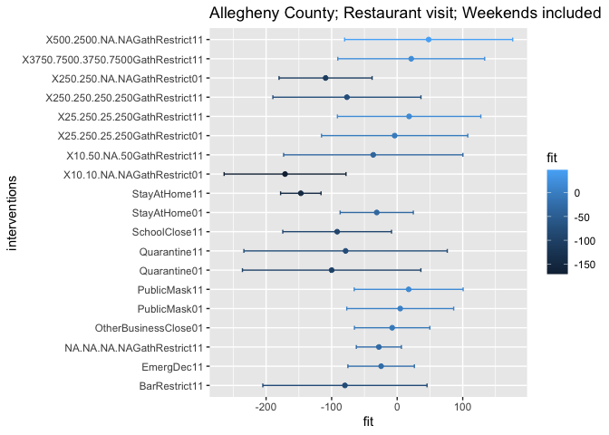
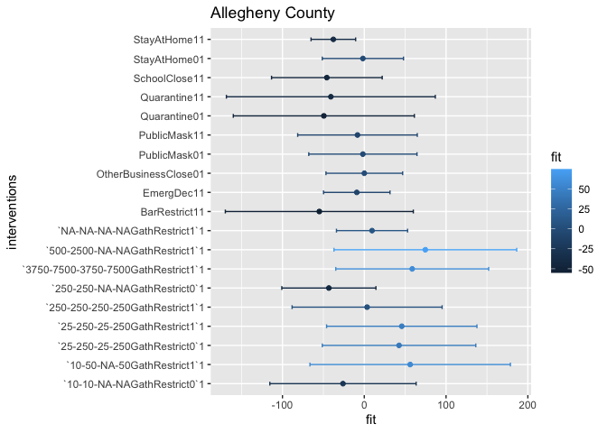

# Introduction

This report is to compare the impacts of recommended policy and mandatory policies on restaurant visit and staying at home in Alleghency county. We will use the following model:

$$Y_t = \beta_{0} + \sum_{i}\beta_{i}C_{i,t-1} + \sum_{k}\beta_{k}I_{k,t} \text{    for  } i = \{1,\dots,6\}, k = \{1,\dots,19\}$$


```r
library(covidcast)
library(dplyr)
library(lubridate)
library(mgcv)
library(ggplot2)

source("code/loader.r")
source("code/parser.r")
```


```r
state <- "pa"
GEO_VALUE <- "42003" # Allegheny_County fip 
GEO_TYPE <- "county"
STARTDATE <- "2020-02-20" # Start from where we have case count signals
ENDDATE <- "2021-01-17" # fix a recent end date

# Read in county-level intervention data 
# from stanford crowdsourced data
allcountypolicy <- read.csv("data/stanford-county-level-intervention-data.csv")
# filter down to county of intersts
countypolicy <- allcountypolicy %>% filter(county == "Allegheny County")

# Read in state-wide policy data from UW
policy <- load_policy()
statepolicy <- policy %>% 
  filter(StatePostal==state, StateWide==1)


# Fetch case signals
dailyconfirmed <- covidcast_signal(data_source = "indicator-combination",
                                    signal ="confirmed_7dav_incidence_prop",
                                    start_day = STARTDATE, 
                                    end_day = ENDDATE,
                                    geo_type = GEO_TYPE, 
                                    geo_values = GEO_VALUE)

dailydeath <- covidcast_signal(data_source = "indicator-combination",
                                    signal ="deaths_7dav_incidence_prop",
                                    start_day = STARTDATE, 
                                    end_day = ENDDATE,
                                    geo_type = GEO_TYPE, 
                                    geo_values = GEO_VALUE)

cumconfirmed <- covidcast_signal(data_source = "indicator-combination",
                                    signal ="confirmed_7dav_cumulative_prop",
                                    start_day = STARTDATE, 
                                    end_day = ENDDATE,
                                    geo_type = GEO_TYPE, 
                                    geo_values = GEO_VALUE)

cumdeath <- covidcast_signal(data_source = "indicator-combination",
                                    signal ="deaths_7dav_cumulative_prop",
                                    start_day = STARTDATE, 
                                    end_day = ENDDATE,
                                    geo_type = GEO_TYPE, 
                                    geo_values = GEO_VALUE)

adjcli  <- covidcast_signal(data_source = "doctor-visits",
                                    signal ="smoothed_adj_cli",
                                    start_day = STARTDATE, 
                                    end_day = ENDDATE,
                                    geo_type = GEO_TYPE, 
                                    geo_values = GEO_VALUE)

smoothed_adj_covid19_from_claims <- covidcast_signal(data_source = "hospital-admissions",
                                    signal ="smoothed_adj_covid19_from_claims",
                                    start_day = STARTDATE, 
                                    end_day = ENDDATE,
                                    geo_type = GEO_TYPE, 
                                    geo_values = GEO_VALUE)


# Fetch mobility signals of interests 

STARTDATE <- as.Date(STARTDATE) + 1  # Forward the mobility one day in time
ENDDATE <- as.Date(ENDDATE) + 1

restvisit <-  covidcast_signal(data_source = "safegraph",
                                    signal ="restaurants_visit_prop",
                                    start_day = STARTDATE, 
                                    end_day = ENDDATE,
                                    geo_type = GEO_TYPE, 
                                    geo_values = GEO_VALUE)

barvisit <-  covidcast_signal(data_source = "safegraph",
                                    signal ="bars_visit_prop",
                                    start_day = STARTDATE, 
                                    end_day = ENDDATE,
                                    geo_type = GEO_TYPE, 
                                    geo_values = GEO_VALUE)
```


```r
plot_bar <- function(df,
                     x,
                     y,
                     lower.bound,
                     upper.bound,
                     gp,
                     name){
  p<- ggplot(df, aes_string(x=x, y=y, group=gp, color=gp)) + 
  #geom_line() +
  geom_point()+
  geom_errorbar(aes_string(xmin=lower.bound, xmax=upper.bound), width=.2,
                 position=position_dodge(0.05))+
    ggtitle(name)
      
  return(p)
}

# process each policy as follows
# 1. look for the policy enact time, call it start date
# 2. then look for the policy ended time
# 3. if ended time is NA, look for expiry date, if not, set it as end date
# 4. if expiry date is NA, then it means the policy hasn't ended, if not, set it as enddate
# 5. Form a sequence of start date and end dates, assign 1 to any dates fall into this sequence.
concatCaseNPolicy <- function(case.df){
  # Loop through each row in the column called policy
  for(row in (1:nrow(statepolicy))){
    # for each policy, we do
    policy.name <- statepolicy[row,]$StatePolicy
    modified.policyName <- statepolicy[row,]$policy

    # Set the start date of the policy
    start <- statepolicy[row,]$DateEnacted
    
    # Set the end date of the policy
    if(is.na(statepolicy[row,]$DateEnded)){
      # if DateEnded is NA, then look for DateExpiry
      if(is.na(statepolicy[row,]$DateExpiry)){
        # if DateExpiry is NA, then the policy is in effect until the next policy with the same name happens
        
        # check to see if the same policy exist
        if(row == nrow(statepolicy)){
          # If this is the last policy in the data,
          # take the last day of the case signal
          end <- lubridate::today()
        }else{
          # if it is not the last policy, then look for the next one 
          
          # check if we still have the same policy
          if(policy.name %in% statepolicy[row+1:nrow(statepolicy),]$StatePolicy){
            # if so, we look for the first one
            for(k in (row+1:nrow(statepolicy))){
              if(statepolicy[k,]$StatePolicy==policy.name){
                if(statepolicy[k,]$DateEnacted == start){
                   end <- lubridate::today()
                }else{
                  end <- statepolicy[k,]$DateEnacted-1
                }
                break
              }
            }
          }else{
            # if not, then we will assign 
            end <- lubridate::today()
          }
        }
      }else{
        end <- statepolicy[row,]$DateExpiry - 1
      }
    }else{
      end <- statepolicy[row,]$DateEnded - 1
    }
    
    policy.period <- seq(start, end, 1)
    
    assigned <- ifelse(case.df$time_value %in% policy.period, 1, 0)
    
    # check if there are any duplicate names
    if(modified.policyName %in% colnames(case.df)){
      # if so, we assign 1's to that created column

      case.df[, modified.policyName] <- case.df[, modified.policyName] + assigned
    }else{
      # if not, create a new column and assign one to that column within the time
      case.df[, modified.policyName] <- assigned
    }
  }
  return(case.df)
}
```


```r
# Filter the dates that we don't have mobility signals
missingdates <- c(seq(as.Date("2020-12-13"),as.Date("2020-12-19"), 1),
                  as.Date("2021-01-17"))

# Filter the case signals
dailyconfirmed.f <- dailyconfirmed %>% 
  filter(!(time_value %in% missingdates)) %>%
  mutate(dailyconfirmed_prop = value)

dailydeath.f <- dailydeath %>% 
  filter(!(time_value %in% missingdates)) %>%
  mutate(dailydeath_prop = value)

cumconfirmed.f <- cumconfirmed %>% 
  filter(!(time_value %in% missingdates)) %>%
  mutate(cumconfirmed_prop = value) 

cumdeath.f <- cumdeath %>% 
  filter(!(time_value %in% missingdates)) %>%
  mutate(cumdeath_prop = value) 

adjcli.f <- adjcli %>% 
  filter(!(time_value %in% missingdates)) %>%
  mutate(smoothed_adj_cli = value ) 

hospital.f<- smoothed_adj_covid19_from_claims %>%
  filter(!(time_value %in% missingdates)) %>%
  mutate(smoothed_adj_covid19_from_claims  = value ) 

# Concatnate case counts and 
restvisit$dailyconfirmed_prop <- dailyconfirmed.f$dailyconfirmed_prop
restvisit$dailydeath_prop <- dailydeath.f$dailydeath_prop
restvisit$cumconfirmed_prop <- cumconfirmed.f$cumconfirmed_prop 
restvisit$cumdeath_prop <- cumdeath.f$cumdeath_prop
restvisit$smoothed_adj_cli <-adjcli.f$smoothed_adj_cli
restvisit$smoothed_adj_covid19_from_claims <- hospital.f$smoothed_adj_covid19_from_claims

colnames(restvisit)[7] <- "restaurants_visit_prop"

barvisit$dailyconfirmed_prop <- dailyconfirmed.f$dailyconfirmed_prop
barvisit$dailydeath_prop <- dailydeath.f$dailydeath_prop
barvisit$cumconfirmed_prop <- cumconfirmed.f$cumconfirmed_prop 
barvisit$cumdeath_prop <- cumdeath.f$cumdeath_prop
barvisit$smoothed_adj_cli <-adjcli.f$smoothed_adj_cli 
barvisit$smoothed_adj_covid19_from_claims <- hospital.f$smoothed_adj_covid19_from_claims

colnames(barvisit)[7] <- "bars_visit_prop"
```


```r
# Combine some information for gathering restriction

# get all indicies that are gathering restriction
gathering.idx <- which(statepolicy$StatePolicy == "GathRestrict")

statepolicy$policy <- paste(statepolicy$StatePolicy,statepolicy$Mandate, sep="")

limit.idx <- paste(statepolicy$InGathLim,
      statepolicy$OutGathLim,
      statepolicy$InGathLimReligious,
      statepolicy$OutGathLimReligious,
      sep="-")

# Get all the indicies wrt gathering restriction
statepolicy[gathering.idx,]$policy <- paste(limit.idx[gathering.idx],statepolicy[gathering.idx,]$policy , sep="")


lmdf <- concatCaseNPolicy(restvisit)

# convert to factor
lmdf[,c(17:ncol(lmdf))] <- sapply(lmdf[,c(17:ncol(lmdf))], function(x) as.factor(x)) 
```

## Restaurant visit prop

Having accounted for the potential confounding variables in terms of case count, we can see that manadatory stay home order has significantly reduced restaurant visit among all the interventions. Secondly, gathering restriction tends to be more effective as the gathering limit decreases. 


```r
# Covaraites: all case signals t-1, all interventions, ease indicator, expand indicator
# reponse: restaurant visit/ bar visits
df <- lmdf[,c(7, c(11:ncol(lmdf)))]
names <- colnames(df)[-1]

lm.fit <- lm(restaurants_visit_prop ~ ., df)
sum.lm.fit <- summary(lm.fit)

plt.df <- data.frame(fit= sum.lm.fit$coefficients[c(-1:-7),1], interventions=names(sum.lm.fit$coefficients[c(-1:-7),1]))

revised_df <- cbind(plt.df, confint(lm.fit)[which(names(lm.fit$coefficients) %in% names(sum.lm.fit$coefficients[c(-1:-7),1])),])

colnames(revised_df)[3] <- "LCI"
colnames(revised_df)[4] <- "UCI"
  
sum.lm.fit
```

```
## 
## Call:
## lm(formula = restaurants_visit_prop ~ ., data = df)
## 
## Residuals:
##      Min       1Q   Median       3Q      Max 
## -147.402  -25.111   -4.722   16.426  269.518 
## 
## Coefficients: (3 not defined because of singularities)
##                                       Estimate Std. Error t value Pr(>|t|)    
## (Intercept)                          444.94147   14.93333  29.795  < 2e-16 ***
## dailyconfirmed_prop                   -1.24240    0.89364  -1.390  0.16548    
## dailydeath_prop                      -31.36342   45.20231  -0.694  0.48832    
## cumconfirmed_prop                     -0.03575    0.08344  -0.428  0.66865    
## cumdeath_prop                          1.95488    4.11095   0.476  0.63476    
## smoothed_adj_cli                      -3.69620    2.96706  -1.246  0.21383    
## smoothed_adj_covid19_from_claims       5.10744    4.33421   1.178  0.23957    
## EmergDec11                           -32.76468   25.85507  -1.267  0.20605    
## `250-250-NA-NAGathRestrict0`1       -107.52228   36.62849  -2.935  0.00359 ** 
## SchoolClose11                        -90.86959   43.06713  -2.110  0.03569 *  
## BarRestrict11                       -117.26867   73.16383  -1.603  0.11003    
## `10-10-NA-NAGathRestrict0`1         -135.20096   56.93358  -2.375  0.01819 *  
## OtherBusinessClose01                  -6.92054   29.83256  -0.232  0.81671    
## RestaurantRestrict11                        NA         NA      NA       NA    
## NEBusinessClose11                           NA         NA      NA       NA    
## OtherBusinessClose11                        NA         NA      NA       NA    
## `NA-NA-NA-NAGathRestrict1`1            0.70007   27.69214   0.025  0.97985    
## StayAtHome11                        -137.49511   17.36029  -7.920  4.7e-14 ***
## PublicMask01                           1.54279   42.11307   0.037  0.97080    
## PublicMask11                           7.91891   46.53855   0.170  0.86500    
## Quarantine01                         -95.47183   70.46028  -1.355  0.17645    
## `250-250-250-250GathRestrict1`1      -78.01596   58.38719  -1.336  0.18251    
## `25-250-25-250GathRestrict1`1         11.04468   58.50464   0.189  0.85039    
## `25-250-25-250GathRestrict0`1         10.92435   59.72746   0.183  0.85500    
## `3750-7500-3750-7500GathRestrict1`1   42.49290   59.49929   0.714  0.47568    
## StayAtHome01                         -22.77460   31.60127  -0.721  0.47167    
## Quarantine11                         -71.43450   81.30676  -0.879  0.38033    
## `500-2500-NA-NAGathRestrict1`1        74.73248   71.10643   1.051  0.29411    
## `10-50-NA-50GathRestrict1`1           -3.98502   77.99565  -0.051  0.95929    
## ---
## Signif. codes:  0 '***' 0.001 '**' 0.01 '*' 0.05 '.' 0.1 ' ' 1
## 
## Residual standard error: 55.84 on 299 degrees of freedom
## Multiple R-squared:  0.7596,	Adjusted R-squared:  0.7395 
## F-statistic: 37.78 on 25 and 299 DF,  p-value: < 2.2e-16
```

```r
plot_bar(revised_df,
              "fit",
              "interventions",
              "LCI",
              "UCI",
              "fit",
               "Allegheny County") 
```

<!-- -->

## Bar visit prop

We can see a similar pattern as we change the response variable to bar visit per 100,000 population. However, only mandatory stay at home order's regression coefficient does not contain 0, meaning that it is statistically siginificant at 0.05 level that stay-at-home order reduces bar visit.


```r
barlmdf <- concatCaseNPolicy(barvisit)
# convert to factor
barlmdf[,c(17:ncol(barlmdf))] <- sapply(lmdf[,c(17:ncol(lmdf))], function(x) as.factor(x)) 

# Covaraites: all case signals t-1, all interventions, ease indicator, expand indicator
# reponse: restaurant visit/ bar visits
df <- barlmdf[,c(7, c(11:ncol(barlmdf)))]
names <- colnames(df)[-1]

lm.fit <- lm(bars_visit_prop ~ ., df)
sum.lm.fit <- summary(lm.fit)

plt.df <- data.frame(fit= sum.lm.fit$coefficients[c(-1:-7),1], interventions=names(sum.lm.fit$coefficients[c(-1:-7),1]))

revised_df <- cbind(plt.df, confint(lm.fit)[which(names(lm.fit$coefficients) %in% names(sum.lm.fit$coefficients[c(-1:-7),1])),])

colnames(revised_df)[3] <- "LCI"
colnames(revised_df)[4] <- "UCI"
  
sum.lm.fit
```

```
## 
## Call:
## lm(formula = bars_visit_prop ~ ., data = df)
## 
## Residuals:
##     Min      1Q  Median      3Q     Max 
## -93.726 -21.978  -1.754   8.617 270.050 
## 
## Coefficients: (3 not defined because of singularities)
##                                      Estimate Std. Error t value Pr(>|t|)    
## (Intercept)                         147.17479   11.92045  12.346  < 2e-16 ***
## dailyconfirmed_prop                  -1.37231    0.71335  -1.924  0.05533 .  
## dailydeath_prop                       1.52584   36.08251   0.042  0.96630    
## cumconfirmed_prop                    -0.03971    0.06660  -0.596  0.55149    
## cumdeath_prop                         2.13729    3.28154   0.651  0.51535    
## smoothed_adj_cli                     -1.91015    2.36844  -0.807  0.42060    
## smoothed_adj_covid19_from_claims      4.17037    3.45976   1.205  0.22900    
## EmergDec11                           -9.13953   20.63867  -0.443  0.65821    
## `250-250-NA-NAGathRestrict0`1       -43.28118   29.23850  -1.480  0.13985    
## SchoolClose11                       -45.72623   34.37811  -1.330  0.18450    
## BarRestrict11                       -54.94562   58.40265  -0.941  0.34756    
## `10-10-NA-NAGathRestrict0`1         -26.01381   45.44693  -0.572  0.56748    
## OtherBusinessClose01                  0.05684   23.81368   0.002  0.99810    
## RestaurantRestrict11                       NA         NA      NA       NA    
## NEBusinessClose11                          NA         NA      NA       NA    
## OtherBusinessClose11                       NA         NA      NA       NA    
## `NA-NA-NA-NAGathRestrict1`1           9.49785   22.10511   0.430  0.66775    
## StayAtHome11                        -37.81061   13.85776  -2.728  0.00674 ** 
## PublicMask01                         -1.68905   33.61654  -0.050  0.95996    
## PublicMask11                         -8.29287   37.14915  -0.223  0.82351    
## Quarantine01                        -49.42481   56.24455  -0.879  0.38024    
## `250-250-250-250GathRestrict1`1       3.48016   46.60727   0.075  0.94053    
## `25-250-25-250GathRestrict1`1        45.84969   46.70102   0.982  0.32701    
## `25-250-25-250GathRestrict0`1        42.53770   47.67713   0.892  0.37300    
## `3750-7500-3750-7500GathRestrict1`1  58.62438   47.49500   1.234  0.21805    
## StayAtHome01                         -1.67158   25.22555  -0.066  0.94721    
## Quarantine11                        -40.84966   64.90270  -0.629  0.52957    
## `500-2500-NA-NAGathRestrict1`1       74.68066   56.76034   1.316  0.18928    
## `10-50-NA-50GathRestrict1`1          56.13490   62.25962   0.902  0.36798    
## ---
## Signif. codes:  0 '***' 0.001 '**' 0.01 '*' 0.05 '.' 0.1 ' ' 1
## 
## Residual standard error: 44.58 on 299 degrees of freedom
## Multiple R-squared:  0.459,	Adjusted R-squared:  0.4137 
## F-statistic: 10.15 on 25 and 299 DF,  p-value: < 2.2e-16
```

```r
plot_bar(revised_df,
              "fit",
              "interventions",
              "LCI",
              "UCI",
              "fit",
               "Allegheny County") 
```

<!-- -->

