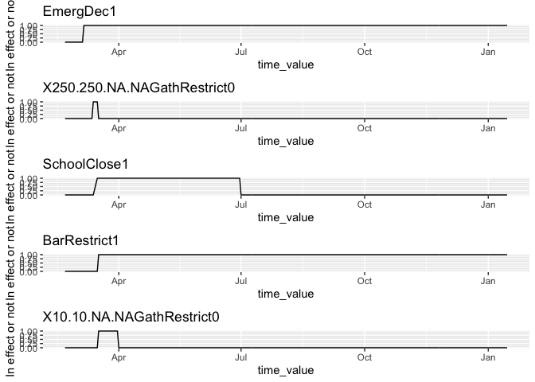

# Introduction

This report is to compare the impacts of recommended policy and mandatory policies on restaurant visit and staying at home in Alleghency county. We will use the following model:

$$Y_t = \beta_{0} + \sum_{i}\beta_{i}C_{i,t-1} + \sum_{k}\beta_{k}I_{k,t} \text{    for  } i = \{1,\dots,6\}, k = \{1,\dots,19\}$$


```r
library(covidcast)
library(dplyr)
library(lubridate)
library(mgcv)
library(ggplot2)
library(readxl)
library(gridExtra)

source("code/loader.r")
source("code/parser.r")
```


```r
state <- "pa"
GEO_VALUE <- "42003" # Allegheny_County fip 
GEO_TYPE <- "county"
STARTDATE <- "2020-02-20" # Start from where we have case count signals
ENDDATE <- "2021-01-17" # fix a recent end date

# Read in county-level intervention data 
# from stanford crowdsourced data
allcountypolicy <- read.csv("data/stanford-county-level-intervention-data.csv")
# filter down to county of intersts
countypolicy <- allcountypolicy %>% filter(county == "Allegheny County")

# Read in state-wide policy data from UW
policy <- load_policy()
statepolicy <- policy %>% 
  filter(StatePostal==state, StateWide==1)


# Fetch case signals
dailyconfirmed <- covidcast_signal(data_source = "indicator-combination",
                                    signal ="confirmed_7dav_incidence_prop",
                                    start_day = STARTDATE, 
                                    end_day = ENDDATE,
                                    geo_type = GEO_TYPE, 
                                    geo_values = GEO_VALUE)

dailydeath <- covidcast_signal(data_source = "indicator-combination",
                                    signal ="deaths_7dav_incidence_prop",
                                    start_day = STARTDATE, 
                                    end_day = ENDDATE,
                                    geo_type = GEO_TYPE, 
                                    geo_values = GEO_VALUE)

# Fetch mobility signals of interests 

STARTDATE <- as.Date(STARTDATE) + 1  # Forward the mobility one day in time
ENDDATE <- as.Date(ENDDATE) + 1

restvisit <-  covidcast_signal(data_source = "safegraph",
                                    signal ="restaurants_visit_prop",
                                    start_day = STARTDATE, 
                                    end_day = ENDDATE,
                                    geo_type = GEO_TYPE, 
                                    geo_values = GEO_VALUE)

barvisit <-  covidcast_signal(data_source = "safegraph",
                                    signal ="bars_visit_prop",
                                    start_day = STARTDATE, 
                                    end_day = ENDDATE,
                                    geo_type = GEO_TYPE, 
                                    geo_values = GEO_VALUE)


chome <- covidcast_signal(data_source = "safegraph", 
                             signal ="completely_home_prop",
                             start_day = STARTDATE, 
                             end_day = ENDDATE,
                             geo_type = GEO_TYPE, 
                             geo_values = GEO_VALUE)
```


```r
plot_bar <- function(df,
                     x,
                     y,
                     lower.bound,
                     upper.bound,
                     gp,
                     name){
  p<- ggplot(df, aes_string(x=x, y=y, group=gp, color=gp)) + 
  #geom_line() +
  geom_point()+
  geom_errorbar(aes_string(xmin=lower.bound, xmax=upper.bound), width=.2,
                 position=position_dodge(0.05))+
    ggtitle(name)
      
  return(p)
}

# process each policy as follows
# 1. look for the policy enact time, call it start date
# 2. then look for the policy ended time
# 3. if ended time is NA, look for expiry date, if not, set it as end date
# 4. if expiry date is NA, then it means the policy hasn't ended, if not, set it as enddate
# 5. Form a sequence of start date and end dates, assign 1 to any dates fall into this sequence.
concatCaseNPolicy <- function(case.df){
  # Loop through each row in the column called policy
  for(row in (1:nrow(statepolicy))){
    # for each policy, we do
    policy.name <- statepolicy[row,]$StatePolicy
    modified.policyName <- statepolicy[row,]$policy

    # Set the start date of the policy
    start <- statepolicy[row,]$DateEnacted
    
    # Set the end date of the policy
    if(is.na(statepolicy[row,]$DateEnded)){
      # if DateEnded is NA, then look for DateExpiry
      if(is.na(statepolicy[row,]$DateExpiry)){
        # if DateExpiry is NA, then the policy is in effect until the next policy with the same name happens
        
        # check to see if the same policy exist
        if(row == nrow(statepolicy)){
          # If this is the last policy in the data,
          # take the last day of the case signal
          end <- lubridate::today()
        }else{
          # if it is not the last policy, then look for the next one 
          
          # check if we still have the same policy
          if(policy.name %in% statepolicy[row+1:nrow(statepolicy),]$StatePolicy){
            # if so, we look for the first one
            for(k in (row+1:nrow(statepolicy))){
              if(statepolicy[k,]$StatePolicy==policy.name){
                if(statepolicy[k,]$DateEnacted == start){
                   end <- lubridate::today()
                }else{
                  end <- statepolicy[k,]$DateEnacted-1
                }
                break
              }
            }
          }else{
            # if not, then we will assign 
            end <- lubridate::today()
          }
        }
      }else{
        end <- statepolicy[row,]$DateExpiry - 1
      }
    }else{
      end <- statepolicy[row,]$DateEnded - 1
    }
    
    policy.period <- seq(start, end, 1)
    
    assigned <- ifelse(case.df$time_value %in% policy.period, 1, 0)
    
    # check if there are any duplicate names
    if(modified.policyName %in% colnames(case.df)){
      # if so, we assign 1's to that created column

      case.df[, modified.policyName] <- case.df[, modified.policyName] + assigned
    }else{
      # if not, create a new column and assign one to that column within the time
      case.df[, modified.policyName] <- assigned
    }
  }
  return(case.df)
}
```


```r
patemp <- read_excel("data/temperature/patemp.xlsx")
patemp$DATE <- as.Date(patemp$DATE)
patemp.df <- patemp %>% select(DATE, PRCP, TAVG)
colnames(patemp.df) <- c("time_value", "precipitation", "Avg.temperature")
```


```r
# Add data to chome
chome$dailyconfirmed_prop <- dailyconfirmed$value
chome$dailydeath_prop <- dailydeath$value
colnames(chome)[7] <- "completely_home_prop"

# Filter the dates that we don't have mobility signals
missingdates <- c(seq(as.Date("2020-12-13"),as.Date("2020-12-19"), 1),
                  as.Date("2021-01-17"))

# Filter the case signals
dailyconfirmed.f <- dailyconfirmed %>% 
  filter(!(time_value %in% missingdates)) %>%
  mutate(dailyconfirmed_prop = value)

dailydeath.f <- dailydeath %>% 
  filter(!(time_value %in% missingdates)) %>%
  mutate(dailydeath_prop = value)

# Concatnate case counts and 
restvisit$dailyconfirmed_prop <- dailyconfirmed.f$dailyconfirmed_prop
restvisit$dailydeath_prop <- dailydeath.f$dailydeath_prop

colnames(restvisit)[7] <- "restaurants_visit_prop"

barvisit$dailyconfirmed_prop <- dailyconfirmed.f$dailyconfirmed_prop
barvisit$dailydeath_prop <- dailydeath.f$dailydeath_prop

colnames(barvisit)[7] <- "bars_visit_prop"
```


```r
# Combine some information for gathering restriction

# get all indicies that are gathering restriction
gathering.idx <- which(statepolicy$StatePolicy == "GathRestrict")

statepolicy$policy <- paste(statepolicy$StatePolicy,statepolicy$Mandate, sep="")

limit.idx <- paste(statepolicy$InGathLim,
      statepolicy$OutGathLim,
      statepolicy$InGathLimReligious,
      statepolicy$OutGathLimReligious,
      sep="-")

# Get all the indicies wrt gathering restriction
statepolicy[gathering.idx,]$policy <- paste(limit.idx[gathering.idx],statepolicy[gathering.idx,]$policy , sep="")
```

## Restaurant visit prop

Having accounted for the potential confounding variables in terms of case count, we can see that manadatory stay home order has significantly reduced restaurant visit among all the interventions. Secondly, gathering restriction tends to be more effective as the gathering limit decreases. 


```r
# Plot the signal
p <- ggplot(restvisit, aes(x=time_value, y=restaurants_visit_prop)) +
  geom_line() + 
  labs(title = "Number of daily restaurant visit by time in Allegaheny county (weekends included)", y= "# of resturant visit per 100,000 population")
p
```

<!-- -->

### With weekends


```r
restvisit.temp <- left_join(restvisit, patemp.df, by ="time_value")

lmdf <- concatCaseNPolicy(restvisit.temp)

# Add holidays
county.holidays <- as.Date(c("2020-01-01", 
                 "2020-01-20",
                 "2020-02-17",
                 "2020-04-28",
                 "2020-05-25",
                 "2020-07-03",
                 "2020-09-07",
                 "2020-10-12",
                 "2020-11-11",
                 "2020-11-26",
                 "2020-12-25",
                 "2021-01-01",
                 "2021-01-18"))

# Drop all weekends
lmdf <- lmdf %>% 
      mutate(holiday = as.factor(ifelse(time_value %in% county.holidays, 1, 0)))

colnames(lmdf) <- make.names(colnames(lmdf))
# convert to factor
lmdf[,c(15:ncol(lmdf))] <- sapply(lmdf[,c(15:ncol(lmdf))], function(x) as.factor(x)) 


# Covaraites: all case signals t-1, all interventions, ease indicator, expand indicator
# reponse: restaurant visit/ bar visits
df <- lmdf[,c(7, c(11:ncol(lmdf)))]
names <- colnames(df)[-1]

lm.fit <- lm(restaurants_visit_prop ~ ., df)
sum.lm.fit <- summary(lm.fit)

plt.df <- data.frame(fit= sum.lm.fit$coefficients[c(-1:-5, -25),1], interventions=names(sum.lm.fit$coefficients[c(-1:-5, -25),1]))

revised_df <- cbind(plt.df, confint(lm.fit)[which(names(lm.fit$coefficients) %in% names(sum.lm.fit$coefficients[c(-1:-5, -25),1])),])

colnames(revised_df)[3] <- "LCI"
colnames(revised_df)[4] <- "UCI"
  
sum.lm.fit
```

```
## 
## Call:
## lm(formula = restaurants_visit_prop ~ ., data = df)
## 
## Residuals:
##     Min      1Q  Median      3Q     Max 
## -136.86  -28.79   -5.82   18.10  256.39 
## 
## Coefficients: (3 not defined because of singularities)
##                                     Estimate Std. Error t value Pr(>|t|)    
## (Intercept)                         486.4080    21.6982  22.417  < 2e-16 ***
## dailyconfirmed_prop                  -1.6926     0.7314  -2.314 0.021328 *  
## dailydeath_prop                     -14.3559    28.1773  -0.509 0.610788    
## precipitation                        -4.3049    12.6061  -0.341 0.732973    
## Avg.temperature                      -1.1307     0.4435  -2.549 0.011295 *  
## EmergDec11                          -24.4888    25.7641  -0.951 0.342623    
## X250.250.NA.NAGathRestrict01       -109.2417    36.0761  -3.028 0.002675 ** 
## SchoolClose11                       -91.5927    42.1539  -2.173 0.030577 *  
## BarRestrict11                       -79.7227    63.6584  -1.252 0.211417    
## X10.10.NA.NAGathRestrict01         -171.0715    47.2436  -3.621 0.000344 ***
## OtherBusinessClose01                 -7.6663    29.2276  -0.262 0.793272    
## RestaurantRestrict11                      NA         NA      NA       NA    
## NEBusinessClose11                         NA         NA      NA       NA    
## OtherBusinessClose11                      NA         NA      NA       NA    
## NA.NA.NA.NAGathRestrict11           -27.9456    17.4695  -1.600 0.110722    
## StayAtHome11                       -147.0372    15.6745  -9.381  < 2e-16 ***
## PublicMask01                          4.6461    41.4450   0.112 0.910818    
## PublicMask11                         17.5323    42.2137   0.415 0.678203    
## Quarantine01                        -99.9669    69.1780  -1.445 0.149482    
## X250.250.250.250GathRestrict11      -76.6872    57.4012  -1.336 0.182567    
## X25.250.25.250GathRestrict11         18.2224    55.5929   0.328 0.743304    
## X25.250.25.250GathRestrict01         -3.8550    56.7005  -0.068 0.945840    
## X3750.7500.3750.7500GathRestrict11   21.4326    56.9325   0.376 0.706844    
## StayAtHome01                        -31.1907    28.3637  -1.100 0.272357    
## Quarantine11                        -78.7151    78.8468  -0.998 0.318924    
## X500.2500.NA.NAGathRestrict11        48.0216    65.1515   0.737 0.461652    
## X10.50.NA.50GathRestrict11          -36.4928    69.4967  -0.525 0.599901    
## holiday1                            -35.7403    19.1403  -1.867 0.062837 .  
## ---
## Signif. codes:  0 '***' 0.001 '**' 0.01 '*' 0.05 '.' 0.1 ' ' 1
## 
## Residual standard error: 55.04 on 300 degrees of freedom
## Multiple R-squared:  0.7656,	Adjusted R-squared:  0.7469 
## F-statistic: 40.84 on 24 and 300 DF,  p-value: < 2.2e-16
```

```r
plot_bar(revised_df,
              "fit",
              "interventions",
              "LCI",
              "UCI",
              "fit",
               "Allegheny County; Restaurant visit; Weekends included") 
```

<!-- -->


### Without weekends


```r
lmdf <- concatCaseNPolicy(restvisit.temp)

# Drop all weekends
lmdf <- lmdf %>% 
      mutate(weekday= weekdays(as.Date(time_value)),
             holiday = as.factor(ifelse(time_value %in% county.holidays, 1, 0)))%>% 
      filter(!(weekday %in% c("Saturday", "Sunday"))) 
   
# Drop the weekday variable
lmdf <- lmdf[, !(colnames(lmdf) %in% c("weekday"))]


# Plot the signal
p <- ggplot(lmdf, aes(x=time_value, y=restaurants_visit_prop)) +
  geom_line() + 
  labs(title = "Number of daily restaurant visit by time in Allegaheny county (weekends dropped)", y= "# of resturant visit per 100,000 population")
p
```

<!-- -->

```r
# Plot the interventions
plist <- list()
count <- 1

colnames(lmdf) <- make.names(colnames(lmdf))
for(i in 15:(ncol(lmdf)-1)){
  name <- colnames(lmdf)[i]
  plist[[count]] <- ggplot(lmdf, aes_string(x="time_value", y=name)) +
    geom_line() + 
  labs(title = name, y= "In effect or not")
  
  count <- count + 1
}

# Plot all the plots
do.call("grid.arrange", c(plist[c(1:5)], ncol=1))
```

<!-- -->

```r
do.call("grid.arrange", c(plist[c(6:10)], ncol=1))
```

<!-- -->

```r
do.call("grid.arrange", c(plist[c(11:15)], ncol=1))
```

<!-- -->

```r
do.call("grid.arrange", c(plist[c(16:20)], ncol=1))
```

<!-- -->

```r
do.call("grid.arrange", c(plist[c(21:22)], ncol=1))
```

<!-- -->

```r
# convert to factor
lmdf[,c(15:ncol(lmdf))] <- sapply(lmdf[,c(15:ncol(lmdf))], function(x) as.factor(x)) 


# Covaraites: all case signals t-1, all interventions, ease indicator, expand indicator
# reponse: restaurant visit/ bar visits
df <- lmdf[,c(7, c(11:ncol(lmdf)))]
names <- colnames(df)[-1]

lm.fit <- lm(restaurants_visit_prop ~ ., df)
sum.lm.fit <- summary(lm.fit)

plt.df <- data.frame(fit= sum.lm.fit$coefficients[c(-1:-5, -25),1], interventions=names(sum.lm.fit$coefficients[c(-1:-5, -25),1]))

revised_df <- cbind(plt.df, confint(lm.fit)[which(names(lm.fit$coefficients) %in% names(sum.lm.fit$coefficients[c(-1:-5, -25),1])),])

colnames(revised_df)[3] <- "LCI"
colnames(revised_df)[4] <- "UCI"
  
sum.lm.fit
```

```
## 
## Call:
## lm(formula = restaurants_visit_prop ~ ., data = df)
## 
## Residuals:
##     Min      1Q  Median      3Q     Max 
## -112.50  -22.69   -3.42   12.87  152.44 
## 
## Coefficients: (3 not defined because of singularities)
##                                     Estimate Std. Error t value Pr(>|t|)    
## (Intercept)                         395.2014    21.3991  18.468  < 2e-16 ***
## dailyconfirmed_prop                  -1.4619     0.7643  -1.913 0.057155 .  
## dailydeath_prop                       7.2753    28.2884   0.257 0.797296    
## precipitation                        -1.8058    10.8801  -0.166 0.868339    
## Avg.temperature                      -0.2473     0.4353  -0.568 0.570649    
## EmergDec11                          -38.7118    23.7393  -1.631 0.104481    
## X250.250.NA.NAGathRestrict01        -40.7486    39.9488  -1.020 0.308915    
## SchoolClose11                       -92.9644    35.7558  -2.600 0.009998 ** 
## BarRestrict11                       -35.8299    53.4284  -0.671 0.503216    
## X10.10.NA.NAGathRestrict01         -153.1547    39.0817  -3.919 0.000121 ***
## OtherBusinessClose01                  8.3875    27.1803   0.309 0.757947    
## RestaurantRestrict11                      NA         NA      NA       NA    
## NEBusinessClose11                         NA         NA      NA       NA    
## OtherBusinessClose11                      NA         NA      NA       NA    
## NA.NA.NA.NAGathRestrict11           -19.3798    16.3374  -1.186 0.236902    
## StayAtHome11                       -132.7195    14.4820  -9.164  < 2e-16 ***
## PublicMask01                          2.4498    33.0153   0.074 0.940921    
## PublicMask11                          6.7190    33.9389   0.198 0.843261    
## Quarantine01                        -98.1215    55.2595  -1.776 0.077267 .  
## X250.250.250.250GathRestrict11      -71.0183    45.4559  -1.562 0.119740    
## X25.250.25.250GathRestrict11          6.9951    43.3217   0.161 0.871882    
## X25.250.25.250GathRestrict01         -6.7467    44.4645  -0.152 0.879546    
## X3750.7500.3750.7500GathRestrict11   17.9162    44.8453   0.400 0.689930    
## StayAtHome01                         -7.3628    27.1809  -0.271 0.786752    
## Quarantine11                       -107.3200    63.9583  -1.678 0.094870 .  
## X500.2500.NA.NAGathRestrict11        51.3560    53.5622   0.959 0.338778    
## X10.50.NA.50GathRestrict11          -35.6839    57.2684  -0.623 0.533909    
## holiday1                            -29.9763    15.1567  -1.978 0.049290 *  
## ---
## Signif. codes:  0 '***' 0.001 '**' 0.01 '*' 0.05 '.' 0.1 ' ' 1
## 
## Residual standard error: 42.7 on 206 degrees of freedom
## Multiple R-squared:  0.8009,	Adjusted R-squared:  0.7777 
## F-statistic: 34.53 on 24 and 206 DF,  p-value: < 2.2e-16
```

```r
plot_bar(revised_df,
              "fit",
              "interventions",
              "LCI",
              "UCI",
              "fit",
               "Allegheny County; Restaurant visit; Weekends dropped") 
```

<!-- -->


## Bar visit prop

We can see a similar pattern as we change the response variable to bar visit per 100,000 population. However, only mandatory stay at home order's regression coefficient does not contain 0, meaning that it is statistically siginificant at 0.05 level that stay-at-home order reduces bar visit.

### With weekends


```r
# Plot the signal
p <- ggplot(barvisit, aes(x=time_value, y=bars_visit_prop)) +
  geom_line() + 
  labs(title = "Number of daily bars visit by time in Allegaheny county (weekends included)", y= "# of bars visit per 100,000 population")
p
```

<!-- -->


```r
barvisit.df <- left_join(barvisit, patemp.df, by ="time_value")
barlmdf <- concatCaseNPolicy(barvisit.df)

# Add holidays
barlmdf <- barlmdf %>% 
      mutate(holiday = as.factor(ifelse(time_value %in% county.holidays, 1, 0)))

colnames(barlmdf) <- make.names(colnames(barlmdf))

# convert to factor
barlmdf[,c(15:ncol(barlmdf))] <- sapply(barlmdf[,c(15:ncol(barlmdf))], function(x) as.factor(x)) 


# Covaraites: all case signals t-1, all interventions, ease indicator, expand indicator
# reponse: restaurant visit/ bar visits
df <- barlmdf[,c(7, c(11:ncol(barlmdf)))]
names <- colnames(df)[-1]

lm.fit <- lm(bars_visit_prop ~ ., df)
sum.lm.fit <- summary(lm.fit)

plt.df <- data.frame(fit= sum.lm.fit$coefficients[c(-1:-5, -25),1], interventions=names(sum.lm.fit$coefficients[c(-1:-5, -25),1]))

revised_df <- cbind(plt.df, confint(lm.fit)[which(names(lm.fit$coefficients) %in% names(sum.lm.fit$coefficients[c(-1:-5, -25),1])),])

colnames(revised_df)[3] <- "LCI"
colnames(revised_df)[4] <- "UCI"
  
sum.lm.fit
```

```
## 
## Call:
## lm(formula = bars_visit_prop ~ ., data = df)
## 
## Residuals:
##     Min      1Q  Median      3Q     Max 
## -89.896 -22.360  -4.003  12.358 258.400 
## 
## Coefficients: (3 not defined because of singularities)
##                                    Estimate Std. Error t value Pr(>|t|)    
## (Intercept)                        180.8387    17.3504  10.423  < 2e-16 ***
## dailyconfirmed_prop                 -1.6883     0.5848  -2.887 0.004173 ** 
## dailydeath_prop                     10.4773    22.5313   0.465 0.642262    
## precipitation                       -4.7638    10.0802  -0.473 0.636848    
## Avg.temperature                     -0.9112     0.3547  -2.569 0.010673 *  
## EmergDec11                          -2.3711    20.6016  -0.115 0.908449    
## X250.250.NA.NAGathRestrict01       -44.0221    28.8472  -1.526 0.128053    
## SchoolClose11                      -48.2540    33.7072  -1.432 0.153310    
## BarRestrict11                      -17.7031    50.9027  -0.348 0.728247    
## X10.10.NA.NAGathRestrict01         -57.4803    37.7771  -1.522 0.129171    
## OtherBusinessClose01                -1.9554    23.3710  -0.084 0.933378    
## RestaurantRestrict11                     NA         NA      NA       NA    
## NEBusinessClose11                        NA         NA      NA       NA    
## OtherBusinessClose11                     NA         NA      NA       NA    
## NA.NA.NA.NAGathRestrict11          -14.9985    13.9690  -1.074 0.283822    
## StayAtHome11                       -46.9020    12.5337  -3.742 0.000219 ***
## PublicMask01                         1.1245    33.1404   0.034 0.972954    
## PublicMask11                         2.1017    33.7550   0.062 0.950394    
## Quarantine01                       -50.9422    55.3163  -0.921 0.357829    
## X250.250.250.250GathRestrict11       5.3200    45.8993   0.116 0.907804    
## X25.250.25.250GathRestrict11        48.3016    44.4534   1.087 0.278101    
## X25.250.25.250GathRestrict01        27.5141    45.3390   0.607 0.544407    
## X3750.7500.3750.7500GathRestrict11  40.8892    45.5245   0.898 0.369811    
## StayAtHome01                        -7.3226    22.6802  -0.323 0.747024    
## Quarantine11                       -43.7529    63.0477  -0.694 0.488241    
## X500.2500.NA.NAGathRestrict11       52.5645    52.0966   1.009 0.313797    
## X10.50.NA.50GathRestrict11          29.8841    55.5712   0.538 0.591139    
## holiday1                           -17.7035    15.3050  -1.157 0.248309    
## ---
## Signif. codes:  0 '***' 0.001 '**' 0.01 '*' 0.05 '.' 0.1 ' ' 1
## 
## Residual standard error: 44.01 on 300 degrees of freedom
## Multiple R-squared:  0.4708,	Adjusted R-squared:  0.4285 
## F-statistic: 11.12 on 24 and 300 DF,  p-value: < 2.2e-16
```

```r
plot_bar(revised_df,
              "fit",
              "interventions",
              "LCI",
              "UCI",
              "fit",
               "Allegheny County; Bars visit; Weekends included") 
```

<!-- -->

### Without weekends


```r
barvisit.df <- left_join(barvisit, patemp.df, by ="time_value")
barlmdf <- concatCaseNPolicy(barvisit.df)

# Drop all weekends
barlmdf <- barlmdf %>% 
      mutate(weekday= weekdays(as.Date(time_value)),
             holiday = as.factor(ifelse(time_value %in% county.holidays, 1, 0)))%>% 
      filter(!(weekday %in% c("Saturday", "Sunday"))) 

# Drop the weekday variable
barlmdf <- barlmdf[, !(colnames(barlmdf)%in% c("weekday"))]

# Plot one without weekends
p <- ggplot(barlmdf, aes(x=time_value, y=bars_visit_prop)) +
  geom_line() + 
  labs(title = "Number of daily bars visit by time in Allegaheny county (weekends dropped)", y= "# of bars visit per 100,000 population")
p
```

<!-- -->

```r
colnames(barlmdf) <- make.names(colnames(barlmdf))
# convert to factor
barlmdf[,c(15:ncol(barlmdf))] <- sapply(barlmdf[,c(15:ncol(barlmdf))], function(x) as.factor(x)) 


# Covaraites: all case signals t-1, all interventions, ease indicator, expand indicator
# reponse: restaurant visit/ bar visits
df <- barlmdf[,c(7, c(11:ncol(barlmdf)))]
names <- colnames(df)[-1]

lm.fit <- lm(bars_visit_prop ~ ., df)
sum.lm.fit <- summary(lm.fit)

plt.df <- data.frame(fit= sum.lm.fit$coefficients[c(-1:-5, -25),1], interventions=names(sum.lm.fit$coefficients[c(-1:-5, -25),1]))

revised_df <- cbind(plt.df, confint(lm.fit)[which(names(lm.fit$coefficients) %in% names(sum.lm.fit$coefficients[c(-1:-5, -25),1])),])

colnames(revised_df)[3] <- "LCI"
colnames(revised_df)[4] <- "UCI"
  
sum.lm.fit
```

```
## 
## Call:
## lm(formula = bars_visit_prop ~ ., data = df)
## 
## Residuals:
##     Min      1Q  Median      3Q     Max 
## -36.625 -14.595  -3.291   5.984 133.858 
## 
## Coefficients: (3 not defined because of singularities)
##                                    Estimate Std. Error t value Pr(>|t|)    
## (Intercept)                        105.4297    12.6792   8.315 1.24e-14 ***
## dailyconfirmed_prop                 -1.0687     0.4528  -2.360   0.0192 *  
## dailydeath_prop                     15.4411    16.7612   0.921   0.3580    
## precipitation                        2.0741     6.4466   0.322   0.7480    
## Avg.temperature                     -0.3817     0.2579  -1.480   0.1404    
## EmergDec11                           1.0848    14.0658   0.077   0.9386    
## X250.250.NA.NAGathRestrict01        -3.8100    23.6701  -0.161   0.8723    
## SchoolClose11                      -43.4970    21.1857  -2.053   0.0413 *  
## BarRestrict11                       10.8419    31.6569   0.342   0.7323    
## X10.10.NA.NAGathRestrict01         -48.6019    23.1563  -2.099   0.0370 *  
## OtherBusinessClose01                 3.7972    16.1046   0.236   0.8138    
## RestaurantRestrict11                     NA         NA      NA       NA    
## NEBusinessClose11                        NA         NA      NA       NA    
## OtherBusinessClose11                     NA         NA      NA       NA    
## NA.NA.NA.NAGathRestrict11          -12.1362     9.6801  -1.254   0.2114    
## StayAtHome11                       -36.5958     8.5807  -4.265 3.05e-05 ***
## PublicMask01                        -1.8991    19.5619  -0.097   0.9228    
## PublicMask11                        -4.0466    20.1091  -0.201   0.8407    
## Quarantine01                       -46.3010    32.7418  -1.414   0.1588    
## X250.250.250.250GathRestrict11       0.2315    26.9331   0.009   0.9931    
## X25.250.25.250GathRestrict11        31.7593    25.6686   1.237   0.2174    
## X25.250.25.250GathRestrict01        18.5002    26.3457   0.702   0.4833    
## X3750.7500.3750.7500GathRestrict11  25.9308    26.5713   0.976   0.3303    
## StayAtHome01                         5.0028    16.1049   0.311   0.7564    
## Quarantine11                       -58.0609    37.8960  -1.532   0.1270    
## X500.2500.NA.NAGathRestrict11       39.9670    31.7361   1.259   0.2093    
## X10.50.NA.50GathRestrict11          13.7767    33.9321   0.406   0.6852    
## holiday1                            -9.5834     8.9805  -1.067   0.2872    
## ---
## Signif. codes:  0 '***' 0.001 '**' 0.01 '*' 0.05 '.' 0.1 ' ' 1
## 
## Residual standard error: 25.3 on 206 degrees of freedom
## Multiple R-squared:  0.5536,	Adjusted R-squared:  0.5016 
## F-statistic: 10.64 on 24 and 206 DF,  p-value: < 2.2e-16
```

```r
plot_bar(revised_df,
              "fit",
              "interventions",
              "LCI",
              "UCI",
              "fit",
               "Allegheny County; Bars visit; Weekends dropped") 
```

<!-- -->

## Completely staying home

### With weekends


```r
chome.df <- left_join(chome, patemp.df, by ="time_value")
chomedf <- concatCaseNPolicy(chome.df)

# Add holidays
chomedf <- chomedf %>% 
      mutate(holiday = as.factor(ifelse(time_value %in% county.holidays, 1, 0)))

colnames(chomedf) <- make.names(colnames(chomedf))

# convert to factor
chomedf[,c(15:ncol(chomedf))] <- sapply(chomedf[,c(15:ncol(chomedf))], function(x) as.factor(x)) 


# Covaraites: all case signals t-1, all interventions, ease indicator, expand indicator
# reponse: restaurant visit/ bar visits
df <- chomedf[,c(7, c(11:ncol(chomedf)))]
names <- colnames(df)[-1]

lm.fit <- lm(completely_home_prop ~ ., df)
sum.lm.fit <- summary(lm.fit)

plt.df <- data.frame(fit= sum.lm.fit$coefficients[c(-1:-5, -25),1], interventions=names(sum.lm.fit$coefficients[c(-1:-5, -25),1]))

revised_df <- cbind(plt.df, confint(lm.fit)[which(names(lm.fit$coefficients) %in% names(sum.lm.fit$coefficients[c(-1:-5, -25),1])),])

colnames(revised_df)[3] <- "LCI"
colnames(revised_df)[4] <- "UCI"
  
sum.lm.fit
```

```
## 
## Call:
## lm(formula = completely_home_prop ~ ., data = df)
## 
## Residuals:
##       Min        1Q    Median        3Q       Max 
## -0.058189 -0.016184 -0.001795  0.013935  0.094795 
## 
## Coefficients: (3 not defined because of singularities)
##                                      Estimate Std. Error t value Pr(>|t|)    
## (Intercept)                         0.2824965  0.0094885  29.772  < 2e-16 ***
## dailyconfirmed_prop                 0.0001983  0.0002818   0.704  0.48213    
## dailydeath_prop                    -0.0026630  0.0120318  -0.221  0.82498    
## precipitation                       0.0156424  0.0054561   2.867  0.00443 ** 
## Avg.temperature                    -0.0008095  0.0001938  -4.177 3.84e-05 ***
## EmergDec11                         -0.0108146  0.0112748  -0.959  0.33822    
## X250.250.NA.NAGathRestrict01        0.0491944  0.0157880   3.116  0.00201 ** 
## SchoolClose11                       0.0213014  0.0184450   1.155  0.24904    
## BarRestrict11                       0.1217682  0.0278282   4.376 1.66e-05 ***
## X10.10.NA.NAGathRestrict01          0.0520252  0.0206518   2.519  0.01227 *  
## OtherBusinessClose01               -0.0406488  0.0127897  -3.178  0.00163 ** 
## RestaurantRestrict11                       NA         NA      NA       NA    
## NEBusinessClose11                          NA         NA      NA       NA    
## OtherBusinessClose11                       NA         NA      NA       NA    
## NA.NA.NA.NAGathRestrict11           0.0471090  0.0076290   6.175 2.09e-09 ***
## StayAtHome11                        0.0409796  0.0068460   5.986 5.98e-09 ***
## PublicMask01                       -0.0036416  0.0181357  -0.201  0.84099    
## PublicMask11                       -0.0340178  0.0184449  -1.844  0.06610 .  
## Quarantine01                        0.0069632  0.0302731   0.230  0.81823    
## X250.250.250.250GathRestrict11      0.0244356  0.0251016   0.973  0.33109    
## X25.250.25.250GathRestrict11       -0.0047707  0.0243272  -0.196  0.84466    
## X25.250.25.250GathRestrict01       -0.0192787  0.0248134  -0.777  0.43779    
## X3750.7500.3750.7500GathRestrict11 -0.0207815  0.0248878  -0.835  0.40436    
## StayAtHome01                       -0.0072747  0.0122850  -0.592  0.55418    
## Quarantine11                        0.0245167  0.0343415   0.714  0.47582    
## X500.2500.NA.NAGathRestrict11      -0.0254648  0.0282408  -0.902  0.36792    
## X10.50.NA.50GathRestrict11         -0.0094673  0.0303356  -0.312  0.75519    
## holiday1                            0.0200142  0.0079975   2.503  0.01285 *  
## ---
## Signif. codes:  0 '***' 0.001 '**' 0.01 '*' 0.05 '.' 0.1 ' ' 1
## 
## Residual standard error: 0.02409 on 308 degrees of freedom
## Multiple R-squared:  0.8381,	Adjusted R-squared:  0.8255 
## F-statistic: 66.46 on 24 and 308 DF,  p-value: < 2.2e-16
```

```r
plot_bar(revised_df,
              "fit",
              "interventions",
              "LCI",
              "UCI",
              "fit",
               "Allegheny County; Completely Staying Home; With weekends") 
```

<!-- -->

### Without weekends


```r
chome.df <- left_join(chome, patemp.df, by ="time_value")
chomedf <- concatCaseNPolicy(chome.df)

# Add holidays
chomedf <- chomedf %>% 
      mutate(weekday= weekdays(as.Date(time_value)),
             holiday = as.factor(ifelse(time_value %in% county.holidays, 1, 0)))%>% 
      filter(!(weekday %in% c("Saturday", "Sunday"))) 


# Drop the weekday variable
chomedf<- chomedf[, !(colnames(chomedf)%in% c("weekday"))]

colnames(chomedf) <- make.names(colnames(chomedf))
# convert to factor
chomedf[,c(15:ncol(chomedf))] <- sapply(chomedf[,c(15:ncol(chomedf))], function(x) as.factor(x)) 


# Covaraites: all case signals t-1, all interventions, ease indicator, expand indicator
# reponse: restaurant visit/ bar visits
df <- chomedf[,c(7, c(11:ncol(chomedf)))]
names <- colnames(df)[-1]

lm.fit <- lm(completely_home_prop ~ ., df)
sum.lm.fit <- summary(lm.fit)

plt.df <- data.frame(fit= sum.lm.fit$coefficients[c(-1:-5, -25),1], interventions=names(sum.lm.fit$coefficients[c(-1:-5, -25),1]))

revised_df <- cbind(plt.df, confint(lm.fit)[which(names(lm.fit$coefficients) %in% names(sum.lm.fit$coefficients[c(-1:-5, -25),1])),])

colnames(revised_df)[3] <- "LCI"
colnames(revised_df)[4] <- "UCI"
  
sum.lm.fit
```

```
## 
## Call:
## lm(formula = completely_home_prop ~ ., data = df)
## 
## Residuals:
##       Min        1Q    Median        3Q       Max 
## -0.046887 -0.014107 -0.000448  0.012489  0.105791 
## 
## Coefficients: (3 not defined because of singularities)
##                                      Estimate Std. Error t value Pr(>|t|)    
## (Intercept)                         0.2734399  0.0107182  25.512  < 2e-16 ***
## dailyconfirmed_prop                 0.0004762  0.0003161   1.506 0.133485    
## dailydeath_prop                    -0.0129325  0.0133509  -0.969 0.333821    
## precipitation                       0.0162445  0.0053890   3.014 0.002889 ** 
## Avg.temperature                    -0.0008541  0.0002177  -3.922 0.000118 ***
## EmergDec11                         -0.0042129  0.0119049  -0.354 0.723779    
## X250.250.NA.NAGathRestrict01        0.0194350  0.0200339   0.970 0.333098    
## SchoolClose11                       0.0403066  0.0179234   2.249 0.025552 *  
## BarRestrict11                       0.1115192  0.0266828   4.179 4.27e-05 ***
## X10.10.NA.NAGathRestrict01          0.0410020  0.0195228   2.100 0.036893 *  
## OtherBusinessClose01               -0.0549569  0.0136280  -4.033 7.69e-05 ***
## RestaurantRestrict11                       NA         NA      NA       NA    
## NEBusinessClose11                          NA         NA      NA       NA    
## OtherBusinessClose11                       NA         NA      NA       NA    
## NA.NA.NA.NAGathRestrict11           0.0413374  0.0081549   5.069 8.70e-07 ***
## StayAtHome11                        0.0416216  0.0072319   5.755 3.00e-08 ***
## PublicMask01                       -0.0029399  0.0165532  -0.178 0.859204    
## PublicMask11                       -0.0340780  0.0169134  -2.015 0.045183 *  
## Quarantine01                        0.0220464  0.0277128   0.796 0.427194    
## X250.250.250.250GathRestrict11      0.0177843  0.0227492   0.782 0.435231    
## X25.250.25.250GathRestrict11       -0.0072427  0.0217248  -0.333 0.739174    
## X25.250.25.250GathRestrict01       -0.0194336  0.0222981  -0.872 0.384448    
## X3750.7500.3750.7500GathRestrict11 -0.0256177  0.0224508  -1.141 0.255131    
## StayAtHome01                       -0.0134628  0.0129892  -1.036 0.301168    
## Quarantine11                        0.0391550  0.0319832   1.224 0.222222    
## X500.2500.NA.NAGathRestrict11      -0.0291856  0.0264710  -1.103 0.271473    
## X10.50.NA.50GathRestrict11         -0.0159363  0.0286128  -0.557 0.578140    
## holiday1                            0.0251482  0.0073011   3.444 0.000690 ***
## ---
## Signif. codes:  0 '***' 0.001 '**' 0.01 '*' 0.05 '.' 0.1 ' ' 1
## 
## Residual standard error: 0.02142 on 212 degrees of freedom
## Multiple R-squared:  0.8782,	Adjusted R-squared:  0.8644 
## F-statistic: 63.67 on 24 and 212 DF,  p-value: < 2.2e-16
```

```r
plot_bar(revised_df,
              "fit",
              "interventions",
              "LCI",
              "UCI",
              "fit",
               "Allegheny County; Completely Staying Home; Weekends dropped") 
```

<!-- -->
