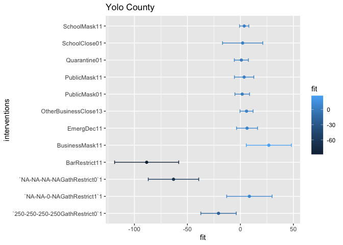

# Introduction

This report is to compare the impacts of recommended policy and mandatory policies on restaurant visit and staying at home in Yolo county. We will use the following model:

$$Y_t = \beta_{0} + \sum_{i}\beta_{i}C_{i,t-1} + \sum_{k}\beta_{k}I_{k,t} \text{    for  } i = \{1,\dots,6\}, k = \{1,\dots,19\}$$


```r
library(covidcast)
library(dplyr)
library(lubridate)
library(mgcv)
library(ggplot2)

source("code/loader.r")
source("code/parser.r")
```


```r
state <- "ca"
GEO_VALUE <- "06113" # Allegheny_County fip 
GEO_TYPE <- "county"
STARTDATE <- "2020-02-20" # Start from where we have case count signals
ENDDATE <- "2021-01-17" # fix a recent end date

# Read in county-level intervention data 
# from stanford crowdsourced data
allcountypolicy <- read.csv("data/stanford-county-level-intervention-data.csv")
# filter down to county of intersts
countypolicy <- allcountypolicy %>% filter(county == "Yolo County")

# Read in state-wide policy data from UW
policy <- load_policy()
statepolicy <- policy %>% 
  filter(StatePostal==state, StateWide==1)


# Fetch case signals
dailyconfirmed <- covidcast_signal(data_source = "indicator-combination",
                                    signal ="confirmed_7dav_incidence_prop",
                                    start_day = STARTDATE, 
                                    end_day = ENDDATE,
                                    geo_type = GEO_TYPE, 
                                    geo_values = GEO_VALUE)

dailydeath <- covidcast_signal(data_source = "indicator-combination",
                                    signal ="deaths_7dav_incidence_prop",
                                    start_day = STARTDATE, 
                                    end_day = ENDDATE,
                                    geo_type = GEO_TYPE, 
                                    geo_values = GEO_VALUE)

cumconfirmed <- covidcast_signal(data_source = "indicator-combination",
                                    signal ="confirmed_7dav_cumulative_prop",
                                    start_day = STARTDATE, 
                                    end_day = ENDDATE,
                                    geo_type = GEO_TYPE, 
                                    geo_values = GEO_VALUE)

cumdeath <- covidcast_signal(data_source = "indicator-combination",
                                    signal ="deaths_7dav_cumulative_prop",
                                    start_day = STARTDATE, 
                                    end_day = ENDDATE,
                                    geo_type = GEO_TYPE, 
                                    geo_values = GEO_VALUE)

adjcli  <- covidcast_signal(data_source = "doctor-visits",
                                    signal ="smoothed_adj_cli",
                                    start_day = STARTDATE, 
                                    end_day = ENDDATE,
                                    geo_type = GEO_TYPE, 
                                    geo_values = GEO_VALUE)


# Fetch mobility signals of interests 

STARTDATE <- as.Date(STARTDATE) + 1  # Forward the mobility one day in time
ENDDATE <- as.Date(ENDDATE) + 1

restvisit <-  covidcast_signal(data_source = "safegraph",
                                    signal ="restaurants_visit_prop",
                                    start_day = STARTDATE, 
                                    end_day = ENDDATE,
                                    geo_type = GEO_TYPE, 
                                    geo_values = GEO_VALUE)
```


```r
plot_bar <- function(df,
                     x,
                     y,
                     lower.bound,
                     upper.bound,
                     gp,
                     name){
  p<- ggplot(df, aes_string(x=x, y=y, group=gp, color=gp)) + 
  #geom_line() +
  geom_point()+
  geom_errorbar(aes_string(xmin=lower.bound, xmax=upper.bound), width=.2,
                 position=position_dodge(0.05))+
    ggtitle(name)
      
  return(p)
}

# process each policy as follows
# 1. look for the policy enact time, call it start date
# 2. then look for the policy ended time
# 3. if ended time is NA, look for expiry date, if not, set it as end date
# 4. if expiry date is NA, then it means the policy hasn't ended, if not, set it as enddate
# 5. Form a sequence of start date and end dates, assign 1 to any dates fall into this sequence.
concatCaseNPolicy <- function(case.df){
  # Loop through each row in the column called policy
  for(row in (1:nrow(statepolicy))){
    # for each policy, we do
    policy.name <- statepolicy[row,]$StatePolicy
    modified.policyName <- statepolicy[row,]$policy
    # Set the start date of the policy
    start <- statepolicy[row,]$DateEnacted
    
    # Set the end date of the policy
    if(is.na(statepolicy[row,]$DateEnded)){
      # if DateEnded is NA, then look for DateExpiry
      if(is.na(statepolicy[row,]$DateExpiry)){
        # if DateExpiry is NA, then the policy is in effect until the next policy with the same name happens
        
        # check to see if the same policy exist
        if(row == nrow(statepolicy)){
          # If this is the last policy in the data,
          # take the last day of the case signal
          end <- lubridate::today()
        }else{
          # if it is not the last policy, then look for the next one 
          
          # check if we still have the same policy
          if(policy.name %in% statepolicy[row+1:nrow(statepolicy),]$StatePolicy){
            # if so, we look for the first one
            for(k in (row+1:nrow(statepolicy))){
              if(statepolicy[k,]$StatePolicy==policy.name){
                if(statepolicy[k,]$DateEnacted == start){
                   end <- lubridate::today()
                }else{
                  end <- statepolicy[k,]$DateEnacted-1
                }
                break
              }
            }
          }else{
            # if not, then we will assign 
            end <- lubridate::today()
          }
        }
      }else{
        end <- statepolicy[row,]$DateExpiry - 1
      }
    }else{
      end <- statepolicy[row,]$DateEnded - 1
    }
    
    
    policy.period <- seq(start, end, 1)
    
    assigned <- ifelse(case.df$time_value %in% policy.period, 1, 0)
    
    # check if there are any duplicate names
    if(modified.policyName %in% colnames(case.df)){
      # if so, we assign 1's to that created column

      case.df[, modified.policyName] <- case.df[, modified.policyName] + assigned
    }else{
      # if not, create a new column and assign one to that column within the time
      case.df[, modified.policyName] <- assigned
    }
  }
  return(case.df)
}
```


```r
# Filter the dates that we don't have mobility signals
missingdates <- c(seq(as.Date("2020-12-13"),as.Date("2020-12-19"), 1),
                  as.Date("2021-01-17"))

# Filter the case signals
dailyconfirmed.f <- dailyconfirmed %>% 
  filter(!(time_value %in% missingdates)) %>%
  mutate(dailyconfirmed_prop = value)

dailydeath.f <- dailydeath %>% 
  filter(!(time_value %in% missingdates)) %>%
  mutate(dailydeath_prop = value) %>%
  select(dailydeath_prop)

cumconfirmed.f <- cumconfirmed %>% 
  filter(!(time_value %in% missingdates)) %>%
  mutate(cumconfirmed_prop = value) %>%
  select(cumconfirmed_prop)

cumdeath.f <- cumdeath %>% 
  filter(!(time_value %in% missingdates)) %>%
  mutate(cumdeath_prop = value) %>%
  select(cumdeath_prop)

adjcli.f <- adjcli %>% 
  filter(!(time_value %in% missingdates)) %>%
  mutate(smoothed_adj_cli = value ) %>%
  select(smoothed_adj_cli)

# Concatnate case counts and 
restvisit$dailyconfirmed_prop <- dailyconfirmed.f$dailyconfirmed_prop
restvisit$dailydeath_prop <- dailydeath.f$dailydeath_prop
restvisit$cumconfirmed_prop <- cumconfirmed.f$cumconfirmed_prop 
restvisit$cumdeath_prop <- cumdeath.f$cumdeath_prop
restvisit$smoothed_adj_cli <-adjcli.f$smoothed_adj_cli
colnames(restvisit)[7] <- "restaurants_visit_prop"
```


```r
# Combine some information for gathering restriction

# get all indicies that are gathering restriction
gathering.idx <- which(statepolicy$StatePolicy == "GathRestrict")

statepolicy$policy <- paste(statepolicy$StatePolicy,statepolicy$Mandate, sep="")

limit.idx <- paste(statepolicy$InGathLim,
      statepolicy$OutGathLim,
      statepolicy$InGathLimReligious,
      statepolicy$OutGathLimReligious,
      sep="-")

# Get all the indicies wrt gathering restriction
statepolicy[gathering.idx,]$policy <- paste(limit.idx[gathering.idx],statepolicy[gathering.idx,]$policy , sep="")


lmdf <- concatCaseNPolicy(restvisit)

# convert to factor
lmdf[,c(16:ncol(lmdf))] <- sapply(lmdf[,c(16:ncol(lmdf))], function(x) as.factor(x)) 
```

## Restaurant visit prop


```r
# Covaraites: all case signals t-1, all interventions, ease indicator, expand indicator
# reponse: restaurant visit/ bar visits
df <- lmdf[,c(7, c(11:ncol(lmdf)))]
names <- colnames(df)[-1]

lm.fit <- lm(restaurants_visit_prop ~ ., df)
sum.lm.fit <- summary(lm.fit)

plt.df <- data.frame(fit= sum.lm.fit$coefficients[c(-1:-6),1], interventions=names(sum.lm.fit$coefficients[c(-1:-6),1]))

revised_df <- cbind(plt.df, confint(lm.fit)[which(names(lm.fit$coefficients) %in% names(sum.lm.fit$coefficients[c(-1:-6),1])),])

colnames(revised_df)[3] <- "LCI"
colnames(revised_df)[4] <- "UCI"
  
sum.lm.fit 
```

```
## 
## Call:
## lm(formula = restaurants_visit_prop ~ ., data = df)
## 
## Residuals:
##     Min      1Q  Median      3Q     Max 
## -39.671  -5.853  -0.230   6.457  46.376 
## 
## Coefficients: (4 not defined because of singularities)
##                                   Estimate Std. Error t value Pr(>|t|)    
## (Intercept)                      1.073e+02  3.016e+00  35.560  < 2e-16 ***
## dailyconfirmed_prop             -4.958e-01  1.285e-01  -3.859 0.000139 ***
## dailydeath_prop                 -1.966e+00  4.735e+00  -0.415 0.678315    
## cumconfirmed_prop                9.609e-04  6.777e-03   0.142 0.887345    
## cumdeath_prop                    3.313e-01  5.986e-01   0.554 0.580309    
## smoothed_adj_cli                -2.081e-01  2.940e-01  -0.708 0.479720    
## EmergDec11                       6.286e+00  4.969e+00   1.265 0.206856    
## `250-250-250-250GathRestrict0`1 -2.065e+01  8.378e+00  -2.465 0.014243 *  
## SchoolClose01                    2.101e+00  9.538e+00   0.220 0.825833    
## `NA-NA-NA-NAGathRestrict0`1     -6.311e+01  1.196e+01  -5.278 2.47e-07 ***
## BarRestrict11                   -8.871e+01  1.520e+01  -5.836 1.36e-08 ***
## `NA-NA-0-NAGathRestrict1`1       8.703e+00  1.078e+01   0.807 0.420083    
## NEBusinessClose11                       NA         NA      NA       NA    
## RestaurantRestrict11                    NA         NA      NA       NA    
## StayAtHome11                            NA         NA      NA       NA    
## PublicMask01                     8.488e-01  3.797e+00   0.224 0.823285    
## OtherBusinessClose13             3.672e+00  4.635e+00   0.792 0.428886    
## `NA-NA-100-NAGathRestrict1`1            NA         NA      NA       NA    
## BusinessMask11                   2.677e+01  1.068e+01   2.507 0.012705 *  
## PublicMask11                     4.474e+00  4.883e+00   0.916 0.360219    
## SchoolMask11                    -1.175e+00  2.998e+00  -0.392 0.695440    
## Quarantine01                    -6.709e-01  4.013e+00  -0.167 0.867337    
## ---
## Signif. codes:  0 '***' 0.001 '**' 0.01 '*' 0.05 '.' 0.1 ' ' 1
## 
## Residual standard error: 10.45 on 307 degrees of freedom
## Multiple R-squared:  0.7385,	Adjusted R-squared:  0.724 
## F-statistic: 51.01 on 17 and 307 DF,  p-value: < 2.2e-16
```

```r
plot_bar(revised_df,
              "fit",
              "interventions",
              "LCI",
              "UCI",
              "fit",
               "Yolo County") 
```

<!-- -->

