# Abstract

Mobility has been one of the potential contributors to the spread of COVID 19. In the absense of valid vaccines, the US government enact various non-pharmaceutical policies to reduce the risk of human transmission. However, the public may appropriately choose to take different preventive measures to protect themselves regardless of the policies. In this work, we aim to measure the impact of the government policies on mobility and compare it with the effect of case count signals. Also, we apply regression discontinuty design to look at effects of emergency declaration and characterize these effects by demographic data on a county-level. For California's urban counties, we found that school closure has the most positive effect of increasing staying-at-home signal, whereas bar restriction has a greater effect on increasing staying-at-home signal in California's rural counties. Moreover, gathering restriction seems to be most effective to increase staying-at-home signal in Texas. 


# Preliminary

## Definition of Mobility

In this notebook, we will explore the [mobility signal](https://cmu-delphi.github.io/delphi-epidata/api/covidcast-signals/safegraph.html) from Safegraph via [Delphi Epidata API](https://cmu-delphi.github.io/delphi-epidata/api/covidcast_signals.html). Particularly,  we define mobility as ``full_time_work_prop``, ``completely_home_prop``, ``restaurants_visit_prop`` throughout this report. We copy the definition here from the API:

* ``full_time_work_prop``: The fraction of mobile devices that spent more than 6 hours at a location other than their home during the daytime (SafeGraph’s full_time_work_behavior_devices / device_count)

* ``completely_home_prop``:  The fraction of mobile devices that did not leave the immediate area of their home (SafeGraph’s completely_home_device_count / device_count)

* ``restaurants_visit_prop``: The number of daily visits made by those with SafeGraph’s apps to restaurant-related POIs in a certain region, per 100,000 population

## Defintion of Intervention

Also, we look at intervention data from [State-level social distancing policies in response to the 2019 novel coronavirus in the US](https://github.com/COVID19StatePolicy/SocialDistancing). Also, we specifically look at the time frame starting from **Feb. 2020 to present** since the case count sigals are not available until Feb, 2020.

# Analysis

## Data exploration

### Mobility signal across states over time

We can see that full-time away home signal drops across all the states in April and gradually increase. We can also plot out the completely staying at home on the vertical axis to compare. 


```r
library(ggplot2)
library (readr)
library(tidyverse)
library(dplyr)
library(covidcast)
library(lubridate)
library(ggpubr)
library(zoo)
library(tidyr)
library(gridExtra)
library(cowplot)
library(gplots)
library(car)
library(reshape2)
library(RcppRoll)
library(tidycensus)
library(readxl)

source("code/painter.r")
source("code/loader.r")
source("code/parser.r")
```


```r
STARTDATE <- "2020-02-20"
ENDDATE <- trunc(Sys.time(), "days")
GEO_TYPE = "state" # state-level
GEO_VALUE = "*" # all states
EXCLUDED_AREAS = c("as","gu", "mp","vi") # excluded areas due to small sample size
DT_X = 7 # 	 Time shifts to consider for x
```


```r
data <- load_covidcast_data(STARTDATE, ENDDATE, GEO_TYPE, GEO_VALUE, EXCLUDED_AREAS)

# The fraction of mobile devices that spent more than 6 hours at a 
# location other than their home during the daytime 
# (SafeGraph’s full_time_work_behavior_devices / device_count)
ftime <- data[["full_time_work_prop"]]

#The fraction of devices that spent between 3 and 6 hours at a location other than their home during the daytime (SafeGraph’s part_time_work_behavior_devices / device_count)
ptime <-data[["completely_home_prop"]]

############## New confirmed COVID19 cases ############

# A composite signal from JHU and USA facts
# New confirmed COVID19 cases on average per 7 days
case_avg <- data$Avg.Confirmed.Case.Count

# Cumulative confirmed COVID19 cases on average per 7 days
cum_case <- data$Cum.Avg.Case.Count
# Cumulative confirmed COVID19 cases on average per 7 days, per 100,000 population
cum_case_prop <- data$Cum.Avg.Case.Count.Prop


########### Death cases ######################

# Number of new confirmed deaths due to COVID-19, daily
death_case <- data$Avg.Death.Case.Count

# Cumulative number of confirmed deaths due to COVID-19
cum_death_case <- data$Cum.Avg.Death.Count

# state restaurant visit number 
new_res <- data$Restaurant.Visit.Count

# Get the doctor visit signal
smoothed_cli<- data$smoothed_cli
smoothed_adj_cli<- data$smoothed_adj_cli
```


### Variability of policy across states

We also want to explore the policy data from University of Washington's [State-level social distancing policies](https://github.com/COVID19StatePolicy/SocialDistancing) as we will use it in model building. For the definition of the policy, please refer to the [codebooks](https://github.com/COVID19StatePolicy/SocialDistancing/tree/master/codebooks)

The plot below shows the number of policies falling into different categories. Most of the policies across states are related to gathering restriction.


```r
# Plot for non-distinct count and mandate distribution
policy.by.state <- state.policy[,c("StateName",
                                   "StatePolicy", 
                                   "Mandate")]
# Get the count
new_counts <- table(policy.by.state$StatePolicy,
                    policy.by.state$Mandate)

# Convert to data frame
new_counts.df <- as.data.frame(new_counts)
# Change the colname for the future legend readibility
colnames(new_counts.df)[2] <- "Mandate?"

# Plot the graph for the count
p <- ggplot(new_counts.df,aes(x= reorder(Var1,Freq),Freq)) +
  geom_bar(stat ="identity")+
  coord_flip()+
  labs(title = "Count of State-wide Policy Across States", y="Count", x="Policy")
p
```

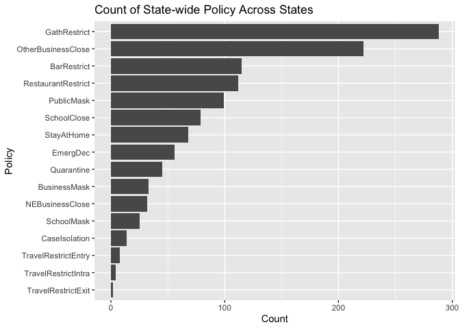<!-- -->

#### Filtered by mandatory policy

We can further filter the data by looking at how many policies are mandatory. 


```r
# Show the difference by Mandate?
p <- ggplot(new_counts.df,aes(x= reorder(Var1,Freq),Freq, fill = `Mandate?`)) +
  geom_bar(stat ="identity")+
  coord_flip()+
  labs(title = "Count of State-wide Policy Across States", y="Distinct Count", x="Policy")+
   guides(fill=guide_legend(title="Mandate?"))

p
```

<!-- -->

#### Distinct Count of State-wide policy across states

By filtering the data by distinct count, we can see what kind of policies that most states will enforce.


```r
# Filter the dataframe by distrinct rows
unique.policy.by.state <- distinct(state.policy[,c("StateName","StatePolicy")])
# Get the count
counts <- table(unique.policy.by.state$StatePolicy)

# Convert to data frame
counts.df <- as.data.frame(counts) 

# Plot the graph for ditinct count
p <- ggplot(counts.df,aes(x= reorder(Var1,Freq),Freq, fill=Freq))+
  geom_bar(stat ="identity")+
  coord_flip()+
  labs(title = "Distinct Count of State-wide Policy Across States", y="Distinct Count", x="Policy")

p
```

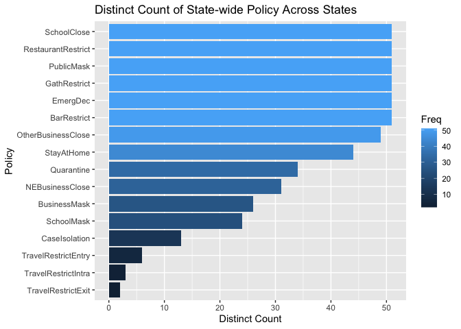<!-- -->

## Regression Discontinuty Design

The first attempt to measure the impact of an measure begins at regression discontinuty design. The idea of regression discontinuty design is to utilize two regrssion models to fit the data before and after an intervention and compute the estimate of the mean difference before and after the intervention . We can do so by regressing mobility signals on time. 


```r
# Read in covidcast data
# Instead of downloading the data from covidcast()
# we saved it as a csv for faster retrieval 

# Covidcast signals
# Option 1: load data from covidcast signals()

# Specify global variables
STARTDATE <- "2019-01-01"
ENDDATE <- lubridate::today()
# GEO_TYPE = "county"
# STATE = "CA"

# Get all fips code and call covidcast()
# library(tidycensus)
# data(fips_codes)
# county.codes <- fips_codes[fips_codes$state==STATE,]$county_code
# Look up the fips code for the state e.g. 06 for CA
# GEO_VALUE <- paste("06",ca.county.codes,sep="")
# Full time away home mobility
# ftime <- covidcast_signal(data_source = "safegraph", 
#                            signal ="full_time_work_prop",
#                            start_day = STARTDATE, 
#                            end_day = ENDDATE,
#                            geo_type = GEO_TYPE, 
#                            geo_values = GEO_VALUE)


# Option 2: Read from csv files
# Blue states
ca.ftime <- read.csv("data/ca.ftime.csv")
ca.ftime$county <- as.character(ca.ftime$county)
ca.ftime$geo_value <- as.character(ca.ftime$geo_value)
ca.ftime$signal <- as.character(ca.ftime$signal)

ny.ftime <- read.csv("data/ny.ftime.csv")
wa.ftime <- read.csv("data/wa.ftime.csv")


# Red states
nd.ftime <- read.csv("data/nd.ftime.csv")
ut.ftime <- read.csv("data/ut.ftime.csv")
tx.ftime <- read.csv("data/tx.ftime.csv")

# Create a new column
ny.ftime$county <- fips_to_name(ny.ftime$geo_value)
wa.ftime$county <- fips_to_name(wa.ftime$geo_value)
nd.ftime$county <- fips_to_name(nd.ftime$geo_value)
ut.ftime$county <- fips_to_name(ut.ftime$geo_value)

# Change the geo_value
wa.ftime$geo_value <- "wa"
ny.ftime$geo_value <- "ny"
nd.ftime$geo_value <- "nd"
ut.ftime$geo_value <- "ut"

# Change to date type
ca.ftime$time_value <- as.Date(ca.ftime$time_value)
wa.ftime$time_value <- as.Date(wa.ftime$time_value)
ny.ftime$time_value <- as.Date(ny.ftime$time_value)
ut.ftime$time_value <- as.Date(ut.ftime$time_value)
nd.ftime$time_value <- as.Date(nd.ftime$time_value)
tx.ftime$time_value <- as.Date(tx.ftime$time_value)


# Policy data
policy <- load_policy()

# Filter to get state-wide mandatory policy
mand.policy <- policy %>% 
  filter(StateWide ==  1 & Mandate == 1)

# Filter to get state-wide advisory policy
recommend.policy <- policy %>% 
  filter(StateWide ==  1 & Mandate == 0)
recommend.policy$StatePolicy <- as.character(recommend.policy$StatePolicy)

# Demograhpics data
education <- read.csv("data/demographics/Education.csv")
population <- read.csv("data/demographics/PopulationEstimates.csv")

poverty <- read.csv("data/demographics/PovertyEstimates.csv")
unemployment <- read.csv("data/demographics/Unemployment.csv")


# Read the interpretation of the rural urban code
ruralurban.code <- read.csv("data/demographics/ruralurbancodes2013.csv")
ruralurban.code$RUCC_2013 <- as.factor(ruralurban.code$RUCC_2013)


all.dates <- seq(as.Date(STARTDATE), as.Date(ENDDATE), by="days")
time_value <- sort(rep(all.dates, 1)) 
```


```r
computeTwoSampleAvgDiff <- function(policy.firstday, 
                                    filtered.df){
  
  # Compute the difference in means of the matched samples.
  
  # Get the sequence of dates from Jan to first day
  first_sample_period <- seq(as.Date("2020-01-05"), 
                             as.Date(policy.firstday), by="days")
  
  # Get the first sample
  first_sample <- filtered.df %>%
    filter(time_value %in% first_sample_period)
  
  # Get the number of data points in first sample
  num_data_points <- nrow(first_sample)
  
  # get all indicies that is after the first day of intervention
  idx <- which(filtered.df$time_value > as.Date(policy.firstday))
  
  # get the same number of data points as first sample
  # after the first day of intervention
  selected_idx <- idx[1:num_data_points]
  
  # Get the second sample
  second_sample <- filtered.df[selected_idx,]
  
  # Run a two sample t-test.
  # We assume the two samples are independent
  out <- t.test(first_sample$value, second_sample$value, paired=F)
  
  return(out)
}
  

plotRD <- function(filtered.df,
                   policyName,
                   mobilityName,
                   stateName,
                   countyName,
                   STARTDATE,
                   ENDDATE,
                   plotMultiple=F,
                   showMultiplePolicies=F,
                   count=NULL){
  
  if(plotMultiple){
    if(showMultiplePolicies){
      # Plot the RD 
      p <- filtered.df %>% 
        mutate(intervention= as.factor(total.num.policy)) %>%
        ggplot(aes(x = time_value, 
                   y = value, 
                   color = intervention)) +
        geom_point() + 
        geom_smooth(method = "lm")+
        labs(title = as.character(count))+ 
        theme(axis.title.x=element_blank(),
              axis.text.x=element_blank(),
              axis.ticks.x=element_blank(),
              axis.title.y=element_blank(),
              axis.text.y=element_blank(),
              axis.ticks.y=element_blank(),
              legend.position = "none")
    }else{
      # Plot the RD 
      p <- filtered.df %>% 
        mutate(intervention= as.factor(eval(parse(text=policyName)))) %>%
        ggplot(aes(x = time_value, 
                   y = value, 
                   color = intervention)) +
        geom_point() + 
        geom_smooth(method = "lm")+
        labs(title = as.character(count))+ 
        theme(axis.title.x=element_blank(),
              axis.text.x=element_blank(),
              axis.ticks.x=element_blank(),
              axis.title.y=element_blank(),
              axis.text.y=element_blank(),
              axis.ticks.y=element_blank(),
              legend.position = "none")
    }
    
  }else{
    if(showMultiplePolicies){
      # Plot the RD 
      p <- filtered.df %>% 
        mutate(intervention= as.factor(total.num.policy)) %>%
        ggplot(aes(x = time_value, y = value, color = intervention)) +
        geom_point() + 
        geom_smooth(method = "lm")+
        labs(title = paste(" Mobility ~ time (", 
                           stateName,
                           "-",
                           countyName,
                           ")",
                           ",", 
                           policyName,
                           ";",
                           as.numeric(ENDDATE-STARTDATE)," day(s)"), 
             x = "Time", 
             y =  mobilityName)
    }else{
      # Plot the RD 
      p <- filtered.df %>% 
        mutate(intervention= as.factor(eval(parse(text=policyName)))) %>%
        ggplot(aes(x = time_value, y = value, color = intervention)) +
        geom_point() + 
        geom_smooth(method = "lm")+
        labs(title = paste(" Mobility ~ time (", 
                           stateName,
                           "-",
                           countyName,
                           ")",
                           ",", 
                           policyName,
                           ";",
                           as.numeric(ENDDATE-STARTDATE)," day(s)"), 
             x = "Time", 
             y =  mobilityName)
    }

  }
  return(p)
}


pipeline <- function(mobility.signal,
                     policy.df,
                     stateName, 
                     countyName,
                     policyName,
                     dayRange,
                     dropWeekend=T,
                     dropDaysAfterIntervention=F,
                     plotMultiple=F,
                     showMultiplePolicies=F,
                     count=NULL){
  
  # Get the first day of the policy
  policy.firstday <- policy.df %>% 
    filter(StatePostal == stateName)%>%
    getSumOfPolicy(STARTDATE, 
                   ENDDATE) %>%
    getFirstDayOfIntervention(stateName, 
                              policyName)

  # Get the time interval
  beginning <- policy.firstday - dayRange
  end <- policy.firstday + dayRange
    
  # get the time period we want to plot the RD
  period <- seq(as.Date(beginning), 
                as.Date(end), by="days")
  
  # Filter the mobility signal 
  filtered.mobility.df <- mobility.signal %>% 
      filter(geo_value == stateName & 
               time_value %in% period &
             county == countyName)
  
  # filter the policy data
  policy.df <- policy.df %>% filter(StatePostal == stateName)
  
  # compute the number of policies and rolling mean of the number
  # for each day between start and end dates
  policy_signal <- getSumOfPolicy(policy.df, 
                                  beginning,
                                  end)
  
  # left join mobility with policy signal by time 
  df <- left_join(filtered.mobility.df, 
                  policy_signal, 
                  by = "time_value")
    
  # drop all the weekends in the data
  if(dropWeekend){
    filtered.df <- df %>% 
      mutate(weekday= weekdays(as.Date(time_value)))%>% 
      filter(!(weekday %in% c("Saturday", "Sunday"))) 
  }else{
    filtered.df <- df
  }
  
  # Drop 2-weeks of data to account for the lag 
  if(dropDaysAfterIntervention){
    
    # Define the 2 weeks time interval 
    drop_period <- seq(as.Date(policy.firstday), 
        as.Date(policy.firstday)+14, by="days")
    
    # Filter the dataframe
    filtered.df<- filtered.df %>% 
      filter(!(time_value %in% drop_period))
    
  }
  
  # Get the two-sample t-test result
  test.result <- computeTwoSampleAvgDiff(policy.firstday,
                                         filtered.df)
  
  # Get the mean difference
  mean.diff <- as.numeric(test.result$estimate[1]-test.result$estimate[2])
  
  LCI <- test.result$conf.int[1]
  UCI <- test.result$conf.int[2]
  
  # Get the mobility signal name
  mobilityName <- unique(filtered.df$signal)
  
  p <- plotRD(filtered.df,
              policyName,
              mobilityName,
              stateName,
              countyName,
              beginning,
              end,
              plotMultiple=plotMultiple,
              showMultiplePolicies=showMultiplePolicies,
              count=count
              )

  return(list(p=p, mean.difference=mean.diff, LCI=LCI, UCI=UCI))

}

plotDemographics <- function(x, 
                             y,
                             lower.bound,
                             upper.bound,
                             xlab, 
                             ylab,
                             title,
                             zeroLine=F){
  # Plot a scatter plot - RESCALE BY LOG
  plot(x, 
       y,
       ylim=range(c(lower.bound, upper.bound)),
       pch=19, 
       xlab=xlab, 
       ylab=ylab,
       main=title)
  # hack: we draw arrows but with very special "arrowheads
  arrows(x, lower.bound, x, upper.bound,length=0.05, angle=90,code=3)
  # Add a horizontal line
  if(zeroLine){
    abline(h=0, col="red") 
  }
}

ggplot_demographics <- function(df,
                                x,
                                y,
                                lower.bound,
                                upper.bound,
                                gp){
  p<- ggplot(df, aes_string(x=x, y=y, group=gp, color=gp)) + 
  #geom_line() +
  geom_point()+
  geom_errorbar(aes_string(ymin=lower.bound, ymax=upper.bound), width=.2,
                 position=position_dodge(0.05))
      
  return(p)
}

ggplot_demographics_red_blue <- function(df,
                                x,
                                y,
                                lower.bound,
                                upper.bound,
                                gp){
  p<- ggplot(df, aes_string(x=x, y=y, group=gp, color=gp)) + 
  #geom_line() +
  geom_point()+
  geom_errorbar(aes_string(ymin=lower.bound, ymax=upper.bound), width=.2,
                 position=position_dodge(0.05))+
    scale_color_manual(values=c("#0066CC", "#F8766D"))
      
  return(p)
}
```

### CA: Differences in county-level mobility signals

* We decided to drop the dates that are weekends and only look at the full-time-away-from-home signal on weekdays. It is because the weekend effect is a significant factor to reduce mobility signal int terms of being away from home for work. 

* For example, let's look at San Mateo county in California, we can see that there is a decrease in ``full_time_work_prop`` after the start date of emergency declaration. On the other hand, Alpine county doesn't seem to have much difference in ``full_time_work_prop`` even after the state-wide emergency declaration. 


```r
policyName <- "EmergDec"
stateName <- "ca"
time.interval <- 150
countyName <- "San Mateo County"
dropDaysAfterIntervention <- F
showMultiplePolicies <- F
plotMultiple <- F


pipeline(ca.ftime,
         mand.policy,
         stateName, 
         countyName,
         policyName,
         dayRange=time.interval,
         dropWeekend=T,
         dropDaysAfterIntervention=F,
         plotMultiple=F,
         showMultiplePolicies=F)
```

```
## $p
```

<!-- -->

```
## 
## $mean.difference
## [1] 0.0379841
## 
## $LCI
## [1] 0.03083681
## 
## $UCI
## [1] 0.0451314
```

```r
countyName <- "Alpine County"

pipeline(ca.ftime,
         mand.policy,
         stateName, 
         countyName,
         policyName,
         dropWeekend=T,
         dayRange=time.interval,
         dropDaysAfterIntervention=F,
         plotMultiple=F,
         showMultiplePolicies=F)
```

```
## $p
```

<!-- -->

```
## 
## $mean.difference
## [1] 0.009465371
## 
## $LCI
## [1] 0.001133203
## 
## $UCI
## [1] 0.01779754
```

* We can also look at all counties in California at a glance. We see that there are some counties that have a more clear decrease in mobility after the intervention of emergency declaration. We can imagine there may be some underlying characteristics that help interpret these patterns. Later, we will use demographic data for this purpose. 


```r
policyName <- "EmergDec"
stateName <- "ca"
dayRange <- 150

# Get all the counties
counties <- population %>%
  filter(State == "CA" & Area_Name!="California")%>%
  select(Area_Name)
counties <- as.vector(counties$Area_Name)

# Counter 
count <- 1
plist <- list()

for(countyName in counties){
  out <- pipeline(ca.ftime,
         mand.policy,
         stateName, 
         countyName,
         policyName,
         dayRange=time.interval,
         dropWeekend=T,
         dropDaysAfterIntervention=F,
         plotMultiple=T,
         showMultiplePolicies=F,
         count=count)
  
  plist[[count]] <- out$p
  count <- count + 1

}

# Plot all counties mobility signal
n <- length(plist)
nCol <- floor(sqrt(n))
do.call("grid.arrange", c(plist, ncol=nCol))
```

<!-- -->


### The challenge: multiple State-wide Policies 

* Note that there can be multiple policies happening at the time, based on the current granularity of data, we can hardly observe the difference among the policies that start on the same date without more information. Thus, we cannot compare the policies that start at the same time. 

* Since there are multiple state-wide policies, we may also be interested to know the start time of each policy. Here, we focus on the mandatory state-wide policies. The color palette shows the total number of policies during the period of time. 

* We can see that there seems to be a lag for the public to react in San Mateo County. To estimate the effect of the intervention, we drop all the data within 14 days after the start time of the intervention. We use a t-test to compute the mean difference between before and after the intervention. 

* Since there is an obvious confounding signal in late December and we suspect that is due to holiday season. We use the data between Jan 5th and Mar 5th (the start date of the intervention) as one sample, and select the same amount of data points after intervention as a second sample.


* We can list out policies involved in the plot below in order with the number being the total number of policies: 

  * 1: Emergency declaration (started on 2020-03-05)

  * 6: Emergency declaration (started on 2020-03-05), bar restriction (started on 2020-03-20), gathering restriction (started on 2020-03-20), restaurant restriction (started on 2020-03-20), stay at home order (started on 2020-03-20), non-essential business closure (started on 2020-03-20)

  * 7: Emergency declaration (started on 2020-03-05), bar restriction (started on 2020-03-20), gathering restriction (started on 2020-03-20), restaurant restriction (started on 2020-03-20), stay at home order (started on 2020-03-20), non-essential business closure (started on 2020-03-20), other business closure (started on 2020-05-09)

  * 8: Emergency declaration (started on 2020-03-05), bar restriction (started on 2020-03-20), gathering restriction (started on 2020-03-20), restaurant restriction (started on 2020-03-20), stay at home order (started on 2020-03-20), non-essential business closure (started on 2020-03-20), other business closure (started on 2020-05-09), business mask  (started on 2020-05-27)

  * 9: Emergency declaration (started on 2020-03-05), bar restriction (started on 2020-03-20), gathering restriction (started on 2020-03-20), restaurant restriction (started on 2020-03-20), stay at home order (started on 2020-03-20), non-essential business closure (started on 2020-03-20), other business closure (started on 2020-05-09), business mask  (started on 2020-05-27), public mask (started on 2020-06-19)

* 10: Emergency declaration (started on 2020-03-05), bar restriction (started on 2020-03-20), gathering restriction (started on 2020-03-20), restaurant restriction (started on 2020-03-20), stay at home order (started on 2020-03-20), non-essential business closure (started on 2020-03-20), other business closure (started on 2020-05-09), business mask  (started on 2020-05-27), public mask (started on 2020-06-19), school mask (started on 2020-07-28)


```r
policyName <- "EmergDec"
stateName <- "ca"
time.interval <- 150
countyName <- "San Mateo County"


pipeline(ca.ftime,
         mand.policy,
         stateName, 
         countyName,
         policyName,
         dayRange=time.interval,
         dropWeekend=T,
         dropDaysAfterIntervention=F,
         plotMultiple=F,
         showMultiplePolicies=T)
```

```
## $p
```

<!-- -->

```
## 
## $mean.difference
## [1] 0.0379841
## 
## $LCI
## [1] 0.03083681
## 
## $UCI
## [1] 0.0451314
```

```r
pipeline(ca.ftime,
         mand.policy,
         stateName, 
         countyName,
         policyName,
         dayRange=time.interval,
         dropWeekend=T,
         dropDaysAfterIntervention=T,
         plotMultiple=F,
         showMultiplePolicies=T)
```

```
## $p
```

<!-- -->

```
## 
## $mean.difference
## [1] 0.04589824
## 
## $LCI
## [1] 0.04068287
## 
## $UCI
## [1] 0.05111362
```


* If we are considering only the advisory policies, how would our interpretation be different? It actually depends on the start date and the time span of the policy. It also depends on the granularity of the data for examining how many recommended policies have actually been implemented in the county. 

* If we assume the county has enacted the state-wide recommended policies accordingly, we can see from the plot below that the first advisory policy happened nearly at the same time as the first mandatory policy. We will leave it as a future work to effectively disentangle the effects of these two types of policies. Also, we can see that the policies, both mandatory and advisory, do not have an noticable effect on Alpine county.


```r
policyName <- "GathRestrict"
stateName <- "ca"
time.interval <- 150
countyName <- "San Mateo County"

pipeline(ca.ftime,
         recommend.policy,
         stateName, 
         countyName,
         policyName,
         dayRange=time.interval,
         dropWeekend=T,
         dropDaysAfterIntervention=F,
         plotMultiple=F,
         showMultiplePolicies=F)
```

```
## $p
```

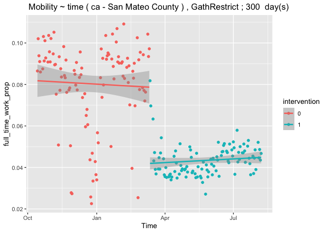<!-- -->

```
## 
## $mean.difference
## [1] 0.0448382
## 
## $LCI
## [1] 0.03989927
## 
## $UCI
## [1] 0.04977714
```

```r
countyName <- "Alpine County"

pipeline(ca.ftime,
         recommend.policy,
         stateName, 
         countyName,
         policyName,
         dropWeekend=T,
         dayRange=time.interval,
         dropDaysAfterIntervention=F,
         plotMultiple=F,
         showMultiplePolicies=F)
```

```
## $p
```

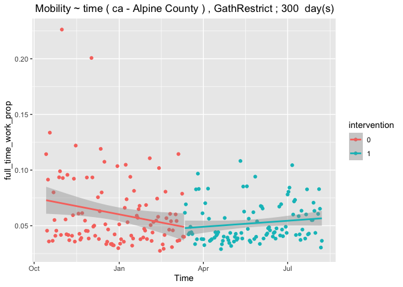<!-- -->

```
## 
## $mean.difference
## [1] 0.0067061
## 
## $LCI
## [1] -0.001493706
## 
## $UCI
## [1] 0.01490591
```

### Correlation between effect of intervention and population

* Intuitively, we may think that a higher population, the stronger the effect of the intervention should be. We can plot the mean difference between two samples and see if there is any correlation with the log of population in 2019. There is a positive spearman correlation around 0.5. 


```r
policyName <- "EmergDec"
count <- 1
plist <- list()
mlist <- list()
UCI.list <- list()
LCI.list <- list()

for(countyName in counties){
  out <- pipeline(ca.ftime,
         mand.policy,
         stateName, 
         countyName,
         policyName,
         dayRange=time.interval,
         dropWeekend=T,
         dropDaysAfterIntervention=T,
         plotMultiple=T,
         showMultiplePolicies=F,
         count=count)
  
    plist[[count]] <- out$p
    mlist[[count]] <- out$mean.difference
    LCI.list[[count]] <- out$LCI
    UCI.list[[count]] <- out$UCI
    count <- count + 1
}


# Filter demographic data 
# Population
ca.population <- population %>%
  select(State,
         Area_Name,
         Rural.urban_Continuum.Code_2013,
         Urban_Influence_Code_2013,
         POP_ESTIMATE_2019,
         GQ_ESTIMATES_2019,
         R_INTERNATIONAL_MIG_2019)%>%
  filter(State == "CA" & Area_Name !="California")

# Change to factor
ca.population$Rural.urban_Continuum.Code_2013 <- as.factor(ca.population$Rural.urban_Continuum.Code_2013)


ca.population$mean.difference <- unlist(mlist)
ca.population$lower.bound <- unlist(LCI.list)
ca.population$upper.bound <- unlist(UCI.list)
ca.population$log_population <- log(as.numeric(ca.population$POP_ESTIMATE_2019))

plotDemographics(ca.population$log_population, 
                 ca.population$mean.difference, 
                 ca.population$lower.bound,
                 ca.population$upper.bound,
                 "log(population in 2019)", 
                 "Mean difference with confidence interval",
                 "Mean difference between 2 samples by population in CA counties",
                 zeroLine = F)

# Draw a regression line to show correlation
abline(lm(ca.population$mean.difference~ ca.population$log_population),col="blue")
```

<!-- -->

```r
# Compute spearman correlation
cor(ca.population$log_population, ca.population$mean.difference, method = c("spearman"))
```

```
## [1] 0.5858378
```

### Counties that have weak effects of intervention

* By looking at the confidence intervels, we may identify some counties that may not have an effect of the intervention. Interestingly, the counties shown below are all rural areas. We can also see that from the rural urban continuum code. The bigger the number is, the less populous the county is. 


```r
plotDemographics(ca.population$log_population, 
                 ca.population$mean.difference, 
                 ca.population$lower.bound,
                 ca.population$upper.bound,
                 "log(population in 2019)", 
                 "Mean difference with confidence interval",
                 "Mean difference between 2 samples by population in CA counties",
                 zeroLine = T)
```

<!-- -->

```r
# Show all counties that has a lower bound 
# smaller than 0 
selected.counties <- ca.population %>% 
        filter(lower.bound < 0) %>% 
  select(Area_Name, Rural.urban_Continuum.Code_2013)


print(selected.counties)
```

```
##          Area_Name Rural.urban_Continuum.Code_2013
## 1    Alpine County                               8
## 2 Del Norte County                               7
## 3     Modoc County                               6
## 4    Sierra County                               8
## 5   Trinity County                               8
```


* Also, we can filter the graph further by its rural urban code recorded in 2013, denoted as RUCC_2013 in the plot below. The graph below shows that the effect of the intervention tends to be larger in metro areas and smaller in the non-metro areas. 

* We list the defintions of the codes below according to USDA:

  * 1: Metro - Counties in metro areas of 1 million population or more                                                              
  
  * 2: Metro - Counties in metro areas of 250,000 to 1 million population                                                                                                                   
  * 3: Metro - Counties in metro areas of fewer than 250,000 population   
  
  * 4: Nonmetro - Urban population of 20,000 or more, adjacent to a metro area                                                    
  
  * 5: Nonmetro - Urban population of 20,000 or more, not adjacent to a metro area
  
  * 6: Nonmetro - Urban population of 2,500 to 19,999, adjacent to a metro area                                                     
  
  * 7: Nonmetro - Urban population of 2,500 to 19,999, not adjacent to a metro area   
  
  * 8: Nonmetro - Completely rural or less than 2,500 urban population, adjacent to a metro area     
  
  * 9: Nonmetro - Completely rural or less than 2,500 urban population, not adjacent to a metro area                                                                                            

```r
# Change the column name
percent_commuting <- ruralurban.code %>%
  filter(ruralurban.code$State ==  "CA", 
         County_Name %in% counties) %>%
  select(County_Name,
         RUCC_2013)

colnames(percent_commuting)[1] <- "Area_Name"

# Left join the get the description
ca.population.with.code <- left_join(ca.population, percent_commuting, by ="Area_Name")

ggplot_demographics(ca.population.with.code,
                    x="log_population",
                    y="mean.difference",
                    "lower.bound",
                    "upper.bound", 
                    "RUCC_2013")
```

<!-- -->

#### Education and effects of intervention

* We may also want to see if there is a correlation between education level in the county and the effect of the intervention.

* Intuitively, we may think that a county that has a larger population tend to have more people to be less educated or more educated. The plot below shows that the populous metro areas, denoted by 1 in color palette, tend to have fewer people to be less educated and the effect on those areas tend to be larger. The Spearman correlation between percent of people who holds bachelor's or higher and the mean difference is 0.6045038. 

* However, there is a weak negative correlation between percentage of adults with less than a high school diploma and the effect of the intervention. The Spearman correlation between percent of people with less than a highs school diploma and the mean difference is -0.158085. 


```r
# Education
ca.education <- education %>%
  select(State,
         Area.name,
         X2013.Rural.urban.Continuum.Code, 
         Percent.of.adults.with.less.than.a.high.school.diploma..2014.18,
         Percent.of.adults.with.a.bachelor.s.degree.or.higher..2014.18)%>%
  filter(State == "CA" & Area.name !="California")


colnames(ca.education)[2] <- "Area_Name"

# Left join the get the description
ca.pop.education <- left_join(ca.population.with.code, ca.education, by ="Area_Name")

# Percentage of adult with bachelor's or higher in 2014-2018
ggplot_demographics(ca.pop.education,
                x="Percent.of.adults.with.a.bachelor.s.degree.or.higher..2014.18",
                    y="mean.difference",
                    "lower.bound",
                    "upper.bound", "RUCC_2013")
```

<!-- -->

```r
# Compute the spearman correlation
cor(ca.pop.education$mean.difference, ca.pop.education$Percent.of.adults.with.a.bachelor.s.degree.or.higher..2014.18, method = c("spearman"))
```

```
## [1] 0.6010583
```

```r
# Percentage of adult with less.than.a.high.school.diploma in 2014-2018

ggplot_demographics(ca.pop.education,
                x="Percent.of.adults.with.less.than.a.high.school.diploma..2014.18",
                y="mean.difference",
                "lower.bound",
                "upper.bound", 
                "RUCC_2013")
```

<!-- -->

```r
# Compute the spearman correlation
cor(ca.pop.education$mean.difference, ca.pop.education$Percent.of.adults.with.less.than.a.high.school.diploma..2014.18, method = c("spearman"))
```

```
## [1] -0.158085
```

#### Median income level and effects of intervention

We continue to look at the mean differences from different demograhpic perspectives. The Spearman correlation between median income level and the mean difference is 0.6811641, which is higher than any correlation we have seen in this analysis so far. 


```r
# We select the estimate of people of all ages in poverty 2018
ca.unemployment <- unemployment %>%
  select(Stabr,
         area_name,
         Rural_urban_continuum_code_2013, 
         Median_Household_Income_2018,
         Unemployment_rate_2019)%>%
  filter(Stabr == "CA" & area_name !="California")

# Change the name for join
colnames(ca.unemployment)[2] <- "Area_Name"

# Preprocess the area names
ca.unemployment$Area_Name <- as.character(ca.unemployment$Area_Name)

# Split the county names by odd indicies 
ca.unemployment$Area_Name <-unlist(strsplit(ca.unemployment$Area_Name,","))[seq(1,115,2)]

# Left join the get the description
ca.pop.unemployment <- left_join(ca.population.with.code, ca.unemployment, by ="Area_Name")

# Estimate of people of all ages in poverty 2018
ggplot_demographics(ca.pop.unemployment,
                x="Median_Household_Income_2018",
                    y="mean.difference",
                    "lower.bound",
                    "upper.bound", "RUCC_2013")
```

<!-- -->

```r
# Compute the spearman correlation
ca.pop.unemployment.na <- na.omit(ca.pop.unemployment)

cor(x=ca.pop.unemployment.na$mean.difference, 
    y= ca.pop.unemployment.na$Median_Household_Income_2018,
    method = c("spearman"))
```

```
## [1] 0.6896552
```

#### Poverty and effects of intervention

In contrast, if we change the x-axis to be poverty level, we should expect to get an negetive correlation, which is -0.6589759.


```r
# Poverty

# We select the estimate of people of all ages in poverty 2018
ca.poverty <- poverty %>%
  select(Stabr,
         Area_name,
         Rural.urban_Continuum_Code_2013, 
         POVALL_2018,
         PCTPOVALL_2018)%>%
  filter(Stabr == "CA" & Area_name !="California")


colnames(ca.poverty)[2] <- "Area_Name"
colnames(ca.poverty)[5] <- "Estimated.percent.of.people.of.all.ages.in.poverty.2018"


# Left join the get the description
ca.pop.poverty <- left_join(ca.population.with.code, ca.poverty, by ="Area_Name")

# Estimate of people of all ages in poverty 2018
ggplot_demographics(ca.pop.poverty,
                x="Estimated.percent.of.people.of.all.ages.in.poverty.2018",
                    y="mean.difference",
                    "lower.bound",
                    "upper.bound", "RUCC_2013")
```

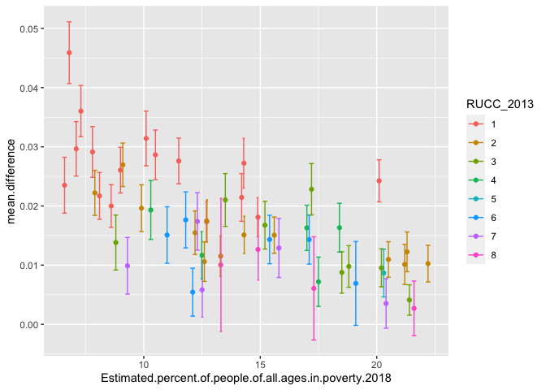<!-- -->

```r
# Compute the spearman correlation
cor(ca.pop.poverty$mean.difference, ca.pop.poverty$Estimated.percent.of.people.of.all.ages.in.poverty.2018, method = c("spearman"))
```

```
## [1] -0.6589759
```

#### Unemployment and effects of intervention

We can also look at the mean differences from the perspective of the unemployment rate. We see that the higher unemployment rate, the weaker effect of the policy becomes. 

Based on the observation so far, we can reasonbably conjecture that the intervention has a larger effect on people who live in high populous area, hold college degrees, has high-level income. It may be that the more educated people are, the more flexibility they can enjoy from their remote work, whereas people with low education profile tends to have more demanding physical work and suffers more greatly from being laid off due to the economical impact of COVID-19 pandamic. 


```r
# Correlation between unemployment rate in 2019 and 
ggplot_demographics(ca.pop.unemployment,
                x="Unemployment_rate_2019",
                    y="mean.difference",
                    "lower.bound",
                    "upper.bound", "RUCC_2013")
```

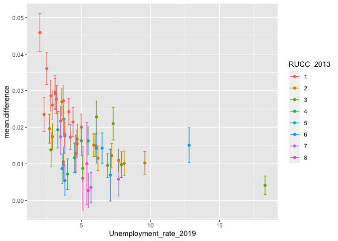<!-- -->

```r
# Compute the correlation and remove any missing values
cor(ca.pop.unemployment$mean.difference[!is.na(ca.pop.unemployment$Unemployment_rate_2019)], ca.pop.unemployment$Unemployment_rate_2019[!is.na(ca.pop.unemployment$Unemployment_rate_2019)],method = c("spearman"))
```

```
## [1] -0.6113219
```

### New York

We can look at a different state to see whether its counties also show different levels of effect of the intervention. We decide to look at New York because of its huge spike in covid cases in the past. 


```r
# Filter demographic data 
# Population
ny.population <- population %>%
  select(State,
         Area_Name,
         Rural.urban_Continuum.Code_2013,
         Urban_Influence_Code_2013,
         POP_ESTIMATE_2019,
         GQ_ESTIMATES_2019,
         R_INTERNATIONAL_MIG_2019)%>%
  filter(State == "NY" & Area_Name != "New York")

# Change to factor
ny.population$Rural.urban_Continuum.Code_2013 <- as.factor(ny.population$Rural.urban_Continuum.Code_2013)
```

In New York, we can also see that the effect varies based on different counties.


```r
# Get all the counties
ny.counties <- population %>%
  filter(State == "NY" & Area_Name!="New York")%>%
  select(Area_Name)
ny.counties <- as.vector(ny.counties$Area_Name)

# Counter 
count <- 1
plist <- list()

# Loop through all counties in new york
for(countyName in ny.counties){
  out <- pipeline(ny.ftime,
         mand.policy,
         stateName="ny", 
         countyName,
         policyName,
         dayRange=time.interval,
         dropWeekend=T,
         dropDaysAfterIntervention=F,
         plotMultiple=T,
         showMultiplePolicies=F,
         count=count)
  
  plist[[count]] <- out$p
  count <- count + 1
}

# Plot all counties mobility signal
n <- length(plist)
nCol <- floor(sqrt(n))
do.call("grid.arrange", c(plist, ncol=nCol))
```

```
## `geom_smooth()` using formula 'y ~ x'
## `geom_smooth()` using formula 'y ~ x'
## `geom_smooth()` using formula 'y ~ x'
## `geom_smooth()` using formula 'y ~ x'
## `geom_smooth()` using formula 'y ~ x'
## `geom_smooth()` using formula 'y ~ x'
## `geom_smooth()` using formula 'y ~ x'
## `geom_smooth()` using formula 'y ~ x'
## `geom_smooth()` using formula 'y ~ x'
## `geom_smooth()` using formula 'y ~ x'
## `geom_smooth()` using formula 'y ~ x'
## `geom_smooth()` using formula 'y ~ x'
## `geom_smooth()` using formula 'y ~ x'
## `geom_smooth()` using formula 'y ~ x'
## `geom_smooth()` using formula 'y ~ x'
## `geom_smooth()` using formula 'y ~ x'
## `geom_smooth()` using formula 'y ~ x'
## `geom_smooth()` using formula 'y ~ x'
## `geom_smooth()` using formula 'y ~ x'
## `geom_smooth()` using formula 'y ~ x'
## `geom_smooth()` using formula 'y ~ x'
## `geom_smooth()` using formula 'y ~ x'
## `geom_smooth()` using formula 'y ~ x'
## `geom_smooth()` using formula 'y ~ x'
## `geom_smooth()` using formula 'y ~ x'
## `geom_smooth()` using formula 'y ~ x'
## `geom_smooth()` using formula 'y ~ x'
## `geom_smooth()` using formula 'y ~ x'
## `geom_smooth()` using formula 'y ~ x'
## `geom_smooth()` using formula 'y ~ x'
## `geom_smooth()` using formula 'y ~ x'
## `geom_smooth()` using formula 'y ~ x'
## `geom_smooth()` using formula 'y ~ x'
## `geom_smooth()` using formula 'y ~ x'
## `geom_smooth()` using formula 'y ~ x'
## `geom_smooth()` using formula 'y ~ x'
## `geom_smooth()` using formula 'y ~ x'
## `geom_smooth()` using formula 'y ~ x'
## `geom_smooth()` using formula 'y ~ x'
## `geom_smooth()` using formula 'y ~ x'
## `geom_smooth()` using formula 'y ~ x'
## `geom_smooth()` using formula 'y ~ x'
## `geom_smooth()` using formula 'y ~ x'
## `geom_smooth()` using formula 'y ~ x'
## `geom_smooth()` using formula 'y ~ x'
## `geom_smooth()` using formula 'y ~ x'
## `geom_smooth()` using formula 'y ~ x'
## `geom_smooth()` using formula 'y ~ x'
## `geom_smooth()` using formula 'y ~ x'
## `geom_smooth()` using formula 'y ~ x'
## `geom_smooth()` using formula 'y ~ x'
## `geom_smooth()` using formula 'y ~ x'
## `geom_smooth()` using formula 'y ~ x'
## `geom_smooth()` using formula 'y ~ x'
## `geom_smooth()` using formula 'y ~ x'
## `geom_smooth()` using formula 'y ~ x'
## `geom_smooth()` using formula 'y ~ x'
## `geom_smooth()` using formula 'y ~ x'
## `geom_smooth()` using formula 'y ~ x'
## `geom_smooth()` using formula 'y ~ x'
## `geom_smooth()` using formula 'y ~ x'
## `geom_smooth()` using formula 'y ~ x'
```

<!-- -->

* Let's see if it is also true that the population in NY has a positive correlation with the mean differences between two samples before and after an intervention of emergency declaration. We see that the Spearman correlation is even higher in NY with 0.6673969. 


```r
count <- 1
plist <- list()
mlist <- list()
UCI.list <- list()
LCI.list <- list()

for(countyName in ny.counties){
  out <- pipeline(ny.ftime,
         mand.policy,
         stateName="ny", 
         countyName,
         policyName,
         dayRange=time.interval,
         dropWeekend=T,
         dropDaysAfterIntervention=T,
         plotMultiple=F,
         showMultiplePolicies=F,
         count=count)
  
    plist[[count]] <- out$p
    mlist[[count]] <- out$mean.difference
    LCI.list[[count]] <- out$LCI
    UCI.list[[count]] <- out$UCI
    count <- count + 1
}


ny.population$mean.difference <- unlist(mlist)
ny.population$lower.bound <- unlist(LCI.list)
ny.population$upper.bound <- unlist(UCI.list)
ny.population$log_population <- log(as.numeric(ny.population$POP_ESTIMATE_2019))

plotDemographics(ny.population$log_population, 
                 ny.population$mean.difference, 
                 ny.population$lower.bound,
                 ny.population$upper.bound,
                 "log(population in 2019)", 
                 "Mean difference with confidence interval",
                 "Mean difference between 2 samples by population in NY counties",
                 zeroLine = F)

# Draw a regression line to show correlation
abline(lm(ny.population$mean.difference~ ny.population$log_population),col="blue")
```

<!-- -->

```r
# Compute spearman correlation
cor(ny.population$log_population, ny.population$mean.difference, method = c("spearman"))
```

```
## [1] 0.6673969
```

### Washington

We can also look at the state of Washington to see that the effect of emergency declaration varies across counties in Washington. 


```r
# Get all the counties
wa.counties <- population %>%
  filter(State == "WA" & Area_Name!="Washington")%>%
  select(Area_Name)
wa.counties <- as.vector(wa.counties$Area_Name)

# Counter 
count <- 1
plist <- list()

# Exclude the Kalawao County because of the lack of samples
for(countyName in wa.counties){
  out <- pipeline(wa.ftime,
         mand.policy,
         stateName="wa", 
         countyName,
         policyName,
         dayRange=time.interval,
         dropWeekend=T,
         dropDaysAfterIntervention=F,
         plotMultiple=T,
         showMultiplePolicies=F,
         count=count)
  
  plist[[count]] <- out$p
  count <- count + 1
}

# Plot all counties mobility signal
n <- length(plist)
nCol <- floor(sqrt(n))
do.call("grid.arrange", c(plist, ncol=nCol))
```

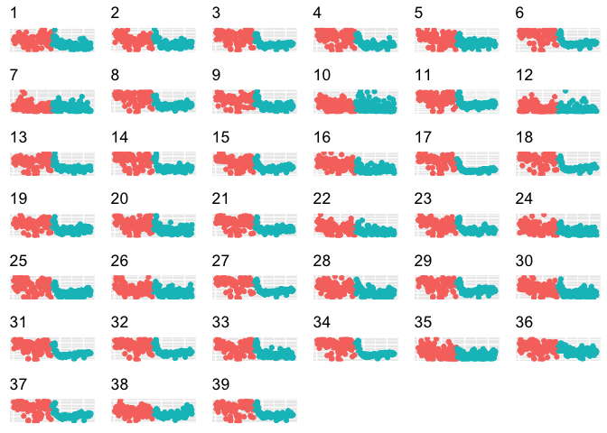<!-- -->


```r
time.interval <- 150
count <- 1
plist <- list()
mlist <- list()
UCI.list <- list()
LCI.list <- list()

for(countyName in wa.counties){
  out <- pipeline(wa.ftime,
         mand.policy,
         stateName="wa", 
         countyName,
         policyName,
         dayRange=time.interval,
         dropWeekend=T,
         dropDaysAfterIntervention=F,
         plotMultiple=T,
         showMultiplePolicies=F,
         count=count)
  
    plist[[count]] <- out$p
    mlist[[count]] <- out$mean.difference
    LCI.list[[count]] <- out$LCI
    UCI.list[[count]] <- out$UCI
    count <- count + 1
}

# Filter demographic data 
# Population
wa.population <- population %>%
  select(State,
         Area_Name,
         Rural.urban_Continuum.Code_2013,
         Urban_Influence_Code_2013,
         POP_ESTIMATE_2019,
         GQ_ESTIMATES_2019,
         R_INTERNATIONAL_MIG_2019)%>%
  filter(State == "WA" & Area_Name !="Washington")


# Change to factor
wa.population$Rural.urban_Continuum.Code_2013 <- as.factor(wa.population$Rural.urban_Continuum.Code_2013)


# Add the other computed numbers
wa.population$mean.difference <- unlist(mlist)
wa.population$lower.bound <- unlist(LCI.list)
wa.population$upper.bound <- unlist(UCI.list)
wa.population$log_population <- log(as.numeric(wa.population$POP_ESTIMATE_2019))

plotDemographics(wa.population$log_population, 
                 wa.population$mean.difference, 
                 wa.population$lower.bound,
                 wa.population$upper.bound,
                 "log(population in 2019)", 
                 "Mean difference with confidence interval",
                 "Mean difference between 2 samples by income in WA counties",
                 zeroLine = F)

# Draw a regression line to show correlation
abline(lm(wa.population$mean.difference~ wa.population$log_population),col="blue")
```

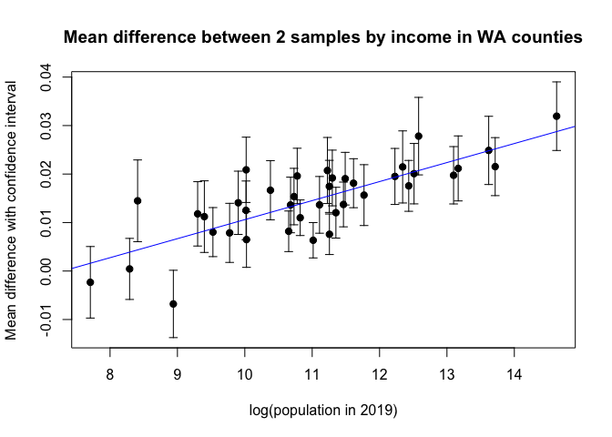<!-- -->

```r
# Compute spearman correlation
cor(wa.population$mean.difference, wa.population$log_population, method = c("spearman"))
```

```
## [1] 0.757085
```

### A representative of blue states

* According to Wikipedia, red states and blue states have referred to states of the United States whose voters predominantly choose either the Republican Party (red) or Democratic Party (blue) presidential and senatorial candidates.

* If we pick California, Washington, and New York to be the representative of the blue states, will we see any thing different? We can see that the higher the population, the higher the effect of the intervention tends to be.


```r
blue.population <- rbind(ca.population, ny.population, wa.population)

plotDemographics(blue.population$log_population, 
                 blue.population$mean.difference, 
                 blue.population$lower.bound,
                 blue.population$upper.bound,
                 "log(population in 2019)", 
                 "Mean difference with confidence interval",
                 "Mean difference by income in Blue state counties",
                 zeroLine = F)

# Draw a regression line to show correlation
abline(lm(blue.population$mean.difference~ blue.population$log_population),col="blue")
```

<!-- -->


```r
# Filter demographic data 
# Population
tx.population <- population %>%
  select(State,
         Area_Name,
         Rural.urban_Continuum.Code_2013,
         Urban_Influence_Code_2013,
         POP_ESTIMATE_2019,
         GQ_ESTIMATES_2019,
         R_INTERNATIONAL_MIG_2019) %>%
  filter(State =="TX" & Area_Name !="Texas")

# Change to factor
tx.population$Rural.urban_Continuum.Code_2013 <- as.factor(tx.population$Rural.urban_Continuum.Code_2013)

# Get all the counties
tx.counties <- as.vector(tx.population$Area_Name)
```


```r
time.interval <- 150
count <- 1
plist <- list()
mlist <- list()
UCI.list <- list()
LCI.list <- list()

for(countyName in tx.counties){
  out <- pipeline(tx.ftime,
         mand.policy,
         stateName="tx", 
         countyName,
         policyName,
         dayRange=time.interval,
         dropWeekend=T,
         dropDaysAfterIntervention=T,
         plotMultiple=T,
         showMultiplePolicies=F,
         count=count)
  
    plist[[count]] <- out$p
    mlist[[count]] <- out$mean.difference
    LCI.list[[count]] <- out$LCI
    UCI.list[[count]] <- out$UCI
    count <- count + 1
}

# Add the other computed numbers
tx.population$mean.difference <- unlist(mlist)
tx.population$lower.bound <- unlist(LCI.list)
tx.population$upper.bound <- unlist(UCI.list)
tx.population$log_population <- log(as.numeric(tx.population$POP_ESTIMATE_2019))
```


```r
# Filter demographic data 
# Population
nd.population <- population %>%
  select(State,
         Area_Name,
         Rural.urban_Continuum.Code_2013,
         Urban_Influence_Code_2013,
         POP_ESTIMATE_2019,
         GQ_ESTIMATES_2019,
         R_INTERNATIONAL_MIG_2019)%>%
  filter(State %in% c("ND") & !(Area_Name %in% c("North Dakota")))

# Change to factor
nd.population$Rural.urban_Continuum.Code_2013 <- as.factor(nd.population$Rural.urban_Continuum.Code_2013)

# Get all the counties
nd.counties <- as.vector(nd.population$Area_Name)
```


```r
time.interval <- 150
count <- 1
plist <- list()
mlist <- list()
UCI.list <- list()
LCI.list <- list()

for(countyName in nd.counties){
  out <- pipeline(nd.ftime,
         mand.policy,
         stateName="nd", 
         countyName,
         policyName,
         dayRange=time.interval,
         dropWeekend=T,
         dropDaysAfterIntervention=T,
         plotMultiple=T,
         showMultiplePolicies=F,
         count=count)
  
    plist[[count]] <- out$p
    mlist[[count]] <- out$mean.difference
    LCI.list[[count]] <- out$LCI
    UCI.list[[count]] <- out$UCI
    count <- count + 1
}

# Add the other computed numbers
nd.population$mean.difference <- unlist(mlist)
nd.population$lower.bound <- unlist(LCI.list)
nd.population$upper.bound <- unlist(UCI.list)
nd.population$log_population <- log(as.numeric(nd.population$POP_ESTIMATE_2019))
```


```r
# Filter demographic data 
# Population
ut.population <- population %>%
  select(State,
         Area_Name,
         Rural.urban_Continuum.Code_2013,
         Urban_Influence_Code_2013,
         POP_ESTIMATE_2019,
         GQ_ESTIMATES_2019,
         R_INTERNATIONAL_MIG_2019)%>%
  filter(State =="UT" & Area_Name !="Utah")

# Change to factor
ut.population$Rural.urban_Continuum.Code_2013 <- as.factor(ut.population$Rural.urban_Continuum.Code_2013)

# Get all the counties
ut.counties <- as.vector(ut.population$Area_Name)
```


```r
time.interval <- 150
count <- 1
plist <- list()
mlist <- list()
UCI.list <- list()
LCI.list <- list()

for(countyName in ut.counties){
  out <- pipeline(ut.ftime,
         mand.policy,
         stateName="ut", 
         countyName,
         policyName,
         dayRange=time.interval,
         dropWeekend=T,
         dropDaysAfterIntervention=T,
         plotMultiple=T,
         showMultiplePolicies=F,
         count=count)
  
    plist[[count]] <- out$p
    mlist[[count]] <- out$mean.difference
    LCI.list[[count]] <- out$LCI
    UCI.list[[count]] <- out$UCI
    count <- count + 1
}

# Add the other computed numbers
ut.population$mean.difference <- unlist(mlist)
ut.population$lower.bound <- unlist(LCI.list)
ut.population$upper.bound <- unlist(UCI.list)
ut.population$log_population <- log(as.numeric(ut.population$POP_ESTIMATE_2019))
```

### Blue and Red states

We can also look at the signal from political stand point in terms of Democratic and Republican parties (blue vs. red states). Due to the limit of computation, we use only a few states as a representative of each party.

#### Mean difference by population

We selected California, Washington, and New York as a representative of blue states, Texas, North Dakota, and Utah as a representative of red states. We see that both of the mean differences positively correlate with population.  


```r
red.population <- rbind(ut.population,
                        tx.population, 
                        nd.population)


red.population$stand <- "red"
blue.population$stand <- "blue"

all_population <- rbind(blue.population, red.population)
all_population$stand <- as.factor(all_population$stand)


# all blue and red states
p <- ggplot_demographics_red_blue(all_population,
                    x="log_population",
                    y="mean.difference",
                    "lower.bound",
                    "upper.bound", 
                    "stand")
# Add a title
p + ggtitle("Mean difference in two samples by population and political stands")
```

```
## Warning: position_dodge requires non-overlapping x intervals
```

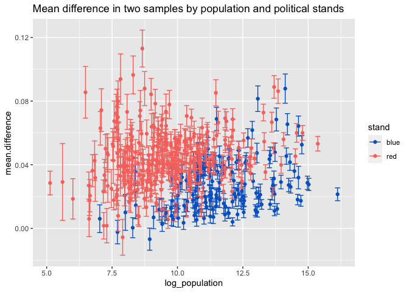<!-- -->

```r
sprintf("Spearman correlation for the red state: %s",
cor(red.population$mean.difference, red.population$log_population, method = "spearman"))
```

```
## [1] "Spearman correlation for the red state: 0.186946165759759"
```

```r
sprintf("Spearman correlation for the blue state: %s",
cor(blue.population$mean.difference, blue.population$log_population, method = "spearman"))
```

```
## [1] "Spearman correlation for the blue state: 0.381759016001911"
```

#### Mean difference by median household income


```r
# We select the estimate of people of all ages in poverty 2018
wa.unemployment <- unemployment %>%
  select(Stabr,
         area_name,
         Rural_urban_continuum_code_2013, 
         Median_Household_Income_2018,
         Unemployment_rate_2019)%>%
  filter(Stabr == "WA" & area_name !="Washington")

ny.unemployment <- unemployment %>%
  select(Stabr,
         area_name,
         Rural_urban_continuum_code_2013, 
         Median_Household_Income_2018,
         Unemployment_rate_2019)%>%
  filter(Stabr == "NY" & area_name !="New York")


tx.unemployment <- unemployment %>%
  select(Stabr,
         area_name,
         Rural_urban_continuum_code_2013, 
         Median_Household_Income_2018,
         Unemployment_rate_2019)%>%
  filter(Stabr == "TX" & area_name !="Texas")

nd.unemployment <- unemployment %>%
  select(Stabr,
         area_name,
         Rural_urban_continuum_code_2013, 
         Median_Household_Income_2018,
         Unemployment_rate_2019)%>%
  filter(Stabr == "ND" & area_name !="North Dakota")

ut.unemployment <- unemployment %>%
  select(Stabr,
         area_name,
         Rural_urban_continuum_code_2013, 
         Median_Household_Income_2018,
         Unemployment_rate_2019)%>%
  filter(Stabr == "UT" & area_name !="Utah")


# Change the name for join
colnames(wa.unemployment)[2] <- "Area_Name"
colnames(ny.unemployment)[2] <- "Area_Name"
colnames(ut.unemployment)[2] <- "Area_Name"
colnames(nd.unemployment)[2] <- "Area_Name"
colnames(tx.unemployment)[2] <- "Area_Name"


# Preprocess the area names
wa.unemployment$Area_Name <- as.character(wa.unemployment$Area_Name)
ny.unemployment$Area_Name <- as.character(ny.unemployment$Area_Name)
ut.unemployment$Area_Name <- as.character(ut.unemployment$Area_Name)
nd.unemployment$Area_Name <- as.character(nd.unemployment$Area_Name)
tx.unemployment$Area_Name <- as.character(tx.unemployment$Area_Name)


# Split the county names by odd indicies 
wa.unemployment$Area_Name<-unlist(strsplit(wa.unemployment$Area_Name,","))[seq(1,77,2)]

ny.unemployment$Area_Name <-unlist(strsplit(ny.unemployment$Area_Name,","))[seq(1,123,2)]

ut.unemployment$Area_Name <- unlist(strsplit(ut.unemployment$Area_Name,","))[seq(1,57,2)]

nd.unemployment$Area_Name <-unlist(strsplit(nd.unemployment$Area_Name,","))[seq(1,105,2)]

tx.unemployment$Area_Name <-unlist(strsplit(tx.unemployment$Area_Name,","))[seq(1,507,2)]

# Left join the get the description
ca.pop.unemployment <- left_join(ca.population, ca.unemployment, by ="Area_Name")

ny.pop.unemployment <- left_join(ny.population, ny.unemployment, by ="Area_Name")

tx.pop.unemployment <- left_join(tx.population, tx.unemployment, by ="Area_Name")

wa.pop.unemployment <- left_join(wa.population, wa.unemployment, by ="Area_Name")

nd.pop.unemployment <- left_join(nd.population, nd.unemployment, by ="Area_Name")

ut.pop.unemployment <- left_join(ut.population, ut.unemployment, by ="Area_Name")

tx.pop.unemployment <- left_join(tx.population, tx.unemployment, by ="Area_Name")

blue.pop.unemployment <- rbind(ca.pop.unemployment,
                               ny.pop.unemployment,
                               wa.pop.unemployment)

red.pop.unemployment <- rbind(ut.pop.unemployment,
                              tx.pop.unemployment,
                              nd.pop.unemployment)

blue.pop.unemployment$stand <- "blue"
red.pop.unemployment$stand <- "red"

all.pop.unemployment <- rbind(blue.pop.unemployment, red.pop.unemployment)

all.pop.unemployment$stand <- as.factor(all.pop.unemployment$stand)

# Estimate of people of all ages in poverty 2018
p <- ggplot_demographics_red_blue(all.pop.unemployment,
                x="Median_Household_Income_2018",
                    y="mean.difference",
                    "lower.bound",
                    "upper.bound", "stand")

p + ggtitle("Mean difference in two sample by median income and political stand")
```

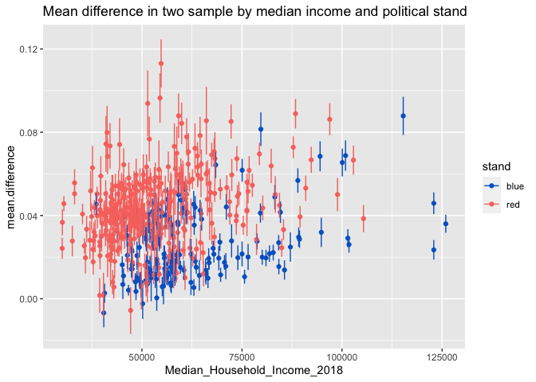<!-- -->

#### Mean difference by unemployment rate


```r
# Correlation between unemployment rate in 2019 and 
p <- ggplot_demographics_red_blue(all.pop.unemployment,
                x="Unemployment_rate_2019",
                    y="mean.difference",
                    "lower.bound",
                    "upper.bound", "stand")

p + ggtitle("Mean difference in two sample by unemployment rate and political stand")
```

<!-- -->

#### Mean difference by education level


```r
# Education
wa.education <- education %>%
  select(State,
         Area.name,
         X2013.Rural.urban.Continuum.Code, 
         Percent.of.adults.with.less.than.a.high.school.diploma..2014.18,
         Percent.of.adults.with.a.bachelor.s.degree.or.higher..2014.18)%>%
  filter(State == "WA" & Area.name !="Washington")

ny.education <- education %>%
  select(State,
         Area.name,
         X2013.Rural.urban.Continuum.Code, 
         Percent.of.adults.with.less.than.a.high.school.diploma..2014.18,
         Percent.of.adults.with.a.bachelor.s.degree.or.higher..2014.18)%>%
  filter(State == "NY" & Area.name !="New York")


tx.education <- education %>%
  select(State,
         Area.name,
         X2013.Rural.urban.Continuum.Code, 
         Percent.of.adults.with.less.than.a.high.school.diploma..2014.18,
         Percent.of.adults.with.a.bachelor.s.degree.or.higher..2014.18)%>%
  filter(State == "TX" & Area.name !="Texas")

ut.education <- education %>%
  select(State,
         Area.name,
         X2013.Rural.urban.Continuum.Code, 
         Percent.of.adults.with.less.than.a.high.school.diploma..2014.18,
         Percent.of.adults.with.a.bachelor.s.degree.or.higher..2014.18)%>%
  filter(State == "UT" & Area.name !="Utah")

nd.education <- education %>%
  select(State,
         Area.name,
         X2013.Rural.urban.Continuum.Code, 
         Percent.of.adults.with.less.than.a.high.school.diploma..2014.18,
         Percent.of.adults.with.a.bachelor.s.degree.or.higher..2014.18)%>%
  filter(State == "ND" & Area.name !="North Dakota")


colnames(ca.education)[2] <- "Area_Name"
colnames(wa.education)[2] <- "Area_Name"
colnames(ny.education)[2] <- "Area_Name"
colnames(ut.education)[2] <- "Area_Name"
colnames(tx.education)[2] <- "Area_Name"
colnames(nd.education)[2] <- "Area_Name"


# Left join the get the description

ca.pop.education <- left_join(ca.population, ca.education, by ="Area_Name")

wa.pop.education <- left_join(wa.population, wa.education, by ="Area_Name")

ny.pop.education <- left_join(ny.population, ny.education, by ="Area_Name")

ut.pop.education <- left_join(ut.population, ut.education, by ="Area_Name")

nd.pop.education <- left_join(nd.population, nd.education, by ="Area_Name")

tx.pop.education <- left_join(tx.population, tx.education, by ="Area_Name")


blue.pop.education <- rbind(ca.pop.education, ny.pop.education, wa.pop.education)

red.pop.education  <- rbind(ut.pop.education,
                            tx.pop.education,
                            nd.pop.education)

blue.pop.education$stand <- "blue"
red.pop.education$stand <- "red" 

all.pop.education <- rbind(blue.pop.education, red.pop.education)

all.pop.education$stand <- as.factor(all.pop.education$stand)

# Percentage of adult with bachelor's or higher in 2014-2018
p <- ggplot_demographics_red_blue(all.pop.education,
                x="Percent.of.adults.with.a.bachelor.s.degree.or.higher..2014.18",
                    y="mean.difference",
                    "lower.bound",
                    "upper.bound", "stand")
p +ggtitle("Mean difference in two sample by higher education and political stand")
```

```
## Warning: position_dodge requires non-overlapping x intervals
```

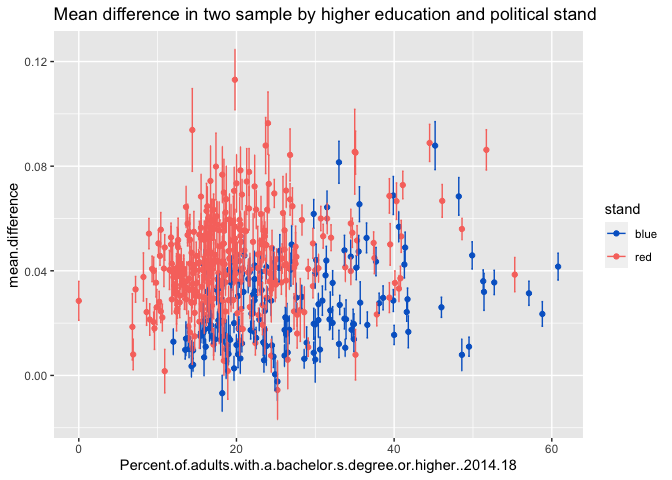<!-- -->

```r
# Percentage of adult with less.than.a.high.school.diploma in 2014-2018


p <- ggplot_demographics_red_blue(all.pop.education,
                x="Percent.of.adults.with.less.than.a.high.school.diploma..2014.18",
                    y="mean.difference",
                    "lower.bound",
                    "upper.bound", "stand")
p +ggtitle("Mean difference in two sample by lack of education and political stand")
```

```
## Warning: position_dodge requires non-overlapping x intervals
```

<!-- -->

#### Mean difference by poverty in 2018


```r
# Poverty

# We select the estimate of people of all ages in poverty 2018
ny.poverty <- poverty %>%
  select(Stabr,
         Area_name,
         Rural.urban_Continuum_Code_2013, 
         POVALL_2018,
         PCTPOVALL_2018)%>%
  filter(Stabr == "NY" & Area_name !="New York")

wa.poverty <- poverty %>%
  select(Stabr,
         Area_name,
         Rural.urban_Continuum_Code_2013, 
         POVALL_2018,
         PCTPOVALL_2018)%>%
  filter(Stabr == "WA" & Area_name !="Washington")

ut.poverty <- poverty %>%
  select(Stabr,
         Area_name,
         Rural.urban_Continuum_Code_2013, 
         POVALL_2018,
         PCTPOVALL_2018)%>%
  filter(Stabr == "UT" & Area_name !="Utah")

tx.poverty <- poverty %>%
  select(Stabr,
         Area_name,
         Rural.urban_Continuum_Code_2013, 
         POVALL_2018,
         PCTPOVALL_2018)%>%
  filter(Stabr == "TX" & Area_name !="Texas")

nd.poverty <- poverty %>%
  select(Stabr,
         Area_name,
         Rural.urban_Continuum_Code_2013, 
         POVALL_2018,
         PCTPOVALL_2018)%>%
  filter(Stabr == "ND" & Area_name !="North Dakota")


colnames(ny.poverty)[2] <- "Area_Name"
colnames(wa.poverty)[2] <- "Area_Name"
colnames(ut.poverty)[2] <- "Area_Name"
colnames(nd.poverty)[2] <- "Area_Name"
colnames(tx.poverty)[2] <- "Area_Name"


colnames(ny.poverty)[5] <- "Estimated.percent.of.people.of.all.ages.in.poverty.2018"
colnames(wa.poverty)[5] <- "Estimated.percent.of.people.of.all.ages.in.poverty.2018"
colnames(ut.poverty)[5] <- "Estimated.percent.of.people.of.all.ages.in.poverty.2018"
colnames(nd.poverty)[5] <- "Estimated.percent.of.people.of.all.ages.in.poverty.2018"
colnames(tx.poverty)[5] <- "Estimated.percent.of.people.of.all.ages.in.poverty.2018"


# Left join the get the description
ca.pop.poverty <- left_join(ca.population, ca.poverty, by ="Area_Name")
ny.pop.poverty <- left_join(ny.population, ny.poverty, by ="Area_Name")
wa.pop.poverty <- left_join(wa.population, wa.poverty, by ="Area_Name")

ut.pop.poverty <- left_join(ut.population, ut.poverty, by ="Area_Name")
nd.pop.poverty <- left_join(nd.population, nd.poverty, by ="Area_Name")
tx.pop.poverty <- left_join(tx.population, tx.poverty, by ="Area_Name")

blue.pop.poverty <- rbind(ca.pop.poverty,
                          ny.pop.poverty,
                          wa.pop.poverty)

red.pop.poverty <- rbind(ut.pop.poverty,
                         tx.pop.poverty,
                         nd.pop.poverty)

blue.pop.poverty$stand <- "blue"
red.pop.poverty$stand <- "red"

all.pop.poverty <- rbind(blue.pop.poverty,
                         red.pop.poverty)

all.pop.poverty$stand <- as.factor(all.pop.poverty$stand)

# Estimate of people of all ages in poverty 2018
p <- ggplot_demographics_red_blue(all.pop.poverty,
                x="Estimated.percent.of.people.of.all.ages.in.poverty.2018",
                    y="mean.difference",
                    "lower.bound",
                    "upper.bound", "stand")

p + ggtitle("Mean difference in two samples by poverty and political stand")
```

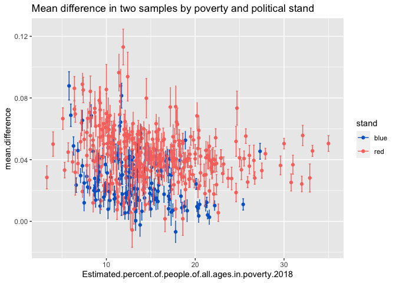<!-- -->

* For the ease of visual appearance, we can put the scatterplots all in one scatterplot matrix.


```r
all_of_demographics <- cbind(all_population,
all.pop.education$Percent.of.adults.with.less.than.a.high.school.diploma..2014.18,
all.pop.education$Percent.of.adults.with.a.bachelor.s.degree.or.higher..2014.18,
all.pop.poverty$Estimated.percent.of.people.of.all.ages.in.poverty.2018,
all.pop.unemployment$Unemployment_rate_2019,
all.pop.unemployment$Median_Household_Income_2018)

# Control color
group <- NA
group[all_of_demographics$stand=="red"] <- 1
group[all_of_demographics$stand=="blue"] <- 2

# Plot the scatterplot matrix
pairs(all_of_demographics[,c(8,11,13,14,15,16,17)],
      col=c("red","blue")[group],
      labels = c("mean.difference", 
                 "log(population)", 
                 "Per.Less.High.School",
                 "Per.Bachelor.or.more",
                 "Per.poverty",
                 "Unemployment.rate",
                 "Median.income")
      )
```

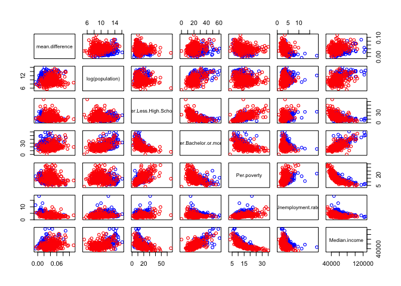<!-- -->

## Causal effects via lens of regression coefficients

Another approach to look at the effect of governemnt interventions is to look at the regression coefficients of the variables in a regression model. 


```r
# Load files 
confirmed_7dav_cumulative_prop <- read_excel("data/case_signals/ca-county-confirmed_7dav_cumulative_prop.xlsx")
 
confirmed_7dav_incidence_prop <- read_excel("data/case_signals/ca-county-confirmed_7dav_incidence_prop.xlsx")
 
deaths_7dav_cumulative_prop <- read_excel("data/case_signals/ca-county-deaths_7dav_cumulative_prop.xlsx")

deaths_7dav_incidence_prop <- read_excel("data/case_signals/ca-county-deaths_7dav_incidence_prop.xlsx")

tx.confirmed_7dav_cumulative_prop <- read_excel("data/case_signals/tx.confirmed_7dav_cumulative_prop.xlsx")

tx.confirmed_7dav_incidence_prop <- read_excel("data/case_signals/tx.confirmed_7dav_incidence_prop.xlsx")

tx.deaths_7dav_cumulative_prop <- read_excel("data/case_signals/tx.deaths_7dav_cumulative_prop.xlsx")


tx.deaths_7dav_incidence_prop <- read_excel("data/case_signals/tx.deaths_7dav_incidence_prop.xlsx")

STARTDATE <- "2020-02-20"
ENDDATE <- "2020-12-15"


fipscodes <- fips_codes%>%
  mutate(fips =paste(state_code, county_code, sep=""))

# Get counties names
ca.counties <- fipscodes%>%
  filter(state=="CA")%>% select(county)
ca.counties <- ca.counties$county

tx.counties <- fipscodes%>%
  filter(state=="TX")%>% select(county)
tx.counties <- tx.counties$county

ca.rest <- read.csv("data/ca.rest.csv",stringsAsFactors = F)

ca.chome <- read.csv("data/ca.chome.csv",stringsAsFactors = F)


tx.rest <- read.csv("data/tx.rest.csv",stringsAsFactors = F)

tx.chome <- read.csv("data/tx.chome.csv",stringsAsFactors = F)

tx.chome$time_value <- as.Date(tx.chome$time_value)
tx.rest$time_value <- as.Date(tx.rest$time_value)
ca.chome$time_value <- as.Date(ca.chome$time_value)
ca.rest$time_value <- as.Date(ca.rest$time_value)

ca.rest$geo_value <- paste("0",ca.rest$geo_value, sep="")
ca.chome$geo_value <- paste("0",ca.chome$geo_value, sep="")
tx.chome$geo_value <- as.character(tx.chome$geo_value)
tx.rest$geo_value <- as.character(tx.rest$geo_value)

# Convert the time_value to DATE
 confirmed_7dav_cumulative_prop$time_value <- as.Date(confirmed_7dav_cumulative_prop$time_value)
 
confirmed_7dav_incidence_prop$time_value <- as.Date(confirmed_7dav_incidence_prop$time_value)
 
deaths_7dav_cumulative_prop$time_value <- as.Date(deaths_7dav_cumulative_prop$time_value)
 
deaths_7dav_incidence_prop$time_value <- as.Date(deaths_7dav_incidence_prop$time_value)
# time value
tx.confirmed_7dav_cumulative_prop$time_value <- as.Date(tx.confirmed_7dav_cumulative_prop$time_value)

tx.confirmed_7dav_incidence_prop$time_value <- as.Date(tx.confirmed_7dav_incidence_prop$time_value)
 
tx.deaths_7dav_cumulative_prop$time_value <- as.Date(tx.deaths_7dav_cumulative_prop$time_value)
 
tx.deaths_7dav_incidence_prop$time_value <- as.Date(tx.deaths_7dav_incidence_prop$time_value)


# Convert the county fips codes to character

tx.confirmed_7dav_cumulative_prop$geo_value <- as.character(tx.confirmed_7dav_cumulative_prop$geo_value)
 
tx.confirmed_7dav_incidence_prop$geo_value <- as.character(tx.confirmed_7dav_incidence_prop$geo_value)
 
tx.deaths_7dav_cumulative_prop$geo_value <- as.character(tx.deaths_7dav_cumulative_prop$geo_value)
 
tx.deaths_7dav_incidence_prop$geo_value <- as.character(tx.deaths_7dav_incidence_prop$geo_value)
 


# Pad 0 to all CA data
confirmed_7dav_cumulative_prop$geo_value <- paste("0", confirmed_7dav_cumulative_prop$geo_value, sep="" )
 
confirmed_7dav_incidence_prop$geo_value <- paste("0", confirmed_7dav_incidence_prop$geo_value, sep="" )
 
deaths_7dav_cumulative_prop$geo_value <- paste("0", deaths_7dav_cumulative_prop$geo_value, sep="" )
 
deaths_7dav_incidence_prop$geo_value <- paste("0", deaths_7dav_incidence_prop$geo_value, sep="" )
 


# Policy data
policy <- load_policy()
ca.policy <- policy %>% filter(StatePostal == "ca", StateWide == 1)
tx.policy <- policy %>% filter(StatePostal == "tx", StateWide == 1)

ca.rest$county <- fips_to_name(ca.rest$geo_value)
ca.chome$county <- fips_to_name(ca.chome$geo_value)
tx.rest$county <- fips_to_name(tx.rest$geo_value)
tx.chome$county <- fips_to_name(tx.chome$geo_value)


ca.policy_signal<- getSumOfPolicy(ca.policy , STARTDATE, ENDDATE)
tx.policy_signal<- getSumOfPolicy(tx.policy , STARTDATE, ENDDATE)

# Turn the polical signal to be factors
factored.ca.policy.signal <- cbind(ca.policy_signal[1], 
                                lapply(ca.policy_signal[3:14],
                                       as.factor),
                                ca.policy_signal[15:16])


ca.holidays <- c("2019-01-01",
                 "2019-01-21",
                 "2019-02-18",
                 "2019-04-01",
                 "2019-05-27",
                 "2019-07-04",
                 "2019-09-02",
                 "2019-09-09",
                 "2019-09-27",
                 "2019-11-11",
                 "2019-11-28",
                 "2019-12-25",
                 "2020-01-01", 
                 "2020-01-20",
                 "2020-02-17",
                 "2020-03-31",
                 "2020-05-25",
                 "2020-07-03",
                 "2020-09-07",
                 "2020-09-09",
                 "2020-09-25",
                 "2020-11-11",
                 "2020-11-26",
                 "2020-12-25",
                 "2021-01-01",
                 "2021-01-18")
tx.holidays <- c("2019-01-01",
                 "2019-01-19",
                 "2019-01-21",
                 "2019-02-18",
                 "2019-03-02",
                 "2019-03-31",
                 "2019-04-19",
                 "2019-04-21",
                 "2019-05-27",
                 "2019-06-19",
                 "2019-07-04",
                 "2019-09-02",
                 "2019-11-11",
                 "2019-11-28",
                 "2019-12-24",
                 "2019-12-25",
                 "2019-12-26",
                 "2020-01-01",
                 "2020-01-19",
                 "2020-01-20",
                 "2020-02-17",
                 "2020-03-02",
                 "2020-03-21",
                 "2020-04-10",
                 "2020-04-21",
                 "2020-05-25",
                 "2020-06-19",
                 "2020-07-03",
                 "2020-09-07",
                 "2020-11-11",
                 "2020-11-26",
                 "2020-12-24",
                 "2020-12-25",
                 "2020-12-26")

# May through October is wildfire season
ca.wildfire_seasons <- seq(as.Date("2020-05-01"), as.Date("2020-10-31"), 1)

tx.wildfire_seasons <- seq(as.Date("2020-03-01"), as.Date("2020-05-31"), 1)

# airquality

ca.air.2019 <- read.csv("data/air.quality/ad_viz_plotval_data_pm2.5_2019.csv")

ca.air.2020 <- read.csv("data/air.quality/ad_viz_plotval_data_pm2.5_2020.csv")

ca.air.2021 <- read.csv("data/air.quality/ad_viz_plotval_data_pm2.5_2021.csv")


tx.air.2019 <- read.csv("data/air.quality/ad_viz_plotval_data_tx_2019.csv")

tx.air.2020 <- read.csv("data/air.quality/ad_viz_plotval_data_tx_2020.csv")

tx.air.2021 <- read.csv("data/air.quality/ad_viz_plotval_data_tx_2021.csv")

ca.air <- rbind(ca.air.2019, ca.air.2020, ca.air.2021)
tx.air <- rbind(tx.air.2019, tx.air.2020, tx.air.2021)
sel_col <- c("Date", "DAILY_AQI_VALUE","COUNTY")
ca.air <- ca.air[sel_col]
tx.air <- tx.air[sel_col]
# Change the date format
ca.air$Date <- as.Date(format(strptime(as.character(ca.air$Date), "%m/%d/%Y"), "%Y-%m-%d"))

tx.air$Date <- as.Date(format(strptime(as.character(tx.air$Date), "%m/%d/%Y"), "%Y-%m-%d"))

ca.air$COUNTY <- paste(ca.air$COUNTY, "County", sep=" ")
tx.air$COUNTY <- paste(tx.air$COUNTY, "County", sep=" ")
ca.air$DAILY_AQI_VALUE <- as.numeric(ca.air$DAILY_AQI_VALUE)
tx.air$DAILY_AQI_VALUE <- as.numeric(tx.air$DAILY_AQI_VALUE)


colnames(ca.air)[1] <- "time_value"
colnames(ca.air)[3] <- "county"

colnames(tx.air)[1] <- "time_value"
colnames(tx.air)[3] <- "county"

# Take the median AQI
ca.median_aqi <- ca.air %>%
  group_by(county, time_value)%>%
  summarize(median_AQI = median(DAILY_AQI_VALUE))

tx.median_aqi<- tx.air %>%
  group_by(county, time_value)%>%
  summarize(median_AQI = median(DAILY_AQI_VALUE))
```


```r
################ getForwardDays () ###################
# compute the number of days within a given day range that
# gives the highest spearman correlation between df1 and df2

# argument
# df1: a dataframe 
# df2: a dataframe that the data needs to be forwarded
# dt_vec: a vector contains a range of integers

getForwardDays <- function(df1, df2, dt_vec){
  # Empty list
  df_list <- vector("list", length(dt_vec))
  
  for (i in 1:length(dt_vec)) {
    df_list[[i]] <- covidcast_cor(df1, df2, dt_y = dt_vec[i],
                                  by = "geo_value", 
                                  method="spearman")

    df_list[[i]]$dt <- dt_vec[i]
  }
  
  # Stack into one big data frame
  df <- do.call(rbind, df_list)
  

  return(df)
}

################ joinConfounder() ###################

joinConfounder <- function(mobility.df, policy.df, state="ca"){
  if(state=="ca"){
    # Combine case and mobility
  cum.confirmed.case <- confirmed_7dav_cumulative_prop[c("time_value","geo_value","value")]
  new.confirmed.case <- confirmed_7dav_incidence_prop[c("time_value","geo_value","value")]
  cum.death.case <- deaths_7dav_cumulative_prop[c("time_value","geo_value","value")]
  new.death.case <- deaths_7dav_incidence_prop[c("time_value","geo_value","value")]
  }else{
    # Combine case and mobility
    cum.confirmed.case <- tx.confirmed_7dav_cumulative_prop[c("time_value","geo_value","value")]
  new.confirmed.case <- tx.confirmed_7dav_incidence_prop[c("time_value","geo_value","value")]
  cum.death.case <- tx.deaths_7dav_cumulative_prop[c("time_value","geo_value","value")]
  new.death.case <- tx.deaths_7dav_incidence_prop[c("time_value","geo_value","value")]
  }

  colnames(cum.confirmed.case)[3] <- "confirmed_7dav_cumulative_prop"
  colnames(new.confirmed.case)[3] <- "confirmed_7dav_incidence_prop"
  colnames(cum.death.case)[3] <- "deaths_7dav_cumulative_prop"
  colnames(new.death.case)[3] <- "deaths_7dav_incidence_prop"
  
  # A list of confounders
  confounders <- list(cum.confirmed.case, 
                      new.confirmed.case, 
                      cum.death.case,
                      new.death.case)
  
  # Left join again with all other potential confounders
  for (confounder in confounders){
    mobility.df <- left_join(mobility.df, confounder, by=c("time_value", "geo_value"))
  }

  # combine with policy signal
  mobility.df <- left_join(mobility.df, policy.df, by=c("time_value"))
  
  if(state=="ca"){
    mobility.df <- left_join(mobility.df, ca.median_aqi, by=c("time_value", "county"))
  }else{
    mobility.df <- left_join(mobility.df, tx.median_aqi, by=c("time_value", "county"))
  }
  return(mobility.df)

}

################ prepDF() ###################

prepDF <- function(mobility.df, 
                     policy, 
                     states,
                     interventions,
                     fips_codes,
                     forward=F){
  
  # Convert to lower case
  lowerStates <- tolower(states)
  
  # filter policy
  policy.df <- policy %>% filter(StatePostal%in%lowerStates, StateWide == 1)
  
  policy.df <- getSumOfPolicy(policy.df, STARTDATE, ENDDATE)
  
  # convert to factor
  policy.df[interventions] <- lapply(policy.df[interventions], as.factor)

  # join the mobility and policy 
  df<- joinConfounder(mobility.df, policy.df, state = lowerStates)
  
  # Change the value name for fitting regression model
  colnames(df)[colnames(df)=="value"] <- unique(mobility.df$signal)
  return(df)
}

############ plot_bar() ###################

plot_bar <- function(df,
                     x,
                     y,
                     lower.bound,
                     upper.bound,
                     gp,
                     name){
  p<- ggplot(df, aes_string(x=x, y=y, group=gp, color=gp)) + 
  #geom_line() +
  geom_point()+
  geom_errorbar(aes_string(xmin=lower.bound, xmax=upper.bound), width=.2,
                 position=position_dodge(0.05))+
    ggtitle(name)
      
  return(p)
}
```


### Model:

We will utilize the following model:

$$Y_t = \beta_{0}+ \sum_{i}\beta_{i}S_{i_{t}} + \sum_{k}\beta_{k}P_{k_{t}}$$

* $Y_t$ : mobility signal of interests at time $t$

* $S_{i_{t}}$ : all case count signals (daily confirmed case count per 100,000 population, cumulative confirmed case count per 100,00 population, daily death case count per 100,000 population, cumulative death case count per 100,00 population) at time $t$

* $P_{k_{t}}$ : all intervention as indicator variables


We will use two mobility signals ``completely_staying_home_prop`` and ``restaurant_visit_prop`` because it would be more appropriate to reflect peronal choice via these mobility signals as compared to ``full_time_work_prop``. 

### Completely stay at home: CA

Let's continue with our previous example, San Mateo county. Having accounted for the case count signals, we can see that school closure and bar restriction increase the staying home signal. We have to be careful to interpret the coefficient for business mask. We know that business masks wouldn't cause people to leave home, rather, it depends on the jobs that people have. 


```r
interventions <- c("EmergDec",
                   "GathRestrict",
                   "SchoolClose",
                   "BarRestrict",
                   "PublicMask",
                   "OtherBusinessClose",
                   "BusinessMask",
                   "SchoolMask",
                   "Quarantine")

confounders.names <- c("confirmed_7dav_cumulative_prop",
                  "confirmed_7dav_incidence_prop",
                  "deaths_7dav_cumulative_prop",
                  "deaths_7dav_incidence_prop")

mobility.name <- "completely_home_prop"

formula1 <- as.formula(paste(mobility.name, paste(c(confounders.names, interventions ), collapse=" + "), sep=" ~ "))

ca.stayhome <- prepDF(ca.chome, 
          policy, 
          states="CA",
          interventions,
          fips_codes)

# weekends filter
#ca.stayhome <- ca.stayhome%>% 
#      mutate(weekday= weekdays(as.Date(time_value)))%>% 
#      mutate(weekend= as.factor(ifelse(weekday %in% c("Saturday", "Sunday"), 1, 0)),
#             holiday = as.factor(ifelse(as.Date(time_value) %in% as.Date(ca.holidays), 1, 0)),
#             wildfire= as.factor(ifelse(as.Date(time_value) %in% as.Date(ca.wildfire_seasons), 1, 0)))


#interventions <- c("EmergDec","GathRestrict","SchoolClose","BarRestrict","PublicMask","OtherBusinessClose","BusinessMask", "SchoolMask" ,"Quarantine")

#formula1 <- as.formula(paste(mobility.name, paste(c(confounders.names, interventions ), collapse=" + "), sep=" ~ "))


# Filter the fips codes
filtered_fips <- fipscodes %>%filter(state %in% "CA")
ls <- list()
count <- 1
for(code in filtered_fips$fips){
  p <- ca.stayhome %>% filter(geo_value.x==code) %>%
    lm(formula1,data=.)
    ls[[count]] <- p 
  count <- count + 1 
  #print(fips_to_name(code))
  #print(summary(p))
}

# print out San Meteo County
print(ca.counties[41])
```

```
## [1] "San Mateo County"
```

```r
print(summary(ls[[41]]))
```

```
## 
## Call:
## lm(formula = formula1, data = .)
## 
## Residuals:
##       Min        1Q    Median        3Q       Max 
## -0.068026 -0.018471  0.001432  0.017718  0.134957 
## 
## Coefficients:
##                                  Estimate Std. Error t value Pr(>|t|)    
## (Intercept)                     2.149e-01  7.469e-03  28.779  < 2e-16 ***
## confirmed_7dav_cumulative_prop  5.067e-05  1.723e-05   2.941  0.00354 ** 
## confirmed_7dav_incidence_prop   1.158e-03  4.320e-04   2.680  0.00779 ** 
## deaths_7dav_cumulative_prop    -1.199e-02  2.150e-03  -5.579 5.62e-08 ***
## deaths_7dav_incidence_prop      9.321e-03  3.814e-02   0.244  0.80708    
## EmergDec1                       3.382e-03  1.294e-02   0.261  0.79393    
## GathRestrict1                   2.106e-02  2.241e-02   0.940  0.34809    
## SchoolClose1                    1.711e-01  2.283e-02   7.495 8.33e-13 ***
## BarRestrict1                    6.997e-02  1.393e-02   5.022 9.00e-07 ***
## PublicMask1                     5.032e-02  1.167e-02   4.310 2.25e-05 ***
## OtherBusinessClose1             1.203e-02  1.172e-02   1.026  0.30553    
## BusinessMask1                  -2.766e-02  1.097e-02  -2.522  0.01220 *  
## SchoolMask1                    -1.132e-02  7.794e-03  -1.452  0.14749    
## Quarantine1                    -6.177e-04  9.756e-03  -0.063  0.94956    
## ---
## Signif. codes:  0 '***' 0.001 '**' 0.01 '*' 0.05 '.' 0.1 ' ' 1
## 
## Residual standard error: 0.02795 on 286 degrees of freedom
## Multiple R-squared:  0.8705,	Adjusted R-squared:  0.8646 
## F-statistic: 147.9 on 13 and 286 DF,  p-value: < 2.2e-16
```

### Completely stay at home: TX

We can also look at another urban county located in Texas to compare with San Mateo county. We can see that gathering restriction has the largest positive effect on increasing staying home signal. 


```r
interventions <- c("EmergDec",
                   "GathRestrict",
                   "SchoolClose",
                   "BarRestrict",
                   "PublicMask",
                   "OtherBusinessClose",
                   "Quarantine",
                   "StayAtHome")

mobility.name <- "completely_home_prop"

confounders.names <- c("confirmed_7dav_cumulative_prop",
                  "confirmed_7dav_incidence_prop",
                  "deaths_7dav_cumulative_prop",
                  "deaths_7dav_incidence_prop")

txformula <- as.formula(paste(mobility.name, paste(c(confounders.names, interventions), collapse=" + "), sep=" ~ "))

tx.stayhome <- prepDF(tx.chome, 
          policy, 
          states="TX",
          interventions,
          fips_codes)

# weekends filter
#tx.stayhome <- tx.stayhome%>% 
#      mutate(weekday= weekdays(as.Date(time_value)))%>% 
#      mutate(weekend= as.factor(ifelse(weekday %in% c("Saturday", "Sunday"), 1, 0)),
#             holiday = as.factor(ifelse(as.Date(time_value) %in% as.Date(tx.holidays), 1, 0)),
#             wildfire = as.factor(ifelse(as.Date(time_value) %in% as.Date(tx.wildfire_seasons), 1, 0)))


# interventions <- c("EmergDec",
#                    "GathRestrict",
#                    "SchoolClose",
#                    "BarRestrict",
#                    "PublicMask",
#                    "OtherBusinessClose",
#                    "Quarantine",
#                    "StayAtHome",
#                    "weekend",
#                    "holiday")
# 
# txformula <- as.formula(paste(mobility.name, paste(c(confounders.names, interventions), collapse=" + "), sep=" ~ "))


txls <- list()
count <- 1
# Filter the fips codes
tx_fips <- fipscodes %>%filter(state %in% "TX")
for(code in tx_fips$fips){
  p <- tx.stayhome %>% filter(geo_value.x==code) %>%
    lm(txformula,data=.)
  
  txls[[count]] <- p
  count <- count + 1
  #print(fips_to_name(code))
  #print(summary(p))
}


print(tx.counties[8])
```

```
## [1] "Austin County"
```

```r
print(summary(txls[[8]]))
```

```
## 
## Call:
## lm(formula = txformula, data = .)
## 
## Residuals:
##       Min        1Q    Median        3Q       Max 
## -0.077330 -0.022365 -0.006667  0.012340  0.140680 
## 
## Coefficients: (1 not defined because of singularities)
##                                  Estimate Std. Error t value Pr(>|t|)    
## (Intercept)                     1.972e-01  7.401e-03  26.643  < 2e-16 ***
## confirmed_7dav_cumulative_prop -4.701e-05  2.413e-05  -1.948 0.052332 .  
## confirmed_7dav_incidence_prop   8.835e-04  2.997e-04   2.948 0.003461 ** 
## deaths_7dav_cumulative_prop     5.817e-04  1.033e-03   0.563 0.573944    
## deaths_7dav_incidence_prop     -7.522e-03  7.479e-03  -1.006 0.315415    
## EmergDec1                       5.947e-02  1.532e-02   3.881 0.000129 ***
## GathRestrict1                   1.514e-01  3.958e-02   3.825 0.000160 ***
## SchoolClose1                   -5.131e-03  1.124e-02  -0.456 0.648459    
## BarRestrict1                   -1.086e-01  3.695e-02  -2.940 0.003543 ** 
## PublicMask1                    -3.977e-02  1.021e-02  -3.893 0.000123 ***
## OtherBusinessClose1                    NA         NA      NA       NA    
## Quarantine1                     6.839e-03  8.956e-03   0.764 0.445751    
## StayAtHome1                     3.911e-02  1.110e-02   3.524 0.000494 ***
## ---
## Signif. codes:  0 '***' 0.001 '**' 0.01 '*' 0.05 '.' 0.1 ' ' 1
## 
## Residual standard error: 0.0355 on 288 degrees of freedom
## Multiple R-squared:  0.6106,	Adjusted R-squared:  0.5957 
## F-statistic: 41.05 on 11 and 288 DF,  p-value: < 2.2e-16
```

### Restaurant visit: CA


```r
interventions <- c("EmergDec",
                   "GathRestrict",
                   "SchoolClose",
                   "BarRestrict",
                   "PublicMask",
                   "OtherBusinessClose",
                   "BusinessMask",
                   "SchoolMask",
                   "Quarantine")

confounders.names <- c("confirmed_7dav_cumulative_prop",
                  "confirmed_7dav_incidence_prop",
                  "deaths_7dav_cumulative_prop",
                  "deaths_7dav_incidence_prop")

mobility.name <- "restaurants_visit_prop"


formula2 <- as.formula(paste(mobility.name, paste(c(confounders.names, interventions ), collapse=" + "), sep=" ~ "))

# CA restaurant visit
ca.restvisit <- prepDF(ca.rest, 
          policy, 
          states="CA",
          interventions,
          fips_codes)


# # weekends filter
# ca.restvisit <- ca.restvisit%>% 
#       mutate(weekday= weekdays(as.Date(time_value)))%>% 
#       mutate(weekend= as.factor(ifelse(weekday %in% c("Saturday", "Sunday"), 1, 0)),
#              holiday = as.factor(ifelse(as.Date(time_value) %in% as.Date(ca.holidays), 1, 0)))
# 
# 
# interventions <- c("EmergDec",
#                    "GathRestrict",
#                    "SchoolClose",
#                    "BarRestrict",
#                    "PublicMask",
#                    "OtherBusinessClose",
#                    "BusinessMask",
#                    "SchoolMask",
#                    "Quarantine",
#                    "weekend",
#                    "holiday")

formula2 <- as.formula(paste(mobility.name, paste(c(confounders.names, interventions ), collapse=" + "), sep=" ~ "))


# Filter the fips codes
filtered_fips <- fipscodes %>%filter(state %in% "CA")
ca.restls <- list()
ca.counties_filtered <- NULL
count <- 1
for(code in filtered_fips$fips){
  if(code %in% unique(ca.restvisit$geo_value.x)){
    p <- ca.restvisit %>% filter(geo_value.x==code) %>%
    lm(formula2,data=.)
    ca.restls[[count]] <- p
    countyname <- fips_to_name(code)
    ca.counties_filtered[count] <- countyname
    count <- count + 1 
    #print(countyname)
    #print(summary(p))
  }
}

# Show all results for county level mobility
#counter <- 1
#temp <- fips_to_name(unique(ca.restvisit$geo_value.x))
#for (i in ca.restls){
#  print(temp[counter])
#  print(summary(i))
#  counter <- counter + 1
#}

# print out San Meteo County
print(ca.counties[41])
```

```
## [1] "San Mateo County"
```

```r
print(summary(ca.restls[[41]]))
```

```
## 
## Call:
## lm(formula = formula2, data = .)
## 
## Residuals:
##     Min      1Q  Median      3Q     Max 
## -73.988  -6.458  -1.214   6.117  62.747 
## 
## Coefficients:
##                                 Estimate Std. Error t value Pr(>|t|)    
## (Intercept)                    154.68201    3.75586  41.184  < 2e-16 ***
## confirmed_7dav_cumulative_prop  -0.01655    0.01340  -1.235  0.21787    
## confirmed_7dav_incidence_prop   -0.22022    0.19502  -1.129  0.25976    
## deaths_7dav_cumulative_prop      1.98270    0.92070   2.153  0.03212 *  
## deaths_7dav_incidence_prop      -8.27285   26.29140  -0.315  0.75325    
## EmergDec1                      -15.34375    6.50558  -2.359  0.01902 *  
## GathRestrict1                  -17.00931   11.26284  -1.510  0.13210    
## SchoolClose1                   -61.82044   11.47558  -5.387 1.50e-07 ***
## BarRestrict1                   -32.58438    7.14287  -4.562 7.55e-06 ***
## PublicMask1                     -1.42295    5.09276  -0.279  0.78014    
## OtherBusinessClose1              2.02292    4.95532   0.408  0.68341    
## BusinessMask1                   12.69178    3.94449   3.218  0.00144 ** 
## SchoolMask1                     12.34345    4.17960   2.953  0.00341 ** 
## Quarantine1                     -9.18424    5.51127  -1.666  0.09673 .  
## ---
## Signif. codes:  0 '***' 0.001 '**' 0.01 '*' 0.05 '.' 0.1 ' ' 1
## 
## Residual standard error: 14.05 on 284 degrees of freedom
## Multiple R-squared:  0.8098,	Adjusted R-squared:  0.8011 
## F-statistic:    93 on 13 and 284 DF,  p-value: < 2.2e-16
```


### Restaurant Visit: TX


```r
interventions <- c("EmergDec",
                   "GathRestrict",
                   "SchoolClose",
                   "BarRestrict",
                   "PublicMask",
                   "OtherBusinessClose",
                   "Quarantine")

confounders.names <- c("confirmed_7dav_cumulative_prop",
                  "confirmed_7dav_incidence_prop",
                  "deaths_7dav_cumulative_prop",
                  "deaths_7dav_incidence_prop")

mobility.name <- "restaurants_visit_prop"


formula2 <- as.formula(paste(mobility.name, paste(c(confounders.names, interventions ), collapse=" + "), sep=" ~ "))

# TX restaurant visit
tx.restvisit <- prepDF(tx.rest, 
          policy, 
          states="TX",
          interventions,
          fips_codes)


# weekends filter
# tx.restvisit <- tx.restvisit%>% 
#       mutate(weekday= weekdays(as.Date(time_value)))%>% 
#       mutate(weekend= as.factor(ifelse(weekday %in% c("Saturday", "Sunday"), 1, 0)),
#              holiday = as.factor(ifelse(as.Date(time_value) %in% as.Date(tx.holidays), 1, 0)))
# 
# interventions <- c("EmergDec",
#                    "GathRestrict",
#                    "SchoolClose",
#                    "BarRestrict",
#                    "PublicMask",
#                    "OtherBusinessClose",
#                    "Quarantine",
#                    "weekend",
#                    "holiday")
# formula2 <- as.formula(paste(mobility.name, paste(c(confounders.names, interventions ), collapse=" + "), sep=" ~ "))

# Filter the fips codes
filtered_fips <- fipscodes %>%filter(state %in% "TX")
tx.restls <- list()
count <- 1
tx.counties.filtered <- NULL
exclude_ls <- c("48391") # exclude this county due to lack of data
for(code in filtered_fips$fips){
  if(code %in% unique(tx.restvisit$geo_value.x) & !(code %in% exclude_ls)){
    p <- tx.restvisit %>% filter(geo_value.x==code) %>%
      lm(formula2,data=.)
    tx.restls[[count]] <- p
    countyname <- fips_to_name(code)
    tx.counties.filtered[count] <- countyname
    count <- count + 1
    # print all the information
    #print(countyname)
    #print(summary(p))
  }
}
```

## Rank of the effectiveness of the intervention

We can plot out all the regression coefficients and visually compare which intervention seems to be more effective in increasing staying home signal or restaurant visit. 


### CA: Urban counties, signal home signal


```r
select_col <- c("EmergDec1","GathRestrict1","SchoolClose1","BarRestrict1","PublicMask1","OtherBusinessClose1","BusinessMask1", "SchoolMask1" ,"Quarantine1")
plist <- list()
count <- 1

for(i in 1:length(ls)){
  # Same the summary
  lm.fit <- summary(ls[[i]])
  name <- c("EmergDec","GathRestrict","SchoolClose","BarRestrict","PublicMask","OtherBusinessClose","BusinessMask", "SchoolMask" ,"Quarantine")
  df <- data.frame(fit= lm.fit$coefficients[select_col,1], interventions=name)
revised_df <- cbind(df,confint(ls[[i]])[select_col,])
  colnames(revised_df)[3] <- "LCI"
  colnames(revised_df)[4] <- "UCI"
  
  p <- plot_bar(revised_df,
                "fit",
                "interventions",
                "LCI",
                "UCI",
                "fit",
                ca.counties[i]) 
  plist[[count]] <- p
  count <- count + 1
}

  
# Plot all counties mobility signal
#n <- length(plist[c(2,19,41,53)])
#nCol <- floor(sqrt(n))
#do.call("grid.arrange", c(plist[c(2,19,41,53)], ncol=nCol))

idx <- which(ca.counties %in% c("Orange County", "Santa Clara County", "Alameda County", "Yolo County", "Marin County", "San Bernardino County"))

# Urban counties
do.call("grid.arrange", c(plist[idx], ncol=2))
```

<!-- -->

### CA: Rural counties, signal home signal


```r
# select counties
idx <- which(ca.counties %in% c("Humboldt County", "Siskiyou County", "Del Norte County", "Mono County", "Plumas County", "Glenn County"))
# Rural counties
do.call("grid.arrange", c(plist[idx], ncol=2))
```

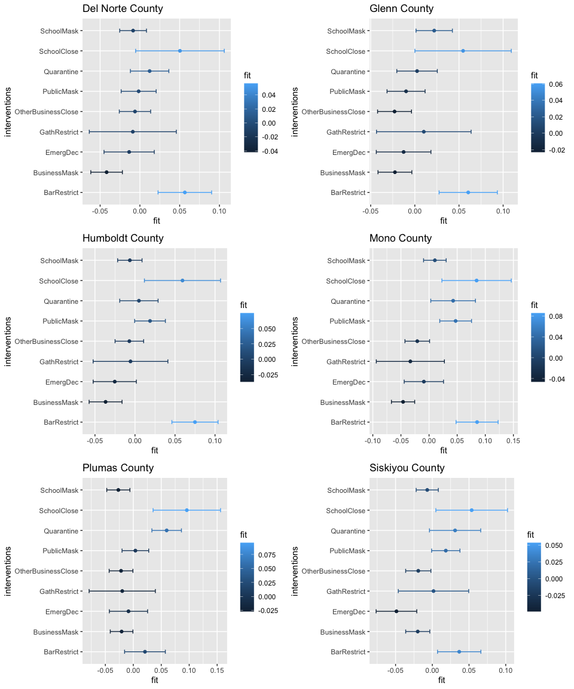<!-- -->


### TX: Urban counties, signal home signal


```r
select_col <- c("EmergDec1","GathRestrict1","SchoolClose1","BarRestrict1","PublicMask1","Quarantine1","StayAtHome1")

plist <- list()
count <- 1
for(i in 1:length(txls)){
  # Same the summary
  lm.fit <- summary(txls[[i]])
  name <- c("EmergDec","GathRestrict","SchoolClose","BarRestrict","PublicMask","Quarantine","StayAtHome")
  df <- data.frame(fit= lm.fit$coefficients[select_col,1], interventions=name)
revised_df <- cbind(df,confint(txls[[i]])[select_col,])
  colnames(revised_df)[3] <- "LCI"
  colnames(revised_df)[4] <- "UCI"
  
  p <- plot_bar(revised_df,
                "fit",
                "interventions",
                "LCI",
                "UCI",
                "fit",
                tx.counties[i]) 
  plist[[count]] <- p
  count <- count + 1
}

# Plot all counties mobility signal
#nCol <- 1
#for(i in 1:length(plist)){
#  do.call("grid.arrange", c(plist[i], ncol=nCol))
#}


# Urban counties
idx <- which(fips_to_name(unique(tx.stayhome$geo_value.x)) %in% c("Chambers County","Hardin County"  ,"Harris County", "Fort Bend County","Liberty County","Austin County"))

do.call("grid.arrange", c(plist[idx], ncol=2))
```

<!-- -->

### TX: Rural counties, signal home signal


```r
# Rural counties

idx <- which(fips_to_name(unique(tx.stayhome$geo_value.x)) %in%  c("Anderson County", "Andrews County", "Angelina County", "Somervell County", "Pecos County", "Ward County"))

do.call("grid.arrange", c(plist[idx], ncol=2))
```

<!-- -->


### CA: Urban counties, restaurant visit 


```r
select_col <- c("EmergDec1","GathRestrict1","SchoolClose1","BarRestrict1","PublicMask1","OtherBusinessClose1","BusinessMask1", "SchoolMask1" ,"Quarantine1")

plist <- list()
count <- 1
for(i in 1:length(ca.restls)){
  if(ca.counties_filtered[[i]]=="Sierra County"){
    next
  }
  # Same the summary
  lm.fit <- summary(ca.restls[[i]])
  name <- c("EmergDec","GathRestrict","SchoolClose","BarRestrict","PublicMask"        ,"OtherBusinessClose","BusinessMask", "SchoolMask" ,"Quarantine")
  df <- data.frame(fit= lm.fit$coefficients[select_col,1], interventions=name)
revised_df <- cbind(df,confint(ca.restls[[i]])[select_col,])
  colnames(revised_df)[3] <- "LCI"
  colnames(revised_df)[4] <- "UCI"
  
  p <- plot_bar(revised_df,
                "fit",
                "interventions",
                "LCI",
                "UCI",
                "fit",
                ca.counties_filtered[i]) 
  plist[[count]] <- p
  count <- count + 1
}

# Plot all counties mobility signal
#nCol <- 1
#for(i in 1:length(plist)){
#  do.call("grid.arrange", c(plist[i], ncol=nCol))
#}

idx <- which(fips_to_name(unique(ca.restvisit$geo_value.x)) %in% c("Orange County", "Santa Clara County", "Alameda County", "Yolo County", "Marin County", "San Bernardino County"))

# Urban counties
do.call("grid.arrange", c(plist[idx], ncol=2))
```

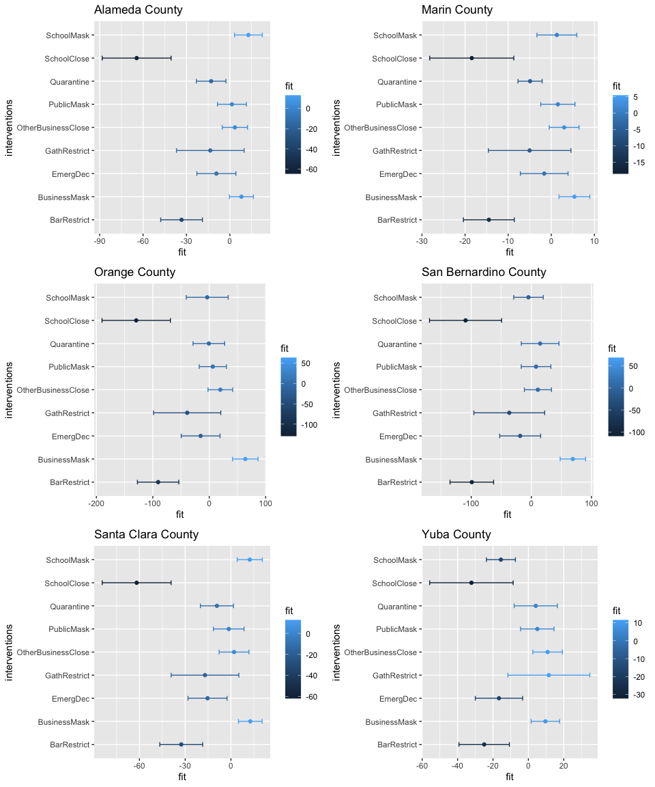<!-- -->

### CA: Rural counties, restaurant visit


```r
# select counties
idx <-which(fips_to_name(unique(ca.restvisit$geo_value.x)) %in% c("Humboldt County", "Siskiyou County", "Del Norte County", "Mono County", "Plumas County", "Glenn County"))
# Rural counties
do.call("grid.arrange", c(plist[idx], ncol=2))
```

<!-- -->

### TX: Urban counties, restaurant visit


```r
select_col <- c("EmergDec1","GathRestrict1","SchoolClose1","BarRestrict1","PublicMask1","Quarantine1")

plist <- list()
count <- 1
for(i in 1:length(tx.restls)){
  # Same the summary
  lm.fit <- summary(tx.restls[[i]])
  name <- c("EmergDec","GathRestrict","SchoolClose","BarRestrict","PublicMask","Quarantine")
  df <- data.frame(fit= lm.fit$coefficients[select_col,1], interventions=name)
revised_df <- cbind(df,confint(tx.restls[[i]])[select_col,])
  colnames(revised_df)[3] <- "LCI"
  colnames(revised_df)[4] <- "UCI"
  
  p <- plot_bar(revised_df,
                "fit",
                "interventions",
                "LCI",
                "UCI",
                "fit",
                tx.counties.filtered[i]) 
  plist[[count]] <- p
  count <- count + 1
}

# Plot all counties mobility signal
#nCol <- 1
#for(i in 1:length(plist)){
#  do.call("grid.arrange", c(plist[i], ncol=nCol))
#}

# Urban counties
idx <- which(tx.counties.filtered %in% c("Chambers County","Hardin County"  ,"Harris County", "Fort Bend County","Liberty County","Austin County"))
do.call("grid.arrange", c(plist[idx], ncol=2))
```

<!-- -->

### TX: Rural counties, restaurant visit


```r
# Rural counties

idx <- which(tx.counties.filtered %in% c("Anderson County", "Andrews County", "Angelina County", "Somervell County", "Pecos County", "Ward County"))
do.call("grid.arrange", c(plist[idx], ncol=2))
```

<!-- -->


# Conclusion

This work has shown a way to estimate the effect of the emergency declaration on mobility during the pandemic. The mandatory COVID19 policies tend to be more effective on the areas that have large population, small percent of people in poverty, high percent of people with education backgrounds, low unemployment rate. 

In general, having accounted for the case count signals, government interventions are more effective to increase staying at home signal. Bar restriction and school clousure seem to have a greater effect to increase staying at home signal among all other interventions in California. Other interventions, in contrary, reduce stay at home signal in California. The effects of the interventions vary across counties. On the other hand, emergency declaration increases the stay home signal in some counties of Texas. Also, in general, public mask reduces stay at home signal in Texas. 

Also, we see that wearing masks may help increase restaurant visit. For example, business mask seems to stimulate the increase of the restaurant visit. Moreover, public masks increases the number of restaurant visit in most of the counties in California.

We rank the effectiveness of the intervention on mobility in terms of the regression coefficient in a multiple regression setting. We leave characterization for the ranks of the effect of intervention on county-level as a future work. Other regression methods such as non-parametric regression should also be used for further study.

There are multiple challenges that we will leave as future work:

* *Handling confounding signals* : Further study on the relationship between the confounding variables such as cases signals (e.g. number of death cases) and the effect of intervention is needed. Also, we need to disentangle the effect of multiple concurrent policies. For example, we need to account for the confounding effect of the mandatory policies for evaluating the effect of the advisory policies.

* *Increasing the granularity of the data* : we need to collect more data about county-level intervention to measure the start dates and end dates of the policies more accurately. 

* *Investigating other mobility signals* : we can examine other mobility signals available in the Dephi API.


# Appendix

## Data Source

* The mobility signals are from Safegraph and preprocessed by [Delphi Epidata API](https://cmu-delphi.github.io/delphi-epidata/api/covidcast-signals/safegraph.html). 

* The state level policy data is from University of Washington's [State-level social distancing policies](https://github.com/COVID19StatePolicy/SocialDistancing) as we will use it in model building. For the definition of the policy, please refer to the [codebooks](https://github.com/COVID19StatePolicy/SocialDistancing/blob/master/codebooks/State%20COVID-19%20policy%20documentation%2C%20Fall%202020.pdf).

* [County-level Demographics](https://www.ers.usda.gov/data-products/county-level-data-sets/download-data/) 

* [Crowdsourced County-level intervention data](https://socialdistancing.stanford.edu/)

