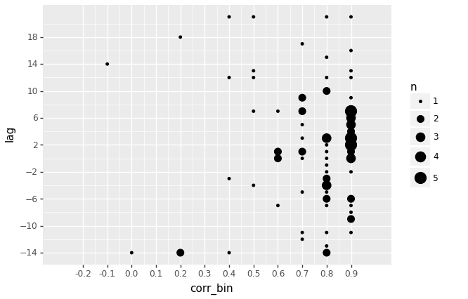
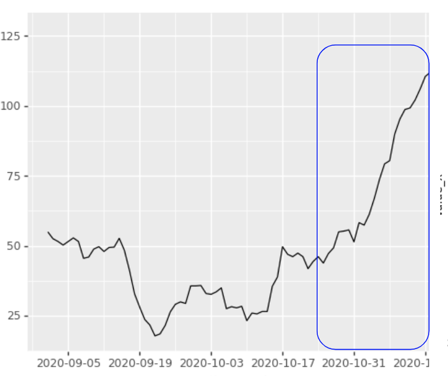
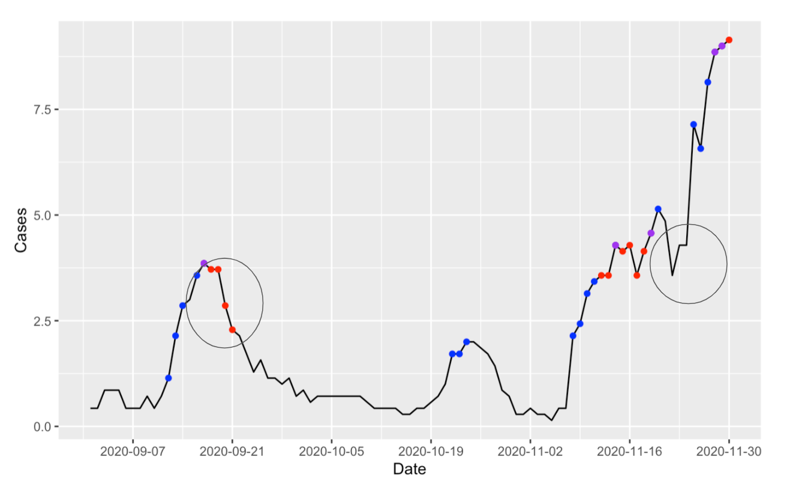

```{r, echo=FALSE, results='hide', message=FALSE, warning=FALSE}	
source("LeadingIndicatorTools.R")
library(covidcast)
library(magrittr)
library(tidyverse)
library(assertthat)
library(lubridate)
library(gridExtra)
library(dplyr)
library(cowplot)
library(ggpubr)
library(patchwork)
```

## Motivation
Throughout the COVID-19 pandemic, the U.S. has seen multiple “waves” of increases in case incidence numbers, occurring at different times in different areas of the country, and with even greater variation on the state and county level. It has been difficult not only for public health officials and other policy makers to anticipate when case incidences might rise in their area, but also for researchers who are forecasting the pandemic to accurately predict future case numbers. Part of the challenge in guiding decision making has been understanding how to leverage the combination of mobility, public health, and survey signals to capture the complex dynamics and transmission of COVID-19. 

Our directive for this project specifically instructed us to analyze Delphi’s signals as potential leading indicators of significant rises in cases at the county level across multiple distinct periods of time. The goal is to provide greater insight into the value of Delphi’s signals in predicting future increases in cases. 

## Methodology

<details>
<summary>**Initial exploration: Cross Correlation**</summary>

Our first approach to this DAP looked at the relationship between the indicator and the signal more generally. We first used cross correlation analysis on the time series to identify the relationship between indicators and cases across a time period. For two time series $y, x \in \mathbb{R}^T$, cross-correlation is defined as: 

$$\max_{i} Corr(y_{i+1,\cdots, T}, x_{1, \cdots, T-i}),$$
and measures the maximum Pearson correlation between the two as a result of lagging one by the amount of $i$.

We calculated the cross-correlation and the optimal lag in each county. An example of this data over all observed counties for the Drs Visits indicator signal:

An example of this data over all observed counties for the Drs Visits indicator signal: 

This exploratory analysis hints at a predictive relationship; that indicators, observed in advance, can have high correlation with case counts. However, this is a more general analysis than our project's goal, which is dealing with **periods of increase** specifically, rather then the general relationship between two signals. The main analysis in the project aims for a more specific focus on
sharp upswings in cases, something significant within a county, and of particular public health importance, as well as of practical importance for modeling and forecasting. We want to analyze the leading-ness of a **signficant indicator rise** in relation to a **significant case rise**. To do this, we need to define and find periods of significant rise in these signals.
</details>

### Identifying Rises in Signals
In order to ascertain leading-ness of an indicator, we want to determine whether the indicator began to rise significantly before cases began to rise significantly.

As a core component of this analysis, we need methodology to accurately identify significant rises, given a single time series of an indicator. This is non-trivial, since the data is quite noisy at the county level, and clean rise/drops are rare.

**Starting at the Peak**<br>
At first we experimented with finding the peak of a signal in a given time period and identifying the closest local minimum that precedes the peak. However this is not always the point at which the signal actually begins to rise (could be caught in a shallow local minimum), and does not gaurantee the rise would be a lengthy or a steep one. This method also only picks one rise period for a signal for every county for the given time period, which isn't always reflective of the signal's actual behavior.

**Best Fit Line**<br>
One option we tried was calculating a line of best fit for the signal for fixed time periods within a larger time period. For example, calculating a line of best fit for every 21 day window within a 3 month window and choosing the period that has the highest slope as the most significant rise period in that county for that signal.

  - Where this worked well:
    - This method finds periods of consistent rise, not allowing the signal to vary a lot between the beginning and ending points of the rise period.
  - Where this had drawbacks: 
    - Many times this method only selects the larger end of a rise, since the window is a fixed size, and leaves out where the rise starts.
    - This method also only allows for one rise per time period/county.
    
<details>
<summary>*Example plot*</summary>


</details>
<br>

**Estimated Derivative**<br>
We then tried using multiple different derivative estimate methods to identify periods where the estimated derivative at each point is over a certain threshold.

  - Where this worked well:
    - It can find smaller periods of continuous rise that are flexible in length.
    - It allows for multiple periods of rise per time period.
  - Where this had drawbacks: 
     - Using a large fixed window size (14 or 21 days) in the derivative estimation function means that many identified points are actually within a decreasing period after a rise.
     - It can label rises too liberally, identifying very small bumps in the signal as rises.

<details>
<summary>*Example plot*</summary>

Blue is using smoothing spline method, Red is using local linear regression (Purple is where both methods marked the same point)

</details>
<br>

##### **Final Method** 
We saw that smoothing the signal first using smoothing splines (in addition to the 7-day average smoothing already applied to the data, e.g. 7-day average CLI) and using the derivative method produced the best results. Twekaing this method with some other decision rules gave us our best outcome for finding periods of significant rise.

Final criteria for rise periods: A period is a significant rise in a smoothed signal if
  
  1. First derivative at each point is > 0 - *this means the signal is in fact rising on every day*
  
  2. Period is > a certain number of days (for this analysis we used TODO) - *this means the rise is not spurious*
  
  3. Each first derivative is > a certain % of other derivatives in time period (Note, for this analysis we set this to 0%, effectively not using this parameter) - *if not set to 0, it can mean the rise is a significant one for this county but also ties this decision to the specific time period we are looking at. The rise point identifications can change based on the time period if this is set greater than 0.*

  4. Magnitude of increase from start to end of period is > a certain threshold (for this analysis we used TODO) - *this is another way to make sure that the rise is significant, not just a slight uptick in cases*
  

**Finally**, we take the point at the beginning of each rise period as the best estimation of a point of inflection where a signal begins to rise significantly, so we can address the question: **Does the beginning of a rise in the indicator come before the beginning of a rise in cases?**

In our analysis, we look at this on a county by county basis for each month throughout the pandemic.

<br>

##### **County Selection**
 In our analysis, we include all counties that have greater than 600 cases and 27 days of indicator data in a given month, and do not have zero or negative values for either cases or the indicator.

<br>
<br>

### Recall and Precision Methods
To assess the performance of our methodology, we used two different approaches to evaluate recall and precision: a per time point and per rise point analysis. Both approaches are described below.

<br>

#### Recall and Precision Per Time Point
In a per time point evaluation approach, we quantified the performance of our methodology in comparison to two baseline guessers: a random guesser and a first derivative guesser. In this approach, each day counts as a prediction event. 

*A. Random Guesser*  
The random guesser marks each day as a **rise prediction** or not, randomly.

*B. First Derivative Guesser*  
The first derivative guesser predicts that cases will rise if the indicator first derivative is greater than 0. Each day that the indicator first derivative is greater than 0 is marked as a **rise prediction**.

*C. Our Guesser*  
We designate our model’s **rise predictions** starting on the day of each indicator rise point, and for each day afterwards, for X number of days.

For our truth value, we mark a **future rise** starting on the day of each case rise point, and for each day before that, for X number of days.


*D. Evaluation*  
To calculate recall and precision for each guesser, for each county, every day that the guesser marks a **rise prediction** and the truth value shows a **future rise**, we count as a **true positive**. Each day that the guesser marks a rise prediction but the truth value does not have a future rise marked, we count as a **false positive**. Each day that the guesser did not mark a rise prediction, but the truth value does have a future rise marked, we count as a **false negative**.

By aggregating true positives, false positives, and false negatives across the entire time horizon, we calculate recall and precision as follows:  
**Recall** is calculated by # true positives / (# true positives + # false negatives).  
**Precision** is calculated by # true positives / (# true positives + # false positives)

*E. Limitations*  
While this method allows us to evaluate guessers to see how our model fares compared to a random guesser or a naive guesser, the recall and precision numbers do not necessarily accurately reflect the accuracy of the models. This method compares the performance of our leading indicator methodology with other guessers under particular assumptions of how leading  the indicator is generally compared to cases. In this method, we designate a number X as our ideal leadingness and score situations in which the indicator rise precedes the case rise by exactly X days as more successful than if the indicator rise precedes the case rise by a day more or less. In reality we want to count as a success a window of differing lengths of leadingness. We ideally want to count an indicator rise point preceding a case rise point by 7 days as just as successful as one preceding a case rise point by 8 days, for example. 

*F. Note to Consider*  
While most other predictive models are evaluated on unchanging ground truth,the ground truth in this method can change based on the parameters selected.

<br>

#### Recall and Precision Per Rise Point
We also evaluated our model’s performance using a per rise point approach. In contrast to the per time point approach where each day counts as an event in our model evaluation, the per rise point approach compares the recall and precision across the calculated rise points. This comparison, which allows for a flexible window of leadingness, likely enables a more meaningful interpretation of our model’s performance in the real world.   

*A. Methodology and Evaluation*  
We count all the indicator rise points and all the case rise points in all the counties. In each county, for each indicator rise point we add 1 to our **true positive** (or **success**) count if it is followed by a case rise point at least Y days and no more than Z days later. We sum the number of **successes** in each county.

**Recall** is calculated by # of true positives / (# of true positives + # false negatives) = **#successes / #case rise points**  
**Precision** is calculated by  # of true positives / (# of true positives + # false positives) = **#successes / #indicator rise points**

*B. Limitations*  
One caveat on this method is that if there are multiple indicator rise points close together, those may be double counted when calculating the number of successes. For example, one indicator rise point could precede a case rise point by 7 days, and another indicator rise point, occurring 2 days after the first, could precede the same case rise point by 5 days. We would count 2 successes. Since the two consecutive indicator rise points would almost certainly not mark two real separate rises in the indicator, counting two successes in this case is a limitation of how we calculate the rise points. 

Using this method of calculating recall and precision, we cannot easily compare our method with the same strawman guessers as the per time point approach. One reason for this difficulty is that the number of rise prediction points is drastically different between guessers, where strawman guessers have many positive predictions.  As this methodology for calculating recall and precision also rewards these spurious predictions, there is no easy method of comparison between approaches. 


<br>


### Walkthrough

In this section, we describe our pipeline for processing, plotting and analyzing
the data using the methodology described above.

#### Step 1. Get and prepare county data
As an example, we'll use our Dr Visits % CLI as our indicator, and the summer as our time period. We use our LeadingIndicatorTools package for all our main functions.
```{r, results='hide', message=FALSE}
drs_visits_prepared_summer = get_and_parse_signals("2020-06-01", "2020-8-31", "doctor-visits", "smoothed_adj_cli", 2000, 80)
```
<br>

#### Step 2. Plot the Drs Visits and the case signal together for an example county.
```{r, results='hide'}
drs_summer = get_increase_points(drs_visits_prepared_summer$cases, drs_visits_prepared_summer$indicator)
```


```{r}
plot_signals(drs_summer, "01003", smooth_and_show_increase_point=FALSE, "Drs Visits")
```
<br>

#### Step 3. Mark the rise points (the points at the beginning of the rise periods) for the Drs Visits and Cases signal. 
In the respective rise point columns, the day is marked with a 1 if it is found to be a rise point for that signal. We can see here that there is a rise point for Drs Vists on 6/18 and for cases on 6/26.
```{r}
drs_summer[1]
```
<br>

#### Step 4. Plot the smoothed signal with the beginning rise points. 
We can see that Drs Visits begins to rise before cases rise. TODO I think we need to tweak our rise point method a bit so we don't have these "double counting" points on a rise.
```{r}
plot_signals(drs_summer, "01003", smooth_and_show_increase_point=TRUE, "Drs Visits")
```

## Analysis {.tabset .tabset-fade .tabset-pills}
TODO on this whole section. Need to rework and add in Vishnu's analysis.

### Doctor Visits
```{r, results='hide', message=FALSE, echo=FALSE}
drs_visits_prepared_fall = get_and_parse_signals("2020-09-01", "2020-11-30", "doctor-visits", "smoothed_adj_cli", 2000, 80)
drs_visits_prepared_summer = get_and_parse_signals("2020-06-01", "2020-8-31", "doctor-visits", "smoothed_adj_cli", 2000, 80)
```
```{r, results='hide', echo=FALSE}
drs_fall = get_increase_points(drs_visits_prepared_fall$cases, drs_visits_prepared_fall$indicator)
drs_summer = get_increase_points(drs_visits_prepared_summer$cases, drs_visits_prepared_summer$indicator)

success_examples_drs_fall = get_success_examples(drs_fall, success_window_max = 14, success_window_min = 3)
success_examples_drs_summer = get_success_examples(drs_summer, success_window_max = 14, success_window_min = 3)
```

#### We can plot some of the counties where rises in the doctor visits indicator consistently lead rises in cases. {.tabset .tabset-fade .tabset-pills}

##### Examples from the Summer
```{r, echo=FALSE}
plot_example_list(success_examples_drs_summer, drs_summer, "Doctor Visits CLI")
```

##### Examples from the Fall
```{r, echo=FALSE}
plot_example_list(success_examples_drs_fall, drs_fall, "Doctor Visits CLI")
```

##### Examples of counties that show successes in both Summer and Fall
```{r, echo=FALSE}
plot_example_intersects(success_examples_drs_summer, success_examples_drs_fall, drs_summer, drs_fall, "Doctor Visits CLI")
```
##### Fall Frequencies
We can also look at the distribution of the frequency of the number of days by which Doctor Visits' rises lead case rises in successful counties
```{r echo=FALSE}
plot_distribution_freq(success_examples_drs_fall, drs_fall)
```

##### Summer Frequencies
We can also look at the distribution of the frequency of the number of days by which Doctor Visits' rises lead case rises in successful counties
```{r echo=FALSE}
plot_distribution_freq(success_examples_drs_summer, drs_summer)
```


### Change Healthcare
```{r, results='hide', echo=FALSE, message=FALSE}
change_healthcare_prepared_fall = get_and_parse_signals("2020-09-01", "2020-11-30", "chng", "smoothed_adj_outpatient_cli", 2000, 80)
change_healthcare_prepared_summer = get_and_parse_signals("2020-06-01", "2020-08-31", "chng", "smoothed_adj_outpatient_cli", 2000, 80)
```
```{r results="hide", echo=FALSE}
chng_fall = get_increase_points(change_healthcare_prepared_fall$cases, change_healthcare_prepared_fall$indicator)
chng_summer = get_increase_points(change_healthcare_prepared_summer$cases, change_healthcare_prepared_summer$indicator)

success_examples_chng_fall = get_success_examples(chng_fall, success_window_max = 14, success_window_min = 3)
success_examples_chng_summer = get_success_examples(chng_summer, success_window_max = 14, success_window_min = 3)

chng_success_intersect = intersect(success_examples_chng_fall, success_examples_chng_summer)
```
#### We can plot some of the counties where rises in the Change Healthcare indicator consistently lead rises in cases. {.tabset .tabset-fade .tabset-pills}
##### Examples from the Summer
```{r echo=FALSE}
plot_example_list(success_examples_chng_summer, chng_summer, "Change Healthcare CLI")
```

##### Examples from the Fall
```{r echo=FALSE}
plot_example_list(success_examples_chng_fall, chng_fall, "Change Healthcare CLI")
```

##### Examples of counties that show successes in both Summer and Fall
```{r, echo=FALSE}
plot_example_intersects(success_examples_chng_summer, success_examples_chng_fall, chng_summer, chng_fall, "Change Healthcare CLI")
```

##### Fall Frequencies
We can also look at the distribution of the frequency of the number of days by which Change Healthcare rises lead case rises in successful counties
```{r echo=FALSE}
plot_distribution_freq(success_examples_chng_fall, chng_fall)
```
##### Summer Frequencies
We can also look at the distribution of the frequency of the number of days by which Change Healthcare rises lead case rises in successful counties
```{r echo=FALSE}
plot_distribution_freq(success_examples_chng_summer, chng_summer)
```

### Indicator Combination
```{r, results='hide', echo=FALSE, message=FALSE}
indicator_comb_prepared_fall = get_and_parse_signals("2020-09-01", "2020-11-30", "indicator-combination", "nmf_day_doc_fbc_fbs_ght", 2000, 80)
indicator_comb_prepared_summer = get_and_parse_signals("2020-06-01", "2020-08-31", "indicator-combination", "nmf_day_doc_fbc_fbs_ght", 2000, 80)
```
```{r results="hide", echo=FALSE}
comb_fall = get_increase_points(indicator_comb_prepared_fall$cases, indicator_comb_prepared_fall$indicator)
comb_summer = get_increase_points(indicator_comb_prepared_summer$cases, indicator_comb_prepared_summer$indicator)

success_examples_comb_fall = get_success_examples(comb_fall, success_window_max = 14, success_window_min = 3)
success_examples_comb_summer = get_success_examples(comb_summer, success_window_max = 14, success_window_min = 3)

comb_success_intersect = intersect(success_examples_comb_fall, success_examples_comb_summer)
```

#### We can plot some of the counties where rises in the indicator combination consistently lead rises in cases. {.tabset .tabset-fade .tabset-pills}

##### Examples from the Summer
```{r echo=FALSE}
plot_example_list(success_examples_comb_summer, comb_summer, "Indicator Combination CLI")
```

##### Examples from the Fall
```{r echo=FALSE}
plot_example_list(success_examples_comb_fall, comb_fall, "Indicator Combination CLI")
```

##### Examples of counties that show successes in both Summer and Fall
```{r, echo=FALSE}
plot_example_intersects(success_examples_comb_summer, success_examples_comb_fall, comb_summer, comb_fall, "Indicator Combination CLI")
```
##### Fall Frequencies
We can also look at the distribution of the frequency of the number of days by which Indicator Combination rises lead case rises in successful counties
```{r echo=FALSE}
plot_distribution_freq(success_examples_comb_fall, comb_fall)
```
##### Summer Frequencies
We can also look at the distribution of the frequency of the number of days by which Change Healthcare rises lead case rises in successful counties
```{r echo=FALSE}
plot_distribution_freq(success_examples_comb_summer, comb_summer)
```

##
Note that the counties shown and counted as "successful" here met the following criteria:
All indicator rise points were followed by a case rise point within 3 to 14 days (and all case rise points were preceded by an indicator rise point within the same time period). This means that the displayed counties almost always have only one rise point per signal and case (the more rise points the harder it is to meet the criteria).

## Performance
Recall and precision.

## Conclusions and Limitations

TODO
Maybe include:
interpolation issue where there are certain days that don't have case/signal data. could be solved by just increasing "indicator_threshold" by a lot, allowing very very few days where there is not a signal for the indicator.

```
# HELPER FUNCTIONS
plot_example_list = function(success_example_list, signal_data, indicator) {
  plot_list = vector("list", length(success_example_list) )
  for (i in 1:length(success_example_list)) {
    plot_list[[i]] = plot_signals(signal_data, success_example_list[[i]], smooth_and_show_increase_point=TRUE, indicator)
  }
  layout <- rbind(c(1,2),
                      c(1,2),
                      c(1,2),
                      c(1,2))
  
  marrangeGrob(grobs = plot_list, layout_matrix=layout)
}

plot_example_intersects = function(success_example_list1, success_example_list2, signal_data1, signal_data2, indicator) {
  drs_success_intersect = intersect(success_example_list1, success_example_list2)
  plot_list = vector("list", length(drs_success_intersect)*2)
  i = 1
  j = 1
  while (i <= length(drs_success_intersect)*2 && j <= length(drs_success_intersect)) {
    plot_list[[i]] = plot_signals(signal_data1, drs_success_intersect[[j]], smooth_and_show_increase_point=TRUE, indicator)
    plot_list[[i+1]] = plot_signals(signal_data2, drs_success_intersect[[j]], smooth_and_show_increase_point=TRUE, indicator)
    i = i+2
    j = j+1
  
  }
  layout <- rbind(c(1,2),
                      c(1,2),
                      c(1,2),
                      c(1,2))
  marrangeGrob(grobs = plot_list, layout_matrix=layout)
}


get_leading_indicator_day_distribution<-function(success_examples, final_cases_indicator_list)
{
  county_names=unlist(lapply(final_cases_indicator_list, function(x) x$geo_value[1]))
  success_examples_data = final_cases_indicator_list[which(county_names %in% unlist(success_examples))]
  names(success_examples_data)<-unlist(lapply(success_examples_data, function(x) x$geo_value[1]))
  # print(names(success_examples_data))
  return(lapply(success_examples_data, function(x){
    as.integer(x$time_value[which(x$case_rise_point==1)]-x$time_value[which(x$indicator_rise_point==1)])
  }))
}

plot_distribution_freq = function(examples, signal_data) {
  aheads = get_leading_indicator_day_distribution(examples, signal_data)
  distribution = data.frame(leadingness=integer(), freq=integer())
  for (i in 1:length(aheads)) {
    for (j in 1:length(aheads[[i]])) {
      if (aheads[[i]][[j]] %in% distribution$leadingness) {
        distribution$freq[distribution$leadingness == aheads[[i]][[j]]] <- distribution$freq[distribution$leadingness == aheads[[i]][[j]]] + 1
      } else {
        distribution[nrow(distribution) + 1,] = c(aheads[[i]][[j]], 1)
      }
    }
  }
  ggplot(distribution, aes(leadingness, freq)) + 
    geom_bar(aes(fill =leadingness), stat = 'identity') +
    scale_x_continuous(breaks = c(2,3,4,5,6,7,8,9,10,11,12,13,14,15))
}
```